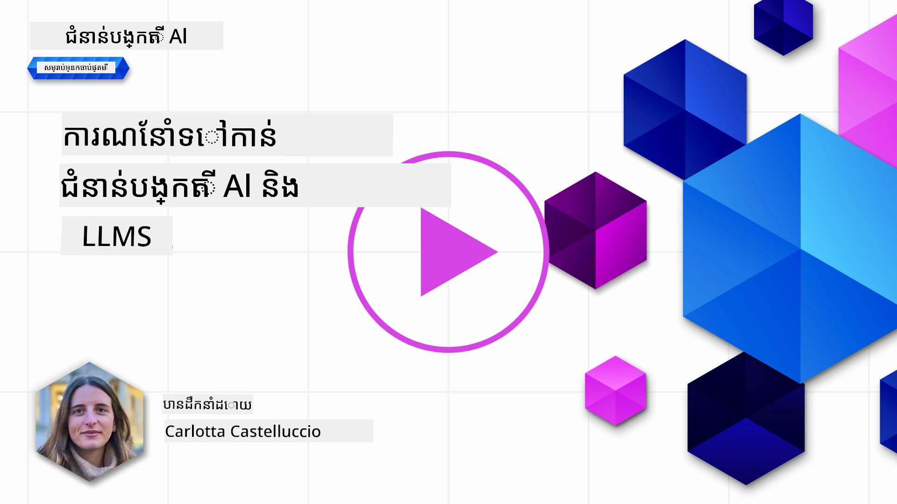
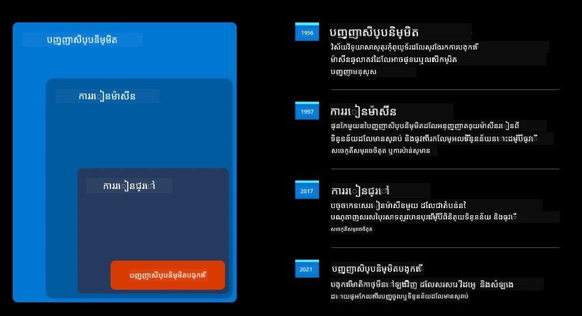
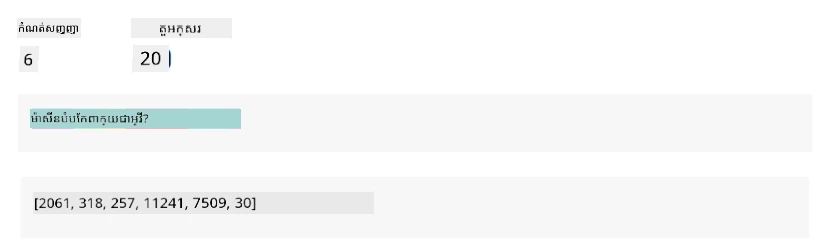
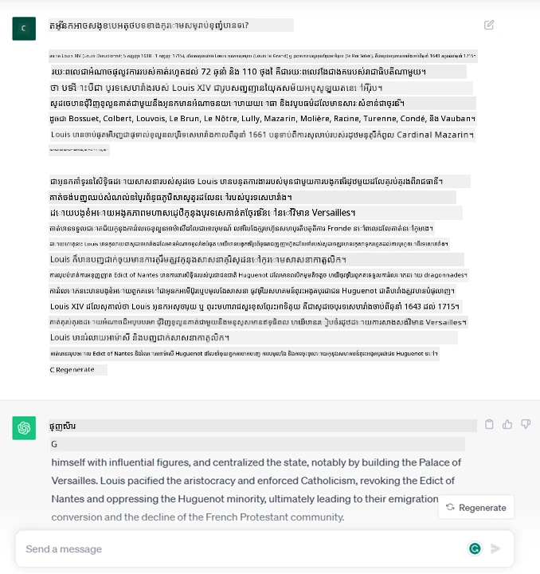
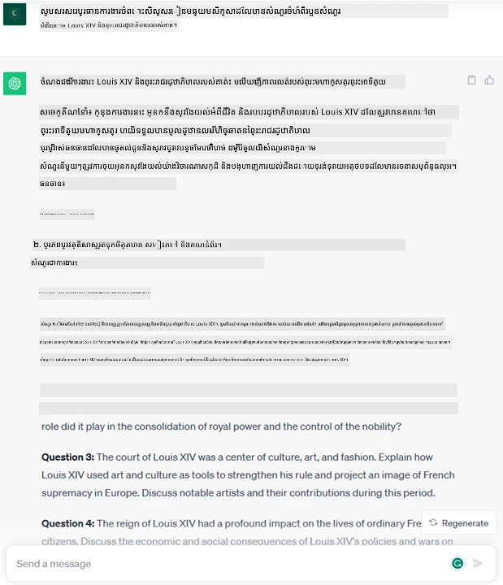
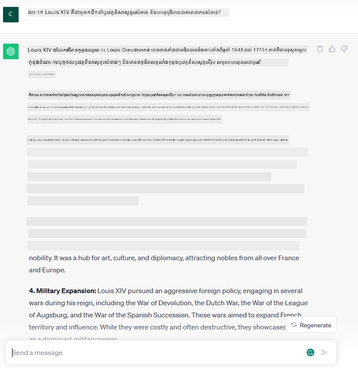
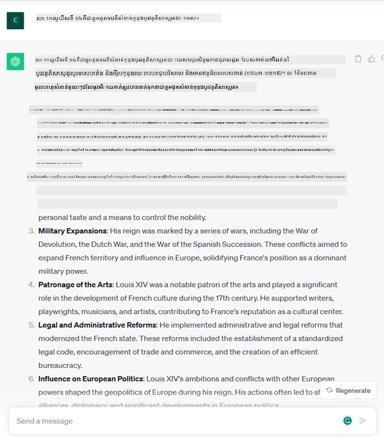
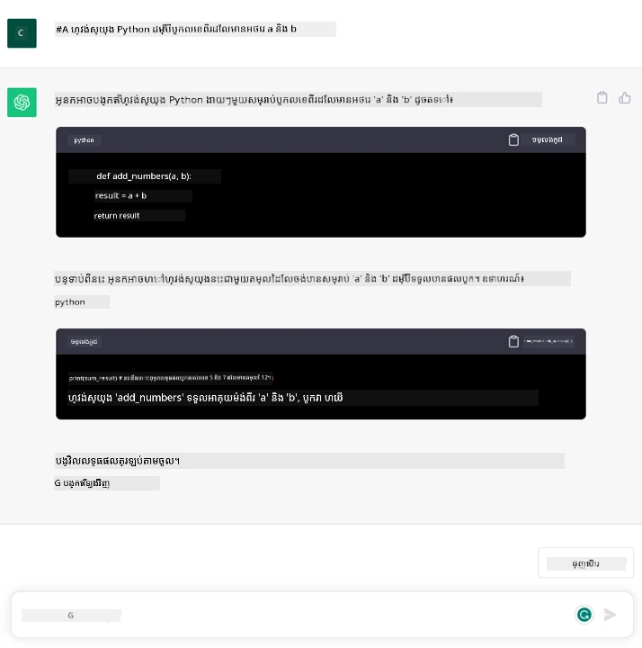

# ជំនួយពី Generative AI និងម៉ូដែលភាសាធំៗ

_(ចុចលើរូបភាពខាងលើដើម្បីមើលវីដេអូស្តីពីមេរៀននេះ)_

Generative AI គឺជាបច្ចេកវិទ្យាបញ្ញាសិប្បនិម្មិតដែលអាចបង្កើតអត្ថបទ រូបភាព និងប្រភេទមាតិកាផ្សេងទៀត។ អ្វីដែលធ្វើអោយវាជាបច្ចេកវិទ្យាដ៏អស្ចារ្យគឺវា​បន្ថែម​សិទ្ធិ​ស្មើគ្នាទៅក្នុង AI ដែលនរណាក៏អាចប្រើបាន ដោយគ្រាន់តែមានបញ្ជារជាអត្ថបទ ឬប្រយោគដែលសរសេរជាភាសាធម្មជាតិ។ មិនចាំបាច់ឲ្យអ្នករៀនភាសាដូចជា Java ឬ SQL ដើម្បីធ្វើអ្វីមួយដែលមានតម្លៃទេ គ្រាន់តែនិយាយភាសារបស់អ្នក បញ្ជាក់អ្វីដែលអ្នកចង់បាន ហើយនឹងមានសំណើមកពីម៉ូដែល AI។ ការដាក់ពាក្យប្រើ និងផលប៉ះពាល់គឺធំមហា អ្នកអាចសរសេរឬយល់របាយការណ៍ សរសេរប្រកាសកម្មវិធី និងទៀតឡើងទៀត ក្នុងរយៈពេលតែប៉ុន្មានវិនាទី។

នៅក្នុងកម្មវិធីបណ្តុះបណ្តាលនេះ យើងនឹងស្វែងយល់ពីរបៀបដែលស្តាតអាប់របស់យើងប្រើប្រាស់ generative AI ដើម្បីបើកល្បឿនថ្មីៗក្នុងវិស័យអប់រំ និងរបៀបដែលយើងដោះស្រាយបញ្ហាដែលជាលទ្ធផលវិជ្ជមាន និងគម្លាតដែលជាការរួមបញ្ចូលប្រទេសនិងដែនកំណត់បច្ចេកវិទ្យា។

## បំណាងជូនដំណឹង

មេរៀននេះនឹងគ្របដណ្តប់:

- ការណែនាំពីសង្គ្រាមខាងអាជីវកម្ម៖ គំនិត និងបេសកកម្មរបស់ស្តាតអាប់របស់យើង។
- Generative AI និងរបៀបដែលយើងឈានដល់ទិដ្ឋភាពបច្ចេកវិទ្យាបច្ចុប្បន្ន។
- ការដំណើរការខាងក្នុងរបស់ម៉ូដែលភាសាធំ។
- សមត្ថភាពសំខាន់ៗ និងការប្រើប្រាស់ជាក់ស្តែងនៃម៉ូដែលភាសាធំ។

## គោលបំណងរៀន

បន្ទាប់​ពី​បញ្ចប់​មេរៀន​នេះ អ្នក​នឹង​យល់​ដឹង​ពី៖

- តើ generative AI ជាអ្វី និងម៉ូដែលភាសាធំដូចម្តេចដែរដែលដំណើរការ។
- របៀបដែលអ្នកអាចប្រើប្រាស់ម៉ូដែលភាសាធំសម្រាប់ករណីប្រើប្រាស់ផ្សេងៗ ជាមួយនឹងការផ្តោតលើស្ថានភាពអប់រំ។

## ស្ថានភាព៖ ស្តាតអាប់អប់រំរបស់យើង

Generative Artificial Intelligence (AI) តំណាងឱ្យកំពូលបច្ចេកវិទ្យា AI ដែលកែលម្អដែនកំណត់នៃអ្វីដែលមុននេះត្រូវបានគិតថាពុំអាចធ្វើបាន។ ម៉ូដែល generative AI មានសមត្ថភាព និងប្រើប្រាស់ជាច្រើន ប៉ុន្តែក្នុងកម្មវិធីនេះ យើងនឹងស្វែងយល់ពីរបៀបដែលវាផ្លាស់ប្តូរក្នុងវិស័យអប់រំ តាមរយៈស្តាតអាប់មួយដែលជាការប្រៀបធៀប។ យើងនឹងហៅស្តាតអាប់នេះថា _ស្តាតអាប់របស់យើង_។ ស្តាតអាប់របស់យើងមានដំណើរការនៅក្នុងវិស័យអប់រំនឹងបេសកកម្មថ្មីមួយ

> _បង្កើតភាពងាយស្រួលក្នុងការសិក្សា នៅលើកម្រិតពិភពលោក ដើម្បីធានាការចូលដំណើរការដោយស្មើភាព និងផ្តល់បទពិសោធន៏សិក្សាផ្ទាល់ខ្លួនសម្រាប់អ្នករៀននិមួយៗ ដោយផ្អែកលើតម្រូវការរបស់ពួកគេ_។

ក្រុមការងារស្តាតអាប់របស់យើងយល់ថា ពួកយើងមិនអាចសម្រេចគោលដៅនេះបានទេប្រសិនបើយើងមិនប្រើឧបករណ៍ដ៏ពូកែបំផុតមួយក្នុងសម័យសព្វថ្ងៃគឺ ម៉ូដែលភាសាធំ (LLMs)។

Generative AI គ្រោងទុកថានឹងបង្កើតការប្តូរធំលើរបៀបដែលយើងរៀន និងបង្រៀននៅសព្វថ្ងៃ ដោយសិស្សមានគ្រូវីរុលរង់ចាំ ២៤ម៉ោងក្នុងមួយថ្ងៃ ដែលផ្តល់ព័ត៌មាននិងឧទាហរណ៍ធំទូលាយ ហើយគ្រូអាចប្រើឧបករណ៍ច្នៃប្រឌិតដើម្បីវាយតម្លៃសិស្ស និងផ្តល់មតិយោបល់។

ដើម្បីចាប់ផ្តើម មកកំណត់ន័យគន្លឹះ និងពាក្យទាក់ទងមួយចំនួនដែលយើងនឹងប្រើរយៈពេលធ្វើកម្មវិធីបណ្តុះបណ្តាល។

## តើធ្វើម៉េចបាន Generative AI?

ទោះបីជា​មាន​ការប្រកាសយ៉ាងពោរពេញទៅដោយកេរដណ្ដប់ចុងក្រោយពីម៉ូដែល generative AI ក៏ដោយ បច្ចេកវិទ្យានេះគឺបានសាងសង់រយៈពេលជាងបីទសវត្សលើកមុន ដែលកិច្ចស្រាវជ្រាវដំបូងត្រូវបានធ្វើឡើងចាប់តាំងពីទសវត្ស ១៩៦០។ ឥឡូវនេះយើងមាន AI ដែលមានសមត្ថភាពស្មារតីមនុស្សដូចជា ការសន្ទនា ដែលត្រូវបានបង្ហាញតាមរយៈ ឧទាហរណ៍ដូចជា [OpenAI ChatGPT](https://openai.com/chatgpt) ឬ [Bing Chat](https://www.microsoft.com/edge/features/bing-chat?WT.mc_id=academic-105485-koreyst) ដែលក៏ប្រើម៉ូដែល GPT សម្រាប់សន្ទនាស្វែងរកតាមវេបសាយ Bing។

ត្រឡប់ទៅក្រោយបន្តិច ម៉ូដែលដំបូងនៃ AI មានរូបរាងជាចאטបូត ដែលពឹងផ្អែកលើមូលដ្ឋានចំណេះដឹងនឹងចេញពីក្រុមអ្នកជំនាញ និងត្រូវបានបង្ហាញក្នុងកុំព្យូទ័រ។ ចម្លើយក្នុងមូលដ្ឋានចំណេះដឹងត្រូវបានបញ្ចេញខណៈពេលពាក្យគន្លឹះបង្ហាញនៅក្នុងអត្ថបទបញ្ចូល។
ប៉ុន្តែ វាបានច្បាស់ថាវិធីនេះមិនអាចពង្រីកបានល្អទេទៅតាមការអភិវឌ្ឍន៍។

### វិធីសាស្រ្តស្ថិតិយាស្ត្រសម្រាប់ AI ៖ ការរៀនម៉ាស៊ីន

ចំណុចប្តូរមួយបានចេញមកក្នុងទសវត្ស ៩០ ជាមួយការអនុវត្តវិធីសាស្រ្តស្ថិតិយាស្ត្រសម្រាប់វិភាគអត្ថបទ។ វានាំឲ្យមានការវិវឌ្ឍន៍អាល់ហ្គោរិធមថ្មីៗ ដូចជា ការរៀនម៉ាស៊ីន ដែលអាចរៀនគំរូពីទិន្នន័យដោយគ្មានការបញ្ជាក់ផ្ទាល់។ វិធីសាស្ត្រនេះអនុញ្ញាតឲ្យម៉ាស៊ីននាំមនុស្សឱ្យយល់ភាសា៖ ម៉ូដែលស្ថិតិត្រូវបានបណ្តុះបណ្តាលលើគូអត្ថបទ-ស្លាក ដែលអនុញ្ញាតឲ្យម៉ូដែលចាត់ថ្នាក់អត្ថបទមិនស្គាល់ជាមួយស្លាកដែលកំណត់រួច។

### បណ្តាញប្រព័ន្ធប្រសាទនិងជំនួយកំរឹតខ្ពស់

ក្នុងឆ្នាំកន្លងមក ការវិវឌ្ឍអ្នកគ្រប់គ្រងឧបករណ៍ ដែលអាចដោះស្រាយទិន្នន័យច្រើន និងគណនាចម្បងបានល្អជាងមុន បានលើកទឹកចិត្តកិច្ចស្រាវជ្រាវក្នុងវិស័យ AI ដែលនាំឲ្យមានអាល់ហ្គូរិធមរៀនម៉ាស៊ីនដ៏ចំរូងចំរាស់ហៅថាបណ្តាញប្រព័ន្ធប្រសាទ ឬ អាល់ហ្គូរិធមរៀនជ្រៅ។

បណ្តាញប្រព័ន្ធប្រសាទ (ជាពិសេសបណ្តាញប្រព័ន្ធប្រសាទបន្ត – RNNs) បានបង្កើនកម្រិតវិភាគភាសាធម្មជាតិឲ្យកាន់តែល្អ ដោយបង្ហាញន័យនៃអត្ថបទក្នុងរបៀបមានន័យជាងមុន ដោយផ្តោតបារម្ភលើContext នៃពាក្យក្នុងប្រយោគ។

នេះគឺជាបច្ចេកវិទ្យាដែលជួយវីរុលជំនួយកំពុងថ្ងៃសតវត្សថ្មីដែលមានជំនាញក្នុងការយល់ភាសាមនុស្ស កំណត់ត្រូវការមួយ ហើយអនុវត្តសកម្មភាព ដូចជារៀបចំចម្លើយចេញពីស្គ្រីបជាមុន ឬប្រើសេវាកម្មពីភាគីទីបី។

### ថ្ងៃនេះ​ Generative AI

នេះជារបៀបដែលយើងឈានដល់ Generative AI ដែលអាចហៅថា ជា​ផ្នែកមួយនៃការរៀនជ្រៅ។

បន្ទាប់ពីការស្រាវជ្រាវជាយូរជាងបីទសវត្សនៅក្នុងវិស័យ AI អាគារម៉ូដែលថ្មីមួយ ហៅថា _Transformer_ បានលើកលែងដែនកំណត់របស់ RNNs ដោយអាចទទួលបានលំដាប់អត្ថបទយូរជាងមុនជា input។ Transformer ដំណើរការលើមេកានិចការផ្តោតអារម្មណ៍ (attention mechanism) ដែលអនុញ្ញាតឲ្យម៉ូដែលផ្តល់ទំងន់ខុសគ្នាទៅលើអ៊ីនពុត ដែលមានន័យថា’ផ្តោតអារម្មណ៍’លើព័ត៌មានដ៏ពាក់ព័ន្ធជាងគេ ដោយមិនគិតថាអ៊ីនពុតស្ថិតនៅលំដាប់ណាក្នុងលំដាប់អត្ថបទ។

ម៉ូដែល generative AI ចុងក្រោយជាច្រើន – ហៅថា ម៉ូដែលភាសាធំ (LLMs) ព្រោះពួកវាដំណើរការជាមួយអត្ថបទ input និង output – គឺភាគច្រើនមូលដ្ឋានលើស្ថានទីនេះ។ អ្វីដែលគួរឱ្យចាប់អារម្មណ៍នោះគឺ ម៉ូដែលទាំងនេះបានបណ្តុះបណ្តាលលើទិន្នន័យធំពីប្រភពផ្សេងៗដូចជា សៀវភៅ អត្ថបទ និងវេបសាយ ដោយគ្មានស្លាក និងអាចប្ដូរតាមភារកិច្ចជាច្រើន និងបង្កើតអត្ថបទផ្តាច់មុខដោយមានសមរម្យភាពបង្កើត។ ដូច្នេះ ពួកវាមិនត្រឹមតែបង្កើនសមត្ថភាពយល់អត្ថបទ input តែប៉ុណ្ណោះទេ ក៏ជួយឲ្យពួកវាសរសេរជាចម្លើយដើមជាភាសាមនុស្សបានផងដែរ។

## ម៉ូដែលភាសាធំដំណើរការយ៉ាងដូចម្តេច?

បន្ទាប់មក យើងនឹងវិភាគម៉ូដែល Generative AI ផ្សេងៗ តែសម្រាប់ពេលនេះមកមើលរបៀបដែលម៉ូដែលភាសាធំដំណើរការ ជាពិសេស OpenAI GPT (Generative Pre-trained Transformer)។

- **Tokenizer, បម្លែងអត្ថបទទៅជាចំនួន**៖ ម៉ូដែលភាសាធំទទួលអត្ថបទជា input ហើយបង្កើតអត្ថបទជា output។ ប៉ុន្តែព្រោះពួកវាជាម៉ូដែលស្ថិតិ ពួកវាដំណើរការល្អជាងជាមួយលេខជាងអត្ថបទ។ ដូច្នេះផ្ទាល់មុនម៉ូដែលពួកវាត្រូវបានដំណើរការដោយ tokenizer។ Token គឺជាកំណត់អត្ថបទមួយ មានអក្សរជាច្រើន ហើយ tokenizer មានភារកិច្ចបំបែក input ទៅជាសំណុំ token តូចៗ។ បន្ទាប់មក token ត្រូវបានផ្គូផ្គងជាមួយ លេខសម្គាល់ token ដែលជាកូដលេខរបស់កំណត់អត្ថបទដើម។

- **ការព្យាករណ៍ token output**៖ ម៉ូដែលទទួល n token ជា input (ដោយ max n ផ្លាស់ប្តូរម៉ូដែលមួយទៅមួយ) ហើយអាចព្យាករណ៍ token មួយជាផលចេញ។ Token នោះត្រូវបានបញ្ចូលទៅជាមួយ input សម្រាប់ iteration បន្ទាប់ ដោយលំដាប់បង្ហាញជាប្រព័ន្ធបង្កើន ដើម្បីផ្តល់បទពិសោធន៍ល្អក្នុងការទទួលបានប្រយោគមួយ ឬច្រើនជាចម្លើយ។ នេះជាការពន្យល់ថាអ្នកប្រើ ChatGPT ម្តងៗអាចឃើញវាឈប់កណ្តាលប្រយោគ។

- **ដំណើរការជ្រើសរើស បន្ទាត់ប្រហែលភាព**៖ Token output ត្រូវបានជ្រើសរើសដោយម៉ូដែល អាស្រ័យលើប្រហែលភាពវាធ្លាប់បង្ហាញបន្ទាប់ពីលំដាប់អត្ថបទបច្ចុប្បន្ន។ ម៉ូដែលព្យាករណ៍អំពីការប្រហែលភាពលើtoken ទាំងអស់ដែលអាចជាការវាស់វែង។ ទោះជាយ៉ាងណា មិនមែន token ដែលមានប្រហែលភាពខ្ពស់បំផុតត្រូវបានជ្រើសជានិរន្តរភាព។ មានកម្រិតអក្សរសាស្រ្តដែលបន្ថែមដើម្បីឲ្យម៉ូដែលដំណើរការផ្ទុយពីលំដាប់លំដោយ ដោយមិនចេញថាស្រដៀងគ្នាគ្រប់លើinput ដូចគ្នា។ កម្រិតនោះអាចត្រូវបានគ្រប់គ្រងតាមទ្រង់ទ្រាយមួយហៅថា អង្កត់កម្តៅ (temperature)។

## តើយើងអាចប្រើម៉ូដែលភាសាធំដូចម្តេច?

ឥឡូវនេះដែលយើងយល់ពីដំណើរការខាងក្នុងម៉ូដែលភាសាធំ រីឯស្តាតអាប់របស់យើង មកមើលឧទាហរណ៍ជាក់ស្តែងពីកិច្ចការដែលប្រព្រឹត្តបានល្អ ដើម្បីសម្រួលស្ថានភាពអាជីវកម្មរបស់យើង។
យើងបាននិយាយថាសមត្ថភាពសំខាន់របស់ម៉ូដែលភាសាធំគឺ _បង្កើតអត្ថបទពីគ្មាន ឬពី input តែមួយ ដោយសរសេរជាភាសាធម្មជាតិ_។

តែ input និង output ជាអ្វី?
Input របស់ម៉ូដែលភាសាធំត្រូវបានហៅថា prompt ខណៈដែល output ហៅថា completion ដែលមានន័យថា របៀបម៉ូដែលបង្កើត token បន្ទាប់ដើម្បីបញ្ចប់ input បច្ចុប្បន្ន។ យើងនឹងសិក្សាអំពី prompt និងរបៀបទទួលបានលទ្ធផលល្អបំផុត ពីម៉ូដែល។ ប៉ុន្តែបច្ចុប្បន្ននេះ រាល់ prompt អាចរួមមាន៖

- **សំណើរ** ដែលបញ្ជាក់ប្រភេទ output ដែលយើងរំពឹងពីម៉ូដែល។ សំណើនេះម្តងមួយអាចរួមបញ្ចូលឧទាហរណ៍ ឬទិន្នន័យបន្ថែម។

  1. សង្ខេបអត្ថបទ អត្ថបទសៀវភៅ ការពិនិត្យផលិតផល និងជាច្រើនទៀត ទាំងការដកស្រង់ចំណុចសំខាន់ពីទិន្នន័យដែលមិនរៀបរយល្អ។
    
    
  
  2. គំនិតច្នៃប្រឌិត និងការរចនារបស់អត្ថបទ អត្ថបទស្រាវជ្រាវ ការងារទៅតាមកម្រិត ឬច្រើនទៀត។
      
     

- **សំណួរ** ដែលសួរជារបៀបនៃការសន្ទនាជាមួយភ្នាក់ងារ។

  

- ជំនុំ​អត្ថបទ​សម្រាប់បញ្ចប់ ដែលមិនច្បាស់ផ្ទាល់ដូចជាសំណើរសម្រាប់ជំនួយសរសេរ។

  

- ជំនុំ​កូដ ជាមួយនឹងសំណើរ​ក្នុងការពន្យល់ និងឯកសារយោង ឬមតិយោបល់សម្រាប់បង្កើតកូដអ្វីមួយធ្វើភារកិច្ចណាមួយជាក់លាក់។

  

ឧទាហរណ៍ខាងលើគឺសាមញ្ញ និងមិនមែនជាការបង្ហាញទាំងមូលនៃសមត្ថភាពម៉ូដែលភាសាធំទេ។ វាត្រូវបានបង្ហាញដើម្បីបង្ហាញកម្លាំងនៃ generative AI ជាពិសេសក្នុងបរិបទអប់រំ។

រួមទាំង ការផលិតរបស់ ម៉ូដែល generative AI មិនពេញលេញទៀងទាត់ ហើយនៅពេលខ្លះភាពច្នៃប្រឌិតនៃម៉ូដែលអាចបង្កការទម្លាក់ថាផលិតផលជាប្រភេទពាក្យដែលអ្នកប្រើប្រាស់អាចយល់ថាជាការលួចធ្វើជាការពិត ឬអាចបង្កការភាន់ច្រឡំ។ Generative AI មិនត្រឹមតែមានបញ្ញា - យ៉ាងហោចណាស់ក្នុងន័យទូលំទូលាយរបស់បញ្ញា ជារួមទាំងការចងចាំ សេចក្តីយល់ឃើញចម្រាញ់ និងបញ្ញាមនុស្ស - វាមិនឆ្លាតឆ្លួន នឹងមិនអាចទុកចិត្តបានបានពេញលេញ នៅពេលមានការបញ្ចូលព័ត៌មានមិនត្រឹមត្រូវ និងសេចក្តីថ្លែងការណ៍ ខុសការពិត ។ មេរៀនបន្ទាប់របស់យើងនឹងដោះស្រាយលើកញ្ចប់កំណត់នានា ទាំងនេះ និងមើលថាតើយើងអាចធ្វើអ្វីបានដើម្បីកាត់បន្ថយដូច្នេះ។

## កិច្ចការចាត់ចែង

កិច្ចការរបស់អ្នកគឺអានបន្ថែមអំពី [generative AI](https://en.wikipedia.org/wiki/Generative_artificial_intelligence?WT.mc_id=academic-105485-koreyst) ហើយព្យាយាមស្វែងរកតំបន់ណាដែលអ្នកចង់បន្ថែម generative AI នៅថ្ងៃនេះ ដែលមិនមានទាំងនេះ។ តើផលប៉ះពាល់នឹងខុសពីការធ្វើតាមវិធីតាមអតីតកាលយ៉ាងដូចម្តេច? តើអ្នកអាចធ្វើអ្វីដែលមិនធ្លាប់ធ្វើមុនមែនទេ ឬឆាប់រហ័សជាងមុន? សរសេរពិចារណាអំពីស្តាតអាប់ AI សុបិនរបស់អ្នកក្នុងរយៈពេល៣០០ពាក្យ ជាមួយចំណងជើងដូចជា "បញ្ហា", "របៀបប្រើ AI", "ផលប៉ះពាល់" និងមានផែនការអាជីវកម្មបន្ថែមបើចង់។

បើអ្នកបានបំពេញកិច្ចការនេះ ប្រហែលជាអ្នកបានត្រៀមខ្លួនសម្រាប់ដាក់ពាក្យចូលកម្មវិធីផ្សព្វផ្សាយ Microsoft, [Microsoft for Startups Founders Hub](https://www.microsoft.com/startups?WT.mc_id=academic-105485-koreyst) ដែលផ្តល់ឥណទានសម្រាប់ Azure, OpenAI, ប្រឹក្សាណារិក និងទៀត។

## ពិនិត្យចំណេះដឹង

តើអ្វីជាការពិតអំពីម៉ូដែលភាសាធំ?

1. អ្នកទទួលបានចម្លើយដូចដើមគ្រប់ពេល។
1. វាធ្វើអ្វីៗបានល្អ សមត្ថភាពលើការបូកលេខ បង្កើតកូដបណ្តឹង។
1. ចម្លើយអាចផ្លាស់ប្តូរពីពេលទៅពេល ទោះបីឲ្យប្រើPromptដូចគ្នា។ វាជ្រើសរើសល្អក្នុងការផ្តល់សេចក្តីព្រាងដំបូង តែអ្នកត្រូវធ្វើការ​កែលម្អលើលទ្ធផលបន្ត។

ចម្លើយ៖ ៣, ម៉ូដែល LLM មិនមែន deterministic ទេ ចម្លើយអាចផ្លាស់ប្តូរ តែអ្នកអាចគ្រប់គ្រងការផ្លាស់ប្តូរនេះតាមកម្រិតអង្កត់កម្តៅ។ អ្នកមិនគួររំពឹងថាវាធ្វើបានប្រាកដល្អទាំងស្រុងទេ មិនថានៅផ្នែកណា វាអាចជួយអ្នកធ្វើការក្នុងជំហានដំបូងដោយគឺប្រកបដោយគុណភាព ដែលអ្នកអាចបន្តកែលម្អជាបន្តបន្ទាប់។

## ការងារល្អ! បន្តដំណើរ

បន្ទាប់ពីបញ្ចប់មេរៀននេះ សូមពិនិត្យកម្រងការរៀន [Generative AI Learning collection](https://aka.ms/genai-collection?WT.mc_id=academic-105485-koreyst) របស់យើងដើម្បីបន្តរំញោចចំណេះដឹង Generative AI របស់អ្នក!
ចូលទៅកាន់មេរៀនទី ២ ដែលយើងនឹងមើលពីរបៀប [ស្វែងរក និងប្រៀបធៀបប្រភេទ LLM ផ្សេងៗ](../02-exploring-and-comparing-different-llms/README.md?WT.mc_id=academic-105485-koreyst)!

---

<!-- CO-OP TRANSLATOR DISCLAIMER START -->
**ការបដិសេធ**៖  
ឯកសារនេះត្រូវបានបម្លែងភាសាដោយប្រើសេវាកម្មបកប្រែ AI [Co-op Translator](https://github.com/Azure/co-op-translator)។ ខណៈដែលយើងខិតខំរកភាពត្រឹមត្រូវ សូមយកចិត្តទុកដាក់ថា ការបកប្រែដោយស្វ័យប្រវត្តិអាចមានកំហុសឬប្រសិទ្ធិភាពខ្វះខាត។ ឯកសារដើមនៅក្នុងភាសាមូលដ្ឋានរបស់ខ្លួនគួรถูกគេចាត់ទុកថាជាដើមដំណើរការដ៏ល្អបំផុត។ សម្រាប់ព័ត៌មានដែលមានសារៈសំខាន់ណាស់ ការបកប្រែដោយអ្នកជំនាញមនុស្សត្រូវបានផ្តល់អនុសាសន៍។ យើងមិនទទួលខុសត្រូវចំពោះការយល់ច្រឡំ ឬការបកស្រាយខុសប្លែកណាមួយដែលកើតមានពីការប្រើប្រាស់ការបកប្រែនេះឡើយ។
<!-- CO-OP TRANSLATOR DISCLAIMER END -->