# ការស្វែងរក និងប្រៀបធៀប LLMs ផ្សេងៗគ្នា

[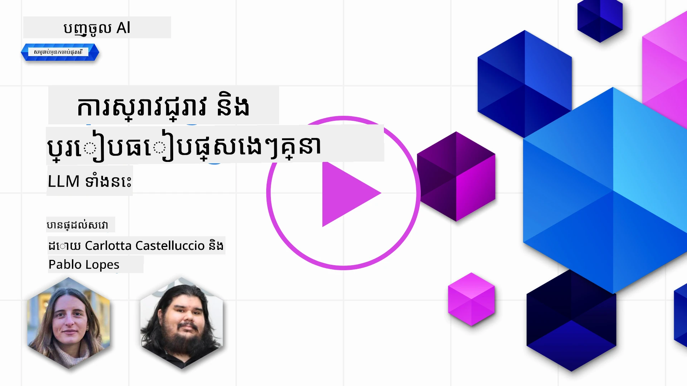](https://youtu.be/KIRUeDKscfI?si=8BHX1zvwzQBn-PlK)

> _ចុចរូបភាពខាងលើដើម្បីមើលវីដេអូរបស់មេរៀននេះ_

ជាមួយមេរៀនមុននេះ យើងបានឃើញថា AI បង្កើតវត្ថុថ្មីកំពុងផ្លាស់ប្ដូរផែនដីបច្ចេកវិទ្យា ដូចម្ដេចម៉ូដែលភាសាធំ (LLMs) ធ្វើការ និងរបៀបអាជីវកម្មមួយ - ដូចជាស្តាផស្តារ្តារបស់យើង - អាចអនុវត្តពួកវាទៅប្រើប្រាស់ក្នុងករណីពួកគេ ហើយរីកចម្រើន! ក្នុងជំពូកនេះ យើងកំពុងព្យាយាមប្រៀបធៀប និងធ្វើអោយខុសគ្នារវាងប្រភេទនៃម៉ូដែលភាសាធំ (LLMs) ដើម្បីយល់ពីអត្ថប្រយោជន៍ និងគុណវិបត្តិរបស់ពួកវា។

ជំហានបន្ទាប់នៅក្នុងការធ្វើដំណើររបស់ស្តាតអាប់របស់យើងគឺស្វែងរកផែនដីបច្ចុប្បន្នរបស់ LLMs ហើយយល់ថាដូចម្តេចម៉ូដែលណាដែលសមរម្យសម្រាប់ករណីប្រើប្រាស់របស់យើង។

## អារម្មណ៍បើក

មេរៀននេះនឹងគ្របដណ្តប់៖

- ប្រភេទ LLMs ផ្សេងៗក្នុងផែនដីបច្ចុប្បន្ន។
- ការធ្វើតេស្ត ម្ដងម្ដាយ និងប្រៀបធៀបម៉ូដែលផ្សេងៗសម្រាប់ករណីប្រើប្រាស់របស់អ្នកក្នុង Azure។
- របៀបដាក់សេវាកម្មម៉ូដែលភាសាធំ។

## គោលបំណងរក្សាទុក

បន្ទាប់ពីបញ្ចប់មេរៀននេះ អ្នកនឹងអាច៖

- ជ្រើសរើសម៉ូដែលសមរម្យសម្រាប់ករណីប្រើប្រាស់របស់អ្នក។
- យល់ពីរបៀបធ្វើតេស្ត បញ្ចូល និងប្រសើរឡើងប្រសិទ្ធភាពម៉ូដែលរបស់អ្នក។
- ដឹងពីរបៀបដែលអាជីវកម្មដាក់ម៉ូដែលជាសេវាកម្ម។

## យល់ពីប្រភេទ LLMs ផ្សេងៗ

LLMs អាចមានចំណាត់ថ្នាក់ច្រើនដោយផ្អែកលើសំណុំរចនាសម្ព័ន្ធ, ទិន្នន័យបណ្តុះបណ្តាល និងករណីប្រើប្រាស់របស់ពួកវា។ ការយល់ដឹងពីភាពខុសគ្នាទាំងនេះនឹងជួយឲ្យស្តាតអាប់របស់យើងជ្រើសរើសម៉ូដែលល្អសម្រាប់ស្ថានភាព និងយល់ពីរបៀបធ្វើតេស្ត បញ្ចូល និងបង្កើនប្រសិទ្ធភាព។

មានម៉ូដែល LLM ប្រែប្រួលជាច្រើន ប្រភេទម៉ូដែលដែលអ្នកជ្រើសរើសអាស្រ័យលើអ្វីដែលអ្នកចង់ប្រើប្រាស់ពួកវា ទិន្នន័យរបស់អ្នក តើអ្នករៀបចំការបង់ប្រាក់ទៅលើវាប៉ុន្មាន ហើយផ្សេងៗទៀត។

ដោយផ្អែកលើបំណងប្រើម៉ូដែលសម្រាប់អត្ថបទ, សំលេង, វីដេអូ, ការបង្កើតរូបភាព និងដូច្នោះអ្នកអាចជ្រើសរើសប្រភេទម៉ូដែលផ្សេងៗ។

- **សំលេង និងការទទួលសំឡេង**។ សម្រាប់គោលបំណងនេះ ម៉ូដែលប្រភេទ Whisper គឺជាជម្រើសល្អ ព្រោះវាជាម៉ូដែលប្រើបានទូទៅ និងមានគោលបំណងសម្រាប់ការទទួលសំលេង។ វាត្រូវបានបណ្តុះឡើងលើសំលេងចម្រុះ ហើយអាចធ្វើការទទួលសំលេងច្រើនភាសា។ សូមស្វែងយល់បន្ថែមអំពី [ម៉ូដែលប្រភេទ Whisper នៅទីនេះ](https://platform.openai.com/docs/models/whisper?WT.mc_id=academic-105485-koreyst)។

- **ការបង្កើតរូបភាព**។ សម្រាប់ការបង្កើតរូបភាព DALL-E និង Midjourney គឺជាជម្រើសដែលល្បីណាស់។ DALL-E ត្រូវបានផ្ដល់ដោយ Azure OpenAI។ [អានបន្ថែមអំពី DALL-E នៅទីនេះ](https://platform.openai.com/docs/models/dall-e?WT.mc_id=academic-105485-koreyst) និងនៅជំពូក 9 នៃកម្មវិធីសិក្សានេះផងដែរ។

- **ការបង្កើតអត្ថបទ**។ ម៉ូដែលភាគច្រើនត្រូវបានបណ្តុះសម្រាប់ការបង្កើតអត្ថបទ ហើយអ្នកមានជម្រើសច្រើនចាប់ពី GPT-3.5 ដល់ GPT-4។ ពួកវាមានតម្លៃខុសគ្នា ហើយ GPT-4 គឺថ្លៃបំផុត។ គួរតែពិនិត្យមើល [Azure OpenAI playground](https://oai.azure.com/portal/playground?WT.mc_id=academic-105485-koreyst) ដើម្បីវាយតម្លៃថាម៉ូដែលណាដែលសមរម្យជាងសម្រាប់តម្រូវការរបស់អ្នក ក្នុងការអនុវត្តន៍និងតម្លៃ។

- **មនុស្សច្រើនប្រភេទទិន្នន័យ (Multi-modality)**។ ប្រសិនបើអ្នកចង់គ្រប់គ្រងទិន្នន័យប្រភេទច្រើនទាំងក្នុងinput និង output អ្នកអាចពិនិត្យម៉ូដែលដូចជា [gpt-4 turbo ជាមួយភ្នែក ឬ gpt-4o](https://learn.microsoft.com/azure/ai-services/openai/concepts/models#gpt-4-and-gpt-4-turbo-models?WT.mc_id=academic-105485-koreyst) – ដែលជាការចេញផ្សាយថ្មីៗពី OpenAI – ដែលអាចភ្ជាប់ការបំលែងភាសាប្រពៃណីទៅការយល់ដឹងពីរូបភាព សម្រាប់អន្តរកម្មតាមចំណុចមុខមួយច្រើន។

ការជ្រើសរើសម៉ូដែលមានន័យថាអ្នកទទួលបានសមត្ថភាពមូលដ្ឋានខ្លះៗ ប៉ុន្តែវាអាចមិនគ្រប់គ្រាន់ទេ។ ជាញឹកញាប់ អ្នកមានទិន្នន័យជាក់លាក់ក្រុមហ៊ុនដែលត្រូវបញ្ជាក់ឲ្យ LLM ស្គាល់។ មានជម្រើសច្រើនចំពោះរបៀបនោះ ដែលនឹងពិភាក្សានៅផ្នែកក្រោយៗ។

### ម៉ូដែលមូលដ្ឋាន (Foundation Models) ប្រឆាំងនឹង LLMs

ពាក្យ Foundation Model ត្រូវបាន [អ្នកស្រាវជ្រាវនៅ Stanford បង្កើតឡើង](https://arxiv.org/abs/2108.07258?WT.mc_id=academic-105485-koreyst) ហើយបានកំណត់ថា ជាម៉ូដែល AI មួយដែលបណ្តាលតាមលក្ខខណ្ឌខ្លះៗ ដូចជា៖

- **​ត្រូវបានបណ្តុះដោយការសិក្សាដោយខ្លួនឯង (unsupervised learning) ឬការសិក្សាដោយខ្លួនឯងជំនួយ (self-supervised learning)** មានន័យថាពួកវាត្រូវបានបណ្តុះលើទិន្នន័យបណ្ដោះអាសន្នមិនបានស្លាក (unlabeled multi-modal data) ហើយមិនត្រូវការការបញ្ជាក់ដោយមនុស្សសម្រាប់ដំណើរការបណ្តុះបណ្តាលឡើយ។
- **វាជាម៉ូដែលធំកំពូលណាស់**, ដែលផ្អែកលើបណ្តាញប្រសាទជ្រៅ ដែលបានបណ្តុះនៅលើប៉ារ៉ាម៉ែត្រជាពាន់លាន។
- **វាត្រូវបានគេរំពឹកជាមូលដ្ឋានសម្រាប់ម៉ូដែលផ្សេងៗ**, មានន័យថាអាចប្រើជាចំណុចចាប់ផ្តើមសម្រាប់ម៉ូដែលផ្សេងទៀត ដែលអាចធ្វើបានតាមរយៈការបំប៉នបន្ថែម (fine-tuning)។

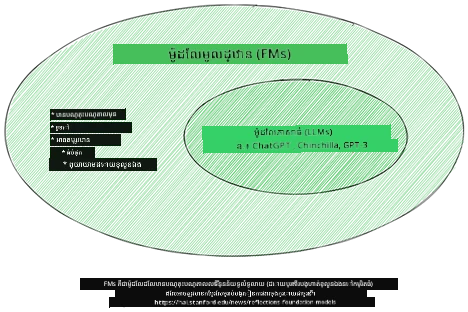

ប្រភពរូបភាព៖ [Essential Guide to Foundation Models and Large Language Models | by Babar M Bhatti | Medium
](https://thebabar.medium.com/essential-guide-to-foundation-models-and-large-language-models-27dab58f7404)

ដើម្បីបកស្រាយភាពខុសគ្នានេះបន្ថែមទៀត ចាំយក ChatGPT ជាឧទាហរណ៍។ ដើម្បីបង្កើតជំនាន់ដំបូងរបស់ ChatGPT ម៉ូដែលមួយឈ្មោះ GPT-3.5 បានប្រើជាមូលដ្ឋាន។ មានន័យថា OpenAI បានប្រើទិន្នន័យជាក់លាក់សម្រាប់ជជែក ដើម្បីបង្កើតជំនាន់ដែលបានបង្រួមតំរូវដោយឯកសារពិសេសនៃ GPT-3.5 ដែលមានជំនាញល្អក្នុងស្ដារភាសាជជែក រួមមាន chatbot។

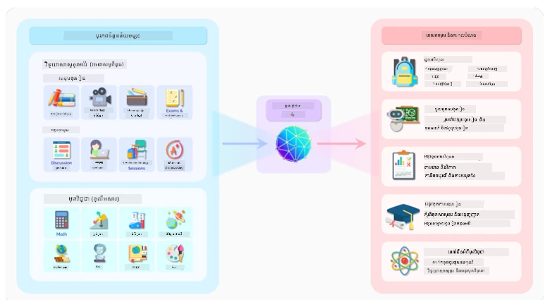

ប្រភពរូបភាព៖ [2108.07258.pdf (arxiv.org)](https://arxiv.org/pdf/2108.07258.pdf?WT.mc_id=academic-105485-koreyst)

### ម៉ូដែលប្រភពបើក (Open Source) ប្រឆាំងនឹងម៉ូដែលកម្មសិទ្ធិ (Proprietary Models)

វិធីមួយទៀតក្នុងការចំណាត់ថ្នាក់ LLM គឺមើលថាតើម៉ូដែលគឺប្រភពបើក ឬកម្មសិទ្ធិ។

ម៉ូដែលប្រភពបើកគឺជាម៉ូដែលដែលប្រកាសជាសាធារណៈ ហើយអាចប្រើដោយនរណាក៏បាន។ ពួកគេច្រើនធ្វើឡើងដោយក្រុមហ៊ុនដែលបង្កើតវា ឬសហគមន៍ស្រាវជ្រាវ។ ម៉ូដែលទាំងនេះអនុញ្ញាតឲ្យពិនិត្យ បញ្ជា និងប្ដូរតាមតម្រូវការសម្រាប់ប្រភេទប្រើប្រាស់ LLM ជាច្រើន។ ទោះជាយ៉ាងណា ពួកវាមិនត្រូវបានបង្កើតសម្រាប់ប្រើប្រាស់ក្នុងផលិតភាពជាចម្បង ហើយប្រសិទ្ធភាពអាចមិនជាប់ធ្នូដូចម៉ូដែលកម្មសិទ្ធិទេ។ លុះត្រាតែថវិកាសម្រាប់ម៉ូដែលប្រភពបើកមានកំណត់ ហើយបង្រួមជើងនេះអាចមិនបានថែរក្សាយូរបោះទេ ឬមិនបានធ្វើបច្ចុប្បន្នភាពជាមួយស្រាវ​ជ្រាវថ្មីៗ។ ឧទាហរណ៍ម៉ូដែលប្រភពបើកដែលល្បីៗរួមមាន [Alpaca](https://crfm.stanford.edu/2023/03/13/alpaca.html?WT.mc_id=academic-105485-koreyst), [Bloom](https://huggingface.co/bigscience/bloom) និង [LLaMA](https://llama.meta.com)។

ម៉ូដែលកម្មសិទ្ធិគឺជាម៉ូដែលដែលជាប្រភពកម្មសិទ្ធិរបស់ក្រុមហ៊ុនមួយ និងមិនបានប្រកាសជាសាធារណៈទេ។ ម៉ូដែលទាំងនេះជាច្រើនមានគោលបំណងសម្រាប់ប្រើប្រាស់ផលិតភាព។ ទោះយ៉ាងណា ពួកវាមិនអនុញ្ញាតឲ្យពិនិត្យ បញ្ជា ឬប្ដូរតាមប្រភេទប្រើប្រាស់ផ្សេងទៀតទេ។ ហើយពួកវាមិនតែងតែមានជូនដោយឥតគិតថ្លៃ ទាមទារការជាវ ឬទូទាត់សម្រាប់ប្រើ។ លោះត្រាតែអ្នកប្រើប្រាស់មិនមានការគ្រប់គ្រងលើទិន្នន័យដែលបានប្រើក្នុងការបណ្តុះឡើយ ដែលមានន័យថា ពួកគេចាំបាច់គួរអោយទុកចិត្តម្ចាស់ម៉ូដែលក្នុងការប្រុងប្រយ័ត្នលើភាពឯកជននៃទិន្នន័យ និងការប្រើប្រាស់ AI ដោយមានទំនួលខុសត្រូវ។ ឧទាហរណ៍ម៉ូដែលកម្មសិទ្ធិរួមមាន [ម៉ូដែល OpenAI](https://platform.openai.com/docs/models/overview?WT.mc_id=academic-105485-koreyst), [Google Bard](https://sapling.ai/llm/bard?WT.mc_id=academic-105485-koreyst) ឬ [Claude 2](https://www.anthropic.com/index/claude-2?WT.mc_id=academic-105485-koreyst)។

### ការតំណាង (Embedding) ប្រឆាំងនឹង ការបង្កើតរូបភាព ប្រឆាំងនឹង ការបង្កើតអត្ថបទ និងកូដ

LLMs ក៏អាចចែកចេញជាប្រភេទតាមលទ្ធផលដែលពួកវាបង្កើត។

ការតំណាង (Embeddings) គឺជាសំណុំម៉ូដែលដែលអាចបម្លែងអត្ថបទទៅជាទ្រង់ទ្រាយលេខវិទ្យា មួយដែលហៅថា embedding ដែលជាតំណាងលេខវិទ្យានៃអត្ថបទបញ្ចូល។ Embeddings ងាយស្រួលសម្រាប់ម៉ាស៊ីនក្នុងការយល់ទំនាក់ទំនងរវាងពាក្យ ឬ ប្រយោគ និងអាចប្រើជាទិន្នន័យបញ្ចូលសម្រាប់ម៉ូដែលផ្សេងៗ ដូចជា ម៉ូដែលចំណាត់ថ្នាក់ ឬ ម៉ូដែលកង់ធ័រ ដែលមានប្រសិទ្ធភាពល្អលើទិន្នន័យលេខវិទ្យា។ ម៉ូដែល embedding ភាគច្រើនត្រូវបានប្រើសម្រាប់ការបម្លែងសម្រាប់ការសិក្សា ដែលម៉ូដែលត្រូវបានបង្កើតសម្រាប់ភារកិច្ចជំនួស ដែលមានទិន្នន័យមានច្រើន ហើយបន្ទាប់មកទម្ងន់ម៉ូដែល (embeddings) ត្រូវបានប្រើឡើងវិញសម្រាប់ភារកិច្ចក្រោម។ ឧទាហរណ៍មួយនៃប្រភេទនេះគឺ [OpenAI embeddings](https://platform.openai.com/docs/models/embeddings?WT.mc_id=academic-105485-koreyst)។

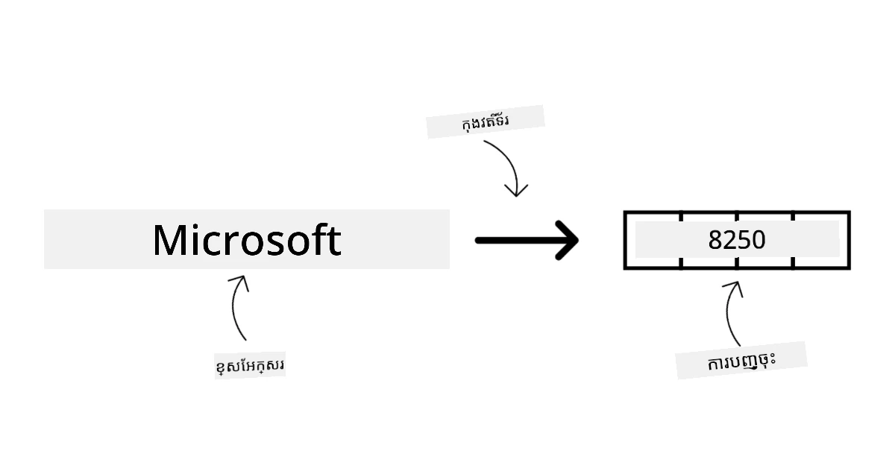

ម៉ូដែលបង្កើតរូបភាពគឺម៉ូដែលដែលបង្កើតរូបភាព។ ម៉ូដែលទាំងនេះភាគច្រើនត្រូវបានប្រើសម្រាប់កែប្រែរូបភាព សមុទ្ររូបភាព និងបម្លែងរូបភាព។ ម៉ូដែលបង្កើតរូបភាពភាគច្រើនត្រូវបានបណ្តុះលើទិន្នន័យរូបភាពច្រើន ដូចជា [LAION-5B](https://laion.ai/blog/laion-5b/?WT.mc_id=academic-105485-koreyst) ហើយអាចប្រើបង្កើតរូបភាពថ្មី ឬកែសម្រួលរូបភាពមានស្រាប់ដោយបច្ចេកទេស inpainting, super-resolution, និង colorization។ ឧទាហរណ៍រួមមាន [DALL-E-3](https://openai.com/dall-e-3?WT.mc_id=academic-105485-koreyst) និង [ម៉ូដែល Stable Diffusion](https://github.com/Stability-AI/StableDiffusion?WT.mc_id=academic-105485-koreyst)។

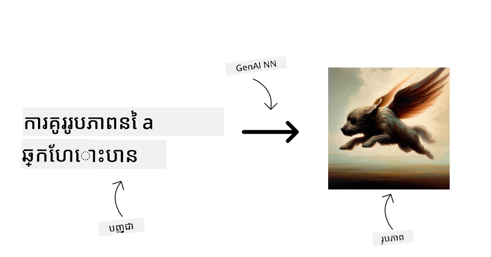

ម៉ូដែលបង្កើតអត្ថបទ និងកូដគឺម៉ូដែលដែលបង្កើតអត្ថបទ ឬកូដ។ ម៉ូដែលទាំងនេះភាគច្រើនប្រើសម្រាប់សង្ខេបអត្ថបទ, បកប្រែ, និងឆ្លើយសំណួរ។ ម៉ូដែលបង្កើតអត្ថបទភាគច្រើនត្រូវបានបណ្តុះលើទិន្នន័យអត្ថបទច្រើន ដូចជា [BookCorpus](https://www.cv-foundation.org/openaccess/content_iccv_2015/html/Zhu_Aligning_Books_and_ICCV_2015_paper.html?WT.mc_id=academic-105485-koreyst) ហើយអាចប្រើបង្កើតអត្ថបទថ្មី ឬឆ្លើយសំណួរ។ ម៉ូដែលបង្កើតកូដ ដូចជា [CodeParrot](https://huggingface.co/codeparrot?WT.mc_id=academic-105485-koreyst) ភាគច្រើនត្រូវបានបណ្តុះលើទិន្នន័យកូដច្រើន ដូចជា GitHub ហើយអាចប្រើបង្កើតកូដថ្មី ឬព្យួរកំហុសក្នុងកូដដែលមានស្រាប់។

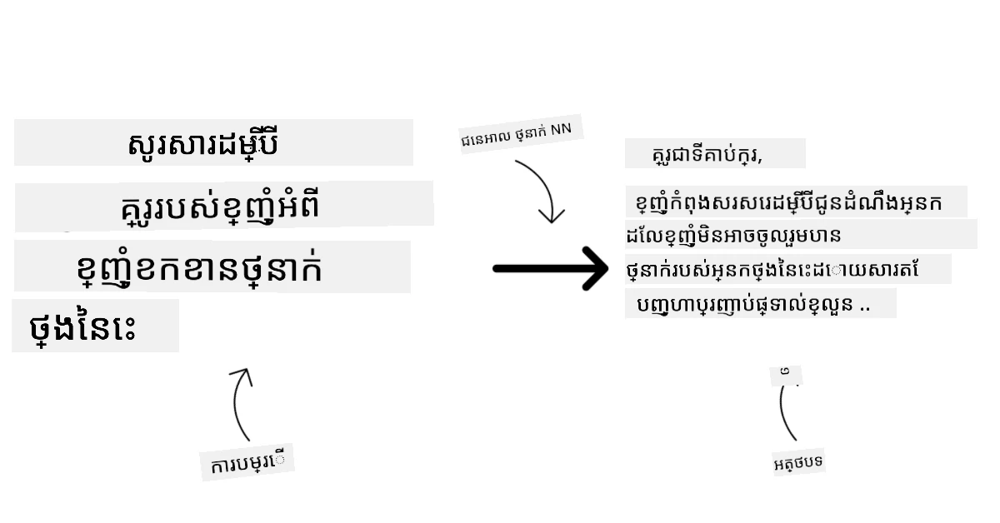

### Encoder-Decoder ប្រឆាំងនឹង Decoder ប៉ុណ្ណោះ

ដើម្បីនិយាយអំពីប្រភេទរចនាសម្ព័ន្ធផ្សេងៗនៃ LLMs យើងអាចប្រើសមាហរណកម្មនេះ។

ស្រមៃថា អ្នកគ្រប់គ្រងរបស់អ្នកបានផ្ដល់ភារកិច្ចសរសេរសំណួរចម្លើយសម្រាប់សិស្ស។ អ្នកមានមិត្តរួមការងារទៅពីរនាក់; មនុស្សម្នាក់គ្រប់គ្រងការបង្កើតមាតិកា ហើយមួយគ្រប់គ្រងការត្រួតពិនិត្យមាតិកា។

អ្នកបង្កើតមាតិកាគឺដូចម៉ូដែល Decoder only ដែលអាចមើលប្រធានបទ និងមើលអ្វីដែលអ្នកបានសរសេរហើយបន្ទាប់អាចសរសេរពីវាសម្រាប់វគ្គសិក្សា។ ពួកគេឆ្នើមក្នុងការសរសេរមាតិកាដែលទាក់ទាញនិងផ្តល់ព័ត៌មាន ប៉ុន្តែមិនចេះយល់អំពីប្រធានបទនិងគោលបំណងសិក្សាទេ។ ឧទាហរណ៍ម៉ូដែល Decoder គឺ ម៉ូដែល GPT ស៊េរី ដូចជា GPT-3។

អ្នកត្រួតពិនិត្យគឺដូចម៉ូដែល Encoder only ដែលសូមមើលវគ្គសិក្សា និងចម្លើយ ដឹងទំនាក់ទំនងរវាងពួកវា និងយល់អត្ថបទ ប៉ុន្តែមិនចេះបង្កើតមាតិកា។ ឧទាហរណ៍ម៉ូដែល Encoder only គឺ BERT។

ស្រមៃថាយើងអាចមាននរណាម្នាក់ដែលអាចបង្កើត និងត្រួតពិនិត្យសំណួរចម្លើយនេះ ដែលជាម៉ូដែល Encoder-Decoder។ មានឧទាហរណ៍ដូចជា BART និង T5។

### សេវាកម្ម ប្រឆាំងនឹង ម៉ូដែល

ឥឡូវនេះ យើងនិយាយអំពីភាពខុសគ្នារវាងសេវាកម្ម និងម៉ូដែល។ សេវាកម្មគឺជាផលិតផលដែលផ្ដល់ដោយអ្នកផ្ដល់សេវាកម្ម Cloud ហើយជារួមបញ្ចូលម៉ូដែល ទិន្នន័យ និងឧបករណ៍ផ្សេងទៀត។ ម៉ូដែលគឺជាធាត្រីសំខាន់នៃសេវាកម្ម ហើយភាគច្រើនជាម៉ូដែលមូលដ្ឋាន ដូចជា LLM។

សេវាកម្មភាគច្រើនត្រូវបានបង្កើតឲ្យសមស្របសម្រាប់ការប្រើប្រាស់ផលិតភាព ហើយងាយស្រួលប្រើជាងម៉ូដែល តាមរយៈចំណុចចូលប្រើប្រព័ន្ធក្រាហ្វិក។ ទោះយ៉ាងណា សេវាកម្មមិនភាគច្រើនមានជូនដោយឥតគិតថ្លៃទេ ហើយអាចត្រូវការជាវ ឬបង់ប្រាក់ សម្រាប់ប្រើប្រាស់ បង្រៀនលើឧបករណ៍ និងធនធានរបស់ម្ចាស់សេវាកម្ម បង្កើនប្រសិទ្ធភាពនិងបណ្តោយស្រួល។ ឧទាហរណ៍សេវាកម្មគឺ [Azure OpenAI Service](https://learn.microsoft.com/azure/ai-services/openai/overview?WT.mc_id=academic-105485-koreyst) ដែលផ្ដល់ផែនការបង់ប្រាក់ទៅតាមការប្រើប្រាស់ មានន័យថាអ្នកប្រើប្រាស់ត្រូវបង់ប្រាក់តាមបរិមាណប្រើប្រាស់។ បន្ថែមពីនេះ Azure OpenAI Service ផ្ដល់សុវត្ថិភាពជាដំណាក់កាលសេស៊ិន និងស៊ុម AI ដែលមានទំនួលខុសត្រូវលើសមត្ថភាពម៉ូដែល។

ម៉ូដែលគ្រាន់តែជាបណ្តាញប្រសាទ មានប៉ារ៉ាម៉ែត្រ ទំងន់ និងផ្សេងៗ។ អនុញ្ញាតឲ្យក្រុមហ៊ុនរត់នៅក្នុងបរិក្ខារផ្ទាល់ខ្លួន តែត្រូវការជាវឧបករណ៍ សាងសង់រចនាសម្ព័ន្ធសម្រាប់បណ្តោយ និងទិញអាជ្ញាប័ណ្ណ ឬប្រើម៉ូដែលប្រភពបើក។ ម៉ូដែលដូចជា LLaMA មានស្រាប់ត្រូវបានប្រើ ដោយមានកម្លាំងកុំព្យូទ័រត្រូវការ។

## របៀបធ្វើតេស្ត និងបញ្ចូលជាមួយម៉ូដែលផ្សេងៗ ដើម្បីយល់ពីប្រសិទ្ធភាពនៅលើ Azure

ពេលដែលក្រុមរបស់យើងបានស្វែងរកផែនដី LLMs បច្ចុប្បន្ន និងកំណត់បេក្ខជនល្អសម្រាប់ស្ថានភាពរបស់ពួកគេ ជំហានបន្ទាប់គឺធ្វើតេស្តលើទិន្នន័យរបស់ពួកគេ និងលើបន្ទុកការងារ។ នេះជាដំណើរការ Iterative ដែលធ្វើឡើងតាមរយៈចំណាត់ថ្នាក់ និងវាស់វែង។
ម៉ូដែលភាគច្រើនដែលយើងបានរំលឹកនៅក្នុងអត្ថបទមុនៗ (ម៉ូដែល OpenAI ម៉ូដែលប្រភពបើកដូចជា Llama2 និង Hugging Face transformers) មានក្នុង [Model Catalog](https://learn.microsoft.com/azure/ai-studio/how-to/model-catalog-overview?WT.mc_id=academic-105485-koreyst) ក្នុង [Azure AI Studio](https://ai.azure.com/?WT.mc_id=academic-105485-koreyst)។

[Azure AI Studio](https://learn.microsoft.com/azure/ai-studio/what-is-ai-studio?WT.mc_id=academic-105485-koreyst) គឺជាវេទិកាមេឃដែលរចនាឡើងសម្រាប់អ្នកអភិវឌ្ឍន៍ដើម្បីកសាងកម្មវិធី AI បង្កើតថ្មី និងគ្រប់គ្រងរយៈពេលអភិវឌ្ឍន៍ទាំងមូល - ចាប់ពីការសាកល្បងដល់ការវាយតម្លៃ - ដោយបញ្ចូលសេវាកម្ម AI របស់ Azure ទាំងអស់ក្នុងមជ្ឈមណ្ឌលតែមួយដែលមាន GUI ប្រើប្រាស់ងាយស្រួល។ ប្រព័ន្ធ Model Catalog ក្នុង Azure AI Studio អាចអនុញ្ញាតឱ្យអ្នកប្រើប្រាស់:

- រកបានម៉ូដែលគ្រឹះដែលមានចំណាប់អារម្មណ៍នៅក្នុងបញ្ជី - មួយគឺជាម៉ូដែលផ្ទាល់ខ្លួន ឬម៉ូដែលប្រភពបើក ដោយចម្រោះតាមភារៈការងារ, បណ្ណសិទ្ធិ, ឬឈ្មោះ។ ដើម្បីធ្វើឱ្យស្វែងរកបានងាយស្រួល ពួកម៉ូដែលត្រូវបានរៀបចំជាគោលបំណង គួរដូចជាការប្រមូលផ្តុំ Azure OpenAI ការប្រមូលផ្តុំ Hugging Face, និងផ្សេងៗទៀត។

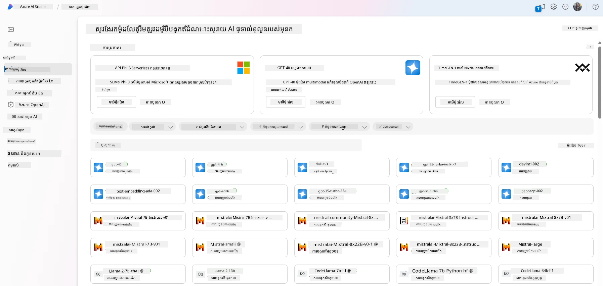

- ពិនិត្យមើលកាតម៉ូដែល រួមទាំងការពិពណ៌នារាយរាល់ពីការប្រើប្រាស់ដែលមានគោលដៅ និងទិន្នន័យបណ្តុះបណ្តាល ឧទាហរណ៍កូដ និងលទ្ធផលវាយតម្លៃនៅលើយោងតាមបណ្ណាល័យវាយតម្លៃក្នុង។

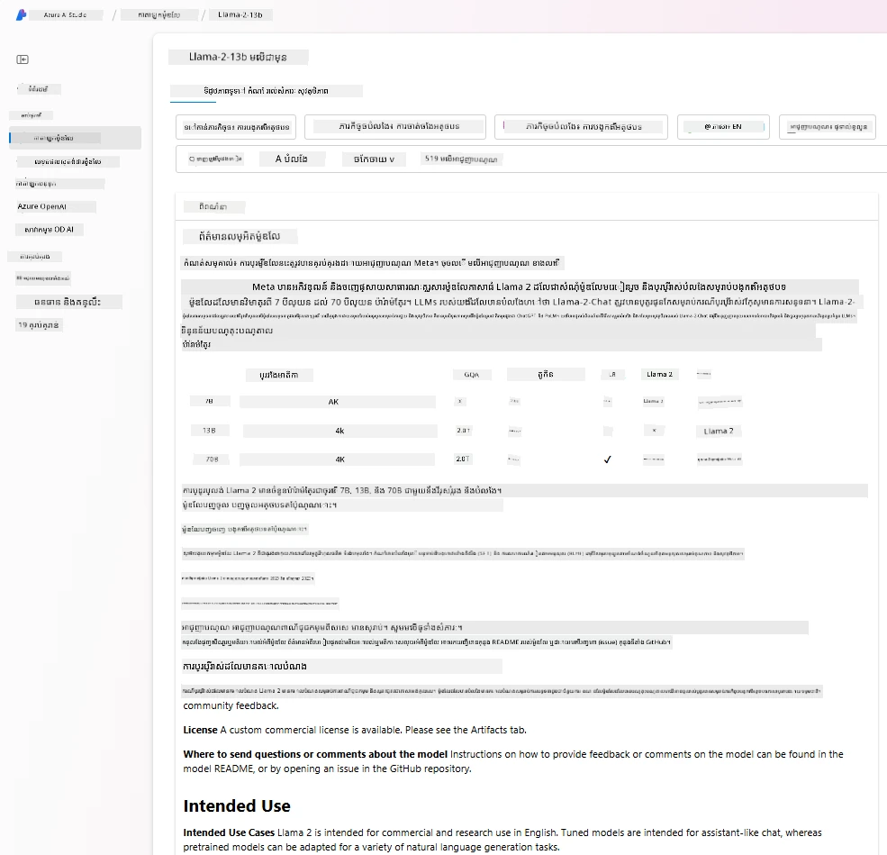

- ប្រៀបធៀបស្ដង់ដារ និងកម្រិតសមត្ថភាពរួមគ្នារវាងម៉ូដែល និងឃ្លាំងទិន្នន័យដែលមាននៅក្នុងឧស្សាហកម្ម ដើម្បីវាយតម្លៃថាណាដែលសមស្របសម្រាប់សេណារីយូអាជីវកម្ម ដោយប្រើផ្នែក [Model Benchmarks](https://learn.microsoft.com/azure/ai-studio/how-to/model-benchmarks?WT.mc_id=academic-105485-koreyst)។

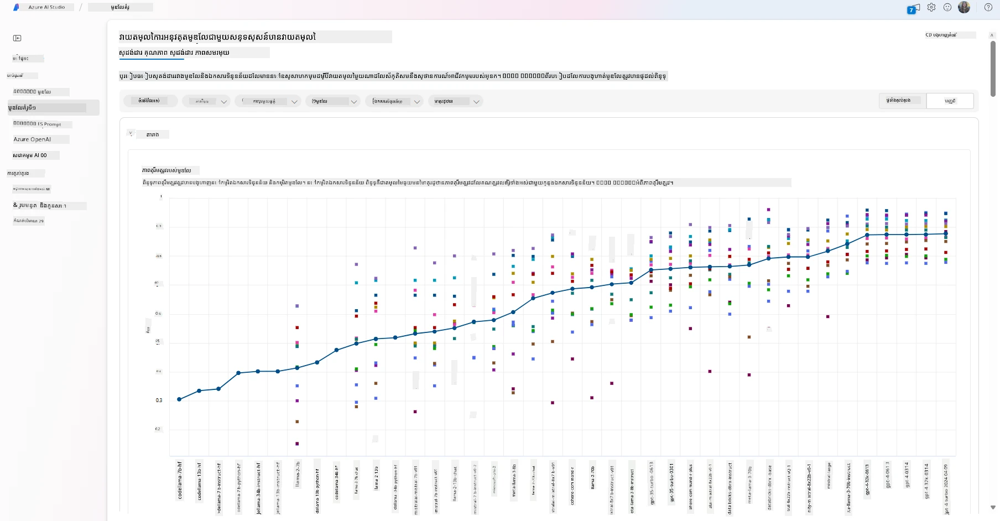

- បង្កើតម៉ូដែលឡើងវិញលើទិន្នន័យបណ្តុះបណ្តាលផ្ទាល់ខ្លួន ដើម្បីបង្កើនសមត្ថភាពម៉ូដែលក្នុងភារកិច្ចជាក់លាក់ មួយដោយប្រើប្រព័ន្ធសាកល្បង និងតាមដានរបស់ Azure AI Studio។

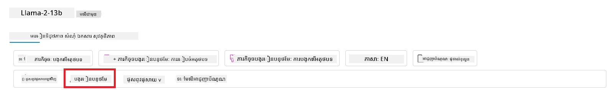

- ចាប់ផ្តើមប្រើម៉ូដែលបណ្តុះបណ្តាលរួចហើយឬវាទាញឡើងវិញទៅកាន់សេវាកម្មភាពយន្តទិន្នន័យពេលវេលាចំរូង - កំណត់គណនាដោយគ្រប់គ្រង - ឬចម្រាស់ ម៉ិប API គ្មានម៉ាស៊ីនមេ - [បង់ប្រាក់តាមប្រើប្រាស់](https://learn.microsoft.com/azure/ai-studio/how-to/model-catalog-overview#model-deployment-managed-compute-and-serverless-api-pay-as-you-go?WT.mc_id=academic-105485-koreyst) - ដើម្បីអនុញ្ញាតកម្មវិធីប្រើប្រាស់វា។

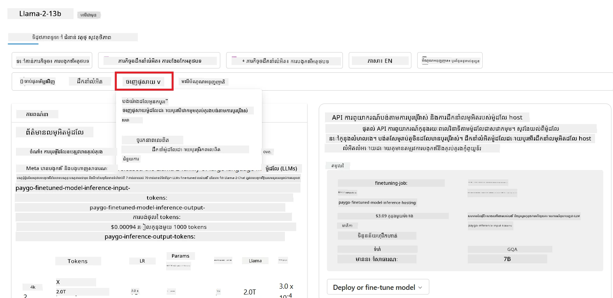

> [!NOTE]
> មុនម៉ូដែលទាំងអស់នៅក្នុងបញ្ជីមិនអាចប្រើបានសម្រាប់បង្កើតឡើងវិញសម្រាប់បណ្តុះបណ្តាលនិង/ឬការប្រើប្រាស់បង់តាមប្រើប្រាស់ទេ។ សូមពិនិត្យកាតម៉ូដែលសម្រាប់ព័ត៌មានលម្អិតអំពីសមត្ថភាពនិងកំណត់ទុកនៃម៉ូដែល។

## ការកែលម្អលទ្ធផល LLM

យើងបានស្វែងរកជាមួយក្រុមស្តាតអាប់របស់យើងម៉ូដែល LLM ជាច្រើនប្រភេទ និងវេទិកាមេឃ (Azure Machine Learning) ដែលអាចអោយយើងប្រៀបធៀបម៉ូដែលផ្សេងៗ វាយតម្លៃពួកវាលើទិន្នន័យធ្វើតេស្ត កែលម្អសមត្ថភាព និងបញ្ចូលពួកវាទៅកាន់កន្លែងនាំមុខផ្ទាល់។

តែពេលណាបាយពួកគេគិតពីការបង្កើតម៉ូដែលឡើងវិញជំនួសម៉ូដែលបណ្តុះរួច? តើមានវិធីផ្សេងទៀតដើម្បីកែលម្អសមត្ថភាពម៉ូដែលលើភារកិច្ចជាក់លាក់ទេ?

មានវិធីជាច្រើនដែលអាជីវកម្មអាចប្រើប្រាស់ដើម្បីទទួលបានលទ្ធផលដែលចង់បានពី LLM។ អ្នកអាចជ្រើសរើសម៉ូដែលប្រភេទផ្សេងៗដោយមានកម្រិតបណ្តុះបណ្តាលខុសគ្នា នៅពេលដំឡើងប្រើក្នុងការផលិតរបស់ LLM ជាមួយកម្រិតស្មុគស្មាញ ថ្លៃដើម និងគុណភាពខុសគ្នា។ នេះគឺជាវិធីផ្សេងៗមួយចំនួន៖

- **បច្ចេកវិទ្យាពាក្យបញ្ជាពីបរិបទ**។ គោលន័យគឺផ្តល់បរិបទគ្រប់គ្រាន់នៅពេលអ្នកបញ្ជាដើម្បីធានាថាអ្នកទទួលបានការឆ្លើយតបដែលអ្នកត្រូវការ។

- **Retrieval Augmented Generation, RAG**។ ទិន្នន័យរបស់អ្នកប្រហែលជាជារបក្សាក្នុងមូលដ្ឋានទិន្នន័យ ឬចំណុចបណ្ដាញមួយ ដែលដើម្បីធានាថាព័ត៌មាននេះ ឬផ្នែកតិចតួចនៃវា ត្រូវបានបញ្ចូលពេលបញ្ជា អ្នកអាចយកទិន្នន័យដែលគឺពាក់ព័ន្ធនិងបង្កើតជា​បរិបទ​ពីការបញ្ជារបស់អ្នកប្រើ។

- **ម៉ូដែលបានបង្កើតឡើងវិញ**។ នៅទីនេះ អ្នកបានបណ្តុះបណ្តាលម៉ូដែលបន្ថែមលើទិន្នន័យផ្ទាល់ខ្លួនរបស់អ្នក ដែលធ្វើឱ្យម៉ូដែលមានភាពត្រឹមត្រូវ និងឆ្លើយតបបានល្អប្រសើរជាង តែអាចមានថ្លៃថ្នូរខ្ពស់។

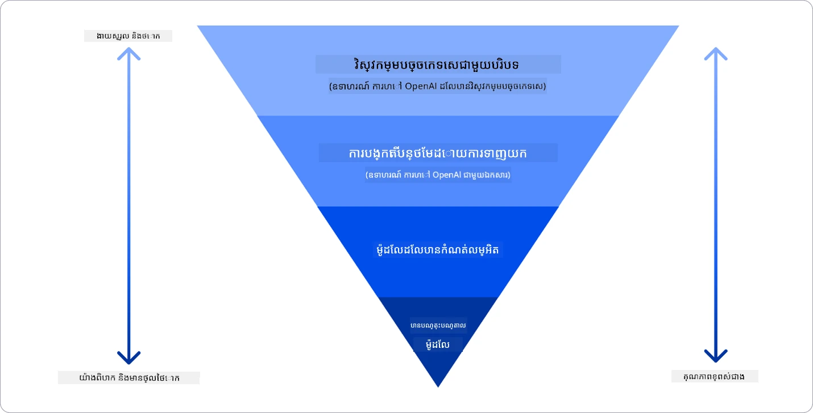

ប្រភពរូបភាព៖ [Four Ways that Enterprises Deploy LLMs | Fiddler AI Blog](https://www.fiddler.ai/blog/four-ways-that-enterprises-deploy-llms?WT.mc_id=academic-105485-koreyst)

### បច្ចេកវិទ្យាពាក្យបញ្ជាពីបរិបទ

ម៉ូដែល LLM បណ្តុះរួចធ្វើការ​បានល្អណាស់ចំពោះភារកិច្ចភាសាបូព៌ា generalized, ទោះតែអាចហៅបានជាមួយបញ្ជាខ្លីៗដូចជាបា្រស់និយាយឬសំណួរ - ដែលគេហៅថា “zero-shot” learning។

ទោះយ៉ាងណា មនុស្សប្រើបណ្ដាលសាកល្បងកាន់តែច្រើននោះបង្ហាញនូវហេតុផល និងឧទាហរណ៍ធំៗ - បរិបទ - ប្រកបជាមួយវា ការឆ្លើយតបនឹងកាន់តែត្រឹមត្រូវ និងស្មើភាគជាមួយការរំពឹងទុករបស់អ្នកប្រើ។ នៅក្នុងករណីនេះ យើងហៅថា “one-shot” learning ប្រសិនបើបញ្ជារមានតែឧទាហរណ៍តែមួយ និង “few shot learning” ប្រសិនបើវាមានឧទាហរណ៍ច្រើន។ បច្ចេកវិទ្យាពាក្យបញ្ជាពីបរិបទគឺជាវិធីដែលមានថ្លៃថ្នូរតិចបំផុតសម្រាប់ការចាប់ផ្តើម។

### Retrieval Augmented Generation (RAG)

ម៉ូដែល LLM មានកំណត់ភាពថាវាអាចប្រើបានតែទិន្នន័យដែលបានប្រើក្នុងការបណ្តុះបណ្តាលប៉ុណ្ណោះសម្រាប់បង្កើតចម្លើយ។ មានន័យថាវាមិនដឹងអំពីការពិតណាដែលកើតឡើងក្រោយការបណ្តុះ បន្ថែមពីរបៀបចូលដំណឹងលើប្រភពព័ត៌មានមិនសាធារណៈ (ដូចជា ទិន្នន័យក្រុមហ៊ុន) ទេ។
វាបំបាត់បំណែកនេះបានតាមរយៈ RAG ដែលជាបច្ចេកទេសបន្ថែមបរិបទក្នុងបញ្ជាជាមួយទិន្នន័យខាងក្រៅសម្រាប់អត្ថបទឯកសារ ដោយគិតគូរជាមួយកំណត់ប្រវែងបញ្ជា។ វាអាចគាំទ្រដោយឧបករណ៍មូលដ្ឋានទិន្នន័យវեկտ័រ (ដូចជា [Azure Vector Search](https://learn.microsoft.com/azure/search/vector-search-overview?WT.mc_id=academic-105485-koreyst)) ដែលយកអត្ថបទដែលត្រូវការ ពីប្រភពទិន្នន័យដែលបានកំណត់ជាមុន ហើយបន្ថែមវាទៅក្នុងបរិបទបញ្ជា។

បច្ចេកទេសនេះមានប្រយោជន៍ខ្លាំងនៅពេលដែលអាជីវកម្មមិនមានទិន្នន័យគ្រប់គ្រាន់ គ្មានពេលគ្រប់គ្រាន់ ឬមិនមានធនធានដើម្បីបង្កើតម៉ូដែលឡើងវិញ ប៉ុន្តែចង់បង្កើនសមត្ថភាពលើភារកិច្ចជាក់លាក់ និងកាត់បន្ថយហានិភ័យនៃការបង្កើតរឿងមិនពិត ឧទាហរណ៍ ការបង្កើតភាពអញ្ញើញនៃការពិត ឬខ្លឹមសារប៉ះពាល់។

### ម៉ូដែលបានបង្កើតឡើងវិញ

ការបង្កើតឡើងវិញគឺជាការប្រព្រឹត្តដែលប្រើប្រាស់ការរៀនផ្ទេរដើម្បី ‘ផ្លាស់ប្តូរ’ ម៉ូដែលទៅភារកិច្ចក្រោម ឬដោះស្រាយបញ្ហាជាក់លាក់។ ខុសប្លែកពី few-shot learning និង RAG វាបណ្ដាលឱ្យមានម៉ូដែលថ្មីមួយផង ដែលបានប្ដូរទម្ងន់ (weights) និងបៀអាស (biases)។ វាត្រូវការទិន្នន័យបណ្តុះបណ្តាលជាគូ input មួយសម្រាប់បញ្ជា និង output ជាផ្នែកបញ្ចប់។
នេះនឹងជាជម្រើសដែលចូលចិត្តប្រសិនបើ៖

- **ប្រើម៉ូដែលបានបង្កើតឡើងវិញ**។ អាជីវកម្មចង់ប្រើម៉ូដែលបានបង្កើតឡើងវិញដែលមានសមត្ថភាពតិចជាង (ដូចជា ម៉ូដែល embedding) ជាជំនួសម៉ូដែលមានសមត្ថភាពខ្ពស់ ដោយពលរដ្ឋកាន់តែមានថ្លៃថ្នូរតិច និងលឿន។

- **គិតពីភាពយឺតលឿន (latency)**។ សំរាប់ករណីប្រើប្រាស់ជាក់លាក់ភាពយឺតបានមានអត្ថិភាព សូម្បីតែគ្មានការប្រើបញ្ជាដែលវែងពេក ឬចំនួនឧទាហរណ៍ដែលត្រូវរៀនពីម៉ូដែលមិនត្រូវទៅនឹងកំណត់ប្រវែងបញ្ជា។

- **រក្សាទិន្នន័យឱ្យទាន់សម័យ**។ អាជីវកម្មមានទិន្នន័យគុណភាពខ្ពស់ និងស្លាកតម្រៀបត្រឹមត្រូវហើយ មានធនធានគ្រប់គ្រាន់ដើម្បីថែរទិន្នន័យឱ្យទាន់សម័យតាមពេលវេលា។

### ម៉ូដែលបានបណ្តុះបណ្តាល

ការបណ្តុះបណ្តាល LLM ពីដើមគឺជាវិធីសាស្រ្តធំពេកនិងស្មុគស្មាញបំផុត ដែលទាមទារទិន្នន័យសម្បូរបែប ធនធានមានជំនាញ និងថាមពលគណនាល្អ។ ជម្រើសនេះគួរតែគិតគូរតែពេលមានជ័យលាភផលក្នុងវិស័យ និងមានទិន្នន័យច្រើន​ដែលផ្ដោតលើផ្នែកជាក់លាក់នោះ។

## ពិនិត្យចំណេះដឹង

តើវិធីសាស្រ្តណាដែលអាចជាការល្អក្នុងការកែលម្អលទ្ធផលបញ្ចប់ LLM?

1. បច្ចេកវិទ្យាពាក្យបញ្ជាពីបរិបទ  
1. RAG  
1. ម៉ូដែលបានបង្កើតឡើងវិញ  

ឆ្លើយ៖ 3 ប្រសិនបើអ្នកមានពេលវេលា និងធនធាន និងទិន្នន័យគុណភាពខ្ពស់ ការបង្កើតឡើងវិញគឺជាជម្រើសល្អបំផុតសម្រាប់រក្សាទុកព័ត៌មានឲ្យទាន់សម័យ។ ទោះជាយ៉ាងណា ប្រសិនបើអ្នកចង់កែលម្អរឿងមួយ ហើយខ្វះពេល វា​គួរតែពិចារណាជាមុន RAG ជាមធ្យោបាយដំបូង។

## 🚀 챌린지

អានបន្ថែមអំពីរបៀបដែលអ្នកអាច [ប្រើ RAG](https://learn.microsoft.com/azure/search/retrieval-augmented-generation-overview?WT.mc_id=academic-105485-koreyst) សម្រាប់អាជីវកម្មរបស់អ្នក។

## ការងារល្អ កន្ត្រកការរៀនរបស់អ្នកបន្ត

បន្ទាប់ពីបញ្ចប់មេរៀននេះ សូមពិនិត្យមើល [ប្រមុំការរៀន Generative AI](https://aka.ms/genai-collection?WT.mc_id=academic-105485-koreyst) របស់យើងដើម្បីបន្តបង្កើនចំណេះដឹង Generative AI របស់អ្នក!

សូមទៅមេរៀនទី 3 ដែលនៅទីនោះយើងនឹងមើលពីរបៀប [កសាងជាមួយ Generative AI ដោយឆន្ទៈ](../03-using-generative-ai-responsibly/README.md?WT.mc_id=academic-105485-koreyst)!

---

<!-- CO-OP TRANSLATOR DISCLAIMER START -->
**ការបដិសេធ**៖  
ឯកសារនេះត្រូវបានបកប្រែដោយប្រើសេវាបកប្រែ AI [Co-op Translator](https://github.com/Azure/co-op-translator)។ ខណៈពេលដែលយើងខិតខំប្រឹងប្រែងសំរាប់ភាពត្រឹមត្រូវ សូមយល់ដឹងថាការបកប្រែដោយស្វ័យប្រវត្តិអាចមានកំហុសឬភាពមិនត្រឹមត្រូវ។ ឯកសារដើមក្នុងភាសាគោលគួរត្រូវបានប្រើជាផ្លូវការជាធានា។ សម្រាប់ព័ត៌មានសំខាន់ សូមណែនាំឲ្យប្រើការបកប្រែដ៏មានជំនាញពីមនុស្ស។ យើងមិនទទួលភារកិច្ចចំពោះការយល់ច្រឡំ ឬការបកស្រាយខុសពីការប្រើប្រាស់ការបកប្រែនេះឡើយ។
<!-- CO-OP TRANSLATOR DISCLAIMER END -->