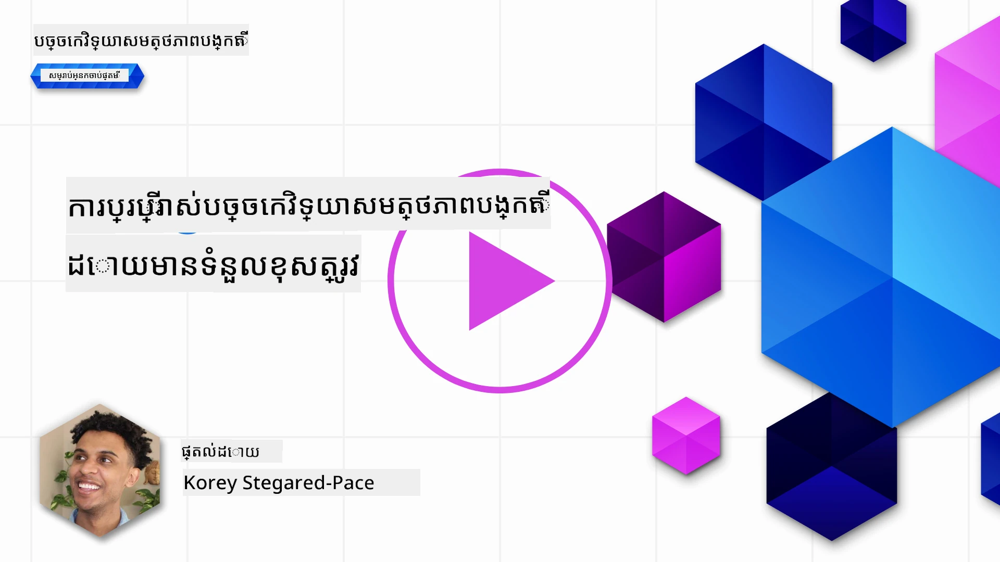
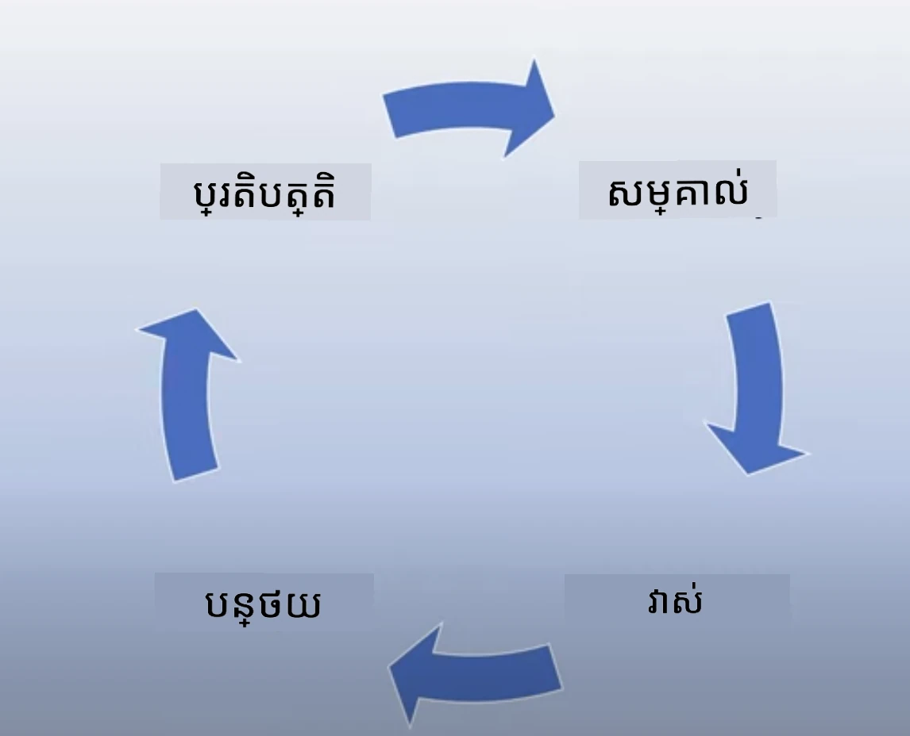

# ការប្រើប្រាស់ AI បង្កើតដោយចិត្តខ្នាតបុគ្គលដោយមានទីបំផុត

> _ចុចរូបភាពខាងលើដើម្បីមើលវីដេអូរបស់មេរៀននេះ_

វាងាយស្រួលក្នុងការជ្រាបចិត្តចំពោះ AI និង AI បង្កើតដោយចិត្ត ខណៈពេលជាក់លាក់ អ្នកត្រូវតែគិតពីរបៀបដែលអ្នកនឹងប្រើវាយ៉ាងមានទំនួលខុសត្រូវ។ អ្នកត្រូវគិតពីរឿងដូចជាធ្វើដូចម្តេចដើម្បីធានាថាលទ្ធផលគឺត្រឹមត្រូវ មិនបង្កការខូចខាត ហើយបន្ថែមទៀត។ មេរៀននេះមានគោលបំណងផ្តល់ឱ្យអ្នកនូវបរិបទដែលបាននិយាយ អ្វីដែលត្រូវគិត និងរបៀបដើម្បីអនុវត្តជំហានសកម្មដើម្បីបង្កើនការប្រើប្រាស់ AI របស់អ្នក។

## មាតិកានាំមុខ

មេរៀននេះនឹងគ្របដណ្តប់៖

- ហេតុអ្វីបានជាអ្នកគួរឱ្យអាទិភាពឱ្យនូវ AI ដែលមានទំនួលខុសត្រូវនៅពេលបង្កើតកម្មវិធី Generative AI។
- គោលការណ៍មូលដ្ឋាននៃ AI ដែលមានទំនួលខុសត្រូវ និងរបៀបដែលវាទាក់ទងទៅ Generative AI។
- របៀបដាក់គោលការណ៍ AI ដែលមានទំនួលខុសត្រូវទាំងនេះទៅក្នុងការអនុវត្តតាមរយៈយុទ្ធសាស្រ្ត និងឧបករណ៍។

## គោលដៅការរៀន

បន្ទាប់ពីបញ្ចប់មេរៀននេះ អ្នកនឹងដឹង៖

- សារៈសំខាន់នៃ AI ដែលមានទំនួលខុសត្រូវពេលបង្កើតកម្មវិធី Generative AI។
- ពេលណាដែលត្រូវគិតនិងអនុវត្តគោលការណ៍មូលដ្ឋាននៃ AI ដែលមានទំនួលខុសត្រូវពេលបង្កើតកម្មវិធី Generative AI។
- ឧបករណ៍ និងយុទ្ធសាស្រ្តណាខ្ពស់ដែលមានសម្រាប់អ្នកដើម្បីអនុវត្តគំនិត AI ដែលមានទំនួលខុសត្រូវ។

## គោលការណ៍ AI ដែលមានទំនួលខុសត្រូវ

ការរំភើបចំពោះ Generative AI chưaច pernahខ្ពស់ជាងមុន។ ការរំភើបនេះបាននាំមកជាមួយអ្នកអភិវឌ្ឍថ្មីច្រើន ការចាប់អារម្មណ៍ និងថវិកាច្រើនទៅដល់វិស័យនេះ។ ខណៈពេលនេះមានតែភាពវិជ្ជមានសម្រាប់អ្នកណាមួយដែលចង់បង្កើតផលិតផល និងក្រុមហ៊ុនដោយការប្រើ Generative AI វាក៏សំខាន់ដែលយើងត្រូវដំឡើងការប្រឹងប្រែងដោយមានទំនួលខុសត្រូវផងដែរ។

នៅពេលរៀននេះ យើងកំពុងផ្តោតលើការបង្កើតស្តាតអាប់របស់យើង និងផលិតផលការអប់រំបញ្ញាសិប្បនិម្មិត។ យើងនឹងប្រើគោលការណ៍នៃ AI ដែលមានទំនួលខុសត្រូវ៖ អតិភាពភាព (Fairness), ការរួមបញ្ចូល (Inclusiveness), ភាពទុកចិត្ត/សុវត្ថិភាព (Reliability/Safety), សន្តិសុខ និងភាពឯកជន (Security & Privacy), ភាពច្បាស់លាស់ (Transparency) និងកិត្តិយសទទួលខុសត្រូវ (Accountability)។ ជាមួយគោលការណ៍ទាំងនេះ យើងនឹងស្រាវជ្រាវពីរបៀបដែលវាទាក់ទងទៅនឹងការប្រើប្រាស់ Generative AI ក្នុងផលិតផលរបស់យើង។

## ហេតុអ្វីបានជាអ្នកគួរអាទិភាព AI ដែលមានទំនួលខុសត្រូវ

ពេលបង្កើតផលិតផល ការយកមនុស្សជម្រើសជាលក្ខខ័ណ្ឌ ដោយគិតស្រមៃអំពីអត្ថប្រយោជន៍ល្អបំផុតរបស់អ្នកប្រើ នាំឱ្យមានលទ្ធផលល្អបំផុត។

ភាពពិសេសរបស់ Generative AI គឺថាវាមានអំណាចបង្កើតចម្លើយដែលមានប្រយោជន៍ ព័ត៌មាន គន្លឹះ និងមាតិកាសម្រាប់អ្នកប្រើ។ វាអាចធ្វើបានគ្មានជំហានដៃដូចជាច្រើនដែលអាចនាំឱ្យមានលទ្ធផលអស្ចារ្យ។ បើគ្មានការធ្វើផែនការរបស់រៀងល្អ និងយុទ្ធសាស្រ្ត វាក៏អាចនាំឱ្យមានលទ្ធផលខូចខាតចំពោះអ្នកប្រើ ផលិតផល និងសង្គមទាំងមូល។

មកមើលលទ្ធផលខូចខាតខ្លះៗ (តែខ្លះប៉ុណ្ណោះ)៖

### ភាពប្រឆាំងនឹងការពិត (Hallucinations)

ភាពប្រឆាំងនឹងការពិតជាការពណ៌នាថា ពេលដែល LLM បង្កើតមាតិកាដែលទាំងស្រុងមិនមានសេចក្ដីហេតុថ្វីមកទេ ឬបច្ចុប្បន្នវិវរណៈដទៃទៀតដែលខុសពីសេចក្ដីពិតបញ្ជាក់តាមប្រភពព័ត៌មានផ្សេងៗ។

យើងយកឧទាហរណ៍មួយដែលយើងបង្កើតមុខងារសម្រាប់ស្តាតអាប់ របស់យើងដែលអនុញ្ញាតឱ្យសិស្សសួរប្រវត្តិសាស្ត្រទៅម៉ូឌែលមួយ។ សិស្សបានសួរថា `នរណាជអ្នករស់នៅចុងក្រោយតែម្ដងនៃអគ្គិភ័យTitanic?`

ម៉ូឌែលបានបង្កើតចម្លើយដូចខាងក្រោម៖

> _(ប្រភព: [Flying bisons](https://flyingbisons.com?WT.mc_id=academic-105485-koreyst))_

នេះជាចម្លើយមិនខ្លាច និងពេញលេញណាស់។ ចុងក្រោយវាខុសច្រឡំ។ ទោះបីជាមានការស្រាវជ្រាវតិចតួនគ្នា អ្នកនឹងទទួលដឹងថា មានអ្នករស់នៅចុងក្រោយជាច្រើននៅព្រឹតិ្តការណ៍ចងចាំTitanic។ សម្រាប់សិស្សដែលទើបគិតជ្រាវនេះ បទបង្ហាញនេះអាចមានឥទ្ធិពលឱ្យមិនបានសួរមិនបញ្ឆោតនិងទទួលយកជាការពិត។ ផលវិបាគ្គរបស់វាអាចនាំឲ្យប្រព័ន្ធ AI មិនទុកចិត្ត និងប៉ះពាល់អារម្មណ៍លើកេរដំណើនិងស្តាតអាប់របស់យើង។

ជាមួយនឹងការកែប្រែជាទៀងទាត់នៃ LLM មួយៗ យើងបានឃើញកំណែទម្រង់កំណើននៃការបន្ថយភាពប្រឆាំងនឹងការពិត។ ទោះជាយ៉ាងណា ខណៈដែលមានការកែលម្អនេះ យើងក្នុងនាមជាអ្នកបង្កើតកម្មវិធី និងអ្នកប្រើ ត្រូវតែយល់ដឹងពីកំណត់ផ្នែកទាំងនេះជានិច្ច។

### មាតិកាខូចខាត

យើងបានគ្របដណ្តប់នៅផ្នែកមុននៅពេលដែល LLM បង្កើតចម្លើយខុស ឬមិនមានអត្ថន័យ។ គ្រោះថ្នាក់ផ្សេងទៀតដែលយើងត្រូវតែផ្តោតដំណឹងគឺពេលម៉ូឌែលឆ្លើយមកជាមួយមាតិកាខូចខាត។

មាតិកាខូចខាតអាចត្រូវបានកំណត់ថា៖

- ផ្តល់ឱ្យនូវសេចក្ដីណែនាំ ឬលើកទឹកចិត្តការខូចខាតទៅខ្លួនឯង ឬក្រុមមនុស្សជាក់លាក់មួយ។
- មាតិកាខ្វះគំនិត ឬមិនគោរពសិទ្ធិមនុស្ស។
- ជំរុញផែនការប្រយុទ្ធ ឬក៏សកម្មភាពហិង្សា។
- ផ្តល់សេចក្ដីណែនាំរកមាតិកាដែលមិនត្រឹមត្រូវ ឬការធ្វើសកម្មភាពខុសច្បាប់។
- បង្ហាញមាតិកាដែលពាក់ព័ន្ធនឹងភាពយន្តបញ្ចេញផ្លូវភេទ។

សម្រាប់ស្តាតអាប់របស់យើង យើងចង់ធានាថា យើងមានឧបករណ៍ និងយុទ្ធសាស្រ្តត្រឹមត្រូវដើម្បីបង្ការ មាតិកាប្រភេទនេះមិនត្រឹមតែបានឃើញដោយសិស្សទេ។

### ការខ្វះអតិភាពភាព

អតិភាពភាពត្រូវបានកំណត់ថា "ធានាថា ប្រព័ន្ធ AI គឺសុទ្ធតែគ្មានការវិនិយោគ និងមិនអនុវត្តការរើសអើង ហើយវាចាត់ទុកមនុស្សគ្រប់គ្នាដោយភាពយុត្តិធម៌ និងស្មើរគ្នា"។ នៅក្នុងពិភព Generative AI យើងចង់ធានាថា មិនមានទ្រឹស្តីមើលរំលងក្រុមមនុស្សដែលត្រូវបានបង្ខំបង្ហាញដោយលទ្ធផលម៉ូឌែល។

លទ្ធផលប្រភេទនេះមិនត្រឹមតែលបបំបាត់ការបង្កើតបទពិសោធផលិតផលវិជ្ជមានសម្រាប់អ្នកប្រើរបស់យើង តែវាក៏បង្កការខូចខាតសង្គមបន្ថែមផងដែរ។ ជាអ្នកបង្កើតកម្មវិធី យើងត្រូវតែគិតយ៉ាងទូលំទូលាយនិងមានភាពចម្រុះចម្រង់ក្នុងការកំណត់នៃការប្រើប្រាស់និតិវិធីនៃ Generative AI។

## របៀបប្រើ Generative AI ដោយមានទំនួលខុសត្រូវ

ឥឡូវនេះដែលយើងបានរកឃើញពីសារៈសំខាន់នៃ Generative AI ដែលមានទំនួលខុសត្រូវ មកមើល ៤ជំហានដែលយើងអាចអនុវត្ត ដើម្បីបង្កើតដំណោះស្រាយ AI របស់យើងដោយមានទំនួលខុសត្រូវ៖

### វាស់វែងគ្រោះថ្នាក់ដែលអាចកើតមាន

នៅក្នុងការសាកល្បងកម្មវិធី យើងសាកល្បងសកម្មភាពដែលមានការរំពឹងទុកពីអ្នកប្រើ នៅលើកម្មវិធីមួយ។ ដូច្នេះ ការសាកល្បងសំណើជាច្រើនដែលអ្នកប្រើសុំផ្ដល់ស្នើសុំគឺជាវិធីល្អក្នុងការវាស់វែងគ្រោះថ្នាក់ដែលអាចកើតមាន។

ដោយសារស្តាតអាប់របស់យើងកំពុងបង្កើតផលិតផលអប់រំបញ្ញាសិប្បនិម្មិត នេះគួរតែត្រៀមបញ្ជីសំណើពីផ្នែកអប់រំ។ សំណើនេះអាចគ្របដណ្តប់មុខវិជ្ជាមួយ ព័ត៍មានប្រវត្តិសាស្ត្រ និងសំណើអំពីជីវិតសិស្ស។

### កាត់បន្ថយគ្រោះថ្នាក់ដែលអាចកើតមាន

ឥឡូវនេះជាថ្ងៃដែលត្រូវស្វែងរកវិធីដែលអាចបញ្ឈប់ ឬកាត់បន្ថយគ្រោះថ្នាក់ដែលអាចកើតមានដោយម៉ូឌែល និងចម្លើយរបស់វា។ យើងអាចមើលទៅកាន់ ៤ស្រទាប់ខុសគ្នា៖

- **ម៉ូឌែល**។ ជ្រើសរើសម៉ូឌែលត្រឹមត្រូវសម្រាប់ករណីប្រើប្រាស់ត្រឹមត្រូវ។ ម៉ូឌែលធំ និងស្មុគស្មាញដូចជា GPT-4 អាចបង្កគ្រោះថ្នាក់ខ្ពស់ជាងសម្រាប់ករណីប្រើតូច និងជាក់លាក់។ ការបង្វឹកឡើងវិញដោយទិន្នន័យហ្វឹកហាត់របស់អ្នកក៏កាត់បន្ថយគ្រោះថ្នាក់នៃមាតិកាខូចខាតផងដែរ។

- **ប្រព័ន្ធសុវត្ថិភាព**។ ប្រព័ន្ធសុវត្ថិភាពជាសំណុំឧបករណ៍ និងការកំណត់លើវេទិកាសម្រាប់ម៉ូឌែល ដែលជួយកាត់បន្ថយគ្រោះថ្នាក់។ ឧទាហរណ៍មួយគឺប្រព័ន្ធច្រារព័ត៌មានក្នុងសេវាអេហ្វ្យឺរ Azure OpenAI។ ប្រព័ន្ធគួរមានការស្គាល់គ្រប់ការវាយប្រហារ jailbreak និងសកម្មភាពមិនចង់បានដូចជាពីបំណុល។

- **Metaprompt**។ Metaprompts និង grounding ជាវិធីដែលយើងអាចណែនាំ ឬកាត់បន្ថយម៉ូឌែល ដោយផ្អែកលើអាកប្បកិរិយា និងព័ត៌មានជាក់លាក់។ នេះអាចជាការប្រើការបញ្ចូលប្រព័ន្ធដើម្បីកំណត់សមាសភាពកំណត់របស់ម៉ូឌែល។ បន្ថែមពីនេះ ផ្តល់នូវចម្លើយដែលមានសមត្ថភាពជាងក្នុងវិសាលភាព ឬដែនកំណត់នៃប្រព័ន្ធ។

វាក៏អាចជាការប្រើបច្ចេកទេសដូចជា Retrieval Augmented Generation (RAG) ដើម្បីឲ្យម៉ូឌែលទាញយកព័ត៌មានតែម្តងពីប្រភពដែលគាំទ្រជាផ្លូវការ។ មានមេរៀននៅក្រោយនេះសម្រាប់ [បង្កើតកម្មវិធីស្វែងរក](../08-building-search-applications/README.md?WT.mc_id=academic-105485-koreyst)

- **បទពិសោធន៍អ្នកប្រើ**។ ស្រទាប់ចុងក្រោយគឺកន្លែងដែលអ្នកប្រើប្រាស់ជួបប្រទៈដោយផ្ទាល់ជាមួយម៉ូឌែលតាមរយៈចំណុចប្រទាក់កម្មវិធីរបស់យើងយ៉ាងណាមួយ។ ដូច្នេះ យើងអាចរចនាផ្ទៃប្រើ UI/UX ដើម្បីដាក់កម្ចាត់ការបញ្ចូលប្រភេទដែលអ្នកប្រើអាចផ្ញើទៅម៉ូឌែល ទៅវិញទៅមកអត្ថបទ ឬរូបភាពដែលបង្ហាញ​មកអ្នកប្រើ។ នៅពេលផ្សព្វផ្សាយកម្មវិធី AI យើងត្រូវតែត្រចៀមលទ្ធភាពច្បាស់លាស់ថា កម្មវិធី Generative AI របស់យើងអាចធ្វើអ្វី និងមិនអាចធ្វើអ្វី។

យើងមានមេរៀនពេញលេញសម្រាប់ [ការរចនាផ្ទៃប្រើ UX សម្រាប់កម្មវិធី AI](../12-designing-ux-for-ai-applications/README.md?WT.mc_id=academic-105485-koreyst)

- **វាយតម្លៃម៉ូឌែល**។ ការធ្វើការជាមួយ LLM អាចជាការលំបាក ពីព្រោះយើងមិនតែងតែមានការគ្រប់គ្រងលើទិន្នន័យដែលម៉ូឌែលបានហ្វឹកហាត់ឡើយ។ ប៉ុន្តែយើងគួរតែវាយតម្លៃការសម្តែង និងលទ្ធផលរបស់ម៉ូឌែលជានិច្ច។ វានៅតែមានសារៈសំខាន់ក្នុងការវាស់ប្រេរិយភាព តម្លៃស្រដៀងគ្នា ភាពមានមូលដ្ឋាន និងពាក់ព័ន្ធនៃលទ្ធផលនេះ។ វាជួយផ្តល់ភាពច្បាស់លាស់ និងទំនុកចិត្តទៅអ្នកមានអំណាច និងអ្នកប្រើ។

### ប្រតិបត្តិការដំណោះស្រាយ Generative AI ដែលមានទំនួលខុសត្រូវ

ការបង្កើតការអនុវត្តការងារជុំវិញកម្មវិធី AI របស់អ្នកគឺជាថ្នាក់ចុងក្រោយ។ វា​រួមបញ្ចូលការសហការណ៍ជាមួយផ្នែកផ្សេងៗក្នុងស្តាតអាប់ដូចជា ផ្នែកផ្លូវច្បាប់ និងសន្តិសុខ ដើម្បីធានាថាយើងគោរពនឹងគោលការណ៍នានា។ មុនធ្វើការចាប់ផ្តើម យើងក៏ចង់បង្កើតផែនការអំពីការដឹកជញ្ជូន ការដោះស្រាយហេតុការណ៍ និងការវិលត្រឡប់ ដើម្បីការពារគ្រោះថ្នាក់ចំពោះអ្នកប្រើ។

## ឧបករណ៍

បើទោះជាការងារជាមួយការអភិវឌ្ឍន៍ដំណោះស្រាយ AI ដែលមានទំនួលខុសត្រូវអាចមើលទៅមានភាពលំបាក តែវាជាការងារដែលមានតំលៃខ្ពស់។ មិនឲ្យខុសពីនេះ នៅពេលដែលវិស័យ Generative AI កើនឡើង ឧបករណ៍ជាច្រើនដែលជួយអភិវឌ្ឍន៍នឹងកាន់តែមានភាពប្រសើរ។ ឧទាហរណ៍ [Azure AI Content Safety](https://learn.microsoft.com/azure/ai-services/content-safety/overview?WT.mc_id=academic-105485-koreyst) អាចជួយរកមាតិកាខូចខាត និងរូបភាពតាមរយៈការស្នើសុំ API។

## ពិនិត្យចំណេះដឹង

តើមានអ្វីខ្លះដែលអ្នកត្រូវថែរក្សាដើម្បីធានាថាការប្រើប្រាស់ AI មានទំនួលខុសត្រូវ?

1. ចម្លើយត្រឹមត្រូវ។
1. ការប្រើប្រាស់ដែលបង្កគ្រោះថ្នាក់ ទំនងមិនឲ្យ AI ប្រើប្រាស់សម្រាប់គោលបំណងឧក្រិដ្ឋ។
1. ធានាថា AI គឺសុទ្ធតែគ្មានការផ្អែកលើអជ្ញាធរនិងការរើសអើង។

ចម្លើយ៖ 2 និង 3 ត្រឹមត្រូវ។ AI ដែលមានទំនួលខុសត្រូវជួយអ្នកគិតពីរបៀបកាត់បន្ថយផលប៉ះពាល់ខូច និងការបែកខូច។

## 🚀 តស៊ូមតិ

សូមអានអំពី [Azure AI Content Safety](https://learn.microsoft.com/azure/ai-services/content-safety/overview?WT.mc_id=academic-105485-koreyst) ហើយមើលថាអ្វីដែលអ្នកអាចអនុវត្តសម្រាប់ការប្រើប្រាស់របស់អ្នក។

## ការងារល្អ សូមបន្តការរៀនរបស់អ្នក

បន្ទាប់ពីបញ្ចប់មេរៀននេះ សូមពិនិត្យមើល [កម្រងការរៀន Generative AI](https://aka.ms/genai-collection?WT.mc_id=academic-105485-koreyst) របស់យើង ដើម្បីបន្តកម្រិតចំណេះដឹង Generative AI របស់អ្នក!

សូមទៅមើលមេរៀន 4 ដែលយើងនឹងមើលកាន់តែជ្រាបជាត្រូវ [មូលដ្ឋានការរចនាសំណើប្រើប្រាស់](../04-prompt-engineering-fundamentals/README.md?WT.mc_id=academic-105485-koreyst)!

---

<!-- CO-OP TRANSLATOR DISCLAIMER START -->
**ការ​បដិសេធ**៖  
ឯកសារ​នេះ​ត្រូវ​បាន​ប្រែ​ជា​ភាសាខ្មែរដោយ​ប្រើ​សេវាកម្ម​ប្រែសម្រួល AI [Co-op Translator](https://github.com/Azure/co-op-translator)។ ខណៈ​ពេល​យើង​ព្យាយាម​សំរាប់​ការត្រឹមត្រូវ​ សូម​ប្រាកដ​ដឹង​ថា​ការ​ប្រែ​សម្រួល​ស្វ័យប្រវត្តិ​អាច​មាន​កំហុសឬ​ការ​ច្រឡំ​ណាមួយ។ ឯកសារ​ដើម​នៅ​ក្នុង​ភាសា​ដើម​គួរត្រូវ​បាន​គេ​រាប់អាន​ជា​ប្រភព​ដែល​មាន​សិទ្ធិ​ផ្លូវការ។ សម្រាប់​ព័ត៌មាន​សំខាន់ៗ និយាយ​អំពី​ការ​ប្រែ​សម្រួល​ដោយ​មនុស្ស​ជំនាញ​ត្រូវបានផ្តល់អនុសាសន៍។ យើង​មិន​ទទួល​បន្ទុក​ចំពោះ​ការ​យល់​ច្រឡំ ឬ​ការ​យល់​ព្រួយ ណាមួយ​ដែល​កើតឡើង​ពី​ការ​ប្រើប្រាស់​ការ​ប្រែ​សម្រួល​នេះទេ។
<!-- CO-OP TRANSLATOR DISCLAIMER END -->