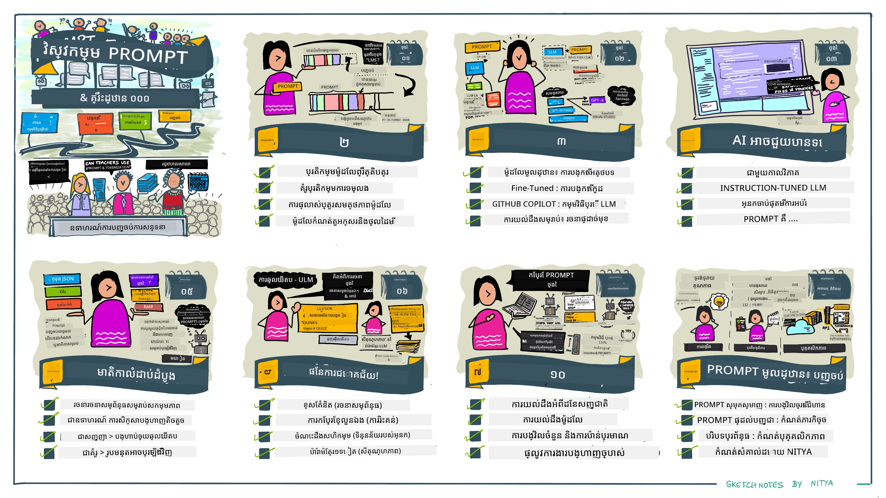
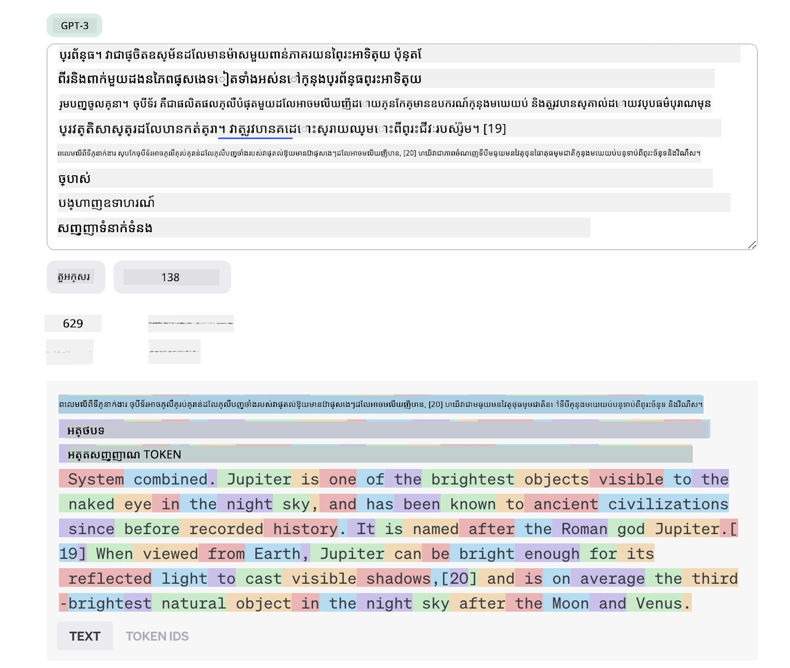
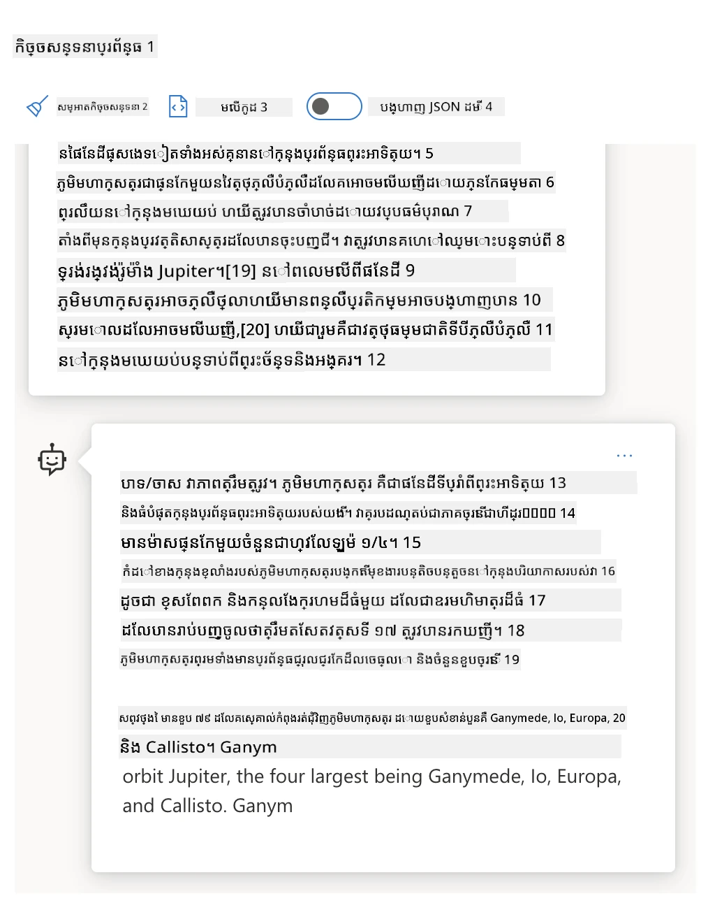
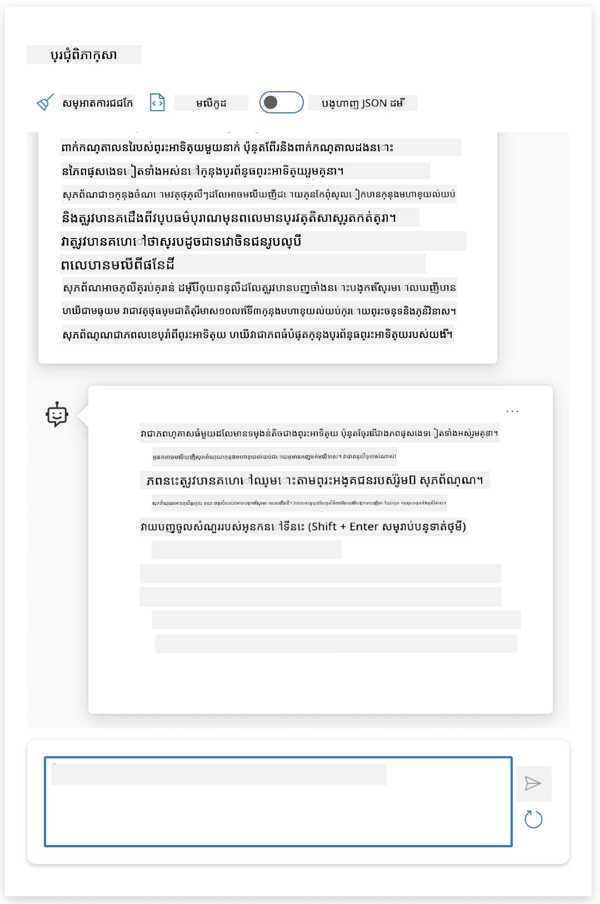
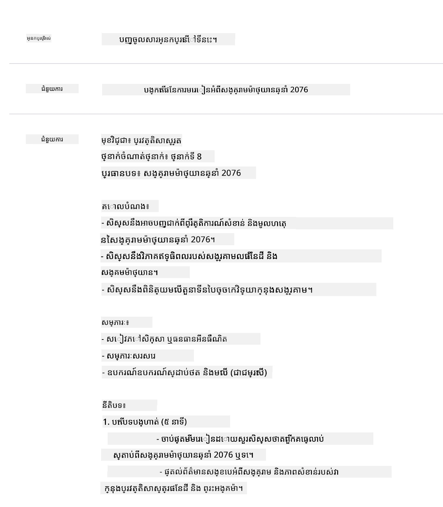
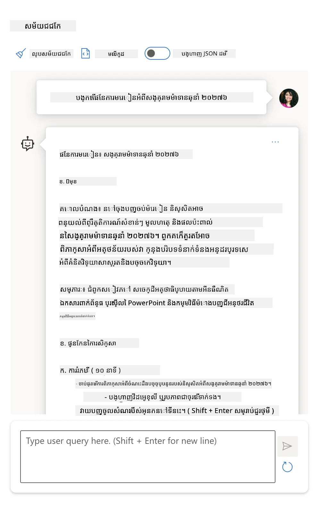
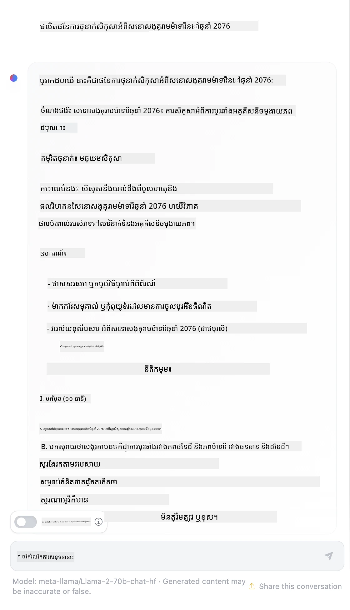

# មូលដ្ឋានវិស្វកម្មបញ្ចូល​បញ្ជា

[](https://youtu.be/GElCu2kUlRs?si=qrXsBvXnCW12epb8)

## ការណែនាំ
មូលដ្ឋាននេះគ្របដណ្តប់កាន់តែក្នុងយល់ដឹងនិងបច្ចេកទេសសំខាន់ៗសម្រាប់បង្កើតបញ្ចូលបញ្ជាដែលមានប្រសិទ្ធភាពក្នុងម៉ូដែល AI បង្កើតថ្មី។ របៀបដែលអ្នកសរសេរបញ្ចូលបញ្ជាទៅកាន់ LLM ក៏សំខាន់ដែរ។ បញ្ចូលបញ្ជាដែលបានរៀបចំយ៉ាងប្រុងប្រយ័ត្នអាចទទួលបានចម្លើយដែលមានគុណភាពល្អជាងមុន។ តែពាក្យដូចជា _prompt_ និង _prompt engineering_ មានន័យថាអ្វី? ហើយតើខ្ញុំអាចបង្កើនគុណភាពនៃបញ្ចូលបញ្ជា _input_ ដែលខ្ញុំផ្ញើទៅកាន់ LLM ដូចម្តេច? នេះគឺជាសំនួរដែលយើងនឹងព្យាយាមឆ្លើយនៅក្នុងវិញ្ញាសានេះ និងវិញ្ញាសាខាងក្រោយ។

_Generative AI_ មានសមត្ថភាពធ្វើបញ្ចូលមួយថ្មី (ដូចជា អត្ថបទ, រូបភាព, សំលេង, កូដ ល) ដើម្បីឆ្លើយតបនឹងការស្នើសុំរបស់អ្នកប្រើ។ វាទទួលបាននេះដោយប្រើ _ម៉ូដែលភាសាធំ_ (Large Language Models) ដូចជា ស៊េរី GPT របស់ OpenAI ("Generative Pre-trained Transformer") ដែលបានបណ្តុះបណ្តាលសម្រាប់ការប្រើប្រាស់ភាសាតិចតួស និងកូដ។

ឥឡូវនេះអ្នកប្រើអាចអន្តរកម្មជាមួយម៉ូដែលទាំងនេះតាមរបៀបដែលគេស្គាល់ដូចជា ការជជែក ត្រូវដោយមិនចាំបាច់មានជំនាញបច្ចេកទេស ឬការបណ្តុះបណ្តាល។ ម៉ូដែលទាំងនេះគឺផ្អែកលើ _បញ្ចូលបញ្ជា_ - អ្នកប្រើផ្ញើបញ្ចូលអក្សរ (prompt) ហើយទទួលបានចម្លើយ AI (completion) តបត Back ។ បន្ទាប់មកពួកគេអាច "ជជែកជាមួយ AI" ជាថ្មីៗក្នុងការជជែកច្រើនជំហាន ដើម្បីកែលម្អបញ្ចូលបញ្ជារហូតដល់ចម្លើយត្រូវតាមបំណងរបស់ពួកគេ។

"បញ្ចូលបញ្ជា" ឥឡូវនេះក្លាយជាចំណុចច្នៃប្រឌិតក្នុងការកម្មវិធីសម្រាប់កម្មវិធី AI បង្កើតថ្មី ដើម្បីប្រាប់ម៉ូដែលធ្វើអ្វីផ្សេងៗ និងឥទ្ធិពលលើគុណភាពនៃចម្លើយត្រឡប់មកវិញ។ "Prompt Engineering" ជាវិស័យរៀនភាគរយរហוסקដែលផ្តោតសំខាន់លើ _ការរចនា និងបង្កើតប្រសិទ្ធភាព_ នៃបញ្ចូលបញ្ជា ដើម្បីផ្តល់នូវចម្លើយជាប់លាប់និងមានគុណភាពនៅលំដាប់ធំ។

## គោលបំណងរៀន

នៅក្នុងមេរៀននេះ យើងរៀនពីអ្វីដែលជា Prompt Engineering, មូលហេតុដែលវាសំខាន់ និងរបៀបដែលយើងអាចរៀបចំបញ្ចូលបញ្ជាឱ្យមានប្រសិទ្ធភាពសម្រាប់ម៉ូដែលនិងគោលបំណងកម្មវិធីណាមួយ។ យើងនឹងយល់ដឹងគោលការសំខាន់និងអនុវត្តការអនុញ្ញាតល្អៗសម្រាប់វិស្វកម្មបញ្ចូលបញ្ជា - និងរៀនពីបរិយាកាស Jupyter Notebooks មានអន្តរកម្ម "sandbox" ដែលអាចឱ្យយើងមើលឃើញគំនិតទាំងនេះបំព្រួញទៅលើឧទាហរណ៍ពិត។

នៅចុងបង្រៀននេះ យើងនឹងអាច:

1. ពន្យល់អំពីអ្វីដែលជា prompt engineering និងមូលហេតុថាវាសំខាន់។
2. ពិពណ៌នាអំពីឧបករណ៍របស់បញ្ចូលបញ្ជា និងរបៀបដែលវាត្រូវបានប្រើ។
3. រៀនអំពីអនុវត្តល្អបំផុត និងបច្ចេកទេសសម្រាប់ prompt engineering។
4. អនុវត្តបច្ចេកទេសដែលរៀនបានទៅលើឧទាហរណ៍ពិត โดยប្រើចំណុចចេញ OpenAI។

## ពាក្យគន្លឹះ

Prompt Engineering: ការអនុវត្តការរចនានិងកែលម្អបញ្ចូល ដើម្បីណែនាំម៉ូដែល AI ទៅរកចេញលទ្ធផលចង់បាន។
Tokenization: ដំណើរការបម្លែងអត្ថបទទៅជាឯកតាតូចៗហៅថា tokens ដែលម៉ូដែលអាចយល់និងដំណើរការ​បាន។
Instruction-Tuned LLMs: ម៉ូដែលភាសាធំដែលបានថែរក្សាយ៉ាងច្បាស់ជាមួយនឹងប៉ារ៉ាម៉ែត្រពិសេសដើម្បីបង្កើនភាពត្រឹមត្រូវនិងទាក់ចិត្តគោលបំណងនៃការឆ្លើយតប។

## បរិយាកាសរៀន Sandbox

Prompt engineering ពេលនេះគឺជាការសិល្បៈច្រើនជាងវិទ្យាសាស្ត្រ។ វិធីល្អបំផុតក្នុងការកែលម្អជំនាញរបស់យើងគឺ _ហាត់ប្រាណ​ច្រើនជាងមុន_ និងអនុវត្តវិធីសាកល្បង និងកំហុស ដែលបង្កើតសមាសភាគចំណេះដឹងក្នុងសកម្មភាពកម្មវិធីជាមួយបច្ចេកទេសដែលបានណែនាំ និងការបង្កើតម៉ូដែលតាមពិសេស។

Jupyter Notebook ដែលភ្ជាប់មកជាមួយមេរៀននេះផ្តល់បរិយាកាស _sandbox_ ដែលអ្នកអាចសាកល្បងអ្វីដែលរៀនបាន - ពេលដែលធ្វើការហាត់ប្រាណ ឬជាផ្នែកនៃបញ្ហាកូដនៅចុងបង្រៀន។ ដើម្បីអនុវត្តមូលហេតុនេះ អ្នកត្រូវការតែ៖

1. **កូនសោ API OpenAI Azure** - ចំណុចសេវាជាមួយ LLM ដែលបានដាក់បង្ហោះ។
2. **បរិយាកាស Python Runtime** - ដែលអាចរត់ព្រមក្នុង Notebook។
3. **អថេរបរិស្ថានក្នុងតំបន់** - _បញ្ចប់ជំហាន [SETUP](./../00-course-setup/02-setup-local.md?WT.mc_id=academic-105485-koreyst) ឥឡូវនេះដើម្បីរៀបចំ​នៅក្រុមហ៊ុន_។

Notebook មានលំហាត់ _មូលដ្ឋាន_ ជាមួយអង្គភាព _Markdown_ (ពណ៌នា) និង _Code_ (ស្នើសុំបញ្ចូលបញ្ជា) ដែលអ្នកអាចបន្ថែមដើម្បីសាកល្បងឧទាហរណ៍ ឬគំនិតបន្ថែមៗ - ដើម្បីសង់នូវជំនាញរចនាបញ្ចូលល្អ។

## មគ្គុទេសក៍រូបភាព

ចង់ទទួលបានរូបមន្តទូលំទូលាយអំពីអ្វីដែលមេរៀននេះគ្របដណ្តប់មុនចូលក្នុងមេរៀន? សូមមើលមគ្គុទេសក៍រូបភាពនេះ ដែលផ្តល់ឱ្យអ្នកនូវការយល់ដឹងអំពីប្រធានបទសំខាន់ៗ និងចំណុចសំខាន់ៗដើម្បីគិតក្នុងមេរៀននីមួយៗ។ ផែនទីមេរៀននាំអោយអ្នកពីការយល់ដឹងគំនិតសំខាន់និងកង្វះខាតទៅកាន់ការដោះស្រាយជាមួយបច្ចេកទេសនិងអនុវត្តល្អសម្រាប់ prompt engineering ។ សូមចំណាំថា ផ្នែក "បច្ចេកទេសជំនាញ" ក្នុងមគ្គុទេសក៍នេះយោងទៅដល់មាតិកាក្នុងជំពូក _បន្ទាប់_ នៃវគ្គសិក្សានេះ។



## ក្រុមហ៊ុនសហគ្រាសរបស់យើង

ឥឡូវនេះ យើងនិយាយពីរបៀបដែល _ប្រធានបទនេះ_ ទាក់ទងទៅកាន់បេសកកម្មសហគ្រាសរបស់យើងក្នុងការនាំយកចំលើយ AI ទៅកាន់ការអប់រំ [បង្កើតថ្មីនៃការអប់រំដែលមានវិជ្ជាជីវៈ AI](https://educationblog.microsoft.com/2023/06/collaborating-to-bring-ai-innovation-to-education?WT.mc_id=academic-105485-koreyst)។ យើងចង់បង្កើតកម្មវិធីដែលគ្រប់គ្រងដោយ AI សម្រាប់ _ការសិក្សាផ្ទាល់ខ្លួន_ - ដូច្នេះយើងគួរគិតពីរបៀបដែលអ្នកប្រើប្រាស់នៅក្នុងកម្មវិធីរបស់យើងអាច "រចនា" បញ្ចូលបញ្ជា។

- **អ្នកគ្រប់គ្រង** អាចស្នើរឲ្យ AI _វិភាគទិន្នន័យមាតិកាសិក្សាដើម្បីរកកន្លែងខ្វះឆ្ពោះក្នុងការសិក្សា។_ AI អាចសង្ខេបលទ្ធផល ឬដាក់ពណ៌នាជារូបភាពជាមួយកូដ។
- **គ្រូបង្រៀន** អាចស្នើរឲ្យ AI _បង្កើតផែនការមេរៀនសម្រាប់អ្នកស្តាប់និងប្រធានបទជាក់លាក់។_ AI អាចបង្កើតផែនការផ្ទាល់ខ្លួនតាមរយៈទ្រង់ទ្រាយកំណត់។
- **សិស្ស** អាចស្នើរឲ្យ AI _បង្រៀនអំពីមុខវិជ្ជាយ៉ាងលំបាកពីពួកគេ។_ AI អាចណែនាំសិស្សដោយលើការបង្រៀន, ពណ៌នាអំពីជំនួយ និងឧទាហរណ៍ផ្គូរផ្គងទៅនឹងកម្រិតសមត្ថភាពរបស់ពួកគេ។

នេះគ្រាន់តែជាចំណុចតិចតួចប៉ុណ្ណោះ។ សូមមើល [Prompts For Education](https://github.com/microsoft/prompts-for-edu/tree/main?WT.mc_id=academic-105485-koreyst) - បណ្ណាល័យបញ្ចូលបញ្ជាបើកឯកសារដែលបានរចនាជាមួយសេចក្ដីជំនាញ​អប់រំ - សម្រាប់បានយល់ដឹងទូលំទូលាយអំពីលទ្ធភាព! _សាកល្បងបញ្ចូលបញ្ជានៅក្នុង sandbox រឺប្រើ OpenAI Playground ពីព្រោះ​គ្រាន់តែ​ដូចម្តេច​ក៍​បាន!_

<!--
LESSON TEMPLATE:
This unit should cover core concept #1.
Reinforce the concept with examples and references.

CONCEPT #1:
Prompt Engineering.
Define it and explain why it is needed.
-->

## Prompt Engineering ជាអ្វី?

យើងបានចាប់ផ្តើមមេរៀននេះដោយកំណត់ន័យ **Prompt Engineering** ជាដំណើរការរចនានិងកែលម្អការបញ្ចូលអក្សរ (prompts) ដើម្បីផ្ដល់ចម្លើយ(M completions)ដែលមានគុណភាពនិងជាប់លាប់សម្រាប់គោលបំណងកម្មវិធីនិងម៉ូដែលជាក់លាក់មួយ។ យើងអាចគិតវាជាដំណើរការចំនុចពីរ៖

- _រចនា_ បញ្ចូលបញ្ជាដំបូងសម្រាប់ម៉ូដែលនិងគោលបំណងជាក់លាក់
- _កែលម្អ_ បញ្ចូលបញ្ជា ជាការជជែកជាមួយអ្នកប្រើ ដើម្បីកែលម្អគុណភាពចម្លើយ

នេះជាដំណើរការតេស្តនិងកំហុស ដែលតម្រូវឱ្យមានការយល់ដឹងហើយការខិតខំរបស់អ្នកប្រើ ដើម្បីទទួលបានលទ្ធផលល្អ។ ដូច្នេះហេតុអ្វីវាសំខាន់? ដើម្បីឆ្លើយសំណួរនេះ យើងត្រូវយល់ពីគំនិតបី៖

- _Tokenization_ = របៀបដែលម៉ូដែល "មើល" បញ្ចូលបញ្ជា
- _Base LLMs_ = របៀបដែលម៉ូដែលមូលដ្ឋាន "ដំណើរការ" បញ្ចូលបញ្ជា
- _Instruction-Tuned LLMs_ = របៀបដែលម៉ូដែលឥឡូវនេះអាច "មើលឃើញ" មុខងារ

### Tokenization

LLM មើលបញ្ចូលបញ្ជាជា _លំដាប់ទ្រឹស្តីរបស់ token_ ដែលម៉ូដែលខុសគ្នា (ឬកំណែ​របស់ម៉ូដែល) អាច tokenize បញ្ចូលដដែលតាមរបៀបខុសៗគ្នា។ ពីព្រោះ LLM ត្រូវបានបណ្តុះបណ្តាលលើ tokens (មិនមែនអត្ថបទដើមទេ) របៀប tokenize បញ្ចូលបញ្ជាមានឥទ្ធិពលដោយផ្ទាល់លើគុណភាពនៃចម្លើយដែលបានបង្កើត។

ដើម្បីទទួលបានជំនាញនៃរបៀប tokenize ធ្វើការ សូម្បីសាកល្បងឧបករណ៍ដូចជា [OpenAI Tokenizer](https://platform.openai.com/tokenizer?WT.mc_id=academic-105485-koreyst) ខាងក្រោម។ បញ្ចូល prompt របស់អ្នក និងមើលវាត្រូវបានបម្លែងទៅជាទ្រឹស្តីកំណត់។ សូមយកចិត្តទុកដាក់របៀបច្បាស់លាស់នៃតួអក្សរទទេយ៉ាងហោចណាស់ និងការប្រើប្រាស់ព្យួរ។ សូមចំណាំថាឧទាហរណ៍នេះបង្ហាញ LLM ចាស់ (GPT-3) ដូច្នេះលទ្ធផលអាចខុសគ្នាជាមួយម៉ូដែលថ្មី។



### គំនិត៖ ម៉ូដែលមូលដ្ឋាន

បន្ទាប់ពី tokenize បញ្ចូលបញ្ជា យុទ្ធសាស្ត្រ​សំខាន់​របស់ ["Base LLM"](https://blog.gopenai.com/an-introduction-to-base-and-instruction-tuned-large-language-models-8de102c785a6?WT.mc_id=academic-105485-koreyst) (ឬ ម៉ូដែលមូលដ្ឋាន) គឺកំណត់ទុកនូវ token បន្ទាប់ក្នុងលំដាប់នោះ។ ពីព្រោះ LLM ត្រូវបានបណ្តុះបណ្តាលលើសំណុំអត្ថបទធំៗ ពួកវាមានចំណេះដឹងល្អអំពីទំនាក់ទំនងស្ថិតិរវាង tokens និងអាចគណនាអ្នកឯកទេសត្រូវបានជាមួយការសន្មតទុកនោះបាន។ សូមចំណាំថា ពួកវាមិនយល់អំពី _ន័យ_ នៃពាក្យក្នុងបញ្ចូល ឬ token ទេ; ពួកវាមើលតែបំណងដែលអាច "បញ្ចប់" ជាមួយការទស្សនាtokenបន្ទាប់បានរៀងរាល់ពេល។ ពួកវាអាចបន្តគណនាជាលំដាប់រហូតដល់ការបញ្ឈប់ដោយអ្នកប្រើ ឬលក្ខខណ្ឌកំណត់មួយ។

ចង់ឃើញរបៀបបញ្ចូលបញ្ជាជាដំណើរការបំពេញ? បញ្ចូល prompt ខាងលើទៅក្នុង Azure OpenAI Studio [_Chat Playground_](https://oai.azure.com/playground?WT.mc_id=academic-105485-koreyst) ជាមួយការកំណត់លំនាំដើម។ ប្រព័ន្ធនេះត្រូវបានកំណត់ឱ្យចាត់ទុកបញ្ចូលបញ្ជាជាការស្នើរសុំព័ត៌មាន ដូច្នេះ អ្នកនឹងឃើញចម្លើយត្រឹមត្រូវតាមបរិបទនេះ។

ប៉ុន្តែតើអ្នកប្រើចង់ឃើញអ្វីដែលច្បាស់លាស់ដែលបម្រើគោលបំណង ឬបំណងការងារមួយ? នេះគឺជាកន្លែង _instruction-tuned_ LLMs ចូលរូបភាព។



### គំនិត៖ Instruction Tuned LLMs

[Instruction Tuned LLM](https://blog.gopenai.com/an-introduction-to-base-and-instruction-tuned-large-language-models-8de102c785a6?WT.mc_id=academic-105485-koreyst) ចាប់ផ្តើមពីម៉ូដែលមូលដ្ឋាន ហើយបច្ចេកទេស fine-tuned ជាមួយឧទាហរណ៍ ឬសំណុំចូល/ចេញ (messages ច្រើនជំហាន) ដែលអាចមានការណែនាំជាក់លាក់ - ហើយចម្លើយពី AI ព្យាយាមអនុវត្តឱ្យបានតាមការណែនាំនោះ។

នេះប្រើបច្ចេកទេសដូចជា ការសិក្សាដោយមន្ដោលជាមួយមតិយោបល់មនុស្ស (RLHF) ដែលអាចបណ្តុះបណ្តាលម៉ូដែលឱ្យ _អនុវត្តការណែនាំ_ និង _រៀនពីមតិយោបល់_ ដើម្បីផលិតចម្លើយដែលសមស្របចំពោះកម្មវិធីប្រតិបត្តិនិងទាក់ទាញទៅគោលបំណងអ្នកប្រើ។

សូមសាកល្បង​វា​ឡើងវិញ - បញ្ចូលរចនាបញ្ចូល​បញ្ជានៅលើ ជាមួយ _សារ​ប្រព័ន្ធ_ ដែលផ្លាស់ប្តូរដូចខាងក្រោមជា​បរិបទ៖

> _សង្ខេបមាតិកាដែលអ្នកមានសម្រាប់សិស្សថ្នាក់ទីពីរ។ រក្សាលទ្ធផលជាបណ្តុំតែបន្ទាត់មួយដែលមាន 3-5 ចំណុចលំអិត។_

មើលថាតើលទ្ធផលឥឡូវនេះត្រូវបានកំណត់លំនាំតាមគោលបំណង និងទ្រង់ទ្រាយដែលចង់បានខ្លះដែលគ្រូបង្រៀនអាចប្រើប្រាស់ដោយផ្ទាល់នៅក្នុងស្លាយសម្រាប់ថ្នាក់នោះ។



## ហេតុអ្វីយើងត្រូវការវិស្វកម្មបញ្ចូលបញ្ជា?

ឥឡូវនេះ យើងបានដឹងរបៀបម៉ូដែលសម្រង់បញ្ចូលបញ្ជា ប្រសិនបើនិយាយពីកត្តា _ហេតុផលដែល_ យើងត្រូវការវិស្វកម្មបញ្ចូលបញ្ជា។ ចម្លើយគឺមានក្នុងការពីរបញ្ហាចម្បងដែលធ្វើឲ្យការបំពេញចម្លើយដែលមានភាពទៀងទាត់និងជាប់ដែលស្មុគស្មាញ ប្រសិនបើមិនខិតខំក្នុងការរចនានិងកែលម្អបញ្ចូលបញ្ជា។ ដូចជា៖

1. **ចម្លើយម៉ូដែលមានការចរចារព្យួរ។** _បញ្ចូលបញ្ជាដូចគ្នា_ ប្រហែលជាអាចបង្កើតចម្លើយខុសគ្នាជាមួយម៉ូដែល ឬកំណែម៉ូដែលផ្សេងៗគ្នា។ ហើយវាអាចបង្កើតលទ្ធផលខុសគ្នានៅពេលខុសគ្នានឹងម៉ូដែលដូចគ្នានៅពេលខុសៗគ្នា។ _បច្ចេកទេសវិស្វកម្មបញ្ចូលបញ្ជាជួយកាត់បន្ថយភាពខុសគ្នានេះដោយផ្ដល់នូវគោលការណ៍ការពារល្អៗ_។

1. **ម៉ូដែលអាចបង្កើតចម្លើយមិនត្រឹមត្រូវ។** ម៉ូដែលបានបណ្តុះបណ្តាលជាមុនជាមួយសំណុំទិន្នន័យធំនិងមានកំណត់ ដែលមានន័យថាពួកវាខ្វះចំណេះដឹងអំពីយុទ្ធសាស្ត្រខាងក្រៅដែន ការបណ្តុះបណ្តាល។ ដូច្នេះវាអាចបង្កើតចម្លើយដែលមិនត្រឹមត្រូវ គំនិតប្លែក ឬបដិសេធជាស្រេចទៅនឹងក្នងការពិត។ _បច្ចេកទេស prompt engineering ជួយអ្នកប្រើក្នុងការរកឃើញ និងកាត់បន្ថយការបង្កើតចម្លើយបែបនេះ ដូចជា ស្នើឲ្យ AI ផ្ដល់ចំណាំប្រភពឬហេតុផល_។

1. **សមត្ថភាពម៉ូដែលនឹងខុសគ្នា។** ម៉ូដែលថ្មី ឬគ្រឿងម៉ូដែលជំនាន់ខាងមុខនឹងមានសមត្ថភាពផ្អែមល្អ គឺនាំមកនូវលក្ខណៈប្លែកប្លាត់ និងសមូមរិយាតម្លៃនិងភាពស្មុគស្មាញខុសៗគ្នា។ _prompt engineering អាចជួយអភិវឌ្ឍវិធីសាស្ត្រល្អបំផុត និងវគ្គសិក្សាដែលអាចគ្រប់គ្រងភាពខុសគ្នានិងប្តូរតាមតម្រូវការផ្សេងៗនៃម៉ូដែលដោយគ្មានការកំហុស_។

សូមមើលឧទាហរណ៍នៅក្នុង OpenAI ឬ Azure OpenAI Playground៖

- ប្រើបញ្ចូលដូចគ្នាជាមួយម៉ូដែល LLM ផ្សេងៗ (OpenAI, Azure OpenAI, Hugging Face) - តើអ្នកឃើញភាពខុសគ្នា​ឬទេ?
- ប្រើបញ្ចូលដូចគ្នាច្រើនដងជាមួយ LLM តែមួយ (Azure OpenAI playground) - តើភាពខុសគ្នានេះជាបែបណា?

### ឧទាហរណ៍នៃការ Fabrications

ក្នុងវគ្គនេះ យើងប្រើពាក្យ **"fabrication"** ដើម្បីយោងទៅកាន់រោគសញ្ញាដែល LLM ពេលខ្លះបង្កើតព័ត៌មានដែលមិនត្រឹមត្រូវពិតដោយសារការកំណត់ក្នុងការបណ្តុះបណ្តាល ឬកាកម្រិតផ្សេងៗ។ អ្នកប្រហែលជាបានលឺពាក្យនេះថា _"hallucinations"_ នៅក្នុងអត្ថបទពេញនិយម ឬក្រដាសស្រាវជ្រាវ។ ទោះជាយ៉ាងណា យើងណែនាំយ៉ាងខ្លាំងឲ្យប្រើពាក្យ _"fabrication"_ ដូចជា ពាក្យ ឲ្យហ្វឹកហាត់ភាគីមិនឲ្យមានចិញ្ចៀមន័យមនុស្សនៃអាការៈ ដោយអូលទុកឲ្យវាជាលទ្ធផលពីម៉ាស៊ីនបង្កើត។ វាក៏ជាការបញ្ជាក់យ៉ាងច្បាស់ពីការណែនាំ AI ដែលទទួលខុសត្រូវដោយគ្មានការប្រើពាក្យដែលអាចជាអាក្រក់ ឬមិនរួមបញ្ចូលនៅក្នុងบริบทខ្លះ។

ចង់យល់ពីរបៀបដំណើរការរបស់ fabrications? សូមគិតពីបញ្ចូលបញ្ជាដែលណែនាំ AI បង្កើតមាតិកាមួយនៃប្រធានបទមិនមាននៅក្នុងគំរូបណ្តុះបណ្តាល (ដើម្បីធានាថាវាមិនមានក្នុងទិន្នន័យបណ្តុះបណ្តាល)។ ឧទាហរណ៍ - ខ្ញុំបានសាកល្បងបញ្ចូលបញ្ជានេះ៖

> **Prompt:** generate a lesson plan on the Martian War of 2076.
ការស្វែងរកតាមអ៊ីនធឺណិតបានបង្ហាញខ្ញុំថាមានកំណត់ត្រាដែលច្នៃប្រឌិត (ឧទាហរណ៍៖ រឿងស៊េរីទូរទស្សន៍ ឬសៀវភៅ) អំពីសង្រ្គាមភពផែរម៉ាត្រ - ប៉ុន្តែមិនមាននៅឆ្នាំ 2076 ទេ។ ការយល់ឃើញទូទៅក៏បញ្ជាក់ផងដែរថា ឆ្នាំ 2076 គឺជា _នៅអនាគត_ ហើយដូច្នេះ មិនអាចមានទាក់ទងនឹងព្រឹត្តិការណ៍ពិតណាមួយបានទេ។

ដូច្នេះ តើមានអ្វីកើតឡើងខណៈពេលយើងដំណើរការសំណើនេះជាមួយមុខងារ LLM ផ្សេងៗ?

> **ចម្លើយ ១**៖ OpenAI Playground (GPT-35)



> **ចម្លើយ ២**៖ Azure OpenAI Playground (GPT-35)



> **ចម្លើយ ៣**៖ Hugging Face Chat Playground (LLama-2)



ដូចដែលបានរំពឹងទុក ម៉ូដែលនីមួយៗ (ឬកំណែម៉ូដែលនីមួយៗ) ផលិតចម្លើយខុសគ្នាតិចតួចដោយសារលក្ខណៈចៃដន្យនិងការប្រែប្រួលសមត្ថភាពម៉ូដែល។ ឧទាហរណ៍​ម៉ូដែលមួយផ្តោតលើអ្នកចូលរួមថ្នាក់ទី៨ ខណៈដែលមួយទៀតអនុញ្ញាតឲ្យជនរួមថ្នាក់សាលាបឋម។ ប៉ុន្តែម៉ូដែលទាំងបីបានបង្កើតចម្លើយដែលអាចធ្វើឲ្យអ្នកប្រើប្រាស់ដែលមិនមានព័ត៌មានឲ្យជឿថាព្រឹត្តិការណ៍នោះជា​ពិតប្រាកដ។

បច្ចេកទេស prompt engineering ដូចជា _metaprompting_ និង _ការកំណត់សីតុណ្ហភាព_ អាចបន្ថយការច្នៃប្រឌិតរបស់ម៉ូដែលបានដល់កម្រិតមួយ។ ស្ថាបត្យកម្មថ្មីនៃ prompt engineering ក៏បានបញ្ចូលឧបករណ៍និងបច្ចេកវិទ្យាថ្មីៗទៅក្នុងលំហ(prompt flow) ដោយរលូន ដើម្បីកាត់បន្ថយឬបន្ថយផលប៉ះពាល់ខ្លះៗទាំងនេះ។

## ករណីសិក្សា៖ GitHub Copilot

យើងសូមបិទផ្នែកនេះដោយទទួលបានការយល់ដឹងពីរបៀបដែល prompt engineering ត្រូវបានប្រើប្រាស់ក្នុងដំណោះស្រាយពិភពនា់ជាក់ស្តែងមួយ ដូចដែលឃើញនៅក្នុងករណីសិក្សាមួយ៖ [GitHub Copilot](https://github.com/features/copilot?WT.mc_id=academic-105485-koreyst)។

GitHub Copilot គឺជា"អ្នកសរសេរកូដជាគូ AI" របស់អ្នក - វាបំប្លែងសំណើអត្ថបទទៅជាការបញ្ចប់កូដ ហើយបានបញ្ចូលទៅក្នុងបរិយាកាសអភិវឌ្ឍន៍របស់អ្នក (ឧទាហរណ៍ Visual Studio Code) ដើម្បីផ្តល់បទពិសោធន៍អ្នកប្រើប្រាស់ដែលរលូន។ ដូចបានឯកសារសម្រាប់ក្នុងស៊េរីប្លុកខាងក្រោម កំណែដំបូងគឺស្ថាបនាឡើងលើម៉ូដែល OpenAI Codex - ជាមួយជនវិទ្យាសាស្រ្ដដែលឆាប់ដឹងថាត្រូវការកែលម្អម៉ូដែល និងបង្កើតបច្ចេកទេស prompt engineering ល្អប្រសើរ ដើម្បីធើ្វឲ្យគុណភាពកូដកាន់តែប្រសើរ។ ក្នុងខែកក្កដា ពួកគេបាន [ដាក់បង្ហាញម៉ូដែល AI ល្អប្រសើរជាង Codex](https://github.blog/2023-07-28-smarter-more-efficient-coding-github-copilot-goes-beyond-codex-with-improved-ai-model/?WT.mc_id=academic-105485-koreyst) ដើម្បីផ្តល់អនុសាសន៍បានលឿនជាងមុន។

អានអត្ថបទទាំងនេះទៅតាមលំដាប់ ដើម្បីដើរតាមការស្វែងយល់របស់ពួកគេ។

- **ឧសភា 2023** | [GitHub Copilot កំពុងប្រសើរឡើងក្នុងការយល់ដឹងពីកូដរបស់អ្នក](https://github.blog/2023-05-17-how-github-copilot-is-getting-better-at-understanding-your-code/?WT.mc_id=academic-105485-koreyst)
- **ឧសភា 2023** | [នៅក្នុង GitHub៖ កិច្ចការជាមួយ LLMs ខាងក្រោយ GitHub Copilot](https://github.blog/2023-05-17-inside-github-working-with-the-llms-behind-github-copilot/?WT.mc_id=academic-105485-koreyst)
- **មិថុនា 2023** | [របៀបសរសេរសំណើបែបប្រសើរឡើងសម្រាប់ GitHub Copilot](https://github.blog/2023-06-20-how-to-write-better-prompts-for-github-copilot/?WT.mc_id=academic-105485-koreyst)
- **ខែកក្កដា 2023** | [.. GitHub Copilot ធ្វើលើស Codex ដោយមានម៉ូដែល AI លើសមុខងារ](https://github.blog/2023-07-28-smarter-more-efficient-coding-github-copilot-goes-beyond-codex-with-improved-ai-model/?WT.mc_id=academic-105485-koreyst)
- **ខែកក្កដា 2023** | [មគ្គុទេសក៍អ្នកអភិវឌ្ឍន៍សម្រាប់ prompt engineering និង LLMs](https://github.blog/2023-07-17-prompt-engineering-guide-generative-ai-llms/?WT.mc_id=academic-105485-koreyst)
- **កញ្ញា 2023** | [របៀបសាងសង់កម្មវិធី LLM សម្រាប់សហគ្រាស៖ មេរៀនពី GitHub Copilot](https://github.blog/2023-09-06-how-to-build-an-enterprise-llm-application-lessons-from-github-copilot/?WT.mc_id=academic-105485-koreyst)

អ្នកក៏អាចរុករក [កំណត់ហេតុបច្ចេកវិទ្យា](https://github.blog/category/engineering/?WT.mc_id=academic-105485-koreyst) របស់ពួកគេសម្រាប់អត្ថបទបែបនេះមួយចំនួនដូចជា [នេះ](https://github.blog/2023-09-27-how-i-used-github-copilot-chat-to-build-a-reactjs-gallery-prototype/?WT.mc_id=academic-105485-koreyst) ដែលបង្ហាញពីរបៀបដែលម៉ូដែលនិងបច្ចេកវិទ្យាទាំងនេះ _ត្រូវបានអនុវត្ត_ ដើម្បីជំរុញកម្មវិធីពិតប្រាកដ។

---

## ការបង្កើត Prompt

យើងបានឃើញហេតុផលដែល prompt engineering មានសារៈសំខាន់ - ឥឡូវនេះមកយល់អំពីរបៀបដែល prompt ត្រូវបាន _បង្កើត_ ដើម្បីអាចវាយតម្លៃបច្ចេកទេសខុសៗគ្នាសម្រាប់ការរចនាសំណើដែលមានប្រសិទ្ធភាពបំផុត។

### Prompt មូលដ្ឋាន

ចាប់ផ្តើមពី prompt មូលដ្ឋាន៖ ជារបៀបបញ្ចូលអត្ថបទដែលផ្ញើទៅម៉ូដែលដោយគ្មានបរិបទផ្សេងៗទៀត។ នេះគឺជាគំរូមួយ - នៅពេលយើងផ្ញើពាក្យដំបូងប៉ុន្មាននៃមន្ត្រសារជាតិសហរដ្ឋអាមេរិកទៅកាន់ OpenAI [Completion API](https://platform.openai.com/docs/api-reference/completions?WT.mc_id=academic-105485-koreyst) វាចំលើយអត់ឱ្យបានបញ្ចប់ផ្ទៃក្នុងមួយភ្លាម ដោយបង្ហាញអំពីអាកប្បកិរិយាការព្យាករណ៍មូលដ្ឋាន។

| Prompt (បញ្ចូល)       | ចំលើយ (បញ្ចប់)                                                                                                         |
| :--------------------- | :----------------------------------------------------------------------------------------------------------------------- |
| Oh say can you see     | វាហាក់ដូចជាអ្នកកំពុងចាប់ផ្តើមបទចម្រៀង "The Star-Spangled Banner," មន្ត្រសារជាតិរបស់សហរដ្ឋអាមេរិក។ ប្រយោគពេញមាន... |

### Prompt ស្មុគស្មាញ

ឥឡូវនេះយើងបន្ថែមបរិបទនិងសេចក្តីណែនាំទៅ prompt មូលដ្ឋាននោះ។ [Chat Completion API](https://learn.microsoft.com/azure/ai-services/openai/how-to/chatgpt?WT.mc_id=academic-105485-koreyst) អនុញ្ញាតឲ្យយើងបង្កើត prompt ស្មុគស្មាញជាចែកចាយនៃ _សារ_ ជាមួយ៖

- ការចំនួន input/output សំដៅលើបញ្ចូលរបស់ _អ្នកប្រើ_ និងចំលើយរបស់ _ជំនួយការ_។
- សារប្រព័ន្ធកំណត់បរិបទសម្រាប់អាកប្បកិរិយាឬអត្តសញ្ញាណជំនួយការជាក់លាក់។

ការស្នើសុំឥឡូវនេះមានទ្រង់ទ្រាយខាងក្រោម ដែល _ការបំបែកតួអក្សរ_ ចាប់យកព័ត៌មានដែលពាក់ព័ន្ធពីបរិបទនិងកិច្ចសន្ទនា។ ការផ្លាស់ប្ដូរបរិបទប្រព័ន្ធអាចមានភាពមានផលប៉ះពាល់ដូចគ្នានឹងគុណភាពនៃចំលើយដូចដែលបញ្ចូលប្រើប្រាស់ផ្តល់ជូន។

```python
response = openai.chat.completions.create(
    model="gpt-3.5-turbo",
    messages=[
        {"role": "system", "content": "You are a helpful assistant."},
        {"role": "user", "content": "Who won the world series in 2020?"},
        {"role": "assistant", "content": "The Los Angeles Dodgers won the World Series in 2020."},
        {"role": "user", "content": "Where was it played?"}
    ]
)
```

### Instruction Prompt

ក្នុងឧទាហរណ៍ខាងលើ សំណើអ្នកប្រើគឺជាសំណួរអត្ថបទសាមញ្ញដែលអាចត្រូវបានបកស្រាយថាជាសំណើសុំព័ត៌មាន។ ជាមួយ _instruction_ prompt យើងអាចប្រើអត្ថបទនោះដើម្បីបញ្ជាក់ភារកិច្ចលម្អិតបន្ថែម ដោយផ្តល់ការណែនាំល្អជាងនេះទៅ AI។ ឧទាហរណ៍មួយ如下៖

| Prompt (បញ្ចូល)                                                                                                                                                                   | ចំលើយ (បញ្ចប់)                                                                                                        | ប្រភេទសេចក្តីណែនាំ |
| :------------------------------------------------------------------------------------------------------------------------------------------------------------------------------ | :---------------------------------------------------------------------------------------------------------------------- | :------------------ |
| សរសេរពិពណ៌នាអំពីសង្គ្រាមស៊ីវិល                                                                                                                                                   | _បានបង្រ្កាបជាខ្សែអត្ថបទសាមញ្ញមួយ_                                                                                  | សាមញ្ញ               |
| សរសេរពិពណ៌នាអំពីសង្គ្រាមស៊ីវិល។ ផ្តល់កាលបរិច្ឆេទនិងព្រឹត្តិការណ៍សំខាន់ៗ ហើយពិពណ៌នាគុណសារៈសំខាន់របស់ពួកវា                                                                                | _បានបង្រ្កាបជាខ្សែអត្ថបទហើយបន្ទាប់មកមានបញ្ជីកាលបរិច្ឆេទព្រឹត្តិការណ៍សំខាន់ៗជាមួយការពិពណ៌នា_                             | ស្មុគស្មាញ         |
| សរសេរពិពណ៌នាអំពីសង្គ្រាមស៊ីវិលក្នុង ១ ខ្សែអត្ថបទ។ ផ្តល់ចំណុចប៊ុលឡេត ៣ ចំណុចជាមួយកាលបរិច្ឆេទនិងសារៈសំខាន់។ ផ្តល់ចំណុចប៊ុលឡេត ៣ ផ្សេងទៀតសម្រាប់តួអង្គប្រវត្តិសាស្រ្តសំខាន់ៗ និងការរួមចំណែករបស់ពួកគេ។ ត្រឡប់ចំលើយជាឯកសារ JSON | _បញ្ជូនចំលើយជាចំនុចលម្អិតជាងមុននៅក្នុងប្រអប់អត្ថបទ ដែលទ្រង់ទ្រាយជា JSON ដែលអ្នកអាចចម្លងនិងបិទភ្ជាប់ទៅជាឯកសារនិងផ្ទៀងផ្ទាត់តាមតម្រូវការ_ | ស្មុគស្មាញ។ ទ្រង់ទ្រាយ          |

## Primary Content

ក្នុងឧទាហរណ៍ខាងលើ សំណើវែងតែទូលំទូលាយ នៅអនុញ្ញាតឲ្យ LLM សម្រេចចិត្តថាតើផ្នែកណានៃ dataset ដែលបានបណ្តុះបណ្តាលនោះពាក់ព័ន្ធ។ ជាមួយនឹងផែនការរចនាបែប _primary content_ អត្ថបទបញ្ចូលត្រូវបានបំបែកជា ២ ផ្នែក៖

- សេចក្តីណែនាំ (សកម្មភាព)
- មាតិកាពាក់ព័ន្ធ (ដែលមានឥទ្ធិពលលើសកម្មភាព)

ឧទាហរណ៍នេះជាករណីដែលសេចក្តីណែនាំគឺ "សង្ខេបវាជាពីរបន្ទាត់ខ្លី"។

| Prompt (បញ្ចូល)                                                                                                                                                                                                                                                                                                                                                                         | ចំលើយ (បញ្ចប់)                                                                                                                                                                                                                                       |
| :-------------------------------------------------------------------------------------------------------------------------------------------------------------------------------------------------------------------------------------------------------------------------------------------------------------------------------------------------------------------------------------- | :------------------------------------------------------------------------------------------------------------------------------------------------------------------------------------------------------------------------------------------------------ |
| Jupiter គឺជាភពលំដាប់ទីប្រាំពីព្រះអាទិត្យនិងមានទំហំធំបំផុតក្នុងប្រព័ន្ធព្រលឹងព្រះអាទិត្យ។ វាជាភពឧស្ម័នដែលមានម៉ាសមួយផែមួយពាន់នៃម៉ាសព្រះអាទិត្យ ប៉ុន្តេស្មើនឹងពីរនិងកន្លះដងនៃម៉ាសភពផ្សេងទាំងអស់រួមគ្នា។ Jupiter គឺជាវត្ថុភ្លឺច្បាស់មួយដែលភ្នែកទៀងទាញអាចមើលឃើញនៅលើមេឃយប់ ហើយត្រូវបានអ្នកប្រវត្តិសាស្ដ្រចាប់ផ្តើមស្គាល់មកពីមុនសម្រេចជាអក្សរបាន។ វាត្រូវបានដាក់ឈ្មោះពីព្រះអង្គរ៉ូមាន់ Jupiter.[19] នៅពេលទស្សនាពីផែនដី Jupiter អាចភ្លឺខ្លាំងគ្របដណ្តប់នឹងស្រមោលមួយដែលអាចមើលឃើញបាន,[20] ហើយជាមធ្យមវាជាវត្ថុធម្មជាតិភ្លឺលើសគេលើមេឃយប់ក្រោយព្រលឹងព្រះចន្ទនិងភព Venus។ <br/> **សង្ខេបវាជាពីរបន្ទាត់ខ្លី** | Jupiter ដែលជាភពលំដាប់ទីប្រាំពីព្រះអាទិត្យ គឺជាភពធំជាងគេនៅក្នុងប្រព័ន្ធព្រលឹងព្រះអាទិត្យ ហើយគេស្គាល់ថាវាជាវត្ថុភ្លឺបំផុតមួយនៅលើមេឃយប់។ ឈ្មោះរបស់វាគឺឈ្មោះព្រះអង្គរ៉ូម៉ាន់ Jupiter វាជាភពឧស្ម័នដែលមានម៉ាសគឺពីរនិងកន្លះដងនៃភពផ្សេងទាំងអស់រួមគ្នា។ |

ផ្នែកមាតិកាផ្ទាល់អាចប្រើប្រាស់បានជាច្រើនវិធីដើម្បីបង្កើតការណែនាំដែលមានប្រសិទ្ធភាពបន្ថែម៖

- **ឧទាហរណ៍** - មិនបញ្ជាក់គោលបំណងជាមួយសេចក្តីណែនាំផ្សព្វផ្សាយ ប៉ុន្តែផ្តល់ឧទាហរណ៍អំពីអ្វីដែលត្រូវធ្វើ ហើយអនុញ្ញាតឲ្យម៉ូដែលសន្និដ្ឋានលំដាប់លំដោយ។
- **គន្លឹះ (Cues)** - អនុវត្តបន្ទាប់សេចក្តីណែនាំជាមួយ "គន្លឹះ" ដែលជាប fragmentation អនុញ្ញាតឲ្យបញ្ចប់ ណែនាំម៉ូដែលចូលទៅកាន់ចម្លើយដែលពាក់ព័ន្ធជាងនេះ។
- **ផ្នែកពុម្ព(Templates)** - ជា "រូបមន្ត" អាចចម្លងបានសម្រាប់ prompt ដែលមានកន្លែងទុក (variables) ដែលអាចប្តូរជាមួយទិន្នន័យសម្រាប់ករណីប្រើពិសេស។

មកធ្វើការសិក្សាពួកវា។

### ប្រើឧទាហរណ៍

នេះគឺជាវិធីសាស្រ្តដែលអ្នកប្រើ primary content ដើម្បី "ផ្តល់អាហារម៉ូដែល" ជាមួយឧទាហរណ៍ពីលទ្ធផលដែលចង់បានសម្រាប់សេចក្តីណែនាំណាមួយ ហើយអនុញ្ញាតឲ្យវាសន្និដ្ឋានលំដាប់លំដោយសម្រាប់លទ្ធផលចង់បាន។ ដោយផ្អែកលើចំនួនឧទាហរណ៍ដែលផ្តល់ អ្នកអាចប្រើ zero-shot prompting, one-shot prompting, few-shot prompting ល الخ...

សំណើផ្តល់ពេលនេះមានបីផ្នែក៖

- ការពិពណ៌នាភារកិច្ច
- ឧទាហរណ៍តិចមួយពីលទ្ធផលដែលចង់បាន
- ការចាប់ផ្ដើមឧទាហរណ៍ថ្មី (ដែលអាចក្លាយជាការពិពណ៌នាភារកិច្ចអាស្រ័យ)

| ប្រភេទការសិក្សា | Prompt (បញ្ចូល)                                                                                                         | ចំលើយ (បញ្ចប់)             |
| :----------------- | :--------------------------------------------------------------------------------------------------------------------- | :-------------------------- |
| Zero-shot          | "The Sun is Shining". បកប្រែទៅភាសា Spanish                                                                         | "El Sol está brillando".    |
| One-shot           | "The Sun is Shining" => ""El Sol está brillando". <br> "It's a Cold and Windy Day" =>                                    | "Es un día frío y ventoso". |
| Few-shot           | អ្នកលេងរត់លើមូលដុំនៅលើម៉ាសបាសប៊ូល => Baseball <br/> អ្នកលេងតាក់ ace => Tennis <br/> អ្នកលេងបានចំនួនប្រាំមួយ => Cricket <br/> អ្នកលេងបានស្លាំដង្ហ្គ => | Basketball                  |
|                    |                                                                                                                        |                             |

គួរឱ្យចាប់អារម្មណ៍ណាស់ថា ពេល prompt zero-shot ត្រូវការជាសេចក្តីណែនាំផ្តាច់មុខ ("បកប្រែក្នុងភាសារេស្បាញ") ប៉ុន្តែវាត្រូវបានបានអនុញ្ញាតក្នុង one-shot prompt ដោយស្វ័យប្រវត្តិ។ ឧទាហរណ៍ few-shot បង្ហាញថាការបន្ថែមឧទាហរណ៍ជាច្រើនអាចអោយម៉ូដែលសន្និដ្ឋានមានភាពត្រឹមត្រូវបន្ថែមដោយគ្មានការណែនាំបន្ថែម។

### គន្លឹះ Prompt

បច្ចេកទេសមួយទៀតក្នុងការប្រើ primary content គឺផ្ដល់ _គន្លឹះ_ ជំនួសឧទាហរណ៍។ ក្នុងករណីនេះ យើងផ្តល់វាយតម្លៃមួយទៅម៉ូដែលដោយចាប់ផ្តើមវាចេញពីសញ្ញាណដែលបង្ហាញទ្រង់ទ្រាយនៃចម្លើយដែលចង់បាន។ ម៉ូដែលនឹង "ទទួលយកគន្លឹះ" ដើម្បីបន្តលើគំនិតនោះ។

| ចំនួនគន្លឹះ | Prompt (បញ្ចូល)                                                                                                                                                                                                                                                        | ចំលើយ (បញ្ចប់)                                                                                                                                                                                                                                                                                      |
| :------------- | :--------------------------------------------------------------------------------------------------------------------------------------------------------------------------------------------------------------------------------------------------------------------- | :--------------------------------------------------------------------------------------------------------------------------------------------------------------------------------------------------------------------------------------------------------------------------------------------------- |
| 0              | Jupiter គឺជាភពលំដាប់ទីប្រាំពីព្រះអាទិត្យនិងមានទំហំធំបំផុតក្នុងប្រព័ន្ធព្រលឹងព្រះអាទិត្យ។ វាជាភពឧស្ម័នដែលមានម៉ាសមួយផែមួយពាន់នៃម៉ាសព្រះអាទិត្យ ប៉ុន្តេស្មើនឹងពីរនិងកន្លះដងនៃម៉ាសភពផ្សេងទាំងអស់រួមគ្នា។ Jupiter គឺជាវត្ថុភ្លឺច្បាស់មួយដែលភ្នែកទៀងទាញអាចមើលឃើញនៅលើមេឃយប់ ហើយត្រូវបានអ្នកប្រវត្តិសាស្ដ្រចាប់ផ្តើមស្គាល់មកពីមុនសម្រេចជាអក្សរបាន។ <br/>**សង្ខេបវា** | Jupiter គឺជាភពធំបំផុតក្នុងប្រព័ន្ធព្រលឹងព្រះអាទិត្យ និងជាភពលំដាប់ទីប្រាំពីព្រះអាទិត្យ។ វាជាភពឧស្ម័នដែលមានម៉ាស ១/១០០០ នៃម៉ាសព្រះអាទិត្យ ប៉ុន្តែធ្ងន់ជាងភពផ្សេងទាំងអស់រួមគ្នា។ ជនរាប់អាដំបូងបានស្គាល់អំពី Jupiter រយៈពេលយូរហើយវាអាចមើលឃើញបានអន្ដពីតាមមេឃយប់។ |
| 1              | Jupiter គឺជាភពទីប្រាំពីព្រះអាទិត្យ ហើយជាភពធំជាងគេនៅក្នុងប្រព័ន្ធព្រះអាទិត្យ។ វាជាភពធំប្រភេទហ្គាសដែលមានម៉ាសមួយក្នុងពានរង្វាន់ព្រះអាទិត្យ ប៉ុន្តែមានទម្ងន់ពីរហ្វាគ្រាប់និងសាក់ពីរប្រសិនបើប្រៀបធៀបជាមួយភពផ្សេងទៀតទាំងអស់ក្នុងប្រព័ន្ធព្រះអាទិត្យរួមគ្នា។ Jupiter គឺជាផ្នែកមួយនៃវត្ថុភ្លឺបំភាន់ដែលអាចមើលឃើញដោយភ្នែកគ្មានថ្ងៃនៅលើមេឃយប់ ហើយវាត្រូវបានគេស្គាល់ពីសង្គមបុរាណមុនកំណត់ប្រវត្តិសាស្ត្រ។ <br/>**សង្ខេបនេះ** <br/> អ្វីដែលយើងបានរៀនគឺ Jupiter | គឺជាភពទីប្រាំពីព្រះអាទិត្យ ហើយជាភពធំជាងគេសម្រាប់ប្រព័ន្ធព្រះអាទិត្យ។ វាជាភពធំប្រភេទហ្គាសដែលមានម៉ាសមួយក្នុងពានរង្វាន់ព្រះអាទិត្យ ប៉ុន្តែមានទម្ងន់ពីរហ្វាគ្រាប់និងសាក់ពីរភពផ្សេងទៀតទាំងអស់ ប្រសិនបើរាប់រួមគ្នា។ វាអាចមើលឃើញបានយ៉ាងងាយស្រួលដោយភ្នែកគ្មានថ្ងៃ ហើយវាត្រូវបានគេស្គាល់ចាប់តាំងពីសម័យបុរាណ។                        |
| 2              | Jupiter គឺជាភពទីប្រាំពីព្រះអាទិត្យ ហើយជាភពធំជាងគេនៅក្នុងប្រព័ន្ធព្រះអាទិត្យ។ វាជាភពធំប្រភេទហ្គាសដែលមានម៉ាសមួយក្នុងពានរង្វាន់ព្រះអាទិត្យ ប៉ុន្តែមានទម្ងន់ពីរហ្វាគ្រាប់និងសាក់ពីរប្រសិនបើប្រៀបធៀបជាមួយភពផ្សេងទៀតទាំងអស់ក្នុងប្រព័ន្ធព្រះអាទិត្យរួមគ្នា។ Jupiter គឺជាផ្នែកមួយនៃវត្ថុភ្លឺបំភាន់ដែលអាចមើលឃើញដោយភ្នែកគ្មានថ្ងៃនៅលើមេឃយប់ ហើយវាត្រូវបានគេស្គាល់ពីសង្គមបុរាណមុនកំណត់ប្រវត្តិសាស្ត្រ។ <br/>**សង្ខេបនេះ** <br/> ក fact 3 កំពូល ដែលយើងបានរៀន:         | 1. Jupiter គឺជាភពទីប្រាំពីព្រះអាទិត្យ ហើយជាភពធំជាងគេក្នុងប្រព័ន្ធព្រះអាទិត្យ។ <br/> 2. វាជាភពធំប្រភេទហ្គាសដែលមានម៉ាសមួយក្នុងពានរង្វាន់ព្រះអាទិត្យ...<br/> 3. Jupiter ត្រូវបានមើលឃើញដោយភ្នែកគ្មានថ្ងៃចាប់តាំងពីសម័យបុរាណ...                                                                       |
|                |                                                                                                                                                                                                                                                                                                                                                                                                                                                              |                                                                                                                                                                                                                                                                                                           |

### រូបមន្តបង្កើតការស្នើសុំ

រូបមន្តបង្កើតការស្នើសុំគឺជា _រូបមន្តដែលបានកំណត់ជាមុនសម្រាប់សំណើសុំនោះ_ ដែលអាចត្រូវបានផ្ទុក និងប្រើឡើងវិញតាមតំរូវការ ដើម្បីបង្កើតបទពិសោធអ្នកប្រើប្រាស់មានសមាហរណៈជាងមុននៅលើវិមាត្រ។ នៅក្នុងទ្រង់ទ្រាយសាមញ្ញបំផុតវាគឺជា ការប្រមូលផ្តុំគំរូសំណើសុំដូចជា [នេះពី OpenAI](https://cookbook.openai.com/examples/gpt4-1_prompting_guide?WT.mc_id=academic-105485-koreyst) ដែលផ្តល់ឧបករណ៍ផ្នែកផ្ទាល់ខ្លួនសម្រាប់សំណើសុំ (សារអ្នកប្រើនិងប្រព័ន្ធ) និងទ្រង់ទ្រាយសំណើ API ដើម្បីគាំទ្រការប្រើឡើងវិញ។

នៅក្នុងទ្រង់ទ្រាយស្មុគស្មាញជាងនេះ ដូចជា [ឧទាហរណ៍នេះពី LangChain](https://python.langchain.com/docs/concepts/prompt_templates/?WT.mc_id=academic-105485-koreyst) វាមាន _ចំណុចបញ្ចូល_ ដែលអាចជំនួសដោយទិន្នន័យពីប្រភពផ្សេងៗ (ការបញ្ចូលអ្នកប្រើ ប្រព័ន្ធបរិបទ ទិន្នន័យខាងក្រៅ ល.ក.) ដើម្បីបង្កើតសំណើសុំដោយឧបករណ៍អាគុយម៉ង់។ វាបង្កើតឲ្យមានបណ្ណាល័យសំណើសុំដែលអាចប្រើឡើងវិញសម្រាប់បង្កើតបទពិសោធអ្នកប្រើប្រាស់មានសេចក្តីត្រឹមត្រូវ និងកំណត់បានយ៉ាងច្បាស់ **ដោយកម្មវិធី** នៅលើវិមាត្រ។

ចុងក្រោយ តម្លៃពិតនៅក្នុងរូបមន្តគឺស្ថិតក្នុងការបង្កើតនិងបោះពុម្ព _បណ្ណាល័យសំណើសុំ_ សម្រាប់វិស័យព្រឹត្តិប័ត្រ បណ្តា សំណើសុំត្រូវបាន _ប្រសើរឡើង_ ដើម្បីបង្ហាញបរិបទឬឧទាហរណ៍ដែលពាក់ព័ន្ធ និងត្រឹមត្រូវសម្រាប់អ្នកប្រើប្រាស់គោលដៅ។ ការផ្ទុកទិន្នន័យ [Prompts For Edu](https://github.com/microsoft/prompts-for-edu?WT.mc_id=academic-105485-koreyst) គឺ​ជា​គំរូ​ល្អសម្រាប់វិធីសាស្រ្តនេះ ដែលរួមបញ្ចូលបណ្ណាល័យសំណើសុំសម្រាប់វិស័យអប់រំ មានការយកចិត្តទុកដាក់លើគោលបំណងសំខាន់ៗដូចជាការត្រៀមមេរៀន ការរចនាអប់រំ ការបង្រៀននិស្សិត។

## ខ្លឹមសារគាំទ្រ

បើយើងគិតពីការបង្កើតសំណើសុំថាជាការផ្តល់ការណែនាំ (ភារកិច្ច) និងមាតិកាគោលដៅ (ខ្លឹមសារសំខាន់) នោះ _មាតិកាថ្មី_ គឺដូចជា បរិបទបន្ថែមដែលយើងផ្តល់ដល់**ដើម្បីទាក់ទាញចិត្តផលប៉ះពាល់ទៅលើលទ្ធផល**។ វាអាចជាតម្លៃកំណត់ការតំឡើង ការណែនាំទ្រង់ទ្រាយ បណ្តាញ​ផ្ដល់ចំណងជើងលំដាប់លំដោយតាមប្រធានបទ ល.ក. ដែលជួយឲ្យម៉ូឌែល _សម្របខ្លួន_ ដើម្បីឲ្យលទ្ធផលសមស្របជាមួយគោលបំណងឬក្តីរំពឹងនៃអ្នកប្រើ។

ឧទាហរណ៍៖ ផ្ដល់កាតាឡុកវគ្គសិក្សាមួយមួយមានមេតា​ដាតា​កំរិត​កម្រិត (ឈ្មោះ ពិពណ៌នា កំរិត ស្លាក​មេតា អ្នកបង្រៀន ល.ក.) សម្រាប់វគ្គសិក្សាទាំងអស់ក្នុងកម្មវិធីសិក្សា៖

- យើងអាចកំណត់ការណែនាំផ្តល់សង្ខេបនៃកាតាឡុកវគ្គសិក្សាសម្រាប់រដូវសាលាឆ្នាំ ២០២៣
- យើងអាចប្រើខ្លឹមសារគោលដៅដើម្បីផ្តល់ឧទាហរណ៍រូបមន្តចេញលទ្ធផល
- យើងអាចប្រើមាតិកាបន្ថែមដើម្បីកំណត់ "ស្លាក"ចំណូលចិត្តចំនួន ៥ ដំបូង។

ឥលូវ ម៉ូឌែលអាចផ្តល់សង្ខេបនៅក្នុងទ្រង់ទ្រាយដែលបានបង្ហាញតាមឧទាហរណ៍ តែបើលទ្ធផលមានស្លាកច្រើន វាអាចផ្ដល់អាទិភាពចំពោះស្លាក ៥ ដែលបានកំណត់ដោយមាតិកាបន្ថែម។

---

<!--
LESSON TEMPLATE:
មេរៀននេះគួរតែគ្របដណ្តប់គំនិតសំខាន់ #1។
គាំទ្រការយល់ដឹងជាមួយឧទាហរណ៍ និងយោង។
CONCEPT #3:
បច្ចេកទេសសំណើសុំ។
តើបច្ចេកទេសមូលដ្ឋានមួយចំនួនសម្រាប់បច្ចេកវិទ្យាសំណើសុំមានអ្វីខ្លះ?
ស្រៀលវាជាមួយលំហាត់ខ្លះៗ។
-->

## អនុវត្តបច្ចេកទេសល្អបំផុតសម្រាប់សំណើសុំ

ឥឡូវនេះដែលយើងបានដឹងពីរបៀបសម្ភោធសំណើសុំ ដូច្នេះយើងអាចចាប់ផ្តើមគិតពីរបៀប _រចនា_ រូបមន្តដែលបង្ហាញពីអនុវត្តល្អបំផុត។ យើងអាចគិតពីរបៀបនេះជាពីរផ្នែក - មានទស្សនៈ _គំនិត_ ត្រឹមត្រូវ និងអនុវត្ត _បច្ចេកទេស_ ត្រឹមត្រូវ។

### ទស្សនៈបច្ចេកវិទ្យាសំណើសុំ

បច្ចេកវិទ្យាសំណើសុំគឺជាដំណើរការសាកល្បងហើយបរាជ័យ ដូច្នេះត្រូវរក្សាប៉ារ៉ាម៉ែត្រចម្បងបីយ៉ាងទូលំទូលាយ៖

1. **ការយល់ដឹងពីវិស័យសំខាន់។** តម្លាភាពនៃចម្លើយនិងការពាក់ព័ន្ធជារួមគឺជាអនុគមន៍នៃ _វិស័យ_ ដែលកម្មវិធីឬអ្នកប្រើដំណើរការ។ អនុវត្តចិត្តស្មារតីនិងជំនាញវិស័យរបស់អ្នកដើម្បី **ប្តូរបច្ចេកទេស** ឲ្យទៅបានកាន់តែប្លែក។ ឧទាហរណ៍ កំណត់ _បុគ្គលិកភាពជាក់លាក់វិស័យ_ ក្នុងសំណើសុំប្រព័ន្ធរបស់អ្នក ឬប្រើ _រូបមន្តជាក់លាក់វិស័យ_ ក្នុងសំណើសុំអ្នកប្រើអ្នក។ ផ្តល់មាតិកាបន្ថែមដែលបង្ហាញពីបរិបទជាក់លាក់វិស័យ ឬ ប្រើ _សញ្ញានិងឧទាហរណ៍ជាក់លាក់វិស័យ_ ដើម្បីណែនាំម៉ូឌែលទៅកាន់ការប្រើប្រាស់ដែលគូសគំនូរបាន។

2. **ការយល់ដឹងអំពីម៉ូឌែលសំខាន់។** យើងដឹងថាម៉ូឌែលមានលក្ខណៈចៃដន្យ អគ្គិសនីនៃការប្រតិបត្តិម៉ូឌែលអាចខុសគ្នាលើមូលដ្ឋាននៃទិន្នន័យហ្វឹកហាត់ (ចំណេះដឹងមុន) សមត្ថភាពដែលផ្តល់ (ឧទាហរណ៍ តាម API ឬ SDK) និងប្រភេទមាតិកាដែលបានបង្កើតឲ្យល្អបំផុត (ឧទាហរណ៍ កូដ ទម្រង់PNG និងអត្ថបទ)។ យល់ដឹងពីកម្លាំងនិងកំណត់សមាមាត្ររបស់ម៉ូឌែលដែលអ្នកប្រើ ហើយប្រើចំណេះដឹងនោះដើម្បី _អាទិភាពភារកិច្ច_ ឬបង្កើត _រូបមន្តផ្ទាល់ខ្លួន_ ដែលសម្របសម្រួលសមត្ថភាពម៉ូឌែល។

3. **ការវិលត្រឡប់និងបញ្ជាក់សំខាន់។** ម៉ូឌែលកំពុងអភិវឌ្ឍបំផុត ជាមួយនឹងបច្ចេកទេសសម្រាប់បច្ចេកវិទ្យាសំណើសុំ។ ជាអ្នកជំនាញវិស័យ អ្នកអាចមានបរិបទឬលក្ខខណ្ឌផ្សេងទៀតចំពោះអ្នកប្រើប្រាស់ជាក់លាក់របស់លោកអ្នក ដែលមិនមាននៅសហគមន៍ទូលំទូលាយ។ ប្រើឧបករណ៍និងបច្ចេកទេសសំណើសុំដើម្បី "ចាប់ផ្តើម" ការសម្ភោធសំណើសុំ បន្ទាប់មក វិលត្រឡប់និងបញ្ជាក់លទ្ធផលតាមចិត្តស្មារតីនិងជំនាញវិស័យរបស់អ្នក។ ចងក្រងចំណេះដឹងរបស់អ្នក និងបង្កើត **មូលដ្ឋានចំណេះដឹង** (ឧទាហរណ៍ បណ្ណាល័យសំណើសុំ) ដែលអាចប្រើជាមូលដ្ឋានថ្មីសម្រាប់អ្នកដទៃ ដើម្បីធ្វើសមាហរណៈលឿនជាងមុន។

## អនុវត្តល្អបំផុត

ឥឡូវនេះចង់មើលទៅអនុវត្តសំខាន់ៗដែលបានផ្តល់អនុសាសន៍ដោយ [OpenAI](https://help.openai.com/en/articles/6654000-best-practices-for-prompt-engineering-with-openai-api?WT.mc_id=academic-105485-koreyst) និង [Azure OpenAI](https://learn.microsoft.com/azure/ai-services/openai/concepts/prompt-engineering#best-practices?WT.mc_id=academic-105485-koreyst) ។

| តើអ្វី                              | ហេតុផល                                                                                                                                                                                                                                            |
| :-------------------------------- | :------------------------------------------------------------------------------------------------------------------------------------------------------------------------------------------------------------------------------------------------ |
| វាយតម្លៃម៉ូឌែលថ្មីៗ។            | ជំនាន់ម៉ូឌែលថ្មីៗនាំមកនូវមុខងារកែលម្អនិងគុណភាពល្អប្រសើរ ប៉ុន្តែដ៏ទៃទៅក៏អាចមានថ្លៃខ្ពស់ជាងមុន។ វាយតម្លៃតាមផលប៉ះពាល់រួចធ្វើការសម្រេចចិត្តផ្លាស់ប្ដូរ។                                                                       |
| បំបែកការណែនាំនិងបរិបទ        | ពិនិត្យមើលថាម៉ូឌែល/អ្នកផ្តល់សេវាអ្នក កំណត់ _កំណត់សិគ្គ_ សម្រាប់បំបែកការណែនាំ មាតិកាគោល និងមាតិកាបន្ថែមក្នុងលក្ខណៈច្បាស់លាស់ជាងមុន។ វាអាចជួយម៉ូឌែលចាត់ទុកទំងន់ខ្លឹមសារ​បានត្រឹមត្រូវប្រសើរ។                                           |
| ឱ្យមានភាពច្បាស់លាស់ និងច្បាស់ប្រាកដ | ផ្ដល់ព័ត៌មានលម្អិតបន្ថែមអំពីបរិបទលទ្ធផល ជាមុំ ប្រវែង ទ្រង់ទ្រាយ ស្ទីល ល.ក. វានឹងបង្កើនគុណភាពនិងការត្រួតពិនិត្យនៅលទ្ធផល។ ចងក្រងរូបមន្តនៅក្នុងទ្រង់ទ្រាយដែលអាចប្រើឡើងវិញបាន។                                                       |
| កំណត់អត្ថន័យ ចែករំលែកឧទាហរណ៍     | ម៉ូឌែលអាចឆ្លើយតបបានល្អជាងទៅវិញទៅមក តាមរយៈវិធីបង្ហាញករណី ឧទាហរណ៍ជាដើម។ ចាប់ផ្តើមជាមួយវិធីសាស្រ្ត `zero-shot` ដែលអ្នកផ្តល់ការណែនាំ (គ្មានឧទាហរណ៍) បន្ទាប់មកព្យាយាម `few-shot` ដើម្បីកែលម្អដោយផ្ដល់ឧទាហរណ៍ខ្លះៗនៃលទ្ធផលដែលចង់បាន។ ប្រើការសនិ្តសញ្ញាដូចជាភាពស្រដៀងគ្នា។ |
| ប្រើសញ្ញាក្នុងការចាប់ផ្តើមបញ្ចប់    | លើកទឹកចិត្តឲ្យទៅកាន់លទ្ធផលដែលចង់បាន ដោយផ្ដល់ពាក្យឬឃ្លាមួយចំនួនដើមដែលវាអាចប្រើជាចំណុចចាប់ផ្ដើមសម្រាប់ឆ្លើយតប។                                                                                                          |
| ធ្វើម្ដងទៀត                      | ពេលខ្លះ អ្នកប្រហែល​ជា ត្រូវការ​ព្យាយាមឲ្យម៉ូឌែលធ្វើម្ដងទៀត។ ផ្ដល់ការណែនាំមុននិងបន្ទាប់មាតិកាគោល, ប្រើការណែនាំ និងសញ្ញា ល.ក. វិលត្រឡប់និងបញ្ជាក់មើលថាអ្វីកាន់តែមានប្រសិទ្ធភាព។                                                    |
| លំដាប់សំខាន់                   | លំដាប់ដែលអ្នកផ្ដល់ព័ត៌មានទៅម៉ូឌែលអាចប៉ះពាល់លទ្ធផល ប៉ុន្តែនៅក្នុងឧទាហរណ៍រៀនផងដែរ ដោយសាររឿមសម្លេងថ្មី។ សាកល្បងជម្រើសផ្សេងៗ ដើម្បីសំរេចថាអ្វីល្អបំផុត។                                                                                  |
| ផ្ដល់អត្រាចាកចេញ                  | ផ្ដល់ឲ្យម៉ូឌែលមានលទ្ធផលត្រូវចុះចាញ់ _fallback_ ឆ្លើយតបបើវាអត់អាចបញ្ចប់ភារកិច្ចបាន។ វានឹងកាត់បន្ថយហានិភ័យក្នុងការបង្កើតចម្លើយក្លែងក្លាយឬបង្កើតខុស។                                                                              |
|                                   |                                                                                                                                                                                                                                                   |

ដូចជាបទពិសោធល្អទាំងអស់ ចងចាំថា _សមិទ្ធផលរបស់អ្នកអាចខុសគ្នា_ ដោយផ្អែកលើម៉ូឌែល ភារកិច្ច និងវិស័យ។ ប្រើពួកវាជាចំណុចចាប់ផ្ដើម ហើយវិលត្រឡប់ដើម្បីរកអ្វីដែលល្អបំផុតសម្រាប់អ្នក។ កំណត់បែបបទការប្រើប្រាស់បច្ចេកវិទ្យាសំណើសុំជាប្រចាំ នៅពេលម៉ូឌែលនិងឧបករណ៍ថ្មីៗចេញមក ជាមួយការយកចិត្តទុកដាក់លើការទូលំទូលាយនិងគុណភាពចម្លើយ។

<!--
LESSON TEMPLATE:
មេរៀននេះគួរផ្តល់ការប្រកួតកូដ ប្រសិនបើអាចអនុវត្តបាន

CHALLENGE:
តំណភ្ជាប់ទៅកាន់ Jupyter Notebook ដែលមានការបំលែងតែКомментарេកូដក្នុងការណែនាំ (ផ្នែកកូដទទេ)។

SOLUTION:
តំណភ្ជាប់ទៅកាន់ច្បាប់នៃធាតុនោះជាមួយការបំពេញសំណើសុំ និងដំណើរការ បង្ហាញឧទាហរណ៍មួយសម្រាប់យោង។
-->

## បេសកកម្ម

សូមអបអរសាទរ! អ្នកបានទទួលបេីមេរៀនរួចហើយ! រយៈពេលនេះជាពេលវេលាទុកធ្វើតេស្តមួយចំនួនចំពោះមេរៀននិងបច្ចេកទេសជាក់លាក់ជាមួយឧទាហរណ៍ពិត!

សម្រាប់បេសកកម្មរបស់យើង យើងនឹងប្រើ Jupyter Notebook ដែលមានលំហាត់ដែលអ្នកអាចធ្វើបានយ៉ាងអន្តរក្រិត។ អ្នកអាចបន្ថែម Markdown និងកូដក្នុង Notebook ដើម្បីស្វែងយល់ពីគំនិត និងបច្ចេកទេសដោយខ្លួនឯងផងដែរ។

### ដើម្បីចាប់ផ្តើម សូមចម្លង repo រួចបន្ទាប់មក

- (ផ្តល់អនុសាសន៍) បើក GitHub Codespaces
- (ជាជម្រើសមួយផ្សេងទៀត) ចម្លង repo ទៅឧបករណ៍ក្នុងម៉ាស៊ីនរបស់អ្នក ហើយប្រើវាជាមួយ Docker Desktop
- (ជាជម្រើសមួយផ្សេងទៀត) បើក Notebook ជាមួយបរិស្ថានរត់ Notebook ដែលអ្នកចូលចិត្ត។

### បន្ទាប់មក កំណត់អថេរបរិស្ថានរបស់អ្នក

- ចម្លងឯកសារ `.env.copy` នៅក្នុងឫត្ថាស repo ទៅ `.env` ហើយបំពេញតម្លៃ `AZURE_OPENAI_API_KEY` `AZURE_OPENAI_ENDPOINT` ហើយ `AZURE_OPENAI_DEPLOYMENT`។ กลับไป [ផ្នែក Learning Sandbox](#បរិយាកាសរៀន-sandbox) ដើម្បីរៀនបន្ថែម។

### បន្ទាប់មកបើក Jupyter Notebook

- ជ្រើសរើស kernel រត់។ ប្រសិនបើប្រើជម្រើសទី 1 ឬ 2 សូមជ្រើស Kernel Python 3.10.x ដែលបានផ្តល់ដោយឧបករណ៍ dev container។

អ្នកបានរួចរាល់ដើម្បីដំណើរការលំហាត់។ សូមចំណាំថាអត់មាន _ចម្លើយត្រឹមត្រូវនិងខុស_ នៅទីនេះទេ - គ្រាន់តែត្រៀមបញ្ចូលជាមួយការសាកល្បងហើយសម្រួលចិត្តស្មារតីអំពីអ្វីដែលកើតមានសម្រាប់ម៉ូឌែល និងវិស័យកំណត់។

_សម្រាប់ហេតុផលនេះ គ្មានផ្នែក Code Solution នៅក្នុងមេរៀននេះទេ។ ទំនងជាអាចមាន Markdown របស់ Notebook មានចំណងជើង "ដំណោះស្រាយរបស់ខ្ញុំ:" ដែលបង្ហាញតែជាឧទាហរណ៍តែមួយសម្រាប់យោង។_

 <!--
LESSON TEMPLATE:
រេចបញ្ជាក់ផ្នែកនេះជាមួយសង្ខេប និងធនធានសម្រាប់ការរៀនផ្ទាល់ខ្លួន។
-->

## ពិនិត្យចំណេះដឹង

តើសំណើសុំណាមួយខាងក្រោមគឺល្អបំផុត ដោយអនុវត្តល្អបន្ថែម?

1. បង្ហាញរូបភាពឡានពណ៌ក្រហម
2. បង្ហាញរូបភាពឡានពណ៌ក្រហមម៉ាក Volvo និងម៉ូដែល XC90 ដែលចតថ្ងៃលើថ្នល់ជ័រ ដែលមានព្រះអាទិត្យលិច
3. បង្ហាញរូបភាពឡានពណ៌ក្រហមម៉ាក Volvo និងម៉ូដែល XC90

ចម្លើយ៖ ២ គឺជាសំណើសុំល្អបំផុត ព្រោះវាប្ដូរព័ត៌មានលម្អិតអំពី "អ្វី" និងចូលទៅកាន់ព័ត៌មានជាក់លាក់ (មិនមែនឡានណាមួយទេ តែម៉ាកនិងម៉ូដែលជាក់លាក់) ហើយវាក៏ពិពណ៌នាបរិបទទូទៅផងដែរ។ ចំណាត់ថ្នាក់ទីបីគឺ ៣ ព្រោះវាមានការពិពណ៌នាច្រើនផងដែរ។

## 🚀 thách thức

សាកល្បងប្រើបច្ចេកទេស "សញ្ញា" ជាមួយសំណើសុំ៖ បញ្ចប់ប្រយោគ "បង្ហាញខ្ញុំនូវរូបភាពឡានពណ៌ក្រហមម៉ាក Volvo និង" វាតបណ្ដើរអ្វី? ហើយអ្នកនឹងធ្វើបែបណា សម្រាប់ធ្វើឱ្យវាល្អប្រសើរជាងមុន?

## ការងារល្អ! សូមបន្តរៀន

ចង់រៀនបន្ថែមអំពីគំនិតបច្ចេកវិទ្យា Prompt Engineering ផ្សេងៗទេ? ទៅកាន់ [ទំព័ររៀនបន្ថែម](https://aka.ms/genai-collection?WT.mc_id=academic-105485-koreyst) ដើម្បីស្វែងរកធនធានល្អៗផ្សេងទៀតទាក់ទងនឹងប្រធានបទនេះ។

ចូលទៅមេរៀនទី៥ ដែលយើងនឹងសិក្សាពី [បច្ចេកទេសសំណើសុំជាន់ខ្ពស់](../05-advanced-prompts/README.md?WT.mc_id=academic-105485-koreyst)!

---

<!-- CO-OP TRANSLATOR DISCLAIMER START -->
**ការបម្រាមទទួលខុសត្រូវ**៖  
ឯកសារនេះត្រូវបានបកប្រែដោយប្រើសេវាបកប្រែ AI [Co-op Translator](https://github.com/Azure/co-op-translator)។ ខណៈពេលដែលយើងខិតខំករណីភាពត្រឹមត្រូវ សូមផ្តល់ចំនេះដឹងថាការបកប្រែដោយស្វ័យប្រវត្តិអាចមានកម្រិតកំហុស ឬមិនត្រឹមត្រូវ។ ឯកសារដើមជាភាសារបស់ខ្លួនគួរត្រូវបានគេរាប់បញ្ចូលជាមូលដ្ឋានដែលមានអំណាចផ្លូវការ។ សម្រាប់ព័ត៌មានសំខាន់ៗ ការបកប្រែដោយមនុស្សដែលមានវិជ្ជាជីវៈត្រូវបានណែនាំ។ យើងនេះមិនទទួលខុសត្រូវចំពោះការយល់ច្រឡំនិងការបកប្រែខុសដែលកើតឡើងពីការប្រើប្រាស់ការបកប្រែនេះឡើយ។
<!-- CO-OP TRANSLATOR DISCLAIMER END -->