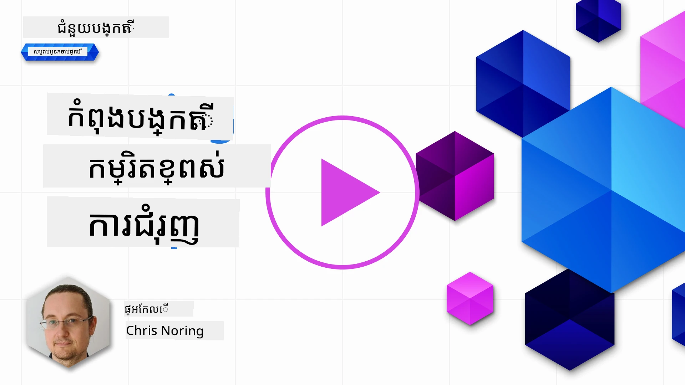

# បង្កើតប្រធានបទជ្រៅជាងគេ

[](https://youtu.be/BAjzkaCdRok?si=NmUIyRf7-cDgbjtt)

ចង់បញ្ជាក់ម្តងទៀតអំពីអ្វីដែលបានរៀនពីជំពូកមុន៖

> ការរចនាប្រធានបទ _engineering_ គឺជាលទ្ធផលដែលយើង **ណែនាំម៉ូដែលឲ្យបានចម្លើយដែលមានការតភ្ជាប់សមរម្យ** ដោយផ្តល់នូវសេចក្តីណែនាំឬបរិបទដែលមានប្រយោជន៍ជាងមុន។

ក៏មានជំហានពីរដើម្បីសរសេរប្រធានបទ៖ ការសង់សង់ប្រធានបទ ដោយផ្តល់បរិបទដែលពាក់ព័ន្ធ និង _optimization_ គឺជាវិធីសាស្រ្តធ្វើឲ្យប្រធានបទកាន់តែប្រសើរ​យ៉ាង​ណា​ណា។

នៅចំណុចនេះយើងមានការយល់ដឹងមូលដ្ឋានពីរបៀបសរសេរប្រធានបទហើយ ប៉ុន្តែយើងត្រូវចូលជ្រៅជាងនេះ។ ក្នុងជំពូកនេះ អ្នកនឹងឆ្លងកាត់ពីការព្យាយាមប្រើប្រាស់ប្រធានបទផ្សេងៗ ទៅរកការយល់ដឹងថាហេតុអ្វីប្រធានបទមួយល្អជាងមួយផ្សេងទៀត។ អ្នកនឹងរៀនពីរបៀបសាងសង់ប្រធានបទដោយអនុវត្តវិធីសាស្រ្តមូលដ្ឋានមួយចំនួនដែលអាចប្រើបាននៅលើ LLM មួយណាក៏ដោយ។

## ការណែនាំ

ក្នុងជំពូកនេះ យើងនឹងគ្របដណ្តប់លើប្រធានបទខាងក្រោម៖

- ពង្រឹងចំណេះដឹងរបស់អ្នកអំពីការរចនាប្រធានបទដោយប្រើវិធីសាស្រ្តផ្សេងៗទៅលើប្រធានបទរបស់អ្នក។
- កំណត់ប្រធានបទរបស់អ្នកដើម្បីប្រែប្រួលលទ្ធផលចេញ។

## គោលដៅការរៀន

បន្ទាប់ពីបញ្ចប់មេរៀននេះ អ្នកនឹងអាច៖

- អនុវត្តវិធីសាស្រ្តរចនាប្រធានបទដែលធ្វើឲ្យលទ្ធផលរបស់ប្រធានបទអ្នកកាន់តែប្រសើរ។
- ធ្វើការបង្ហាញ (prompting) ដែលអាចមានការប្រែប្រួល ឬក៏មានលទ្ធផលជាការបញ្ជាក់ជាក់លាក់។

## ការរចនាប្រធានបទ

ការរចនាប្រធានបទគឺជាដំណើរការបង្កើតប្រធានបទដែលនឹងបង្កើតលទ្ធផលដែលចង់បាន។ មានច្រើនជាងតែសរសេរប្រធានបទមួយទេ។ ការរចនាប្រធានបទមិនមែនជាវិស្វកម្មជាក់លាក់ទេ ប៉ុន្តែជាវិធីសាស្រ្តមួយចំនួនដែលអ្នកអាចអនុវត្តដើម្បីទទួលបានលទ្ធផលដែលចង់បាន។

### ឧទាហរណ៍នៃប្រធានបទមួយ

យើងលេងប្រធានបទមូលដ្ឋានមួយដូចនេះ៖

> បង្កើតសំណួរចំនួន ១០ អំពីភូមិសាស្ត្រ។

ក្នុងប្រធានបទនេះ អ្នកកំពុងអនុវត្តវិធីសាស្រ្តប្រធានបទនានា។

យើងអាចបំបែកបាន៖

- **បរិបទ** អ្នកបញ្ជាក់ថាត្រូវមានពាក់ព័ន្ធ "ភូមិសាស្ត្រ"។
- **ការកំណត់លទ្ធផល** អ្នកចង់បានមិនលើស ១០ សំណួរ។

### កំណត់អត្រារបស់ការបង្ហាញប្រធានបទសាមញ្ញ

អ្នកអាចនឹងទទួលបានលទ្ធផលដែលចង់បាន ឬអត់ក៏បាន។ អ្នកនឹងទទួលបានសំណួររបស់អ្នក ប៉ុន្តែភូមិសាស្ត្រជាប្រធានបទធំ ហើយអ្នកអាចមិនទទួលបានអ្វីដែលអ្នកចង់បានដោយហេតុផលដូចខាងក្រោម៖

- **ប្រធានបទធំ** អ្នកមិនដឹងថាតើវានឹងពាក់ព័ន្ធជាមួយប្រទេស ទីរាជធានី ទន្លេ ឬព្រឹត្តិការណ៍ផ្សេងទៀត។
- **ទ្រង់ទ្រាយ** តើតើអ្នកចង់បានសំណួរដែលត្រូវបានរៀបចំជាទ្រង់ទ្រាយណាមួយឬ?

ដូចដែលអ្នកឃើញ មានច្រើនបញ្ហាត្រូវគិតពិចារណា នៅពេលបង្កើតប្រធានបទ។

ដល់ពេលនេះ យើងបានឃើញឧទាហរណ៍ប្រធានបទសាមញ្ញមួយ ប៉ុន្តែក្នុង AI បង្កើត ថ្ងៃនេះកាន់តែមានសមត្ថភាពជួយមនុស្សក្នុងតួនាទីនិងឧស្សាហកម្មផ្សេងៗ។ យើងនឹងស្វែងយល់វិធីសាស្រ្តមូលដ្ឋានខាងក្រោម។

### វិធីសាស្រ្តសម្រាប់ការបង្ហាញប្រធានបទ

ដំបូង យើងត្រូវយល់ថាបង្ហាញប្រធានបទគឺជាគុណលក្ខណៈ _emergent_ នៃ LLM មានន័យថា វាមិនមែនជាលក្ខណៈដែលបានបង្កើតនៅក្នុងម៉ូដែលដោយផ្ទាល់ទេ ប៉ុន្តែជារឿងដែលយើងស្វែងរកបាននៅពេលប្រើម៉ូដែល។

មានវិធីសាស្រ្តសាមញ្ញជាច្រើនសម្រាប់បង្ហាញប្រធានបទលើ LLM។ យើងនឹងបញ្ជាក់ខាងក្រោម។

- **Zero-shot prompting** វាជារបៀបបង្ហាញប្រធានបទសាមញ្ញបំផុត។ ជាប្រធានបទតែមួយដែលស្នើសុំចម្លើយពី LLM ដោយផ្អែកលើទិន្នន័យបណ្តុំនោះ។
- **Few-shot prompting** ប្រភេទនេះណែនាំ LLM ដោយផ្តល់ឧទាហរណ៍មួយ ឬច្រើនសម្រាប់ឱ្យទុកចិត្តដោយវាអាចផ្គត់ផ្គង់ចម្លើយបានល្អ។
- **Chain-of-thought** ប្រភេទនេះប្រាប់ LLM ថាតើធ្វើដូចម្ដេចដើម្បីបំបែកបញ្ហាជាជំហានៗ។
- **Generated knowledge** ដើម្បីបង្កើនលទ្ធផលនៃប្រធានបទ អ្នកអាចផ្តល់បានពត៌មាន ឬចំណេះដឹងបន្ថែមជាមួយនឹងប្រធានបទរបស់អ្នក។
- **Least to most** ដូចជា chain-of-thought វិធីសាស្រ្តនេះទាក់ទងនឹងការបំបែកបញ្ហាជាចំណុចតូចៗ ហើយបន្ទាប់មកស្នើឲ្យអនុវត្តជាលំដាប់។
- **Self-refine** វិធីសាស្រ្តនេះត្រូវបានអនុវត្តដោយពិនិត្យកំហុសពីលទ្ធផលរបស់ LLM ហើយស្នើឲ្យវាប្រសើរឡើងវិញ។
- **Maieutic prompting** អ្វីដែលអ្នកចង់បានគឺធ្វើឲ្យប្រាកដថាចម្លើយល្អហើយស្នើឲ្យវាអធិប្បាយបណ្តា​ផ្នែកនៃចម្លើយ។ វាជារបៀបមួយនៃ self-refine។

### Zero-shot prompting

របៀបបង្ហាញប្រធានបទនេះសាមញ្ញខ្លាំង មានតែប្រធានបទតែមួយ។ វា​គឺ​អាចជារបៀប​ដែល​អ្នក​កំពុង​ប្រើ​នៅពេលថ្មីៗនេះ រៀនអំពី LLM។ ឧទាហរណ៍៖

- ប្រធានបទ៖ "Algebra គឺជាអ្វី?"
- ចម្លើយ៖ "Algebra គឺជាខ្នះផ្នែកមួយនៃគណិតវិទ្យាដែលសិក្សា​សញ្ញាគណិតវិទ្យា និង​ច្បាប់សម្រាប់ប្រើប្រាស់សញ្ញាទាំងនេះ។"

### Few-shot prompting

របៀបនេះជួយម៉ូដែលដោយផ្តល់ឧទាហរណ៍មួយចំនួនជាមួយសំណើ។ វាមានប្រធានបទតែមួយដែលមានទិន្នន័យពិសេសបន្ថែម។ ឧទាហរណ៍៖

- ប្រធានបទ៖ "សរសេរលექსវិភាគតាមរចនាបថ Shakespeare។ នៅទីនេះមានឧទាហរណ៍របស់សូនេត Shakespeare:
  Sonnet 18: 'តើខ្ញុំនឹងប្រៀបធៀបអ្នកជាមួយថ្ងៃរដូវក្ដៅមែនទេ? អ្នកមានភាពស្រស់បំព្រង និងសីតុណ្ហភាពត្រឹមត្រូវ...'
  Sonnet 116: 'អោយខ្ញុំមិនបដិសេធការចង្វាក់នៃមនសិការ​ពិតប្រាកដទេ។ ស្រលាញ់មិនមែនជាស្រលាញ់ លើកលែងតែវាប្រែប្រួលបានពេលមានការប្រែប្រួល...'
  Sonnet 132: 'ភ្នែករបស់អ្នកខ្ញុំស្រលាញ់ ហើយពួកវាស្មោះត្រង់ជាមួយខ្ញុំ ជ្រាបថបេះដូងអ្នកធ្វើឲ្យខ្ញុំរងទុក្ខដោយការមិនពេញចិត្ត,...'
  ឥឡូវនេះ សរសេរសូនេតមួយអំពីសោភ័ណភាពនៃព្រះច័ន្ទ។"
- ចម្លើយ៖ "លើមេឃ ព្រះច័ន្ទបញ្ចាំងពន្លឺទន់ភ្លឺ ជាលំដាប់លំដោយក្នុងពន្លឺប្រាក់ដែលប្រែផ្តល់សេចក្តីមេត្តា,..."

ឧទាហរណ៍នានាជួយ LLM ឲ្យយល់ពីបរិបទ ទ្រង់ទ្រាយ ឬរចនាបថនៃលទ្ធផលដែលចង់បាន។ វាជួយម៉ូដែលយល់ពីភារកិច្ចពិសេស ហើយបង្កើតចម្លើយដែលត្រឹមត្រូវ និងពាក់ព័ន្ធជាងមុន។

### Chain-of-thought

Chain-of-thought ជាវិធីសាស្រ្តគួរឱ្យចាប់អារម្មណ៍ណាស់ ពីព្រោះវាបំបែកបញ្ហាទៅជាជំហានៗសម្រាប់ LLM។ គំនិតគឺបញ្ជλαម LLM ដើម្បីឲ្យវាអាចដោះស្រាយកិច្ចការដោយលំដាប់ជំហាន។ ពិនិត្យឧទាហរណ៍ខាងក្រោម៖

    - ប្រធានបទ៖ "Alice មានផ្លែប៉ោម ៥ ផ្លែ បោះ ៣ ផ្លែ ផ្ដល់ ២ ផ្លែទៅ Bob ហើយ Bob ផ្ដល់មួយត្រឡប់ប្រគល់ តើ Alice មានប៉ុន្មានផ្លែប៉ោម?"
    - ចម្លើយ៖ ៥

LLM ឆ្លើយថា ៥ ដែលខុស។ ចម្លើយត្រឹមត្រូវគឺ ១ ផ្លែ ដែលគណនាដូចជា (5 -3 -2 + 1 = 1)។

តើរបៀបណាអាចបង្រៀន LLM ឲ្យធ្វើឲ្យត្រឹមត្រូវ?

ចង់ព្យាយាម chain-of-thought។ ការអនុវត្តគឺ៖

1. ផ្ដល់ឧទាហរណ៍ដូចគ្នាឲ្យ LLM។
1. បង្ហាញការគណនា ហើយរបៀបគណនាត្រឹមត្រូវ។
1. ផ្ដល់ប្រធានបទដើមវិញ។

របៀបនេះ៖

- ប្រធានបទ៖ "Lisa មានផ្លែប៉ោម ៧ ផ្លែ បោះ ១ ផ្លែ ផ្ដល់ ៤ ផ្លែទៅ Bart ហើយ Bart ផ្ដល់មួយត្រឡប់៖
  7 -1 = 6
  6 -4 = 2
  2 +1 = 3  
  Alice មានផ្លែប៉ោម ៥ ផ្លែ បោះ ៣ ផ្លែ ផ្ដល់ ២ ទៅ Bob ហើយ Bob ផ្ដល់មួយត្រឡប់ តើ Alice មានប៉ុន្មានផ្លែ?"
  ចម្លើយ៖ ១

សូមមើលអ្វីដែលយើង​សរសេរប្រធានបទវែងជាងមុន មានឧទាហរណ៍ផ្សេងទៀត ការគណនា ហើយបន្ទាប់មកប្រធានបទដើម ហើយយើងទទួលបានចម្លើយត្រឹមត្រូវ ១។

ដូចដែលអ្នកឃើញ chain-of-thought ជាវិធីសាស្រ្តមានអំណាចខ្លាំងណាស់។

### ចំណេះដឹងបង្កើតឡើង

ជាច្រើនដងពេលអ្នកចង់សាងសង់ប្រធានបទ អ្នកចង់ប្រើទិន្នន័យរបស់ក្រុមហ៊ុនខ្លួនឯង។ អ្នកចង់ឲ្យបរិបទមួយនៃប្រធានបទមកពីក្រុមហ៊ុន ហើយផ្នែកផ្សេងគឺប្រធានបទដែលអ្នកចាប់អារម្មណ៍។

ឧទាហរណ៍ នេះជារបៀបប្រធានបទរបស់អ្នកបើអ្នកស្ថិតក្នុងវិស័យធានារ៉ាប់រង៖

```text
{{company}}: {{company_name}}
{{products}}:
{{products_list}}
Please suggest an insurance given the following budget and requirements:
Budget: {{budget}}
Requirements: {{requirements}}
```
  
ខាងលើ អ្នកឃើញរបៀបសង់ប្រធានបទដោយប្រើទ្រង់ទ្រាយមួយនៅក្នុងព្រំទំហំមួយ។ នៅក្នុងទ្រង់ទ្រាយ មានអថេរច្រើន ដែលតំណាងដោយ `{{variable}}` ដែលនឹងត្រូវបានជំនួសដោយតម្លៃពិតពី API របស់ក្រុមហ៊ុន។

នេះជាឧទាហរណ៍របៀបប្រធានបទក្រោយពេលអថេរបានផ្លាស់ប្តូរជាមួយខ្លឹមសារពីក្រុមហ៊ុនរបស់អ្នក៖

```text
Insurance company: ACME Insurance
Insurance products (cost per month):
- Car, cheap, 500 USD
- Car, expensive, 1100 USD
- Home, cheap, 600 USD
- Home, expensive, 1200 USD
- Life, cheap, 100 USD

Please suggest an insurance given the following budget and requirements:
Budget: $1000
Requirements: Car, Home, and Life insurance
```
  
ការបង្ហាញ​ប្រធានបទនេះត្រូវបញ្ចូលទៅក្នុង LLM នឹងផ្តល់ចម្លើយដូចខាងក្រោម៖

```output
Given the budget and requirements, we suggest the following insurance package from ACME Insurance:
- Car, cheap, 500 USD
- Home, cheap, 600 USD
- Life, cheap, 100 USD
Total cost: $1,200 USD
```
  
ដូចដែលអ្នកឃើញ វាក៏ស្នើធានារ៉ាប់រយជីវិតដែលមិនគួរឲ្យមានផងដែរ។ លទ្ធផលនេះបង្ហាញថាយើងត្រូវគ្រប់គ្រងប្រធានបទដោយប្តូរវាទៅជាប្រធានបទច្បាស់លាស់អំពីអ្វីដែលអាចអនុញ្ញាតបាន។ បន្ទាប់ពី _ព្យាយាមនិងកំហុស_ យើងបានប្រធានបទដូចខាងក្រោម៖

```text
Insurance company: ACME Insurance
Insurance products (cost per month):
- type: Car, cheap, cost: 500 USD
- type: Car, expensive, cost: 1100 USD
- type: Home, cheap, cost: 600 USD
- type: Home, expensive, cost: 1200 USD
- type: Life, cheap, cost: 100 USD

Please suggest an insurance given the following budget and requirements:
Budget: $1000 restrict choice to types: Car, Home
```
  
សូមមើលថា ការបន្ថែម _type_ និង _cost_ ហើយប្រើពាក្យគន្លឹះ _restrict_ ជួយឲ្យ LLM យល់ថាតើយើងចង់បានអ្វី។

ឥឡូវយើងទទួលបានចម្លើយដូចខាងក្រោម៖

```output
Given the budget and requirements, we suggest the Car, Cheap insurance product which costs 500 USD per month.
```
  
គោលបំណងនៃឧទាហរណ៍នេះ គឺបង្ហាញថា ទោះបីជាយើងប្រើវិធីសាស្រ្តមូលដ្ឋានដូចជា _generated knowledge_ ក៏ដោយ យើងត្រូវតែធ្វើឲ្យប្រធានបទកាន់តែប្រសើរឡើងក្នុងករណីភាគច្រើន។

### Least-to-most

គំនិតនៃ Least-to-most prompting គឺបំបែកបញ្ហាធំទៅជាចំណុចតូចៗ។ ដូច្នេះ អ្នកជួយណែនាំ LLM ឲ្យ "កាន់តែយកឈ្នះ" បញ្ហាមួយដែលធំជាង។ ឧទាហរណ៍ល្អសម្រាប់វិទ្យាសាស្រ្តទិន្នន័យដែលអ្នកអាចស្នើរឲ្យ LLM ចែកបញ្ហាតាមដូចខាងក្រោម៖

> ប្រធានបទ៖ តើធ្វើវិទ្យាសាស្រ្តទិន្នន័យក្នុង ៥ ជំហានដូចម្ដេច?

ជាមួយជំនួយ AI របស់អ្នក ដែលឆ្លើយតបជាមួយ៖

1. ប្រមូលទិន្នន័យ  
1. សំអាតទិន្នន័យ  
1. វិភាគទិន្នន័យ  
1. គូសតារាងទិន្នន័យ  
1. ដាក់បង្ហាញទិន្នន័យ

### Self-refine បញ្ចាក់លទ្ធផល

ជាមួយ AI បង្កើត និង LLM អ្នកមិនអាចទុកចិត្តលទ្ធផលបានទេ។ អ្នកត្រូវត្រួតពិនិត្យវា។ បន្ទាប់ពីសព្វថ្ងៃ LLM គ្រាន់តែបង្ហាញអ្វីដែលមិនពិតជាក្នុងចិត្តនោះទេ ប្រសើរតែស្នើឲ្យវាពិនិត្យខ្លួនឯង ហើយនេះហៅថាវិធីសាស្រ្ត self-refine។

វិធីសាស្រ្តដំណើរការមានដូចជា៖

1. ប្រធានបទដើមស្នើឲ្យ LLM ដោះស្រាយបញ្ហា
1. LLM ឆ្លើយ
1. អ្នកប្រើប្រាស់វាយតម្លៃចម្លើយនៅលើ និងស្នើឲ្យវាប្រសើរឡើងវិញ
1. LLM ឆ្លើយវិញ ដែលគិតគូរជាមួយវាយតម្លៃនោះ និងផ្ដល់ដំណោះស្រាយ

អ្នកអាចធ្វើវិធីនេះបន្តជាច្រើនដងតាមចិត្ត។

នេះជាឧទាហរណ៍ប្រើវិធីសាស្រ្តនេះ៖

> ប្រធានបទ៖ "បង្កើត Python Web API មានផ្លូវ routes ទី្រកទំនិញ និងអតិថិជន"

ចម្លើយ AI:

```python
import flask
app = Flask(__name__)

@app.route('/products')
def products():
    return 'Products'

@app.route('/customers')
def customers():
    return 'Customers'
```
  
> ប្រធានបទ៖ សូមផ្ដល់សំណើផ្លាស់ប្ដូរចំនួន ៣ សម្រាប់កូដខាងលើ

ចម្លើយ AI:

```text
Sure, here are three suggestions to improve the code:

Import the correct module: The first line should import Flask instead of flask. The correct import statement should be from flask import Flask.

Add a main function: Add a if __name__ == '__main__': block to the end of the file to run the application when the file is executed.

Use f-strings: Use f-strings to format the return statements in the route functions. For example, return 'Products' can be changed to return f'This is the {request.path} page'.
```
  
```python
from flask import Flask, request

app = Flask(__name__)

@app.route('/products')
def products():
    return f'This is the {request.path} page'

@app.route('/customers')
def customers():
    return f'This is the {request.path} page'

if __name__ == '__main__':
    app.run()
```
  
ដូចដែលអ្នកឃើញ ចម្លើយ AI ខាងលើកំពុងធ្វើអោយកូដដំបូងកាន់តែល្អឡើង ពីការវាយតម្លៃលើចម្លើយដំបូង។

### Maieutic prompting

Maieutic prompting គឺជាវិធីសាស្រ្តដែលស្រដៀងនឹង self-refine ប៉ុន្តែវាជាចំណុចស្នើឲ្យ LLM ពន្យល់ខ្លួនឯង។ គោលបំណងគឺកាត់បន្ថយភាពមិនស៊ាំស្អាត ឲ្យ LLM ទៅដល់ចម្លើយត្រឹមត្រូវ។ ដំណើរការត្រូវធ្វើដូចខាងក្រោម៖

1. សំណើឲ្យ LLM ឆ្លើយសំណួរ
1. សម្រាប់រាល់ផ្នែកនៃចម្លើយ ស្នើឲ្យ LLM ពន្យល់រំលឹកបន្ថែម។
1. ប្រសិនបើមានកំហុស អោយច្រានចោលផ្នែកដែលមិនស្រប។

ធ្វើជាដើមចំនួន ២ និង ៣ រហូតដល់ពេញចិត្តនឹងចម្លើយ។

នេះជាឧទាហរណ៍ប្រធានបទ៖

> ប្រធានបទ៖ តើធ្វើម៉េចដើម្បីបង្កើតផែនការប្រឈមមុខការរីករាលដាលជំងឺក្នុង៥ជំហាន?
> LLM ចម្លើយ៖

```text
1. Identify the risks
1. Identify the stakeholders
1. Identify the resources
1. Identify the actions
1. Identify the communication channels
```
  
វាបញ្ជាក់ចំនួន ៥ ជំហាន ប៉ុន្តែតើយើងអាចបញ្ជាក់ថាតើវាត្រឹមត្រូវឬទេ? តើសូមស្នើឲ្យ LLM ពន្យល់រាល់ជំហាន៖

> ប្រធានបទ៖ ពន្យល់ជំហានដំបូងក្នុងលម្អិត តើមានហានិភ័យអ្វីខ្លះនៅក្នុងការរីករាលដាលជំងឺ?

```text
The risks are the following:

- Loss of life
- Loss of business
- Loss of reputation
- Loss of customers
- Loss of employees
```
  
នៅពេលនេះ យើងចង់ធ្វើឲ្យប្រាកដថា LLM ត្រឹមត្រូវ ដូច្នេះស្នើឲ្យវាពន្យល់ហានិភ័យដំបូងក្នុងលម្អិត ហើយសង្ឃឹមថាវា​ស្រប​នឹង​ចម្លើយខាងលើ៖

> ប្រធានបទ៖ ក្នុងការរីករាលដាលជំងឺ ហានិភ័យធំជាងគេគឺអ្វី ហើយហេតុអ្វី?

```text
The biggest risk is loss of life because it's the most important thing to protect.
```
  
> ហានិភ័យធំជាងគេពីរដូចម្ដេចនៅក្នុងការរីករាលដាលជំងឺ?

```text
The two biggest risks are loss of life and loss of business.
```
  
នៅជុំវិញចំណុចនេះ LLM មានភាពស្របគ្នា ហើយបានចុះបញ្ជីថា "ជីវិត" និង "អាជីវកម្ម" ជាហានិភ័យធំជាងគេពីរគត់។ យើងអាចបន្តទៅជំហានបន្ទាប់បាន ហើយមានសេចក្ដីជឿជាក់ខ្លាំង។ ទោះជាយ៉ាងណា យើងមិនគួរដាក់ទុកចិត្តលើ LLM ដោយមិនពិនិត្យទេ ត្រូវត្រួតពិនិត្យសេចក្ដីបញ្ចេញពិតជានឹងត្រឹមត្រូវជានិច្ច។

## ប្រែប្រួលលទ្ធផល

LLM មានលក្ខណៈមិនកំណត់ទេ (nondeterministic) មានន័យថា អ្នកនឹងទទួលបានលទ្ធផលផ្សេងគ្នារៀងរាល់ពេល អ្នកបើកប្រធានបទដដែលម្តងទៀត។ ឧទាហរណ៍សាកល្បងប្រធានបទខាងក្រោម៖

> "បង្កើតកូដសម្រាប់ Python Web API"

```python
# នាំចូលម៉ូឌុលដែលចាំបាច់
import flask
from flask import request, jsonify

# បង្កើតកម្មវិធី Flask
app = flask.Flask(__name__)

# បង្កើតផ្លូវសម្រាប់ API
@app.route('/api', methods=['GET'])
def api():
    # ទទួលយកទិន្នន័យពីការស្នើសុំ
    data = request.args

    # ដំណើរការទិន្នន័យ
    result = process_data(data)

    # ត្រឡប់លទ្ធផលជារूप JSON
    return jsonify(result)

# មុខងារដើម្បីដំណើរការទិន្នន័យ
def process_data(data):
    # ធ្វើអ្វីមួយជាមួយទិន្នន័យ
    result = data + 1

    # ត្រឡប់លទ្ធផល
    return result

# សារប្រតិបត្តិការ កម្មវិធី
if __name__ == '__main__':
    app.run()

```
  
វិញម្តងទៀត ការរត់ប្រធានបទដូចគ្នាពីរបង្កើតចម្លើយខុសគ្នាបន្តិច៖

```python
#នាំចូលកញ្ចប់ដែលចាំបាច់
import flask
from flask import request, jsonify

#សូមបង្កើតកម្មវិធី Flask
app = flask.Flask(__name__)
app.config["DEBUG"] = True

#បង្កើតបញ្ជីសៀវភៅ
books = [
    {'id': 0,
     'title': 'A Fire Upon the Deep',
     'author': 'Vernor Vinge',
     'first_sentence': 'The coldsleep itself was dreamless.',
     'year_published': '1992'},
    {'id': 1,
     'title': 'The Ones Who Walk Away From Omelas',
     'author': 'Ursula K. Le Guin',
     'first_sentence': 'With a clamor of bells that set the swallows soaring, the Festival of Summer came to the city Omelas, bright-towered by the sea.',
     'published': '1973'},
    {'id': 2,
     'title': 'Dhalgren',
     'author': 'Samuel R. Delany',
     'first_sentence': 'to wound the autumnal city.',
     'published': '1975'}
]

#បង្កើតច្រកចេញសម្រាប់ API
@app.route('/', methods=['GET'])
def home():
    return '''<h1>Books API</h1>
<p>A prototype API for retrieving books.</p>'''

#បង្កើតច្រកចេញដើម្បីបញ្ចូនសៀវភៅទាំងអស់
@app.route('/api/v1/resources/books/all', methods=['GET'])
def api_all():
    return jsonify(books)

#បង្កើតច្រកចេញដើម្បីបញ្ចូនសៀវភៅតែមួយ
@app.route('/api/v1/resources/books', methods=['GET'])
def api_id():
    #ពិនិត្យមើលថាតើមាន ID ត្រូវផ្តល់ជាផ្នែកនៃ URL ដែរឬទេ
    #ប្រសិនបើមាន ID ត្រូវផ្តល់ ជូនវាទៅខ្នាតមួយ
    #ប្រសិនបើគ្មាន ID ត្រូវផ្តល់ បង្ហាញកំហុស
    if 'id' in request.args:
        id = int(request.args['id'])
    else:
        return "Error: No id field provided. Please specify an id."

    #បង្កើតបញ្ជីទទេសម្រាប់លទ្ធផលរបស់យើង
    results = []

    #វិលជុំឆ្លងកាត់ទិន្នន័យ ហើយផ្គូផ្គងលទ្ធផលដែលសមរម្យនឹង ID ដែលបានស្នើ
    #ID គឺមានតែមួយ តែវាលផ្សេងទៀតអាចបញ្ចូនលទ្ធផលជាច្រើន
    for book in books:
        if book['id'] == id:
            results.append(book)

    #ប្រើមុខងារ jsonify ពី Flask ដើម្បីបម្លែងបញ្ជីរបស់យើង
    #ពាក្យកោណ Python ទៅជាទ្រង់ទ្រាយ JSON
    return jsonify(results)

app.run()
```
  
> តើលទ្ធផលប្រែប្រួលនេះមានបញ្ហាទេ?

វាអាស្រ័យលើអ្វីដែលអ្នកចង់បាន។ ប្រសិនបើអ្នកចង់បានចម្លើយជាក់លាក់ វាជាបញ្ហា។ ប្រសិនបើអ្នកមិនបារម្ភលទ្ធផលផ្សេងៗដូចជា "បង្កើតសំណួរចំនួន ៣ អំពីភូមិសាស្ត្រ" នោះវាមានបញ្ហាឃងទេ។

### ប្រើកម្រិតសីតុណ្ហភាពដើម្បីប្រែប្រួលលទ្ធផលរបស់អ្នក

ល្អ! រួចរាល់ យើងបានសម្រេចថាចង់កំណត់លទ្ធផលឲ្យអាចទាយទាស់ បានច្បាស់លាស់ ហើយមានលទ្ធផលដែលងាយទាក់ទង។ តើយើងធ្វើដូចម្តេច?

សីតុណ្ហភាពគឺជាតម្លៃចន្លោះពី ០ ទៅ ១ ដែល ០ មានន័យថា លទ្ធផលកាន់តែច្បាស់លាស់ និង ១ មានន័យថា លទ្ធផលមានការផ្លាស់ប្តូរច្រើន។ តម្លៃលំនាំដើមគឺ ០.៧។ មើលអ្វីកើតឡើងនៅពេលចាប់ផ្តើមរត់ប្រធានបទពីរដងដោយកំណត់សីតុណ្ហភាព ០.១៖

> "បង្កើតកូដសម្រាប់ Python Web API"

```python
#នាំចូលបណ្ណាល័យដែលចាំបាច់
import flask
from flask import request, jsonify

#បង្កើតអង្គភាពមួយនៃថ្នាក់ Flask
app = flask.Flask(__name__)

#បង្កើតចំណុចបញ្ចូលសម្រាប់ API
@app.route('/api/v1/endpoint', methods=['GET'])
def api_endpoint():
    #ទទួលបានទិន្នន័យសំណើ
    data = request.get_json()

    #ដំណើរការទិន្នន័យ
    result = process_data(data)

    #ត្រឡប់លទ្ធផល
    return jsonify(result)

#មុខងារដើម្បីដំណើរការទិន្នន័យ
def process_data(data):
    #ដំណើរការទិន្នន័យ
    result = {'result': 'success'}

    #ត្រឡប់លទ្ធផល
    return result

#រត់កម្មវិធី Flask
if __name__ == '__main__':
    app.run()

```
  
រត់ប្រធានបទម្ដងទៀតផ្ដល់លទ្ធផលដូចទៅនឹងនេះ៖

```python
#នាំចូលបណ្ណាល័យដែលចាំបាច់
import flask
from flask import request, jsonify

#បង្កើតកម្មវិធី Flask
app = flask.Flask(__name__)

#បង្កើតផ្លូវសម្រាប់ API
@app.route('/api', methods=['GET'])
def api_call():
    #ទទួលបានទិន្នន័យពីការស្នើរសុំ
    data = request.get_json()

    #ដំណើរការទិន្នន័យ
    result = process_data(data)

    #ឆែកតបលទ្ធផល
    return jsonify(result)

#កំណត់មុខងារ process_data
def process_data(data):
    #ធ្វើអ្វីមួយជាមួយទិន្នន័យ
    result = data + 1

    #ត្រឡប់លទ្ធផល
    return result

#ប្រតិបត្តិកម្មវិធី
if __name__ == '__main__':
    app.run()

```
  
មានភាពខុសគ្នាខ្លះតែតិចរវាងលទ្ធផលទាំងពីរ។ យើងអាចធ្វើវិញវិញទៀត ប៉ុន្តែនៅពេលនេះកំណត់សីតុណ្ហភាពទី ០.៩៖

```python
# នាំចូលបណ្ណាល័យដែលចាំបាច់
import flask
from flask import request, jsonify

# បង្កើតកម្មវិធី Flask
app = flask.Flask(__name__)

# បង្កើតផ្លូវសម្រាប់ API
@app.route('/api', methods=['GET'])
def api_call():
    # ទទួលបានទិន្នន័យពីសំណើ
    data = request.args

    # ប្រព្រឹត្តទៅលើទិន្នន័យ
    result = process_data(data)

    # ត្រឡប់លទ្ធផល
    return jsonify(result)

# មុខងារដើម្បីប្រព្រឹត្តន៍ទិន្នន័យ
def process_data(data):
    # ធ្វើអ្វីមួយជាមួយទិន្នន័យ
    result = data + 1

    # ត្រឡប់លទ្ធផល
    return result

# រត់កម្មវិធី
if __name__ == '__main__':
    app.run()

```
  
និងព្យាយាមលើកទីពីរនៅកម្រិតសីតុណ្ហភាព ០.៩៖

```python
import flask
from flask import request, jsonify

# បង្កើតកម្មវិធី Flask
app = flask.Flask(__name__)
app.config['DEBUG'] = True

# បង្កើតទិន្នន័យសាកល្បងខ្លះ
books = [
    {'id': 0, 'title': 'A Fire Upon The Deep', 'author': 'Vernor Vinge', 'first_sentence': 'The coldsleep itself was dreamless.', 'year_published': '1992'},
    {'id': 1, 'title': 'The Ones Who Walk Away From Omelas', 'author': 'Ursula K. Le Guin', 'first_sentence': 'With a clamor of bells that set the swallows soaring, the Festival of Summer came to the city Omelas, bright-towered by the sea.', 'published': '1973'},
    {'id': 2, 'title': 'Dhalgren', 'author': 'Samuel R. Delany', 'first_sentence': 'to wound the autumnal city.', 'published': '1975'}
]

# បង្កើតចំណុចចេញ
@app.route('/', methods=['GET'])
def home():
    return '''<h1>Welcome to our book API!</h1>'''

@app.route('/api/v1/resources/books

```
  
ដូចដែលអ្នកឃើញ លទ្ធផលមានភាពខុសគ្នាខ្លាំងណាស់។
> សំគាល់ថា មានប៉ារ៉ាម៉ែត្រជាច្រើនទៀតដែលអ្នកអាចផ្លាស់ប្តូរដើម្បីផ្លាស់ប្ដូរចេញពីលទ្ធផល ដូចជា top-k, top-p, repetition penalty, length penalty និង diversity penalty ប៉ុន្តែវានៅពីក្រៅវដ្តសិក្សានេះ។

## អនុវត្តិល្អៗ

មានអនុវត្តិជាច្រើនដែលអ្នកអាចអនុវត្តដើម្បីព្យាយាមទទួលបានអ្វីដែលអ្នកចង់បាន។ អ្នកនឹងរកឃើញរចនាប័ទ្មផ្ទាល់ខ្លួនរបស់អ្នកនៅពេលដែលអ្នកប្រើ prompting ជាច្រើន។

បន្ថែមពីលើបច្ចេកទេសដែលយើងបានគ្របដណ្តប់ មានអនុវត្តិល្អខ្លះដែលគួរបញ្ជាក់ពេលដែលធ្វើ prompting ជាមួយ LLM។

នេះគឺជាអនុវត្តិល្អៗដែលគួរពិចារណា:

- **បញ្ជាក់បរិបទ**។ បរិបទមានសារៈសំខាន់ ច越ល្អបើអ្នកអាចបញ្ជាក់ដូចជា វិស័យ ប្រធានបទ ល។ 
- កំណត់ចេញ។ បើអ្នកចង់បានចំនួនធាតុជាក់លាក់ ឬប្រវែងជាក់លាក់ សូមបញ្ជាក់វា។
- **បញ្ជាក់ទាំងអ្វី និង របៀប**។ ចងចាំបញ្ជាក់ទាំងអ្វីដែលអ្នកចង់ និងរបៀបដែលអ្នកចង់បាន ក្នុងឧទាហរណ៍ "បង្កើត Python Web API មានផ្លូវ products និង customers ចែកវាចេញជា 3 ហ្វាយល៍"។
- **ប្រើប្រាស់គំរូ**។ ជាញឹកញាប់ អ្នកនឹងចង់បន្ថែមទិន្នន័យពីក្រុមហ៊ុនរបស់អ្នកទៅក្នុង prompt។ ប្រើប្រាស់គំរូសម្រាប់ធ្វើវា។ គំរូអាចមានអថេរដែលអ្នកប្តូរជាទិន្នន័យពិត។
- **សរសេរ​ត្រឹមត្រូវ**។ LLM អាចផ្ដល់ចម្លើយត្រឹមត្រូវ ប៉ុន្តែបើអ្នកសរសេរត្រឹមត្រូវ អ្នកនឹងទទួលបានចម្លើយល្អជាង។

## កិច្ចការផ្ដល់

នេះគឺកូដ Python បង្ហាញពីរបៀបបង្កើត API ងាយៗដោយប្រើ Flask:

```python
from flask import Flask, request

app = Flask(__name__)

@app.route('/')
def hello():
    name = request.args.get('name', 'World')
    return f'Hello, {name}!'

if __name__ == '__main__':
    app.run()
```

ប្រើជំនួយការស人工បញ្ញាដូចជា GitHub Copilot ឬ ChatGPT ហើយអនុវត្តបច្ចេកទេស "self-refine" ដើម្បីកែលម្អកូដ។

## ដំណោះស្រាយ

សូមព្យាយាមដោះស្រាយកិច្ចការដោយបន្ថែម prompt ដែលសមរម្យទៅកូដ។

> [!TIP]
> បង្កើត prompt សុំឲ្យវាកែលម្អ វាជាគំនិតល្អក្នុងការកំណត់ចំនួនកែលម្អដែលចង់បាន។ អ្នកក៏អាចសុំឲ្យវាកែលម្អក្នុងរបៀបជាក់លាក់ ដូចជា ស្ថាបត្យកម្ម ប្រសិទ្ធភាព សុវត្ថិភាព ល។

[ដំណោះស្រាយ](../../../05-advanced-prompts/python/aoai-solution.py)

## ពិនិត្យចំណេះដឹង

ហេតុអ្វីបានជា ខ្ញុំគួរប្រើ chain-of-thought prompting? បង្ហាញខ្ញុំចម្លើយត្រឹមត្រូវ 1 និងចម្លើយខុស 2។

1. ដើម្បីបង្រៀន LLM របៀបដោះស្រាយបញ្ហា។
1. B, ដើម្បីបង្រៀន LLM រកកំហុសក្នុងកូដ។
1. C, ដើម្បីណែនាំ LLM ផ្តល់ដំណោះស្រាយផ្សេងៗ។

A: 1, ព្រោះ chain-of-thought គឺអំពីបង្ហាញ LLM របៀបដោះស្រាយបញ្ហាដោយផ្ដល់វាជាជំហានៗ និងបញ្ហាដូចគ្នា និងរបៀបដែលវាត្រូវបានដោះស្រាយ។

## 🚀 챌린지

អ្នកទើបតែប្រើបច្ចេកទេស self-refine ក្នុងកិច្ចការ។ សូមយកកម្មវិធីណាមួយដែលអ្នកបានបង្កើត ហើយពិចារណាថាតើអ្នកចង់កែលម្អអ្វីខ្លះទៅលើវា។ ឥឡូវនេះប្រើបច្ចេកទេស self-refine ដើម្បីអនុវត្តការផ្លាស់ប្ដូរដែលបានផ្ដល់អនុសាសន៍។ តើអ្នកមានគំនិតយ៉ាងដូចម្ដេច ចុងក្រោយលទ្ធផលល្អប្រសើរឬអាក្រក់?

## ការងារល្អ! បន្តការសិក្សារបស់អ្នក

បន្ទាប់ពីបញ្ចប់មេរៀននេះ សូមពិនិត្យអំពី [ប្រមាណការសិក្សា Generative AI របស់យើង](https://aka.ms/genai-collection?WT.mc_id=academic-105485-koreyst) ដើម្បីបន្តធ្វើឲ្យចំណេះដឹង Generative AI របស់អ្នកកាន់តែខ្លាំង!

ចូលទៅមេរៀនទី 6 នៅពេលដែលយើងនឹងអនុវត្តចំណេះដឹង Prompt Engineering ដោយ [បង្កើតកម្មវិធីផលិតអត្ថបទ](../06-text-generation-apps/README.md?WT.mc_id=academic-105485-koreyst)។

---

<!-- CO-OP TRANSLATOR DISCLAIMER START -->
**ការបដិសេធ**៖  
ឯកសារនេះត្រូវបានបកប្រែដោយប្រើសេវាបកប្រែ AI [Co-op Translator](https://github.com/Azure/co-op-translator)។ ខណៈពេលដែលយើងខិតខំផ្ដល់ភាពត្រឹមត្រូវ សូមចំណាំថាការបកប្រែដោយស្វ័យប្រវត្តិអាចមានការខុសឆ្គង ឬមិនត្រឹមត្រូវ។ ឯកសារដើមជាភាសាទាំងមូលគួរត្រូវបានដាក់ជាទ្រព្យសម្បត្តិសុទ្ធតែគោលដៅ។ សម្រាប់ព័ត៌មានសំខាន់ៗ ការបកប្រែដោយអ្នកជំនាញមនុស្សត្រូវបានណែនាំ។ យើងមិនមានភារកិច្ចចំពោះការយល់ច្រឡំ ឬការបកស្រាយខុសពីការប្រើប្រាស់ការបកប្រែនេះទេ។
<!-- CO-OP TRANSLATOR DISCLAIMER END -->