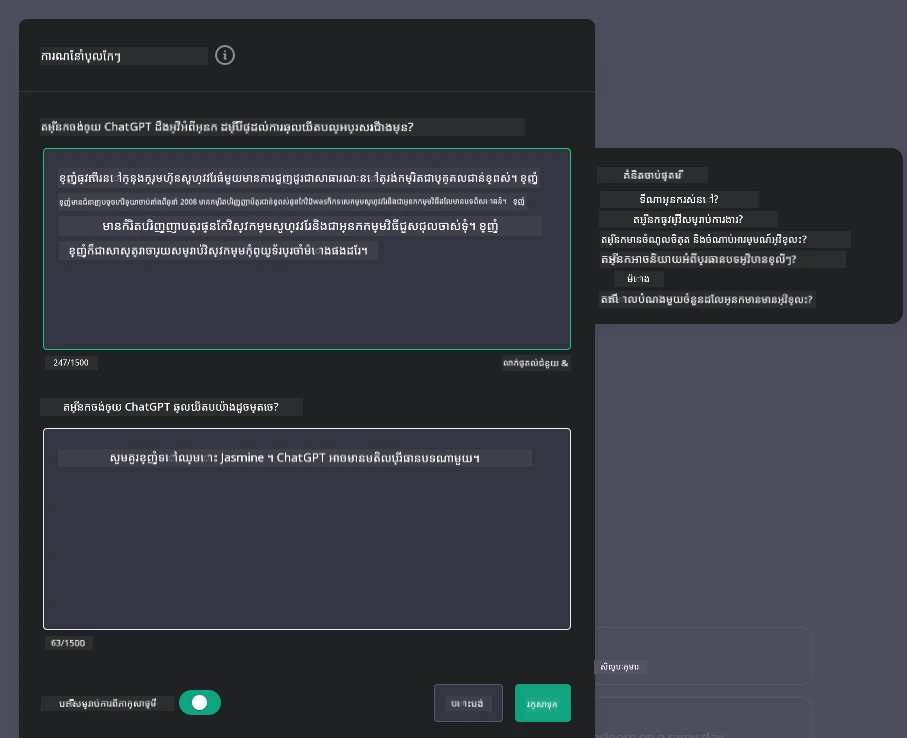
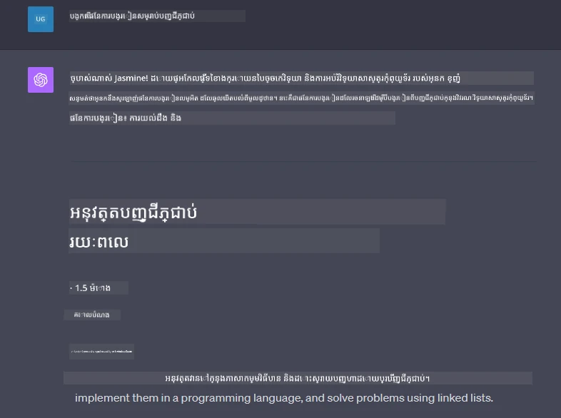

# កសាងកម្មវិធីជជែកដែលមាន Generative AI ជាថាមពល

[](https://youtu.be/R9V0ZY1BEQo?si=IHuU-fS9YWT8s4sA)

> _(ចុចរូបភាពខាងលើដើម្បីមើលវីដេអូមុខវិជ្ជានេះ)_

ឥឡូវនេះពេលដែលយើងបានឃើញពីរបៀបដែលយើងអាចកសាងកម្មវិធីបង្កើតអត្ថបទ មកមើលកម្មវិធីជជែក។

កម្មវិធីជជែកបានបញ្ចូលទៅក្នុងជីវិតប្រចាំថ្ងៃរបស់យើង ដោយផ្តល់មិនត្រឹមតែជាវិធីសម្រាប់ជជែកធម្មតាទេ។ វាជាផ្នែកសំខាន់នៃសេវាកម្មអតិថិជន ការគាំទ្របច្ចេកទេស និងប្រព័ន្ធប្រឹក្សាដែលមានភាពស្មុគស្មាញផងដែរ។ ប្រហែលជាអ្នកបានទទួលជំនួយពីកម្មវិធីជជែកមួយថ្មីៗនេះ។ ខណៈពេលយើងបញ្ចូលបច្ចេកវិទ្យាច្នៃប្រឌិតដូចជា generative AI ទៅក្នុងវេទិកាទាំងនេះ ភាពស្មុគស្មាញកើនឡើង ហើយក៏មានបញ្ហាប្រឈមកើតឡើងដែរ។

សំណួរខ្លះដែលយើងត្រូវការជំនួយបំភ្លឺមានដូចជាៈ

- **ការកសាងកម្មវិធី**។ តើយើងបញ្ចេញការកសាងនិងបញ្ចូលកម្មវិធីដែលមាន AI ជាថាមពលទាំងនេះសម្រាប់ករណីប្រើប្រាស់ជាក់លាក់បានយ៉ាងមានប្រសិទ្ធភាពដូចម្តេច?
- **ការត្រួតពិនិត្យ**។ ពេលដែលបានដាក់ជូនសាធារណៈ តើយើងអាចត្រួតពិនិត្យ ហើយធានាថាកម្មវិធីដំណើរការនៅកម្រិតគុណភាពខ្ពស់បំផុតទាំងក្នុងទ្រឹស្តី និងការអនុវត្តតាម [ប្រាញីមូលដ្ឋាន ៦ នៃ AI ដែលទទួលខុសត្រូវ](https://www.microsoft.com/ai/responsible-ai?WT.mc_id=academic-105485-koreyst) ដូចម្តេច?

អំឡុងពេលយើងឆ្លងកាត់យុគសម័យដែលត្រូវបានកំណត់ដោយស្វ័យប្រវត្តិ និងអន្តរកម្មម្ចាស់មនុស្ស - ម៉ាស៊ីន ប្រសូត្តិភាពនៃ generative AI ក្នុងការបម្លែងវិសាលភាពជំហាន និងការត្រូវខ្លួនរបស់កម្មវិធីជជែកក្លាយទៅជាប្រសិនបើប្រយោជន៍។ មុខវិជ្ជានេះនឹងសិក្សាផ្នែកនៃរោងចក្រ ដែលគាំទ្រប្រព័ន្ធស្មុគស្មាញទាំងនេះ ចូលទៅកាន់វិធីសាស្រ្តសម្រាប់ការតុបតែងសម្រាប់ភារកិច្ចជាក់លាក់ និងវាយតម្លៃគន្លងវាស់បញ្ចូលនានា និងការពិចារណាដើម្បីធានាការដាក់ចេញ AI ដែលមានការទទួលខុសត្រូវ។

## ការណែនាំ

មុខវិជ្ជានេះគ្របដណ្តប់:

- បច្ចេកទេសសម្រាប់ការកសាង និងបញ្ចូលកម្មវិធីជជែកយ៉ាងប្រសិទ្ធភាព។
- របៀបអនុវត្តន៍ការប្តូរតាមតម្រូវការនិងការតុបតែងកម្មវិធី។
- យុទ្ធសាស្រ្ត និងការពិចារណាដើម្បីត្រួតពិនិត្យកម្មវិធីជជែកយ៉ាងមានប្រសិទ្ធភាព។

## គោលបំណងសិក្សា

បញ្ចប់មុខវិជ្ជានេះ អ្នកនឹងអាច៖

- ពិពណ៌នាគន្លងនៃការកសាង និងបញ្ចូលកម្មវិធីជជែកទៅក្នុងប្រព័ន្ធដែលមានរួច។
- ប្តូរតាមតម្រូវការកម្មវិធីជជែកសម្រាប់ករណីប្រើប្រាស់ជាក់លាក់។
- កំណត់មាត្រដ្ឋានសំខាន់ៗនិងការពិចារណាដើម្បីត្រួតពិនិត្យនិងថែរក្សាគុណភាពកម្មវិធីជជែកដែលមាន AI ជាថាមពល។
- ធានាថាកម្មវិធីជជែកប្រើប្រាស់ AI យ៉ាងទទួលខុសត្រូវ។

## ការចូលរួម Generative AI ទៅក្នុងកម្មវិធីជជែក

ការលើកតម្កើងកម្មវិធីជជែកតាម generative AI មិនមែនគ្រាន់តែយកវា អោយមានភាពឆ្លាតវៃប៉ុណ្ណោះទេ ប៉ុន្តែគឺពាក់ព័ន្ធនឹងការវាស់វែងរចនាសម្ព័ន្ធ ប្រសិទ្ធភាព និងចំណុចប្រទាក់អ្នកប្រើ ដើម្បីផ្តល់បទពិសោធន៍អ្នកប្រើដែលមានគុណភាព។ វារួមបញ្ចូលការស្វែងយល់ពីមូលដ្ឋានរចនាសម្ព័ន្ធ ការបញ្ចូល API និងការពិចារណាដល់ចំណុចប្រទាក់អ្នកប្រើ។ ផ្នែកនេះគោលបំណងផ្តល់នូវផែនទីព័ត៌មានពេញលេញដើម្បីបណ្តុះបណ្តាលអ្នកឲ្យដើរតាមទិសដៅស្មុគស្មាញទាំងនេះ មិនថាអ្នកកំពុងភ្ជាប់កម្មវិធីទៅប្រព័ន្ធដែលមានរួច ឬកំពុងកសាងវាជាវេទិកាដាច់ដោយឡែក។

បញ្ចប់ផ្នែកនេះ អ្នកនឹងមានជំនាញគ្រប់គ្រាន់ក្នុងការកសាង និងបញ្ចូលកម្មវិធីជជែកយ៉ាងមានប្រសិទ្ធភាព។

### Chatbot ឬ កម្មវិធីជជែក?

មុនពេលចូលកសាងកម្មវិធីជជែក មកប្រៀបធៀប 'chatbots' និង 'កម្មវិធីជជែកដែលមាន AI ជាថាមពល' ដែលមានតួនាទី និងមុខងារផ្សេងគ្នា។ Chatbot មានគោលបំណងសំខាន់ក្នុងការអូតូម៉ាទាងភារកិច្ចជជែកជាក់លាក់ ដូចជាការឆ្លើយសំណួរញឹកញាប់ ឬតាមដានកញ្ចប់។ វាទូទៅគ្រប់គ្រងដោយច្បាប់លក្ខណៈមូលដ្ឋាន ឬអាល់ហ្គូរីធម៍ AI ស្មុគស្មាញ។ ខណៈដែលកម្មវិធីជជែកដែលមាន AI ជាថាមពល ជាបរិយាកាសដែលធំជាង ហើយរចនាឡើងដើម្បីជួយសម្រួលការប្រាស្រ័យទាក់ទងផ្នែកឌីជីថលផ្សេងៗ ដូចជាជជែកអក្សរ គូសារសំឡេង និងវីដេអូរវាងមនុស្ស។ លក្ខណៈសំខាន់របស់វាជាការបញ្ចូលម៉ូឌែល generative AI ដែលចម្លងការជជែកដូចទំនាក់ទំនងមនុស្ស ដោយបង្កើតចម្លើយធៀបទៅនឹងចូលបញ្ចូល និងបរិបទនានា។ កម្មវិធីជជែកដែលមាន generative AI អាចចូលរួមក្នុងការពិភាក្សាប្រភពបើក មានភាពអាចត្រូវបានផ្លាស់ប្តូរសម្រាប់បរិបទជជែក ក៏ដូចជាបង្កើតសន្ទនា ដែលមានភាពច្នៃប្រឌិត ឬស្មុគស្មាញ។

តារាងខាងក្រោមបង្ហាញភាពខុសគ្នានិងស្រដៀងគ្នាសំខាន់ៗ ដើម្បីជួយយើងយល់ពីតួនាទីផ្ទាល់ខ្លួនរបស់ពួកវានៅក្នុងការប្រាស្រ័យទាក់ទងឌីជីថល។

| Chatbot                                | កម្មវិធីជជែកដែលមាន Generative AI ជាថាមពល      |
| ------------------------------------- | --------------------------------------- |
| មានភារកិច្ចផ្ដោតលើការងារ និងផ្អែកលើច្បាប់   | មានការយល់ដឹងបរិបទ                     |
| ផ្សំចូលទៅក្នុងប្រព័ន្ធធំៗជាញឹកញាប់           | អាចបម្រើមាន chatbot មួយ ឬច្រើន          |
| កំណត់នៅលើមុខងារដែលបានកម្មវិធីកំណត់         | រួមបញ្ចូលម៉ូឌែល generative AI           |
| អន្តរកម្មឯកទេស និងរចនាសម្ព័ន្ធ                 | អាចធ្វើការពិភាក្សាប្រភពបើក              |

### ប្រើបច្ចេកវិទ្យាដែលបានសាងស្រាច់ជាមួយ SDK និង API

ពេលកសាងកម្មវិធីជជែក ជំហានដំបូងល្អគឺវាស់វែងថាតើមានអ្វីមានរួចហើយ។ ការប្រើប្រាស់ SDK និង API ក្នុងការកសាងកម្មវិធីជជែក ជាយុទ្ធសាស្រ្តមានអត្ថប្រយោជន៍ជាច្រើន។ ដោយបញ្ចូល SDK និង API ដែលមានឯកសារពាក់ព័ន្ធ អ្នកកំពុងដាក់ទីតាំងយុទ្ធសាស្រ្តសម្រាប់ជោគជ័យរយៈពេលវែង ដោះស្រាយបញ្ហាជាមួយការកែតម្រូវ និងថែទាំ។

- **ធ្វើឲ្យដំណើរការកែច្នៃឆាប់រហ័ស និងកាត់បន្ថយភាពធ្ងន់ធ្ងរជាតិ។** អាស្រ័យលើមុខងារដែលបានសាងស្រាច់ហើយ ភ្លាមៗបង្រៀនអ្នកអាចផ្តោតទៅលើផ្នែកផ្សេងៗរបស់កម្មវិធី ដែលអ្នកគិតថាសំខាន់ជាង ដូចជាព័ត៌មានអាជីវកម្ម។
- **ប្រសិទ្ធភាពខ្ពស់ជាង**។ ពេលដែលគេបង្កើតមុខងារពីគ្មានទុក ម្នាក់នឹងសួរថា "តើវាអាចបណ្តឹងរួចទៀតដើម្បីដោះស្រាយអ្នកប្រើលើកលែងបានយ៉ាងដូចម្តេច?" SDK និង API ដែលបានគ្រប់គ្រងល្អ មានដំណោះស្រាយបញ្ហានេះ។
- **ការថែទាំងាយស្រួល**។ ការអាប់ដេត និងបន្ថែមមុខងារងាយក្នុងការគ្រប់គ្រង ព្រោះភាគច្រើន API និង SDK ត្រូវការតែធ្វើការអាប់ដេតបណ្ណាល័យមួយពេលម៉ូឌែលថ្មីដាក់បញ្ចូល។
- **ការចូលដល់បច្ចេកវិទ្យាលំដាប់ខ្ពស់**។ ការប្រើម៉ូឌែលដែលត្រូវបានតម្លើងលំអិត និងបានបណ្តុះបណ្តាលលើឃ្លាំងទិន្នន័យធំនឹងផ្តល់បទពិសោធន៍ភាសាធម្មជាតិនៅក្នុងកម្មវិធីរបស់អ្នក។

ការចូលដល់មុខងាររបស់ SDK ឬ API ជាទូទៅត្រូវការទទួលបានការអនុញ្ញាតដើម្បីប្រើសេវាកម្មដែលបានផ្តល់ សំខាន់ជាងគេត្រូវតែប្រើកូនសោឯកជន ឬសញ្ញាសម្គាល់សុវត្ថិភាព។ យើងនឹងប្រើបណ្ណាល័យ Python របស់ OpenAI ដើម្បីស្វែងយល់ពីរបៀបដែលវាមើលទៅដូចម្តេច។ អ្នកក៏អាចសាកល្បងធ្វើវាដោយខ្លួនឯងនៅក្នុង [សៀវភៅកំណត់ត្រា OpenAI](./python/oai-assignment.ipynb?WT.mc_id=academic-105485-koreyst) រឺ [សៀវភៅកំណត់ត្រាសម្រាប់ Azure OpenAI Services](./python/aoai-assignment.ipynb?WT.mc_id=academic-105485-koreys) សម្រាប់មុខវិជ្ជានេះ។

```python
import os
from openai import OpenAI

API_KEY = os.getenv("OPENAI_API_KEY","")

client = OpenAI(
    api_key=API_KEY
    )

chat_completion = client.chat.completions.create(model="gpt-3.5-turbo", messages=[{"role": "user", "content": "Suggest two titles for an instructional lesson on chat applications for generative AI."}])
```
  
ឧទាហរណ៍ខាងលើប្រើម៉ូឌែល GPT-3.5 Turbo ដើម្បីបញ្ចប់សំណើ ប៉ុន្តែមើលឃើញថាគន្លង API ត្រូវបានកំណត់មុន។ អ្នកនឹងទទួលបានកំហុស ប្រសិនបើមិនបានកំណត់គន្លងនេះ។

## បទពិសោធន៍អ្នកប្រើ (UX)

គ្រប់តុល្យភាព UX ទូទៅអាចអនុវត្តទៅកម្មវិធីជជែក ប៉ុន្តែក៏មានការពិចារណាបន្ថែមខ្លះៗដែលមានសារៈសំខាន់ដោយសារតែលំនាំម៉ាស៊ីនរៀនមាននៅក្នុងកម្មវិធី។

- **មេកានិចសម្រាប់ដោះស្រាយភាពមិនច្បាស់**: ម៉ូឌែល generative AI ដំណើរការជាប្រចាំ ធ្វើឲ្យចម្លើយលំបាក ឬមិនច្បាស់។ មុខងារដែលអនុញ្ញាតឲ្យអ្នកប្រើសួរផ្សេងទៀតអាចជួយបំផុតប្រសិនបើពួកគេជួបបញ្ហានេះ។
- **ការរក្សាបរិបទ**: ម៉ូឌែល generative AI ខ្ពស់អាចចងចាំបរិបទក្នុងជជែក ដែលជាកំណត់សំខាន់ដល់បទពិសោធន៍អ្នកប្រើ។ ការផ្តល់ឲ្យអ្នកប្រើអាចគ្រប់គ្រងនិងបញ្ជាការរក្សាភាពបរិបទ បង្កើតបទពិសោធន៍ល្អ ប៉ុន្ត្រោះហើយមានហានិភ័យនៃការរក្សាព័ត៌មានសំភារៈដែលមានស្និទ្ធស្នាលជាមួយអ្នកប្រើ។ ការពិចារណាថាតើព័ត៌មាននេះត្រូវបានរក្សារយៈเวลាប៉ុន្មាន ដូចជាការបញ្ចូលគោលនយោបាយរក្សា អាចធ្វើតុល្យភាពរវាងតំរូវការបរិបទ និងភាពឯកជន។
- **ការផ្ទាល់ខ្លួន**: ជាមួយនឹងសមត្ថភាពរៀននិងផ្លាស់ប្ដូរ ម៉ូឌែល AI ផ្តល់បទពិសោធន៍ផ្ទាល់ខ្លួនឲ្យអ្នកប្រើ។ ការតុបតែងបទពិសោធន៍គឺតាមរយៈមុខងារដូចជា រូបប្រវត្តិអ្នកប្រើ មិនត្រឹមតែធ្វើឲ្យអ្នកប្រើមានអារម្មណ៍ថាត្រូវបានយល់កាន់តែចំ ក៏ជួយពង្រឹងការស្វែងរកចម្លើយជាក់លាក់ បង្កើតអន្តរកម្មមានប្រសិទ្ធភាព និងវាយតម្លៃល្អ។

ឧទាហរណ៍មួយនៃការផ្ទាល់ខ្លួនគឺការកំណត់ "Custom instructions" ក្នុង ChatGPT របស់ OpenAI។ វាអនុញ្ញាតឲ្យអ្នកផ្តល់ព័ត៌មានអំពីខ្លួនអ្នក ដែលអាចជាបរិបទសំខាន់សម្រាប់សំណើរបស់អ្នក។ ខាងក្រោមគឺឧទាហរណ៍នៃ custom instruction។



"profile" នេះទាក់ទង ChatGPT បង្កើតផែនការសិក្សាស្តីពី linked lists។ សូមមើលថា ChatGPT គិតបញ្ចូលថា អ្នកប្រើអាចចង់បានផែនការសិក្សាដ៏ជ្រាលជ្រៅបន្ថែមទៅលើបទពិសោធន៍របស់នាង។



### ស៊ុមសារប្រព័ន្ធ Microsoft សម្រាប់ ម៉ូឌែលភាសាដ៏ធំ

[Microsoft បានផ្តល់ការណែនាំ](https://learn.microsoft.com/azure/ai-services/openai/concepts/system-message#define-the-models-output-format?WT.mc_id=academic-105485-koreyst) សម្រាប់ការសរសេរសារប្រព័ន្ធមានប្រសិទ្ធភាពពេលបង្កើតចម្លើយពី LLM ដែលបែងចែកជា ៤ ផ្នែក:

1. កំណត់ថាម៉ូឌែលមានគោលបំណងសម្រាប់នរណា ព្រមទាំងសមត្ថភាព និងកំណត់កម្រិត។
2. កំណត់ទ្រង់ទ្រាយលទ្ធផលរបស់ម៉ូឌែល។
3. ផ្តល់ឧទាហរណ៍ជាក់លាក់ទាក់ទងនឹងអាកប្បកិរិយាចង់បានរបស់ម៉ូឌែល។
4. ផ្តល់ខ្សែដែននៃអាកប្បកិរិយាបន្ថែម។

### ភាពងាយស្វែងរក

មិនថា​អ្នកប្រើមានការខូចខាតរង្គោះ៖ មើល ទទួលសម្លេង ចលនា ឬ​អត្ថិភាពមិនល្អៗ សមត្ថភាពរចនារបស់កម្មវិធីជជែក ត្រូវតែអាចប្រើប្រាស់បានដោយអ្នកទាំងអស់។ បញ្ជីខាងក្រោមបង្ហាញពីមុខងារពិសេសសម្រាប់ពង្រឹងភាពងាយស្វែងរកសម្រាប់អ្នកមានបញ្ហានានា។

- **មុខងារសម្រាប់អ្នកមានបញ្ហាមើល**: ប្រធានបទខ្ពស់ និងអក្សរប្ដូររង្វាស់បាន សមត្ថភាពការអានអេក្រង់។
- **មុខងារសម្រាប់អ្នកមានបញ្ហាស្ដាប់**: មុខងារផ្តល់សំឡេងទៅអក្សរ និងអក្សរទៅសំឡេង គំនុំបង្ហាញសំឡេង។
- **មុខងារសម្រាប់អ្នកមានបញ្ហាចលនា**: គាំទ្ររុករកប្រើក្តារចុច សេចក្តីបញ្ជារទម្លាក់ទាំងសម្លេង។
- **មុខងារសម្រាប់អ្នកមានបញ្ហាអត្ថិភាពមនុស្ស**: ជម្រើសភាសាងាយស្រួល។

## ការប្តូរតាមតម្រូវការនិងការតុបតែងសម្រាប់ម៉ូឌែលភាសាផ្នែកដែនជាក់លាក់

ស្រមៃថាកម្មវិធីជជែកយល់ឃើញពាក្យពេចន៍របស់ក្រុមហ៊ុនអ្នក និងរំពឹងតំណើរការសំណួរជាក់លាក់ដែលអ្នកប្រើភាគច្រើនមាន។ មានមុខងារច្រើនណាក្នុងការនិយាយដូចជាៈ

- **ប្រើម៉ូឌែល DSL**។ DSL មានន័យថា domain specific language (ភាសាលេខាធិការ ជាផ្នែកដែនជាក់លាក់)។ អ្នកអាចប្រើម៉ូឌែល DSL ដែលបានបណ្តុះបណ្តាលលើផ្នែកដែនជាក់លាក់ ដើម្បីយល់បានចំណុចនិងស្ថានភាព។
- **អនុវត្តការតុបតែងតិចតួច (fine-tuning)**។ Fine-tuning គឺជាដំណើរការបណ្តុះបណ្តាលបន្ថែមម៉ូឌែលរបស់អ្នកជាមួយទិន្នន័យជាក់លាក់។

## ការប្តូរតាមតម្រូវការ៖ ប្រើ DSL

ប្រើម៉ូឌែលភាសាផ្នែកដែនជាក់លាក់ (DSL Models) អាចបង្កើនការចូលរួមរបស់អ្នកប្រើ ដោយផ្តល់អន្តរកម្មពិសេស ដែលមានផ្អែកលើបរិបទជាក់លាក់។ វាជាម៉ូឌែលដែលបានបណ្តុះបណ្តាល ឬតុបតែងឡើងវិញ ដើម្បីយល់ និងបង្កើតអត្ថបទដែលទាក់ទងនឹងវិស័យ មុខរបរ ឬប្រធានបទជាក់លាក់។ ជម្រើសក្នុងការប្រើម៉ូឌែល DSL អាចមានពីបណ្តុះឲ្យសាងស្រាយថ្មី រំពឹងទុកម៉ូឌែលដែលមានមុន តាមរយៈ SDK និង API។ ជម្រើសមួយផ្សេងទៀតគឺ fine-tuning ដែលចាប់យកម៉ូឌែលបានបណ្តុះរួចហើយ ហើយផ្លាស់ប្តូរវាសម្រាប់ផ្នែកដែនជាក់លាក់។

## ការប្តូរតាមតម្រូវការ៖ អនុវត្ត fine-tuning

Fine-tuning ត្រូវបានគេចាត់ទុក ពេលម៉ូឌែល pre-trained មិនអាចឆ្លើយតបការងារជាក់លាក់ ឬភាគីហ៊ុនជាក់លាក់។

ឧទាហរណ៍ សំណួរពេទ្យគឺស្មុគស្មាញ និងត្រូវការបរិបទច្រើន។ ពេលវេជ្ជបណ្ឌិតវាយតម្លៃអ្នកជំងឺ វាស្ថិតលើប៉ារ៉ាម៉ែត្រ ច្រើនដូចជារបៀបរស់នៅ ឬស្ថានភាពមុន និងប្រើសារព័ត៌មានវេជ្ជសាស្រ្តថ្មីៗដើម្បីបញ្ជាក់ការវាយតម្លៃ។ ក្នុងស្ថានភាពបែបនេះ កម្មវិធី AI ជជែកទូទៅមិនអាចជាដំណោះស្រាយដែលទុកចិត្តបាន។

### ស្ថានភាព៖ កម្មវិធីវេជ្ជសាស្រ្ត

សូមពិចារណាកម្មវិធីជជែកដែលរចនាឡើងសម្រាប់ជួយមនុស្សវិជ្ជាជីវៈវេជ្ជសាស្រ្ត ដោយផ្តល់អនុវត្តន៍យោងលឿនទៅលើមេរៀនព្យាបាល ប្រតិកម្មថ្នាំ ឬការស្រាវជ្រាវថ្មីៗ។

ម៉ូឌែលទូទៅប្រហែលជាអាចឆ្លើយសំណួរវេជ្ជសាស្រ្តមូលដ្ឋាន ឬផ្តល់ដំណឹងទូទៅបាន ប៉ុន្តែមិនអាចដោះស្រាយរឿង​ខាងក្រោមបានច្បាស់លាស់៖

- **ករណីដែលមានលំដាប់ខ្ពស់ ឬស្មុគស្មាញ**។ ឧទាហរណ៍ នសម្មាធិវិទ្យា អាចសួរថា "តើអំពើល្អបំផុតសម្រាប់គ្រប់គ្រងជំងឺប្រឆាំងថ្នាំសន្លាក់ប្រព័ន្ធប្រសាទក្មេងមានតើអ្វីខ្លះ?"
- **បាត់បង់ចំណេះដឹងថ្មីៗ**។ ម៉ូឌែលទូទៅអាចជួបបញ្ហាក្នុងការផ្តល់ចម្លើយបច្ចុប្បន្ន ដែលរួមបញ្ចូលចំណេះដឹងថ្មីៗ ផ្នែកប្រព័ន្ធប្រសាទ និងវេជ្ជសាស្ត្រ។

ក្នុងស្ថានភាពទាំងនេះ, fine-tuning ម៉ូឌែលជាមួយតំបន់ទិន្នន័យវេជ្ជសាស្រ្តជាក់លាក់ អាចធ្វើឲ្យមានសមត្ថភាពល្អក្នុងការចម្លើយសំណួរវេជ្ជសាស្រ្តស្មុគស្មាញបានច្បាស់លាស់ និងទុកចិត្តបាន។ វាតម្រូវឲ្យមានការចូលដល់ឃ្លាំងទិន្នន័យធំ និងពាក់ព័ន្ធ ដែលបង្ហាញពីបញ្ហា និងសំណួរដែលត្រូវពិនិត្យ។

## ការពិចារណាសម្រាប់បទពិសោធន៍ជជែកដែលមាន AI មានគុណភាពខ្ពស់

ផ្នែកនេះរៀបរាប់លក្ខណៈសម្រាប់កម្មវិធីជជែក "គុណភាពខ្ពស់" ដែលរួមបញ្ចូលទិន្នន័យមាត្រដ្ឋានដែលអាចអនុវត្តបាន និងការអនុវត្តន៍តាមគោលការណ៍ដែលទទួលខុសត្រូវក្នុងការប្រើប្រាស់ AI។

### មាត្រដ្ឋានសំខាន់ៗ

ដើម្បីថែរក្សាប្រសិទ្ធភាពដែលមានគុណភាពខ្ពស់របស់កម្មវិធី គឺចាំបាច់ត្រូវតែតាមដានមាត្រដ្ឋាន និងការពិចារណាដែលគួរពិចារណា។ ការវាស់វែងទាំងនេះមិនត្រឹមតែធានាអំពីមុខងារល្អនៃកម្មវិធីប៉ុណ្ណោះ ទាស់វាស់គុណភាពម៉ូឌែល AI និងបទពិសោធន៍អ្នកប្រើផងដែរ។ ខាងក្រោមជាបញ្ជីមាត្រដ្ឋានគ្របដណ្តប់គិតទាំងមូលគ្រួសារ AI និង UX ដើម្បីពិចារណា។

| មាត្រដ្ឋាន                   | ការបកស្រាយ                                                                                                             | ការពិចារណាសម្រាប់អ្នកអភិវឌ្ឍកម្មវិធីជជែក                               |
| ----------------------------- | ---------------------------------------------------------------------------------------------------------------------- | ------------------------------------------------------------------------- |
| **Uptime**                    | វាស់ពេលវេលាកម្មវិធីដំណើរការនិងអាចចូលប្រើបានដោយអ្នកប្រើ។                                                      | តើយើងនឹងកាត់បន្ថយពេលវេលាធ្វើការបញ្ជប់បានយ៉ាងដូចម្តេច?                    |
| **Response Time**             | ពេលវេលាដែលកម្មវិធីចំណាយក្នុងការឆ្លើយតបសំណួរអ្នកប្រើ។                                                                | តើយើងអាចបង្កើនដំណើរការសំណួរដើម្បីធ្វើឲ្យមានប្រសិទ្ធភាពឆ្លើយបានយ៉ាងដូចម្តេច?  |
| **Precision**                 | អត្រានៃការទស្សន៍ទាយដ៏ត្រឹមត្រូវចំពោះចំនួនទស្សន៍ទាយវិជ្ជមានទាំងអស់។                                             | តើយើងនឹងផ្ទៀងផ្ទាត់ភាពត្រឹមត្រូវរបស់ម៉ូឌែលយ៉ាងដូចម្តេច?                   |
| **Recall (Sensitivity)**      | អត្រានៃការទស្សន៍ទាយវិជ្ជមានត្រឹមត្រូវចំពោះចំនួនរបស់អង្គធាតុវិជ្ជមានពិតប្រាកដ។                                    | តើយើងនឹងវាស់វែង និងពង្រឹង Recall យ៉ាងដូចម្តេច?                          |
| **F1 Score**                  | មធ្យមសរុប​​​ (harmonic mean) រវាង Precision និង Recall ដែលធ្វើឲ្យមានតុល្យភាពចំពោះទាំងពីរ។                          | តើគោលដៅ F1 Score របស់អ្នកជាអ្វី? តើយើងនឹងតុល្យភាពចន្លោះ Precision និង Recall យ៉ាងដូចម្តេច? |
| **Perplexity**                | វាស់ថាតើចំណែកប្រហែលដែលម៉ូឌែលទស្សន៍ទាយស្របទៅនឹងចំណែកពិតនៃទិន្នន័យយ៉ាងដូចម្តេច។                              | តើយើងនឹងកាត់បន្ថយ Perplexity យ៉ាងដូចម្តេច?                              |
| **User Satisfaction Metrics** | វាស់អារម្មណ៍របស់អ្នកប្រើចំពោះកម្មវិធី។ ជាញឹកញាប់ប្រមូលតាមការស្ទង់មតិ។                                            | តើយើងនឹងប្រមូលមតិយោបល់អ្នកប្រើសង្គ្រោះប៉ុណ្ណា? តើយើងនឹងផ្លាស់ប្ដូរដោយផ្អែកលើវាយ៉ាងដូចម្តេច? |
| **Error Rate**                | អត្រាកំហុសដំណើរការរបស់ម៉ូឌែលក្នុងការយល់ដឹងឬបញ្ចេញលទ្ធផលខុស។                                                  | តើយើងមានយុទ្ធសាស្រ្តអ្វីខ្លះត្រូវយកមកកាត់បន្ថយអត្រាកំហុស?                       |
| **Retraining Cycles**         | ប្រេកង់នៃការធ្វើបណ្តុះបណ្តាលឡើងវិញលើម៉ូឌែល ដើម្បីបញ្ចូលទិន្នន័យថ្មីនិងចំណេះដឹងថ្មីៗ។                            | តើយើងនឹងធ្វើបណ្តុះបណ្តាលឡើងវិញប៉ុណ្ណា? តើមានអ្វីជាការបញ្ចេញសញ្ញានៃការធ្វើបណ្តុះបណ្តាលថ្មី?                |
| **ការរកឃើញអភាពផ្សេងទៀត**         | គ្រឿងចក្រ និងបច្ចេកទេសសម្រាប់ស្វែងរកលំនាំមិនធម្មតាដែលមិនអនុវត្តទៅតាមអក្ខរកម្មដែលរំពឹងទុក។                        | តើអ្នកនឹងឆ្លើយតបយ៉ាងដូចម្តេចចំពោះអភាពផ្សេងទៀត?                                        |

### ការអនុវត្តអនុសាសន៍ AI មានទំនួលខុសត្រូវក្នុងកម្មវិធីសន្ទនា

វិធីសាស្ត្ររបស់ Microsoft សម្រាប់ AI មានទំនួលខុសត្រូវបានកំណត់បួនគន្លងដែលគួរតែដឹកនាំការអភិវឌ្ឍន៍ និងការប្រើប្រាស់ AI។ ខាងក្រោមនេះគឺជាគន្លងទាំងឡាយ ការបកស្រាយរបស់ខ្លួន និងអ្វីដែលអ្នកអwickdeveloper សន្ទនាគួរតែពិនិត្យ និងហេតុផលដែលពួកគេគួរតែយកចិត្តទុកដាក់។

| គន្លង               | និយមន័យរបស់ Microsoft                                | វិលមើលសម្រាប់អ្នកអwickdeveloper សន្ទនា                                      | ហេតុអ្វីបានជា វាសំខាន់                                                                     |
| ---------------------- | ----------------------------------------------------- | ---------------------------------------------------------------------- | -------------------------------------------------------------------------------------- |
| អំណតិថិជន               | ប្រព័ន្ធ AI គួរតែដោះស្រាយមនុស្សគ្រប់រូបយ៉ាងសមស្រប។            | បញ្ចៀសកុំឲ្យកម្មវិធីសន្ទនាផ្តាច់ចិត្តតាមមូលដ្ឋានទិន្នន័យអ្នកប្រើ។  | ដើម្បីបង្កើតការជឿទុកចិត្ត និងសារសំខាន់ក្នុងចំណោមអ្នកប្រើ; ជៀសវាងបញ្ហារដ្ឋធម្មនុញ្ញ។                |
| ភាពជឿជាក់ និងសុវត្ថិភាព | ប្រព័ន្ធ AI គួរតែដំណើរការជឿជាក់ និងមានសុវត្ថិភាព។        | អនុវត្តការសាកល្បង និងវិធានការពារ_fail-safe ដើម្បីកាត់បន្ថយកំហុស និងហានិភ័យ។         | ប្រាកដថាអ្នកប្រើមានការពេញចិត្ត និងទប់ស្កាត់ការបង្កហានិភ័យអាចកើតឡើង។                                 |
| 개인정보 및 보안           | ប្រព័ន្ធ AI គួរតែមានសុវត្ថិភាព និងគោរពភាពឯកជន។      | អនុវត្តការបង្រួបបង្រួមខ្លាំង និងវិធានការពារទិន្នន័យ។              | ដើម្បីការពារទិន្នន័យទម្ងន់ភាគី និងធានាបានគោរពច្បាប់ភាពឯកជន។                         |
| ការចូលរួម          | ប្រព័ន្ធ AI គួរតែផ្តល់អំណាចជូនមនុស្សគ្រប់រូប និងអនុញ្ញាតឲ្យមានការចូលរួម។ | រចនារូបរាង UI/UX ដែលអាចចូលដល់បានងាយស្រួលសម្រាប់អ្នកប្រើជាច្រើនជាតិក្រុមផ្សេងៗ។ | ធានាបានថាមនុស្សជាច្រើនអាចប្រើកម្មវិធីនោះបានយ៉ាងមានប្រសិទ្ធភាព។                   |
| ការបង្ហាញភាពច្បាស់លាស់           | ប្រព័ន្ធ AI គួរតែអាចយល់បាន។                  | ផ្តល់ឯកសារពណ៌នាច្បាស់លាស់ និងហេតុផលសម្រាប់ការឆ្លើយតប AI។            | អ្នកប្រើប្រាស់នឹងមានចំណាប់អារម្មណ៍Trustរបស់ប្រព័ន្ធប្រសិនបើពួកគេអាចយល់ពីរបៀបសម្រេចការសំរេច។ |
| ការទទួលខុសត្រូវ         | មនុស្សគួរតែទទួលខុសត្រូវចំពោះប្រព័ន្ធ AI។          | បង្កើតដំណើរការច្បាស់លាស់សម្រាប់ពិនិត្យពិនិត្យ និងបង្កើតកំណែប្រែលើការសម្រេច AI។     | អនុញ្ញាតឲ្យមានការកែលម្អជាបន្ត និងវិធានការការពារកំហុសក្នុងករណីមានកំហុស។               |

## ការបោះពុម្ព

មើល [assignment](../../../07-building-chat-applications/python) ។ វានឹងនាំអ្នកឆ្លងកាត់ស៊េរីនៃលំហាត់ពីការរត់រឿងសន្ទនាចាប់ផ្តើមរបស់អ្នក ដល់ការចាត់ថ្នាក់ និងសង្ខេបអត្ថបទ និងផ្សេងៗទៀត។ សូមយកចិត្តទុកដាក់ថា ការបោះពុម្ពមាននៅក្នុងភាសាកម្មវិធីផ្សេងៗគ្នា!

## ការងារល្អ! បន្តដំណើរផ្សេងទៀត

បន្ទាប់ពីបញ្ចប់មេរៀននេះ សូមពិនិត្យមើល [ការរៀន Generative AI] (https://aka.ms/genai-collection?WT.mc_id=academic-105485-koreyst) របស់យើង ដើម្បីបន្តជំនាញ Generative AI របស់អ្នក!

សូមចូលទៅមេរៀនទី 8 ដើម្បីមើលពីរបៀបដែលអ្នកអាចចាប់ផ្តើម [ការសង់កម្មវិធីស្វែងរក](../08-building-search-applications/README.md?WT.mc_id=academic-105485-koreyst)!

---

<!-- CO-OP TRANSLATOR DISCLAIMER START -->
**ការបដិសេធ**៖  
ឯកសារនេះត្រូវបានបកប្រែដោយប្រើសេវាកម្មបកប្រែ AI [Co-op Translator](https://github.com/Azure/co-op-translator)។ ខណៈពេលដែលយើងខិតខំសំរាប់ភាពត្រឹមត្រូវ សូមយល់ដឹងថាការបកប្រែដោយស្វ័យប្រវត្តិអាចមានកំហុស ឬភាពមិនត្រឹមត្រូវ។ ឯកសារដើមនៅក្នុងភាសាមូលដ្ឋានគួរត្រូវបានពិចារណាថាជាតំណាងផ្លូវការដ៏ត្រឹមត្រូវ។ សម្រាប់ព័ត៌មានសំខាន់ៗ ជំនួយពីអ្នកបកប្រែដែលមានជំនាញមនុស្សគឺបានណែនាំ។ យើងមិនទទួលខុសត្រូវចំពោះការយល់ច្រឡំ ឬការបកអកប្រែខុសណាមួយ ដែលកើតឡើងពីការប្រើប្រាស់ការបកប្រែនេះឡើយ។
<!-- CO-OP TRANSLATOR DISCLAIMER END -->