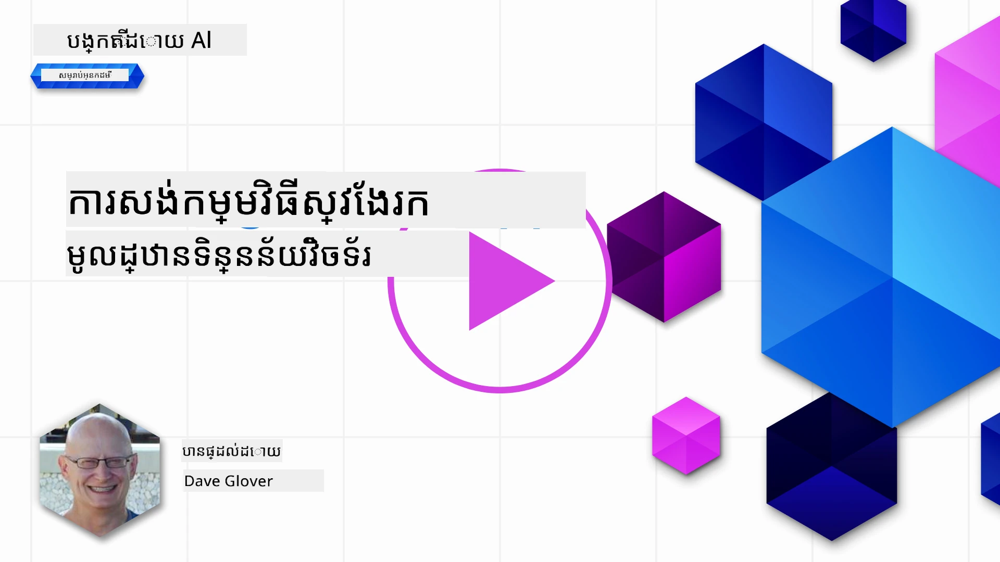
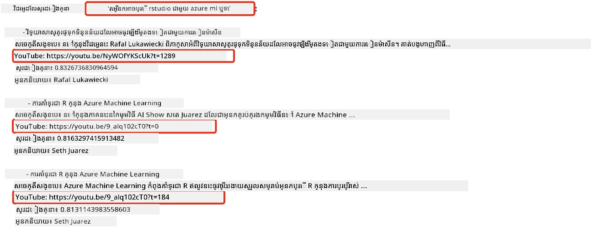
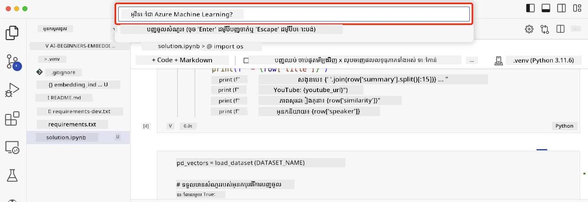

# ការបង្កើតកម្មវិធីស្វែងរក

[](https://youtu.be/W0-nzXjOjr0?si=GcsqiTTvd7RKbo7V)

> > _ចុចរូបភាពខាងលើដើម្បីមើលវីដេអូមេរៀននេះ_

មានអ្វីមួយច្រើនជាង chatbots និងការបង្កើតអត្ថបទក្នុង LLMs ។ វាក៏អាចបង្កើតកម្មវិធីស្វែងរកដោយប្រើ Embeddings ផងដែរ។ Embeddings គឺជាការបង្ហាញជាចំនួនលេខនៃទិន្នន័យដែលគេស្គាល់ថាជា vectors ហើយអាចប្រើស្វែងរកសមាហរណកម្មសម្រាប់ទិន្នន័យ។

ក្នុងមេរៀននេះ អ្នកនឹងបង្កើតកម្មវិធីស្វែងរកសម្រាប់ស្តាតធ្វើអប់រំរបស់យើង។ ស្តាតនេះគឺជាអង្គការមិនរកប្រាក់ចំណេញដែលផ្តល់ការអប់រំឥតគិតថ្លៃដល់សិស្សនៅក្នុងប្រទេសកំពុងអភិវឌ្ឍ។ ស្តាតរបស់យើងមានវីដេអូ YouTube ច្រើនដែលសិស្សអាចប្រើសម្រាប់រៀនអំពី AI។ ស្តាតចង់បង្កើតកម្មវិធីស្វែងរកដែលអនុញ្ញាតឲ្យសិស្សស្វែងរកវីដេអូ YouTube ដោយវាយសំណួរ។

ឧទាហរណ៍ សិស្សអាចវាយ 'What are Jupyter Notebooks?' ឬ 'What is Azure ML' ហើយកម្មវិធីស្វែងរកនឹងបញ្ជូនបញ្ជីវីដេអូ YouTube ដែលពាក់ព័ន្ធនឹងសំណួរនោះ ហើយល្អជាងនេះ ទៀតកម្មវិធីស្វែងរកនឹងផ្តល់តំណទៅកាន់ទីតាំងនៅក្នុងវីដេអូ ដែលមានចម្លើយសម្រាប់សំណួរនោះ។

## ការណែនាំ

ក្នុងមេរៀននេះ យើងនឹងដាក់បង្ហាញពី៖

- ការស្វែងរកសមាហរណកម្ម និងការស្វែងរកពាក្យគន្លឹះ។
- Text Embeddings ជាអ្វី។
- ការបង្កើតសន្ទស្សន៍ Text Embeddings។
- ការស្វែងរកក្នុងសន្ទស្សន៍ Text Embeddings។

## គោលបំណងរៀន

បន្ទាប់ពីបញ្ចប់មេរៀននេះ អ្នកនឹងអាច៖

- ផ្តល់ជាការពិពណ៌នាផ្សេងគ្នារវាងការស្វែងរកសមាហរណកម្ម និងការស្វែងរកពាក្យគន្លឹះ។
- បកស្រាយអំពី Text Embeddings។
- បង្កើតកម្មវិធីដោយប្រើ Embeddings សម្រាប់ស្វែងរកទិន្នន័យ។

## ហេតុអ្វីបានជា បង្កើតកម្មវិធីស្វែងរក?

ការបង្កើតកម្មវិធីស្វែងរកជួយឲ្យអ្នកយល់ពីរបៀបប្រើ Embeddings ដើម្បីស្វែងរកទិន្នន័យ។ អ្នកនឹងរៀនក៏ដូចជាការបង្កើតកម្មវិធីស្វែងរកដែលអាចប្រើដោយសិស្សសម្រាប់ស្វែងរកព័ត៌មានយ៉ាងលឿន។

មេរៀននេះមានសន្ទស្សន៍ Embedding នៃអត្ថបទ YouTube របស់បណ្តុំវីដេអូ Microsoft [AI Show](https://www.youtube.com/playlist?list=PLlrxD0HtieHi0mwteKBOfEeOYf0LJU4O1)។ AI Show គឺជាបណ្តាញឆានែល YouTube ដែលបង្រៀនអ្នកអំពី AI និងការរៀនម៉ាស៊ីន។ សន្ទស្សន៍ Embedding មាន Embeddings សម្រាប់អត្ថបទ YouTube ទាំងអស់រហូតដល់ខែតុលា ២០២៣។ អ្នកនឹងប្រើសន្ទស្សន៍ Embedding ដើម្បីបង្កើតកម្មវិធីស្វែងរកសម្រាប់ស្តាតរបស់យើង។ កម្មវិធីស្វែងរកនឹងផ្តល់តំណទៅកាន់ទីតាំងក្នុងវីដេអូ ដែលមានចម្លើយសម្រាប់សំណួរ។ នេះជាវិធីល្អសម្រាប់សិស្សក្នុងការស្វែងរកព័ត៌មានដែលពួកគេស្វែងរកបានយ៉ាងរហ័ស។

ខាងក្រោមជាឧទាហរណ៍នៃការស៊ើបអង្កេតសមាហរណកម្មសម្រាប់សំណួរ 'can you use rstudio with azure ml?' ។ សូមពិនិត្យ url YouTube អ្នកនឹងឃើញថា url មានពេលវេលាដែលនាំអ្នកទៅកាន់ទីតាំងក្នុងវីដេអូ ដែលមានចម្លើយសម្រាប់សំណួរ។



## ការស្វែងរកសមាហរណកម្មគឺជាអ្វី?

ឥឡូវអ្នកប្រហែលជាសួរ ថា ការស្វែងរកសមាហរណកម្មជាអ្វី? ការស្វែងរកសមាហរណកម្មគឺជាបច្ចេកវិទ្យាស្វែងរកមួយដែលប្រើសមន្ដប្រយោគ ឬអត្ថន័យនៃពាក្យក្នុងសំណួរដើម្បីបញ្ជូនលទ្ធផលដែលពាក់ព័ន្ធ។

នេះជាឧទាហរណ៍នៃការស្វែងរកសមាហរណកម្ម។ ថាតើអ្នកកំពុងស្វែងរករថយន្តថ្មី អ្នកអាចស្វែងរក 'my dream car' និងការស្វែងរកសមាហរណកម្មយល់ថា អ្នកមិនកំពុង `សុបិន` អំពីរថយន្តទេ ប៉ុន្តែអ្នកកំពុងស្វែងរករថយន្ត `ល្អបំផុត` របស់អ្នក។ ការស្វែងរកសមាហរណកម្មយល់ចិត្តបំណងរបស់អ្នក ហើយបញ្ជូនលទ្ធផលដែលពាក់ព័ន្ធ។ ជម្រើសជំនួសគឺ `keyword search` ដែលនឹងស្វែងរកពាក្យដូចជាសុបិនពីរថយន្ត ហើយភាគច្រើនបញ្ជូនលទ្ធផលមិនពាក់ព័ន្ធ។

## Text Embeddings ជាអ្វី?

[Text embeddings](https://en.wikipedia.org/wiki/Word_embedding?WT.mc_id=academic-105485-koreyst) គឺជាបច្ចេកវិទ្យាបង្ហាញអត្ថបទមួយដែលប្រើក្នុង [natural language processing](https://en.wikipedia.org/wiki/Natural_language_processing?WT.mc_id=academic-105485-koreyst)។ Text embeddings គឺជាការបង្ហាញជាចំនួនលេខសមាហរណកម្មនៃអត្ថបទ។ Embeddings ត្រូវបានប្រើដើម្បីតំណាងឲ្យទិន្នន័យដោយរបៀបដែលម៉ាស៊ីនអាចយល់បានយ៉ាងងាយស្រួល។ មានម៉ូដែលជាច្រើនសម្រាប់បង្កើត text embeddings។ ក្នុងមេរៀននេះ យើងនឹងផ្តោតលើការបង្កើត embeddings ដោយប្រើម៉ូដែល OpenAI Embedding ។

នេះជាឧទាហរណ៍ មនុស្សគិតថាអត្ថបទខាងក្រោមស្ថិតនៅក្នុងអត្ថបទត្រឡប់ពីមួយក្នុងកញ្ចប់វីដេអូ AI Show YouTube channel:

```text
Today we are going to learn about Azure Machine Learning.
```
  
យើងនឹងផ្ញើអត្ថបទទៅ OpenAI Embedding API ហើយវានឹងបញ្ជូនអEmbedding ដែលមានចំនួន ១៥៣៦ លេខគឺជា vector។ លេខនីមួយៗ នៅក្នុងវ៉ិចទ័រនេះតំណាងឲ្យលក្ខណៈផ្សេងៗនៃអត្ថបទ។ ដើម្បីខ្លី រូបមន្តខាងក្រោមគឺជាលេខ ១០ ដំបូង។

```python
[-0.006655829958617687, 0.0026128944009542465, 0.008792596869170666, -0.02446001023054123, -0.008540431968867779, 0.022071078419685364, -0.010703742504119873, 0.003311325330287218, -0.011632772162556648, -0.02187200076878071, ...]
```
  
## បែបណាដែលសន្ទស្សន៍ Embedding ត្រូវបានបង្កើត?

សន្ទស្សន៍ Embedding សម្រាប់មេរៀននេះ ត្រូវបានបង្កើតដោយស៊េរីស្ក្រីប Python។ អ្នកនឹងរកឃើញស្ក្រីបជាមួយជំនួយនៅក្នុង [README](./scripts/README.md?WT.mc_id=academic-105485-koreyst) ក្នុងថត 'scripts' សម្រាប់មេរៀននេះ។ អ្នកមិនចាំបាច់រត់ស្ក្រីបទាំងនេះដើម្បីបញ្ចប់មេរៀននេះ ទេ ព្រោះសន្ទស្សន៍ Embedding ត្រូវបានផ្តល់ឲ្យរួចហើយ។

ស្ក្រីបធ្វើសកម្មភាពដូចខាងក្រោម៖

1. អត្ថបទត្រឡប់សម្រាប់វីដេអូ YouTube នីមួយៗក្នុងបញ្ជី [AI Show](https://www.youtube.com/playlist?list=PLlrxD0HtieHi0mwteKBOfEeOYf0LJU4O1) ត្រូវបានទាញចុះ។
2. ប្រើ [OpenAI Functions](https://learn.microsoft.com/azure/ai-services/openai/how-to/function-calling?WT.mc_id=academic-105485-koreyst) ព្យាយាមដកឈ្មោះអ្នកនិយាយពី ៣ នាទីដំបូងនៃអត្ថបទ YouTube។ ឈ្មោះអ្នកនិយាយសម្រាប់វីដេអូរាល់ឯកសារត្រូវបានរក្សាទុកក្នុងសន្ទស្សន៍ Embedding ឈ្មោះ `embedding_index_3m.json`។
3. អត្ថបទត្រូវបានបំបែកជាផ្នែកអត្ថបទខ្នាត **3 នាទីដាក់ជាមួយ**។ ផ្នែកនេះមានពាក្យប្រមាណ ២០ ដែលផ្ទុយគ្នាពីផ្នែកបន្ទាប់ ដើម្បីធានាថា Embedding សម្រាប់ផ្នែកនេះមិនត្រូវបានកាត់បន្ថយ ហើយផ្តល់បរិបទស្វែងរកល្អជាង។
4. ផ្នែកអត្ថបទនេះ ត្រូវបានផ្ញើទៅ OpenAI Chat API ដើម្បីសង្ខេបអត្ថបទជាពាក្យ ៦០ ពាក្យ។ សង្ខេបនេះក៏ត្រូវបានរក្សាទុកក្នុងសន្ទស្សន៍ Embedding `embedding_index_3m.json`។
5. ចុងក្រោយ ផ្នែកអត្ថបទត្រូវបានផ្ញើទៅ OpenAI Embedding API។ Embedding API បញ្ជូន vector បង្ហាញន័យសមាហរណកម្មនៃផ្នែកនេះដែលមានចំនួន ១៥៣៦ លេខ។ ផ្នែកនេះជាមួយប្រភេទ OpenAI Embedding vector ត្រូវបានរក្សាទុកនៅក្នុងសន្ទស្សន៍ Embedding `embedding_index_3m.json`។

### ឃ្លាំងទិន្នន័យវ៉ិចទ័រ

សម្រាប់ភាពងាយស្រួលមេរៀន សន្ទស្សន៍ Embedding ត្រូវបានរក្សាទុកនៅក្នុងឯកសារ JSON ឈ្មោះ `embedding_index_3m.json` ហើយត្រូវបានបញ្ចូលក្នុង Pandas DataFrame។ ទោះជាយ៉ាងណា ក្នុងការផលិត សន្ទស្សន៍ Embedding នឹងត្រូវបានរក្សាទុកនៅក្នុងឃ្លាំងទិន្នន័យវ៉ិចទ័រដូចជា [Azure Cognitive Search](https://learn.microsoft.com/training/modules/improve-search-results-vector-search?WT.mc_id=academic-105485-koreyst), [Redis](https://cookbook.openai.com/examples/vector_databases/redis/readme?WT.mc_id=academic-105485-koreyst), [Pinecone](https://cookbook.openai.com/examples/vector_databases/pinecone/readme?WT.mc_id=academic-105485-koreyst), [Weaviate](https://cookbook.openai.com/examples/vector_databases/weaviate/readme?WT.mc_id=academic-105485-koreyst) និងផ្សេងទៀត។

## ការយល់ដឹងអំពី cosine similarity

យើងបានសិក្សាអំពី text embeddings ហើយជំហានបន្ទាប់គឺរៀនពីរបៀបប្រើ text embeddings ដើម្បីស្វែងរកទិន្នន័យ និងជាពិសេស រកឃើញ embeddings ដែលមានស្រដៀងបំផុតតាមសំណួរដោយប្រើ cosine similarity។

### តើ cosine similarity ជាអ្វី?

Cosine similarity គឺជាមាត្រជាតិមួយសម្រាប់វាស់ភាពស្រដៀងគ្នារវាងវ៉ិចទ័រពីរម្នាក់អ្នកនឹងបានស្ដាប់វាក្នុងឈ្មោះ `nearest neighbor search` ផងដែរ។ ដើម្បីបង្ហាញការស្វែងរក cosine similarity អ្នកត្រូវតែ _vectorize_ សម្រាប់អត្ថបទ _query_ ដោយប្រើ OpenAI Embedding API។ ព្រោះបន្ទាប់មក គណនាទំហំនៃ _cosine similarity_ រវាង query vector និងវ៉ិចទ័រនីមួយៗក្នុងសន្ទស្សន៍ Embedding។ ចងចាំថា សន្ទស្សន៍ Embedding មានវ៉ិចទ័រសម្រាប់អត្ថបទត្រឡប់ក្នុងវីដេអូ YouTube ក្នុងផ្នែកៗ។ ចុងក្រោយ ចាត់ថ្នាក់លទ្ធផលតាម​តម្លៃ cosine similarity ហើយផ្នែកអត្ថបទដែលមានតម្លៃ cosine similarityខ្ពស់បំផុតគឺជាផ្នែកដែលស្រដៀងបំផុតនឹងសំណួរ។

ពីទស្សនវិជ្ជាគណិតវិទ្យា cosine similarity វាស់គ្រោងដែនមុំរវាងវ៉ិចទ័រពីរនៅក្នុងលំហ multidimensional។ វាមានអត្ថប្រយោជន៍ ព្រោះឯកសារពីរទៅឆ្ងាយគ្នាតាមលំហ Euclidean ដោយសារទំហំ វាអាចមានមុំតូចជាងគ្នា ហើយដូច្នេះ មាន cosine similarity ខ្ពស់ជាង។ សម្រាប់ព័ត៌មានលម្អិតអំពីសមីការតម្លៃ cosine similarity សូមមើល [Cosine similarity](https://en.wikipedia.org/wiki/Cosine_similarity?WT.mc_id=academic-105485-koreyst)។

## ការបង្កើតកម្មវិធីស្វែងរកដំបូងរបស់អ្នក

បន្ទាប់មក យើងនឹងរៀនរបៀបបង្កើតកម្មវិធីស្វែងរកដោយប្រើ Embeddings ។ កម្មវិធីស្វែងរកនេះនឹងអនុញ្ញាតឲ្យសិស្សស្វែងរកវីដេអូដោយវាយសំណួរ។ កម្មវិធីស្វែងរកនឹងផ្តល់បញ្ជីវីដេអូដែលពាក់ព័ន្ធនឹងសំណួរ។ កម្មវិធីស្វែងរកនឹងផ្តល់តំណទៅកាន់ទីតាំងក្នុងវីដេអូ ដែលមានចម្លើយសម្រាប់សំណួរនោះ។

ដំណោះស្រាយនេះបានបង្កើត និងសាកល្បងនៅលើ Windows 11, macOS និង Ubuntu 22.04 ដោយប្រើ Python 3.10 ឬកាន់តែថ្មីបន្ថែម។ អ្នកអាចទាញយក Python ពី [python.org](https://www.python.org/downloads/?WT.mc_id=academic-105485-koreyst)។

## ភារកិច្ច - បង្កើតកម្មវិធីស្វែងរកសម្រាប់ជំនួយសិស្ស

យើងបានណែនាំស្តាតរបស់យើងនៅដើមមេរៀននេះ។ ឥឡូវនេះ ពេលវេលា ដើម្បីអនុញ្ញាតឲ្យសិស្សបង្កើតកម្មវិធីស្វែងរកសម្រាប់ការវាយតម្លៃរបស់ពួកគេ។

ក្នុងភារកិច្ចនេះ អ្នកនឹងបង្កើត Azure OpenAI Services ដែលនឹងប្រើសម្រាប់បង្កើតកម្មវិធីស្វែងរក។ អ្នកនឹងបង្កើត Azure OpenAI Services ខាងក្រោម។ អ្នកត្រូវការជាវសេវា Azure ដើម្បីបញ្ចប់ភារកិច្ចនេះ។

### ចាប់ផ្តើម Azure Cloud Shell

1. ចូលទៅកាន់ [Azure portal](https://portal.azure.com/?WT.mc_id=academic-105485-koreyst)។
2. ជ្រើសរើសរូបតំណាង Cloud Shell នៅកំពូលខាងស្តាំរបស់បណ្តាញរបស់ Azure portal។
3. ជ្រើសរើស **Bash** សម្រាប់ប្រភេទបរិយាកាស។

#### បង្កើត resource group

> សម្រាប់ការណែនាំទាំងនេះ យើងកំពុងប្រើ resource group ដែលមានឈ្មោះ "semantic-video-search" នៅ East US។  
> អ្នកអាចប្ដូរឈ្មោះ resource group បាន ប៉ុន្តែនៅពេលផ្លាស់ទីសម្រាប់ធនធាន,  
> សូមពិនិត្យ [តារាងភាពមានប្រតិបត្តិរបស់ម៉ូដែល](https://aka.ms/oai/models?WT.mc_id=academic-105485-koreyst)។

```shell
az group create --name semantic-video-search --location eastus
```
  
#### បង្កើតធនធាន Azure OpenAI Service

ពី Azure Cloud Shell, រត់ពាក្យបញ្ជាខាងក្រោមដើម្បីបង្កើតធនធាន Azure OpenAI Service ។

```shell
az cognitiveservices account create --name semantic-video-openai --resource-group semantic-video-search \
    --location eastus --kind OpenAI --sku s0
```
  
#### ទទួលបានចំណុចបញ្ចប់ និងកូនសោសម្រាប់ការប្រើប្រាស់ក្នុងកម្មវិធីនេះ

ពី Azure Cloud Shell, រត់ពាក្យបញ្ជាខាងក្រោមដើម្បីទទួលបានចំណុចបញ្ចប់ និងកូនសោសម្រាប់ធនធាន Azure OpenAI Service ។

```shell
az cognitiveservices account show --name semantic-video-openai \
   --resource-group  semantic-video-search | jq -r .properties.endpoint
az cognitiveservices account keys list --name semantic-video-openai \
   --resource-group semantic-video-search | jq -r .key1
```
  
#### បញ្ចេញម៉ូដែល OpenAI Embedding

ពី Azure Cloud Shell, រត់ពាក្យបញ្ជាខាងក្រោមដើម្បីបញ្ចេញម៉ូដែល OpenAI Embedding ។

```shell
az cognitiveservices account deployment create \
    --name semantic-video-openai \
    --resource-group  semantic-video-search \
    --deployment-name text-embedding-ada-002 \
    --model-name text-embedding-ada-002 \
    --model-version "2"  \
    --model-format OpenAI \
    --sku-capacity 100 --sku-name "Standard"
```
  
## ដំណោះស្រាយ

បើក [solution notebook](./python/aoai-solution.ipynb?WT.mc_id=academic-105485-koreyst) នៅ GitHub Codespaces ហើយធ្វើតាមការណែនាំក្នុង Jupyter Notebook។

ពេលអ្នកផ្ទុកនោះ អ្នកនឹងត្រូវបានស្នើឲ្យបញ្ចូលសំណួរ។ ប្រអប់បញ្ចូលនឹងបង្ហាញដូចមាននៅខាងក្រោម៖



## ធ្វើបានល្អ! បន្តការសិក្សារបស់អ្នក

បន្ទាប់ពីបញ្ចប់មេរៀននេះ សូមពិនិត្យកំណត់ហេតុ [Generative AI Learning collection](https://aka.ms/genai-collection?WT.mc_id=academic-105485-koreyst) របស់យើងដើម្បីបន្តបង្កើនជំនាញ Generative AI របស់អ្នក!

ចូលទៅមេរៀន 9 ដែលយើងនឹងមើលពីរបៀប [បង្កើតកម្មវិធីបង្កើតរូបភាព](../09-building-image-applications/README.md?WT.mc_id=academic-105485-koreyst)!

---

<!-- CO-OP TRANSLATOR DISCLAIMER START -->
**ការផ្ដល់សេចក្តីអះអាង**:  
ឯកសារនេះត្រូវបានបកប្រែដោយប្រើសេវាកម្មបកប្រែ AI [Co-op Translator](https://github.com/Azure/co-op-translator)។ ខណៈពេលដែលយើងខិតខំសំរាប់ភាពត្រឹមត្រូវ សូមប្រយ័ត្នថាការប្រែប្រួលដោយស្វ័យប្រវត្តិអាចមានកំហុសឬការមិនត្រឹមត្រូវ។ ឯកសារដើមក្នុងភាសាដើមគួរត្រូវបានគេទុកចិត្តជាមូលដ្ឋានដែលមានសុពលភាព។ សម្រាប់ព័ត៌មានសំខាន់ៗ សូមណែនាំឲ្យប្រើការបកប្រែដោយផ្ទាល់មនុស្សជំនាញ។ យើងមិនទទួលខុសត្រូវចំពោះការយល់ច្រឡំ ឬការបកស្រាយខុសយ៉ាងណាដែលកើតមានពីការប្រើប្រាស់ការបកប្រែនេះឡើយ។
<!-- CO-OP TRANSLATOR DISCLAIMER END -->