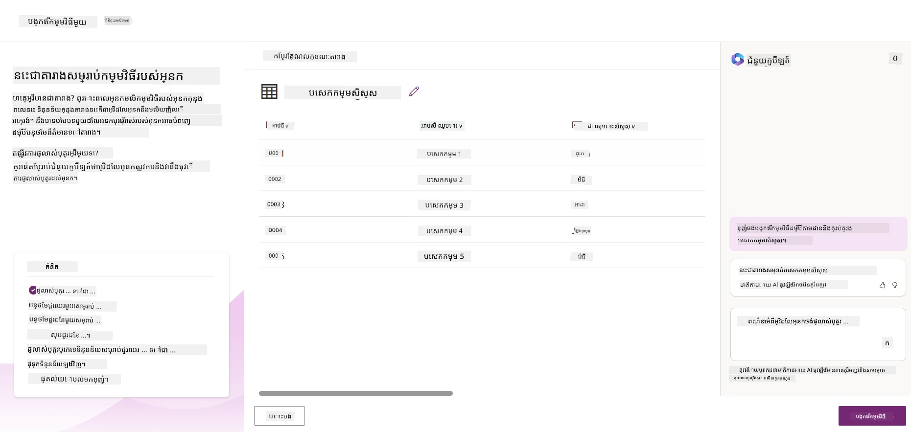
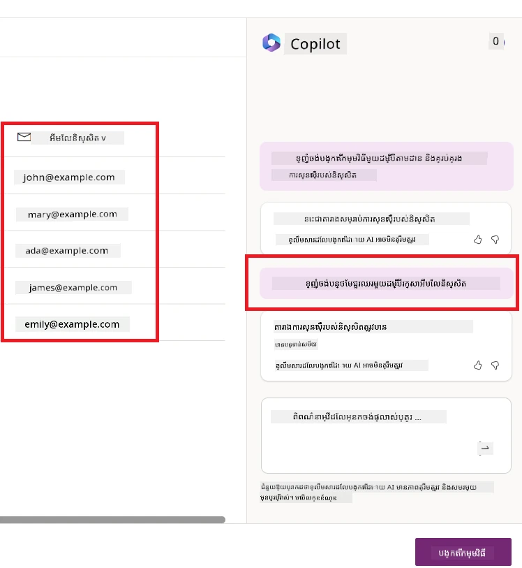
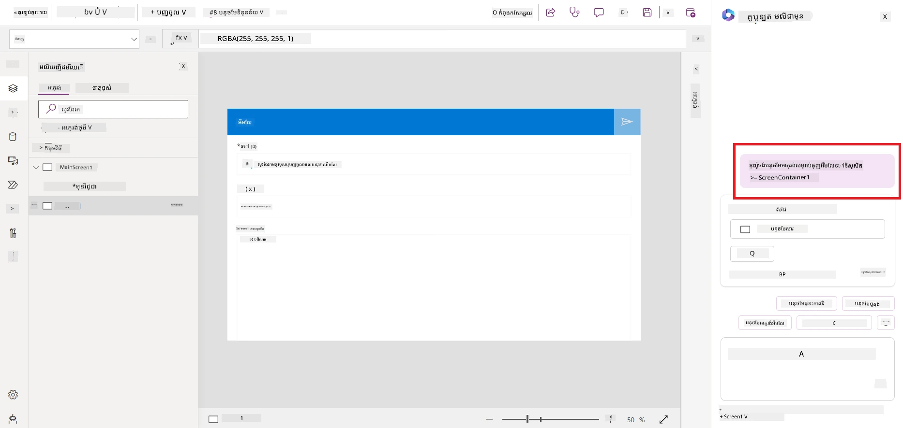
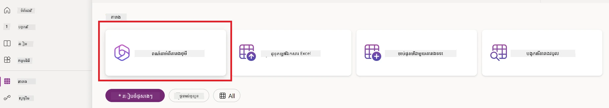
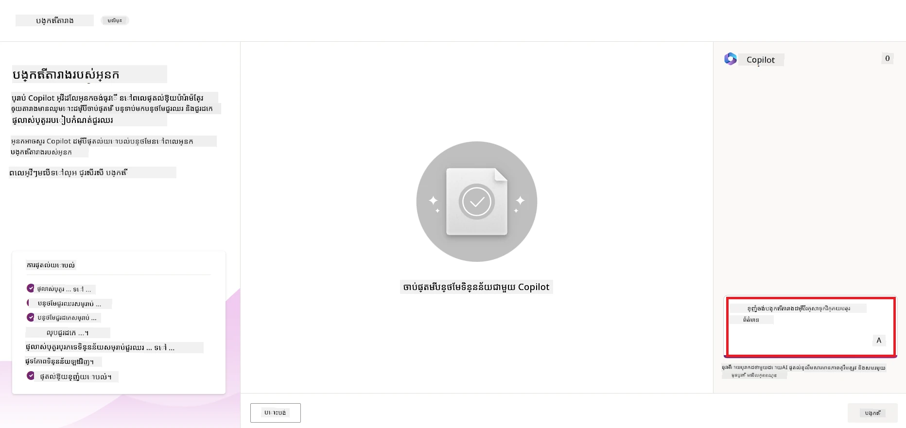
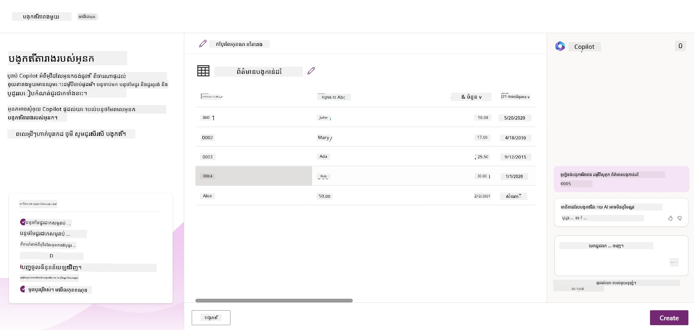
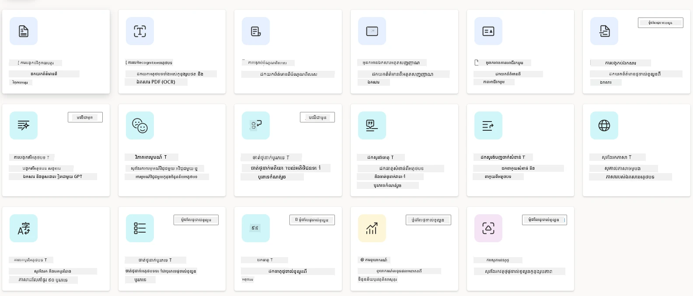
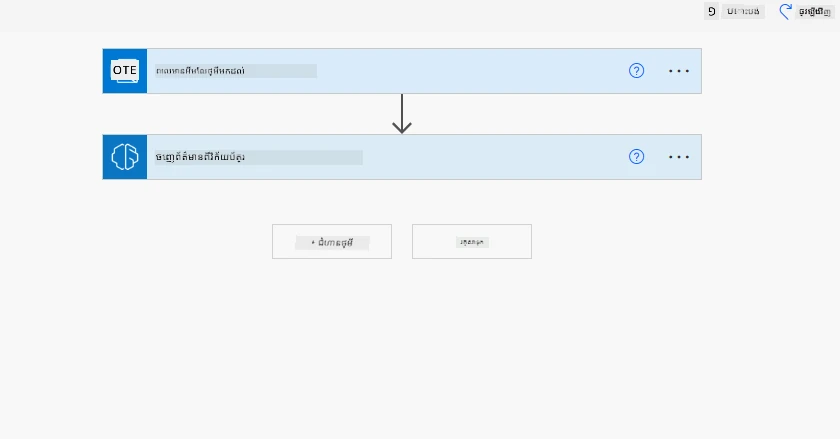
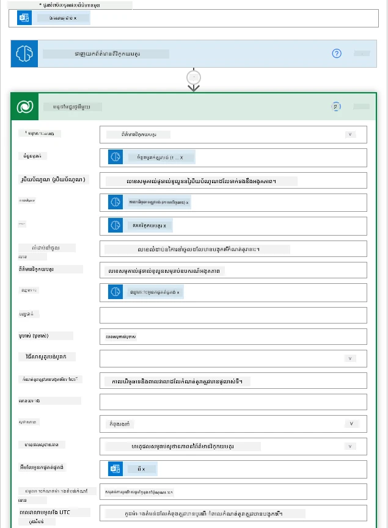
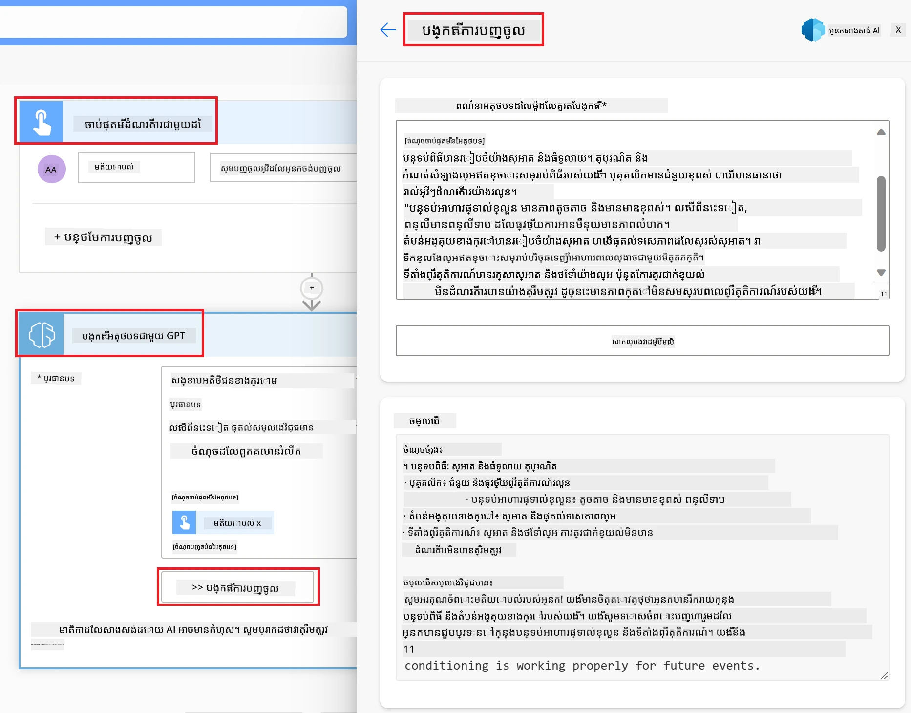

# អភិវឌ្ឍកម្មវិធី AI កូដទាប

> _(ចុចរូបភាពខាងលើដើម្បីមើលវីដេអូមេរៀននេះ)_

## ណែនាំ

ឥឡូវនេះ ដែលយើងបានរៀនពីរបៀបបង្កើតកម្មវិធីបង្កើតរូបភាព យើងនឹងនិយាយអំពីកូដទាប។ AI ការបង្កើតអាចប្រើសម្រាប់តំបន់ផ្សេងៗជាច្រើន រួមមានកូដទាប ប៉ុន្តែកូដទាបជាអ្វី ហើយតើយើងអាចបន្ថែម AI ទៅក្នុងវាបែបណា?

ការបង្កើតកម្មវិធីនិងដំណោះស្រាយក្លាយទៅជាងាយស្រួលសម្រាប់អ្នកអភិវឌ្ឍន៍បុរាណ និងអ្នកដែលមិនមែនជាអ្នកអភិវឌ្ឍន៍ តាមរយៈការប្រើប្រាស់វេទិកាអភិវឌ្ឍន៍កូដទាប។ វេទិកាអភិវឌ្ឍន៍កូដទាបអនុញ្ញាតឲ្យអ្នកបង្កើតកម្មវិធីនិងដំណោះស្រាយដោយប្រើកូដតូច ឬគ្មានកូដលើក ទេ។ នេះធ្វើបានដោយផ្ដល់បរិយាកាសអភិវឌ្ឍន៍មើលឃើញ ដែលអនុញ្ញាតឲ្យអ្នកចាប់យកនិងដាក់ទំនិញដើម្បីបង្កើតកម្មវិធីនិងដំណោះស្រាយ។ វាអនុញ្ញាតឲ្យអ្នកបង្កើតកម្មវិធីនិងដំណោះស្រាយបានលឿនជាង និងប្រើធនធានថយចុះ។ ក្នុងមេរៀននេះ យើងនឹងរុករកច្រោះចូលក្នុងរបៀបប្រើកូដទាប និងរបៀបបង្កើតការកែលម្អអភិវឌ្ឍន៍កូដទាបជាមួយ AI ដោយប្រើ Power Platform។

Power Platform ផ្ដល់ឱកាសដល់អង្គភាពក្នុងការផ្ដល់អំណាចទៅកាន់ក្រុមរបស់ពួកគេដើម្បីបង្កើតដំណោះស្រាយផ្ទាល់ខ្លួនតាមរយៈបរិយាកាសកូដទាប ឬគ្មានកូដ ដ៏ងាយស្រួល។ បរិយាកាសនេះជួយសម្រួលដំណើរការបង្កើតដំណោះស្រាយ។ ជាមួយ Power Platform ដំណោះស្រាយអាចត្រូវបានបង្កើតរយៈពេលប៉ុន្មានថ្ងៃ ឬសប្ដាហ៍ ជំនួសជាប្រចាំខែ ឬឆ្នាំ។ Power Platform មានផលិតផលសំខាន់ប្រាំ៖ Power Apps, Power Automate, Power BI, Power Pages និង Copilot Studio។

មេរៀននេះគ្របដណ្តប់៖

- ណែនាំពី Generative AI ក្នុង Power Platform
- ណែនាំពី Copilot និងរបៀបប្រើ
- ប្រើ Generative AI ដើម្បីបង្កើតកម្មវិធីនិងលំហូរនៅ Power Platform
- យល់ដឹងអំពីម៉ូដែល AI ក្នុង Power Platform ជាមួយ AI Builder

## គោលបំណងការរៀន

នៅចុងបញ្ចប់មេរៀននេះ អ្នកនឹងអាច៖

- យល់ពីរបៀបដែល Copilot ធ្វើការនៅក្នុង Power Platform។

- បង្កើតកម្មវិធីតាមដានមុខងារប្រឡងសិស្សសម្រាប់សហគ្រាសអប់រំរបស់យើង។

- បង្កើតលំហូរច្រកវិក្កយបត្រដែលប្រើ AI ដើម្បីដកយកព័ត៌មានពីវិក្កយបត្រ។

- អនុវត្តការអនុវត្តល្អបំផុតពេលប្រើម៉ូដែល AI ប្រើ GPT សរសេរអត្ថបទ។

ឧបករណ៍ និងបច្ចេកវិទ្យាដែលអ្នកនឹងប្រើនៅមេរៀននេះរួមមាន៖

- **Power Apps**, សម្រាប់កម្មវិធីតាមដានការប្រឡងសិស្ស ដែលផ្ដល់បរិយាកាសអភិវឌ្ឍន៍កូដទាបសម្រាប់បង្កើតកម្មវិធីដើម្បីតាមដាន គ្រប់គ្រង និងអន្តរកម្មជាមួយទិន្នន័យ។

- **Dataverse**, សម្រាប់រក្សាទុកទិន្នន័យនៃកម្មវិធីតាមដានការប្រឡងសិស្ស ដែលផ្ដល់វេទិកាទិន្នន័យកូដទាបសម្រាប់រក្សាទុកទិន្នន័យកម្មវិធី។

- **Power Automate**, សម្រាប់លំហូរច្រកវិក្កយបត្រ ដែលអ្នកនឹងមានបរិយាកាសអភិវឌ្ឍន៍កូដទាបសម្រាប់បង្កើតលំហូរដើម្បីធ្វើឲ្យដំណើរការច្រកវិក្កយបត្រអូតូម៉ាទិច។

- **AI Builder**, សម្រាប់ម៉ូដែល AI ដើម្បីដំណើរការវិក្កយបត្រ ដែលអ្នកនឹងប្រើម៉ូដែល AI ដែលបានបង្កើតជាមុនដើម្បីដំណើរការវិក្កយបត្រសម្រាប់សហគ្រាសរបស់យើង។

## Generative AI ក្នុង Power Platform

ការកែលម្អអភិវឌ្ឍន៍ និងកម្មវិធីកូដទាបជាមួយ generative AI គឺជាការយកចិត្តទុកដាក់ទំខាន់សម្រាប់ Power Platform។ គោលដៅគឺឲ្យមនុស្សគ្រប់រូបអាចបង្កើតកម្មវិធី ធ្វើបណ្ដាញគេហទំព័រ ផ្ទាំងបង្ហាញ និងអូតូម៉ាទិចដំណើរការជាមួយ AI, _ដោយមិនចាំបាច់មានជំនាញវិទ្យាសាស្ត្រទិន្នន័យ_។ គោលដៅនេះត្រូវបានបំពេញដោយការបញ្ចូល generative AI ទៅក្នុងបទពិសោធន៍អភិវឌ្ឍន៍កូដទាបនៅ Power Platform ក្នុងសារជាដៃគូ Copilot និង AI Builder។

### វាដំណើរការយ៉ាងដូចម្តេច?

Copilot គឺជាអ្នកជំនួយ AI ដែលអនុញ្ញាតឲ្យអ្នកបង្កើតដំណោះស្រាយ Power Platform ដោយពិពណ៌នាតម្រូវការរបស់អ្នកជាជួរដំណើរការជាសន្ទនាតាមភាសាធម្មជាតិ។ ឧទាហរណ៍ អ្នកអាចណែនាំឲ្យ AI របស់អ្នកពោលពីវាលដែលកម្មវិធីរបស់អ្នកនឹងប្រើ ហើយវានឹងបង្កើតទាំងកម្មវិធីនិងម៉ូដែលទិន្នន័យរបស់វា ឬអ្នកអាចបញ្ជាក់ថាត្រូវដាក់របៀបបង្កើតលំហូរមួយនៅក្នុង Power Automate។

អ្នកអាចប្រើលក្ខណៈពិសេសដែលគ្រប់គ្រងដោយ Copilot ដោយបញ្ចូលជាលក្ខណៈក្នុងអេក្រង់កម្មវិធីរបស់អ្នក ដើម្បីអនុញ្ញាតឲ្យអ្នកប្រើស្វែងរកចំណេះដឹងតាមសន្ទនាបែប។

AI Builder គឺជាចំណុចសំខាន់ AI កូដទាប ដែលមាននៅ Power Platform ដែលអនុញ្ញាតឲ្យអ្នកប្រើម៉ូដែល AI ដើម្បីជួយអូតូម៉ាទិចដំណើរការរបៀប និងទស្សន៍ទាយលទ្ធផល។ ជាមួយ AI Builder អ្នកអាចយក AI ចូលទៅក្នុងកម្មវិធី និងលំហូរដែលភ្ជាប់ទៅកាន់ទិន្នន័យនៅ Dataverse ឬ ធនធានទិន្នន័យពពកផ្សេងៗ ដូចជា SharePoint, OneDrive ឬ Azure។

Copilot មាននៅក្នុងផលិតផល Power Platform ទាំងអស់៖ Power Apps, Power Automate, Power BI, Power Pages និង Power Virtual Agents។ AI Builder មាននៅ Power Apps និង Power Automate។ ក្នុងមេរៀននេះ យើងនឹងផ្ដោតលើរបៀបប្រើ Copilot និង AI Builder នៅក្នុង Power Apps និង Power Automate ដើម្បីបង្កើតដំណោះស្រាយសម្រាប់សហគ្រាសអប់រំនេះ។

### Copilot ក្នុង Power Apps

ជា​ផ្នែក​មួយ​នៃ Power Platform, Power Apps ផ្ដល់​បរិយាកាស​អភិវឌ្ឍ​កូដ​ទាប​សម្រាប់​បង្កើត​កម្មវិធី​ដើម្បី​តាមដាន គ្រប់គ្រង និង​អន្តរកម្មជាមួយ​ទិន្នន័យ។ វាជាស៊ុមសេវាកម្មអភិវឌ្ឍកម្មវិធីមួយមានវេទិកាទិន្នន័យដែលអាចបណ្ដុះបណ្ដាលនិងមានសមត្ថភាពភ្ជាប់ទៅបម្រើការពពកនិងទិន្នន័យនៅក្នុងកន្លែង។ Power Apps អនុញ្ញាតឲ្យអ្នកបង្កើតកម្មវិធីឡើងដំណើរការលើកម្មវិធីរុករក វ៉ាស់តាប្លេត និងទូរស័ព្ទ ហើយអាចចែករំលែកជាមួយមិត្តរួមការងារ។ Power Apps ងាយស្រួលសម្រាប់អ្នកប្រើចាប់ផ្ដើមអភិវឌ្ឍកម្មវិធីដោយមានផ្ទៃមុខងារងាយស្រួល ដើម្បីឲ្យអ្នកប្រើអាជីវកម្ម ឬអ្នកអភិវឌ្ឍន៍ជំនាញអាចបង្កើតកម្មវិធីប្លែកៗបាន។បទពិសោធន៍អភិវឌ្ឍកម្មវិធីក៏ត្រូវបានបង្កើតកែលម្អជាមួយ Generative AI តាមរយៈ Copilot។

លក្ខណៈពិសេសអ្នកជំនួយ AI Copilot ក្នុង Power Apps អនុញ្ញាតឲ្យអ្នកពណ៌នាថាតើកម្មវិធីប្រភេទណាដែលអ្នកត្រូវការ និងព័ត៌មានអ្វីដែលអ្នកចង់ឲ្យកម្មវិធីរបស់អ្នកតាមដាន ប្រមូល ឬបង្ហាញ។ Copilot នឹងបង្កើតកម្មវិធី Canvas ដែលមានការឆ្លើយតបដោយផ្អែកលើការពិពណ៌នារបស់អ្នក។ បន្ទាប់មក អ្នកអាចកែសម្រួលកម្មវិធីដើម្បីឲ្យគោរពតម្រូវការ។ AI Copilot ក៏បង្កើតនិងផ្ដល់អនុសាសន៍តារាង Dataverse ជាមួយវាលដែលអ្នកត្រូវការដាក់រក្សាទិន្នន័យដែលអ្នកចង់តាមដាន និងទិន្នន័យគំរូមួយចំនួនផងដែរ។ យើងនឹងមើលពីអ្វីទៅហើយអ្នកអាចប្រើវានៅ Power Apps នៅក្រោយមេរៀននេះ។ អ្នកអាចបន្ទាប់មកកែសម្រួលតារាងដើម្បីឲ្យគោរពតម្រូវការគោលរបស់អ្នកដោយប្រើលក្ខណៈអ្នកជំនួយ AI Copilot តាមជំហានសន្ទនា។ លក្ខណៈនេះអាចប្រើបានយ៉ាងងាយស្រួលពីអេក្រង់ផ្ទាល់ខ្លួន Power Apps។

### Copilot ក្នុង Power Automate

ជា​ផ្នែក​មួយ​នៃ Power Platform, Power Automate អនុញ្ញាតឲ្យអ្នកប្រើបង្កើតលំហូរការប្រតិបត្ដិអូតូម៉ាទិចរវាងកម្មវិធីនិងសេវាកម្ម។ វាជួយអូតូម៉ាទិចដំណើរការជាភាគច្រើននៃអាជីវកម្មដូចជាសារគម្លាត ការប្រមូលទិន្នន័យ និងការអនុម័តសម្រេចចិត្ត។ ផ្ទៃមុខរបស់វាមានភាពសាមញ្ញ ដែលអាចឲ្យអ្នកប្រើ មានជំនាញបច្ចេកទេសគ្រប់កំរិត (ចាប់ពីអ្នកចាប់ផ្ដើមរហូតដល់អ្នកអភិវឌ្ឍជំនាញ) អាចអូតូម៉ាទិចការងារនានា។បទពិសោធន៍អភិវឌ្ឍលំហូរនេះក៏ត្រូវបានបង្កើតកែលម្អជាមួយ Generative AI តាមរយៈ Copilot។

លក្ខណៈពិសេសអ្នកជំនួយ AI Copilot ក្នុង Power Automate អនុញ្ញាតឲ្យអ្នកពិពណ៌នាថាតើលំហូរប្រភេទណាដែលអ្នកត្រូវការ និងសកម្មភាពអ្វីដែលអ្នកចង់ឲ្យលំហូររបស់អ្នកអនុវត្ត។ Copilot នឹងបង្កើតលំហូរដោយផ្អែកលើការពិពណ៌នារបស់អ្នក។ បន្ទាប់មក អ្នកអាចកែសម្រួលលំហូរដើម្បីឲ្យគោរពតម្រូវការរបស់អ្នក។ AI Copilot ក៏បង្កើតនិងផ្ដល់អនុសាសន៍សកម្មភាពដែលអ្នកត្រូវអនុវត្តសំរាប់ការងារដែលអ្នកចង់អូតូម៉ាទិច។ យើងនឹងមើលថាលំហូរគឺជាអ្វី ហើយអ្នកអាចប្រើវានៅ Power Automate នៅក្រោយមេរៀននេះ។ អ្នកអាចបន្ទាប់មកកែសម្រួលសកម្មភាពដើម្បីឲ្យគោរពតម្រូវការរបស់អ្នកដោយប្រើលក្ខណៈអ្នកជំនួយ AI Copilot តាមជំហានសន្ទនា។ លក្ខណៈនេះអាចប្រើបានយ៉ាងងាយស្រួលពីអេក្រង់ផ្ទាល់ខ្លួន Power Automate។

## ភារកិច្ច៖ គ្រប់គ្រងការប្រឡងសិស្ស និងវិក្កយបត្រសម្រាប់សហគ្រាសយើង ដោយប្រើ Copilot

សហគ្រាសរបស់យើង ផ្ដល់វគ្គបណ្ដុះបណ្ដាលអនឡាញដល់សិស្ស។ សហគ្រាសបានរីកចម្រើនយ៉ាងរហ័ស ហើយធ្លាប់មានការលំបាកក្នុងការតាមដានតម្រូវការនៃវគ្គខ្លួន។ សហគ្រាសបានជ្រើសរើសអ្នកជាអ្នកអភិវឌ្ឍន៍ Power Platform ដើម្បីជួយបង្កើតដំណោះស្រាយកូដទាប សម្រាប់គ្រប់គ្រងការប្រឡងសិស្ស និងវិក្កយបត្រ របស់ពួកគេ។ ដំណោះស្រាយគួរតែអាចជួយពួកគេច្បាស់លាស់ក្នុងការតាមដាននិងគ្រប់គ្រងការប្រឡងសិស្សតាមកម្មវិធីមួយ និងអូតូម៉ាទិចដំណើរការច្រកវិក្កយបត្រតាមរយៈលំហូរ។ អ្នកត្រូវបានស្នើឲ្យប្រើ Generative AI ដើម្បីអភិវឌ្ឍដំណោះស្រាយនេះ។

ពេលដែលអ្នកចាប់ផ្ដើមប្រើ Copilot អ្នកអាចប្រើ [បណ្ណាល័យ Prompt Copilot Power Platform](https://github.com/pnp/powerplatform-prompts?WT.mc_id=academic-109639-somelezediko) ដើម្បីចាប់ផ្ដើមជាមួយការចេញស្នើរ។ បណ្ណាល័យនេះមានបញ្ជីពាក្យស្នើរសុំដែលអ្នកអាចប្រើសម្រាប់បង្កើតកម្មវិធី និងលំហូរជាមួយ Copilot។ អ្នកក៏អាចប្រើពាក្យស្នើរនៅក្នុងបណ្ណាល័យដើម្បីយល់ពីរបៀបពិពណ៌នាតម្រូវការរបស់អ្នកចំពោះ Copilot។

### បង្កើតកម្មវិធីតាមដានការប្រឡងសិស្សសម្រាប់សហគ្រាសយើង

គ្រូបង្រៀននៅសហគ្រាសយើងកំពុងមានការលំបាកក្នុងការតាមដានការប្រឡងសិស្ស។ ពួកគេបានប្រើសៀវភៅបញ្ជីកំណត់តាមតារាងតែនោះ ដោយថានេះក្លាយជារឿងពិបាកនៅពេលមានសិស្សច្រើនឡើង។ ពួកគេបានស្នើឲ្យអ្នកបង្កើតកម្មវិធីមួយ ផ្អែកលើការតាមដាន និងគ្រប់គ្រងការប្រឡងសិស្ស។ កម្មវិធីគួរអនុញ្ញាតឲ្យពួកគេបញ្ចូលការប្រឡងថ្មី មើលការប្រឡង កែប្រែការប្រឡង និងលុបការប្រឡង។ កម្មវិធីគួរអនុញ្ញាតឲ្យគ្រូបង្រៀន និងសិស្ស មើលការប្រឡងដែលបានវាយតម្លៃ និងដែលមិនទាន់បានវាយតម្លៃ។

អ្នកនឹងបង្កើតកម្មវិធីនេះដោយប្រើ Copilot ក្នុង Power Apps ដោយអនុវត្តជំហានខាងក្រោម៖

1. ចូលទៅកាន់អេក្រង់ផ្ទាល់ខ្លួន [Power Apps](https://make.powerapps.com?WT.mc_id=academic-105485-koreyst)។

1. ប្រើតំបន់អត្ថបទនៅលើអេក្រង់ផ្ទាល់ខ្លួន ដើម្បីពិពណ៌នាកម្មវិធីដែលអ្នកចង់បង្កើត។ ឧទាហរណ៍ **_ខ្ញុំចង់បង្កើតកម្មវិធីតាមដាននិងគ្រប់គ្រងការប្រឡងសិស្ស_**។ ចុចប៊ូតុង **Send** ដើម្បីផ្ញើស្នើរ ទៅកាន់ AI Copilot។

1. AI Copilot នឹងស្នើតារាង Dataverse មួយ ដែលមានវាលដែលអ្នកត្រូវការដើម្បីរក្សាទិន្នន័យដែលអ្នកចង់តាមដាន និងទិន្នន័យគំរូមួយចំនួន។ បន្ទាប់មក អ្នកអាចកែសម្រួលតារាងនេះឲ្យសមស្របតាមតម្រូវការពីលក្ខណៈអ្នកជំនួយ AI Copilot តាមជំហានសន្ទនា។

   > **សំខាន់**: Dataverse គឺជាវេទិកាទិន្នន័យគោលសម្រាប់ Power Platform។ វាជាវេទិកាទិន្នន័យកូដទាប ដើម្បីរក្សាទុកទិន្នន័យកម្មវិធី។ វាជាសេវាកម្មគ្រប់គ្រងពេញលេញ ដែលរក្សាទិន្នន័យដោយសុវត្ថិភាពក្នុងពពក Microsoft ហើយត្រូវបានផ្ដល់សេវា ក្នុងបរិយាកាស Power Platform របស់អ្នក។ វាមានសមត្ថភាពគ្រប់គ្រងទិន្នន័យដូចជា ចាត់ថ្នាក់ទិន្នន័យ ផ្លូវដើមទិន្នន័យ ការគ្រប់គ្រងការចូលប្រើយ៉ាងម៉ត់ចត់ និងផ្សេងទៀត។ អ្នកអាចស្វែងយល់បន្ថែមអំពី Dataverse [នៅទីនេះ](https://docs.microsoft.com/powerapps/maker/data-platform/data-platform-intro?WT.mc_id=academic-109639-somelezediko)។

   

1. គ្រូបង្រៀនចង់ផ្ញើអ៊ីមែលទៅបណ្ដាសិស្សដែលបានដាក់ការប្រឡង ដើម្បីផ្តល់ព័ត៌មានថ្មីៗអំពីស្ថានភាពការប្រឡង។ អ្នកអាចប្រើ Copilot ដើម្បីបន្ថែមវាលថ្មីមួយទៅតារាងសម្រាប់រក្សាអ៊ីមែលសិស្ស។ ឧទាហរណ៍ អ្នកអាចប្រើសំណើរ៖ **_ខ្ញុំចង់បន្ថែមជួរឈរមួយសម្រាប់រក្សាអ៊ីមែលសិស្ស_**។ ចុចប៊ូតុង **Send** ដើម្បីផ្ញើសំណើរនេះទៅ AI Copilot។

1. AI Copilot នឹងបង្កើតវាលថ្មី ហើយអ្នកអាចកែសម្រួលវាលនេះដើម្បីឲ្យសមស្របតាមតម្រូវការរបស់អ្នក។

1. បន្ទាប់ពីបញ្ចប់ការងារនៅតារាង និចចុចប៊ូតុង **Create app** ដើម្បីបង្កើតកម្មវិធី។

1. AI Copilot នឹងបង្កើតកម្មវិធី Canvas តបតាមការពិពណ៌នារបស់អ្នក។ អ្នកអាចកែសម្រួលកម្មវិធីនេះដើម្បីឲ្យគោរពតម្រូវការផ្សេងៗ។

1. ដើម្បីឲ្យគ្រូបង្រៀនផ្ញើអ៊ីមែលទៅសិស្ស អ្នកអាចប្រើ Copilot ដើម្បីបន្ថែមអេក្រង់ថ្មីមួយទៅកម្មវិធី។ ឧទាហរណ៍ អ្នកអាចប្រើសំណើ៖ **_ខ្ញុំចង់បន្ថែមអេក្រង់សម្រាប់ផ្ញើអ៊ីមែលទៅសិស្ស_**។ ចុចប៊ូតុង **Send** ដើម្បីផ្ញើសំណើរទៅ AI Copilot។

1. AI Copilot នឹងបង្កើតអេក្រង់ថ្មី ហើយអ្នកអាចកែសម្រួលអេក្រង់នេះដើម្បីឲ្យគោរពតម្រូវការ។

1. បន្ទាប់ពីបញ្ចប់កម្មវិធី ចុចប៊ូតុង **Save** ដើម្បីរក្សាទុកកម្មវិធី។

1. ដើម្បីចែករំលែកកម្មវិធីជាមួយគ្រូបង្រៀន ចុចប៊ូតុង **Share** ហើយបន្ទាប់មកចុចប៊ូតុង **Share** ម្ដងទៀត។ អ្នកអាចចែករំលែកកម្មវិធីទៅពួកគេដោយបញ្ចូលអាសយដ្ឋានអ៊ីមែលរបស់ពួកគេ។

> **ការងារផ្ទះរបស់អ្នក**៖ កម្មវិធីដែលអ្នកទើបបង្កើតមកនេះគឺជាការចាប់ផ្ដើមល្អ ប៉ុន្តែមិនទាន់ល្អបំផុតទេ។ ជាមួយលក្ខណៈអ៊ីមែល គ្រូបង្រៀនត្រូវចុចបញ្ចូលអ៊ីមែលដោយដៃតែប៉ុណ្ណោះ។ តើអ្នកអាចប្រើ Copilot ដើម្បីបង្កើតស្វ័យប្រវត្តិកម្មមួយ ដែលអនុញ្ញាតឲ្យគ្រូបង្រៀនផ្ញើអ៊ីមែលទៅសិស្សដោយស្វ័យប្រវត្តិពេលពួកគេដាក់ការប្រឡងបានទេ? នាំហៅរបស់អ្នកគឺ ជាមួយសំណើដែលត្រឹមត្រូវ អ្នកអាចប្រើ Copilot នៅ Power Automate ដើម្បីបង្កើតវា។

### បង្កើតតារាងពាណិជ្ជកម្មវិក្កយបត្រសម្រាប់សហគ្រាសយើង

ក្រុមហ៊ុនហិរញ្ញវត្ថុរបស់សហគ្រាសយើងកំពុងមានការលំបាកក្នុងការតាមដានវិក្កយបត្រ។ ពួកគេបានប្រើសៀវភៅបញ្ជីតាមតារាងដើម្បីតាមដានវិក្កយបត្រ ប៉ុន្តែវាក្លាយជារឿងពិបាកក្នុងការគ្រប់គ្រង ពេលចំនួនវិក្កយបត្របន្ថែមឡើង។ ពួកគេបានស្នើឲ្យអ្នកបង្កើតតារាងមួយ ដើម្បីជួយរក្សាទុក តាមដាន និងគ្រប់គ្រងព័ត៌មានវិក្កយបត្រដែលពួកគេលទ្ធើ។ តារាងនេះគួរ​ត្រូវបានប្រើសម្រាប់បង្កើតស្វ័យប្រវត្តិកម្មមួយ ដើម្បីដកយកព័ត៌មានវិក្កយបត្រទាំងអស់ និងរក្សាទុកនៅក្នុងតារាង។ តារាងគួរតែអនុញ្ញាតឲ្យក្រុមហ៊ុនហិរញ្ញវត្ថុមើលវិក្កយបត្រដែលបានបង់ប្រាក់ និងវិក្កយបត្រដែលមិនទាន់បានបង់។

Power Platform មានវេទិកាទិន្នន័យគោលដ៏សំខាន់មួយដែលហៅថា Dataverse ដែលអនុញ្ញាតឲ្យអ្នករក្សាទិន្នន័យសម្រាប់កម្មវិធីនិងដំណោះស្រាយរបស់អ្នក។ Dataverse ផ្ដល់វេទិកាទិន្នន័យកូដទាបសម្រាប់រក្សាទុកទិន្នន័យកម្មវិធី។ វាជាសេវាដែលគ្រប់គ្រងពេញលេញ ដែលរក្សាទិន្នន័យដោយសុវត្ថិភាពនៅក្នុងពពក Microsoft ហើយត្រូវបានផ្ដល់សេវាថ្នាក់ក្នុងបរិយាកាស Power Platform របស់អ្នក។ វាមានសមត្ថភាពគ្រប់គ្រងទិន្នន័យដូចជា ចាត់ថ្នាក់ទិន្នន័យ ផ្លូវដើមទិន្នន័យ ការគ្រប់គ្រងការចូលប្រើយ៉ាងម៉ត់ចត់ និងផ្សេងទៀត។ អ្នកអាចស្វែងយល់បន្ថែម [អំពី Dataverse នៅទីនេះ](https://docs.microsoft.com/powerapps/maker/data-platform/data-platform-intro?WT.mc_id=academic-109639-somelezediko)។
ហេតុអ្វីបានជា​យើង​គួរប្រើ Dataverse សម្រាប់ក្រុមហ៊ុន startup របស់យើង? តារាងស្ដង់ដារ និងតារាងប្ដូរតាមតម្រូវការក្នុង Dataverse ផ្តល់ជម្រើសស្តុកទិន្នន័យដែលមានសុវត្ថិភាព និងផ្ដល់សេវាមេឃសម្រាប់ទិន្នន័យរបស់អ្នក។ តារាងអនុញ្ញាតឱ្យអ្នកស្តុកប្រភេទទិន្នន័យផ្សេងៗគ្នា ដូច្នេះដូចជាអ្នកប្រើប័ណ្ណធ្វើការច្រើនក្នុងសៀវភៅ Excel តែមួយ។ អ្នកអាចប្រើតារាងដើម្បីស្តុកទិន្នន័យដែលជាបទពិសោធន៍ឬត្រូវការរបស់អង្គការរៀងខ្លួន អាជីវកម្មរបស់អ្នក។ ប្រាក់ប្រយោជន៍ខ្លះៗដែល startup របស់យើងនឹងទទួលបានពីការប្រើប្រាស់ Dataverse រួមមាន ប៉ុន្តែមិនដាច់ពីដូចតទៅ៖

- **ងាយស្រួលគ្រប់គ្រង**៖ ទាំងមេតាដាតា និងទិន្នន័យត្រូវបានស្តុកនៅលើទីតាំងមេឃ ដូច្នេះអ្នកមិនចាំបាច់ការព្រួយបារម្ភអំពីការផ្ទុកឬគ្រប់គ្រងរបស់វាទេ។ អ្នកអាចផ្តោតក្នងកសាងកម្មវិធី និងដំណោះស្រាយរបស់អ្នក។

- **មានសុវត្ថិភាព**៖ Dataverse ផ្តល់ជម្រើសស្តុកទិន្នន័យមានសុវត្ថិភាព និងផ្ដល់សេវាមេឃ។ អ្នកអាចគ្រប់គ្រងថា តើនរណាម្នាក់មានសិទ្ធិក្នុងការចូលប្រើទិន្នន័យក្នុងតារាងរបស់អ្នក និងរបៀបដែលពួកគេអាចចូលប្រើដោយប្រើសុវត្ថិភាពផ្អែកលើតួនាទី។

- **មេតាដាតារសម្បូរ**៖ ប្រភេទទិន្នន័យ និងទំនាក់ទំនងត្រូវបានប្រើប្រាស់ដោយផ្ទាល់ក្នុង Power Apps

- **ទ្រឹស្តី និងការផ្ទៀងផ្ទាត់**៖ អ្នកអាចប្រើកន្លែងច្បាប់អាជីវកម្ម, វាលគណនា និងច្បាប់ផ្ទៀងផ្ទាត់ដើម្បីអនុវត្តទ្រឹស្តីអាជីវកម្ម និងថែរក្សាថាតើទិន្នន័យមានភាពត្រឹមត្រូវ។

ឥឡូវនេះអ្នកបានដឹងហើយថា Dataverse គឺជាអ្វី ហើយហេតុអ្វីបានអ្នកគួរប្រើវា តោះមកមើលវិធីប្រើ Copilot ដើម្បីបង្កើតតារាងក្នុង Dataverse ដើម្បីបំពេញតម្រូវការរបស់ក្រុមហ៊ុនហិរញ្ញវត្ថុរបស់យើង។

> **សម្គាល់**៖ អ្នកនឹងប្រើតារាងនេះនៅក្នុងផ្នែកបន្ទាប់ ដើម្បីបង្កើតស្វ័យប្រវត្តិកម្មដែលនឹងដកស្រង់ព័ត៌មានវិច័យប័ត្រទាំងអស់ ហើយស្តុកវា នៅក្នុងតារាង។

ដើម្បីបង្កើតតារាងក្នុង Dataverse ដោយប្រើ Copilot សូមអនុវត្តជំហានខាងក្រោម៖

1. ទៅកាន់អេក្រង់ទំព័រដើមរបស់ [Power Apps](https://make.powerapps.com?WT.mc_id=academic-105485-koreyst)។

2. នៅលើបន្តភាគខាងឆ្វេង សូមជ្រើសរើស **Tables** ហើយបន្ទាប់មកចុចលើ **Describe the new Table**។

3. នៅលើអេក្រង់ **Describe the new Table** ប្រើតំបន់អត្ថបទដើម្បីពណ៌នាតារាងដែលអ្នកចង់បង្កើតឧទាហរណ៍ **_ខ្ញុំចង់បង្កើតតារាងសម្រាប់ស្តុកព័ត៌មានវិច័យប័ត្រ_**។ ចុចប៊ូតុង **Send** ដើម្បីផ្ញើពាក្យស្នើរទៅ AI Copilot។

4. AI Copilot នឹងផ្តល់យោបល់ពីតារាង Dataverse ជាមួយវាលដែលអ្នកត្រូវការសម្រាប់ស្តុកទិន្នន័យដែលអ្នកចង់តាមដាន និងទិន្នន័យគំរូខ្លះ។ អ្នកអាចប្ដូរតារាងនេះ ដើម្បីឆ្លើយតបទៅនឹងតម្រូវការរបស់អ្នកដោយប្រើលក្ខណៈជំនួយ AI Copilot តាមជំហាននិយាយសន្ទនា។

5. ក្រុមហ៊ុនហិរញ្ញវត្ថុចង់ផ្ញើអ៊ីមែលទៅអ្នកផ្គត់ផ្គង់ ដើម្បីប្តូរព័ត៌មាននិងជម្រាបជាមួយស្ថានភាពបច្ចុប្បន្ននៃវិច័យប័ត្ររបស់ពួកគេ។ អ្នកអាចប្រើ Copilot ដើម្បីបន្ថែមវាលថ្មីទៅតារាងសម្រាប់ស្តុកអ៊ីមែលអ្នកផ្គត់ផ្គង់។ ឧទាហរណ៍ អ្នកអាចប្រើពាក្យស្នើរដូចខាងក្រោមដើម្បីបន្ថែមវាលថ្មី **_ខ្ញុំចង់បន្ថែមជួរឈរមួយសម្រាប់ស្តុកអ៊ីមែលអ្នកផ្គត់ផ្គង់_**។ ចុចប៊ូតុង **Send** ដើម្បីផ្ញើពាក្យស្នើរទៅ AI Copilot។ 

6. AI Copilot នឹងបង្កើតវាលថ្មី ហើយអ្នកអាចប្ដូរវាលនេះឱ្យសូវនឹងតម្រូវការរបស់អ្នក។

7. ពេលដែលអ្នកបញ្ចប់ការបង្កើតតារាងជាមួយ AI Copilot សូមចុចប៊ូតុង **Create** ដើម្បីបង្កើតតារាង។

## ម៉ូឌែល AI ក្នុង Power Platform ជាមួយ AI Builder

AI Builder គឺជាសម្ថភាព AI ខ្សែលេខទាបដែលមាននៅក្នុង Power Platform ដែលអនុញ្ញាតឱ្យអ្នកប្រើម៉ូឌែល AI ដើម្បីជួយស្វ័យប្រវត្តិកម្មដំណើរការ និងប៉ោងពីលទ្ធផល។ ជាមួយ AI Builder អ្នកអាចយក AI ទៅកាន់កម្មវិធី និងផ្លូដែលភ្ជាប់ទៅឃ្លាំងទិន្នន័យ Dataverse ឬបណ្តាញឃ្លាំងទិន្នន័យមេឃផ្សេងទៀតដូចជា SharePoint, OneDrive ឬ Azure។

## ម៉ូឌែល AI ស្រាប់ និង ម៉ូឌែល AI ប្ដូរតាមតម្រូវការ

AI Builder ផ្តល់ពីម៉ូឌែល AI ពីរ​ប្រភេទ គឺ ម៉ូឌែល AI ស្រាប់ និង ម៉ូឌែល AI ប្ដូរតាមតម្រូវការ។ ម៉ូឌែល AI ស្រាប់ គឺម៉ូឌែល AI ដែលបានបណ្តុះបណ្តាលរួចដោយ Microsoft និងមានស្រាប់នៅក្នុង Power Platform។ នេះជួយអ្នកបន្ថែមបញ្ញាដល់កម្មវិធី និងផ្លូរបស់អ្នកដោយមិនចាំបាច់ប្រមូលទិន្នន័យ បង្កើត បណ្តុះបណ្តាល និងផ្សព្វផ្សាយម៉ូឌែលរបស់អ្នកដូចផ្ទាល់។ អ្នកអាចប្រើម៉ូឌែលទាំងនេះដើម្បីស្វ័យប្រវត្តិដំណើរការ និងប៉ោងលទ្ធផល។

ម៉ូឌែល AI ស្រាប់ខ្លះៗដែលមាននៅក្នុង Power Platform មាន៖

- **ការដកស្រង់វាក្យសម្បត្តិសំខាន់**៖ ម៉ូឌែលនេះដកស្រង់វាក្យសម្បត្តិសំខាន់ពីអត្ថបទ។
- **ការរកភាសា**៖ ម៉ូឌែលនេះសង្ស័យភាសារបស់អត្ថបទ។
- **វិភាគអារម្មណ៍**៖ ម៉ូឌែលនេះកំណត់អារម្មណ៍វិលទៅវិញវិជ្រៅ សប្បាយ អវិជ្ជមាន ឬចម្រុះក្នុងអត្ថបទ។
- **អ្នកអានប័ណ្ណអាជីវកម្ម**៖ ម៉ូឌែលនេះដកស្រង់ព័ត៌មានពីប័ណ្ណអាជីវកម្ម។
- **ការទទួលស្គាល់អត្ថបទ**៖ ម៉ូឌែលនេះដកស្រង់អត្ថបទពីរូបភាព។
- **ការសម្គាល់វត្ថុ**៖ ម៉ូឌែលនេះសម្គាល់ និងដកស្រង់វត្ថុពីរូបភាព។
- **ដំណើរការឯកសារ**៖ ម៉ូឌែលនេះដកស្រង់ព័ត៌មានពីទម្រង់ឯកសារ។
- **ដំណើរការវិច័យប័ត្រ**៖ ម៉ូឌែលនេះដកស្រង់ព័ត៌មានពីវិច័យប័ត្រ។

ជាមួយម៉ូឌែល AI ប្ដូរតាមតម្រុៀវ អ្នកអាចយកម៉ូឌែលរបស់អ្នកផ្ទាល់ចូលទៅ AI Builder ដូច្នេះវាអាចដំណើរការដូចម៉ូឌែលប្ដូរតាមតម្រូវការណាមួយក្នុង AI Builder ដោយអាចបណ្តុះបណ្តាលម៉ូឌែលដោយប្រើទិន្នន័យរបស់អ្នកផ្ទាល់។ អ្នកអាចប្រើម៉ូឌែលទាំងនេះសម្រាប់ស្វ័យប្រវត្តិដំណើរការ និងប៉ោងលទ្ធផលទាំងក្នុង Power Apps និង Power Automate។ នៅពេលប្រើម៉ូឌែលផ្ទាល់ខ្លួន បទដ្ឋានមានប៉ះពាល់ខ្លះៗ។ អាចអានបន្ថែមអំពី [កំណត់](https://learn.microsoft.com/ai-builder/byo-model#limitations?WT.mc_id=academic-105485-koreyst) ។

## ការប្រគល់បន្ទុក #2 - បង្កើតផ្លូរ ដំណើរការវិច័យប័ត្រ សម្រាប់ក្រុមហ៊ុន startup របស់យើង

ក្រុមហ៊ុនហិរញ្ញវត្ថុបានប្រឈមមុខនឹងការលំបាកក្នុងដំណើរការវិច័យប័ត្រ។ ពួកគេបានប្រើសៀវភៅគណនេយ្យសម្រាប់តាមដានវិច័យប័ត្រប៉ុន្តែវាបានក្លាយជារឿងពិបាកក្នុងការគ្រប់គ្រងព្រោះចំនួនវិច័យប័ត្របានកើនឡើង។ ពួកគេខ្ញុំស្នើឱ្យអ្នកបង្កើតជំនួយការលំហូរដើម្បីជួយពួកគេទៅដំណើរការវិច័យប័ត្រដោយប្រើ AI។ ជំនួយការលំហូរនេះគួរតែអនុញ្ញាតឱ្យស្ដុកព័ត៌មានពីវិច័យប័ត្រនិងស្តុកក្នុងតារាង Dataverse។ ជំនួយការលំហូរនេះគួរតែអនុញ្ញាតឱ្យផ្ញើអ៊ីមែលទៅក្រុមហ៊ុនហិរញ្ញវត្ថុជាមួយព័ត៌មានដែលបានដកស្រង់។

ឥឡូវនេះ អ្នកបានដឹងថា AI Builder គឺជាអ្វី ហើយហេតុអ្វីបានអ្នកគួរប្រើវា តោះមកមើលវិធីប្រើម៉ូឌែល AI ដំណើរការវិច័យប័ត្រនៅក្នុង AI Builder ដែលយើងបានរៀនពីមុន ដើម្បីបង្កើតជំនួយការលំហូរដែលជួយក្រុមហ៊ុនហិរញ្ញវត្ថុដំណើរការវិច័យប័ត្រ។

ដើម្បីបង្កើតជំនួយការលំហូរដើម្បីជួយក្រុមហ៊ុនហិរញ្ញវត្ថុដំណើរការវិច័យប័ត្រ ដោយប្រើម៉ូឌែល AI ដំណើរការវិច័យប័ត្រនៅក្នុង AI Builder សូមអនុវត្តជាំហានដូចខាងក្រោម៖

1. ទៅកាន់អេក្រង់ទំព័រដើមរបស់ [Power Automate](https://make.powerautomate.com?WT.mc_id=academic-105485-koreyst)។

2. ប្រើតំបន់អត្ថបទនៅលើអេក្រង់ដើម ដើម្បីពណ៌នាជំនួយការលំហូរដែលអ្នកចង់បង្កើត ឧទាហរណ៍ **_ដំណើរការវិច័យប័ត្រពេលវាចូលទៅក្នុងប្រអប់សាររបស់ខ្ញុំ_**។ ចុចប៊ូតុង **Send** ដើម្បីផ្ញើពាក្យស្នើរទៅ AI Copilot។

   

3. AI Copilot នឹងស្នើអំពីសកម្មភាពដែលអ្នកត្រូវការសម្រាប់ជំនួយករលំហូរដែលអ្នកចង់ស្វ័យប្រវត្តិ។ អ្នកអាចចុចប៊ូតុង **Next** ដើម្បីទៅជំហានបន្ទាប់។

4. នៅជំហានបន្ទាប់ Power Automate នឹងស្នើឱ្យអ្នកផ្ដល់ការតភ្ជាប់ដែលចាំបាច់សម្រាប់លំហូរ។ ពេលពេញចិត្ត សូមចុចប៊ូតុង **Create flow** ដើម្បីបង្កើតលំហូរ។

5. AI Copilot នឹងបង្កើតលំហូរ ហើយអ្នកអាចប្ដូរលំហូរដើម្បីឆ្លើយតបទៅតម្រូវការរបស់អ្នក។

6. កែសម្រួល trigger របស់លំហូរ ហើយកំណត់ **Folder** ទៅកាន់ថតដែលត្រូវស្តុកវិច័យប័ត្រ។ ឧទាហរណ៍ អ្នកអាចកំណត់ថតទៅ **Inbox**។ ចុចលើ **Show advanced options** ហើយកំណត់ **Only with Attachments** ទៅ **Yes**។ វានឹងធានាថាលំហូររត់តែនៅពេលមានអ៊ីមែលជាមួយភ្ជាប់ឯកសារមកដល់នៅក្នុងថតនេះ។

7. ដកសកម្មភាពខាងក្រោមចេញពីលំហូរ៖ **HTML to text**, **Compose**, **Compose 2**, **Compose 3** និង **Compose 4** ព្រោះអ្នកមិនប្រើសកម្មភាពទាំងនេះទេ។

8. ដកសកម្មភាព **Condition** ចេញពីលំហូរព្រោះអ្នកមិនប្រើវាទេ។ វាគួរតែមើលទៅដូចផ្ទាំងរូបខាងក្រោម៖

   

9. ចុចប៊ូតុង **Add an action** ហើយស្វែងរក **Dataverse**។ ជ្រើសរើសសកម្មភាព **Add a new row**។

10. នៅលើសកម្មភាព **Extract Information from invoices** កែប្រែវាល **Invoice File** ដើម្បីយោងទៅទីបញ្ចូល **Attachment Content** ពីអ៊ីមែល។ វានឹងធានាថាលំហូរដកស្រង់ព័ត៌មានពីភ្ជាប់វិច័យប័ត្រ។

11. ជ្រើសរើស **Table** ដែលអ្នកបានបង្កើតពីមុន។ ឧទាហរណ៍ អ្នកអាចជ្រើសរើសតារាង **Invoice Information**។ ជ្រើសរើសមាតិកាដោយរលើង (dynamic content) ពីសកម្មភាពមុន ដើម្បីបញ្ចូលក្នុងវាលដូចខាងក្រោម៖

    - ID
    - Amount
    - Date
    - Name
    - Status - កំណត់ **Status** ជា **Pending**។
    - Supplier Email - ប្រើមាតិកា **From** ពី trigger **When a new email arrives**។

    

12. បន្ទាប់ពីបញ្ចប់លំហូរ សូមចុចប៊ូតុង **Save** ដើម្បីរក្សាទុកលំហូរ។ អ្នកអាចសាកល្បងលំហូរដោយផ្ញើអ៊ីមែលដែលមានវិច័យប័ត្រទៅថតដែលបានកំណត់នៅក្នុង trigger។

> **ការងារផ្ទះរបស់អ្នក**៖ លំហូរដែលអ្នកបានបង្កើតឡើងគឺជាចំណុចចាប់ផ្តើមល្អ ហើយឥឡូវនេះអ្នកត្រូវគិតវិធីបង្កើតស្វ័យប្រវត្តិ ដែលអនុញ្ញាតឱ្យក្រុមហ៊ុនហិរញ្ញវត្ថុផ្ញើអ៊ីមែលទៅអ្នកផ្គត់ផ្គង់ ដើម្បីប្តូរការជម្រាបជាមួយស្ថានភាពបច្ចុប្បន្ននៃវិច័យប័ត្ររបស់ពួកគេ។ គន្លឹះរបស់អ្នក៖ លំហូរត្រូវរត់ពេលស្ថានភាពវិច័យប័ត្រប្រែប្រួល។

## ប្រើម៉ូឌែល AI សម្រាប់បង្កើតអត្ថបទនៅក្នុង Power Automate

ម៉ូឌែល AI Create Text with GPT នៅក្នុង AI Builder អនុញ្ញាតឱ្យអ្នកបង្កើតអត្ថបទផ្អែកលើពាក្យសំណើ និងដំណើរការដោយសេវាកម្ម Microsoft Azure OpenAI។ ជាមួយសមត្ថភាពនេះ អ្នកអាចបញ្ចូលបច្ចេកវិទ្យា GPT (Generative Pre-Trained Transformer) ទៅក្នុងកម្មវិធី និងផ្លូរដើម្បីបង្កើតជំនួយការលំហូរ និងកម្មវិធីដ៏មានចំណេះដឹងផ្សេងៗ។

ម៉ូឌែល GPT ត្រូវបានបណ្តុះបណ្តាលជាច្រើនលើទិន្នន័យធំអាង ដែលអនុញ្ញាតឱ្យវាបង្កើតអត្ថបទស្រដៀងនឹងភាសាមនុស្សពេលបានផ្តល់ពាក្យសំណើ។ នៅពេលបញ្ចូលជាមួយ​ស្វ័យប្រវត្តិ​ដំណើរការ អ្នកអាចប្រើម៉ូឌែល AI ដូច GPT ដើម្បីបង្កើតបរិបទ និងស្វ័យប្រវត្តិការងារឆាប់រហ័ស។

ឧទាហរណ៍ អ្នកអាចបង្កើតលំហូរស្វ័យប្រវត្តិការដើម្បីបង្កើតអត្ថបទសម្រាប់ការប្រើប្រាស់ច្រើន ដូចជា សេចក្ដីព្រាងអ៊ីមែល, ពណ៌នាផលិតផល និងផ្សេងៗ។ អ្នកក៏អាចប្រើម៉ូឌែលនេះក្នុងកម្មវិធីជាច្រើន ដូចជា chatbot និងកម្មវិធីសេវាកម្មអតិថិជន ដែលជួយអ្នកសេវាប្រតិបត្តិឆ្លើយតបបានយ៉ាងមានប្រសិទ្ធភាព។

ដើម្បីស្វែងយល់ពីវិធីប្រើម៉ូឌែល AI នេះនៅក្នុង Power Automate សូមអានម៉ូឌុល [បន្ថែមបញ្ញាជាមួយ AI Builder និង GPT](https://learn.microsoft.com/training/modules/ai-builder-text-generation/?WT.mc_id=academic-109639-somelezediko)។

## សូមអបអរសាទរ! បន្តការរៀនរបស់អ្នក

បន្ទាប់ពីបញ្ចប់មេរៀននេះ សូមពិនិត្យមើល [បណ្ណាល័យការរៀន Generative AI](https://aka.ms/genai-collection?WT.mc_id=academic-105485-koreyst) របស់យើង ដើម្បីបន្តកម្រិតចំណេះដឹងពី Generative AI របស់អ្នក!

ទៅមេរៀនទី 11 ដែលយើងនឹងមើលវិធី [បញ្ចូល Generative AI ជាមួយការហៅមុខងារ](../11-integrating-with-function-calling/README.md?WT.mc_id=academic-105485-koreyst)!

---

<!-- CO-OP TRANSLATOR DISCLAIMER START -->
**ការបញ្ជាក់**៖  
ឯកសារនេះត្រូវបានបកប្រែដោយប្រើសេវាកម្មបកប្រែ AI [Co-op Translator](https://github.com/Azure/co-op-translator)។ ខណៈពេលដែលយើងខិតខំក្នុងការធានាជាក់លាក់ភាព សូមយល់ឲ្យបានថាការបកប្រែដោយស្វ័យប្រវត្តិក៏អាចមានកំហុស ឬភាពមិនច្បាស់លាស់។ ឯកសារដើមក្នុងភាសាបុរាណគួរត្រូវបានយកជាមូលដ្ឋានឯកទេស។ សម្រាប់ព័ត៌មានសំខាន់ៗ សូមណែនាំឱ្យប្រើប្រាស់ការបកប្រែដោយមនុស្សដែលមានជំនាញ។ យើងមិនត្រូវទទួលខុសត្រូវចំពោះការយល់ច្រឡំនិងការបកប្រែខុសទេ ដែលបណ្តាលមកពីការប្រើប្រាស់ការបកប្រែនេះ។
<!-- CO-OP TRANSLATOR DISCLAIMER END -->