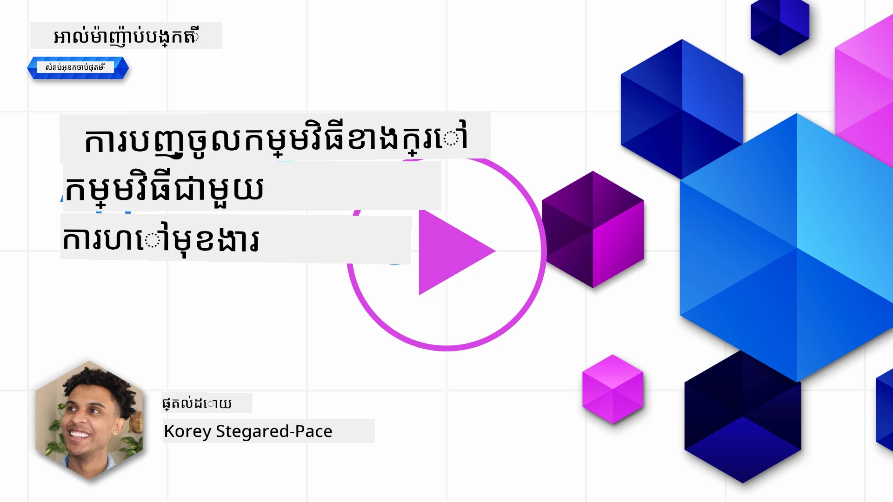
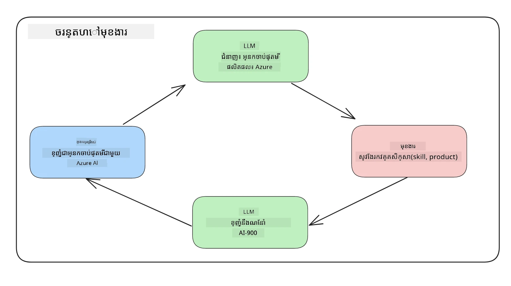
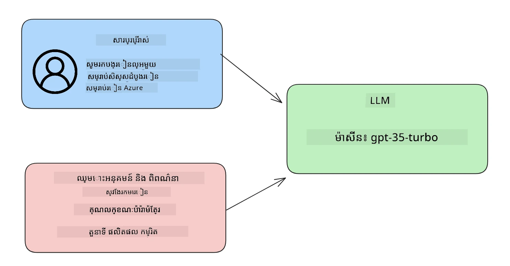

# ការចួលបញ្ចូលជាមួយការហៅមុខងារ

[](https://youtu.be/DgUdCLX8qYQ?si=f1ouQU5HQx6F8Gl2)

អ្នកបានរៀនរួចមួយចំនួនល្អហើយនៅក្នុងមេរៀនមុនៗ។ ទោះជាយ៉ាងណា យើងអាចធ្វើអោយកាន់តែល្អប្រសើរឡើងទៀត។ មានរឿងខ្លះៗដែលយើងអាចដោះស្រាយបាន គឺតើយើងអាចទទួលបានទ្រង់ទ្រាយការឆ្លើយតបដែលមានលក្ខណៈសរុបរឹងមាំដើម្បីងាយស្រួលប្រើប្រាស់ជាមួយការឆ្លើយតបនៅឆ្ពោះទៅមុខឬទេ។ ក៏ដូចជាយើងអាចចង់បន្ថែមទិន្នន័យពីប្រភពផ្សេងៗដទៃទៀតដើម្បីបន្ថែមប្រសិទ្ធភាពដល់កម្មវិធីរបស់យើង។

បញ្ហាដែលបានយោងខាងលើគឺជាអ្វីដែលជំពូកនេះកំពុងស្វែងរកដោះស្រាយ។

## មេរៀនបើកបរ

មេរៀននេះនឹងរួមបញ្ចូល:

- ពន្យល់អំពីការហៅមុខងារមានអ្វីខ្លះ និងការប្រើប្រាស់វា។
- បង្កើតការហៅមុខងារជាមួយ Azure OpenAI។
- របៀបចូលរួមការហៅមុខងារចូលទៅកាន់កម្មវិធីមួយ។

## គោលបំណងអប់រំ

នៅចុងបញ្ចប់មេរៀននេះ អ្នកនឹងអាច:

- ពន្យល់គោលបំណងនៃការប្រើការហៅមុខងារ។
- កំណត់ការហៅមុខងារ Function Call ដោយប្រើសេវាកម្ម Azure OpenAI។
- រចនាការហៅមុខងារដែលមានប្រសិទ្ធភាពសម្រាប់ករណីប្រើប្រាស់កម្មវិធីរបស់អ្នក។

## ស្ថានភាព៖ កែលម្អ chatbot របស់យើងជាមួយមុខងារ

សម្រាប់មេរៀននេះ យើងចង់បង្កើតមុខងារមួយសម្រាប់ស្តាតាប់អប់រំរបស់យើងដែលអនុញ្ញាតអោយអ្នកប្រើប្រាស់ប្រើប្រាស់ chatbot ដើម្បីស្វែងរកវគ្គបច្ចេកទេស។ យើងនឹងផ្ដល់អនុសាសន៍វគ្គសិក្សាដែលសមរម្យទៅនឹងកំរិតជំនាញ តួនាទីបច្ចុប្បន្ន និងបច្ចេកវិទ្យាដែលពេញចិត្ត។

ដើម្បីបញ្ចប់ស្ថានភាពនេះ យើងនឹងប្រើការរួមបញ្ចូល៖

- `Azure OpenAI` ដើម្បីបង្កើតបទពិសោធន៍ជជែកសម្រាប់អ្នកប្រើប្រាស់។
- `Microsoft Learn Catalog API` ដើម្បីជួយអ្នកប្រើប្រាស់ស្វែងរកវគ្គសិក្សាដោយផ្អែកលើការស្នើសុំរបស់អ្នកប្រើប្រាស់។
- `Function Calling` ដើម្បីយកសំណួររបស់អ្នកប្រើប្រាស់ ហើយផ្ញើវាទៅមុខងារមួយដើម្បីធ្វើសំណើ API។

ដើម្បីចាប់ផ្ដើម មកមើលថាហេតុអ្វីយើងចង់ប្រើ Function Calling ជាចំណែកដំបូង៖

## ហេតុផលនៃការហៅមុខងារ

មុននឹងមានការហៅមុខងារ តបតទៅពី LLM គឺគ្មានរចនាសម្ព័ន្ធ និងមិនមានភាពស៊ីជញ្ជាន់។ អ្នកអភិវឌ្ឍត្រូវបានបញ្ជ្រាបឲ្យសរសេរកូដត្រួតពិនិត្យស្មុគស្មាញដើម្បីធានាថាពួកគេចេញលទ្ធផលបានយ៉ាងត្រឹមត្រូវពីមុខងារជាច្រើន។ អ្នកប្រើប្រាស់មិនអាចទទួលបានចម្លើយដូចជា "អាកាសធាតុបច្ចុប្បន្ននៅទីក្រុង Stockholm ជាអ្វី?"។ នេះគឺសម្រាប់ព្រោះម៉ូដែលមានការកំណត់លើកាលបរិច្ឆេទទិន្នន័យដែលបានបណ្តុះបណ្តាល។

Function Calling គឺជាមុខងារមួយនៃសេវាកម្ម Azure OpenAI ដើម្បីជៀសវាងកំណត់នូវចំនុចខាងក្រោម៖

- **ទ្រង់ទ្រាយការឆ្លើយតបមានភាពស៊ីជញ្ជាន់។** ប្រសិនបើយើងអាចត្រួតបញ្ជាការទ្រង់ទ្រាយការឆ្លើយតបបានល្អ យើងអាចរួមបញ្ចូលការឆ្លើយតបនោះទៅប្រព័ន្ធផ្សេងៗបានយ៉ាងងាយស្រួល។
- **ទិន្នន័យខាងក្រៅ។** មានសមត្ថភាពប្រើទិន្នន័យពីប្រភពផ្សេងៗនៃកម្មវិធីនៅក្នុងបរិបទជជែក។

## ផ្ដល់ការជ្រាបមើលបញ្ហាមានរូបភាពជាករណីស្ថានភាព

> យើងផ្ដល់អនុសាសន៍ឲ្យអ្នកប្រើ [សៀបភ្ទុក notebook](./python/aoai-assignment.ipynb?WT.mc_id=academic-105485-koreyst) ប្រសិនបើអ្នកចង់បង្ហាញករណីខាងក្រោម។ អ្នកអាចអានតែម្ដងដើម្បីយល់ពីបញ្ហាមួយដែលមុខងារអាចជួយដោះស្រាយបាន។

មកមើលឧទាហរណ៍ដែលបង្ហាញបញ្ហាទ្រង់ទ្រាយនៃការឆ្លើយតបទៅ៖

ចូរយើងនិយាយថាយើងចង់បង្កើតមូលដ្ឋានទិន្នន័យប្រវត្តិសិស្សដើម្បីអាចផ្ដល់اقتراحវគ្គសិក្សាដែលត្រូវបានប្រកបដោយភាពត្រឹមត្រូវដល់ពួកគេ។ ខាងក្រោមនេះយើងមានការពណ៌នាពីសិស្សពីរប្រភេទដែលមានទិន្នន័យស្រដៀងគ្នា។

1. បង្កើតការតភ្ជាប់ទៅឧបករណ៍ Azure OpenAI របស់យើង៖

   ```python
   import os
   import json
   from openai import AzureOpenAI
   from dotenv import load_dotenv
   load_dotenv()

   client = AzureOpenAI(
   api_key=os.environ['AZURE_OPENAI_API_KEY'],  # នេះក៏ជាលំនាំដើមផងដែរ អ្នកអាចមិនចាំបាច់បញ្ចូលវាបាន
   api_version = "2023-07-01-preview"
   )

   deployment=os.environ['AZURE_OPENAI_DEPLOYMENT']
   ```

    ខាងក្រោមនេះជាកូដ Python សម្រាប់កំណត់តភ្ជាប់ទៅ Azure OpenAI ដែលយើងកំណត់ `api_type`, `api_base`, `api_version` និង `api_key`។

1. បង្កើតការពណ៌នាសិស្សពីរដោយប្រើអថេរ `student_1_description` និង `student_2_description`។

   ```python
   student_1_description="Emily Johnson is a sophomore majoring in computer science at Duke University. She has a 3.7 GPA. Emily is an active member of the university's Chess Club and Debate Team. She hopes to pursue a career in software engineering after graduating."

   student_2_description = "Michael Lee is a sophomore majoring in computer science at Stanford University. He has a 3.8 GPA. Michael is known for his programming skills and is an active member of the university's Robotics Club. He hopes to pursue a career in artificial intelligence after finishing his studies."
   ```

    យើងចង់ផ្ញើការពណ៌នាសិស្សខាងលើទៅ LLM ដើម្បីបំបែកទិន្នន័យ។ ទិន្នន័យនេះអាចប្រើប្រាស់បន្តនៅក្នុងកម្មវិធីរបស់យើង និងផ្ញើទៅ API ឬផ្ទុកក្នុងមូលដ្ឋានទិន្នន័យដែរ។

1. យើងបង្កើតសំណើរចម្លើយស្ទួនពីរដែលណែនាំ LLM ថាតើព័ត៌មានអ្វីដែលយើងចាប់អារម្មណ៍៖

   ```python
   prompt1 = f'''
   Please extract the following information from the given text and return it as a JSON object:

   name
   major
   school
   grades
   club

   This is the body of text to extract the information from:
   {student_1_description}
   '''

   prompt2 = f'''
   Please extract the following information from the given text and return it as a JSON object:

   name
   major
   school
   grades
   club

   This is the body of text to extract the information from:
   {student_2_description}
   '''
   ```

    សំណើរចម្លើយខាងលើណែនាំ LLM ដើម្បីដកយកព័ត៌មាន ហើយតបតបវិញក្នុងទ្រង់ទ្រាយ JSON ។

1. បន្ទាប់ពីកំណត់សំណើរចម្លើយ និងការតភ្ជាប់ទៅ Azure OpenAI យើងនឹងផ្ញើសំណើរចម្លើយទៅ LLM ដោយប្រើ `openai.ChatCompletion`។ យើងរក្សាសំណើរចម្លើយក្នុងអថេរ `messages` ហើយកំណត់តួនាទីជា `user`។ នេះគឺតំណាងសម្រាប់សារ​មួយ​ពី​អ្នកប្រើដែលបានសរសេរទៅ chatbot។

   ```python
   # លទ្ធផលពីបញ្ហាទីមួយ
   openai_response1 = client.chat.completions.create(
   model=deployment,
   messages = [{'role': 'user', 'content': prompt1}]
   )
   openai_response1.choices[0].message.content

   # លទ្ធផលពីបញ្ហាទីពីរ
   openai_response2 = client.chat.completions.create(
   model=deployment,
   messages = [{'role': 'user', 'content': prompt2}]
   )
   openai_response2.choices[0].message.content
   ```

ឥឡូវនេះយើងអាចផ្ញើសំណើរចម្លើយទាំងពីរទៅ LLM ហើយវិភាគចម្លើយដែលយើងទទួលបានដោយស្វែងរកដូចជា `openai_response1['choices'][0]['message']['content']`។

1. និងចុងក្រោយ យើងអាចបម្លែងចម្លើយទៅទ្រង់ទ្រាយ JSON ដោយហៅ `json.loads`៖

   ```python
   # កំពុងផ្ទុកការឆ្លើយតបជា​អ αντικείμενο JSON
   json_response1 = json.loads(openai_response1.choices[0].message.content)
   json_response1
   ```

    ចម្លើយទី 1៖

   ```json
   {
     "name": "Emily Johnson",
     "major": "computer science",
     "school": "Duke University",
     "grades": "3.7",
     "club": "Chess Club"
   }
   ```

    ចម្លើយទី 2៖

   ```json
   {
     "name": "Michael Lee",
     "major": "computer science",
     "school": "Stanford University",
     "grades": "3.8 GPA",
     "club": "Robotics Club"
   }
   ```

    ទោះបីជាសំណើរចម្លើយដូចគ្នានិងការពណ៌នាដូចគ្នា យើងឃើញតម្លៃលក្ខណៈ `Grades` ត្រូវបានផ្ទៀងផ្ទាត់ខុសគ្នា ពីព្រោះខ្លះពេលយើងទទួលបានទ្រង់ទ្រាយ `3.7` ខ្លះពេលទៀត `3.7 GPA`។

    លទ្ធផលនេះពីព្រោះ LLM ទទួលទិន្នន័យមិនមានរចនាសម្ព័ន្ធក្នុងទ្រង់ទ្រាយសំណើរចម្លើយ ហើយតបតបវិញដោយទិន្នន័យមិនមានរចនាសម្ព័ន្ធដែរ។ យើងត្រូវការទ្រង់ទ្រាយដែលមានរចនាសម្ព័ន្ធដើម្បីដឹងថាតើយើងគួររំពឹងទុកអ្វីនៅពេលផ្ទុក ឬប្រើប្រាស់ទិន្នន័យនេះ។

តើយើងដោះស្រាយបញ្ហាទ្រង់ទ្រាយនេះដូចម្តេច? ដោយប្រើការហៅមុខងារ function calling យើងអាចធានាថាយើងទទួលបានទិន្នន័យដែលមានរចនាសម្ព័ន្ធត្រឡប់មកវិញ។ នៅពេលប្រើ function calling, LLM មិនហៅ ឬរត់មុខងារណាមួយពិតប្រាកដទេ។ ផ្ទុយទៅវិញ យើងបង្កើតរចនាសម្ព័ន្ធមួយដែលអោយ LLM អនុវត្តតាមសម្រាប់ចម្លើយរបស់វា។ បន្ទាប់មកយើងប្រើការឆ្លើយតបដែលមានរចនាសម្ព័ន្ធនោះដើម្បីដឹងថាត្រូវរត់មុខងារណាដែលមាននៅក្នុងកម្មវិធីរបស់យើង។



យើងអាចយកអ្វីដែលត្រូវបានត្រឡប់ពីមុខងារ ហើយផ្ញើវាទៅវិញទៅ LLM។ LLM នឹងតបតបជាមួយភាសាតាមធម្មជាតិដើម្បីឆ្លើយសំណួររបស់អ្នកប្រើ។

## ករណីប្រើប្រាស់សម្រាប់ការហៅមុខងារ

មានករណីប្រើប្រាស់ច្រើនណាស់ដែលការហៅមុខងារ Function Calls អាចធ្វើឲ្យកម្មវិធីរបស់អ្នកប្រសើរឡើង ដូចជា៖

- **ហៅឧបករណ៍ខាងក្រៅ External Tools**។ Chatbot មានសមត្ថភាពល្អក្នុងការផ្ដល់ចម្លើយសំណួរពីអ្នកប្រើ។ ដោយប្រើ Function Calling, chatbot អាចប្រើសារ ពីអ្នកប្រើ ដើម្បីបំពេញកិច្ចការ។ ឧទាហរណ៍ សិស្សនៅសាកលវិទ្យាល័យអាចសួរថា "ផ្ញើអ៊ីមែលទៅគ្រូរបស់ខ្ញុំថាគ្រូខ្ញុំត្រូវការជំនួយកាន់តែច្រើនលើមុខវិជ្ជានេះ"។ នេះអាចហៅមុខងារ `send_email(to: string, body: string)`។

- **បង្កើតសំណួរ API ឬ Database Queries**។ អ្នកប្រើអាចស្វែងរកព័ត៌មានដោយប្រើភាសាធម្មជាតិដែលត្រូវបានបម្លែងទៅជាសំណួរដែលមានរចនាសម្ព័ន្ធ ឬសំណើ API។ ឧទាហរណ៍ មនុស្សបង្រៀនម្នាក់ស្នើសុំថា "សិស្សណាខ្លះបានបញ្ចប់កិច្ចការចុងក្រោយ" ដែលអាចហៅមុខងារ `get_completed(student_name: string, assignment: int, current_status: string)`។

- **បង្កើតទិន្នន័យដែលមានរចនាសម្ព័ន្ធ Structured Data**។ អ្នកប្រើអាចយកអត្ថបទមួយចំនួន ឬ CSV ហើយប្រើ LLM ដើម្បីដកសារសំខាន់ៗចេញពីវា។ ឧទាហរណ៍ សិស្សម្នាក់អាចបម្លែងអត្ថបទវិចិបេឌាយ៉ាអំពីភាពសន្តិភាព ដើម្បីបង្កើតកាតសម្គាល់ AI។ នេះអាចធ្វើបានដោយប្រើមុខងារ `get_important_facts(agreement_name: string, date_signed: string, parties_involved: list)`។

## បង្កើតការហៅមុខងារដំបូងរបស់អ្នក

ដំណើរការបង្កើតការហៅមុខងារអាចបែងចែកជាជំហានចម្បងមួយចំនួន៖

1. **ហៅ** API Chat Completions ជាមួយបញ្ជីមុខងាររបស់អ្នក និងសារ user មួយ។
2. **អាន** ចម្លើយម៉ូដែល ដើម្បីអនុវត្តសកម្មភាពឧ. ដំណើរការ មុខងារ ឬ ហៅ API។
3. **ធ្វើ**ការហៅម្ដងទៀតទៅ API Chat Completions ជាមួយចម្លើយពីមុខងាររបស់អ្នក ដើម្បីប្រើព័ត៌មាននោះបង្កើតចម្លើយតបទៅអ្នកប្រើ។



### ជំហាន 1 - បង្កើតសារ

ជំហានដំបូងគឺបង្កើតសារអ្នកប្រើមួយ។ នេះអាចត្រូវបានកំណត់តម្លៃបែបដំណើរការផ្ទាល់ដោយយកតម្លៃពីបញ្ចូលអត្ថបទ ឬអ្នកអាចកំណត់តម្លៃនៅទីនេះផង។ ប្រសិនបើអ្នកជាថ្មីដែលកំពុងធ្វើការជាមួយ API Chat Completions យើងត្រូវកំណត់ `role` និង `content` របស់សារ។

`role` អាចជាតួនាទី `system` (បង្កើតច្បាប់), `assistant` (ម៉ូដែល) ឬ `user` (អ្នកប្រើចុងក្រោយ)។ សម្រាប់ function calling យើងនឹងកំណត់វាជា `user` ហើយផ្ដល់ឧទាហរណ៍សំណួរ។

```python
messages= [ {"role": "user", "content": "Find me a good course for a beginner student to learn Azure."} ]
```

ដោយកំណត់តួនាទីខុសៗគ្នា ធ្វើឲ្យ LLM យល់ថាម៉ាស៊ីននេះទ្បានប្រាប់អ្វីមួយ ឬអ្នកប្រើកំពុងនិយាយ អ្វីដែលជួយបង្កើតប្រវត្តិការសន្ទនាដែល LLM អាចបង្កើតបាន។

### ជំហាន 2 - បង្កើតមុខងារ

បន្ទាប់មក យើងនឹងកំណត់មុខងារ និងប៉ារ៉ាម៉ែត្រ។ យើងនឹងប្រើមុខងារតែមួយគត់ តែអ្នកអាចបង្កើតមុខងារច្រើនបាន។

> **សារៈសំខាន់**៖ មុខងារត្រូវបានបញ្ចូលក្នុងសារប្រព័ន្ធទៅ LLM ហើយត្រូវបានរាប់បញ្ចូលក្នុងចំនួន token ដែលមានស្រាប់។

ខាងក្រោមនេះ យើងបង្កើតមុខងារជាអារេនៃធាតុមួយៗ។ ធាតុមួយនីមួយៗគឺជា​មុខងារ​មួយ​ ហើយមានលក្ខណៈ `name`, `description` និង `parameters`៖

```python
functions = [
   {
      "name":"search_courses",
      "description":"Retrieves courses from the search index based on the parameters provided",
      "parameters":{
         "type":"object",
         "properties":{
            "role":{
               "type":"string",
               "description":"The role of the learner (i.e. developer, data scientist, student, etc.)"
            },
            "product":{
               "type":"string",
               "description":"The product that the lesson is covering (i.e. Azure, Power BI, etc.)"
            },
            "level":{
               "type":"string",
               "description":"The level of experience the learner has prior to taking the course (i.e. beginner, intermediate, advanced)"
            }
         },
         "required":[
            "role"
         ]
      }
   }
]
```

យើងមកពិពណ៌នាអំពីមុខងារ​នីមួយៗលម្អិត៖

- `name` - ឈ្មោះមុខងារដែលយើងចង់ហៅ។
- `description` - នេះជាការពណ៌នាអំពីរបៀបការងាររបស់មុខងារ។ ក្នុងនេះចាំបាច់ត្រូវច្បាស់លាស់។
- `parameters` - បញ្ជីតម្លៃ និងទ្រង់ទ្រាយដែលអ្នកចង់ឱ្យម៉ូដែលផលិតនៅក្នុងចម្លើយរបស់វា។ អារេ parameters ស្របគ្នាជាមួយធាតុ មានលក្ខណៈដូចខាងក្រោម៖
  1.  `type` - ប្រភេទទិន្នន័យដែលគ្រប់គ្រងលក្ខណៈ។
  1.  `properties` - បញ្ជីតម្លៃជាក់លាក់ដែលម៉ូដែលនឹងប្រើក្នុងចម្លើយដែលមានទ្រង់ទ្រាយ។
      1. `name` - សោរសម្រាប់លក្ខណៈ ដែលម៉ូដែលនឹងប្រើក្នុងចម្លើយដែលមានទ្រង់ទ្រាយ ដូចជា `product`។
      1. `type` - ប្រភេទទិន្នន័យរបស់លក្ខណៈនេះ ឧទាហរណ៍ `string`។
      1. `description` - ការពណ៌នាអំពីលក្ខណៈជាក់លាក់។

ក៏មានលក្ខណៈជាជម្រើស `required` - លក្ខណៈចាំបាច់សម្រាប់ការហៅមុខងារដើម្បីបញ្ចប់។

### ជំហាន 3 - ធ្វើការហៅមុខងារ

បន្ទាប់ពីកំណត់មុខងារ ត្រូវបញ្ចូលវាលើការហៅទៅ Chat Completion API។ យើងធ្វើនេះដោយបន្ថែម `functions` ទៅក្នុងសំណើ។ ក្នុងករណីនេះ `functions=functions`។

ក៏មានជម្រើសក្នុងការកំណត់ `function_call` ទៅជា `auto`។ នេះមានន័យថាយើងអោយ LLM ជ្រើសរើសមុខងារដែលគួរត្រូវបានហៅដោយផ្អែកលើសារ អ្នកប្រើ ប្រៀបធៀបទៅនឹងការកំណត់ដោយដៃ។

នេះជាកូដខាងក្រោម ដែលហៅ `ChatCompletion.create` ហើយយើងកំណត់ `functions=functions` និង `function_call="auto"` ដូច្នេះផ្តល់ជម្រើសដល់ LLM ជួយសម្រេចចិត្តពេលហៅមុខងារដែលយើងផ្តល់៖

```python
response = client.chat.completions.create(model=deployment,
                                        messages=messages,
                                        functions=functions,
                                        function_call="auto")

print(response.choices[0].message)
```

ចម្លើយត្រឡប់មកឥឡូវនេះមានរូបរាងដូចខាងក្រោម៖

```json
{
  "role": "assistant",
  "function_call": {
    "name": "search_courses",
    "arguments": "{\n  \"role\": \"student\",\n  \"product\": \"Azure\",\n  \"level\": \"beginner\"\n}"
  }
}
```

នៅទីនេះយើងអាចឃើញថា មុខងារ `search_courses` ត្រូវបានហៅ និងជាមួយអគ្គិសនីអ្វីខ្លះ ដែលបានរាយបញ្ជីនៅលើលក្ខណៈ `arguments` ក្នុងចម្លើយ JSON។

លទ្ធផលដែល LLM អាចរកឃើញទិន្នន័យ ដែលសមរម្យជាមួយអគ្គិសនីនៃមុខងារ ពីព្រោះវាកំពុងដកយកវាពីតម្លៃដែលបានផ្តល់ទៅ `messages` ក្នុងការហៅ chat completion។ ខាងក្រោមនេះជាការជម្រាប reminder នៃតម្លៃ `messages`៖

```python
messages= [ {"role": "user", "content": "Find me a good course for a beginner student to learn Azure."} ]
```

ធ្វើឲ្យអ្នកឃើញថា ពាក្យ `student`, `Azure` និង `beginner` ត្រូវបានដកស្រង់ពី `messages` ហើយកំណត់ជាការបញ្ចូលទៅមុខងារ។ ការប្រើមុខងារដូចនេះជាវិធីល្អក្នុងការដកព័ត៌មានពីសំណើរចម្លើយ តែជួយផ្តល់រចនាសម្ព័ន្ធដល់ LLM ហើយមានមុខងារដែលអាចប្រើឡើងវិញបាន។

បន្ទាប់មក យើងត្រូវមើលថា យើងអាចប្រើវានៅក្នុងកម្មវិធីរបស់យើងបែបណា។

## ចូលរួមការហៅមុខងារចូលក្នុងកម្មវិធី

បន្ទាប់ពីយើងបានសាកល្បងទទួលបានចម្លើយដែលមានទ្រង់ទ្រាយពី LLM យើងអាចបញ្ចូលវាទៅក្នុងកម្មវិធី។

### គ្រប់គ្រងលំហូរ

ដើម្បីចូលរួមវាទៅក្នុងកម្មវិធីរបស់យើង យើងអនុវត្តជំហានដូចជា៖

1. ជំហានដំបូង ធ្វើការហៅសេវាកម្ម OpenAI ហើយរក្សាសារ នៅក្នុងអថេរ `response_message`។

   ```python
   response_message = response.choices[0].message
   ```

1. ឥឡូវនេះ យើងនឹងកំណត់មុខងារដែលហៅ Microsoft Learn API ដើម្បីទទួលបញ្ជីវគ្គសិក្សា៖

   ```python
   import requests

   def search_courses(role, product, level):
     url = "https://learn.microsoft.com/api/catalog/"
     params = {
        "role": role,
        "product": product,
        "level": level
     }
     response = requests.get(url, params=params)
     modules = response.json()["modules"]
     results = []
     for module in modules[:5]:
        title = module["title"]
        url = module["url"]
        results.append({"title": title, "url": url})
     return str(results)
   ```

    សូមចំណាំថាឥឡូវនេះ យើងបង្កើតមុខងារ Python ពិតប្រាកដដែលផ្គូរ​ផ្គងគ្នាជាមួយឈ្មោះមុខងារដែលបានណែនាំនៅក្នុងអថេរ `functions`។ យើងកំពុងធ្វើការហៅ API ខាងក្រៅសម្រាប់ទាញយកទិន្នន័យ។ ក្នុងករណីនេះ យើងប្រើ Microsoft Learn API ដើម្បីស្វែងរកមេរៀនបណ្តុះបណ្តាល។

ចាសដែរ យើងបានបង្កើតអថេរ `functions` និងមុខងារ Python ដែលផ្គូរផ្គង តើយើងប្រាប់ LLM ឲ្យផ្គូរផ្គងពីរនេះដូចម្តេច ដើម្បីធ្វើការហៅមុខងារ Python របស់យើង?

1. ដើម្បីមើលថាតើយើងត្រូវហៅមុខងារ Python មួយ ឬអត់ ប្រើឡើងវិញ ត្រូវមើលចម្លើយ LLM ទូទៅ មើលថា `function_call` មាននៅក្នុងចម្លើយទេឬ? ហើយហៅមុខងារដែលបានបង្ហាញ។ នេះជាកូដខាងក្រោម៖

   ```python
   # ពិនិត្យមើលថា​ម៉ូឌែល​ចង់​ហៅ​មុខងារ​មួយ​ទេ​ឬអត់
   if response_message.function_call.name:
    print("Recommended Function call:")
    print(response_message.function_call.name)
    print()

    # ហៅ​មុខងារ​នោះ។
    function_name = response_message.function_call.name

    available_functions = {
            "search_courses": search_courses,
    }
    function_to_call = available_functions[function_name]

    function_args = json.loads(response_message.function_call.arguments)
    function_response = function_to_call(**function_args)

    print("Output of function call:")
    print(function_response)
    print(type(function_response))


    # បន្ថែម​ការ​តប​សំណួរ​អ្នកជំនួយ និង​ការ​តប​មុខងារ​ទៅ​កាន់​សារ
    messages.append( # បន្ថែម​ការ​តប​អ្នកជំនួយ​ទៅ​សារ
        {
            "role": response_message.role,
            "function_call": {
                "name": function_name,
                "arguments": response_message.function_call.arguments,
            },
            "content": None
        }
    )
    messages.append( # បន្ថែម​ការ​តប​មុខងារ​ទៅ​សារ
        {
            "role": "function",
            "name": function_name,
            "content":function_response,
        }
    )
   ```

    បន្ទាត់បីនេះធានាថាយើងដកឈ្មោះមុខងារ អាគុយម៉ង់ និងធ្វើការហៅ៖

   ```python
   function_to_call = available_functions[function_name]

   function_args = json.loads(response_message.function_call.arguments)
   function_response = function_to_call(**function_args)
   ```

    ខាងក្រោមនេះជាលទ្ធផលពីកូដរបស់យើង៖

    **លទ្ធផល**

   ```Recommended Function call:
   {
     "name": "search_courses",
     "arguments": "{\n  \"role\": \"student\",\n  \"product\": \"Azure\",\n  \"level\": \"beginner\"\n}"
   }

   Output of function call:
   [{'title': 'Describe concepts of cryptography', 'url': 'https://learn.microsoft.com/training/modules/describe-concepts-of-cryptography/?
   WT.mc_id=api_CatalogApi'}, {'title': 'Introduction to audio classification with TensorFlow', 'url': 'https://learn.microsoft.com/en-
   us/training/modules/intro-audio-classification-tensorflow/?WT.mc_id=api_CatalogApi'}, {'title': 'Design a Performant Data Model in Azure SQL
   Database with Azure Data Studio', 'url': 'https://learn.microsoft.com/training/modules/design-a-data-model-with-ads/?
   WT.mc_id=api_CatalogApi'}, {'title': 'Getting started with the Microsoft Cloud Adoption Framework for Azure', 'url':
   'https://learn.microsoft.com/training/modules/cloud-adoption-framework-getting-started/?WT.mc_id=api_CatalogApi'}, {'title': 'Set up the
   Rust development environment', 'url': 'https://learn.microsoft.com/training/modules/rust-set-up-environment/?WT.mc_id=api_CatalogApi'}]
   <class 'str'>
   ```

1. ឥឡូវនេះ យើងនឹងផ្ញើសារបច្ចុប្បន្ន `messages` ទៅ LLM ដើម្បីទទួលបានចម្លើយជាភាសាតាមធម្មជាតិ ដោយមិនមានទ្រង់ទ្រាយ JSON API។

   ```python
   print("Messages in next request:")
   print(messages)
   print()

   second_response = client.chat.completions.create(
      messages=messages,
      model=deployment,
      function_call="auto",
      functions=functions,
      temperature=0
         )  # ទទួលបានការឆ្លើយតបថ្មីពី GPT ដែលវាអាចមើលឃើញការឆ្លើយតបនៃមុខងារ


   print(second_response.choices[0].message)
   ```

    **លទ្ធផល**

   ```python
   {
     "role": "assistant",
     "content": "I found some good courses for beginner students to learn Azure:\n\n1. [Describe concepts of cryptography] (https://learn.microsoft.com/training/modules/describe-concepts-of-cryptography/?WT.mc_id=api_CatalogApi)\n2. [Introduction to audio classification with TensorFlow](https://learn.microsoft.com/training/modules/intro-audio-classification-tensorflow/?WT.mc_id=api_CatalogApi)\n3. [Design a Performant Data Model in Azure SQL Database with Azure Data Studio](https://learn.microsoft.com/training/modules/design-a-data-model-with-ads/?WT.mc_id=api_CatalogApi)\n4. [Getting started with the Microsoft Cloud Adoption Framework for Azure](https://learn.microsoft.com/training/modules/cloud-adoption-framework-getting-started/?WT.mc_id=api_CatalogApi)\n5. [Set up the Rust development environment](https://learn.microsoft.com/training/modules/rust-set-up-environment/?WT.mc_id=api_CatalogApi)\n\nYou can click on the links to access the courses."
   }

   ```

## កិច្ចការសម្រាប់អនុវត្តន៍

ដើម្បីបន្តរំពឹតចំណេះដឹងរបស់អ្នកអំពី Azure OpenAI Function Calling អ្នកអាចបង្កើត៖

- បន្ថែមប៉ារ៉ាម៉ែត្រ ការហៅមុខងារដែលអាចជួយសិស្សស្វែងរកវគ្គសិក្សាបន្ថែម។
- បង្កើតមុខការហៅមួយទៀតដែលយកព័ត៌មានបន្ថែមពីអ្នករៀន ដូចជា ភាសាមាតុភាគរបស់ពួកគេ។
- បង្កើតការគ្រប់គ្រងករណីកំហុស នៅពេលដែលការហៅមុខងារ និង/ឬ ការហៅ API មិនបានផ្តល់វគ្គសិក្សាដែលសាកសម។
Hint: តាមដានទំព័រ [Learn API reference documentation](https://learn.microsoft.com/training/support/catalog-api-developer-reference?WT.mc_id=academic-105485-koreyst) ដើម្បីមើលពីរបៀប និងកន្លែងដែលទិន្នន័យនេះអាចចូលដល់បាន។

## ការងារល្អណាស់! បន្តការធ្វើដំណើរ

បន្ទាប់ពីបញ្ចប់មេរៀននេះ សូមពិនិត្យមើល [Generative AI Learning collection](https://aka.ms/genai-collection?WT.mc_id=academic-105485-koreyst) របស់យើងដើម្បីបន្តបង្កើនចំណេះដឹង Generative AI របស់អ្នក!

ទៅមេរៀនទី 12 ដែលយើងនឹងមើលមុខវិជ្ជាដែល [រចនា UX សម្រាប់កម្មវិធី AI](../12-designing-ux-for-ai-applications/README.md?WT.mc_id=academic-105485-koreyst)!

---

<!-- CO-OP TRANSLATOR DISCLAIMER START -->
**ការបដិសេធ**៖  
ឯកសារនេះត្រូវបានបកប្រែដោយប្រើសេវាបកប្រែ AI [Co-op Translator](https://github.com/Azure/co-op-translator)។ ខណៈពេលដែលយើងខំប្រឹងប្រែងដើម្បីភាពត្រឹមត្រូវ សូមយល់ឲ្យបានច្បាស់ថាការបកប្រែដោយស្វ័យប្រវត្តិអាចមានកំហុស ឬក៏ភាពមិនត្រឹមត្រូវខ្លះៗ។ ឯកសារដើមដែលមានភាសាមូលដ្ឋានគួរត្រូវបានគិលានុក្រមជាប្រភពមានអំណាច។ សម្រាប់ព័ត៌មានសំខាន់ៗ យើងសូមណែនាំឲ្យបកប្រែដោយមនុស្សជំនាញ។ យើងមិនទទួលខុសត្រូវចំពោះការយល់ច្រឡំ ឬការបកប្រែខុសត្រូវណាមួយដែលកើតឡើងពីការប្រើប្រាស់ការបកប្រែនេះទេ។
<!-- CO-OP TRANSLATOR DISCLAIMER END -->