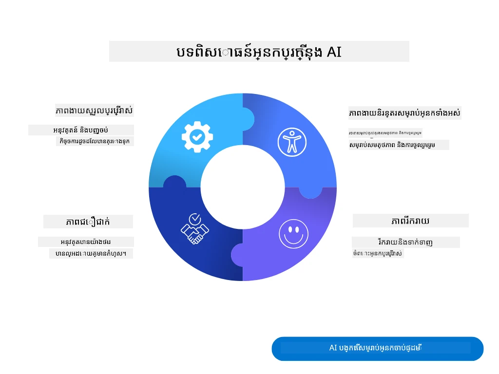
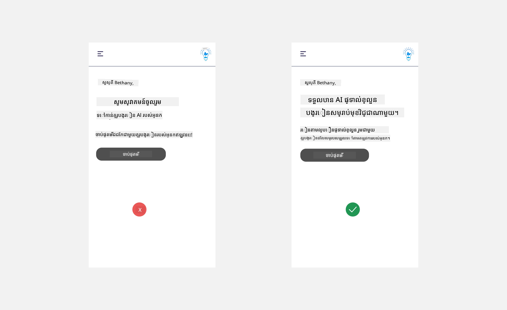
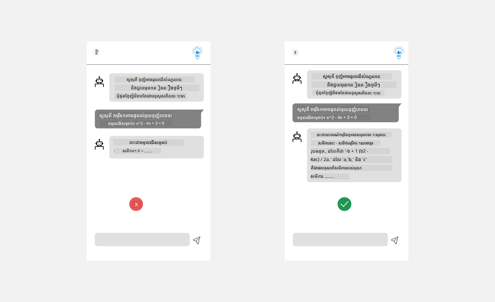
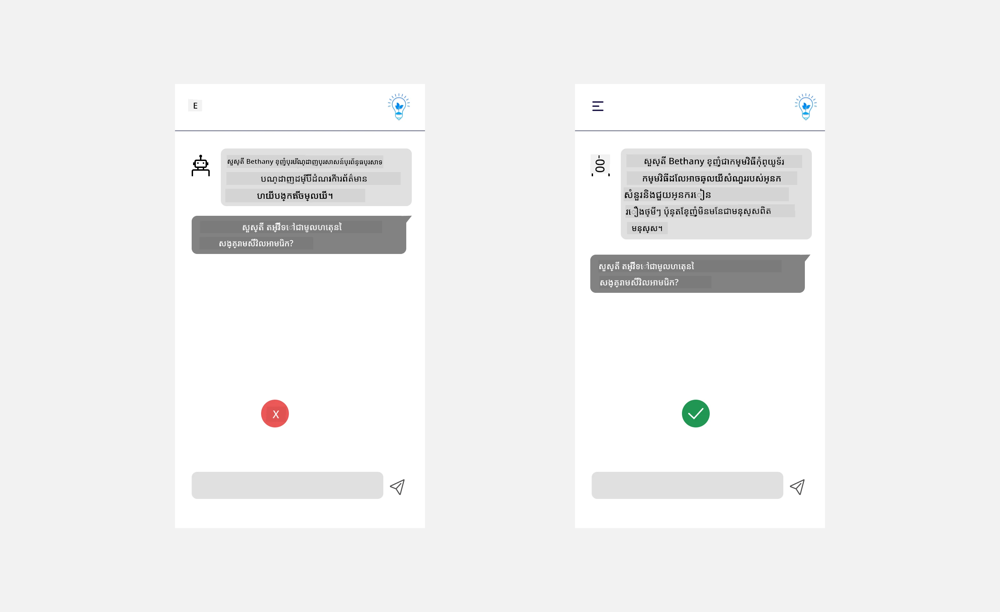
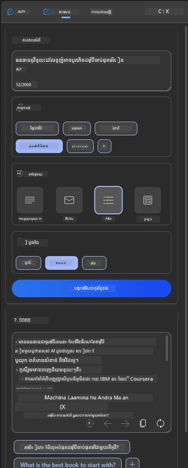
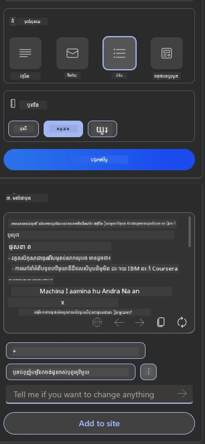
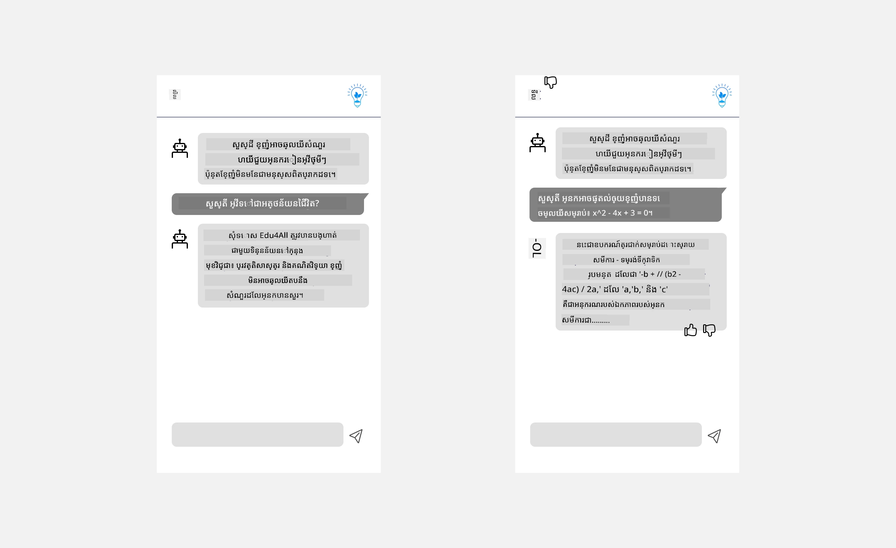

# ការរចនាផ្នែក UX សម្រាប់កម្មវិធី AI

> _(ចុចលើរូបភាពខាងលើដើម្បីមើលវីដេអូសិក្សាបង្រៀននេះ)_

បទពិសោធន៍អ្នកប្រើគឺជាផ្នែកសំខាន់ណាស់នៃការបង្កើតកម្មវិធី។ អ្នកប្រើប្រាស់ត្រូវការអាចប្រើកម្មវិធីរបស់អ្នកបានយ៉ាងមានប្រសិទ្ធភាព ដើម្បីអនុវត្តភារកិច្ច។ ការមានប្រសិទ្ធភាពគឺជារឿងមួយ ប៉ុន្តែលោកអ្នកក៏ត្រូវរចនាកម្មវិធីដើម្បីឱ្យគេអាចប្រើបានដោយមនុស្សគ្រប់រូប ដើម្បីធ្វើឱ្យវា _អាចចូលដំណើរការបាន_។ មេរៀននេះនឹងផ្តោតលើផ្នែកនេះ ដូច្នេះសង្ឃឹមថាលោកអ្នកនឹងបញ្ចប់ជាមួយការរចនាកម្មវិធីដែលមនុស្សអាចនិងចង់ប្រើ។

## ការណែនាំ

បទពិសោធន៍អ្នកប្រើគឺជាវិធីដែលអ្នកប្រើប្រាស់ធ្វើអន្តរកម្មនិងប្រើផលិតផលឬសេវាកម្មជាក់លាក់ មិនថាគឺប្រព័ន្ធ ឧបករណ៍ ឬការរចនាទេ។ នៅពេលអភិវឌ្ឍកម្មវិធី AI អ្នកអភិវឌ្ឍមិនតែផ្តោតលើការធានាបទពិសោធន៍អ្នកប្រើប្រាស់មានប្រសិទ្ធភាពទេ ប៉ុន្តែរួមបញ្ចូលភាពសីលធម៌ផងដែរ។ ក្នុងមេរៀននេះ យើងនឹងគ្របដណ្តប់ពីរបៀបបង្កើតកម្មវិធីបញ្ញាសិប្បនិម្មិត (AI) ដែលបំពេញតម្រូវការអ្នកប្រើ។

មេរៀននឹងពាក់ព័ន្ធនឹងផ្នែកដូចខាងក្រោម៖

- ការណែនាំពីបទពិសោធន៍អ្នកប្រើ និងការយល់ដឹងពីតម្រូវការអ្នកប្រើ
- ការរចនាកម្មវិធី AI សម្រាប់ការជឿទុកចិត្ត និងភាពបើច្បាស់
- ការរចនាកម្មវិធី AI សម្រាប់ការសហការនិងមតិយោបល់

## គោលបំណងហ្វឹកហាត់

បន្ទាប់ពីចប់មេរៀននេះ អ្នកនឹងអាច៖

- យល់ពីរបៀបបង្កើតកម្មវិធី AI ដែលបំពេញតម្រូវការអ្នកប្រើ។
- រចនាកម្មវិធី AI ដែលលើកស្ទួយការជឿទុកចិត្ត និងសហការណ៍។

### លក្ខខណ្ឌមុន

ចំណាយពេលបន្តិច អានបន្ថែមពី [បទពិសោធន៍អ្នកប្រើ និងគំនិតការរចនា។](https://learn.microsoft.com/training/modules/ux-design?WT.mc_id=academic-105485-koreyst)

## ការណែនាំពីបទពិសោធន៍អ្នកប្រើ និងការយល់ដឹងពីតម្រូវការអ្នកប្រើ

នៅក្នុងស្ថាប័នអប់រំបង្កើតមកប្រាកដរបស់យើង គេមានអ្នកប្រើ២ប្រភេទគឺគ្រូបង្រៀន និងសិស្ស។ អ្នកប្រើទាំងពីរមានតម្រូវការផ្សេងគ្នា។ ការរចនាមូលដ្ឋានលើអ្នកប្រើផ្តោតលើអ្នកប្រើ ដើម្បីធានាថាផលិតផលមានសារសំខាន់ និងមានអត្ថប្រយោជន៍ចំពោះអ្នកដែលវាមានគោលបំណងសម្រាប់ពួកគេ។

កម្មវិធីគួរតែ **មានប្រយោជន៍ នឹងទុកចិត្ត ចូលដំណើរការ ហើយរីករាយ** ដើម្បីផ្តល់បទពិសោធន៍អ្នកប្រើល្អ។

### ប្រើប្រាស់ងាយ

មានប្រយោជន៍មានន័យថាកម្មវិធីមានមុខងារដែលផ្គូរផ្គងទៅនឹងគោលបំណងរបស់វា ដូចជា ស្វ័យប្រវត្តិការ ដំណើរការវាយតម្លៃ ឬបង្កើតកាតសម្រាប់ការត្រួតពិនិត្យម្តងទៀត។ កម្មវិធីដែលស្វ័យ​ប្រវត្តិការ​ដំណើរការវាយតម្លៃគួរតែអាចផ្ដល់ពិន្ទុដោយត្រឹមត្រូវ និងមានប្រសិទ្ធភាពទៅលើការងារនៃសិស្សដោយផ្អែកលើជាក់លាក់ដែលបានកំណត់រួចហើយ។ ដូចគ្នានេះ កម្មវិធីដែលបង្កើតកាតសម្រាប់ត្រួតពិនិត្យម្តងទៀតគួរតែអាចបង្កើតសំនួរដែលពាក់ព័ន្ធ និងមានចម្រុះ ផ្អែកលើទិន្នន័យរបស់វា។

### ទុកចិត្ត

ទុកចិត្តមានន័យថាកម្មវិធីអាចអនុវត្តភារកិច្ចរបស់វាបានយ៉ាងមិនផ្ដួលបុក និងគ្មានកំហុស។ ទោះជាយ៉ាងណា AI ដូចជាមនុស្ស មិនបញ្ចូលគ្នាពេញលេញនោះទេ ហើយអាចមានកំហុសបាន។ កម្មវិធីអាចប្រឈមនឹងកំហុស ឬស្ថានភាពមិនរំពឹងទុក ដែលត្រូវការជំនួយឬកែប្រែការពិតពីមនុស្ស។ តើអ្នកដោះស្រាយកំហុសយ៉ាងដូចម្តេច? នៅផ្នែកចុងក្រោយនៃមេរៀននេះ យើងនឹងពិភាក្សាអំពីរបៀបដែលប្រព័ន្ធ និងកម្មវិធី AI ត្រូវបានរចនាឡើងសម្រាប់ការសហការនិងមតិយោបល់។

### ចូលដំណើរការ

ចូលដំណើរការមានន័យថាវារួមបញ្ចូលបទពិសោធន៍អ្នកប្រើទៅកាន់អ្នកប្រើដែលមានសមត្ថភាពផ្សេងគ្នា រួមទាំងអ្នកដែលមានពិរភាព ដើម្បីធានាថាគ្មានអ្នកណាត្រូវបានលែងចេញ។ ដោយអនុវត្តតាមមគ្គុទេសក៍ និងគោលការណ៍ចូលដំណើរការ ដំណោះស្រាយ AI ក្លាយជាអាចរួមបញ្ចូលបានយ៉ាងច្រើន ជាប្រសិទ្ធភាព និងមានអត្ថប្រយោជន៍ចំពោះអ្នកប្រើរាល់រូប។

### រីករាយ

រីករាយមានន័យថាកម្មវិធីសប្បាយរីករាយក្នុងការប្រើប្រាស់។ បទពិសោធន៍អ្នកប្រើដែលទាក់ទាញអាចមានអត្ថប្រយោជន៍វិជ្ជមានលើអ្នកប្រើ ដោយលើកទឹកចិត្តឱ្យពួកគេទាក់ទងមកវិញនិងបង្កើនប្រាក់ចំណេញអាជីវកម្ម។

មិនមែនរាល់សាកល្បងត្រូវបានដោះស្រាយជាមួយ AI ទេ។ AI មកបន្ថែមបទពិសោធន៍អ្នកប្រើរបស់អ្នក ដូចជាស្វ័យប្រវត្តិការ ការងារដោយដៃ ឬបង្ហាញបទពិសោធន៍ផ្ទាល់ខ្លួន។

## ការរចនាកម្មវិធី AI សម្រាប់ជឿទុកចិត្ត និងភាពបើច្បាស់

ការបង្កើតជឿទុកចិត្តគឺសំខាន់ពេលរចនាកម្មវិធី AI។ ជឿទុកចិត្តធានាថាអ្នកប្រើប្រាស់មានទំនុកចិត្តថាកម្មវិធីនឹងអនុវត្តការងារយ៉ាងបានល្អ ប្រគល់លទ្ធផលយ៉ាងម៉ត់ចត់ ហើយលទ្ធផលជារឿងដែលអ្នកប្រើត្រូវការ។ គ្រោះថ្នាក់នៅផ្នែកនេះគឺការខ្វះជឿ ទៅក្នុងការជឿលើខ្លាំងពេក។ ការខ្វះជឿកើតឡើងពេលដែលអ្នកប្រើមានជឿតិច ឬគ្មានជឿនៅលើប្រព័ន្ធ AI ដែលនាំឱ្យអ្នកប្រើបដិសេធកម្មវិធីរបស់អ្នក។ ការជឿលើខ្លាំងពេកកើតឡើងពេលអ្នកប្រើប្រាស់គិតថាប្រព័ន្ធ AI មានសមត្ថភាពខ្ពស់ពេក នាំឱ្យអ្នកប្រើជឿលើប្រព័ន្ធ AI ដាខ្លាំងពេក។ ឧទាហរណ៍ ប្រព័ន្ធចាត់ថ្នាក់ស្វ័យប្រវត្តិដែលមានការជឿលើខ្លាំងពេកអាចធ្វើឲ្យគ្រូមិនពិនិត្យមើលខ្លះៗនៃក្រដាស ដើម្បីធានាប្រព័ន្ធវាយតម្លៃមានប្រសិទ្ធភាពល្អ។ នេះអាចបណ្តាលឲ្យមានពិន្ទុមិនសមរម្យ ឬមិនត្រឹមត្រូវសម្រាប់សិស្ស ឬខក Chancen សម្រាប់មតិយោបល់ និងការកែលម្អ។

វិធីពីរដើម្បីធានាជឿទុកចិត្តត្រូវបានដាក់នៅចំណុចកណ្ដាលនៃការរចនាគឺ ការពន្យល់បាននិងការត្រួតពិនិត្យ។

### ការពន្យល់បាន

ពេល AI ជួយក្នុងការបង្រៀនដូចជា ផ្តល់ចំណេះដឹងជូនលំនៅបន្ត បង្រៀននិងឪពុកម្តាយសូមដឹងរបៀបដែល AI ធ្វើការសម្រេចចិត្តគឺមានសារៈសំខាន់។ នេះគឺការពន្យល់បាន - ការយល់ពីរបៀបដែលកម្មវិធី AI ធ្វើការសម្រេចចិត្ត។ ការរចនាដើម្បីពន្យល់បានរួមបញ្ចូលការបន្ថែមព័ត៌មានលម្អិតដែលបង្ហាញពីរបៀបដែល AI ទៅដល់លទ្ធផល។ អ្នកទស្សនាគួរត្រូវដឹងថាលទ្ធផលត្រូវបានបង្កើតដោយ AI មិនមែនដោយមនុស្ស។ ឧទាហរណ៍ ជំនួសនិយាយ "ចាប់ផ្តើមជជែកជាមួយគ្រូបង្រៀនរបស់អ្នកឥឡូវនេះ" អាចនិយាយថា "ប្រើប្រាស់គ្រូបង្រៀន AI ដែលអាស្រ័យលើតម្រូវការរបស់អ្នក និងជួយអ្នករៀនតាមល្បឿនរបស់អ្នក។"

ឧទាហរណ៍ផ្សេងទៀតគឺរបៀបដែល AI ប្រើទិន្នន័យអ្នកប្រើ និងទិន្នន័យផ្ទាល់ខ្លួន។ ឧទាហរណ៍ អ្នកប្រើជាសិស្សអាចមានកំណត់យ៉ាងខ្លះដោយផ្អែកលើបុគ្គលិកលក្ខណៈរបស់ពួកគេ។ AI អាចមិនអាចបង្ហាញចម្លើយអ្នកនូវសំណួរតែមួយទេ ប៉ុន្តែអាចជួយណែនាំឱ្យអ្នកប្រើគិតពីរបៀបដោះស្រាយបញ្ហា។

ផ្នែកចុងក្រោយនៃការពន្យល់បានគឺការសម្រួលនៃការពន្យល់។ សិស្សនិងគ្រូមិនមិនមែនជាអ្នកជំនាញ AI ដោយផ្ទាល់ទេ ដូច្នេះការពន្យល់អំពីអ្វីដែលកម្មវិធីអាច ឬមិនអាចធ្វើបានគួរតែសម្រួល និងងាយស្រួលយល់។

### ការត្រួតពិនិត្យ

AI បង្កើតសហការណ៍រវាង AI និងអ្នកប្រើ ដែលជាទីបំផុត អ្នកប្រើអាចកែប្រែការបង្ហាញសំពាធ ដើម្បីទទួលការឆ្លើយតបផ្សេងៗ។ បន្ថែមពីនេះ ពេលមានលទ្ធផលចេញ អ្នកប្រើគួរតែអាចកែប្រែលទ្ធផល គួរឱ្យមានអារម្មណ៍ថាគ្រប់គ្រងវា។ ឧទាហរណ៍ នៅពេលប្រើ Bing អ្នកអាចកំណត់ការបង្ហាញសំពាធអាស្រ័យលើទ្រង់ទ្រាយ សំឡេង និងប្រវែង។ ដោយបន្ថែម អ្នកអាចបន្ថែមការផ្លាស់ប្តូរលើលទ្ធផល និងកែប្រែលទ្ធផលដូចដែលបង្ហាញខាងក្រោម៖

មុខងារផ្សេងទៀតក្នុង Bing ដែលឲ្យអាជ្ញាធរដល់អ្នកប្រើគ្រប់គ្រងលើកម្មវិធី គឺសមត្ថភាពជ្រើសរើសចូល និងចេញពីទិន្នន័យដែល AI ប្រើ។ សម្រាប់កម្មវិធីសាលារៀន សិស្សអាចចង់ប្រើកំណត់ហេតុនិងទង្វើរបស់គ្រូបង្រៀនជាវត្ថុធាតុផ្ទាល់ខ្លួន។

> នៅពេលរចនាកម្មវិធី AI ការយកចិត្តទុកដាក់គឺគន្លងទ្រង់ទ្រាយដើម្បីធានាថា អ្នកប្រើរក្សាជោគជ័យមិនឲ្យជឿលើខ្លាំងពេក ដែលបង្កើតសន្ទះមិនពិតពីសមត្ថភាពរបស់វា។ មធ្យោបាយមួយដើម្បីធ្វើបែបនេះគឺបង្កើតភាពឯករាជ្យរវាងការបង្ហាញសំពាធនិងលទ្ធផល។ ហើយរំលឹកអ្នកប្រើថា នេះគឺជាបញ្ញាសិប្បនិម្មិត មិនមែនមនុស្សដែលជាគូប្រជែងទេ។

## ការរចនាកម្មវិធី AI សម្រាប់សហការនិងមតិយោបល់

ដូចដែលបានរៀបរាប់មុន សិប្បនិម្មិតបង្កើតសហការណ៍រវាងអ្នកប្រើ និង AI។ ភាគច្រើននៃការប្រតិបត្ដិការជាមួយ AI គឺអ្នកប្រើបញ្ចូលសំពាធ ហើយ AI បង្កើតលទ្ធផល។ តើប្រសិនបើលទ្ធផលមិនត្រឹមត្រូវ? តើកម្មវិធីដោះស្រាយកំហុសយ៉ាងដូចម្តេច ប្រសិនបើកើតមានកំហុស? តើ AI ប្រកាសថាពុំមានកំហុសដោយអ្នកប្រើ ឬចំណាយពេលពន្យល់កំហុស?

កម្មវិធី AI គួរត្រូវបានសាងសង់ឡើងសម្រាប់ទទួល និងផ្តល់មតិយោបល់។ វាមិនតែជួយប្រព័ន្ធ AI ឲ្យកែលម្អទេ ប៉ុន្តែក៏បង្កើតជឿទុកចិត្តជាមួយអ្នកប្រើ។ វិលមតិយោបល់គួរត្រូវបានបញ្ចូលក្នុងការរចនា មួយឧទាហរណ៍គឺផ្ដាច់មោទនភាពដៃឬចុចបិទលើលទ្ធផល។

វិធីផ្សេងទៀតក្នុងការដោះស្រាយនេះគឺធ្វើការប្រាស្រ័យយ៉ាងច្បាស់អំពីសមត្ថភាព និងកំណត់ព្រំដែនរបស់ប្រព័ន្ធ។ ពេលអ្នកប្រើធ្វើកំហុសសុំអ្វីដែលលើសសមត្ថភាព AI គួរតែមានវិធីដោះស្រាយ ដូចបង្ហាញខាងក្រោម។

កំហុសប្រព័ន្ធគឺធម្មតាជាមួយកម្មវិធីដែលអ្នកប្រើសអាចត្រូវការជំនួយលើព័ត៌មានក្រៅដែនកំណត់ AI ឬកម្មវិធីមានដែនកំណត់ចំនួនសំណួរ/មុខវិជ្ជាដែលអាចបង្កើតសង្ខេបបាន។ ឧទាហរណ៍ កម្មវិធី AI បណ្តុះបណ្តាលជាមួយទិន្នន័យមុខវិជ្ជាត្រឹមតែ ដែលដូចជា ប្រវត្តិសាស្រ្ត និងគណិតវិទ្យា អាចមិនអាចដោះស្រាយសំណួរខាងភូមិវិទ្យាបាន។ ដើម្បីបន្ថយការខកចិត្តនេះ ប្រព័ន្ធ AI អាចឆ្លើយថា៖ "សូមអភ័យទោស ផលិតផលរបស់យើងបណ្តុះបណ្តាលជាមួយទិន្នន័យវិជ្ជាដូចខាងក្រោម..., ខ្ញុំមិនអាចឆ្លើយសំណួរដែលអ្នកបានសួរបានទេ។"

កម្មវិធី AI មិនពេញលេញទេ ដូច្នេះវាមានសិទ្ធិធ្វើកំហុស។ នៅពេលរចនាកម្មវិធីរបស់អ្នក អ្នកគួរធានាថាអ្នកបង្កើតកន្លែងសម្រាប់មតិយោបល់ពីអ្នកប្រើ និងការដោះស្រាយកំហុស ដែលមានវិធីសាមញ្ញ និងងាយស្រួលពន្យល់។

## ការឡើងវិញការងារជាទីបំផុត

យកកម្មវិធី AI ដែលអ្នកបានបង្កើតរហូតមកនេះ ពិចារណាការអនុវត្តជំហានខាងក្រោមនៅក្នុងកម្មវិធីរបស់អ្នក៖

- **រីករាយ៖** ពិចារណាថាតើអ្នកអាចធ្វើឲ្យកម្មវិធីរបស់អ្នករីករាយយ៉ាងដូចម្តេច។ តើអ្នកបន្ថែមការពន្យល់ទូទាំងកន្លែងទេ? តើអ្នកលើកទឹកចិត្តឲ្យអ្នកប្រើសាកល្បងទាំងនេះ? តើអ្នកសរសេរជាភាសាយ៉ាងដូចម្តេចក្នុងសារកំហុស?

- **ប្រើប្រាស់ងាយ៖** ការបង្កើតកម្មវិធីវែប។ ធានាឱ្យកម្មវិធីរបស់អ្នកអាចរុករកបានទាំងជាមួយកណ្តុរ និងក្តារចុច។

- **ជឿទុកចិត្ត និងភាពបើច្បាស់៖** កុំជឿលើ AI ពេញលេញ និងលទ្ធផលរបស់វា ត្រូវពិចារណារបៀបដែលអ្នកចង់បន្ថែមមនុស្សម្នាក់ចូលរួមក្នុងដំណើរការ ដើម្បីផ្ទៀងផ្ទាត់លទ្ធផល។ លើសពីនេះ ពិចារណា និងអនុវត្តវិធីផ្សេងទៀតដើម្បីទទួលបានជឿទុកចិត្ត និងភាពបើច្បាស់។

- **ការត្រួតពិនិត្យ៖** ផ្តល់អាជ្ញាធរដល់អ្នកប្រើលើទិន្នន័យដែលពួកគេផ្ដល់ឲ្យកម្មវិធី។ អនុវត្តវិធីឲ្យអ្នកប្រើអាចជ្រើសរើសចូល និងចេញពីការប្រមូលទិន្នន័យក្នុងកម្មវិធី AI។

<!-- ## [Post-lecture quiz](../../../12-designing-ux-for-ai-applications/quiz-url) -->

## បន្តការសិក្សារបស់អ្នក!

បន្ទាប់ពីបញ្ចប់មេរៀននេះ សូមពិនិត្យមើល [ការប្រមូលផ្តុំការសិក្សា Generative AI](https://aka.ms/genai-collection?WT.mc_id=academic-105485-koreyst) របស់យើង ដើម្បីបន្តការកែលម្អចំណេះដឹង Generative AI របស់អ្នក!

ចូលទៅមេរៀនទី 13 ដែលយើងនឹងមើលពីរបៀប [ការពារកម្មវិធី AI](../13-securing-ai-applications/README.md?WT.mc_id=academic-105485-koreyst)!

---

<!-- CO-OP TRANSLATOR DISCLAIMER START -->
**ការបដិសេធ**៖  
ឯកសារនេះត្រូវបានបកប្រែដោយប្រើសេវាកម្មបកប្រែ AI [Co-op Translator](https://github.com/Azure/co-op-translator)។ ខណៈពេលយើងខំប្រឹងរកការថ្មីត្រឹមត្រូវ សូមយល់ថាការបកប្រែដោយស្វ័យប្រវត្តិអាចមានកំហុស ឬភាពមិនត្រឹមត្រូវខ្លះៗ។ ឯកសារដើមជាភាសាតំណើររបស់វាគួរត្រូវបានពិចារណាថាជាតម្លៃនៃប្រភព។ សម្រាប់ព័ត៌មានសំខាន់ៗ, ការបកប្រែដោយមនុស្សជំនាញគឺត្រូវបានផ្តល់អនុសាសន៍។ យើងមិនទទួលខុសត្រូវចំពោះការយល់ច្រឡំ ឬការបកប្រែមិនត្រឹមត្រូវណាមួយ ដែលបណ្តាលមកពីការប្រើប្រាស់ការបកប្រែនេះឡើយ។
<!-- CO-OP TRANSLATOR DISCLAIMER END -->