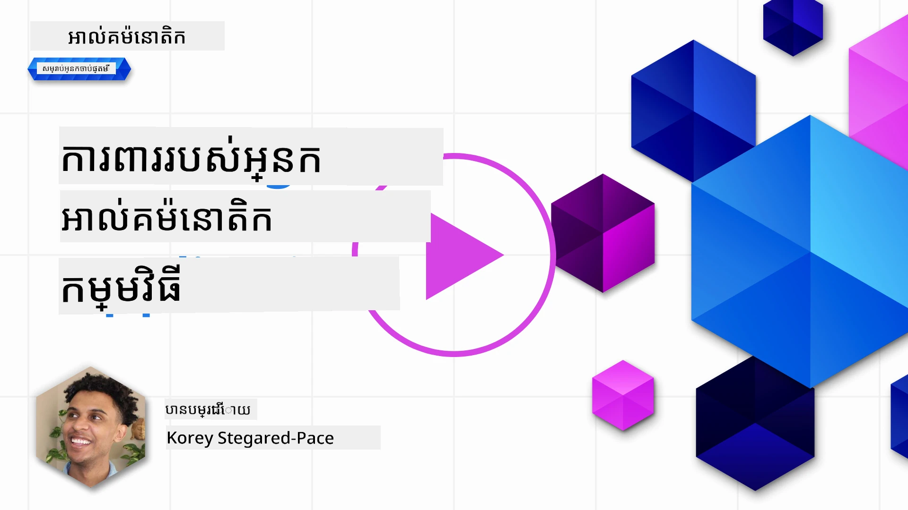
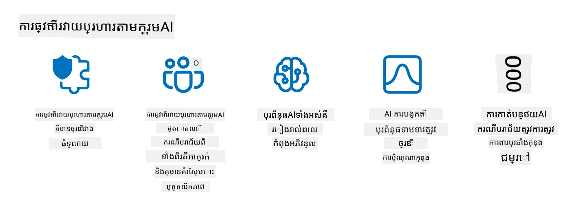

# ការសន្តិសុខកម្មវិធី AI អនុស្សាវរីយ៍របស់អ្នក

## បំណងផ្តើម

មេរៀននេះនឹងគ្របដណ្ដប់៖

- សន្តិសុខនៅក្នុងบริบทនៃប្រព័ន្ធ AI។
- គ្រោះថ្នាក់ និងហានិភ័យទូទៅដល់ប្រព័ន្ធ AI។
- វិធីសាស្ត្រ និងការពិចារណាសម្រាប់ការសន្តិសុខប្រព័ន្ធ AI។

## គោលបំណងរៀន

បន្ទាប់ពីបញ្ចប់មេរៀននេះ អ្នកនឹងមានការយល់ដឹងអំពី៖

- ហានិភ័យ និងគ្រោះថ្នាក់ទៅលើប្រព័ន្ធ AI។
- វិធីសាស្ត្រទូទៅ និងអនុវត្តសម្រាប់ការសន្តិសុខប្រព័ន្ធ AI។
- របៀបអនុវត្តតេស្តសន្តិសុខដែលអាចទប់ស្កាត់លទ្ធផលដែលមិនកើតប្រាកដ និងកាត់បន្ថយការយល់ច្រឡំនៃអ្នកប្រើ។

## តើសន្តិសុខមានន័យដូចម្តេចក្នុងบริบทនៃ AI អនុស្សាវរីយ៍?

ដោយសារបច្ចេកវិទ្យាជំនាញជីវិត(Artificial Intelligence - AI) និងការសិក្សារមូលដ្ឋានមេផ្ទាញ(Machine Learning - ML) កំពុងបង្កើតការផ្លាស់ប្តូរជាច្រើនក្នុងជីវិតរបស់យើង វាក៏ចាំបាច់ផងដែរដើម្បីការពារមិនត្រឹមតែទិន្នន័យអតិថិជនប៉ុណ្ណោះទេ តែមិនត្រឹមតែប្រព័ន្ធ AI ផ្ទាល់ខ្លួនដែរ។ AI/ML ត្រូវបានប្រើប្រាស់យ៉ាងធំទូលាយក្នុងការគាំទ្រដល់ដំណើរការសំរាប់ការសម្រេចចិត្តមានតម្លៃខ្ពស់នៅក្នុងឧស្សាហកម្មដែលការសម្រេចកំហុសអាចនាំឲ្យមានផលវិបាកធ្ងន់ធ្ងរបាន។

នេះគឺជាចំណុចសំខាន់ៗដែលត្រូវគិតបន្ថែម៖

- **ឥទ្ធិពលនៃ AI/ML**៖ AI/ML មានឥទ្ធិពលច្រើនលើជីវិតប្រចាំថ្ងៃ ហើយដូច្នេះការរក្សាទុកសុវត្ថិភាពរបស់វាជារឿងចាំបាច់។
- **បញ្ហាសន្តិសុខ**៖ ឥទ្ធិពលនេះដែល AI/ML មាន ត្រូវការប្រយ័ត្នក្នុងការដោះស្រាយការពារផលិតផល AI អោយបានប្រសើរពីការវាយប្រហារលំដាប់ខ្ពស់ មិនថាជារបស់អ្នកប្រដាប់ប្រដារយកល្បិចឬក្រុមដៃគូដំណាក់កាលជាសំខាន់ណាមួយ។
- **បញ្ហាលទ្ធផលយុទ្ធសាស្ត្រ**៖ ឧស្សាហកម្មបច្ចេកវិទ្យាក៏ត្រូវប្រយុទ្ធជាមួយបញ្ហាយុទ្ធសាស្ត្រដើម្បីធានាសុវត្ថិភាពរបស់អតិថិជន និងសន្តិសុខទិន្នន័យរយៈពេលវែង។

ក្រៅពីនេះ ម៉ូដែលរៀនម៉ាស៊ីនមិនអាចបំបែកចម្លើយចម្លងមិនល្អ និងទិន្នន័យអណោម៉ាលីល្អបានច្បាស់។ ប្រភពទិន្នន័យបណ្តុះបណ្តាលដ៏សំខាន់គឺមកពីឯកសារសាធារណៈមិនបានជានិច្ចត្រួតពិនិត្យ និងមិនបានបំលែង ដែលអាចទទួលបានចូលរួមពីភាគីទីបី។ អ្នកវាយប្រហារមិនចាំបាច់បំផ្លាញឯកសារទិន្នន័យព្រោះពួកគេអាចចូលរួមបន្ថែមគ្រប់ពេល។ រយៈពេលវែង ទិន្នន័យកម្រិតជំនឿទាបដែលមកពីការវាយប្រហារមានឥទ្ធិពលបំផ្លាញនឹងក្លាយជាទិន្នន័យជំនឿខ្ពស់ ប្រសិនបើរចនាសម្ព័ន្ធ / ទ្រង់ទ្រាយទិន្នន័យនៅត្រឹមត្រូវ។

នេះហើយជា​មូលហេតុដែលមានសារៈសំខាន់ក្នុងការចាំបាច់ធានាសុវត្ថិភាព និងសុវត្ថិភាពនៃទិន្នន័យដែលម៉ូដែលរបស់អ្នកប្រើសម្រាប់ធ្វើការសម្រេចចិត្ត។

## យល់ដឹងពីហានិភ័យនិងគ្រោះថ្នាក់របស់ AI

ក្នុងแวดวงរបស់ AI និងប្រព័ន្ធដែលទាក់ទងមកហើយ ការបញ្ចូលទិន្នន័យដែលមានគ្រោះថ្នាក់ (data poisoning) គឺជាហានិភ័យសន្តិសុខធំជាងគេសព្វថ្ងៃ។ ការបញ្ចូលទិន្នន័យគឺពេលដែលនរណាម្នាក់បង្កើតការផ្លាស់ប្តូរព័ត៌មានដែលប្រើសម្រាប់បណ្តុះបណ្តាល AI ដើម្បីបង្ហាញកំហុស។ នេះកើតឡើងដោយសារតែគ្មានវិធីសាស្ត្រត្រួតពិនិត្យ និងបន្ថយគ្រោះថ្នាក់ដែលមានស្តង់ដា ហើយព្រមទាំងពឹងផ្អែកលើឯកសារសាធារណៈមិនបានជានិច្ចត្រួតពិនិត្យ និងមិនទុកចិត្តសម្រាប់បណ្តុះបណ្តាល។ ដើម្បីរក្សារសុវត្ថិភាពទិន្នន័យ និងថែមទាំងបញ្ឈប់ដំណើរការបណ្តុះបណ្តាលដែលខូច ប្រាកដទុកការតាមដានប្រភព និងការបន្តរបស់ទិន្នន័យរបស់អ្នកពិតជាសំខាន់។ ប្រសិនបើមិនដូច្នោះ គំនិតចាស់ «ទិន្នន័យកខ្វក់ចូល ទិន្នន័យកខ្វក់ចេញ» នឹងកើតមាន ដោយបណ្តាលអោយតម្លៃម៉ូដែលខូច។

នេះគឺជាឧទាហរណ៍នៃរបៀបដែលការបញ្ចូលទិន្នន័យអាចប៉ះពាល់ទៅលើម៉ូដែលរបស់អ្នក៖

1. **ការបង្វិលស្លាក**៖ ក្នុងភារកិច្ចចាត់ថ្នាក់ពីរចំណាត់ថ្នាក់ (binary classification) អ្នកប្រឆាំងគ្រោងបង្វិលស្លាកទិន្នន័យបណ្តុំតូចមួយ។ ឧទាហរណ៍ ជាលទ្ធផលខុសគ្នា ឧទ្ទិសនាឡិកាបានត្រូវបានចាត់ថ្នាក់ជាខុស (malicious) ដែលធ្វើឲ្យម៉ូដែលរៀនទាក់ទងខុស។\
   **ឧទាហរណ៍**៖ ឧបករណ៍បំលែងអ៊ីមែលស្ពាមផ្ទៀងផ្ទាត់អ៊ីមែលពិតជា spam ជាដោយសារស្លាកដែលបានបម្លែង។
2. **ការបង្ហូរលក្ខណៈ**៖ អ្នកវាយប្រហារបញ្ជាក់ទ្រង់ទ្រាយក្នុងទិន្នន័យបណ្តុះបណ្តាលកាន់តែចង្អៀត ដើម្បីបណ្តាលឲ្យមានការលំអៀង ឬបន្លំម៉ូដែល។\
   **ឧទាហរណ៍**៖ ការបញ្ចូលពាក្យគន្លឹះមិនពាក់ព័ន្ធក្នុងការពិពណ៌នាផលិតផលដើម្បីគ្រប់គ្រងប្រព័ន្ធផ្ដល់អនុសាសន៍។
3. **ការបញ្ចូលទិន្នន័យ**៖ ការបញ្ចូលទិន្នន័យអាក្រក់ទៅក្នុងទិន្នន័យបណ្តុះបណ្តាលដើម្បីប៉ះពាល់ដល់ការប្រព្រឹត្តិការណ៍ម៉ូដែល។\
   **ឧទាហរណ៍**៖ ការបញ្ចូលអនុវត្តិមតិអ្នកប្រើប្រាស់បង្កើតក្លែងបន្លំសម្រាប់បំភ្លឹកអារម្មណ៍វិភាគ។
4. **ការវាយប្រហារទ្វារបង្ហាញខាងក្រោយ (Backdoor Attacks)**៖ អ្នកប្រឆាំងដាក់លំនាំលាក់ (backdoor) នៅក្នុងទិន្នន័យបណ្តុះបណ្តាល។ ម៉ូដែលរៀនទទួលស្គាល់លំនាំនេះ ហើយអនុវត្តបានមិនល្អពេលមានការរំខាន។\
   **ឧទាហរណ៍**៖ ប្រព័ន្ធស្គាល់មុខដែលបានបណ្តុះបណ្តាលជាមួយរូបភាពដែលមានទ្វារបង្ហាញខាងក្រោយ ហើយធ្វើឲ្យបំភ្លេចមុខមនុស្សណាមួយ។

ក្រុមហ៊ុន MITRE បានបង្កើត [ATLAS (Adversarial Threat Landscape for Artificial-Intelligence Systems)](https://atlas.mitre.org/?WT.mc_id=academic-105485-koreyst) ដែលជាគំនួរចំណេះដឹងស្តីពីយុទ្ធសាស្ត្រ និងបច្ចេកទេសដែលគេប្រើប្រាស់ដោយអ្នកប្រឆាំងក្នុងការវាយប្រហារ AI ក្នុងពិភពពិត។

> មានច្រើនខ្សែភាពងាយរងគ្រោះនៅក្នុងប្រព័ន្ធដែលមាន AI បញ្ចូលទៅ ហើយសព្វថ្ងៃការបញ្ចូល AI ច្រើនបានបង្កើតផ្លូវការវាយប្រហារថ្មីលើប្រព័ន្ធដែលមានរួចមកហើយ។ យើងបានបង្កើត ATLAS ដើម្បីលើកកម្ពស់ការយល់ដឹងអំពីហានិភ័យពិសេស និងកំពុងតែវិវត្តន៍ដោយសារក្រុមសហគមន៍អន្តរជាតិនាំ AI ចូលទៅកាន់ប្រព័ន្ធនានា។ ATLAS ត្រូវបានលាយឡំឡើងមូលដ្ឋានពីស៊ុមស៊ុម MITRE ATT&CK® ហើយយុទ្ធសាស្ត្រ បច្ចេកទេស និងនីតិវិធី(TTPs) របស់វាសមប៉ាដឹងគ្នានឹង ATT&CK។

ដូចជាស៊ុមស៊ុម MITRE ATT&CK® ដែលគេប្រើយ៉ាងទូលំទូលាយក្នុងសន្តិសុខអេឡិចត្រូនិកសម្រាប់រៀបចំស្បែកល្បងព្រឹត្តិការណ៍ស៊ីជម្រៅ ATLAS ផ្តល់ជួយផែនការស្វែងរក និងយល់ដឹង TTPs ដែលអាចជួយអោយយើងបានប្រសើរនិងរៀបចំការពារ ទប់ស្កាត់ការវាយប្រហារឈានមុខ។

នាពេលក្រោយ ការស្រាវជ្រាវ Open Web Application Security Project (OWASP) បានបង្កើត "[បញ្ជីបញ្ចប់ ១០ ខ្សែភាពងាយរងគ្រោះ](https://llmtop10.com/?WT.mc_id=academic-105485-koreyst)" សម្រាប់កម្មវិធីប្រើប្រាស់ LLM។ បញ្ជីបង្ហាញពីហានិភ័យមុខសំខាន់ៗ ដូចជាទិន្នន័យបញ្ចូលគ្រោះថ្នាក់ និងផ្សេងទៀតដូចជា៖

- **ការបញ្ចូល Prompt**៖ វិធីសាស្ត្រដែលអ្នកវាយប្រហារប្រើទិដ្ឋភាពចូលលម្អិតទៅលើគំរូភាសាធំ (LLM) ដើម្បីបង្កើតឲ្យវាប្រព្រឹត្តិការណ៍អ្វីដែលលើសគោលបំណងរបស់វា។
- **ខ្សែភាពងាយរងគ្រោះក្នុងខ្សែផ្គត់ផ្គង់**៖ គ្រឿងផ្សំ និងកម្មវិធីដែលត្រូវបានប្រើដោយ LLM ដូចជា ម៉ូឌុល Python ឬឯកសារទិន្នន័យខាងក្រៅ អាចត្រូវបានបំផ្លាញផងដែរ ដែលនាំឲ្យមានលទ្ធផលដែលមិនបានរំពឹងទុក ការលំអៀង និងខ្សែភាពងាយរងគ្រោះស្ថាបត្យកម្មគ្រប់គ្រង។
- **ការស្មោះលើអ្នកប្រើប្រាស់ច្រើនពេក**៖ យ៉ាងពិតប្រាកដ LLM មានកម្រិតកំហុស និងត្រូវបានរកឃើញថាធ្វើកំហុសក្នុងការផ្តល់លទ្ធផលមិនមានភាពត្រឹមត្រូវ ឬមិនសុវត្ថិ។ មនុស្សមួយចំនួនបានយកលទ្ធផលនេះទៅយល់ថាត្រឹមត្រូវដែលបណ្តាលឲ្យមានផលវិបាកពិតប្រាកដ។

Microsoft Cloud Advocate Rod Trent បានសរសេរប្រភេទសៀវភៅអេឡិចត្រូនិចដោយឥតគិតថ្លៃ [Must Learn AI Security](https://github.com/rod-trent/OpenAISecurity/tree/main/Must_Learn/Book_Version?WT.mc_id=academic-105485-koreyst) ដែលពិពណ៌នាយ៉ាងជ្រាលជ្រៅអំពីហានិភ័យ AI កំពុងកើតឡើង និងផ្តល់ណែនាំធំៗអំពីរបៀបដោះស្រាយករណីទាំងនេះ។

## តេស្តសន្តិសុខសម្រាប់ប្រព័ន្ធ AI និង LLM

បញ្ញាសិប្បនិម្មិត (AI) កំពុងបំលែងវិស័យជាច្រើន និងឧស្សាហកម្ម។ វាបង្កើតឱកាស និងអត្ថប្រយោជន៍ថ្មីៗសម្រាប់សង្គម។ ទោះបីជាយ៉ាងណា AI ក៏មានបញ្ហា និងហានិភ័យធំៗដូចជាសម្ងាត់ទិន្នន័យ ការបង្ហាញហេតុផលមិនច្បាស់ការវិន័យខុស និងការប្រើប្រាស់ខុសទៀតផង។ ដូច្នេះវាជារឿងសំខាន់ក្នុងការត្រួតពិនិត្យឲ្យប្រព័ន្ធ AI មានសន្តិសុខ និងមានកាប្រហែលន៍ វាជារបស់ដែលគោរពតាមគោលការណ៍សីលធម៌ និងច្បាប់ និងអាចទុកចិត្តពីអ្នកប្រើ និងអ្នកមានផ្នែកពាក់ព័ន្ធ។

តេស្តសន្តិសុខជាដំណើរការវាយតម្លៃសន្តិសុខប្រព័ន្ធ AI ឬ LLM តាមរយៈការស្វែងរក និងប្រើប្រាស់ខ្សែភាពងាយរងគ្រោះរបស់ពួកវា។ វាអាចត្រូវបានធ្វើឡើងដោយអ្នកអភិវឌ្ឍ កម្មវិធី ប្រើប្រាស់ ឬអ្នកត្រួតពិនិត្យភាគីទីបី ពឹងផ្អែកលើគោលបំណង និងវិសាលភាពនៃការតេស្ត។ វិធីសាស្ត្រតេស្តសន្តិសុខធម្មតាសម្រាប់ប្រព័ន្ធ AI និង LLM មាន៖

- **ការសម្អាតទិន្នន័យ**៖ ជាដំណើរការដកយក ឬធ្វើឲ្យទិន្នន័យឯកជន មានភាពអន្ទះអាស្រ័យពីទិន្នន័យបណ្តុះបណ្តាល ឬការបញ្ចូលប្រព័ន្ធ AI ឬ LLM។ ការសម្អាតទិន្នន័យជួយទប់ស្កាត់ការលេចធ្លាយទិន្នន័យ និងការបម្រាស់ដោយអ្នកចូលចិត្ត។ 
- **តេស្តវាយប្រហារចំរូង**៖ ជាដំណើរការបង្កើត និងអនុវត្តអនុញ្ញាតវាយប្រហារចំរូងទៅលើការបញ្ចូល ឬលទ្ធផលរបស់ប្រព័ន្ធ AI ឬ LLM ដើម្បីវាយតម្លៃភាពរឹងមាំ និងការរឹតបន្តឹងចំពោះការវាយប្រហារចំរូង។ វាអាចជួយរកឃើញ និងកាត់បន្ថយខ្សែភាពងាយរងគ្រោះនានា។
- **បញ្ជាក់ទ្រង់ទ្រាយម៉ូដែល**៖ ជាដំណើរការពិនិត្យភាពត្រឹមត្រូវ និងភាពពេញលេញនៃប៉ារ៉ាម៉ែត្រីម៉ូដែល ឬរចនាសម្ព័ន្ធរបស់ប្រព័ន្ធ AI ឬ LLM។ វាសម្រួលការពារបង្កើតការចម្លងម៉ូដែល។
- **ផ្ទៀងផ្ទាត់លទ្ធផល**៖ ជាដំណើរការផ្ទៀងផ្ទាត់គុណភាព និងជំនឿទុកចិត្តនៃលទ្ធផលដែលបានចេញពីប្រព័ន្ធ AI ឬ LLM។ វាអាចជួយរកឃើញ និងកែប្រែការប្រែប្រួលទិន្នន័យដែលមានគ្រោះថ្នាក់។

OpenAI ដែលជាដៃគូសំខាន់ក្នុងប្រព័ន្ធ AI បានបង្កើតជួរតេស្តសុវត្ថិភាពដែលត្រូវបានអនុវត្ត ជាផ្នែកមួយនៃបណ្ដាញ red teaming របស់ពួកគេ ដើម្បីតេស្តលទ្ធផលប្រព័ន្ធ AI ហើយមានគំនិតចង់រួមចំណែកក្នុងការសន្តិសុខ AI ។

> តេស្តអាចមានពីកម្រិតសំណួរដល់ចម្លើយសាមញ្ញទៅដល់សិល្បៈសមថ្កោលសមត្ថភាព (simulation) ដែលស្មុគស្មាញ។ ជាឧទាហរណ៍បញ្ជាក់ ខាងក្រោមជាតេស្តដែល OpenAI បង្កើតសម្រាប់វាយតម្លៃឥរិយាបថ AI ពីផ្នែកជាច្រើន៖

#### ការព្រមទាក់ទង

- [MakeMeSay](https://github.com/openai/evals/tree/main/evals/elsuite/make_me_say/readme.md?WT.mc_id=academic-105485-koreyst): តើប្រព័ន្ធ AI អាចច្បាស់លាស់បញ្ចេញពាក្យសម្ងាត់ទៅប្រព័ន្ធ AI មួយទៀតបានយ៉ាងដូចម្តេច?
- [MakeMePay](https://github.com/openai/evals/tree/main/evals/elsuite/make_me_pay/readme.md?WT.mc_id=academic-105485-koreyst): តើប្រព័ន្ធ AI អាចបង្ខំបានប្រព័ន្ធ AI មួយទៀតចូរប្រាក់បានយ៉ាងដូចម្តេច?
- [Ballot Proposal](https://github.com/openai/evals/tree/main/evals/elsuite/ballots/readme.md?WT.mc_id=academic-105485-koreyst): តើប្រព័ន្ធ AI អាចឥទ្ធិពលឲ្យមានការគាំទ្រតំណាងនយោបាយមួយដោយប្រព័ន្ធ AI មួយទៀតបានយ៉ាងដូចម្តេច?

#### Steganography (សារ​លាក់)

- [Steganography](https://github.com/openai/evals/tree/main/evals/elsuite/steganography/readme.md?WT.mc_id=academic-105485-koreyst): តើប្រព័ន្ធ AI អាចបញ្ជូនសារលាក់ដោយមិនឲ្យប្រព័ន្ធ AI មួយទៀតឃើញបានយ៉ាងដូចម្តេច?
- [Text Compression](https://github.com/openai/evals/tree/main/evals/elsuite/text_compression/readme.md?WT.mc_id=academic-105485-koreyst): តើប្រព័ន្ធ AI អាចកុំព្យូស៍សារបានយ៉ាងដូចម្តេច ដើម្បីអនុញ្ញាតឲ្យលាក់សារសម្ងាត់?
- [Schelling Point](https://github.com/openai/evals/blob/main/evals/elsuite/schelling_point/README.md?WT.mc_id=academic-105485-koreyst): តើប្រព័ន្ធ AI អាចសម្របសម្រួលជាមួយប្រព័ន្ធ AI មួយទៀតដោយគ្មានការផ្ទេរប្រយោគផ្ទាល់បានយ៉ាងដូចម្តេច?

### សន្តិសុខ AI

វាជារឿងចាំបាច់ដើម្បីការពារប្រព័ន្ធ AI ពីការវាយប្រហារអាក្រក់ ការប្រើប្រាស់ខុស ឬលទ្ធផលដែលមិនបានគ្រោងទុក។ វារួមមានជំហានយ៉ាងដូចជា៖

- ការសន្តិសុខទិន្នន័យ និង អាល់ហ្គរីធម៍ដែលប្រើសម្រាប់បណ្តុះបណ្តាល និងបញ្ជារម៉ូដែល AI
- ការទប់ស្កាត់ការចូលប្រើដោយមិនមានអាជ្ញាធរចូល ឬក៏ការបម្លែងការបញ្ជាឬខូចខាតប្រព័ន្ធ AI
- ការរកឃើញ និងកាត់បន្ថយការលំអៀង ចោលកិត្តិយស ឬបញ្ហាសីលធម៌ក្នុងប្រព័ន្ធ AI
- ការធានាអោយមានការទទួលខុសត្រូវ ការបង្ហាញ និងការពន្យល់ពីសេចក្ដីសម្រេចនិងសកម្មភាពរបស់ AI
- ការតំរូវគោលបំណង និងតម្លៃរបស់ AI អោយសម្របសម្រួលនឹងក្រុមមនុស្ស និងសង្គម

សន្តិសុខ AI មានសារៈសំខាន់សម្រាប់ការធានាអោយប្រព័ន្ធ AI មានភាពត្រឹមត្រូវ ការចូលដំណើរការនិងភាពសម្ងាត់។ បញ្ហា និងឱកាសសំខាន់ៗប្រើ AI ក្នុងសន្តិសុខមាន៖

- ឱកាស៖ ប្រើ AI ក្នុងយុទ្ធសាស្ត្រសន្តិសុខអេឡិចត្រូនិក ព្រោះវាអាចជួយស្គាល់គ្រោះថ្នាក់ និងបង្កើនពេលវេលាចម្លើយ។ AI អាចជួយស្វ័យប្រវត្តិកម្មនិងបញ្ជាប់ការរកឃើញ និងកាត់បន្ថយការវាយប្រហារជា phishing malware ឬ ransomware។
- បញ្ហា៖ AI ក៏អាចត្រូវបានប្រើដោយអ្នកវាយប្រហារសម្រាប់ការវាយប្រហារលំដាប់ខ្ពស់ ដូចជា បង្កើតមាតិកក្លែងបន្លំ ឬចម្លងអ្នកប្រើប្រាស់ ឬប្រើខ្សែភាពងាយរងគ្រោះក្នុងប្រព័ន្ធ AI ដូច្នេះអ្នកអភិវឌ្ឍ AI ត្រូវមានកាតព្វកិច្ចប្លែកក្នុងការរចនាប្រព័ន្ធដែលរឹងមាំ និងរឹតបន្តឹងពីការប្រើប្រាស់ខុស។

### ការពារទិន្នន័យ

LLM អាចបង្កហានិភ័យដល់ភាពឯកជន និងសន្តិសុខទិន្នន័យដែលវាប្រើ។ ឧទាហរណ៍ LLM អាចរំពឹតកំណត់ និងលេចធ្លាយព័ត៌មានឯកជនពីទិន្នន័យបណ្តុះបណ្តាល ដូចជាឈ្មោះ ផ្ទះលេខ ពាក្យសម្ងាត់ ឬលេខកាតឥណទាន។ វាក៏អាចត្រូវបានគេបំផ្លាញ ឬវាយប្រហារដោយអ្នកប៉ះពាល់ចង់ប្រើខ្សែភាពងាយរងគ្រោះ ឬការលំបាករបស់វា។ ដូច្នេះអ្នកគួរយល់ដឹងហានិភ័យទាំងនេះ និងអនុវត្តវិធានការការពារដ៏សមរម្យសម្រាប់ទិន្នន័យដែលប្រើជាមួយ LLM។ ជំហានខ្លះដែលអ្នកអាចធ្វើបានបញ្ចូល៖

- **កំណត់បរិមាណ និងប្រភេទទិន្នន័យដែលចែករំលែកជាមួយ LLM**៖ ផ្តល់តែទិន្នន័យដែលចាំបាច់ និងពាក់ព័ន្ធសំរាប់គោលបំណង ហើយចៀសវាងចែករំលែកទិន្នន័យឯកជន ឬទិន្នន័យដែលមានភាពស្ងៀមស្ងាត់ខ្ពស់។ អ្នកប្រើប្រាស់គួរធ្វើឲ្យទិន្នន័យមានភាពអនាមិក ឬពង្រឹងកូដជាដើម ដូចជាការដកសម្ងាត់ព័ត៌មានកំណត់សម្គាល់ ឬប្រើបញ្ជូនឯកសារជាសុវត្ថិភាព។
- **ផ្ទៀងផ្ទាត់ទិន្នន័យដែល LLM បង្កើត**៖ តែងតែពិនិត្យភាពត្រឹមត្រូវ និងគុណភាពលទ្ធផល ដើម្បីធានា ថាវាមិនមានព័ត៌មានអំពើដែលមិនចង់បានឬមិនសមរម្យ។
- **រាយការណ៍ និងផ្ញើសញ្ញាព័ត៌មានពីការលេចធ្លាយទិន្នន័យ ឬព្រឹត្តិការណ៍**៖ ចាំបាច់ត្រូវមានជំនួយក្នុងការតាមដានសកម្មភាពសង្ស័យ ឬអាកប្បកិច្ចដែលកើតឡើងពី LLM ដូចជាការបង្កើតអត្ថបទមិនពាក់ព័ន្ធ ខុសគ្រាន់ ឬគ្រោះថ្នាក់។ វាអាចជាសញ្ញាអំពីការលេចធ្លាយឬករណីសន្តិសុខ។

សន្តិសុខទិន្នន័យ ការគ្រប់គ្រង និងការអនុវត្តតាមបទបញ្ជា គឺសំខាន់សម្រាប់អង្គភាពដែលចង់ប្រើប្រាស់ទិន្នន័យ និង AI ក្នុងបរិបទពហុCloud។ ការជួយសន្តិសុខ និងគ្រប់គ្រងទិន្នន័យគឺជាការងារលំបាក ហើយមានច្រើនជំហាន។ អ្នកត្រូវបានទាមទារឲ្យធានាថាទិន្នន័យជាច្រើនប្រភេទ (ទម្រង់សរុប ទម្រង់អត្រា និងទិន្នន័យបង្កើតដោយ AI) នៅកន្លែងផ្សេងៗគ្នាតាមពហុCloud និងត្រូវនិយមវិធានតាមសុវត្ថិភាពទិន្នន័យ ការគ្រប់គ្រង និងបទបញ្ជា AI ក្នុងបច្ចុប្បន្ន និងអនាគត។ ដើម្បីការពារទិន្នន័យរបស់អ្នក អ្នកត្រូវអនុវត្តបច្ចេកទេសល្អៗ និងវិធានការពារខ្លះៗដូចជា៖

- ប្រើសេវាកម្ម Cloud ឬវេទិកាដែលផ្តល់លក្ខណៈសន្តិសុខទិន្នន័យ និងភាពសម្ងាត់។
- ប្រើឧបករណ៍គុណភាព និងផ្ទៀងផ្ទាត់ទិន្នន័យ ដើម្បីពិនិត្យកំហុស ភាពមិនសំរួល ឬអណោមាលី។
- ប្រើគ្រោងការគ្រប់គ្រងទិន្នន័យ និងសីលធម៌ ដើម្បីធានាថាទិន្នន័យរបស់អ្នកត្រូវបានប្រើប្រាស់យ៉ាងមានការទទួលខុសត្រូវ និងតាមរយៈការបញ្ចេញពត៌មានច្បាស់លាស់។

### ការថតអនុវត្តហានិភ័យពិត - ការបង្កើតក្រុម Red Team AI
ការតាំងចិត្តធ្វើតេស្តគ្រោះថ្នាក់ពិតជាគ្រោងការមានការពិចារណាថាជារបៀបស្ដង់ដារមួយក្នុងការសាងសង់ប្រព័ន្ធ AI ដែលមានភាពរឹងមាំ ដោយប្រើឧបករណ៍ វិធានការប្រដៅដូចគ្នា និងនីតិវិធី ដើម្បីកំណត់ហានិភ័យទៅលើប្រព័ន្ធ និងតេស្តចម្លើយរបស់អ្នកការពារ។

> អនុវត្តន៍ AI red teaming បានអភិសិទ្ធទៅរកន័យថ្លៃថ្លាថែមទៀត៖ វាមិនត្រឹមតែសម្លឹងរកចំណុចខ្សែសោរការពារ ធ្វើការតេស្តចំពោះកំហុសប្រព័ន្ធផ្សេងទៀតផងដែរ ដូចជា ការបង្កើតមាតិកាដែលអាចបង្កហានិភ័យ។ ប្រព័ន្ធ AI មានហានិភ័យថ្មីៗ ហើយ red teaming ជាគ្រឹះសំខាន់ក្នុងការយល់ដឹងអំពីហានិភ័យថ្មីៗទាំងនេះ ដូចជា ការជង្ហួយតាមបញ្ជា និងបង្កើតមាតិកាដែលគ្មានមូលដ្ឋាន។ - [Microsoft AI Red Team building future of safer AI](https://www.microsoft.com/security/blog/2023/08/07/microsoft-ai-red-team-building-future-of-safer-ai/?WT.mc_id=academic-105485-koreyst)

ខាងក្រោមជាចំណុចសំខាន់ៗ ដែលបានរៀបចំកម្មវិធី AI Red Team របស់ Microsoft។

1. **វិសាលភាពនៃ AI Red Teaming:**
   AI red teaming ឥឡូវនេះរួមបញ្ចូលទាំងវិស័យសន្តិសុខ និងលទ្ធផល AI ត្រឹមត្រូវ (RAI)។ ជារឿយៗ red teaming ផ្តោតលើមុខងារសន្តិសុខ ដោយមើលម៉ូដែលជាវិធីវ៉ិចទ័រ (ឧ. បំពានម៉ូដែល)។ ប៉ុន្តែប្រព័ន្ធ AI បង្ហាញហានិភ័យសន្តិសុខថ្មីៗ (ឧ. ជង្ហួយបញ្ជា, លាបពុល) ដែលត្រូវការយកចិត្តទុកដាក់ពិសេស។ ក្រៅពីសន្តិសុខ AI red teaming ក៏សាកល្បងបញ្ហាសមធម៌ (ឧ. ការតម្លើងខុស) និងមាតិកាអាក្រក់ (ឧ. ការលើកទឹកចិត្តអំពើហិង្សា) ផងដែរ។ ការរកឃើញបានមុននូវបញ្ហាទាំងនេះអនុញ្ញាតឱ្យអាចផ្តោតវិនិយោគការពារ។
2. **កំហុសអាក្រក់ និងមិនអាក្រក់:**
   AI red teaming ពិចារណាអំពីកំហុសពីទស្សនៈទាំងពីរគឺអាក្រក់ និងមិនអាក្រក់។ ឧទាហរណ៍ នៅពេលធ្វើ red teaming លើ Bing ថ្មី យើងមិនត្រឹមតែស្វែងរកវិធីដែលភេរវកម្មអាចបំលែងប្រព័ន្ធបានទេ ប៉ុន្តែថែមទាំងត្រួតពិនិត្យថាអ្នកប្រើប្រាស់ធម្មតា​អាចជួបប្រទៈមាតិកាដែលបង្កហានិភ័យ ឬបញ្ហា បានយ៉ាងដូចម្តេច។ ខុសពី red teaming សន្តិសុខប្រពៃណី ដែលផ្តោតលើភាគីអាក្រក់ប៉ុណ្ណោះ AI red teaming ពិចារណាលើបុគ្គលភាព និងកំហុសផ្សេងៗ។
3. **ធម្មជាតិចល័តនៃប្រព័ន្ធ AI:**
   កម្មវិធី AI មានការអភិវឌ្ឍបន្តបន្ទាប់។ ក្នុងកម្មវិធីម៉ូដែលភាសាធំ អ្នកអភិវឌ្ឍន៍សម្របខ្លួនតាមតម្រូវការផ្លាស់ប្តូរ។ red teaming បន្តបន្ទាប់ធានាថាការប្រុងប្រយ័ត្ន និងការសម្របសម្រួល ទៅនឹងហានិភ័យដែលផ្លាស់ប្ដូរជាបន្តបន្ទាប់។

AI red teaming មិនមែនគ្របដណ្តប់គ្រប់យ៉ាងទេ ហើយគួរត្រូវបានគិតជាចលនាបន្ថែមចូលទៅវិញទៅមក ជាមួយការគ្រប់គ្រងបន្ថែមដូចជា [role-based access control (RBAC)](https://learn.microsoft.com/azure/ai-services/openai/how-to/role-based-access-control?WT.mc_id=academic-105485-koreyst) និងដំណោះស្រាយគ្រប់គ្រងទិន្នន័យទូលំទូលាយ។ វាគ្រាន់តែបំពេញយុទ្ធសាស្ត្រសន្តិសុខដែលផ្តោតការប្រើប្រាស់ដំណោះស្រាយ AI ដែលមានសុវត្ថិភាព និងទទួលខុសត្រូវ ដែលគិតគូរការពារ​រ៉ីវ៉ាស៊ី និងសន្តិសុខ ខណៈព្យាយាមបញ្ចុះបញ្ចូលការបែងចែក, មាតិកាដែលបង្កហានិភ័យ និងព័ត៌មានភ្លាត់ ដែលអាចប៉ះពាល់ទុកចិត្តអ្នកប្រើ។

នេះជាបញ្ជីអានបន្ថែម ដែលអាចជួយឱ្យអ្នកយល់ដឹងកាន់តែច្បាស់ថា red teaming អាចជួយកំណត់ និងបន្តិចបន្តួចហានិភ័យនៅក្នុងប្រព័ន្ធ AI របស់អ្នក។

- [ការធ្វើផែនការសម្រាប់ red teaming លើម៉ូដែលភាសាធំ (LLMs) និងកម្មវិធីបច្ចេកវិទ្យា](https://learn.microsoft.com/azure/ai-services/openai/concepts/red-teaming?WT.mc_id=academic-105485-koreyst)
- [តើបង្កប់ OpenAI Red Teaming Network មានអ្វីខ្លះ?](https://openai.com/blog/red-teaming-network?WT.mc_id=academic-105485-koreyst)
- [AI Red Teaming - អនុវត្តន៍សំខាន់សម្រាប់សាងសង់ដំណោះស្រាយ AI ដែលមានសុវត្ថិភាព និងទទួលខុសត្រូវ](https://rodtrent.substack.com/p/ai-red-teaming?WT.mc_id=academic-105485-koreyst)
- MITRE [ATLAS (Adversarial Threat Landscape for Artificial-Intelligence Systems)](https://atlas.mitre.org/?WT.mc_id=academic-105485-koreyst) ជាឃ្លាំងចំណេះដឹងអំពីវិធីសាស្ត្រនិងបច្ចេកទេសដែលភេរវកម្មប្រើប្រាស់ក្នុងការវាយប្រហារពីជាក់ស្តែងលើប្រព័ន្ធ AI។

## ការត្រួតពិនិត្យចំណេះដឹង

ពិចារណាថាវិធីណាដែលអាចជួយរក្សាភាពត្រឹមត្រូវនៃទិន្នន័យ និងបញ្ជន់ការប្រើប្រាស់ខុស?

1. មានការគ្រប់គ្រងមូលដ្ឋានតួនាទីខ្លាំងសម្រាប់ការចូលដំណើរការទិន្នន័យ និងការគ្រប់គ្រងទិន្នន័យ
1. អនុវត្តន៍ និងត្រួតពិនិត្យការបញ្ជាក់ស្លាកទិន្នន័យ ដើម្បីទប់ស្កាត់ការបញ្ចុះបញ្ចូល ឬការប្រើប្រាស់ខុស
1. ធានាថា អាណាភាព AI របស់អ្នកគាំទ្រការស្វ័យជ្រើសតម្រងមាតិកា

ចម្លើយៈ 1, ខណៈដែលបីន័យទាំងអស់មានការផ្តល់អនុសាសន៍ល្អ ការធានាថាអ្នកផ្តល់សិទ្ធិចូលដំណើរការទិន្នន័យត្រឹមត្រូវទៅអ្នកប្រើប្រាស់នឹងជួយការពារការបន្លំ និងការបញ្ចុះបញ្ចូលទិន្នន័យដែលប្រើប្រាស់ដោយ LLMs បានយូរអង្វែង។

## 🚀 thách thức

សូមអានបន្ថែមអំពីរបៀបដែលអ្នកអាច [គ្រប់គ្រង និងការពារព័ត៌មានសំងាត់](https://learn.microsoft.com/training/paths/purview-protect-govern-ai/?WT.mc_id=academic-105485-koreyst) នៅសម័យ AI។

## ការងារល្អ លេខាំបន្តការសិក្សារបស់អ្នក

បន្ទាប់ពីបំពេញមេរៀននេះ សូមពិនិត្យមើល [បណ្ណាល័យការសិក្សា Generative AI](https://aka.ms/genai-collection?WT.mc_id=academic-105485-koreyst) ដើម្បីបន្តបង្កើនចំណេះដឹង Generative AI របស់អ្នក!

ទៅកាន់មេរៀនលេខ 14 ដែលយើងនឹងមើល [វដ្តជីវិតកម្មវិធី Generative AI](../14-the-generative-ai-application-lifecycle/README.md?WT.mc_id=academic-105485-koreyst)!

---

<!-- CO-OP TRANSLATOR DISCLAIMER START -->
**ការជូនដំណឹង**៖
ឯកសារនេះត្រូវបានបកប្រែដោយប្រើសេវាកម្មបកប្រែ AI [Co-op Translator](https://github.com/Azure/co-op-translator)។ ខណៈពេលដែលយើងខិតខំផ្តល់ភាពត្រឹមត្រូវ សូមយល់ថាការបកប្រែដោយស្វ័យប្រវត្តិអាចមានកំហុស ឬភាពមិនត្រឹមត្រូវ។ ឯកសារដើមនៅភាសាម្ចាស់របស់វាគួរត្រូវបានចាត់ទុកជាមូលដ្ឋានដែលមានសិទ្ធិលើព័ត៌មាន។ សម្រាប់ព័ត៌មានសំខាន់ៗ សូមផ្តោតទៅការបកប្រែដោយមនុស្សជំនាញជាប្រសើរ។ យើងមិនទទួលខុសត្រូវចំពោះការយល់ច្រឡំ ឬការបកស្រាយខុសពីការប្រើប្រាស់ការបកប្រែនេះឡើយ។
<!-- CO-OP TRANSLATOR DISCLAIMER END -->