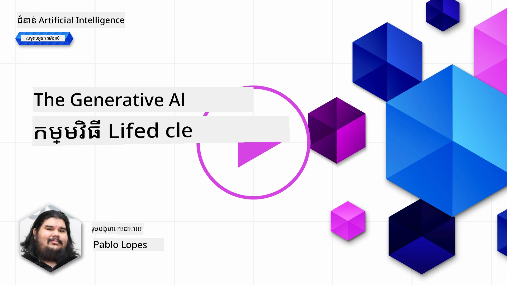
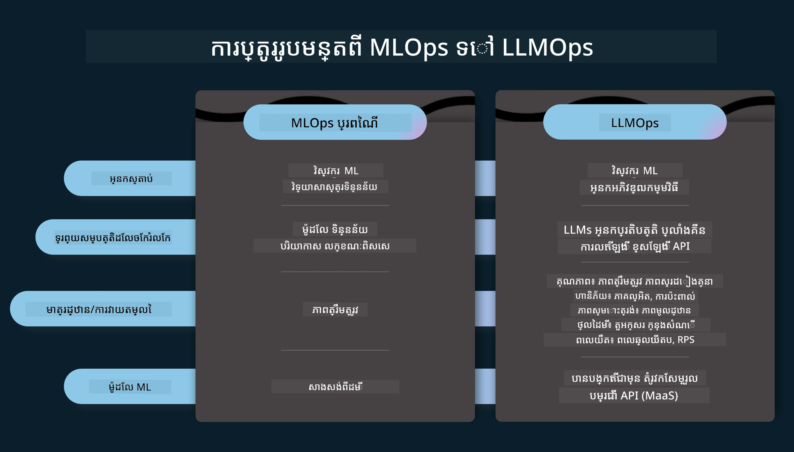
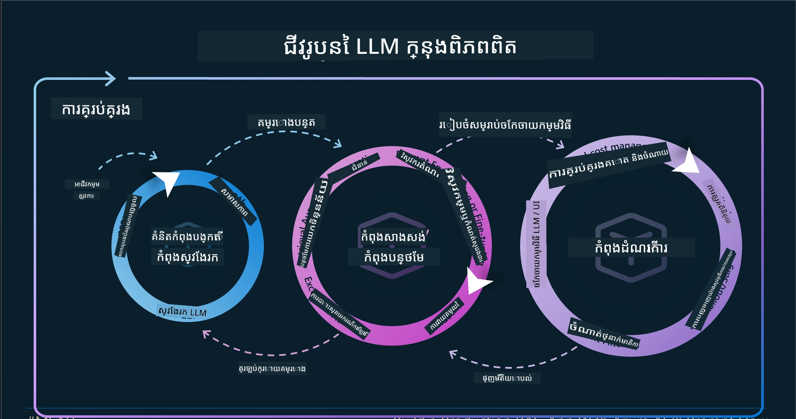
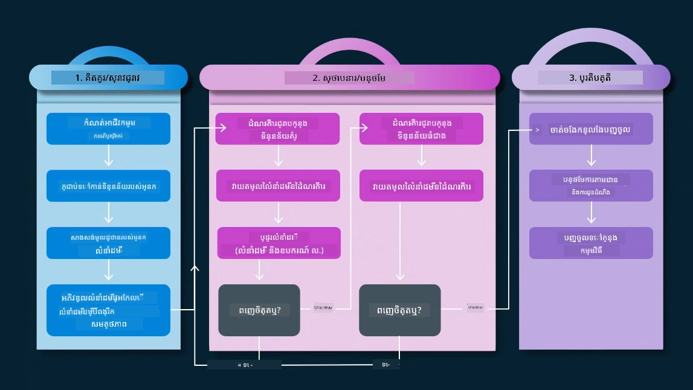
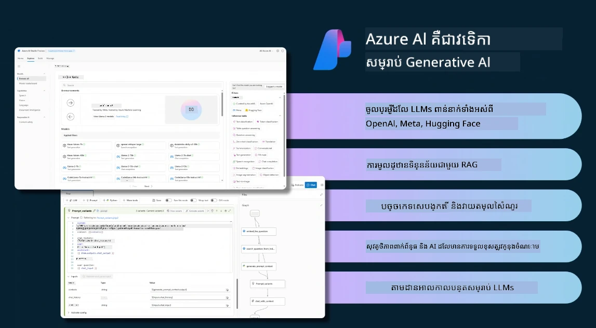
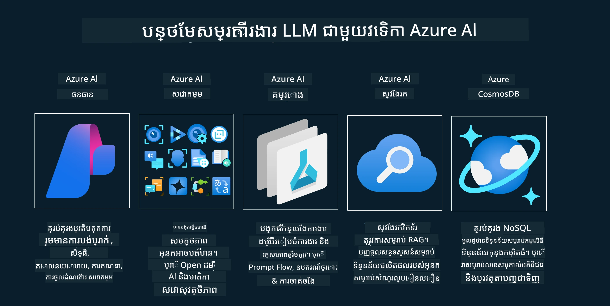
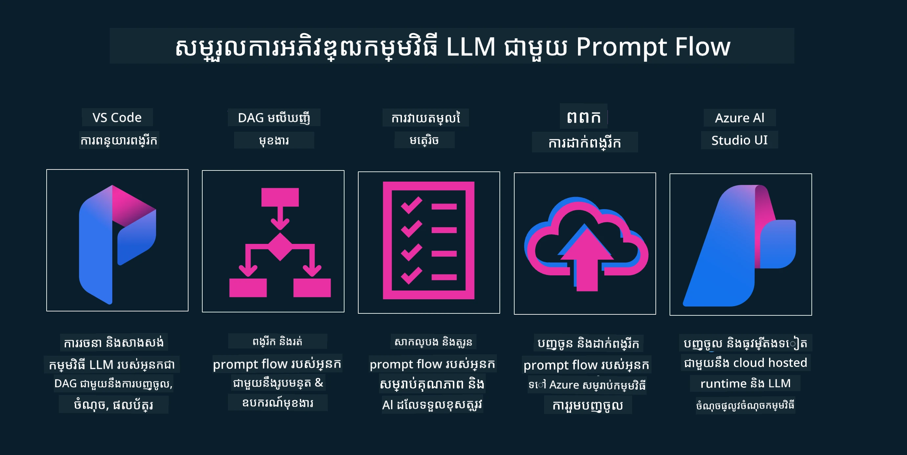

# ជីវចលវង្វាន់កម្មវិធី AI បង្កើត

សំណួរសំខាន់សម្រាប់កម្មវិធី AI ទាំងអស់គឺសមរម្យភាពនៃមុខងារ AI ព្រោះ AI ជាវិស័យកំពុងបណ្តោយរហ័ស ដើម្បីធានាថាកម្មវិធីរបស់អ្នកនៅតែមានសមរម្យ កាប់ទុក និងរឹងមាំ អ្នកត្រូវតែតាមដាន ប៉ាន់ប្រមាណ និងកែលម្អវា kontinuierlich។ នេះជាកន្លែងដែលជីវចលវង្វាន់ AI បង្កើតចូលជារឿង។

ជីវចលវង្វាន់ AI បង្កើតគឺជាគំរូណែនាំអ្នកឆ្លងកាត់ដំណាក់កាលនៃការរចនា បញ្ចេញ និងថែរក្សាកម្មវិធី AI បង្កើតមួយ។ វាជួយអ្នកកំណត់គោលបំណង សូមវាស់វែងសមត្ថភាព រកឃើញបញ្ហា ហើយអនុវត្តដំណោះស្រាយរបស់អ្នកផងដែរ។ វាជួយអ្នកធៀបធៀបកម្មវិធីជាមួយស្តង់ដារមនុស្សធម៌ និងច្បាប់នៅក្នុងដែនកំណត់ និងអ្នកចាប់អារម្មណ៍របស់អ្នកផងដែរ។ ដោយអនុវត្តជីវចលវង្វាន់ AI បង្កើត អ្នកអាចធានា​កម្មវិធីរបស់អ្នកមិនដែលខកខានផ្តល់តម្លៃ និងបំពេញចិត្តអ្នកប្រើប្រាស់ទេ។

## អំណើប

នៅក្នុងជំពូកនេះ អ្នកនឹង៖

- យល់ដឹងពីការប្រែប្រួល Paradigm ពី MLOps ទៅ LLMOps
- ជីវចលវង្វាន់ LLM
- ឧបករណ៍ជីវចលវង្វាន់
- ការវាស់វែង និងការវាយតម្លៃជីវចលវង្វាន់

## យល់ដឹងពីការប្រែប្រួល Paradigm ពី MLOps ទៅ LLMOps

LLM គឺជាឧបករណ៍ថ្មីមួយក្នុងសម្ភារៈធ្វើ AI ដែលមានអំណាចខ្លាំងក្នុងកិច្ចការវិភាគនិងបង្កើតសម្រាប់កម្មវិធី ប៉ុន្តែអំណាចនេះមានផលប៉ះពាល់ខ្លះក្នុងរបៀបយើងកែតម្រូវ AI និងកិច្ចការបង្រៀនម៉ាស៊ីនចាស់ៗ។

ដោយសារនេះ យើងត្រូវការត្រឹមត្រូវ Paradigm ថ្មីដើម្បីចងក្រងឧបករណ៍នេះក្នុងរបៀបដំណើរការដូចត្រូវ ជាមួយការលើកទឹកចិត្តត្រឹមត្រូវ។ យើងអាចចាត់ថា​កម្មវិធី AI ចាស់ៗជា "ML Apps" ហើយកម្មវិធី AI ថ្មីៗជា "GenAI Apps" ឬត្រឹមតែ "AI Apps" ដើម្បីបង្ហាញពីបច្ចេកទេសនិងបច្ចេកវិទ្យាចម្បងដែលត្រូវបានប្រើនៅពេលនោះ។ វាប្រែប្រួលរឿងរបស់យើងជាច្រើន វាយតម្លៃការប្រៀបធៀបខាងក្រោម។

កំណត់សម្គាល់ថា ក្នុង LLMOps យើងផ្តោតលើអ្នកអភិវឌ្ឍកម្មវិធីអ្នកប្រើប្រាស់ ប្រើការតភ្ជាប់ជា​ចំណុចសំខាន់ ប្រើ "Models-as-a-Service" ហើយគិតក្នុងចំណុចខាងក្រោមសម្រាប់តារាងវិមាត្រ។

- គុណភាព៖ គុណភាពចម្លើយ
- ប៉ះពាល់៖ AI មានការទទួលខុសត្រូវ
- ត្រឹមត្រូវ៖ ពិចារណាលើចម្លើយ (មានហេតុផលទេ? ត្រឹមត្រូវដែរឬទេ?)
- តម្លៃ៖ ប្រាក់កាបោលសម្រាប់ដំណោះស្រាយ
- ពេលវេលា៖ ពេលវេលាមធ្យមសម្រាប់ចម្លើយ

## ជីវចលវង្វាន់ LLM

ដំបូង ដើម្បីយល់ពីជីវចលវង្វាន់ និងការកែប្រែ ជម្រាបឱ្យច្បាស់ពីរូបភាពខាងក្រោម។

ដូចដែលអ្នកអាចចំណាំ បាន វាខុសគ្នាពីជីវចលវង្វាន់ធម្មតារបស់ MLOps។ LLMs មានតម្រូវការថ្មីជាច្រើន ដូចជា Prompting បច្ចេកទេសខុសៗ ដើម្បីកែលម្អគុណភាព (Fine-Tuning, RAG, Meta-Prompts) ការវាយតម្លៃនិងការទទួលខុសត្រូវជាមួយ AI មានការទទួលខុសត្រូវ ហើយចុងក្រោយ ជា​រូបមន្តវាយតម្លៃថ្មី (គុណភាព, ប៉ះពាល់, ត្រឹមត្រូវ, តម្លៃ និងពេលវេលា)។

ឧទាហរណ៍ មើលថាយើងគិតគូរយ៉ាងដូចម្តេច។ ប្រើការរចនាពី prompt ដើម្បីសាកល្បងជាមួយ LLMs ផ្សេងគ្នាដើម្បីស្វែងរកកំណត់នៃការពិចារណា និងពិនិត្យមើលថាតើ Hypothesis របស់ពួកគេចំរូងទេ។

ចំណាំថា វាមិនមែនជាទ្វេដងទេ ប៉ុន្តែជោកជន្យ និងមានរង្វិលគ្នា ជាលំដាប់ ហើយនៅមានចរន្តដ៏ធំទូលាយ។

តើយើងអាចស្វែងរកជំហានទាំងនោះបានយ៉ាងដូចម្តេច? សូមចូលទៅក្នុងព័ត៌មានលម្អិតស្តីពីរបៀបកសាងជីវចលវង្វាន់។

វាអាចមើលទៅពិបាកមួយចំនួន ចូរយកចំណង់ចំណូលចិត្តទៅលើជំហានធំៗបីដំបូង។

1. បង្កើត/ស្វែងរក៖ ការស្វែងរក នៅទីនេះយើងអាចស្វែងរកតាមតម្រូវការជំនួញរបស់យើង។ ការធ្វើ Prototype បង្កើត [PromptFlow](https://microsoft.github.io/promptflow/index.html?WT.mc_id=academic-105485-koreyst) ហើយសាកល្បងថាតើវាមានប្រសិទ្ធភាពគ្រប់គ្រាន់សម្រាប់ Hypothesis របស់យើងទេ។
1. សាងសង់/បន្ថែម៖ ការអនុវត្ត ខណៈនេះ យើងចាប់ផ្តើមប៉ាន់ប្រមាណសម្រាប់បណ្ដុំទិន្នន័យធំ ធ្វើបច្ចេកទេស ដូចជា Fine-tuning និង RAG ដើម្បីពិនិត្យភាពរឹងមាំនៃដំណោះស្រាយ។ ប្រសិនបើមិនដំណើរការ សូមធ្វើឡើងវិញ បន្ថែមជំហានថ្មីក្នុងលំហូររបស់យើង ឬរៀបចំទិន្នន័យ ដើម្បីជួយ។ បន្ទាប់ពីសាកល្បងលំហូររបស់យើង និងអត្រាធំហាប់ ប្រសិនបើវាដំណើរការ និងបានពិន្ទុវិមាត្របាន ត្រៀមសម្រាប់ជំហានបន្ទាប់។
1. ដំណើរការ៖ ឥឡូវនេះបន្ថែមប្រព័ន្ធតាមដាន និងបញ្ហាផ្តល់ស្លាកសញ្ញាចូលទៅក្នុងប្រព័ន្ធ រួមបញ្ចូលនិងដាក់បញ្ចូលកម្មវិធីទៅក្នុងកម្មវិធីរបស់យើង។

បន្ទាប់មក យើងមានរង្វិលគ្រប់គ្រង ដាក់កំចាត់លើសុខុមាលភាព ស្របច្បាប់ និងការគ្រប់គ្រង។

អបអរពរ ឥឡូវនេះកម្មវិធី AI របស់អ្នកបានត្រៀមរួច និងដំណើរការ។ សម្រាប់បទពិសោធន៍ដៃលើ ចូលទៅមើល [Contoso Chat Demo.](https://nitya.github.io/contoso-chat/?WT.mc_id=academic-105485-koreyst)

ឥឡូវនេះ តើយើងអាចប្រើឧបករណ៍អ្វី?

## ឧបករណ៍ជីវចលវង្វាន់

សម្រាប់ឧបករណ៍ Microsoft ផ្តល់ជូន [Azure AI Platform](https://azure.microsoft.com/solutions/ai/?WT.mc_id=academic-105485-koreyst) និង [PromptFlow](https://microsoft.github.io/promptflow/index.html?WT.mc_id=academic-105485-koreyst) ជួយសម្រួល និងធ្វើឱ្យរង្វិលរបស់អ្នកងាយស្រួលប្រើ និងត្រៀមដាក់ឱ្យដំណើរការ។

[Azure AI Platform](https://azure.microsoft.com/solutions/ai/?WT.mc_id=academic-105485-koreyst) អនុញ្ញាតឱ្យអ្នកប្រើ [AI Studio](https://ai.azure.com/?WT.mc_id=academic-105485-koreyst)។ AI Studio ជាប្រព័ន្ធបណ្តាញអ៊ិនធឺណិត អនុញ្ញាតឱ្យអ្នកស្វែងរកម៉ូដែល ឧបករណ៍និងគំរូ។ គ្រប់គ្រងធនធានរបស់អ្នក ដំណើរការនៅលើ UI និងជម្រើស SDK/CLI សម្រាប់ការអភិវឌ្ឍកូដជាមុន។

Azure AI អនុញ្ញាតឱ្យអ្នកប្រើប្រាស់ធនធានច្រើន ដើម្បីគ្រប់គ្រងប្រតិបត្តិការ សេវាកម្ម គម្រោង ស្វែងរកវ៉ិចទ័រ និងតម្រូវការទិន្នន័យ។

កសាង ពី Proof-of-Concept(POC) រហូតដល់កម្មវិធីអំពើធំៗជាមួយ PromptFlow៖

- រចនា និងសាងសង់កម្មវិធីពី VS Code ជាមួយឧបករណ៍វិស្វកម្មនិងមុខងារ
- សាកល្បង និងកែលម្អកម្មវិធីរបស់អ្នកសម្រាប់គុណភាព AI ងាយស្រួល។
- ប្រើ Azure AI Studio ដើម្បីបញ្ចូល និងធ្វើឡើងវិញជាមួយពពក ដំណើរការ និងដាក់ឲ្យប្រាស្រ័យបានយ៉ាងលឿន។

## ចូលរួមរៀនបន្ដទៀត!

អស្ចារ្យ ទើបរៀនបន្ដពីរបៀបយើងរៀបចំកម្មវិធី ដើម្បីប្រើគំនិតជាមួយកម្មវិធី [Contoso Chat App](https://nitya.github.io/contoso-chat/?WT.mc_id=academic-105485-koreyst) ដើម្បីមើលថាតើ Cloud Advocacy បន្ថែមគំនិតទាំងនេះក្នុងការបង្ហាញជាការបង្ហាញយ៉ាងដូចម្តេច។ សម្រាប់មាតិកាបន្ថែម សូមមើលវគ្គ [Ignite breakout session!](https://www.youtube.com/watch?v=DdOylyrTOWg)

ឥឡូវ សូមសូមមើលមេរៀនទី ១៥ ដើម្បីយល់ពីរបៀប [Retrieval Augmented Generation and Vector Databases](../15-rag-and-vector-databases/README.md?WT.mc_id=academic-105485-koreyst) ផ្លាស់ប្តូរជីវចលវង្វាន់ AI បង្កើត ហើយបង្កើតកម្មវិធីមានការចាប់អារម្មណ៍បន្ថែម!

---

<!-- CO-OP TRANSLATOR DISCLAIMER START -->
**ការផ្ដល់អំណរគុណ**៖  
ឯកសារនេះត្រូវបានបកប្រែដោយប្រើសេវាកម្មបកប្រែ AI [Co-op Translator](https://github.com/Azure/co-op-translator)។ ខណៈពេលដែលយើងខំប្រឹងប្រែងសម្រាប់ភាពត្រឹមត្រូវ សូមយល់ថាការបកប្រែដោយស្វ័យប្រវត្តិអាចមានកំហុស ឬមិនត្រឹមត្រូវ។ ឯកសារដើមដែលមានភាសាដើមគួរត្រូវបានគេកណ្តាលជា ប្រភពសំខាន់។ សម្រាប់ព័ត៌មានសម្រាប់ចាំបាច់ ការបកប្រែដោយមនុស្សវិជ្ជាជីវៈត្រូវបានផ្តល់អនុសាសន៍។ យើងមិនទទួលខុសត្រូវចំពោះការយល់ច្រឡំ ឬការបកប្រែដែលមិនត្រឹមត្រូវណាមួយ ដែលកើតមានពីការប្រើប្រាស់ការបកប្រែនេះឡើយ។
<!-- CO-OP TRANSLATOR DISCLAIMER END -->