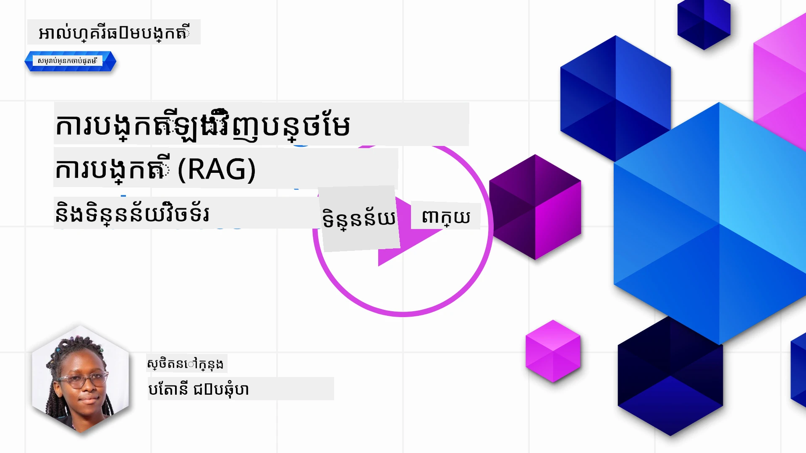
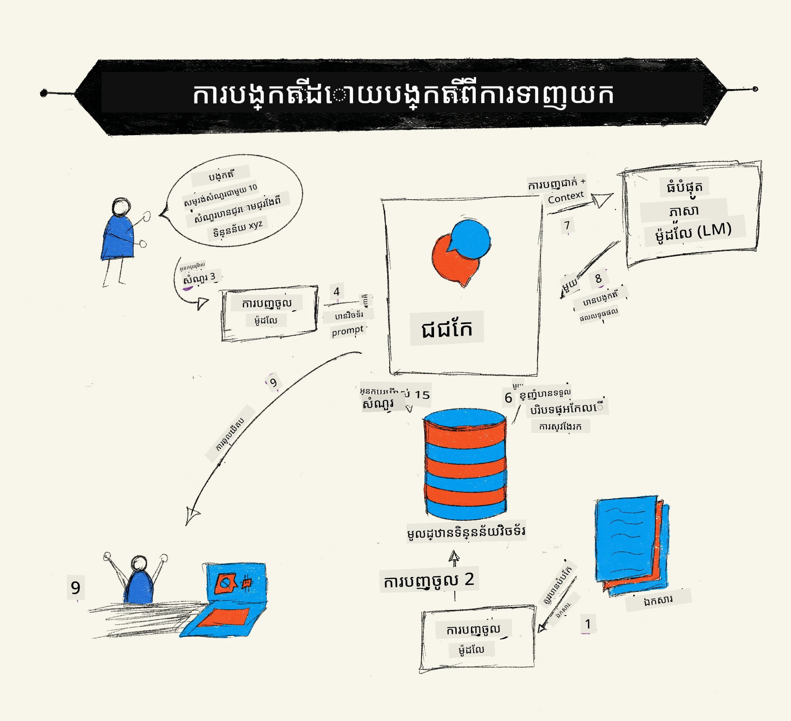
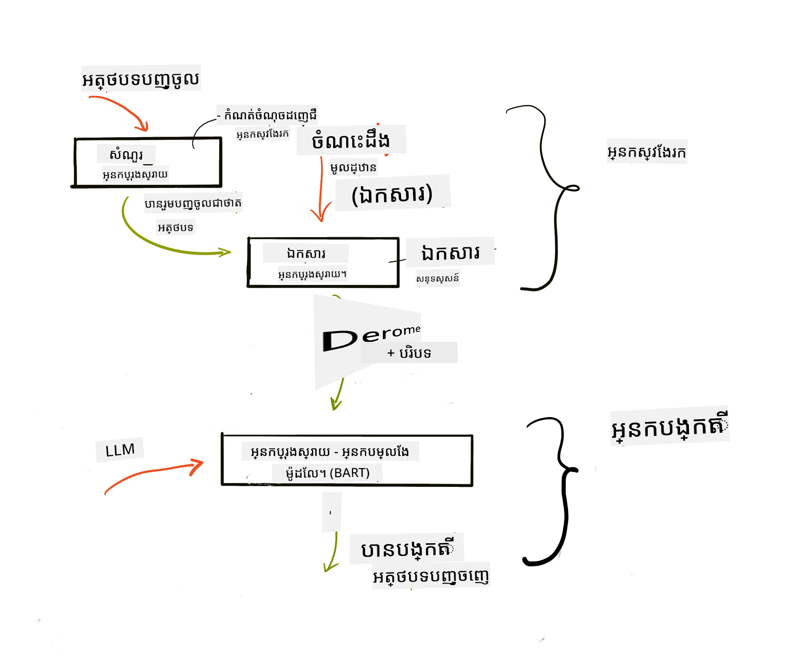

# ការបង្កើតបន្ថែមដោយការស្វែងរក (RAG) និងមូលដ្ឋានទិន្នន័យវ៉ិចទ័រ

[](https://youtu.be/4l8zhHUBeyI?si=BmvDmL1fnHtgQYkL)

ក្នុងមេរៀនអនុវត្តស្វែងរក យើងបានរៀនភ្លាមៗពីរបៀបបញ្ចូលទិន្នន័យផ្ទាល់ខ្លួនរបស់អ្នកទៅក្នុងគំរូភាសាធំ (LLMs)។ នៅក្នុងមេរៀននេះ យើងនឹងរំលឹកបន្ថែមពីយុទ្ធសាស្រ្តក្នុងការតំលើងទិន្នន័យរបស់អ្នកនៅក្នុងកម្មវិធី LLM របស់អ្នក របៀបដំណើរការ និងវិធីសាស្រ្តសម្រាប់រក្សាទុកទិន្នន័យ រួមទាំងការបង្កើត embeddings និងអត្ថបទ។

> **វីដេអូកំពុងមកដល់ឆាប់ៗនេះ**

## ការណែនាំ

ក្នុងមេរៀននេះ យើងនឹងគ្របដណ្តប់៖

- ការណែនាំអំពី RAG វាជាអ្វី និងហេតុអ្វីបានប្រើវាក្នុង AI (បញ្ញាសិប្បនិម្មិត)។

- ការយល់ដឹងអំពីមូលដ្ឋានទិន្នន័យវ៉ិចទ័រជាអ្វី និងការបង្កើតវាមួយសម្រាប់កម្មវិធីរបស់យើង។

- ឧទាហរណ៍ជាក់ស្តែងពីរបៀបបញ្ចូល RAG ទៅក្នុងកម្មវិធី។

## គោលបំណងរៀន

បន្ទាប់ពីបញ្ចប់មេរៀននេះ អ្នកនឹងអាច៖

- ពន្យល់អំពីសារៈសំខាន់នៃ RAG ក្នុងការស្វែងរកនិង ដំណើរការទិន្នន័យ។

- ការតំឡើងកម្មវិធី RAG និងភ្ជាប់ទិន្នន័យរបស់អ្នកទៅ LLM។

- ការបញ្ចូលប្រសើរនៃ RAG និងមូលដ្ឋានទិន្នន័យវ៉ិចទ័រនៅក្នុងកម្មវិធី LLM។

## ស្ថានភាពរបស់យើង៖ បង្កើនភាពឆ្លាតវៃ LLM របស់យើងជាមួយទិន្នន័យផ្ទាល់ខ្លួន

សម្រាប់មេរៀននេះ យើងចង់បន្ថែមកំណត់ត្រារបស់យើងចូលទៅក្នុងគម្រោងការអប់រំនេះ ដែលអនុញ្ញាតឱ្យ chatbot ទទួលបានព័ត៌មានបន្ថែមអំពីមុខវិជ្ជាផ្សេងៗ។ ដោយប្រើកំណត់ត្រាដែលយើងមាន អ្នករៀននឹងអាចសិក្សាបានល្អប្រសើរឡើង និងយល់ដឹងអំពីមុខវិជ្ជាផ្សេងៗ ធ្វើឲ្យការត្រៀមទីតាំងសម្រាប់ការប្រឡងកាន់តែងាយស្រួល។ ដើម្បីបង្កើតស្ថានភាពរបស់យើង យើងនឹងប្រើ៖

- `Azure OpenAI:` LLM ដែលយើងនឹងប្រើសម្រាប់បង្កើត chatbot របស់យើង

- `មេរៀន AI សម្រាប់អ្នកចាប់ផ្ដើមលើបណ្តាញប្រសាទប្រព័ន្ធខួរក្បាល`: នេះគឺជាទិន្នន័យដែលយើងភ្ជាប់ទៅ LLM របស់យើង

- `Azure AI Search` និង `Azure Cosmos DB:` មូលដ្ឋានទិន្នន័យវ៉ិចទ័រដើម្បីរក្សាទុកទិន្នន័យ និងបង្កើតសន្ទស្សន៍ស្វែងរក

អ្នកប្រើប្រាស់នឹងអាចបង្កើតសំណួរប្រលងពីកំណត់ត្រា របាំងឥតអក្ខរកម្មសម្រាប់ត្រៀមប្រឡង និងសង្ខេបវាជាទិដ្ឋភាពខ្លីៗ។ ដើម្បីចាប់ផ្ដើម ចូរមើលអំពី RAG និងរបៀបដែលវាដំណើរការ៖

## ការបង្កើតបន្ថែមដោយការស្វែងរក (RAG)

Chatbot ដែលដំណើរការដោយ LLM ប្រមូលចម្ងល់ពីអ្នកប្រើ ដើម្បីបង្កើតចម្លើយ។ វាត្រូវបានរចនាឡើងដើម្បីមានការប្រាស្រ័យទាក់ទង និងជជែកជាមួយអ្នកប្រើប្រាស់លើប្រធានបទច្រើន។ ទោះយ៉ាងណា ការឆ្លើយតបរបស់វានឹងមានកំណត់ត្រឹមតែសន្និសីទដែលផ្តល់ និងទិន្នន័យមូលដ្ឋានដែលបានបណ្ដុះបណ្ដាល។ ឧទាហរណ៍ GPT-4 មានកំណត់ចំណេះដឹងខ្ទង់ខែសីហា ២០២១ ដែលមានន័យថាវាគ្មានចំណេះដឹងអំពីព្រឹត្តិការណ៍ដែលកើតឡើងបន្ទាប់ពីពេលនោះទេ។ បញ្ចប់ផងដែរ ទិន្នន័យដែលប្រើសម្រាប់បណ្ដុះបណ្ដាល LLM មិនរួមមានព័ត៌មានសម្ងាត់ដូចជាកំណត់ចំណាំផ្ទាល់ខ្លួន ឬ សៀវភៅមគ្គុទេសក៍ផលិតផលរបស់ក្រុមហ៊ុន។

### របៀបដែល RAG (ការបង្កើតបន្ថែមដោយការស្វែងរក) ដំណើរការ



សូមគិតថាអ្នកចង់យក chatbot មួយដែលបង្កើតសំណួរប្រលងពីកំណត់ត្រារបស់អ្នក អ្នកនឹងត្រូវការតំណភ្ជាប់ទៅមូលដ្ឋានចំណេះដឹង។ នេះគឺជាកន្លែងដែល RAG មកជួយ។ RAGs ដំណើរការដូចខាងក្រោម៖

- **មូលដ្ឋានចំណេះដឹង:** មុនការស្វែងរក ឯកសារទាំងនេះត្រូវបានបញ្ចូល និងរៀបចំជាមុន គឺបំបែកឯកសារធំជាផ្នែកតូចៗ បម្លែងវាទៅជាអត្ថបទ embedding ហើយរក្សាទុកក្នុងមូលដ្ឋានទិន្នន័យ។

- **សំណួររបស់អ្នកប្រើ:** អ្នកប្រើសួរសំនួរ

- **ការស្វែងរក:** នៅពេលដែលអ្នកប្រើសួរសំនួរ ម៉ូឌែល embedding នឹងយកព័ត៌មានដែលពាក់ព័ន្ធពីមូលដ្ឋានចំណេះដឹងរបស់យើង ដើម្បីផ្តល់បរិបទបន្ថែមដែលនឹងត្រូវបញ្ចូលក្នុងពាក្យបញ្ចូល។

- **ការបង្កើតបន្ថែម:** LLM បង្កើនចម្លើយរបស់វាតាមទិន្នន័យដែលបានស្វែងរក។ វាអនុញ្ញាតឲ្យចម្លើយដែលបង្កើតមិនត្រឹមតែក្នុងមូលដ្ឋានទិន្នន័យដែលបានបណ្ដុះបណ្ដាលគ្នាទេ ប៉ុន្តែមានព័ត៌មានដែលពាក់ព័ន្ធពីបរិបទបន្ថែម។ ទិន្នន័យដែលបានយកមកប្រើសម្រាប់បង្កើនចម្លើយរបស់ LLM។ បន្ទាប់មក LLM សងកម្លែចម្លើយទៅសំណួររបស់អ្នកប្រើ។



រចនាសម្ព័ន្ធសម្រាប់ RAGs ត្រូវបានអនុវត្តដោយប្រើ transformers មានពីរផ្នែក គឺ encoder និង decoder។ ឧទាហរណ៍ នៅពេលដែលអ្នកប្រើសួរសំនួរ អត្ថបទបញ្ចូលនឹងត្រូវបាន 'encode' ទៅជាវ៉ិចទ័រដែលយកអត្ថន័យនៃពាក្យ ហើយវ៉ិចទ័រនោះត្រូវបាន 'decode' ទៅក្នុងសន្ទស្សន៍ឯកសាររបស់យើង និងបង្កើតអត្ថបទថ្មីមួយផ្អែកលើសំណួរអ្នកប្រើ។ LLM ប្រើម៉ូឌែល encoder-decoder ដើម្បីបង្កើតលទ្ធផលចេញ។

ពីរប្រភេទមុខងារនៅពេលអនុវត្ត RAG តាមការស្រាវជ្រាវដែលបានផ្ដល់៖ [Retrieval-Augmented Generation for Knowledge intensive NLP (natural language processing software) Tasks](https://arxiv.org/pdf/2005.11401.pdf?WT.mc_id=academic-105485-koreyst) មាន៖

- **_RAG-Sequence_** ប្រើឯកសារដែលបានស្វែងរក ដើម្បីទាយថាចម្លើយល្អបំផុតសម្រាប់សំណួរអ្នកប្រើ

- **RAG-Token** ប្រើឯកសារដើម្បីបង្កើត token បន្ទាប់ បន្ទាប់មកស្វែងរក token ដើម្បីឆ្លើយសំណួររបស់អ្នកប្រើ

### ហេតុអ្វីបានជា អ្នកគួរប្រើ RAG?

- **ព័ត៌មានច្រើនទ្រង់ទ្រាយ៖** ប្រាកដថាចម្លើយអត្ថបទមានភាពទាន់សម័យ និងពាក់ព័ន្ធ។ ដូច្នេះ វាបង្កើនទិន្នផលនៅលើបេសកកម្មជាក់លាក់ដោយចូលប្រើមូលដ្ឋានចំណេះដឹងផ្ទៃក្នុង។

- បន្ថយការសំរេចចិត្តខុសដោយប្រើ **ទិន្នន័យអាចត្រួតពិនិត្យបាន** នៅក្នុងមូលដ្ឋានចំណេះដឹង ដើម្បីផ្ដល់បរិបទឱ្យសំណួររបស់អ្នកប្រើ។

- វាមាន **ថ្លៃដើមសមរម្យ** ព្រោះមានតម្លៃថោកជាងការប្ដូរតម្លៃ LLM ផ្ទាល់។

## ការបង្កើតមូលដ្ឋានចំណេះដឹង

កម្មវិធីរបស់យើងផ្អែកលើទិន្នន័យផ្ទាល់ខ្លួនឧ. មេរៀន Neural Network លើកម្មវិធីថ្នាក់ AI សម្រាប់អ្នកចាប់ផ្ដើម។

### មូលដ្ឋានទិន្នន័យវ៉ិចទ័រ

មូលដ្ឋានទិន្នន័យវ៉ិចទ័រ ដោយខុសពីមូលដ្ឋានទិន្នន័យប្រពៃណី គឺមូលដ្ឋានទិន្នន័យដែលមានជំនាញច្បាស់លាស់សម្រាប់រក្សាទុក គ្រប់គ្រង និងស្វែងរកវ៉ិចទ័រដែលត្រូវបានបញ្ចូល។ វារក្សាទុកតំណាងលេខសម្គាល់ឯកសារ។ ការបំបែកទិន្នន័យទៅជាផ្នែក embedding លេខសម្គាល់ ធ្វើឲ្យប្រព័ន្ធ AI របស់យើងយល់នូវន័យ និងដំណើរការទិន្នន័យបានល្អប្រសើរ។

យើងរក្សាទុក embedding របស់យើងក្នុងមូលដ្ឋានទិន្នន័យវ៉ិចទ័រ ព្រោះ LLM មានកំណត់តម្លៃសញ្ញា (tokens) ដែលវា​ទទួលបានជាបញ្ចូល។ ជាមួយនឹងការមិនអាចផ្ញើ embedding ទាំងមូលទៅ LLM បាន អ្នកត្រូវបំបែកវាជាផ្នែកតូចៗ ហើយនៅពេលដែលអ្នកប្រើសួរសំនួរ embedding ដែលស្រដៀងជាមួយសំនួរនឹងត្រូវបានប្រគល់ជាមួយពាក្យបញ្ចូល។ ការបំបែកផ្នែកតូចៗក៏កាត់បន្ថយការចំណាយលើចំនួន tokens ផ្ញើតាមរយៈ LLM ផងដែរ។

មានមូលដ្ឋានទិន្នន័យវ៉ិចទ័រជារឿយៗរួមមាន Azure Cosmos DB, Clarifyai, Pinecone, Chromadb, ScaNN, Qdrant និង DeepLake។ អ្នកអាចបង្កើតម៉ូឌែល Azure Cosmos DB ដោយប្រើ Azure CLI ជាមួយកូដបញ្ជាខាងក្រោម៖

```bash
az login
az group create -n <resource-group-name> -l <location>
az cosmosdb create -n <cosmos-db-name> -r <resource-group-name>
az cosmosdb list-keys -n <cosmos-db-name> -g <resource-group-name>
```

### ពីអត្ថបទទៅ embeddings

មុនពេលយើងរក្សាទុកទិន្នន័យ យើងត្រូវបំលែងវាទៅជាវ៉ិចទ័រ embedding មុនពេលវាទៅរក្សា។ ប្រសិនបើអ្នកធ្វើការជាមួយឯកសារធំនិងអត្ថបទវែង អ្នកអាចបំបែកវា ដោយផ្អែកលើសំណួរដែលអ្នករំពឹង។ ការបំបែកអាចធ្វើបាននៅកម្រិតប្រយោគ ឬកម្រិតវត្តាឬស។ ដោយសារតែការបំបែកនេះយកន័យពីពាក្យជុំវិញ អ្នកអាចបន្ថែមបរិបទផ្សេងៗទៅផ្នែកចែក ករណីខ្លះដូចជាការបញ្ចូលចំណងជើងឯកសារ ឬបញ្ចូលអត្ថបទមួយចំនួនមុនឬបន្ទាប់ផ្នែកចែក។ អ្នកអាចបំបែកទិន្នន័យដូចខាងក្រោម៖

```python
def split_text(text, max_length, min_length):
    words = text.split()
    chunks = []
    current_chunk = []

    for word in words:
        current_chunk.append(word)
        if len(' '.join(current_chunk)) < max_length and len(' '.join(current_chunk)) > min_length:
            chunks.append(' '.join(current_chunk))
            current_chunk = []

    # ប្រសិនបើផ្នែកចុងក្រោយមិនបានឈានដល់ប្រវែងអប្បបរមា ក៏បន្ថែមវាទៅនោះដែរ
    if current_chunk:
        chunks.append(' '.join(current_chunk))

    return chunks
```

បន្ទាប់ពីបានបំបែក អ្នកអាចបញ្ចូលអត្ថបទរបស់អ្នកដោយប្រើម៉ូឌែល embedding ផ្សេងៗ។ ម៉ូឌែលមួយចំនួនដែលអ្នកអាចប្រើដូចជា word2vec, ada-002 របស់ OpenAI, Azure Computer Vision និងហើយមានច្រើនទៀត។ ការជ្រើសរើសម៉ូឌែលនឹងអាស្រ័យលើភាសាដែលអ្នកប្រើ ប្រភេទមាតិកាត្រូវបញ្ចូល (អត្ថបទ/រូបភាព/សំឡេង) ទំហំបញ្ចូលដែលវាអាច encode និងប្រវែងលទ្ធផល embedding ។

ឧទាហរណ៍នៃអត្ថបទដែលបានចូលបញ្ចូលដោយម៉ូឌែល `text-embedding-ada-002` របស់ OpenAI គឺ៖


## ស្វែងរក និងស្វែងរកវ៉ិចទ័រ

នៅពេលអ្នកប្រើសួរសំនួរ retriever នឹងបំលែងវាទៅជាវ៉ិចទ័រដោយប្រើ query encoder បន្ទាប់មកវាស្វែងរកក្នុងសន្ទស្សន៍ស្វែងរកឯកសាររបស់យើងសម្រាប់វ៉ិចទ័រពាក់ព័ន្ធនៅក្នុងឯកសារដែលពាក់ព័ន្ធនឹងបញ្ចូល។ បន្ទាប់មកវាបំលែងទាំងវ៉ិចទ័របញ្ចូល និងវ៉ិចទ័រឯកសារ ទៅជាអត្ថបទ ហើយផ្ញើវាដោយរួមបញ្ចូលទៅក្នុង LLM។

### ការស្វែងរក

ការស្វែងរកកើតឡើងនៅពេលប្រព័ន្ធព្យាយាមរកឯកសារ szybko ពីសន្ទស្សន៍ដែលបំពេញលក្ខខណ្ឌស្វែងរក។ គោលបំណងនៃ retriever គឺទទួលបានឯកសារដែលនឹងប្រើផ្ដល់បរិបទ និងភ្ជាប់ LLM និងទិន្នន័យរបស់អ្នក។

មានវិធីជាច្រើនក្នុងការស្វែងរកនៅក្នុងមូលដ្ឋានទិន្នន័យរបស់យើងដូចជា៖

- **ស្វែងរកពាក្យគន្លឹះ** - ប្រើសម្រាប់ការស្វែងរកអត្ថបទ

- **ស្វែងរកវ៉ិចទ័រ** - បំលែងឯកសារពីអត្ថបទទៅតំណាងវ៉ិចទ័រ ដោយប្រើម៉ូឌែល embedding ដែលអនុញ្ញាតឧបករណ៍ **ស្វែងរកប្រយោគសាស្រ្ត** ដោយយកន័យនៃពាក្យ។ ការស្វែងរកនឹងធ្វើដោយសំណួរប្រមូលឯកសារដែលវ៉ិចទ័រតំណាងមានភាពស្រដៀងជាមួយសំណួរអ្នកប្រើ។

- **ចម្រុះ** - ការរួមបញ្ចូលរវាងការស្វែងរកពាក្យគន្លឹះ និងការស្វែងរកវ៉ិចទ័រ។

បញ្ហានៃការស្វែងរកមួយកើតឡើងនៅពេលគ្មានចម្លើយស្រដៀងក្នុងមូលដ្ឋានទិន្នន័យ ប្រព័ន្ធនឹងត្រឡប់ព័ត៌មានល្អបំផុតដែលវាអាចទទួលយកបាន ទោះយ៉ាងណា អ្នកអាចប្រើយុទ្ធសាស្រ្តដូចជាកំណត់ចម្ងាយអតិបរមាសម្រាប់ភាពពាក់ព័ន្ធ ឬប្រើស្វែងរកចម្រុះដែលរួមបញ្ចូលការស្វែងរកពាក្យគន្លឹះ និងវ៉ិចទ័រជាមួយគ្នា។ នៅក្នុងមេរៀននេះ យើងនឹងប្រើស្វែងរកចម្រុះ ជារួមបញ្ចូលរវាងវ៉ិចទ័រ និងពាក្យគន្លឹះ។ យើងនឹងរក្សាទុកទិន្នន័យរបស់យើងក្នុង dataframe ជាជួរឈរ ចាប់ផ្តើមពីផ្នែកបំបែក និង embedding ផងដែរ។

### ភាពស្រដៀងវ៉ិចទ័រ

Retriever នឹងស្វែងរកក្នុងមូលដ្ឋានចំណេះដឹងរបស់យើងសម្រាប់ embedding ដែលនៅជិតគ្នា ភស្តុតាងជាច្រើនតាមបណ្ដោយអត្ថបទដែលមានភាពស្រដៀងគ្នា។ នៅក្នុងស្ថានភាពដែលអ្នកប្រើសួរសំនួរ វាត្រូវបានបញ្ចូល embedding មុន និងត្រូវផ្គូផ្គងជាមួយ embedding ស្រដៀងគ្នា។ វិមាត្រពេញនិយមមួយដែលប្រើសម្រាប់វាស់ថាវ៉ិចទ័រផ្សេងគ្នាស្រដៀងគ្នាមានឈ្មោះថា cosine similarity ដែលផ្អែកលើមុំរវាងវ៉ិចទ័រចំនួនពីរ។

យើងអាចវាស់ភាពស្រដៀងដោយជម្រើសផ្សេងទៀតដែលអាចប្រើមាន Euclidean distance ដែលជាឃ្លីបធាត់រវាងចំណុចវ៉ិចទ័រពីរនិង dot product ដែលវាស់ផលបូកនៃផលគុណនៃធាតុកំណត់មួួយរបស់វ៉ិចទ័រចំនួនពីរ។

### សន្ទស្សន៍ស្វែងរក

នៅពេលធ្វើការស្វែងរក យើងត្រូវតែបង្កើតសន្ទស្សន៍ស្វែងរកសម្រាប់មូលដ្ឋានចំណេះដឹងមុនពេលធ្វើស្វែងរក។ សន្ទស្សន៍នឹងរក្សាទុក embedding របស់យើង ហើយអាចយកផ្នែកដែលស្រដៀងគ្នាបំផុតបានយ៉ាងឆាប់រហ័ស ទោះជាក្នុងមូលដ្ឋានទិន្នន័យធំប៉ោះក៏ដោយ។ យើងអាចបង្កើតសន្ទស្សន៍ដោយកាន់កាប់ក្នុងកន្លែងក្រោមដូចខាងក្រោម៖

```python
from sklearn.neighbors import NearestNeighbors

embeddings = flattened_df['embeddings'].to_list()

# បង្កើតសន្ទស្សន៍ស្វែងរក
nbrs = NearestNeighbors(n_neighbors=5, algorithm='ball_tree').fit(embeddings)

# ដើម្បីសួរសន្ទស្សន៍ អ្នកអាចប្រើវិធី kneighbors បាន
distances, indices = nbrs.kneighbors(embeddings)
```

### ការរៀបចំចំនាត់ថ្នាក់ឡើងវិញ (Re-ranking)

ពេលអ្នកបានសួរសំណួរចូលក្នុងមូលដ្ឋានទិន្នន័យ អ្នកអាចត្រូវការរៀបចំលំដាប់លទ្ធផលពីពាក់ព័ន្ធបំផុត។ LLM reranker ប្រើម៉ាស៊ីនរៀនដើម្បីបង្ហាញលទ្ធផលស្វែងរកដោយរៀបចំចេញពីភាពពាក់ព័ន្ធច្រើនបំផុត។ ដោយប្រើ Azure AI Search ការរៀបចំឡើងវិញត្រូវបានធ្វើស្វ័យប្រវត្តិ ដោយប្រើ semantic reranker។ ឧទាហរណ៍នៃរបៀបដំណើរការរៀបចំលំដាប់ឡើងវិញប្រើអ្នកជិតខាង:

```python
# ស្វែងរកឯកសារដែលស្រដៀងគ្នាខ្លាំងបំផុត
distances, indices = nbrs.kneighbors([query_vector])

index = []
# បញ្ចាំងឯកសារដែលស្រដៀងគ្នាខ្លាំងបំផុត
for i in range(3):
    index = indices[0][i]
    for index in indices[0]:
        print(flattened_df['chunks'].iloc[index])
        print(flattened_df['path'].iloc[index])
        print(flattened_df['distances'].iloc[index])
    else:
        print(f"Index {index} not found in DataFrame")
```

## ការបញ្ចូលគ្នាទាំងអស់

ជំហានចុងក្រោយគឺបញ្ចូល LLM របស់យើងចូលទៅក្នុងតុល្យភាព ដើម្បីអាចទទួលបានចម្លើយដែលភ្ជាប់នៅលើទិន្នន័យរបស់យើង។ យើងអាចអនុវត្តវាដូចខាងក្រោម៖

```python
user_input = "what is a perceptron?"

def chatbot(user_input):
    # បម្លែងសំណួរទៅជាវ៉ិចទ័រសំណួរ
    query_vector = create_embeddings(user_input)

    # ស្វែងរកឯកសារដែលស្រដៀងគ្នាខ្លាំងបំផុត
    distances, indices = nbrs.kneighbors([query_vector])

    # បន្ថែមឯកសារទៅកាន់សំណួរដើម្បីផ្តល់បរិបទ
    history = []
    for index in indices[0]:
        history.append(flattened_df['chunks'].iloc[index])

    # បញ្ចូលប្រវត្តិនិងការបញ្ចូលរបស់អ្នកប្រើ
    history.append(user_input)

    # បង្កើតវត្ថុសារ
    messages=[
        {"role": "system", "content": "You are an AI assistant that helps with AI questions."},
        {"role": "user", "content": "\n\n".join(history) }
    ]

    # ប្រើការបញ្ចប់ជជែកដើម្បីបង្កើតការឆ្លើយតប
    response = openai.chat.completions.create(
        model="gpt-4",
        temperature=0.7,
        max_tokens=800,
        messages=messages
    )

    return response.choices[0].message

chatbot(user_input)
```

## ការវាយតម្លៃកម្មវិធីរបស់យើង

### មាត្រដ្ឋានវាយតម្លៃ

- គុណភាពនៃចម្លើយដែលផ្ដល់ ពិនិត្យថាចម្លើយមានសម្លេងធម្មតា ស្រួល និងសោតសំឡេងដូចមនុស្ស

- ការភ្ជាប់លើទិន្នន័យ៖ វាយតម្លៃថាចម្លើយដែលបានផ្ដល់មកពីឯកសារដែលបានផ្ដល់ម៉ែន

- ភាពពាក់ព័ន្ធ៖ វាយតម្លៃថាចម្លើយត្រូវគ្នានិងពាក់ព័ន្ធទៅនឹងសំនួរដែលបានសួរ

- ភាសាដំណើរការ តើចម្លើយមានប្រសើរណាស់តាមវេយ្យាករណ៍

## ករណីប្រើប្រាស់សម្រាប់ RAG និងមូលដ្ឋានទិន្នន័យវ៉ិចទ័រ

មានករណីប្រើប្រាស់ច្រើនដែលហៅមុខងារអាចបង្កើនកម្មវិធីរបស់អ្នក ដូចជា៖

- សំណួរ និងចម្លើយ៖ ភ្ជាប់ទិន្នន័យក្រុមហ៊ុនរបស់អ្នកទៅកាន់ការជជែកដែលអាចប្រើប្រាស់ដោយនិយោជិកសម្រាប់សួរសំណួរ។

- កម្មវិធីផ្តល់អនុសាសន៍៖ ដែលអ្នកអាចបង្កើតប្រព័ន្ធស្វែងរកតម្លៃស្រដៀងគ្នាច្រើនបំផុត ឧ. ភាពយន្ត ភោជនីយដ្ឋាន និងច្រើនទៀត។

- សេវាកម្ម chatbot៖ អ្នកអាចរក្សាទុកប្រវត្តិការជជែក និងបំផុសការសន្ទនាតាមទិន្នន័យអ្នកប្រើ។

- ស្វែងរករូបភាពផ្អែកលើ embedding វ៉ិចទ័រ ដែលមានប្រយោជន៍នៅពេលធ្វើការកំណត់អត្តសញ្ញាណរូបភាព និងរកឃើញករណីខុសប្លែក។

## សារសង្ខេប

យើងបានគ្របដណ្តប់ផ្នែកមូលដ្ឋាននៃ RAG ចាប់ពីការបញ្ចូលទិន្នន័យទៅកម្មវិធី សំណួរអ្នកប្រើ និងលទ្ធផលចេញ។ ដើម្បីសម្រួលការបង្កើត RAG អ្នកអាចប្រើស៊ុមនយោបាយដូចជា Semanti Kernel, Langchain ឬ Autogen។

## កិច្ចការប្រឡង

ដើម្បីបន្តការសិក្សាអំពី Retrieval Augmented Generation (RAG) អ្នកអាចបង្កើត៖

- បង្កើតផ្ទាំងក្រោយសម្រាប់កម្មវិធីដោយប្រើស៊ុមណាមួយដែលអ្នកពេញចិត្ត

- ប្រើស៊ុមណាមួយ នៃ LangChain ឬ Semantic Kernel ហើយចាក់ចេញកម្មវិធីរបស់អ្នកឡើងវិញ។

អបអរសាទរសម្រាប់ការបញ្ចប់មេរៀន 👏។

## ការសិក្សាមិនផ្អាកនៅទីនេះ សូមបន្តដំណើរ

បន្ទាប់ពីបញ្ចប់មេរៀននេះ សូមមើលក្រុមប្រមូលមេរៀន [Generative AI Learning collection](https://aka.ms/genai-collection?WT.mc_id=academic-105485-koreyst) របស់យើង ដើម្បីបន្តបង្កើនចំណេះដឹង Generative AI របស់អ្នក!

---

<!-- CO-OP TRANSLATOR DISCLAIMER START -->
**ការព្រមាន**៖  
ឯកសារនេះត្រូវបានបកប្រែក្នុងការប្រើប្រាស់សេវាកម្មបកប្រែ AI [Co-op Translator](https://github.com/Azure/co-op-translator)។ បើទោះជាយើងខំប្រឹងប្រែងដើម្បីទទួលបានភាពត្រឹមត្រូវក៏ដោយ សូមយល់ដឹងថាការបកប្រែដោយស្វ័យប្រវត្តិអាចមានកំហុសឬច្រឡំ។ ឯកសារដើមនៅភាសាដើមគួរត្រូវបានយកជាផ្លូវការបានចាត់ទុកថាជាផ្លូវការលើសព្វអ្វីទាំងអស់។ សម្រាប់ព័ត៌មានសំខាន់ៗ សូមផ្ញើរសុំការបកប្រែដោយអ្នកជំនាញ។ យើងមិនទទួលខុសត្រូវចំពោះការយល់ច្រឡំនានា ឬការបកប្រែខុសពីការប្រើប្រាស់ការបកប្រែនេះឡើយ។
<!-- CO-OP TRANSLATOR DISCLAIMER END -->