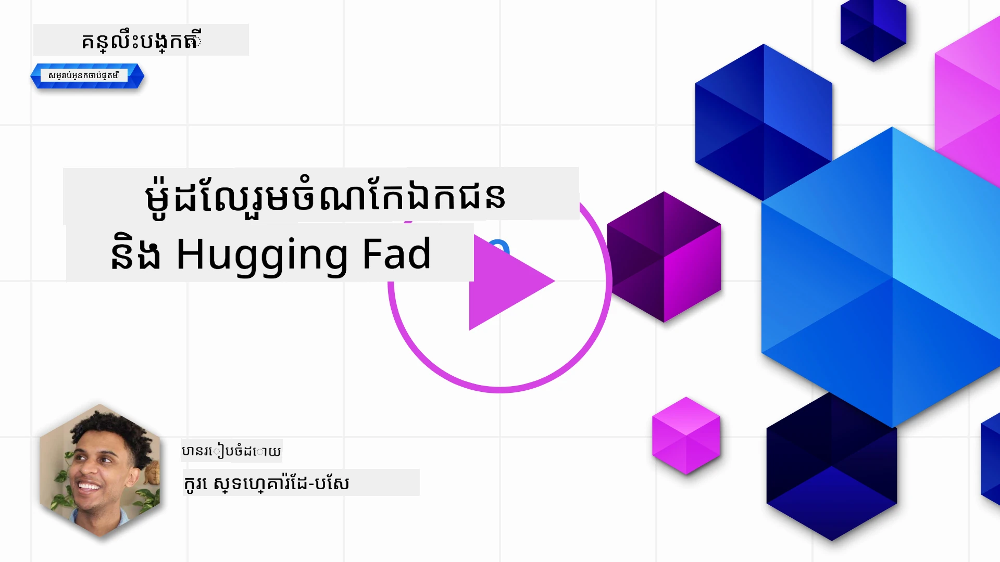
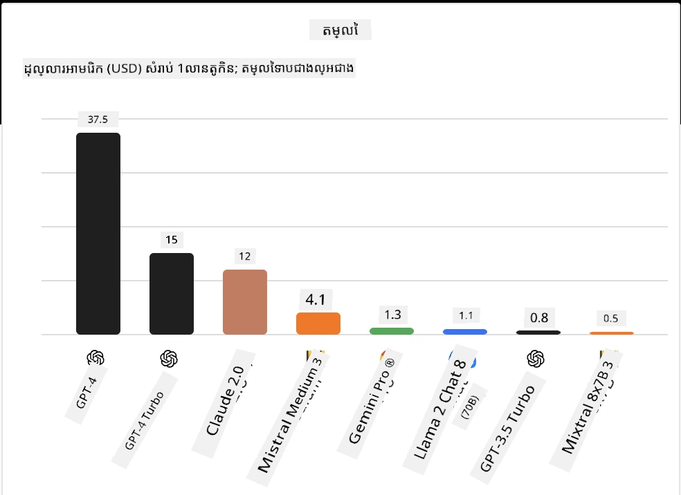
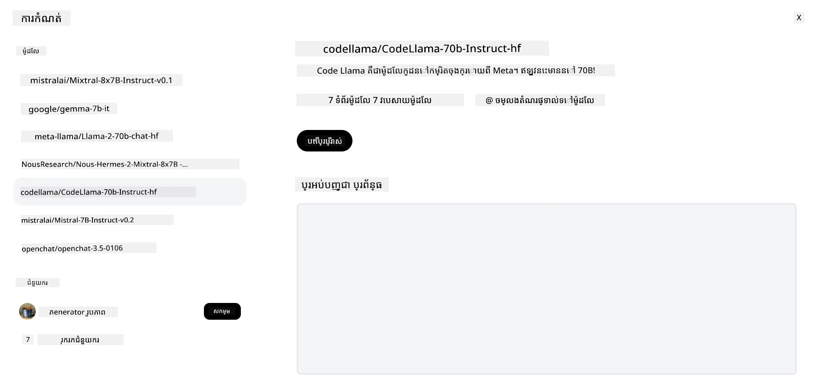
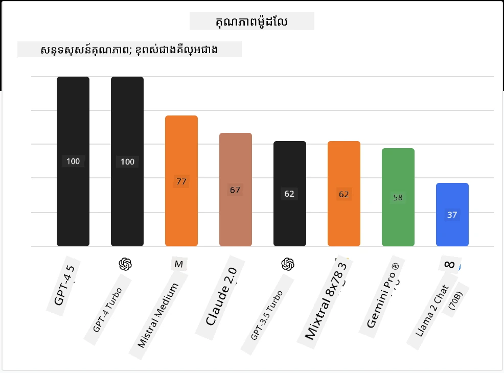

## របបផ្តើម

ពិភពនៃ LLMs មេធំទូលាយប្រភពបើកគឺគួរឱ្យរំភើប និងកំពុងអភិវឌ្ឍរបទបង្ហាញដោយបន្តិចបន្តួច។ មេរៀននេះមានគោលបំណងផ្តល់មើលជ្រាលជ្រៅលើមូឌែលប្រភពបើក។ ប្រសិនបើអ្នកកំពុងស្វែងរកព័ត៌មានអំពីវិធីដែលមូឌែលជាម្ចាស់កម្មសិទ្ធិប្រៀបធៀបនឹងមូឌែលប្រភពបើក សូមទៅមេរៀន ["ការស្វែងយល់ និងប្រៀបធៀប LLMs ផ្សេងៗ"](../02-exploring-and-comparing-different-llms/README.md?WT.mc_id=academic-105485-koreyst)។ មេរៀននេះក៏នឹងដាក់ពន្យល់អំពីប្រធានបទនៃការតម្រឹមលម្អិតផងដែរ ប៉ុន្តែការពន្យល់លម្អិតបន្ថែមអាចស្វែងរកបាននៅក្នុងមេរៀន ["Fine-Tuning LLMs"](../18-fine-tuning/README.md?WT.mc_id=academic-105485-koreyst)។

## គោលដៅការសិក្សា

- ទទួលបានចំណេះដឹងអំពីមូឌែលប្រភពបើក
- យល់ដឹងពីអត្ថប្រយោជន៍នៃការធ្វើការជាមួយមូឌែលប្រភពបើក
- ស្វែងយល់អំពីមូឌែលបើកដែលមាននៅលើ Hugging Face និង Azure AI Studio

## តើមូឌែលប្រភពបើកគឺជាអ្វី?

កម្មវិធីប្រភពបើកបានមានតួនាទីសំខាន់ក្នុងការលូតលាស់បច្ចេកវិទ្យានៅក្នុងវិស័យផ្សេងៗជាច្រើន។ សហគមន៍ Open Source Initiative (OSI) បានកំណត់ [លក្ខណ្ឌ១០សម្រាប់កម្មវិធី](https://web.archive.org/web/20241126001143/https://opensource.org/osd?WT.mc_id=academic-105485-koreyst) ដើម្បីផ្តល់ចំណាត់ថ្នាក់ថាជាប្រភពបើក។ កូដប្រភពត្រូវបានបង្ហាញចំហ និងអនុញ្ញាតដោយអាជ្ញាប័ណ្ណដែល OSI អនុម័ត។

ពេលដែលការអភិវឌ្ឍ LLMs មានធាតុដូចនឹងការអភិវឌ្ឍកម្មវិធី ក៏ប៉ុន្តែដំណើរការយ៉ាងពិតមិនដូចគ្នាទាំងស្រុងឡើយ។ វាបានបណ្តាលឱ្យមានការពិភាក្សាច្រើននៅក្នុងសហគមន៍អំពីនិយមន័យនៃប្រភពបើកក្នុងបរិបទរបស់ LLMs។ ដើម្បីឲ្យមូឌែលមួយត្រូវបានឲ្យភ្ជាប់នឹងនិយមន័យប្រភពបើកបែបប្រពៃណី ព័ត៌មានដូចខាងក្រោមគួរត្រូវបានប៉ាន់ប្រមាណចេញជាសាធារណៈ៖

- សំណុំទិន្នន័យដែលបានប្រើសម្រាប់បង្រៀនមូឌែល។
- ទំងន់មូឌែលពេញលេញជាផ្នែកនៃការបណ្តុះបណ្តាល។
- កូដវាយតម្លៃ។
- កូដតម្រឹមលម្អិត។
- ទំងន់មូឌែលពេញលេញ និងម៉ែត្រីចសម្រាប់បណ្តុះបណ្តាល។

បច្ចុប្បន្ននេះ មានតែមូឌែលតិចតួចប៉ុណ្ណោះដែលឆ្លើងទៅតាមលក្ខខណ្ឌនេះ។ [មូឌែល OLMo ដែលបង្កើតដោយ ស្ថាប័ន Allen Institute for Artificial Intelligence (AllenAI)](https://huggingface.co/allenai/OLMo-7B?WT.mc_id=academic-105485-koreyst) គឺជាមូឌែលមួយដែលត្រូវនឹងប្រភេទនេះ។

សម្រាប់មេរៀននេះ យើងនឹងយោងរហូតទៅមុខថាមូឌែលទាំងនេះគឺជា "មូឌែលបើក" ពីព្រោះវាអាចមិនឆ្លើយតបលក្ខខណ្ឌខាងលើនៅពេលដែលសរសេរនេះឡើយ។

## អត្ថប្រយោជន៍នៃមូឌែលបើក

**អាចប្ដូរប្រកបដោយភាពបុគ្គលភាពខ្ពស់** - ពីព្រោះមូឌែលបើកត្រូវបានដាក់ចេញជាមួយព័ត៌មានបណ្តុះបណ្តាលលម្អិត អ្នកស្រាវជ្រាវ និងអ្នកអភិវឌ្ឍអាចកែប្រែមុខងារក្នុងរបស់មូឌែលបាន។ នេះអនុញ្ញាតឲ្យបង្កើតមូឌែលពិសេសដែលត្រូវបានតម្រឹមលម្អិតសម្រាប់ភារកិច្ច ឬវិស័យសិក្សាផ្សេងៗ។ ឧទាហរណ៍មួយចំនួនរួមមាន ការបង្កើតកូដ ប្រតិបត្តិការជាគណិតវិទ្យា និងជីវសាស្ត្រ។

**ថ្លៃដើម** - តម្លៃក្នុងមួយតួសញ្ញាសម្រាប់ការប្រើប្រាស់ និងចែកចាយមូឌែលទាំងនេះទាបជាងមូឌែលជាម្ចាស់កម្មសិទ្ធិ។ នៅពេលបង្កើតកម្មវិធី Generative AI គួរត្រូវពិចារណាអំពីប្រសិទ្ធភាពប្រៀបធៀបនឹងតម្លៃនៅលើការប្រើប្រាស់ដោយផ្អែកលើមូឌែលទាំងនេះ។

ប្រភព៖ Artificial Analysis

**ភាពបត់បែន** - ការធ្វើការជាមួយមូឌែលបើកផ្តល់អត្ថប្រយោជន៍ភាពបត់បែនសម្រាប់ប្រើមូឌែលផ្សេងៗ ឬរួមបញ្ចូលគ្នា។ ឧទាហរណ៍មួយគឺ [HuggingChat Assistants](https://huggingface.co/chat?WT.mc_id=academic-105485-koreyst) ដែលអ្នកប្រើអាចជ្រើសរើសមូឌែលដែលត្រូវបានប្រើនៅផ្នែកចំណុចប្រទាក់អ្នកប្រើប្រាស់ផ្ទាល់៖

## ស្វែងយល់អំពីមូឌែលបើកនានា

### Llama 2

[LLama2](https://huggingface.co/meta-llama?WT.mc_id=academic-105485-koreyst) ដែលបានអភិវឌ្ឍដោយ Meta គឺជាមូឌែលបើកដែលមានលក្ខណៈល្អឥតខ្ចោះសម្រាប់កម្មវិធីមូលដ្ឋាននៃការជជែក។ នេះកើតឡើងដោយសារតែវិធីសាស្ត្រតម្រឹមលម្អិតរបស់វា ដែលរួមបញ្ចូលទំនាក់ទំនងជាច្រើន និងមតិយោបល់មនុស្ស។ ជាមួយវិធីសាស្ត្រនេះ មូឌែលបង្កើតលទ្ធផលដែលសមស្របទៅនឹងការរំពឹងទុករបស់មនុស្ស ដែលផ្តល់បទពិសោធប្រើប្រាស់កាន់តែកាន់តែប្រសើរ។

ឧទាហរណ៍នៃកំណែតម្រឹមលម្អិតរបស់ Llama រួមមាន [Japanese Llama](https://huggingface.co/elyza/ELYZA-japanese-Llama-2-7b?WT.mc_id=academic-105485-koreyst) ដែលមានជំនាញក្នុងភាសាជប៉ុន និង [Llama Pro](https://huggingface.co/TencentARC/LLaMA-Pro-8B?WT.mc_id=academic-105485-koreyst) ដែលជាកំណែដែលបង្រួមបន្ថែមនៃមូឌែលមូលដ្ឋាន។

### Mistral

[Mistral](https://huggingface.co/mistralai?WT.mc_id=academic-105485-koreyst) គឺជាមូឌែលបើកដែលផ្ដោតលើកំណត់ត្រាប្រសិទ្ធិភាពខ្ពស់ និងប្រសិទ្ធភាពល្អ។ វាប្រើវិធីសាស្ត្រ Mixture-of-Experts ដែលផ្សំក្រុមមូឌែលជំនាញលំដាប់ខ្ពស់ចាប់គ្នាទៅជា១ប្រព័ន្ធ ដែលអាស្រ័យលើបញ្ចូល បច្ចេកទេសមួយចំនួនត្រូវបានជ្រើសរើសដើម្បីប្រើប្រាស់។ វាជួយឱ្យកំណត់ត្រាសាកល្បងមានប្រសិទ្ធភាព ពោលគឺមូឌែលគ្រាន់តែដោះស្រាយបញ្ចូលដែលវាមានជំនាញប៉ុណ្ណោះ។

ឧទាហរណ៍នៃកំណែតម្រឹមលម្អិតរបស់ Mistral រួមមាន [BioMistral](https://huggingface.co/BioMistral/BioMistral-7B?text=Mon+nom+est+Thomas+et+mon+principal?WT.mc_id=academic-105485-koreyst) ដែលផ្ដោតលើវិស័យវេជ្ជសាស្ត្រ និង [OpenMath Mistral](https://huggingface.co/nvidia/OpenMath-Mistral-7B-v0.1-hf?WT.mc_id=academic-105485-koreyst) ដែលប្រារព្ធប្រតិបត្តិការជាគណិតវិទ្យា។

### Falcon

[Falcon](https://huggingface.co/tiiuae?WT.mc_id=academic-105485-koreyst) គឺជាម៉ូឌែល LLM ត្រូវបានបង្កើតដោយ Technology Innovation Institute (**TII**)។ Falcon-40B ត្រូវបានបណ្តុះបណ្តាលលើ ៤០ ពាន់លានប៉ារ៉ាម៉ែត្រ ដែលត្រូវបានបង្ហាញថាធ្វើការល្អជាង GPT-3 ដោយមានថវិកាលោកកថិការតិចជាង។ នេះបណ្តាលមកពីការប្រើប្រាស់អាល្គរីធម FlashAttention និង multiquery attention ដែលអាចកាត់បន្ថយការទាមទារមេម៉ូរីនៅពេលធ្វើ inferencing ។ ជាមួយនឹងពេលវេលាបន្ថយនេះ Falcon-40B សមរម្យសម្រាប់កម្មវិធីប្រើជជែក។

ឧទាហរណ៍នៃកំណែតម្រឹមលម្អិតរបស់ Falcon មាន [OpenAssistant](https://huggingface.co/OpenAssistant/falcon-40b-sft-top1-560?WT.mc_id=academic-105485-koreyst) ដែលជាជំនួយការបង្កើតលើមូឌែលបើក និង [GPT4ALL](https://huggingface.co/nomic-ai/gpt4all-falcon?WT.mc_id=academic-105485-koreyst) ដែលផ្តល់ការប្រសិប្បន្នភាពខ្ពស់ជាងមូឌែលមូលដ្ឋាន។

## របៀបជ្រើសរើស

មិនមានចម្លើយតែមួយសម្រាប់ការជ្រើសរើសមូឌែលបើកឡើយ។ កន្លែងល្អមួយសម្រាប់ចាប់ផ្តើមគឺការប្រើលក្ខណៈបន្ទាត់តាមភារកិច្ចរបស់ Azure AI Studio។ វានឹងជួយឱ្យអ្នកយល់ពីប្រភេទភារកិច្ចដែលមូឌែលត្រូវបានបណ្តុះ។ Hugging Face ក៏រក្សារបញ្ជីអធិការណ៍ LLM ដែលបង្ហាញពីមូឌែលទទួលបានលទ្ធផលល្អបំផុតដោយផ្អែកលើម៉ែត្រីចជាក់លាក់។

ពេលពិចារណាប្រៀបធៀបនឹង LLMs តាមប្រភេទផ្សេងៗ, [Artificial Analysis](https://artificialanalysis.ai/?WT.mc_id=academic-105485-koreyst) គឺជាទិន្នន័យយ៉ាងមានតម្លៃមួយទៀត៖

ប្រភព៖ Artificial Analysis

ប្រសិនបើធ្វើការលើករណីប្រើប្រាស់ជាក់លាក់ ការស្វែងរកកំណែតម្រឹមលម្អិតដែលផ្ដោតលើវិស័យដដែលអាចមានប្រសិទ្ធភាព។ ការព្យាយាមជាមួយមូឌែលបើកជាច្រើនដើម្បីមើលថាតើវាទទួលបានលទ្ធផលយ៉ាងដូចម្តេចតាមការរំពឹងទុករបស់អ្នក និងអ្នកប្រើប្រាស់ក៏ជាព្រឹត្តិការណ៍ល្អបន្ថែមទៀត។

## ជាដំណាក់កាលបន្ទាប់

ផ្នែកល្អបំផុតអំពីមូឌែលបើកគឺអ្នកអាចចាប់ផ្តើមធ្វើការជាមួយវាបានយ៉ាងរហ័ស។ សូមពិនិត្យមើល [Azure AI Foundry Model Catalog](https://ai.azure.com?WT.mc_id=academic-105485-koreyst) ដែលបង្ហាញឱ្យឃើញបណ្ណាល័យ Hugging Face មួយដែលមានមូឌែលដែលយើងបានពិភាក្សាក្នុងទីនេះ។

## ការសិក្សាមិនបញ្ឈប់នៅទីនេះ សូមបន្តដំណើរ

បន្ទាប់ពីបញ្ចប់មេរៀននេះ សូមពិនិត្យមើល [បណ្ណាល័យយល់ដឹង Generative AI របស់យើង](https://aka.ms/genai-collection?WT.mc_id=academic-105485-koreyst) ដើម្បីបន្តបង្កើនចំណេះដឹង Generative AI របស់អ្នក!

---

<!-- CO-OP TRANSLATOR DISCLAIMER START -->
**ការបដិសេធ**៖  
ឯកសារនេះត្រូវបានបកប្រែដោយប្រើសេវាកម្ម​បកប្រែ AI [Co-op Translator](https://github.com/Azure/co-op-translator)។ ខណៈពេលដែលយើងខំប្រឹងប្រែងដើម្បីមានភាពត្រឹមត្រូវ សូមយល់ថាការបកប្រែដោយស្វ័យប្រវត្តិអាចមានកំហុស ឬភាពមិនត្រឹមត្រូវក្នុងខ្លះ។ ឯកសារបដ្ឋានដើមជាភាសារបស់វា គួរត្រូវបានចាត់ទុកជាគោលដៅដែលមានអំណាច។ សម្រាប់ព័ត៌មានសំខាន់ៗ សូមពិចារណាបកប្រែដោយមនុស្សជំនាញវិជ្ជាជីវៈ។ យើងមិនទទួលខុសត្រូវចំពោះការយល់ច្រឡំនិងការបកព្រេងណាមួយដែលកើតមានពីការប្រើប្រាស់ការបកប្រែនេះឡើយ។
<!-- CO-OP TRANSLATOR DISCLAIMER END -->