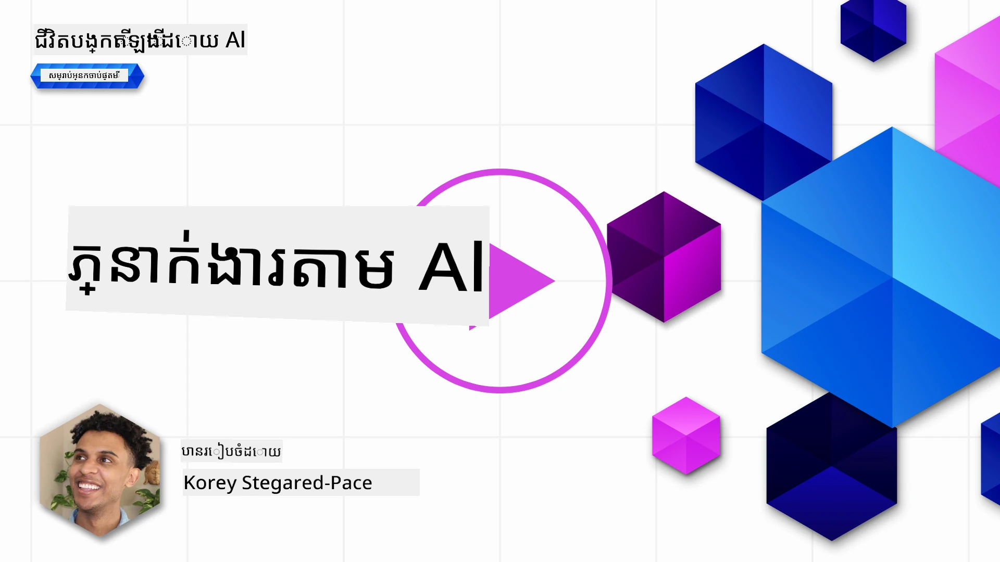
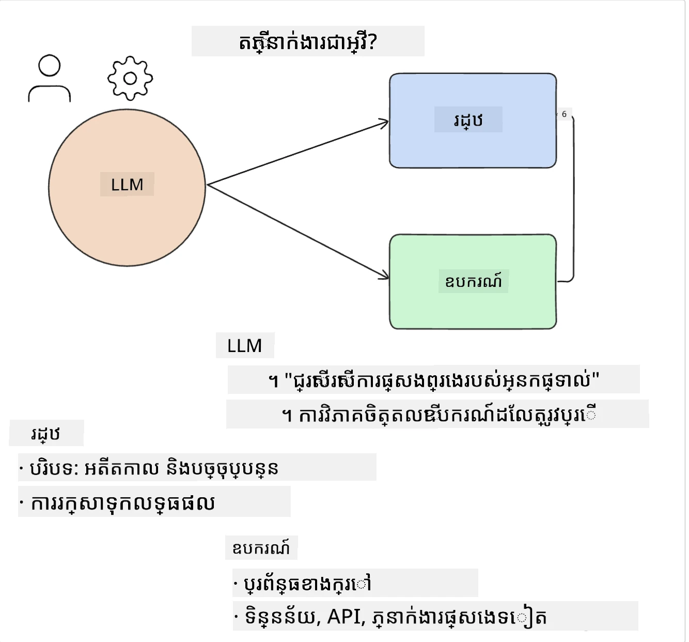
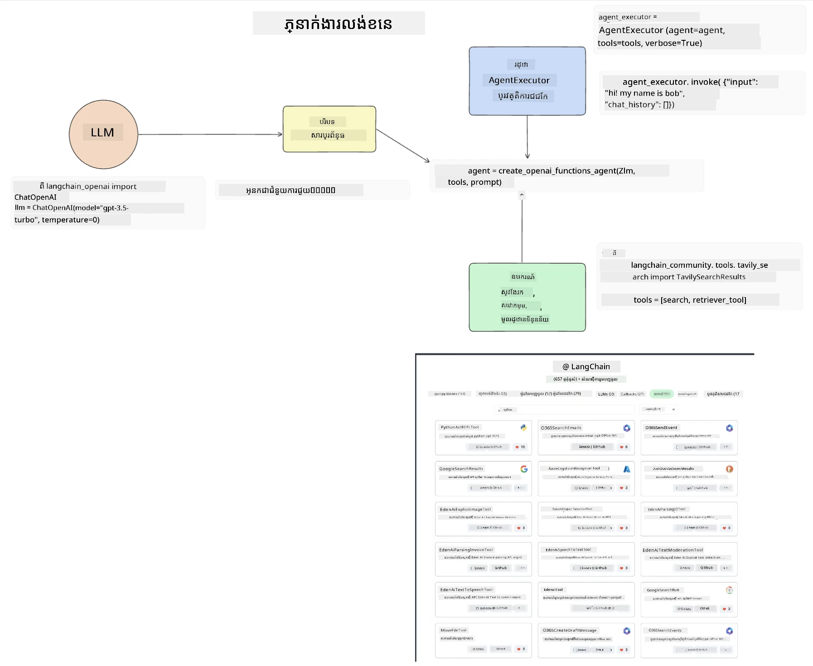
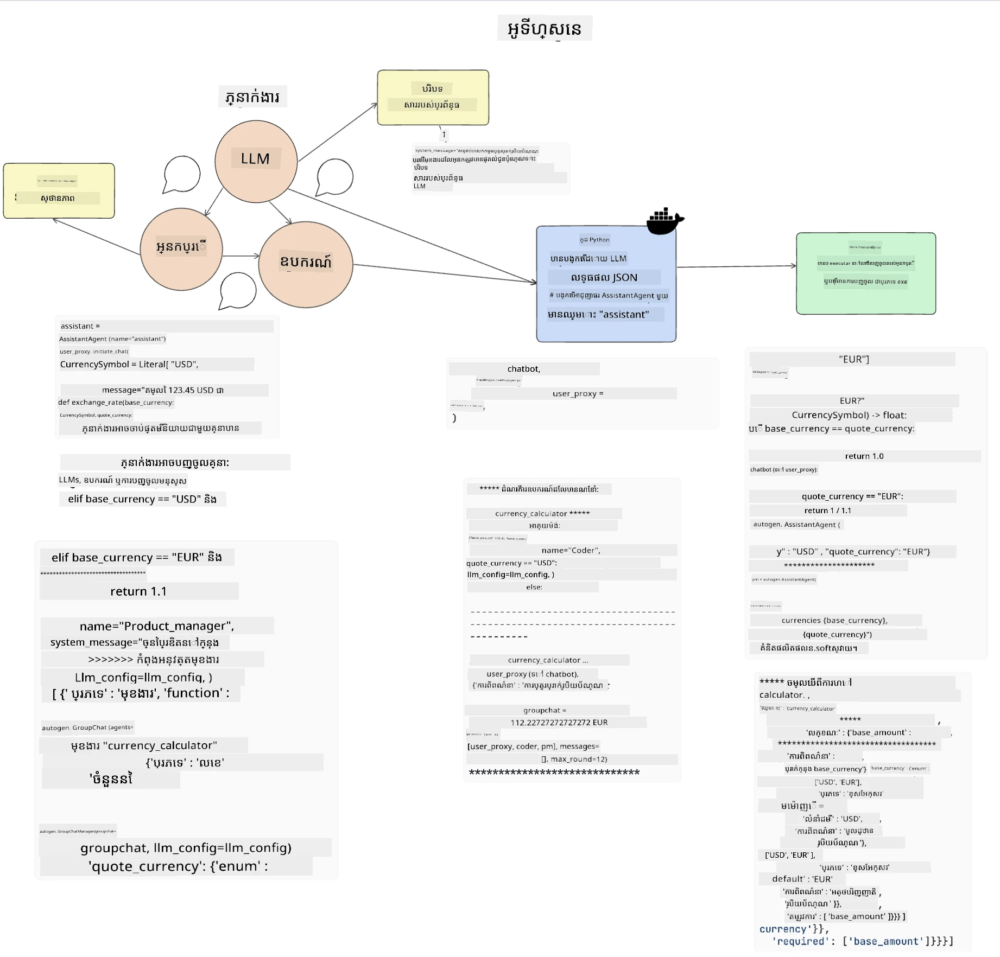
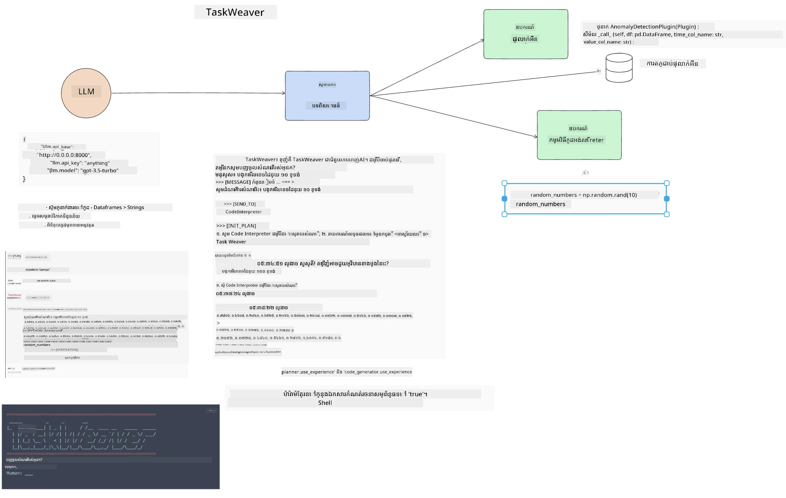
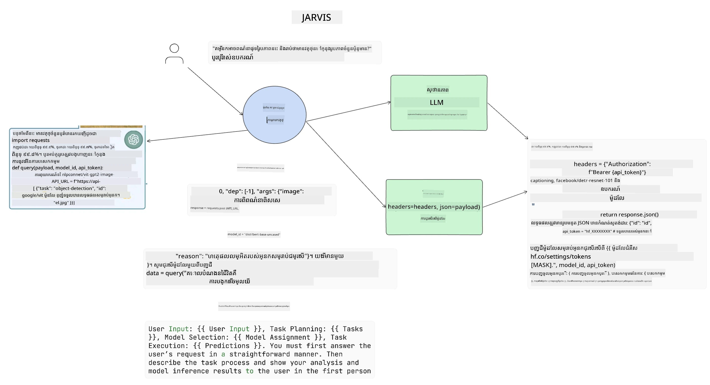

[](https://youtu.be/yAXVW-lUINc?si=bOtW9nL6jc3XJgOM)

## ការណែនាំ

អេហ្សង់ត៍ AI តំណាងឱ្យការវិវឌ្ឍន៍ដ៏គួរឱ្យរំខានក្នុង Generative AI ដែលអនុញ្ញាតឱ្យម៉ូដែលភាសាធំៗ (LLMs) ធ្វើការប្រែប្រួលពីជាជំនួយការទៅជាអេហ្សង់ត៍ដែលមានសមត្ថភាពអាចអនុវត្តសកម្មភាពបាន។ ស៊េរីសុវត្ថិភាព AI អេហ្សង់ត៍ អនុញ្ញាតឱ្យអ្នកអភិវឌ្ឍបង្កើតកម្មវិធីដែលផ្តល់ឱ្យ LLMs ដល់ឧបករណ៍ និងការគ្រប់គ្រងស្ថានភាព។ ស៊េរីទាំងនេះក៏ពង្រឹងការមើលឃើញ ដើម្បីឱ្យអ្នកប្រើប្រាស់និងអ្នកអភិវឌ្ឍអាចតាមដានសកម្មភាពដែលបានគ្រោងទុកដោយ LLMs ដូច្នេះបង្កើតការគ្រប់គ្រងបទពិសោធន៍បានល្អប្រសើរឡើង។

មេរៀននេះនឹងគ្របដណ្តប់តំបន់ដូចខាងក្រោម៖

- យល់ដឹងអំពីអ្វីទៅជា AI Agent - តើ AI Agent គឺជាអ្វី?
- រុករកស៊េរី AI Agent បួនប្រភេទផ្សេងៗ - តើតើកម្មវិធីណាដែលធ្វើឱ្យពួកវាផ្សេងគ្នា?
- អនុវត្ត AI Agents ទៅកាន់ករណីប្រើប្រាស់ផ្សេងៗ - តើពេលណាដែលយើងគួរប្រើ AI Agents?

## គោលបំណងសិក្សា

បន្ទាប់ពីបានយកមេរៀននេះ អ្នកនឹងអាច៖

- ពន្យល់អំពីអ្វីទៅជា AI Agents និងរបៀបដែលពួកវាអាចត្រូវបានប្រើ។
- មានការយល់ដឹងអំពីភាពខុសគ្នារវាងស៊េរី AI Agent ពេញនិយមមួយចំនួន និងរបៀបដែលពួកវាផ្សេងគ្នា។
- យល់ដឹងពីរបៀបដែល AI Agents ធ្វើការដើម្បីបង្កើតកម្មវិធីជាមួយពួកវា។

## តើអ្វីទៅជា AI Agents?

AI Agents គឺជាវិស័យដ៏គួរឱ្យរំខានមួយក្នុងโลก Generative AI។ ជាមួយនឹងក្តីរំភើបនេះ ម៉ោងខ្លះក៏មានការជំរុញពីពាក្យនិងការអនុវត្តរបស់ពួកវា។ ដើម្បីឱ្យមានភាពសាមញ្ញនិងរួមបញ្ចូលនូវឧបករណ៍ភាគច្រើនដែលយោងទៅលើ AI Agents យើងនឹងប្រើនិយមន័យនេះ៖

AI Agents អនុញ្ញាតឱ្យម៉ូដែលភាសាធំៗ (LLMs) អាចអនុវត្តភារកិច្ចដោយផ្តល់ឱ្យពួកវាទៅដល់ **ស្ថានភាព** និង **ឧបករណ៍**។



មកដាក់និយមន័យទាំងនេះ៖

**ម៉ូដែលភាសាធំៗ** - នេះគឺជាម៉ូដែលដែលយោងទាំងមូលក្នុងវគ្គសិក្សានេះដូចជា GPT-3.5, GPT-4, Llama-2, ល។

**ស្ថានភាព** - នេះហើយជាសេចក្ដីបរិបទដែល LLM កំពុងធ្វើការនៅក្នុងវា។ LLM ប្រើបរិបទពីសកម្មភាពមុនរបស់វា និងបរិបទបច្ចុប្បន្ន ដើម្បីណែនាំការសម្រេចចិត្តនៃសកម្មភាពបន្ទាប់។ ស៊េរី AI Agent អនុញ្ញាតឱ្យអ្នកអភិវឌ្ឍរកាន់កាន់បរិបទនេះបានកាន់តែលេខងាយ។

**ឧបករណ៍** - ដើម្បីបញ្ចប់ភារកិច្ចដែលអ្នកប្រើបានស្នើ និងដែល LLM បានគ្រោង, LLM ត្រូវការចូលដំណើរការឧបករណ៍។ ឧបករណ៍ខ្លះៗអាចមានដូចជាឃ្លាំងទិន្នន័យ, API, កម្មវិធីខាងក្រៅ ឬ ម៉ូដែល LLM មួយទៀត!

និយមន័យទាំងនេះសង្ឃឹមថានឹងផ្តល់ដល់អ្នកការពាក់ព័ន្ធល្អក្នុងការទៅមុខ ពេលយើងមើលថាពួកវាត្រូវបានអនុវត្តយ៉ាងដូចម្តេច។ មករុករកស៊េរី AI Agent ខ្លះៗ៖

## LangChain Agents

[LangChain Agents](https://python.langchain.com/docs/how_to/#agents?WT.mc_id=academic-105485-koreyst) គឺជាការអនុវត្តន៍នៃនិយមន័យដែលយើងបានផ្តល់ខាងលើ។

ដើម្បីគ្រប់គ្រង **ស្ថានភាព** វាប្រើមុខងារផ្ទុកក្នុងមួយដែលហៅថា `AgentExecutor`។ វាគោរពការទទួលយក `agent` ដែលបានកំណត់ និង `tools` ដែលមានស្រាប់។

`AgentExecutor` ក៏ផ្ទុកប្រវត្តិការជជែកដើម្បីផ្តល់បរិបទនៃការជជែកផងដែរ។



LangChain ផ្តល់ជូននូវ [បញ្ជីឧបករណ៍](https://integrations.langchain.com/tools?WT.mc_id=academic-105485-koreyst) ដែលអាចនាំចូលទៅកាន់កម្មវិធីរបស់អ្នកបាន ដែល LLM អាចចូលប្រើបាន។ ពួកវាត្រូវបានបង្កើតដោយសហគមន៍ និងក្រុម LangChain ។

អ្នកអាចកក់កំណត់ឧបករណ៍ទាំងនេះ ហើយផ្តល់ពួកវាឲ្យ `AgentExecutor`។

ភាពច្បាស់លាស់គឺជាលក្ខណៈសំខាន់មួយពេលនិយាយអំពី AI Agents។ វាជារឿងសំខាន់សម្រាប់អ្នកអភិវឌ្ឍកម្មវិធីក្នុងការយល់ថាតើ LLM កំពុងប្រើឧបករណ៍មួយណា និងហេតុអ្វី... ដូច្នេះ ក្រុម LangChain បានពង្រឹង LangSmith ។

## AutoGen

ស៊េរី AI Agent បន្ទាប់ដែលយើងនឹងពិភាក្សាគឺ [AutoGen](https://microsoft.github.io/autogen/?WT.mc_id=academic-105485-koreyst)។ ការយកចិត្តទុកដាក់សំខាន់របស់ AutoGen គឺការសន្ទនា។ អេហ្សង់ត៍ទាំងអស់គឺមានលក្ខណៈ **អាចសន្ទនា** និង **អាចប្តូរតាមបំណង**។

**អាចសន្ទនា** - LLMs អាចចាប់ផ្តើម និងបន្តសន្ទនាជាមួយ LLM មួយទៀត ដើម្បីបញ្ចប់ភារកិច្ច។ វាបានធ្វើឡើងដោយបង្កើត `AssistantAgents` និងផ្តល់សារប្រព័ន្ធជាក់លាក់មួយ។

```python

autogen.AssistantAgent( name="Coder", llm_config=llm_config, ) pm = autogen.AssistantAgent( name="Product_manager", system_message="Creative in software product ideas.", llm_config=llm_config, )

```

**អាចប្តូរតាមបំណង** - អេហ្សង់ត៍មិនត្រឹមតែជារាង LLM ប៉ុណ្ណោះទេ តែអាចជាអ្នកប្រើប្រាស់ ឬឧបករណ៍ផងដែរ។ ជាអ្នកអភិវឌ្ឍ អ្នកអាចកំណត់ `UserProxyAgent` ដែលទទួលបន្ទុកក្នុងការប្រតិបត្ដិជាមួយអ្នកប្រើសម្រាប់មតិយោបល់ក្នុងការបញ្ចប់ភារកិច្ច។ មតិយោបល់នេះអាចបន្តការអនុវត្តភារកិច្ច ឬបញ្ឈប់វា។

```python
user_proxy = UserProxyAgent(name="user_proxy")
```

### ស្ថានភាព និងឧបករណ៍

ដើម្បីផ្លាស់ប្តូរ និងគ្រប់គ្រងស្ថានភាព អេហ្សង់ត៍ជំនួយផលិតកូដ Python ដើម្បីបញ្ចប់ភារកិច្ច។

នេះគឺជាឧទាហរណ៍នៃដំណើរការ៖



#### LLM ត្រូវបានកំណត់ជាមួយសារប្រព័ន្ធ

```python
system_message="For weather related tasks, only use the functions you have been provided with. Reply TERMINATE when the task is done."
```

សារប្រព័ន្ធនេះណែនាំ LLM ជាក់លាក់នេះថាអ្នកវិធីការណ៍ណាដែលពាក់ព័ន្ធសម្រាប់ភារកិច្ចរបស់វា។ ចូរចាំថា ជាមួយ AutoGen អ្នកអាចមាន AssistantAgents ប៉ុន្មានដែលកំណត់បានជាមួយសារប្រព័ន្ធផ្សេងៗគ្នា។

#### ការជជែកត្រូវបានចាប់ផ្តើមដោយអ្នកប្រើ

```python
user_proxy.initiate_chat( chatbot, message="I am planning a trip to NYC next week, can you help me pick out what to wear? ", )

```

សារ​ពី user_proxy (មនុស្ស) នេះហើយជាប្រភពចាប់ផ្តើមដំណើរការអេហ្សង់ត៍ក្នុងការប្រាស្រ័យអំពីមុខងារដែលវាគួរត្រូវអនុវត្ត។

#### មុខងារត្រូវបានអនុវត្ត

```bash
chatbot (to user_proxy):

***** Suggested tool Call: get_weather ***** Arguments: {"location":"New York City, NY","time_periond:"7","temperature_unit":"Celsius"} ******************************************************** --------------------------------------------------------------------------------

>>>>>>>> EXECUTING FUNCTION get_weather... user_proxy (to chatbot): ***** Response from calling function "get_weather" ***** 112.22727272727272 EUR ****************************************************************

```

បន្ទាប់ពីករណីការជជែកដំបូង តំណាលអេហ្សង់ត៍នឹងផ្ញើឧបករណ៍ដែលបានណែនាំឱ្យហៅ។ ក្នុងករណីនេះ វាជាមុខងារ `get_weather`។ នៅលើការកំណត់រចនាសម្ព័ន្ធរបស់អ្នក មុខងារនេះអាចត្រូវបានអនុវត្តដោយស្វ័យប្រវត្តិ និងអានដោយអេហ្សង់ត៍ ឬអាចត្រូវបានអនុវត្តតាមបំណងអ្នកប្រើ។

អ្នកអាចរកបញ្ជី [គំរូកូដ AutoGen](https://microsoft.github.io/autogen/docs/Examples/?WT.mc_id=academic-105485-koreyst) ដើម្បីស្វែងយល់បន្ថែមពីរបៀបចាប់ផ្តើមការបង្កើត។

## Taskweaver

ស៊េរីលោកអេហ្សង់ត៍បន្ទាប់ដែលយើងនឹងស្វែងយល់គឺ [Taskweaver](https://microsoft.github.io/TaskWeaver/?WT.mc_id=academic-105485-koreyst)។ វាត្រូវបានគេស្គាល់ថាជា "code-first" អេហ្សង់ត៍ ព្រោះវា មិនបានធ្វើការជាមួយ `string` តែម្ដងទេ ដោយអាចប្រើ DataFrames នៅក្នុង Python។ វាមានប្រយោជន៍ខ្លាំងសម្រាប់វិភាគទិន្នន័យនិងភារកិច្ចបង្កើត។ អាចជារឿងដូចជា បង្កើតក្រាហ្វ និងតារាង ឬបង្កើតលេខចៃដន្យ។

### ស្ថានភាព និងឧបករណ៍

ដើម្បីគ្រប់គ្រងស្ថានភាពនៃការសន្ទនា TaskWeaver ប្រើយុទ្ធសាស្រ្ត `Planner`។ `Planner` ជា LLM ដែលទទួលសំណើពីអ្នកប្រើ ហើយរៀបចំពេលជីវិតការងារដែលត្រូវបញ្ចប់ដើម្បីបំពេញសំណើនេះ។

ដើម្បីបញ្ចប់ភារកិច្ច `Planner` ត្រូវបានផ្ដល់ឱ្យមើលឧបករណ៍ក្នុងកំណត់ដែលហៅថា `Plugins`។ នេះអាចជាចំណាត់ថ្នាក់ Python ឬជាកម្មវិធីសកលអានកូដ។ Plugins ទាំងនេះត្រូវបានរក្សាទុកជាគំនូសបញ្ជិកា ដើម្បីឲ្យ LLM អាចស្វែងរក Plugins ត្រឹមត្រូវបានល្អប្រសើរ។



នេះជាឧទាហរណ៍នៃ plugin សម្រាប់ដោះស្រាយការរកឃើញភាពមិនស្របគ្នា៖

```python
class AnomalyDetectionPlugin(Plugin): def __call__(self, df: pd.DataFrame, time_col_name: str, value_col_name: str):
```

កូដត្រូវបានបញ្ជាក់ខុសត្រូវមុនពេលអនុវត្ត។ មុខងារផ្សេងទៀតក្នុងការគ្រប់គ្រងបរិបទនៅ Taskweaver គឺ `experience`។ Experience អនុញ្ញាតឲ្យស្ថានភាពនៃការសន្ទនាត្រូវបានរក្សាទុករយៈពេលវែងក្នុងឯកសារ YAML។ នេះអាចត្រូវបានតម្រូវដើម្បីឲ្យ LLM ពង្រីកលើពេលវេលាក្នុងភារកិច្ចណាមួយ ដែលវាត្រូវបានប្រឈមមុខនឹងការសន្ទនាមុន។

## JARVIS

ស៊េរីលោកអេហ្សង់ត៍ចុងក្រោយដែលយើងនឹងสำรวจគឺ [JARVIS](https://github.com/microsoft/JARVIS?tab=readme-ov-file&WT.mc_id=academic-105485-koreyst)। អ្វីដែលធ្វើឲ្យ JARVIS មានភាពពិសេស គឺវាដំណើរការដោយ LLM ក្នុងការគ្រប់គ្រង `state` នៃការសន្ទនា ហើយ `tools` គឺជាម៉ូឌែល AI ផ្សេងទៀត។ ម៉ូឌែល AI ទាំងនេះជាម៉ូឌែលជំនាញដែលអនុវត្តភារកិច្ចជាក់លាក់ទាំងពីរដូចជា ការរកមុខវត្ថុ ការបម្លែងសំឡេង ទំហំរូបភាពជាដើម។



LLM ដែលជា ម៉ូឌែលគោលដៅទូទៅ ទទួលសំណើពីអ្នកប្រើ ហើយកំណត់ភារកិច្ចជាក់លាក់ និងព័ត៌មានផ្សេងៗដែលត្រូវការដើម្បីបញ្ចប់ភារកិច្ច។

```python
[{"task": "object-detection", "id": 0, "dep": [-1], "args": {"image": "e1.jpg" }}]
```

បន្ទាប់ពីនេះ LLM នឹងរៀបចំសំណើក្នុងរបៀបដែលម៉ូឌែល AI ជំនាញអាចបកស្រាយបាន ដូចជា JSON។ ពេលម៉ូឌែល AI បានត្រឡប់មកនូវការព្យាករណ៍ផ្អែកលើភារកិច្ច ម៉ូឌែល LLM ទទួលបានចម្លើយនោះ។

បើមានម៉ូឌែលច្រើនត្រូវការនៅក្នុងការបញ្ចប់ភារកិច្ច វានឹងបកស្រាយចម្លើយពីម៉ូឌែលទាំងនោះមុននាំពួកវារួមគ្នាដើម្បីបង្កើតចម្លើយទៅអ្នកប្រើ។

ឧទាហរណ៍ខាងក្រោមបង្ហាញពីរបៀបធ្វើការនៅពេលដែលអ្នកប្រើស្នើសុំការពិពណ៌នាហើយនិងរាប់ចំនួនវត្ថុក្នុងរូបភាព៖

## ការចាត់ចែង

ដើម្បីបន្តការសិក្សារបស់អ្នកអំពី AI Agents អ្នកអាចបង្កើតជាមួយ AutoGen៖

- កម្មវិធីដែលអនុញ្ញាតឱ្យមានកិច្ចប្រជុំអាជីវកម្មជាមួយផ្នែកនានារបស់ស្តាតអប់រំថ្មី។
- បង្កើតសារប្រព័ន្ធដែលណែនាំ LLMs ក្នុងការយល់ដឹងអំពីបុគ្គលិក និងអាទិភាពផ្សេងៗ ហើយអនុញ្ញាតឲ្យអ្នកប្រើប្រាស់បញ្ចូលគំនិតផលិតផលថ្មី។
- LLM គួរតែបង្កើតសំណួរតាមទៀតពីផ្នែកនីមួយៗ ដើម្បីធ្វើឲ្យប្រសើរនិងធ្វើការកែប្រែគំនិតផលិតផល។

## ការរៀនមិនបានបញ្ចប់នៅទីនេះ តម្រូវឱ្យបន្តការផ្លូវការ

បន្ទាប់ពីបញ្ចប់មេរៀននេះ សូមពិនិត្យមើល [ប្រមូលផ្តុំការសិក្សា Generative AI](https://aka.ms/genai-collection?WT.mc_id=academic-105485-koreyst) របស់យើងដើម្បីបន្តលើកកម្ពស់ចំណេះដឹង Generative AI របស់អ្នក!

---

<!-- CO-OP TRANSLATOR DISCLAIMER START -->
**ប័ណ្ណអះអាង**៖  
ឯកសារនេះបានបម្លែងភាសាជាមួយសេវាផ្លាស់ប្តូរភាសា AI [Co-op Translator](https://github.com/Azure/co-op-translator)។ ខណៈពេលយើងខិតខំរកភាពត្រឹមត្រូវ សូមយល់ដឹងថាការបកប្រែដោយស្វ័យប្រវត្តិក្នុងខ្លះអាចមានកំហុសឬការមិនត្រឹមត្រូវ។ ឯកសារដើមដែលមានក្នុងភាសាផ្ទាល់ខ្លួន គួរត្រូវបានគេយកជាធនាគារដែលមានសិទ្ធិពេញលេញ។ សម្រាប់ព័ត៌មានសំខាន់ៗ ការបកប្រែដោយមនុស្សវិជ្ជាជីវៈត្រូវបានណែនាំ។ យើងមិនទទួលខុសត្រូវចំពោះការយល់ច្រឡំឬការបកប្រែខុសណាមួយដែលកើតឡើងពីការប្រើប្រាស់ការបកប្រែនេះឡើយ។
<!-- CO-OP TRANSLATOR DISCLAIMER END -->