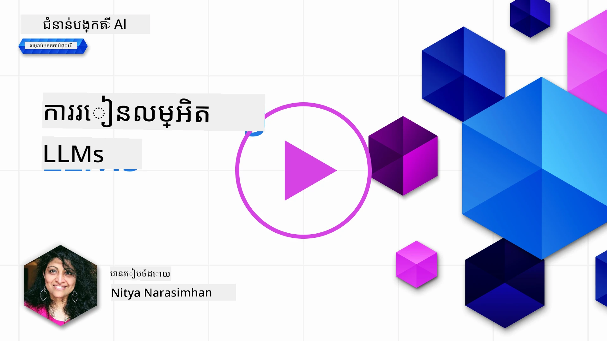
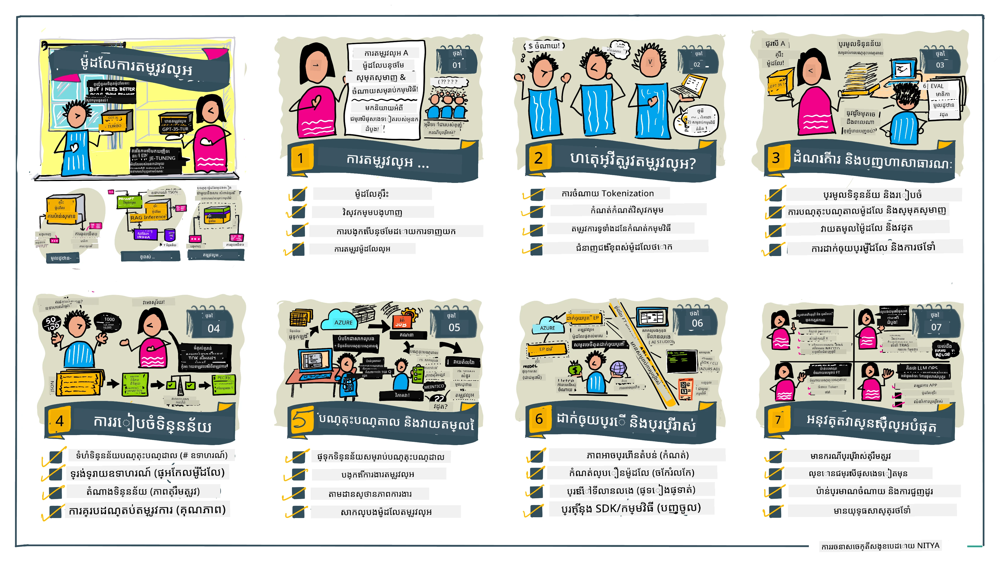

# ការបង្រៀនឡើងវិញ (Fine-Tuning) លើ LLM របស់អ្នក

ការប្រើម៉ូដែលភាសាធំដើម្បីបង្កើតកម្មវិធី AI បង្កើតថ្មីមួយ នាំមកនូវបញ្ហាថ្មីៗ។ បញ្ហាសំខាន់គឺធានាថាគុណភាពនៃចម្លើយ (ភាពត្រឹមត្រូវ និងភាពសមស្រប) ក្នុងមាតិកាដែលម៉ូដែលបង្កើតឡើងសម្រាប់សំណើរបស់អ្នកប្រើ។ ក្នុងមេរៀនមុនៗ យើងបានពិភាក្សាអំពីបច្ចេកទេសដូចជា​វិស្វកម្មបន្ទាត់ និងការ​បង្កើត​បន្ថែម​តាម​ការ​ទាញព័ត៌មាន ដែលព្យាយាមដោះស្រាយបញ្ហាដោយ​_កែប្រែ​បន្ទាត់​បញ្ចូល_ទៅម៉ូដែលដែលមានស្រាប់។

ក្នុងមេរៀនថ្ងៃនេះ យើងនិយាយពីបច្ចេកទេសទីបី គឺ **fine-tuning** ដែលព្យាយាមដោះស្រាយបញ្ហា ដោយ_បង្រៀនឡើងវិញ​ម៉ូដែលដោយផ្ទាល់_ជាមួយទិន្នន័យបន្ថែម។ យើងត្រូវចុះជ្រាបទៅក្នុងព័ត៌មានលម្អិត។

## វិជ្ជាសិក្សា

មេរៀននេះណែនាំពីមូលដ្ឋាននៃការបង្រៀនឡើងវិញសម្រាប់ម៉ូដែលភាសាដែលបានបង្រៀនមុនៗ រួមជាមួយអត្ថប្រយោជន៍និងបញ្ហាដែលមាននូវវិធីសាស្រ្តនេះ។ ហើយផ្តល់សេចក្តីណែនាំពីពេលវេលានិងរបៀបប្រើប្រាស់ fine-tuning ដើម្បីបង្កើនសមត្ថភាពម៉ូដែល AI បង្កើតរបស់អ្នក។

បញ្ចប់មេរៀននេះ អ្នកគួរអាចឆ្លើយសំណួរដូចខាងក្រោម៖

- fine-tuning សម្រាប់ម៉ូដែលភាសាជាអ្វី?
- ពេលណា ហើយហេតុអ្វីហើយ fine-tuning មានប្រយោជន៍?
- តើធ្វើយ៉ាងដូចម្តេចដើម្បី fine-tune ម៉ូដែលដែលបានបង្ហាត់មុន?
- មានកំណត់អ្វីខ្លះចំពោះការបង្រៀនឡើងវិញ?

រួចរាល់ទេ? ចូរចាប់ផ្តើមគ្នា។

## មគ្គុទេសក៍រូបភាព

ចង់យល់រូបមើលធំអ្វីដែលយើងនឹងគ្របដណ្តប់មុននឹងចាប់ផ្តើមមែនទេ? សូមពិនិត្យមើលមគ្គុទេសក៍រូបភាពនេះដែលពណ៌នាអំពីដំណើរការសិក្សាសម្រាប់មេរៀននេះ - ពីការសម្រេចចិត្តមូលដ្ឋាននិងបថកម្មសម្រាប់ fine-tuning ដល់ការយល់ដឹងអំពីដំណើរការនិងអនុវត្តជាពិសេសក្នុងការអនុវត្តงาน fine-tuning។ វាជាប្រធានបទដែលគួរឲ្យចាប់អារម្មណ៍ដើម្បីសិក្សា ដូច្នេះកុំភ្លេចពិនិត្យមើលទំព័រ [ធនធាន](./RESOURCES.md?WT.mc_id=academic-105485-koreyst) សម្រាប់តំណភ្ជាប់បន្ថែមដែលគាំទ្រដំណើរការសិក្សាដោយខ្លួនឯងរបស់អ្នក!

## fine-tuning សម្រាប់ម៉ូដែលភាសាជាអ្វី?

តាមពាក្យ, ម៉ូដែលភាសាធំៗ ត្រូវបាន_បង្ហាត់មុន_លើមាតិកាធំដែលយកប្រភពពីប្រភពផ្សេងៗ រួមមានអ៊ីនធឺណិត។ ដូចដែលយើងបានរៀនក្នុងមេរៀនមុនៗ យើងត្រូវការបច្ចេកទេសដូចជា_វិស្វកម្មបន្ទាត់_និង_ការបង្កើតបន្ថែមតាមការទាញព័ត៌មាន_ដើម្បីបង្កើនគុណភាពចម្លើយរបស់ម៉ូដែលចំពោះសំណួររបស់អ្នកប្រើ ("បន្ទាត់សំណើ")។

បច្ចេកទេសវិស្វកម្មបន្ទាត់ពេញនិយមមួយគឺផ្តល់ការណែនាំបន្ថែមទៅម៉ូដែលអំពីអ្វីដែលបានរំពឹងក្នុងចម្លើយ ដោយផ្ដល់_សេចក្តីណែនាំ_ (កាណែនាំបញ្ញាជាក់លាក់) ឬ_ផ្ដល់ឧទាហរណ៍តិចមួយចំនួន_ (កាណែនាំបញ្ញាឆ្លាត)។ វាត្រូវបានគេហៅថា _ការរៀនបន្តិចបន្តួច_ ប៉ុន្តែវាមានកំណត់ពីរដូចជា៖

- កំណត់នៃអក្សរម៉ូដែលអាចដាក់ឧទាហរណ៍បានមានកំណត់ និងជាឧបសគ្គសម្រាប់ប្រសិទ្ធភាព។
- ថ្លៃដើមនៃអក្សរម៉ូដែលអាចធ្វើឲ្យមានការចំណាយខ្ពស់ពេលបន្ថែមឧទាហរណ៍ក្នុងបន្ទាត់សំណើរ ហើយគ្មានភាពបត់បែន។

fine-tuning គឺជាការអនុវត្តធម្មតាក្នុងប្រព័ន្ធរៀនម៉ាស៊ីន ដែលយើងយកម៉ូដែលដែលបានបង្ហាត់មុនហើយបង្រៀនឡើងវិញជាមួយទិន្នន័យថ្មីៗ ដើម្បីបង្កើនសមត្ថភាពលើភារកិច្ចជាក់លាក់។ ក្នុងបរិបទមួយនៃម៉ូដែលភាសា យើងអាច fine-tune ម៉ូដែលដែលបានបង្ហាត់មុន ដោយប្រើសំណុំឧទាហរណ៍ដែលបានជ្រើសរើសសម្រាប់ភារកិច្ចឬដែនកម្មវិធីណាមួយ ដើម្បីបង្កើតជា **ម៉ូដែលផ្ទាល់ខ្លួន** ដែលអាចមានភាពត្រឹមត្រូវនិងសមស្របបន្ថែមសម្រាប់ភារកិច្ចឬដែនជាក់លាក់នោះ។អត្ថប្រយោជន៍បន្ថែមមួយនៃ fine-tuning គឺវាក៏អាចកាត់បន្ថយចំនួនឧទាហរណ៍ដែលត្រូវការសម្រាប់ការរៀនបន្តិច - បន្ថយការប្រើប្រាស់អក្សរនិងថ្លៃដើមដែលទាក់ទង។

## ពេលណា ហើយហេតុអ្វីគួរតែ fine-tune ម៉ូដែល?

នៅក្នុងបរិបទនេះ ខណៈពេលយើងនិយាយអំពី fine-tuning គឺយើងកំពុងនិយាយពី fine-tuning **មានមេធាវីគ្រប់គ្រង** ដែលការបង្រៀនឡើងវិញត្រូវបានធ្វើឡើងដោយ**បន្ថែមទិន្នន័យថ្មី**ដែលមិនមែនជាផ្នែកនៃសំណុំទិន្នន័យបង្ហាត់ដើមទេ។ វាមានភាពខុសគ្នាពីវិធីសាស្រ្ត fine-tuning មិនមានមេធាវីគ្រប់គ្រង ដែលម៉ូដែលត្រូវបានបង្រៀនឡើងវិញលើទិន្នន័យដើម ប៉ុន្តែគឺប្រើអាប់ប៉ារម៉ែត៍ផ្សេងៗ។

រឿងចាំបាច់គឺ fine-tuning ជាបច្ចេកទេសកម្រិតខ្ពស់ដែលតម្រូវឲ្យមានកម្រិតជំនាញមួយដើម្បីទទួលបានលទ្ធផលដែលចង់បាន។ បើធ្វើខុស វាអាចមិនផ្ដល់ប្រសិទ្ធភាពដែលរំពឹងទុកទេ រឺអាចបន្ថយសមត្ថភាពនៃម៉ូដែលសម្រាប់ដែនដែលអ្នកផ្តោត។

ដូច្នេះ មុននឹងរៀនពី “របៀប” fine-tune ម៉ូដែលភាសា អ្នកត្រូវដឹង “ហេតុអ្វី” ដែលអ្នកគួរជ្រើសរបៀបនេះ និង “ពេលណា” ដើម្បីចាប់ផ្តើមដំណើរការបង្រៀនឡើងវិញ។ ចាប់ផ្តើមដោយសួរផ្ទាល់ខ្លួន៖

- **ការប្រើប្រាស់**៖ តើការ_ប្រើប្រាស់_របស់អ្នកសម្រាប់ fine-tuning មានអ្វីខ្លះ? តើអ្នកចង់បង្កើនរបស់អ្វីខ្លះលើម៉ូដែលដែលបានបង្ហាត់មុន?
- **ជម្រើសផ្សេង**៖ តើអ្នកបានសាកល្បង_បច្ចេកទេសផ្សេងៗ_ដើម្បីទទួលលទ្ធផលដែលចង់បានទេ? ប្រើវាដើម្បីបង្កើតមូលដ្ឋានសម្រាប់ប្រៀបធៀប។
  - វិស្វកម្មបន្ទាត់៖ សាកល្បងបច្ចេកទេសដូចជា few-shot prompting ជាមួយឧទាហរណ៍នៃចម្លើយសមស្រប។ វាយតម្លៃគុណភាពចម្លើយ។
  - ការបង្កើតបន្ថែមតាមការទាញព័ត៌មាន៖ សាកល្បងបន្ថែមបន្ទាត់ដោយលទ្ធផលសំណួរដែលបានស្វែងរកពីទិន្នន័យរបស់អ្នក។ វាយតម្លៃគុណភាពចម្លើយ។
- **ថ្លៃដើម**៖ តើអ្នកបានកំណត់ថ្លៃដើមសម្រាប់ fine-tuning រួចទេ?
  - គ្រប់គ្រងភាពងាយស្រួល - តើម៉ូដែលដែលបានបង្ហាត់មុនមានសម្រាប់ fine-tuning ទេ?
  - កម្លាំង - សម្រាប់បៀបចំទិន្នន័យបង្ហាត់ ការវាយតម្លៃនិងកែលម្អម៉ូដែល។
  - កុំព្យូទ័រ - សម្រាប់ដំណើរការបេសកកម្ម fine-tuning និងដាក់ម៉ូដែល fine-tuned។
  - ទិន្នន័យ - ចូលដំណើរការឧទាហរណ៍មានគុណភាពគ្រប់គ្រាន់សម្រាប់ឥទ្ធិពល fine-tuning។
- **អត្ថប្រយោជន៍**៖ តើអ្នកបានបញ្ជាក់អត្ថប្រយោជន៍សម្រាប់ fine-tuning ទេ?
  - គុណភាព - តើម៉ូដែល fine-tuned ប្រសើរជាងមូលដ្ឋានមែនទេ?
  - ថ្លៃដើម - តើវាកាត់បន្ថយការប្រើប្រាស់អក្សរដោយសាមញ្ញភាពបន្ទាត់ទេ?
  - ការអាចពង្រីកបាន - តើអ្នកអាចប្រើម៉ូដែលមូលដ្ឋានសម្រាប់ដែនថ្មីៗបានទេ?

ការឆ្លើយតបសំណួរទាំងនេះ អ្នកគួរអាចសម្រេចចិត្តថា fine-tuning គឺជាវិធីសាស្រ្តត្រឹមត្រូវសម្រាប់ករណីប្រើប្រាស់របស់អ្នកឬអត់។ យ៉ាងឆ្នើម វិធីសាស្រ្តនេះត្រឹមត្រូវបើវាអត្ថប្រយោជន៍លើសថ្លៃដើម។ ពេលអ្នកសម្រេចចិត្តតាមផ្លូវនេះ ក៏ដូចជាពេលវេលាអាចគិតពី_របៀប_ដែលអ្នកអាច fine-tune ម៉ូដែលដែលបានបង្ហាត់មុន។

ចង់បានការយល់ដឹងបន្ថែមអំពីដំណើរការសម្រេចចិត្ត? មើល [តើត្រូវ fine-tune ឬអត់ fine-tune](https://www.youtube.com/watch?v=0Jo-z-MFxJs)

## តើយើងធ្វើ fine-tune ម៉ូដែលដែលបានបង្ហាត់មុនយ៉ាងដូចម្តេច?

ដើម្បី fine-tune ម៉ូដែលដែលបានបង្ហាត់មុន អ្នកត្រូវមាន៖

- ម៉ូដែលដែលបានបង្ហាត់មុនសម្រាប់ fine-tune
- សំណុំទិន្នន័យសម្រាប់ fine-tune
- បរិយាកាសបង្ហាត់ ដើម្បីដំណើរការការងារ fine-tuning
- បរិយាកាសផ្ញើពត៌មានសម្រាប់ដាក់ម៉ូដែល fine-tuned

## ការបង្រៀនឡើងវិញក្នុងសកម្មភាព

ធនធានខាងក្រោមផ្ដល់នូវមេរៀនជំហានតាមជំហានដើម្បីដើរតាមឧទាហរណ៍ពិតប្រាកដមួយ ដែលគេបានជ្រើសរើសម៉ូដែលជាមួយសំណុំទិន្នន័យបានជ្រើសរើស។ ដើម្បីធ្វើការតាមមេរៀនទាំងនេះ អ្នកត្រូវមានគណនីនៅលើអ្នកផ្ដល់ជាក់លាក់ ផងដែរ មានចូលដំណើរការម៉ូដែល និងសំណុំទិន្នន័យសមរម្យ។

| អ្នកផ្ដល់    | មេរៀន                                                                                                                                                                            | សេចក្ដីពិពណ៌នា                                                                                                                                                                                                                                                                                                                                                             |
| ------------ | ------------------------------------------------------------------------------------------------------------------------------------------------------------------------------ | ------------------------------------------------------------------------------------------------------------------------------------------------------------------------------------------------------------------------------------------------------------------------------------------------------------------------------------------------------------------------ |
| OpenAI       | [របៀប fine-tune ម៉ូដែល chat](https://github.com/openai/openai-cookbook/blob/main/examples/How_to_finetune_chat_models.ipynb?WT.mc_id=academic-105485-koreyst)                | រៀន fine-tune `gpt-35-turbo` សម្រាប់ដែនជាក់លាក់ ("ជំនួយបំរៀនម្ហូប") ដោយបៀបចំទិន្នន័យបង្ហាត់ ដំណើរការការងារ fine-tune និងប្រើម៉ូដែល fine-tuned សម្រាប់ការព្យាករណ៍។                                                                                                                                                                                                                         |
| Azure OpenAI | [មេរៀន fine-tune GPT 3.5 Turbo](https://learn.microsoft.com/azure/ai-services/openai/tutorials/fine-tune?tabs=python-new%2Ccommand-line&WT.mc_id=academic-105485-koreyst) | រៀន fine-tune ម៉ូដែល `gpt-35-turbo-0613` **លើ Azure** ដោយធ្វើជំហានបង្កើត និងបញ្ចូលទិន្នន័យបង្ហាត់ ដំណើរការការងារ fine-tune ក៏ដូចជាដាក់ម៉ូដែលថ្មីប្រើ។                                                                                                                                                                                                                                         |
| Hugging Face | [Fine-tune LLMs ជាមួយ Hugging Face](https://www.philschmid.de/fine-tune-llms-in-2024-with-trl?WT.mc_id=academic-105485-koreyst)                                               | អត្ថបទនេះណែនាំការបង្រៀនឡើងវិញ LLMs _បើកចំហ_ (ឧទាហរណ៍ `CodeLlama 7B`) ដោយប្រើបណ្ណាល័យ [transformers](https://huggingface.co/docs/transformers/index?WT.mc_id=academic-105485-koreyst) និង [Transformer Reinforcement Learning (TRL)](https://huggingface.co/docs/trl/index?WT.mc_id=academic-105485-koreyst) ជាមួយ [datasets](https://huggingface.co/docs/datasets/index?WT.mc_id=academic-105485-koreyst) លើ Hugging Face។ |
|              |                                                                                                                                                                                |                                                                                                                                                                                                                                                                                                                                                                          |
| 🤗 AutoTrain | [Fine-tune LLMs ជាមួយ AutoTrain](https://github.com/huggingface/autotrain-advanced/?WT.mc_id=academic-105485-koreyst)                                                         | AutoTrain (ឬ AutoTrain Advanced) គឺជា បណ្ណាល័យ python ដែលបង្កើតដោយ Hugging Face ដែលអនុញ្ញាតfine-tuning សម្រាប់ភារកិច្ចជាច្រើន រួមមាន fine-tuning LLMs។ AutoTrain គឺជាដំណោះស្រាយគ្មានកូដ ហើយfine-tuning អាចធ្វើបាននៅក្នុងពពកផ្ទាល់ខ្លួន ឬលើ Hugging Face Spaces រឺក្នុងម៉ាស៊ីនរបស់អ្នកផ្ទាល់។ វាគាំទ្រទាំង GUI គេហទំព័រ CLI និងការ​បង្ហាត់តាមឯកសារ yaml config។                                                         |
|              |                                                                                                                                                                                |                                                                                                                                                                                                                                                                                                                                                                          |
| 🦥 Unsloth | [Fine-tune LLMs ជាមួយ Unsloth](https://github.com/unslothai/unsloth)                                                         | Unsloth គឺជាដំណោះស្រាយប្រភពបើកដែលគាំទ្រការបង្រៀនឡើងវិញនិងការរៀនចុះបញ្ជាក់ (RL) សម្រាប់ LLMs។ Unsloth ធ្វើឲ្យសម្រួលការបង្ហាត់ ប្រើប្រាស់ និងដាក់ដំណើរការ ជាមួយ [notebooks](https://github.com/unslothai/notebooks) ដែលមានរួចហើយ។ វាក៏គាំទ្រចំពោះ text-to-speech (TTS), BERT និងម៉ូដែលមីឌីយ៉ា​ចម្រុះផងដែរ។ ដើម្បីចាប់ផ្តើម សូមអាន [មគ្គុទេសក៍ Fine-tuning LLMs](https://docs.unsloth.ai/get-started/fine-tuning-llms-guide) របស់ពួកគេ។                   |
|              |                                                                                                                                                                                |                                                                                                                                                                                                                                                                                                                                                                          |
## ការចាត់វិញ

ជ្រើសរើសមួយក្នុងចំណោមមេរៀនខាងលើ ហើយដើរតាមវា។ _យើងអាចធ្វើការចម្លងមេរៀនទាំងនេះជារូបមន្តនៅក្នុង Jupyter Notebooks ក្នុងប្រអប់នេះសម្រាប់ជាគំរូប៉ុណ្ណោះ។ សូមប្រើប្រភពដើមផ្ទាល់សម្រាប់ការទទួលបានកំណែថ្មីៗ។_

## ការងារល្អណាស់! បន្តរៀនរបស់អ្នក។

បន្ទាប់ពីបញ្ចប់មេរៀននេះ សូមពិនិត្យមើល [ការប្រមូលផ្តុំរៀន Generative AI](https://aka.ms/genai-collection?WT.mc_id=academic-105485-koreyst) របស់យើង ដើម្បីបន្តបង្កើនជំនាញ Generative AI របស់អ្នក!

សូមអបអរសាទរ!! អ្នកបានបញ្ចប់មេរៀនចុងក្រោយពីស៊េរី v2 សម្រាប់វគ្គនេះ! កុំឲ្យឈប់រៀន និងសាងសង់ទៅទៀត។ \*\*សូមពិនិត្យមើលទំព័រ [ធនធាន](RESOURCES.md?WT.mc_id=academic-105485-koreyst) សម្រាប់បញ្ជីយោបល់បន្ថែមសម្រាប់ប្រធានបទនេះទៅទៀត។

ស៊េរីមេរៀន v1 របស់យើងក៏ត្រូវបានបង្កើនបន្ថែមជាមួយការចាត់វិញ និងគំនិតបន្ថែមៗផងដែរ។ អញ្ចឹងសូមចំណាយពេលបន្តិចដើម្បីបញ្ចូលចំណេះដឹងរបស់អ្នក - ហើយសូម [ចែករំលែកសំណួរនិងមតិយោបល់របស់អ្នក](https://github.com/microsoft/generative-ai-for-beginners/issues?WT.mc_id=academic-105485-koreyst) ដើម្បីជួយយើងក្នុងការកែលម្អមេរៀនទាំងនេះសម្រាប់សហគមន៍។

---

<!-- CO-OP TRANSLATOR DISCLAIMER START -->
**ការបដិសេធ**៖  
ឯកសារនេះត្រូវបានបញ្ជួនជាភាសាខ្មែរ ដោយប្រើសេវាកម្មបកប្រែ AI [Co-op Translator](https://github.com/Azure/co-op-translator)។ ខណៈពេលយើងខិតខំរកភាពត្រឹមត្រូវ សូមយកចិត្តទុកដាក់ថាការបកប្រែដោយស្វ័យប្រវត្តិអាចមានកំហុស ឬភាពមិនត្រឹមត្រូវ។ ឯកសារដើមក្នុងភាសាដើមគួរត្រូវបានគេចាត់ទុកថាជាម៉ោងស្តង់ដារ។ សម្រាប់ព័ត៌មានដ៏សំខាន់ សូមយកការបកប្រែដោយអ្នកជំនាញមនុស្សជាជម្រើសល្អបំផុត។ យើងមិនទទួលខុសត្រូវចំពោះការយល់ច្រឡំ ឬការបករស្រឡោះណាមួយ ដែលកើតឡើងពីការប្រើប្រាស់ការបកប្រែនេះឡើយ។
<!-- CO-OP TRANSLATOR DISCLAIMER END -->