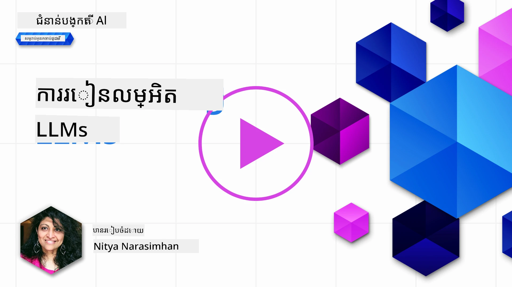
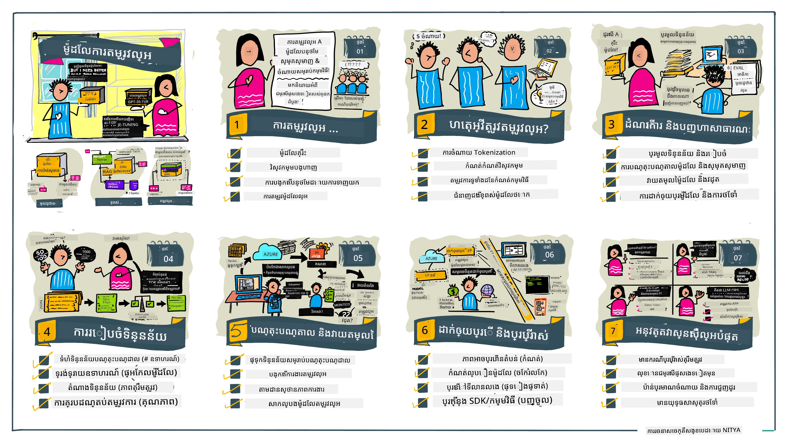

# ការតំណកម៉ូដែលធំរបស់អ្នក

ការប្រើម៉ូដែលភាសាធំដើម្បីសាងសង់កម្មវិធី AI កាន់តែច្នៃប្រឌិតមានបញ្ហាថ្មីៗ។ បញ្ហាសំខាន់មួយគឺការធានាគុណភាពនៃមតិយោបល់ (ភាពត្រឹមត្រូវ និងទាក់ទង) ក្នុងមាតិកាដែលម៉ូដែលបង្កើតសម្រាប់សំណើរបស់អ្នកប្រើប្រាស់មួយ។ នៅក្នុងមេរៀនមុនៗ យើងបានពិភាក្សាអំពីបច្ចេកវិទ្យាដូចជា វិស្វកម្មសំណើ និងការបង្កើតបន្ថែមដោយយកព័ត៌មានវិញ ដែលព្យាយាមដោះស្រាយបញ្ហាសម្រាំងដោយ _កែប្រែការបញ្ចូលសំណើ_ ទៅម៉ូដែលដែលមានរួច។

នៅក្នុងមេរៀនថ្ងៃនេះ យើងនឹងពិភាក្សាអំពីបច្ចេកវិទ្យាទីបី គឺ **ការតំណកម៉ូដែល** ដែលព្យាយាមដោះស្រាយបញ្ហាដោយ _បណ្តុះបណ្តាលម៉ូដែលឡើងវិញ_ ជាមួយទិន្នន័យបន្ថែម។ មកចូលរួមទៅក្នុងព័ត៌មានលម្អិត។

## គោលបំណងរៀន

មេរៀននេះណែនាំគំនិតនៃការតំណកសម្រាប់ម៉ូដែលភាសាដែលបានបណ្តុះបណ្តាលរួចហើយ អាចមើលឃើញអត្ថប្រយោជន៍ និងបញ្ហារបស់វិធីសាស្ត្រនេះ ហើយផ្តល់មគ្គុទេសក៍ពីពេលណា និងរបៀបទៅប្រើការតំណក ដើម្បីធ្វើឲ្យចំណុចរស់រវើកនៃម៉ូដែល AI របស់អ្នកកាន់តែល្អប្រសើរ។

នៅចុងបញ្ចប់មេរៀននេះ អ្នកគួរតែអាចបញ្ជាក់ចម្លើយសំណួរខាងក្រោមបាន៖

- តើការតំណកសម្រាប់ម៉ូដែលភាសាជាអ្វី?
- ពេលណា និងហេតុអ្វីបានជាការតំណកមានប្រយោជន៍?
- តើខ្ញុំអាចតំណកម៉ូដែលដែលបានបណ្តុះបណ្តាលរួចជាថ្មីបានយ៉ាងដូចម្តេច?
- តើមានកម្លាំងចិត្តអ្វីខ្លះក្នុងការតំណក?

ត្រៀមខ្លួនរួចហើយ? យើងចាប់ផ្តើមទៅ។

## មេរៀនរៀបរាប់ដោយរូបភាព

ចង់យល់កាន់តែច្បាស់ពីអ្វីដែលយើងនឹងគ្របដណ្តប់មុនធ្វើការចូលជ្រៅ? សូមមើលមេរៀនរៀបរាប់​នេះដែលពិពណ៌នាដំណើរការរៀនសម្រាប់មេរៀននេះ - ពីការសិក្សាគន្លងគោលនយោបាយ និងមេគោលចំណង់ចំណូលចិត្តក្នុងការតំណក ដល់ការយល់ដឹងដំណើរការនិងអនុវត្តន៍ល្អបំផុតសម្រាប់ការធ្វើការតំណក។ នេះជាប្រធានបទដែលគួរឲ្យចាប់អារម្មណ៍សម្រាប់ការស្វែងយល់ ដូច្នេះកុំភ្លេចមើលទំព័រ [ធនធាន](./RESOURCES.md?WT.mc_id=academic-105485-koreyst) សម្រាប់តំណភ្ជាប់បន្ថែមដើម្បីគាំទ្រដំណើរការរៀនដោយខ្លួនឯងរបស់អ្នក!

## តើការតំណកសម្រាប់ម៉ូដែលភាសាជាអ្វី?

ដោយនិយមន័យ ម៉ូដែលភាសាធំគឺជា _ម៉ូដែលដែលបានបណ្តុះបណ្តាលរួច_ លើចំនួនតំណាងអក្សរទីតាំងច្រើនពីប្រភពផ្សេងៗជារួមមានអ៊ីនធឺណិត។ ដូចដែលយើងបានរៀននៅមេរៀនមុនៗ យើងត្រូវការបច្ចេកវិទ្យាដូចជា _វិស្វកម្មសំណើ_ និង _ការបង្កើតបន្ថែមដោយយកព័ត៌មានវិញ_ ដើម្បីធ្វើឲ្យគុណភាពនៃការឆ្លើយតបរបស់ម៉ូដែលទៅនឹងសំណួររបស់អ្នកប្រើសម្រួលបានល្អ។

បច្ចេកទេសវិស្វកម្មសំណើពេញនិយមមួយជាបញ្ចូលការណែនាំបន្ថែមឲ្យម៉ូដែលអំពីអ្វីដែលគួរត្រូវបានរងចាំក្នុងការឆ្លើយតប ដោយផ្តល់ _ការណែនាំ_ (ការណែនាំច្បាស់លាស់) ឬ_ផ្តល់ឧទាហរណ៍ពីរបី_ (ការណែនាំប៉ុណ្ណោះ)។ វាត្រូវបានហៅថា _ការរៀនពីរបី_ ប៉ុន្តែវាមានកម្លាំងចិត្តពីរមុខគឺ៖

- កំណត់ចំនួនតួអក្សរម៉ូដែលអាចទទួលបាន ប្រែទៅកំណត់ចំនួនឧទាហរណ៍ដែលអ្នកអាចផ្តល់ និងកំណត់ប្រសិទ្ធិភាព។
- ចំណាយតួអក្សររបស់ម៉ូដែលអាចធ្វើឲ្យថ្លៃសូម្បីតែបន្ថែមឧទាហរណ៍ទៅក្នុងសំណើរ​នីមួយៗ ហើយកំណត់ភាពបត់បែន។

ការតំណកគឺជាបច្ចេកទេសទូទៅក្នុងប្រព័ន្ធសិក្សា ម៉ាស៊ីន ដែលយើងយកម៉ូដែលដែលបានបណ្តុះបណ្តាលរួចម្តងហើយ បណ្តុះបណ្តាលឡើងវិញជាមួយទិន្នន័យថ្មី ដើម្បីធ្វើឱ្យវាធ្វើការជាក់លាក់ល្អក្នុងបេសកកម្មជាក់លាក់មួយ។ ក្នុងបរិបទម៉ូដែលភាសា យើងអាចតំណកម៉ូដែលដែលបានបណ្តុះបណ្តាលរួច _ជាមួយជម្រើសឧទាហរណ៍ដែលបានរៀបចំសម្រាប់បេសកកម្មឬដែនការដែលបានកំណត់មួយ_ ដើម្បីបង្កើត **ម៉ូដែលប្ដូរតាមតម្រូវការ** ដែលមានភាពត្រឹមត្រូវ និងទាក់ទងច្រើនសម្រាប់បេសកកម្មឬដែនការនោះ។ អត្ថប្រយោជន៍បន្ថែមមួយនៃការតំណកគឺ វាអាចកាត់បន្ថយចំនួនឧទាហរណ៍ដែលត្រូវការដើម្បីរៀនពីរបី - កាត់បន្ថយការប្រើប្រាស់តួអក្សរនិងចំណាយដែលពាក់ព័ន្ធ។

## ពេលណានិងហេតុអ្វីយើងគួរតែតំណកម៉ូដែល?

នៅក្នុងបរិបទនេះ ពេលពិភាក្សាអំពីការតំណកយើងមានន័យទៅលើ **ការតំណកក្នុងការគ្រប់គ្រង** ដែលការបណ្តុះបណ្តាលឡើងវិញត្រូវបន្ថែមទិន្នន័យថ្មី ដែលមិនមែនជាផ្នែកនៃទិន្នន័យបណ្តុះបណ្តាលដើម។ វាផ្សេងពីវិធីសាស្ត្រតំណកមិនគ្រប់គ្រងដែលម៉ូដែលត្រូវបានបណ្តុះបណ្តាលឡើងវិញលើទិន្នន័យដើម ប៉ុន្តែជាមួយប៉ារ៉ាម៉ែត្រប្រតិបត្តិការផ្សេងៗ។

រឿងសំខាន់មួយដែលត្រូវចងចាំ គឺ ការតំណកគឺជាបច្ចេកទេសកម្រិតខ្ពស់ដែលត្រូវការជំនាញជាក់លាក់ ដើម្បីទទួលបានលទ្ធផលដែលចង់បាន។ ប្រសិនបើធ្វើខុស វាអាចមិនផ្តល់ការកែលម្អដូចដែលរំពឹងទុក ទៅទាំងអាចបន្ថយសមត្ថភាពរបស់ម៉ូដែលសម្រាប់ដែនការគោលដៅរបស់អ្នក។

ដូច្នេះ មុនពេលអ្នករៀនថា "របៀប" តំណកម៉ូដែលភាសា អ្នកត្រូវតែដឹង "ហេតុអ្វី" អ្នកគួរតែជ្រើសរើសវិធីនេះ ហើយ "ពេលណា" ចាប់ផ្តើមដំណើរការតំណក។ ចាប់ផ្តើមដោយសួរខ្លួនឯងសំណួរទាំងនេះ៖

- **ករណីប្រើប្រាស់**៖ តើ _ករណីប្រើប្រាស់_ របស់អ្នកសម្រាប់ការតំណកជាអ្វី? តើអ្វីជាផ្នែកនៃម៉ូដែលដែលបានបណ្តុះបណ្តាលរួចដែលអ្នកចង់កែលម្អ?
- **ជម្រើសផ្សេងទៀត**៖ តើអ្នកបានសាកល្បង _បច្ចេកទេសផ្សេងៗ_ ដើម្បីឈានដល់លទ្ធផលចង់បានហើយឬនៅ? ប្រើវា ដើម្បីបង្កើតមូលដ្ឋានសម្រាប់ការប្រៀបធៀប។
  - វិស្វកម្មសំណើ៖ សាកល្បងបច្ចេកទេសដូចជា few-shot prompting ជាមួយឧទាហរណ៍នៃការឆ្លើយតបដ៏ទាក់ទង។ ប្រមាសគុណភាពនៃការឆ្លើយតប។
  - ការបង្កើតបន្ថែមដោយយកព័ត៌មានវិញ៖ សាកល្បងបន្ថែមសំណើជាមួយលទ្ធផលស្វែងរកដោយស្វែងរកទិន្នន័យ។ ប្រមាសគុណភាពនៃការឆ្លើយតប។
- **ចំណាយ**៖ តើអ្នកបានបញ្ជាក់ចំណាយសម្រាប់ការតំណកឬនៅ?
  - ភាពអាចតំណកបាន - តើម៉ូដែលដែលបានបណ្តុះបណ្តាលរួចអាចតំណកបានឬឥត?
  - ការខិតខំខ្លាំង - សម្រាប់រៀបចំទិន្នន័យបណ្តុះបណ្តាល, វាយតម្លៃ និងកែលម្អម៉ូដែល។
  - ការគណនា - សម្រាប់រត់ការងារតំណក និងចេញផ្សាយម៉ូដែលដែលតំណករួច។
  - ទិន្នន័យ - ការចូលប្រើឧទាហរណ៍ដែលមានគុណភាពគ្រប់គ្រាន់សម្រាប់ប៉ះពាល់តំណក។
- **អត្ថប្រយោជន៍**៖ តើអ្នកបានបញ្ជាក់អត្ថប្រយោជន៍សម្រាប់ការតំណកឬยัง?
  - គុណភាព - តើម៉ូដែលដែលតំណករួចធ្វើល្អជាងមូលដ្ឋានឬដែរ?
  - ចំណាយ - តើវាកាត់បន្ថយការប្រើប្រាស់តួអក្សរដោយធ្វើឲ្យសំណើសាមញ្ញដែរឬទេ?
  - ភាពអាចតំណាងបាន - តើអ្នកអាចប្រើម៉ូដែលមូលដ្ឋានសម្រាប់ដែនថ្មីទៀតបានឬ?

ដោយឆ្លើយសំណួរទាំងនេះ អ្នកគួរតែអាចសំរេចចិត្តបានថា តំណកគឺជាវិធីសាស្ត្រដ៏ត្រឹមត្រូវសម្រាប់ករណីប្រើប្រាស់របស់អ្នកឬទេ។ ដើម្បីឲ្យវិធីសាស្ត្រនេះមានប្រសិទ្ធភាព គួរតែអត្ថប្រយោជន៍មានច្រើនជាងចំណាយ។ ពេលដែលអ្នកសំរេចចិត្តបន្ត វាជាពេលវេលាដើម្បីគិតអំពី _របៀប_ អ្នកអាចតំណកម៉ូដែលដែលបានបណ្តុះបណ្តាលរួច។

ចង់បានចំណេះដឹងលើសពីនេះទៀតអំពីដំណើរការសម្រេចចិត្ត? មើល [តើតំណកឬមិនតំណក](https://www.youtube.com/watch?v=0Jo-z-MFxJs)

## តើយើងអាចតំណកម៉ូដែលដែលបានបណ្តុះបណ្តាលរួចយ៉ាងដូចម្តេច?

ដើម្បីតំណកម៉ូដែលដែលបានបណ្តុះបណ្តាលរួច អ្នកត្រូវការ៖

- ម៉ូដែលដែលបានបណ្តុះបណ្តាលរួចសម្រាប់តំណក
- ឯកសារទិន្នន័យសម្រាប់ប្រើក្នុងការតំណក
- បរិយាកាសបណ្តុះបណ្តាលសម្រាប់រត់ការងារតំណក
- បរិយាកាសផ្ទុកសម្រាប់ចេញផ្សាយម៉ូដែលដែលតំណករួច

## ការតំណកលើ Microsoft Foundry

[Microsoft Foundry](https://ai.azure.com?WT.mc_id=academic-105485-koreyst) ជាទីតាំងដែលអ្នកតំណក ផ្ទុក និងគ្រប់គ្រងម៉ូដែលប្ដូរតាមតម្រូវការនៅលើ Azure នៅថ្ងៃនេះ (វារួមបញ្ចូលអ្វីដែលកាលពីមុនគឺ Azure OpenAI Studio និង Azure AI Studio)។ មុននឹងចាប់ផ្តើមការ ការយល់ដឹងពីជម្រើសដែល Foundry ផ្តល់ជូន និងអនុវត្តន៍ល្អបំផុតដែលវេទិកាណែនាំជួយបានច្រើន។ នៅក្រោម ស្ទាន Foundry ប្រើប្រាស់ **LoRA (low-rank adaptation)** ដើម្បីតំណកម៉ូដែលបានយ៉ាងមានប្រសិទ្ធភាព ដែលធ្វើឲ្យការបណ្តុះបណ្តាលរហ័ស និងថ្លៃថយជាងការបណ្តុះបណ្តាលទំងន់ទាំងអស់ឡើងវិញ។

### ជំហាន ១៖ ជ្រើសរើសបច្ចេកទេសបណ្តុះបណ្តាល

Foundry គាំទ្របច្ចេកទេសតំណកបីប្រភេទ។ **ចាប់ផ្តើមជាមួយ SFT** - វគ្របដណ្តប់លើសេណារីយ៉ូមធំពេញលេញ។

| បច្ចេកទេស | អ្វីដែលវាធ្វើ | ពេលណាចុះប្រើវា |
| --- | --- | --- |
| **ការតំណកតាមការគ្រប់គ្រង (SFT)** | បណ្តុះបណ្តាលលើគូឧទាហរណ៍បញ្ចូល/ចេញ ដែលធ្វើឲ្យម៉ូដែលរៀនបង្កើតចំលើយដែលអ្នកចង់បាន។ | ជាលំនាំដើមសម្រាប់ភារកិច្ចភាគច្រើន៖ ការជំនាញដែន, សមត្ថភាពភារកិច្ច, ស្ទីល និងសូរិយា, ជាប់បន្តាប្រកបដោយសេចក្តីណែនាំ និងអាដាប់តង់ភាសា។ |
| **ការបង្កើតចំណាប់អារម្មណ៍ផ្ទាល់ (DPO)** | រៀនពីគូចំលើយដែលចូលចិត្ត និងមិនចូលចិត្ត ដើម្បីធ្វើឲ្យចេញផ្សាយសម្រួលនឹងចំណូលចិត្តមនុស្ស។ | កែលម្អគុណភាពចំលើយ, សុវត្ថិភាព និងការតម្រូវពេលមានមតិប្រៀបធៀប។ |
| **ការតំណកដោយការលើកទឹកចិត្ត (RFT)** | ប្រើសញ្ញារង្វាន់ពី _អ្នកវាយតម្លៃ_ ដើម្បីបង្កើនអាកប្បកិរិយាប្រកបដោយហានិភ័យជាមួយការសិក្សាឡើងវិញតាមលក្ខណៈលើកទឹកចិត្ត។ | ដែនចំលើយគោលគំនិតជ្រៅ (គណិតវិទ្យា, ជីមីវិទ្យា, រូបវិទ្យា) ដែលមានលទ្ធផលត្រឹមត្រូវ/មិនត្រឹមត្រូវច្បាស់លាស់។ តម្រូវជំនាញ ML ខ្ពស់ជាងមុន។ |

### ជំហាន ២៖ ជ្រើសរើសថ្នាក់បណ្តុះបណ្តាល

Foundry អនុញ្ញាតឲ្យអ្នកជ្រើសរើសរបៀប និងទីតាំងរត់ការបណ្តុះបណ្តាល៖

- **ស្តង់ដារអ្នកប្រើដែន** - បណ្តុះបណ្តាលនៅតំបន់ធនធានរបស់អ្នក ហើយធានាបានពីទីតាំងទិន្នន័យ។ ប្រើពេលដែលទិន្នន័យត្រូវស្នាក់នៅក្នុងតំបន់ជាក់លាក់ទេ។
- **ពិភពលោក** - ថវិកា និងលឿន កាត់បន្ថយពេលរងចាំ ដោយប្រើបរិមាណក្បាលក្រៅតំបន់របស់អ្នក (ទិន្នន័យ និងទំងន់បានចម្លងទៅតំបន់បណ្តុះបណ្តាល)។ ជាលំនាំល្អ ប្រើពេលដែលមិនមានទាមទារតំបន់ទិន្នន័យ។
- **អ្នកអភិវឌ្ឍន៍** - ថ្លៃបាតប៉ោងទាបបំផុត ប្រើសមត្ថភាពដែលមិនបានប្រើប្រាស់ដោយគ្មានការធានាល្បឿន/សេវាកម្ម SLA (ការងារអាចត្រូវបានកាត់ចោល និងបន្តឲ្យបាន)។ ល្អសម្រាប់សាកល្បង។

### ជំហាន ៣៖ ជ្រើសម៉ូដែលមួយ

ម៉ូដែលដែលអាចតំណករួមមាន OpenAI `gpt-4o-mini`, `gpt-4o`, `gpt-4.1`, `gpt-4.1-mini`, និង `gpt-4.1-nano` (SFT; គ្រួសារ 4o/4.1 ក៏គាំទ្រ DPO), ម៉ូដែលហេតុផល `o4-mini` និង `gpt-5` (RFT), និងម៉ូដែលប្រភពទូលំទូលាយដូចជា `Ministral-3B`, `Qwen-32B`, `Llama-3.3-70B-Instruct`, និង `gpt-oss-20b` (SFT លើធនធាន Foundry)។ តែងតែពិនិត្យមើលបញ្ជី [ម៉ូដែលតំណក](https://learn.microsoft.com/azure/ai-foundry/foundry-models/concepts/models-sold-directly-by-azure?WT.mc_id=academic-105485-koreyst#fine-tuning-models) បច្ចុប្បន្នសម្រាប់វិធីសាស្ត្រគាំទ្រ តំបន់ និងភាពជាស្រេចប្រើប្រាស់។

> Foundry ផ្តល់ជូនពីរបែប៖ **serverless** (ថ្លៃដើមដោយការប្រើប្រាស់ មិនចាំបាច់គ្រប់គ្រងកំណត់ GPU, ម៉ូដែល OpenAI និងជ្រើសរើស) និង **managed compute** (នាំយក VM ផ្ទាល់ខ្លួនតាមរយៈ Azure Machine Learning សម្រាប់ជួរម៉ូដែលធំជាងគេ)។ ភាគច្រើនមនុស្សគួរចាប់ផ្តើមជាមួយ serverless។

### អនុវត្តបែបល្អនៅ Foundry

- **ចាប់ផ្តើមពីមូលដ្ឋាន។** វាស់ម៉ូដែលមូលដ្ឋានជាមួយវិស្វកម្មសំណើ និង RAG _មុន_ តំណក ដើម្បីបង្ហាញការកែលម្អ។
- **ចាប់ផ្តើមតិចបន្ទាប់មកពង្រីក។** ចាប់ផ្តើមជាមួយ ៥០-១០០ ឧទាហរណ៍គុណភាពខ្ពស់ ដើម្បីបញ្ជាក់វិធីសាស្ត្រ បន្ទាប់ចំណេញដល់ ៥០០+ សម្រាប់ផលិតកម្ម។ គុណភាពសំខាន់ជាងបរិមាណ - ដកឧទាហរណ៍ដែលគុណភាពទាប។
- **រៀបចំទិន្នន័យត្រឹមត្រូវ។** ឯកសារបណ្តុះបណ្តាល និងផ្ទៀងផ្ទាត់ត្រូវជាទ្រង់ទ្រាយ JSONL, UTF-8 **ជាមួយ BOM**, មិនលើស ៥១២ មេកាបៃ, ប្រើរូបមន្តសារ chat-completions។ តែងតែមានឯកសារត្រួតពិនិត្យគុណភាព ដើម្បីត្រួតពិនិត្យមើលការរឹងប៉ិនពេក។
- **រក្សាសារ prompt ប្រព័ន្ធនៅពេលដំណើរការ inference។** ប្រើសារព្រមានដូចគ្នា ខណៈពេលហៅម៉ូដែលដូចដែលបានប្រើក្នុងការបណ្តុះបណ្តាល។
- **វាយតម្លៃកន្លែងផ្អែក - មិនត្រូវបំបែកចេញទៅចោលកន្លែងចុងក្រោយ។** Foundry រក្សាកន្លែងផ្អែកបញ្ចប់បីចុងក្រោយសម្រាប់ចេញផ្សាយ; ជ្រើសកន្លែងដែលធ្វើបានល្អបំផុតតាមការត្រួតពិនិត្យ `train_loss` / `valid_loss` និងភាពត្រឹមត្រូវតួអក្សរ។
- **វាស់ចំណាយតួអក្សររួមជាមួយគុណភាព** នៅពេលប្រៀបធៀបម៉ូដែលតំណកនិងមូលដ្ឋាន។
- **ធ្វើដំណើរការដោយបន្តទៅវិញទៅមកជាមួយ Fine-Tuning រហូតបន្ត** អ្នកអាចតំណកម៉ូដែលដែលបានតំណករួចលើទិន្នន័យថ្មី (គាំទ្រ OpenAI)។
- **ផ្តល់ចំណាយផ្នែកផ្ទុកមេត្តា។** ម៉ូដែលដែលបានប្ដូរត្រូវគិតថ្លៃរៀងរាល់ម៉ោង ហើយការផ្ទុកដែលមិនប្រើប្រាស់នឹងត្រូវលុបបាត់បន្ទាប់ពី ១៥ ថ្ងៃ - សម្អាតអ្វីដែលអ្នកមិនត្រូវការ។

ធ្វើការតាមដំណើរការពេញលេញនៅក្នុង [ប្ដូរតាមតម្រូវការម៉ូដែលជាមួយការតំណក](https://learn.microsoft.com/azure/ai-foundry/openai/how-to/fine-tuning?WT.mc_id=academic-105485-koreyst) ហើយមើលមេរៀនសម្រាប់ [DPO](https://learn.microsoft.com/azure/ai-foundry/openai/how-to/fine-tuning-direct-preference-optimization?WT.mc_id=academic-105485-koreyst) និង [RFT](https://learn.microsoft.com/azure/ai-foundry/openai/how-to/reinforcement-fine-tuning?WT.mc_id=academic-105485-koreyst) នៅពេលអ្នកត្រៀមខ្លួនសម្រាប់បច្ចេកវិទ្យាផ្សេងទៀត។

## ការតំណកក្នុងអំពើការពិត

ឯកសារខាងក្រោមផ្តល់ជូនមេរៀនជំហានតាមជំហានដែលនាំអ្នកឆ្លងកាត់ឧទាហរណ៍ពិតមួយលើម៉ូដែលដែលគាំទ្របច្ចុប្បន្នជាមួយឯកសារទិន្នន័យដែលបានរៀបចំ។ ដើម្បីធ្វើវា អ្នកត្រូវការជួរដេវីសពីអ្នកផ្គត់ផ្គង់ជាក់លាក់ ព្រមទាំងចូលប្រើម៉ូដែល និងឯកសារទិន្នន័យពាក់ព័ន្ធ។

| អ្នកផ្គត់ផ្គង់ | មេរៀន                                                                                                                                                                  | ពិពណ៌នា                                                                                                                                                                                                                                                                                                                                                                                                                                |
| ------------ | -------------------------------------------------------------------------------------------------------------------------------------------------------------------------- | ------------------------------------------------------------------------------------------------------------------------------------------------------------------------------------------------------------------------------------------------------------------------------------------------------------------------------------------------------------------------------------------------------------------------------------ |
| OpenAI       | [របៀបតំណកម៉ូដែលចាត់កិច្ចសន្ទនា](https://github.com/openai/openai-cookbook/blob/main/examples/How_to_finetune_chat_models.ipynb?WT.mc_id=academic-105485-koreyst)        | រៀនធ្វើការតំណកម៉ូដែលសន្ទនាថ្មីចុងក្រោយ OpenAI សម្រាប់ដែនការពិសេសមួយ ("ជំនួយឱ្យធ្វើម្ហូប") ដោយរៀបចំទិន្នន័យបណ្តុះបណ្តាល ដំណើរការការងារតំណក និងប្រើម៉ូដែលដែលតំណករួចសម្រាប់ធ្វើការប្រៀបធៀប។                                                                                                                                                                                                                                                                          |
| Microsoft Foundry | [ប្ដូរតាមតម្រូវការម៉ូដែលជាមួយការតំណក](https://learn.microsoft.com/azure/ai-foundry/openai/tutorials/fine-tune?WT.mc_id=academic-105485-koreyst)                           | រៀនតំណកម៉ូដែលដែលគាំទ្របច្ចុប្បន្ន ដូចជា `gpt-4.1-mini` **លើ Azure** ជាមួយ Microsoft Foundry៖ រៀបចំ និងផ្ទុកទិន្នន័យបណ្តុះបណ្តាល និងផ្ទៀងផ្ទាត់ ដំណើរការការងារតំណក បន្ទាប់មកចេញផ្សាយ និងប្រើម៉ូដែលថ្មី។                                                                                                                                                                                                                                                                                      |
| Hugging Face | [ការកែប្រែ LLMs ជាមួយ Hugging Face](https://www.philschmid.de/fine-tune-llms-in-2024-with-trl?WT.mc_id=academic-105485-koreyst)                                               | ប្លុកផុសនេះដើរតួអ្នកក្នុងការកែប្រែ _open LLM_ (ឧ៖ `CodeLlama 7B`) ដោយប្រើប្រាស់បណ្ណាល័យ [transformers](https://huggingface.co/docs/transformers/index?WT.mc_id=academic-105485-koreyst) និង [Transformer Reinforcement Learning (TRL)](https://huggingface.co/docs/trl/index?WT.mc_id=academic-105485-koreyst) ជាមួយ [datasets](https://huggingface.co/docs/datasets/index?WT.mc_id=academic-105485-koreyst) បើកនៅលើ Hugging Face។ |
|              |                                                                                                                                                                                |                                                                                                                                                                                                                                                                                                                                                                                                                                    |
| 🤗 AutoTrain | [ការកែប្រែ LLMs ជាមួយ AutoTrain](https://github.com/huggingface/autotrain-advanced/?WT.mc_id=academic-105485-koreyst)                                                         | AutoTrain (ឬ AutoTrain Advanced) គឺជាបណ្ណាល័យ python ដែលបង្កើតដោយ Hugging Face ដែលអនុញ្ញាតឲ្យធ្វើការកែប្រែសម្រាប់ភារកិច្ចច្រើនផ្សេងៗ រួមមានកែប្រែ LLM។ AutoTrain គឺជាដំណោះស្រាយគ្មានកូដ ហើយការកែប្រែអាចធ្វើបាននៅក្នុងពពករបស់អ្នកផ្ទាល់ អ្នកអាចប្រើនៅលើ Hugging Face Spaces ឬក្នុងដែនស្រុក។ វាបង្ហាញ GUI ប្រជុំវេបសាយ CLI និងការបណ្តុះបណ្តាលតាមឯកសារ yaml។                                                                               |
|              |                                                                                                                                                                                |                                                                                                                                                                                                                                                                                                                                                                                                                                    |
| 🦥 Unsloth | [ការកែប្រែ LLMs ជាមួយ Unsloth](https://github.com/unslothai/unsloth?WT.mc_id=academic-105485-koreyst)                                                         | Unsloth គឺជាគ្រប់គ្រងកូដបើក ដែលគាំទ្រការកែប្រែ LLM និងការរៀនបន្ថែមតាមវិធីប្រើប្រាស់ (RL)។ Unsloth ធ្វើឲ្យការបណ្តុះបណ្តាលក្នុងដែនស្រុក ការវាយតម្លៃ និងការចែកចាយរលូន ជាមួយ [notebooks](https://github.com/unslothai/notebooks?WT.mc_id=academic-105485-koreyst) ដែលបានរៀបចំរួច។ វាក៏គាំទ្រម៉ូដែល text-to-speech (TTS), BERT និងម៉ូដែលមុខងារច្រើនផងដែរ។ ដើម្បីចាប់ផ្តើម សូមអាន [មគ្គុទេសក៍ កែប្រែ LLMs](https://docs.unsloth.ai/get-started/fine-tuning-llms-guide) ជាដំណាក់កាល។                                                                          |
|              |                                                                                                                                                                                |                                                                                                                                                                                                                                                                                                                                                                                                                                    |
## ការប្រឡង

ជ្រើសរើសមួយក្នុងចំណោមមេរៀនខាងលើ ហើយដើរតួតាមវា។ _យើងអាចចម្លងជាគំរូនៃមេរៀនទាំងនេះក្នុង Jupyter Notebooks នៅក្នុងរ៉េបូនេះសម្រាប់យោងតែប៉ុណ្ណោះ។ សូមប្រើប្រភពដើមដោយផ្ទាល់សម្រាប់ទទួលបានជំនាន់ថ្មីៗបំផុត_។

## ការងារល្អ! ត្រូវបន្តការសិក្សារ។

បន្ទាប់ពីបញ្ចប់មេរៀននេះ សូមពិនិត្យមើល [ប្រមូលផ្តុំការសិក្សា Generative AI](https://aka.ms/genai-collection?WT.mc_id=academic-105485-koreyst) របស់យើងដើម្បីបន្តបង្កើនចំណេះដឹង Generative AI របស់អ្នក!

សូមអបអរសាទរ!! អ្នកបានបញ្ចប់មេរៀនចុងក្រោយពីស៊េរី v2 សម្រាប់វគ្គនេះ! កុំបញ្ឈប់ការសិក្សា និងការសាងសង់។ \*\*សូមពិនិត្យមើលទំព័រ [ធនធាន](RESOURCES.md?WT.mc_id=academic-105485-koreyst) សម្រាប់បញ្ជីនៃសំណើរបន្ថែមសម្រាប់ប្រធានបទនេះ។

ស៊េរីមេរៀន v1 របស់យើងក៏ត្រូវបានធ្វើបច្ចុប្បន្នភាពផងដែរ ជាមួយនឹងការប្រឡង និងមេរៀនថ្មីៗ។ ដូច្នេះសូមចំណាយពេលបន្តិចដើម្បីធ្វើបន្ទាន់ចំណេះដឹងរបស់អ្នក - ហើយសូម [ចែករំលែកសំណួរនិងមតិយោបល់](https://github.com/microsoft/generative-ai-for-beginners/issues?WT.mc_id=academic-105485-koreyst) ដើម្បីជួយយើងធ្វើឲ្យមេរៀនទាំងនេះប្រសើរឡើងសម្រាប់សហគមន៍។

---

<!-- CO-OP TRANSLATOR DISCLAIMER START -->
**ការបដិសេធ**:
ឯកសារនេះត្រូវបានបម្លែងភាសា ដោយប្រើសេវាបម្លែងភាសា AI [Co-op Translator](https://github.com/Azure/co-op-translator)។ ទោះយើងខ្ញុំមានក្តីប្រាថ្នាឱ្យបានច្បាស់លាស់ តែសូមយល់ដឹងថាការបម្លែងដោយស្វ័យប្រវត្តិក៏អាចមានកំហុសឬភាពមិនត្រឹមត្រូវ។ ឯកសារដើមជាភាសាទីតាំងគួរត្រូវបានគេប្រើជាប្រភពច្បាស់លាស់។ សម្រាប់ព័ត៌មានសំខាន់ៗ សូមណែនាំឱ្យប្រើប្រាស់ការប្រែដោយមនុស្សជំនាញ។ យើងខ្ញុំមិនទទួលខុសត្រូវចំពោះការយល់ច្រឡំ ឬការបកស្រាយខុសបន្ទាប់ពីការប្រើប្រាស់ការបម្លែងនេះនោះទេ។
<!-- CO-OP TRANSLATOR DISCLAIMER END -->