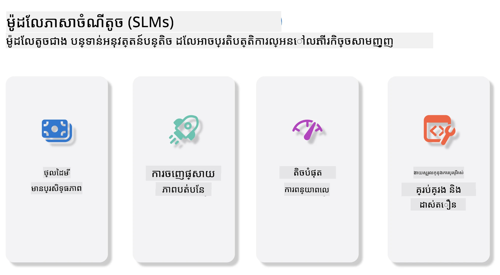
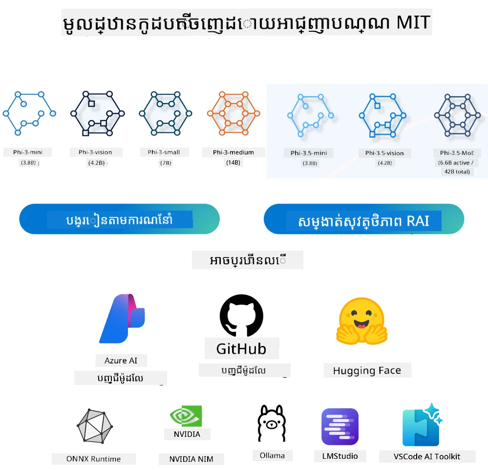
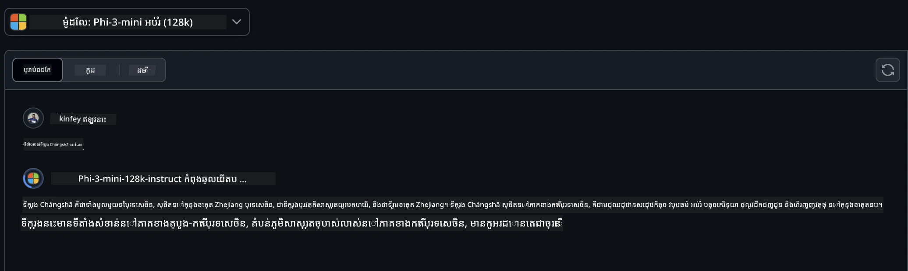
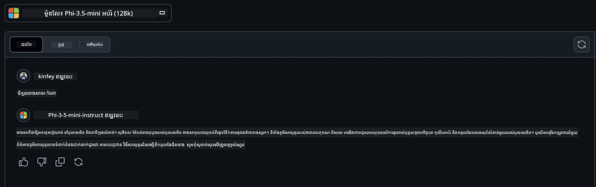

# បំណើតមួយទៅគំរូភាសាតូចសម្រាប់ AI បង្កើតសម្រាប់អ្នកចាប់ផ្តើម  
AI បង្កើតគឺជាវិស័យមួយដ៏គួរឱ្យចាប់អារម្មណ៍នៃបញ្ញាធិប្បាយ ដែលផ្ដោតទៅលើការបង្កើតប្រព័ន្ធដែលអាចបង្កើតមាតិកាថ្មី។ មាតិកានេះអាចជារបស់អត្ថបទ និងរូបភាព រហូតដល់តន្ត្រី និងបរិយាកាសវីរុសទាំងមូល។ ការប្រើប្រាស់ដ៏គួរឱ្យរំភើបបំផុតនៃ AI បង្កើតគឺនៅក្នុងដែនគំរូភាសា។  

## គំរូភាសាតូចមានអ្វីខ្លះ?  
គំរូភាសាតូច (SLM) ជាប្រភេទគំរូភាសាបន្ថយទំហំពីគំរូភាសាធំ (LLM) ដោយប្រើប្រាស់គោលការណ៍ស្ថាបត្យកម្ម និងបច្ចេកទេសជាច្រើនពី LLM ខណៈពេលបង្ហាញពីការកាត់បន្ថយកំណត់ចំណាំគណនាមួយយ៉ាងច្រើន។  

SLMs គឺជាផ្នែកមួយនៃគំរូភាសាដែលរចនាឡើងដើម្បីបង្កើតអត្ថបទនៅស្អាតដូចមនុស្ស។ មិនដូចគំរូធំនៅពេលខ្លះដូចជារ GPT-4, SLM មានទំហំនិងប្រសិទ្ធភាពតូចជាង ធ្វើឱ្យវាសមរម្យសម្រាប់កម្មវិធីដែលមានកំណត់ធនធានគណនា។ ទោះបីសូចមកមិនមានទំហំពេញ ក៏វាក៏អាចអនុវត្តភារកិច្ចច្រើនបាន។ ជាទូទៅ SLMs ត្រូវបានបង្កើតដោយការបង្ហាប់ ឬបង្ហាញផ្តាច់ LLM ដើម្បីរក្សាការប្រតិបត្តិការនិងសមត្ថភាពភាសាដើម។ ការកាត់បន្ថយទំហំគំរូនេះបន្ថយសំណុំនៃភាពស្មុគស្មាញ ធ្វើឱ្យ SLM មានប្រសិទ្ធភាពបន្ថែមទាំងក្នុងការប្រើប្រាស់អង្គចងចាំនិងតម្រូវការ​គណនា។ ទោះបីមានកំណត់ទាំងនេះ SLMs រក្សាទុកសមត្ថភាពក្នុងការបម្រើភារកិច្ចកាន់តែច្រើនក្នុងដែនកំណត់អភិបាលភាសាធម្មជាតិ (NLP)៖  

- បង្កើតអត្ថបទ៖ បង្កើតប្រយោគ ឬវង់កថាណាមួយដែលមានផាសុកភាពនិងសមស្របរបៀបផ្ទាល់ខ្លួន។  
- បញ្ចប់អត្ថបទ៖ ព្យាករណ៍និងបញ្ចប់ប្រយោគមួយដោយផ្អែកលើប្រធានបទដែលបានផ្ដល់។  
- បកប្រែ៖ បម្លែងអត្ថបទពីភាសាមួយទៅភាសាផ្សេង។  
- សង្ខេប៖ តួអត្ថបទវែងជាសង្ខេបខ្លីៗស្រួលយល់។  

ទោះជានឹងមានការប្តូរខ្លះនៅលើប្រសិទ្ធភាព ឬជ្រៅចំណេះដឹង ប្រៀបធៀបនឹងគំរូធំៗ។  

## គំរូភាសាតូចធ្វើការយ៉ាងដូចម្តេច?  
SLMs ត្រូវបានហ្វឹកហាត់លើទិន្នន័យអត្ថបទយ៉ាងច្រើន។ ក្នុងរយៈពេលហ្វឹកហាត់ សព្វថ្ងៃពួកវាសិក្សាគំរូនិងរចនាសម្ព័ន្ធភាសា ដែលធ្វើឱ្យពួកវាអាចបង្កើតអត្ថបទដែល លំដាប់គ្រប់គ្រាន់និងសមស្របចំពោះបរិបទ។ ដំណើរការហ្វឹកហាត់រួមមាន៖  

- ការប្រមូលទិន្នន័យ៖ ប្រមូលទិន្នន័យអត្ថបទធំៗពីប្រភពផ្សេងៗ។  
- ការរៀបចំទិន្នន័យ៖ សំអាតនិងរៀបចំទិន្នន័យឱ្យស មស្របសម្រាប់ការហ្វឹកហាត់។  
- ការហ្វឹកហាត់៖ ប្រើសូម្បីាការសិក្សាម៉ាស៊ីនដើម្បីបង្រៀនគំរូពីរបៀបឲ្យយល់និងបង្កើតអត្ថបទ។  
- ការតម្រៀបបន្ថែម៖ កែសម្រួលគំរូឱ្យប្រសើរឡើងលើភារកិច្ចជាក់លាក់។  

ការអភិវឌ្ឍ SLM ស្របទៅនឹងតម្រូវការ ចំពោះគំរូដែលអាចប្រើនៅក្នុងបរិយាកាសមានកំណត់ធនធាន ដូចជាឧបករណ៍ចល័ត ឬវេទិកាគណនារង្វិល ដែល LLM ទំហំពេញគួរឱ្យមានការលំបាកព្រោះតម្រូវការថាមពលខ្ពស់។ ដោយផ្ដោតលើប្រសិទ្ធភាព SLM បម្រែបម្រួលរវាងប្រសិទ្ធភាពនិងភាពងាយស្រួលប្រើប្រាស់ បង្កើតឱ្យមានការអនុវត្តបានទូលំទូលាយក្នុងដែនផ្សេងៗ។  

  

## គោលបំណងសិក្សា  

ក្នុងមេរៀននេះ យើងសង្ឃឹមណែនាំចំណេះដឹងអំពី SLM និងភ្ជាប់វាជាមួយ Microsoft Phi-3 ដើម្បីរៀនពីសហគ្រាសផ្សេងៗក្នុងមាតិកា អត្ថបទ ពិចារណា និង MoE។  

នៅចុងមេរៀននេះ អ្នកគួរតែអាចឆ្លើយសំណួរខាងក្រោមបាន៖  

- តើ SLM ជាអ្វី?  
- តើខ្លូនខុសគ្នាអ្វីក្នុងចំណោម SLM និង LLM?  
- តើ Microsoft Phi-3 / 3.5 គឺជាអ្វី?  
- តើធ្វើដូចម្តេចដើម្បីបើកដំណើរការនៃ Microsoft Phi-3 / 3.5?  

រួចរាល់ហើយ? ចាប់ផ្ដើមផ្លូវ។  

## ចំណាត់ថ្នាក់រវាងគំរូភាសាធំ (LLMs) និង គំរូភាសាតូច (SLMs)  

ទាំង LLM និង SLM ត្រូវបានកសាងលើគ្រឹះគំនិតសិក្សាម៉ាស៊ីនប៉្រូបាបាដិច ជាមួយវិធីសាស្ត្រដូចគ្នានៅក្នុងការរចនាស្ថាបត្យកម្ម វិធីសាស្ត្រហ្វឹកហាត់ ដំណើរការបង្កើតទិន្នន័យ និងបរិយាយគំរូ។ ទោះជាយ៉ាងណា មានកត្តាសំខាន់ជាច្រើនដែលបំបែកពីគ្នារវាងគំរូទាំងពីរ។  

## ការអនុវត្តន៍របស់គំរូភាសាតូច  

SLMs មានប្រើប្រាស់ជាច្រើនដូចជា៖  

- Chatbots៖ ផ្តល់ការគាំទ្រអតិថិជន និងសន្ទនាជាមួយអ្នកប្រើដោយរបៀបជាសន្ទនា។  
- ការបង្កើតមាតិកា៖ ជំនួយអ្នកសរសេរដោយបង្កើតគំនិតឬសេចក្តីរាយការណ៍ពេញមួយអត្ថបទ។  
- ការអប់រំ៖ ជួយសិស្សក្នុងការសរសេរបទបញ្ជា ឬរៀនភាសាថ្មី។  
- ភាពងាយស្រួលចូលប្រើ៖ បង្កើតឧបករណ៍សម្រាប់មនុស្សពិការជាដូចម៉ាស៊ីនបម្លែងអត្ថបទទៅសំឡេង។  

**ទំហំ**  

កត្តាដ៏សំខាន់ចម្បងដែលបំបែក LLM និង SLM គឺទំហំគំរូ។ LLM ដូចជា ChatGPT (GPT-4) មានប្រហែល 1.76 ត្រីលៀនប៉ារ៉ាម៉ែត្រ ខណៈដែល SLM ប្រភេទបើកចំហដូចជា Mistral 7B ត្រូវរចនាទំហំប៉ារ៉ាម៉ែត្រតិចជាងខ្លះ — ប្រហែល 7 ប៊ីលៀន។ ភាពខុសគ្នានេះគឺដោយសារការរចនាស្ថាបត្យកម្មនិងដំណើរការហ្វឹកហាត់។ ប្រសិនបើ ChatGPT ប្រើមេកានិចការយកចិត្តទុកដាក់ខ្លួនក្នុងស៊ុមឧបករណ៍ម៉ូឌែល encoder-decoder ផ្ទាល់ ខណៈ Mistral 7B ប្រើការយកចិត្តទុកដាក់ប្រភេទបើកប្រើបង្ហាប់ដែលអាចហ្វឹកហាត់បានប្រសើរជាងក្នុងស៊ុមម៉ូឌែល decoder តែប៉ុណ្ណោះ។ ស្ថាបត្យកម្មផ្សេងៗនេះមានឥទ្ធិពលខ្លាំងលើសំណុំនិងការប្រតិបត្តិរបស់គំរូ។  

**ការយល់ដឹង**  

SLMs ត្រូវបានបង្កើតដោយផ្តោតលើការអនុវត្តល្អក្នុងដែនជាក់លាក់ៗ បង្កើតឲ្យជា បច្ចេកទេសខ្ពស់ ប៉ុន្តែមានកំណត់ក្នុងការផ្តល់ការយល់ដឹងផ្ទៃកំហិតលើដែនចំណេះដឹងជាច្រើន។ ផ្ទៃមុខវិញ LLMs ប្រាថ្នាចង់ចម្លងបញ្ញាដូចមនុស្សនៅលើកម្រិតទូលំទូលាយ។ បានហ្វឹកហាត់លើទិន្នន័យធំ និងចម្រុះ LLM ត្រូវរចនាឲ្យអាចអនុវត្តបានល្អក្នុងដែនខុសៗគ្នា ផ្តល់ភាពបត់បែនខ្ពស់ និងអាចយកទៅប្រើបានច្រើន។ ដូច្នេះ LLM សមស្របសម្រាប់ការអនុវត្តលើភារកិច្ចច្រើនដូចជាការបញ្ចូលភាសាធម្មជាតិ និងកម្មវិធីផ្តល់ព័ត៌មាន។  

**គណនា**  

ការហ្វឹកហាត់ និងដាក់បង្ហាញ LLM ជាពិសេសប្រើធនធានគណនាខ្ពស់ ជាទូទៅត្រូវការទាសសantaged GPU ទំហំធំ។ ឧទាហរណ៍ ការហ្វឹក ChatGPT ពីដើមអាចត្រូវប្រើប្រាស់ GPU ពីរាប់ពាន់ខ្សែពេលវេលាយូរ។ ផ្ទុយទៅវិញ SLM, ដោយប៉ារ៉ាម៉ែត្រតិចជាង ត្រូវបានចូលចិត្តនៅក្នុងការទិញប្រាស់ធនធានគណនា។ គំរូដូចជា Mistral 7B អាចហ្វឹកហាត់និងដំណើរការនៅលើម៉ាស៊ីនក្នុងស្រុកដែលមានសមត្ថភាព GPU មធ្យម បើទោះបីហ្វឹកហាត់ក៏នៅតែត្រូវការពេលប៉ុន្មានម៉ោងលើ GPU ច្រើន។  

**ពិន័យជម្រុញ**  

ពិន័យជម្រុញគឺជាបញ្ហារបស់អំពើ LLM ដែលបានកើតឡើងពីប្រភពទិន្នន័យហ្វឹកហាត់។ គំរូទាំងនេះភាគច្រើនមានឥតគិតថ្លៃ និងមានទីតាំងលើអ៊ិនធឺណិតដែលមិនត្រូវបានតំណាងឬតំណាងមិនត្រឹមត្រូវលើក្រុមមនុស្សខ្លះ បញ្ចូលការសម្គាល់ខុស ឬបញ្ចូលពិន័យភាសាដោយផ្អែកលើភាសាជាតិ ភូមិសាស្ត្រផល្លាយ និងច្បាប់វេយ្យាករណ៍។ លើសពីនេះ ស្ថាបត្យកម្មដ៏ស្មុគស្មាញរបស់ LLM អាចបង្កើតពិន័យជម្រុញកាន់តែខ្លាំង ដែលប្រហែលមិនបង្ហាញច្បាស់ដោយគ្មានការតម្រៀបយ៉ាងច្បាស់។ ផ្ទុយទៅវិញ SLM, ដែលហ្វឹកហាត់លើទិន្នន័យដែនជាក់លាក់ ធម្មតាគឺភាគតិចនៃការប៉ះពាល់ពីពិន័យទាំងនេះ ទោះបីមិនបានប្រាកដទាំងសោះ។  

**ការបញ្ចេញសេចក្តីសន្និដ្ឋាន**  

ទំហំកាត់បន្ថយរបស់ SLM ផ្តល់អាទិភាពយ៉ាងខ្លាំងនៅលើល្បឿនបញ្ចេញសេវា, អនុញ្ញាតឱ្យបង្កើតលទ្ធផលដោយប្រសិទ្ធភាពលើរឹងកុំព្យូទ័រផ្ទាល់ដោយគ្មានការប្រើប្រាស់បរិមាណគណនាដែលច្រើន។ ផ្ទុយពីនេះ LLM ដែលមានទំហំ និងស្មុគស្មាញខ្លាំង ជាទូទៅត្រូវការបរិមាណគណនាច្រើននៅព្រំដែនស្របភាគច្រើនដើម្បីទទួលបានល្បឿនបញ្ចេញដែលទទួលយកបាន។ ការមានអ្នកប្រើប្រាស់រាប់នាក់ស្ថិតក្នុងពេលតែមួយ ចាប់ផ្សារទាំងមូលការឆ្លើយតបដោយ LLM ធ្វើឲ្យវាលឿនយឺតចុះ ពិសេសនៅពេលនាំចេញជាច្រើន។  

ដោយសងបញ្ជាក់ ទោះបី LLM និង SLM មានមូលដ្ឋាននៃការសិក្សាម៉ាស៊ីនដូចគ្នា បែបប្រតិបត្តិ ក៏ពួកវាក៏ខុសគ្នាទៅយ៉ាងខ្លាំងនៅលើទំហំគំរូ តម្រូវការគណនា ការយល់ដឹង ភាពងាយទទួលរងពិន័យ និងល្បឿនថយចេញ។ ការបែងចែកទាំងនេះបង្ហាញពីភាពសមរម្យរបស់ពួកវាសម្រាប់ការប្រើប្រាស់ផ្សេងៗគ្នា ជាមួយ LLM ដែលមានភាពច្រើនជាងប៉ុន្តែតម្រូវការថាមពលខ្ពស់ និង SLM ដែលផ្តល់ភាពមានប្រសិទ្ធភាពក្នុងដែនជាក់លាក់ប៉ុណ្ណោះដោយតម្រូវការគណនាតិច។  

***ចំណាំ៖ នៅក្នុងមេរៀននេះ យើងនឹងណែនាំ SLM ដោយប្រើ Microsoft Phi-3 / 3.5 ជាឧទាហរណ៍។***  

## បណ្ដាភាព Phi-3 / Phi-3.5  

Phi-3 / 3.5 Family ផ្តោតទៅលើការអនុវត្តក្នុងអត្ថបទ, វិចិត្រ, និងភាគីជំនួយ (MoE)៖  

### Phi-3 / 3.5 Instruct  

ផ្តោតទៅលើការបង្កើតអត្ថបទ ការបញ្ចប់សន្ទនា និងដកយកព័ត៌មានមាតិកា។  

**Phi-3-mini**  

គំរូភាសា 3.8B មានជំនួយនៅ Microsoft Azure AI Studio, Hugging Face, និង Ollama។ គំរូ Phi-3 មានលទ្ធផលល្អជាងគំរូភាសាត្រូវទំហំស្មើរឬធំជាង នៅលើវិមាត្រសាកល្បងសំខាន់ (មើលលេខវិមត្រខាងក្រោម, លេខខ្ពស់កាន់តែប្រសើរ)។ Phi-3-mini ល្អជាងគំរូដែលមានទំហំនិងគុណភាពដូចគ្នា ពេលដែល Phi-3-small និង Phi-3-medium ល្អជាងគំរូធំៗ រួមទាំង GPT-3.5។  

**Phi-3-small & medium**  

មានតែ 7B ប៉ារ៉ាម៉ែត្រ Phi-3-small ជ័យជំនះលើ GPT-3.5T ក្នុងការសាកល្បងភាសា សូត្រឧស្សាហ៍ កូដ និងគណិតវិទ្យា។  

Phi-3-medium មាន 14B ប៉ារ៉ាម៉ែត្រ បន្តភាពជោគជ័យនេះ និងល្អជាង Gemini 1.0 Pro។  

**Phi-3.5-mini**  

យើងអាចគិតថាវាជាការកែទម្រង់របស់ Phi-3-mini។ បន្តការប្រើប៉ារ៉ាម៉ែត្រដូចเดิม ប៉ុន្តែបង្កើនសមត្ថភាពគាំទ្រភាសាច្រើន (គាំទ្រភាសាជាង 20 ភាសា៖ អារ៉ាប់, ចិន, ចេក, ដាណឺម៉ាក់, ដាច, អង់គ្លេស, ហ្វាំងឡង់, បារាំង, អាល្លឺម៉ង់, ហេប្រ៊ូម, ហុងគ្រី, 이탈리아, ជប៉ុន, កុរ៉េ, ន័រវែស, ប៉ូឡូញ, ព័រទុយហ្គាល់, រុស្ស៊ី, ស្ប៉ាញ, ស៊ុយអែដ, ថៃ, ទួรกី, អ៊ុយក្រែន)  និងបន្ថែមការគាំទ្រលើបរិបទវែងខ្លាំងជាង។  

Phi-3.5-mini មាន 3.8B ប៉ារ៉ាម៉ែត្រ ល្អជាងគំរូភាសាតូចទំហំស្មើ និងស្មើគំរូទំហំធំពីរ។  

### Phi-3 / 3.5 Vision  

យើងអាចគិតថាគំរូ Instruct របស់ Phi-3/3.5 គឺជាសមត្ថភាពយល់ស្តីពី Phi ហើយ Vision គឺជាម៉ូឌែលផ្ដល់ភ្នែកឲ្យ Phi យល់ដឹងពីពិភពលោក។  

**Phi-3-Vision**  

Phi-3-Vision មានតែ 4.2B ប៉ារ៉ាម៉ែត្រ បន្តលទ្ធភាពល្អ ល្អជាងគំរូធំដូចជា Claude-3 Haiku និង Gemini 1.0 Pro V ក្នុងការវិចារណាទូទៅ វិភាគអក្សរសាស្រ្ត OCR និងការយល់ដឹងតារាងនិងផែនទី។  

**Phi-3.5-Vision**  

Phi-3.5-Vision ជាការវិវឌ្ឍន៍លើ Phi-3-Vision បន្ថែមការគាំទ្រជាច្រើនរូបភាព។ អ្នកអាចគិតវាជាការកែលម្អវិស័យ មិនត្រឹមតែឃើញរូបភាពទេ តែមានវិដេអូផងដែរ។  

Phi-3.5-Vision ល្អជាងគំរូធំដូចជា Claude-3.5 Sonnet និង Gemini 1.5 Flash ក្នុងភារកិច្ច OCR, តារាង, និងកាផែនទី និងស្មើគ្នានៅលើភារកិច្ចវិចារណាដំណឹងទូទៅ។ គាំទ្រចូលខ្លល់ពីរូបភាពជាច្រើនទាំងមូល — ធ្វើវិចារណាពីរូបភាពច្រើន។  

### Phi-3.5-MoE  

***Mixture of Experts (MoE)*** អនុញ្ញាតឲ្យគំរូហ្វឹកហាត់ដោយតម្រូវការគណនាតិចជាងធម្មតា ដែលមានន័យថាអ្នកអាចពង្រីកទំហំគំរូ ឬទិន្នន័យបានយ៉ាងខ្លាំងជាមួយចំណាយគណនា​ដដែលនឹង​គំរូដង់ស៍។ ជាពិសេស គំរូ MoE ត្រូវតែអនុវត្តគុណភាពដូចគំរូដង់ស៍នៅពេលហ្វឹកហាត់លឿនជាង។  

Phi-3.5-MoE បូកបញ្ចូល 16x3.8B ម៉ូឌុលអ្នកជំនាញ។ Phi-3.5-MoE មានតែ 6.6B ប៉ារ៉ាម៉ែត្រ​សកម្ម ប៉ុន្តេលទទួលបានកម្រិតវិចារណា ការយល់ដឹងក្នុងភាសា និងគណិតវិទ្យា ដូចគំរូធំៗ។  

យើងអាចប្រើគំរូ Phi-3/3.5 Family នៅលើសមាសភាពផ្សេងៗ។ ខុសពី LLM អ្នកអាចដាក់ប្រើ Phi-3/3.5-mini ឬ Phi-3/3.5-Vision នៅលើឧបករណ៍គំរូ។  

## របៀបប្រើគំរូ Phi-3/3.5 Family  

យើងសង្ឃឹមប្រើ Phi-3/3.5 នៅលើសមាសភាពផ្សេងៗ។ បន្ទាប់មក យើងនឹងប្រើ Phi-3/3.5 នៅលើសមាសភាពផ្សេងៗ។  

  

### បញ្ចេញសេចក្តីសន្និដ្ឋានតាម Cloud APIs  

**GitHub Models**  

GitHub Models គឺជាវិធីផ្ទាល់កាន់តែងាយស្រួល។ អ្នកអាចចូលដំណើរការ Phi-3/3.5-Instruct ខ្លីតាម GitHub Models។ បញ្ចូលជាមួយ Azure AI Inference SDK / OpenAI SDK អ្នកអាចចូល API តាមកូដដើម្បីបញ្ចប់ការហៅ Phi-3/3.5-Instruct ។ អ្នកក៏អាចសាកល្បងប្រតិកម្មផ្សេងៗតាម Playground ផងដែរ។  

- ទិដ្ឋភាព៖ ប្រៀបធៀបទិសខ្ពស់របស់ Phi-3-mini និង Phi-3.5-mini ក្នុងសមាសភាពចិន  

  

  

**Azure AI Studio**  

ឬបើចង់ប្រើគំរូ vision និង MoE អ្នកអាចប្រើ Azure AI Studio ដើម្បីបញ្ចប់ការហៅ។ បើមានចំណាប់អារម្មណ៍ អ្នកអាចអាន Phi-3 Cookbook ដើម្បីរៀនពីរបៀបហៅ Phi-3/3.5 Instruct, Vision, MoE តាម Azure AI Studio [ចុចតំណភ្ជាប់នេះ](https://github.com/microsoft/Phi-3CookBook/blob/main/md/02.QuickStart/AzureAIStudio_QuickStart.md?WT.mc_id=academic-105485-koreyst)  

**NVIDIA NIM**  

ក្រៅពីដំណោះស្រាយកាតាឡុកគំរូដែលមាននៅ Azure និង GitHub អ្នកក៏អាចប្រើ [NVIDIA NIM](https://developer.nvidia.com/nim?WT.mc_id=academic-105485-koreyst) ដើម្បីបញ្ចប់ការហៅពាក់ព័ន្ធ។ អ្នកអាចចូលទៅ NVIDIA NIM ដើម្បីបញ្ចប់ហៅ API របស់ Phi-3/3.5 Family ។ NVIDIA NIM (NVIDIA Inference Microservices) គឺជាកម្មវិធីបម្រើសេវាកម្មបន្ទាន់ដែលរួមបញ្ចូលធាតុបម្រើសម្រាប់ការបង្កើតAI តាមបរិស្ថានផ្សេងៗ រួមទាំងពពក, មជ្ឈមណ្ឌលទិន្នន័យ និងម៉ាស៊ីនបង្ហាញ។  

នៅទីនេះជាមុខងារសំខាន់ៗរបស់ NVIDIA NIM៖
- **ងាយស្រួលក្នុងការដាក់កម្មវិធី៖** NIM អនុញ្ញាតឲ្យដាក់កម្មវិធីម៉ូដែល AI បានដោយពាក្យបញ្ជាតែមួយកន្លែង ដែលធ្វើឲ្យងាយស្រួលក្នុងការរួមបញ្ចូលទៅក្នុងកម្មវិធីដែលមានរួចហើយ។
- **ការប្រតិបត្ដិការរីករាយ៖** វាអនុវត្តប្រសិទ្ធភាពប្រព័ន្ធបញ្ជាប្រាកដរបស់ NVIDIA ដូចជា TensorRT និង TensorRT-LLM ដើម្បីធានាល្បឿនទាប និងប្រេកង់ខ្ពស់។
- **ភាពអាចពង្រីកបាន៖** NIM គាំទ្រការពង្រីកស្វ័យប្រវត្តិនៅលើ Kubernetes ដែលអាចដោះស្រាយបង្ហាញការងារដែលប្រែប្រួលបានយ៉ាងមានប្រសិទ្ធភាព។
- **សុវត្ថិភាព និងការគ្រប់គ្រង៖** អង្គការអាចរក្សាការគ្រប់គ្រងលើទិន្នន័យ និងកម្មវិធីរបស់ខ្លួនដោយផ្ទាល់ ដោយផ្ទុក NIM microservices លើបរិកទេសដែលគ្រប់គ្រងដោយខ្លួនឯង។
- **API ស្តង់ដារ៖** NIM ផ្តល់ជូន API ស្តង់ដារឧស្សាហកម្ម ដែលធ្វើឲ្យងាយស្រួលក្នុងការបង្កើត និងរួមបញ្ចូលកម្មវិធី AI ដូចជាចលនាកម្មវិធីចម្លើយ, ជំនួយការប្រើ AI និងផ្សេងទៀត។

NIM គឺជាផ្នែកមួយនៃ NVIDIA AI Enterprise ដែលមានគោលបំណងធ្វើឲ្យការដាក់កម្មវិធី និងដំណើរការម៉ូដែល AI សាមញ្ញ រួមទាំងធានាថាកម្មវិធីរត់បានយ៉ាងមានប្រសិទ្ធភាពលើ NVIDIA GPUs។

- ទិដ្ឋភាពដំណើរការ៖ ការប្រើ NVIDIA NIM ដើម្បីហៅ Phi-3.5-Vision-API  [[ចុចតំណនេះ](./python/Phi-3-Vision-Nividia-NIM.ipynb?WT.mc_id=academic-105485-koreyst)]


### ការរត់ Phi-3/3.5 នៅក្នុងកុំព្យូទ័រផ្ទាល់ខ្លួន
ការអនុញាតន៍ (Inference) សន្ធិសន្ធាគ្រប់ទាំង Phi-3 ឬម៉ូដែលភាសាណាមួយដូចជា GPT-3 មានន័យថា ជាដំណើរការបង្កើតចម្លើយ ឬការព្យាករណ៍ដោយផ្អែកលើអញ្ញើញដែលវាទទួលបាន។ ពេលដែលអ្នកផ្តល់សំណួរ ឬខ្លឹមសារដ្ឋានទៅ Phi-3 វានឹងប្រើបណ្តាញប្រសាទដែលបានបណ្តុះបណ្តាល រួចជម្រាបច្បាស់ពីចម្លើយដែលមានសក្តានុពលខ្ពស់ និងសមរម្យដោយសិក្សាពីលំនាំ និងទំនាក់ទំនងក្នុងទិន្នន័យដែលបានបណ្តុះបណ្តាល។

**Hugging Face Transformer**
Hugging Face Transformers គឺជាបណ្ណាល័យមួយដែលមានភាពខ្លាំងសម្រាប់ដំណើរការបញ្ហាភាសាសម្មញ្ញ (NLP) និងបេសកកម្មរ៉ូបូតិចផ្សេងទៀត។ គឺមានចំណុចសំខាន់ៗដូចខាងក្រោម៖

1. **ម៉ូដែលដែលបានបណ្តុះទុកជាមុន**: វាជួសជុលម៉ូដែលដែលបានបណ្ដុះជាច្រើនសម្រាប់កិច្ចការ ដូចជា ការបែងចែកអត្ថបទ ការទទួលស្គាល់អត្តសញ្ញាណសំខាន់ ការឆ្លើយសំណួរ ការសង្ខេប ការប្រែសម្រួល និងការបង្កើតអត្ថបទ។

2. **ការប្រើប្រាស់ជាមួយប្រព័ន្ធគ្រប់គ្រង**: បណ្ណាល័យគាំទ្រជាមួយប្រព័ន្ធរៀនជ្រៅច្រើនដូចជា PyTorch, TensorFlow និង JAX។ អ្នកអាចបណ្តុះម៉ូដែលក្នុងប្រព័ន្ធមួយ ហើយប្រើប្រាស់វានៅប្រព័ន្ធផ្សេងទៀតបាន។

3. **សមត្ថភាពពហុម៉ូដុល**: លើសពី NLP Hugging Face Transformers ក៏គាំទ្រកិច្ចការថតរូប (vision) ជាដើម ការបែងចែករូបថត ការស្គាល់វត្ថុ និងកិច្ចការសំឡេងដូចជា ការស្គាល់សំឡេង ការបែងចែកសំឡេង។

4. **ងាយស្រួលប្រើប្រាស់**: បណ្ណាល័យផ្តល់ API និងឧបករណ៍ដែលងាយស្រួលក្នុងការទាញយក និងបង្រៀនស្មារតីវិញ ហើយងាយសម្រាប់អ្នកដំណើរការដូចជាថ្មីនិងជំនាញខ្ពស់។

5. **សហគមន៍ និងធនធាន**: Hugging Face មានសហគមន៍ដ៏រសើប និងឯកសារពេញលេញ ទូរទស្សន៍ ការបង្រៀន និងមគ្គុទេសក៍ជាច្រើនសម្រាប់ជួយអ្នកប្រើចាប់ផ្តើមនិងប្រើប្រាស់បណ្ណាល័យបានប្រសើរ។
[ឯកសារផ្លូវការរបស់វា](https://huggingface.co/docs/transformers/index?WT.mc_id=academic-105485-koreyst) ឬ [ឃ្លាំង GitHub របស់វា](https://github.com/huggingface/transformers?WT.mc_id=academic-105485-koreyst)។

នេះគឺជាវិធីដែលគេប្រើជាញឹកញាប់បំផុត ប៉ុន្តែវាក៏ត្រូវការការល្បឿន GPU។ ព្រោះ ស្ថានភាពដូចជា Vision និង MoE តម្រូវឲ្យមានការគណនាច្រើន ដែលនៅលើ CPU នឹងយឺតប្រសិនបើមិនចំលុះទេ។

- ទិដ្ឋភាពដំណើរការ៖ ការប្រើ Transformer ដើម្បីហៅ Phi-3.5-Instruct [ចុចតំណនេះ](./python/phi35-instruct-demo.ipynb?WT.mc_id=academic-105485-koreyst)

- ទិដ្ឋភាពដំណើរការ៖ ការប្រើ Transformer ដើម្បីហៅ Phi-3.5-Vision [ចុចតំណនេះ](./python/phi35-vision-demo.ipynb?WT.mc_id=academic-105485-koreyst)

- ទិដ្ឋភាពដំណើរការ៖ ការប្រើ Transformer ដើម្បីហៅ Phi-3.5-MoE [ចុចតំណនេះ](./python/phi35_moe_demo.ipynb?WT.mc_id=academic-105485-koreyst)

**Ollama**
[Ollama](https://ollama.com/?WT.mc_id=academic-105485-koreyst) គឺជាវេទិកាដែលរចនាឡើងដើម្បីធ្វើឲ្យងាយស្រួលក្នុងការរត់ម៉ូដែលភាសាធំៗ (LLMs) នៅលើកុំព្យូទ័រផ្ទាល់ខ្លួនរបស់អ្នក។ វាគាំទ្រម៉ូដែលជាច្រើនដូចជា Llama 3.1, Phi 3, Mistral និង Gemma 2 ជាដើម។ វេទិកានេះសម្រួលដំណើរការដោយបញ្ចូលទម្ងន់ម៉ូដែល ការកំណត់ម៉ូដែល និងទិន្នន័យទាំងស្រុងក្នុងកញ្ចប់មួយ ដែលធ្វើឲ្យមានភាពងាយស្រួលសម្រាប់អ្នកប្រើក្នុងការផ្លាស់ប្តូរ និងបង្កើតម៉ូដែលផ្ទាល់ខ្លួន។ Ollama មានសម្រាប់ macOS, Linux និង Windows។ វាជាឧបករណ៍ដ៏ល្អប្រសើរពេលអ្នកចង់សាកល្បង ឬដាក់ម៉ូដែល LLMs ដោយមិនពឹងផ្អែកលើសេវាកម្មពពក។ Ollama គឺជាវិធីផ្ទាល់ជាងគេ អ្នកត្រឹមត្រូវចូលបញ្ជា​ពាក្យបញ្ជាខាងក្រោម។

```bash

ollama run phi3.5

```


**ONNX Runtime សម្រាប់ GenAI**

[ONNX Runtime](https://github.com/microsoft/onnxruntime-genai?WT.mc_id=academic-105485-koreyst) គឺជាកម្មវិធីរ៉ែនិងបណ្តុះបណ្តាលម៉ាស៊ីនមេនហ្សិនឆ្លាតវៃប្រភពបើក ឆ្លងកាត់វេទិកាច្រើន។ ONNX Runtime សម្រាប់ Generative AI (GENAI) គឺជាឧបករណ៍ដ៏មានប្រសិទ្ធភាព ដែលជួយអ្នករត់ម៉ូដែល AI បង្កើត efficiently លើវេទិកាច្រើន។

## ONNX Runtime ជាអ្វី?
ONNX Runtime គឺជាព្រឹត្តិការណ៍មួយប្រភពបើក ដែលអនុញ្ញាតឲ្យបញ្ចេញកំហិតឆន្ទៈខ្ពស់នៃម៉ូដែលម៉ាស៊ីនរៀន។ វាគាំទ្រម៉ូដែលដែលមានទ្រង់ទ្រាយ Open Neural Network Exchange (ONNX) ដែលជាស្តង់ដារសម្រាប់តំណាងម៉ូដែលម៉ាស៊ីនរៀន។ ONNX Runtime អាចជួយឲ្យបទពិសោធន៍អតិថិជនរហ័ស និងថ្លៃក្រោមដោយគាំទ្រម៉ូដែលពីប្រព័ន្ធរៀនជ្រៅដូចជា PyTorch និង TensorFlow/Keras រួមទាំងបណ្ណាល័យម៉ាស៊ីនរៀនបុរាណដូចជា scikit-learn, LightGBM, XGBoost។ ONNX Runtime សម្របសម្រួលជាមួយរៀងៗឧបករណ៍ បណ្ដាញបញ្ជា និងប្រព័ន្ធប្រតិបត្តិការ ហើយផ្តល់សមត្ថភាពល្អបំផុតដោយប្រើអ្វីដែលបង្កើនល្បឿនរបស់ឧបករណ៍ ជាមួយការបម្លែង និងជួសជុលហ្រ្វេមវ័រក្នុងក្រាប។

## Generative AI ជាអ្វី?
Generative AI មានន័យថាប្រព័ន្ធ AI ដែលអាចបង្កើតមាតិកាថ្មីៗដូចជា អត្ថបទ រូបភាព ឬតន្ត្រី ដែលផ្អែកលើទិន្នន័យដែលវាបានបណ្តុះបណ្តាល។ ឧទាហរណ៍មាន ម៉ូដែលភាសាច្រើនដូចជា GPT-3 និងម៉ូដែលបង្កើតរូបភាពដូចជា Stable Diffusion។ បណ្ណាល័យ ONNX Runtime សម្រាប់ GenAI ផ្តល់ខ្សែការបង្កើត AI សម្រាប់ម៉ូដែល ONNX រួមទាំងការបញ្ចេញជាមួយ ONNX Runtime ការបំលែង logits ការស្វែងរក និងការគំរូថត ហើយការគ្រប់គ្រង KV cache។

## ONNX Runtime សម្រាប់ GENAI
ONNX Runtime សម្រាប់ GENAI ពង្រីកសមត្ថភាពនៃ ONNX Runtime ដើម្បីគាំទ្រម៉ូដែល generative AI ។ មានលក្ខណៈសំខាន់ៗ៖

- **គាំទ្រវេទិកាច្រើន**៖ វាអាចដំណើរការលើវេទិកាជាច្រើន ដូចជា Windows, Linux, macOS, Android, និង iOS។
- **គាំទ្រម៉ូដែល**៖ វាគាំទ្រម៉ូដែល generative AI កំពូលៗ ដូចជា LLaMA, GPT-Neo, BLOOM និងផ្សេងទៀត។
- **ប្រសិទ្ធភាពល្អបំផុត**៖ រួមបញ្ចូលការជួសជុលសមត្ថភាពសម្រាប់ឧបករណ៍បង្កើនល្បឿនផ្សេងៗដូចជា NVIDIA GPUs, AMD GPUs និងផ្សេងទៀត។
- **ងាយស្រួលប្រើប្រាស់**៖ ផ្តល់ API សម្រាប់រួមបញ្ចូលជាមួយកម្មវិធីបានយ៉ាងងាយស្រួល អនុញ្ញាតឲ្យបង្កើតអត្ថបទ រូបភាព និងមាតិការផ្សេងៗជាមួយកូដតិចតួច។
- អ្នកប្រើអាចហៅមុខងារ generate() ជាប្រភេទកម្រិតខ្ពស់ ឬរត់គ្រប់ជំហាននៃម៉ូដែលក្នុងរង្វិល ដើម្បីបង្កើតតំណភាគមួយ ពីរ រឺបី និងជាជម្រើសធ្វើបច្ចុប្បន្នភាពល្បឿនបង្កើតនៅក្នុងរង្វិល។
- ONNX Runtime ក៏គាំទ្រការស្វែងរក greedy/beam និង TopP, TopK សម្រាប់បង្កើតលំដាប់តំណភាគ ហើយមានការបំលែង logits Build-in ដូចជាទណ្ឌកម្មធ្វើស្ទួនរដូវ។ អ្នកអាចបន្ថែមការវាយតម្លៃផ្ទាល់ខ្លួនបានងាយស្រួល។

## ចាប់ផ្តើម
ដើម្បីចាប់ផ្តើមជាមួយ ONNX Runtime សម្រាប់ GENAI អ្នកអាចអនុវត្តតាមជំហានដូចខាងក្រោម៖

### ដំឡើង ONNX Runtime:
```Python
pip install onnxruntime
```
### ដំឡើងការបន្ថែម Generative AI៖
```Python
pip install onnxruntime-genai
```

### រត់ម៉ូដែល៖ នេះគឺជាឧទាហរណ៍សាមញ្ញក្នុង Python៖
```Python
import onnxruntime_genai as og

model = og.Model('path_to_your_model.onnx')

tokenizer = og.Tokenizer(model)

input_text = "Hello, how are you?"

input_tokens = tokenizer.encode(input_text)

output_tokens = model.generate(input_tokens)

output_text = tokenizer.decode(output_tokens)

print(output_text) 
```
### ទិដ្ឋភាពដំណើរការ៖ ប្រើ ONNX Runtime GenAI ដើម្បីហៅ Phi-3.5-Vision


```python

import onnxruntime_genai as og

model_path = './Your Phi-3.5-vision-instruct ONNX Path'

img_path = './Your Image Path'

model = og.Model(model_path)

processor = model.create_multimodal_processor()

tokenizer_stream = processor.create_stream()

text = "Your Prompt"

prompt = "<|user|>\n"

prompt += "<|image_1|>\n"

prompt += f"{text}<|end|>\n"

prompt += "<|assistant|>\n"

image = og.Images.open(img_path)

inputs = processor(prompt, images=image)

params = og.GeneratorParams(model)

params.set_inputs(inputs)

params.set_search_options(max_length=3072)

generator = og.Generator(model, params)

while not generator.is_done():

    generator.compute_logits()
    
    generator.generate_next_token()

    new_token = generator.get_next_tokens()[0]
    
    output = tokenizer_stream.decode(new_token)
    
    print(tokenizer_stream.decode(new_token), end='', flush=True)

```


**ផ្សេងៗ**

ក្រៅពីវិធីសាស្រ្តយោង ONNX Runtime និង Ollama យើងអាចបញ្ចប់ការយោងម៉ូដែលណុលយ៉ែតិចដោយផ្អែកលើវិធីសាស្រ្តយោងម៉ូដែលដែលផ្តល់ដោយអ្នកផលិតផ្សេងៗគ្នា។ ដូចជា Apple MLX framework ជាមួយ Apple Metal, Qualcomm QNN ជាមួយ NPU, Intel OpenVINO ជាមួយ CPU/GPU ល។ អ្នកក៏អាចទទួលបានមាតិការបន្ថែមពី [Phi-3 Cookbook](https://github.com/microsoft/phi-3cookbook?WT.mc_id=academic-105485-koreyst)។

## បន្ថែមទៀត

យើងបានសិក្សាមូលដ្ឋានរបស់ Phi-3/3.5 Family ហើយ ប៉ុន្តែដើម្បីស្វែងយល់បន្ថែមអំពី SLM យើងត្រូវការព័ត៌មានបន្ថែម។ អ្នកអាចស្វែងរកចម្លើយនៅក្នុង Phi-3 Cookbook។ ប្រសិនបើអ្នកចង់ស្វែងយល់បន្ថែម សូមចូលប្រើ [Phi-3 Cookbook](https://github.com/microsoft/phi-3cookbook?WT.mc_id=academic-105485-koreyst)។

---

<!-- CO-OP TRANSLATOR DISCLAIMER START -->
**អត្ថប្រយោជន៍**៖
ឯកសារនេះបានបកប្រែដោយប្រើសេវាបកប្រែ AI [Co-op Translator](https://github.com/Azure/co-op-translator)។ ខណៈពេលយើងខិតខំរកភាពត្រឹមត្រូវ សូមយកចិត្តទុកដាក់ថាការបកប្រែដោយស្វ័យប្រវត្តិអាចមានកំហុស ឬមិនត្រឹមត្រូវ។ ឯកសារដើមនៅភាសាដើមគួរត្រូវបានប្រើជាឯកសារយោងត្រឹមត្រូវ។ សម្រាប់ព័ត៌មានសំខាន់ៗ សូមផ្តល់អនុសាសន៍ឲ្យមានការបកប្រែដោយមនុស្សដែលមានជំនាញវិជ្ជាជីវៈ។ យើងមិនទទួលខុសត្រូវចំពោះការយល់ច្រឡំ ឬការបកប្រែខុសៗក្ដីណាមួយដែលកើតចេញពីការប្រើប្រាស់ការបកប្រែនេះឡើយ។
<!-- CO-OP TRANSLATOR DISCLAIMER END -->