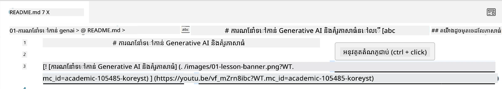
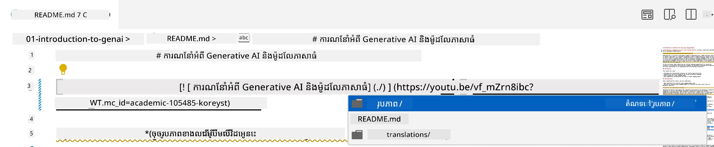
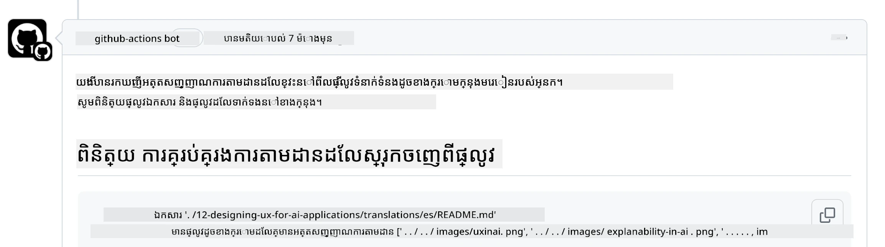
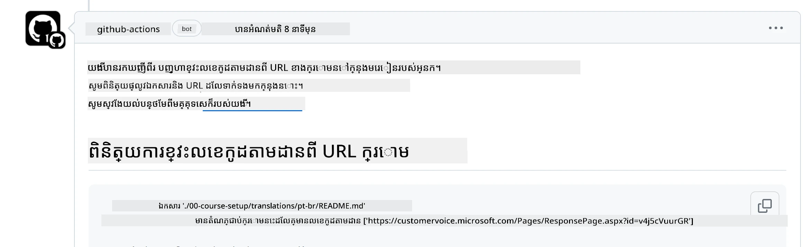
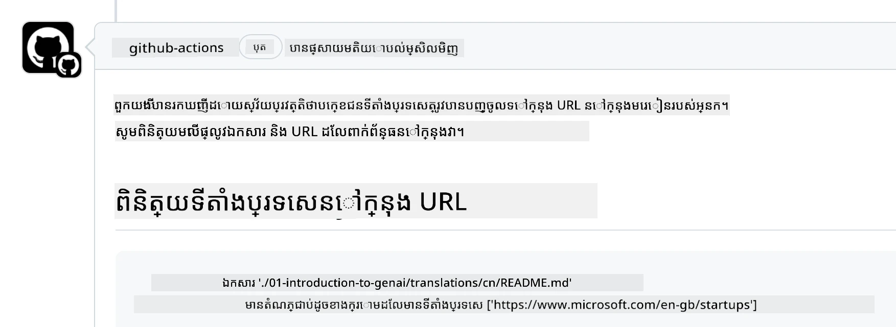

# ការរួមចំណែក

គម្រោងនេះស្វាគមន៍ការរួមចំណែក និងការផ្តល់យោបល់។ ការរួមចំណែកភាគច្រើនទាមទារឱ្យអ្នក
យល់ព្រមលើកិច្ចព្រមព្រៀង អ្នករួមចំណែក (CLA) ដែលបញ្ជាក់ថាអ្នកមានសិទ្ធិ,
ហើយពិតជាផ្តល់សិទ្ធិដល់យើងក្នុងការប្រើប្រាស់ការរួមចំណែករបស់អ្នក។ សម្រាប់ព័ត៌មានលម្អិត សូមចូលชม
<https://cla.microsoft.com>។

> ចំណាំ៖ ពេលបកប្រែអត្ថបទក្នុងឃ្លាំងនេះ សូមប្រាកដថាអ្នកមិនប្រើការប្រែភាសារបស់ម៉ាស៊ីនទេ។ យើងនឹងផ្ទៀងផ្ទាត់ការបកប្រែតាមរយៈសហគមន៍ ដូច្នេះសូមប្រើប្រាស់សម្រាប់ការបកប្រែទៅភាសាដែលអ្នកមានជំនាញប៉ុណ្ណោះ។

ពេលអ្នកដាក់សំណើ pull request មួយ CLA-bot នឹងកំណត់ដោយស្វ័យប្រវត្តិថាតើអ្នកត្រូវផ្ដល់ CLA មែនទេ
ហើយតុបតែង PR តាមសមាសភាគ (ឧ. ស្លាបត្រ, មតិយោបល់)។ តែគ្រាន់តែធ្វើតាម
ការណែនាំដែល bot ផ្ដល់។ អ្នកត្រូវធ្វើនេះតែម្តងប៉ុណ្ណោះសម្រាប់ឃ្លាំងទាំងអស់ដែលប្រើ CLA របស់យើង។

## ឯកសារចរិត

គម្រោងនេះបានអនុម័តឯកសារចរិត [Microsoft Open Source Code of Conduct](https://opensource.microsoft.com/codeofconduct/?WT.mc_id=academic-105485-koreyst)។
សម្រាប់ព័ត៌មានបន្ថែម សូមអាន [Code of Conduct FAQ](https://opensource.microsoft.com/codeofconduct/faq/?WT.mc_id=academic-105485-koreyst) ឬទំនាក់ទំនង [opencode@microsoft.com](mailto:opencode@microsoft.com) សម្រាប់សំនួរ ឬមតិយោបល់បន្ថែម។

## សំនួរឬបញ្ហា?

សូមកុំបើកគន្លង GitHub សម្រាប់សំណួរជំនួយទូទៅ ព្រោះបញ្ជី GitHub គួរត្រូវបានប្រើសម្រាប់សំណើលក្ខណៈពិសេស និងរបាយការណ៏កំហុស។ របៀបនេះយើងអាចតាមដានបានងាយស្រួលនូវបញ្ហាឬកំហុសពិតពីកូដ ហើយរក្សាអោយការពិភាក្សាទូទៅខុសពីកូដពិត។

## ការកែតម្រូវ កំហុស និងការរួមចំណែក

ពេលណាអ្នកកំពុងដាក់ការផ្លាស់ប្តូរណាមួយទៅក្នុងឃ្លាំង Generative AI for Beginners សូមអនុវត្តការណែនាំទាំងនេះ។

* តែងតែ fork ឃ្លាំងទៅគណនីរបស់អ្នកមុនពេលធ្វើការផ្លាស់ប្តូរ
* កុំបញ្ចូលការផ្លាស់ប្តូរច្រើនទៅក្នុង pull request តែមួយ។ ឧ. ដាក់ការកែតម្រូវកំហុស និងបច្ចុប្បន្នភាពឯកសារជា PR ផ្សេងៗគ្នា
* ប្រសិនបើ pull request របស់អ្នកបង្ហាញការជំរុញមកវិញ (merge conflicts) សូមធ្វើឱ្យ main បណ្ដាលស ថ្មីជាប្រតិទិនដែលភ្លាមៗជាមួយ main ឃ្លាំងមុនការផ្លាស់ប្តូរ
* ប្រសិនបើអ្នកកំពុងដាក់បកប្រែ សូមបង្កើត PR មួយសម្រាប់ឯកសារបកប្រែទាំងអស់ ព្រោះយើងមិនទទួលការបកប្រែផ្នែកខ្លះទេ
* ប្រសិនបើអ្នកកំពុងដាក់កែប្រែកំហុសឬឯកសារពត៌មាន អ្នកអាចបញ្ចូលការផ្លាស់ប្តូរច្រើនក្នុង PR តែមួយដែលសមស្រប

## ការណែនាំទូទៅសម្រាប់ការសរសេរ

- ប្រាកដថា URL ទាំងអស់របស់អ្នកត្រូវបានបិទជុំក្នុងចំណុចបន្ទាត់រាងស្តើង [] បន្ទាប់ដោយគូជ័រ () ដោយគ្មានចន្លោះពេលក្រៅឬនៅក្នុង។
- ប្រាកដថា តំណទំនាក់ទំនងភាគរយ (ន័យថា តំណទៅឯកសារ និងថតផ្សេងទៀតក្នុងឃ្លាំង) ចាប់ផ្តើមជាមួយ `./` ដែលយោងទៅឯកសារឬថតដែលមាននៅក្នុងថតបច្ចុប្បន្ន ឬ `../` ដែលយោងទៅឯកសារឬថតក្នុងថតប៉ារ៉ង់។
- ប្រាកដថា តំណទំនាក់ទំនងភាគរយមានលេខតាមដាន (tracking ID) (យ៉ាងណាមិញ `?` ឬ `&` បន្ទាប់ដោយ `wt.mc_id=` ឬ `WT.mc_id=`) នៅចុងវា។
- ប្រាកដថា URL ទាំងអស់ពីដែន ឈ្មោះ _github.com, microsoft.com, visualstudio.com, aka.ms, និង azure.com_ មានលេខតាមដាន (tracking ID) នៅចុងវា។
- ប្រាកដថាតំណរបស់អ្នកមិនមានភាសា / ដែនកំណត់ប្រទេសនៅក្នុងវា (ឧ. `/en-us/` ឬ `/en/`)។
- ប្រាកដថារូបភាពទាំងអស់ត្រូវបានរក្សាទុកក្នុងថត `./images`។
- ប្រាកដថារូបភាពមានឈ្មោះពិពណ៌នា ប្រើតួអក្សរជាអង់គ្លេស លេខ និងសញ្ញាត្រង់ក្នុងឈ្មោះរូបភាព។

## កម្មវិធីធ្វើការជាមួយ GitHub

ពេលដែលអ្នកដាក់សំណើ pull request មួយ កម្មវិធីធ្វើការជួនកាលពីរយៈពេលបួននឹងត្រូវបើកដំណើរការដើម្បីផ្ទៀងផ្ទាត់ច្បាប់ខាងលើ។
គ្រាន់តែធ្វើតាមការណែនាំក្នុងនេះដើម្បីឆ្លងកាត់ការត្រួតពិនិត្យនៃកម្មវិធីធ្វើការនេះ។

- [ពិនិត្យមើលផ្លូវទំនាក់ទំនងខូច](#ពិនិត្យមើលផ្លូវទំនាក់ទំនងខូច)
- [ពិនិត្យមើលផ្លូវទំនាក់ទំនងមានលេខតាមដាន](#ពិនិត្យមើលផ្លូវទំនាក់ទំនងមានលេខតាមដាន)
- [ពិនិត្យមើល URL មានលេខតាមដាន](#ពិនិត្យមើល-url-មានលេខតាមដាន)
- [ពិនិត្យមើល URL មិនមានភាសា / ដែនកំណត់ប្រទេស](#ពិនិត្យមើល-url-មិនមានភាសា-ដែនកំណត់ប្រទេស)

### ពិនិត្យមើលផ្លូវទំនាក់ទំនងខូច

កម្មវិធីធ្វើការនេះធានាថាតំណភាគរយណាមួយក្នុងឯកសាររបស់អ្នកកំពុងដំណើរការ។
ឃ្លាំងនេះត្រូវបានបង្ហោះទៅ GitHub pages ហើយអ្នកត្រូវតែប្រុងប្រយ័ត្នខ្លាំងពេលអ្នកវាយតំណដែលភ្ជាប់គ្រប់យ៉ាង មិនឱ្យបញ្ចូនទៅកន្លែងខុស។

ដើម្បីប្រាកដថាតំណរបស់អ្នកដំណើរការយ៉ាងត្រឹមត្រូវ គ្រាន់តែប្រើ VS code ដើម្បីពិនិត្យ។

ឧទាហរណ៍ ពេលអ្នកជ្រុលតាមតំណណាមួយក្នុងឯកសារ អ្នកនឹងត្រូវបានអំពាវនាវឱ្យតាមតំណដោយចុច **ctrl + click**

បើអ្នកចុចលើតំណណាមួយហើយវាមិនដំណើរការនៅក្នុងឧបករណ៍ស្ថានីយ៍ ដូច្នេះវាបានបណ្តាលឱ្យកម្មវិធីធ្វើការរត់មិនបាន ហើយមិនដំណើរការនៅ GitHub ផងដែរ។

ដើម្បីជួសជុលបញ្ហានេះ សូមព្យាយាមវាយតំណដោយជំនួយ VS code។

ពេលអ្នកវាយ `./` ឬ `../` VS code នឹងលើកតំណរផ្លូវដែលមានស្រាប់ដែលត្រូវនឹងវាយជូនអ្នក។

តាមដានផ្លូវដោយចុចរបៀបទំហំពិសេសឯកសារឬថត ហើយអ្នកនឹងប្រាកដថា ផ្លាសផ្លូវរបស់អ្នកមិនបែកខ្ទង់។

ពេលអ្នកបន្ថែមផ្លូវត្រឹមត្រូវ រក្សាទុក ហើយបញ្ចូលការផ្លាស់ប្តូរ កម្មវិធីធ្វើការនឹងរត់ម្ដងទៀត ដើម្បីផ្ទៀងផ្ទាត់ការផ្លាស់ប្តូររបស់អ្នក។
បើឆ្លងត្រួតពិនិត្យ អ្នកអាចបន្តបាន។

### ពិនិត្យមើលផ្លូវទំនាក់ទំនងមានលេខតាមដាន

កម្មវិធីធ្វើការនេះធានាថាតំណភាគរយណាមួយមានលេខតាមដានក្នុងវា។
ឃ្លាំងនេះត្រូវបានបង្ហោះទៅ GitHub pages ដូច្នេះយើងត្រូវតែមើលការផ្លាស់ទីរវាងឯកសារនិងថតផ្សេងៗគ្នា។

ដើម្បីប្រាកដថាតំណរភាគរយរបស់អ្នកមានលេខតាមដានគ្រាន់តែពិនិត្យអត្ថបទ `?wt.mc_id=` នៅចុងផ្លូវ។
បើវាត្រូវបានភ្ជាប់នឹងផ្លូវរបស់អ្នក អ្នកនឹងឆ្លងត្រួតពិនិត្យនេះ។

បើមិនមាន អ្នកប្រហែលជារំពឹងឃើញកំហុសដូចខាងក្រោម។

ដើម្បីជួសជុលបញ្ហានេះ សូមបើកផ្លូវឯកសារដែលកម្មវិធីធ្វើការបង្ហាញហើយបន្ថែមលេខតាមដាននៅចុងផ្លូវ។

ពេលបន្ថែមលេខតាមដាន រក្សាទុក ហើយបញ្ចូលការផ្លាស់ប្តូរ កម្មវិធីធ្វើការនឹងរត់ម្ដងទៀត ដើម្បីផ្ទៀងផ្ទាត់ការផ្លាស់ប្តូរ។
បើឆ្លងការត្រួតពិនិត្យ អ្នកអាចបន្តបាន។

### ពិនិត្យមើល URL មានលេខតាមដាន

កម្មវិធីធ្វើការនេះធានាថា URL គេហទំព័រណាមួយមានលេខតាមដានក្នុងវា។
ឃ្លាំងនេះមានសម្រាប់មនុស្សគ្រប់រូប ដូច្នេះអ្នកត្រូវប្រាកដថាបានតាមដានការចូលប្រើ ដើម្បីដឹងពីទីតាំងចរាចររបស់អ្នក។

ដើម្បីប្រាកដថា URL របស់អ្នកមានលេខតាមដានគ្រាន់តែពិនិត្យអត្ថបទ `?wt.mc_id=` នៅចុង URL។
បើវាត្រូវបានភ្ជាប់ អ្នកនឹងឆ្លងការត្រួតពិនិត្យនេះ។

បើមិនមាន អ្នកប្រៀបបានកំហុសដូចខាងក្រោម។

ដើម្បីជួសជុលបញ្ហានេះ សូមបើកផ្លូវឯកសារដែលកម្មវិធីធ្វើការបង្ហាញ ហើយបន្ថែមលេខតាមដាននៅចុង URL។

ពេលបន្ថែមលេខតាមដាន រក្សាទុក ហើយបញ្ចូលការផ្លាស់ប្តូរ កម្មវិធីធ្វើការនឹងរត់ម្ដងទៀត ដើម្បីផ្ទៀងផ្ទាត់ការផ្លាស់ប្តូរ។
បើឆ្លងការត្រួតពិនិត្យ អ្នកអាចបន្តបាន។

### ពិនិត្យមើល URL មិនមានភាសា / ដែនកំណត់ប្រទេស

កម្មវិធីធ្វើការនេះធានាថា URL គេហទំព័រណាមួយមិនមានភាសារ ឬ ដែនកំណត់ប្រទេសនៅក្នុងវា។
ឃ្លាំងនេះមានសម្រាប់មនុស្សគ្រប់រូបទូទាំងពិភពលោក ដូច្នេះអ្នកត្រូវប្រាកដអត់បញ្ចូលភាសារ / ដែនកំណត់ប្រទេសរបស់អ្នកក្នុង URL។

ដើម្បីប្រាកដថា URL របស់អ្នកមិនមានភាសា / ដែនកំណត់ប្រទេស គ្រាន់តែពិនិត្យពាក្យ `/en-us/` ឬ `/en/` ឬភាសាផ្សេងណាមួយនៅឯ URL។
បើវាមិនមាន អ្នកនឹងឆ្លងត្រួតពិនិត្យនេះ។

បើមាន អ្នកអាចស្វែងឃើញកំហុសដូចខាងក្រោម។

ដើម្បីជួសជុលបញ្ហានេះ សូមបើកផ្លូវឯកសារដែលកម្មវិធីធ្វើការបង្ហាញ ហើយយកភាសា / ដែនកំណត់ប្រទេសចេញពី URL។

ពេលយកភាសា / ដែនកំណត់ប្រទេសចេញ រក្សាទុក ហើយបញ្ចូលការផ្លាស់ប្តូរ កម្មវិធីធ្វើការនឹងចាប់ផ្ដើមវិញ ដើម្បីផ្ទៀងផ្ទាត់ការផ្លាស់ប្តូរ។
បើឆ្លងការត្រួតពិនិត្យ អ្នកអាចបន្តបាន។

អបអរសាទរ! យើងនឹងត្រឡប់មកជាមួយមតិយោបល់លើការរួមចំណែករបស់អ្នកឆាប់ៗនេះ។

---

<!-- CO-OP TRANSLATOR DISCLAIMER START -->
**ការប្រាប់ជាសកល**៖  
ឯកសារនេះត្រូវបានបម្លែងភាសាជាមួយសេវាកម្មបកប្រែ AI [Co-op Translator](https://github.com/Azure/co-op-translator)។ ទោះបីយើងខិតខំប្រឹងប្រែងរកភាពត្រឹមត្រូវក៏ដោយ សូមជ្រាបថាការបកប្រែដោយស្វ័យប្រវត្តិអាចមានកំហុស ឬកង្វះភាពត្រឹមត្រូវមួយចំនួន។ ឯកសារដើមជាភាសារជា ម៉ោងគួរត្រូវបានយល់ថាជា ប្រភពផ្លូវការចម្បង។ សម្រាប់ ព័ត៌មានសំខាន់ៗ នូវការបកប្រែដោយមនុស្សដែលមានជំនាញគឺត្រូវបានណែនាំ។ យើងខ្លួន មិនទទួលខុសត្រូវចំពោះការយល់ច្រឡំ ឬការបកប្រែខុសផ្សេងៗណាមួយដែលកើតឡើងពីការប្រើប្រាស់បកប្រែនេះទេ។
<!-- CO-OP TRANSLATOR DISCLAIMER END -->