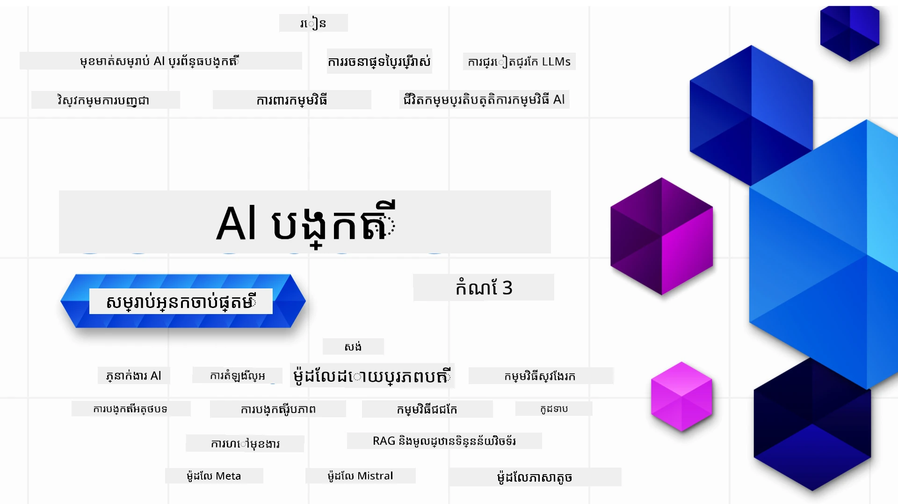

### មេរៀន ២១ ដែលបង្រៀនអំពីអ្វីៗទាំងអស់ដែលអ្នកត្រូវការដើម្បីចាប់ផ្តើមបង្កើតកម្មវិធី Generative AI

[](https://github.com/microsoft/Generative-AI-For-Beginners/blob/master/LICENSE?WT.mc_id=academic-105485-koreyst)
[](https://GitHub.com/microsoft/Generative-AI-For-Beginners/graphs/contributors/?WT.mc_id=academic-105485-koreyst)
[](https://GitHub.com/microsoft/Generative-AI-For-Beginners/issues/?WT.mc_id=academic-105485-koreyst)
[](https://GitHub.com/microsoft/Generative-AI-For-Beginners/pulls/?WT.mc_id=academic-105485-koreyst)
[](http://makeapullrequest.com?WT.mc_id=academic-105485-koreyst)

[](https://GitHub.com/microsoft/Generative-AI-For-Beginners/watchers/?WT.mc_id=academic-105485-koreyst)
[](https://GitHub.com/microsoft/Generative-AI-For-Beginners/network/?WT.mc_id=academic-105485-koreyst)
[](https://GitHub.com/microsoft/Generative-AI-For-Beginners/stargazers/?WT.mc_id=academic-105485-koreyst)

[](https://discord.gg/nTYy5BXMWG)

### 🌐 ការគាំទ្រភាសាច្រើន

#### គាំទ្រដោយ GitHub Action (ធ្វើដោយស្វ័យប្រវត្តិ និងជានិច្ចធ្វើបច្ចុប្បន្នភាព)

<!-- CO-OP TRANSLATOR LANGUAGES TABLE START -->
[អារ៉ាប់](../ar/README.md) | [បង់ក្លាដិ](../bn/README.md) | [ប៊ុលហ្គារី](../bg/README.md) | [ភាសាម៉្យាន់ម៉ា (ភាសាប៊ឺម៉ា)](../my/README.md) | [ចិន (ជាសាមញ្ញ)](../zh-CN/README.md) | [ចិន (ប្រពៃណី, ហុងកុង)](../zh-HK/README.md) | [ចិន (ប្រពៃណី, ម៉ាកាវ)](../zh-MO/README.md) | [ចិន (ប្រពៃណី, តៃវ៉ាន់)](../zh-TW/README.md) | [ក្រូអាត](../hr/README.md) | [ឆេក](../cs/README.md) | [ដាណឺម៉ាក](../da/README.md) | [ហុល្លង់](../nl/README.md) | [អេស្តូនី](../et/README.md) | [ហ្វិនឡង់](../fi/README.md) | [បារាំង](../fr/README.md) | [អាល្លឺម៉ង់](../de/README.md) | [ក្រិក](../el/README.md) | [ហេប្រ៊ូវ](../he/README.md) | [ហินឌី](../hi/README.md) | [ហុងគ្រី](../hu/README.md) | [ឥណ្ឌូណេស៊ី](../id/README.md) | [អ៊ីតាលី](../it/README.md) | [ជប៉ុន](../ja/README.md) | [កណាដា](../kn/README.md) | [ខ្មែរ](./README.md) | [កូរ៉េ](../ko/README.md) | [លីទូអានី](../lt/README.md) | [ម៉ាឡ័យ](../ms/README.md) | [ម៉ាឡាឡាំ](../ml/README.md) | [ម៉ារាទី](../mr/README.md) | [ណេប៉ាល](../ne/README.md) | [ភាសាណីហ្សេរីនភីឌ់ជិន](../pcm/README.md) | [ន័រវេស](../no/README.md) | [ផឺស៊ី (ហ្វារូស៊ី)](../fa/README.md) | [ប៉ូលូញ](../pl/README.md) | [បុរីទកាហ្ស (ប្រេស៊ីល)](../pt-BR/README.md) | [បុរីទកាហ្ស (ប៉័រទុយហ្គាល់)](../pt-PT/README.md) | [ប៉ុនជាប៊ី (កុំរសាគី)](../pa/README.md) | [រូម៉ានី](../ro/README.md) | [រុស្ស៊ី](../ru/README.md) | [ស៊ែរប៊ី (ស៊ីរីលិក)](../sr/README.md) | [ស្លូវ៉ាក់](../sk/README.md) | [ស្លូវេនី](../sl/README.md) | [អេស្ប៉ាញ](../es/README.md) | [ស្វាហ៊ីលី](../sw/README.md) | [ស៊ុយអែដ](../sv/README.md) | [តាឡាហ្គោ (ហ្វីលីពីន)](../tl/README.md) | [តាមីល](../ta/README.md) | [ធេល៊ូហ្គូ](../te/README.md) | [ថៃ](../th/README.md) | [ទួរគី](../tr/README.md) | [អ៊ុយក្រែន](../uk/README.md) | [អ៊ឺដូ](../ur/README.md) | [វៀតណាម](../vi/README.md)

> **ចូលចិត្តធ្វើការ Clone ក្នុងក្រសួងផ្ទាល់?**
>
> ឃ្លោងស្ទុកនេះមានការបកប្រែជាភាសាច្រើនជាង ៥០ ភាសា ដែលបង្កើនទំហំទាញយកយ៉ាងខ្លាំង។ ដើម្បី clone ដោយគ្មានការបកប្រែ ប្រើ sparse checkout៖
>
> **Bash / macOS / Linux:**
> ```bash
> git clone --filter=blob:none --sparse https://github.com/microsoft/generative-ai-for-beginners.git
> cd generative-ai-for-beginners
> git sparse-checkout set --no-cone '/*' '!translations' '!translated_images'
> ```
>
> **CMD (Windows):**
> ```cmd
> git clone --filter=blob:none --sparse https://github.com/microsoft/generative-ai-for-beginners.git
> cd generative-ai-for-beginners
> git sparse-checkout set --no-cone "/*" "!translations" "!translated_images"
> ```
>
> នេះផ្តល់អ្វីដែលអ្នកត្រូវការទាំងអស់ក្នុងការបញ្ចប់វគ្គសិក្សាជាមួយការទាញយករហ័សជាងមុន។
<!-- CO-OP TRANSLATOR LANGUAGES TABLE END -->

# Generative AI សម្រាប់អ្នកចាប់ផ្តើម (កំណែ ៣) - វគ្គសិក្សាមួយ

សូមរៀនមូលដ្ឋាននៃការបង្កើតកម្មវិធី Generative AI ជាមួយវគ្គសិក្សាប្រកបដោយមាតិកា ២១ មេរៀនដោយ Microsoft Cloud Advocates។

## 🌱 ចាប់ផ្តើម

វគ្គសិក្សានេះមាន ២១ មេរៀន។ មេរៀនមួយៗគ្របដណ្តប់ប្រធានបទផ្ទាល់ខ្លួន ដូច្នេះចាប់ផ្តើមនៅកន្លែងដែលអ្នកចូលចិត្តបាន!

មេរៀនត្រូវបានតក់ស្លៀកជាមេរៀន "រៀន" ដែលពន្យល់ពីគំនិត Generative AI ប៉ុណ្ណោះ ឬមេរៀន "សង់" ដែលពន្យល់ពីគំនិត និងឧទាហរណ៍កូដទាំងពីរ **Python** និង **TypeScript** នៅពេលអាចធ្វើបាន។

សម្រាប់អ្នកអភិវឌ្ឍន៍ .NET សូមពិនិត្យ [Generative AI for Beginners (.NET Edition)](https://github.com/microsoft/Generative-AI-for-beginners-dotnet?WT.mc_id=academic-105485-koreyst)។

មេរៀនមួយៗក៏រួមបញ្ចូលផ្នែក "រក្សាររៀន" ជាមួយឧបករណ៍បន្ថែមសម្រាប់រៀន។

## អ្វីដែលអ្នកត្រូវការ
### ដើម្បីរត់កូដនៃវគ្គសិក្សានេះ អ្នកអាចប្រើដូចតទៅ៖ 
 - [Azure OpenAI Service](https://aka.ms/genai-beginners/azure-open-ai?WT.mc_id=academic-105485-koreyst) - **មេរៀន:** "aoai-assignment"
 - [GitHub Marketplace Model Catalog](https://aka.ms/genai-beginners/gh-models?WT.mc_id=academic-105485-koreyst) - **មេរៀន:** "githubmodels"
 - [OpenAI API](https://aka.ms/genai-beginners/open-ai?WT.mc_id=academic-105485-koreyst) - **មេរៀន:** "oai-assignment" 
   
- ចំណេះដឹងមូលដ្ឋាន Python ឬ TypeScript គឺមានប្រយោជន៍ - \*សម្រាប់អ្នកចាប់ផ្តើមពេញលេញ សូមពិនិត្យវគ្គសិក្សា [Python](https://aka.ms/genai-beginners/python?WT.mc_id=academic-105485-koreyst) និង [TypeScript](https://aka.ms/genai-beginners/typescript?WT.mc_id=academic-105485-koreyst)
- គណនី GitHub របស់អ្នកដើម្បី [បំបែកស្ទុក (fork) repository ទាំងមូលនេះ](https://aka.ms/genai-beginners/github?WT.mc_id=academic-105485-koreyst) ទៅក្នុងគណនី GitHub របស់អ្នកផ្ទាល់

ពួកយើងបានបង្កើតមេរៀន **[ការរៀបចំវគ្គសិក្សា](./00-course-setup/README.md?WT.mc_id=academic-105485-koreyst)** ដើម្បីជួយអ្នករៀបចំបរិយាកាសអភិវឌ្ឍ។

កុំភ្លេច [ផ្កាយ (🌟) រឺសរសេរ star ទៅរក repo នេះ](https://docs.github.com/en/get-started/exploring-projects-on-github/saving-repositories-with-stars?WT.mc_id=academic-105485-koreyst) ដើម្បីរកឃើញឆាប់ៗក្រោយ។

## 🧠 ត្រៀមខ្លួនបញ្ចេញ?

បើអ្នកកំពុងស្វែងរកឧទាហរណ៍កូដកម្រិតខ្ពស់ទៀត សូមពិនិត្យ [សមាសធាតុកូដ Generative AI របស់យើង](https://aka.ms/genai-beg-code?WT.mc_id=academic-105485-koreyst) ទាំង Python និង TypeScript។

## 🗣️ ជួបអ្នករៀនផ្សេងទៀត ទទួលការគាំទ្រ

ចូលរួម [ម៉ាស៊ីន Discord ផ្លូវការរបស់ Azure AI Foundry](https://aka.ms/genai-discord?WT.mc_id=academic-105485-koreyst) ដើម្បីជួបពួកគេ និងបណ្ដាញអ្នករៀនផ្សេងទៀត និងទទួលបានការគាំទ្រ។

សួរបញ្ហា ឬចែករំលែកមតិយោបល់ផលិតផលនៅក្នុង [វេទិកានักអភិវឌ្ឍន៍ Azure AI Foundry](https://aka.ms/azureaifoundry/forum) លើ Github។

## 🚀 កំពុងបង្កើតក្រុមហ៊ុន Startup?

ចូលទៅកាន់ [Microsoft for Startups](https://www.microsoft.com/startups) ដើម្បីស្វែងយល់ពីរបៀបចាប់ផ្តើមបង្កើតកម្មវិធីជាមួយកាន់តែច្រើនក្រដាសឥណទាន Azure ថ្ងៃនេះ។

## 🙏 ចង់ជួយ?

តើអ្នកមានយោបល់ណាមួយ ឬបានឃើញកំហុសពាក្យ ឬកូដ? [ដាក់បញ្ហា](https://github.com/microsoft/generative-ai-for-beginners/issues?WT.mc_id=academic-105485-koreyst) ឬ [បង្កើតសំណើទាញ](https://github.com/microsoft/generative-ai-for-beginners/pulls?WT.mc_id=academic-105485-koreyst)

## 📂 មេរៀននិមួយៗរួមមាន:

- វីដេអូផ្តើមខ្លីៗអំពីប្រធានបទ
- មេរៀនសរសេរដែលមាននៅក្នុង README
- ឧទាហរណ៍កូដ Python និង TypeScript គាំទ្រ Azure OpenAI និង OpenAI API
- តំណភ្ជាប់ទៅមុខម្ខាងបន្ថែមសម្រាប់បន្តរៀន

## 🗃️ មេរៀន

| #   | **តំណមេរៀន**                                                                                                                              | **ការពិពណ៌នា**                                                                                 | **វីដេអូ**                                                                   | **មេរៀនបន្ថែម**                                                             |
| --- | -------------------------------------------------------------------------------------------------------------------------------------------- | ----------------------------------------------------------------------------------------------- | --------------------------------------------------------------------------- | ------------------------------------------------------------------------------ |
| 00  | [ការរៀបចំវគ្គសិក្សា](./00-course-setup/README.md?WT.mc_id=academic-105485-koreyst)                                                         | **រៀន:** របៀបរៀបចំបរិយាកាសអភិវឌ្ឍន៍របស់អ្នក                                            | វីដេអូកំពុងមកដល់                                                                 | [រៀនបន្ថែម](https://aka.ms/genai-collection?WT.mc_id=academic-105485-koreyst) |
| 01  | [ការណែនាំអំពី Generative AI និង LLMs](./01-introduction-to-genai/README.md?WT.mc_id=academic-105485-koreyst)                                | **រៀន:** យល់ដឹងអំពីចំណុច Generative AI ជា និងរបៀបធ្វើការរបស់ម៉ូដែលភាសាធំៗ (LLMs)       | [វីដេអូ](https://aka.ms/gen-ai-lesson-1-gh?WT.mc_id=academic-105485-koreyst) | [រៀនបន្ថែម](https://aka.ms/genai-collection?WT.mc_id=academic-105485-koreyst) |
| 02  | [ការស្វែងយល់ និងប្រៀបធៀប LLMs ពីគ្នាផ្សេងៗ](./02-exploring-and-comparing-different-llms/README.md?WT.mc_id=academic-105485-koreyst)   | **រៀន:** របៀបជ្រើសម៉ូដែលត្រឹមត្រូវសម្រាប់ករណីប្រើប្រាស់របស់អ្នក                            | [វីដេអូ](https://aka.ms/gen-ai-lesson2-gh?WT.mc_id=academic-105485-koreyst)  | [រៀនបន្ថែម](https://aka.ms/genai-collection?WT.mc_id=academic-105485-koreyst) |
| 03  | [ការប្រើប្រាស់ Generative AI យ៉ាងទទួលខុសត្រូវ](./03-using-generative-ai-responsibly/README.md?WT.mc_id=academic-105485-koreyst)             | **រៀន:** របៀបសង់កម្មវិធី Generative AI ដោយមានការទទួលខុសត្រូវ                                  | [វីដេអូ](https://aka.ms/gen-ai-lesson3-gh?WT.mc_id=academic-105485-koreyst)  | [រៀនបន្ថែម](https://aka.ms/genai-collection?WT.mc_id=academic-105485-koreyst) |
| 04  | [ការយល់ដឹងអំពីគ្រឹះនៃវិស្វកម្ម Prompt](./04-prompt-engineering-fundamentals/README.md?WT.mc_id=academic-105485-koreyst)             | **សិក្សា:** អនុវត្តន៍ល្អបំផុតក្នុងការវិស្វកម្ម Prompt                                           | [វីដេអូ](https://aka.ms/gen-ai-lesson4-gh?WT.mc_id=academic-105485-koreyst)  | [សិក្សាបន្ថែម](https://aka.ms/genai-collection?WT.mc_id=academic-105485-koreyst) |
| 05  | [ការបង្កើត Prompt អតិបរមា](./05-advanced-prompts/README.md?WT.mc_id=academic-105485-koreyst)                                                | **សិក្សា:** របៀបអនុវត្តបច្ចេកទេសវិស្វកម្ម prompt ដើម្បីបង្កើនលទ្ធផលនៃ prompt របស់អ្នក។          | [វីដេអូ](https://aka.ms/gen-ai-lesson5-gh?WT.mc_id=academic-105485-koreyst)  | [សិក្សាបន្ថែម](https://aka.ms/genai-collection?WT.mc_id=academic-105485-koreyst) |
| 06  | [ការបង្កើតកម្មវិធីបង្កើតអត្ថបទ](./06-text-generation-apps/README.md?WT.mc_id=academic-105485-koreyst)                                | **កសាង:** កម្មវិធីបង្កើតអត្ថបទដោយប្រើ Azure OpenAI / OpenAI API                              | [វីដេអូ](https://aka.ms/gen-ai-lesson6-gh?WT.mc_id=academic-105485-koreyst)  | [សិក្សាបន្ថែម](https://aka.ms/genai-collection?WT.mc_id=academic-105485-koreyst) |
| 07  | [ការបង្កើតកម្មវិធីសន្ទនា](./07-building-chat-applications/README.md?WT.mc_id=academic-105485-koreyst)                                     | **កសាង:** បច្ចេកទេសសម្រាប់ការបង្កើតនិងបញ្ចូលកម្មវិធីសន្ទនាបានយ៉ាងមានប្រសិទ្ធភាព។               | [វីដេអូ](https://aka.ms/gen-ai-lessons7-gh?WT.mc_id=academic-105485-koreyst) | [សិក្សាបន្ថែម](https://aka.ms/genai-collection?WT.mc_id=academic-105485-koreyst) |
| 08  | [ការបង្កើតកម្មវិធីស្វែងរកព័ត៌មានដោយប្រើបណ្តាញវ៉ិចទ័រ](./08-building-search-applications/README.md?WT.mc_id=academic-105485-koreyst)                        | **កសាង:** កម្មវិធីស្វែងរកដែលប្រើ Embeddings សម្រាប់ស្វែងរកទិន្នន័យ។                        | [វីដេអូ](https://aka.ms/gen-ai-lesson8-gh?WT.mc_id=academic-105485-koreyst)  | [សិក្សាបន្ថែម](https://aka.ms/genai-collection?WT.mc_id=academic-105485-koreyst) |
| 09  | [ការបង្កើតកម្មវិធីបង្កើតរូបភាព](./09-building-image-applications/README.md?WT.mc_id=academic-105485-koreyst)                        | **កសាង:** កម្មវិធីបង្កើតរូបភាព                                                       | [វីដេអូ](https://aka.ms/gen-ai-lesson9-gh?WT.mc_id=academic-105485-koreyst)  | [សិក្សាបន្ថែម](https://aka.ms/genai-collection?WT.mc_id=academic-105485-koreyst) |
| 10  | [ការបង្កើតកម្មវិធី AI កូដទាប](./10-building-low-code-ai-applications/README.md?WT.mc_id=academic-105485-koreyst)                       | **កសាង:** កម្មវិធី AI បង្វិលបង្កើតដោយប្រើឧបករណ៍កូដទាប                                     | [វីដេអូ](https://aka.ms/gen-ai-lesson10-gh?WT.mc_id=academic-105485-koreyst) | [សិក្សាបន្ថែម](https://aka.ms/genai-collection?WT.mc_id=academic-105485-koreyst) |
| 11  | [ការបញ្ចូលកម្មវិធីខាងខាងក្រៅជាមួយការហៅមុខងារ](./11-integrating-with-function-calling/README.md?WT.mc_id=academic-105485-koreyst) | **កសាង:** តើហៅមុខងារជាអ្វី និងការប្រើប្រាស់របស់វាសម្រាប់កម្មវិធី                          | [វីដេអូ](https://aka.ms/gen-ai-lesson11-gh?WT.mc_id=academic-105485-koreyst) | [សិក្សាបន្ថែម](https://aka.ms/genai-collection?WT.mc_id=academic-105485-koreyst) |
| 12  | [ការរចនាបទពិសោធន៍អ្នកប្រើសម្រាប់កម្មវិធី AI](./12-designing-ux-for-ai-applications/README.md?WT.mc_id=academic-105485-koreyst)                         | **សិក្សា:** របៀបអនុវត្តគោលការណ៍រចនាបទពិសោធន៍អ្នកប្រើនៅពេលអភិវឌ្ឍកម្មវិធី Generative AI         | [វីដេអូ](https://aka.ms/gen-ai-lesson12-gh?WT.mc_id=academic-105485-koreyst) | [សិក្សាបន្ថែម](https://aka.ms/genai-collection?WT.mc_id=academic-105485-koreyst) |
| 13  | [ការពារកម្មវិធី Generative AI របស់អ្នក](./13-securing-ai-applications/README.md?WT.mc_id=academic-105485-koreyst)                         | **សិក្សា:** ផលប៉ះពាល់និងហានិភ័យចំពោះប្រព័ន្ធ AI និងវិធីសាស្រ្តក្នុងការការពារប្រព័ន្ធទាំងនេះ។             | [វីដេអូ](https://aka.ms/gen-ai-lesson13-gh?WT.mc_id=academic-105485-koreyst) | [សិក្សាបន្ថែម](https://aka.ms/genai-collection?WT.mc_id=academic-105485-koreyst) |
| 14  | [ជីវិតរយៈពេលកម្មវិធី Generative AI](./14-the-generative-ai-application-lifecycle/README.md?WT.mc_id=academic-105485-koreyst)           | **សិក្សា:** ឧបករណ៍ និងមាតិកា ដើម្បីគ្រប់គ្រងជីវិតរយៈពេល LLM និង LLMOps                     | [វីដេអូ](https://aka.ms/gen-ai-lesson14-gh?WT.mc_id=academic-105485-koreyst) | [សិក្សាបន្ថែម](https://aka.ms/genai-collection?WT.mc_id=academic-105485-koreyst) |
| 15  | [ការបង្កើតដោយប្រើ Retrieval Augmented Generation (RAG) និងបណ្ណាល័យវ៉ិចទ័រ](./15-rag-and-vector-databases/README.md?WT.mc_id=academic-105485-koreyst)        | **កសាង:** កម្មវិធីប្រើស៊ុម RAG ដើម្បីយក embeddings ពីបណ្ណាល័យវ៉ិចទ័រ  | [វីដេអូ](https://aka.ms/gen-ai-lesson15-gh?WT.mc_id=academic-105485-koreyst) | [សិក្សាបន្ថែម](https://aka.ms/genai-collection?WT.mc_id=academic-105485-koreyst) |
| 16  | [ម៉ូដែលមូលដ្ឋានសម្រាប់សមាសធាតុបើកចំហរ និង Hugging Face](./16-open-source-models/README.md?WT.mc_id=academic-105485-koreyst)                                    | **កសាង:** កម្មវិធីប្រើម៉ូដែលមូលដ្ឋានដែលមាននៅលើ Hugging Face                            | [វីដេអូ](https://aka.ms/gen-ai-lesson16-gh?WT.mc_id=academic-105485-koreyst) | [សិក្សាបន្ថែម](https://aka.ms/genai-collection?WT.mc_id=academic-105485-koreyst) |
| 17  | [តំណាង AI](./17-ai-agents/README.md?WT.mc_id=academic-105485-koreyst)                                                                       | **កសាង:** កម្មវិធីប្រើស៊ុមតំណាង AI                                           | [វីដេអូ](https://aka.ms/gen-ai-lesson17-gh?WT.mc_id=academic-105485-koreyst) | [សិក្សាបន្ថែម](https://aka.ms/genai-collection?WT.mc_id=academic-105485-koreyst) |
| 18  | [ការតំរូវ LLMs](./18-fine-tuning/README.md?WT.mc_id=academic-105485-koreyst)                                                              | **សិក្សា:** តើអ្វី, ហេតុផល និងរបៀបនៃការតំរូវ LLMs                                            | [វីដេអូ](https://aka.ms/gen-ai-lesson18-gh?WT.mc_id=academic-105485-koreyst) | [សិក្សាបន្ថែម](https://aka.ms/genai-collection?WT.mc_id=academic-105485-koreyst) |
| 19  | [ការបង្កើតជាមួយ SLMs](./19-slm/README.md?WT.mc_id=academic-105485-koreyst)                                                              | **សិក្សា:** អត្ថប្រយោជន៍នៃការបង្កើតជាមួយ ម៉ូដែលភាសាតិចតូច                                            | វីដេអូ​ចូលមកក្នុងពេលឆាប់ៗ | [សិក្សាបន្ថែម](https://aka.ms/genai-collection?WT.mc_id=academic-105485-koreyst) |
| 20  | [ការបង្កើតជាមួយម៉ូដែល Mistral](./20-mistral/README.md?WT.mc_id=academic-105485-koreyst)                                                              | **សិក្សា:** លក្ខណៈពិសេស និងភាពខុសគ្នា របស់ម៉ូដែលគ្រួសារមីស្ដ្រាល                                           | វីដេអូ​ចូលមកក្នុងពេលឆាប់ៗ | [សិក្សាបន្ថែម](https://aka.ms/genai-collection?WT.mc_id=academic-105485-koreyst) |
| 21  | [ការបង្កើតជាមួយម៉ូដែល Meta](./21-meta/README.md?WT.mc_id=academic-105485-koreyst)                                                              | **សិក្សា:** លក្ខណៈពិសេស និងភាពខុសគ្នា របស់ម៉ូដែលគ្រួសារមេតា                                           | វីដេអូ​ចូលមកក្នុងពេលឆាប់ៗ | [សិក្សាបន្ថែម](https://aka.ms/genai-collection?WT.mc_id=academic-105485-koreyst) |

### 🌟 អរគុណពិសេស

អរគុណពិសេសចំពោះ [**John Aziz**](https://www.linkedin.com/in/john0isaac/) សម្រាប់ការបង្កើត GitHub Actions និង workflows ទាំងអស់

[**Bernhard Merkle**](https://www.linkedin.com/in/bernhard-merkle-738b73/) សម្រាប់ការរួមចំណែកសំខាន់ៗក្នុងមេរៀននីមួយៗ ដើម្បីបង្កើនបទពិសោធន៍សិក្សានិងកូដ។

## 🎒 មុខវិជ្ជាផ្សេងទៀត

ក្រុមរបស់យើងផលិតមុខវិជ្ជាផ្សេងទៀត! សូមពិនិត្យមើល៖

<!-- CO-OP TRANSLATOR OTHER COURSES START -->
### LangChain
[](https://aka.ms/langchain4j-for-beginners)
[](https://aka.ms/langchainjs-for-beginners?WT.mc_id=m365-94501-dwahlin)
[](https://github.com/microsoft/langchain-for-beginners?WT.mc_id=m365-94501-dwahlin)
---

### Azure / Edge / MCP / Agents
[](https://github.com/microsoft/AZD-for-beginners?WT.mc_id=academic-105485-koreyst)
[](https://github.com/microsoft/edgeai-for-beginners?WT.mc_id=academic-105485-koreyst)
[](https://github.com/microsoft/mcp-for-beginners?WT.mc_id=academic-105485-koreyst)
[](https://github.com/microsoft/ai-agents-for-beginners?WT.mc_id=academic-105485-koreyst)

---
 
### ស៊េរី Generative AI
[](https://github.com/microsoft/generative-ai-for-beginners?WT.mc_id=academic-105485-koreyst)
[-9333EA?style=for-the-badge&labelColor=E5E7EB&color=9333EA)](https://github.com/microsoft/Generative-AI-for-beginners-dotnet?WT.mc_id=academic-105485-koreyst)
[-C084FC?style=for-the-badge&labelColor=E5E7EB&color=C084FC)](https://github.com/microsoft/generative-ai-for-beginners-java?WT.mc_id=academic-105485-koreyst)
[-E879F9?style=for-the-badge&labelColor=E5E7EB&color=E879F9)](https://github.com/microsoft/generative-ai-with-javascript?WT.mc_id=academic-105485-koreyst)

---
 
### ការសិក្សា​ដ៏​សំខាន់
[](https://aka.ms/ml-beginners?WT.mc_id=academic-105485-koreyst)
[](https://aka.ms/datascience-beginners?WT.mc_id=academic-105485-koreyst)
[](https://aka.ms/ai-beginners?WT.mc_id=academic-105485-koreyst)
[](https://github.com/microsoft/Security-101?WT.mc_id=academic-96948-sayoung)
[](https://aka.ms/webdev-beginners?WT.mc_id=academic-105485-koreyst)
[](https://aka.ms/iot-beginners?WT.mc_id=academic-105485-koreyst)
[](https://github.com/microsoft/xr-development-for-beginners?WT.mc_id=academic-105485-koreyst)

---
 
### ស៊េរី Copilot
[](https://aka.ms/GitHubCopilotAI?WT.mc_id=academic-105485-koreyst)
[](https://github.com/microsoft/mastering-github-copilot-for-dotnet-csharp-developers?WT.mc_id=academic-105485-koreyst)
[](https://github.com/microsoft/CopilotAdventures?WT.mc_id=academic-105485-koreyst)
<!-- CO-OP TRANSLATOR OTHER COURSES END -->

## សុំជំនួយ

បើអ្នកជួបការលំបាក ឬមានសំណួរអំពីការបង្កើតកម្មវិធី AI។ ចូលរួមជាមួយសិស្សរៀន និងអ្នកអភិវឌ្ឍន៍មានបទពិសោធន៍ក្នុងការពិភាក្សាអំពី MCP។ វាជាសហគមន៍គាំទ្រ ដែលសំណួរត្រូវបានស្វាគមន៍ ហើយចំណេះដឹងត្រូវបានចែករំលែកដោយសេរី។

[](https://discord.gg/nTYy5BXMWG)

បើអ្នកមានមតិយោបល់អំពី ផលិតផល ឬកំហុសពេលកំពុងបង្កើត សូមចូលទៅកាន់៖

[](https://aka.ms/foundry/forum)

---

<!-- CO-OP TRANSLATOR DISCLAIMER START -->
**ការកត់សម្គាល់**៖  
ឯកសារនេះត្រូវបានបំលែងភាសាដោយប្រើសេវាកម្មបកប្រែដោយ AI [Co-op Translator](https://github.com/Azure/co-op-translator)។ ខណៈដែលយើងខិតខំរកភាពត្រឹមត្រូវ សូមយល់ឲ្យបានថា ការបកប្រែដោយស្វ័យប្រវត្តិក្រោមអាចមានកំហុសឬច្របូកច្របល់ខ្លះ។ ឯកសារដើមក្នុងភាសាម្ដងដើមគួរត្រូវបានគេពិចារណា ដូចជា ប្រភពដែលមានសិទ្ធិធ្វើជាការវាស់វែង។ សម្រាប់ព័ត៌មានសំខាន់ៗ ការបកប្រែដោយមនុស្សជំនាញត្រូវបានផ្ដល់អនុសាសន៍។ យើងមិនមានចំងល់ចំពោះការយល់ច្រឡំ ឬការបកស្រាយខុសដែលបណ្តាលមកពីការប្រើប្រាស់ការបកប្រែនេះនោះទេ។
<!-- CO-OP TRANSLATOR DISCLAIMER END -->