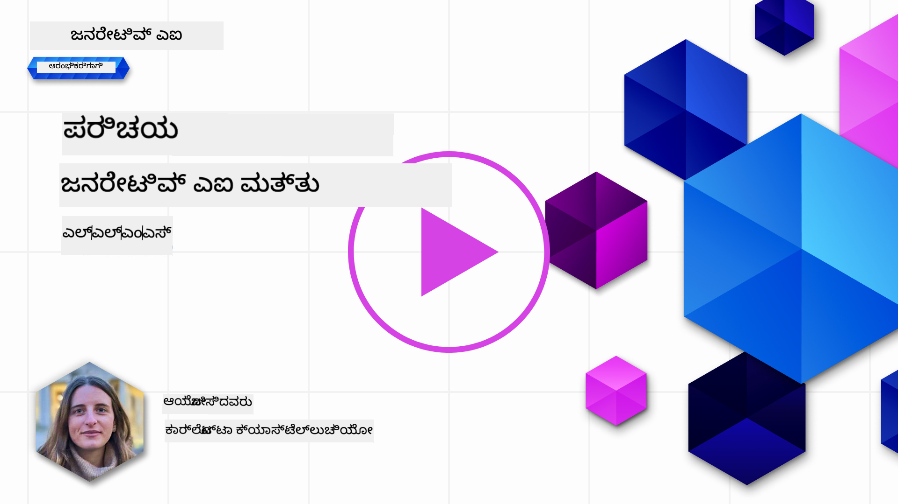
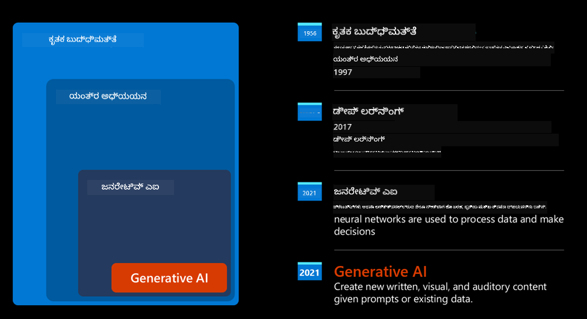
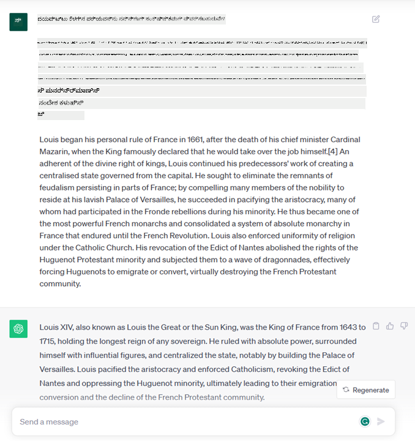
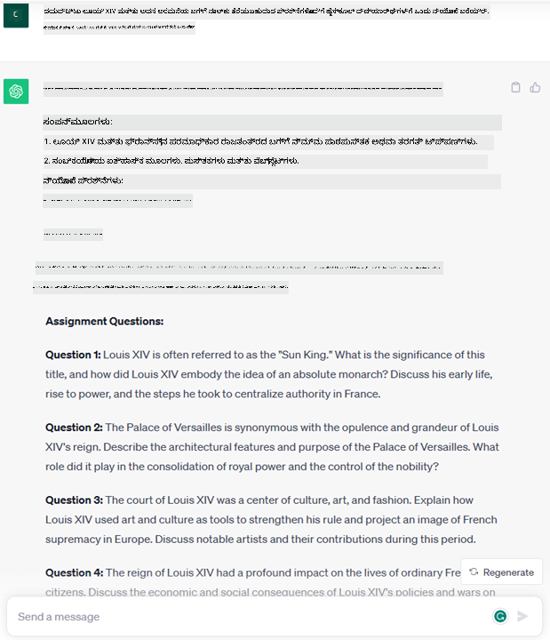
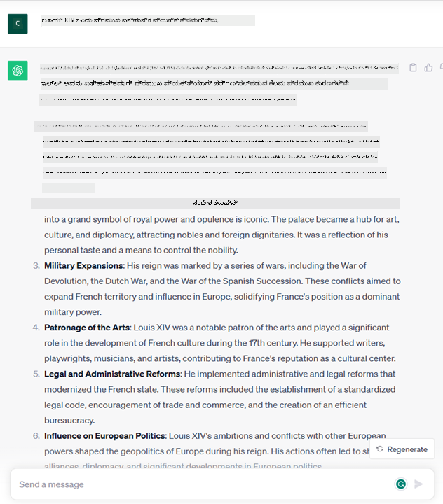
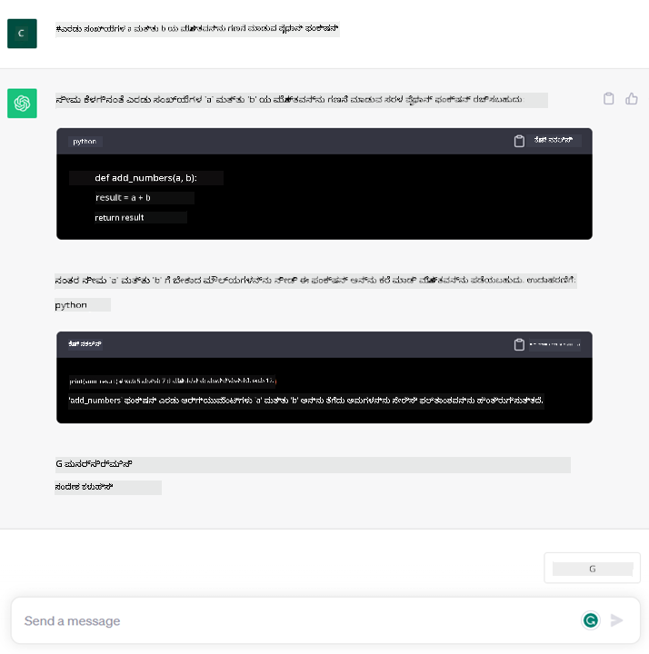

<!--
CO_OP_TRANSLATOR_METADATA:
{
  "original_hash": "bfb7901bdbece1ba3e9f35c400ca33e8",
  "translation_date": "2025-12-19T18:36:11+00:00",
  "source_file": "01-introduction-to-genai/README.md",
  "language_code": "kn"
}
-->
# ಜನರೇಟಿವ್ AI ಮತ್ತು ದೊಡ್ಡ ಭಾಷಾ ಮಾದರಿಗಳ ಪರಿಚಯ

_(ಈ ಪಾಠದ ವೀಡಿಯೋವನ್ನು ನೋಡಲು ಮೇಲಿನ ಚಿತ್ರವನ್ನು ಕ್ಲಿಕ್ ಮಾಡಿ)_

ಜನರೇಟಿವ್ AI ಎಂದರೆ ಪಠ್ಯ, ಚಿತ್ರಗಳು ಮತ್ತು ಇತರ ವಿಧದ ವಿಷಯಗಳನ್ನು ರಚಿಸುವ ಸಾಮರ್ಥ್ಯವಿರುವ ಕೃತಕ ಬುದ್ಧಿಮತ್ತೆ. ಇದನ್ನು ಅದ್ಭುತ ತಂತ್ರಜ್ಞಾನವಾಗಿಸುವುದು ಎಂದರೆ ಇದು AI ಅನ್ನು ಜನಸಾಮಾನ್ಯರಿಗೆ ಲಭ್ಯವಾಗಿಸುವುದು, ಯಾರಾದರೂ ಸ್ವಲ್ಪ ಪಠ್ಯ ಪ್ರಾಂಪ್ಟ್, ಸಹಜ ಭಾಷೆಯಲ್ಲಿ ಬರೆದ一句 ಮೂಲಕ ಇದನ್ನು ಬಳಸಬಹುದು. ನೀವು Java ಅಥವಾ SQL ಎಂಬ ಭಾಷೆಗಳನ್ನು ಕಲಿಯಬೇಕಾಗಿಲ್ಲ, ನೀವು ನಿಮ್ಮ ಭಾಷೆಯನ್ನು ಬಳಸಿಕೊಂಡು ನೀವು ಏನು ಬೇಕು ಎಂದು ಹೇಳಿ, AI ಮಾದರಿಯಿಂದ ಸಲಹೆ ಬರುತ್ತದೆ. ಇದರ ಅನ್ವಯಗಳು ಮತ್ತು ಪರಿಣಾಮಗಳು ಭಾರೀ, ನೀವು ವರದಿಗಳನ್ನು ಬರೆಯಬಹುದು ಅಥವಾ ಅರ್ಥಮಾಡಿಕೊಳ್ಳಬಹುದು, ಅಪ್ಲಿಕೇಶನ್‌ಗಳನ್ನು ಬರೆಯಬಹುದು ಮತ್ತು ಇನ್ನಷ್ಟು, ಎಲ್ಲವೂ ಸೆಕೆಂಡುಗಳಲ್ಲಿ.

ಈ ಪಠ್ಯಕ್ರಮದಲ್ಲಿ, ನಮ್ಮ ಸ್ಟಾರ್ಟ್ಅಪ್ ಜನರೇಟಿವ್ AI ಅನ್ನು ಶಿಕ್ಷಣ ಜಗತ್ತಿನಲ್ಲಿ ಹೊಸ ಸಂದರ್ಭಗಳನ್ನು ಅನ್ಲಾಕ್ ಮಾಡಲು ಹೇಗೆ ಬಳಸುತ್ತದೆ ಮತ್ತು ಅದರ ಅನ್ವಯದ ಸಾಮಾಜಿಕ ಪರಿಣಾಮಗಳು ಮತ್ತು ತಂತ್ರಜ್ಞಾನ ಮಿತಿಗಳನ್ನು ಹೇಗೆ ಎದುರಿಸುತ್ತೇವೆ ಎಂಬುದನ್ನು ಅನ್ವೇಷಿಸುವೆವು.

## ಪರಿಚಯ

ಈ ಪಾಠದಲ್ಲಿ ನಾವು ಚರ್ಚಿಸುವುದು:

- ವ್ಯವಹಾರ ಸಂದರ್ಭದ ಪರಿಚಯ: ನಮ್ಮ ಸ್ಟಾರ್ಟ್ಅಪ್ ಆಲೋಚನೆ ಮತ್ತು ಗುರಿ.
- ಜನರೇಟಿವ್ AI ಮತ್ತು ನಾವು ಪ್ರಸ್ತುತ ತಂತ್ರಜ್ಞಾನ ಪರಿಸರಕ್ಕೆ ಹೇಗೆ ಬಂದೆವು.
- ದೊಡ್ಡ ಭಾಷಾ ಮಾದರಿಯ ಒಳಗಿನ ಕಾರ್ಯವಿಧಾನ.
- ದೊಡ್ಡ ಭಾಷಾ ಮಾದರಿಗಳ ಪ್ರಮುಖ ಸಾಮರ್ಥ್ಯಗಳು ಮತ್ತು ಪ್ರಾಯೋಗಿಕ ಬಳಕೆ ಪ್ರಕರಣಗಳು.

## ಕಲಿಕೆಯ ಗುರಿಗಳು

ಈ ಪಾಠವನ್ನು ಪೂರ್ಣಗೊಳಿಸಿದ ನಂತರ, ನೀವು ತಿಳಿದುಕೊಳ್ಳುವಿರಿ:

- ಜನರೇಟಿವ್ AI ಎಂದರೇನು ಮತ್ತು ದೊಡ್ಡ ಭಾಷಾ ಮಾದರಿಗಳು ಹೇಗೆ ಕಾರ್ಯನಿರ್ವಹಿಸುತ್ತವೆ.
- ವಿವಿಧ ಬಳಕೆ ಪ್ರಕರಣಗಳಿಗೆ, ವಿಶೇಷವಾಗಿ ಶಿಕ್ಷಣ ಸಂದರ್ಭಗಳಿಗೆ, ದೊಡ್ಡ ಭಾಷಾ ಮಾದರಿಗಳನ್ನು ನೀವು ಹೇಗೆ ಬಳಸಬಹುದು.

## ಸಂದರ್ಭ: ನಮ್ಮ ಶಿಕ್ಷಣ ಸ್ಟಾರ್ಟ್ಅಪ್

ಜನರೇಟಿವ್ ಕೃತಕ ಬುದ್ಧಿಮತ್ತೆ (AI) AI ತಂತ್ರಜ್ಞಾನದ ಶಿಖರವನ್ನು ಪ್ರತಿನಿಧಿಸುತ್ತದೆ, ಸಾಧ್ಯವಿಲ್ಲವೆಂದು ಭಾವಿಸಿದುದನ್ನು ಮುರಿದುಹಾಕುತ್ತದೆ. ಜನರೇಟಿವ್ AI ಮಾದರಿಗಳಿಗೆ ಹಲವು ಸಾಮರ್ಥ್ಯಗಳು ಮತ್ತು ಅನ್ವಯಗಳು ಇವೆ, ಆದರೆ ಈ ಪಠ್ಯಕ್ರಮದಲ್ಲಿ ನಾವು ಕಲ್ಪನಾತ್ಮಕ ಸ್ಟಾರ್ಟ್ಅಪ್ ಮೂಲಕ ಶಿಕ್ಷಣದಲ್ಲಿ ಇದು ಹೇಗೆ ಕ್ರಾಂತಿ ತರುತ್ತಿದೆ ಎಂಬುದನ್ನು ಅನ್ವೇಷಿಸುವೆವು. ನಾವು ಈ ಸ್ಟಾರ್ಟ್ಅಪ್ ಅನ್ನು _ನಮ್ಮ ಸ್ಟಾರ್ಟ್ಅಪ್_ ಎಂದು ಕರೆಯುತ್ತೇವೆ. ನಮ್ಮ ಸ್ಟಾರ್ಟ್ಅಪ್ ಶಿಕ್ಷಣ ಕ್ಷೇತ್ರದಲ್ಲಿ ಕಾರ್ಯನಿರ್ವಹಿಸುತ್ತದೆ ಮತ್ತು ಮಹತ್ವಾಕಾಂಕ್ಷಿ ಗುರಿ ಹೇಳಿಕೆಯನ್ನು ಹೊಂದಿದೆ:

> _ಅಭ್ಯಾಸದಲ್ಲಿ ಪ್ರಾಪ್ಯತೆಯನ್ನು ಜಾಗತಿಕ ಮಟ್ಟದಲ್ಲಿ ಸುಧಾರಿಸುವುದು, ಸಮಾನ ಶಿಕ್ಷಣ ಪ್ರವೇಶವನ್ನು ಖಚಿತಪಡಿಸುವುದು ಮತ್ತು ಪ್ರತಿ ಕಲಿಕಾರ್ಥಿಯ ಅಗತ್ಯಗಳಿಗೆ ಅನುಗುಣವಾಗಿ ವೈಯಕ್ತಿಕ ಕಲಿಕೆಯ ಅನುಭವಗಳನ್ನು ಒದಗಿಸುವುದು_.

ನಮ್ಮ ಸ್ಟಾರ್ಟ್ಅಪ್ ತಂಡವು ಈ ಗುರಿಯನ್ನು ಸಾಧಿಸಲು ಆಧುನಿಕ ಕಾಲದ ಅತ್ಯಂತ ಶಕ್ತಿಶಾಲಿ ಸಾಧನಗಳಲ್ಲಿ ಒಂದಾದ ದೊಡ್ಡ ಭಾಷಾ ಮಾದರಿಗಳನ್ನು (LLMs) ಬಳಸದೆ ಸಾಧ್ಯವಿಲ್ಲವೆಂದು ತಿಳಿದಿದೆ.

ಜನರೇಟಿವ್ AI ಇಂದು ನಾವು ಕಲಿಯುವ ಮತ್ತು ಬೋಧಿಸುವ ರೀತಿಯನ್ನು ಕ್ರಾಂತಿಕಾರಿಯಾಗಿ ಬದಲಾಯಿಸುವ ನಿರೀಕ್ಷೆಯಿದೆ, ವಿದ್ಯಾರ್ಥಿಗಳಿಗೆ 24 ಗಂಟೆಗಳ ಕಾಲ ವರ್ಚುವಲ್ ಶಿಕ್ಷಕರು ಲಭ್ಯವಿದ್ದು, ಹೆಚ್ಚಿನ ಮಾಹಿತಿಗಳು ಮತ್ತು ಉದಾಹರಣೆಗಳನ್ನು ಒದಗಿಸುತ್ತಾರೆ, ಮತ್ತು ಶಿಕ್ಷಕರು ತಮ್ಮ ವಿದ್ಯಾರ್ಥಿಗಳನ್ನು ಮೌಲ್ಯಮಾಪನ ಮಾಡಲು ಮತ್ತು ಪ್ರತಿಕ್ರಿಯೆ ನೀಡಲು ನವೀನ ಸಾಧನಗಳನ್ನು ಬಳಸಬಹುದು.

ಆರಂಭಿಸಲು, ನಾವು ಈ ಪಠ್ಯಕ್ರಮದಲ್ಲಿ ಬಳಸಲಿರುವ ಕೆಲವು ಮೂಲಭೂತ ಪರಿಕಲ್ಪನೆಗಳು ಮತ್ತು ಪದಗಳನ್ನು ವ್ಯಾಖ್ಯಾನಿಸೋಣ.

## ಜನರೇಟಿವ್ AI ಹೇಗೆ ಬಂದಿತು?

ಇತ್ತೀಚೆಗೆ ಜನರೇಟಿವ್ AI ಮಾದರಿಗಳ ಘೋಷಣೆಯಿಂದ ಉಂಟಾದ ಅತಿರೇಕವಾದ _ಹೈಪ್_ ಇದ್ದರೂ, ಈ ತಂತ್ರಜ್ಞಾನ ದಶಕಗಳ ಕಾಲ ಅಭಿವೃದ್ಧಿಯಾಗುತ್ತಿದೆ, ಮೊದಲ ಸಂಶೋಧನಾ ಪ್ರಯತ್ನಗಳು 60ರ ದಶಕದವರೆಗೆ ಹಿಂತಿರುಗುತ್ತವೆ. ಈಗ ನಾವು ಮಾನವ ಸಂವಾದ ಸಾಮರ್ಥ್ಯಗಳನ್ನು ಹೊಂದಿರುವ AI ಮಟ್ಟಕ್ಕೆ ಬಂದಿದ್ದೇವೆ, ಉದಾಹರಣೆಗೆ [OpenAI ChatGPT](https://openai.com/chatgpt) ಅಥವಾ [Bing Chat](https://www.microsoft.com/edge/features/bing-chat?WT.mc_id=academic-105485-koreyst) ಇವು GPT ಮಾದರಿಯನ್ನು ಬಳಸಿ ವೆಬ್ ಶೋಧ Bing ಸಂವಾದಗಳನ್ನು ನಡೆಸುತ್ತವೆ.

ಸ್ವಲ್ಪ ಹಿಂದಕ್ಕೆ ಹೋಗಿ, AI ನ ಮೊದಲ ಪ್ರೋಟೋಟೈಪ್ಗಳು ಟೈಪ್ವ್ರಿಟನ್ ಚಾಟ್‌ಬಾಟ್‌ಗಳಾಗಿದ್ದು, ತಜ್ಞರ ಗುಂಪಿನಿಂದ ಸಂಗ್ರಹಿಸಿದ ಜ್ಞಾನ ಆಧಾರದ ಮೇಲೆ ಕಾರ್ಯನಿರ್ವಹಿಸುತ್ತಿದ್ದವು. ಜ್ಞಾನ ಆಧಾರದ ಉತ್ತರಗಳು ಇನ್‌ಪುಟ್ ಪಠ್ಯದಲ್ಲಿ ಕಾಣುವ ಕೀವರ್ಡ್‌ಗಳಿಂದ ಪ್ರೇರಿತವಾಗುತ್ತವೆ. ಆದರೆ, ಟೈಪ್ವ್ರಿಟನ್ ಚಾಟ್‌ಬಾಟ್‌ಗಳ ಬಳಕೆ ಉತ್ತಮವಾಗಿ ವಿಸ್ತಾರಗೊಳ್ಳಲಿಲ್ಲ ಎಂದು ಸ್ಪಷ್ಟವಾಯಿತು.

### AI ಗೆ ಸಾಂಖ್ಯಿಕ ವಿಧಾನ: ಯಂತ್ರ ಅಧ್ಯಯನ

90ರ ದಶಕದಲ್ಲಿ ಪಠ್ಯ ವಿಶ್ಲೇಷಣೆಗೆ ಸಾಂಖ್ಯಿಕ ವಿಧಾನವನ್ನು ಅನ್ವಯಿಸುವ ಮೂಲಕ ತಿರುವು ಬಂತು. ಇದರಿಂದ ಯಂತ್ರ ಅಧ್ಯಯನ ಎಂದು ಕರೆಯಲ್ಪಡುವ ಹೊಸ ಅಲ್ಗಾರಿದಮ್‌ಗಳು ಅಭಿವೃದ್ಧಿಪಡಿಸಲ್ಪಟ್ಟವು, ಅವು ಸ್ಪಷ್ಟವಾಗಿ ಪ್ರೋಗ್ರಾಮ್ ಮಾಡದೆ ಡೇಟಾದಿಂದ ಮಾದರಿಗಳನ್ನು ಕಲಿಯುತ್ತವೆ. ಈ ವಿಧಾನ ಯಂತ್ರಗಳಿಗೆ ಮಾನವ ಭಾಷೆ ಅರ್ಥಮಾಡಿಕೊಳ್ಳುವಂತೆ ಅನುಕರಿಸಲು ಸಹಾಯ ಮಾಡಿತು: ಪಠ್ಯ-ಲೇಬಲ್ ಜೋಡಣೆಗಳ ಮೇಲೆ ತರಬೇತಿ ಪಡೆದ ಸಾಂಖ್ಯಿಕ ಮಾದರಿ, ಅಜ್ಞಾತ ಇನ್‌ಪುಟ್ ಪಠ್ಯವನ್ನು ಸಂದೇಶದ ಉದ್ದೇಶವನ್ನು ಪ್ರತಿನಿಧಿಸುವ ಪೂರ್ವನಿರ್ಧರಿತ ಲೇಬಲ್‌ನೊಂದಿಗೆ ವರ್ಗೀಕರಿಸಲು ಸಾಧ್ಯವಿದೆ.

### ನ್ಯೂರಲ್ ನೆಟ್‌ವರ್ಕ್‌ಗಳು ಮತ್ತು ಆಧುನಿಕ ವರ್ಚುವಲ್ ಸಹಾಯಕರು

ಇತ್ತೀಚಿನ ವರ್ಷಗಳಲ್ಲಿ, ಹೆಚ್ಚಿನ ಡೇಟಾ ಮತ್ತು ಸಂಕೀರ್ಣ ಗಣನೆಗಳನ್ನು ನಿರ್ವಹಿಸುವ ಸಾಮರ್ಥ್ಯವಿರುವ ಹಾರ್ಡ್‌ವೇರ್ ತಂತ್ರಜ್ಞಾನ ಅಭಿವೃದ್ಧಿಯು AI ಸಂಶೋಧನೆಯನ್ನು ಉತ್ತೇಜಿಸಿತು, ಇದರಿಂದ ನ್ಯೂರಲ್ ನೆಟ್‌ವರ್ಕ್‌ಗಳು ಅಥವಾ ಡೀಪ್ ಲರ್ನಿಂಗ್ ಅಲ್ಗಾರಿದಮ್‌ಗಳು ಅಭಿವೃದ್ಧಿಪಡಿಸಲ್ಪಟ್ಟವು.

ನ್ಯೂರಲ್ ನೆಟ್‌ವರ್ಕ್‌ಗಳು (ವಿಶೇಷವಾಗಿ ರಿಕರೆಂಟ್ ನ್ಯೂರಲ್ ನೆಟ್‌ವರ್ಕ್‌ಗಳು – RNNಗಳು) ಸಹಜ ಭಾಷಾ ಪ್ರಕ್ರಿಯೆಯನ್ನು ಬಹುಮಟ್ಟಿಗೆ ಸುಧಾರಿಸಿದವು, ಪಠ್ಯದ ಅರ್ಥವನ್ನು ಹೆಚ್ಚು ಅರ್ಥಪೂರ್ಣವಾಗಿ ಪ್ರತಿನಿಧಿಸುವಂತೆ, ವಾಕ್ಯದಲ್ಲಿ ಪದದ ಸಾಂದರ್ಭಿಕತೆಯನ್ನು ಮೌಲ್ಯಮಾಪನ ಮಾಡುತ್ತವೆ.

ಈ ತಂತ್ರಜ್ಞಾನವು ಹೊಸ ಶತಮಾನದ ಮೊದಲ ದಶಕದಲ್ಲಿ ಹುಟ್ಟಿದ ವರ್ಚುವಲ್ ಸಹಾಯಕರನ್ನು ಶಕ್ತಿಶಾಲಿಯಾಗಿ ಮಾಡಿತು, ಮಾನವ ಭಾಷೆಯನ್ನು ಅರ್ಥಮಾಡಿಕೊಳ್ಳುವಲ್ಲಿ, ಅಗತ್ಯವನ್ನು ಗುರುತಿಸುವಲ್ಲಿ ಮತ್ತು ಅದನ್ನು ತೃಪ್ತಿಪಡಿಸಲು ಕ್ರಮ ಕೈಗೊಳ್ಳುವಲ್ಲಿ ಪರಿಣತರು – ಪೂರ್ವನಿರ್ಧರಿತ ಸ್ಕ್ರಿಪ್ಟ್‌ನೊಂದಿಗೆ ಉತ್ತರಿಸುವುದು ಅಥವಾ 3ನೇ ಪಕ್ಷದ ಸೇವೆಯನ್ನು ಉಪಯೋಗಿಸುವುದು.

### ಇಂದಿನ ದಿನ, ಜನರೇಟಿವ್ AI

ಹೀಗಾಗಿ ನಾವು ಇಂದು ಜನರೇಟಿವ್ AI ಗೆ ಬಂದಿದ್ದೇವೆ, ಇದು ಡೀಪ್ ಲರ್ನಿಂಗ್‌ನ ಉಪವರ್ಗವೆಂದು ಕಾಣಬಹುದು.

AI ಕ್ಷೇತ್ರದಲ್ಲಿ ದಶಕಗಳ ಸಂಶೋಧನೆಯ ನಂತರ, _ಟ್ರಾನ್ಸ್‌ಫಾರ್ಮರ್_ ಎಂಬ ಹೊಸ ಮಾದರಿ ವಾಸ್ತುಶಿಲ್ಪವು RNNಗಳ ಮಿತಿಗಳನ್ನು ಮೀರಿ, ಬಹಳ ಉದ್ದದ ಪಠ್ಯ ಸರಣಿಗಳನ್ನು ಇನ್‌ಪುಟ್ ಆಗಿ ಪಡೆಯಲು ಸಾಧ್ಯವಾಯಿತು. ಟ್ರಾನ್ಸ್‌ಫಾರ್ಮರ್‌ಗಳು ಗಮನ ಯಂತ್ರಣೆಯ ಮೇಲೆ ಆಧಾರಿತವಾಗಿದ್ದು, ಮಾದರಿಗೆ ಸ್ವೀಕರಿಸಿದ ಇನ್‌ಪುಟ್‌ಗಳಿಗೆ ವಿಭಿನ್ನ ತೂಕಗಳನ್ನು ನೀಡಲು ಸಹಾಯ ಮಾಡುತ್ತವೆ, ಪಠ್ಯ ಸರಣಿಯಲ್ಲಿ ಅವುಗಳ ಕ್ರಮವನ್ನು ಪರಿಗಣಿಸದೆ ಅತ್ಯಂತ ಸಂಬಂಧಿತ ಮಾಹಿತಿಗೆ 'ಹೆಚ್ಚು ಗಮನ' ನೀಡುತ್ತವೆ.

ಇತ್ತೀಚಿನ ಜನರೇಟಿವ್ AI ಮಾದರಿಗಳ ಬಹುತೇಕವು – ದೊಡ್ಡ ಭಾಷಾ ಮಾದರಿಗಳು (LLMs) ಎಂದು ಕರೆಯಲ್ಪಡುವವು, ಏಕೆಂದರೆ ಅವು ಪಠ್ಯ ಇನ್‌ಪುಟ್ ಮತ್ತು ಔಟ್‌ಪುಟ್‌ಗಳೊಂದಿಗೆ ಕಾರ್ಯನಿರ್ವಹಿಸುತ್ತವೆ – ಈ ವಾಸ್ತುಶಿಲ್ಪದ ಮೇಲೆ ಆಧಾರಿತವಾಗಿವೆ. ಈ ಮಾದರಿಗಳು ಪುಸ್ತಕಗಳು, ಲೇಖನಗಳು ಮತ್ತು ವೆಬ್‌ಸೈಟ್‌ಗಳಂತಹ ವಿಭಿನ್ನ ಮೂಲಗಳಿಂದ ಲೇಬಲ್ ಇಲ್ಲದ ದೊಡ್ಡ ಪ್ರಮಾಣದ ಡೇಟಾದ ಮೇಲೆ ತರಬೇತಿ ಪಡೆದಿರುವುದರಿಂದ, ಅವುಗಳನ್ನು ವಿವಿಧ ಕಾರ್ಯಗಳಿಗೆ ಹೊಂದಿಕೊಳ್ಳಲು ಮತ್ತು ಸೃಜನಾತ್ಮಕತೆಯ ಅಂಶದೊಂದಿಗೆ ವ್ಯಾಕರಣಾತ್ಮಕವಾಗಿ ಸರಿಯಾದ ಪಠ್ಯವನ್ನು ರಚಿಸಲು ಸಾಧ್ಯ. ಹೀಗಾಗಿ, ಅವುಗಳು ಯಂತ್ರಕ್ಕೆ ಇನ್‌ಪುಟ್ ಪಠ್ಯವನ್ನು 'ಅರ್ಥಮಾಡಿಕೊಳ್ಳುವ' ಸಾಮರ್ಥ್ಯವನ್ನು ಬಹುಮಟ್ಟಿಗೆ ಸುಧಾರಿಸಿದಷ್ಟೇ ಅಲ್ಲ, ಮಾನವ ಭಾಷೆಯಲ್ಲಿ ಮೂಲ ಪ್ರತಿಕ್ರಿಯೆಯನ್ನು ರಚಿಸುವ ಸಾಮರ್ಥ್ಯವನ್ನು ಸಹ ಒದಗಿಸಿದವು.

## ದೊಡ್ಡ ಭಾಷಾ ಮಾದರಿಗಳು ಹೇಗೆ ಕಾರ್ಯನಿರ್ವಹಿಸುತ್ತವೆ?

ಮುಂದಿನ ಅಧ್ಯಾಯದಲ್ಲಿ ನಾವು ವಿವಿಧ ರೀತಿಯ ಜನರೇಟಿವ್ AI ಮಾದರಿಗಳನ್ನು ಅನ್ವೇಷಿಸುವೆವು, ಆದರೆ ಈಗ ದೊಡ್ಡ ಭಾಷಾ ಮಾದರಿಗಳು ಹೇಗೆ ಕಾರ್ಯನಿರ್ವಹಿಸುತ್ತವೆ ಎಂಬುದನ್ನು, ವಿಶೇಷವಾಗಿ OpenAI GPT (ಜನರೇಟಿವ್ ಪ್ರೀ-ಟ್ರೇನ್ಡ್ ಟ್ರಾನ್ಸ್‌ಫಾರ್ಮರ್) ಮಾದರಿಗಳ ಮೇಲೆ ಗಮನಹರಿಸೋಣ.

- **ಟೋಕನೈಜರ್, ಪಠ್ಯದಿಂದ ಸಂಖ್ಯೆಗಳವರೆಗೆ**: ದೊಡ್ಡ ಭಾಷಾ ಮಾದರಿಗಳು ಪಠ್ಯವನ್ನು ಇನ್‌ಪುಟ್ ಆಗಿ ಸ್ವೀಕರಿಸಿ ಪಠ್ಯವನ್ನು ಔಟ್‌ಪುಟ್ ಆಗಿ ರಚಿಸುತ್ತವೆ. ಆದರೆ, ಸಾಂಖ್ಯಿಕ ಮಾದರಿಗಳಾಗಿರುವುದರಿಂದ, ಅವು ಪಠ್ಯ ಸರಣಿಗಳಿಗಿಂತ ಸಂಖ್ಯೆಗಳೊಂದಿಗೆ ಉತ್ತಮವಾಗಿ ಕಾರ್ಯನಿರ್ವಹಿಸುತ್ತವೆ. ಆದ್ದರಿಂದ, ಮಾದರಿಗೆ ನೀಡುವ ಪ್ರತಿಯೊಂದು ಇನ್‌ಪುಟ್ ಟೋಕನೈಜರ್ ಮೂಲಕ ಪ್ರಕ್ರಿಯೆಗೊಳಿಸಲಾಗುತ್ತದೆ. ಟೋಕನ್ ಎಂದರೆ ಪಠ್ಯದ ಒಂದು ತುಂಡು – ಅಕ್ಷರಗಳ ಬದಲಾಗುವ ಸಂಖ್ಯೆಯ ಗುಚ್ಛ – ಆದ್ದರಿಂದ ಟೋಕನೈಜರ್‌ನ ಮುಖ್ಯ ಕಾರ್ಯ ಇನ್‌ಪುಟ್ ಅನ್ನು ಟೋಕನ್‌ಗಳ ಸರಣಿಯಾಗಿ ವಿಭಜಿಸುವುದು. ನಂತರ, ಪ್ರತಿ ಟೋಕನ್ ಅನ್ನು ಟೋಕನ್ ಸೂಚ್ಯಂಕದೊಂದಿಗೆ ನಕ್ಷೆ ಮಾಡಲಾಗುತ್ತದೆ, ಇದು ಮೂಲ ಪಠ್ಯ ತುಂಡಿನ ಪೂರ್ಣಾಂಕ ಎನ್‌ಕೋಡಿಂಗ್ ಆಗಿದೆ.

- **ಔಟ್‌ಪುಟ್ ಟೋಕನ್‌ಗಳ ಭವಿಷ್ಯವಾಣಿ**: n ಟೋಕನ್‌ಗಳನ್ನು ಇನ್‌ಪುಟ್ ಆಗಿ ನೀಡಿದಾಗ (ಮಾದರಿಯಿಂದ ಮಾದರಿಗೆ ಗರಿಷ್ಠ n ಬದಲಾಗುತ್ತದೆ), ಮಾದರಿ ಒಂದು ಟೋಕನ್ ಅನ್ನು ಔಟ್‌ಪುಟ್ ಆಗಿ ಭವಿಷ್ಯವಾಣಿ ಮಾಡುತ್ತದೆ. ಈ ಟೋಕನ್ ನಂತರ ಮುಂದಿನ ಪುನರಾವೃತ್ತಿಯ ಇನ್‌ಪುಟ್‌ಗೆ ಸೇರಿಸಲಾಗುತ್ತದೆ, ವಿಸ್ತಾರಗೊಳ್ಳುವ ವಿಂಡೋ ಮಾದರಿಯಲ್ಲಿ, ಇದರಿಂದ ಬಳಕೆದಾರರಿಗೆ ಒಂದು (ಅಥವಾ ಹಲವಾರು) ವಾಕ್ಯಗಳನ್ನು ಉತ್ತರವಾಗಿ ಪಡೆಯಲು ಉತ್ತಮ ಅನುಭವ ಸಿಗುತ್ತದೆ. ಇದರಿಂದ, ನೀವು ChatGPT ಜೊತೆಗೆ ಆಡಿದಾಗ, ಕೆಲವೊಮ್ಮೆ ಅದು ವಾಕ್ಯದ ಮಧ್ಯದಲ್ಲಿ ನಿಲ್ಲಿಸುವಂತೆ ಕಾಣಬಹುದು ಎಂಬುದನ್ನು ನೀವು ಗಮನಿಸಿದ್ದೀರಾ ಎಂಬುದನ್ನು ವಿವರಿಸುತ್ತದೆ.

- **ಆಯ್ಕೆ ಪ್ರಕ್ರಿಯೆ, ಸಾಧ್ಯತೆ ವಿತರಣಾ**: ಔಟ್‌ಪುಟ್ ಟೋಕನ್ ಅನ್ನು ಮಾದರಿ ಪ್ರಸ್ತುತ ಪಠ್ಯ ಸರಣಿಯ ನಂತರ ಸಂಭವಿಸುವ ಸಾಧ್ಯತೆಯ ಆಧಾರದ ಮೇಲೆ ಆಯ್ಕೆ ಮಾಡುತ್ತದೆ. ಇದು ಮಾದರಿ ತನ್ನ ತರಬೇತಿಯ ಆಧಾರದ ಮೇಲೆ ಎಲ್ಲಾ ಸಾಧ್ಯ 'ಮುಂದಿನ ಟೋಕನ್‌ಗಳ' ಮೇಲೆ ಸಾಧ್ಯತೆ ವಿತರಣೆಯನ್ನು ಭವಿಷ್ಯವಾಣಿ ಮಾಡುತ್ತದೆ. ಆದರೆ, ಯಾವಾಗಲೂ ಅತ್ಯಧಿಕ ಸಾಧ್ಯತೆಯ ಟೋಕನ್ ಆಯ್ಕೆ ಮಾಡಲಾಗುವುದಿಲ್ಲ. ಈ ಆಯ್ಕೆಗೆ ಒಂದು ಮಟ್ಟದ ಯಾದೃಚ್ಛಿಕತೆ ಸೇರಿಸಲಾಗುತ್ತದೆ, ಇದರಿಂದ ಮಾದರಿ ನಿರ್ಧಾರಾತ್ಮಕವಲ್ಲದ ರೀತಿಯಲ್ಲಿ ಕಾರ್ಯನಿರ್ವಹಿಸುತ್ತದೆ - ಅದೇ ಇನ್‌ಪುಟ್‌ಗೆ ನಾವು ಯಾವಾಗಲೂ ಅದೇ ಔಟ್‌ಪುಟ್ ಪಡೆಯುವುದಿಲ್ಲ. ಈ ಯಾದೃಚ್ಛಿಕತೆ ಸೃಜನಾತ್ಮಕ ಚಿಂತನೆಯ ಪ್ರಕ್ರಿಯೆಯನ್ನು ಅನುಕರಿಸಲು ಸೇರಿಸಲಾಗುತ್ತದೆ ಮತ್ತು ಇದನ್ನು ಮಾದರಿ ಪರಿಮಾಣವಾದ ತಾಪಮಾನ ಬಳಸಿ ಹೊಂದಿಸಬಹುದು.

## ನಮ್ಮ ಸ್ಟಾರ್ಟ್ಅಪ್ ದೊಡ್ಡ ಭಾಷಾ ಮಾದರಿಗಳನ್ನು ಹೇಗೆ ಬಳಸಬಹುದು?

ನಾವು ದೊಡ್ಡ ಭಾಷಾ ಮಾದರಿಯ ಒಳಗಿನ ಕಾರ್ಯವಿಧಾನವನ್ನು ಉತ್ತಮವಾಗಿ ಅರ್ಥಮಾಡಿಕೊಂಡಿದ್ದೇವೆ, ಈಗ ಅವುಗಳು ಬಹುಮಾನವಾಗಿ ಮಾಡಬಹುದಾದ ಸಾಮಾನ್ಯ ಕಾರ್ಯಗಳ ಕೆಲವು ಪ್ರಾಯೋಗಿಕ ಉದಾಹರಣೆಗಳನ್ನು ನೋಡೋಣ, ನಮ್ಮ ವ್ಯವಹಾರ ಸಂದರ್ಭದ ದೃಷ್ಟಿಕೋನದಿಂದ.

ನಾವು ಹೇಳಿದ್ದು, ದೊಡ್ಡ ಭಾಷಾ ಮಾದರಿಯ ಮುಖ್ಯ ಸಾಮರ್ಥ್ಯವೆಂದರೆ _ಸ್ವತಃ ಪ್ರಾರಂಭದಿಂದ ಪಠ್ಯವನ್ನು ರಚಿಸುವುದು, ಸಹಜ ಭಾಷೆಯಲ್ಲಿ ಬರೆದ ಪಠ್ಯ ಇನ್‌ಪುಟ್‌ನಿಂದ_.

ಆದರೆ ಯಾವ ರೀತಿಯ ಪಠ್ಯ ಇನ್‌ಪುಟ್ ಮತ್ತು ಔಟ್‌ಪುಟ್?
ದೊಡ್ಡ ಭಾಷಾ ಮಾದರಿಯ ಇನ್‌ಪುಟ್ ಅನ್ನು ಪ್ರಾಂಪ್ಟ್ ಎಂದು ಕರೆಯಲಾಗುತ್ತದೆ, ಮತ್ತು ಔಟ್‌ಪುಟ್ ಅನ್ನು ಪೂರ್ಣಗೊಳಿಸುವಿಕೆ ಎಂದು ಕರೆಯಲಾಗುತ್ತದೆ, ಇದು ಪ್ರಸ್ತುತ ಇನ್‌ಪುಟ್ ಅನ್ನು ಪೂರ್ಣಗೊಳಿಸಲು ಮುಂದಿನ ಟೋಕನ್ ರಚಿಸುವ ಮಾದರಿ ಯಂತ್ರಣೆಯನ್ನು ಸೂಚಿಸುತ್ತದೆ. ನಾವು ಪ್ರಾಂಪ್ಟ್ ಎಂದರೇನು ಮತ್ತು ಅದನ್ನು ಹೇಗೆ ವಿನ್ಯಾಸಗೊಳಿಸಬೇಕು ಎಂಬುದನ್ನು ಆಳವಾಗಿ ನೋಡೋಣ. ಆದರೆ ಈಗಿಗೆ, ಪ್ರಾಂಪ್ಟ್ ಒಳಗೊಂಡಿರಬಹುದು:

- ಮಾದರಿಯಿಂದ ನಾವು ನಿರೀಕ್ಷಿಸುವ ಔಟ್‌ಪುಟ್ ಪ್ರಕಾರವನ್ನು ಸೂಚಿಸುವ **ಸೂಚನೆ**. ಈ ಸೂಚನೆ ಕೆಲವೊಮ್ಮೆ ಕೆಲವು ಉದಾಹರಣೆಗಳು ಅಥವಾ ಹೆಚ್ಚುವರಿ ಡೇಟಾವನ್ನು ಒಳಗೊಂಡಿರಬಹುದು.

  1. ಲೇಖನ, ಪುಸ್ತಕ, ಉತ್ಪನ್ನ ವಿಮರ್ಶೆಗಳ ಸಾರಾಂಶ ಮತ್ತು ಅಸಂರಚಿತ ಡೇಟಾದಿಂದ ಒಳನೋಟಗಳನ್ನು ಹೊರತೆಗೆಯುವುದು.
    
    
  
  2. ಲೇಖನ, ಪ್ರಬಂಧ, ನಿಯೋಜನೆ ಅಥವಾ ಇನ್ನಷ್ಟು ಸೃಜನಾತ್ಮಕ ಕಲ್ಪನೆ ಮತ್ತು ವಿನ್ಯಾಸ.
      
     

- ಏಜೆಂಟ್ ಜೊತೆಗೆ ಸಂವಾದ ರೂಪದಲ್ಲಿ ಕೇಳಲಾದ **ಪ್ರಶ್ನೆ**.
  
  

- ಸಹಾಯಕ್ಕಾಗಿ ಬರೆಯುವಂತೆ ಅರ್ಥೈಸಬಹುದಾದ ಪೂರ್ಣಗೊಳಿಸಲು ಬೇಕಾದ **ಪಠ್ಯದ ತುಂಡು**.
  
  

- ವಿವರಿಸುವುದು ಮತ್ತು ದಾಖಲೆ ಮಾಡುವುದು ಅಥವಾ ನಿರ್ದಿಷ್ಟ ಕಾರ್ಯವನ್ನು ನಿರ್ವಹಿಸುವ ಕೋಡ್ ತುಂಡನ್ನು ರಚಿಸುವಂತೆ ಕೇಳುವ **ಕೋಡ್** ತುಂಡು.
  
  

ಮೇಲಿನ ಉದಾಹರಣೆಗಳು ಸರಳವಾಗಿದ್ದು, ದೊಡ್ಡ ಭಾಷಾ ಮಾದರಿಗಳ ಸಾಮರ್ಥ್ಯಗಳ ಸಂಪೂರ್ಣ ಪ್ರದರ್ಶನವಲ್ಲ. ಅವು ಜನರೇಟಿವ್ AI ಬಳಕೆಯ ಸಾಧ್ಯತೆಯನ್ನು, ವಿಶೇಷವಾಗಿ ಆದರೆ ಶಿಕ್ಷಣ ಸನ್ನಿವೇಶಗಳಿಗೆ ಮಾತ್ರವಲ್ಲದೆ, ತೋರಿಸಲು ಉದ್ದೇಶಿಸಲಾಗಿದೆ.

ಮತ್ತೊಂದು ವಿಷಯವೆಂದರೆ, ಜನರೇಟಿವ್ AI ಮಾದರಿಯ ಔಟ್‌ಪುಟ್ ಪರಿಪೂರ್ಣವಲ್ಲ ಮತ್ತು ಕೆಲವೊಮ್ಮೆ ಮಾದರಿಯ ಸೃಜನಾತ್ಮಕತೆ ಅದಕ್ಕೆ ವಿರುದ್ಧವಾಗಿ ಕೆಲಸ ಮಾಡಬಹುದು, ಪರಿಣಾಮವಾಗಿ ಮಾನವ ಬಳಕೆದಾರರು ವಾಸ್ತವಿಕತೆಯ ಮಿಥ್ಯೀಕರಣವೆಂದು ಅರ್ಥಮಾಡಿಕೊಳ್ಳಬಹುದಾದ ಪದಗಳ ಸಂಯೋಜನೆಯಾಗಿರಬಹುದು ಅಥವಾ ಅದು ಅಪಮಾನಕಾರಿಯಾಗಬಹುದು. ಜನರೇಟಿವ್ AI ಬುದ್ಧಿವಂತಿಕೆ ಹೊಂದಿಲ್ಲ - ಕನಿಷ್ಠ ಬುದ್ಧಿವಂತಿಕೆಯ ವ್ಯಾಪಕ ವ್ಯಾಖ್ಯಾನದಲ್ಲಿ, ಕ್ರಿಟಿಕಲ್ ಮತ್ತು ಸೃಜನಾತ್ಮಕ ತರ್ಕ ಅಥವಾ ಭಾವನಾತ್ಮಕ ಬುದ್ಧಿವಂತಿಕೆಯನ್ನು ಒಳಗೊಂಡಂತೆ; ಇದು ನಿರ್ಧಾರಾತ್ಮಕವಲ್ಲ ಮತ್ತು ವಿಶ್ವಾಸಾರ್ಹವಲ್ಲ, ಏಕೆಂದರೆ ತಪ್ಪು ಉಲ್ಲೇಖಗಳು, ವಿಷಯ ಮತ್ತು ಹೇಳಿಕೆಗಳು ಸರಿಯಾದ ಮಾಹಿತಿಯೊಂದಿಗೆ ಸಂಯೋಜಿತವಾಗಬಹುದು ಮತ್ತು ಪ್ರಭಾವಶಾಲಿ ಮತ್ತು ಆತ್ಮವಿಶ್ವಾಸದೊಂದಿಗೆ ಪ್ರಸ್ತುತಪಡಿಸಬಹುದು. ಮುಂದಿನ ಪಾಠಗಳಲ್ಲಿ, ನಾವು ಈ ಎಲ್ಲಾ ಮಿತಿಗಳನ್ನು ಎದುರಿಸುವೆವು ಮತ್ತು ಅವುಗಳನ್ನು ಕಡಿಮೆ ಮಾಡಲು ಏನು ಮಾಡಬಹುದು ಎಂಬುದನ್ನು ನೋಡೋಣ.

## ಕಾರ್ಯ

ನಿಮ್ಮ ಕಾರ್ಯ [ಜನರೇಟಿವ್ AI](https://en.wikipedia.org/wiki/Generative_artificial_intelligence?WT.mc_id=academic-105485-koreyst) ಬಗ್ಗೆ ಇನ್ನಷ್ಟು ಓದಿ, ಮತ್ತು ನೀವು ಇಂದು ಜನರೇಟಿವ್ AI ಇಲ್ಲದಿರುವ ಕ್ಷೇತ್ರವನ್ನು ಗುರುತಿಸಿ. "ಹಳೆಯ ವಿಧಾನ"ದಿಂದ ಮಾಡುವುದು ಹೇಗೆ ವಿಭಿನ್ನವಾಗುತ್ತದೆ, ನೀವು ಮೊದಲು ಮಾಡಲಾಗದಿದ್ದುದನ್ನು ಮಾಡಬಹುದೇ, ಅಥವಾ ನೀವು ವೇಗವಾಗಿ ಮಾಡಬಹುದೇ? ನಿಮ್ಮ ಕನಸುಗಳ AI ಸ್ಟಾರ್ಟ್ಅಪ್ ಹೇಗಿರುತ್ತದೆ ಎಂಬುದರ ಬಗ್ಗೆ 300 ಪದಗಳ ಸಾರಾಂಶವನ್ನು ಬರೆಯಿರಿ ಮತ್ತು "ಸಮಸ್ಯೆ", "ನಾನು AI ಅನ್ನು ಹೇಗೆ ಬಳಸುತ್ತೇನೆ", "ಪರಿಣಾಮ" ಮತ್ತು ಐಚ್ಛಿಕವಾಗಿ ವ್ಯವಹಾರ ಯೋಜನೆ ಎಂಬ ಶೀರ್ಷಿಕೆಗಳನ್ನು ಸೇರಿಸಿ.

ನೀವು ಈ ಕಾರ್ಯವನ್ನು ಮಾಡಿದರೆ, ನೀವು Microsoft's ಇಂಕ್ಯುಬೇಟರ್‌ಗೆ ಅರ್ಜಿ ಸಲ್ಲಿಸಲು ಸಿದ್ಧರಾಗಿರಬಹುದು, [Microsoft for Startups Founders Hub](https://www.microsoft.com/startups?WT.mc_id=academic-105485-koreyst) ನಾವು Azure, OpenAI, ಮಾರ್ಗದರ್ಶನ ಮತ್ತು ಇನ್ನಷ್ಟುಗಾಗಿ ಕ್ರೆಡಿಟ್‌ಗಳನ್ನು ನೀಡುತ್ತೇವೆ, ಪರಿಶೀಲಿಸಿ!

## ಜ್ಞಾನ ಪರಿಶೀಲನೆ

ದೊಡ್ಡ ಭಾಷಾ ಮಾದರಿಗಳ ಬಗ್ಗೆ ಯಾವುದು ಸತ್ಯ?

1. ನೀವು ಪ್ರತಿಯೊಮ್ಮೆ ಅದೇ ಉತ್ತರವನ್ನು ಪಡೆಯುತ್ತೀರಿ.
1. ಇದು ಪರಿಪೂರ್ಣವಾಗಿ ಕಾರ್ಯನಿರ್ವಹಿಸುತ್ತದೆ, ಸಂಖ್ಯೆಗಳ ಸೇರಿಸುವುದು, ಕಾರ್ಯನಿರ್ವಹಿಸುವ ಕೋಡ್ ರಚಿಸುವುದು ಇತ್ಯಾದಿಯಲ್ಲಿ ಉತ್ತಮ.
1. ಅದೇ ಪ್ರಾಂಪ್ಟ್ ಬಳಸದರೂ ಉತ್ತರ ಬದಲಾಗಬಹುದು. ಇದು ಪಠ್ಯ ಅಥವಾ ಕೋಡ್ ಆಗಿರಲಿ, ನಿಮಗೆ ಮೊದಲ ಡ್ರಾಫ್ಟ್ ನೀಡಲು ಉತ್ತಮವಾಗಿದೆ. ಆದರೆ ನೀವು ಫಲಿತಾಂಶಗಳನ್ನು ಸುಧಾರಿಸಬೇಕಾಗುತ್ತದೆ.

ಉತ್ತರ: 3, LLM ನಿರ್ಧಾರಾತ್ಮಕವಲ್ಲ, ಉತ್ತರ ಬದಲಾಗುತ್ತದೆ, ಆದರೆ ನೀವು ಅದರ ಬದಲಾಗುವಿಕೆಯನ್ನು ತಾಪಮಾನ ಸೆಟ್ಟಿಂಗ್ ಮೂಲಕ ನಿಯಂತ್ರಿಸಬಹುದು. ಇದು ಪರಿಪೂರ್ಣವಾಗಿ ಕಾರ್ಯನಿರ್ವಹಿಸುವುದನ್ನು ನಿರೀಕ್ಷಿಸಬಾರದು, ಇದು ನಿಮಗಾಗಿ ಭಾರವಾದ ಕೆಲಸವನ್ನು ಮಾಡುತ್ತದೆ, ಇದು ನೀವು ಕ್ರಮೇಣ ಸುಧಾರಿಸಬೇಕಾದ ಉತ್ತಮ ಮೊದಲ ಪ್ರಯತ್ನವನ್ನು ನೀಡುತ್ತದೆ.

## ಅದ್ಭುತ ಕೆಲಸ! ಪ್ರಯಾಣವನ್ನು ಮುಂದುವರೆಸಿ

ಈ ಪಾಠವನ್ನು ಪೂರ್ಣಗೊಳಿಸಿದ ನಂತರ, ನಮ್ಮ [ಜನರೇಟಿವ್ AI ಕಲಿಕೆ ಸಂಗ್ರಹ](https://aka.ms/genai-collection?WT.mc_id=academic-105485-koreyst) ಅನ್ನು ಪರಿಶೀಲಿಸಿ ಮತ್ತು ನಿಮ್ಮ ಜನರೇಟಿವ್ AI ಜ್ಞಾನವನ್ನು ಮತ್ತಷ್ಟು ಹೆಚ್ಚಿಸಿ!
ಪಾಠ 2ಕ್ಕೆ ಹೋಗಿ ಅಲ್ಲಿ ನಾವು [ವಿಭಿನ್ನ LLM ಪ್ರಕಾರಗಳನ್ನು ಅನ್ವೇಷಿಸಿ ಹೋಲಿಕೆ ಮಾಡುವುದನ್ನು](../02-exploring-and-comparing-different-llms/README.md?WT.mc_id=academic-105485-koreyst) ನೋಡೋಣ!

---

<!-- CO-OP TRANSLATOR DISCLAIMER START -->
**ಅಸ್ವೀಕರಣ**:  
ಈ ದಸ್ತಾವೇಜು AI ಅನುವಾದ ಸೇವೆ [Co-op Translator](https://github.com/Azure/co-op-translator) ಬಳಸಿ ಅನುವಾದಿಸಲಾಗಿದೆ. ನಾವು ನಿಖರತೆಯಿಗಾಗಿ ಪ್ರಯತ್ನಿಸುತ್ತಿದ್ದರೂ, ಸ್ವಯಂಚಾಲಿತ ಅನುವಾದಗಳಲ್ಲಿ ದೋಷಗಳು ಅಥವಾ ತಪ್ಪುಗಳು ಇರಬಹುದು ಎಂದು ದಯವಿಟ್ಟು ಗಮನಿಸಿ. ಮೂಲ ಭಾಷೆಯಲ್ಲಿರುವ ಮೂಲ ದಸ್ತಾವೇಜನ್ನು ಅಧಿಕೃತ ಮೂಲವೆಂದು ಪರಿಗಣಿಸಬೇಕು. ಮಹತ್ವದ ಮಾಹಿತಿಗಾಗಿ, ವೃತ್ತಿಪರ ಮಾನವ ಅನುವಾದವನ್ನು ಶಿಫಾರಸು ಮಾಡಲಾಗುತ್ತದೆ. ಈ ಅನುವಾದ ಬಳಕೆಯಿಂದ ಉಂಟಾಗುವ ಯಾವುದೇ ತಪ್ಪು ಅರ್ಥಮಾಡಿಕೊಳ್ಳುವಿಕೆ ಅಥವಾ ತಪ್ಪು ವಿವರಣೆಗಳಿಗೆ ನಾವು ಹೊಣೆಗಾರರಾಗುವುದಿಲ್ಲ.
<!-- CO-OP TRANSLATOR DISCLAIMER END -->