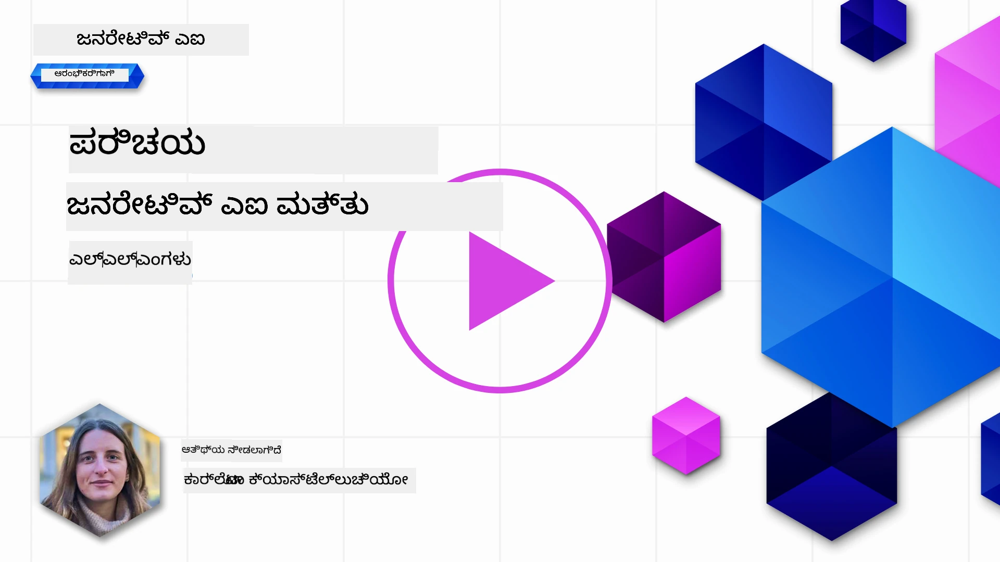
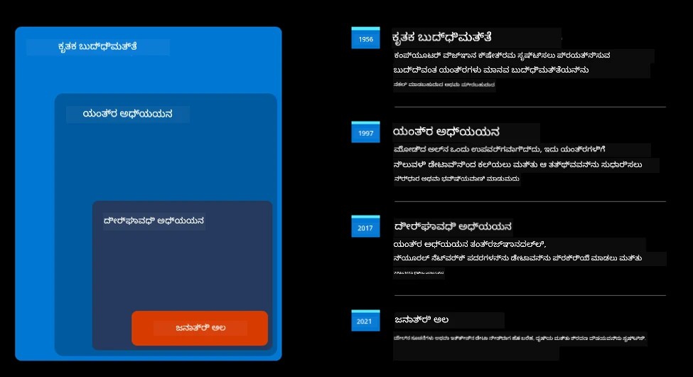
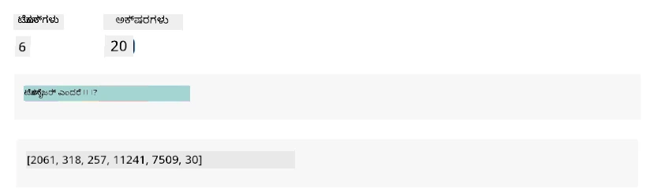
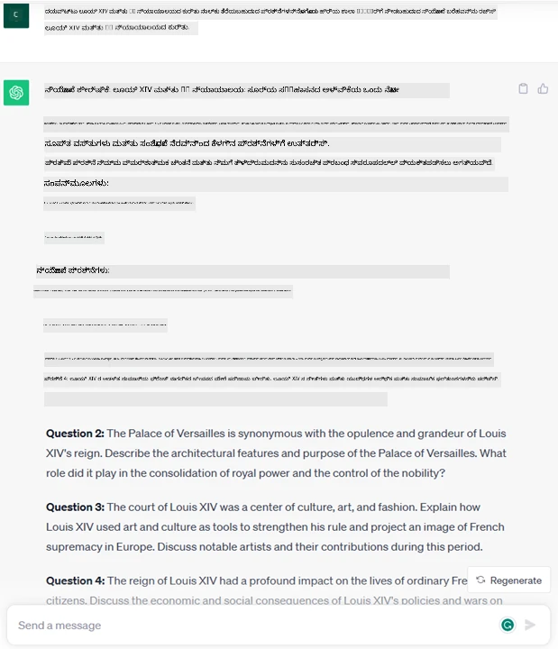
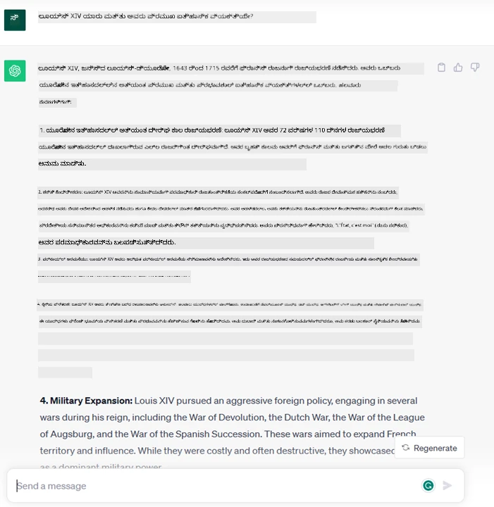
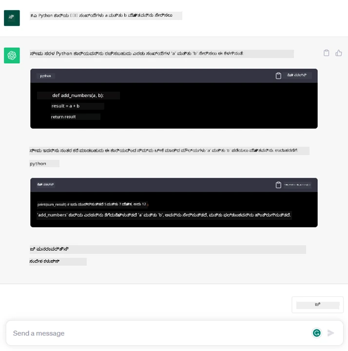

# ಜನರೇಟಿವ್ ಎಐ ಮತ್ತು ದೊಡ್ಡ ಭಾಷಾ ಮಾದರಿಗಳ ಪರಿಚಯ

_(ಈ ಪಾಠದ ವೀಡಿಯೋವನ್ನು ವೀಕ್ಷಿಸಲು ಮೇಲಿನ ಚಿತ್ರವನ್ನು ಕ್ಲಿಕ್ ಮಾಡಿ)_

ಜನರೇಟಿವ್ ಎಐ ಎನ್ನುವುದು ಪಠ್ಯ, ಚಿತ್ರಗಳು ಮತ್ತು ಇತರೆ ವಿಧದ ವಿಷಯಗಳನ್ನು ಸೃಷ್ಟಿಸಬಲ್ಲ ಕೃತಕ ಬುದ್ಧಿಮತ್ತೆ. ಇದನ್ನು ಅತ್ಯುತ್ತಮ ತಂತ್ರಜ್ಞಾನವಾಗಿಸುವುದಕ್ಕೆ ಕಾರಣ ಏನೆಂದರೆ ಇದು ಎಐಯನ್ನು ಜನರಿಗೆ ಸುಲಭವಾಗಿ ಉಪಯೋಗಿಸಲು ಅವಕಾಶ ಮಾಡಿಕೊಡುತ್ತದೆ, ಯಾರೂ ಸಹ ಸ್ವಲ್ಪಪಠ್ಯ ಪ್ರಾಂಪ್ಟ್ ಅಥವಾ ಸಹಜ ಭಾಷೆಯಲ್ಲಿ ಬರೆದ ವಾಕ್ಯದಿಂದ ಇದನ್ನು ಉಪಯೋಗಿಸಬಹುದು. ಏನೂ ಲಾಭದಾಯಕ ಕಾರ್ಯ ಸಾಧಿಸಲು ಜಾವಾ ಅಥವಾ ಎಸ್‌ಕ್ಯೂಎಲ್ (SQL)ಂತಹ ಭಾಷೆಗಳನ್ನು ಕಲಿಯಬೇಕಾಗಿಲ್ಲ, ನಿಮ್ಮ ಭಾಷೆ ಬಳಸಿಕೊಂಡು ನೀವು ಬಯಸುವ ಅಂಶವನ್ನು ತಿಳಿಸಿದರೆ ಎಐ ಮಾದರಿಯಿಂದ ಸಲಹೆ ಬರುತ್ತದೆ. ಇದರ ಬಳಕೆಗಳು ಮತ್ತು ಪರಿಣಾಮಗಳು ಅತಿ ಪ್ರಾಮುಖ್ಯವಾಗಿವೆ, ನೀವು ವರದಿಗಳನ್ನು ಬರೆದು ಅಥವಾ ಅರ್ಥಮಾಡಕೊಳ್ಳಬಹುದು, ಅಪ್ಲಿಕೇಶನ್‌ಗಳನ್ನು ಬರೆದು ಇತ್ಯಾದಿ, ಎಲ್ಲವೂ ಕ್ಷಣಗಳಲ್ಲಿ.

ಈ ಪಠ್ಯಕ್ರಮದಲ್ಲಿ, ನಮ್ಮ ಸ್ಟಾರ್ಟ್‌ಅಪ್ ಜನರೇಟಿವ್ ಎಐಯನ್ನು ಶಿಕ್ಷಣ ಕ್ಷೇತ್ರದಲ್ಲಿ ಹೊಸ ಸಂದರ್ಭಗಳನ್ನು ಅನ್ಲಾಕ್ ಮಾಡಲು ಹೇಗೆ ಉಪಯೋಗಿಸುತ್ತದೆ ಮತ್ತು ಅದರ ಅನಿವಾರ್ಯ ಸವಾಲುಗಳನ್ನು ಸಾಮಾಜಿಕ ಪರಿಣಾಮಗಳು ಹಾಗೂ ತಂತ್ರಜ್ಞಾನ ಸ್ವೀಕಾರಾತ್ಮಕತೆಗಳಿಗೆ ಸಂಬಂಧಪಟ್ಟಂತಹ ಅಡ್ಡಿ ತಡೆಗಳನ್ನು ಹೇಗೆ ಎದುರಿಸುತ್ತದೆ ಎಂಬುದನ್ನು ಅನ್ವೇಷಿಸಲಿದ್ದೇವೆ.

## ಪರಿಚಯ

ಈ ಪಾಠದಲ್ಲಿ ನಾವು ಎಂದರೆ:

- ವ್ಯವಹಾರ ಸಂದರ್ಭಕ್ಕೆ ಪರಿಚಯ: ನಮ್ಮ ಸ್ಟಾರ್ಟ್‌ಅಪ್ ಕಲ್ಪನೆ ಮತ್ತು ಮಿಷನ್.
- ಜನರೇಟಿವ್ ಎಐ ಮತ್ತು ನಾವು ಈಗಿನ ತಂತ್ರಜ್ಞಾನ ಪ್ರಥಮಣಿಗೆ ಹೇಗೆ ಬಂದಿದ್ದೇವೆ.
- ದೊಡ್ಡ ಭಾಷಾ ಮಾದರಿಗಳ ಆಂತರಿಕ ಕಾರ್ಯಚಟುವಟಿಕೆ.
- ಮುಖ್ಯ ಸಾಮರ್ಥ್ಯಗಳು ಮತ್ತು ದೊಡ್ಡ ಭಾಷಾ ಮಾದರಿಗಳ ಕಾರಣೈಸುವ ಪ್ರಾಯೋಗಿಕ ಬಳಕೆ.

## ಕಲಿಕೆಯ ಗುರಿಗಳು

ಈ ಪಾಠ ಮುಗಿಸಿದ ಮೇಲೆ, ನೀವು ಈ ವಿಚಾರಗಳನ್ನು ಅರ್ಥಮಾಡಿಕೊಳ್ಳುವಿರಿ:

- ಜನರೇಟಿವ್ ಎಐ ಏನು ಮತ್ತು ದೊಡ್ಡ ಭಾಷಾ ಮಾದರಿಗಳು ಹೇಗೆ ಕಾರ್ಯನಿರ್ವಹಿಸುತ್ತವೆ.
- ವಿವಿಧ ಬಳಕೆಗಳಿಗೆ ದೊಡ್ಡ ಭಾಷಾ ಮಾದರಿಗಳನ್ನು ಹೇಗೆ ಉಪಯೋಗಿಸಬಹುದು, ವಿಶೇಷವಾಗಿ ಶಿಕ್ಷಣ ಸಂದರ್ಭಗಳಲ್ಲಿ.

## ಸಂದರ್ಭ: ನಮ್ಮ ಶಿಕ್ಷಣ ಸ್ಟಾರ್ಟ್‌ಅಪ್

ಜನರೇಟಿವ್ ಕೃತಕ ಬುದ್ಧಿಮತ್ತೆ (ಎಐ) ಎಐ ತಂತ್ರಜ್ಞಾನದಲ್ಲಿ ಶಿಖರವನ್ನು ಪ್ರತಿನಿಧಿಸುತ್ತದೆ, ಅದು ಯಾವುದು ಸಾಧ್ಯವಲ್ಲ ಎಂದು ಭಾವಿಸಲಾಗುತ್ತಿದ್ದುದನ್ನು ಮೀರಿಸುತ್ತದೆ. ಜನರೇಟಿವ್ ಎಐ ಮಾದರಿಗಳಿಗೆ ಹಲವಾರು ಸಾಮರ್ಥ್ಯಗಳು ಮತ್ತು ಉಪಯೋಗಗಳಿವೆ, ಆದರೆ ಈ ಪಠ್ಯಕ್ರಮದಲ್ಲಿ ನಾವು ಕಲ್ಪನೆ ಮಾಡಿಕೊಂಡಿರುವ ಸ್ಟಾರ್ಟ್‌ಅಪ್ ಮೂಲಕ ಇದು ಶಿಕ್ಷಣ ಕ್ಷೇತ್ರವನ್ನು ಹೇಗೆ ಕ್ರಾಂತಿಕಾರಿಯಾಗಿ ಬದಲಾಯಿಸುತ್ತಿದೆ ಎಂಬುದನ್ನು ಅನಾವರಿಸುತ್ತೇವೆ. ನಾವು ಈ ಸ್ಟಾರ್ಟ್‌ಅಪ್ ಅನ್ನು _ನಮ್ಮ ಸ್ಟಾರ್ಟ್‌ಅಪ್_ ಎಂದು ಕರೆಯುತ್ತೇವೆ. ನಮ್ಮ ಸ್ಟಾರ್ಟ್‌ಅಪ್ ಶಿಕ್ಷಣ ಕ್ಷೇತ್ರದಲ್ಲಿ ಕಾರ್ಯನಿರ್ವಹಿಸುತ್ತದೆ ಮತ್ತು ಆ ambitie ಗುರಿ ಹೇಳಿಕೆ ಇದಾಗಿದೆ

> _ಅಧ್ಯಯನಕ್ಕೆ ಪ್ರಾಪ್ಯತೆಯನ್ನು ಸುಧಾರಿಸಲು, ಜಾಗತಿಕ ಮಟ್ಟದಲ್ಲಿ, ಸರ್ವ ಸಮಾನ ಶಿಕ್ಷಣ ಪ್ರವೇಶವನ್ನು ಖಾತ್ರಿಪಡಿಸುವುದು ಮತ್ತು ಪ್ರತಿಯೊಬ್ಬ ಕಲಿಕೆದಾರನ ಅಗತ್ಯಗಳ ಪ್ರಕಾರ ವೈಯಕ್ತಿಕ ಶಿಕ್ಷಣ ಅನುಭವಗಳನ್ನು ಒದಗಿಸುವುದು_.

ನಮ್ಮ ಸ್ಟಾರ್ಟ್‌ಅಪ್ ತಂಡ ಈ ಗುರಿಯನ್ನು ಸಾಧಿಸಲು ಆಧುನಿಕ ಲೋಕದಲ್ಲಿ ಅತ್ಯಂತ ಶಕ್ತಿಶಾಲಿ ಉಪಕರಣಗಳಾದ ದೊಡ್ಡ ಭಾಷಾ ಮಾದರಿಗಳನ್ನು (LLMs) ಉಪಯೋಗಿಸದೇ ಸಾಧ್ಯವಿಲ್ಲ ಎಂಬುದನ್ನು ತಿಳಿದಿದೆ.

ಜನರೇಟಿವ್ ಎಐ ಇಂದು ನಾವು ಹೇಗೆ ಕಲಿಯುತ್ತೇವೆ ಮತ್ತು ಬೋಧನೆ ಮಾಡುತ್ತೇವೆ ಎಂಬುದನ್ನು ಕ್ರಾಂತಿಕಾರಿಯಾಗಿ ಬದಲಾಯಿಸುವ ನಿರೀಕ್ಷೆಯಿದೆ, ವಿದ್ಯಾರ್ಥಿಗಳಿಗೆ 24 ಗಂಟೆಗಳ ಕಾಲ ವಾಸ್ತವಿಕ ಶಿಕ್ಷಕರು ಲಭ್ಯವಾಗಿದ್ದು ಹೆಚ್ಚಿನ ಮಾಹಿತಿಗಳು ಮತ್ತು ಉದಾಹರಣೆಗಳನ್ನು ಒದಗಿಸುತ್ತಾರೆ, ಮತ್ತು ಶಿಕ್ಷಕರು ವೈಚಿತ್ತಮಯ ಸಾಧನಗಳನ್ನು ಉಪಯೋಗಿಸಿ ತಮ್ಮ ವಿದ್ಯಾರ್ಥಿಗಳನ್ನು ಮೌಲ್ಯಮಾಪನ ಮಾಡಿ ಪ್ರತಿಕ್ರಿಯೆ ನೀಡಬಹುದು.

ಪ್ರಾರಂಭಿಸಲು, ನಾವು ಈ ಪಠ್ಯಕ್ರಮದಲ್ಲಿ ಬಳಸಲಿರುವ ಕೆಲವು ಮೂಲ ಧಾರಣೆಗಳು ಮತ್ತು ಪದಗಳನ್ನು ವ್ಯಾಖ್ಯಾನಿಸೋಣ.

## ಜನರೇಟಿವ್ ಎಐ ಹೇಗೆ ಬಂದಿದೆ?

ಇತ್ತೀಚೆಗೆ ಜನರೇಟಿವ್ ಎಐ ಮಾದರಿಗಳ ಘೋಷಣೆ ಮೂಲಕ ಉಂಟಾದ ಅಪಾರ _ಹೈಪ್_ ಗಾಗಿ ಹೊರತಾಗಿ, ಈ ತಂತ್ರಜ್ಞಾನವು ದಶಕಗಳ ಕಾಲ ರೂಪುಗೊಳ್ಳುತ್ತಿದೆ, 60ರ ದಶಕದಿಂದ ಸಂಶೋಧನೆ ಪ್ರಾರಂಭವಾಗಿದೆ. ಈಗ ನಾವು ಮಾನವ ಸಾಂರೋಗ್ಯ ಸಾಮರ್ಥ್ಯಗಳಿರುವ ಎಐ ತಂತ್ರಜ್ಞಾನಕ್ಕೆ ತಲುಪಿದ್ದೇವೆ, ಉದಾಹರಣೆಗೆ [OpenAI ChatGPT](https://openai.com/chatgpt) ಅಥವಾ [Microsoft Copilot](https://copilot.microsoft.com/?WT.mc_id=academic-105485-koreyst) ಒಂದಾದಂತೆ, ಇದು ಬಗೆಯ GPT ಮಾದರಿಯನ್ನು ತನ್ನ ಸಂವಾದಾತ್ಮಕ ವೆಬ್ ಶೋಧ ಅನುಭವಕ್ಕೆ ಬಳಸುತ್ತದೆ.

ಸ್ವಲ್ಪ ಹಿಂದಕ್ಕೆ ಹೋಗಿ, ಎಐ ಪ್ರೋಟೋಟೈಪ್‌ಗಳು ಟೈಪ್ರೈಟನ್ ಚಾಟ್‌ಬಾಟ್ಸ್ ಆಗಿದ್ದು, ತಜ್ಞರ ಗುಂಪಿನಿಂದ ಪಡೆದ ಜ್ಞಾನ ಆಧಾರದ ಮೇಲೆ ಕಂಪ್ಯೂಟರ್‌ನಲ್ಲಿ ಪ್ರತಿನಿಧಿಸಲ್ಪಟ್ಟಿತು. ಆ ಜ್ಞಾನ ಮೂಲದ ಉತ್ತರಗಳನ್ನು ಕೀವಿಡ್ಗಳ ಮೂಲಕ ಉಪಯೋಗಿಸುವ ಸಮಸ್ಯೆಯನ್ನು ಪ್ರವೇಶ ಪಠ್ಯದಲ್ಲಿ ಕಂಡುಬಂದವು.
ಆದರೆ, ಈ ರೀತಿಯ ಟೈಪ್ರೈಟನ್ ಚಾಟ್‌ಬಾಟ್ಸ್ ವಿಧಾನವು ವಿಸ್ತಾರಕ್ಕೆ ಒಗ್ಗಾರಲ್ಲವನುಂಬುದನ್ನು ಹೀಗೆ ತಿಳಿದುಬಂದಿತು.

### ಎಐಗೆ ಅಂಕಿಜ್ಞಾನಾತ್ಮಕ (ಸ್ಟಾಟಿಸ್ಟಿಕಲ್) ದೃಷ್ಠಿಕೋನ: ಯಂತ್ರ ಅಧ್ಯಯನ

90ರ ದಶಕದಲ್ಲಿ ಪಠ್ಯ ವಿಶ್ಲೇಷಣೆಗೆ ಅಂಕಿಜ್ಞಾನಾತ್ಮಕ ವಿಧಾನವನ್ನು ಅನ್ವಯಿಸಿದಾಗ ಹೊಸ ಅಲ್ಗೋರಿದಮ್‌ಗಳು – ಯಂತ್ರ ಅಧ್ಯಯನ ಎಂದು ಪ್ರಸಿದ್ಧಿ ಹೊಂದಿದವು – ರೂಪುಗೊಂಡವು, ಯಾವುದೇ ನಿರ್ದಿಷ್ಟವಾಗಿ ಪ್ರೋಗ್ರಾಮ್ ಮಾಡದೇ ಟೆಕ್ಸ್ಟ್‌ನ ಮಾದರಿಗಳನ್ನು ಕಲಿಯಲು ಯಂತ್ರಗಳಿಗೆ ಶಕ್ತಿಯನ್ನು ನೀಡುವವು. ಈ ವಿಧಾನವು ಯಂತ್ರಗಳಿಗೆ ಮಾನವ ಭಾಷೆಯ ಅರ್ಥವನ್ನು ಅನುಕರಿಸಿಕೊಂಡಂತೆ ಮಾಡುತ್ತದೆ: ಅಂಕಿಜ್ಞಾನ ಮಾದರಿಯನ್ನು ಪಠ್ಯ-ಲೇಬಲ್ ಜೋಡಿಗಳ ಮೇಲೆ ತರಬೇತಿ ಮಾಡಲಾಗುತ್ತದೆ, ಇದು ಮಾದರಿಯು ಅಜ್ಞಾತವಾದ ಪಠ್ಯವನ್ನು ನಿರ್ದಿಷ್ಟ ಸಂದೇಶ ಉದ್ದೇಶವನ್ನು ಪ್ರತಿನಿಧಿಸುವ ಲೇಬಲಿನಿಂದ ವರ್ಗೀಕರಿಸಲು ಸಹಾಯ ಮಾಡುತ್ತದೆ.

### ತಂತಿಮೇಳಗಳು ಮತ್ತು ಆಧುನಿಕ ವಾಸ್ತವಿಕ ಸಹಾಯಕರು

ಇತ್ತೀಚಿನ ವರ್ಷಗಳಲ್ಲಿ, ಹೆಚ್ಚಿನ ಡೇಟಾವನ್ನು ಮತ್ತು ಸಂಕೀರ್ಣ ಲೆಕ್ಕಾಚಾರಗಳನ್ನು ನಿಭಾಯಿಸುವ ಸಾಮರ್ಥ್ಯವಿರುವ ಉಪಕರಣಗಳ ತಂತ್ರಜ್ಞಾನ ಪ್ರಗತಿಯು ಎಐ ಸಂಶೋಧನೆಗೆ ಉತ್ತೇಜನ ನೀಡಿದೆಯ - ತಂತಿಮೇಳಗಳು ಅಥವಾ ಡೀಪ್ ಲರ್ನಿಂಗ್ ಅಲ್ಗೋರಿದಮ್‌ಗಳು ಎಂಬ ಅತ್ಯಾಧುನಿಕ ಯಂತ್ರ ಅಧ್ಯಯನ ಅಲ್ಗೋರಿದಮ್‌ಗಳ ರೂಪುದಾರಿಕೆ.

ತಂತಿಮೇಳಗಳು (ವಿಶೇಷವಾಗಿ ಕಿರುಗುಳ್ಳಿಯ ತಂತಿ ತಂತಿಮೇಳಗಳು - RNNs) ಸಹಜ ಭಾಷಾ ಪ್ರಕ್ರಿಯೆಯನ್ನು ಬಹಳ ಹೆಚ್ಚು ಉತ್ತಮಗೊಳಿಸಿದವು, ವಾಕ್ಯದೊಂದರ ಪಾರ್ಶ್ವವಾಯುವನ್ನು ಗೌರವಿಸುವ ಮೂಲಕ ಪಠ್ಯದ ಅರ್ಥವನ್ನು ಹೆಚ್ಚು ಸೂಕ್ತ ಮಾದರಿಯಲ್ಲಿ ಪ್ರತಿನಿಧಿಸುವುದಕ್ಕೆ ಸಾಧ್ಯವಾಗಿಸಿದವು.

ಈ ತಂತ್ರಜ್ಞಾನವೇ ಹೊಸ ಶತಮಾನಕ್ಕೆ ಒಳಗೆ ಹುಟ್ಟಿದ ವಾಸ್ತವಿಕ ಸಹಾಯಕರಿಗೆ ಶಕ್ತಿದಾಯಕ, ಮಾನವ ಭಾಷೆಯನ್ನು ಅರ್ಥಮಾಡಿಕೊಳ್ಳುವಲ್ಲಿ ಪ್ರಾಗಣ್ಯ ಪಡೆದ ಮತ್ತು ಅವಶ್ಯಕತೆ ಗುರುತಿಸಿ ಅದನ್ನು ಪೂರೈಸಲು ಕ್ರಮ ಕೈಗೊಳ್ಳುವಂತೆ ಮಾಡಿದೆ – ಕೈಬದ್ಧ ಲಿಪ್ಯಂತರಣೆ ಉತ್ತರಿಸೋದು ಅಥವಾ 3ನೇ ಪಕ್ಷದ ಸೇವೆ ಉಪಯೋಗಿಸುವುದು ಮುಂತಾದವು.

### ಇಂದಿನ ದಿನ, ಜನರೇಟಿವ್ ಎಐ

ಹೀಗೆ ನಾವು ಇಂದು ಜನರೇಟಿವ್ ಎಐಗೆ ತಲುಪಿದ್ದೇವೆ, ಇದು ಡೀಪ್ ಲರ್ನಿಂಗ್‌ನ ಉಪಸಮೂಹವಂತೆ ನೋಡಬಹುದು.

ಎಐ ಕ್ಷೇತ್ರದ ದಶಕಗಳ ಸಂಶೋಧನೆಯ ನಂತರ, ಹೊಸ ಮಾದರಿ ವಾಸ್ತುಶಿಲ್ಪ – _ಟ್ರಾನ್ಸ್‌ಫಾರ್ಮರ್_ ಎಂದು ಕರೆಯಲ್ಪಡುವುದು – RNN ಗಳು ಹೊಂದಿದ್ದ ಸೀಮಿತತೆಗಳನ್ನು ಗ್ಯಾಪ್ ಮಾಡಿತು, ಬಹು ದೀರ್ಘ ಪಠ್ಯ ಕ್ರಮವನ್ನು ಒಳಗೆ ತರುವ ಸಾಮರ್ಥ್ಯ ಹೊಂದಿತು. ಟ್ರಾನ್ಸ್‌ಫಾರ್ಮರ್‌ಗಳು ಅಟೆನ್ಶನ್ ಮೆಕೆನಿಸಂ ಆಧಾರಿತವಾಗಿವೆ, ಇದು ಮಾದರಿಯು ಸಮಸ್ಯೆಯೌಟು ಇರಕೊಳ್ಳುವ ಭಾಗಗಳಿಗಿಂತ 'ಹೆಚ್ಚು ಗಮನ' ನೀಡಬಹುದಾಯಿತು, ಪಠ್ಯದ ಕ್ರಮದಲ್ಲಿ ಅಲ್ಲಿ ಹೆಚ್ಚಿನ ಸಂಬಂಧಿತ ಮಾಹಿತಿಯು ಇದ್ದರೂ ಕೂಡ.

ಇತ್ತೀಚಿನ ಜನರೇಟಿವ್ ಎಐ ಮಾದರಿಗಳ ಇತಿಹಾಸವು – ದೊಡ್ಡ ಭಾಷಾ ಮಾದರಿಗಳಾಗಿಯೂ ಕರೆಯಲ್ಪಡುವವು, ಏಕೆಂದರೆ ಅವು ಪಠ್ಯ ಇನ್‌ಪುಟ್ ಮತ್ತು ಔಟ್‌ಪುಟ್ಗಳೊಂದಿಗೆ ಕಾರ್ಯನಿರ್ವಹಿಸುತ್ತವೆ – ಈ ವಾಸ್ತುಶಿಲ್ಪ ಆಧರಿಸಿದೆ. ಈ ಮಾದರಿಗಳು ಬಹಳಷ್ಟು ವಿವಿಧ ಮೂಲಗಳಿಂದ ಅಲೇಬಲ್ ಮಾಡದ ಡೇಟಾವನ್ನು ಮೇಲೆ ತರಬೇತಿ ಪಡೆದಿವೆ – ಪುಸ್ತಕಗಳು, ಲೇಖನಗಳು, ವೆಬ್ಸೈಟ್‌ಗಳು ಮುಂತಾದವು – ಮತ್ತು ಅವುಗಳನ್ನು ಹಲವು ಕಾರ್ಯಗಳಿಗೆ ಅನ್ವಯಿಸಬಹುದಾಗಿದೆ ಮತ್ತು ವ್ಯಾಕರಣಾತ್ಮಕವಾಗಿ ಸರಿಯಾದ ಪಠ್ಯವನ್ನು ಸೃಷ್ಟಿಸಬಹುದು. ಹೀಗಾಗಿ, ಅವು ಯಂತ್ರದ ಇನ್‌ಪುಟ್ ಪಠ್ಯವನ್ನು 'ಅರ್ಥಮಾಡಿಕೊಳ್ಳಲು' ಸಾಮರ್ಥ್ಯವನ್ನು ಅಪಾರವಾಗಿ ಹೆಚ್ಚಿಸದ ಅಪರೂಪದ ಪ್ರತಿಕ್ರಿಯೆಯನ್ನು ಮಾನವ ಭಾಷೆಯಲ್ಲಿ ರಚಿಸುವ ಸಾಮರ್ಥ್ಯವನ್ನು ಸಹಕೊಳ್ಳುತ್ತವೆ.

## ದೊಡ್ಡ ಭಾಷಾ ಮಾದರಿಗಳು ಹೇಗೆ ಕಾರ್ಯನಿರ್ವಹಿಸುತ್ತವೆ?

ಮುಂದಿನ ಧಾರಾಪ್ರಕರಣದಲ್ಲಿ ನಾವು ವಿವಿಧ ಜನರೇಟಿವ್ ಎಐ ಮಾದರಿಗಳನ್ನು ಅಧ್ಯಾಯನ ಮಾಡುವುದಾಗಿದ್ದು, ಈಗಿನಂತೆಯೇ ನಾವು ದೊಡ್ಡ ಭಾಷಾ ಮಾದರಿಗಳು, ವಿಶೇಷವಾಗಿ OpenAI GPT (ಜನರೇಟಿವ್ ಪ್ರೀ-ಟ್ರೈನ್ ಟ್ರಾನ್ಸ್‌ಫಾರ್ಮರ್) ಮಾದರಿಗಳ ಕುರಿತು ಗಮನ ಹರಿಸೋಣ.

- **ಟೋಕನೈಜರ್, ಪಠ್ಯದಿಂದ ಸಂಖ್ಯೆಗಳವರೆಗೂ**: ದೊಡ್ಡ ಭಾಷಾ ಮಾದರಿಗಳ ಇನ್‌ಪುಟ್ ಮತ್ತು ಔಟ್‌ಪುಟ್ ಪಠ್ಯವಾಗುತ್ತವೆ. ಆದಾಗ್ಯೂ, ಅಂಕಿಜ್ಞಾನ ಮಾದರಿಗಳಾಗಿ, ಅವು ಪಠ್ಯದ ಹೋಲಿಕೆಯಿಂದ ಸಂಖ್ಯೆಗಳ ಜೊತೆ ಉತ್ತಮವಾಗಿ ಕಾರ್ಯನಿರ್ವಹಿಸುತ್ತವೆ. ಆದ್ದರಿಂದ ಪ್ರತಿಯೊಂದು ಇನ್‌ಪುಟ್ ಅನ್ನು ಟೋಕನೈಜರ್ ಆ ಮರುಪ್ರಕ್ರಿಯೆ ಪ್ರಯೋಗ ಮಾಡಲಾಗುತ್ತದೆ. ಟೋಕೆನ್ ಎಂದರೆ ಪಠ್ಯದ ಒಂದು ತುಂಡು - ಅದು ಅಕ್ಷರಗಳ ಸರಣಿ ನಂದಿರಬಹುದು, ಆದ್ದರಿಂದ ಟೋಕನೈಜರ್ ಮುಖ್ಯ ಕರ್ತವ್ಯವಿರುವುದು ಇನ್‌ಪುಟ್ ಅನ್ನು ಟೋಕನ್ ಸರಣಿಯಾಗಿ ವಿಭಜಿಸುವುದು. ನಂತರ ಪ್ರತಿ ಟೋಕೆನ್ ಟೋಕೆನ್ ಸೂಚ್ಯಂಕಕ್ಕೆ ನಕ್ಷೀಕರಣವಾಗುತ್ತದೆ, ಅದು ಮೂಲ ಪಠ್ಯದ ಅಂಶದ ಪೂರ್ಣಾಂಕ ಎಂಕೋಡಿಂಗ್ ಆಗಿರುತ್ತದೆ.

- ** ಔಟ್‌ಪುಟ್ ಟೋಕೆನ್ ಭವಿಷ್ಯವಾಣಿ **: ಇನ್‌ಪುಟ್ ಆಗಿ n ಟೋಕನ್ಗಳನ್ನು ಪಡೆದ ಬಳಿಕ (ಗರಿಷ್ಠ n ಪ್ರತಿ ಮಾದರಿಯೊಂದಿಗೊಂದು ಬದಲಾಗಬಹುದು), ಮಾದರಿ ಒಂದೇ ಟೋಕೆನನ್ನು ಔಟ್‌ಪುಟ್ ಆಗಿ ಭವಿಷ್ಯವಾಣಿ ಮಾಡುತ್ತದೆ. ಈ ಟೋಕೆನ್ ಮುಂಬರುವ ಸಂಬಂಧಿತ ಇನ್‌ಪುಟ್‌ಗೆ ಸೇರಿಸಲಾಗುತ್ತದೆ, ವಿಸ್ತಾರಗೊಳ್ಳುವ ವಿಂಡೋ ಮಾದರಿಯಲ್ಲಿ, ಇದರಿಂದ ಒಬ್ಬ ಉಪಯೋಗಿಗೆ ಒಬ್ಬ ಅಥವಾ ಹೆಚ್ಚಿನ ವಾಕ್ಯಗಳನ್ನು ಉತ್ತರವಾಗಿ ಪಡೆಯಲು ಅನುಕೂಲವಾಗುತ್ತದೆ. ಹಾಗಾಗಿ ನೀವು ಚಾಟ್‌ಜಿಪಿಟಿ ಉಪಯೋಗಿಸಿದ್ರೆ, ಅದು ಎದೆ-ಮಧ್ಯದಲ್ಲಿ ಸ್ಥಗಿತಗೊಳ್ಳುತ್ತದೆ ಎಂದು ಕೆಲವೊಮ್ಮೆ ಕಾಣಬಹುದು.

- **ತೆರಿಗೆ ಪ್ರಕ್ರಿಯೆ, ಸಾಧ್ಯತೆ ವಿತರಣಾ**: ಔಟ್‌ಪುಟ್ ಟೋಕೆನ್ ಇತಿಹಾಸದ ಪಠ್ಯ ಕ್ರಮದ ನಂತರ ಸಂಭವಿಸುವ ಸಾಧ್ಯತೆಯ ಆಧಾರದ ಮೇಲೆ ಆಯ್ಕೆಮಾಡಲ್ಪಡುತ್ತದೆ. ಇದು ಏಕೆಂದರೆ ಮಾದರಿ ತರಬೇತಿಗಾಗಿ ಎಲ್ಲಾ ಸಾಧ್ಯ 'ಮುಂದಿನ ಟೋಕನ್‌ಗಳು' ಮೇಲೆ ಸಾಧ್ಯತೆ ವಿತರಣೆಯನ್ನು ಭವಿಷ್ಯ ವಾಣಿ ಮಾಡುತ್ತದೆ. ಆದಾಗ್ಯೂ, ಅಧಿಕ ಸಾಧ್ಯತೆಯ ಟೋಕೆನ್‌ನ್ನು ಯಾವಾಗಲೂ ಆಯ್ಕೆಮಾಡುವುದಿಲ್ಲ. ಕೆಲವೊಮ್ಮೆ ಅಂದಾಜಿಸುವಿಕೆ ಸೇರಿಸಲಾಗುತ್ತದೆ, ಇದರಿಂದ ಮಾದರಿ ನಿರ್ಧಿಷ್ಟ ಅಲ್ಲದ (ನಾನ್-ಡೆಟರ್ಮಿನಿಸ್ಟಿಕ್) ರೀತಿಯಲ್ಲಿ ಕೆಲಸ ಮಾಡುತ್ತದೆ - ಒಬ್ಬಷ್ಟೇ ಇನ್‌ಪುಟ್‌ಗೆ ವಿಭಿನ್ನ ಔಟ್‌ಪುಟ್ ಬರುತ್ತದೆ. ಈ ಅಂದಾಜಿಸುವಿಕೆ ಸೃಜನಾತ್ಮಕ ಚಿಂತನ ಪ್ರಕ್ರಿಯೆಯನ್ನು ನಕಲಿಸಿರುತ್ತದೆ ಮತ್ತು "ಟೆಂಪರೆಚರ್" (ta: temperature) ಎಂಬ ಮಾದರಿ ನಿಯಂತ್ರಕವನ್ನು ಉಪಯೋಗಿಸಿ ನಿಯಂತ್ರಣ ಮಾಡಬಹುದು.

## ನಮ್ಮ ಸ್ಟಾರ್ಟ್‌ಅಪ್ ದೊಡ್ಡ ಭಾಷಾ ಮಾದರಿಗಳನ್ನು ಹೇಗೆ ಉಪಯೋಗಿಸಬಹುದು?

ಈಗ ದೊಡ್ಡ ಭಾಷಾ ಮಾದರಿಯ ಆಂತರಿಕ ಕಾರ್ಯಾಚರಣೆಯ ವಿವರವನ್ನು ತಿಳಿದುಕೊಂಡಿದ್ದರಿಂದ, ನಮ್ಮ ವ್ಯಾಪಾರ ಸಂದರ್ಭದ ದೃಷ್ಟಿಯಿಂದ ಅವು ಅತ್ಯುತ್ತಮವಾಗಿ ನಿರ್ವಹಿಸುವ ಕೆಲ ಸಾಮಾನ್ಯ ಕೆಲಸಗಳ ಪ್ರಾಯೋಗಿಕ ಉದಾಹರಣೆಗಳನ್ನು ನೋಡೋಣ.
ನಾವು ಹೇಳಿದಂತೆ ದೊಡ್ಡ ಭಾಷಾ ಮಾದರಿಯ ಮುಖ್ಯ ಸಾಮರ್ಥ್ಯವೆಂದರೆ _ಸ್ವತಃ ಪ್ರಾರಂಭದಿಂದ ಪಠ್ಯವನ್ನು ಉತ್ಪಾದಿಸುವುದು, ಸಹಜ ಭಾಷೆಯಲ್ಲಿ ಬರೆದ ಪಠ್ಯದ ಇನ್‌ಪುಟ್‌ನಿಂದ_.

ಆದರೆ ಯಾವ ವಿಧದ ಪಠ್ಯ ಇನ್‌ಪುಟ್ ಮತ್ತು ಔಟ್‌ಪುಟ್?
ದೊಡ್ಡ ಭಾಷಾ ಮಾದರಿಯ ಇನ್‌ಪುಟ್ ಅನ್ನು ಪ್ರಾಂಪ್ಟ್ ಎಂದು ಕರೆಯಲಾಗುತ್ತದೆ, ಮತ್ತು ಔಟ್‌ಪುಟ್ ಸಾಗಣೆಯ (completion) ಎಂದು, ಇದು ಇಂದಿನ ಇನ್‌ಪುಟ್ ಪೂರೈಸಲು ಮುಂದಿನ ಟೋಕೆನ್ ಉತ್ಪಾದಿಸುವ ಮಾದರಿಯ ಪ್ರಕ್ರಿಯೆಯನ್ನು ಸೂಚಿಸುತ್ತದೆ. ನಾವು ಪ್ರಾಂಪ್ಟ್ ಎಂದರೇನು ಮತ್ತು ಅದನ್ನು ಹೇಗೆ ರಚಿಸಬೇಕೆಂದು ವಿಪುಲವಾಗಿ ತಿಳಿಯೋಣ, ಆದರೆ ಈಗಿಗೆ, ಪ್ರಾಂಪ್ಟ್ incluam ಮಾಡಬಹುದು:

- ಒಂದು **ಸೂಚನೆ**, ಇದು ನಾವು ಮಾದರಿಯಿಂದ ನಿರೀಕ್ಷಿಸುವ ಔಟ್‌ಪುಟ್ ಪ್ರಕಾರವನ್ನು ವಿವರಿಸುತ್ತದೆ. ಈ ಸೂಚನೆ ಕೆಲವು ಉದಾಹರಣೆಗಳು ಅಥವಾ ಹೆಚ್ಚುವರಿ ಮಾಹಿತಿಯನ್ನು ಸೇರಿಸಬಹುದು.

  1. ಲೇಖನ, ಪುಸ್ತಕ, ಉತ್ಪನ್ನ ವಿಮರ್ಶೆಗಳ ಉತ್ತಮಸಾರಣೆ ಮತ್ತು ಅಸಂರಚಿತ ಡೇಟಾದಿಂದ ಒಳನೋಟಗಳನ್ನು ತೆಗೆಯುವುದು.
    
    
  
  2. ಕಲ್ಪನಾಶೀಲ ಚಿಂತನೆ ಮತ್ತು ಲೇಖನ, ಪ್ರಬಂಧ, ಹೂಡಿಕೆ ಅಥವಾ ಇತರ ರಚನೆ.
      
     

- ಒಂದು **ಪ್ರಶ್ನೆ**, ಯಾವುದೋ ಏಜೆಂಟ್ ಜೊತೆಗೆ ಸಂವಾದ ರೂಪದಲ್ಲಿ ಕೇಳಲಾಗುತ್ತದೆ.
  
  

- ಪೂರ್ಣಗೊಳಿಸಲು ತೃತೀಯ **ಪಠ್ಯದ ತುಣುಕು**, ಇದು ಬರವಣಿಗೆ ಸಹಾಯಕ್ಕಾಗಿ ಕೇಳಿಕೆ.
  
  

- ಕೋಡ್ ತುಣುಕು **ಜೋಡಣೆ** ಜೊತೆಗೆ ಅದನ್ನು ವಿವರಿಸುವ ಮತ್ತು ದಾಖಲೆಗೊಳಿಸುವ ಕೇಳಿಕೆ, ಅಥವಾ ನಿರ್ದಿಷ್ಟ ಕಾರ್ಯ ನಡೆಸುವ ಕೋಡ್ ತುಂಡನ್ನು ರಚಿಸುವ ವಿನಂತಿ.
  
  

ಮೇಲಿನ ಉದಾಹರಣೆಗಳು ಸಾದಾರಣವಾಗಿದ್ದು ದೊಡ್ಡ ಭಾಷಾ ಮಾದರಿಗಳ ಸಾಮರ್ಥ್ಯಗಳ ಸಂಪೂರ್ಣ ಪ್ರದರ್ಶನವಲ್ಲ. ಅವು ಜನರೇಟಿವ್ ಎಐ ಬಳಕೆಯ ಸಾಧ್ಯತೆಯನ್ನು ತೋರಿಸಲು ಉದ್ದೇಶಿಸಲಾಗಿವೆ, ವಿಶೇಷವಾಗಿ ಆದರೆ ಮಟ್ಟಿಗೆಯಲ್ಲದೇ ಶಿಕ್ಷಣದ ಹಿನ್ನೆಲೆಯಲ್ಲಿ.

ಜೊತೆಗೆ ಜನರೇಟಿವ್ ಎಐ ಮಾದರಿಯ ಔಟ್‌ಪುಟ್ ಸಂಪೂರ್ಣವಾದದ್ದು ಅಲ್ಲ, ಮತ್ತು ಕೆಲವೊಮ್ಮೆ ಮಾದರಿಯ ಸೃಜನಶೀಲತೆ ಇದಕ್ಕೆ ವಿರುದ್ಧವಾಗಿ ಕಾರ್ಯನಿರ್ವಹಿಸಬಹುದು, ಇದರಿಂದ ಮಾನವನಿಗೆ ನಿಜನಂಬಿಕೆಯ ಮೂರ್ಖತ್ವ ಅಥವಾ ಅಪಮಾನಕರತೆ ಅನಿಸುವ ಪದಗಳ ಸಮೂಹ ಇರುತ್ತದೆ. ಜನರೇಟಿವ್ ಎಐ ಬುದ್ಧಿವಂತಿಕೆ ಹೊಂದಿಲ್ಲ - ಕನಿಷ್ಠ ಬೃಹತ್ ಬುದ್ಧಿವಂತಿಕೆ ವ್ಯಾಖ್ಯಾನದಲ್ಲಿ, ಅದರಲ್ಲಿ ಸೃಜನಾತ್ಮಕ ಹಾಗೂ ವಿಮರ್ಶಾತ್ಮಕ ತೀರ್ಮಾನ ಶಕ್ತಿಗಳು ಅಥವಾ ಭಾವನಾತ್ಮಕ ಬುದ್ಧಿವಂತಿಕೆ ಒಳಗೊಂಡಿವೆ; ಇದು ನಿರ್ಧಿಷ್ಟ ಅಲ್ಲ ಮತ್ತು ವಿಶ್ವಾಸಾರ್ಹ ಅಲ್ಲ, ಏಕೆಂದರೆ ತಪ್ಪು ಉಲ್ಲೇಖಗಳು, ವಿಷಯ ಮತ್ತು ಹೇಳಿಕೆಗಳು ಸರಿಯಾದ ಮಾಹಿತಿಯೊಂದಿಗೆ ನೆರೆದಿರಬಹುದು ಮತ್ತು ಪ್ರಭಾವಶಾಲಿಯಾಗಿ ಪ್ರದರ್ಶಿಸಲ್ಪಡಬಹುದು. ಮುಂದಿನ ಪಾಠಗಳಲ್ಲಿ ನಾವು ಈ ಎಲ್ಲ ನಿಯಂತ್ರಣಗಳನ್ನು ನೋಡೋಣ ಹಾಗೂ ನಾವೇ ನೀವು ಅವುಗಳನ್ನು ಕಡಿಮೆ ಮಾಡಿ ಹೇಗೆ ಮಾಡಬಹುದು ಎಂಬುದನ್ನು ಕಂಡಕೊಳ್ಳೋಣ.

## ಕಾರ್ಯ

ನಿಮ್ಮ ಕಾರ್ಯ: [ಜನರೇಟಿವ್ ಎಐ](https://en.wikipedia.org/wiki/Generative_artificial_intelligence?WT.mc_id=academic-105485-koreyst) ಕುರಿತು ಹೆಚ್ಚಿನ ಅಧ್ಯಯನ ಮಾಡಿ ಮತ್ತು ಇವತ್ತಿಗೆ ಜತೆ ಇರುವ ಸ್ಥಳದಲ್ಲಿ ನೀವು ಜನರೇಟಿವ್ ಎಐವನ್ನು ಸೇರಿಸುವುದು ಎಲ್ಲಿ ಸಾಧ್ಯವೆಂದು ಗುರುತಿಸಿ. "ಹಳೆಯ ವಿಧಾನ" ಜೊತೆ ಇದರಿಂದ ಪರಿಣಾಮ ಹೇಗೆ ಭಿನ್ನವಾಗುತ್ತದೆ, ನಿಮ್ಮಿಂದ ಹಿಂದಿನಂತೆ ಮಾಡಲು ಆಗದ ಏನನ್ನಾದರೂ ಮಾಡಬಲ್ಲಿರಾ, ಅಥವಾ ವೇಗವಾಗಿ ಆಗುತ್ತದೆಯಾ? ನಿಮ್ಮ ಕನಸುಗಳ ಎಐ ಸ್ಟಾರ್ಟ್‌ಅಪ್ ಯಾವುದಾಗಿರುತ್ತದೆಯೋ 300 ಪದಗಳ ಸಾರಾಂಶ ಬರೆಯಿರಿ ಮತ್ತು "ಸಮಸ್ಯೆ", "ನಾನು ಎಐವನ್ನು ಹೇಗೆ ಉಪಯೋಗಿಸುತ್ತೇನೆ", "ಪರಿಣಾಮ" ಮತ್ತು ಆಯ್ಕೆಯಿಂದ ವ್ಯಾಪಾರ ಯೋಜನೆ ಎಂಬಂತೆ ಶೀರ್ಷಿಕೆಗಳನ್ನು ಸೇರಿಸಿ.

ನೀವು ಈ ಕಾರ್ಯವನ್ನು ಮಾಡಿದ್ದರೆ, ನೀವು Microsoft ಇನ್ಕ್ಯೂಬೇಟರ್, [Microsoft for Startups Founders Hub](https://www.microsoft.com/startups?WT.mc_id=academic-105485-koreyst) ಗೆ ಅರ್ಜಿ ಸಲ್ಲಿಸಲು ಸಿದ್ಧರಾಗಿರಬಹುದು, ಇಲ್ಲಿ ನಾವು Azure, OpenAI, ಮಾರ್ಗದರ್ಶನ ಮತ್ತು ಇತರೆ ಅನೇಕ ಸೌಲಭ್ಯಗಳಿಗೆ ಕ್ರೆಡಿಟ್‌ಗಳನ್ನು ನೀಡುತ್ತೇವೆ, ನೋಡಿ!

## ಜ್ಞಾನ ಪರಿಶೀಲನೆ

ದೊಡ್ಡ ಭಾಷಾ ಮಾದರಿಗಳ ಕುರಿತು ಯಾವುದು ಸರಿ?

1. ನೀವು ಪ್ರತೀಸಾರಿಗೆ ಅಂದಾಜಿಸಿದಂಥ ಉತ್ತರ ಪಡೆಯುತ್ತೀಿರಿ.
1. ಇದು ಕಾರ್ಯಗಳನ್ನು ಸೂಕ್ಷ್ಮವಾಗಿ ನಿಭಾಯಿಸುತ್ತದೆ, ಸಂಖ್ಯೆಗಳನ್ನು ಹೆಚ್ಚು ಸರಿ ಸೇರಿಸುತ್ತದೆ, ಕಾರ್ಯನಿರ್ವಹಿಸುವ ಕೋಡ್ ಉತ್ಪಾದಿಸುತ್ತದೆ ಇತ್ಯಾದಿ.
1. ಪ್ರತಿಕ್ರಿಯೆ ಒಂದೇ ಪ್ರಾಂಪ್ಟ್ ಬಳಸದೆಯೂ ಬದಲಾಗಬಹುದು. ಇದು ಮೊದಲ ಪ್ರಯತ್ನದ ಪಠ್ಯ ಅಥವಾ ಕೋಡ್ ನೀಡಲು ಅತ್ಯುತ್ತಮ, ಆದರೆ ನೀವು ಫಲಿತಾಂಶಗಳನ್ನು ಸುಧಾರಿಸಬೇಕಾಗಿರುತ್ತದೆ.

ಉತ್ತರ: 3, LLM ಗಳು ನಿರ್ಧಿಷ್ಟವಲ್ಲದವು, ಪ್ರತಿಕ್ರಿಯೆ ಬದಲಾಗುತ್ತದೆ, ನೀವು ಅದರ ಬದಲಾವಣೆ ಪ್ರಮಾಣವನ್ನು ಟೆಂಪರೆಚರ್ ಸೆಟ್ಟಿಂಗ್ ಮೂಲಕ ನಿಯಂತ್ರಣ ಮಾಡಬಹುದು. ಇದು ಕಾರ್ಯಗಳನ್ನು ಸರ್ವೋತ್ತಮವಾಗಿ ಮಾಡಲೆಂದು ನಿರೀಕ್ಷಿಸಬಾರದು, ಇದು ಭಾರವಾಗಿಯೂ ಕೆಲಸವನ್ನು ಮಾಡುತ್ತದೆ ಮತ್ತು ಗೌರವಿಸಿದ ಮೊದಲ ಪ್ರಯತ್ನವನ್ನು ನೀಡುತ್ತದೆ, ನೀವು ಕ್ರಮೇಣ ಸುಧಾರಣೆ ಮಾಡಬೇಕು.

## ಅದ್ಭುತ ಕೆಲಸ! ಪಯಣವನ್ನು ಮುಂದುವರೆಸಿ

ಈ ಪಾಠ ಮುಗಿಸಿದ ನಂತರ, ನಮ್ಮ [ಜನರೇಟಿವ್ ಎಐ ಕಲಿಕೆಯ ಸಂಗ್ರಹ](https://aka.ms/genai-collection?WT.mc_id=academic-105485-koreyst)ನ್ನು ನೀವು ಪರಿಶೀಲಿಸಿ ನಿಮ್ಮ ಜನರೇಟಿವ್ ಎಐ ಜ್ಞಾನವನ್ನು ಹೆಚ್ಚಿಸಿಕೊಂಡಿರಿ!

ಪಾಠ 2 ಅನ್ನು ಭೇಟಿ ಮಾಡಿ, ಅಲ್ಲಿ ನಾವು [ವಿಭಿನ್ನ LLM ಪ್ರಕಾರಗಳನ್ನು ಅನ್ವೇಷಿಸುವುದು ಮತ್ತು ಹೋಲಿಕೆ ಮಾಡುವುದು](../02-exploring-and-comparing-different-llms/README.md?WT.mc_id=academic-105485-koreyst) ಹೇಗೆ ಎಂದು ನೋಡುತ್ತೇವೆ!

---

<!-- CO-OP TRANSLATOR DISCLAIMER START -->
**ಅಸ್ವೀಕಾರ**:
ಈ ದಸ್ತಾವೇಜು AI ಅನುವಾದ ಸೇವೆ [Co-op Translator](https://github.com/Azure/co-op-translator) ಬಳಸಿ ಅನುವಾದಿಸಲಾಗಿದೆ. ನಾವು ನಿಖರತೆಯನ್ನು ಸಾಧಿಸಲು ಪ್ರಯತ್ನಿಸುತ್ತಿದ್ದರೂ, ದಯವಿಟ್ಟು ಗಮನಿಸಿ, ಸ್ವಯಂಚಾಲಿತ ಅನುವಾದಗಳಲ್ಲಿ ದೋಷಗಳು ಅಥವಾ ಅಸಡ್ಡೆಗಳು ಇರಬಹುದು. ಮೂಲ ಭಾಷೆಯಲ್ಲಿರುವ ಮೂಲ ದಸ್ತಾವೇಜು ಪ್ರಾಮಾಣಿಕ ಮೂಲವೆಂದು ಪರಿಗಣಿಸಬೇಕು. ಪ್ರಮುಖ ಮಾಹಿತಿಗಾಗಿ, ವೃತ್ತಿಪರ ಮಾನವ ಅನುವಾದವನ್ನು ಶಿಫಾರಸು ಮಾಡಲಾಗುತ್ತದೆ. ಈ ಅನುವಾದವನ್ನು ಬಳಸುವ ಮೂಲಕ ಉಂಟಾಗುವ ಯಾವುದೇ ತಪ್ಪು ಅರ್ಥಗಳ ಅಥವಾ ತಪ್ಪು ವ್ಯಾಖ್ಯಾನಗಳ ಬಗ್ಗೆ ನಾವು ಹೊಣೆಗಾರರಲ್ಲ.
<!-- CO-OP TRANSLATOR DISCLAIMER END -->