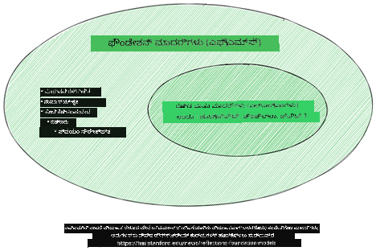
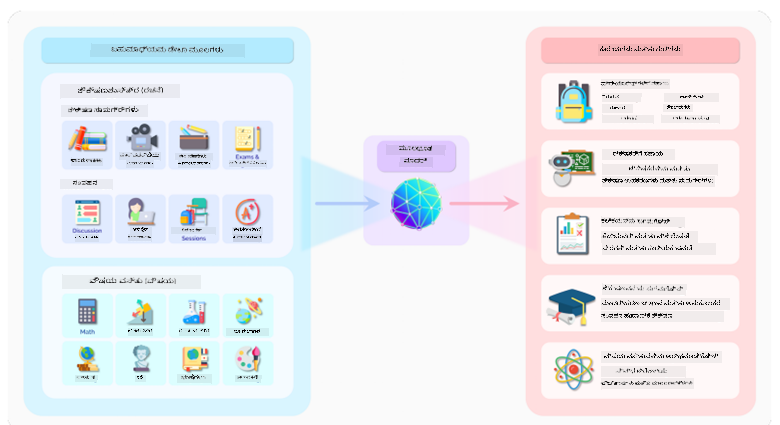
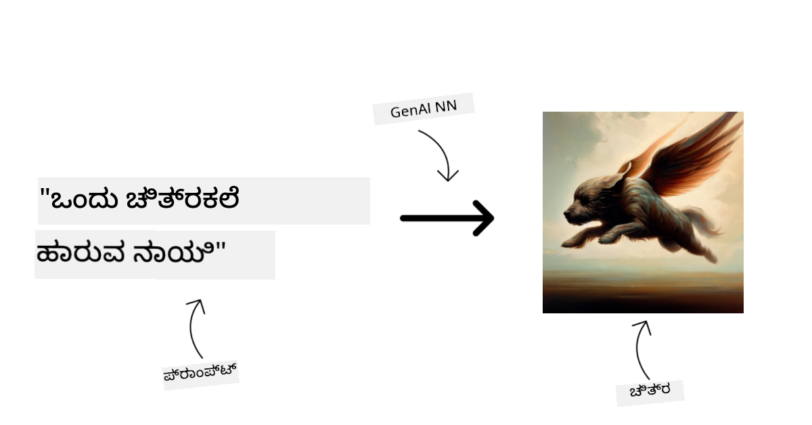
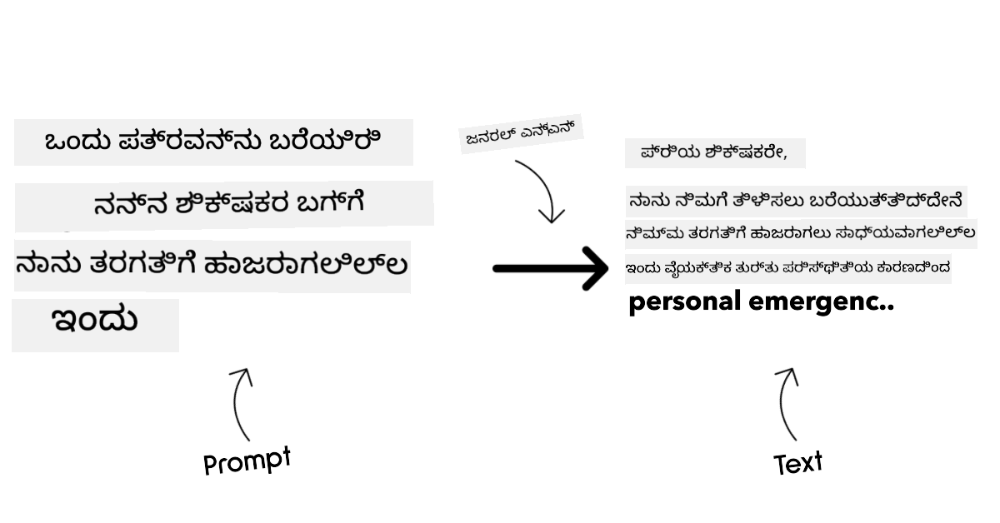
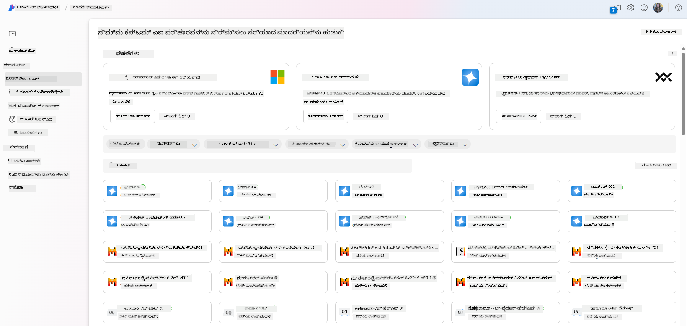
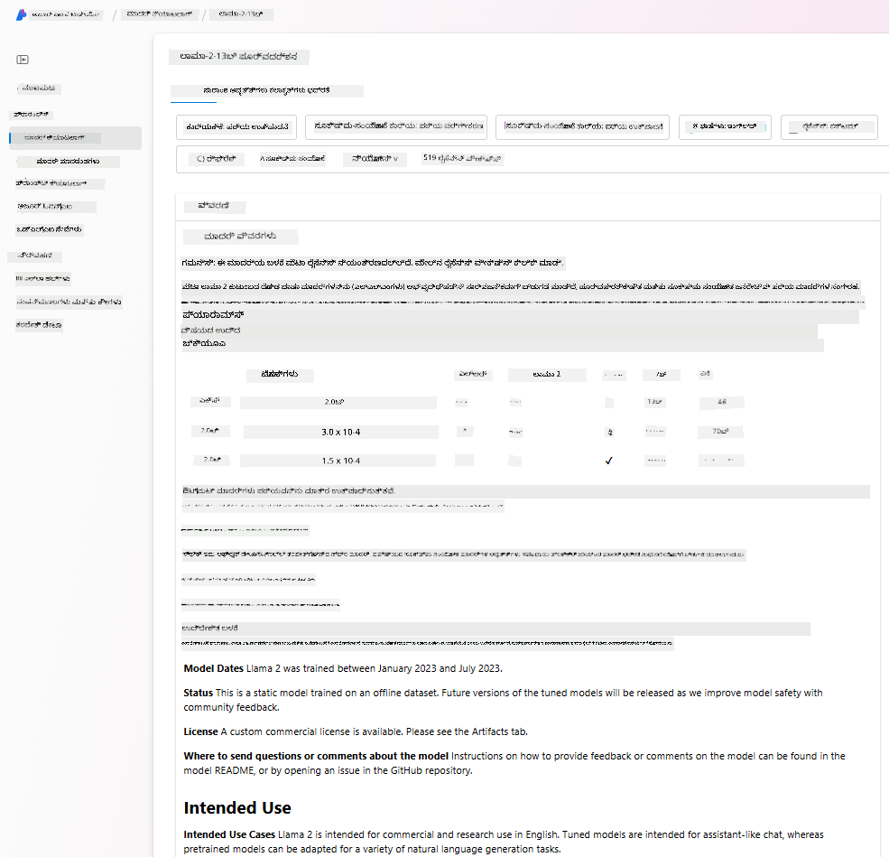
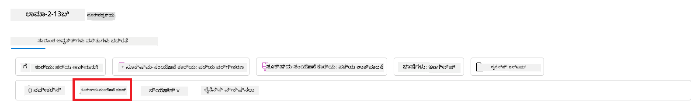
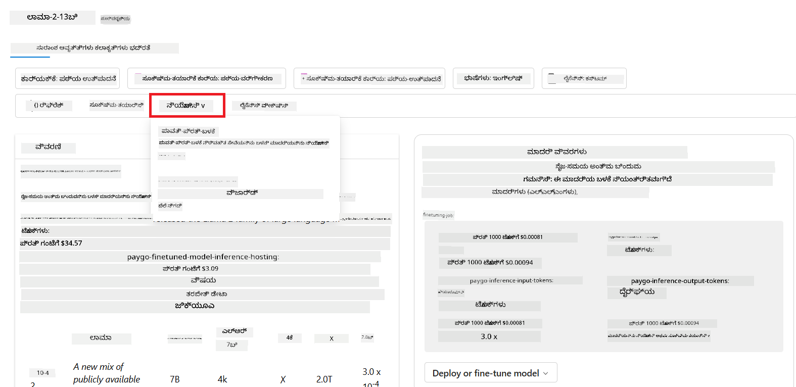
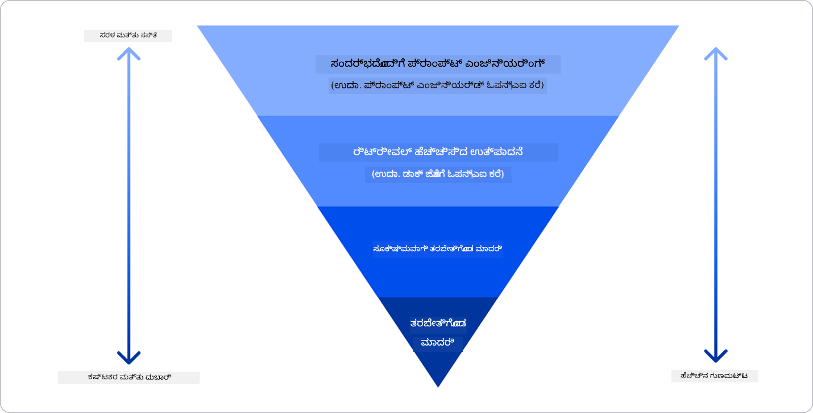

<!--
CO_OP_TRANSLATOR_METADATA:
{
  "original_hash": "6b7629b8ee4d7d874a27213e903d86a7",
  "translation_date": "2025-12-19T19:37:07+00:00",
  "source_file": "02-exploring-and-comparing-different-llms/README.md",
  "language_code": "kn"
}
-->
# ವಿಭಿನ್ನ LLMಗಳನ್ನು ಅನ್ವೇಷಿಸುವುದು ಮತ್ತು ಹೋಲಿಕೆ ಮಾಡುವುದು

> _ಈ ಪಾಠದ ವೀಡಿಯೋವನ್ನು ನೋಡಲು ಮೇಲಿನ ಚಿತ್ರವನ್ನು ಕ್ಲಿಕ್ ಮಾಡಿ_

ಹಿಂದಿನ ಪಾಠದಲ್ಲಿ, ಜನರೇಟಿವ್ AI ತಂತ್ರಜ್ಞಾನ ಕ್ಷೇತ್ರವನ್ನು ಹೇಗೆ ಬದಲಾಯಿಸುತ್ತಿದೆ, ಲಾರ್ಜ್ ಲ್ಯಾಂಗ್ವೇಜ್ ಮಾದರಿಗಳು (LLMs) ಹೇಗೆ ಕಾರ್ಯನಿರ್ವಹಿಸುತ್ತವೆ ಮತ್ತು ನಮ್ಮ ಸ್ಟಾರ್ಟ್ಅಪ್‌ನಂತಹ ವ್ಯವಹಾರವು ಅವುಗಳನ್ನು ತನ್ನ ಬಳಕೆ ಪ್ರಕರಣಗಳಿಗೆ ಹೇಗೆ ಅನ್ವಯಿಸಬಹುದು ಮತ್ತು ಬೆಳೆಯಬಹುದು ಎಂಬುದನ್ನು ನೋಡಿದ್ದೇವೆ! ಈ ಅಧ್ಯಾಯದಲ್ಲಿ, ನಾವು ವಿಭಿನ್ನ ರೀತಿಯ ಲಾರ್ಜ್ ಲ್ಯಾಂಗ್ವೇಜ್ ಮಾದರಿಗಳನ್ನು (LLMs) ಹೋಲಿಸಿ ಅವುಗಳ ಲಾಭ ಮತ್ತು ಹಾನಿಗಳನ್ನು ಅರ್ಥಮಾಡಿಕೊಳ್ಳಲು ನೋಡುತ್ತಿದ್ದೇವೆ.

ನಮ್ಮ ಸ್ಟಾರ್ಟ್ಅಪ್‌ನ ಮುಂದಿನ ಹಂತವು ಪ್ರಸ್ತುತ LLMಗಳ ಪರಿಸರವನ್ನು ಅನ್ವೇಷಿಸುವುದು ಮತ್ತು ನಮ್ಮ ಬಳಕೆ ಪ್ರಕರಣಕ್ಕೆ ಯಾವವು ಸೂಕ್ತವಾಗಿವೆ ಎಂಬುದನ್ನು ಅರ್ಥಮಾಡಿಕೊಳ್ಳುವುದು.

## ಪರಿಚಯ

ಈ ಪಾಠದಲ್ಲಿ ಒಳಗೊಂಡಿರುವವು:

- ಪ್ರಸ್ತುತ ಪರಿಸರದಲ್ಲಿ ವಿಭಿನ್ನ ರೀತಿಯ LLMಗಳು.
- ನಿಮ್ಮ ಬಳಕೆ ಪ್ರಕರಣಕ್ಕಾಗಿ Azure ನಲ್ಲಿ ವಿಭಿನ್ನ ಮಾದರಿಗಳನ್ನು ಪರೀಕ್ಷಿಸುವುದು, ಪುನರಾವರ್ತಿಸುವುದು ಮತ್ತು ಹೋಲಿಕೆ ಮಾಡುವುದು.
- LLM ಅನ್ನು ಹೇಗೆ ನಿಯೋಜಿಸುವುದು.

## ಕಲಿಕೆಯ ಗುರಿಗಳು

ಈ ಪಾಠವನ್ನು ಪೂರ್ಣಗೊಳಿಸಿದ ನಂತರ, ನೀವು:

- ನಿಮ್ಮ ಬಳಕೆ ಪ್ರಕರಣಕ್ಕೆ ಸರಿಯಾದ ಮಾದರಿಯನ್ನು ಆಯ್ಕೆಮಾಡಬಹುದು.
- ನಿಮ್ಮ ಮಾದರಿಯ ಕಾರ್ಯಕ್ಷಮತೆಯನ್ನು ಪರೀಕ್ಷಿಸುವುದು, ಪುನರಾವರ್ತಿಸುವುದು ಮತ್ತು ಸುಧಾರಿಸುವುದನ್ನು ಅರ್ಥಮಾಡಿಕೊಳ್ಳಬಹುದು.
- ವ್ಯವಹಾರಗಳು ಮಾದರಿಗಳನ್ನು ಹೇಗೆ ನಿಯೋಜಿಸುತ್ತವೆ ಎಂಬುದನ್ನು ತಿಳಿದುಕೊಳ್ಳಬಹುದು.

## ವಿಭಿನ್ನ ರೀತಿಯ LLMಗಳನ್ನು ಅರ್ಥಮಾಡಿಕೊಳ್ಳಿ

LLMಗಳು ಅವುಗಳ ವಾಸ್ತುಶಿಲ್ಪ, ತರಬೇತಿ ಡೇಟಾ ಮತ್ತು ಬಳಕೆ ಪ್ರಕರಣದ ಆಧಾರದ ಮೇಲೆ ಹಲವಾರು ವರ್ಗೀಕರಣಗಳನ್ನು ಹೊಂದಿರಬಹುದು. ಈ ಭೇದಗಳನ್ನು ಅರ್ಥಮಾಡಿಕೊಳ್ಳುವುದು ನಮ್ಮ ಸ್ಟಾರ್ಟ್ಅಪ್‌ಗೆ ಸನ್ನಿವೇಶಕ್ಕೆ ಸರಿಯಾದ ಮಾದರಿಯನ್ನು ಆಯ್ಕೆಮಾಡಲು ಮತ್ತು ಪರೀಕ್ಷಿಸುವುದು, ಪುನರಾವರ್ತಿಸುವುದು ಮತ್ತು ಕಾರ್ಯಕ್ಷಮತೆಯನ್ನು ಸುಧಾರಿಸುವುದನ್ನು ಅರ್ಥಮಾಡಿಕೊಳ್ಳಲು ಸಹಾಯ ಮಾಡುತ್ತದೆ.

ಹಲವಾರು ವಿಭಿನ್ನ ರೀತಿಯ LLM ಮಾದರಿಗಳು ಇವೆ, ನಿಮ್ಮ ಮಾದರಿಯ ಆಯ್ಕೆ ನೀವು ಅವುಗಳನ್ನು ಏಕೆ ಬಳಸಲು ಬಯಸುತ್ತೀರಿ, ನಿಮ್ಮ ಡೇಟಾ, ನೀವು ಎಷ್ಟು ಹಣ ಖರ್ಚು ಮಾಡಲು ಸಿದ್ಧರಿದ್ದೀರಿ ಮತ್ತು ಇನ್ನಷ್ಟು ಆಧಾರಿತವಾಗಿರುತ್ತದೆ.

ನೀವು ಮಾದರಿಗಳನ್ನು ಪಠ್ಯ, ಧ್ವನಿ, ವೀಡಿಯೋ, ಚಿತ್ರ ರಚನೆ ಮತ್ತು ಇತ್ಯಾದಿ ಬಳಸಲು ಬಯಸಿದರೆ, ನೀವು ವಿಭಿನ್ನ ರೀತಿಯ ಮಾದರಿಯನ್ನು ಆಯ್ಕೆಮಾಡಬಹುದು.

- **ಧ್ವನಿ ಮತ್ತು ಮಾತು ಗುರುತಿಸುವಿಕೆ**. ಈ ಉದ್ದೇಶಕ್ಕಾಗಿ, Whisper-ಪ್ರಕಾರದ ಮಾದರಿಗಳು ಉತ್ತಮ ಆಯ್ಕೆಯಾಗಿವೆ ಏಕೆಂದರೆ ಅವು ಸಾಮಾನ್ಯ ಉದ್ದೇಶದ ಮತ್ತು ಮಾತು ಗುರುತಿಸುವಿಕೆಗೆ ಉದ್ದೇಶಿಸಲ್ಪಟ್ಟಿವೆ. ಇದು ವಿಭಿನ್ನ ಧ್ವನಿಗಳ ಮೇಲೆ ತರಬೇತಿಗೊಂಡಿದ್ದು ಬಹುಭಾಷಾ ಮಾತು ಗುರುತಿಸುವಿಕೆಯನ್ನು ಮಾಡಬಹುದು. [Whisper ಪ್ರಕಾರದ ಮಾದರಿಗಳ ಬಗ್ಗೆ ಇಲ್ಲಿ ತಿಳಿದುಕೊಳ್ಳಿ](https://platform.openai.com/docs/models/whisper?WT.mc_id=academic-105485-koreyst).

- **ಚಿತ್ರ ರಚನೆ**. ಚಿತ್ರ ರಚನೆಗಾಗಿ, DALL-E ಮತ್ತು Midjourney ಎರಡು ಬಹುಪ್ರಸಿದ್ಧ ಆಯ್ಕೆಗಳು. DALL-E ಅನ್ನು Azure OpenAI ನೀಡುತ್ತದೆ. [DALL-E ಬಗ್ಗೆ ಇಲ್ಲಿ ಹೆಚ್ಚು ಓದಿ](https://platform.openai.com/docs/models/dall-e?WT.mc_id=academic-105485-koreyst) ಮತ್ತು ಈ ಪಠ್ಯಕ್ರಮದ ಅಧ್ಯಾಯ 9 ರಲ್ಲಿಯೂ.

- **ಪಠ್ಯ ರಚನೆ**. ಬಹುತೇಕ ಮಾದರಿಗಳು ಪಠ್ಯ ರಚನೆಗಾಗಿ ತರಬೇತಿಗೊಂಡಿವೆ ಮತ್ತು ನೀವು GPT-3.5 ರಿಂದ GPT-4 ವರೆಗೆ ವಿವಿಧ ಆಯ್ಕೆಗಳನ್ನು ಹೊಂದಿದ್ದೀರಿ. ಅವು ವಿಭಿನ್ನ ವೆಚ್ಚಗಳಲ್ಲಿ ಬರುತ್ತವೆ, GPT-4 ಅತ್ಯಂತ ದುಬಾರಿ. ನಿಮ್ಮ ಅಗತ್ಯಗಳಿಗೆ ಅನುಗುಣವಾಗಿ ಸಾಮರ್ಥ್ಯ ಮತ್ತು ವೆಚ್ಚದ ದೃಷ್ಟಿಯಿಂದ ಯಾವ ಮಾದರಿಗಳು ಉತ್ತಮವೆಂದು ಅಂದಾಜಿಸಲು [Azure OpenAI ಪ್ಲೇಗ್ರೌಂಡ್](https://oai.azure.com/portal/playground?WT.mc_id=academic-105485-koreyst) ನೋಡುವುದು ಲಾಭದಾಯಕ.

- **ಬಹು-ಮಾದರಿತ್ವ**. ನೀವು ಇನ್‌ಪುಟ್ ಮತ್ತು ಔಟ್‌ಪುಟ್‌ನಲ್ಲಿ ಬಹು ವಿಧದ ಡೇಟಾವನ್ನು ನಿರ್ವಹಿಸಲು ಬಯಸಿದರೆ, ನೀವು [gpt-4 ಟರ್ಬೋ ವೀಷನ್ ಅಥವಾ gpt-4o](https://learn.microsoft.com/azure/ai-services/openai/concepts/models#gpt-4-and-gpt-4-turbo-models?WT.mc_id=academic-105485-koreyst) ಮಾದರಿಗಳನ್ನು ನೋಡಬಹುದು - ಇವು OpenAI ಮಾದರಿಗಳ ಇತ್ತೀಚಿನ ಬಿಡುಗಡೆಗಳು - ಇವು ನೈಸರ್ಗಿಕ ಭಾಷಾ ಪ್ರಕ್ರಿಯೆಯನ್ನು ದೃಶ್ಯ ಅರ್ಥಮಾಡಿಕೊಳ್ಳುವಿಕೆಗೆ ಸಂಯೋಜಿಸಲು ಸಾಮರ್ಥ್ಯ ಹೊಂದಿವೆ, ಬಹು-ಮಾದರಿತ್ವ ಇಂಟರ್ಫೇಸ್ಗಳ ಮೂಲಕ ಸಂವಹನವನ್ನು ಸಕ್ರಿಯಗೊಳಿಸುತ್ತವೆ.

ಮಾದರಿಯನ್ನು ಆಯ್ಕೆಮಾಡುವುದು ನಿಮಗೆ ಕೆಲವು ಮೂಲಭೂತ ಸಾಮರ್ಥ್ಯಗಳನ್ನು ನೀಡುತ್ತದೆ, ಆದರೆ ಅದು ಸಾಕಾಗದಿರಬಹುದು. ಬಹುಶಃ ನಿಮ್ಮ ಕಂಪನಿಗೆ ವಿಶೇಷ ಡೇಟಾ ಇರುತ್ತದೆ, ಅದನ್ನು ನೀವು LLMಗೆ ತಿಳಿಸಬೇಕಾಗುತ್ತದೆ. ಅದನ್ನು ಹೇಗೆ ಹತ್ತಿರವಾಗಿಸಲು ಕೆಲವು ವಿಭಿನ್ನ ಆಯ್ಕೆಗಳು ಇವೆ, ಅವುಗಳ ಬಗ್ಗೆ ಮುಂದಿನ ವಿಭಾಗಗಳಲ್ಲಿ ಹೆಚ್ಚು ತಿಳಿದುಕೊಳ್ಳುತ್ತೇವೆ.

### ಫೌಂಡೇಶನ್ ಮಾದರಿಗಳು ಮತ್ತು LLMಗಳು

ಫೌಂಡೇಶನ್ ಮಾದರಿ ಎಂಬ ಪದವನ್ನು [ಸ್ಟ್ಯಾನ್‌ಫರ್ಡ್ ಸಂಶೋಧಕರು ರೂಪಿಸಿದ್ದಾರೆ](https://arxiv.org/abs/2108.07258?WT.mc_id=academic-105485-koreyst) ಮತ್ತು ಇದು ಕೆಲವು ಮಾನದಂಡಗಳನ್ನು ಅನುಸರಿಸುವ AI ಮಾದರಿಯಾಗಿ ವ್ಯಾಖ್ಯಾನಿಸಲಾಗಿದೆ, ಉದಾಹರಣೆಗೆ:

- **ಅವು ಅನಿಯಂತ್ರಿತ ಕಲಿಕೆ ಅಥವಾ ಸ್ವಯಂ-ನಿರೀಕ್ಷಿತ ಕಲಿಕೆಯನ್ನು ಬಳಸಿಕೊಂಡು ತರಬೇತಿಗೊಂಡಿವೆ**, ಅಂದರೆ ಅವು ಲೇಬಲ್ ಮಾಡದ ಬಹು-ಮಾದರಿತ ಡೇಟಾದ ಮೇಲೆ ತರಬೇತಿಗೊಂಡಿದ್ದು, ತರಬೇತಿ ಪ್ರಕ್ರಿಯೆಗೆ ಮಾನವ ಅಂಕಿತ ಅಥವಾ ಲೇಬಲಿಂಗ್ ಅಗತ್ಯವಿಲ್ಲ.
- **ಅವು ಬಹಳ ದೊಡ್ಡ ಮಾದರಿಗಳು**, ಅತಿ ಆಳವಾದ ನ್ಯೂರಲ್ ನೆಟ್‌ವರ್ಕ್‌ಗಳ ಮೇಲೆ ಆಧಾರಿತವಾಗಿದ್ದು, ಬಿಲಿಯನ್‌ಗಳ ಪರಿಮಾಣಗಳ ಮೇಲೆ ತರಬೇತಿಗೊಂಡಿವೆ.
- **ಅವು ಸಾಮಾನ್ಯವಾಗಿ ಇತರ ಮಾದರಿಗಳ ‘ಫೌಂಡೇಶನ್’ ಆಗಿ ಸೇವೆ ನೀಡಲು ಉದ್ದೇಶಿಸಲ್ಪಟ್ಟಿವೆ**, ಅಂದರೆ ಇತರ ಮಾದರಿಗಳನ್ನು ನಿರ್ಮಿಸಲು ಪ್ರಾರಂಭಿಕ ಬಿಂದುವಾಗಿ ಬಳಸಬಹುದು, ಅದನ್ನು ಫೈನ್-ಟ್ಯೂನಿಂಗ್ ಮೂಲಕ ಮಾಡಬಹುದು.

ಚಿತ್ರ ಮೂಲ: [Essential Guide to Foundation Models and Large Language Models | by Babar M Bhatti | Medium](https://thebabar.medium.com/essential-guide-to-foundation-models-and-large-language-models-27dab58f7404)

ಈ ಭೇದವನ್ನು ಇನ್ನಷ್ಟು ಸ್ಪಷ್ಟಪಡಿಸಲು, ChatGPT ಅನ್ನು ಉದಾಹರಣೆಯಾಗಿ ತೆಗೆದುಕೊಳ್ಳೋಣ. ChatGPT ಮೊದಲ ಆವೃತ್ತಿಯನ್ನು ನಿರ್ಮಿಸಲು, GPT-3.5 ಎಂಬ ಮಾದರಿ ಫೌಂಡೇಶನ್ ಮಾದರಿಯಾಗಿ ಸೇವೆ ನೀಡಿತು. ಇದರ ಅರ್ಥ OpenAI ಕೆಲವು ಚಾಟ್-ನಿರ್ದಿಷ್ಟ ಡೇಟಾವನ್ನು ಬಳಸಿಕೊಂಡು GPT-3.5 ನ ಫೈನ್-ಟ್ಯೂನ್ಡ್ ಆವೃತ್ತಿಯನ್ನು ರಚಿಸಿತು, ಇದು ಸಂಭಾಷಣಾ ಸನ್ನಿವೇಶಗಳಲ್ಲಿ ಉತ್ತಮ ಕಾರ್ಯನಿರ್ವಹಿಸಲು ವಿಶೇಷಗೊಳಿಸಲ್ಪಟ್ಟಿತ್ತು, ಉದಾಹರಣೆಗೆ ಚಾಟ್‌ಬಾಟ್‌ಗಳು.

ಚಿತ್ರ ಮೂಲ: [2108.07258.pdf (arxiv.org)](https://arxiv.org/pdf/2108.07258.pdf?WT.mc_id=academic-105485-koreyst)

### ಓಪನ್ ಸೋರ್ಸ್ ಮತ್ತು ಪ್ರೊಪ್ರೈಟರಿ ಮಾದರಿಗಳು

LLMಗಳನ್ನು ವರ್ಗೀಕರಿಸುವ ಮತ್ತೊಂದು ವಿಧಾನವು ಅವು ಓಪನ್ ಸೋರ್ಸ್ ಅಥವಾ ಪ್ರೊಪ್ರೈಟರಿ ಆಗಿರುವುದೇ ಎಂಬುದು.

ಓಪನ್ ಸೋರ್ಸ್ ಮಾದರಿಗಳು ಸಾರ್ವಜನಿಕರಿಗೆ ಲಭ್ಯವಿರುವ ಮಾದರಿಗಳು ಮತ್ತು ಯಾರಾದರೂ ಬಳಸಬಹುದು. ಅವು ಸಾಮಾನ್ಯವಾಗಿ ಅವುಗಳನ್ನು ರಚಿಸಿದ ಕಂಪನಿಯು ಅಥವಾ ಸಂಶೋಧನಾ ಸಮುದಾಯವು ಲಭ್ಯವಿರಿಸುತ್ತವೆ. ಈ ಮಾದರಿಗಳನ್ನು ಪರಿಶೀಲಿಸಲು, ಬದಲಾಯಿಸಲು ಮತ್ತು ವಿವಿಧ LLM ಬಳಕೆ ಪ್ರಕರಣಗಳಿಗೆ ಕಸ್ಟಮೈಸ್ ಮಾಡಲು ಅನುಮತಿಸಲಾಗಿದೆ. ಆದರೆ, ಅವುಗಳು ಸದಾ ಉತ್ಪಾದನಾ ಬಳಕೆಗೆ ಆಪ್ಟಿಮೈಸ್ ಆಗಿರಲಾರವು ಮತ್ತು ಪ್ರೊಪ್ರೈಟರಿ ಮಾದರಿಗಳಂತೆ ಕಾರ್ಯಕ್ಷಮವಾಗಿರಲಾರವು. ಜೊತೆಗೆ, ಓಪನ್ ಸೋರ್ಸ್ ಮಾದರಿಗಳಿಗೆ ಹಣಕಾಸು ಸೀಮಿತವಾಗಿರಬಹುದು ಮತ್ತು ಅವು ದೀರ್ಘಕಾಲಿಕವಾಗಿ ನಿರ್ವಹಿಸಲ್ಪಡದಿರಬಹುದು ಅಥವಾ ಇತ್ತೀಚಿನ ಸಂಶೋಧನೆಯೊಂದಿಗೆ ನವೀಕರಿಸಲ್ಪಡದಿರಬಹುದು. ಜನಪ್ರಿಯ ಓಪನ್ ಸೋರ್ಸ್ ಮಾದರಿಗಳ ಉದಾಹರಣೆಗಳು: [Alpaca](https://crfm.stanford.edu/2023/03/13/alpaca.html?WT.mc_id=academic-105485-koreyst), [Bloom](https://huggingface.co/bigscience/bloom) ಮತ್ತು [LLaMA](https://llama.meta.com).

ಪ್ರೊಪ್ರೈಟರಿ ಮಾದರಿಗಳು ಕಂಪನಿಯ ಮಾಲೀಕತ್ವದಲ್ಲಿರುವ ಮತ್ತು ಸಾರ್ವಜನಿಕರಿಗೆ ಲಭ್ಯವಿಲ್ಲದ ಮಾದರಿಗಳು. ಇವು ಸಾಮಾನ್ಯವಾಗಿ ಉತ್ಪಾದನಾ ಬಳಕೆಗೆ ಆಪ್ಟಿಮೈಸ್ ಮಾಡಲ್ಪಟ್ಟಿರುತ್ತವೆ. ಆದರೆ, ಅವುಗಳನ್ನು ಪರಿಶೀಲಿಸಲು, ಬದಲಾಯಿಸಲು ಅಥವಾ ವಿಭಿನ್ನ ಬಳಕೆ ಪ್ರಕರಣಗಳಿಗೆ ಕಸ್ಟಮೈಸ್ ಮಾಡಲು ಅನುಮತಿಸಲಾಗುವುದಿಲ್ಲ. ಜೊತೆಗೆ, ಅವು ಸದಾ ಉಚಿತವಾಗಿ ಲಭ್ಯವಿರಲಾರವು ಮತ್ತು ಬಳಸಲು ಸಬ್ಸ್ಕ್ರಿಪ್ಷನ್ ಅಥವಾ ಪಾವತಿಯನ್ನು ಅಗತ್ಯವಿರಬಹುದು. ಬಳಕೆದಾರರಿಗೆ ಮಾದರಿಯನ್ನು ತರಬೇತಿಗೊಳಿಸಲು ಬಳಸಲಾದ ಡೇಟಾ ಮೇಲೆ ನಿಯಂತ್ರಣವಿಲ್ಲ, ಆದ್ದರಿಂದ ಅವರು ಡೇಟಾ ಗೌಪ್ಯತೆ ಮತ್ತು ಜವಾಬ್ದಾರಿಯುತ AI ಬಳಕೆಯನ್ನು ಖಚಿತಪಡಿಸಲು ಮಾದರಿ ಮಾಲೀಕರ ಮೇಲೆ ನಂಬಿಕೆ ಇಡಬೇಕು. ಜನಪ್ರಿಯ ಪ್ರೊಪ್ರೈಟರಿ ಮಾದರಿಗಳ ಉದಾಹರಣೆಗಳು: [OpenAI ಮಾದರಿಗಳು](https://platform.openai.com/docs/models/overview?WT.mc_id=academic-105485-koreyst), [Google Bard](https://sapling.ai/llm/bard?WT.mc_id=academic-105485-koreyst) ಅಥವಾ [Claude 2](https://www.anthropic.com/index/claude-2?WT.mc_id=academic-105485-koreyst).

### ಎम्बೆಡ್ಡಿಂಗ್, ಚಿತ್ರ ರಚನೆ ಮತ್ತು ಪಠ್ಯ ಮತ್ತು ಕೋಡ್ ರಚನೆ

LLMಗಳನ್ನು ಅವು ಉತ್ಪಾದಿಸುವ ಔಟ್‌ಪುಟ್ ಆಧರಿಸಿ ವರ್ಗೀಕರಿಸಬಹುದು.

ಎಂಬೆಡ್ಡಿಂಗ್‌ಗಳು ಪಠ್ಯವನ್ನು ಸಂಖ್ಯಾತ್ಮಕ ರೂಪಕ್ಕೆ ಪರಿವರ್ತಿಸುವ ಮಾದರಿಗಳ ಸಮೂಹ, ಇದನ್ನು ಎम्बೆಡ್ಡಿಂಗ್ ಎಂದು ಕರೆಯಲಾಗುತ್ತದೆ, ಇದು ಇನ್‌ಪುಟ್ ಪಠ್ಯದ ಸಂಖ್ಯಾತ್ಮಕ ಪ್ರತಿನಿಧಾನ. ಎम्बೆಡ್ಡಿಂಗ್‌ಗಳು ಯಂತ್ರಗಳಿಗೆ ಪದಗಳು ಅಥವಾ ವಾಕ್ಯಗಳ ನಡುವಿನ ಸಂಬಂಧಗಳನ್ನು ಅರ್ಥಮಾಡಿಕೊಳ್ಳಲು ಸುಲಭವಾಗಿಸುತ್ತವೆ ಮತ್ತು ಇತರ ಮಾದರಿಗಳ ಇನ್‌ಪುಟ್ ಆಗಿ ಬಳಸಬಹುದು, ಉದಾಹರಣೆಗೆ ವರ್ಗೀಕರಣ ಮಾದರಿಗಳು ಅಥವಾ ಸಂಖ್ಯಾತ್ಮಕ ಡೇಟಾದ ಮೇಲೆ ಉತ್ತಮ ಕಾರ್ಯಕ್ಷಮತೆಯ ಕ್ಲಸ್ಟರಿಂಗ್ ಮಾದರಿಗಳು. ಎम्बೆಡ್ಡಿಂಗ್ ಮಾದರಿಗಳನ್ನು ಸಾಮಾನ್ಯವಾಗಿ ಟ್ರಾನ್ಸ್‌ಫರ್ ಲರ್ನಿಂಗ್‌ಗೆ ಬಳಸಲಾಗುತ್ತದೆ, ಅಲ್ಲಿ ಒಂದು ಮಾದರಿಯನ್ನು ಹೆಚ್ಚಿನ ಡೇಟಾ ಇರುವ ಪರ್ಯಾಯ ಕಾರ್ಯಕ್ಕಾಗಿ ನಿರ್ಮಿಸಿ, ನಂತರ ಆ ಮಾದರಿಯ ತೂಕಗಳನ್ನು (ಎಂಬೆಡ್ಡಿಂಗ್‌ಗಳನ್ನು) ಇತರ ಡೌನ್‌ಸ್ಟ್ರೀಮ್ ಕಾರ್ಯಗಳಿಗೆ ಮರುಬಳಕೆ ಮಾಡಲಾಗುತ್ತದೆ. ಈ ವರ್ಗದ ಉದಾಹರಣೆ [OpenAI embeddings](https://platform.openai.com/docs/models/embeddings?WT.mc_id=academic-105485-koreyst).

ಚಿತ್ರ ರಚನೆ ಮಾದರಿಗಳು ಚಿತ್ರಗಳನ್ನು ರಚಿಸುವ ಮಾದರಿಗಳು. ಇವು ಸಾಮಾನ್ಯವಾಗಿ ಚಿತ್ರ ಸಂಪಾದನೆ, ಚಿತ್ರ ಸಂಶ್ಲೇಷಣೆ ಮತ್ತು ಚಿತ್ರ ಅನುವಾದಕ್ಕೆ ಬಳಸಲಾಗುತ್ತವೆ. ಚಿತ್ರ ರಚನೆ ಮಾದರಿಗಳನ್ನು ಸಾಮಾನ್ಯವಾಗಿ ದೊಡ್ಡ ಚಿತ್ರ ಡೇಟಾಸೆಟ್‌ಗಳ ಮೇಲೆ ತರಬೇತಿಗೊಳಿಸಲಾಗುತ್ತದೆ, ಉದಾಹರಣೆಗೆ [LAION-5B](https://laion.ai/blog/laion-5b/?WT.mc_id=academic-105485-koreyst), ಮತ್ತು ಹೊಸ ಚಿತ್ರಗಳನ್ನು ರಚಿಸಲು ಅಥವಾ ಇನ್ಪೇಂಟಿಂಗ್, ಸೂಪರ್-ರೆಸಲ್ಯೂಶನ್ ಮತ್ತು ಬಣ್ಣೀಕರಣ ತಂತ್ರಗಳನ್ನು ಬಳಸಿ ಇತ್ತೀಚಿನ ಚಿತ್ರಗಳನ್ನು ಸಂಪಾದಿಸಲು ಬಳಸಬಹುದು. ಉದಾಹರಣೆಗಳು: [DALL-E-3](https://openai.com/dall-e-3?WT.mc_id=academic-105485-koreyst) ಮತ್ತು [Stable Diffusion ಮಾದರಿಗಳು](https://github.com/Stability-AI/StableDiffusion?WT.mc_id=academic-105485-koreyst).

ಪಠ್ಯ ಮತ್ತು ಕೋಡ್ ರಚನೆ ಮಾದರಿಗಳು ಪಠ್ಯ ಅಥವಾ ಕೋಡ್ ರಚಿಸುವ ಮಾದರಿಗಳು. ಇವು ಸಾಮಾನ್ಯವಾಗಿ ಪಠ್ಯ ಸಾರಾಂಶ, ಅನುವಾದ ಮತ್ತು ಪ್ರಶ್ನೋತ್ತರಕ್ಕೆ ಬಳಸಲಾಗುತ್ತವೆ. ಪಠ್ಯ ರಚನೆ ಮಾದರಿಗಳನ್ನು ಸಾಮಾನ್ಯವಾಗಿ ದೊಡ್ಡ ಪಠ್ಯ ಡೇಟಾಸೆಟ್‌ಗಳ ಮೇಲೆ ತರಬೇತಿಗೊಳಿಸಲಾಗುತ್ತದೆ, ಉದಾಹರಣೆಗೆ [BookCorpus](https://www.cv-foundation.org/openaccess/content_iccv_2015/html/Zhu_Aligning_Books_and_ICCV_2015_paper.html?WT.mc_id=academic-105485-koreyst), ಮತ್ತು ಹೊಸ ಪಠ್ಯವನ್ನು ರಚಿಸಲು ಅಥವಾ ಪ್ರಶ್ನೆಗಳಿಗೆ ಉತ್ತರಿಸಲು ಬಳಸಬಹುದು. ಕೋಡ್ ರಚನೆ ಮಾದರಿಗಳು, ಉದಾಹರಣೆಗೆ [CodeParrot](https://huggingface.co/codeparrot?WT.mc_id=academic-105485-koreyst), ಸಾಮಾನ್ಯವಾಗಿ GitHub ನಂತಹ ದೊಡ್ಡ ಕೋಡ್ ಡೇಟಾಸೆಟ್‌ಗಳ ಮೇಲೆ ತರಬೇತಿಗೊಳಿಸಲಾಗುತ್ತದೆ ಮತ್ತು ಹೊಸ ಕೋಡ್ ರಚಿಸಲು ಅಥವಾ ಇತ್ತೀಚಿನ ಕೋಡ್‌ನ ದೋಷಗಳನ್ನು ಸರಿಪಡಿಸಲು ಬಳಸಬಹುದು.

### ಎನ್‌ಕೋಡರ್-ಡಿಕೋಡರ್ ಮತ್ತು ಡಿಕೋಡರ್-ಮಾತ್ರ

LLMಗಳ ವಿಭಿನ್ನ ವಾಸ್ತುಶಿಲ್ಪಗಳ ಬಗ್ಗೆ ಮಾತನಾಡಲು, ಒಂದು ಉಪಮೆಯನ್ನು ಬಳಸೋಣ.

ನಿಮ್ಮ ವ್ಯವಸ್ಥಾಪಕರು ವಿದ್ಯಾರ್ಥಿಗಳಿಗೆ ಒಂದು ಪ್ರಶ್ನೋತ್ತರ ರಚಿಸುವ ಕಾರ್ಯವನ್ನು ನೀಡಿದರೆಂದು ಕಲ್ಪಿಸೋಣ. ನಿಮ್ಮ ಬಳಿ ಇಬ್ಬರು ಸಹೋದ್ಯೋಗಿಗಳು ಇದ್ದಾರೆ; ಒಬ್ಬರು ವಿಷಯವನ್ನು ರಚಿಸುವುದನ್ನು ನೋಡಿಕೊಳ್ಳುತ್ತಾರೆ ಮತ್ತು ಮತ್ತೊಬ್ಬರು ಅವುಗಳನ್ನು ಪರಿಶೀಲಿಸುವುದನ್ನು ನೋಡಿಕೊಳ್ಳುತ್ತಾರೆ.

ವಿಷಯ ರಚನೆ ಮಾಡುವವರು ಡಿಕೋಡರ್ ಮಾತ್ರ ಮಾದರಿಯಂತೆ ಇದ್ದಾರೆ, ಅವರು ವಿಷಯವನ್ನು ನೋಡಿ ನೀವು ಈಗಾಗಲೇ ಏನು ಬರೆದಿದ್ದೀರೋ ಅದನ್ನು ಗಮನಿಸಿ ಆ ಆಧಾರದ ಮೇಲೆ ಕೋರ್ಸ್ ಬರೆಯುತ್ತಾರೆ. ಅವರು ಆಕರ್ಷಕ ಮತ್ತು ಮಾಹಿತಿ ಪೂರ್ಣ ವಿಷಯ ಬರೆಯಲು ತುಂಬಾ ಚೆನ್ನಾಗಿದ್ದಾರೆ, ಆದರೆ ವಿಷಯ ಮತ್ತು ಕಲಿಕೆಯ ಉದ್ದೇಶಗಳನ್ನು ಅರ್ಥಮಾಡಿಕೊಳ್ಳಲು ಚೆನ್ನಾಗಿಲ್ಲ. ಡಿಕೋಡರ್ ಮಾದರಿಗಳ ಕೆಲವು ಉದಾಹರಣೆಗಳು GPT ಕುಟುಂಬದ ಮಾದರಿಗಳು, ಉದಾಹರಣೆಗೆ GPT-3.

ಪರಿಶೀಲಕರು ಎನ್‌ಕೋಡರ್ ಮಾತ್ರ ಮಾದರಿಯಂತೆ ಇದ್ದಾರೆ, ಅವರು ಬರೆಯಲಾದ ಕೋರ್ಸ್ ಮತ್ತು ಉತ್ತರಗಳನ್ನು ನೋಡಿ ಅವುಗಳ ನಡುವಿನ ಸಂಬಂಧವನ್ನು ಗಮನಿಸಿ ಸನ್ನಿವೇಶವನ್ನು ಅರ್ಥಮಾಡಿಕೊಳ್ಳುತ್ತಾರೆ, ಆದರೆ ವಿಷಯ ರಚಿಸಲು ಚೆನ್ನಾಗಿಲ್ಲ. ಎನ್‌ಕೋಡರ್ ಮಾತ್ರ ಮಾದರಿಯ ಉದಾಹರಣೆ BERT.

ನಾವು ಯಾರಾದರೂ ಪ್ರಶ್ನೋತ್ತರವನ್ನು ರಚಿಸಿ ಪರಿಶೀಲಿಸುವವರನ್ನೂ ಹೊಂದಿದ್ದೇವೆ ಎಂದು ಕಲ್ಪಿಸೋಣ, ಇದು ಎನ್‌ಕೋಡರ್-ಡಿಕೋಡರ್ ಮಾದರಿ. ಕೆಲವು ಉದಾಹರಣೆಗಳು BART ಮತ್ತು T5.

### ಸೇವೆ ಮತ್ತು ಮಾದರಿ

ಈಗ, ಸೇವೆ ಮತ್ತು ಮಾದರಿಯ ನಡುವಿನ ಭೇದವನ್ನು ನೋಡೋಣ. ಸೇವೆ ಎಂದರೆ ಕ್ಲೌಡ್ ಸೇವಾ ಪೂರೈಕೆದಾರರಿಂದ ನೀಡಲಾಗುವ ಉತ್ಪನ್ನ, ಇದು ಸಾಮಾನ್ಯವಾಗಿ ಮಾದರಿಗಳು, ಡೇಟಾ ಮತ್ತು ಇತರ ಘಟಕಗಳ ಸಂಯೋಜನೆ. ಮಾದರಿ ಎಂದರೆ ಸೇವೆಯ ಮೂಲ ಘಟಕ, ಮತ್ತು ಸಾಮಾನ್ಯವಾಗಿ ಫೌಂಡೇಶನ್ ಮಾದರಿ, ಉದಾಹರಣೆಗೆ LLM.

ಸೇವೆಗಳು ಸಾಮಾನ್ಯವಾಗಿ ಉತ್ಪಾದನಾ ಬಳಕೆಗೆ ಆಪ್ಟಿಮೈಸ್ ಮಾಡಲ್ಪಟ್ಟಿರುತ್ತವೆ ಮತ್ತು ಮಾದರಿಗಳಿಗಿಂತ ಬಳಕೆ ಸುಲಭವಾಗಿರುತ್ತವೆ, ಗ್ರಾಫಿಕಲ್ ಯೂಸರ್ ಇಂಟರ್ಫೇಸ್ ಮೂಲಕ. ಆದರೆ, ಸೇವೆಗಳು ಸದಾ ಉಚಿತವಾಗಿ ಲಭ್ಯವಿರಲಾರವು ಮತ್ತು ಬಳಸಲು ಸಬ್ಸ್ಕ್ರಿಪ್ಷನ್ ಅಥವಾ ಪಾವತಿಯನ್ನು ಅಗತ್ಯವಿರಬಹುದು, ಸೇವೆ ಮಾಲೀಕರ ಉಪಕರಣಗಳು ಮತ್ತು ಸಂಪನ್ಮೂಲಗಳನ್ನು ಬಳಸುವ ಬದಲಿಗೆ, ವೆಚ್ಚಗಳನ್ನು ಆಪ್ಟಿಮೈಸ್ ಮಾಡುವುದು ಮತ್ತು ಸುಲಭವಾಗಿ ವಿಸ್ತರಿಸುವುದು. ಸೇವೆಯ ಉದಾಹರಣೆ [Azure OpenAI Service](https://learn.microsoft.com/azure/ai-services/openai/overview?WT.mc_id=academic-105485-koreyst), ಇದು ಬಳಕೆದಾರರು ಸೇವೆಯನ್ನು ಎಷ್ಟು ಬಳಸುತ್ತಾರೆ ಅಷ್ಟರಷ್ಟು ಪಾವತಿಸುವ ಪ್ಲಾನ್ ನೀಡುತ್ತದೆ. ಜೊತೆಗೆ, Azure OpenAI Service ಮಾದರಿಗಳ ಸಾಮರ್ಥ್ಯಗಳ ಮೇಲೆ ಎಂಟರ್‌ಪ್ರೈಸ್-ಗ್ರೇಡ್ ಭದ್ರತೆ ಮತ್ತು ಜವಾಬ್ದಾರಿಯುತ AI ಚಟುವಟಿಕೆಗಳನ್ನು ಒದಗಿಸುತ್ತದೆ.

ಮಾದರಿಗಳು ಕೇವಲ ನ್ಯೂರಲ್ ನೆಟ್‌ವರ್ಕ್, ಪರಿಮಾಣಗಳು, ತೂಕಗಳು ಮತ್ತು ಇತರವುಗಳಾಗಿವೆ. ಕಂಪನಿಗಳು ಸ್ಥಳೀಯವಾಗಿ ಚಾಲನೆ ಮಾಡಲು ಅನುಮತಿಸುತ್ತದೆ, ಆದರೆ ಉಪಕರಣಗಳನ್ನು ಖರೀದಿಸಬೇಕಾಗುತ್ತದೆ, ವಿಸ್ತರಣೆಗೆ ರಚನೆ ನಿರ್ಮಿಸಬೇಕಾಗುತ್ತದೆ ಮತ್ತು ಪರವಾನಗಿ ಖರೀದಿಸಬೇಕಾಗುತ್ತದೆ ಅಥವಾ ಓಪನ್ ಸೋರ್ಸ್ ಮಾದರಿಯನ್ನು ಬಳಸಬೇಕಾಗುತ್ತದೆ. LLaMA ಮಾದರಿ ಲಭ್ಯವಿದ್ದು, ಅದನ್ನು ಚಾಲನೆ ಮಾಡಲು ಗಣನೀಯ ಶಕ್ತಿಯನ್ನು ಅಗತ್ಯವಿದೆ.

## Azure ನಲ್ಲಿ ವಿಭಿನ್ನ ಮಾದರಿಗಳೊಂದಿಗೆ ಕಾರ್ಯಕ್ಷಮತೆಯನ್ನು ಪರೀಕ್ಷಿಸುವುದು ಮತ್ತು ಪುನರಾವರ್ತಿಸುವುದು ಹೇಗೆ

ನಮ್ಮ ತಂಡವು ಪ್ರಸ್ತುತ LLM ಪರಿಸರವನ್ನು ಅನ್ವೇಷಿಸಿ ತಮ್ಮ ಸನ್ನಿವೇಶಗಳಿಗೆ ಉತ್ತಮ ಅಭ್ಯರ್ಥಿಗಳನ್ನು ಗುರುತಿಸಿದ ನಂತರ, ಮುಂದಿನ ಹಂತವು ಅವುಗಳನ್ನು ತಮ್ಮ ಡೇಟಾ ಮತ್ತು ಕೆಲಸದ ಭಾರದಲ್ಲಿ ಪರೀಕ್ಷಿಸುವುದು. ಇದು ಪ್ರಯೋಗಗಳು ಮತ್ತು ಅಳತೆಗಳ ಮೂಲಕ ನಡೆಸುವ ಪುನರಾವರ್ತಿತ ಪ್ರಕ್ರಿಯೆ.
ಹಿಂದಿನ ಪ್ಯಾರಾಗ್ರಾಫ್‌ಗಳಲ್ಲಿ ನಾವು ಉಲ್ಲೇಖಿಸಿದ ಬಹುತೇಕ ಮಾದರಿಗಳು (OpenAI ಮಾದರಿಗಳು, Llama2 ಹೋಲುವ ಮುಕ್ತ ಮೂಲ ಮಾದರಿಗಳು ಮತ್ತು Hugging Face ಟ್ರಾನ್ಸ್‌ಫಾರ್ಮರ್‌ಗಳು) [Azure AI Studio](https://ai.azure.com/?WT.mc_id=academic-105485-koreyst)ಯಲ್ಲಿರುವ [Model Catalog](https://learn.microsoft.com/azure/ai-studio/how-to/model-catalog-overview?WT.mc_id=academic-105485-koreyst)ನಲ್ಲಿ ಲಭ್ಯವಿವೆ.

[Azure AI Studio](https://learn.microsoft.com/azure/ai-studio/what-is-ai-studio?WT.mc_id=academic-105485-koreyst) ಎಂಬುದು ಅಭಿವೃದ್ಧಿಪಡಕರಿಗೆ ಜನರೇಟಿವ್ AI ಅಪ್ಲಿಕೇಶನ್‌ಗಳನ್ನು ನಿರ್ಮಿಸಲು ಮತ್ತು ಸಂಪೂರ್ಣ ಅಭಿವೃದ್ಧಿ ಜೀವನಚಕ್ರವನ್ನು - ಪ್ರಯೋಗದಿಂದ ಮೌಲ್ಯಮಾಪನದವರೆಗೆ - ನಿರ್ವಹಿಸಲು ವಿನ್ಯಾಸಗೊಳಿಸಲಾದ ಕ್ಲೌಡ್ ಪ್ಲಾಟ್‌ಫಾರ್ಮ್ ಆಗಿದ್ದು, ಎಲ್ಲಾ Azure AI ಸೇವೆಗಳನ್ನು ಒಂದು ಸುಲಭ GUI ಹೊಂದಿರುವ ಹಬ್‌ನಲ್ಲಿ ಸಂಯೋಜಿಸುತ್ತದೆ. Azure AI Studioಯಲ್ಲಿನ Model Catalog ಬಳಕೆದಾರರಿಗೆ ಈ ಕೆಳಗಿನವುಗಳನ್ನು ಸಾಧ್ಯಮಾಡುತ್ತದೆ:

- ಕ್ಯಾಟಲಾಗ್‌ನಲ್ಲಿ ಆಸಕ್ತಿಯ ಫೌಂಡೇಶನ್ ಮಾದರಿಯನ್ನು ಹುಡುಕುವುದು - ಸ್ವಂತ ಅಥವಾ ಮುಕ್ತ ಮೂಲವಾಗಿರಬಹುದು, ಕಾರ್ಯ, ಪರವಾನಗಿ ಅಥವಾ ಹೆಸರಿನ ಮೂಲಕ ಫಿಲ್ಟರ್ ಮಾಡಬಹುದು. ಹುಡುಕುವಿಕೆಯನ್ನು ಸುಧಾರಿಸಲು, ಮಾದರಿಗಳನ್ನು ಸಂಗ್ರಹಗಳಾಗಿ ಸಂಘಟಿಸಲಾಗಿದೆ, ಉದಾಹರಣೆಗೆ Azure OpenAI ಸಂಗ್ರಹ, Hugging Face ಸಂಗ್ರಹ ಮತ್ತು ಇನ್ನಷ್ಟು.

- ಮಾದರಿ ಕಾರ್ಡ್ ಪರಿಶೀಲನೆ, ಇದರಲ್ಲಿ ಉದ್ದೇಶಿತ ಬಳಕೆ ಮತ್ತು ತರಬೇತಿ ಡೇಟಾದ ವಿವರವಾದ ವಿವರಣೆ, ಕೋಡ್ ಮಾದರಿಗಳು ಮತ್ತು ಆಂತರಿಕ ಮೌಲ್ಯಮಾಪನ ಗ್ರಂಥಾಲಯದ ಮೌಲ್ಯಮಾಪನ ಫಲಿತಾಂಶಗಳು ಸೇರಿವೆ.

- ಉದ್ಯಮದಲ್ಲಿ ಲಭ್ಯವಿರುವ ಮಾದರಿಗಳು ಮತ್ತು ಡೇಟಾಸೆಟ್‌ಗಳ ನಡುವಿನ ಬೆಂಚ್‌ಮಾರ್ಕ್‌ಗಳನ್ನು ಹೋಲಿಸಿ, ಯಾವುದು ವ್ಯವಹಾರ ದೃಶ್ಯಾವಳಿಗೆ ಹೊಂದಿಕೆಯಾಗುತ್ತದೆ ಎಂದು ಅಂದಾಜಿಸಲು [Model Benchmarks](https://learn.microsoft.com/azure/ai-studio/how-to/model-benchmarks?WT.mc_id=academic-105485-koreyst) ಪೇನ್ ಮೂಲಕ.

- ಕಸ್ಟಮ್ ತರಬೇತಿ ಡೇಟಾದ ಮೇಲೆ ಮಾದರಿಯನ್ನು ಫೈನ್-ಟ್ಯೂನ್ ಮಾಡಿ, ನಿರ್ದಿಷ್ಟ ಕೆಲಸದಲ್ಲಿ ಮಾದರಿ ಕಾರ್ಯಕ್ಷಮತೆಯನ್ನು ಸುಧಾರಿಸಲು, Azure AI Studioಯ ಪ್ರಯೋಗ ಮತ್ತು ಟ್ರ್ಯಾಕಿಂಗ್ ಸಾಮರ್ಥ್ಯಗಳನ್ನು ಉಪಯೋಗಿಸಿ.

- ಮೂಲ ಪೂರ್ವ-ತರಬೇತಿಗೊಂಡ ಮಾದರಿ ಅಥವಾ ಫೈನ್-ಟ್ಯೂನ್ ಮಾಡಲಾದ ಆವೃತ್ತಿಯನ್ನು ದೂರದ实时 ಇನ್ಫರೆನ್ಸ್ - ನಿರ್ವಹಿತ ಕಂಪ್ಯೂಟ್ - ಅಥವಾ ಸರ್ವರ್‌ಲೆಸ್ API ಎಂಡ್‌ಪಾಯಿಂಟ್ - [ಪೇ-ಆಸ್-ಯು-ಗೋ](https://learn.microsoft.com/azure/ai-studio/how-to/model-catalog-overview#model-deployment-managed-compute-and-serverless-api-pay-as-you-go?WT.mc_id=academic-105485-koreyst) - ಗೆ ನಿಯೋಜಿಸಿ, ಅಪ್ಲಿಕೇಶನ್‌ಗಳು ಅದನ್ನು ಉಪಯೋಗಿಸಲು ಸಾಧ್ಯವಾಗುತ್ತದೆ.

> [!NOTE]
> ಕ್ಯಾಟಲಾಗ್‌ನಲ್ಲಿರುವ ಎಲ್ಲಾ ಮಾದರಿಗಳು ಪ್ರಸ್ತುತ ಫೈನ್-ಟ್ಯೂನಿಂಗ್ ಮತ್ತು/ಅಥವಾ ಪೇ-ಆಸ್-ಯು-ಗೋ ನಿಯೋಜನೆಗೆ ಲಭ್ಯವಿರುವುದಿಲ್ಲ. ಮಾದರಿ ಸಾಮರ್ಥ್ಯಗಳು ಮತ್ತು ಮಿತಿಗಳನ್ನು ವಿವರಿಸಲು ಮಾದರಿ ಕಾರ್ಡ್ ಪರಿಶೀಲಿಸಿ.

## LLM ಫಲಿತಾಂಶಗಳನ್ನು ಸುಧಾರಿಸುವುದು

ನಾವು ನಮ್ಮ ಸ್ಟಾರ್ಟ್ಅಪ್ ತಂಡದೊಂದಿಗೆ ವಿವಿಧ ರೀತಿಯ LLMಗಳನ್ನು ಮತ್ತು ವಿವಿಧ ಮಾದರಿಗಳನ್ನು ಹೋಲಿಸಲು, ಪರೀಕ್ಷಾ ಡೇಟಾದ ಮೇಲೆ ಅವುಗಳನ್ನು ಮೌಲ್ಯಮಾಪನ ಮಾಡಲು, ಕಾರ್ಯಕ್ಷಮತೆಯನ್ನು ಸುಧಾರಿಸಲು ಮತ್ತು ಇನ್ಫರೆನ್ಸ್ ಎಂಡ್‌ಪಾಯಿಂಟ್‌ಗಳಲ್ಲಿ ನಿಯೋಜಿಸಲು ಸಹಾಯ ಮಾಡುವ ಕ್ಲೌಡ್ ಪ್ಲಾಟ್‌ಫಾರ್ಮ್ (Azure Machine Learning) ಅನ್ನು ಅನ್ವೇಷಿಸಿದ್ದೇವೆ.

ಆದರೆ ಪೂರ್ವ-ತರಬೇತಿಗೊಂಡ ಮಾದರಿಯನ್ನು ಬಳಸುವುದಕ್ಕಿಂತ ಫೈನ್-ಟ್ಯೂನಿಂಗ್ ಮಾಡಬೇಕಾಗುವ ಸಮಯ ಯಾವಾಗ? ನಿರ್ದಿಷ್ಟ ಕೆಲಸಗಳಲ್ಲಿ ಮಾದರಿ ಕಾರ್ಯಕ್ಷಮತೆಯನ್ನು ಸುಧಾರಿಸಲು ಇತರ ವಿಧಾನಗಳಿವೆಯೇ?

ವ್ಯವಹಾರವು LLMನಿಂದ ಬೇಕಾದ ಫಲಿತಾಂಶಗಳನ್ನು ಪಡೆಯಲು ಬಳಸಬಹುದಾದ ಹಲವು ವಿಧಾನಗಳಿವೆ. ನೀವು ಉತ್ಪಾದನೆಯಲ್ಲಿ LLM ಅನ್ನು ನಿಯೋಜಿಸುವಾಗ ತರಬೇತಿಯ ವಿವಿಧ ಮಟ್ಟಗಳೊಂದಿಗೆ ವಿಭಿನ್ನ ಮಾದರಿಗಳನ್ನು ಆಯ್ಕೆ ಮಾಡಬಹುದು, ವಿವಿಧ ಜಟಿಲತೆ, ವೆಚ್ಚ ಮತ್ತು ಗುಣಮಟ್ಟದ ಮಟ್ಟಗಳೊಂದಿಗೆ. ಇಲ್ಲಿವೆ ಕೆಲವು ವಿಭಿನ್ನ ವಿಧಾನಗಳು:

- **ಸಂದರ್ಭದೊಂದಿಗೆ ಪ್ರಾಂಪ್ಟ್ ಎಂಜಿನಿಯರಿಂಗ್**. ನೀವು ಬೇಕಾದ ಪ್ರತಿಕ್ರಿಯೆಗಳನ್ನು ಪಡೆಯಲು ಪ್ರಾಂಪ್ಟ್ ನೀಡುವಾಗ ಸಾಕಷ್ಟು ಸಂದರ್ಭವನ್ನು ಒದಗಿಸುವುದು.

- **Retrieval Augmented Generation, RAG**. ನಿಮ್ಮ ಡೇಟಾ ಉದಾಹರಣೆಗೆ ಡೇಟಾಬೇಸ್ ಅಥವಾ ವೆಬ್ ಎಂಡ್‌ಪಾಯಿಂಟ್‌ನಲ್ಲಿ ಇರಬಹುದು, ಪ್ರಾಂಪ್ಟ್ ಸಮಯದಲ್ಲಿ ಈ ಡೇಟಾ ಅಥವಾ ಅದರ ಉಪಸಮೂಹವನ್ನು ಸೇರಿಸಲು, ನೀವು ಸಂಬಂಧಿತ ಡೇಟಾವನ್ನು ಪಡೆದು ಬಳಕೆದಾರರ ಪ್ರಾಂಪ್ಟ್ ಭಾಗವನ್ನಾಗಿ ಮಾಡಬಹುದು.

- **ಫೈನ್-ಟ್ಯೂನ್ ಮಾಡಲಾದ ಮಾದರಿ**. ಇಲ್ಲಿ, ನೀವು ನಿಮ್ಮ ಸ್ವಂತ ಡೇಟಾದ ಮೇಲೆ ಮಾದರಿಯನ್ನು ಮತ್ತಷ್ಟು ತರಬೇತಿಗೊಳಿಸಿದ್ದೀರಿ, ಇದರಿಂದ ಮಾದರಿ ನಿಮ್ಮ ಅಗತ್ಯಗಳಿಗೆ ಹೆಚ್ಚು ನಿಖರ ಮತ್ತು ಪ್ರತಿಕ್ರಿಯಾಶೀಲವಾಗುತ್ತದೆ ಆದರೆ ಇದು ವೆಚ್ಚವಾಗಬಹುದು.

ಚಿತ್ರ ಮೂಲ: [Four Ways that Enterprises Deploy LLMs | Fiddler AI Blog](https://www.fiddler.ai/blog/four-ways-that-enterprises-deploy-llms?WT.mc_id=academic-105485-koreyst)

### ಸಂದರ್ಭದೊಂದಿಗೆ ಪ್ರಾಂಪ್ಟ್ ಎಂಜಿನಿಯರಿಂಗ್

ಪೂರ್ವ-ತರಬೇತಿಗೊಂಡ LLMಗಳು ಸಾಮಾನ್ಯೃತಿಯಲ್ಲಿ ನೈಸರ್ಗಿಕ ಭಾಷಾ ಕಾರ್ಯಗಳಲ್ಲಿ ಬಹಳ ಚೆನ್ನಾಗಿ ಕಾರ್ಯನಿರ್ವಹಿಸುತ್ತವೆ, ಒಂದು ಸಣ್ಣ ಪ್ರಾಂಪ್ಟ್, ಉದಾಹರಣೆಗೆ ಪೂರ್ಣಗೊಳಿಸುವ ವಾಕ್ಯ ಅಥವಾ ಪ್ರಶ್ನೆ - "ಶೂನ್ಯ-ಶಾಟ್" ಕಲಿಕೆ ಎಂದು ಕರೆಯಲ್ಪಡುವುದು - ಮೂಲಕ ಕೂಡ.

ಆದರೆ, ಬಳಕೆದಾರರು ತಮ್ಮ ಪ್ರಶ್ನೆಯನ್ನು ವಿವರವಾದ ವಿನಂತಿ ಮತ್ತು ಉದಾಹರಣೆಗಳೊಂದಿಗೆ - ಸಂದರ್ಭ - ರೂಪಿಸಿದಷ್ಟು, ಉತ್ತರವು ಹೆಚ್ಚು ನಿಖರ ಮತ್ತು ಬಳಕೆದಾರರ ನಿರೀಕ್ಷೆಗಳಿಗೆ ಹತ್ತಿರವಾಗಿರುತ್ತದೆ. ಈ ಸಂದರ್ಭದಲ್ಲಿ, ಪ್ರಾಂಪ್ಟ್ ಒಂದೇ ಒಂದು ಉದಾಹರಣೆಯನ್ನು ಒಳಗೊಂಡಿದ್ದರೆ "ಒಂದು-ಶಾಟ್" ಕಲಿಕೆ ಮತ್ತು ಬಹು ಉದಾಹರಣೆಗಳನ್ನು ಒಳಗೊಂಡಿದ್ದರೆ "ಕೆಲವು-ಶಾಟ್" ಕಲಿಕೆ ಎಂದು ಕರೆಯಲಾಗುತ್ತದೆ.
ಸಂದರ್ಭದೊಂದಿಗೆ ಪ್ರಾಂಪ್ಟ್ ಎಂಜಿನಿಯರಿಂಗ್ ಪ್ರಾರಂಭಿಸಲು ಅತ್ಯಂತ ವೆಚ್ಚ-ಪ್ರಭಾವಿ ವಿಧಾನವಾಗಿದೆ.

### Retrieval Augmented Generation (RAG)

LLMಗಳಿಗೆ ತರಬೇತಿ ಸಮಯದಲ್ಲಿ ಬಳಸಲಾದ ಡೇಟಾವನ್ನು ಮಾತ್ರ ಉತ್ತರ ರಚನೆಗೆ ಬಳಸಬಹುದಾದ ಮಿತಿ ಇದೆ. ಅಂದರೆ, ತರಬೇತಿ ಪ್ರಕ್ರಿಯೆಯ ನಂತರ ಸಂಭವಿಸಿದ ವಾಸ್ತವಗಳ ಬಗ್ಗೆ ಅವರಿಗೆ ತಿಳಿದಿಲ್ಲ ಮತ್ತು ಅವರು ಸಾರ್ವಜನಿಕವಲ್ಲದ ಮಾಹಿತಿಗೆ (ಉದಾಹರಣೆಗೆ ಕಂಪನಿ ಡೇಟಾ) ಪ್ರವೇಶ ಹೊಂದಲಾರರು.
ಇದನ್ನು RAG ಮೂಲಕ ಮೀರಿ ಹೋಗಬಹುದು, ಇದು ಪ್ರಾಂಪ್ಟ್ ಅನ್ನು ಹೊರಗಿನ ಡೇಟಾ (ದಾಖಲೆಗಳ ತುಂಡುಗಳ ರೂಪದಲ್ಲಿ) ಜೊತೆಗೆ ವಿಸ್ತರಿಸುವ ತಂತ್ರ. ಇದು ಪ್ರಾಂಪ್ಟ್ ಉದ್ದದ ಮಿತಿಗಳನ್ನು ಪರಿಗಣಿಸುತ್ತದೆ. ಇದು Vector ಡೇಟಾಬೇಸ್ ಉಪಕರಣಗಳ (ಉದಾಹರಣೆಗೆ [Azure Vector Search](https://learn.microsoft.com/azure/search/vector-search-overview?WT.mc_id=academic-105485-koreyst)) ಮೂಲಕ ಬೆಂಬಲಿತವಾಗಿದ್ದು, ವಿವಿಧ ಪೂರ್ವ-ನಿರ್ಧರಿತ ಡೇಟಾ ಮೂಲಗಳಿಂದ ಉಪಯುಕ್ತ ತುಂಡುಗಳನ್ನು ಪಡೆದು ಅವುಗಳನ್ನು ಪ್ರಾಂಪ್ಟ್ ಸಂದರ್ಭಕ್ಕೆ ಸೇರಿಸುತ್ತದೆ.

ಈ ತಂತ್ರವು ವ್ಯವಹಾರಕ್ಕೆ ಸಾಕಷ್ಟು ಡೇಟಾ, ಸಮಯ ಅಥವಾ ಸಂಪನ್ಮೂಲಗಳಿಲ್ಲದಿದ್ದಾಗ ಸಹಾಯಕರಾಗಿದ್ದು, ನಿರ್ದಿಷ್ಟ ಕೆಲಸದಲ್ಲಿ ಕಾರ್ಯಕ್ಷಮತೆಯನ್ನು ಸುಧಾರಿಸಲು ಮತ್ತು ವಾಸ್ತವದ ಮಿಥ್ಯಾಕರಣ ಅಥವಾ ಹಾನಿಕರ ವಿಷಯಗಳ ಅಪಾಯವನ್ನು ಕಡಿಮೆ ಮಾಡಲು ಸಹಾಯ ಮಾಡುತ್ತದೆ.

### ಫೈನ್-ಟ್ಯೂನ್ ಮಾಡಲಾದ ಮಾದರಿ

ಫೈನ್-ಟ್ಯೂನಿಂಗ್ ಎಂಬುದು ಮಾದರಿಯನ್ನು ಡೌನ್‌ಸ್ಟ್ರೀಮ್ ಕಾರ್ಯಕ್ಕೆ ಹೊಂದಿಕೊಳ್ಳಲು ಅಥವಾ ನಿರ್ದಿಷ್ಟ ಸಮಸ್ಯೆಯನ್ನು ಪರಿಹರಿಸಲು ಟ್ರಾನ್ಸ್‌ಫರ್ ಲರ್ನಿಂಗ್ ಅನ್ನು ಉಪಯೋಗಿಸುವ ಪ್ರಕ್ರಿಯೆ. ಕೆಲ-ಶಾಟ್ ಕಲಿಕೆ ಮತ್ತು RAGಗೆ ಭಿನ್ನವಾಗಿ, ಇದು ನವೀಕೃತ ತೂಕಗಳು ಮತ್ತು ಬಯಾಸುಗಳೊಂದಿಗೆ ಹೊಸ ಮಾದರಿಯನ್ನು ರಚಿಸುತ್ತದೆ. ಇದಕ್ಕೆ ಪ್ರಾಂಪ್ಟ್ (ಒಂದು ಇನ್‌ಪುಟ್) ಮತ್ತು ಅದರ ಸಂಬಂಧಿತ ಔಟ್‌ಪುಟ್ (ಪೂರ್ಣಗೊಳಿಸುವಿಕೆ) ಹೊಂದಿರುವ ತರಬೇತಿ ಉದಾಹರಣೆಗಳ ಸೆಟ್ ಅಗತ್ಯವಿದೆ.
ಇದು ಈ ಕೆಳಗಿನ ಸಂದರ್ಭಗಳಲ್ಲಿ ಆದ್ಯತೆಯ ವಿಧಾನವಾಗಿರುತ್ತದೆ:

- **ಫೈನ್-ಟ್ಯೂನ್ ಮಾಡಲಾದ ಮಾದರಿಗಳನ್ನು ಬಳಸುವುದು**. ವ್ಯವಹಾರವು ಕಡಿಮೆ ಸಾಮರ್ಥ್ಯದ ಫೈನ್-ಟ್ಯೂನ್ ಮಾಡಲಾದ ಮಾದರಿಗಳನ್ನು (ಉದಾಹರಣೆಗೆ ಎಂಬೆಡ್ಡಿಂಗ್ ಮಾದರಿಗಳು) ಹೆಚ್ಚು ಕಾರ್ಯಕ್ಷಮ ಮಾದರಿಗಳಿಗಿಂತ ಬಳಸಲು ಇಚ್ಛಿಸುವುದು, ಇದು ಹೆಚ್ಚು ವೆಚ್ಚ-ಪ್ರಭಾವಿ ಮತ್ತು ವೇಗವಾದ ಪರಿಹಾರವನ್ನು ನೀಡುತ್ತದೆ.

- **ವಿಲಂಬವನ್ನು ಪರಿಗಣಿಸುವುದು**. ನಿರ್ದಿಷ್ಟ ಬಳಕೆಯು ವಿಲಂಬಕ್ಕೆ ಮಹತ್ವ ನೀಡುತ್ತದೆ, ಆದ್ದರಿಂದ ಬಹಳ ಉದ್ದದ ಪ್ರಾಂಪ್ಟ್‌ಗಳನ್ನು ಬಳಸಲು ಸಾಧ್ಯವಿಲ್ಲ ಅಥವಾ ಮಾದರಿಯಿಂದ ಕಲಿಯಬೇಕಾದ ಉದಾಹರಣೆಗಳ ಸಂಖ್ಯೆ ಪ್ರಾಂಪ್ಟ್ ಉದ್ದ ಮಿತಿಗೆ ಹೊಂದಿಕೆಯಾಗುವುದಿಲ್ಲ.

- **ನವೀಕರಿಸಿಕೊಂಡಿರುವುದು**. ವ್ಯವಹಾರವು ಹೆಚ್ಚಿನ ಗುಣಮಟ್ಟದ ಡೇಟಾ ಮತ್ತು ಗ್ರೌಂಡ್ ಟ್ರೂತ್ ಲೇಬಲ್‌ಗಳನ್ನು ಹೊಂದಿದ್ದು, ಈ ಡೇಟಾವನ್ನು ಕಾಲಕಾಲಕ್ಕೆ ನವೀಕರಿಸಲು ಅಗತ್ಯವಿರುವ ಸಂಪನ್ಮೂಲಗಳನ್ನು ಹೊಂದಿದೆ.

### ತರಬೇತಿಗೊಂಡ ಮಾದರಿ

ಶೂನ್ಯದಿಂದ LLM ತರಬೇತಿ ನೀಡುವುದು ನಿಶ್ಚಿತವಾಗಿ ಅತ್ಯಂತ ಕಠಿಣ ಮತ್ತು ಜಟಿಲ ವಿಧಾನವಾಗಿದ್ದು, ಭಾರೀ ಪ್ರಮಾಣದ ಡೇಟಾ, ಪರಿಣತ ಸಂಪನ್ಮೂಲಗಳು ಮತ್ತು ಸೂಕ್ತ ಗಣನೀಯ ಶಕ್ತಿಯನ್ನು ಅಗತ್ಯವಿದೆ. ಈ ಆಯ್ಕೆಯನ್ನು ಮಾತ್ರ ವ್ಯವಹಾರವು ಡೊಮೇನ್-ನಿರ್ದಿಷ್ಟ ಬಳಕೆಯುಳ್ಳ ಮತ್ತು ದೊಡ್ಡ ಪ್ರಮಾಣದ ಡೊಮೇನ್-ಕೇಂದ್ರಿತ ಡೇಟಾವನ್ನು ಹೊಂದಿರುವ ಸಂದರ್ಭಗಳಲ್ಲಿ ಪರಿಗಣಿಸಬೇಕು.

## ಜ್ಞಾನ ಪರಿಶೀಲನೆ

LLM ಪೂರ್ಣಗೊಳಿಸುವ ಫಲಿತಾಂಶಗಳನ್ನು ಸುಧಾರಿಸಲು ಉತ್ತಮ ವಿಧಾನ ಯಾವುದು?

1. ಸಂದರ್ಭದೊಂದಿಗೆ ಪ್ರಾಂಪ್ಟ್ ಎಂಜಿನಿಯರಿಂಗ್  
2. RAG  
3. ಫೈನ್-ಟ್ಯೂನ್ ಮಾಡಲಾದ ಮಾದರಿ

ಉತ್ತರ: 3, ನೀವು ಸಮಯ, ಸಂಪನ್ಮೂಲಗಳು ಮತ್ತು ಉತ್ತಮ ಗುಣಮಟ್ಟದ ಡೇಟಾ ಹೊಂದಿದ್ದರೆ, ನವೀಕರಿಸಿಕೊಂಡಿರುವುದಕ್ಕಾಗಿ ಫೈನ್-ಟ್ಯೂನಿಂಗ್ ಉತ್ತಮ ಆಯ್ಕೆಯಾಗಿದೆ. ಆದರೆ, ನೀವು ಸುಧಾರಣೆ ಮಾಡಲು ಬಯಸುತ್ತೀರಾ ಮತ್ತು ಸಮಯ ಕೊರತೆ ಇದ್ದರೆ ಮೊದಲು RAG ಪರಿಗಣಿಸುವುದು ಸೂಕ್ತ.

## 🚀 ಸವಾಲು

ನಿಮ್ಮ ವ್ಯವಹಾರಕ್ಕಾಗಿ [RAG ಅನ್ನು ಹೇಗೆ ಬಳಸಬಹುದು](https://learn.microsoft.com/azure/search/retrieval-augmented-generation-overview?WT.mc_id=academic-105485-koreyst) ಎಂಬುದರ ಬಗ್ಗೆ ಹೆಚ್ಚಿನ ಅಧ್ಯಯನ ಮಾಡಿ.

## ಅದ್ಭುತ ಕೆಲಸ, ನಿಮ್ಮ ಅಧ್ಯಯನವನ್ನು ಮುಂದುವರೆಸಿ

ಈ ಪಾಠವನ್ನು ಪೂರ್ಣಗೊಳಿಸಿದ ನಂತರ, ನಮ್ಮ [ಜನರೇಟಿವ್ AI ಕಲಿಕೆ ಸಂಗ್ರಹ](https://aka.ms/genai-collection?WT.mc_id=academic-105485-koreyst) ಅನ್ನು ಪರಿಶೀಲಿಸಿ ಮತ್ತು ನಿಮ್ಮ ಜನರೇಟಿವ್ AI ಜ್ಞಾನವನ್ನು ಮತ್ತಷ್ಟು ಹೆಚ್ಚಿಸಿ!

ಪಾಠ 3ಕ್ಕೆ ಹೋಗಿ, ಅಲ್ಲಿ ನಾವು [ಜನರೇಟಿವ್ AI ಅನ್ನು ಜವಾಬ್ದಾರಿಯಾಗಿ ಹೇಗೆ ನಿರ್ಮಿಸಬಹುದು](../03-using-generative-ai-responsibly/README.md?WT.mc_id=academic-105485-koreyst) ಎಂಬುದನ್ನು ನೋಡೋಣ!

---

<!-- CO-OP TRANSLATOR DISCLAIMER START -->
**ಅಸ್ವೀಕರಣ**:  
ಈ ದಸ್ತಾವೇಜು AI ಅನುವಾದ ಸೇವೆ [Co-op Translator](https://github.com/Azure/co-op-translator) ಬಳಸಿ ಅನುವಾದಿಸಲಾಗಿದೆ. ನಾವು ನಿಖರತೆಯಿಗಾಗಿ ಪ್ರಯತ್ನಿಸುತ್ತಿದ್ದರೂ, ಸ್ವಯಂಚಾಲಿತ ಅನುವಾದಗಳಲ್ಲಿ ದೋಷಗಳು ಅಥವಾ ತಪ್ಪುಗಳು ಇರಬಹುದು ಎಂದು ದಯವಿಟ್ಟು ಗಮನಿಸಿ. ಮೂಲ ಭಾಷೆಯಲ್ಲಿರುವ ಮೂಲ ದಸ್ತಾವೇಜನ್ನು ಅಧಿಕೃತ ಮೂಲವಾಗಿ ಪರಿಗಣಿಸಬೇಕು. ಪ್ರಮುಖ ಮಾಹಿತಿಗಾಗಿ, ವೃತ್ತಿಪರ ಮಾನವ ಅನುವಾದವನ್ನು ಶಿಫಾರಸು ಮಾಡಲಾಗುತ್ತದೆ. ಈ ಅನುವಾದ ಬಳಕೆಯಿಂದ ಉಂಟಾಗುವ ಯಾವುದೇ ತಪ್ಪು ಅರ್ಥಮಾಡಿಕೊಳ್ಳುವಿಕೆ ಅಥವಾ ತಪ್ಪು ವಿವರಣೆಗಳಿಗೆ ನಾವು ಹೊಣೆಗಾರರಾಗುವುದಿಲ್ಲ.
<!-- CO-OP TRANSLATOR DISCLAIMER END -->