# ವಿಭಿನ್ನ LLMಗಳನ್ನು ಅನ್ವೇಷಿಸುವುದು ಮತ್ತು ಹೋಲಿಕೆ ಮಾಡುವುದು

[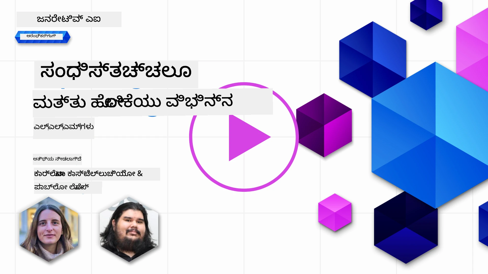](https://youtu.be/KIRUeDKscfI?si=8BHX1zvwzQBn-PlK)

> _ಈ ಪಾಠದ ವೀಡಿಯೊವನ್ನು ನೋಡಲು ಮೇಲಿನ ಚಿತ್ರವನ್ನು ಕ್ಲಿಕ್ ಮಾಡಿ_

ಹಿಂದಿನ ಪಾಠದಲ್ಲಿ ನಾವು ನೋಡಿ ಬಂದಿದ್ದು ಔತೋಜನಕ AI ತಂತ್ರಜ್ಞಾನ ದೃಷ್ಯವನ್ನು ಹೇಗೆ ಬದಲಾಯಿಸುತ್ತಿದೆ, ಲಾರ್ಜ್ ಲ್ಯಾಂಗುಯೇಜ್ ಮಾದರಿಗಳು (LLMs) ಹೇಗೆ ಕಾರ್ಯನಿರ್ವಹಿಸುತ್ತವೆ ಮತ್ತು ನಮ್ಮ ಸ್ಟಾರ್ಟ್ಅಪ್ ಹೌದಾಗುವಂತೆ ವ್ಯವಹಾರವು ಅವುಗಳನ್ನು ಬಳಸಿಕೊಂಡು ತನ್ನ ಉಪಯೋಗ ಪ್ರಕರಣಗಳಿಗೆ ಹೇಗೆ ಅನ್ವಯಿಸಬಹುದು ಎಂಬುದಾಗಿದೆ! ಈ ಅಧ್ಯಾಯದಲ್ಲಿ, ನಾವು ವಿಭಿನ್ನ ವಿಧದ ಲಾರ್ಜ್ ಲ್ಯಾಂಗುಯೇಜ್ ಮಾದರಿಗಳನ್ನು (LLMs) ಹೋಲಿಕೆ ಮತ್ತು ವಿರೋಧವನ್ನು ಪರಿಶೀಲಿಸುತ್ತೇವೆ ಅವುಗಳ ಲಾಭ ಮತ್ತು ಹಾನಿಗಳನ್ನು ಅರಿಯಲು.

ನಮ್ಮ ಸ್ಟಾರ್ಟ್‌ಅಪ್ ಯಾತ್ರೆಯ ಮುಂದಿನ ಹಂತವು LLMಗಳ ಪ್ರಸ್ತುತ ಪರಿಸರವನ್ನು ಅನ್ವೇಷಿಸಿ ಹಾಗೂ ನಮ್ಮ ಉಪಯೋಗ ಪ್ರಕರಣಕ್ಕೆ ಯಾವವು ಸೂಕ್ತವೋ ಅದನ್ನು ಅರ್ಥಮಾಡಿಕೊಳ್ಳುವುದು.

## ಪರಿಚಯ

ಈ ಪಾಠವು ಒಳಗೊಂಡಿರುವುದು:

- ಪ್ರಸ್ತುತ ಪರಿಸರದಲ್ಲಿನ ವੱਖ-ವಕ್ಕೆ LLMಗಳ ವಿಭಿನ್ನ ವಿಧಗಳು.
- ನೀವು Azureನಲ್ಲಿ ನಿಮ್ಮ ಉಪಯೋಗ ಪ್ರಕರಣಕ್ಕೆ ವಿವಿಧ ಮಾದರಿಗಳನ್ನು ಪರೀಕ್ಷಿಸುವುದು, ಪುನರಾವೃತ್ತಿ ಮಾಡುವುದು ಮತ್ತು ಹೋಲಿಕೆ ಮಾಡುವುದು.
- LLMಯನ್ನು ಹೇಗೆ ನಿಯೋಜಿಸಬೇಕು.

## ಅಧ್ಯಯನ ಗುರಿಗಳು

ಈ ಪಾಠವನ್ನು ಪೂರ್ಣಗೊಳಿಸಿದ ನಂತರ, ನೀವು:

- ನಿಮ್ಮ ಉಪಯೋಗ ಪ್ರಕರಣಕ್ಕೆ ಸರಿಯಾದ ಮಾದರಿಯನ್ನು ಆಯ್ಕೆಮಾಡುವುದು.
- ನಿಮ್ಮ ಮಾದರಿಯ ಕಾರ್ಯಕ್ಷಮತೆಯನ್ನು ಹೇಗೆ ಪರೀಕ್ಷಿಸಬೇಕು, ಪುನರಾವೃತ್ತಿ ಮಾಡಬೇಕು ಮತ್ತು ಸುಧಾರಿಸಬೇಕು ಎಂಬುದನ್ನು ಅರ್ಥಮಾಡಿಕೊಳ್ಳುವುದು.
- ವ್ಯವಹಾರಗಳು ಹೇಗೆ ಮಾದರಿಗಳನ್ನು ನಿಯೋಜಿಸುತ್ತವೆ ಎಂಬುದನ್ನು ತಿಳಿದುಕೊಳ್ಳುವುದು.

## ವಿವಿಧ ವಿಧದ LLMಗಳ ಅರ್ಥಮಾಡಿಕೊಳ್ಳൽ

LLMಗಳು ಇವರ ವಾಸ್ತುಶಿಲ್ಪ, ತರಬೇತಿ ಡೇಟಾ, ಮತ್ತು ಉಪಯೋಗ ಪ್ರಕರಣದ ಆಧಾರದ ಮೇಲೆ ಹಲವಾರು ವರ್ಗಕರಣಗಳನ್ನು ಹೊಂದಿರಬಹುದು. ಈ ಭೇದಗಳನ್ನು ಅರ್ಥಮಾಡಿಕೊಂಡರೆ, ನಮ್ಮ ಸ್ಟಾರ್ಟ್‌ಅಪ್ ಸರಿಯಾದ ಮಾದರಿಯನ್ನು ಆಯ್ಕೆಮಾಡಲು ಸಹಾಯವಾಗುತ್ತದೆ ಮತ್ತು ಪರೀಕ್ಷಿಸುವುದು, ಪುನರಾವೃತ್ತಿ ಮಾಡುವುದು ಮತ್ತು ಕಾರ್ಯಕ್ಷಮತೆ ಸುಧಾರಿಸುವ ವಿಧಾನಗಳನ್ನು ಅರಿಯಲು ಅನುಕೂಲ ಆಗಲಿದೆ.

ವಿವಿದ ವಿಧದ LLM ಮಾದರಿಗಳು ಇವೆ, ನಿಮ್ಮ ಮಾದರಿಯ ಆಯ್ಕೆ ನೀವು ಅದನ್ನು ಏನಿಗೆ ಬಳಸಲು ಬಯಸುತ್ತೀರಿ, ನಿಮ್ಮ ಡೇಟಾ, ನೀವು ನೀಡಲು ಸಿದ್ಧವಾಗಿರುವ ಬಂದಿನ ಪ್ರಮಾಣ ಮತ್ತು ಇನ್ನಿತರ ವಿಷಯಗಳ ಮೇಲೆ ಅವಲಂಬಿತವಾಗಿದೆ.

ನೀವು ಮಾದರಿಗಳನ್ನು ಪಠ್ಯ, ಧ್ವನಿ, ವಿಡಿಯೋ, ಚಿತ್ರ ಉತ್ಪಾದನೆ ಮತ್ತು ಇತ್ಯಾದಿಗಳಿಗೆ ಬಳಸಲು ಬಯಸುತ್ತೀರಾ ಎಂಬುದರ উপর ಅವಲಂಬಿಸಿ ವಿವಿಧ ಮಾದರಿಗಳನ್ನು ಆರಿಸಬಹುದು.

- **ಧ್ವನಿ ಮತ್ತು ಮಾತು ಗುರುತಿಸುವಿಕೆ**. ವಿಸ್ಪರ್ ಶೈಲಿಯ ಮಾದರಿಗಳು ಇನ್ನೂ ಸಾಮಾನ್ಯ ಧ್ವನಿ ಗುರುತಿಸುವಿಕೆ ಮಾದರಿಗಳಾಗಿವೆ, ಆದರೆ ಉತ್ಪಾದನಾ ಆಯ್ಕೆಗಳಲ್ಲಿ ಈಗ ಹೊಸ ಧ್ವನಿಯಿಂದ ಪಠ್ಯಕ್ಕೆ ಮಾದರಿಗಳು ಸೇರಿದಂತೆ `gpt-4o-transcribe`, `gpt-4o-mini-transcribe`, ಮತ್ತು ಡೈರೈಸೇಶನ್ ಪ್ರಕಾರಗಳಿವೆ. ನಿಮ್ಮ ದೃಶ್ಯಾವಳಿಗೆ ಭಾಷಾ ವ್ಯಾಪ್ತಿ, ಡೈರೈಸೇಶನ್, ರಿಯಲ್-ಟೈಮ್ ಬೆಂಬಲ, ವಿಳಂಬ ಮತ್ತು ವೆಚ್ಚವನ್ನು ಮೌಲ್ಯಮಾಪನ ಮಾಡಿರಿ. [OpenAI speech-to-text documentation](https://platform.openai.com/docs/guides/speech-to-text?WT.mc_id=academic-105485-koreyst) ನಲ್ಲಿ ಹೆಚ್ಚು ತಿಳಿದುಕೊಳ್ಳಿ.

- **ಚಿತ್ರ ಉತ್ಪಾದನೆ**. DALL-E ಮತ್ತು Midjourney ಪ್ರಸಿದ್ಧ ಚಿತ್ರ ಉತ್ಪಾದನೆ ಆಯ್ಕೆಗಳು, ಆದರೆ ಪ್ರಸ್ತುತ OpenAI ಚಿತ್ರ API ಗಳು ‘gpt-image-2’ ಮುಂತಾದ GPT ಚಿತ್ರ ಮಾದರಿಗಳ ಮೇಲೆ ಕೇಂದ್ರಿತವಾಗಿವೆ, ಹಾಗೂ Stable Diffusion, Imagen, Flux ಮತ್ತು ಇತರ ಮಾದರಿ ಕುಟುಂಬಗಳು ಸಹ ಸಾಮಾನ್ಯ ಆಯ್ಕೆಗಳು. ಪ್ರಾಂಪ್ಟ್ ಅನುಸರಣಾ, ಸಂಪಾದನೆ ಬೆಂಬಲ, ಶೈಲಿ ನಿಯಂತ್ರಣ, ಭದ್ರತಾ ಅವಶ್ಯಕತೆಗಳು ಮತ್ತು ಪರವಾನಿಗೆಗಳನ್ನು ಹೋಲಿಸಿ. [OpenAI image generation guide](https://platform.openai.com/docs/guides/images?WT.mc_id=academic-105485-koreyst) ಮತ್ತು ಈ ಪಠ್ಯಕ್ರಮದ ಅಧ್ಯಾಯ 9ರಲ್ಲಿ ಹೆಚ್ಚಿನ ಮಾಹಿತಿ ದೊರೆಯುತ್ತದೆ.

- **ಪಠ್ಯ ಉತ್ಪಾದನೆ**. ಪಠ್ಯ ಮಾದರಿಗಳು ಈಗ ಮುಂಚೂಣಿ ಮಾದರಿಗಳು, ತರ್ಕಮಯ ಮಾದರಿಗಳು, ಸಣ್ಣ ಕಡಿಮೆ-ವಿಳಂಬ ಮಾದರಿಗಳು ಮತ್ತು ತೆರೆದ-ತೂಕ ಮಾದರಿಗಳನ್ನು ಒಳಗೊಂಡಿವೆ. ಪ್ರಸ್ತುತ ಉದಾಹರಣೆಗಳಿಗೆ OpenAI GPT-5.x ಮಾದರಿಗಳು, Anthropิก Claude 4.x ಮಾದರಿಗಳು, Google Gemini 3.x ಮಾದರಿಗಳು, Meta Llama 4 ಮಾದರಿಗಳು ಮತ್ತು Mistral ಮಾದರಿಗಳು ಸೇರಿವೆ. ಬಿಡುಗಡೆ ದಿನಾಂಕ ಅಥವಾ ಬೆಲೆ ಆಧಾರಿತ ಆಯ್ಕೆಮಾಡಬೇಡಿ; ಕಾರ್ಯಗುಣಮಟ್ಟ, ವಿಳಂಬ, ಸನ್ನಿವೇಶ ಕಿಟಕಿ, ಸಾಧನ ಬಳಕೆ, ಭದ್ರತಾ ವರ್ತನೆ, ಪ್ರಾದೇಶಿಕ ಲಭ್ಯತೆ ಮತ್ತು ಒಟ್ಟು ವೆಚ್ಚವನ್ನು ಹೋಲಿಸಿ. [Microsoft Foundry model catalog](https://ai.azure.com/catalog?WT.mc_id=academic-105485-koreyst) ನಲ್ಲಿ Azureಗೌಳಿದ ಮಾದರಿಗಳನ್ನು ಹೋಲಿಸಲು ಸೂಕ್ತ ಸ್ಥಳ.

- **ಬಹು ಮಾದರಿತ್ವ**. ಹಲವಾರು ಪ್ರಸ್ತುತ ಮಾದರಿಗಳು ಪಠ್ಯಕ್ಕಿಂತ ಹೆಚ್ಚಿನವನ್ನು ಸಂಸ್ಕರಿಸಬಹುದು. ಕೆಲವು ಚಿತ್ರ, ಧ್ವನಿ ಅಥವಾ ವಿಡಿಯೋ ಇನ್‌ಪುಟ್‌ಗಳನ್ನು ಸ್ವೀಕರಿಸುತ್ತವೆ; ಕೆಲವು ಸಾಧನಗಳನ್ನು ಕರೆ ಮಾಡಬಹುದು; ಹಾಗೂ ವಿಶೇಷ ಮಾದರಿಗಳು ಚಿತ್ರ, ಧ್ವನಿ ಅಥವಾ ವಿಡಿಯೋ ಉತ್ಪಾದಿಸಬಲ್ಲವು. ಉದಾಹರಣೆಗಾಗಿ, ಪ್ರಸ್ತುತ OpenAI ಮಾದರಿಗಳು ಪಠ್ಯ ಮತ್ತು ಚಿತ್ರ ಇನ್‌ಪುಟ್ ಅನ್ನು ಬೆಂಬಲಿಸುತ್ತವೆ, Gemini ಮಾದರಿಗಳು ಬೇರೆಯ ಪ್ರಕಾರದ ಆಧಾರದ ಮೇಲೆ ಪಠ್ಯ, ಕೋಡ್, ಚಿತ್ರ, ಧ್ವನಿ ಮತ್ತು ವಿಡಿಯೋ ಇನ್‌ಪುಟ್‌ಗಳನ್ನು ಬೆಂಬಲಿಸುತ್ತವೆ, ಮತ್ತು Llama 4 Scout ಮತ್ತು Maverick ಮುಂಚಿತವಾಗಿ ಬಹು-ಮಾದರಿತ ನೈಸರ್ಗಿಕ ಎಲ್ವೇಟಕ ಮಾದರಿಗಳು. ಯಾವುದೇ ಕಾರ್ಯಚಟುವಟಿಕೆ ನಿರ್ಮಿಸುವ ಮುನ್ನ ಪ್ರತಿ ಮಾದರಿ ಕಾರ್ಡ್ ನಲ್ಲಿ ಬೆಂಬಲಿತ ಇನ್‌ಪುಟ್ ಮತ್ತು ಔಟ್‌ಪುಟ್ ಮಾದರಿಗಳನ್ನು ಪರಿಶೀಲಿಸಿ.

ಮಾದರಿ ಆಯ್ಕೆ ಮಾಡಿದಾಗ ನಿಮಗೆ ಮೂಲಭೂತ ಸಾಮರ್ಥ್ಯಗಳು ಸಿಗುತ್ತವೆ, ಆದರೆ ಅವು ಸಾಕಾಗಿರದಿರುವ ಸಾಧ್ಯತೆ ಇರುತ್ತದೆ. ಅನೇಕ ಸಮಯಗಳಲ್ಲಿ ನಿಮ್ಮ ಕಂಪನಿಯ ವಿಶೇಷ ಡೇಟಾವಿದ್ದು ಅದನ್ನು LLMಗೆ ತಿಳಿಸುವ ಅಗತ್ಯವಿರುತ್ತದೆ. ಅದಕ್ಕಾಗಿ ಪ್ರತ್ಯೇಕ ಆಯ್ಕೆಗಳು ಇವೆ, ಅವುಗಳನ್ನು ಮುಂದಿನ ವಿಭಾಗಗಳಲ್ಲಿ ವಿವರಿಸಲಾಗುತ್ತದೆ.

### ಫೌಂಡೇಶನ್ ಮಾದರಿಗಳು ಹಾಗೂ LLMಗಳ ನಡುವಿನ ವ್ಯತ್ಯಾಸ

ಫೌಂಡೇಶನ್ ಮಾದರಿ ಎಂಬ ಪದವನ್ನು [ಸ್ಟ್ಯಾನ್‌ಫರ್ಡ್ ಸಂಶೋಧಕರು ರಚಿಸಿದ್ದಾರೆ](https://arxiv.org/abs/2108.07258?WT.mc_id=academic-105485-koreyst) ಮತ್ತು ಇದು ಕೆಲವು ಮಾನದಂಡಗಳನ್ನು ಅನುಸರಿಸುವ AI ಮಾದರಿಯಾಗಿರುತ್ತದೆ, ಉದಾಹರಣೆಗೆ:

- **ಅವರು ಲೇಬಲ್ಲಿಗೆಯಿಲ್ಲದ ಮಲ್ಟಿ-ಮೋಡಲ್ ಡೇಟಾ ಮೇಲೆ ಸೂಪರ್ವೈಸ್ಡ್ ಅಥವಾ ಸೆಲ್ಫ್-ಸೂಪರ್ವೈಸ್ಡ್ ಕಲಿಕೆಯಿಂದ ತರಬೇತಿಯಾಗಿದ್ದಾರೆ**, ಅಂದರೆ ತರಬೇತಿಗಾಗಿ ಮಾನವ ಸಾಮಾನ್ಯ ಗುರುತಿಸುವಿಕೆ ಅಥವಾ ಲೇಬಲೇಬಳಿಕೆ ಅಗತ್ಯವಿಲ್ಲ.
- **ಅವರು ಅತ್ಯಂತ ದೊಡ್ಡ ಮಾದರಿಗಳು** ಆಗಿದ್ದು, ಬಿಲ್ಲಿಯನ್ ಸಂಖ್ಯೆಯ ಪ್ಯಾರಾಮೀಟರ್‌ಗಳೊಂದಿಗೆ ಅತ್ಯಂತ ಆಳವಾದ ನ್ಯೂರಲ್ ನೆಟ್ವರ್ಕ್‌ಗಳಿವೆ.
- **ಅವರು ಸಾಮಾನ್ಯತಃ ಇತರ ಮಾದರಿಗಳ ‘ಫೌಂಡೇಶನ್’ ಆಗಿ ಸೇವೆ ಸಲ್ಲಿಸಲು ಉದ್ದೇಶವಾಗಿದ್ದಾರೆ**, ಅಂದರೆ ಇತರ ಮಾದರಿಗಳನ್ನು ಆಧರಿಸಬಹುದಾದ ಪ್ರಾರಂಭಿಕ ಪಾಯಿಂಟ್ ಆಗಿ ಬಳಸಬಹುದು, ಅದನ್ನು ಫೈನ್-ಟ್ಯೂನಿಂಗ್ ಮೂಲಕ ಮಾಡಬಹುದು.

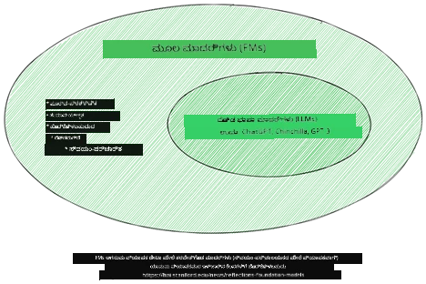

ಚಿತ್ರ ಮೂಲ: [Essential Guide to Foundation Models and Large Language Models | by Babar M Bhatti | Medium
](https://thebabar.medium.com/essential-guide-to-foundation-models-and-large-language-models-27dab58f7404)

ಈ ವ್ಯತ್ಯಾಸವನ್ನು ಇನ್ನಷ್ಟು ಸ್ಪಷ್ಟಗೊಳಿಸಲು, ಚಾಟ್GPT ಅನ್ನು ಐತಿಹಾಸಿಕ ಉದಾಹರಣೆಯಾಗಿ ತೆಗೆದುಕೊಳ್ಳೋಣ. ಚಾಟ್GPTಯ ಮೊದಲ ಸಂಚಿಕೆಗಳು GPT-3.5 ಅನ್ನು ಫೌಂಡೇಶನ್ ಮಾದರಿಯಾಗಿ ಬಳಸುತ್ತಿದ್ದವು. ನಂತರ OpenAI ಚಾಟ್‌ಗೆ ವಿಶೇಷ ಗಾತ್ರದ ಡೇಟಾ ಮತ್ತು ಸರಿಹೊಂದಿಸುವ ತಂತ್ರಗಳನ್ನು ಬಳಸಿ ಚಾಟ್‌ಬಾಟ್‌ಗಳಂತೆ ಸಂಭಾಷಣಾ ಸಂದರ್ಭಗಳಲ್ಲಿ ಉತ್ತಮ ಕಾರ್ಯನಿರ್ವಹಿಸುತ್ತಿರುವ ಟ್ಯೂನ್ಡ್ ಆವೃತ್ತಿಯನ್ನು ರಚಿಸಿತು. ಆಧುನಿಕ AI ಸೇವೆಗಳು ಹಲವಾರು ಮಾದರಿ ಆವೃತ್ತಿಗಳ ನಡುವೆ ಮಾರ್ಗಸೂಚಿ ಮಾಡುತ್ತವೆ, ಆದ್ದರಿಂದ ಸೇವೆಯ ಹೆಸರು ಮತ್ತು ಮೂಲ ಮಾದರಿ ಹೆಸರಿನಲ್ಲಿ ಯಾವಾಗಲೂ ಸರಿಯಾಗಿ ಹೊಂದಿಕೆಯಾಗುವುದಿಲ್ಲ.

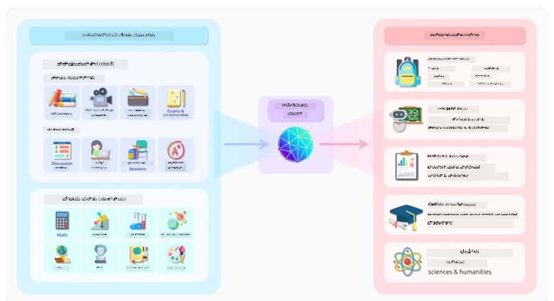

ಚಿತ್ರ ಮೂಲ: [2108.07258.pdf (arxiv.org)](https://arxiv.org/pdf/2108.07258.pdf?WT.mc_id=academic-105485-koreyst)

### ಓಪನ್-ತೂಕ / ಓಪನ್-ಸೋರ್ಸ್ ಮತ್ತು ಮಾಲೀಕತ್ವ ಮಾದರಿಗಳು

ಮತ್ತೊಂದು LLM ವರ್ಗೀಕರಣ ವಿಧಾನವೇ ಅವು ಓಪನ್-ತೂಕ, ಓಪನ್-ಸೋರ್ಸ್ ಅಥವಾ ಮಾಲೀಕತ್ವವನ್ನು ಹೊಂದಿದ ಮಾದರಿಗಳಾಗಿವೆ ಎಂಬುದಾಗಿದೆ.

ಓಪನ್-ಸೋರ್ಸ್ ಮತ್ತು ಓಪನ್-ತೂಕ ಮಾದರಿಗಳು ಮಾದರಿ ಆಭಿವೃದ್ಧಿಗಳನ್ನು ಪರಿಶೀಲನೆ, загрузка ಅಥವಾ ಕಸ್ಟಮೈಸ್ ಮಾಡಲು ಲಭ್ಯವಿರುತ್ತವೆ, ಆದರೆ ಅವುಗಳ ಪರವಾನಗಿ ನಿರ್ಬಂಧಿತವಾಗಿರಬಹುದು. ಕೆಲವು ಪೂರ್ಣವಾಗಿ ಓಪನ್-ಸೋರ್ಸ್ ಆಗಿದ್ದು, ಇನ್ನೆರಡೂ ಬಳಸುವ ನಿಯಮಾವಳಿಗಳೊಂದಿಗೆ ಇದ್ದಾರೆ. ವ್ಯವಹಾರಗಳಿಗೆ ನಿಯೋಜನೆ, ಡೇಟಾ ಸ್ಥಳೀಯತೆ, ವೆಚ್ಚ ಅಥವಾ ಕಸ್ಟಮೈಸೇಶನ್ ಮೇಲೆ ಹೆಚ್ಚು ನಿಯಂತ್ರಣ ಬೇಕಾದಾಗ ಉಪಯುಕ್ತವಾಗಬಹುದು. ಆದರೂ, ಬಳಕೆ ಮುಂಚೆ ಪರವಾನಗಿ ನಿಯಮಗಳು, ಸೇವಾ ವೆಚ್ಚಗಳು, ನಿರ್ವಹಣೆ, ಭದ್ರತಾ ಅಪ್ಡೇಟ್ಗಳು ಮತ್ತು ಮೌಲ್ಯಮಾಪನ ಗುಣಮಟ್ಟಗಳನ್ನು ಪರಿಶೀಲಿಸುವುದು ಅವಶ್ಯಕ. ಉದಾಹರಣೆಗಳಾಗಿ [Meta Llama 4](https://ai.meta.com/blog/llama-4-multimodal-intelligence/?WT.mc_id=academic-105485-koreyst), ಕೆಲವು [Mistral ಮಾದರಿಗಳು](https://docs.mistral.ai/models/overview?WT.mc_id=academic-105485-koreyst) ಮತ್ತು ಅನೇಕ ಮಾದರಿಗಳು [Hugging Face](https://huggingface.co/models?WT.mc_id=academic-105485-koreyst) ನಲ್ಲಿ ಇರಬಲ್ಲವು.

ಮಾಲೀಕತ್ವ ಹೊಂದಿದ ಮಾದರಿಗಳನ್ನು ಒಬ್ಬ ಸೇವಾಪ್ರದಾಯಕದವರು ಸ್ವತ್ತುಮಾಡಿಕೊಂಡು ಹೋಸ್ಟ್ ಮಾಡುತ್ತಾರೆ. ಈ ಮಾದರಿಗಳು ಹೆಚ್ಚು ನಿರ್ವಹಿತ ಉತ್ಪಾದನಾ ಬಳಕೆಗೆ ಉತ್ತಮ ಸಮರ್ಥನೆ, ಸುರಕ್ಷತೆ ವ್ಯವಸ್ಥೆಗಳು, ಸಾಧನ ಸಂಯೋಜನೆ ಮತ್ತು ಪ್ರಮಾಣವೃದ್ಧಿಯನ್ನು ಒದಗಿಸುತ್ತವೆ. ಆದಾಗ್ಯೂ, ಗ್ರಾಹಕರು ಸಾಮಾನ್ಯವಾಗಿ ಮಾದರಿ ತೂಕಗಳನ್ನು ಪರಿಶೀಲಿಸುವುದು ಅಥವಾ ಬದಲಿಸುವುದಕ್ಕೆ ಅತಿಥಿಯಾಗುವುದಿಲ್ಲ. ಅವರು ಗೌಪ್ಯತೆ, ಸಂಗ್ರಹಣೆ, ಅನುಕೂಲತೆ ಮತ್ತು ಅನುಮತಿ ಬಳಕೆಯ ನಿಯಮಗಳಿಗೆ ಒಪ್ಪಿಕೊಳ್ಳಲು ಆಗುತ್ತೆ. ಉದಾಹರಣೆಗಳಾಗಿ [OpenAI ಮಾದರಿಗಳು](https://platform.openai.com/docs/models?WT.mc_id=academic-105485-koreyst), [Google Gemini](https://deepmind.google/models/gemini/pro/?WT.mc_id=academic-105485-koreyst), ಮತ್ತು [Anthropic Claude](https://platform.claude.com/docs/en/about-claude/models/overview?WT.mc_id=academic-105485-koreyst) ಇತ್ಯಾದಿ.

### ಎಂಪೆಡ್ಡಿಂಗ್, ಚಿತ್ರ ಉತ್ಪಾದನೆ ಮತ್ತು ಪಠ್ಯ ಹಾಗೂ ಕೋಡ್ ಉತ್ಪಾದನೆ

LLMಗಳನ್ನು ಅದರ ಔಟ್‌ಪುಟ್ ಉತ್ಪಾದನೆಯ ಪ್ರಕಾರ ವರ್ಗೀಕರಿಸಬಹುದು.

ಎಂಪೆಡ್ಡಿಂಗ್‌ಗಳು ಪಠ್ಯವನ್ನು ಗೆಣತಿ ರೂಪಕ್ಕೆ ಪರಿವರ್ತಿಸುವ ಮಾದರಿಗಳಾಗಿದ್ದು, ಅವು ಆ ಅಂಕಿಗಳ ಆಕಾರದಲ್ಲಿ ಇನ್‌ಪುಟ್ ಪಠ್ಯದ ಸಂಖ್ಯಾತ್ಮಕ ಪ್ರತಿನಿಧಾನವನ್ನು ತಯಾರಿಸುತ್ತವೆ. ಇವು ಯಂತ್ರಗಳಿಗೆ ಪದಗಳು ಅಥವಾ ವಾಕ್ಯಗಳ ಸಂಬಂಧಗಳನ್ನು ಅರ್ಥಮಾಡಿಕೊಳ್ಳಲು ಸುಲಭವಾಗಿಸುತ್ತದೆ ಮತ್ತು ಇವು ಇತರ ಮಾದರಿಗಳು, ಉದಾಹರಣೆಗೆ ವರ್ಗೀಕರಣ ಅಥವಾ ಗುಂಪುಗೊಳಿಸುವ ಮಾದರಿಗಳು, ಇತ್ಯಾದಿಗೆ ಇನ್‌ಪುಟ್ ಆಗುವಂತೆ ಮಾಡಬಹುದು. ಎಂಪೆಡ್ಡಿಂಗ್ ಮಾದರಿಗಳನ್ನು ಸಾಮಾನ್ಯವಾಗಿ ವರ್ಗಾವಣಾ ಕಲಿಕೆಗೆ ಬಳಸಲಾಗುತ್ತದೆ, ಅಲ್ಲಿ ಹೆಚ್ಚಿನ ಡೇಟಾದ ಇರುವ ಉಪಕಾರ್ಯಕ್ಕಾಗಿ ಮಾದರಿ ನಿರ್ಮಿಸಲಾಗುತ್ತದೆ ಹಾಗೂ ನಂತರ ಇತರ ಡೌನ್‌ಸ್ಟ್ರೀಮ್ ಕಾರ್ಯಗಳಿಗೆ ಎಂಪೆಡ್ಡಿಂಗ್‌ಗಳನ್ನು ಮರುಬಳಕೆ ಮಾಡಲಾಗುತ್ತದೆ. ಈ ವರ್ಗಕ್ಕೆ ಉದಾಹರಣೆ [OpenAI embeddings](https://platform.openai.com/docs/models/embeddings?WT.mc_id=academic-105485-koreyst).

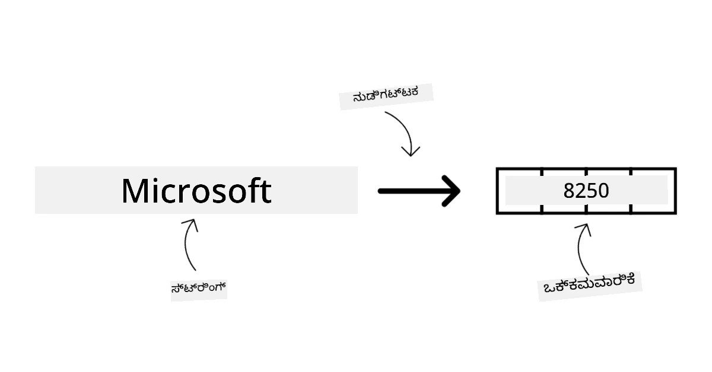

ಚಿತ್ರ ಉತ್ಪಾದನೆ ಮಾದರಿಗಳು ಚಿತ್ರಗಳನ್ನು ಉತ್ಪಾದಿಸುವ ಮಾದರಿಗಳಾಗಿವೆ. ಇವು ಸಾಮಾನ್ಯವಾಗಿ ಚಿತ್ರ ಸಂಪಾದನೆ, ಚಿತ್ರ ಸಂಶ್ಲೇಷಣಾ ಮತ್ತು ಚಿತ್ರ ಅನುವಾದಕ್ಕಾಗಿ ಬಳಸಲ್ಪಡುತ್ತವೆ. ಚಿತ್ರ ಉತ್ಪಾದನೆ ಮಾದರಿಗಳು ದೊಡ್ಡ ಚಿತ್ರ ಡೇಟಾಸೆಟ್‌ಗಳ ಮೇಲೆ ತರಬೇತಿಯಾಗಿರುತ್ತವೆ, ಉದಾಹರಣೆಗೆ [LAION-5B](https://laion.ai/blog/laion-5b/?WT.mc_id=academic-105485-koreyst), ಮತ್ತು ಹೊಸ ಚಿತ್ರಗಳನ್ನು ತಯಾರಿಸಲು ಅಥವಾ ಇನ್‌ಪೇಂಟ್‌ಿಂಗ್, ಸೂಪರ್-ರೆಸಲ್ಯೂಷನ್, ಮತ್ತು ಬಣ್ಣಸಂಸ್ಕರಣೆ ತಂತ್ರಜ್ಞಾನಗಳಿಂದ ಇರುವ ಚಿತ್ರಗಳನ್ನು ಸಂಪಾದಿಸಲು ಬಳಸಬಹುದಾಗಿದೆ. ಇದಕ್ಕೆ ಉದಾಹರಣೆಗಳು [GPT Image models](https://platform.openai.com/docs/guides/images?WT.mc_id=academic-105485-koreyst), [Stable Diffusion models](https://github.com/Stability-AI/StableDiffusion?WT.mc_id=academic-105485-koreyst), ಮತ್ತು Imagen ಮಾದರಿಗಳು.

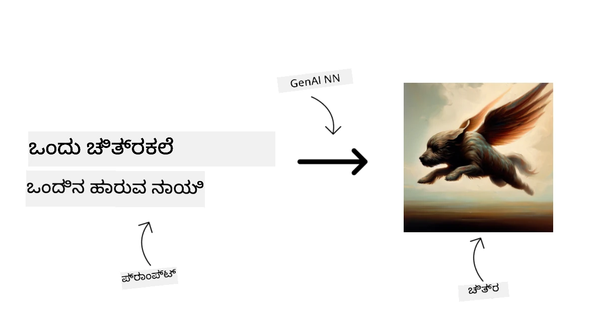

ಪಠ್ಯ ಮತ್ತು ಕೋಡ್ ಉತ್ಪಾದನೆ ಮಾದರಿಗಳು ಪಠ್ಯ ಅಥವಾ ಕೋಡ್ ಅನ್ನು ಉತ್ಪಾದಿಸುವ ಮಾದರಿಗಳಾಗಿವೆ. ಇವು ಸಾಮಾನ್ಯವಾಗಿ ಪಠ್ಯ ಸಾರಾಂಶಗೊಳಿಸುವಿಕೆ, ಭಾಷಾಂತರ ಮತ್ತು ಪ್ರಶ್ನೋತ್ತರಕ್ಕೆ ಬಳಸಲ್ಪಡುತ್ತವೆ. ಪಠ್ಯ ಉತ್ಪಾದನೆ ಮಾದರಿಗಳು ದೊಡ್ಡ ಪಠ್ಯ ಡೇಟಾಸೆಟ್‌ಗಳ ಮೇಲೆ ತರಬೇತಿಯಾಗಿವೆ, ಉದಾಹರಣೆಗೆ [BookCorpus](https://www.cv-foundation.org/openaccess/content_iccv_2015/html/Zhu_Aligning_Books_and_ICCV_2015_paper.html?WT.mc_id=academic-105485-koreyst), ಮತ್ತು ಹೊಸ ಪಠ್ಯವನ್ನು ತಯಾರಿಸಲು ಅಥವಾ ಪ್ರಶ್ನೆಗಳಿಗೆ ಉತ್ತರಿಸಲು ಬಳಕೆ ಮಾಡಬಹುದು. ಕೋಡ್ ಉತ್ಪಾದನೆ ಮಾದರಿಗಳು, ಉದಾಹರಣೆಗೆ [CodeParrot](https://huggingface.co/codeparrot?WT.mc_id=academic-105485-koreyst), ದೊಡ್ಡ ಕೋಡ್ ಡೇಟಾಸೆಟ್‌ಗಳ ಮೇಲೆ ತರಬೇತಿಯಾಗಿವೆ, ಉದಾಹರಣೆಗೆ GitHub, ಮತ್ತು ಹೊಸ ಕೋಡ್ ತಯಾರಿಸಲು ಅಥವಾ ಇತರ ಮೂಲ ಕೋಡ್‌ನಲ್ಲಿ ದೋಷಗಳನ್ನು ಸರಿಪಡಿಸಲು ಬಳಸಬಹುದು.

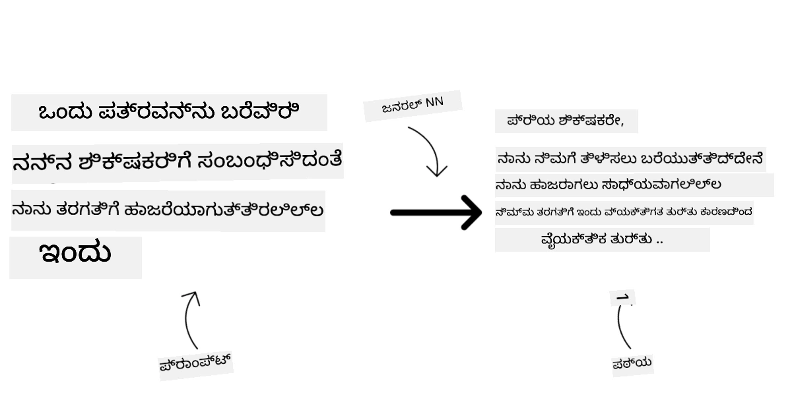

### ಎಂಕೋಡರ್-ಡಿಕೋಡರ್ ಮತ್ತು ಡಿಕೋಡರ್ ಮಾತ್ರ

LLMಗಳ ವಿಭಿನ್ನ ವಾಸ್ತುಶಿಲ್ಪಗಳ ಕುರಿತು ಮಾತನಾಡಲು, ಒಂದು ರೂಪಕವನ್ನು ಬಳಸಿ ನೋಡೋಣ.

ನಿಮ್ಮ ಮ್ಯಾನೆಜರ್ ನಿಮಗೆ ವಿದ್ಯಾರ್ಥಿಗಳಿಗೆ ಕ್ವಿಜ್ ಬರೆಯಲು ಒಂದು ಕಾರ್ಯ ನೀಡಿದ ಹಾಗೆ ಕಲ್ಪಿಸಿಕೊಳ್ಳಿ. ನಿಮ್ಮ ಬಳಿ ಇಬ್ಬರು ಸಹೋದ್ಯೋಗಿಗಳು ಇದ್ದಾರೆ; ಒಬ್ಬರು ವಿಷಯ ನಿರ್ಮಾಣ ಮಾಡುತ್ತಾರೆ ಮತ್ತು ಇನ್ನೊಬ್ಬರು ಅವುಗಳನ್ನು ವಿಮರ್ಶಿಸುತ್ತಾರೆ.

ವಿಷಯ ನಿರ್ಮಾಪಕ ಡಿಕೋಡರ್-ಮಾತ್ರ ಮಾದರಿಯಂತೆ: ಅವರು ವಿಷಯವನ್ನು ನೋಡಿದರೆ, ನೀವು ಈಗಾಗಲೇ ಏನು ಬರೆದಿದ್ದೀರೋ ಅದನ್ನೇ ನೋಡಿ ಆ ಸನ್ನಿವೇಶದ ಆಧಾರದ ಮೇಲೆ ಮುಂದುವರೆಸಿ ವಿಷಯವನ್ನು ರಚಿಸುತ್ತಾರೆ. ಅವರು ಆಕರ್ಷಕ ಮತ್ತು ಮಾಹಿತಿ ಕಲ್ಪಿಸುವ ವಿಷಯ ಬರೆಯುವಲ್ಲಿ ತುಂಬಾ ಚೆನ್ನಾಗಿದ್ದಾರೆ, ಆದರೆ ವಿಷಯ ವರ್ಗೀಕರಿಸುವುದು, ಹಿಂತೆಗೆದುಕೊಂಡು ತರಲು ಅಥವಾ ಎಂಕೋಡ್ ಮಾಡಲು ಬೇಕಾದಾಗ ಅವ್ರು ಅತ್ಯುತ್ತಮ ವಸ್ತು ಅಲ್ಲವೇ ಆಗುತ್ತವೆ. ಡಿಕೋಡರ್-ಮಾತ್ರ ಮಾದರಿ ಕುಟುಂಬಗಳ ಉದಾಹರಣೆಗಳಿಗೆ GPT ಮತ್ತು Llama ಮಾದರಿಗಳನ್ನು ಒಳಗೊಂಡಿವೆ.

ವಿಮರ್ಶಕರು ಎಂಕೋಡರ್-ಮಾತ್ರ ಮಾದರಿಯಂತೆ, ಅವರು ಬರೆದ ಪಠ್ಯ ಮತ್ತು ಉತ್ತರಗಳನ್ನು ನೋಡುತ್ತಾರೆ, ಅವುಗಳ ಸಂಬಂಧ ತಿಳಿದುಕೊಳ್ಳುತ್ತಾರೆ ಆದರೆ ವಿಷಯವನ್ನು ರಚಿಸುವ ಕ್ಷಮತೆ ಕಡಿಮೆ. ಎಂಕೋಡರ್-ಮಾತ್ರ ಮಾದರಿಯ ಉದಾಹರಣೆ BERT ಆಗಿದೆ.

ಕಲ್ಪಿಸಿ ನಾವು ಯಾರಿಗಾದರೂ ಇದ್ದಾರೆ ಎಂದು, ಅವರು ಕ್ವಿಜ್ ಅನ್ನು ಬರೆದೂ ಪರಿಶೀಲಿಸುತ್ತಾರೆ, ಇದು ಎಂಕೋಡರ್-ಡಿಕೋಡರ್ ಮಾದರಿ. ಉದಾಹರಣೆಗೆ BART ಮತ್ತು T5.

### ಸೇವೆ ಮತ್ತು ಮಾದರಿ

ಈಗ, ಸೇವೆ ಮತ್ತು ಮಾದರಿಯ ನಡುವಿನ ವ್ಯತ್ಯಾಸವನ್ನು ನೋಡೋಣ. ಸೇವೆ ಎಂದರೆ ಕ್ಲೌಡ್ ಸೇವಾ ಪ್ರಾದಾಯಕ ಒದಗಿಸುವ ಉತ್ಪನ್ನವಾಗಿದೆ, ಇದು ಮಾದರಿಗಳು, ಡೇಟಾ ಮತ್ತು ಇತರ ಘಟಕಗಳ ಸಂಯೋಜನೆಯಾಗಿರುತ್ತದೆ. ಮಾದರಿ ಸೇವೆಯ ಪ್ರಮುಖ ಘಟಕ, ಮತ್ತು ಸಾಮಾನ್ಯವಾಗಿ ಫೌಂಡೇಶನ್ ಮಾದರಿ ಆಗಿರುತ್ತದೆ, ಉದಾಹರಣೆಗೆ LLM.

ಸೇವೆಗಳು ಸಾಮಾನ್ಯವಾಗಿ ಉತ್ಪಾದನಾ ಬಳಕೆಗೆ ಉತ್ತಮವಾಗುತ್ತವೆ ಮತ್ತು ಮಾದರಿಗಳಿಗಿಂತ ಗ್ರಾಫಿಕಲ್ ಬಳಕೆದಾರ ಅಂತರ್ ಮುಖ ಮೂಲಕ ಸುಲಭವಾಗಿ ಬಳಸಬಹುದಾಗಿದೆ. ಆದಾಗ್ಯೂ, ಸೇವೆಗಳು ಸಾಮಾನ್ಯವಾಗಿ ಉಚಿತವಾಗಿ ಲಭ್ಯವಿರುತ್ತವೆಯೋ ಅಥವಾ ಸಬ್ಸ್ಕ್ರಿಪ್ಷನ್ ಅಥವಾ ಪಾವತಿಯನ್ನು ಅಗತ್ಯವಿರುತ್ತದೆ, ಇದರಿಂದ ಸೇವೆಯ ಮಾಲೀಕರ ಸಾಮಗ್ರಿಗಳನ್ನು ಬಳಸಲು ಅವಕಾಶ ಸಿಗುತ್ತದೆ, ವೆಚ್ಚಗಳನ್ನು ಕಡಿಮೆಗೊಳಿಸುವುದು ಮತ್ತು ಸ್ಟೆಪಾಗಿ ವಿಸ್ತರಿಸುವುದನ್ನು ಸುಲಭಗೊಳಿಸುವುದು. ಸೇವೆಯ ಉದಾಹರಣೆಯಾಗಿ [Azure OpenAI Service](https://learn.microsoft.com/azure/ai-foundry/openai/overview?WT.mc_id=academic-105485-koreyst) ನೀಡಬಹುದು, ಇದು ಬಳಕೆ ಪ್ರಕಾರ ಪಾವತಿಸುವ ಕ್ರಮವನ್ನು ಸಹ ಒದಗಿಸುತ್ತದೆ. Azure OpenAI Service ಕೂಡ ಎಂಟರ್‌ಪ್ರೈಸ್ ಮಟ್ಟದ ಭದ್ರತೆ ಮತ್ತು ಮಾದರಿಗಳ ಸಾಮರ್ಥ್ಯಗಳ ಮೇಲೆ ಜವಾಬ್ದಾರಿತ AI ಅಡಚಣೆಯು ಒದಗಿಸುತ್ತದೆ.

ಮಾದರಿಗಳು ನ್ಯೂರಲ್ ನೆಟ್ವರ್ಕ್ ಆಭಿವೃದ್ಧಿಗಳು: ಪರಿಮಾಣಗಳು, ತೂಕಗಳು, ವಾಸ್ತುಶಿಲ್ಪ, ಟೋಕನೈಜರ್ ಮತ್ತು ಬೆಂಬಲಿಸುವ ಸಂರಚನೆಗಳಾಗಿವೆ. ಮಾದರಿಯನ್ನು ಸ್ಥಳೀಯ ಅಥವಾ ಖಾಸಗಿ ಪರಿಸರದಲ್ಲಿ ನಡೆಯಿಸಲು ಸೂಕ್ತ ಉಪಕರಣ, ಸೇವಾ ಮೂಲಸೌಕರ್ಯ, ನಿಯಂತ್ರಣ ಮತ್ತು ಹೊಂದಿಕೆಯಾಗುವ ಓಪನ್-ಸೋರ್ಸ್ / ಓಪನ್-ತೂಕ ಅಥವಾ ವಾಣಿಜ್ಯ ಪರವಾನಗಿ ಬೇಕಾಗುತ್ತದೆ. ಓಪನ್-ತೂಕ ಮಾದರಿಗಳು, ಉದಾಹರಣೆಗೆ Llama 4 ಅಥವಾ Mistral ಮಾದರಿಗಳು ಸ್ವತಃ ಹೋಸ್ಟ್ ಮಾಡಬಹುದು, ಆದರೂ ಅವು ಕಂಪ್ಯೂಟೇಷನಲ್ ಶಕ್ತಿಯು ಹಾಗೂ ಕಾರ್ಯಾಚರಣೆಯ ಪರಿಣತಿಯು ಅವಶ್ಯಕ.

## Azureನಲ್ಲಿ ಕಾರ್ಯಕ್ಷಮತೆಗೆ ಪರೀಕ್ಷಿಸಿ ಪುನರಾವೃತ್ತಿ ಮಾಡುವುದು

ನಮ್ಮ ತಂಡವು ಪ್ರಸ್ತುತ LLM ಗಳುಗಳ ಪರಿಸರವನ್ನು ಪರಿಶೀಲಿಸಿ ಮತ್ತು ಅವರ ಪರಿಸ್ಥಿತಿಗಳಿಗೆ ಒಳ್ಳೆಯ ಅಭ್ಯರ್ಥಿಗಳನ್ನು ಗುರುತಿಸಿದ ನಂತರ, ಮುಂದಿನ ಹಂತವು ಅವುಗಳನ್ನು ಅವರ ಡೇಟಾ ಮತ್ತು ಕೆಲಸದ ಭಾರದಲ್ಲಿ ಪರೀಕ್ಷಿಸುವುದಾಗಿದೆ. ಇದು ಪ್ರಯೋಗಗಳು ಮತ್ತು ಅಳತೆಯ ಮೂಲಕ ಮಾಡುವ ಪುನರಾವೃತ್ತಿ ಪ್ರಕ್ರಿಯೆ.
ಹಿಂದಿನ ಪ್ಯಾರಾಗ್ರಾಫ್‌ಗಳಲ್ಲಿ ನಾವು ಉಲ್ಲೇಖಿಸಿದ ಬಹುಮಾನದ ಮಾದರಿಗಳು (OpenAI ಮಾದರಿಗಳು, Llama 4 ಮತ್ತು Mistral ಲాంటి ತೆರೆಯ ತೆರೆಯುತ್ತಿರುವ ತೂಕದ ಮಾದರಿಗಳು, ಮತ್ತು Hugging Face ಮಾದರಿಗಳು) ಬಹುಪಾಲು [Microsoft Foundry Models](https://learn.microsoft.com/azure/foundry/concepts/foundry-models-overview?WT.mc_id=academic-105485-koreyst) ನಲ್ಲಿ ಲಭ್ಯವಿವೆ.

[Microsoft Foundry](https://learn.microsoft.com/azure/foundry/what-is-foundry?WT.mc_id=academic-105485-koreyst), ಹಳೆಯದು Azure AI Studio/Azure AI Foundry ಆಗಿತ್ತು, AI ಅಪ್ಲಿಕೇಶನ್‌ಗಳು ಮತ್ತು ಏಜೆಂಟ್‌ಗಳನ್ನು ನಿರ್ಮಿಸಲು ಏಕೀಕೃತ Azure ವೇದಿಕೆ. ಇದು ಡೆವಲಪರ್‌ಗಳಿಗೆ ಪ್ರಯೋಗ, ಮೌಲ್ಯಮಾಪನದಿಂದ ಪರಿಗಣನೆ, ಮೇಲ್ವಿಚಾರಣೆ ಮತ್ತು ಆಡಳಿತವರೆಗೆ ಜೀವನಚರಿತ್ರೆಯನ್ನು ನಿರ್ವಹಿಸಲು ಸಹಾಯ ಮಾಡುತ್ತದೆ. Microsoft Foundry ದೊಡ್ಡ ಸಂಗ್ರಹದಲ್ಲಿ ಬಳಕೆದಾರರು ಹೀಗೆ ಮಾಡಬಹುದು:

- ಕ್ಯಾಟಲಾಗ್‌ನಲ್ಲಿ ಆಸಕ್ತ ಫೌಂಡೇಶನ್ ಮಾದರಿಯನ್ನು ಹುಡುಕುವುದು, ಇದರಲ್ಲಿ Azure ಮಾರಾಟ ಮಾಡಿದ ಮಾದರಿಗಳು ಮತ್ತು ಪಾಲುದಾರರು ಮತ್ತು ಸಮುದಾಯದ ಒದಗಿಸುವವರು ಒದಗಿಸಿದ ಮಾದರಿಗಳು ಸೇರಿವೆ. ಬಳಕೆದಾರರು ಕಾರ್ಯ, ಒದಗಿಸುವವ, ಪರವಾನಗಿ, ನಿಯೋಜನೆ ಆಯ್ಕೆಗಳು ಅಥವಾ ಹೆಸರು ಮೂಲಕ ಫಿಲ್ಟರ್ ಮಾಡಬಹುದು.

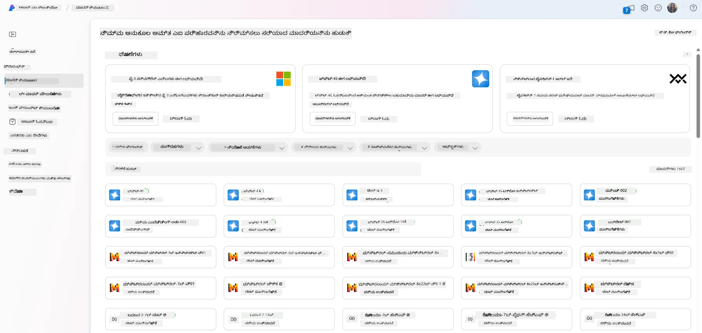

- ಮಾದರಿ ಕಾರ್ಡ್ ಅನ್ನು ಪರಿಶೀಲಿಸಿ, ಉದ್ದೇಶಿತ ಬಳಕೆ ಮತ್ತು ತರಬೇತಿಗಾಗಿ ಯಾವ ಡೇಟಾ ಬಳಸದಿದೆಯೆಂಬ ವಿವರಿತ ವಿವರಣೆಯೊಂದಿಗೆ, ಕೋಡ್ ಮಾದರಿಗಳು ಮತ್ತು ಆಂತರಿಕ ಮೌಲ್ಯಮಾಪನ ಗ್ರಂಥಾಲಯದ ಮೌಲ್ಯಾಂಕನ ಫಲಿತಾಂಶಗಳು.

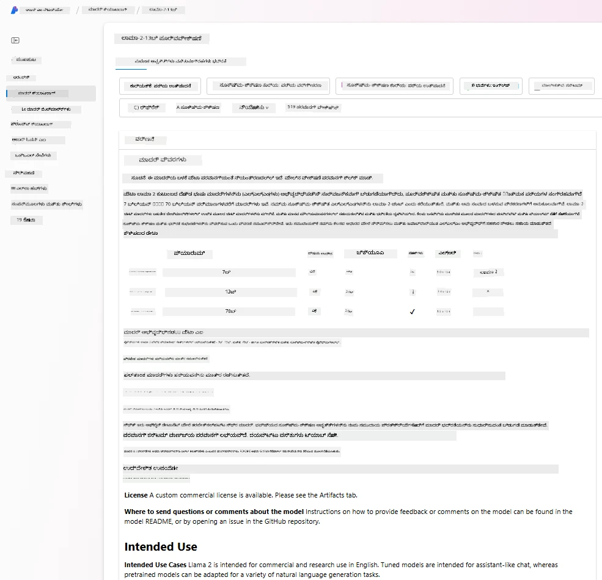

- ಉದ್ಯಮದಲ್ಲಿ ಲಭ್ಯವಿರುವ ಮಾದರಿಗಳು ಮತ್ತು ಡೇಟಾ ಸೆಟ್‌ಗಳ ಮೂಲಕ ಬಿಂಬಗಳು (benchmark)ಗಳನ್ನು ಹೋಲಿಸಿ ಯಾವುದೇದು ವ್ಯವಹಾರ ಪರಿಸ್ಥಿತಿಗೆ ಸೂಕ್ತವಾಗಿದೆ ಎಂದು ಅಂದಾಜಿಸುವುದು, [Model Benchmarks](https://learn.microsoft.com/azure/ai-foundry/concepts/model-benchmarks?WT.mc_id=academic-105485-koreyst) ಫಲಕದ ಮೂಲಕ.

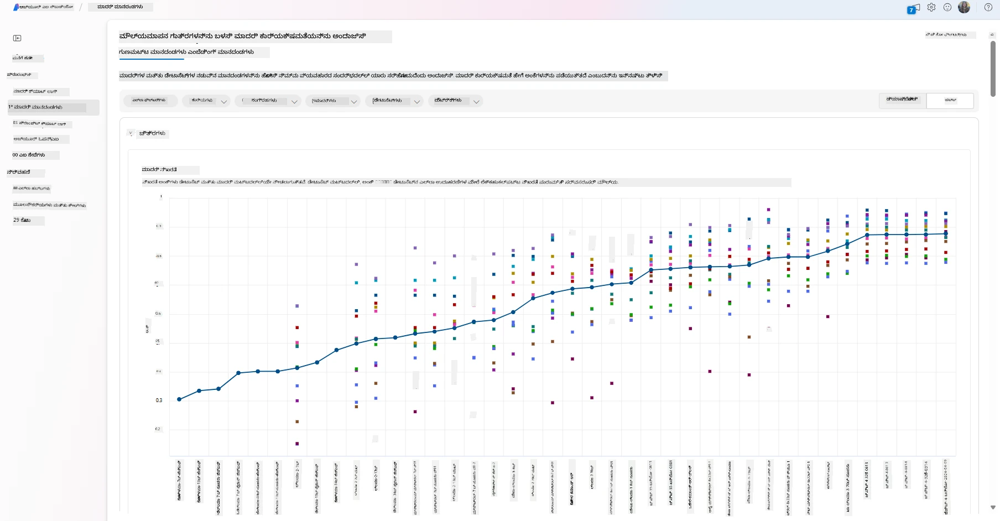

- ಬೆಂಬಲಿತ ಮಾದರಿಗಳನ್ನು ಕೂದಲು ತರಬೇತಿ ಡೇಟಾದ ಮೇಲೆ ಸುಧಾರಿಸಲು ಸುಧಾರಣೆಯಾಗಿ ತರಬೆತ್ತು, Microsoft Foundry ನ ಪ್ರಯೋಗ ಮತ್ತು ಟ್ಯಾಕಿಂಗ್ ಸಾಮರ್ಥ್ಯಗಳನ್ನು ಉಪಯೋಗಿಸುವುದು.

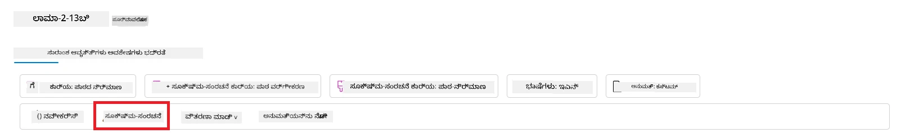

- ಮೂಲ ಪೂರ್ವ ತರಬೇತಿಗೊಳಿಸಿದ ಮಾದರಿಯನ್ನು ಅಥವಾ ಫೈನ್-ಟ್ಯೂನಿಂಗ್ ಮಾಡಿದ ಸಂಸ್ಕರಣೆಯನ್ನು ದೂರಸ್ಥ ನೈಜ-ಸಮಯ ಊಹಾ ಅಂತ್ಯ ಬಿಂದುವಿಗೆ ನಿಯೋಜಿಸಿ, ನಿರ್ವಹಿಸಲ್ಪಟ್ಟ ಗಣನೆ ಅಥವಾ ಸರ್ವರ್ಲೆಸ್ ನಿಯೋಜನೆ ಆಯ್ಕೆಗಳನ್ನು ಬಳಸಿಕೊಂಡು, ಅಪ್ಲಿಕೇಶನ್‌ಗಳು ಇದನ್ನು ಬಳಸಲು ಸೌಲಭ್ಯ ಒದಗಿಸುವುದು.

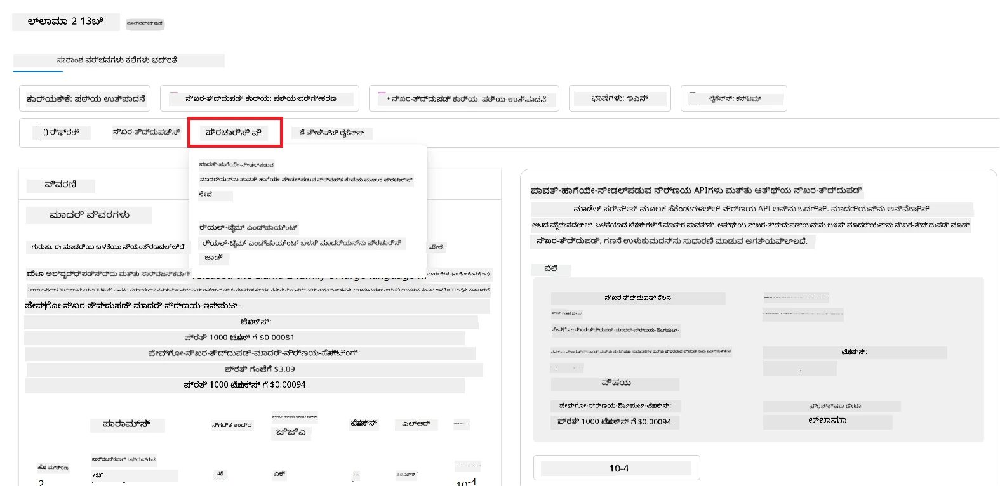

> [!NOTE]
> ಕ್ಯಾಟಲಾಗ್ನಲ್ಲಿರುವ ಎಲ್ಲಾ ಮಾದರಿಗಳು ಪ್ರಸ್ತುತ ಫೈನ್-ಟ್ಯೂನಿಂಗ್ ಅಥವಾ ಪೇ-ಆಸ್-ಯು-ಗೋ ನಿಯೋಜನೆಗೆ ಲಭ್ಯವಿಲ್ಲ. ಮಾದರಿ ಕಾರ್ಡ್‌ನಲ್ಲಿ ಮಾದರಿಯ ಸಾಮರ್ಥ್ಯಗಳು ಮತ್ತು ನಿಯಮಗಳು ಬಗ್ಗೆ ವಿವರಗಳು ಪರಿಶೀಲಿಸಿ.

## LLM ಫಲಿತಾಂಶಗಳನ್ನು ಸುಧಾರಿಸು

ನಮ್ಮ ಸ್ಟಾರ್ಟುಪ್ ತಂಡವು ವಿಭಿನ್ನ ವಿಧದ LLM ಗಳನ್ನು ಮತ್ತು Microsoft Foundry ಎಂಬ ಕ್ಲೌಡ್ ವೇದಿಕೆಯನ್ನು ಪರಿಶೀಲಿಸಿದೆ, ಇದು ವಿವಿಧ ಮಾದರಿಗಳನ್ನು ಹೋಲಿಸಲು, ಅವುಗಳನ್ನು ಪರೀಕ್ಷಾ ಡೇಟಾ ಮೇಲೆ ಮೌಲ್ಯಮಾಪನ ಮಾಡಲು, ಕಾರ್ಯಕ್ಷಮತೆ ಸುಧಾರಿಸಲು ಮತ್ತು ಅವುಗಳನ್ನು ಊಹಾ ಅಂತ್ಯಸ್ಥಳಗಳಲ್ಲಿ ನಿಯೋಜಿಸಲು ಸೌಕರ್ಯ ಒದಗಿಸುತ್ತದೆ.

ಆದರೆ, ಅವರು ಮೊದಲು ತರಬೇತಿಗೊಳಿಸಿದ ಮಾದರಿಯನ್ನು ಉಪಯೋಗಿಸುವ ಬದಲು ಯಾವಾಗ ಫೈನ್-ಟ್ಯೂನಿಂಗ್ ಮಾಡಬೇಕೆನ್ನಿಸಬೇಕು? ವಿಶೇಷ ಕಾರ್ಯಭಾರದಲ್ಲಿ ಮಾದರಿಯ ಕಾರ್ಯಕ್ಷಮತೆಯನ್ನು ಸುಧಾರಿಸಲು ಇತರ ವಿಧಾನಗಳಿವೆಯೇ?

ವ್ಯವಹಾರವು ಯಾವುದೇ LLM ರಿಂದ ಬೇಕಾದ ಫಲಿತಾಂಶಗಳನ್ನು ಪಡೆಯಲು ಹಲವು ವಿಧಾನಗಳನ್ನು ಉಪಯೋಗಿಸಬಹುದು. ಉತ್ಪಾದನೆಯಲ್ಲಿ LLM ನಿಯೋಜನೆಯಾಗುವಾಗ ವಿಭಿನ್ನ ತರಬೇತಿ ಮಟ್ಟಗಳೊಂದಿಗೆ ವಿಭಿನ್ನ ಮಾದರಿಗಳನ್ನು ಆಯ್ಕೆ ಮಾಡಬಹುದು, ವಿವಿಧ ಸಂಕೀರ್ಣತೆ, ದರ ಮತ್ತು ಗುಣಮಟ್ಟದೊಂದಿಗೆ. ಇಲ್ಲಿವೆ ಕೆಲವು ವಿಭಿನ್ನ ವಿಧಾನಗಳು:

- **ಸಂದರ್ಭದೊಂದಿಗೆ ಪ್ರಾಂಪ್ಟ್ ಎಂಜಿನಿಯರಿಂಗ್**. ಪ್ರಾಂಪ್ಟ್ ಮಾಡುವಾಗ ನೀವು ಬೇಕಾದ ಉತ್ತರಗಳನ್ನು ಪಡೆಯಲು ಸಾಕಷ್ಟು ಸನ್ದರ್ಭವನ್ನು ನೀಡುವುದು ಧ್ಯೇಯ.

- **Retrieval Augmented Generation, RAG**. ನಿಮ್ಮ ಡೇಟಾ ಎಡಿಜೈನ್ ಅಥವಾ ವೆಬ್ ಅಂತ್ಯಬಿಂದುವಿನಲ್ಲಿ ಇರಬಹುದು, ಪ್ರಾಂಪ್ಟ್ ಮಾಡುವಾಗ ಈ ಡೇಟಾವನ್ನು ಅಥವಾ ಅದರ ಉಪಟುಕೈ ಒಂದು ಭಾಗವನ್ನು ಸೇರಿಸಲು ನೀವು ಸಂಬಂಧಿತ ಡೇಟಾವನ್ನು ತೆಗೆದುಕೊಳ್ಳಬಹುದು ಮತ್ತು ಅದನ್ನು ಬಳಕೆದಾರನ ಪ್ರಾಂಪ್ಟ್ ಭಾಗವಾಗಿ ಮಾಡಬಹುದು.

- **ಫೈನ್-ಟ್ಯೂನ್ಡ್ ಮಾದರಿ**. ಇಲ್ಲಿ ನೀವು ನಿಮ್ಮ ಸ್ವಂತ ಡೇಟಾದ ಮೇಲೆ ಮಾದರಿಯನ್ನು ಹೆಚ್ಚಾಗಿ ತರಬೇತಿಗೊಳಿಸಿದಿರಿ, ಇದು ನಿಮ್ಮ ಅವಶ್ಯಕತೆಗಳಿಗೆ ಹೆಚ್ಚು ನಿಖರ ಮತ್ತು ಪ್ರತಿಕ್ರಿಯಾಶೀಲವಾಗಲು ಕಾರಣವಾಗುತ್ತದೆ ಆದರೆ ಇದು ಖರ್ಚು ಹೆಚ್ಚಾಗಬಹುದು.

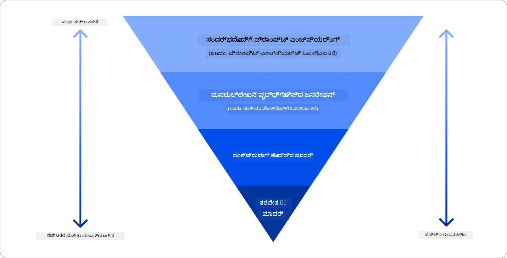

ಚಿತ್ರ ಮೂಲ: [Four Ways that Enterprises Deploy LLMs | Fiddler AI Blog](https://www.fiddler.ai/blog/four-ways-that-enterprises-deploy-llms?WT.mc_id=academic-105485-koreyst)

### Context ಜೊತೆಗೆ ಪ್ರಾಂಪ್ಟ್ ಎಂಜಿನಿಯರಿಂಗ್

ಪೂರ್ವ-ತರಬೇತಿಗೊಳಿಸಿದ LLM ಗಳು ಸಾಮಾನ್ಯಭಾಷಾ ಕಾರ್ಯಗಳಲ್ಲಿ ಚುಟುಕಾಗಿ ಪ್ರಾಂಪ್ಟ್ ಮಾಡಿ (ಒಂದು ವಾಕ್ಯ ಪೂರ್ಣಗೊಳಿಸುವುದು ಅಥವಾ ಪ್ರಶ್ನೆ), ಶೂನ್ಯ-ಶಾಟ್ ಪಡೆಯುವ ಮೂಲಕ ಚೆನ್ನಾಗಿ ಕೆಲಸ ಮಾಡುತ್ತವೆ.

ಆದರೆ ಬಳಕೆದಾರ ತಮ್ಮ ಪ್ರಶ್ನೆಯನ್ನು ವಿಶದವಾಗಿ ವಿನ್ಯಾಸಗೊಳಿಸಿಕೊಳ್ಳುತ್ತಿದ್ದಂತೆ – ಒಂದಿಷ್ಟು ವಿನಂತಿ ಮತ್ತು ಉದಾಹರಣೆಗಳೊಂದಿಗೆ – ಪ್ರತಿಕ್ರಿಯೆ ಹೆಚ್ಚು ನಿಖರವಾಗಿ ಮತ್ತು ಬಳಕೆದಾರನ ನಿರೀಕ್ಷೆಯ ಹತ್ತಿರವಾಗುತ್ತದೆ. ಈ ಸಂದರ್ಭದಲ್ಲಿ, ಪ್ರಾಂಪ್ಟ್ ಒಂದೇ ಒಂದು ಉದಾಹರಣೆಯನ್ನು ಒಳಗೊಂಡಿದ್ದರೆ ಅದನ್ನು “ಒಂದು-ಶಾಟ್” ಲರ್ನಿಂಗ್ ಎಂದು ಕರೆದು, ಹಲವಾರು ಉದಾಹರಣೆಗಳು ಇದ್ದರೆ “ಕೆಲವು ಶಾಟ್” ಲರ್ನಿಂಗ್ ಎಂದು ನಾವು ಹೇಳುತ್ತೇವೆ.
ಪ್ರಾಂಪ್ಟ್ ಎಂಜಿನಿಯರಿಂಗ್ ವಂದನೆಗಳೊಂದಿಗೆ ಆರಂಭಿಸಲು ಅತ್ಯಂತ ವೆಚ್ಚಪ್ರಭಾವಿ ವಿಧಾನವಾಗಿದೆ.

### Retrieval Augmented Generation (RAG)

LLM ಗಳಿಗೆ ತೊಂದರೆ ಅಂತಹದಾಗಿದೆ, ಅವು ತರಬೇತಿಗೆ ಬಳಕೆಯಾದ ಡೇಟಾವನ್ನು ಮಾತ್ರ ಬಳಸಿಕೊಂಡು ಉತ್ತರ ಸೃಷ್ಟಿಸಲು ಸಾಧ್ಯ, ಹಾಗಾಗಿ ತರಬೇತಿ ಪ್ರಕ್ರಿಯೆಯ ನಂತರ ನಡೆದ ಘಟನೆಗಳ ಬಗ್ಗೆ ತಿಳಿಯುವುದಿಲ್ಲ ಮತ್ತು ಸಾರ್ವಜನಿಕರಲ್ಲದ ಮಾಹಿತಿಗಳಿಗೆ (ಕಂಪನಿ ಡೇಟಾ) ಪ್ರವೇಶವಿಲ್ಲ.
ಇದನ್ನು RAG ಮೂಲಕ ಮೀರಿ ಹೋಗಬಹುದು, ಇದು ಪ್ರಾಂಪ್ಟ್ ಅನ್ನು ಹೊರಗಿನ ಮಾಹಿತಿಯಿಂದ ದಾಖಲೆ ಮುತುವರ್ಜಿ ತುಂಡುಗಳ ರೂಪದಲ್ಲಿ ವಿಸ್ತರಿಸುವ ತಂತ್ರ. ಇದು ಲಂಬತೆಯ ಮಿತಿಗಳನ್ನು ಪರಿಗಣಿಸುತ್ತದೆ. ಇದನ್ನು [Azure Vector Search](https://learn.microsoft.com/azure/search/vector-search-overview?WT.mc_id=academic-105485-koreyst) ಲాంటి ವೆಕ್ಟರ್ ಡೇಟಾಬೇಸ್ ಉಪಕರಣಗಳ ಮೂಲಕ ಬೆಂಬಲಿಸಲಾಗಿದೆ, ಇದು ವಿವಿಧ ಪೂರ್ವನಿರ್ದೇಶಿತ ಡೇಟಾ ಮೂಲಗಳಿಂದ ಉಪಯುಕ್ತ ತುಂಡುಗಳನ್ನು ಹೊರತೆಗೆಯುತ್ತದೆ ಮತ್ತು ಅವುಗಳನ್ನು ಪ್ರಾಂಪ್ಟ್ ಸನ್ದರ್ಭಕ್ಕೆ ಸೇರಿಸುತ್ತದೆ.

ಯಾವುದೇ ವ್ಯವಸಾಯವು ಸಾಕಷ್ಟು ಡೇಟಾ, ಸಮಯ ಅಥವಾ ಸಂಪನ್ಮೂಲಗಳಿಲ್ಲದಿದ್ದರೂ, ಕಾರ್ಯಕ್ಷಮತೆಯನ್ನು ಸುಧಾರಿಸಲು ಮತ್ತು ಪ್ರಚಲಿತ ಅಥವಾ ಸಹಾಯವನ್ನು ನೀಡದ ಉತ್ತರಗಳ ಅಪಾಯಗಳನ್ನು ಕಡಿಮೆ ಮಾಡಲು ಸಹಾಯ ಮಾಡುತ್ತದೆ.

### ಫೈನ್-ಟ್ಯೂನ್ಡ್ ಮಾದರಿ

ಫೈನ್-ಟ್ಯೂನಿಂಗ್ ಒಂದು ಪ್ರಕ್ರಿಯೆಯಾಗಿದೆ ಇದು ವರ್ಗಾಂತರಣ ಕಲಿಕೆಯನ್ನು ಉಪಯೋಗಿಸಿ ಮಾದರಿಯನ್ನು ನಿರ್ದಿಷ್ಟ ಕಾರ್ಯಕ್ಕೆ ಹೊಂದಿಕೊಳ್ಳುವಂತೆ ಮಾಡುತ್ತದೆ ಅಥವಾ ಒಂದು ವಿಶೇಷ ಸಮಸ್ಯೆಯನ್ನು ಪರಿಹರಿಸಲು. ಕೆಲಷ್ಟು ಶಾಟ್ ಶೈಲಿ ಅಥವಾ RAG ಗೆ ಬಿಲ್ಬಿಟ್ಟು, ಇದು ಹೊಸ ಮಾದರಿಯನ್ನು ಸೃಷ್ಟಿಸುತ್ತದೆ, ಕಂಡು ಬಂದ ತೂಕಗಳು ಮತ್ತು ವಕ್ರಗಳು ನವೀಕರಿಸಲಾಗುತ್ತವೆ. ತರಬೇತಿ ಉದಾಹರಣೆಗಳ ಒಂದು ಸೆಟ್ ಬೇಕಾಗುತ್ತದೆ, ಇದರೊಳಗೆ ಪ್ರಾಂಪ್ಟ್ (ಒಂದು ಇನ್ಪುಟ್) ಮತ್ತು ಅದರ ಸಂಬಂಧಿತ ಆನ್ಸರ್ (ಪೂರ್ಣಗೊಳಿಸುವಿಕೆ) ಸೇರಿದೆ.
ಇದು ಇವುಗಳಲ್ಲಿ ವಂಚಿಸಲಾಗಿದೆ:

- **ಸಣ್ಣ, ನಿರ್ದಿಷ್ಟ ಕಾರ್ಯ ಮಾದರಿಗಳನ್ನು ಬಳಕೆ**. ವ್ಯವಹಾರ ಒಂದು ವಿಸ್ತಾರವಾದ ಒಗ್ಗಟ್ಟಿನ ಮಾದರಿಯನ್ನು ಮರುಪಡೆಯುವ ಬದಲು ಜಾಲದ ಒಂದು ಸಣ್ಣ ಮಾದರಿಯನ್ನು ಫೈನ್ ಟ್ಯೂನಿಂಗ್ ಮಾಡಲು ಇಚ್ಛಿಸುವುದು, ಇದು ಹೆಚ್ಚು ವೆಚ್ಚಪ್ರಭಾವಿ ಮತ್ತು ವೇಗದ ಪರಿಹಾರವಾಗಿದೆ.

- **ದೇರಿಕೆ (Latency) ಪರಿಗಣನೆ**. ದೇರಿಕೆ ವಿಶೇಷ ಬಳಕೆಯಿಗಾಗಿ ಮುಖ್ಯವಾಗಿದೆ, ಆದ್ದರಿಂದ ಬಹು ವಿಸ್ತೃತ ಪ್ರಾಂಪ್ಟ್ ಅಥವಾ ಮಾದರಿಯಿಂದ ಕಲಿಯಬೇಕಾದ ಉದಾಹರಣೆ ಗಂಡ ಅಥವಾ ಪ್ರಾಂಪ್ಟ್ ಉದ್ದ ಮಿತಿಗೆ ಹೊಂದಿಕೆಯಾಗದೆ.

- **ಸ್ಥಿರ ವರ್ತನೆ ಹೊಂದಿಸುವುದು**. ವ್ಯವಹಾರವು ತುಂಬಾ ಗುಣಮಟ್ಟದ ಉದಾಹರಣೆಗಳನ್ನು ಹೊಂದಿದೆ ಮತ್ತು ಮಾದರಿಯು ಕಾರ್ಯ ಮಾದರಿ, ಫಲಿತಾಂಶ ಆಕರ, ಧ್ವನಿ, ಅಥವಾ ಕ್ಷೇತ್ರ-ನಿರ್ಧಿಷ್ಟ ಶೈಲಿಯನ್ನು ಒಂದೇ ರೀತಿಯಾಗಿ ಅನುಸರಿಸಲು ಬಯಸುತ್ತದೆ. ಮುಖ್ಯ ಸಮಸ್ಯೆ ಹೊಸ ವಾಸ್ತವಗಳು ಅಥವಾ ಖಾಸಗಿ ಜ್ಞಾನ ಧಾರಾಕಾರವಾಗಿ ಬದಲಾಗುವುದಾದರೆ, ಫೈನ್-ಟ್ಯೂನಿಂಗ್ ಮಾತ್ರಕ್ಕೂ ಬದಲು RAG ಬಳಸಿ.

### ತರಬೇತಿಗೊಳಿಸಿದ ಮಾದರಿ

LLM ಅನ್ನು ಮೊದಲು ಕಲಿಕೆ ಮೂಲಕ ತರಬೇತಿಗೊಳಿಸುವುದು ನಿಜವಾಗಿಯೂ ಅತ್ಯಂತ ಕಠಿಣ ಮತ್ತು ಸಂಕೀರ್ಣ ವಿಧಾನವಾಗಿದ್ದು, ಹೆಚ್ಚು ಪ್ರಮಾಣದ ಡೇಟಾ, ನಿಪುಣ ಸಂಪನ್ಮೂಲಗಳು ಮತ್ತು ಸೂಕ್ತ ಗಣನ ಶಕ್ತಿಯನ್ನು ಬೇಕಾಗಿಸುತ್ತದೆ. ಈ ಆಯ್ಕೆ ವ್ಯವಹಾರವು ಕ್ಷೇತ್ರ-ನಿರ್ದಿಷ್ಟ ಒದಗಣೆಯನ್ನು ಮತ್ತು ದೊಡ್ಡ ಪ್ರಮಾಣದ ಕ್ಷೇತ್ರ ಕೇಂದ್ರಿತ ಡೇಟಾವನ್ನು ಹೊಂದಿದ ಹೆಸರಿನಲ್ಲಿ ಪರಿಗಣಿಸಬೇಕು.

## ಜ್ಞಾನ ಪರೀಕ್ಷೆ

LLM ಪೂರ್ಣಗೊಳ್ಳುವ ಫಲಿತಾಂಶಗಳನ್ನು ಸುಧಾರಿಸಲು ಒಳ್ಳೆಯ ವಿಧಾನ ಯಾವುದು ಹೊಂದಿರಬಹುದು?

1. ಸನ್ದರ್ಭದೊಂದಿಗೆ ಪ್ರಾಂಪ್ಟ್ ಎಂಜಿನಿಯರಿಂಗ್
1. RAG
1. ಫೈನ್-ಟ್ಯೂನ್ಡ್ ಮಾದರಿ

ಉತ್ತರ: ಇವರೆಲ್ಲರೂ ಸಹಾಯ ಮಾಡಬಹುದು. ತ್ವರಿತ ಸುಧಾರಣೆಗೆ ಪ್ರಾಂಪ್ಟ್ ಎಂಜಿನಿಯರಿಂಗ್ ಮತ್ತು ಸನ್ದರ್ಭದಿಂದ ಪ್ರಾರಂಭಿಸಿ, ಮಾದರಿಗೆ ಪ್ರಚಲಿತ ತಥ್ಯಗಳು ಅಥವಾ ಖಾಸಗಿ ವ್ಯವಹಾರ ಡೇಟಾ ಬೇಕಾದಾಗ RAG ಉಪಯೋಗಿಸಿ. ನೀವು ಸಾಕಷ್ಟು ಉನ್ನತ-ಗುಣಮಟ್ಟದ ಉದಾಹರಣೆಗಳನ್ನು ಹೊಂದಿದ್ದಾಗ ಮತ್ತು ಮಾದರಿಯು ಕಾರ್ಯ, ಆಕಾರ, ಧ್ವನಿ ಅಥವಾ ಕ್ಷೇತ್ರ ಮಾದರಿಯನ್ನು ಹಲವು ಬಾರಿ ಅನುಸರಿಸುವ ಅಗತ್ಯವಿದ್ದಾಗ ಫೈನ್-ಟ್ಯೂನಿಂಗ್ ಆಯ್ಕೆಮಾಡಿ.

## 🚀 ಸವಾಲು

ನಿಮ್ಮ ವ್ಯವಹಾರಕ್ಕಾಗಿ [RAG ಅನ್ನು ಹೇಗೆ ಬಳಸಬಹುದು](https://learn.microsoft.com/azure/search/retrieval-augmented-generation-overview?WT.mc_id=academic-105485-koreyst) ಎಂಬುದನ್ನು ಹೆಚ್ಚು ಓದಿ.

## ಅದ್ಭುತ ಕೆಲಸ, ನಿಮ್ಮ ಕಲಿಕೆಯನ್ನು ಮುಂದುವರೆಸಿ

ಈ ಪಾಠವನ್ನು ಪೂರ್ಣಗೊಳಿಸಿದ ನಂತರ, ನಮಗಿರುವ [Generative AI Learning collection](https://aka.ms/genai-collection?WT.mc_id=academic-105485-koreyst) ಅನ್ನು ಪರಿಶೀಲಿಸಿ ನಿಮ್ಮ Generative AI ಜ್ಞಾನವನ್ನು ಮುಂದುವರಿಸಲು!

ಪಾಠ 3 ಕಡೆಗೆ ಸಾಗಿಸಿ, ಅಲ್ಲಿ ನಾವು ಹೇಗೆ [Generative AI ಜವಾಬ್ದಾರಿಯಿಂದ ನಿರ್ಮಿಸಬಹುದು](../03-using-generative-ai-responsibly/README.md?WT.mc_id=academic-105485-koreyst) ಎಂಬುದನ್ನು ನೋಡೋಣ!

---

<!-- CO-OP TRANSLATOR DISCLAIMER START -->
**ಅಸ್ವೀಕಾರ**:
ಈ ದಸ್ತಾವೇಜು AI ಅನುವಾದ ಸೇವೆ [Co-op Translator](https://github.com/Azure/co-op-translator) ಬಳಸಿ ಅನುವಾದಿಸಲಾಗಿದೆ. ನಾವು ನಿಖರತೆಯನ್ನು ಸಾಧಿಸಲು ಪ್ರಯತ್ನಿಸುತ್ತಿದ್ದರೂ, ದಯವಿಟ್ಟು ಗಮನಿಸಿ, ಸ್ವಯಂಚಾಲಿತ ಅನುವಾದಗಳಲ್ಲಿ ದೋಷಗಳು ಅಥವಾ ಅಸಡ್ಡೆಗಳು ಇರಬಹುದು. ಮೂಲ ಭಾಷೆಯಲ್ಲಿರುವ ಮೂಲ ದಸ್ತಾವೇಜು ಪ್ರಾಮಾಣಿಕ ಮೂಲವೆಂದು ಪರಿಗಣಿಸಬೇಕು. ಪ್ರಮುಖ ಮಾಹಿತಿಗಾಗಿ, ವೃತ್ತಿಪರ ಮಾನವ ಅನುವಾದವನ್ನು ಶಿಫಾರಸು ಮಾಡಲಾಗುತ್ತದೆ. ಈ ಅನುವಾದವನ್ನು ಬಳಸುವ ಮೂಲಕ ಉಂಟಾಗುವ ಯಾವುದೇ ತಪ್ಪು ಅರ್ಥಗಳ ಅಥವಾ ತಪ್ಪು ವ್ಯಾಖ್ಯಾನಗಳ ಬಗ್ಗೆ ನಾವು ಹೊಣೆಗಾರರಲ್ಲ.
<!-- CO-OP TRANSLATOR DISCLAIMER END -->