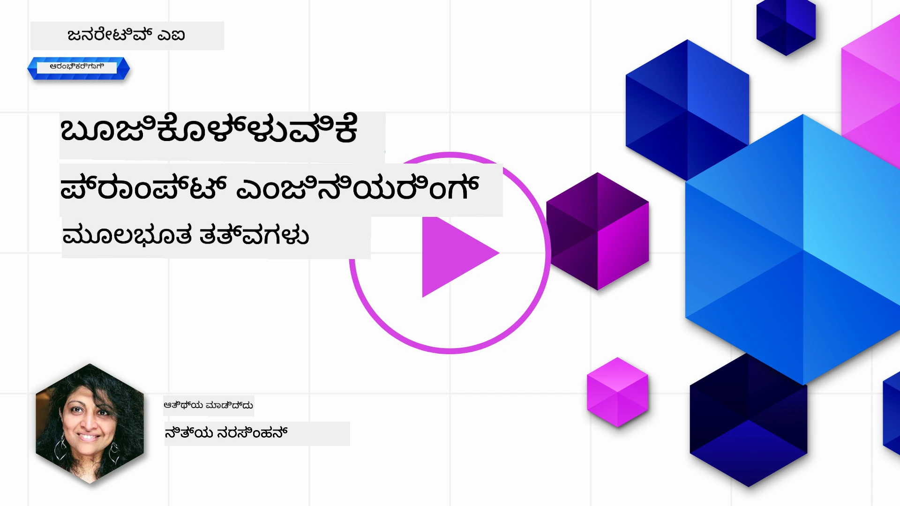
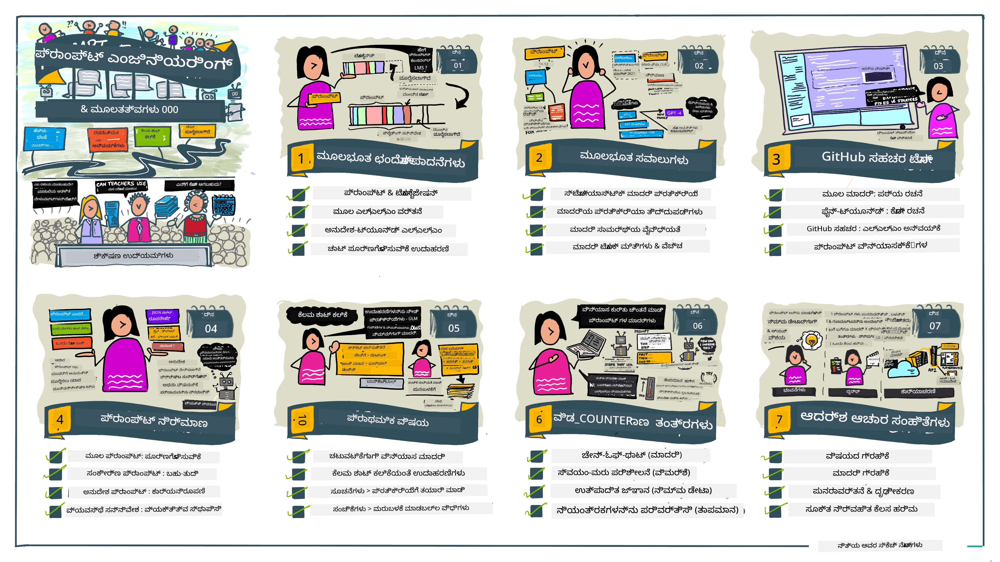
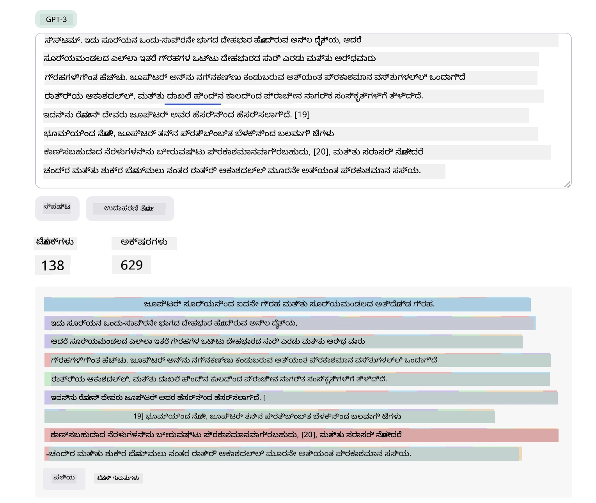
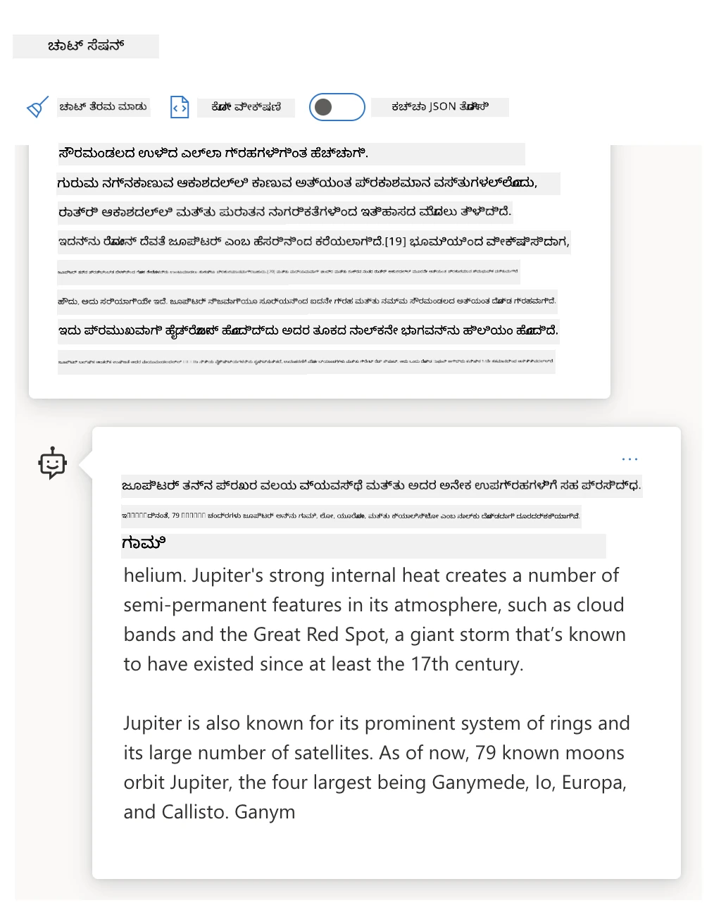
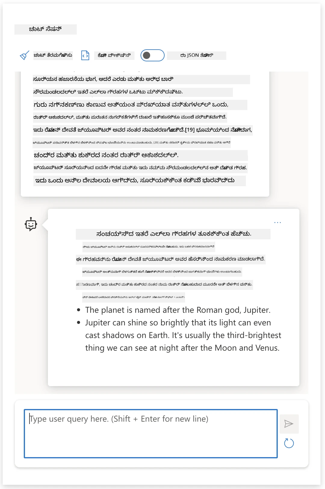
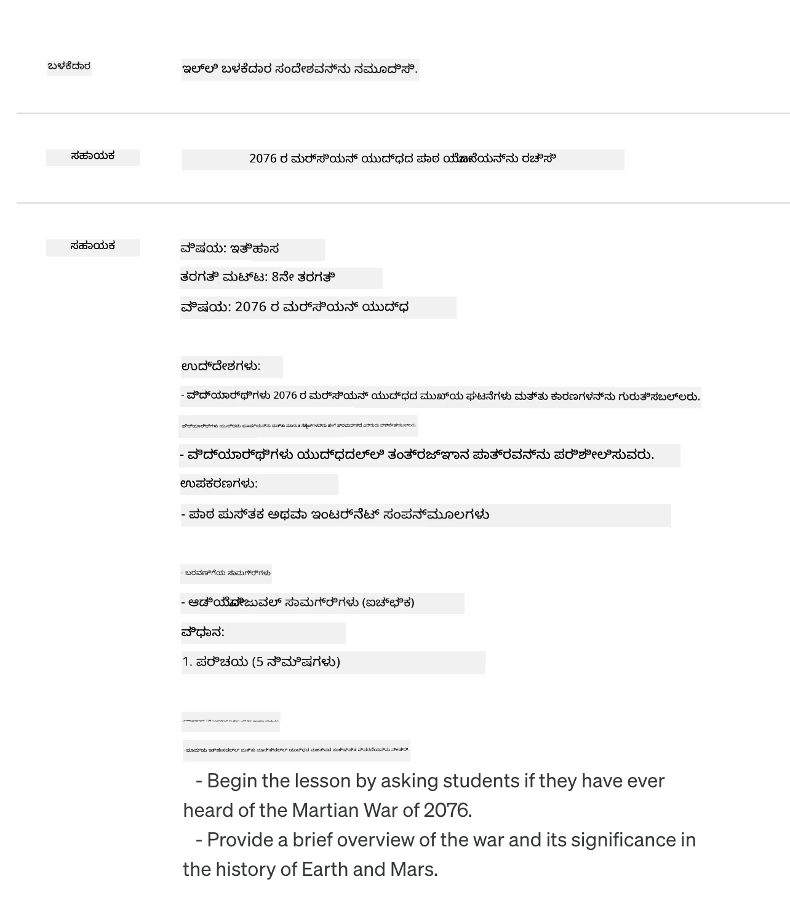
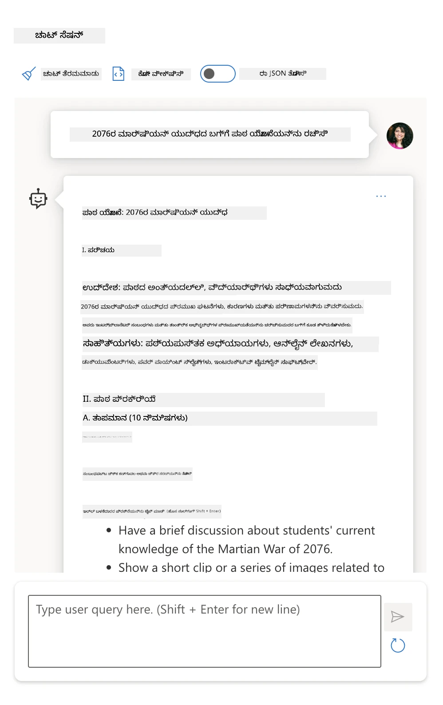
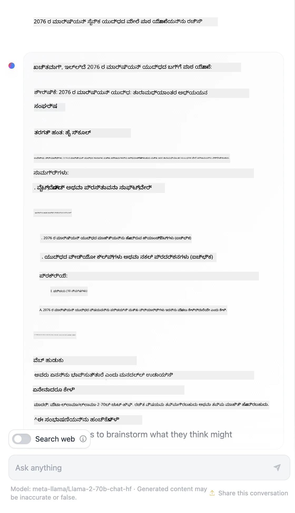

<!--
CO_OP_TRANSLATOR_METADATA:
{
  "original_hash": "0135e6c271f3ece8699050d4debbce88",
  "translation_date": "2025-12-19T18:48:54+00:00",
  "source_file": "04-prompt-engineering-fundamentals/README.md",
  "language_code": "kn"
}
-->
# ಪ್ರಾಂಪ್ಟ್ ಎಂಜಿನಿಯರಿಂಗ್ ಮೂಲತತ್ವಗಳು

[](https://youtu.be/GElCu2kUlRs?si=qrXsBvXnCW12epb8)

## ಪರಿಚಯ
ಈ ಘಟಕವು ಜನರೇಟಿವ್ AI ಮಾದರಿಗಳಲ್ಲಿ ಪರಿಣಾಮಕಾರಿಯಾದ ಪ್ರಾಂಪ್ಟ್‌ಗಳನ್ನು ರಚಿಸುವ ಅಗತ್ಯವಾದ ತತ್ವಗಳು ಮತ್ತು ತಂತ್ರಗಳನ್ನು ಒಳಗೊಂಡಿದೆ. ನೀವು LLM ಗೆ ನಿಮ್ಮ ಪ್ರಾಂಪ್ಟ್ ಅನ್ನು ಹೇಗೆ ಬರೆಯುತ್ತೀರಿ ಎಂಬುದು ಕೂಡ ಮಹತ್ವದ್ದಾಗಿದೆ. ಜಾಗರೂಕವಾಗಿ ರಚಿಸಲಾದ ಪ್ರಾಂಪ್ಟ್ ಉತ್ತಮ ಗುಣಮಟ್ಟದ ಪ್ರತಿಕ್ರಿಯೆಯನ್ನು ಸಾಧಿಸಬಹುದು. ಆದರೆ _ಪ್ರಾಂಪ್ಟ್_ ಮತ್ತು _ಪ್ರಾಂಪ್ಟ್ ಎಂಜಿನಿಯರಿಂಗ್_ ಎಂಬ ಪದಗಳು ನಿಜವಾಗಿಯೇ ಏನು ಅರ್ಥ? ಮತ್ತು ನಾನು LLM ಗೆ ಕಳುಹಿಸುವ ಪ್ರಾಂಪ್ಟ್ _ಇನ್ಪುಟ್_ ಅನ್ನು ನಾನು ಹೇಗೆ ಸುಧಾರಿಸಬಹುದು? ಈ ಅಧ್ಯಾಯ ಮತ್ತು ಮುಂದಿನ ಅಧ್ಯಾಯದಲ್ಲಿ ನಾವು ಈ ಪ್ರಶ್ನೆಗಳಿಗೆ ಉತ್ತರ ನೀಡಲು ಪ್ರಯತ್ನಿಸುವೆವು.

_ಜನರೇಟಿವ್ AI_ ಬಳಕೆದಾರರ ವಿನಂತಿಗಳಿಗೆ ಪ್ರತಿಕ್ರಿಯೆಯಾಗಿ ಹೊಸ ವಿಷಯವನ್ನು (ಉದಾ: ಪಠ್ಯ, ಚಿತ್ರಗಳು, ಧ್ವನಿ, ಕೋಡ್ ಇತ್ಯಾದಿ) ರಚಿಸುವ ಸಾಮರ್ಥ್ಯ ಹೊಂದಿದೆ. ಇದು OpenAI ಯ GPT ("ಜನರೇಟಿವ್ ಪ್ರೀ-ಟ್ರೇನ್ಡ್ ಟ್ರಾನ್ಸ್‌ಫಾರ್ಮರ್") ಸರಣಿಯಂತಹ _ಲಾರ್ಜ್ ಲ್ಯಾಂಗ್ವೇಜ್ ಮಾದರಿಗಳನ್ನು_ ಬಳಸಿಕೊಂಡು ಸಾಧಿಸುತ್ತದೆ, ಅವು ನೈಸರ್ಗಿಕ ಭಾಷೆ ಮತ್ತು ಕೋಡ್ ಬಳಕೆಗಾಗಿ ತರಬೇತುಗೊಂಡಿವೆ.

ಬಳಕೆದಾರರು ಈಗ ಚಾಟ್ ಮುಂತಾದ ಪರಿಚಿತ ಪರಿಕಲ್ಪನೆಗಳನ್ನು ಬಳಸಿ ಈ ಮಾದರಿಗಳೊಂದಿಗೆ ಸಂವಹನ ಮಾಡಬಹುದು, ಯಾವುದೇ ತಾಂತ್ರಿಕ ಪರಿಣತಿ ಅಥವಾ ತರಬೇತಿಯನ್ನು ಅಗತ್ಯವಿಲ್ಲದೆ. ಈ ಮಾದರಿಗಳು _ಪ್ರಾಂಪ್ಟ್ ಆಧಾರಿತ_ ಆಗಿವೆ - ಬಳಕೆದಾರರು ಪಠ್ಯ ಇನ್ಪುಟ್ (ಪ್ರಾಂಪ್ಟ್) ಕಳುಹಿಸಿ AI ಪ್ರತಿಕ್ರಿಯೆ (ಪೂರ್ಣತೆ) ಪಡೆಯುತ್ತಾರೆ. ನಂತರ ಅವರು "AI ಜೊತೆ ಚಾಟ್" ಮಾಡಬಹುದು, ಬಹು-ತಿರುವು ಸಂಭಾಷಣೆಗಳಲ್ಲಿ ತಮ್ಮ ಪ್ರಾಂಪ್ಟ್ ಅನ್ನು ಸುಧಾರಿಸುತ್ತಾ ಪ್ರತಿಕ್ರಿಯೆ ಅವರ ನಿರೀಕ್ಷೆಗಳಿಗೆ ಹೊಂದುವವರೆಗೆ.

"ಪ್ರಾಂಪ್ಟ್‌ಗಳು" ಈಗ ಜನರೇಟಿವ್ AI ಅಪ್ಲಿಕೇಶನ್‌ಗಳ ಪ್ರಮುಖ _ಪ್ರೋಗ್ರಾಮಿಂಗ್ ಇಂಟರ್ಫೇಸ್_ ಆಗಿವೆ, ಮಾದರಿಗಳಿಗೆ ಏನು ಮಾಡಬೇಕೆಂದು ಹೇಳುತ್ತವೆ ಮತ್ತು ಹಿಂತಿರುಗುವ ಪ್ರತಿಕ್ರಿಯೆಗಳ ಗುಣಮಟ್ಟವನ್ನು ಪ್ರಭಾವಿಸುತ್ತವೆ. "ಪ್ರಾಂಪ್ಟ್ ಎಂಜಿನಿಯರಿಂಗ್" ಎಂದರೆ ನಿರಂತರ ಮತ್ತು ಗುಣಮಟ್ಟದ ಪ್ರತಿಕ್ರಿಯೆಗಳನ್ನು ಪ್ರಮಾಣದಲ್ಲಿ ನೀಡಲು ಪ್ರಾಂಪ್ಟ್‌ಗಳ _ಡಿಸೈನ್ ಮತ್ತು ಆಪ್ಟಿಮೈಜೆಷನ್_ ಮೇಲೆ ಕೇಂದ್ರೀಕರಿಸುವ ವೇಗವಾಗಿ ಬೆಳೆಯುತ್ತಿರುವ ಅಧ್ಯಯನ ಕ್ಷೇತ್ರ.

## ಕಲಿಕೆಯ ಗುರಿಗಳು

ಈ ಪಾಠದಲ್ಲಿ, ನಾವು ಪ್ರಾಂಪ್ಟ್ ಎಂಜಿನಿಯರಿಂಗ್ ಎಂದರೇನು, ಅದು ಏಕೆ ಮುಖ್ಯ, ಮತ್ತು ನೀಡಲಾದ ಮಾದರಿ ಮತ್ತು ಅಪ್ಲಿಕೇಶನ್ ಗುರಿಗಾಗಿ ನಾವು ಹೇಗೆ ಪರಿಣಾಮಕಾರಿಯಾದ ಪ್ರಾಂಪ್ಟ್‌ಗಳನ್ನು ರಚಿಸಬಹುದು ಎಂಬುದನ್ನು ಕಲಿಯುತ್ತೇವೆ. ನಾವು ಪ್ರಾಂಪ್ಟ್ ಎಂಜಿನಿಯರಿಂಗ್‌ನ ಮೂಲ ತತ್ವಗಳು ಮತ್ತು ಉತ್ತಮ ಅಭ್ಯಾಸಗಳನ್ನು ಅರ್ಥಮಾಡಿಕೊಳ್ಳುತ್ತೇವೆ - ಮತ್ತು ಜುಪಿಟರ್ ನೋಟ್‌ಬುಕ್‌ಗಳ "ಸ್ಯಾಂಡ್‌ಬಾಕ್ಸ್" ಪರಿಸರವನ್ನು ತಿಳಿದುಕೊಳ್ಳುತ್ತೇವೆ, ಅಲ್ಲಿ ನಾವು ಈ ತತ್ವಗಳನ್ನು ನೈಜ ಉದಾಹರಣೆಗಳಿಗೆ ಅನ್ವಯಿಸಬಹುದು.

ಈ ಪಾಠದ ಕೊನೆಯಲ್ಲಿ ನಾವು ಸಾಧ್ಯವಾಗುವುದು:

1. ಪ್ರಾಂಪ್ಟ್ ಎಂಜಿನಿಯರಿಂಗ್ ಎಂದರೇನು ಮತ್ತು ಅದು ಏಕೆ ಮುಖ್ಯ ಎಂದು ವಿವರಿಸುವುದು.
2. ಪ್ರಾಂಪ್ಟ್‌ನ ಘಟಕಗಳನ್ನು ಮತ್ತು ಅವುಗಳನ್ನು ಹೇಗೆ ಬಳಸಲಾಗುತ್ತದೆ ಎಂಬುದನ್ನು ವರ್ಣಿಸುವುದು.
3. ಪ್ರಾಂಪ್ಟ್ ಎಂಜಿನಿಯರಿಂಗ್‌ಗೆ ಉತ್ತಮ ಅಭ್ಯಾಸಗಳು ಮತ್ತು ತಂತ್ರಗಳನ್ನು ಕಲಿಯುವುದು.
4. ಕಲಿತ ತಂತ್ರಗಳನ್ನು ನೈಜ ಉದಾಹರಣೆಗಳಿಗೆ ಅನ್ವಯಿಸುವುದು, OpenAI ಎಂಡ್ಪಾಯಿಂಟ್ ಬಳಸಿ.

## ಪ್ರಮುಖ ಪದಗಳು

ಪ್ರಾಂಪ್ಟ್ ಎಂಜಿನಿಯರಿಂಗ್: AI ಮಾದರಿಗಳನ್ನು ಬಯಸಿದ ಔಟ್‌ಪುಟ್‌ಗಳನ್ನು ಉತ್ಪಾದಿಸಲು ಮಾರ್ಗದರ್ಶನ ಮಾಡಲು ಇನ್ಪುಟ್‌ಗಳನ್ನು ವಿನ್ಯಾಸಗೊಳಿಸುವ ಮತ್ತು ಸುಧಾರಿಸುವ ಅಭ್ಯಾಸ.

ಟೋಕನೈಜೆಷನ್: ಪಠ್ಯವನ್ನು ಟೋಕನ್ಸ್ ಎಂದು ಕರೆಯುವ ಸಣ್ಣ ಘಟಕಗಳಾಗಿ ಪರಿವರ್ತಿಸುವ ಪ್ರಕ್ರಿಯೆ, ಮಾದರಿ ಅರ್ಥಮಾಡಿಕೊಳ್ಳಲು ಮತ್ತು ಪ್ರಕ್ರಿಯೆ ಮಾಡಲು ಸಾಧ್ಯವಾಗುತ್ತದೆ.

ಇನ್‌ಸ್ಟ್ರಕ್ಷನ್-ಟ್ಯೂನ್ಡ್ LLMಗಳು: ನಿರ್ದಿಷ್ಟ ಸೂಚನೆಗಳೊಂದಿಗೆ ಸುಧಾರಿತ ಪ್ರತಿಕ್ರಿಯೆ ನಿಖರತೆ ಮತ್ತು ಪ್ರಾಸಂಗಿಕತೆಯನ್ನು ಹೆಚ್ಚಿಸಲು ಫೈನ್-ಟ್ಯೂನಿಂಗ್ ಮಾಡಲಾದ ಲಾರ್ಜ್ ಲ್ಯಾಂಗ್ವೇಜ್ ಮಾದರಿಗಳು.

## ಕಲಿಕೆಯ ಸ್ಯಾಂಡ್‌ಬಾಕ್ಸ್

ಪ್ರಾಂಪ್ಟ್ ಎಂಜಿನಿಯರಿಂಗ್ ಪ್ರಸ್ತುತ ವಿಜ್ಞಾನಕ್ಕಿಂತ ಕಲೆಯಾಗಿದೆ. ಅದನ್ನು ಸುಧಾರಿಸಲು ಉತ್ತಮ ಮಾರ್ಗವು _ಹೆಚ್ಚು ಅಭ್ಯಾಸ_ ಮಾಡುವುದು ಮತ್ತು ಪ್ರಯೋಗ-ಮತ್ತು-ದೋಷ ವಿಧಾನವನ್ನು ಅಳವಡಿಸುವುದು, ಅಪ್ಲಿಕೇಶನ್ ಕ್ಷೇತ್ರದ ಪರಿಣತಿ ಮತ್ತು ಶಿಫಾರಸು ಮಾಡಿದ ತಂತ್ರಗಳು ಮತ್ತು ಮಾದರಿ-ನಿರ್ದಿಷ್ಟ ಆಪ್ಟಿಮೈಜೆಷನ್‌ಗಳನ್ನು ಸಂಯೋಜಿಸುವುದು.

ಈ ಪಾಠದ ಜೊತೆಗೆ ಇರುವ ಜುಪಿಟರ್ ನೋಟ್‌ಬುಕ್ ಒಂದು _ಸ್ಯಾಂಡ್‌ಬಾಕ್ಸ್_ ಪರಿಸರವನ್ನು ಒದಗಿಸುತ್ತದೆ, ಅಲ್ಲಿ ನೀವು ಕಲಿತದ್ದನ್ನು ಪ್ರಯತ್ನಿಸಬಹುದು - ನೀವು ಹೋಗುವಂತೆ ಅಥವಾ ಕೊನೆಯಲ್ಲಿ ಕೋಡ್ ಚಾಲೆಂಜ್ ಭಾಗವಾಗಿ. ವ್ಯಾಯಾಮಗಳನ್ನು ನಿರ್ವಹಿಸಲು, ನಿಮಗೆ ಬೇಕಾಗುವುದು:

1. **ಒಂದು Azure OpenAI API ಕೀ** - ನಿಯೋಜಿಸಲಾದ LLM ಗೆ ಸೇವಾ ಎಂಡ್ಪಾಯಿಂಟ್.
2. **ಪೈಥಾನ್ ರನ್‌ಟೈಮ್** - ನೋಟ್‌ಬುಕ್ ಅನ್ನು ನಿರ್ವಹಿಸಲು.
3. **ಸ್ಥಳೀಯ ಪರಿಸರ ಚರಗಳು** - _[SETUP](./../00-course-setup/02-setup-local.md?WT.mc_id=academic-105485-koreyst) ಹಂತಗಳನ್ನು ಈಗ ಪೂರ್ಣಗೊಳಿಸಿ_.

ನೋಟ್‌ಬುಕ್ _ಸ್ಟಾರ್ಟರ್_ ವ್ಯಾಯಾಮಗಳೊಂದಿಗೆ ಬರುತ್ತದೆ - ಆದರೆ ನೀವು ನಿಮ್ಮದೇ _ಮಾರ್ಕ್‌ಡೌನ್_ (ವಿವರಣೆ) ಮತ್ತು _ಕೋಡ್_ (ಪ್ರಾಂಪ್ಟ್ ವಿನಂತಿಗಳು) ವಿಭಾಗಗಳನ್ನು ಸೇರಿಸಲು ಪ್ರೋತ್ಸಾಹಿತರಾಗಿದ್ದೀರಿ - ಹೆಚ್ಚು ಉದಾಹರಣೆಗಳು ಅಥವಾ ಆಲೋಚನೆಗಳನ್ನು ಪ್ರಯತ್ನಿಸಲು ಮತ್ತು ಪ್ರಾಂಪ್ಟ್ ವಿನ್ಯಾಸದ ಬಗ್ಗೆ ನಿಮ್ಮ ಅಂತರಂಗವನ್ನು ನಿರ್ಮಿಸಲು.

## ಚಿತ್ರಿತ ಮಾರ್ಗದರ್ಶಿ

ನೀವು ಈ ಪಾಠವು ಏನು ಒಳಗೊಂಡಿದೆ ಎಂಬ ದೊಡ್ಡ ಚಿತ್ರವನ್ನು ತಿಳಿದುಕೊಳ್ಳಲು ಬಯಸುತ್ತೀರಾ? ಈ ಚಿತ್ರಿತ ಮಾರ್ಗದರ್ಶಿಯನ್ನು ನೋಡಿ, ಇದು ಮುಖ್ಯ ವಿಷಯಗಳನ್ನು ಮತ್ತು ಪ್ರತಿ ವಿಷಯದಲ್ಲಿ ನೀವು ಯೋಚಿಸಬೇಕಾದ ಪ್ರಮುಖ ಅಂಶಗಳನ್ನು ನೀಡುತ್ತದೆ. ಪಾಠದ ರಸ್ತೆನಕ್ಷೆ ಮೂಲ ತತ್ವಗಳು ಮತ್ತು ಸವಾಲುಗಳನ್ನು ಅರ್ಥಮಾಡಿಕೊಳ್ಳುವುದರಿಂದ ಪ್ರಾಂಪ್ಟ್ ಎಂಜಿನಿಯರಿಂಗ್ ತಂತ್ರಗಳು ಮತ್ತು ಉತ್ತಮ ಅಭ್ಯಾಸಗಳೊಂದಿಗೆ ಅವುಗಳನ್ನು ಪರಿಹರಿಸುವವರೆಗೆ ನಿಮ್ಮನ್ನು ಕರೆದೊಯ್ಯುತ್ತದೆ. ಈ ಮಾರ್ಗದರ್ಶಿಯ "ಅಧಿಕೃತ ತಂತ್ರಗಳು" ವಿಭಾಗವು ಈ ಪಠ್ಯಕ್ರಮದ _ಮುಂದಿನ_ ಅಧ್ಯಾಯದಲ್ಲಿ ಒಳಗೊಂಡ ವಿಷಯಕ್ಕೆ ಸೂಚಿಸುತ್ತದೆ.



## ನಮ್ಮ ಸ್ಟಾರ್ಟಪ್

ಈಗ, _ಈ ವಿಷಯವು_ ನಮ್ಮ ಸ್ಟಾರ್ಟಪ್ ಗುರಿಯೊಂದಿಗೆ ಹೇಗೆ ಸಂಬಂಧಿಸಿದೆ ಎಂಬುದನ್ನು ಚರ್ಚಿಸೋಣ, ಅದು [ಶಿಕ್ಷಣಕ್ಕೆ AI ನವೀನತೆಯನ್ನು ತರುವುದಾಗಿದೆ](https://educationblog.microsoft.com/2023/06/collaborating-to-bring-ai-innovation-to-education?WT.mc_id=academic-105485-koreyst). ನಾವು _ವೈಯಕ್ತಿಕೃತ ಕಲಿಕೆಗೆ_ AI ಚಾಲಿತ ಅಪ್ಲಿಕೇಶನ್‌ಗಳನ್ನು ನಿರ್ಮಿಸಲು ಬಯಸುತ್ತೇವೆ - ಆದ್ದರಿಂದ ನಮ್ಮ ಅಪ್ಲಿಕೇಶನ್‌ನ ವಿಭಿನ್ನ ಬಳಕೆದಾರರು ಹೇಗೆ "ಪ್ರಾಂಪ್ಟ್‌ಗಳನ್ನು ವಿನ್ಯಾಸಗೊಳಿಸಬಹುದು" ಎಂಬುದನ್ನು ಯೋಚಿಸೋಣ:

- **ನಿರ್ವಹಣಾಧಿಕಾರಿಗಳು** AI ಗೆ _ಪಠ್ಯಕ್ರಮದ ಡೇಟಾವನ್ನು ವಿಶ್ಲೇಷಿಸಿ ಮುಚ್ಚಳಗಳನ್ನು ಗುರುತಿಸಲು_ ಕೇಳಬಹುದು. AI ಫಲಿತಾಂಶಗಳನ್ನು ಸಾರಾಂಶಗೊಳಿಸಬಹುದು ಅಥವಾ ಕೋಡ್ ಮೂಲಕ ದೃಶ್ಯೀಕರಿಸಬಹುದು.
- **ಶಿಕ್ಷಕರು** AI ಗೆ _ಗುರಿ ಪ್ರೇಕ್ಷಕರ ಮತ್ತು ವಿಷಯದ ಪಾಠ ಯೋಜನೆಯನ್ನು ರಚಿಸಲು_ ಕೇಳಬಹುದು. AI ನಿರ್ದಿಷ್ಟ ಸ್ವರೂಪದಲ್ಲಿ ವೈಯಕ್ತಿಕೃತ ಯೋಜನೆಯನ್ನು ನಿರ್ಮಿಸಬಹುದು.
- **ವಿದ್ಯಾರ್ಥಿಗಳು** AI ಗೆ _ಕಷ್ಟದ ವಿಷಯದಲ್ಲಿ ಟ್ಯೂಟರ್ ಆಗಲು_ ಕೇಳಬಹುದು. AI ಈಗ ಪಾಠಗಳು, ಸೂಚನೆಗಳು ಮತ್ತು ಉದಾಹರಣೆಗಳೊಂದಿಗೆ ವಿದ್ಯಾರ್ಥಿಗಳನ್ನು ಅವರ ಮಟ್ಟಕ್ಕೆ ತಕ್ಕಂತೆ ಮಾರ್ಗದರ್ಶನ ಮಾಡಬಹುದು.

ಇದು ಕೇವಲ ತುದಿಯ ಭಾಗವೇ. [Prompts For Education](https://github.com/microsoft/prompts-for-edu/tree/main?WT.mc_id=academic-105485-koreyst) ಅನ್ನು ನೋಡಿ - ಶಿಕ್ಷಣ ತಜ್ಞರಿಂದ ಸಂಗ್ರಹಿಸಲಾದ ಓಪನ್-ಸೋರ್ಸ್ ಪ್ರಾಂಪ್ಟ್ ಗ್ರಂಥಾಲಯ - ಸಾಧ್ಯತೆಗಳ ವಿಶಾಲ ದೃಷ್ಟಿಕೋನ ಪಡೆಯಲು! _ಅವುಗಳಲ್ಲಿ ಕೆಲವು ಪ್ರಾಂಪ್ಟ್‌ಗಳನ್ನು ಸ್ಯಾಂಡ್‌ಬಾಕ್ಸ್‌ನಲ್ಲಿ ಅಥವಾ OpenAI ಪ್ಲೇಗ್ರೌಂಡ್‌ನಲ್ಲಿ ಪ್ರಯತ್ನಿಸಿ ಏನಾಗುತ್ತದೆ ನೋಡಿ!_

<!--
LESSON TEMPLATE:
This unit should cover core concept #1.
Reinforce the concept with examples and references.

CONCEPT #1:
Prompt Engineering.
Define it and explain why it is needed.
-->

## ಪ್ರಾಂಪ್ಟ್ ಎಂಜಿನಿಯರಿಂಗ್ ಎಂದರೇನು?

ನಾವು ಈ ಪಾಠವನ್ನು ಪ್ರಾರಂಭಿಸಿದಾಗ **ಪ್ರಾಂಪ್ಟ್ ಎಂಜಿನಿಯರಿಂಗ್** ಅನ್ನು ನಿರ್ದಿಷ್ಟ ಅಪ್ಲಿಕೇಶನ್ ಗುರಿ ಮತ್ತು ಮಾದರಿಗಾಗಿ ನಿರಂತರ ಮತ್ತು ಗುಣಮಟ್ಟದ ಪ್ರತಿಕ್ರಿಯೆಗಳನ್ನು (ಪೂರ್ಣತೆ) ನೀಡಲು ಪಠ್ಯ ಇನ್ಪುಟ್‌ಗಳನ್ನು (ಪ್ರಾಂಪ್ಟ್‌ಗಳನ್ನು) _ವಿನ್ಯಾಸಗೊಳಿಸುವ ಮತ್ತು ಆಪ್ಟಿಮೈಸ್ ಮಾಡುವ_ ಪ್ರಕ್ರಿಯೆಯಾಗಿ ವ್ಯಾಖ್ಯಾನಿಸಿದ್ದೇವೆ. ಇದನ್ನು 2 ಹಂತಗಳ ಪ್ರಕ್ರಿಯೆಯಾಗಿ ಪರಿಗಣಿಸಬಹುದು:

- ನಿರ್ದಿಷ್ಟ ಮಾದರಿ ಮತ್ತು ಗುರಿಗಾಗಿ ಪ್ರಾಥಮಿಕ ಪ್ರಾಂಪ್ಟ್ ಅನ್ನು _ವಿನ್ಯಾಸಗೊಳಿಸುವುದು_
- ಪ್ರತಿಕ್ರಿಯೆಯ ಗುಣಮಟ್ಟವನ್ನು ಸುಧಾರಿಸಲು ಪ್ರಾಂಪ್ಟ್ ಅನ್ನು ಕ್ರಮೇಣ _ಸುಧಾರಿಸುವುದು_

ಇದು ಬಳಕೆದಾರರ ಅಂತರಂಗ ಮತ್ತು ಪ್ರಯತ್ನವನ್ನು ಅಗತ್ಯವಿರುವ ಪ್ರಯೋಗ-ಮತ್ತು-ದೋಷ ಪ್ರಕ್ರಿಯೆಯಾಗಿರುತ್ತದೆ. ಆದ್ದರಿಂದ ಇದು ಏಕೆ ಮುಖ್ಯ? ಆ ಪ್ರಶ್ನೆಗೆ ಉತ್ತರಿಸಲು, ನಾವು ಮೊದಲು ಮೂರು ತತ್ವಗಳನ್ನು ಅರ್ಥಮಾಡಿಕೊಳ್ಳಬೇಕು:

- _ಟೋಕನೈಜೆಷನ್_ = ಮಾದರಿ ಪ್ರಾಂಪ್ಟ್ ಅನ್ನು "ಹೀಗೇ" ನೋಡುತ್ತದೆ
- _ಬೇಸ್ LLMಗಳು_ = ಮೂಲ ಮಾದರಿ ಪ್ರಾಂಪ್ಟ್ ಅನ್ನು "ಹೀಗೇ" ಪ್ರಕ್ರಿಯೆ ಮಾಡುತ್ತದೆ
- _ಇನ್‌ಸ್ಟ್ರಕ್ಷನ್-ಟ್ಯೂನ್ಡ್ LLMಗಳು_ = ಮಾದರಿ ಈಗ "ಕಾರ್ಯಗಳನ್ನು" ಹೇಗೆ ನೋಡಬಹುದು

### ಟೋಕನೈಜೆಷನ್

ಒಂದು LLM ಪ್ರಾಂಪ್ಟ್‌ಗಳನ್ನು _ಟೋಕನ್ಸ್ ಸರಣಿಯಾಗಿ_ ನೋಡುತ್ತದೆ, ಅಲ್ಲಿ ವಿಭಿನ್ನ ಮಾದರಿಗಳು (ಅಥವಾ ಮಾದರಿಯ ಆವೃತ್ತಿಗಳು) ಒಂದೇ ಪ್ರಾಂಪ್ಟ್ ಅನ್ನು ವಿಭಿನ್ನ ರೀತಿಯಲ್ಲಿ ಟೋಕನೈಸ್ ಮಾಡಬಹುದು. LLMಗಳು ಟೋಕನ್ಸ್ ಮೇಲೆ ತರಬೇತುಗೊಂಡಿರುವುದರಿಂದ (ಮೂಲ ಪಠ್ಯದಲ್ಲಿ ಅಲ್ಲ), ಪ್ರಾಂಪ್ಟ್‌ಗಳು ಹೇಗೆ ಟೋಕನೈಸ್ ಆಗುತ್ತವೆ ಎಂಬುದು ರಚಿಸಲಾದ ಪ್ರತಿಕ್ರಿಯೆಯ ಗುಣಮಟ್ಟದ ಮೇಲೆ ನೇರ ಪ್ರಭಾವ ಬೀರುತ್ತದೆ.

ಟೋಕನೈಜೆಷನ್ ಹೇಗೆ ಕೆಲಸ ಮಾಡುತ್ತದೆ ಎಂಬ ಅಂತರಂಗ ಪಡೆಯಲು, ಕೆಳಗಿನಂತೆ [OpenAI Tokenizer](https://platform.openai.com/tokenizer?WT.mc_id=academic-105485-koreyst) ಮುಂತಾದ ಸಾಧನಗಳನ್ನು ಪ್ರಯತ್ನಿಸಿ. ನಿಮ್ಮ ಪ್ರಾಂಪ್ಟ್ ಅನ್ನು ನಕಲಿಸಿ - ಮತ್ತು ಅದು ಟೋಕನ್ಸ್ ಆಗಿ ಹೇಗೆ ಪರಿವರ್ತಿತವಾಗುತ್ತದೆ ಎಂದು ನೋಡಿ, ಖಾಲಿ ಸ್ಥಳ ಅಕ್ಷರಗಳು ಮತ್ತು ವ್ಯಾಕರಣ ಚಿಹ್ನೆಗಳು ಹೇಗೆ ನಿರ್ವಹಿಸಲ್ಪಡುತ್ತವೆ ಎಂಬುದನ್ನು ಗಮನಿಸಿ. ಈ ಉದಾಹರಣೆ ಹಳೆಯ LLM (GPT-3) ಅನ್ನು ತೋರಿಸುತ್ತದೆ - ಆದ್ದರಿಂದ ಹೊಸ ಮಾದರಿಯೊಂದಿಗೆ ಪ್ರಯತ್ನಿಸಿದರೆ ವಿಭಿನ್ನ ಫಲಿತಾಂಶ ಸಿಗಬಹುದು.



### ತತ್ವ: ಫೌಂಡೇಶನ್ ಮಾದರಿಗಳು

ಒಮ್ಮೆ ಪ್ರಾಂಪ್ಟ್ ಟೋಕನೈಸ್ ಆದ ಮೇಲೆ, ["ಬೇಸ್ LLM"](https://blog.gopenai.com/an-introduction-to-base-and-instruction-tuned-large-language-models-8de102c785a6?WT.mc_id=academic-105485-koreyst) (ಅಥವಾ ಫೌಂಡೇಶನ್ ಮಾದರಿ) ಮುಖ್ಯ ಕಾರ್ಯವು ಆ ಸರಣಿಯಲ್ಲಿ ಟೋಕನ್ ಅನ್ನು ಭವಿಷ್ಯವಾಣಿ ಮಾಡುವುದು. LLMಗಳು ಭಾರೀ ಪಠ್ಯ ಡೇಟಾಸೆಟ್‌ಗಳ ಮೇಲೆ ತರಬೇತುಗೊಂಡಿರುವುದರಿಂದ, ಅವು ಟೋಕನ್ಸ್ ನಡುವಿನ ಸಾಂಖ್ಯಿಕ ಸಂಬಂಧಗಳನ್ನು ಚೆನ್ನಾಗಿ ತಿಳಿದುಕೊಂಡಿವೆ ಮತ್ತು ಕೆಲವು ವಿಶ್ವಾಸದೊಂದಿಗೆ ಆ ಭವಿಷ್ಯವಾಣಿಯನ್ನು ಮಾಡಬಹುದು. ಅವು ಪ್ರಾಂಪ್ಟ್ ಅಥವಾ ಟೋಕನ್‌ನ _ಅರ್ಥವನ್ನು_ ಅರ್ಥಮಾಡಿಕೊಳ್ಳುವುದಿಲ್ಲ; ಅವು ಕೇವಲ "ಪೂರ್ಣಗೊಳಿಸಬಹುದಾದ" ಮಾದರಿಯನ್ನು ನೋಡುತ್ತವೆ. ಬಳಕೆದಾರರ ಹಸ್ತಕ್ಷೇಪ ಅಥವಾ ಪೂರ್ವನಿರ್ಧರಿತ ಶರತ್ತುಗಳಿಂದ ಸ್ಥಗಿತಗೊಳ್ಳುವವರೆಗೆ ಅವು ಸರಣಿಯನ್ನು ಭವಿಷ್ಯವಾಣಿ ಮಾಡುತ್ತಿರುತ್ತವೆ.

ಪ್ರಾಂಪ್ಟ್ ಆಧಾರಿತ ಪೂರ್ಣತೆ ಹೇಗೆ ಕೆಲಸ ಮಾಡುತ್ತದೆ ಎಂದು ನೋಡಲು ಬಯಸುವಿರಾ? ಮೇಲಿನ ಪ್ರಾಂಪ್ಟ್ ಅನ್ನು Azure OpenAI ಸ್ಟುಡಿಯೋ [_ಚಾಟ್ ಪ್ಲೇಗ್ರೌಂಡ್_](https://oai.azure.com/playground?WT.mc_id=academic-105485-koreyst) ನಲ್ಲಿ ಡೀಫಾಲ್ಟ್ ಸೆಟ್ಟಿಂಗ್‌ಗಳೊಂದಿಗೆ ನಮೂದಿಸಿ. ವ್ಯವಸ್ಥೆ ಪ್ರಾಂಪ್ಟ್‌ಗಳನ್ನು ಮಾಹಿತಿಗಾಗಿ ವಿನಂತಿಗಳಾಗಿ ಪರಿಗಣಿಸಲು ಸಂರಚಿಸಲಾಗಿದೆ - ಆದ್ದರಿಂದ ನೀವು ಈ ಸನ್ನಿವೇಶಕ್ಕೆ ತೃಪ್ತಿಪಡಿಸುವ ಪೂರ್ಣತೆಯನ್ನು ನೋಡಬೇಕು.

ಆದರೆ ಬಳಕೆದಾರನು ಕೆಲವು ಮಾನದಂಡಗಳು ಅಥವಾ ಕಾರ್ಯ ಗುರಿಯನ್ನು ಪೂರೈಸುವ ವಿಶೇಷ ವಿಷಯವನ್ನು ನೋಡಲು ಬಯಸಿದರೆ? ಈ ಸಂದರ್ಭದಲ್ಲಿ _ಇನ್‌ಸ್ಟ್ರಕ್ಷನ್-ಟ್ಯೂನ್ಡ್_ LLMಗಳು ಚಿತ್ರಣಕ್ಕೆ ಬರುತ್ತವೆ.



### ತತ್ವ: ಇನ್‌ಸ್ಟ್ರಕ್ಷನ್-ಟ್ಯೂನ್ಡ್ LLMಗಳು

[ಇನ್‌ಸ್ಟ್ರಕ್ಷನ್ ಟ್ಯೂನ್ಡ್ LLM](https://blog.gopenai.com/an-introduction-to-base-and-instruction-tuned-large-language-models-8de102c785a6?WT.mc_id=academic-105485-koreyst) ಫೌಂಡೇಶನ್ ಮಾದರಿಯಿಂದ ಪ್ರಾರಂಭಿಸಿ, ಉದಾಹರಣೆಗಳು ಅಥವಾ ಇನ್ಪುಟ್/ಔಟ್‌ಪುಟ್ ಜೋಡಿಗಳೊಂದಿಗೆ (ಉದಾ: ಬಹು-ತಿರುವು "ಸಂದೇಶಗಳು") ಫೈನ್-ಟ್ಯೂನಿಂಗ್ ಮಾಡುತ್ತದೆ, ಅವು ಸ್ಪಷ್ಟ ಸೂಚನೆಗಳನ್ನು ಒಳಗೊಂಡಿರಬಹುದು - ಮತ್ತು AI ಪ್ರತಿಕ್ರಿಯೆ ಆ ಸೂಚನೆಯನ್ನು ಅನುಸರಿಸಲು ಪ್ರಯತ್ನಿಸುತ್ತದೆ.

ಇದು ಮಾನವ ಪ್ರತಿಕ್ರಿಯೆಯೊಂದಿಗೆ ಬಲವರ್ಧನೆ ಕಲಿಕೆ (RLHF) ಮುಂತಾದ ತಂತ್ರಗಳನ್ನು ಬಳಸುತ್ತದೆ, ಇದು ಮಾದರಿಯನ್ನು _ಸೂಚನೆಗಳನ್ನು ಅನುಸರಿಸಲು_ ಮತ್ತು _ಪ್ರತಿಕ್ರಿಯೆಯಿಂದ ಕಲಿಯಲು_ ತರಬೇತುಗೊಳಿಸುತ್ತದೆ, ಆದ್ದರಿಂದ ಅದು ಪ್ರಾಯೋಗಿಕ ಅಪ್ಲಿಕೇಶನ್‌ಗಳಿಗೆ ಹೆಚ್ಚು ಹೊಂದಿಕೊಳ್ಳುವ ಮತ್ತು ಬಳಕೆದಾರರ ಗುರಿಗಳಿಗೆ ಹೆಚ್ಚು ಪ್ರಾಸಂಗಿಕವಾದ ಪ್ರತಿಕ್ರಿಯೆಗಳನ್ನು ಉತ್ಪಾದಿಸುತ್ತದೆ.

ಪ್ರಯತ್ನಿಸಿ ನೋಡಿ - ಮೇಲಿನ ಪ್ರಾಂಪ್ಟ್‌ಗೆ ಮರಳಿರಿ, ಆದರೆ ಈಗ _ಸಿಸ್ಟಮ್ ಸಂದೇಶ_ ಅನ್ನು ಕೆಳಗಿನ ಸೂಚನೆಯನ್ನು ಸನ್ನಿವೇಶವಾಗಿ ನೀಡಲು ಬದಲಾಯಿಸಿ:

> _ನೀವು ನೀಡಲಾದ ವಿಷಯವನ್ನು ಎರಡನೇ ತರಗತಿಯ ವಿದ್ಯಾರ್ಥಿಗೆ ಸಾರಾಂಶಗೊಳಿಸಿ. ಫಲಿತಾಂಶವನ್ನು 3-5 ಬುಲೆಟ್ ಪಾಯಿಂಟ್‌ಗಳೊಂದಿಗೆ ಒಂದು ಪ್ಯಾರಾಗ್ರಾಫ್‌ಗೆ ಸೀಮಿತಗೊಳಿಸಿ._

ಫಲಿತಾಂಶ ಈಗ ಬಯಸಿದ ಗುರಿ ಮತ್ತು ಸ್ವರೂಪವನ್ನು ಪ್ರತಿಬಿಂಬಿಸುವುದನ್ನು ನೋಡಿ? ಶಿಕ್ಷಕರು ಈಗ ಈ ಪ್ರತಿಕ್ರಿಯೆಯನ್ನು ತಮ್ಮ ತರಗತಿಯ ಸ್ಲೈಡ್‌ಗಳಲ್ಲಿ ನೇರವಾಗಿ ಬಳಸಬಹುದು.



## ನಾವು ಪ್ರಾಂಪ್ಟ್ ಎಂಜಿನಿಯರಿಂಗ್ ಅನ್ನು ಏಕೆ ಬೇಕಾಗುತ್ತದೆ?

ಈಗ ನಾವು ಪ್ರಾಂಪ್ಟ್‌ಗಳನ್ನು LLMಗಳು ಹೇಗೆ ಪ್ರಕ್ರಿಯೆ ಮಾಡುತ್ತವೆ ಎಂದು ತಿಳಿದಿದ್ದೇವೆ, ಪ್ರಾಂಪ್ಟ್ ಎಂಜಿನಿಯರಿಂಗ್ ಅನ್ನು ನಾವು _ಏಕೆ_ ಬೇಕಾಗುತ್ತದೆ ಎಂಬುದನ್ನು ಚರ್ಚಿಸೋಣ. ಉತ್ತರವು ಇವುಗಳಲ್ಲಿದೆ: ಪ್ರಸ್ತುತ LLMಗಳು ಕೆಲವು ಸವಾಲುಗಳನ್ನು ಹೊಂದಿವೆ, ಅವು _ನಂಬಿಕಯೋಗ್ಯ ಮತ್ತು ನಿರಂತರ ಪೂರ್ಣತೆಗಳನ್ನು_ ಸಾಧಿಸುವುದನ್ನು ಪ್ರಾಂಪ್ಟ್ ರಚನೆ ಮತ್ತು ಆಪ್ಟಿಮೈಜೆಷನ್‌ಗೆ ಪ್ರಯತ್ನವಿಲ್ಲದೆ ಹೆಚ್ಚು ಕಷ್ಟಕರವಾಗಿಸುತ್ತವೆ. ಉದಾಹರಣೆಗೆ:

1. **ಮಾದರಿ ಪ್ರತಿಕ್ರಿಯೆಗಳು ಸಾಂಖ್ಯಿಕವಾಗಿವೆ.** _ಒಂದೇ ಪ್ರಾಂಪ್ಟ್_ ವಿಭಿನ್ನ ಮಾದರಿಗಳು ಅಥವಾ ಮಾದರಿ ಆವೃತ್ತಿಗಳೊಂದಿಗೆ ವಿಭಿನ್ನ ಪ್ರತಿಕ್ರಿಯೆಗಳನ್ನು ನೀಡಬಹುದು. ಮತ್ತು ಅದು _ಒಂದೇ ಮಾದರಿ_ ಯೊಂದಿಗೆ ವಿಭಿನ್ನ ಸಮಯಗಳಲ್ಲಿ ವಿಭಿನ್ನ ಫಲಿತಾಂಶಗಳನ್ನು ನೀಡಬಹುದು. _ಪ್ರಾಂಪ್ಟ್ ಎಂಜಿನಿಯರಿಂಗ್ ತಂತ್ರಗಳು ಈ ವ್ಯತ್ಯಾಸಗಳನ್ನು ಕಡಿಮೆ ಮಾಡಲು ಉತ್ತಮ ಗಾರ್ಡ್‌ರೈಲ್ಸ್ ಒದಗಿಸಬಹುದು_.

1. **ಮಾದರಿಗಳು ಪ್ರತಿಕ್ರಿಯೆಗಳನ್ನು ಕಲ್ಪಿಸಬಹುದು.** ಮಾದರಿಗಳು _ದೊಡ್ಡ ಆದರೆ ಸೀಮಿತ_ ಡೇಟಾಸೆಟ್‌ಗಳ ಮೇಲೆ ಪೂರ್ವ-ತರಬೇತುಗೊಂಡಿರುವುದರಿಂದ, ತರಬೇತಿ ವ್ಯಾಪ್ತಿಯ ಹೊರಗಿನ ತತ್ವಗಳ ಬಗ್ಗೆ ಜ್ಞಾನವಿಲ್ಲ. ಪರಿಣಾಮವಾಗಿ, ಅವು ಅಸತ್ಯ, ಕಲ್ಪಿತ ಅಥವಾ ತಿಳಿದಿರುವ ವಾಸ್ತವಗಳಿಗೆ ವಿರುದ್ಧವಾದ ಪೂರ್ಣತೆಗಳನ್ನು ಉತ್ಪಾದಿಸಬಹುದು. _ಪ್ರಾಂಪ್ಟ್ ಎಂಜಿನಿಯರಿಂಗ್ ತಂತ್ರಗಳು ಬಳಕೆದಾರರಿಗೆ ಇಂತಹ ಕಲ್ಪನೆಗಳನ್ನು ಗುರುತಿಸಲು ಮತ್ತು ತಡೆಗಟ್ಟಲು ಸಹಾಯ ಮಾಡುತ್ತವೆ, ಉದಾ: AI ಗೆ ಉಲ್ಲೇಖಗಳು ಅಥವಾ ತರ್ಕ ಕೇಳುವುದು_.

1. **ಮಾದರಿಗಳ ಸಾಮರ್ಥ್ಯಗಳು ಬದಲಾಗುತ್ತವೆ.** ಹೊಸ ಮಾದರಿಗಳು ಅಥವಾ ಮಾದರಿ ತಲೆಮಾರುಗಳು ಹೆಚ್ಚು ವೈಶಿಷ್ಟ್ಯಪೂರ್ಣ ಸಾಮರ್ಥ್ಯಗಳನ್ನು ಹೊಂದಿರುತ್ತವೆ ಆದರೆ ವೆಚ್ಚ ಮತ್ತು ಸಂಕೀರ್ಣತೆಯಲ್ಲಿ ವಿಶಿಷ್ಟ ವೈಶಿಷ್ಟ್ಯಗಳು ಮತ್ತು ವ್ಯತ್ಯಾಸಗಳನ್ನು ತರುತ್ತವೆ. _ಪ್ರಾಂಪ್ಟ್ ಎಂಜಿನಿಯರಿಂಗ್ ನಮಗೆ ಉತ್ತಮ ಅಭ್ಯಾಸಗಳು ಮತ್ತು ಕಾರ್ಯಪ್ರವಾಹಗಳನ್ನು ಅಭಿವೃದ್ಧಿಪಡಿಸಲು ಸಹಾಯ ಮಾಡುತ್ತದೆ, ಅವು ವ್ಯತ್ಯಾಸಗಳನ್ನು ಅಡಗಿಸಿ ಮಾದರಿ-ನಿರ್ದಿಷ್ಟ ಅಗತ್ಯಗಳಿಗೆ ಪ್ರಮಾಣದಲ್ಲಿ, ನಿರಂತರವಾಗಿ ಹೊಂದಿಕೊಳ್ಳುತ್ತವೆ_.

OpenAI ಅಥವಾ Azure OpenAI ಪ್ಲೇಗ್ರೌಂಡ್‌ನಲ್ಲಿ ಇದನ್ನು ಕಾರ್ಯಾಚರಣೆಯಲ್ಲಿ ನೋಡೋಣ:

- ವಿಭಿನ್ನ LLM ನಿಯೋಜನೆಗಳೊಂದಿಗೆ ಒಂದೇ ಪ್ರಾಂಪ್ಟ್ ಬಳಸಿ (ಉದಾ: OpenAI, Azure OpenAI, Hugging Face) - ನೀವು ವ್ಯತ್ಯಾಸಗಳನ್ನು ನೋಡಿದ್ದೀರಾ?
- _ಒಂದೇ_ LLM ನಿಯೋಜನೆಯೊಂದಿಗೆ (ಉದಾ: Azure OpenAI ಪ್ಲೇಗ್ರೌಂಡ್) ಒಂದೇ ಪ್ರಾಂಪ್ಟ್ ಅನ್ನು ಪುನರಾವರ್ತಿಸಿ ಬಳಸಿ - ಈ ವ್ಯತ್ಯಾಸಗಳು ಹೇಗೆ ಭಿನ್ನವಾಗಿದ್ದವು?

### ಕಲ್ಪನೆಗಳ ಉದಾಹರಣೆ

ಈ ಕೋರ್ಸ್‌ನಲ್ಲಿ, ನಾವು **"ಕಲ್ಪನೆ"** ಎಂಬ ಪದವನ್ನು ಬಳಸುತ್ತೇವೆ, ಅದು LLMಗಳು ಕೆಲವೊಮ್ಮೆ ತಮ್ಮ ತರಬೇತಿ ಅಥವಾ ಇತರ ನಿರ್ಬಂಧಗಳ ಕಾರಣದಿಂದ ವಾಸ್ತವವಾಗಿ ತಪ್ಪು ಮಾಹಿತಿಯನ್ನು ರಚಿಸುವ ಘಟನೆಗೆ ಸೂಚಿಸುತ್ತದೆ. ನೀವು ಇದನ್ನು ಜನಪ್ರಿಯ ಲೇಖನಗಳು ಅಥವಾ ಸಂಶೋಧನಾ ಪತ್ರಿಕೆಗಳಲ್ಲಿ _"ಹ್ಯಾಲುಸಿನೇಷನ್ಸ್"_ ಎಂದು ಕೇಳಿರಬಹುದು. ಆದರೆ ನಾವು _"ಕಲ್ಪನೆ"_ ಪದವನ್ನು ಬಳಸಲು ಶಿಫಾರಸು ಮಾಡುತ್ತೇವೆ, ಇದರಿಂದ ನಾವು ಯಂತ್ರ ಚಾಲಿತ ಫಲಿತಾಂಶಕ್ಕೆ ಮಾನವ-ಸಮಾನ ಗುಣವನ್ನು ತಪ್ಪಾಗಿ ನೀಡುವುದನ್ನು ತಪ್ಪಿಸಬಹುದು. ಇದು [ಜವಾಬ್ದಾರಿಯುತ AI ಮಾರ್ಗಸೂಚಿಗಳು](https://www.microsoft.com/ai/responsible-ai?WT.mc_id=academic-105485-koreyst) ನಿಂದ ಪದಬಳಕೆಯ ದೃಷ್ಟಿಕೋನದಿಂದ ಸಹ ಬಲಪಡಿಸುತ್ತದೆ, ಕೆಲವು ಸಂದರ್ಭಗಳಲ್ಲಿ ಅಪಮಾನಕಾರಕ ಅಥವಾ ಅಸಮಾವೇಶಿ ಎಂದು ಪರಿಗಣಿಸಲ್ಪಡುವ ಪದಗಳನ್ನು ತೆಗೆದುಹಾಕುತ್ತದೆ.

ಕಲ್ಪನೆಗಳು ಹೇಗೆ ಕೆಲಸ ಮಾಡುತ್ತವೆ ಎಂಬ ಅಂತರಂಗ ಪಡೆಯಲು ಬಯಸುವಿರಾ? AI ಗೆ ತರಬೇತಿ ಡೇಟಾಸೆಟ್‌ನಲ್ಲಿ ಕಂಡುಬರದ ಅಸ್ತಿತ್ವದಲ್ಲಿಲ್ಲದ ವಿಷಯಕ್ಕಾಗಿ ವಿಷಯವನ್ನು ರಚಿಸಲು ಸೂಚಿಸುವ ಪ್ರಾಂಪ್ಟ್ ಅನ್ನು ಯೋಚಿಸಿ. ಉದಾಹರಣೆಗೆ - ನಾನು ಈ ಪ್ರಾಂಪ್ಟ್ ಅನ್ನು ಪ್ರಯತ್ನಿಸಿದೆ:

> **ಪ್ರಾಂಪ್ಟ್:** 2076 ರ ಮಾರ್ಷಿಯನ್ ಯುದ್ಧದ ಪಾಠ ಯೋಜನೆಯನ್ನು ರಚಿಸಿ.
ವೆಬ್ ಹುಡುಕಾಟವು ನನಗೆ ತೋರಿಸಿತು ಮಂಗಳ ಯುದ್ಧಗಳ ಕುರಿತು ಕಲ್ಪನಾತ್ಮಕ ಕಥನಗಳು (ಉದಾಹರಣೆಗೆ, ಟೆಲಿವಿಷನ್ ಸರಣಿಗಳು ಅಥವಾ ಪುಸ್ತಕಗಳು) ಇದ್ದವು - ಆದರೆ 2076 ರಲ್ಲಿ ಯಾವುದೂ ಇಲ್ಲ. ಸಾಮಾನ್ಯ ಬುದ್ಧಿ ಕೂಡ ನಮಗೆ ಹೇಳುತ್ತದೆ 2076 _ಭವಿಷ್ಯದಲ್ಲಿ_ ಇದೆ ಮತ್ತು ಆದ್ದರಿಂದ, ನಿಜವಾದ ಘಟನೆಗೆ ಸಂಬಂಧಿಸದು.

ಹೀಗಾಗಿ, ನಾವು ಈ ಪ್ರಾಂಪ್ಟ್ ಅನ್ನು ವಿಭಿನ್ನ LLM ಪೂರೈಕೆದಾರರೊಂದಿಗೆ ರನ್ ಮಾಡಿದಾಗ ಏನು ಸಂಭವಿಸುತ್ತದೆ?

> **ಪ್ರತಿಕ್ರಿಯೆ 1**: OpenAI ಪ್ಲೇಗ್ರೌಂಡ್ (GPT-35)



> **ಪ್ರತಿಕ್ರಿಯೆ 2**: ಅಜೂರ್ OpenAI ಪ್ಲೇಗ್ರೌಂಡ್ (GPT-35)



> **ಪ್ರತಿಕ್ರಿಯೆ 3**: : Hugging Face ಚಾಟ್ ಪ್ಲೇಗ್ರೌಂಡ್ (LLama-2)



ನಿರೀಕ್ಷಿಸಿದಂತೆ, ಪ್ರತಿ ಮಾದರಿ (ಅಥವಾ ಮಾದರಿ ಆವೃತ್ತಿ) ಸ್ವಲ್ಪ ವಿಭಿನ್ನ ಪ್ರತಿಕ್ರಿಯೆಗಳನ್ನು ಉತ್ಪಾದಿಸುತ್ತದೆ, ಇದು ಸಾಂಖ್ಯಿಕ ವರ್ತನೆ ಮತ್ತು ಮಾದರಿ ಸಾಮರ್ಥ್ಯದ ವ್ಯತ್ಯಾಸಗಳಿಗೆ ಕಾರಣ. ಉದಾಹರಣೆಗೆ, ಒಂದು ಮಾದರಿ 8ನೇ ತರಗತಿಯ ಪ್ರೇಕ್ಷಕರನ್ನು ಗುರಿಯಾಗಿಸಿಕೊಂಡಿದ್ದರೆ, ಇನ್ನೊಂದು ಹೈಸ್ಕೂಲ್ ವಿದ್ಯಾರ್ಥಿಯನ್ನು ಊಹಿಸುತ್ತದೆ. ಆದರೆ ಈ ಮೂರು ಮಾದರಿಗಳು ಎಲ್ಲವೂ uninformed ಬಳಕೆದಾರನಿಗೆ ಆ ಘಟನೆ ನಿಜ ಎಂದು ನಂಬಿಸುವಂತಹ ಪ್ರತಿಕ್ರಿಯೆಗಳನ್ನು ರಚಿಸಿವೆ.

_ಮೆಟಾಪ್ರಾಂಪ್ಟಿಂಗ್_ ಮತ್ತು _ತಾಪಮಾನ ಸಂರಚನೆ_ ಮುಂತಾದ ಪ್ರಾಂಪ್ಟ್ ಎಂಜಿನಿಯರಿಂಗ್ ತಂತ್ರಗಳು ಕೆಲವು ಮಟ್ಟಿಗೆ ಮಾದರಿ ಕಲ್ಪನೆಗಳನ್ನು ಕಡಿಮೆ ಮಾಡಬಹುದು. ಹೊಸ ಪ್ರಾಂಪ್ಟ್ ಎಂಜಿನಿಯರಿಂಗ್ _ವಾಸ್ತುಶಿಲ್ಪಗಳು_ ಕೂಡ ಹೊಸ ಸಾಧನಗಳು ಮತ್ತು ತಂತ್ರಗಳನ್ನು ಪ್ರಾಂಪ್ಟ್ ಹರಿವಿನಲ್ಲಿ ಸುಗಮವಾಗಿ ಸೇರಿಸುವ ಮೂಲಕ ಈ ಪರಿಣಾಮಗಳನ್ನು ತಗ್ಗಿಸಲು ಸಹಾಯ ಮಾಡುತ್ತವೆ.

## ಪ್ರಕರಣ ಅಧ್ಯಯನ: GitHub Copilot

ಈ ವಿಭಾಗವನ್ನು ಮುಕ್ತಾಯಗೊಳಿಸುವುದಾಗಿ, ನಿಜವಾದ ಜಗತ್ತಿನ ಪರಿಹಾರಗಳಲ್ಲಿ ಪ್ರಾಂಪ್ಟ್ ಎಂಜಿನಿಯರಿಂಗ್ ಹೇಗೆ ಬಳಸಲಾಗುತ್ತದೆ ಎಂಬುದನ್ನು ತಿಳಿದುಕೊಳ್ಳೋಣ, ಒಂದು ಪ್ರಕರಣ ಅಧ್ಯಯನವನ್ನು ನೋಡಿ: [GitHub Copilot](https://github.com/features/copilot?WT.mc_id=academic-105485-koreyst).

GitHub Copilot ನಿಮ್ಮ "AI ಜೋಡಿ ಪ್ರೋಗ್ರಾಮರ್" ಆಗಿದ್ದು - ಇದು ಪಠ್ಯ ಪ್ರಾಂಪ್ಟ್‌ಗಳನ್ನು ಕೋಡ್ ಪೂರ್ಣಗೊಳಿಸುವಿಕೆಗೆ ಪರಿವರ್ತಿಸುತ್ತದೆ ಮತ್ತು ನಿಮ್ಮ ಅಭಿವೃದ್ಧಿ ಪರಿಸರದಲ್ಲಿ (ಉದಾಹರಣೆಗೆ, Visual Studio Code) ಸೌಕರ್ಯಯುತ ಬಳಕೆದಾರ ಅನುಭವಕ್ಕಾಗಿ ಸಂಯೋಜಿಸಲಾಗಿದೆ. ಕೆಳಗಿನ ಬ್ಲಾಗ್ ಸರಣಿಯಲ್ಲಿ ದಾಖಲಾಗಿರುವಂತೆ, ಮೊದಲ ಆವೃತ್ತಿ OpenAI Codex ಮಾದರಿಯ ಮೇಲೆ ಆಧಾರಿತವಾಗಿತ್ತು - ಎಂಜಿನಿಯರ್‌ಗಳು ಶೀಘ್ರದಲ್ಲೇ ಮಾದರಿಯನ್ನು ಸೂಕ್ಷ್ಮಗೊಳಿಸುವ ಅಗತ್ಯವನ್ನು ಮತ್ತು ಉತ್ತಮ ಪ್ರಾಂಪ್ಟ್ ಎಂಜಿನಿಯರಿಂಗ್ ತಂತ್ರಗಳನ್ನು ಅಭಿವೃದ್ಧಿಪಡಿಸುವ ಅಗತ್ಯವನ್ನು ಅರಿತುಕೊಂಡರು, ಕೋಡ್ ಗುಣಮಟ್ಟವನ್ನು ಸುಧಾರಿಸಲು. ಜುಲೈನಲ್ಲಿ, ಅವರು [Codex ಅನ್ನು ಮೀರಿ ಸುಧಾರಿತ AI ಮಾದರಿಯನ್ನು ಪ್ರಾರಂಭಿಸಿದರು](https://github.blog/2023-07-28-smarter-more-efficient-coding-github-copilot-goes-beyond-codex-with-improved-ai-model/?WT.mc_id=academic-105485-koreyst) ಇನ್ನಷ್ಟು ವೇಗದ ಸಲಹೆಗಳಿಗೆ.

ಅವರ ಕಲಿಕೆಯ ಪ್ರಯಾಣವನ್ನು ಅನುಸರಿಸಲು ಪೋಸ್ಟ್‌ಗಳನ್ನು ಕ್ರಮವಾಗಿ ಓದಿ.

- **ಮೇ 2023** | [GitHub Copilot ನಿಮ್ಮ ಕೋಡ್ ಅನ್ನು ಅರ್ಥಮಾಡಿಕೊಳ್ಳುವಲ್ಲಿ ಉತ್ತಮವಾಗುತ್ತಿದೆ](https://github.blog/2023-05-17-how-github-copilot-is-getting-better-at-understanding-your-code/?WT.mc_id=academic-105485-koreyst)
- **ಮೇ 2023** | [GitHub ಒಳಗೆ: GitHub Copilot ಹಿಂದೆ ಇರುವ LLM ಗಳೊಂದಿಗೆ ಕೆಲಸ](https://github.blog/2023-05-17-inside-github-working-with-the-llms-behind-github-copilot/?WT.mc_id=academic-105485-koreyst)
- **ಜೂನ್ 2023** | [GitHub Copilot ಗೆ ಉತ್ತಮ ಪ್ರಾಂಪ್ಟ್‌ಗಳನ್ನು ಹೇಗೆ ಬರೆಯುವುದು](https://github.blog/2023-06-20-how-to-write-better-prompts-for-github-copilot/?WT.mc_id=academic-105485-koreyst)
- **ಜುಲೈ 2023** | [.. GitHub Copilot ಸುಧಾರಿತ AI ಮಾದರಿಯೊಂದಿಗೆ Codex ಅನ್ನು ಮೀರಿ ಹೋಗುತ್ತದೆ](https://github.blog/2023-07-28-smarter-more-efficient-coding-github-copilot-goes-beyond-codex-with-improved-ai-model/?WT.mc_id=academic-105485-koreyst)
- **ಜುಲೈ 2023** | [ಪ್ರಾಂಪ್ಟ್ ಎಂಜಿನಿಯರಿಂಗ್ ಮತ್ತು LLM ಗಳಿಗೆ ಡೆವಲಪರ್ ಮಾರ್ಗದರ್ಶಿ](https://github.blog/2023-07-17-prompt-engineering-guide-generative-ai-llms/?WT.mc_id=academic-105485-koreyst)
- **ಸೆಪ್ಟೆಂಬರ್ 2023** | [ಎಂಟರ್‌ಪ್ರೈಸ್ LLM ಅಪ್ಲಿಕೇಶನ್ ನಿರ್ಮಿಸುವುದು: GitHub Copilot ನಿಂದ ಪಾಠಗಳು](https://github.blog/2023-09-06-how-to-build-an-enterprise-llm-application-lessons-from-github-copilot/?WT.mc_id=academic-105485-koreyst)

ನೀವು ಅವರ [ಎಂಜಿನಿಯರಿಂಗ್ ಬ್ಲಾಗ್](https://github.blog/category/engineering/?WT.mc_id=academic-105485-koreyst) ಅನ್ನು ಕೂಡ ಬ್ರೌಸ್ ಮಾಡಬಹುದು, [ಈ ಬ್ಲಾಗ್](https://github.blog/2023-09-27-how-i-used-github-copilot-chat-to-build-a-reactjs-gallery-prototype/?WT.mc_id=academic-105485-koreyst) ಮುಂತಾದವುಗಳಿಗಾಗಿ, ಇದು ಈ ಮಾದರಿಗಳು ಮತ್ತು ತಂತ್ರಗಳನ್ನು ನಿಜವಾದ ಜಗತ್ತಿನ ಅಪ್ಲಿಕೇಶನ್‌ಗಳನ್ನು ಚಾಲನೆ ಮಾಡಲು ಹೇಗೆ _ಅನ್ವಯಿಸಲಾಗುತ್ತದೆ_ ಎಂಬುದನ್ನು ತೋರಿಸುತ್ತದೆ.

---

<!--
LESSON TEMPLATE:
This unit should cover core concept #2.
Reinforce the concept with examples and references.

CONCEPT #2:
Prompt Design.
Illustrated with examples.
-->

## ಪ್ರಾಂಪ್ಟ್ ರಚನೆ

ನಾವು ಪ್ರಾಂಪ್ಟ್ ಎಂಜಿನಿಯರಿಂಗ್ ಏಕೆ ಮುಖ್ಯವೋ ನೋಡಿದ್ದೇವೆ - ಈಗ ಪ್ರಾಂಪ್ಟ್‌ಗಳು ಹೇಗೆ _ರಚಿಸಲಾಗುತ್ತವೆ_ ಎಂಬುದನ್ನು ಅರ್ಥಮಾಡಿಕೊಳ್ಳೋಣ, ಇದರಿಂದ ನಾವು ಹೆಚ್ಚು ಪರಿಣಾಮಕಾರಿ ಪ್ರಾಂಪ್ಟ್ ವಿನ್ಯಾಸಕ್ಕಾಗಿ ವಿಭಿನ್ನ ತಂತ್ರಗಳನ್ನು ಮೌಲ್ಯಮಾಪನ ಮಾಡಬಹುದು.

### ಮೂಲಭೂತ ಪ್ರಾಂಪ್ಟ್

ಮೂಲಭೂತ ಪ್ರಾಂಪ್ಟ್‌ನಿಂದ ಪ್ರಾರಂಭಿಸೋಣ: ಯಾವುದೇ ಇತರೆ ಸನ್ನಿವೇಶವಿಲ್ಲದೆ ಮಾದರಿಗೆ ಕಳುಹಿಸಲಾದ ಪಠ್ಯ ಇನ್ಪುಟ್. ಉದಾಹರಣೆಗೆ - ನಾವು US ರಾಷ್ಟ್ರೀಯ ಗೀತೆ ಮೊದಲ ಕೆಲವು ಪದಗಳನ್ನು OpenAI [Completion API](https://platform.openai.com/docs/api-reference/completions?WT.mc_id=academic-105485-koreyst) ಗೆ ಕಳುಹಿಸಿದಾಗ, ಅದು ತಕ್ಷಣ ಮುಂದಿನ ಕೆಲವು ಸಾಲುಗಳೊಂದಿಗೆ ಪ್ರತಿಕ್ರಿಯೆಯನ್ನು _ಪೂರ್ಣಗೊಳಿಸುತ್ತದೆ_, ಮೂಲಭೂತ ಭವಿಷ್ಯವಾಣಿ ವರ್ತನೆಯನ್ನು ತೋರಿಸುತ್ತದೆ.

| ಪ್ರಾಂಪ್ಟ್ (ಇನ್ಪುಟ್)     | ಪೂರ್ಣಗೊಳಿಸುವಿಕೆ (ಔಟ್‌ಪುಟ್)                                                                                                                        |
| :----------------- | :----------------------------------------------------------------------------------------------------------------------------------------- |
| Oh say can you see | ನೀವು "The Star-Spangled Banner," ಯುಎಸ್‌ನ ರಾಷ್ಟ್ರೀಯ ಗೀತೆ ಹಾಡಲು ಪ್ರಾರಂಭಿಸುತ್ತಿದ್ದೀರಿ ಎಂದು ತೋರುತ್ತದೆ. ಸಂಪೂರ್ಣ ಗೀತೆ ಹೀಗಿದೆ ... |

### ಸಂಕೀರ್ಣ ಪ್ರಾಂಪ್ಟ್

ಈಗ ಆ ಮೂಲಭೂತ ಪ್ರಾಂಪ್ಟ್‌ಗೆ ಸನ್ನಿವೇಶ ಮತ್ತು ಸೂಚನೆಗಳನ್ನು ಸೇರಿಸೋಣ. [ಚಾಟ್ ಪೂರ್ಣಗೊಳಿಸುವಿಕೆ API](https://learn.microsoft.com/azure/ai-services/openai/how-to/chatgpt?WT.mc_id=academic-105485-koreyst) ನಮಗೆ _ಸಂದೇಶಗಳ_ ಸಂಗ್ರಹವಾಗಿ ಸಂಕೀರ್ಣ ಪ್ರಾಂಪ್ಟ್ ರಚಿಸಲು ಅವಕಾಶ ನೀಡುತ್ತದೆ:

- _ಬಳಕೆದಾರ_ ಇನ್ಪುಟ್ ಮತ್ತು _ಸಹಾಯಕ_ ಪ್ರತಿಕ್ರಿಯೆ ಪ್ರತಿಯೊಂದು ಇನ್ಪುಟ್/ಔಟ್‌ಪುಟ್ ಜೋಡಿಗಳನ್ನು ಪ್ರತಿಬಿಂಬಿಸುತ್ತದೆ.
- ಸಹಾಯಕರ ವರ್ತನೆ ಅಥವಾ ವ್ಯಕ್ತಿತ್ವಕ್ಕೆ ಸನ್ನಿವೇಶವನ್ನು ಹೊಂದಿಸುವ ವ್ಯವಸ್ಥೆ ಸಂದೇಶ.

ಈ ವಿನಂತಿ ಈಗ ಕೆಳಗಿನ ರೂಪದಲ್ಲಿದೆ, ಇಲ್ಲಿ _ಟೋಕನೀಕರಣ_ ಸನ್ನಿವೇಶ ಮತ್ತು ಸಂಭಾಷಣೆಯಿಂದ ಸಂಬಂಧಿತ ಮಾಹಿತಿಯನ್ನು ಪರಿಣಾಮಕಾರಿಯಾಗಿ ಹಿಡಿದಿಡುತ್ತದೆ. ಈಗ, ವ್ಯವಸ್ಥೆ ಸನ್ನಿವೇಶವನ್ನು ಬದಲಾಯಿಸುವುದು ಪೂರ್ಣಗೊಳಿಸುವಿಕೆಯ ಗುಣಮಟ್ಟದ ಮೇಲೆ ಬಳಕೆದಾರ ಇನ್ಪುಟ್‌ಗಳಷ್ಟೇ ಪರಿಣಾಮಕಾರಿಯಾಗಬಹುದು.

```python
response = openai.chat.completions.create(
    model="gpt-3.5-turbo",
    messages=[
        {"role": "system", "content": "You are a helpful assistant."},
        {"role": "user", "content": "Who won the world series in 2020?"},
        {"role": "assistant", "content": "The Los Angeles Dodgers won the World Series in 2020."},
        {"role": "user", "content": "Where was it played?"}
    ]
)
```

### ಸೂಚನಾ ಪ್ರಾಂಪ್ಟ್

ಮೇಲಿನ ಉದಾಹರಣೆಗಳಲ್ಲಿ, ಬಳಕೆದಾರ ಪ್ರಾಂಪ್ಟ್ ಸರಳ ಪಠ್ಯ ಪ್ರಶ್ನೆಯಾಗಿ ಇತ್ತು, ಇದು ಮಾಹಿತಿಗಾಗಿ ವಿನಂತಿಯಾಗಿ ವ್ಯಾಖ್ಯಾನಿಸಬಹುದು. _ಸೂಚನಾ_ ಪ್ರಾಂಪ್ಟ್‌ಗಳೊಂದಿಗೆ, ನಾವು ಆ ಪಠ್ಯವನ್ನು ಕಾರ್ಯವನ್ನು ವಿವರಿಸಲು ಬಳಸಬಹುದು, AI ಗೆ ಉತ್ತಮ ಮಾರ್ಗದರ್ಶನ ನೀಡುತ್ತೇವೆ. ಉದಾಹರಣೆ ಇಲ್ಲಿದೆ:

| ಪ್ರಾಂಪ್ಟ್ (ಇನ್ಪುಟ್)                                                                                                                                                                                                                         | ಪೂರ್ಣಗೊಳಿಸುವಿಕೆ (ಔಟ್‌ಪುಟ್)                                                                                                        | ಸೂಚನಾ ಪ್ರಕಾರ    |
| :------------------------------------------------------------------------------------------------------------------------------------------------------------------------------------------------------------------------------------- | :------------------------------------------------------------------------------------------------------------------------- | :------------------ |
| Write a description of the Civil War                                                                                                                                                                                                   | _ಸರಳ ಪ್ಯಾರಾಗ್ರಾಫ್ ನೀಡಿತು_                                                                                              | ಸರಳ              |
| Write a description of the Civil War. Provide key dates and events and describe their significance                                                                                                                                     | _ಪ್ಯಾರಾಗ್ರಾಫ್ ನಂತರ ಪ್ರಮುಖ ಘಟನೆಗಳ ದಿನಾಂಕಗಳ ಪಟ್ಟಿ ಮತ್ತು ವಿವರಣೆ ನೀಡಿತು_                                             | ಸಂಕೀರ್ಣ             |
| Write a description of the Civil War in 1 paragraph. Provide 3 bullet points with key dates and their significance. Provide 3 more bullet points with key historical figures and their contributions. Return the output as a JSON file | _ಹೆಚ್ಚಿನ ವಿವರಗಳನ್ನು JSON ರೂಪದಲ್ಲಿ ಪಠ್ಯ ಬಾಕ್ಸ್‌ನಲ್ಲಿ ನೀಡುತ್ತದೆ, ನೀವು ಅದನ್ನು ನಕಲಿಸಿ ಫೈಲ್‌ಗೆ ಪೇಸ್ಟ್ ಮಾಡಿ ಪರಿಶೀಲಿಸಬಹುದು_ | ಸಂಕೀರ್ಣ. ಸ್ವರೂಪಿತ. |

## ಪ್ರಾಥಮಿಕ ವಿಷಯ

ಮೇಲಿನ ಉದಾಹರಣೆಗಳಲ್ಲಿ, ಪ್ರಾಂಪ್ಟ್ ಇನ್ನೂ ಬಹುಮಟ್ಟಿಗೆ ತೆರೆಯಲ್ಪಟ್ಟಿತ್ತು, LLM ತನ್ನ ಪೂರ್ವ-ತರಬೇತಿ ಡೇಟಾಸೆಟ್‌ನ ಯಾವ ಭಾಗ ಸಂಬಂಧಿತವೋ ಅದನ್ನು ನಿರ್ಧರಿಸಬಹುದು. _ಪ್ರಾಥಮಿಕ ವಿಷಯ_ ವಿನ್ಯಾಸ ಮಾದರಿಯಲ್ಲಿ, ಇನ್ಪುಟ್ ಪಠ್ಯವನ್ನು ಎರಡು ಭಾಗಗಳಾಗಿ ವಿಭಜಿಸಲಾಗುತ್ತದೆ:

- ಸೂಚನೆ (ಕ್ರಿಯೆ)
- ಸಂಬಂಧಿತ ವಿಷಯ (ಕ್ರಿಯೆಯನ್ನು ಪ್ರಭಾವಿಸುವುದು)

ಇಲ್ಲಿ ಒಂದು ಉದಾಹರಣೆ ಇದೆ, ಸೂಚನೆ "ಇದನ್ನು 2 ವಾಕ್ಯಗಳಲ್ಲಿ ಸಾರಾಂಶ ಮಾಡು" ಎಂದು ಇದೆ.

| ಪ್ರಾಂಪ್ಟ್ (ಇನ್ಪುಟ್)                                                                                                                                                                                                                                                                                                                                                                                                                                                                                                                                                                                                                                                                                      | ಪೂರ್ಣಗೊಳಿಸುವಿಕೆ (ಔಟ್‌ಪುಟ್)                                                                                                                                                                                                                                                                             |
| :-------------------------------------------------------------------------------------------------------------------------------------------------------------------------------------------------------------------------------------------------------------------------------------------------------------------------------------------------------------------------------------------------------------------------------------------------------------------------------------------------------------------------------------------------------------------------------------------------------------------------------------------------------------------------------------------------- | :---------------------------------------------------------------------------------------------------------------------------------------------------------------------------------------------------------------------------------------------------------------------------------------------- |
| Jupiter is the fifth planet from the Sun and the largest in the Solar System. It is a gas giant with a mass one-thousandth that of the Sun, but two-and-a-half times that of all the other planets in the Solar System combined. Jupiter is one of the brightest objects visible to the naked eye in the night sky, and has been known to ancient civilizations since before recorded history. It is named after the Roman god Jupiter.[19] When viewed from Earth, Jupiter can be bright enough for its reflected light to cast visible shadows,[20] and is on average the third-brightest natural object in the night sky after the Moon and Venus. <br/> **Summarize this in 2 short sentences** | ಜ್ಯುಪಿಟರ್ ಸೂರ್ಯನಿಂದ ಐದನೇ ಗ್ರಹ ಮತ್ತು ಸೌರಮಂಡಲದ ಅತಿ ದೊಡ್ಡ ಗ್ರಹವಾಗಿದೆ ಮತ್ತು ರಾತ್ರಿ ಆಕಾಶದಲ್ಲಿ ಅತ್ಯಂತ ಪ್ರಕಾಶಮಾನವಾದ ವಸ್ತುಗಳಲ್ಲಿ ಒಂದಾಗಿದೆ. ರೋಮನ್ ದೇವತೆ ಜ್ಯುಪಿಟರ್ ಹೆಸರಿನ ಈ ಅನಿಲ ದೈತ್ಯ ಗ್ರಹದ ಭಾರವು ಸೌರಮಂಡಲದ ಇತರ ಎಲ್ಲಾ ಗ್ರಹಗಳ ಭಾರದ ಎರಡು ಮತ್ತು ಅರ್ಧ ಭಾಗವಾಗಿದೆ. |

ಪ್ರಾಥಮಿಕ ವಿಷಯ ವಿಭಾಗವನ್ನು ವಿವಿಧ ರೀತಿಯಲ್ಲಿ ಪರಿಣಾಮಕಾರಿ ಸೂಚನೆಗಳನ್ನು ಚಾಲನೆ ಮಾಡಲು ಬಳಸಬಹುದು:

- **ಉದಾಹರಣೆಗಳು** - ಮಾದರಿಯನ್ನು ಏನು ಮಾಡಬೇಕೆಂದು ಸ್ಪಷ್ಟ ಸೂಚನೆ ನೀಡುವ ಬದಲು, ಬೇಕಾದ ಔಟ್‌ಪುಟ್‌ನ ಕೆಲವು ಉದಾಹರಣೆಗಳನ್ನು ನೀಡಿ ಮಾದರಿ ಮಾದರಿಯನ್ನು ಊಹಿಸಲು ಬಿಡಿ.
- **ಸೂಚನೆಗಳು** - ಸೂಚನೆಯ ನಂತರ "ಸೂಚನೆ" ನೀಡುವುದು, ಇದು ಪೂರ್ಣಗೊಳಿಸುವಿಕೆಯನ್ನು ಪ್ರೇರೇಪಿಸಿ, ಮಾದರಿಯನ್ನು ಹೆಚ್ಚು ಸಂಬಂಧಿತ ಪ್ರತಿಕ್ರಿಯೆಗಳ ಕಡೆಗೆ ಮಾರ್ಗದರ್ಶನ ಮಾಡುತ್ತದೆ.
- **ಟೆಂಪ್ಲೇಟುಗಳು** - ಇವು ಪುನರಾವರ್ತಿಸಬಹುದಾದ 'ರೆಸಿಪಿಗಳು' ಆಗಿದ್ದು, ಪ್ರಾಂಪ್ಟ್‌ಗಳಿಗೆ ಪ್ಲೇಸ್‌ಹೋಲ್ಡರ್‌ಗಳು (ಚರಗಳು) ಇರುತ್ತವೆ, ಅವುಗಳನ್ನು ನಿರ್ದಿಷ್ಟ ಬಳಕೆ ಪ್ರಕರಣಗಳಿಗೆ ಡೇಟಾ ಮೂಲಕ ಕಸ್ಟಮೈಸ್ ಮಾಡಬಹುದು.

ಇವುಗಳನ್ನು ಕಾರ್ಯಾಚರಣೆಯಲ್ಲಿ ಅನ್ವೇಷಿಸೋಣ.

### ಉದಾಹರಣೆಗಳನ್ನು ಬಳಸುವುದು

ಇದು ಪ್ರಾಥಮಿಕ ವಿಷಯವನ್ನು ಬಳಸಿಕೊಂಡು ನಿರ್ದಿಷ್ಟ ಸೂಚನೆಗೆ ಬೇಕಾದ ಔಟ್‌ಪುಟ್‌ನ ಕೆಲವು ಉದಾಹರಣೆಗಳನ್ನು "ಮಾದರಿಗೆ ನೀಡುವ" ವಿಧಾನ, ಮತ್ತು ಮಾದರಿಯನ್ನು ಬೇಕಾದ ಔಟ್‌ಪುಟ್ ಮಾದರಿಯನ್ನು ಊಹಿಸಲು ಬಿಡುವುದು. ನೀಡಲಾದ ಉದಾಹರಣೆಗಳ ಸಂಖ್ಯೆಯ ಆಧಾರದ ಮೇಲೆ, ನಾವು ಶೂನ್ಯ-ಶಾಟ್ ಪ್ರಾಂಪ್ಟಿಂಗ್, ಒನ್-ಶಾಟ್ ಪ್ರಾಂಪ್ಟಿಂಗ್, ಫ್ಯೂ-ಶಾಟ್ ಪ್ರಾಂಪ್ಟಿಂಗ್ ಮುಂತಾದವುಗಳನ್ನು ಹೊಂದಬಹುದು.

ಪ್ರಾಂಪ್ಟ್ ಈಗ ಮೂರು ಘಟಕಗಳಿಂದ ಕೂಡಿದೆ:

- ಕಾರ್ಯ ವಿವರಣೆ
- ಬೇಕಾದ ಔಟ್‌ಪುಟ್‌ನ ಕೆಲವು ಉದಾಹರಣೆಗಳು
- ಹೊಸ ಉದಾಹರಣೆಯ ಪ್ರಾರಂಭ (ಅದು ಅಪ್ರತ್ಯಕ್ಷ ಕಾರ್ಯ ವಿವರಣೆ ಆಗುತ್ತದೆ)

| ಕಲಿಕೆಯ ಪ್ರಕಾರ | ಪ್ರಾಂಪ್ಟ್ (ಇನ್ಪುಟ್)                                                                                                                                        | ಪೂರ್ಣಗೊಳಿಸುವಿಕೆ (ಔಟ್‌ಪುಟ್)         |
| :------------ | :---------------------------------------------------------------------------------------------------------------------------------------------------- | :-------------------------- |
| ಶೂನ್ಯ-ಶಾಟ್     | "The Sun is Shining". ಸ್ಪ್ಯಾನಿಷ್‌ಗೆ ಅನುವಾದಿಸಿ                                                                                                            | "El Sol está brillando".    |
| ಒನ್-ಶಾಟ್      | "The Sun is Shining" => ""El Sol está brillando". <br> "It's a Cold and Windy Day" =>                                                                 | "Es un día frío y ventoso". |
| ಫ್ಯೂ-ಶಾಟ್      | The player ran the bases => Baseball <br/> The player hit an ace => Tennis <br/> The player hit a six => Cricket <br/> The player made a slam-dunk => | Basketball                  |
|               |                                                                                                                                                       |                             |

ನೋಡಿ, ಶೂನ್ಯ-ಶಾಟ್ ಪ್ರಾಂಪ್ಟಿಂಗ್‌ನಲ್ಲಿ ಸ್ಪಷ್ಟ ಸೂಚನೆ ("ಸ್ಪ್ಯಾನಿಷ್‌ಗೆ ಅನುವಾದಿಸಿ") ನೀಡಬೇಕಾಗಿತ್ತು, ಆದರೆ ಒನ್-ಶಾಟ್ ಉದಾಹರಣೆಯಲ್ಲಿ ಅದು ಊಹಿಸಲ್ಪಟ್ಟಿತು. ಫ್ಯೂ-ಶಾಟ್ ಉದಾಹರಣೆ ಹೆಚ್ಚು ಉದಾಹರಣೆಗಳನ್ನು ಸೇರಿಸುವ ಮೂಲಕ ಯಾವುದೇ ಹೆಚ್ಚುವರಿ ಸೂಚನೆಗಳಿಲ್ಲದೆ ಮಾದರಿಗಳು ಹೆಚ್ಚು ನಿಖರ ಊಹೆಗಳನ್ನು ಮಾಡಲು ಸಾಧ್ಯವಾಗುತ್ತದೆ.

### ಪ್ರಾಂಪ್ಟ್ ಸೂಚನೆಗಳು

ಪ್ರಾಥಮಿಕ ವಿಷಯವನ್ನು ಬಳಸುವ ಮತ್ತೊಂದು ತಂತ್ರವೆಂದರೆ ಉದಾಹರಣೆಗಳ ಬದಲು _ಸೂಚನೆಗಳನ್ನು_ ನೀಡುವುದು. ಈ ಸಂದರ್ಭದಲ್ಲಿ, ನಾವು ಮಾದರಿಯನ್ನು ಬೇಕಾದ ಪ್ರತಿಕ್ರಿಯೆ ಸ್ವರೂಪವನ್ನು ಪ್ರತಿಬಿಂಬಿಸುವ ತುಣುಕು ನೀಡುವ ಮೂಲಕ _ಪ್ರಾರಂಭಿಸುತ್ತೇವೆ_. ನಂತರ ಮಾದರಿ ಆ ಸೂಚನೆಯನ್ನು "ತಾಳುತ್ತದೆ" ಮತ್ತು ಅದೇ ರೀತಿಯಲ್ಲಿ ಮುಂದುವರೆಯುತ್ತದೆ.

| ಸೂಚನೆಗಳ ಸಂಖ್ಯೆ | ಪ್ರಾಂಪ್ಟ್ (ಇನ್ಪುಟ್)                                                                                                                                                                                                                                                                                                                                                                                                                                               | ಪೂರ್ಣಗೊಳಿಸುವಿಕೆ (ಔಟ್‌ಪುಟ್)                                                                                                                                                                                                                                                                                       |
| :------------- | :----------------------------------------------------------------------------------------------------------------------------------------------------------------------------------------------------------------------------------------------------------------------------------------------------------------------------------------------------------------------------------------------------------------------------------------------------------- | :-------------------------------------------------------------------------------------------------------------------------------------------------------------------------------------------------------------------------------------------------------------------------------------------------------- |
| 0              | ಜ್ಯುಪಿಟರ್ ಸೂರ್ಯನಿಂದ ಐದನೇ ಗ್ರಹ ಮತ್ತು ಸೌರಮಂಡಲದ ಅತಿ ದೊಡ್ಡ ಗ್ರಹವಾಗಿದೆ. ಇದು ಸೂರ್ಯನ ಭಾರದ ಒಂದು ಸಾವಿರನೇ ಭಾಗದಷ್ಟು ಭಾರವಿರುವ ಅನಿಲ ದೈತ್ಯ, ಆದರೆ ಸೌರಮಂಡಲದ ಇತರ ಎಲ್ಲಾ ಗ್ರಹಗಳ ಭಾರದ ಎರಡು ಮತ್ತು ಅರ್ಧ ಭಾಗಗಳಷ್ಟಿದೆ. ಜ್ಯುಪಿಟರ್ ರಾತ್ರಿ ಆಕಾಶದಲ್ಲಿ ನಗ್ನ ಕಣ್ಣಿಗೆ ಕಾಣುವ ಅತ್ಯಂತ ಪ್ರಕಾಶಮಾನವಾದ ವಸ್ತುಗಳಲ್ಲಿ ಒಂದಾಗಿದೆ ಮತ್ತು ದಾಖಲಾಗದ ಇತಿಹಾಸಕ್ಕೂ ಮುಂಚೆಯೇ ಪ್ರಾಚೀನ ನಾಗರಿಕತೆಗಳಿಗೆ ತಿಳಿದಿದೆ. <br/>**ಇದನ್ನು ಸಾರಾಂಶ ಮಾಡಿ**                                       | ಜ್ಯುಪಿಟರ್ ನಮ್ಮ ಸೌರಮಂಡಲದ ಅತಿ ದೊಡ್ಡ ಗ್ರಹ ಮತ್ತು ಸೂರ್ಯನಿಂದ ಐದನೇ ಗ್ರಹವಾಗಿದೆ. ಇದು ಸೂರ್ಯನ ಭಾರದ 1/1000 ಭಾಗದಷ್ಟು ಭಾರವಿರುವ ಅನಿಲ ದೈತ್ಯ, ಆದರೆ ಇತರ ಎಲ್ಲಾ ಗ್ರಹಗಳಿಗಿಂತ ಭಾರವಾದದ್ದು. ಪ್ರಾಚೀನ ನಾಗರಿಕತೆಗಳು ಜ್ಯುಪಿಟರ್ ಬಗ್ಗೆ ಬಹಳ ಕಾಲದಿಂದ ತಿಳಿದಿವೆ ಮತ್ತು ಅದು ರಾತ್ರಿ ಆಕಾಶದಲ್ಲಿ ಸುಲಭವಾಗಿ ಕಾಣುತ್ತದೆ. |
| 1              | ಜ್ಯೂಪಿಟರ್ ಸೂರ್ಯನಿಂದ ಐದನೇ ಗ್ರಹ ಮತ್ತು ಸೌರಮಂಡಲದ ಅತಿ ದೊಡ್ಡ ಗ್ರಹವಾಗಿದೆ. ಇದು ಒಂದು ಅನಿಲ ದೈತ್ಯವಾಗಿದ್ದು, ಸೂರ್ಯನ ಭಾರದ ಸಾವಿರನೇ ಭಾಗವಷ್ಟಿದೆ, ಆದರೆ ಸೌರಮಂಡಲದ ಇತರ ಎಲ್ಲಾ ಗ್ರಹಗಳ ಭಾರದ ಒಟ್ಟು ಎರಡು ಮತ್ತು ಅರ್ಧ ಪಟ್ಟು ಹೆಚ್ಚು. ಜ್ಯೂಪಿಟರ್ ರಾತ್ರಿ ಆಕಾಶದಲ್ಲಿ ನಗ್ನ ಕಣ್ಣಿಗೆ ಕಾಣುವ ಅತ್ಯಂತ ಪ್ರಕಾಶಮಾನ ವಸ್ತುಗಳಲ್ಲಿ ಒಂದಾಗಿದೆ ಮತ್ತು ದಾಖಲೆ ಇತಿಹಾಸಕ್ಕೂ ಮುಂಚೆಯೇ ಪ್ರಾಚೀನ ನಾಗರಿಕತೆಗಳಿಗೆ ತಿಳಿದಿದೆ. <br/>**ಇದನ್ನು ಸಾರಾಂಶಗೊಳಿಸಿ** <br/> ನಾವು ಕಲಿತದ್ದು ಏನೆಂದರೆ ಜ್ಯೂಪಿಟರ್ | ಸೂರ್ಯನಿಂದ ಐದನೇ ಗ್ರಹ ಮತ್ತು ಸೌರಮಂಡಲದ ಅತಿ ದೊಡ್ಡ ಗ್ರಹವಾಗಿದೆ. ಇದು ಒಂದು ಅನಿಲ ದೈತ್ಯವಾಗಿದ್ದು, ಸೂರ್ಯನ ಭಾರದ ಸಾವಿರನೇ ಭಾಗವಷ್ಟಿದೆ, ಆದರೆ ಇತರ ಎಲ್ಲಾ ಗ್ರಹಗಳ ಒಟ್ಟಿಗೆ ಹೋಲಿಸಿದರೆ ಎರಡು ಮತ್ತು ಅರ್ಧ ಪಟ್ಟು ಹೆಚ್ಚು. ಇದು ಸುಲಭವಾಗಿ ನಗ್ನ ಕಣ್ಣಿಗೆ ಕಾಣುತ್ತದೆ ಮತ್ತು ಪ್ರಾಚೀನ ಕಾಲದಿಂದ ತಿಳಿದಿದೆ.                        |
| 2              | ಜ್ಯೂಪಿಟರ್ ಸೂರ್ಯನಿಂದ ಐದನೇ ಗ್ರಹ ಮತ್ತು ಸೌರಮಂಡಲದ ಅತಿ ದೊಡ್ಡ ಗ್ರಹವಾಗಿದೆ. ಇದು ಒಂದು ಅನಿಲ ದೈತ್ಯವಾಗಿದ್ದು, ಸೂರ್ಯನ ಭಾರದ ಸಾವಿರನೇ ಭಾಗವಷ್ಟಿದೆ, ಆದರೆ ಸೌರಮಂಡಲದ ಇತರ ಎಲ್ಲಾ ಗ್ರಹಗಳ ಭಾರದ ಒಟ್ಟು ಎರಡು ಮತ್ತು ಅರ್ಧ ಪಟ್ಟು ಹೆಚ್ಚು. ಜ್ಯೂಪಿಟರ್ ರಾತ್ರಿ ಆಕಾಶದಲ್ಲಿ ನಗ್ನ ಕಣ್ಣಿಗೆ ಕಾಣುವ ಅತ್ಯಂತ ಪ್ರಕಾಶಮಾನ ವಸ್ತುಗಳಲ್ಲಿ ಒಂದಾಗಿದೆ ಮತ್ತು ದಾಖಲೆ ಇತಿಹಾಸಕ್ಕೂ ಮುಂಚೆಯೇ ಪ್ರಾಚೀನ ನಾಗರಿಕತೆಗಳಿಗೆ ತಿಳಿದಿದೆ. <br/>**ಇದನ್ನು ಸಾರಾಂಶಗೊಳಿಸಿ** <br/> ನಾವು ಕಲಿತ 3 ಪ್ರಮುಖ ವಾಸ್ತವಗಳು:         | 1. ಜ್ಯೂಪಿಟರ್ ಸೂರ್ಯನಿಂದ ಐದನೇ ಗ್ರಹ ಮತ್ತು ಸೌರಮಂಡಲದ ಅತಿ ದೊಡ್ಡ ಗ್ರಹವಾಗಿದೆ. <br/> 2. ಇದು ಒಂದು ಅನಿಲ ದೈತ್ಯವಾಗಿದ್ದು, ಸೂರ್ಯನ ಭಾರದ ಸಾವಿರನೇ ಭಾಗವಷ್ಟಿದೆ...<br/> 3. ಜ್ಯೂಪಿಟರ್ ಪ್ರಾಚೀನ ಕಾಲದಿಂದ ನಗ್ನ ಕಣ್ಣಿಗೆ ಕಾಣುತ್ತಿದೆ ...                                                                       |
|                |                                                                                                                                                                                                                                                                                                                                                                                                                                                              |                                                                                                                                                                                                                                                                                                           |

### ಪ್ರಾಂಪ್ಟ್ ಟೆಂಪ್ಲೇಟ್ಗಳು

ಪ್ರಾಂಪ್ಟ್ ಟೆಂಪ್ಲೇಟ್ ಎಂದರೆ _ನಿರ್ದಿಷ್ಟವಾಗಿ ನಿರ್ಧರಿಸಲಾದ ಪ್ರಾಂಪ್ಟ್ ರೆಸಿಪಿ_ ಆಗಿದ್ದು, ಅಗತ್ಯವಿದ್ದಾಗ ಸಂಗ್ರಹಿಸಿ ಮರುಬಳಕೆ ಮಾಡಬಹುದಾದವು, ಇದರಿಂದ ಬಳಕೆದಾರ ಅನುಭವಗಳನ್ನು ಹೆಚ್ಚು ಸुसಂಗತವಾಗಿ ನಿರ್ವಹಿಸಬಹುದು. ಸರಳ ರೂಪದಲ್ಲಿ, ಇದು [OpenAI ನಿಂದ ಈ ಉದಾಹರಣೆಯಂತೆ](https://platform.openai.com/examples?WT.mc_id=academic-105485-koreyst) ಪ್ರಾಂಪ್ಟ್ ಉದಾಹರಣೆಗಳ ಸಂಗ್ರಹವಾಗಿದ್ದು, ಇದರಲ್ಲಿ ಇಂಟರಾಕ್ಟಿವ್ ಪ್ರಾಂಪ್ಟ್ ಘಟಕಗಳು (ಬಳಕೆದಾರ ಮತ್ತು ವ್ಯವಸ್ಥೆ ಸಂದೇಶಗಳು) ಮತ್ತು API-ಚಾಲಿತ ವಿನಂತಿ ಸ್ವರೂಪವನ್ನು ಒದಗಿಸುತ್ತದೆ - ಮರುಬಳಕೆಗೆ ಬೆಂಬಲ ನೀಡಲು.

ಇದನ್ನು ಹೆಚ್ಚು ಸಂಕೀರ್ಣ ರೂಪದಲ್ಲಿ [LangChain ನಿಂದ ಈ ಉದಾಹರಣೆಯಂತೆ](https://python.langchain.com/docs/concepts/prompt_templates/?WT.mc_id=academic-105485-koreyst) ನೋಡಬಹುದು, ಇದರಲ್ಲಿ _ಪ್ಲೇಸ್‌ಹೋಲ್ಡರ್‌ಗಳು_ ಇರುತ್ತವೆ, ಅವುಗಳನ್ನು ವಿವಿಧ ಮೂಲಗಳಿಂದ (ಬಳಕೆದಾರ ಇನ್‌ಪುಟ್, ವ್ಯವಸ್ಥೆ ಸನ್ನಿವೇಶ, ಬಾಹ್ಯ ಡೇಟಾ ಮೂಲಗಳು ಇತ್ಯಾದಿ) ಡೇಟಾ ಮೂಲಕ ಬದಲಾಯಿಸಬಹುದು ಮತ್ತು ಪ್ರಾಂಪ್ಟ್ ಅನ್ನು ಡೈನಾಮಿಕ್ ಆಗಿ ರಚಿಸಬಹುದು. ಇದರಿಂದ ನಾವು ಮರುಬಳಕೆ ಮಾಡಬಹುದಾದ ಪ್ರಾಂಪ್ಟ್ ಗ್ರಂಥಾಲಯವನ್ನು ರಚಿಸಬಹುದು, ಇದು **ಕಾರ್ಯಕ್ರಮಾತ್ಮಕವಾಗಿ** ಸ್ಕೇಲ್‌ನಲ್ಲಿ ಸुसಂಗತ ಬಳಕೆದಾರ ಅನುಭವಗಳನ್ನು ಚಾಲನೆ ಮಾಡಬಹುದು.

ಕೊನೆಗೆ, ಟೆಂಪ್ಲೇಟ್ಗಳ ನಿಜವಾದ ಮೌಲ್ಯವು ಲಂಬ ಅನ್ವಯ ಕ್ಷೇತ್ರಗಳಿಗೆ _ಪ್ರಾಂಪ್ಟ್ ಗ್ರಂಥಾಲಯಗಳನ್ನು_ ರಚಿಸಿ ಪ್ರಕಟಿಸುವ ಸಾಮರ್ಥ್ಯದಲ್ಲಿದೆ - ಇಲ್ಲಿ ಪ್ರಾಂಪ್ಟ್ ಟೆಂಪ್ಲೇಟ್ ಈಗ ಅಪ್ಲಿಕೇಶನ್-ನಿರ್ದಿಷ್ಟ ಸನ್ನಿವೇಶ ಅಥವಾ ಉದಾಹರಣೆಗಳನ್ನು ಪ್ರತಿಬಿಂಬಿಸುವಂತೆ _ಆಪ್ಟಿಮೈಸ್_ ಮಾಡಲಾಗಿದೆ, ಇದರಿಂದ ಪ್ರತಿಕ್ರಿಯೆಗಳು ಗುರಿ ಬಳಕೆದಾರರಿಗೆ ಹೆಚ್ಚು ಸಂಬಂಧಿತ ಮತ್ತು ನಿಖರವಾಗುತ್ತವೆ. [Prompts For Edu](https://github.com/microsoft/prompts-for-edu?WT.mc_id=academic-105485-koreyst) ರೆಪೊಸಿಟರಿ ಈ ವಿಧಾನಕ್ಕೆ ಉತ್ತಮ ಉದಾಹರಣೆ, ಇದು ಶಿಕ್ಷಣ ಕ್ಷೇತ್ರಕ್ಕೆ ಸಂಬಂಧಿಸಿದ ಪ್ರಮುಖ ಉದ್ದೇಶಗಳಾದ ಪಾಠ ಯೋಜನೆ, ಪಠ್ಯಕ್ರಮ ವಿನ್ಯಾಸ, ವಿದ್ಯಾರ್ಥಿ ಟ್ಯೂಟರಿಂಗ್ ಮುಂತಾದವುಗಳಿಗೆ ಪ್ರಾಂಪ್ಟ್ ಗ್ರಂಥಾಲಯವನ್ನು ಸಂಗ್ರಹಿಸುತ್ತದೆ.

## ಬೆಂಬಲಿಸುವ ವಿಷಯ

ನಾವು ಪ್ರಾಂಪ್ಟ್ ರಚನೆಯನ್ನು ಸೂಚನೆ (ಕಾರ್ಯ) ಮತ್ತು ಗುರಿ (ಪ್ರಾಥಮಿಕ ವಿಷಯ) ಎಂದು ಪರಿಗಣಿಸಿದರೆ, _ದ್ವಿತೀಯ ವಿಷಯ_ ಎಂದರೆ **ಔಟ್‌ಪುಟ್ ಮೇಲೆ ಪ್ರಭಾವ ಬೀರುವ ಹೆಚ್ಚುವರಿ ಸನ್ನಿವೇಶ**. ಇದರಲ್ಲಿ ಟ್ಯೂನಿಂಗ್ ಪರಿಮಾಣಗಳು, ಸ್ವರೂಪ ಸೂಚನೆಗಳು, ವಿಷಯ ವರ್ಗೀಕರಣಗಳು ಇತ್ಯಾದಿ ಇರಬಹುದು, ಇದು ಮಾದರಿಯನ್ನು ಬಳಕೆದಾರರ ಗುರಿ ಅಥವಾ ನಿರೀಕ್ಷೆಗಳಿಗೆ ಅನುಗುಣವಾಗಿ ಪ್ರತಿಕ್ರಿಯೆ ನೀಡಲು ಸಹಾಯ ಮಾಡುತ್ತದೆ.

ಉದಾಹರಣೆಗೆ: ಪಠ್ಯಕ್ರಮದಲ್ಲಿ ಲಭ್ಯವಿರುವ ಎಲ್ಲಾ ಕೋರ್ಸುಗಳ ವ್ಯಾಪಕ ಮೆಟಾಡೇಟಾ (ಹೆಸರು, ವಿವರಣೆ, ಮಟ್ಟ, ಮೆಟಾಡೇಟಾ ಟ್ಯಾಗ್‌ಗಳು, ಉಪನ್ಯಾಸಕ ಇತ್ಯಾದಿ) ಇದ್ದಾಗ:

- "ಫಾಲ್ 2023 ಕೋರ್ಸ್ ಕ್ಯಾಟಲಾಗ್ ಅನ್ನು ಸಾರಾಂಶಗೊಳಿಸಿ" ಎಂಬ ಸೂಚನೆಯನ್ನು ನಿರ್ಧರಿಸಬಹುದು
- ಪ್ರಾಥಮಿಕ ವಿಷಯವಾಗಿ ಕೆಲವು ಉದಾಹರಣೆಗಳನ್ನು ನೀಡಬಹುದು
- ದ್ವಿತೀಯ ವಿಷಯವಾಗಿ ಆಸಕ್ತಿಯ ಟಾಪ್ 5 "ಟ್ಯಾಗ್‌ಗಳು" ಗುರುತಿಸಬಹುದು.

ಈಗ, ಮಾದರಿ ಕೆಲವು ಉದಾಹರಣೆಗಳಿಂದ ತೋರಿಸಿದ ಸ್ವರೂಪದಲ್ಲಿ ಸಾರಾಂಶ ನೀಡಬಹುದು - ಆದರೆ ಫಲಿತಾಂಶದಲ್ಲಿ ಬಹುಟ್ಯಾಗ್ ಇದ್ದರೆ, ದ್ವಿತೀಯ ವಿಷಯದಲ್ಲಿ ಗುರುತಿಸಿದ 5 ಟ್ಯಾಗ್‌ಗಳನ್ನು ಪ್ರಾಥಮ್ಯ ನೀಡಬಹುದು.

---

## ಪ್ರಾಂಪ್ಟ್ ಇಂಜಿನಿಯರಿಂಗ್ ಉತ್ತಮ ಅಭ್ಯಾಸಗಳು

ಪ್ರಾಂಪ್ಟ್‌ಗಳನ್ನು _ರಚಿಸುವುದನ್ನು_ ನಾವು ಈಗ ತಿಳಿದಿದ್ದೇವೆ, ಆದ್ದರಿಂದ ಅವುಗಳನ್ನು _ರಚಿಸುವುದನ್ನು_ ಹೇಗೆ ಉತ್ತಮವಾಗಿ ಮಾಡಬಹುದು ಎಂದು ಯೋಚಿಸೋಣ. ಇದನ್ನು ಎರಡು ಭಾಗಗಳಲ್ಲಿ ನೋಡಬಹುದು - ಸರಿಯಾದ _ಮನೋಭಾವ_ ಮತ್ತು ಸರಿಯಾದ _ತಂತ್ರಗಳು_ ಅನ್ವಯಿಸುವುದು.

### ಪ್ರಾಂಪ್ಟ್ ಇಂಜಿನಿಯರಿಂಗ್ ಮನೋಭಾವ

ಪ್ರಾಂಪ್ಟ್ ಇಂಜಿನಿಯರಿಂಗ್ ಒಂದು ಪ್ರಯೋಗ ಮತ್ತು ದೋಷದ ಪ್ರಕ್ರಿಯೆಯಾಗಿದ್ದು, ಮೂರು ಪ್ರಮುಖ ಮಾರ್ಗದರ್ಶಕ ಅಂಶಗಳನ್ನು ಮನಸ್ಸಿನಲ್ಲಿ ಇಡಿ:

1. **ಕ್ಷೇತ್ರದ ಅರ್ಥಮಾಡಿಕೊಳ್ಳುವುದು ಮುಖ್ಯ.** ಪ್ರತಿಕ್ರಿಯೆಯ ನಿಖರತೆ ಮತ್ತು ಸಂಬಂಧವು ಆ ಅಪ್ಲಿಕೇಶನ್ ಅಥವಾ ಬಳಕೆದಾರ ಕಾರ್ಯನಿರ್ವಹಿಸುವ _ಕ್ಷೇತ್ರ_ ಮೇಲೆ ಅವಲಂಬಿತವಾಗಿದೆ. ನಿಮ್ಮ ಅನುಭವ ಮತ್ತು ಕ್ಷೇತ್ರ ಪರಿಣತಿಯನ್ನು ಬಳಸಿ **ತಂತ್ರಗಳನ್ನು ಕಸ್ಟಮೈಸ್** ಮಾಡಿ. ಉದಾಹರಣೆಗೆ, ನಿಮ್ಮ ವ್ಯವಸ್ಥೆ ಪ್ರಾಂಪ್ಟ್‌ಗಳಲ್ಲಿ _ಕ್ಷೇತ್ರ-ನಿರ್ದಿಷ್ಟ ವ್ಯಕ್ತಿತ್ವಗಳನ್ನು_ ಅಥವಾ ಬಳಕೆದಾರ ಪ್ರಾಂಪ್ಟ್‌ಗಳಲ್ಲಿ _ಕ್ಷೇತ್ರ-ನಿರ್ದಿಷ್ಟ ಟೆಂಪ್ಲೇಟ್ಗಳನ್ನು_ ನಿರ್ಧರಿಸಿ. ಕ್ಷೇತ್ರ-ನಿರ್ದಿಷ್ಟ ಸನ್ನಿವೇಶಗಳನ್ನು ಪ್ರತಿಬಿಂಬಿಸುವ ದ್ವಿತೀಯ ವಿಷಯವನ್ನು ಒದಗಿಸಿ, ಅಥವಾ ಮಾದರಿಯನ್ನು ಪರಿಚಿತ ಬಳಕೆಯ ಮಾದರಿಗಳ ಕಡೆಗೆ ಮಾರ್ಗದರ್ಶನ ಮಾಡಲು _ಕ್ಷೇತ್ರ-ನಿರ್ದಿಷ್ಟ ಸೂಚನೆಗಳು ಮತ್ತು ಉದಾಹರಣೆಗಳನ್ನು_ ಬಳಸಿ.

2. **ಮಾದರಿಯ ಅರ್ಥಮಾಡಿಕೊಳ್ಳುವುದು ಮುಖ್ಯ.** ಮಾದರಿಗಳು ಸ್ವಭಾವತಃ ಅಸ್ಥಿರವಾಗಿವೆ. ಆದರೆ ಮಾದರಿ ಅನುಷ್ಠಾನಗಳು ತರಬೇತಿ ಡೇಟಾಸೆಟ್ (ಪೂರ್ವ-ತರಬೇತಿ ಜ್ಞಾನ), ನೀಡುವ ಸಾಮರ್ಥ್ಯಗಳು (API ಅಥವಾ SDK ಮೂಲಕ) ಮತ್ತು ಗುರಿ ವಿಷಯ ಪ್ರಕಾರ (ಕೋಡ್, ಚಿತ್ರಗಳು, ಪಠ್ಯ) ಬದಲಾಗಬಹುದು. ನೀವು ಬಳಸುತ್ತಿರುವ ಮಾದರಿಯ ಶಕ್ತಿ ಮತ್ತು ಮಿತಿಗಳನ್ನು ಅರ್ಥಮಾಡಿಕೊಳ್ಳಿ ಮತ್ತು ಆ ಜ್ಞಾನವನ್ನು _ಕಾರ್ಯಗಳನ್ನು ಪ್ರಾಥಮ್ಯ ನೀಡಲು_ ಅಥವಾ _ಕಸ್ಟಮೈಸ್ ಮಾಡಿದ ಟೆಂಪ್ಲೇಟ್ಗಳನ್ನು_ ರಚಿಸಲು ಬಳಸಿ, ಅವು ಮಾದರಿಯ ಸಾಮರ್ಥ್ಯಗಳಿಗೆ ಅನುಗುಣವಾಗಿರಲಿ.

3. **ಪುನರಾವರ್ತನೆ ಮತ್ತು ಮಾನ್ಯತೆ ಮುಖ್ಯ.** ಮಾದರಿಗಳು ವೇಗವಾಗಿ ಅಭಿವೃದ್ಧಿಯಾಗುತ್ತಿವೆ ಮತ್ತು ಪ್ರಾಂಪ್ಟ್ ಇಂಜಿನಿಯರಿಂಗ್ ತಂತ್ರಗಳು ಕೂಡ. ಕ್ಷೇತ್ರ ತಜ್ಞನಾಗಿ, ನಿಮ್ಮ ಅಪ್ಲಿಕೇಶನ್‌ಗೆ ಸಂಬಂಧಿಸಿದ ಇತರ ಸನ್ನಿವೇಶಗಳು ಅಥವಾ ಮಾನದಂಡಗಳು ಇರಬಹುದು, ಅವು ಸಾಮಾನ್ಯ ಸಮುದಾಯಕ್ಕೆ ಅನ್ವಯಿಸದಿರಬಹುದು. ಪ್ರಾಂಪ್ಟ್ ಇಂಜಿನಿಯರಿಂಗ್ ಉಪಕರಣಗಳು ಮತ್ತು ತಂತ್ರಗಳನ್ನು ಬಳಸಿ ಪ್ರಾಂಪ್ಟ್ ರಚನೆಯನ್ನು "ತ್ವರಿತ ಪ್ರಾರಂಭ" ಮಾಡಿ, ನಂತರ ನಿಮ್ಮ ಅನುಭವ ಮತ್ತು ಕ್ಷೇತ್ರ ಪರಿಣತಿಯನ್ನು ಬಳಸಿ ಫಲಿತಾಂಶಗಳನ್ನು ಪುನರಾವರ್ತಿಸಿ ಮತ್ತು ಮಾನ್ಯತೆ ನೀಡಿ. ನಿಮ್ಮ ತಿಳಿವಳಿಕೆಗಳನ್ನು ದಾಖಲಿಸಿ ಮತ್ತು **ಜ್ಞಾನ ಭಂಡಾರ** (ಉದಾ: ಪ್ರಾಂಪ್ಟ್ ಗ್ರಂಥಾಲಯಗಳು) ರಚಿಸಿ, ಇವು ಇತರರಿಗೆ ಹೊಸ ಮೂಲಸ್ಥರವಾಗಿ ಬಳಸಬಹುದು, ಭವಿಷ್ಯದಲ್ಲಿ ವೇಗವಾಗಿ ಪುನರಾವರ್ತನೆ ಮಾಡಲು.

## ಉತ್ತಮ ಅಭ್ಯಾಸಗಳು

ಈಗ [OpenAI](https://help.openai.com/en/articles/6654000-best-practices-for-prompt-engineering-with-openai-api?WT.mc_id=academic-105485-koreyst) ಮತ್ತು [Azure OpenAI](https://learn.microsoft.com/azure/ai-services/openai/concepts/prompt-engineering#best-practices?WT.mc_id=academic-105485-koreyst) ಅಭ್ಯಾಸಗಾರರಿಂದ ಶಿಫಾರಸು ಮಾಡಲಾದ ಸಾಮಾನ್ಯ ಉತ್ತಮ ಅಭ್ಯಾಸಗಳನ್ನು ನೋಡೋಣ.

| ಏನು                              | ಏಕೆ                                                                                                                                                                                                                                               |
| :-------------------------------- | :------------------------------------------------------------------------------------------------------------------------------------------------------------------------------------------------------------------------------------------------ |
| ಇತ್ತೀಚಿನ ಮಾದರಿಗಳನ್ನು ಮೌಲ್ಯಮಾಪನ ಮಾಡಿ.       | ಹೊಸ ಮಾದರಿ ತಲೆಮಾರಿಗಳು ಉತ್ತಮ ವೈಶಿಷ್ಟ್ಯಗಳು ಮತ್ತು ಗುಣಮಟ್ಟ ಹೊಂದಿರಬಹುದು - ಆದರೆ ಹೆಚ್ಚಿನ ವೆಚ್ಚವೂ ಆಗಬಹುದು. ಪರಿಣಾಮವನ್ನು ಮೌಲ್ಯಮಾಪನ ಮಾಡಿ, ನಂತರ ಸ್ಥಳಾಂತರ ನಿರ್ಧಾರಗಳನ್ನು ಮಾಡಿ.                                                                                |
| ಸೂಚನೆಗಳು ಮತ್ತು ಸನ್ನಿವೇಶವನ್ನು ವಿಭಜಿಸಿ   | ನಿಮ್ಮ ಮಾದರಿ/ಪ್ರದಾತೃ _ಡಿಲಿಮಿಟರ್‌ಗಳು_ ಅನ್ನು ಸೂಚನೆಗಳು, ಪ್ರಾಥಮಿಕ ಮತ್ತು ದ್ವಿತೀಯ ವಿಷಯಗಳನ್ನು ಸ್ಪಷ್ಟವಾಗಿ ವಿಭಜಿಸಲು ಬಳಸುತ್ತದೆಯೇ ಎಂದು ಪರಿಶೀಲಿಸಿ. ಇದು ಮಾದರಿಗಳಿಗೆ ಟೋಕನ್‌ಗಳಿಗೆ ಹೆಚ್ಚು ನಿಖರ ತೂಕ ನೀಡಲು ಸಹಾಯ ಮಾಡಬಹುದು.                                                         |
| ಸ್ಪಷ್ಟ ಮತ್ತು ನಿಖರವಾಗಿರಿ             | ಬಯಸಿದ ಸನ್ನಿವೇಶ, ಫಲಿತಾಂಶ, ಉದ್ದ, ಸ್ವರೂಪ, ಶೈಲಿ ಇತ್ಯಾದಿಗಳ ಬಗ್ಗೆ ಹೆಚ್ಚಿನ ವಿವರಗಳನ್ನು ನೀಡಿ. ಇದು ಪ್ರತಿಕ್ರಿಯೆಗಳ ಗುಣಮಟ್ಟ ಮತ್ತು ಸुसಂಗತತೆಯನ್ನು ಸುಧಾರಿಸುತ್ತದೆ. ಮರುಬಳಕೆ ಮಾಡಬಹುದಾದ ಟೆಂಪ್ಲೇಟ್ಗಳಲ್ಲಿ ರೆಸಿಪಿಗಳನ್ನು ದಾಖಲಿಸಿ.                                                          |
| ವಿವರಣಾತ್ಮಕವಾಗಿರಿ, ಉದಾಹರಣೆಗಳನ್ನು ಬಳಸಿ      | ಮಾದರಿಗಳು "ತೋರಿಸಿ ಮತ್ತು ಹೇಳಿ" ವಿಧಾನಕ್ಕೆ ಉತ್ತಮವಾಗಿ ಪ್ರತಿಕ್ರಿಯಿಸಬಹುದು. ಮೊದಲಿಗೆ `ಶೂನ್ಯ-ಶಾಟ್` ವಿಧಾನವನ್ನು ಪ್ರಯತ್ನಿಸಿ, ಅಲ್ಲಿ ಸೂಚನೆ ನೀಡಲಾಗುತ್ತದೆ (ಉದಾಹರಣೆ ಇಲ್ಲದೆ), ನಂತರ `ಕೆಲವು-ಶಾಟ್` ಅನ್ನು ಸುಧಾರಣೆಗೆ ಪ್ರಯತ್ನಿಸಿ, ಬಯಸಿದ ಔಟ್‌ಪುಟ್‌ನ ಕೆಲವು ಉದಾಹರಣೆಗಳನ್ನು ನೀಡಿ. ಉಪಮೆಗಳು ಬಳಸಿ. |
| ಪೂರ್ಣಗೊಳಿಸುವಿಕೆಗೆ ಸೂಚನೆಗಳನ್ನು ಬಳಸಿ | ಬಯಸಿದ ಫಲಿತಾಂಶದ ಕಡೆಗೆ ಪ್ರಾರಂಭಿಕ ಪದಗಳು ಅಥವಾ ವಾಕ್ಯಗಳನ್ನು ನೀಡಿ, ಇದರಿಂದ ಪ್ರತಿಕ್ರಿಯೆ ಆರಂಭಿಸಲು ಸಹಾಯವಾಗುತ್ತದೆ.                                                                                                               |
| ಪುನರಾವರ್ತಿಸಿ                       | ಕೆಲವೊಮ್ಮೆ ನೀವು ಮಾದರಿಯನ್ನು ಪುನರಾವರ್ತಿಸಬೇಕಾಗಬಹುದು. ಪ್ರಾಥಮಿಕ ವಿಷಯದ ಮುಂಚೂಣಿಯಲ್ಲಿ ಮತ್ತು ನಂತರ ಸೂಚನೆಗಳನ್ನು ನೀಡಿ, ಸೂಚನೆ ಮತ್ತು ಸೂಚಕವನ್ನು ಬಳಸಿ, ಇತ್ಯಾದಿ. ಪ್ರಯೋಗ ಮಾಡಿ ಮತ್ತು ಯಾವುದು ಕೆಲಸ ಮಾಡುತ್ತದೆ ಎಂದು ಪರಿಶೀಲಿಸಿ.                                                         |
| ಕ್ರಮವು ಮುಖ್ಯ                        | ನೀವು ಮಾಹಿತಿಯನ್ನು ಮಾದರಿಗೆ ನೀಡುವ ಕ್ರಮವು ಔಟ್‌ಪುಟ್ ಮೇಲೆ ಪರಿಣಾಮ ಬೀರುತ್ತದೆ, ಕಲಿಕೆಯ ಉದಾಹರಣೆಗಳಲ್ಲಿಯೂ ಸಹ, ಇತ್ತೀಚಿನತೆಯ ಭಾವನೆಯಿಂದ. ವಿಭಿನ್ನ ಆಯ್ಕೆಗಳನ್ನು ಪ್ರಯತ್ನಿಸಿ ಯಾವುದು ಉತ್ತಮ ಎಂದು ನೋಡಿ.                                                               |
| ಮಾದರಿಗೆ “ಬಾಹ್ಯ ಮಾರ್ಗ” ನೀಡಿ           | ಮಾದರಿಗೆ ಕಾರ್ಯವನ್ನು ಪೂರ್ಣಗೊಳಿಸಲು ಸಾಧ್ಯವಾಗದಿದ್ದರೆ ನೀಡಬಹುದಾದ _ಬ್ಯಾಕ್ಅಪ್_ ಪ್ರತಿಕ್ರಿಯೆಯನ್ನು ನೀಡಿ. ಇದು ಮಾದರಿಗಳು ತಪ್ಪು ಅಥವಾ ಕಲ್ಪಿತ ಪ್ರತಿಕ್ರಿಯೆಗಳನ್ನು ಉತ್ಪಾದಿಸುವ ಸಾಧ್ಯತೆಯನ್ನು ಕಡಿಮೆ ಮಾಡಬಹುದು.                                                         |
|                                   |                                                                                                                                                                                                                                                   |

ಯಾವುದೇ ಉತ್ತಮ ಅಭ್ಯಾಸದಂತೆ, _ನಿಮ್ಮ ಅನುಭವ ಬದಲಾಗಬಹುದು_ ಮಾದರಿ, ಕಾರ್ಯ ಮತ್ತು ಕ್ಷೇತ್ರದ ಆಧಾರದ ಮೇಲೆ. ಇದನ್ನು ಪ್ರಾರಂಭಿಕ ಬಿಂದುವಾಗಿ ಬಳಸಿ, ನಿಮ್ಮ ಅನುಭವಕ್ಕೆ ತಕ್ಕಂತೆ ಪುನರಾವರ್ತಿಸಿ. ಹೊಸ ಮಾದರಿಗಳು ಮತ್ತು ಉಪಕರಣಗಳು ಲಭ್ಯವಾಗುತ್ತಿದ್ದಂತೆ ನಿಮ್ಮ ಪ್ರಾಂಪ್ಟ್ ಇಂಜಿನಿಯರಿಂಗ್ ಪ್ರಕ್ರಿಯೆಯನ್ನು ನಿರಂತರವಾಗಿ ಮೌಲ್ಯಮಾಪನ ಮಾಡಿ, ಪ್ರಕ್ರಿಯೆಯ ವಿಸ್ತರಣೆ ಮತ್ತು ಪ್ರತಿಕ್ರಿಯೆಯ ಗುಣಮಟ್ಟದ ಮೇಲೆ ಗಮನ ಹರಿಸಿ.

## ಜ್ಞಾನ ಪರಿಶೀಲನೆ

ಕೆಳಗಿನವುಗಳಲ್ಲಿ ಯಾವುದು ಸೂಕ್ತವಾದ ಪ್ರಾಂಪ್ಟ್ ಆಗಿದೆ, ಕೆಲವು ಯುಕ್ತಿಯುತ ಉತ್ತಮ ಅಭ್ಯಾಸಗಳನ್ನು ಅನುಸರಿಸಿ?

1. ನನಗೆ ಕೆಂಪು ಕಾರಿನ ಚಿತ್ರ ತೋರಿಸಿ
2. ನನಗೆ ಕೆಂಪು ಕಾರಿನ ಚಿತ್ರ ತೋರಿಸಿ, ಅದು ವೋಲ್ವೋ ಬ್ರ್ಯಾಂಡ್‌ನ XC90 ಮಾದರಿಯಾಗಿದೆ, ಅದು ಒಂದು ಹಿಮಾಲಯದ ಹತ್ತಿರ ಸೂರ್ಯ ಅಸ್ತಮಿಸುವ ಸಮಯದಲ್ಲಿ ನಿಂತಿದೆ
3. ನನಗೆ ಕೆಂಪು ಕಾರಿನ ಚಿತ್ರ ತೋರಿಸಿ, ಅದು ವೋಲ್ವೋ ಬ್ರ್ಯಾಂಡ್‌ನ XC90 ಮಾದರಿಯಾಗಿದೆ

ಉತ್ತರ: 2, ಇದು ಅತ್ಯುತ್ತಮ ಪ್ರಾಂಪ್ಟ್ ಏಕೆಂದರೆ ಇದು "ಏನು" ಎಂಬುದರ ವಿವರಗಳನ್ನು ನೀಡುತ್ತದೆ ಮತ್ತು ವಿಶೇಷವಾಗಿ (ಯಾವುದೇ ಕಾರು ಅಲ್ಲ, ನಿರ್ದಿಷ್ಟ ಬ್ರ್ಯಾಂಡ್ ಮತ್ತು ಮಾದರಿ) ಮತ್ತು ಒಟ್ಟು ಸನ್ನಿವೇಶವನ್ನು ವರ್ಣಿಸುತ್ತದೆ. 3 ಎರಡನೇ ಉತ್ತಮ, ಏಕೆಂದರೆ ಇದಲ್ಲಿಯೂ ಹೆಚ್ಚಿನ ವಿವರಣೆ ಇದೆ.

## 🚀 ಸವಾಲು

"Show me an image of red car of make Volvo and " ಎಂಬ ಪ್ರಾಂಪ್ಟ್‌ನೊಂದಿಗೆ "cue" ತಂತ್ರವನ್ನು ಪ್ರಯೋಗಿಸಿ ನೋಡಿ. ಅದು ಏನು ಪ್ರತಿಕ್ರಿಯಿಸುತ್ತದೆ ಮತ್ತು ನೀವು ಅದನ್ನು ಹೇಗೆ ಸುಧಾರಿಸಬಹುದು?

## ಅದ್ಭುತ ಕೆಲಸ! ನಿಮ್ಮ ಅಧ್ಯಯನವನ್ನು ಮುಂದುವರಿಸಿ

ವಿವಿಧ ಪ್ರಾಂಪ್ಟ್ ಇಂಜಿನಿಯರಿಂಗ್ ಸಂಪ್ರದಾಯಗಳ ಬಗ್ಗೆ ಇನ್ನಷ್ಟು ತಿಳಿಯಲು ಬಯಸುತ್ತೀರಾ? ಈ ವಿಷಯದ ಬಗ್ಗೆ ಇನ್ನಷ್ಟು ಉತ್ತಮ ಸಂಪನ್ಮೂಲಗಳನ್ನು ಹುಡುಕಲು [ಮುಂದುವರಿದ ಅಧ್ಯಯನ ಪುಟಕ್ಕೆ](https://aka.ms/genai-collection?WT.mc_id=academic-105485-koreyst) ಹೋಗಿ.

ಪಾಠ 5ಕ್ಕೆ ಹೋಗಿ, ಅಲ್ಲಿ ನಾವು [ಅತ್ಯಾಧುನಿಕ ಪ್ರಾಂಪ್ಟ್ ತಂತ್ರಗಳನ್ನು](../05-advanced-prompts/README.md?WT.mc_id=academic-105485-koreyst) ನೋಡೋಣ!

---

<!-- CO-OP TRANSLATOR DISCLAIMER START -->
**ಅಸ್ವೀಕರಣ**:  
ಈ ದಸ್ತಾವೇಜು AI ಅನುವಾದ ಸೇವೆ [Co-op Translator](https://github.com/Azure/co-op-translator) ಬಳಸಿ ಅನುವಾದಿಸಲಾಗಿದೆ. ನಾವು ನಿಖರತೆಯಿಗಾಗಿ ಪ್ರಯತ್ನಿಸುತ್ತಿದ್ದರೂ, ಸ್ವಯಂಚಾಲಿತ ಅನುವಾದಗಳಲ್ಲಿ ದೋಷಗಳು ಅಥವಾ ಅಸತ್ಯತೆಗಳು ಇರಬಹುದು ಎಂದು ದಯವಿಟ್ಟು ಗಮನಿಸಿ. ಮೂಲ ಭಾಷೆಯಲ್ಲಿರುವ ಮೂಲ ದಸ್ತಾವೇಜನ್ನು ಅಧಿಕೃತ ಮೂಲವಾಗಿ ಪರಿಗಣಿಸಬೇಕು. ಮಹತ್ವದ ಮಾಹಿತಿಗಾಗಿ, ವೃತ್ತಿಪರ ಮಾನವ ಅನುವಾದವನ್ನು ಶಿಫಾರಸು ಮಾಡಲಾಗುತ್ತದೆ. ಈ ಅನುವಾದ ಬಳಕೆಯಿಂದ ಉಂಟಾಗುವ ಯಾವುದೇ ತಪ್ಪು ಅರ್ಥಮಾಡಿಕೊಳ್ಳುವಿಕೆ ಅಥವಾ ತಪ್ಪು ವಿವರಣೆಗಳಿಗೆ ನಾವು ಹೊಣೆಗಾರರಾಗುವುದಿಲ್ಲ.
<!-- CO-OP TRANSLATOR DISCLAIMER END -->