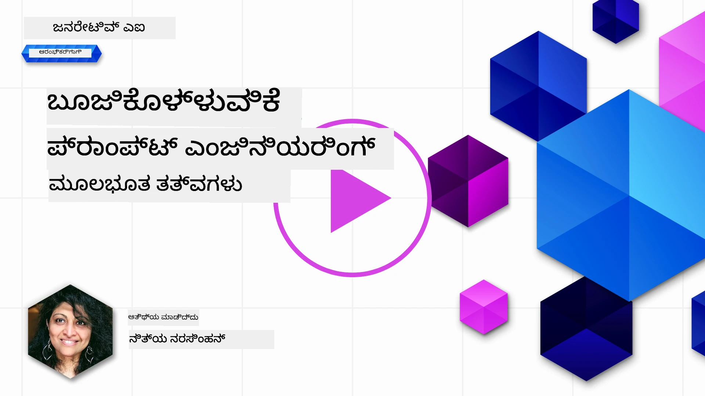
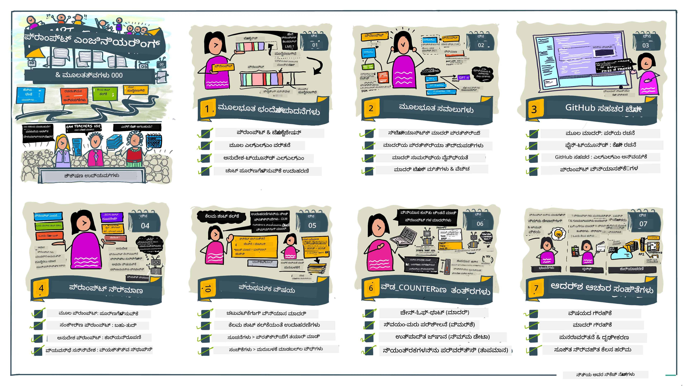
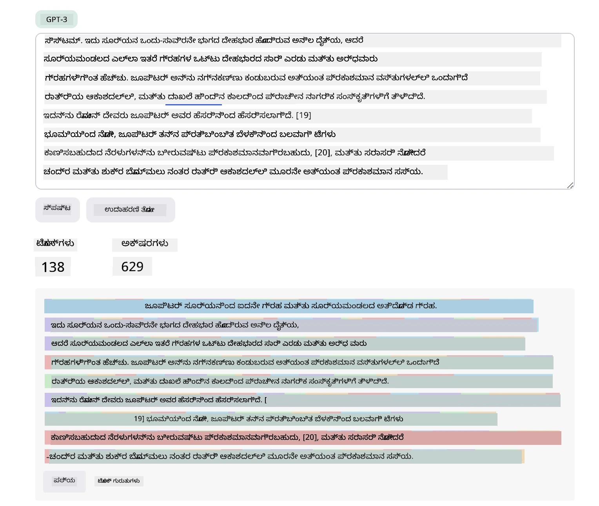
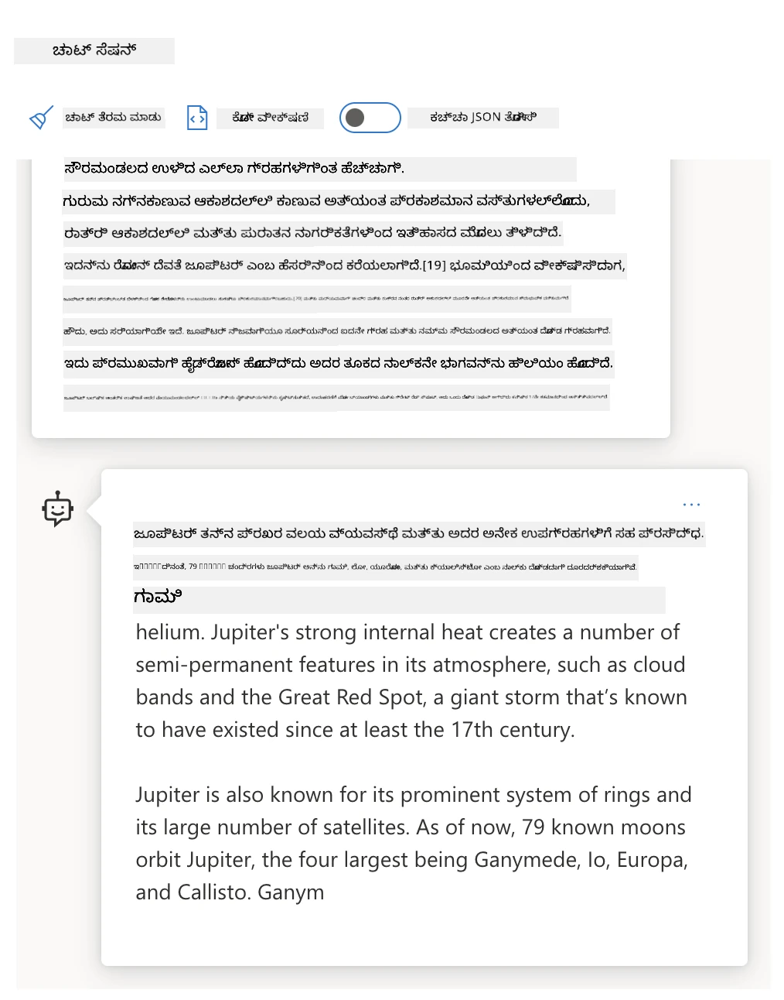
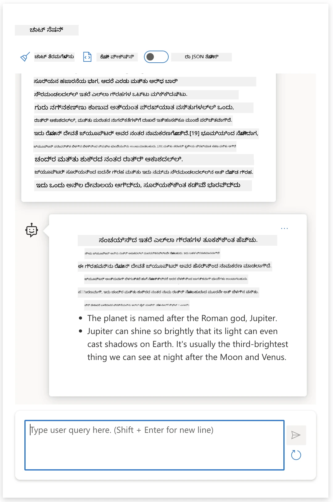
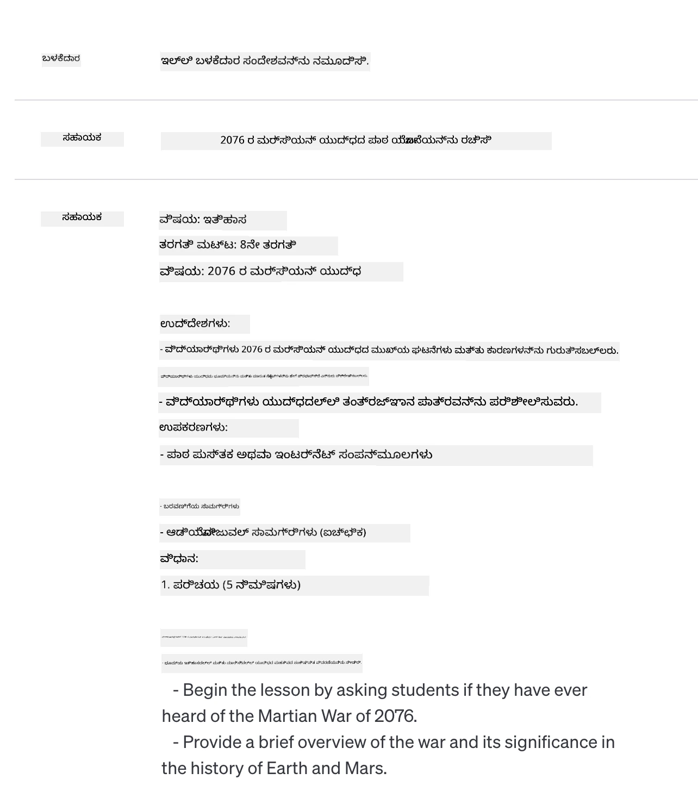
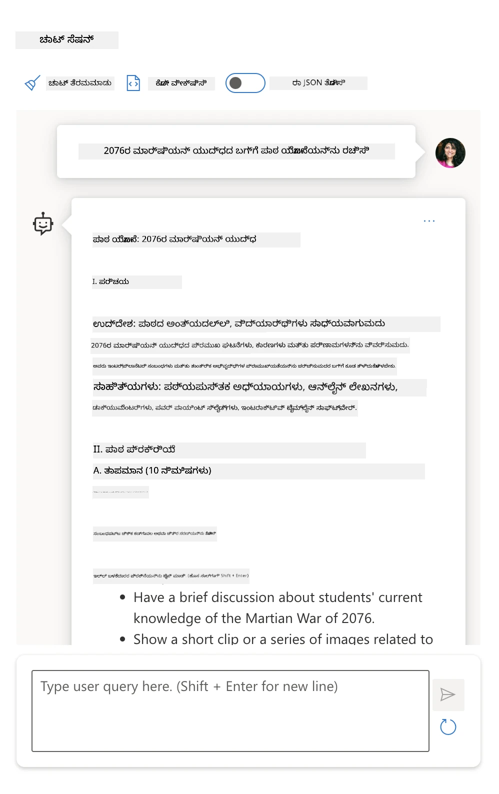
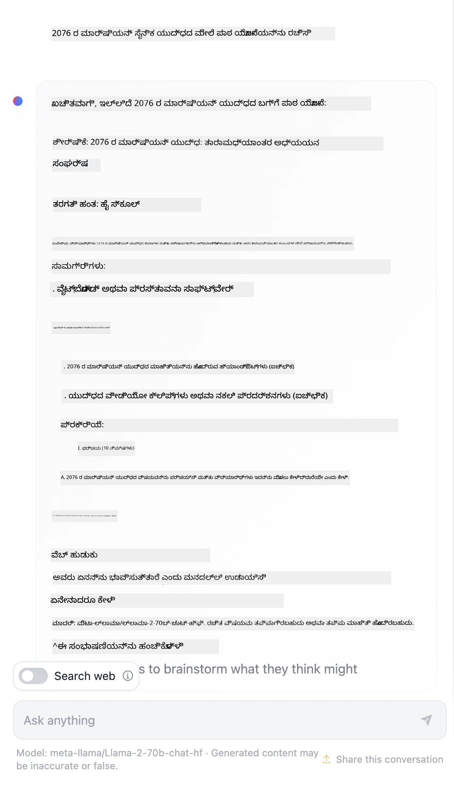

# ಪ್ರಾಂಪ್ಟ್ ಎಂಜಿನಿಯರಿಂಗ್ ಮೂಲತತ್ವಗಳು

[](https://youtu.be/GElCu2kUlRs?si=qrXsBvXnCW12epb8)

## ಪರಿಚಯ
ಈ ಮೋಡ್ಯೂಲ್ ಜನರೇಟಿವ್ AI ಮಾದರಿಗಳಲ್ಲಿ ಪರಿಣಾಮಕಾರಿ ಪ್ರಾಂಪ್ಟ್‌ಗಳನ್ನು ರಚಿಸುವ ಅವಶ್ಯಕ ತತ್ವಗಳು ಮತ್ತು ತಂತ್ರಗಳನ್ನು ಒಳಗೊಂಡಿದೆ. ನೀವು LLM ಗೆ ನಿಮ್ಮ ಪ್ರಾಂಪ್ಟ್ ಅನ್ನು ಹೇಗೆ ಬರೆಯುವುದೋ ಅದೂ ಮಹತ್ವವಾಗಿದೆ. ಸೂಕ್ಷ್ಮವಾಗಿ ರೂಪಿತಗೊಂಡ ಪ್ರಾಂಪ್ಟ್ ಉತ್ತಮ ಗುಣಮಟ್ಟದ ಪ್ರತಿಕ್ರಿಯೆಯನ್ನು ಪಡೆಯಬಹುದಾಗಿದೆ. ಆದರೆ _ಪ್ರಾಂಪ್ಟ್_ ಮತ್ತು _ಪ್ರಾಂಪ್ಟ್ ಎಂಜಿನಿಯರಿಂಗ್_ ಎಂಬ ಪದಗಳು ಏನನ್ನು ಅರ್ಥಮಾಡಿಕೊಳ್ಳುತ್ತವೆ? ಮತ್ತು ನಾನು LLM ಗೆ ಕಳುಹಿಸುವ ಪ್ರಾಂಪ್ಟ್ _ಇನ್ಪುಟ್_ ಅನ್ನು ನಾನು ಹೇಗೆ ಸುಧಾರಿಸಬಹುದು? ಈ ಅಧ್ಯಾಯ ಮತ್ತು ಮುಂದಿನ ಅಧ್ಯಾಯದಲ್ಲಿ ನಾವು ಈ ಪ್ರಶ್ನೆಗಳಿಗೆ ಉತ್ತರವನ್ನು ಹುಡುಕಲು ಯತ್ನಿಸುತ್ತೇವೆ.

_ಜನರೇಟಿವ್ AI_ ಬಳಕೆದಾರರ ವಿನಂತಿಗಳಿಗೆ ಪ್ರತಿಕ್ರಿಯೆಯಾಗಿ ಹೊಸ ವಿಷಯವನ್ನು (ಪಠ್ಯ, ಚಿತ್ರಗಳು, ಧ್ವನಿ, ಕೋಡ್ ಇತ್ಯಾದಿ) ಸೃಷ್ಟಿಸುವ ಸಾಮರ್ಥ್ಯ ಹೊಂದಿದೆ. ಇದು OpenAI ನ GPT ("ಜನರೇಟಿವ್ ಪ್ರಿ-ಟ್ರೇಂಡ್ ಟ್ರಾನ್ಸ್‌ಫಾರ್ಮರ್") ಸರಣಿಯಂತಹ _ಲಾರ್ಜ್ ಲ್ಯಾಂಗುಯೇಜ್ ಮಾದರಿಗಳನ್ನು_ ಬಳಸಿಕೊಂಡು ಹತ್ತಿರವಾದ ಪ್ರಾಕೃತಿಕ ಭಾಷೆ ಮತ್ತು ಕೋಡ್ ಬಳಕೆಗಾಗಿ ತರಬೇತಿ ಪಡೆದಿದೆ.

ಬಳಕೆದಾರರು ಈಗ ಈ ಮಾದರಿಗಳೊಂದಿಗೆ ಚಾಟ್ ಮುಂತಾದ ಪರಿಚಿತ ಮಾದರಿಗಳಲ್ಲಿ ಸಂವಹನ ಮಾಡಬಹುದು, ಯಾವುದೇ ತಾಂತ್ರಿಕ ಪರಿಣತಿ ಅಥವಾ ತರಬೇತಿ ಅಗತ್ಯವಿಲ್ಲದೆ. ಮಾದರಿಗಳು _ಪ್ರಾಂಪ್ಟ್ ಆಧಾರಿತವಾಗಿವೆ_ - ಬಳಕೆದಾರರು ಪಠ್ಯ ಇನ್ಪುಟ್ (ಪ್ರಾಂಪ್ಟ್) ಕಳುಹಿಸುತ್ತಾರೆ ಮತ್ತು AI ಪ್ರತಿಕ್ರಿಯೆ (ಪೂರ್ಣತೆ) ಪಡೆಯುತ್ತಾರೆ. ನಂತರ ಅವರು "AI ಜೊತೆಗೆ ಚಾಟ್" ಮಾಡಬಹುದು, ಬಹು-ತಿರುಗು ಸಂಭಾಷಣೆಯಲ್ಲಿ ಪ್ರಾಂಪ್ಟ್ ಅನ್ನು ಪರಿಷ್ಕರಿಸುವ ಮೂಲಕ ನಿರೀಕ್ಷಿಸಲಾದ ಉತ್ತರವನ್ನು ಹೊಂದುವವರೆಗೆ.

"ಪ್ರಾಂಪ್ಟ್‌ಗಳು" ಈಗ ಜನರೇಟಿವ್ AI ಆ್ಯಪ್ಸ್‌ಗಳ ಪ್ರಮುಖ _ಪ್ರೋಗ್ರಾಮಿಂಗ್ ಇಂಟರ್‌ಫೇಸ್_ ಆಗಿ ಪರಿಣಮಿಸುತ್ತಿವೆ, ಮಾದರಿಗಳಿಗೆ ಏನು ಮಾಡಬೇಕೆಂದು ಸೂಚಿಸುತ್ತಿವೆ ಮತ್ತು ಮರಳಿ ಬಂದ ಪ್ರತಿಕ್ರಿಯೆಗಳ ಗುಣಮಟ್ಟವನ್ನು ಪ್ರಭಾವಿಸುತ್ತಿವೆ. "ಪ್ರಾಂಪ್ಟ್ ಎಂಜಿನಿಯರಿಂಗ್" ಎಂಬುದು ವೇಗವಾಗಿ ಬೆಳೆಯುತ್ತಿರುವ ಅಧ್ಯಯನ ಕ್ಷೇತ್ರವಾಗಿದೆ, ಇದು ನಿರಂತರ ಮತ್ತು ಗುಣಮಟ್ಟದ ಪ್ರತಿಕ್ರಿಯೆಗಳಿಗಾಗಿ ಪ್ರಾಂಪ್ಟ್‌ಗಳ _ ವಿನ್ಯಾಸ ಮತ್ತು ಆಪ್ಟಿಮೈಜೆಷನ್_ ಮೇಲೆ ಗಮನ ಹರಿಸುತ್ತದೆ.

## ಕಲಿಕೆಯ ಗುರಿಗಳು

ಈ ಪಾಠದಲ್ಲಿ, ಪ್ರಾಂಪ್ಟ್ ಎಂಜಿನಿಯರಿಂಗ್ ಎಂದರೇನು, ಅದು ಯಾಕೆ ಮಹತ್ವವಿದೆ ಮತ್ತು ನೀಡಲಾದ ಮಾದರಿ ಮತ್ತು ಆ್ಯಪ್ಲಿಕೇಶನ್ ಗುರಿಗಾಗಿ ಪರಿಣಾಮಕಾರಿ ಪ್ರಾಂಪ್ಟ್‌ಗಳನ್ನು ಹೇಗೆ ತಯಾರಿಸುವುದು ಎಂಬುದನ್ನು ಕಲಿಯುತ್ತೇವೆ. ನಾವು ಪ್ರಾಂಪ್ಟ್ ಎಂಜಿನಿಯರಿಂಗ್‌ಗಾಗಿ ಮೂಲ ತತ್ವಗಳು ಮತ್ತು ಉತ್ತಮ ಅಭ್ಯಾಸಗಳನ್ನು ಅರ್ಥಮಾಡಿಕೊಳ್ಳುತ್ತೇವೆ - ಮತ್ತು ಜುಪಿಟರ್ ನೋಟ್ಬುಕ್‌ಗಳ ಸಂವಹನಾತ್ಮಕ "ಸ್ಯಾಂಡ್‌ಬಾಕ್ಸ್" ಪರಿಸರದ ಬಗ್ಗೆ ತಿಳಿದುಕೊಳ್ಳುತ್ತೇವೆ, ಅಲ್ಲಿ ನಾವು ಈ ತತ್ವಗಳನ್ನು ನಿಜವಾದ ಉದಾಹರಣೆಗಳಿಗೆ ಅನ್ವಯಿಸಿದಂತೆ ನೋಡಬಹುದು.

ಈ ಪಾಠದ ಕೊನೆಯಿಗೆ ನಾವು ಮುಂಬರುವುದಕ್ಕೆ ಸಾಧ್ಯವಾಗುತ್ತದೆ:

1. ಪ್ರಾಂಪ್ಟ್ ಎಂಜಿನಿಯರಿಂಗ್ ಎಂದರೇನು ಮತ್ತು ಅದು ಯಾಕೆ ಮುಖ್ಯವೋ ವಿವರಿಸುವುದು.
2. ಪ್ರಾಂಪ್ಟ್‌ನ ಅಂಶಗಳನ್ನು ಮತ್ತು ಅವು ಹೇಗೆ ಬಳಸುತ್ತಾರೆ ಎಂಬುದನ್ನು ವಿವರಣೆ ಮಾಡುವುದು.
3. ಪ್ರಾಂಪ್ಟ್ ಎಂಜಿನಿಯರಿಂಗ್‌ಗೆ ಉತ್ತಮ ಅಭ್ಯಾಸಗಳು ಮತ್ತು ತಂತ್ರಗಳನ್ನು ಕಲಿಯುವುದು.
4. ಕಲಿತ ತಂತ್ರಗಳನ್ನು ನಿಜ ಜೀವನ ಉದಾಹರಣೆಗಳಲ್ಲಿ OpenAI ಎಂಡ್ಪಾಯಿಂಟ್ ಬಳಸಿ ಅನ್ವಯಿಸುವುದು.

## ಪ್ರಮುಖ ಪದಗಳು

ಪ್ರಾಂಪ್ಟ್ ಎಂಜಿನಿಯರಿಂಗ್: AI ಮಾದರಿಗಳನ್ನು ಇಚ್ಛಿತ_Out_ಪುಟ್‌ಗಳನ್ನು ಉತ್ಪಾದಿಸಲು ಮಾರ್ಗದರ್ಶನ ನೀಡುವಕ್ಕಾಗಿ ಇನ್ಪುಟ್‌ಗಳನ್ನು ವಿನ್ಯಾಸಗೊಳಿಸುವುದು ಮತ್ತು ಪರಿಷ್ಕರಿಸುವ ಅಭ್ಯಾಸ.

ಟೋಕನೈಜೇಶನ್: ಪಠ್ಯವನ್ನು ಚಿಕ್ಕ ಘಟಕಗಳಾಗಿ ಪರಿವರ್ತಿಸುವ ಪ್ರಕ್ರಿಯೆ, ಇದನ್ನು ಟೋಕನ್ಗಳು ಎಂದು ಕರೆಯುತ್ತಾರೆ, ಮತ್ತು ಮಾದರಿ ಅವನ್ನು ಅರ್ಥಮಾಡಿಕೊಂಡು ಪ್ರಕ್ರಿಯೆಗೊಳಿಸಲು ಸಾಧ್ಯವಾಗುತ್ತದೆ.

ಇನ್ಸ್ಟ್ರಕ್ಷನ್-ಟ್ಯೂನ್ಡ್ LLMಗಳು: ವಿಶೇಷ ಸೂಚನೆಗಳೊಂದಿಗೆ ಸೂಕ್ಷ್ಮತೆಯುಳ್ಳ ಪ್ರತಿ-ಮಾನ LLMಗಳು, ಅವುಗಳ ಪ್ರತಿಕ್ರಿಯೆಯ ಸರಿಯಾಗಿರುವಿಕೆ ಮತ್ತು ಸಂಬಂಧಿತತೆಯನ್ನು ಸುಧಾರಿಸಲು ತರಬೇತಿ ಪಡೆದವು.

## ಕಲಿಕೆಯ ಸ್ಯಾಂಡ್‌ಬಾಕ್ಸ್

ಪ್ರಾಂಪ್ಟ್ ಎಂಜಿನಿಯರಿಂಗ್ ಪ್ರಸ್ತುತ ವಿಜ್ಞಾನಕ್ಕಿಂತಲೂ ಕಲೆ ಹೆಚ್ಚು. ಇದರ ಬಗ್ಗೆ ನಮಗೆ ಉತ್ತಮ ಅರ್ಥಮಾಡಿಕೊಳ್ಳಲು ಉತ್ತಮ ಮಾರ್ಗ ಎಂದರೆ _ಹೆಚ್ಚು ಅಭ್ಯಾಸ_ ಮಾಡುವುದು ಹಾಗೂ ಪ್ರಯೋಗ-ಮತ್ತೆ-ಪ್ರಯೋಗ ವಿಧಾನವನ್ನು ಅಳವಡಿಸಿಕೊಂಡು, ಅನ್ವಯ ಕ್ಷೇತ್ರ ಪರಿಣತಿ, ಶಿಫಾರಸು ಮಾಡಲಾದ ತಂತ್ರಗಳು ಮತ್ತು ಮಾದರಿ-ನಿರ್ದಿಷ್ಟ ಆಪ್ಟಿಮೈಜೆಷನ್ಗಳನ್ನು ಸಂಯೋಜಿಸುವುದು.

ಈ ಪಾಠದ ಜೊತೆಗೆ ಜುಪಿಟರ್ ನೋಟ್ಬುಕ್ ಒಂದು _ಸ್ಯಾಂಡ್‌ಬಾಕ್ಸ್_ ವಾತಾವರಣವನ್ನು ಒದಗಿಸುತ್ತದೆ, ಇದರಲ್ಲಿ ನೀವು ಕಲಿತ ಸಿದ್ಧಾಂತಗಳನ್ನು ತಿಳಿದುಕೊಳ್ಳಿ - ನೇರವಾಗಿ ಅಥವಾ ಕೊನೆಯ ಕೋಡ್ ಚಾಲೆಂಜ್‌ನಲ್ಲಿ ಪ್ರಯತ್ನಿಸಬಹುದು. ವ್ಯಾಯಾಮಗಳನ್ನು ನಿರ್ವಹಿಸಲು ನಿಮಗೆ ಬೇಕಾಗಿರುವವು:

1. **ಅಜೂರು OpenAI API ಕೀ** - ನಿಯೋಜಿತ LLM ಗೆ ಸರ್ವಿಸ್ ಎಂಡ್ಪಾಯಿಂಟ್.
2. **ಪೈಥಾನ್ ರನ್‌ಟೈಮ್** - ನೋಟ್ಬುಕ್ ಅನ್ನು ಕಾರ್ಯಗತಗೊಳಿಸಲು.
3. **ಸ್ಥಳೀಯ ವಾತಾವರಣ ವರ್ಸಸ್** - ಈಗಲೇ [SETUP](./../00-course-setup/02-setup-local.md?WT.mc_id=academic-105485-koreyst) ಹಂತಗಳನ್ನು ಪೂರ್ಣಗೊಳಿಸಿ ತಯಾರಾಗಿರಿ.

ನೋಟ್ಬುಕ್ ಶುರುಮಾಡಲುಸುಮನ್ಸುವ ವ್ಯಾಯಾಮಗಳೊಂದಿಗೆ ಬರುತ್ತದೆ - ಆದರೆ ನೀವು ನಿಮ್ಮದೇ _Markdown_ (ವಿವರಣೆ) ಮತ್ತು _Code_ (ಪ್ರಾಂಪ್ಟ್ ವಿನಂತಿಗಳು) ವಿಭಾಗಗಳನ್ನು ಸೇರಿಸಬಹುದು - ಹೆಚ್ಚುವರಿ ಉದಾಹರಣೆಗಳು ಅಥವಾ ಕಲ್ಪನೆಗಳನ್ನು ಪ್ರಯತ್ನಿಸಿ - ಮತ್ತು ಪ್ರಾಂಪ್ಟ್ ವಿನ್ಯಾಸದ ಮೇಲೆ ನಿಮ್ಮ ಅನುಭವವನ್ನು ವೃದ್ಧಿಸಿಕೊಳ್ಳಿ.

## ಚಿತ್ರಿತ ಮಾರ್ಗದರ್ಶಿ

ಈ ಪಾಠದಲ್ಲಿ ಯಾವ ಮುಖ್ಯ ವಿಷಯಗಳು ಒಳಗೊಂಡಿವೆ ಎಂಬ ವಿಶಾಲ ದೃಷ್ಟಿಕೋಣವನ್ನು ಪಡೆಯಲು ಬಯಸುತ್ತೀರಾ? ಈ ಚಿತ್ರಿತ ಮಾರ್ಗದರ್ಶಿಯನ್ನು ಪರಿಶೀಲಿಸಿ, ಇದು ಮುಖ್ಯ ವಿಷಯಗಳನ್ನು ಹಾಗೂ ಪ್ರತಿ ವಿಷಯದಲ್ಲಿ ನೀವು ಯೋಚಿಸಬೇಕಾದ ಮುಖ್ಯ ಅಂಶಗಳನ್ನು ತಿಳಿಸುತ್ತದೆ. ಪಾಠ ಮಾರ್ಗಸೂಚಿ ಮೂಲ ತತ್ವಗಳು ಮತ್ತು ಸವಾಲುಗಳನ್ನು ಅರ್ಥಮಾಡಿಕೊಳ್ಳುವುದರಿಂದ ಪ್ರಾಂಪ್ಟ್ ಎಂಜಿನಿಯರಿಂಗ್ ತಂತ್ರಗಳು ಮತ್ತು ಉತ್ತಮ ಅಭ್ಯಾಸಗಳಿಂದそれらに対処するまでを案内します。このガイドの「高度なテクニック」セクションは、本カリキュラムの次の章で取り上げられる内容を指しています。



## ನಮ್ಮ ಸ್ಟಾರ್ಟಪ್

ಈಗ, _ಈ ವಿಷಯ_ ನಮ್ಮ ಸ್ಟಾರ್ಟ್‌ಅಪ್ ಗುರಿ ಜೊತೆ ಹೇಗೆ ಸಂಬಂದಿಸಿದ್ದು ಅದರ ಬಗ್ಗೆ ಮಾತನಾಡೋಣ, ಅದು [ಶಿಕ್ಷಣಕ್ಕೆ AI ಆವಿಷ್ಕಾರ ತರಲು](https://educationblog.microsoft.com/2023/06/collaborating-to-bring-ai-innovation-to-education?WT.mc_id=academic-105485-koreyst) ಸಂಬಂದಿಸಿದೆ. ನಾವು _ವೈಯಕ್ತಿಕ ಕಲಿಕೆಗೆ_ ಚಾಲಿತ AI ಆ್ಯಪ್ಲಿಕೇಶನ್ಗಳನ್ನು ನಿರ್ಮಿಸಲು ಬಯಸುತ್ತೇವೆ - ಆದ್ದರಿಂದ ನಮ್ಮ ಆ್ಯಪ್ಲಿಕೇಶನ್ನಿನ ವಿಭಿನ್ನ ಬಳಕೆದಾರರು ಪ್ರಾಂಪ್ಟ್‌ಗಳನ್ನು "ವಿನ್ಯಾಸ" ಮಾಡಬಹುದಾದ ರೀತಿ ಯೋಚಿಸೋಣ:

- **ನಿರ್ವಾಹಕರು** AI ಗೆ _ಪಠ್ಯಕ್ರಮದ ಡೇಟಾವನ್ನು ವಿಶ್ಲೇಷಿಸಿ ಒಳಗೊಂಡಿದ್ದುಹೊರತಾಗಿ ಇರುವ ಭಾಗಗಳನ್ನು ಗುರುತಿಸಲು_ ಕೇಳಬಹುದು. AI ಫಲಿತಾಂಶಗಳನ್ನು ಸಾರಾಂಶಗೊಳಿಸಬಹುದು ಅಥವಾ ಕೋಡಿನೊಂದಿಗೆ ದೃಶ್ಯೀಕರಿಸಬಹುದು.
- **ಶಿಕ್ಷಕರ**ನು AI ಗೆ _ಲಕ್ಷ್ಯ ಗ್ರಾಹಕ ಮತ್ತು ವಿಷಯಕ್ಕಾಗಿ ಪಾಠ ಯೋಜನೆಯನ್ನು ಸೃಷ್ಟಿಸಲು_ ಕೇಳಬಹುದು. AI ನಿರ್ದಿಷ್ಟ ಸ್ವರೂಪದಲ್ಲಿ ವೈಯಕ್ತಿಕ ಯೋಜನೆಯನ್ನು ನಿರ್ಮಿಸುತ್ತದೆ.
- **ವಿದ್ಯಾರ್ಥಿಗಳು** AI ಗೆ _ಕಠಿಣ ವಿಷಯವನ್ನು ಶಿಕ್ಷಣಗೊಳ್ಳಲು_ ಕೇಳಬಹುದು. AI ಈಗ ವಿದ್ಯಾರ್ಥಿಗಳನ್ನು ಅವರ ಮಟ್ಟಕ್ಕೆ ಅನುಗುಣವಾಗಿರುವ ಪಾಠಗಳು, ಸಲಹೆಗಳು ಮತ್ತು ಉದಾಹರಣೆಗಳೊಂದಿಗೆ ಮಾರ್ಗದರ್ಶನ ಮಾಡುತ್ತದೆ.

ಇದು ಇಂಚು ಮಾತ್ರ. [Prompts For Education](https://github.com/microsoft/prompts-for-edu/tree/main?WT.mc_id=academic-105485-koreyst) ಅನ್ನು ಪರಿಶೀಲಿಸಿ - ಇದು ಶಿಕ್ಷಣ ತಜ್ಞರಿಂದ ಸಂಗ್ರಹಿಸಿರುವ ಓಪನ್-ಸೋರ್ಸ್ ಪ್ರಾಂಪ್ಟ್ ಗ್ರಂಥಾಲಯವಾಗಿದೆ - ಸಾಧ್ಯויותಗಳ ವಿಶಿಷ್ಟ ದೃಷ್ಟಿಕೋಣವನ್ನು ಪಡೆಯಲು! _ಅದ್ದಕ್ಕೂ ಕೆಲವು ಪ್ರಾಂಪ್ಟ್‌ಗಳನ್ನು ಸ್ಯಾಂಡ್‌ಬಾಕ್ಸ್‌ನಲ್ಲಿ ಅಥವಾ OpenAI ಪ್ಲೇಗ್ರೌಂಡ್ನಲ್ಲಿ ಚಲಾಯಿಸಿ ಏನಾಗುತ್ತದೆ ನೋಡಿರಿ!_

<!--
LESSON TEMPLATE:
This unit should cover core concept #1.
Reinforce the concept with examples and references.

CONCEPT #1:
Prompt Engineering.
Define it and explain why it is needed.
-->

## ಪ್ರಾಂಪ್ಟ್ ಎಂಜಿನಿಯರಿಂಗ್ ಏನು?

ನಾವು ಈ ಪಾಠವನ್ನು ಪ್ರಾಂಪ್ಟ್ ಎಂಜಿನಿಯರಿಂಗ್ ಎಂದರೆ ನಿರ್ದಿಷ್ಟ ಆ್ಯಪ್ಲಿಕೇಶನ್ ಗುರಿ ಮತ್ತು ಮಾದರಿ ಸಲುವಾಗಿ ನಿರಂತರ ಮತ್ತು ಗುಣಮಟ್ಟದ ಪ್ರತಿಕ್ರಿಯೆಗಳನ್ನು (ಪೂರ್ಣತೆ) ನೀಡಲು ಪಠ್ಯ ಇನ್ಪುಟ್‌ಗಳನ್ನು (ಪ್ರಾಂಪ್ಟ್‌ಗಳನ್ನು) _ವಿನ್ಯಾಸಗೊಳಿಸುವುದು ಮತ್ತು ಆಪ್ಟಿಮೈಸ್ ಮಾಡುವ ಪ್ರಕ್ರಿಯೆ_ ಎಂದು ವ್ಯಾಖ್ಯಾನಿಸುವುದರಿಂದ ಪ್ರಾರಂಭಿಸಿದ್ದೇವೆ. ಇದನ್ನು 2 ಹಂತಗಳ ಪ್ರಕ್ರಿಯೆ ಎಂದು ಮನಗಾಣಬಹುದು:

- ನಿರ್ದಿಷ್ಟ ಮಾದರಿ ಮತ್ತು ಗುರಿಗಾಗಿ ಪ್ರಾಥಮಿಕ ಪ್ರಾಂಪ್ಟ್ ಅನ್ನು _ವಿನ್ಯಾಸಗೊಳಿಸುವದು_
- ಪ್ರತಿಕ್ರಿಯೆಯ ಗುಣಮಟ್ಟವನ್ನು ಹೆಚ್ಚಿಸಲು ಪ್ರಾಂಪ್ಟ್ ಅನ್ನು ಕ್ರಮೇಣ _ಪರಿಷ್ಕರಿಸುವದು_

ಇದು ನಿಷ್ಠುರ-ಪ್ರಯೋಗ ಪ್ರಕ್ರಿಯೆಯಾಗಿದ್ದು, ಪರಿಷ್ಕೃತ ಫಲಿತಾಂಶಗಳನ್ನು ಪಡೆಯಲು ಬಳಕೆದಾರರ ಅಂತರಂಗ ಮತ್ತು ಪ್ರಯತ್ನ ಅಗತ್ಯವಿದೆ. ಆದ್ದರಿಂದ ಇದಕ್ಕೆ ಯಾಕೆ ಅಗತ್ಯ? ಆ ಪ್ರಶ್ನೆಗೆ ಉತ್ತರ ನೀಡಲು ನಾವು ಮೊದಲಿಗೆ ಮೂರು ತತ್ವಗಳನ್ನು ತಿಳಿದುಕೊಳ್ಳಬೇಕು:

- _ಟೋಕನೈಜೇಶನ್_ = ಮಾದರಿ ಪ್ರಾಂಪ್ಟ್ ಅನ್ನು "ಹೇಳುವ" ವಿಧಾನ
- _ಮೂಲ LLM ಗಳು_ = ಆಧಾರ ಮಾದರಿ ಪ್ರಾಂಪ್ಟ್ ಅನ್ನು "ಪ್ರಕ್ರಿಯೆ ಮಾಡುವ" ವಿಧಾನ
- _ಇನ್ಸ್ಟ್ರಕ್ಷನ್-ಟ್ಯೂನ್ಡ್ LLM ಗಳು_ = ಮಾದರಿ ಈಗ "ಕೆಲಸಗಳನ್ನು" ಹೇಗೆ ನೋಡಬಲ್ಲದು

### ಟೋಕನೈಜೇಶನ್

LLM‌ಗಳು ಪ್ರಾಂಪ್ಟ್‌ಗಳನ್ನು _ಟೋಕನ್‌ಗಳ ಸರಣಿಯಾಗಿ_ ನೋಡುತ್ತವೆ, ಮತ್ತು ವಿಭಿನ್ನ ಮಾದರಿಗಳು (ಅಥವಾ ಮಾದರಿಯ ಭೇದಗಳು) ಒಂದೇ ಪ್ರಾಂಪ್ಟ್ ಅನ್ನು ವಿಭಿನ್ನ ರೀತಿಯಲ್ಲಿ ಟೋಕನೈಜ್ ಮಾಡಬಹುದು. LLM‌ಗಳು ಟೋಕನ್ಗಳ ಮೇಲೆ ತರಬೇತಿ ಪಡೆದಿರುವುದು (ಕಚ್ಚಾ ಪಠ್ಯದಲ್ಲಿ ಅಲ್ಲ)ದರಿಂದ, ಪ್ರಾಂಪ್ಟ್‌ಗಳು ಹೇಗೆ ಟೋಕನೈಜ್ ಆಗುತ್ತವೆ എന്നುದು ತಯಾರಾಗುವ ಪ್ರತಿಕ್ರಿಯೆಯ ಗುಣಮಟ್ಟವನ್ನು ನೇರವಾಗಿ ಪ್ರಭಾವಿಸುತ್ತದೆ.

ಟೋಕನೈಜೇಶನ್ ಹೇಗೆ ಕೆಲಸ ಮಾಡುತ್ತದೆ ಎಂಬ ಅರ್ಥ ಪಡೆಯಲು, ಕೆಳಗಿನ [OpenAI Tokenizer](https://platform.openai.com/tokenizer?WT.mc_id=academic-105485-koreyst) போன்ற ಸಾಧನಗಳನ್ನು ಪ್ರಯತ್ನಿಸಿ. ನಿಮ್ಮ ಪ್ರಾಂಪ್ಟ್ ಹಂಚಿ - ಮತ್ತು ಎಲ್ಲಿಂದ ಟೋಕನ್ಗಳಾಗಿ ಪರಿವರ್ತನೆ ಆಗಿದ್ದು ಬಿಡು ಬಿಳುಪುಅಕ್ಷರಗಳು ಮತ್ತು विरಾಮಚಿಹ್ನೆಗಳ ದೃಷ್ಟಿಯಿಂದ ಗಮನಿಸಿ. ಈ ಉದಾಹರಣೆ ಹಳೆಯ LLM (GPT-3) ಅನ್ನು ತೋರಿಸುತ್ತದೆ - ಆದ್ದರಿಂದ ಹೊಸ ಮಾದರಿಯೊಂದರೊಂದಿಗೆ ಪ್ರಯತ್ನಿಸಿದರೆ ವಿಭಿನ್ನ ಫಲಿತಾಂಶಗಳು ಕಾಣಬಹುದು.



### ತತ್ವ: ಆಧಾರ ಮಾದರಿ

ಒಮ್ಮೆ ಪ್ರಾಂಪ್ಟ್ ಟೋಕನೈಜ್ ಆಗಿದ ಮೇಲೆ, ["ಮೂಲ LLM"](https://blog.gopenai.com/an-introduction-to-base-and-instruction-tuned-large-language-models-8de102c785a6?WT.mc_id=academic-105485-koreyst) (ಅಥವಾ ಆಧಾರ ಮಾದರಿ) ಪ್ರಮುಖ ಕಾರ್ಯದ ಅಂಗವಾಗಿ ಆ ಸರಣಿಯ ಟೋಕನ್ ಅನ್ನು ಭವಿಷ್ಯವಾಣಿ ಮಾಡುವುದಾಗಿದೆ. LLM ಗಳು ವಿಶಾಲ ಪಠ್ಯ ಡೇಟಾಸೆಟ್ಗಳ ಮೇಲೆ ತರಬೇತಿ ಪಡೆದಿರುವುದರಿಂದ, ಟೋಕನ್ಗಳ ನಡುವಿನಸಾಂಖ್ಯಿಕ ಸಂಬಂಧಗಳನ್ನು ಚೆನ್ನಾಗಿ ತಿಳಿದುಕೊಂಡು ಅವರು ಬಹುಮಾನಕ್ಕ ортನೆ ಭವಿಷ್ಯವಾಣಿ ಮಾಡಬಹುದು. ಅವರು ಪ್ರಾಂಪ್ಟ್‌ನ ಪದಗಳ ಅರ್ಥವನ್ನು ಅರ್ಥಮಾಡಿಕೊಳ್ಳುವುದಿಲ್ಲ; ಅವರು ಬುದ್ಧಿಮತ್ತೆಯ ನಾಗರಿಕತೆಯಿಂದ "ಪೂರ್ಣಗೊಳ್ಳುವ" ಮಾದರಿಯನ್ನು ಮಾತ್ರ ನಿಯಮಿತವಾಗಿ ನೋಡಿ ಭವಿಷ್ಯವನ್ನು ಊಹಿಸುತ್ತಾರೆ. ಬಳಕೆದಾರರ ಮಧ್ಯಸ್ಥಿಕೆ ಅಥವಾ ಪೂರ್ವ ನಿಯಮಿತ ಶರತ್ತಿಗೆ ತೊಡಗಿಸುವವರೆಗೂ ಅವರು ಸರಣಿಯ ಭವಿಷ್ಯವನ್ನು ಊಹಿಸುತ್ತಿರುತ್ತಾರೆ.

ಪ್ರಾಂಪ್ಟ್ ಆಧಾರಿತ ಪೂರ್ಣತೆ ಹೇಗೆ ಕೆಲಸ ಮಾಡುತ್ತದೆ ಎಂದು ನೋಡಬೇಕೇ? ಮೇಲ್ನೋಟದಲ್ಲಿರುವ ಪ್ರಾಂಪ್ಟ್ ಅನ್ನು ಅಜ್ಯೂರ್ OpenAI ಸ್ಟುಡಿಯೋ [_ಚಾಟ್ ಪ್ಲೇಗ್ರೌಂಡ್_](https://oai.azure.com/playground?WT.mc_id=academic-105485-koreyst)ನಲ್ಲಿ ಡಿಫಾಲ್ಟ್ ಸೆಟ್ಟಿಂಗ್ಸ್ ನೊಂದಿಗೆ ಎಂಟರ್ ಮಾಡಿ. ವ್ಯವಸ್ಥೆ ಪ್ರಾಂಪ್ಟ್ ಅನ್ನು ಮಾಹಿತಿಗಾಗಿ ವಿನಂತಿಗಳಾಗಿ ಪರಿಗಣಿಸುವಂತೆ ಹೊಂದಿಸಲಾಗಿದೆ - ಆದ್ದರಿಂದ ಈ ಸಂಧರ್ಭಕ್ಕೆ ಹೊಂದುವ ಪೂರ್ಣತೆಯನ್ನು ನೀವು ನೋಡಬಲ್ಲಿರಿ.

ಆದರೆ ಬಳಕೆದಾರನು ಕೆಲವು ನಿಯಮಗಳು ಅಥವಾ ಕಾರ್ಯ ಗುರಿಯನ್ನು ಪೂರೈಸುವ ನಿಖರವಾದ ವಿಷಯವನ್ನು ನೋಡಲು ಬಯಸದಿದ್ದರೆ? ಅಲ್ಲಿ _ಇನ್ಸ್ಟ್ರಕ್ಷನ್-ಟ್ಯೂನ್ಡ್_ LLM ಗಳು ಮುಖ್ಯ ಪಾತ್ರ ವಹಿಸುತ್ತವೆ.



### ತತ್ವ: ಇನ್ಸ್ಟ್ರಕ್ಷನ್ ಟ್ಯೂನ್ಡ್ LLM ಗಳು

[ಇನ್ಸ್ಟ್ರಕ್ಷನ್ ಟ್ಯೂನ್ಡ್ LLM](https://blog.gopenai.com/an-introduction-to-base-and-instruction-tuned-large-language-models-8de102c785a6?WT.mc_id=academic-105485-koreyst) ಮೂಲ ಮಾದರಿಯಿಂದ ಪ್ರಾರಂಭಿಸಿ, ಉದಾಹರಣೆಗಳು ಅಥವಾ ಇನ್ಪುಟ್/ಔಟ್ಪುಟ್ ಜೋಡಿಗಳಿಂದ (ಹಲವಾರು-ತಿರುಗು "ಸಂದೇಶಗಳು") ಅದನ್ನು ಸೂಕ್ಷ್ಮವಾಗಿ ತಯಾರಿಸುತ್ತದೆ, ಇದರಲ್ಲಿ ಸ್ಪಷ್ಟ ಸೂಚನೆಗಳನ್ನು ಹೊಂದಿರಬಹುದು - ಮತ್ತು AI ಪ್ರತಿಕ್ರಿಯೆ ಆ ಸೂಚನೆಯನ್ನು ಅನುಸರಿಸಲು ಪ್ರಯತ್ನಿಸುತ್ತದೆ.

ಇದು ಮಾನವ ಪ್ರತಿಕ್ರಿಯೆ ಪ್ರೋತ್ಸಾಹ (RLHF) ಮೀಮಾಂಸೆಯೊಂದಿಗೆ ತರಬೇತಿಯನ್ನು ಬಳಸುತ್ತದೆ, ಇದು ಮಾದರಿಯನ್ನು _ಸೂಚನೆಗಳನ್ನು ಅನುಸರಿಸಲು_ ಮತ್ತು _ಪ್ರತಿಕ್ರಿಯೆಯಿಂದ ಕಲಿಯಲು_ ತರಬೇತಿಗೊಳಿಸುತ್ತದೆ, ಹೀಗಾಗಿ ಇದು ಬಳಕೆದಾರರ ಗುರಿಗಳಿಗೆ ಹೊಂದುವಂತೆ ಉತ್ತಮ ಹಾಗೂ ಲಾಭಪಡುವ ಪ್ರತಿಕ್ರಿಯೆಗಳನ್ನು ಒದಗಿಸುತ್ತದೆ.

ಇದನ್ನು ಪ್ರಯತ್ನಿಸೋಣ - ಮೇಲಿನ ಪ್ರಾಂಪ್ಟ್ ಅನ್ನು ಮತ್ತೊಮ್ಮೆ ನೋಡಿರಿ, ಆದರೆ ಈಗ _ಸಿಸ್ಟಮ್ ಸಂದೇಶವನ್ನು_ ಕೆಳಕಂಡ ಸೂಚನೆಯಾಗಿದೆ:

> _ನೀವು ನೀಡಿರುವ ವಿಷಯವನ್ನು ಎರಡನೇ ತರಗತಿ ವಿದ್ಯಾರ್ಥಿಗಾಗಿ ಸಾರಾಂಶ ಮಾಡಿ. ಫಲಿತಾಂಶವನ್ನು 3-5 ಬುಲೆಟ್ ಪಾಯಿಂಟ್‌ಗಳು ಇರುವ ಒಂದು ಪ್ಯಾರಾಗ್ರಾಫ್ನಲ್ಲಿ ಇಡಿ._

ಈ ಫಲಿತಾಂಶವು ಆಕಾಂಕ್ಷಿತ ಗುರಿ ಮತ್ತು ಸ್ವರೂಪವನ್ನು ಪ್ರತಿಬಿಂಬಿಸುವುದನ್ನು ನೋಡಿ? ಶಿಕ್ಷಕನು ಈ ಪ್ರತಿಕ್ರಿಯೆಯನ್ನು ನೇರವಾಗಿ ತಮ್ಮ ತರಗತಿಯ ಸ್ಲೈಡ್‌ಗಳಲ್ಲಿ ಬಳಸಬಹುದು.



## ನಾವು ಯಾಕೆ ಪ್ರಾಂಪ್ಟ್ ಎಂಜಿನಿಯರಿಂಗ್ ಬೇಕಾಗುತ್ತದೆ?

ಈಗ ಪ್ರಾಂಪ್ಟ್‌ಗಳು LLM ಗಳು ಹೇಗೆ ಪ್ರಕ್ರಿಯೆ ಮಾಡುತ್ತವೆಯೋ ತಿಳಿದಿದ್ದಾಗ, ನಾವು ಯಾಕೆ ಪ್ರಾಂಪ್ಟ್ ಎಂಜಿನಿಯರಿಂಗ್ ಅಗತ್ಯವೋ ಮಾತಾಡೋಣ. ಉತ್ತರವು ಇದಾದರೆ, ಪ್ರಸ್ತುತ LLM ಗಳಲ್ಲಿ ಕೆಲವು ಸವಾಲುಗಳಿವೆ, ಅವು _ನಿರಂತರ ಮತ್ತು ವಿಶ್ವಾಸಾರ್ಹ ಪೂರ್ಣತೆಗಳನ್ನು_ ಸಾಧಿಸಲು ಪ್ರಾಂಪ್ಟ್ ರಚನೆ ಮತ್ತು ಆಪ್ಟಿಮೈಜೆಶನ್ ಗೆ ಪ್ರಯತ್ನ ಮಾಡದೇ ಹೆಚ್ಚು ಕಷ್ಟಕರವಾಗುತ್ತದೆ. ಉದಾಹರಣೆಗೆ:

1. **ಮಾದರಿ ಪ್ರತಿಕ್ರಿಯೆಗಳು ಸಾಂಖ್ಯಿಕಾಗತ**. _ಒಂದೇ ಪ್ರಾಂಪ್ಟ್_ ವಿಭಿನ್ನ ಮಾದರಿಗಳು ಅಥವಾ ಅವುಗಳ ಆವೃತ್ತಿಗಳೊಂದಿಗೆ ವಿಭಿನ್ನ ಪ್ರತಿಕ್ರಿಯೆಗಳನ್ನು ಉತ್ಪಾದಿಸಬಹುದು. ಇದೇ ಮಾದರಿಯನ್ನು ವಿವಿಧ ಸಮಯಗಳಲ್ಲಿ ಕೂಡ ವಿಭಿನ್ನ ಫಲಿತಾಂಶಗಳನ್ನು ನೀಡಬಹುದು._ಪ್ರಾಂಪ್ಟ್ ಎಂಜಿನಿಯರಿಂಗ್ ತಂತ್ರಗಳು ಈ ವ್ಯತ್ಯಾಸಗಳನ್ನು ಕಡಿಮೆಯಲ್ಲಿಕೊಳ್ಳಲು ಸಹಾಯ ಮಾಡುತ್ತವೆ_.

2. **ಮಾದರಿಗಳು ಅನುವಂಶಿಕ ಪ್ರತಿಕ್ರಿಯೆಗಳನ್ನು ರಚಿಸಬಹುದು**. ಮಾದರಿಗಳು _ವಿಶಾಲ ಆದರೆ ಸೀಮಿತ_ ಡೇಟಾಸೆಟ್‌ಗಳಲ್ಲಿ ತರಬೇತಿ ಪಡೆದಿರುವುದರಿಂದ, ತರಬೇತಿ ವ್ಯಾಪ್ತಿಗಿಂತ ಹೊರಗಿನ ಅಂಶಗಳ ಬಗ್ಗೆ ಜ್ಞಾನ ಇರಲಾರದು. ಪರಿಣಾಮವಾಗಿ, ಅವು ತಪ್ಪು, ಕಲ್ಪಿತ ಅಥವಾ ಸತ್ಯವಾದ ಸಂಗತಿಗಳ ವಿರುದ್ಧದ ಪ್ರತಿಕ್ರಿಯೆಯನ್ನು ನೀಡಬಹುದು. _ಪ್ರಾಂಪ್ಟ್ ಎಂಜಿನಿಯರಿಂಗ್ ತಂತ್ರಗಳು ಬಳಕೆದಾರರನ್ನು ಇಂತಹ ಅಸತ್ಯತೆಯನ್ನು ಗುರುತಿಸಲು ಮತ್ತು ನಿಯಂತ್ರಿಸಲು ಸಹಾಯ ಮಾಡುತ್ತದೆ ಉದಾ: AI ಹಕ್ಕುಪತ್ರಗಳು ಅಥವಾ ಯೋಚನೆ ಕೇಳಿಸುವ ಮೂಲಕ_.

3. **ಮಾದರಿಗಳ ಸಾಮರ್ಥ್ಯಗಳಲ್ಲಿ ವ್ಯತ್ಯಾಸ ಇರುತ್ತದೆ**. ಹೊಸ ಮಾದರಿಗಳು ಅಥವಾ ಪಂಕ್ತಿಗಳು ಹೆಚ್ಚಿನ ಸಾಮರ್ಥ್ಯಗಳನ್ನು ತರುತ್ತವೆ ಆದರೆ ಹೊಂದುವ ಮೂಲಕ ಖರ್ಚು ಮತ್ತು ಸಂಕೀರ್ಣತೆ ಹಾಗೂ ವೈಶಿಷ್ಟ್ಯಪೂರ್ಣ ಲಕ್ಷಣಗಳು ಬರುತ್ತವೆ. _ಪ್ರಾಂಪ್ಟ್ ಎಂಜಿನಿಯರಿಂಗ್ ಉತ್ತಮ ಅಭ್ಯಾಸಗಳು ಮತ್ತು ಕಾರ್ಯಪ್ರವಾಹಗಳನ್ನು ಅಭಿವೃದ್ಧಿಪಡಿಸಲು ಸಹಾಯ ಮಾಡುತ್ತದೆ, ಅವು ವ್ಯತ್ಯಾಸಗಳನ್ನು abstraact ಮಾಡುತ್ತವೆ ಮತ್ತು ಮಾದರಿ-ನಿರ್ದಿಷ್ಟ ಅವಶ್ಯಕತೆಗಳಿಗೆ ಅನುಗುಣವಾಗಿ ಘನಪಡುತ್ತವೆ_.

ಇದನ್ನು OpenAI ಅಥವಾ ಅಜ್ಯೂರ್ OpenAI ಪ್ಲೇಗ್ರೌಂಡ್ನಲ್ಲಿ ನೇರವಾಗಿ ನೋಡೋಣ:

- ಒಂದೇ ಪ್ರಾಂಪ್ಟ್ ಬಳಸಿ ವಿಭಿನ್ನ LLM ನಿಯೋಜನೆಗಳ (ಉದಾ. OpenAI, ಅಜ್ಯೂರ್ OpenAI, Hugging Face) ಬಗ್ಗೆ ಪ್ರಯತ್ನಿಸಿ - ನೀವು ವ್ಯತ್ಯಾಸಗಳನ್ನು ನೋಡಿದ್ದೀರಾ?
- ಒಂದೇ ಪ್ರಾಂಪ್ಟ್ ನಂತರ ಒಂದೇ LLM ನಿಯೋಜನೆಯಲ್ಲಿ (ಉದಾ. ಅಜ್ಯೂರ್ OpenAI ಪ್ಲೇಗ್ರೌಂಡ್) ಪುನರಾವರ್ತಿಸಿ - ಈ ವ್ಯತ್ಯಾಸಗಳು ಹೇಗೆ ಭಿನ್ನವಾಗುತ್ತವೆ?

### ಅಸತ್ಯತೆಯ ಉದಾಹರಣೆ

ಈ ಕೋರ್ಸ್‌ನಲ್ಲಿ ನಾವು **"ಅಸತ್ಯತೆ"** ಎಂಬ ಪದವನ್ನು ಬಳಸುತ್ತೇವೆ, ಅದು LLM ಗಳು ಕೆಲವೊಮ್ಮೆ ತಮ್ಮ ತರಬೇತಿ ಅಥವಾ ಇತರ ನಿಯಂತ್ರಣಗಳಿಂದಾಗಿ ವಾಸ್ತವಕ್ಕೆ ವಿರುದ್ಧವಾದ ತಪ್ಪು ಮಾಹಿತಿಯನ್ನು ಉತ್ಪಾದಿಸುವ ಪರಿಸ್ಥಿತಿಯನ್ನು ಸೂಚಿಸುತ್ತದೆ. ನೀವು ಜನಪ್ರಿಯ ಲೇಖನಗಳಲ್ಲಿ ಅಥವಾ ಸಂಶೋಧನಾ ಪತ್ರಿಕೆಗಳಲ್ಲಿ ಇದನ್ನು _"ಹ್ಯಾಲ್ಯೂಸಿನೇಷನ್ಸ್"_ ಎಂದು ಕೂಡ ಕೇಳಿರಬಹುದು. ಆದರೆ ನಾವು ಶಿಫಾರಸು ಮಾಡುವುದು _"ಅಸತ್ಯತೆ"_ ಪದವನ್ನು ಬಳಸುವುದೇ, ಇದರಿಂದ ನಾವು ಯಂತ್ರ-ಚಾಲಿತ ಫಲಿತಾಂಶಕ್ಕೆ ಮಾನವ-ಸಮಾನ ಗುಣವನ್ನು ತಪ್ಪಾಗಿ ಧಾರಣೆ ಮಾಡದಂತೆ ಮಾಡಿಕೊಂಡಿರಬಹುದು. ಇದು [ಜವಾಬ್ದಾರಿಯುತ AI ಮಾರ್ಗಸೂಚಿಗಳು](https://www.microsoft.com/ai/responsible-ai?WT.mc_id=academic-105485-koreyst)ನಿಗಿಂತಲೂ ಬಳಸುವ ಭಾಷೆಯ ಒಂದು ಮೂಲಭೂತ ನಿಯಮವಾಗಿದೆ, ಕೆಲ ಸಂದರ್ಭಗಳಲ್ಲಿ ಅಸ","\u200cಮಾನುಷಿಕ ಅಥವಾ ಅಪ್ರಿಯತೆಯುಳ್ಳ ಪದಗಳು ತಪ್ಪಿಸಲ್ಪಡುವಂತೆ.

ಅಸತ್ಯತೆ ಹೇಗೆ ಕಾರ್ಯನಿರ್ವಹಿಸುತ್ತದೆ ಎನ್ನುವುದರ ಒಮ್ಮೆ ಕಾಣಬೇಕೇ? ಉಪನ್ಯಾಯದಲ್ಲಿ ಇರದ ವಿಷಯದ ಬಗ್ಗೆ ವಿಷಯ ರಚಿಸಲು AI ಗೆ ಸೂಚಿಸುವ ಪ್ರಾಂಪ್ಟ್ ಬಗ್ಗೆ ಯೋಚಿಸಿ (ಹೀಗೆಯೇ ಅದು ತರಬೇತಿ ಡೇಟಾ ಸೆಟ್ ನಲ್ಲಿ ಇಲ್ಲದಿರುವುದು ಖಚಿತವಾಗುತ್ತದೆ). ಉದಾಹರಣೆಗೆ - ನಾನು ಈ ಪ್ರಾಂಪ್ಟ್ ಪ್ರಯತ್ನಿಸಿದೆ:

> **ಪ್ರಾಂಪ್ಟ್:** 2076 ರ ಮಾರ್ಥಿಯನ್ ಯುದ್ಧ ಕುರಿತು ಪಾಠ ಯೋಜನೆ ರಚಿಸಿ.
ಒಂದು ವೆಬ್ ಶೋಧನೆ ನನಗೆMartian ಯುದ್ಧಗಳು ಕುರಿತು ಕಲ್ಪಿತ ಕಥೆಗಳು (ಉದಾಹರಣೆಗೆ, ಟೆಲಿವಿಷನ್ ಸರಣಿಗಳು ಅಥವಾ ಪುಸ್ತಕಗಳು)ವರೆದಿವೆ ಎಂದು ತೋರಿಸಿತು - ಆದರೆ 2076 ರಲ್ಲಿ ಯಾವುದೂ ಇಲ್ಲ. ಸಾಮಾನ್ಯ ಬುದ್ಧಿಮತ್ತೆ ನಮಗೆ 2076 _ಭವಿಷ್ಯದಲ್ಲಿದೆ_ ಎಂದು ಹೇಳಿದರು ಮತ್ತು ಆಗ, ನಿಜವಾದ ಘಟನೆಯೊಂದಿಗೂ ಸಂಬಂಧಿಸಲಾಗಿದೆ ಅಥವಾ ಇರಬಾರದುದಾಗಿದೆ.

ಹೀಗೆ ಈ ಪ್ರಾಂಪ್ಟ್ ಅನ್ನು ವಿವಿಧ LLM ಪೂರೈಕೆದಾರರೊಂದಿಗೆ ರನ್ ಮಾಡಿದಾಗ ಏನಾಗುತ್ತದೆ?

> **ಪ್ರತಿಕ್ರಿಯೆ 1**: OpenAI ಪ್ಲೇಗ್ರೌಂಡ್ (GPT-35)



> **ಪ್ರತಿಕ್ರಿಯೆ 2**: ಅಜೂರ್ OpenAI ಪ್ಲೇಗ್ರೌಂಡ್ (GPT-35)



> **ಪ್ರತಿಕ್ರಿಯೆ 3**: ಹಗ್ಗಿಂಗ್ ಫೇಸ್ ಚಾಟ್ ಪ್ಲೇಗ್ರೌಂಡ್ (ಲಲ್ಮಾ-2)



ನಿರೀಕ್ಷಿಸಿದಂತೆ, ಪ್ರತಿ ಮಾದರಿ (ಅಥವಾ ಮಾದರಿ ಸಂಸ್ಕರಣೆ) ಸ್ವಲ್ಪ ವಿಭಿನ್ನ ಪ್ರತಿಕ್ರಿಯೆಗಳನ್ನು ಉಂಟುಮಾಡುತ್ತದೆ, ಇದಕ್ಕೆ ಕಾರಣ ಸ್ಥೋಚ್ಯಾಸಂಕೀಯ ವರ್ತನೆ ಮತ್ತು ಮಾದರಿ ಸಾಮರ್ಥ್ಯದ ವ್ಯತ್ಯಾಸಗಳು. ಉದಾಹರಣೆಗೆ, ಒಂದು ಮಾದರಿ 8ನೇ ತರಗತಿಯ ಪ್ರೇಕ್ಷಕರನ್ನು ಗುರಿಯಾಗಿಸಿಕೊಂಡಿದ್ದರೆ ಮತ್ತೊಂದೊಂದು ಮಾದರಿ ಹೈಸ್ಕೂಲ್ ವಿದ್ಯಾರ್ಥಿಯನ್ನು ಊಹಿಸಿದೆ. ಆದರೆ ಮೂರು ಮಾದರಿಗಳು ಎಲ್ಲವೂ ಅನಾರ್ಹ ಬಳಕೆದಾರನಿಗೆ ಈ ಘಟನೆಯು ನಿಜವಾದದ್ದು ಎಂದು ನಂಬಿಸಲು ಸಾಧ್ಯವಾದಂತಹ ಪ್ರತಿಕ್ರಿಯೆಗಳನ್ನು ರಚಿಸಿದವು.

ಮುಂದಿನ ಮಟ್ಟದ ಪ್ರಾಂಪ್ಟ್ ಇಂಜಿನಿಯರಿಂಗ್ ತಂತ್ರಗಳು, ಹೀಗಾದರೆ _ಮೆಟಾಪ್ರಾಂಪ್ಟಿಂಗ್_ ಮತ್ತು _ತಾಪಮಾನ ಸಂರಚನೆ_, ಕೆಲವಷ್ಟು ಮೇಲ್ವಿಚಾರಣೆಯನ್ನು ಕಡಿಮೆ ಮಾಡಬಹುದು. ಹೊಸ ಪ್ರಾಂಪ್ಟ್ ಇಂಜಿನಿಯರಿಂಗ್ _ವಾಸ್ತುಶಿಲ್ಪಗಳು_ ಸಹ ಹೊಸ ಸಾಧನಗಳು ಮತ್ತು ತಂತ್ರಗಳನ್ನು ಪ್ರಾಂಪ್ಟ್ ಪ್ರವಾಹಕ್ಕೆ ಸುಸಜ್ಜಿತವಾಗಿ ಒಳಗೆ ಸೇರಿಸುವ ಮೂಲಕ ಈ ಪರಿಣಾಮಗಳನ್ನು ಹಾಗು ಕಡಿಮೆಮಾಡುತ್ತವೆ.

## ಪ್ರಕರಣ ಅಧ್ಯಯನ: GitHub ಕೊಪಿಲಾಟ್

ನಾವು ಈ ವಿಭಾಗವನ್ನು ಮುಗಿಸುತ್ತಾ, ಪ್ರಾಂಪ್ಟ್ ಇಂಜಿನಿಯರಿಂಗ್ ವಾಸ್ತವಿಕ ಜಗತ್ತಿನ ಪರಿಹಾರಗಳಲ್ಲಿ ಹೇಗೆ ಉಪಯೋಗವಾಗುತ್ತದೆ ಎಂಬುದನ್ನು ಕೊಂಚ ತಿಳಿದಿಕೊಳ್ಳೋಣ, ಒಂದು ಪ್ರಕರಣ ಅಧ್ಯಯನವನ್ನು ನೋಡೋಣ: [GitHub ಕೊಪಿಲಾಟ್](https://github.com/features/copilot?WT.mc_id=academic-105485-koreyst).

GitHub ಕೊಪಿಲಾಟ್ ನಿಮ್ಮ "AI ಜೋಡಿ ಪ್ರೋಗ್ರಾಮರ್" - ಇದು ಟೆಕ್ಸ್ಟ್ ಪ್ರಾಂಪ್ಟ್ ಗಳನ್ನು ಕೋಡ್ ಪೂರ್ಣಗೊಳಿಕೆಗಳಾಗಿ ಪರಿವರ್ತಿಸುತ್ತದೆ ಮತ್ತು ನಿಮ್ಮ ಅಭಿವೃದ್ಧಿ ಪರಿಸರದಲ್ಲಿ (ಉದಾ: Visual Studio Code) ಹಮ್ಮಿಕೊಳ್ಳಲಾಗಿದೆ. ಕೆಳಗಿನ ಬ್ಲಾಗ್ ಸರಣಿಗಳಲ್ಲಿ ದಾಖಲಿಸಿದಂತೆ, ಮೊದಲ ಸಂಸ್ಕರಣೆ OpenAI Codex ಮಾದರಿಯನ್ನು ಆಧರಿಸಿದ್ದು - ಎಂಜಿನಿಯರ್ ಗಳು ಶೀಘ್ರವೇ ಮಾದರಿಯನ್ನು ಉತ್ತಮಗೊಳಿಸಲು ಮತ್ತು ಉತ್ತಮ ಪ್ರಾಂಪ್ಟ್ ಇಂಜಿನಿಯರಿಂಗ್ ತಂತ್ರಗಳನ್ನು ಅಭಿವೃದ್ಧಿಪಡಿಸುವ ಅಗತ್ಯವನ್ನು ಅರಿತು, ಕೋಡ್ ಗುಣಮಟ್ಟವನ್ನು ಹೆಚ್ಚಿಸುವಲ್ಲಿ ಗಮನ ಹರಿಸಿದ್ದರು. ಜುಲೈನಲ್ಲಿ, Codex ಮೇಲಿದೆಂದು ಮತ್ತಷ್ಟು ವೇಗದ ಕ್ರಿಯಾತ್ಮಕ ಸಲಹೆಗಳಿಗಾಗಿ ಅವರು [ಸುಧಾರಿತ AI ಮಾದರಿಯನ್ನು](https://github.blog/2023-07-28-smarter-more-efficient-coding-github-copilot-goes-beyond-codex-with-improved-ai-model/?WT.mc_id=academic-105485-koreyst) ಉದ್ಘಾಟಿಸಿದರು.

ಅವರ ಕಲಿಕಾ ಪ್ರಯಾಣವನ್ನು ಮ 순ದ್ ಓದುತ್ತಿರಿ.

- **ಮೇ 2023** | [GitHub Copilot ನಿಮ್ಮ ಕೋಡ್ ಅನ್ನು ಚೆನ್ನಾಗಿ ಅರ್ಥಮಾಡಿಕೊಂಡಿದೆ](https://github.blog/2023-05-17-how-github-copilot-is-getting-better-at-understanding-your-code/?WT.mc_id=academic-105485-koreyst)
- **ಮೇ 2023** | [GitHub ಒಳಗಡೆ: GitHub Copilot ಹಿಂದೆ LLM ಗಳೊಂದಿಗೆ ಕೆಲಸ](https://github.blog/2023-05-17-inside-github-working-with-the-llms-behind-github-copilot/?WT.mc_id=academic-105485-koreyst).
- **ಜೂನ್ 2023** | [GitHub Copilot ಗೆ ಉತ್ತಮ ಪ್ರಾಂಪ್ಟ್ ಹೇಗೆ ಬರೆಯುವುದು](https://github.blog/2023-06-20-how-to-write-better-prompts-for-github-copilot/?WT.mc_id=academic-105485-koreyst).
- **ಜುಲೈ 2023** | [.. GitHub Copilot Codex ಮೇಲಿದೆಂದು ಸುಧಾರಿತ AI ಮಾದರಿಯೊಂದಿಗೆ](https://github.blog/2023-07-28-smarter-more-efficient-coding-github-copilot-goes-beyond-codex-with-improved-ai-model/?WT.mc_id=academic-105485-koreyst)
- **ಜುಲೈ 2023** | [ಡೆವಲಪರ್‌ಗಳಿಗೆ ಪ್ರಾಂಪ್ಟ್ ಇಂಜಿನಿಯರಿಂಗ್ ಮತ್ತು LLM ಗಳು ಗೈಡ್](https://github.blog/2023-07-17-prompt-engineering-guide-generative-ai-llms/?WT.mc_id=academic-105485-koreyst)
- **ಸೆಪ್ಟೆಂಬರ್ 2023** | [ಎಂಟರ್‌ಪ್ರೈಸ್ LLM ಅಪ್ಲಿಕೇಶನ್ ನಿರ್ಮಾಣ ಹೇಗೆ: GitHub Copilot ನಿಂದ ಪಾಠಗಳು](https://github.blog/2023-09-06-how-to-build-an-enterprise-llm-application-lessons-from-github-copilot/?WT.mc_id=academic-105485-koreyst)

ನೀವು ಅವರ [ಇಂಜಿನಿಯರಿಂಗ್ ಬ್ಲಾಗ್](https://github.blog/category/engineering/?WT.mc_id=academic-105485-koreyst) ಓದಬಹುದು, ಇದರಲ್ಲಿ [ಇದೆಯಂತಹ](https://github.blog/2023-09-27-how-i-used-github-copilot-chat-to-build-a-reactjs-gallery-prototype/?WT.mc_id=academic-105485-koreyst) ಪೋಸ್ಟ್ಗಳಿವೆ, ಅದು ಈ ಮಾದರಿಗಳು ಮತ್ತು ತಂತ್ರಗಳನ್ನು ವಾಸ್ತವಿಕ ಜಗತ್ತಿನ ಅಪ್ಲಿಕೇಶನ್‌ಗಳಿಗೆ ಹೇಗೆ _ಅನ್ವಯಿಸಿವೆ_ ಎಂಬುದನ್ನು ತೋರಿಸುತ್ತದೆ.

---

<!--
ಪಾಠ ಮಾದರಿ:
ಈ ಘಟಕವು ಕಾಂಸೆಪ್ಟ್ #2 ಅನ್ನು ಒಳಗೊಂಡಿರಬೇಕು.
ಉದಾಹರಣೆಗಳು ಮತ್ತು ಉಲ್ಲೇಖಗಳಿಂದ ಕಾಂಸೆಪ್ಟ್ ಅನ್ನು ಬಲಪಡಿಸಿ.

ಕಾಂಸೆಪ್ಟ್ #2:
ಪ್ರಾಂಪ್ಟ್ ವಿನ್ಯಾಸ.
ಉದಾಹರಣೆಗಳೊಂದಿಗೆ ಚಿತ್ರಿತ.
-->

## ಪ್ರಾಂಪ್ಟ್ ರಚನೆ

ನಾವು ಕಂಡಿದ್ದೇವೆ ಪ್ರಾಂಪ್ಟ್ ಇಂಜಿನಿಯರಿಂಗ್ ಯಾಕೆ ಪ್ರಮುಖವಾಗಿದೆ ಎಂದು - ಈಗ ಪ್ರಾಂಪ್ಟ್‌ಗಳು ಹೇಗೆ _ರಚಿಸಲಾಗುತ್ತವೆ_ ಎಂಬುದನ್ನು ಅರ್ಥಮಾಡಿಕೊಳ್ಳೋಣ, ಇದರಿಂದ ನಾವು ಹೆಚ್ಚು ಪರಿಣಾಮಕಾರಿ ಪ್ರಾಂಪ್ಟ್ ವಿನ್ಯಾಸಕ್ಕೆ ವಿಭಿನ್ನ ತಂತ್ರಗಳನ್ನು ಮೌಲ್ಯಮಾಪನ ಮಾಡಬಹುದು.

### ಮೂಲ ಭೂಮಿಕ ಪ್ರಾಂಪ್ಟ್

ನಿರ್ದಿಷ್ಟ ಒಳಗಿನ ಯಾವುದೇ ಸೇವಾ ಸನ್ನಿವೇಶವಿಲ್ಲದೆ, ಮಾದರಿಗೆ ಕಳುಹಿಸಲಾದ ಟೆಕ್ಸ್ಟ್ ಇನ್‌ಪುಟ್‌ನೊಂದಿಗೆ ಆರಂಭಿಸೋಣ. ಉದಾಹರಣೆಗೆ - ನಾವು US ರಾಷ್ಟ್ರೀಯ ಗೀತೆಯ ಪ್ರಾರಂಭದ ಕೆಲವು ಪದಗಳನ್ನು OpenAI [Completion API](https://platform.openai.com/docs/api-reference/completions?WT.mc_id=academic-105485-koreyst) ಗೆ ಕಳುಹಿಸಿದಾಗ, ಅದು ತಕ್ಷಣ ಮುಂದಿನ ಸಾಲುಗಳಿಂದ ಉತ್ತರವನ್ನು _ಪೂರ್ಣಗೊಳಿಸುತ್ತದೆ_, ಮೂಲ ಭವಿಷ್ಯವಾಣಿ ವರ್ತನೆಯೊ೦ದನ್ನು ಪ್ರದರ್ಶಿಸುತ್ತದೆ.

| ಪ್ರಾಂಪ್ಟ್ (ಇನ್‌ಪುಟ್)       | ಪೂರ್ಣಗೊಳಿಸುವಿಕೆ (ಆઉಟ್‌ಪುಟ್)                                                                                                          |
| :------------------------- | :----------------------------------------------------------------------------------------------------------------------------------- |
| Oh say can you see         | "The Star-Spangled Banner," ಇಂಗ್ಲಿಸಿನ ಐಕ್ಯ ಸಂಸ್ಥಾನದ ರಾಷ್ಟ್ರೀಯ ಗೀತೆಯ ಮೊದಲ ಸಾಲುಗಳನ್ನು ನೀವು ಪ್ರಾರಂಭಿಸುತ್ತಿರುವಂತೆ ಕೇಳಿಸುತ್ತದೆ. ಸಂಪೂರ್ಣ ಗೀತೆ... |

### ಸಂಕೀರ್ಣ ಪ್ರಾಂಪ್ಟ್

ಈಗ ಆ ಮೂಲಭೂತ ಪ್ರಾಂಪ್ಟ್ ಗೆ ಸನ್ನಿವೇಶ ಮತ್ತು ಸೂಚನೆಗಳನ್ನು ಸೇರಿಸೋಣ. [ಚಾಟ್ ಪೂರ್ಣಗೊಳಿಸುವಿಕೆ API](https://learn.microsoft.com/azure/ai-services/openai/how-to/chatgpt?WT.mc_id=academic-105485-koreyst) ನಿಂದ ನಾವು ಸಂಕೀರ್ಣ ಪ್ರಾಂಪ್ಟ್ ಅನ್ನು _ಸಂದೇಶಗಳ_ ಸಂಕಲನವಾಗಿ ರಚಿಸಬಹುದು:

- ಒಳನಿಗೆ/ಬಾಹ್ಯಗೆ ಜೋಡಣೆಗಳು _ಬಳಕೆದಾರ_ ಒಳನಿಗೆ ಮತ್ತು _ಸಹಾಯಕ_ ಪ್ರತಿಕ್ರಿಯೆಗಳನ್ನು ಪ್ರತಿಬಿಂಬಿಸುತ್ತವೆ.
- ವ್ಯವಸ್ಥೆ ಸಂದೇಶದಿಂದ ಸಹಾಯಕರ ನಡೆ ಅಥವಾ ವ್ಯಕ್ತಿತ್ವದ ಸನ್ನಿವೇಶವನ್ನು ನಿರ್ಧರಿಸಲಾಗುತ್ತದೆ.

ಈ ವಿನಂತಿ ಕೆಳಗಿನ ರೂಪದಲ್ಲಿ ಇದೆ, ಅಲ್ಲಿ _ಟೋಕನೈಸೇಶನ್_ ಸಂಭಾಷಣೆಯ ಸನ್ನಿವೇಶದಿಂದ ಸಂಬಂಧಿತ ಮಾಹಿತಿಯನ್ನು ಪರಿಣಾಮಕಾರಿಯಾಗಿ ಸೆರೆಹಿಡಿಯುತ್ತದೆ. ಈಗ, ವ್ಯವಸ್ಥೆಯ ಸನ್ನಿವೇಶವನ್ನು ಬದಲಾಯಿಸುವುದು ಪೂರ್ಣಗೊಳಿಸುವಿಕೆಯ ಗುಣಮಟ್ಟಕ್ಕೆ ಬಲವಾದ ಪರಿಣಾಮ ನೀಡಬಹುದು, ಬಳಕೆದಾರರ ಒಳನಿಗೆಗೆ ನೀಡಿದ ಪ್ರಮಾಣದಂತೆ.

```python
response = openai.chat.completions.create(
    model="gpt-3.5-turbo",
    messages=[
        {"role": "system", "content": "You are a helpful assistant."},
        {"role": "user", "content": "Who won the world series in 2020?"},
        {"role": "assistant", "content": "The Los Angeles Dodgers won the World Series in 2020."},
        {"role": "user", "content": "Where was it played?"}
    ]
)
```

### ಸೂಚನಾ ಪ್ರಾಂಪ್ಟ್

ಮೇಲಿನ ಉದಾಹರಣೆಗಳಲ್ಲಿ, ಬಳಕೆದಾರರ ಪ್ರಾಂಪ್ಟ್ ಸರಳ ಟೆಕ್ಸ್ಟ್ ಪ್ರಶ್ನೆಯಾಗಿ ಇತ್ತು, ಇದು ಮಾಹಿತಿ ವಿನಂತಿಯಾಗಿಯೇ ಅರ್ಥ ಮಾಡಿಕೊಳ್ಳಬಹುದು. _ಸೂಚನಾ_ ಪ್ರಾಂಪ್ಟ್‌ಗಳು, ನಾವು ಆ ಟೆಕ್ಸ್ಟ್ ಅನ್ನು ಕಾರ್ಯವನ್ನು ವಿವರವಾಗಿ ನಮೂದಿಸಲು ಬಳಸಬಹುದು, AI ಯಿಗೆ ಉತ್ತಮ ಮಾರ್ಗದರ್ಶನ ನೀಡಲು. ಇಲ್ಲಿದೆ ಒಂದು ಉದಾಹರಣೆ:

| ಪ್ರಾಂಪ್ಟ್ (ಇನ್‌ಪುಟ್)                                                                                           | ಪೂರ್ಣಗೊಳಿಸುವಿಕೆ (ಆઉಟ್‌ಪುಟ್)                                                                            | ಸೂಚನಾ ವಿಧ            |
| :------------------------------------------------------------------------------------------------------------ | :----------------------------------------------------------------------------------------------------- | :--------------------- |
| ನಾಗರಿಕ ಯುದ್ಧದ ವರ್ಣನೆ ಬರೆವನು                                                                                  | _ಸರಳ ಪ್ರಬಂಧವನ್ನು ಹಿಂತಿರುಗಿಸಿತು_                                                                        | ಸರಳ                   |
| ನಾಗರಿಕ ಯುದ್ಧದ ವರ್ಣನೆ ಬರೆವು. ಮುಖ್ಯ ದಿನಾಂಕಗಳು ಮತ್ತು ಘಟನೆಗಳನ್ನು ಒದಗಿಸಿ ಮತ್ತು ಅವುಗಳ ಮಹತ್ವವನ್ನು ವಿವರಿಸಿ                                                               | _ಪರಿಚ್ಛೇದ ಮತ್ತು ಪ್ರಮುಖ ಘಟನೆಗಳ ದಿನಾಂಕಗಳೂ ವಿವರಣೆಗಳೂ ಪಟ್ಟಿಯಾಗಿ ಹಿಂತಿರುಗಿಸಲಾಯಿತು_                         | ಸಂಕೀರ್ಣ               |
| 1 ಪರಿಚ್ಛೇದದಲ್ಲಿ ನಾಗರಿಕ ಯುದ್ಧದ ವರ್ಣನೆ ಬರೆ. 3 ಮಕ್ಕಳು ಮಹತ್ವದ ದಿನಾಂಕಗಳು ಮತ್ತು ಅವುಗಳ ಉತ್ತರವಿಲಾಸಗಳೊಂದಿಗೆ ಒದಗಿಸಿ. 3 ಮತ್ತಷ್ಟು ಮಕ್ಕಳನ್ನು ಮುಖ್ಯ ಐತಿಹಾಸಿಕ ವ್ಯಕ್ತಿಗಳು ಮತ್ತು ಅವರ ಕೊಡುಗೆಗಳೊಂದಿಗೆ ಒದಗಿಸಿ. ಔಟ್‌ಪುಟ್ ಅನ್ನು JSON ಕಡತವಾಗಿ ಹಿಂತಿರುಗಿಸಿ | _ಮೇಲ್ಮಟ್ಟದ ವಿವರಗಳನ್ನು JSON ರೂಪದಲ್ಲಿ ಪಠ್ಯ ಬಾಕ್ಸ್‌ನಲ್ಲಿ ಹಿಂತಿರುಗಿಸುತ್ತದೆ, ನೀವು ಅದನ್ನು ಕಡತವಾಗಿ ಕಾಪಿ-ಪೇಸ್ಟ್ ಮಾಡಿ ಅನುಮೋದಿಸಬಹುದು_ | ಸಂಕೀರ್ಣ. ಸ್ವರೂಪಿತ.    |

## ಪ್ರಾಥಮಿಕ ವಿಷಯ

ಮೇಲಿನ ಉದಾಹರಣೆಗಳಲ್ಲಿ, ಪ್ರಾಂಪ್ಟ್ ಇನ್ನೂ ಸ್ವಲ್ಪ ತೆರೆದಿಟ್ಟಿತ್ತು, LLM ಅನುಕೂಲವಾಗುವ ಮುಂಚಿತ ತರಬೇತಿ ಡೇಟಾಸೆಟ್‌ನ ಯಾವ ಭಾಗವನ್ನು ಬಳಸುವುದು ಎಂದು ತೀರ್ಮಾನಿಸಲು. _ಪ್ರಾಥಮಿಕ ವಿಷಯ_ ವಿನ್ಯಾಸ ನಮೂನೆಯೊಂದಿಗೆ, ಇನ್‌ಪುಟ್ ಪಠ್ಯವನ್ನು ಎರಡು ಭಾಗಗಳಿಗೆ વિಭಜಿಸಲಾಗುತ್ತದೆ:

- ಸೂಚನೆ (ಕಾರ್ಯ)
- ಸಂಬಂಧಿತ ವಿಷಯ (ಕಾರ್ಯವನ್ನು ಪ್ರಭಾವಿಸುವುದು)

ಇದು ಒಂದು ಉದಾಹರಣೆ, ಇಲ್ಲಿ ಸೂಚನೆ "ಇದನ್ನು 2 ವಾಕ್ಯಗಳಲ್ಲಿ ಸಂಕ್ಷಿಪಿಸಿ" ಎಂಬುದು.

| ಪ್ರಾಂಪ್ಟ್ (ಇನ್‌ಪುಟ್)                                                                                                                                                                                                                                                                                                                                                                                                                                                                                                                                                                                                                                                                                    | ಪೂರ್ಣಗೊಳಿಸುವಿಕೆ (ಆઉಟ್‌ಪುಟ್)                                                                                                                                                                                                                                                                    |
| :-------------------------------------------------------------------------------------------------------------------------------------------------------------------------------------------------------------------------------------------------------------------------------------------------------------------------------------------------------------------------------------------------------------------------------------------------------------------------------------------------------------------------------------------------------------------------------------------------------------------------------------------------------------------------------------------------- | :---------------------------------------------------------------------------------------------------------------------------------------------------------------------------------------------------------------------------------------------------------------------------------------------- |
| ಜೂಪಿಟರ್ ಸೂರ್ಯರಿಂದ ಐದನೇ ಗ್ರಹ ಮತ್ತು ಸೌರಮಂಡಲದಲ್ಲಿನ ಅತಿ ದೊಡ್ಡ ಗ್ರಹ. ಇದು ಅನಿಲ ದೈತ್ಯ, ಅದರಲ್ಲಿ ಭರವು ಸೂರ್ಯ ಭರವಿನ ಒಂದು ಸಾವಿರರೃಹ ರಷ್ಟು ಆದರೆ ಸೌರಮಂಡಲದ ಉಳಿದ ಎಲ್ಲಾ ಗ್ರಹಗಳ ಭರವಿನ ಎರಡು ಅರ್ಧ ಪಟ್ಟು ಹೆಚ್ಚು. ಜೂಪಿಟರ್ ನಕ್ಷತ್ರದಲ್ಲಿರುವ ಬೆಳಗಿನ ಗಾಳಿಯಲ್ಲಿ ಬಹಳ ಪ್ರಕಾಶಮಾನವಾಗಿರುವ ಗ್ರಹಗಳಲ್ಲಿ ಒಂದಾಗಿದೆ ಮತ್ತು ಇದು ಪುರಾತನ ನಾಗರಿಕತೆಗಳಿಂದ ಆಹಿತ ಇತಿಹಾಸದ ಮುಂಚೆಯೇ ತಿಳಿದುಬಂದಿದೆ. ಇದನ್ನು ರೋಮನ್ ದೇವತೆ ಜೂಪಿಟರ್ ಅವರ ಹೆಸರಿನಿಂದ ಕರೆಸಲಾಗುತ್ತದೆ.[19] ಭೂಮಿಯಿಂದ ನೋಡುವಾಗ, ಜೂಪಿಟರ್ ತನ್ನ ಪ್ರಕಟಿಸಿದ ಬೆಳಕಿನೊಂದಿಗೆ ಕಾಣಿಸುವ ನೆರಳುಗಳನ್ನು ಮೂಡಿಸಬಲ್ಲದು,[20] ಮತ್ತು ಚಂದ್ರ ಮತ್ತು ವೀನಸ್ ನಂತರ ಸರಾಸರಿ ಸೂರ್ಯುತ ನೈಸರ್ಗಿಕ ತೃತೀಯ ಪ್ರಖಃ ಪ್ರಕಾಶಮಾನ ವಸ್ತು. <br/> **ಇದನ್ನು 2 ಸಣ್ಣ ವಾಕ್ಯಗಳಲ್ಲಿ ಸಂಕ್ಷಿಪಿಸಿ** | ಜೂಪಿಟರ್, ಸೂರ್ಯರಿಂದ ಐದನೇ ಗ್ರಹ ಮತ್ತು ಸೌರಮಂಡಲದಲ್ಲಿನ ಅತಿ ದೊಡ್ಡದು, ಮತ್ತು ಇದು ರಾತ್ರಿಯ ಆಕಾಶದಲ್ಲಿ ಅತ್ಯಂತ ಪ್ರಕಾಶಮಾನವಾಗಿರುವ ವಸ್ತುಗಳಲ್ಲಿ ಒಂದಾಗಿದೆ. ರೋಮನ್ ದೇವತೆ ಜೂಪಿಟರ್ ಅವರ ಹೆಸರಿನಿಂದ ಕರೆಯಲ್ಪಟ್ಟ ಇದು ಅನಿಲ ದೈತ್ಯ, ಸೌರಮಂಡಲದ ಉಳಿದ ಎಲ್ಲಾ ಗ್ರಹಗಳ ಭರವಿನ ಎರಡು ಅರ್ಧ ಪಟ್ಟು ಹೆಚ್ಚು ಭರವಿದೆ. |

ಪ್ರಾಥಮಿಕ ವಿಷಯ ವಿಭಾಗವನ್ನು ವಿವಿಧ ರೀತಿಯಲ್ಲಿ ಪರಿಣಾಮಕಾರಿ ಸೂಚನೆಗಳಿಗಾಗಿ ಬಳಸಬಹುದು:

- **ಉದಾಹರಣೆಗಳು** - ಮಾದರಿಗೆ ಸ್ಪಷ್ಟ ಸೂಚನೆ ನೀಡದೆ, ಅದಕ್ಕೆ ಮಾಡಿದ ಕೆಲಸದ ಉದಾಹರಣೆಗಳನ್ನು ನೀಡುವುದು ಮತ್ತು ಮಾದರಿ ಮಾದರಿಯನ್ನು ಊಹಿಸಲು ಬಿಡುವುದು.
- **ಸೂಚನೆಗಳು** - ಸೂಚನೆಗೆ ಅನುಗುಣವಾಗಿ "ಸೂಚನೆ" ನೊಂದಿಸಲು, ನಿರ್ಮಾಣ ವೇದಿಕೆಯ ಬಗ್ಗೆ ಮಾರ್ಗದರ್ಶಿಸುವುದು.
- **ಸುೋಧನೆಗಳ** - ನಿಯತ ರೂಪದಲ್ಲಿ ಬಳಸಬಹುದಾದ 'ಮಾತುಕತೆ' ಪ್ರಾಂಪ್ಟ್ಗಳಾದರ್ಶ,ಶೇಷಗಳು (ವೆರೀಯಬಲ್ಸ್)ನೊಂದಿಗೆ ವಿಶೇಷ ಸಂದರ್ಭಗಳಿಗೆ ಹೊಂದಿಕೊಳ್ಳುವಂತೆ.

ಇದನ್ನು ಕಾರ್ಯಾಚರಣೆ ಮೂಲಕ ನೋಡೋಣ.

### ಉದಾಹರಣೆಗಳನ್ನು ಉಪಯೋಗಿಸುವುದು

ಇದು ಪ್ರಾಥಮಿಕ ವಿಷಯವನ್ನು ಬಳಸುವುದರಲ್ಲಿ ಒಂದು ವಿಧಾನ, ಅದು ನಿರ್ದಿಷ್ಟ ಸೂಚನೆಗೆ ಬೇಕಾದ ಉತ್ಪನ್ನಕ್ಕಾಗಿ ಮಾದರಿಯನ್ನು "ತಲುಪಿಸುವ" ಉದಾಹರಣೆಗಳನ್ನು ನೀಡುವುದು ಮತ್ತು ಇವುಗಳ ಆಧಾರದ ಮೂಲಕ ಮಾದರಿ ಉತ್ಪನ್ನ ಮಾದರಿಯನ್ನು ಊಹಿಸಿಕೊಳ್ಳಲು ಬಿಡುವುದು. ನೀಡಲಾದ ಉದಾಹರಣೆಗಳ ಸಂಖ್ಯೆಯ ಆಧಾರದ ಮೇಲೆ ನಮಗೆ ಶೂನ್ಯ-ಶಾಟ್ ಪ್ರಾಂಪ್ಟಿಂಗ್, ಒಂದು-ಶಾಟ್, ಕೆಲ-ಶಾಟ್ ಪ್ರಾಂಪ್ಟಿಂಗ್ ಇತ್ಯಾದಿ ಅರ್ಥವಾಗುತ್ತದೆ.

ಪ್ರಾಂಪ್ಟ್ ಈಗ ಮೂರು ಅಂಶಗಳಿಂದ ಕೂಡಿದೆ:

- ಕಾರ್ಯ ವಿವರಣೆ  
- ಬೇಕಾದ ಉತ್ಪನ್ನದ ಕೆಲವು ಉದಾಹರಣೆಗಳು  
- ಹೊಸ ಉದಾಹರಣೆಯ ಪ್ರಾರಂಭ (ಅದು ಅಘೋಷಿತ ಕಾರ್ಯ ವಿವರಣೆಯಾಗುತ್ತದೆ)  

| ಕಲಿಕೆ ವಿಧ | ಪ್ರಾಂಪ್ಟ್ (ಇನ್‌ಪುಟ್)                                                                                         | ಪೂರ್ಣಗೊಳಿಸುವಿಕೆ (ಆઉಟ್‌ಪುಟ್)          |
| :-------- | :--------------------------------------------------------------------------------------------------------- | :----------------------------------- |
| ಶೂನ್ಯ-ಶಾಟ್  | "The Sun is Shining". ಸ್ಪ್ಯಾನಿಷ್‌ಗೆ ಭಾಷಾಂತರಿಸಿ                                                         | "El Sol está brillando".              |
| ಒಂದು-ಶಾಟ್  | "The Sun is Shining" => "El Sol está brillando". <br> "It's a Cold and Windy Day" =>                          | "Es un día frío y ventoso".           |
| ಕೆಲ-ಶಾಟ್  | ಆಟಗಾರನು ಅಡಿಕೆಗಳನ್ನು ಓಡಿದನು => Baseball <br/> ಆಟಗಾರನು ಏಸ್ ಹಿಟ್‌ಮಾಡಿದನು => ಟೆನ್ನಿಸ್ <br/> ಆಟಗಾರನು ಸಿಕ್ಸ್ ಹಿಟ್ ಮಾಡಿದನು => ಕ್ರಿಕೆಟ್ <br/> ಆಟಗಾರನು ಸ್ಲ್ಯಾಮ್-ಡಂಕ್ ಮಾಡಿದನು =>  | ಬಾಸ್ಕೆಟ್‌ಬಾಲ್                        |
|           |                                                                                                           |                                     |

ನೋಡಿ, ನಾವು ಶೂನ್ಯ-ಶಾಟ್ ಪ್ರಾಂಪ್ಟಿಂಗ್‌ನಲ್ಲಿ ಸ್ಪಷ್ಟ ಸೂಚನೆ ("Spanish ಗೆ ಭಾಷಾಂತರಿಸಿ") ಕೊಡಬೇಕಾಯ್ತು, ಆದರೆ ಒಂದು-ಶಾಟ್ ಮಾದರಿಯಲ್ಲಿ ಅದು ಅಘೋಷಿತವಾಗಿಯೇ ಊಹಿಸಲಾಯಿತು. ಕೆಲ-ಶಾಟ್ ಮಾದರಿಯಲ್ಲಿ ಹೆಚ್ಚಿನ ಉದಾಹರಣೆಗಳನ್ನು ಸೇರ್ಪಡೆ ಮಾಡುವುದು, ಯಾವುದೇ ಹೆಚ್ಚುವರಿ ಸೂಚನೆಗಳಿಲ್ಲದೆ ಮಾದರಿಗಳು ಹೆಚ್ಚು ನಿಖರ ಊಹಿಸಲು ಸಹಾಯಮಾಡುತ್ತದೆ.

### ಪ್ರಾಂಪ್ಟ್ ಸೂಚನೆಗಳು

ಪ್ರಾಥಮಿಕ ವಿಷಯವನ್ನು ಬಳಸಲು ಇನ್ನೊಂದು ತಂತ್ರವು _ಸೂಚನೆಗಳನ್ನು_ ಒದಗಿಸುವುದು. ಈ ಪ್ರಕರಣದಲ್ಲಿ, ನಾವು ಮಾದರಿಗೆ ನಿರ್ದಿಷ್ಟ ಪ್ರತಿಕ್ರಿಯೆಯ ರೂಪವನ್ನು ಪ್ರತಿಬಿಂಬಿಸುವ ತುಣುಕನ್ನು _ಪ್ರಾರಂಭಿಕವಾಗಿ_ ಕೊಡುತ್ತೇವೆ. ಆಗ, ಮಾದರಿ ಆ ಸೂಚನೆಯನ್ನು ಹಿಡಿದು, ಅದೇ ಶೈಲಿಯಲ್ಲಿ ಮುಂದುವರಿಯುತ್ತದೆ.

| ಸೂಚನೆಗಳ ಸಂಖ್ಯೆ | ಪ್ರಾಂಪ್ಟ್ಅ(ಇನ್‌ಪುಟ್)                                                                                                                                                                                                                                                                                                                                                                                                                                          | ಪೂರ್ಣಗೊಳಿಸುವಿಕೆ (ಆઉಟ್‌ಪುಟ್)                                                                                                                                                                                                                                                                                      |
| :------------- | :-------------------------------------------------------------------------------------------------------------------------------------------------------------------------------------------------------------------------------------------------------------------------------------------------------------------------------------------------------------------------------------------------------------------------------------------------------- | :-------------------------------------------------------------------------------------------------------------------------------------------------------------------------------------------------------------------------------------------------------------------------------------------------------------- |
| 0              | ಜೂಪಿಟರ್ ಸೂರ್ಯರಿಂದ ಐದನೇ ಗ್ರಹ ಮತ್ತು ಸೌರಮಂಡಲದಲ್ಲಿನ ಅತಿ ದೊಡ್ಡ ಗ್ರಹ. ಇದು ಅನಿಲ ದೈತ್ಯ, ಅದರಲ್ಲಿ ಭರವು ಸೂರ್ಯ ಭರವಿನ ಒಂದು ಸಾವಿರರೃಹ ರಷ್ಟು ಆದರೆ ಸೌರಮಂಡಲದ ಉಳಿದ ಎಲ್ಲಾ ಗ್ರಹಗಳ ಭರವಿನ ಎರಡು ಅರ್ಧ ಪಟ್ಟು ಹೆಚ್ಚು. ಜೂಪಿಟರ್ ನಕ್ಷತ್ರದಲ್ಲಿರುವ ಬೆಳಗಿನ ಗಾಳಿಯಲ್ಲಿ ಬಹಳ ಪ್ರಕಾಶಮಾನವಾಗಿರುವ ಗ್ರಹಗಳಲ್ಲಿ ಒಂದಾಗಿದೆ ಮತ್ತು ಇದು ಪುರಾತನ ನಾಗರಿಕತೆಗಳಿಂದ ಆಹಿತ ಇತಿಹಾಸದ ಮುಂಚೆಯೇ ತಿಳಿದುಬಂದಿದೆ. <br/>**ಇದನ್ನು ಸಂಕ್ಷಿಪಿಸಿ**                                              | ಜೂಪಿಟರ್ ನಮ್ಮ ಸೌರಮಂಡಲದಲ್ಲಿನ ಅತಿ ದೊಡ್ಡ ಗ್ರಹ ಮತ್ತು ಸೂರ್ಯರಿಂದ ಐದನೇ ಗ್ರಹವಾಗಿದೆ. ಇದು ಅನಿಲದ ದೈತ್ಯ ಮತ್ತು ಸೂರ್ಯ ಭರವಿನ 1/1000ರಷ್ಟು ಆದರೆ ಉಳಿದ ಎಲ್ಲಾ ಗ್ರಹಗಳನ್ನು ಸೇರಿಸಿದ ಭರವಿಗಿಂತ بھಾರಿ. ಪುರಾತನ ನಾಗರಿಕತೆಗಳಿಂದ ತಿಳಿದಿರುವುದು ಮತ್ತು ಅದು ರಾತ್ರಿ ಆಕಾಶದಲ್ಲಿ ಸುಲಭವಾಗಿ ದೃಶ್ಯಮಾನವಾಗಿದೆ. |
| 1              | ಜ್ಯೂಪಿಟರ್ ಸೂರ್ಯನಿಂದ ಐದನೆಯ ಗ್ರಹವಾಗಿದ್ದು, ಸೌರಮಂಡಲದಲ್ಲಿ ಅತಿ ದೊಡ್ಡದಾಗಿದೆ. ಇದು ಒಂದು ಅನಿಲ ದೈತ್ಯ, ಅದರ ಭಾರವು ಸೂರ್ಯನ ಭಾರದ ಒಂದು ಸಾವಿರನೇ ಭಾಗ ಆದರೂ, ಸೌರಮಂಡಲದ ಉಳಿದ ಎಲ್ಲಾ ಗ್ರಹಗಳ ಒಟ್ಟು ಭಾರಕ್ಕಿಂತ ಎರಡು ಮತ್ತು ಅರ್ಧ ಗುಣೆ ಹೆಚ್ಚು. ಜ್ಯೂಪಿಟರ್ ರಾತ್ರಿ ಆಕಾಶದಲ್ಲಿ ನಕಲಿ ಕಣ್ಣಿಗೆ ಒಂದು ಬಹಳ ಉজ্জ್ವಲ ವಸ್ತುವಾಗಿದೆ ಮತ್ತು ಇದನ್ನು ದಾಖಲಾಗದ ಇತಿಹಾಸಕ್ಕೂ ಮುನ್ನದ ಕಾಲದಲ್ಲಿಯೇ ಪ್ರಾಚೀನ ನಾಗರಿಕತೆಗಳು ಪರಿಚಿತವಾಗಿ ತಿಳಿದಿದೆ. <br/>**ಇದನ್ನು ಸಂಕ್ಷಿಪ್ತಗೊಳಿಸಿ** <br/> ನಾವು ತಿಳಿದಿದ್ದು ಏನೆಂದರೆ ಜ್ಯೂಪಿಟರ್ | ಸೂರ್ಯನಿಂದ ಐದನೆಯ ಗ್ರಹವಾಗಿದ್ದು, ಸೌರಮಂಡಲದ ಅತಿದೊಡ್ಡ ಗ್ರಹವಾಗಿದೆ. ಇದು ಒಂದು ಅನಿಲ ದೈತ್ಯ, ಅದರ ಭಾರವು ಸೂರ್ಯನ ಭಾರದ ಒಂದು ಸಾವಿರನೇ ಭಾಗ ಆದರೆ ಉಳಿದ ಎಲ್ಲಾ ಗ್ರಹಗಳ ಒಟ್ಟಿಗೆ ಹೋಲಿಸಿದರೆ ಎರಡು ಮತ್ತು ಅರ್ಧ ಗುಣ ಹೆಚ್ಚಾಗಿದೆ. ಇದು ಸುಲಭವಾಗಿ ನಕಲಿ ಕಣ್ಣಿಗೆ ಗೋಚರಿಸುತ್ತದೆ ಮತ್ತು ಪ್ರಾಚೀನ ಕಾಲದಂದಿನಿಂದ ಪರಿಚಿತವಾಗಿದೆ.                        |
| 2              | ಜ್ಯೂಪಿಟರ್ ಸೂರ್ಯನಿಂದ ಐದನೆಯ ಗ್ರಹವಾಗಿದ್ದು, ಸೌರಮಂಡಲದಲ್ಲಿ ಅತಿ ದೊಡ್ಡದಾಗಿದೆ. ಇದು ಒಂದು ಅನಿಲ ದೈತ್ಯ, ಅದರ ಭಾರವು ಸೂರ್ಯನ ಭಾರದ ಒಂದು ಸಾವಿರನೇ ಭಾಗ ಆದರೂ, ಸೌರಮಂಡಲದ ಉಳಿದ ಎಲ್ಲಾ ಗ್ರಹಗಳ ಒಟ್ಟು ಭಾರಕ್ಕಿಂತ ಎರಡು ಮತ್ತು ಅರ್ಧ ಗುಣೆ ಹೆಚ್ಚು. ಜ್ಯೂಪಿಟರ್ ರಾತ್ರಿ ಆಕಾಶದಲ್ಲಿ ನಕಲಿ ಕಣ್ಣಿಗೆ ಒಂದು ಬಹಳ ಉজ্জ್ವಲ ವಸ್ತುವಾಗಿದೆ ಮತ್ತು ಇದನ್ನು ದಾಖಲಾಗದ ಇತಿಹಾಸಕ್ಕೂ ಮುನ್ನದ ಕಾಲದಲ್ಲಿಯೇ ಪ್ರಾಚೀನ ನಾಗರಿಕತೆಗಳು ಪರಿಚಿತವಾಗಿ ತಿಳಿದಿದೆ. <br/>**ಇದನ್ನು ಸಂಕ್ಷಿಪ್ತಗೊಳಿಸಿ** <br/> ನಾವು ತಿಳಿದ ಟಾಪ್ 3 ವಾಸ್ತವಗಳು:         | 1. ಜ್ಯೂಪಿಟರ್ ಸೂರ್ಯನಿಂದ ಐದನೆಯ ಗ್ರಹವಾಗಿದ್ದು, ಸೌರಮಂಡಲದ ಅತಿದೊಡ್ಡ ಗ್ರಹವಾಗಿದೆ. <br/> 2. ಇದು ಒಂದು ಅನಿಲ ದೈತ್ಯ, ಅದರ ಭಾರವು ಸೂರ್ಯನ ಭಾರದ ಒಂದು ಸಾವಿರನೇ ಭಾಗ...<br/> 3. ಜ್ಯೂಪಿಟರ್ ಪ್ರಾಚೀನ ಕಾಲದಿಂದ ನಕಲಿ ಕಣ್ಣಿಗೆ ಗೋಚರಿಸಿದೆ ...                                                                       |
|                |                                                                                                                                                                                                                                                                                                                                                                                                                                                              |                                                                                                                                                                                                                                                                                                           |

### ಪ್ರಾಂಪ್ಟ್ ಟೆಂಪ್ಲೇಟ್ಗಳು

ಪ್ರಾಂಪ್ಟ್ ಟೆಂಪ್ಲೇಟ್ ಎಂದರೆ _ಮುನ್ನಿತಾಯಿರುವ ಪ್ರಾಂಪ್ಟ್ ರೆಸಿಪಿಯೆಂಟ್_ ಆಗಿದ್ದು ಅಗತ್ಯವಿದ್ದಾಗ ಸಂಗ್ರಹಿಸಿ ಮರುಬಳಕೆಗಾಗಿ ಸಂಗ್ರಹಿಸಲಾಗುತ್ತದೆ, ಹೆಚ್ಚಿನ ಸಮಾನತೆಯ ಬಳಕೆದಾರ ಅನುಭವಗಳನ್ನು ಸೃಷ್ಟಿಸಲು. ಸಾದಾ ರೂಪದಲ್ಲಿ, ಇದು [OpenAI ಯ ಈ ಉದಾಹರಣೆ](https://cookbook.openai.com/examples/gpt4-1_prompting_guide?WT.mc_id=academic-105485-koreyst) ಹಾಗೆಯೇ ಕೆಲವು ಪ್ರಾಂಪ್ಟ್ ಉದಾಹರಣೆಗಳ ಸಂಗ್ರಹವಾಗಿದೆ, ಇದರಲ್ಲಿ ಸಂವಾದಾತ್ಮಕ ಪ್ರಾಂಪ್ಟ್ ಘಟಕಗಳು (ಬಳಕೆದಾರ ಮತ್ತು ಸಿಸ್ಟಂ ಸಂದೇಶಗಳು) ಮತ್ತು API-ಚಾಲಿತ ವಿನಂತಿ ಸ್ವರೂಪವೂ ಇದೆ - ಮರುಬಳಕೆಗೆ ಬೆಂಬಲ ನೀಡಲು.

ಮರಳುಕಟ್ಟು ರೂಪದಲ್ಲಿ, [LangChain ನ ಈ ಉದಾಹರಣೆ](https://python.langchain.com/docs/concepts/prompt_templates/?WT.mc_id=academic-105485-koreyst) ನಲ್ಲಿ ಇದ್ದಂತೆ, ಇದರಲ್ಲಿ _ಸ್ಥಳಗ್ರಾಹಿಗಳಿವೆ_ ಮತ್ತು ಅವು ಬಳಕೆದಾರ ಇನ್‌ಪುಟ್, ಸಿಸ್ಟಂ ಪರಿಸರ, ಬಾಹ್ಯ ಮೂಲಗಳ ಡೇಟಾ ಮುಂತಾದಿಂದ ಡೇಟಾ ಪಡೆದುಕೊಂಡು ಪ್ರಾಂಪ್ಟ್ ಅನ್ನು 动态-ರೀತಿಯಲ್ಲಿ ಸೃಷ್ಟಿಸಲು ಬಳಸಬಹುದಾಗಿದೆ. ಇದರಿಂದ ನಾವು ಉಪಯೋಗಿಸುವ ಬಳಕೆದಾರ ಅನುಭವಗಳಿಗೆ ಸಮಾನವಾದ **ಕಾರ್ಯಕ್ರಮಾತ್ಮಕವಾಗಿ** ಪ್ರಾಂಪ್ಟ್ ಗ್ರಂಥಾಲಯವನ್ನು ರಚಿಸಬಹುದು.

ಕೊನೆಗೆ, ಟೆಂಪ್ಲೇಟ್ಗಳ ನಿಜವಾದ ಮೌಲ್ಯವು ಸ್ಥೂಲ ಅಪ್ಲಿಕೇಶನ್ ಕ್ಷೇತ್ರಗಳಿಗೆ ಕೈಗೆಟುಕುವ ಪ್ರಾಂಪ್ಟ್ ಗ್ರಂಥಾಲಯಗಳನ್ನು ಸೃಷ್ಟಿಸುವ ಮತ್ತು ಪ್ರಕಟಿಸುವ ಶಕ್ತಿಯಲ್ಲಿದೆ - ಅಲ್ಲಿ ಪ್ರಾಂಪ್ಟ್ ಟೆಂಪ್ಲೇಟ್ ಅಪ್ಲಿಕೇಶನ್-ನಿರ್ದಿಷ್ಟ ಪ್ರಸಂಗ ಅಥವಾ ಉದಾಹರಣೆಗಳನ್ನು ಪ್ರತಿಬಿಂಬಿಸುತ್ತದೆ, ಇದು ಗುರಿ ನಿರ್ದಿಷ್ಟ ಬಳಕೆದಾರರಿಗೆ ಪ್ರತಿಕ್ರಿಯೆಗಳನ್ನು ಹೆಚ್ಚು ಸಂಬಂಧಿತ ಮತ್ತು ಶುದ್ಧವಾಗಿಸಿ ಕೊಡುತ್ತದೆ. [Prompts For Edu](https://github.com/microsoft/prompts-for-edu?WT.mc_id=academic-105485-koreyst) ಸಂಗ್ರಹವು ಈ ವಿಧಾನಕ್ಕೆ ಒಳ್ಳೆಯ ಉದಾಹರಣೆಯಾಗಿದೆ, ಪಾಠ ಯೋಜನೆ, ಪಠ್ಯಕ್ರಮ ವಿನ್ಯಾಸ, ವಿದ್ಯಾರ್ಥಿ ಟ್ಯುಟರಿಂಗ್ ಮುಂತಾದ ಪ್ರಮುಖ ಉದ್ದೇಶಗಳಿಗೆ ಒತ್ತು ನೀಡುವ ಶಿಕ್ಷಣ ಕ್ಷೇತ್ರದಲ್ಲಿ ಪ್ರಾಂಪ್ಟ್ ಸಂಗ್ರಹವನ್ನು ಸಂಯೋಜಿಸಿದೆ.

## ಬೆಂಬಲಿಸುವ ವಿಷಯ

ನಾವು ಪ್ರಾಂಪ್ಟ್ ರಚನೆಯನ್ನು ಟಾಸ್ಕ್ (ನಿರ್ದೇಶನ) ಮತ್ತು ಗುರಿ (ಪ್ರಾಥಮಿಕ ವಿಷಯ) ಇರುವಂತೆ ಪರಿಗಣಿಸಿದರೆ, _ದ್ವಿತೀಯ ವಿಷಯ_ ಎಂದರೆ **ಯಾವುದೇ ರೀತಿಯಲ್ಲಿ ಔಟ್‌ಪುಟ್ ಮೇಲೆ ಪ್ರಭಾವ ಬೀರುವ** ಹೆಚ್ಚುವರಿ ಸಂದರ್ಭ. ಇದು ಟ್ಯೂನಿಂಗ್ ನಿಯಮಗಳು, ಫಾರ್ಮ್ಯಾಟ್ ಸೂಚನೆಗಳು, ವಿಷಯ ವರ್ಗೀಕರಣಗಳು ಮುಂತಾದವುಗಳಾಗಿರಬಹುದು, ಇದು ಮಾದರಿಯನ್ನು _ಬಳಕೆದಾರರ ಗುರಿಗಳಿಗೆ ಅನುಗುಣವಾಗಿ_ ಪ್ರತಿಕ್ರಿಯೆ ಮಾಡಲು ಸಹಾಯ ಮಾಡುತ್ತದೆ.

ಉದಾಹರಣೆಗೆ: ಪಠ್ಯಕ್ರಮದ ಎಲ್ಲಾ ಕೋರ್ಸ್‌ಗಳ ಹೆಸರು, ವಿವರಣೆ, ಮಟ್ಟ, ಮೆಟಾಡೇಟಾ ಟ್ಯಾಗ್‌ಗಳು, ಶಿಕ್ಷಕರು ಮುಂತಾದ ಮಾಹಿತಿಯೊಂದಿಗೆ ಪಠ್ಯಕ್ರಮ ಕ್ಯಾಟಲಾಗ್ ಇದ್ದರೆ:

- "ಫಾಲ್ 2023 ರ ಪಠ್ಯಕ್ರಮವನ್ನು ಸಂಕ್ಷಿಪ್ತಗೊಳಿಸಿ" ಎಂದಂತೆ ಒಂದು ನಿರ್ದೇಶನವನ್ನು ನಾವು ವ್ಯಾಖ್ಯಾನಿಸಬಹುದು
- ನಾವು ಕೆಲವು exemplos ನೀಡಬಹುದು ಅಗಿ ಬಹುಮಾನಿತ ಅವಶ್ಯಕ ಔಟ್‌ಪುಟ್‌ಗಾಗಿ
- ನಾವು ದ್ವಿತೀಯ ವಿಷಯವನ್ನು ಟಾಪ್ 5 "ಟ್ಯಾಗ್"ಗಳನ್ನು ಗುರುತಿಸಲು ಬಳಸಬಹುದು

ಈಗ, ಮಾದರಿ ಕೆಲವು ಉದಾಹರಣೆಯ ಸ್ವರೂಪದಲ್ಲಿ ಸಂಕ್ಷಿಪ್ತನೆ ನೀಡಬಹುದು - ಆದರೆ ಫಲಿತಾಂಶದಲ್ಲಿ ಹಲವಾರು ಟ್ಯಾಗ್‌ಗಳಿದ್ದರೆ, ಅದು ದ್ವಿತೀಯ ವಿಷಯದಲ್ಲಿ ಗುರುತಿಸಲಾದ 5 ಟ್ಯಾಗ್‌ಗಳನ್ನು ಪ್ರಾಥಮ್ಯತೆ ನೀಡಬಹುದು.

---

<!--
ಪಾಠ ಟೆಂಪ್ಲೇಟ್:
ಈ ಘಟಕವು ಮೂಲಭೂತ ಕಲಿಕೆ #1 ನೊಂದಿಗೆ ಮುಚ್ಚಬೇಕು.
ಕಾರಣమೂಲಗಳನ್ನು ಉದಾಹರಣೆಗಳು ಮತ್ತು ಉಲ್ಲೇಖಗಳೊಂದಿಗೆ ಬಲಪಡಿಸಿ.

ಕಲ್ಪನೆ #3:
ಪ್ರಾಂಪ್ಟ್ ಇಂಜಿನಿಯರಿಂಗ್ ತಂತ್ರಗಳು.
ಪ್ರಾಂಪ್ಟ್ ಇಂಜಿನಿಯರಿಂಗ್‌ನ ಕೆಲವು ಮೂಲಭೂತ ತಂತ್ರಗಳು ಯಾವುವು?
ಒಂದು ಸರಣಿ ಅಭ್ಯಾಸಗಳೊಂದಿಗೆ ವಿವರಿಸಿ.
-->

## ಪ್ರಾಂಪ್ಟ್ ಇಂಜಿನಿಯರಿಂಗ್ ಉತ್ತಮ ಅಭ್ಯಾಸಗಳು

ನಾವು ಪ್ರಾಂಪ್ಟ್ ರಚನೆಯನ್ನು ಹೇಗೆ ಮಾಡಬಹುದೆಂದು ತಿಳಿದ ನಂತರ, ಇವನ್ನು ಎಷ್ಟು ಉತ್ತಮವಾಗಿ ವಿನ್ಯಾಸಗೊಳಿಸಬಹುದು ಎಂಬುದರ ಚಿಂತನೆ ಆರಂಭಿಸಬಹುದು. ಇದನ್ನು ಎರಡು ಭಾಗಗಳಲ್ಲಿ ನೋಡಬಹುದು - ಸರಿಯಾದ _ಮನೋಭಾವ_ ಮತ್ತು ಸರಿಯಾದ _ತಂತ್ರ_ಗಳನ್ನು ಅನ್ವಯಿಸುವುದು.

### ಪ್ರಾಂಪ್ಟ್ ಇಂಜಿನಿಯರಿಂಗ್ ಮನೋಭಾವ

ಪ್ರಾಂಪ್ಟ್ ಇಂಜಿನಿಯರಿಂಗ್ ಒಂದು ಪ್ರಯೋಗ ಮತ್ತು ತಪ್ಪಿಸಲ್ಪಡುವ ಪ್ರಕ್ರಿಯೆಯಾಗಿದೆ ಆದ್ದರಿಂದ ಮೂರು ಪಾಕ್ಷಿಕ ಮಾರ್ಗದರ್ಶಕ ಅಂಶಗಳನ್ನು ನೆನಪಿಡಿ:

1. **ಕ್ಷೇತ್ರದ ಅರ್ಥಮಾಡಿಕೊಳಲು ಮುಖ್ಯ.** ಪ್ರತಿಕ್ರಿಯೆಯ ಶುದ್ಧತೆ ಮತ್ತು ಪ್ರಾಸಂಗಿಕತೆ ಆ ಅಪ್ಲಿಕೇಶನ್ ಅಥವಾ ಬಳಕೆದಾರ ನೆಲೆಸಿದ _ಕ್ಷೇತ್ರ_ ಅವಲಂಬಿಸುತ್ತದೆ. ನಿಮ್ಮ ಅಂತರ್ನಿಹಿತ ಜ್ಞಾನ ಮತ್ತು ಕ್ಷೇತ್ರ ತಜ್ಞತೆ ಬಳಸಿ **ತಂತ್ರಗಳನ್ನು ಹೆಚ್ಚುವರಿ ತರ್ಮದಲ್ಲಿ ಕಸ್ಟಮೈಸ್** ಮಾಡಿ. ಉದಾಹರಣೆಗೆ, ನಿಮ್ಮ ಸಿಸ್ಟಂ ಪ್ರಾಂಪ್ಟ್‌ಗಳಲ್ಲಿ _ಕ್ಷೇತ್ರ-ನಿರ್ದಿಷ್ಟ ವ್ಯಕ್ತಿತ್ವಗಳನ್ನು_ ಅಥವಾ ಬಳಕೆದಾರ ಪ್ರಾಂಪ್ಟ್‌ಗಳಲ್ಲಿ _ಕ್ಷೇತ್ರ-ನಿರ್ದಿಷ್ಟ 템್ಪ್ಲೇಟ್ಗಳನ್ನು_ ವ್ಯಾಖ್ಯಾನಿಸಿ. ಕ್ಷೇತ್ರ-ನಿರ್ದಿಷ್ಟ ಪ್ರಸಂಗಗಳನ್ನು ಪ್ರತಿಬಿಂಬಿಸುವ ದ್ವಿತೀಯ ವಿಷಯವನ್ನು ಒದಗಿಸಿ ಅಥವಾ _ಕ್ಷೇತ್ರ-ನಿರ್ದಿಷ್ಟ ಸೂಚನೆಗಳು ಮತ್ತು ಉದಾಹರಣೆಗಳ_ ಮೂಲಕ ಮಾದರಿಯನ್ನು ಪರಿಚಿತ ಬಳಕೆ ಮಾದರಿಗಳನ್ನು ಅನುಸರಿಸಲು ಮಾರ್ಗದರ್ಶಿಸಿ.

2. **ಮಾದರಿಯ ಅರ್ಥಮಾಡಿಕೊಳಲು ಮುಖ್ಯ.** ನಮಗೆ ಗೊತ್ತಿದೆ ಮಾದರಿಗಳು ಸ್ವಾಭಾವಿಕವಾಗಿ ಸಂಭಾವ್ಯವಿಚಾರಕ. ಆದರೆ ಮಾದರಿ ಕಾರ್ಯಾನ್ವಯ ಗೊಳಿಸುವಿಕೆಗಳು (ಮುಂಬರುವ ತರಬೇತಿ ಡೇಟಾಸೆಟ್, API ಅಥವಾ SDK ಮೂಲಕ ಸಾಮರ್ಥ್ಯಗಳು, ಮತ್ತು ತಟಸ್ಥ ವಿಷಯಕ್ಕೆ ತಯಾರಾದ ಪ್ರಸಂಗಗಳು [ಉದಾ: ಕೋಡ್, ಚಿತ್ರ, ಪಠ್ಯ]) ನಲ್ಲಿ ವ್ಯತ್ಯಾಸವಿರಬಹುದು. ನೀವು ಬಳಸುತ್ತಿರುವ ಮಾದರಿಯ ಶಕ್ತಿಗಳು ಮತ್ತು ಮಿತಿಗಳನ್ನು ಅರಿತು, ಆ ಜ್ಞಾನವನ್ನು ಬಳಸಿಕೊಂಡು _ಟಾಸ್ಕ್‌ಗಳನ್ನು ಪ್ರಾಥಮ್ಯತೆ ನೀಡಿ_ ಅಥವಾ _ತಯಾರಿಸಿದ 템्प್ಲೇಟ್ಗಳನ್ನು_ ನಿರ್ಮಿಸಿ, ಮಾದರಿಯ ಸಾಮರ್ಥ್ಯಗಳಿಗೆ ಸರಿಹೊಂದಿಸಲು.

3. **ಪುನರಾವೃತ್ತಿ ಮತ್ತು ಪರಿಶೀಲನೆ ಮುಖ್ಯ.** ಮಾದರಿಗಳು ವೇಗವಾಗಿ ಅಭಿವೃದ್ಧಿಗೊಳ್ಳುತ್ತಿವೆ ಮತ್ತು ಪ್ರಾಂಪ್ಟ್ ಇಂಜಿನಿಯರಿಂಗ್‍ಗೆ ತಂತ್ರಗಳೂ ಕೂಡ. ಒಂದು ಕ್ಷೇತ್ರ ತಜ್ಞನಾಗಿ, ನಿಮ್ಮ ಅಪ್ಲಿಕೇಶನ್ ಗೆ ಸಂಬಂಧಿಸಿದ ವಿಶೇಷ ಸಂದರ್ಭ ಅಥವಾ ಮಾನದಂಡಗಳು ಇರಬಹುದು, ಅವು ಸಾಮಾನ್ಯ ಸಮುದಾಯಕ್ಕೆ ಅನ್ವಯಿಸದೆ ಇರಬಹುದು. ಪ್ರಾಂಪ್ಟ್ ಇಂಜಿನಿಯರಿಂಗ್ ಉಪಕರಣಗಳು ಮತ್ತು ತಂತ್ರಗಳನ್ನು ಬಳಸಿ ಪ್ರಾಂಪ್ಟ್ ರಚನೆಯನ್ನು ಪ್ರಾರಂಭಿಸಿ, ನಂತರ ನಿಮ್ಮ ಅಂತರ್ನಿಹಿತ ಜ್ಞಾನ ಮತ್ತು ಕ್ಷೇತ್ರ ತಜ್ಞತೆಯೊಂದಿಗೆ ಪುನರಾವೃತ್ತಿ ಮಾಡಿ ಫಲಿತಾಂಶಗಳನ್ನು ಪರಿಶೀಲಿಸಿ. ನಿಮ್ಮ ತಿಳಿವಳಿಕೆಯನ್ನು ದಾಖಲಿಸಿ ಮತ್ತು **ಜ್ಞಾನಾಧಾರವನ್ನು** (ಉದಾ: ಪ್ರಾಂಪ್ಟ್ ಗ್ರಂಥಾಲಯಗಳು) ರಚಿಸಿ, ಅದು ಇತರರ ಸುಲಭವಾದ ಮತ್ತು ವೇಗವಾದ ಪುನರಾವೃತ್ತಿಗಾಗಿ ಹೊಸ ಆಧಾರವಾಗಿ ಬಳಸಬಹುದು.

## ಉತ್ತಮ ಅಭ್ಯಾಸಗಳು

ಈಗ [OpenAI](https://help.openai.com/en/articles/6654000-best-practices-for-prompt-engineering-with-openai-api?WT.mc_id=academic-105485-koreyst) ಮತ್ತು [Azure OpenAI](https://learn.microsoft.com/azure/ai-services/openai/concepts/prompt-engineering#best-practices?WT.mc_id=academic-105485-koreyst) ಕಾರ್ಯಪ್ರವೃತ್ತಿಗಳಿಂದ ಶಿಫಾರಸು ಮಾಡಿದ ಸಾಮಾನ್ಯ ಉತ್ತಮ ಅಭ್ಯಾಸಗಳನ್ನು ನೋಡೋಣ.

| ಏನು                           | ಏಕೆ                                                                                                                                                                                                                                                |
| :------------------------------- | :-------------------------------------------------------------------------------------------------------------------------------------------------------------------------------------------------------------------------------------------------- |
| ಇತ್ತೀಚಿನ ಮಾದರಿಗಳನ್ನು ಮೌಲ್ಯಮಾಪನ ಮಾಡಿ. | ಹೊಸ ಮಾದರಿ ತಲೆಮಾರ್ಗಳಲ್ಲಿ ಸುಧಾರಿತ ವೈಶಿಷ್ಟ್ಯಗಳು ಮತ್ತು ಗುಣಮಟ್ಟ ಇರಬಹುದಾಗಿದೆ - ಆದರೆ ಹೆಚ್ಚಿನ ವೆಚ್ಚ ಉಂಟಾಗಬಹುದು. ಪರಿಣಾಮವನ್ನು ಮೌಲ್ಯಮಾಪನ ಮಾಡಿ ನಂತರ ಸ್ಥಳಾಂತರ ನಿರ್ಧಾರಗಳನ್ನು ಕೈಗೊಳ್ಳಿ.                                                                  |
| ನಿರ್ದೇಶನಗಳು ಮತ್ತು ಪ್ರಸಂಗವನ್ನು ವಿಭಜಿಸಿ | ನಿಮ್ಮ ಮಾದರಿ/ಪ್ರವರ್ತಕ ನಿಯಮಿತವಾಗಿ _ವಿಧಿಚಿಹ್ನೆಗಳು_ ನಿರ್ದಿಷ್ಟಗೊಳಿಸಿದೆಯಾ ಎಂದು ಪರಿಶೀಲಿಸಿ, ಇದು ನಿರ್ದೇಶನಗಳು, ಪ್ರಾಥಮಿಕ ಮತ್ತು ದ್ವಿತೀಯ ವಿಷಯವನ್ನು ಸ್ಪಷ್ಟವಾಗಿ ವಿಭಜಿಸುವುದಕ್ಕೆ ಸಹಾಯ ಮಾಡುತ್ತದೆ. ಇದು ಮಾದರಿಗಳಿಗೆ ಟೋಕನ್‌ಗಳಿಗೆ ಹೆಚ್ಚಿನ ತೂಕ ನಿಯೋಜಿಸಲು ಸಹಾಯ ಮಾಡಬಹುದು.                                         |
| ನಿಖರ ಮತ್ತು ಸ್ಪಷ್ಟವಾಗಿರಿ          | ಇಚ್ಛಿತ ಪ್ರಸಂಗ, ಫಲಿತಾಂಶ, ಉದ್ದ, ಸ್ವರೂಪ ಮತ್ತು ಶೈಲಿ ಅನ್ನು ಹೆಚ್ಚು ವಿವರಿಸಿ. ಇದು ಪ್ರತಿಕ್ರಿಯೆಗಳ ಗುಣಮಟ್ಟ ಮತ್ತು ಸತತತೆಯನ್ನು ಉತ್ತಮಗೊಳಿಸುತ್ತದೆ. ಪುನಃಬಳಕೆಗೆ ಅನುವುಮಾಡುವ 템್ಪ್ಲೇಟ್ಗಳಲ್ಲಿ ನಿಯಮನೆಯನ್ನು ಹಿಡಿದುಕೊಳ್ಳಿ.                                                           |
| ವಿವರಣಾತ್ಮಕವಾಗಿರಿ, ಉದಾಹರಣೆಗಳನ್ನು ಬಳಸಿ | ಮಾದರಿಗಳು "ತೋರಿಸಿ ಮತ್ತು ಹೇಳಿ" ವಿಧಾನಕ್ಕೆ ಉತ್ತಮವಾಗಿ ಪ್ರತಿಕ್ರಿಯಿಸಬಹುದು. ಮೊದಲಿಗೆ `ಶೂನ್ಯ-ಹಂತ` ವಿಧಾನವನ್ನು ಬಳಸಿ, ನಿರ್ದೇಶನ ನೀಡಿ (ಉದಾಹರಣೆಗಳನ್ನು ನೀಡದೆ) ನಂತರ `ಕೆಲವು-ಹಂತ` ವೈಶಿಷ್ಟ್ಯಮಾಡಿ, ಕೆಲವು ಇಚ್ಛಿತ ಫಲಿತಾಂಶದ ಉದಾಹರಣೆಗಳನ್ನು ಒದಗಿ. ಉಪಮೆಗಳನ್ನೂ ಬಳಸಿ.                                         |
| ಪೂರ್ಣಗೊಳಿಸುವಿಕೆಗೆ ಸೂಚನೆಗಳನ್ನು ಉಪಯೋಗಿಸಿ | ಪ್ರತಿಕ್ರಿಯೆಯನ್ನು ಪ್ರಾರಂಭಿಸಲು ಹಿರಿಯ ಪದಗಳು ಅಥವಾ ವಾಕ್ಯಗಳನ್ನು ನೀಡಿ, ಹಾಗೆಯೇ ಅದು ಕಳಪೆಯಿಲ್ಲದ ಫಲಿತಾಂಶಕ್ಕೆ ಆದರೆ ಸುಲಭ ಪ್ರವೇಶ ಮಾಡಲು.                                                                                                                   |
| ಫೇರ್ ಮಾಡಿ                     | ಕೆಲವೊಮ್ಮೆ ನೀವು ನಿಮ್ಮನ್ನು ಪುನರಾವೃತಿಮಾಡಬೇಕಾಗಬಹುದು. ಮುಖ್ಯ ವಿಷಯಕ್ಕೆ ಮುಂಚೆ ಮತ್ತು ಬಳಿಕ ನಿರ್ದೇಶನಗಳನ್ನು ನೀಡಿ, ನಿರ್ದೇಶನ ಮತ್ತು ಸೂಚನೆಯನ್ನು ಬಳಸಿ, ಹೀಗೆ. ಪುನರಾವೃತ್ತಿ ಮಾಡಿ ಮತ್ತು ಏನು ಕೆಲಸ ಮಾಡುತ್ತದೆಯೋ ಪರಿಶೀಲಿಸಿ.                                                      |
| ಕ್ರಮವು ಮಹತ್ವದಾಗಿದೆ               | ಮಾದರಿಗೆ ಮಾಹಿತಿ ನೀಡುವ ಕ್ರಮವು ಔಟ್‌ಪುಟ್ ಮೇಲೆ ಪ್ರಭಾವ ಬೀರುತ್ತದೆ, ಹೊಸತನದ ರೀತಿಯಲ್ಲಿ ಹಿಂದಿನ ಉದಾಹರಣೆಗಳಲ್ಲಿಯೂ ಇದ್ದಂತೆ. ಬೇರೆ ಬೇರೆ ಆಯ್ಕೆಗಳನ್ನು ಪ್ರಯತ್ನಿಸಿ ಯಾವುದು ಉತ್ತಮವೆಂದು ನೋಡಿ.                                                                            |
| ಮಾದರಿಗೆ “ಬહારಿನ ದಾರಿಯನ್ನು” ನೀಡಿ | ಯಾವುದೇ ಕಾರಣಕ್ಕೆ ಕಾರ್ಯವನ್ನು ಪೂರ್ಣಗೊಳಿಸಲು ಬಾರದಿದ್ದಲ್ಲಿ ಮಾದರಿ ಒಂದು _ಪರ್ಯಾಯ_ ಪತ್ರಿಕೆಯನ್ನು ನೀಡಿ. ಇದು ತಪ್ಪು ಅಥವಾ ಸುಳ್ಳು ಪ್ರತಿಕ್ರಿಯೆಗಳ ಸಾಧ್ಯತೆಯನ್ನು ಕಡಿಮೆ ಮಾಡಬಹುದು.                                                                                                  |
|                                |                                                                                                                                                                                                                                                    |

ಯಾವುದೇ ಉತ್ತಮ ಅಭ್ಯಾಸದಂತೆ, _ನಿಮ್ಮ ಪ್ರಯಾಣವು ಬದಲಾಗಬಹುದು_ ಮಾದರಿ, ಕಾರ್ಯ ಮತ್ತು ಕ್ಷೇತ್ರಗಳ ಆಧಾರದ ಮೇಲೆ. ಇದನ್ನು ಆರಂಭಿಕ ಹಂತವೆಂದು ಪರಿಗಣಿಸಿ ಮತ್ತು ನಿಮಗೆ ಉತ್ತಮ ಕೆಲಸ ಮಾಡುವುದನ್ನು ಹುಡುಕಿ ಪುನರಾವೃತ್ತಿ ಮಾಡಿ. ಹೊಸ ಮಾದರಿ ಮತ್ತು ಉಪಕರಣಗಳು ಲಭ್ಯವಾಗುತ್ತಿದ್ದಂತೆ ನಿಮ್ಮ ಪ್ರಾಂಪ್ಟ್ ಇಂಜಿನಿಯರಿಂಗ್ ಪ್ರಕ್ರಿಯೆಯನ್ನು ಮರು-ಮೌಲ್ಯಮಾಪನ ಮಾಡಿ, ಪ್ರಕ್ರಿಯೆಯ ಪುನರುತ್ಥಾನ ಮತ್ತು ಪ್ರತಿಕ್ರಿಯೆಯ ಗುಣಮಟ್ಟದ ಮೇಲೆ ಗಮನ ಹರಿಸಿ.

<!--
ಪಾಠ ಟೆಂಪ್ಲೇಟ್:
ಈ ಘಟಕವು ಕೋಡ್ ಸವಾಲನ್ನು ಒದಗಿಸಬೇಕು ಎಂದು ಅಧಿಕಾರ ನೀಡಬೇಕು

ಸವಾಲು:
ಸೂಚನೆಗಳಲ್ಲಿಯೇ ಮಾತ್ರ ಕೋಡ್ ಕಾಮೆಂಟ್ ಇರುವ Jupyter Notebook ಲಿಂಕ್ (ಕೋಡ್ ಭಾಗಗಳು ಖಾಲಿ).

ಉತ್ತರ:
ಅದರ ಪ್ರತಿಗೆ ಪ್ರಾಂಪ್ಟ್ ತುಂಬಿದ ಮತ್ತು ಓಡಿಸಿದ ಆ ನೋಟ್ಬುಕ್‌ನ ನಕಲಿನ ಲಿಂಕ್, ಒಂದೊಂದು ಉದಾಹರಣೆ כיצד ಇರಬಹುದು ಎಂದು ತೋರಿಸುತ್ತದೆ.
-->

## ಹಂಚಿಕೆ

ಅಭಿನಂದನೆಗಳು! ಪಾಠದ ಅಂತ್ಯಕ್ಕೆ ನೀವು ಬಂದಿದೆ! ಈಗ ಕೆಲವು ಆಲೋಚನೆ ಮತ್ತು ತಂತ್ರಗಳನ್ನು ನಿಜವಾದ ಉದಾಹರಣೆಗಳೊಂದಿಗೆ ಪರೀಕ್ಷಿಸುವ ಸಮಯವಾಗಿದೆ!

ನಮ್ಮ ಹಂಚಿಕೆಗಾಗಿ, ನಾವು ಇಂಟರಾಕ್ಟಿವ್ ಪತ್ರಿಕಾಗಾರಿಕಾ ವ್ಯಾಯಾಮಗಳನ್ನು ಒಳಗೊಂಡ Jupyter Notebook ಬಳಸಲಿದ್ದೇವೆ. ನೀವು ನಿಮ್ಮದೇ ಮಾರ್ಕ್ಡೌನ್ ಮತ್ತು ಕೋಡ್ ಸೆಲ್‌ಗಳನ್ನು ಸೇರಿಸಿ ನಿಮ್ಮ ಆಲೋಚನೆ ಮತ್ತು ತಂತ್ರಗಳನ್ನು ಅನ್ವೇಷಿಸಬಹುದು.

### ಪ್ರಾರಂಭಿಸಲು, ರೆಪೊವನ್ನು ಫೋರ್ಕ್ ಮಾಡಿ, ನಂತರ

- (ಶಿಫಾರಸು ಮಾಡಲಾಗಿದೆ) GitHub Codespaces ನ್ನು ಪ್ರಾರಂಭಿಸಿ
- (ಬಾದಲಾಗುವುದಿಲ್ಲ) ರೆಪೊವನ್ನು ನಿಮ್ಮ ಸ್ಥಳೀಯ ಸಾಧನಕ್ಕೆ ಕ್ಲೋನ್ ಮಾಡಿ ಮತ್ತು Docker Desktop ಬಳಸಿ
- (ಬಾದಲಾಗುವುದಿಲ್ಲ) ನಿಮ್ಮ ಇಷ್ಟದ ನೋಟ್ಬುಕ್ ರನ್‌ಟೈಮ್ ಸುತ್ತಳೆಯನ್ನು ಬಳಸಿಕೊಂಡು ನೋಟ್ಬುಕ್ ಓಪನ್ ಮಾಡಿ

### ನಂತರ, ನಿಮ್ಮ ಪರಿಸರ ಚರಗಳನ್ನು ಸಂರಚಿಸಿ

- ರೆಪೊ ಮೂಲದಲ್ಲಿರುವ `.env.copy` ಕಡತವನ್ನು `.env` ಗೆ ನಕಲಿಸಿ ಮತ್ತು `AZURE_OPENAI_API_KEY`, `AZURE_OPENAI_ENDPOINT` ಮತ್ತು `AZURE_OPENAI_DEPLOYMENT` ಎಂಬ ಮೌಲ್ಯಗಳನ್ನು ತುಂಬಿ. ಹೇಗೆ ಎಂಬುದನ್ನು ತಿಳಿಯಲು [Learning Sandbox ವಿಭಾಗಕ್ಕೆ](#ಕಲಿಕೆಯ-ಸ್ಯಾಂಡ್‌ಬಾಕ್ಸ್) ಮರುಬಳಕೆ ನೀಡಿ.

### ನಂತರ, Jupyter Notebook ತೆರೆದುಕೊಳ್ಳಿ

- ರನ್‌ಟೈಮ್ ಕೇರ್‌ನು ಆಯ್ಕೆಮಾಡಿ. ಆಯ್ಕೆ 1 ಅಥವಾ 2 ನ್ನು ಬಳಸುತ್ತಿದ್ದರೆ, ಡೆವ್ ಕಂಟೈನರ್ ಒದಗಿಸುವ ಡೀಫಾಲ್ಟ್ Python 3.10.x ಕೇರ್‌ನ್ನು ಆಯ್ಕೆಮಾಡಿ.

ನೀವು ವ್ಯಾಯಾಮಗಳನ್ನು ಚಲಾಯಿಸಲು ಸಿದ್ಧರಿದ್ದೀರಿ. ಇಲ್ಲಿ _ಸರಿಯಾದ ಮತ್ತು ತಪ್ಪು_ ಉತ್ತರಗಳಿಲ್ಲ - ಪ್ರಯೋಗ ಹಾಗೂ ತಪ್ಪು ಮೂಲಕ ಆಲೋಚನೆ ಮತ್ತು ನಿಮ್ಮ ಮಾದರಿ ಮತ್ತು ಅಪ್ಲಿಕೇಶನ್ ಕ್ಷೇತ್ರಕ್ಕೆ ಅನ್ವಯಿಸುವ ಬುದ್ಧಿಮತ್ತೆಯನ್ನು ನಿರ್ಮಿಸುವುದೇ ಉದ್ದೇಶ.

_ಈ ಕಾರಣಕ್ಕಾಗಿ, ಈ ಪಾಠದಲ್ಲಿ ಯಾವುದೇ ಕೋಡ್ ಪರಿಹಾರ ವಿಭಾಗಗಳಿಲ್ಲ. ಬದಲು, ನೋಟ್ಬುಕ್‌ನಲ್ಲಿ "My Solution:" ಹೆಸರಿನ ಮಾರ್ಕ್ಡೌನ್ ಸೆಲ್‌ಗಳು ಇರುತ್ತವೆ, ಅದು ಒಂದು ಉದಾಹರಣೆ ಔಟ್‌ಪುಟ್ ಸೂಚಿಸುತ್ತದೆ._

 <!--
ಪಾಠ ಟೆಂಪ್ಲೇಟ್:
ಈ ವಿಭಾಗವನ್ನು ಒಂದು ಸಾರಾಂಶ ಮತ್ತು ಸ್ವ-ನಿರ್ದೇಶಿತ ಕಲಿಕೆ ಸಂಪನ್ಮೂಲಗಳೊಂದಿಗೆ ಮುಚ್ಚಿರಿ.
-->

## ಜ್ಞಾನ ಪರಿಶೀಲನೆ

ಕೆಳಗಿನಗಳಲ್ಲಿ ಯಾವುದು ಸೂಕ್ತವಾದ ಪ್ರಾಂಪ್ಟ್ ಆಗಿದ್ದು, ಕೆಲವು ಯೋಗ್ಯ ಉತ್ತಮ ಅಭ್ಯಾಸಗಳನ್ನು ಅನುಸರಿಸುತ್ತದೆ?

1. ನನಗೆ ಒಂದು ಕೆಂಪು ಕಾರಿನ ಚಿತ್ರ ತೋರಿಸಿ
2. ವೋಲ್ವೊ ಮಾರ್ಕ್ ಮತ್ತು XC90 ಮಾದರಿಯ ಕೆಂಪು ಕಾರು, ಒಂದು ಗಿರಿಪಂಕ್ತಿ ಬಳಿ, ಸೂರ್ಯಾಸ್ತನ ಸಮಯದಲ್ಲಿ ಕಂಡುಬರುವ ಚಿತ್ರ ತೋರಿಸಿ
3. ವೋಲ್ವೊ ಮಾರ್ಕ್ ಮತ್ತು XC90 ಮಾದರಿಯ ಕೆಂಪು ಕಾರಿನ ಚಿತ್ರ ತೋರಿಸಿ

ಉ: 2, ಏಕೆಂದರೆ ಇದು "ಏನು" ಎಂಬ ವಿವರವನ್ನು ನೀಡುತ್ತದೆ ಮತ್ತು ವಿಶಿಷ್ಟ ಮಂಡಳಿಯೊಡನೆ (ಮಾರ್ಕ್ ಮತ್ತು ಮಾದರಿ) ಚಿತ್ರ ಅವಧಿಯನ್ನು ವಿವರಿಸುತ್ತದೆ. 3 ಎರಡನೇ ಒಳ್ಳೆಯದು, ಏಕೆಂದರೆ ಬೆರೆಯ ವಿವರಣೆ ಇದೆ.

## 🚀 ಸವಾಲು

"cue" ತಂತ್ರವನ್ನು ಬಳಸಿ, ಪ್ರಾಂಪ್ಟ್: "ವೋಲ್ವೊ ಮಾರ್ಕ್ ಮತ್ತು" ಎಂಬ ಪದಗಳೊಂದಿಗೆ "ನನ್ನ ಕೈಪಿಡಿ ಪೂರೈಸಿ" ಹೇಳಿ. ಅದು ಏನು ಉತ್ತರಿಸುತ್ತದೆ? ನೀವು ಅದನ್ನು ಹೇಗೆ ಸುಧಾರಿಸಬಹುದು?

## ಅದ್ಬುತ ಕೆಲಸ! ನಿಮ್ಮ ಕಲಿಕೆಯನ್ನು ಮುಂದುವರೆಸಿ

ವಿವಿಧ ಪ್ರಾಂಪ್ಟ್ ಇಂಜಿನಿಯರಿಂಗ್ ಕಲ್ಪನೆಗಳನ್ನು ತಿಳಿಯಲು ಬಯಸುವಿರಾ? ಈ ವಿಷಯದ ಬಗ್ಗೆ ಇನ್ನಷ್ಟು ಉತ್ತಮ ಸಂಪನ್ಮೂಲಗಳನ್ನು ಹುಡುಕಲು [ಮುಂದುವರೆತ ಕಲಿಕೆ ಪುಟಕ್ಕೆ](https://aka.ms/genai-collection?WT.mc_id=academic-105485-koreyst) ಭೇಟಿ ನೀಡಿ.

ಅಪಾಠ ಪತ್ರಿಕೆಯಲ್ಲಿ [ಮುನ್ನಡೆಸಿದ ಪ್ರಾಂಪ್ಟ್ ತಂತ್ರಗಳು](../05-advanced-prompts/README.md?WT.mc_id=academic-105485-koreyst) ನೋಡಲು ಪಾಠ 5 ಗೆ ನೇರವಾಗಿ ಹೋಗಿ!

---

<!-- CO-OP TRANSLATOR DISCLAIMER START -->
**ಅಸ್ವೀಕಾರ**:
ಈ ದಸ್ತಾವೇಜು AI ಅನುವಾದ ಸೇವೆ [Co-op Translator](https://github.com/Azure/co-op-translator) ಬಳಸಿ ಅನುವಾದಿಸಲಾಗಿದೆ. ನಾವು ನಿಖರತೆಯನ್ನು ಸಾಧಿಸಲು ಪ್ರಯತ್ನಿಸುತ್ತಿದ್ದರೂ, ದಯವಿಟ್ಟು ಗಮನಿಸಿ, ಸ್ವಯಂಚಾಲಿತ ಅನುವಾದಗಳಲ್ಲಿ ದೋಷಗಳು ಅಥವಾ ಅಸಡ್ಡೆಗಳು ಇರಬಹುದು. ಮೂಲ ಭಾಷೆಯಲ್ಲಿರುವ ಮೂಲ ದಸ್ತಾವೇಜು ಪ್ರಾಮಾಣಿಕ ಮೂಲವೆಂದು ಪರಿಗಣಿಸಬೇಕು. ಪ್ರಮುಖ ಮಾಹಿತಿಗಾಗಿ, ವೃತ್ತಿಪರ ಮಾನವ ಅನುವಾದವನ್ನು ಶಿಫಾರಸು ಮಾಡಲಾಗುತ್ತದೆ. ಈ ಅನುವಾದವನ್ನು ಬಳಸುವ ಮೂಲಕ ಉಂಟಾಗುವ ಯಾವುದೇ ತಪ್ಪು ಅರ್ಥಗಳ ಅಥವಾ ತಪ್ಪು ವ್ಯಾಖ್ಯಾನಗಳ ಬಗ್ಗೆ ನಾವು ಹೊಣೆಗಾರರಲ್ಲ.
<!-- CO-OP TRANSLATOR DISCLAIMER END -->