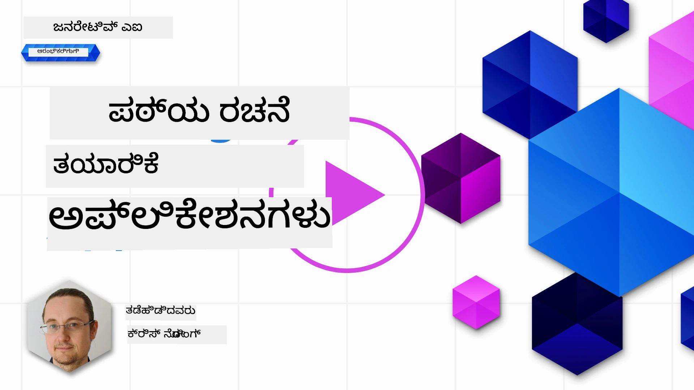

# ಪಠ್ಯ ಉತ್ಪಾದನೆ ಆಪ್ಲಿಕೇಶನ್‌ಗಳನ್ನು ನಿರ್ಮಿಸುವುದು

[](https://youtu.be/0Y5Luf5sRQA?si=t_xVg0clnAI4oUFZ)

> _(ಈ ಪಾಠದ ವಿಡಿಯೊವನ್ನು ನೋಡುವುದಕ್ಕಾಗಿ ಮೇಲಿನ ಚಿತ್ರವನ್ನು ಕ್ಲಿಕ್ ಮಾಡಿ)_

ನೀವು ಈ ಪಠ್ಯಕ್ರಮದಲ್ಲಿ ಇದುವರೆಗೆ ನೋಡಿರುವಂತೆ ಪ್ರಾಂಪ್ಟ್‌ಗಳು ಮತ್ತು "ಪ್ರಾಂಪ್ಟ್ ಎಂಜಿನಿಯರಿಂಗ್" ಎನ್ನುವ ಒಂದು ಸಂಪೂರ್ಣ ಶಿಸ್ತಿನಂತಹ ಮೂಲಭೂತ ಆಲೋಚನೆಗಳಿವೆ. ನೀವು ಸಂವಹನ ಮಾಡಬಹುದಾದ ಬಹಳಷ್ಟು ಉಪಕರಣಗಳು, ಉದಾಹರಣೆಗೆ ChatGPT, Office 365, Microsoft Power Platform ಮತ್ತು ಇತರವುಗಳು, ಏನಾದರೂ ಸಾಧಿಸಲು ಪ್ರಾಂಪ್ಟ್‌ಗಳನ್ನು ಬಳಕೆ ಮಾಡಿಕೊಳ್ಳಲು ಬೆಂಬಲ ನೀಡುತ್ತವೆ.

ಆ ಅಪ್ಲಿಕೇಶನ್‌ಗೆ ಇಂತಹ ಅನುಭವವನ್ನು ಸೇರಿಸುವುದಕ್ಕೆ, ನೀವು ಪ್ರಾಂಪ್ಟ್‌ಗಳು, ಪೂರ್ಣಗೊಳಿಸುವಿಕೆಗಳು ಮತ್ತು ಕೆಲಸ ಮಾಡಲು ಗ್ರಂಥಾಲಯವನ್ನು ಆಯ್ಕೆ ಮಾಡುವಂತಹ ಆಲೋಚನೆಗಳನ್ನು ಅರ್ಥಮಾಡಿಕೊಳ್ಳಬೇಕಾಗುತ್ತದೆ. ಇದೇ ನಿಮಗೆ ಈ ಅಧ್ಯಾಯದಲ್ಲಿ ಕಲಿಸಲಾಗುವುದು.

## ಪರಿಚಯ

ಈ ಅಧ್ಯಾಯದಲ್ಲಿ, ನೀವು:

- openai ಗ್ರಂಥಾಲಯ ಮತ್ತು ಅದರ ಮೂಲಭೂತ ಆಲೋಚನೆಗಳನ್ನು ಕಲಿಯಿರಿ.
- openai ಬಳಸಿ ಪಠ್ಯ ಉತ್ಪಾದನೆ ಆಪ್ಲಿಕೇಶನ್ ಅನ್ನು ನಿರ್ಮಿಸಿ.
- ಪ್ರಾಂಪ್ಟ್, ತಾಪಮಾನ, ಮತ್ತು ಟೋಕೆನ್ಗಳಂತಹ ಆಲೋಚನೆಗಳನ್ನು ಪಠ್ಯ ಉತ್ಪಾದನೆ ಆಪ್ಲಿಕೇಶನ್ ನಿರ್ಮಿಸಲು ಹೇಗೆ ಬಳಸಬೇಕೆಂದು ಅರ್ಥಮಾಡಿಕೊಳ್ಳಿ.

## ಕಲಿಕೆಯ ಗುರಿಗಳು

ಈ ಪಾಠದ ಕೊನೆಯಲ್ಲಿ, ನೀವು ಸಾಧ್ಯವಾಗುವುದು:

- ಪಠ್ಯ ಉತ್ಪಾದನೆ ಆಪ್ಲಿಕೇಶನ್ ಎಂದರೇನು ಎಂದು ವಿವರಿಸಲು.
- openai ಬಳಸಿ ಪಠ್ಯ ಉತ್ಪಾದನೆ ಆಪ್ಲಿಕೇಶನ್ ನಿರ್ಮಿಸಲು.
- ನಿಮ್ಮ ಆಪ್ ಅನ್ನು ಹೆಚ್ಚು ಅಥವಾ ಕಡಿಮೆ ಟೋಕೆನ್ಗಳನ್ನು ಉಪಯೋಗಿಸುವಂತೆ ಹಾಗೂ ತಾಪಮಾನವನ್ನು ಬದಲಾಯಿಸುವಂತೆ ಸಂರಚಿಸಲು, ವಿಭಿನ್ನ ಮೌಲ್ಯಗಳೊಂದಿಗೆ.

## ಪಠ್ಯ ಉತ್ಪಾದನೆ ಆಪ್ಲಿಕೇಶನ್ ಎಂದರೆ ಏನು?

ಸಾಮಾನ್ಯವಾಗಿ ನೀವು ಆಪ್ ನಿರ್ಮಿಸುವಾಗ ಅದರಲ್ಲಿ ಹೀಗೊಂದು ಇಂಟರ್ಫೇಸ್ ಇರುತ್ತದೆ:

- ಆದೇಶ ಆಧಾರಿತ. ಕಾನ್ಸೋಲ್ ಆಪ್‌ಗಳು ಸಾಮಾನ್ಯವಾಗಿ ನೀವು ಒಂದು ಆದೇಶವನ್ನು ಟೈಪ್ ಮಾಡಿ ಅದು ಕಾರ್ಯವನ್ನು ಪೂರ್ಣಗೊಳಿಸುವಂತಹ ಆಪ್‌ಗಳಾಗಿವೆ. ಉದಾಹರಣೆಗಾಗಿ, `git` ಒಂದು ಆದೇಶ ಆಧಾರಿತ ಆಪ್.
- ಬಳಕೆದಾರ ಇಂಟರ್ಫೇಸ್ (UI). ಕೆಲವು ಆಪ್‌ಗಳು ಗ್ರಾಫಿಕಲ್ ಬಳಕೆದಾರ ಇಂಟರ್ಫೇಸ್‌ಗಳ (GUIs)ೊಂದಿಗೆ ಬಟನ್ ಕ್ಲಿಕ್ ಮಾಡುವುದು, ಪಠ್ಯ ನಮೂದಿಸುವುದು, ಆಯ್ಕೆಗಳನ್ನು ಆರಿಸುವುದು ಇತ್ಯಾದಿ ಕಾರ್ಯಗಳನ್ನು ನೆರವೇರಿಸುತ್ತವೆ.

### ಕಾನ್ಸೋಲ್ ಮತ್ತು UI ಆಪ್‌ಗಳು ಸೀಮಿತವಾಗಿವೆ

ನೀವು ಒಂದು ಆದೇಶ ಆಧಾರಿತ ಆಪ್ ಅನ್ನು ಹೋಲಿಸಿ ನೋಡಿಕೊಳ್ಳಿ, ಅದರಲ್ಲಿ ನೀವು ಆದೇಶವನ್ನು ಟೈಪ್ ಮಾಡಿ:

- **ಇದು ಸೀಮಿತವಾಗಿದೆ**. ನೀವು ಯಾವದಾದರೂ ಆದೇಶವನ್ನು ಹಾಕಲಾರೆ, ಆಪ್ ಬೆಂಬಲಿಸುವ ಆದೇಶಗಳನ್ನು ಮಾತ್ರ.
- **ಭಾಷಾ ನಿರ್ದಿಷ್ಟ**. ಕೆಲವು ಆಪ್‌ಗಳು ಹಲವಾರು ಭಾಷೆಗಳನ್ನು ಬೆಂಬಲಿಸುತ್ತವೆ, ಆದರೆ ಡೀಫಾಲ್ಟ್ ಒಬ್ಬ ನಿರ್ದಿಷ್ಟ ಭಾಷೆಗೆ ನಿರ್ಮಿತವಾಗಿರುತ್ತವೆ, ಹೆಚ್ಚಿನ ಭಾಷಾ ಬೆಂಬಲ ಸೇರಿಸಲು ಸಾಧ್ಯವಿದ್ದರೂ.

### ಪಠ್ಯ ಉತ್ಪಾದನೆ ಆಪ್‌ಗಳ ಲಾಭಗಳು

ಹಾಗಾದರೆ, ಪಠ್ಯ ಉತ್ಪಾದನೆ ಆಪ್ ಹೇಗೆ ವಿಭಿನ್ನವಾಗಿದೆ?

ಪಠ್ಯ ಉತ್ಪಾದನೆ ಆಪ್‌ನಲ್ಲಿ, ನಿಮಗೆ ಹೆಚ್ಚು ಬದಲಾವಣೆ ತರಲು ಅವಕಾಶ ಇದೆ, ನೀವು ಆದೇಶಗಳ ಒಂದು ನಿಗದಿತ ಗುಂಪಿಗೆ ಅಥವಾ ನಿರ್ದಿಷ್ಟ ಇನ್ಫುಟ್ ಭಾಷೆಗೆ ಮಾತ್ರ ಸೀಮಿತವಾಗಿಲ್ಲ. ಬದಲಿಗೆ, ನೀವು ಸಹಜ ಭಾಷೆಯನ್ನು ಬಳಸಿಕೊಂಡು ಆಪ್ ಜೊತೆಗೆ ಸಂವಹನ ಮಾಡಬಹುದು. ಇನ್ನೊಂದು ಲಾಭವೇನೆಂದರೆ ನೀವು ಈಗಾಗಲೇ ಹೆಚ್ಚಿನ ಮಾಹಿತಿಯ ಭಂಡಾರದಲ್ಲಿ ತರಬೇತುಗೊಂಡಿರುವ ಡೇಟಾ ಮೂಲದೊಂದಿಗೆ ಸಂವಹನ ಮಾಡುತ್ತಿದ್ದೀರಿ, ಅದನ್ನು ಸಂಪ್ರದಾಯಿಕ ಆಪ್ ಒಂದು ಡೇಟಾಬೇಸ್ ಒಳಗಿನ ಮಾಹಿತಿಯಿಂದ ಸೀಮಿತವಾಗಿರಬಹುದು.

### ಪಠ್ಯ ಉತ್ಪಾದನೆ ಆಪ್‌ ಮೂಲಕ ನಾನು ಏನು ನಿರ್ಮಿಸಬಹುದು?

ನೀವು ಅನೇಕ ವಿಷಯಗಳನ್ನು ನಿರ್ಮಿಸಬಹುದು. ಉದಾಹರಣೆಗೆ:

- **ಚಾಟ್‌ಬಾಟ್**. ನಿಮ್ಮ ಕಂಪನಿ ಮತ್ತು ಅದರ ಉತ್ಪನ್ನಗಳು ಕುರಿತು ಪ್ರಶ್ನೆಗಳಿಗೆ ಉತ್ತರಿಸುವ ಚಾಟ್‌ಬಾಟ್ ಒಂದು ಉತ್ತಮ ಆಯ್ಕೆಯಾಗಬಹುದು.
- **ಸಹಾಯಕ**. LLMಗಳು ಪಠ್ಯ ಸಾರಾಂಶ ಗೊಳಿಸುವುದು, ಪಠ್ಯದಿಂದ ಅರ್ಥ ತೆಗೆದುಕೊಳ್ಳುವುದು, ರೆಜ್ಯೂಮ್ ಮೊದಲಾದ ಪಠ್ಯವನ್ನು ಉತ್ಪಾದಿಸುವುದರಲ್ಲಿ ಅತ್ಯುತ್ತಮವಾಗಿವೆ.
- **ಕೋಡ್ ಸಹಾಯಕ**. ನೀವು ಬಳಸುವ ಭಾಷಾ ಮಾದರಿಯಿಂದ, ನೀವು ಕೋಡ್ ಬರೆಸಲು ಸಹಾಯ ಮಾಡುವ ಕೋಡ್ ಸಹಾಯಕನನ್ನು ನಿರ್ಮಿಸಬಹುದು. ಉದಾಹರಣೆಗೆ, GitHub Copilot ಮತ್ತು ChatGPT ಅನ್ನು ಕೋಡ್ ಬರೆಯಲು ಬಳಸಬಹುದು.

## ನಾನು ಹೇಗೆ ಪ್ರಾರಂಭಿಸಬಹುದು?

ಬಹುಮಾನವಾಗಿ, ನೀವು ಯಾವಾಗಲೂ LLM ಜೊತೆಗೆ ಸಂಯೋಜಿಸುವ ವಿಧಾನವನ್ನು ಹುಡುಕಬೇಕು, ಸಾಮಾನ್ಯವಾಗಿ ಈ ಕೆಳಗಿನ ಎರಡು ವಿಧಾನಗಳನ್ನು ಒಳಗೊಂಡಿರುತ್ತದೆ:

- API ಬಳಸುವುದು. ಇಲ್ಲಿ ನೀವು ನಿಮ್ಮ ಪ್ರಾಂಪ್ಟ್ ಅನ್ನು ಜೋಡಿಸಿ ವೆಬ್ ವಿನಂತಿಗಳನ್ನು ರಚಿಸಿ ಉತ್ಪಾದಿತ ಪಠ್ಯವನ್ನು ಪಡೆಯುತ್ತೀರಿ.
- ಗ್ರಂಥಾಲಯ ಬಳಸುವುದು. ಗ್ರಂಥಾಲಯಗಳು API ಕರೆಗಳನ್ನು ಕವರಿಂಗ್ ಮಾಡಿ ಅವುಗಳನ್ನು ಸುಲಭವಾಗಿ ಬಳಸಲು ಸಹಾಯ ಮಾಡುತ್ತವೆ.

## ಗ್ರಂಥಾಲಯಗಳು/SDKಗಳು

LLMಗಳೊಂದಿಗೆ ಕೆಲಸ ಮಾಡಲು ಕೆಲವು ಪ್ರಸಿದ್ಧ ಗ್ರಂಥಾಲಯಗಳಿವೆ:

- **openai**, ಈ ಗ್ರಂಥಾಲಯವು ನಿಮ್ಮ ಮಾದರಿಯನ್ನು ಸಂಪರ್ಕಿಸಲು ಮತ್ತು ಪ್ರಾಂಪ್ಟ್‌ಗಳನ್ನು ಕಳುಹಿಸಲು ಸುಲಭವಾಗಿಸುತ್ತದೆ.

ನಂತರ ಹೆಚ್ಚು ಮೇಲ್ದರ್ಜೆಯಾಗಿ ಕಾರ್ಯನಿರ್ವಹಿಸುವ ಗ್ರಂಥಾಲಯಗಳಿವೆ:

- **Langchain**. Langchain ಪ್ರಸಿದ್ಧ ಮತ್ತು Python ನ್ನು ಬೆಂಬಲಿಸುತ್ತದೆ.
- **Semantic Kernel**. Semantic Kernel ಮೈಸ್ರೋಸಾಫ್ಟ್‌ನ ಗ್ರಂಥಾಲಯ, ಇದು C#, Python, ಮತ್ತು ಜಾವಾ ಭಾಷೆಗಳಿಗೆ ಬೆಂಬಲ ಕೊಡುತ್ತದೆ.

## openai ಬಳಸಿಕೊಂಡು ಮೊದಲ ಆಪ್

ನಾವು ಮೊದಲ ಆಪ್ ಅನ್ನು ಹೇಗೆ ನಿರ್ಮಿಸಬಹುದು, ಯಾವ ಗ್ರಂಥಾಲಯಗಳನ್ನು ಬೇಕಾಗುತ್ತದೆ, ಎಷ್ಟು ಅಗತ್ಯವಿದೆ ಮತ್ತು ಇತ್ಯಾದಿಗಳನ್ನು ನೋಡೋಣ.

### openai ಅನ್ನು ಸ್ಥಾಪಿಸು

OpenAI ಅಥವಾ Azure OpenAI ಜೊತೆ ಸಂವಹನ ಮಾಡಲು ಹಲವು ಗ್ರಂಥಾಲಯಗಳಿವೆ. C#, Python, JavaScript, Java ಮತ್ತು ಇನ್ನಷ್ಟು ಕಾರ್ಯಕ್ರಮ ಭಾಷೆಗಳನ್ನು ಬಳಸಬಹುದು. ನಾವು `openai` Python ಗ್ರಂಥಾಲಯವನ್ನು ಬಳಸಲು ಆಯ್ಕೆಮಾಡಿದ್ದೇವೆ, ಅದಕ್ಕಾಗಿ `pip` ಬಳಸಿ ಇನ್ಸ್ಟಾಲ್ ಮಾಡೋಣ.

```bash
pip install openai
```

### ಸಂಪನ್ಮೂಲವನ್ನು ರಚಿಸಿ

ನೀವು ಕೆಳಗಿನ ಹಂತಗಳನ್ನು ಮಾಡಬೇಕಾಗುತ್ತದೆ:

- Azure ನಲ್ಲಿ ಖಾತೆಯನ್ನು ರಚಿಸಿ [https://azure.microsoft.com/free/](https://azure.microsoft.com/free/?WT.mc_id=academic-105485-koreyst).
- Azure OpenAIಗೆ ಪ್ರಾಪ್ತಿ ಪಡೆಯಿರಿ. [https://learn.microsoft.com/azure/ai-foundry/openai/overview#how-do-i-get-access-to-azure-openai](https://learn.microsoft.com/azure/ai-foundry/openai/overview#how-do-i-get-access-to-azure-openai?WT.mc_id=academic-105485-koreyst) ಗೆ ತೆರಳಿಸಿ ಪ್ರವೇಶಕ್ಕಾಗಿ ವಿನಂತಿ ಮಾಡಿರಿ.

  > [!NOTE]
  > ಬರೆಯುವ ಸಮಯದಲ್ಲಿ, ನೀವು Azure OpenAIಗೆ ಪ್ರವೇಶಕ್ಕಾಗಿ ಅರ್ಜಿ ಸಲ್ಲಿಸಬೇಕಾಗುತ್ತದೆ.

- Python ಅನ್ನು ಇನ್ಸ್ಟಾಲ್ ಮಾಡಿ <https://www.python.org/>
- Azure OpenAI ಸೆವೆ ವಿವರಣಾ ಸಂಪನ್ಮೂಲವನ್ನು ರಚಿಸಿರುವಿರಿ. ಇದರ ಬಗ್ಗೆ ಹೇಗೆ [ಸಂಪನ್ಮೂಲ ರಚಿಸುವುದು](https://learn.microsoft.com/azure/ai-foundry/openai/how-to/create-resource?pivots=web-portal?WT.mc_id=academic-105485-koreyst) ಮಾರ್ಗದರ್ಶಿಕೆಯನ್ನು ನೋಡಿ.

### API ಕೀ ಮತ್ತು ಎಂಡ್ಪಾಯಿಂಟ್ ಕಂಡುಹಿಡಿಯಿರಿ

ಈಗ, `openai` ಗ್ರಂಥಾಲಯಕ್ಕೆ ನೀವು ಯಾವ API ಕೀ ಬಳಸಬೇಕೆಂದು ತಿಳಿಸಬೇಕು. ನಿಮ್ಮ API ಕೀ ನೋಡಲು, ನಿಮ್ಮ Azure OpenAI ಸಂಪನ್ಮೂಲದ "ಕೀಗಳು ಮತ್ತು ಎಂಡ್ಪಾಯಿಂಟ್" ವಿಭಾಗಕ್ಕೆ ಹೋಗಿ "ಕೀ 1" ಮೌಲ್ಯವನ್ನು ನಕಲಿಸಿ.


ಈಗ ನೀವು ಈ ಮಾಹಿತಿಯನ್ನು ನಕಲಿಸಿದ್ದೀರಿ, ಗ್ರಂಥಾಲಯಗಳಿಗೆ ಅದನ್ನು ಬಳಸಲು ಸೂಚಿಸೋಣ.

> [!NOTE]
> ನಿಮ್ಮ API ಕೀ ಅನ್ನು ನಿಮ್ಮ ಕೋಡ್‌ನಿಂದ ವಿಭಜಿಸುವುದು ಉತ್ತಮ. ನೀವು ಅದನ್ನು ವಾತಾವರಣ ವೇರಿಯಬಲ್‌ಗಳ ಮೂಲಕ ಮಾಡಬಹುದು.
>
> - `OPENAI_API_KEY` ಎಂಬ ವಾತಾವರಣ ವೇರಿಯಬಲ್ ಅನ್ನು ನಿಮ್ಮ API ಕೀಗೆ ಸೆಟ್ ಮಾಡಿ.
>   `export OPENAI_API_KEY='sk-...'`

### Azure ಸಂರಚನೆಯನ್ನು ಸೆಟ್ ಮಾಡಿ

ನೀವು Azure OpenAI (ಇപ്പോൾ Microsoft Foundry ಭಾಗವಾಗಿದೆ) ಬಳಸುತ್ತಿದ್ದರೆ, ಇಲ್ಲಿ ಅನುಸರಿಸುವ ಸಂರಚನೆ ಇದೆ. ನಾವು ಸಾಮಾನ್ಯ `OpenAI` ಕ್ಲೈಂಟ್ ಅನ್ನು Azure OpenAI `/openai/v1/` ಎಂಡ್ಪಾಯಿಂಟ್‌ಗೆ ಇಡಿ, ಇದು Responses API ಜೊತೆಗೆ ಕಾರ್ಯನಿರ್ವಹಿಸುತ್ತದೆ ಮತ್ತು ಯಾವುದೇ `api_version` ಅಗತ್ಯವಿಲ್ಲ:

```python
import os
from openai import OpenAI

client = OpenAI(
    api_key=os.environ["AZURE_OPENAI_API_KEY"],
    base_url=f"{os.environ['AZURE_OPENAI_ENDPOINT'].rstrip('/')}/openai/v1/",
)
```

ಮೇಲ್ನೋಟದಲ್ಲಿ ನಾವು ಕೆಳಗಿನವುಗಳನ್ನು ಸೆಟ್ ಮಾಡುತ್ತಿದ್ದೇವೆ:

- `api_key`, ನಿಮ್ಮ Azure ಪೋರ್ಟಲ್ ಅಥವಾ Microsoft Foundry ಪೋರ್ಟಲ್‌ನಲ್ಲಿ ಕಾಣುವ API ಕೀ.
- `base_url`, ನಿಮ್ಮ Foundry ಸಂಪನ್ಮೂಲ ಎಂಡ್ಪಾಯಿಂಟ್, ಅದಕ್ಕೆ `/openai/v1/` ಸೇರಿಸಲಾಗಿದೆ. ಸ್ಥಿರ v1 ಎಂಡ್ಪಾಯಿಂಟ್ OpenAI ಮತ್ತು Azure OpenAI ಎರಡಲ್ಲಿಯೂ ಕಾರ್ಯನಿರ್ವಹಿಸುತ್ತದೆ `api_version` ನಿರ್ವಹಣೆ ಇಲ್ಲದೆ.

> [!NOTE] > `os.environ` ವಾತಾವರಣ ವೇರಿಯಬಲ್‌ಗಳನ್ನು ಓದುತ್ತದೆ. ನೀವು ಇದನ್ನು `AZURE_OPENAI_API_KEY` ಮತ್ತು `AZURE_OPENAI_ENDPOINT` ವತ್ತಿರವರೆಗೆ ಓದಲು ಬಳಸಬಹುದು. ಈ ವಾತಾವರಣ ವೇರಿಯಬಲ್‌ಗಳನ್ನು ನಿಮ್ಮ ಟರ್ಮಿನಲ್‌ನಲ್ಲಿ ಅಥವಾ `dotenv` ಗ್ರಂಥಾಲಯ ಬಳಸಿ ಸೆಟ್ ಮಾಡಿ.

## ಪಠ್ಯ ಉತ್ಪಾದನೆ

ಪಠ್ಯವನ್ನು ಉತ್ಪಾದಿಸುವ ಮಾರ್ಗವು Responses API ನಲ್ಲಿ `responses.create` ವಿಧಾನವನ್ನು ಬಳಸುವುದು. ಉದಾಹರಣೆ ಇಲ್ಲಿದೆ:

```python
prompt = "Complete the following: Once upon a time there was a"

response = client.responses.create(
    model="gpt-5-mini",  # ಇದು ನಿಮ್ಮ ಮಾದರಿ ನಿಯೋಜನೆಯ ಹೆಸರು
    input=prompt,
    store=False,
)
print(response.output_text)
```

ಮೇಲಿನ ಕೋಡ್‌ನಲ್ಲಿ, ನಾವು ಪ್ರತಿಕ್ರಿಯೆ ಸೃಷ್ಟಿಸುತ್ತೇವೆ ಮತ್ತು ನಾವು ಬಳಸಬೇಕಾದ ಮಾದರಿಯನ್ನು ಹಾಗೂ ಪ್ರಾಂಪ್ಟ್ ಅನ್ನು ಒದಗಿಸುತ್ತೇವೆ. ನಂತರ `response.output_text` ಮೂಲಕ ಉತ್ಪಾದಿತ ಪಠ್ಯವನ್ನು ಮುದ್ರಿಸುತ್ತೇವೆ.

### ಬಹು-ತಿರುವು ಸಂವಾದಗಳು

Responses API ಒಂದು ದಿರ್ಘ-ಸಂವಾದ ಅಥವಾ ಬಹು ತಿರುವು ಚಾಟ್‌ಬಾಟ್‌ಗಳಿಗೆ ಸೂಕ್ತವಾಗಿದೆ - ನೀವು `input` ನಲ್ಲಿ ಸಂದೇಶಗಳ ಪಟ್ಟಿ ಒದಗಿಸುತ್ತೀರಿ ಸಂವಾದವನ್ನು ನಿರ್ಮಿಸಲು:

```python
from openai import OpenAI

client = OpenAI(api_key="sk-...")

response = client.responses.create(model="gpt-5-mini", input="Hello world", store=False)
print(response.output_text)
```

ಈ ಕಾರ್ಯತಂತ್ರದ ಬಗ್ಗೆ ಇನ್ನಷ್ಟು ಮಾಹಿತಿಯನ್ನು ಮುಂದಿನ ಅಧ್ಯಾಯದಲ್ಲಿ ನೀಡಲಾಗುತ್ತದೆ.

## ವ್ಯಾಯಾಮ - ನಿಮ್ಮ ಮೊದಲ ಪಠ್ಯ ಉತ್ಪಾದನೆ ಆಪ್

openai ಅನ್ನು ಸ್ಥಾಪಿಸುವ ಮತ್ತು ಸಂರಚಿಸುವ ವಿಧಾನದ ಮೇಲೆ ನಾವು ಕಲಿತಿರುವುದರಿಂದ, ಈಗ ನಿಮ್ಮ ಮೊದಲ ಪಠ್ಯ ಉತ್ಪಾದನೆ ಆಪ್ ಅನ್ನು ನಿರ್ಮಿಸುವ ಸಮಯ ಬಂದಿದೆ. ಆಪ್ ನಿರ್ಮಿಸಲು, ಈ ಹಂತಗಳನ್ನು ಅನುಸರಿಸಿ:

1. ಒಂದು ವರ್ಚ್ಯುವಲ್ ಪರಿಸರವನ್ನು ರಚಿಸಿ ಮತ್ತು openai ಅನ್ನು ಇನ್ಸ್ಟಾಲ್ ಮಾಡಿ:

   ```bash
   python -m venv venv
   source venv/bin/activate
   pip install openai
   ```

   > [!NOTE]
   > ನೀವು Windows ಬಳಕೆಮಾಡುತ್ತಿದ್ದರೆ `source venv/bin/activate` ಬದಲಿಗೆ `venv\Scripts\activate` ಟೈಪ್ ಮಾಡಿ.

   > [!NOTE]
   > ನಿಮ್ಮ Azure OpenAI ಕೀ ಕಂಡುಹಿಡಿಯಲು [https://portal.azure.com/](https://portal.azure.com/?WT.mc_id=academic-105485-koreyst) ಗೆ ಹೋಗಿ, `Open AI` ಅನ್ನು ಹುಡುಕಿ, `Open AI resource` ಆಯ್ಕೆ ಮಾಡಿ ನಂತರ `Keys and Endpoint` ಗೆ ಹೋಗಿ ಮತ್ತು `Key 1` ಮೌಲ್ಯವನ್ನು ನಕಲಿಸಿ.

1. _app.py_ ಫೈಲ್ ರಚಿಸಿ ಮತ್ತು ಅದಕ್ಕೆ ಕೆಳಗಿನ ಕೋಡ್ ನೀಡಿ:

   ```python
   import os
   from openai import OpenAI

   client = OpenAI(
       api_key="<replace this value with your Azure OpenAI key>",
       base_url="<endpoint found in Azure Portal>/openai/v1/",
   )
   deployment_name = "<deployment name>"

   # ನಿಮ್ಮ ಪೂರ್ಣಗೊಳ್ಳುವಿಕೆ ಕೋಡ್ ಅನ್ನು ಸೇರಿಸಿ
   prompt = "Complete the following: Once upon a time there was a"

   # Responses API ಬಳಸಿ ವಿನಂತಿ ಮಾಡಿ
   response = client.responses.create(model=deployment_name, input=prompt, store=False)

   # ಪ್ರತಿಕ್ರಿಯೆಯನ್ನು ಮುದ್ರಿಸಿ
   print(response.output_text)
   ```

   > [!NOTE]
   > ನೀವು ಸಾಮಾನ್ಯ OpenAI (Azure ಅಲ್ಲದೆ) ಉಪಯೋಗಿಸಿದರೆ `client = OpenAI(api_key="<ನಿಮ್ಮ OpenAI ಕೀ ಬದಲಾಯಿಸಿ>")` ಬಳಸಿ (`base_url` ಬೇಸರವಿಲ್ಲ) ಮತ್ತು ಮಾದರಿಯ ಹೆಸರಾಗಿ `gpt-5-mini` ಬಳಸಿ ಏಕೆಂದರೆ ನಿಯೋಜನೆಯ ಹೆಸರು ಅಲ್ಲ.

   ನೀವು ಈ ಕೆಳಗಿನಂತೆಯೇ ಆಯುಟ್ ನೋಡಬಹುದು:

   ```output
    very unhappy _____.

   Once upon a time there was a very unhappy mermaid.
   ```

## ವಿಭಿನ್ನ ರೀತಿಯ ಪ್ರಾಂಪ್ಟ್‌ಗಳು, ವಿಭಿನ್ನ ಗುರಿಗಳಿಗಾಗಿ

ಈಗ ನೀವು ಪ್ರಾಂಪ್ಟ್ ಬಳಸಿ ಪಠ್ಯವನ್ನು ಉತ್ಪಾದಿಸುವ ವಿಧಾನವನ್ನು ಕಂಡಿದ್ದೀರಿ. ನಿಮ್ಮ ಸಾಧನ ಸಜ್ಜಾಗಿದ್ದು, ನೀವು ಅದನ್ನು ಬದಲಾಯಿಸಬಹುದು ಮತ್ತು ವಿಭಿನ್ನ ರೀತಿಯ ಪಠ್ಯಗಳನ್ನು ಉತ್ಪಾದಿಸಬಹುದು.

ಪ್ರಾಂಪ್ಟ್‌ಗಳು ವಿವಿಧ ಕಾರ್ಯಗಳಿಗೆ ಬಳಸಬಹುದು. ಉದಾಹರಣೆಗೆ:

- **ವಿಭಿನ್ನ ರೀತಿಯ ಪಠ್ಯವನ್ನು ಉತ್ಪಾದಿಸುವುದು**. ಉದಾಹರಣೆಗೆ, ನೀವು ಒಂದು ಕವನ, ಪ್ರಶ್ನೋತ್ತರಗಳಿಗಾಗಿ ಪ್ರಶ್ನೆಗಳು ಮೊದಲಾದವುಗಳನ್ನು ಉತ್ಪಾದಿಸಬಹುದು.
- **ಮಾಹಿತಿಯನ್ನು ಹುಡುಕುವುದು**. ಉದಾಹರಣೆಗೆ, 'ವೆಬ್ ಡೆವಲಪ್ಮೆಂಟಿಯಲ್ಲಿ CORS ಅಂದರೆ ಏನು?' ಎಂದಾದ ಪ್ರಶ್ನೆಗೆ ಪ್ರಾಂಪ್ಟ್ ಬಳಸಬಹುದು.
- **ಕೋಡ್ ಉತ್ಪಾದನೆ**. ಪ್ರಾಂಪ್ಟ್‌ಗಳ ಮೂಲಕ ನೀವು ಕೋಡ್ ನಿರ್ಮಿಸಬಹುದು, ಉದಾಹರಣೆಗೆ ಇಮೇಲ್‌ಗಳನ್ನು ಮಾನ್ಯ ಮಾಡಲು ನಿಯಮಿತ ಅಭಿವ್ಯಕ್ತಿ (regex) ಅಥವಾ ಸಂಪೂರ್ಣ ವೆಬ್ ಆಪ್ ನಿರ್ಮಿಸುವುದಕ್ಕೋಡಬಹುದು.

## ಹೆಚ್ಚು ಪ್ರಾಯೋಗಿಕ ಬಳಕೆದಾರಿಕೆ: ಒಂದು ಪಾಕವಿಧಾನ ಜನರೇಟರ್

ಮನಸ್ಸಿನಲ್ಲಿ ಇಟ್ಟುಕೊಳ್ಳಿ ನೀವು ಮನೆಯಲ್ಲಿ ಕೆಲವು ಪದಾರ್ಥಗಳನ್ನು ಹೊಂದಿದ್ದೀರಾ ಮತ್ತು ನೀವು ಏನೋ ತಯಾರು ಮಾಡಬೇಕು. ಅದಕ್ಕೆ ನೀವು ಪಾಕವಿಧಾನ ಬೇಕಾಗುತ್ತದೆ. ಅದನ್ನು ಕಂಡುಹಿಡಿಯಲು ಹುಡುಕಾಟ ಇಂಜಿನ್ ಅಥವಾ LLM ಬಳಸಬಹುದು.

ನೀವು ಕೆಳಗಿನಂತೆ ಪ್ರಾಂಪ್ಟ್ ಬರೆದು ಪ್ರಯತ್ನಿಸಬಹುದು:

> "ನೀವು 5 ಪಾಕವಿಧಾನಗಳನ್ನು ತೋರಿಸಿ, ಏಕೆಂದರೆ ಪದಾರ್ಥಗಳು: ಕೋಳಿ, ಆಲೂಗಡ್ಡೆ ಮತ್ತು ಗಾಜರಿಗಳು. ಪ್ರತಿ ಪಾಕವಿಧಾನಕ್ಕೆ ಬಳಸಲಾದ ಎಲ್ಲಾ ಪದಾರ್ಥಗಳನ್ನು ಪಟ್ಟಿ ಮಾಡಿ"

ಮೇಲಿನ ಪ್ರಾಂಪ್ಟ್ಗಾಗಿ ನೀವು ಈ ರೀತಿಯ ಉತ್ತರ ಪಡೆಯಬಹುದು:

```output
1. Roasted Chicken and Vegetables:
Ingredients:
- 4 chicken thighs
- 2 potatoes, cut into cubes
- 2 carrots, cut into cubes
- 2 tablespoons olive oil
- 2 cloves garlic, minced
- 1 teaspoon dried thyme
- 1 teaspoon dried oregano
- Salt and pepper, to taste

2. Chicken and Potato Stew:
Ingredients:
- 2 tablespoons olive oil
- 1 onion, diced
- 2 cloves garlic, minced
- 2 chicken breasts, cut into cubes
- 2 potatoes, cut into cubes
- 2 carrots, cut into cubes
- 1 teaspoon dried oregano
- 1 teaspoon dried thyme
- 1 cup chicken broth
- Salt and pepper, to taste

3. Chicken and Potato Bake:
Ingredients:
- 2 tablespoons olive oil
- 2 chicken breasts, cut into cubes
- 2 potatoes, cut into cubes
- 2 carrots, cut into cubes
- 1 onion, diced
- 2 cloves garlic, minced
- 1 teaspoon dried oregano
- 1 teaspoon dried thyme
- 1 cup chicken broth
- Salt and pepper, to taste

4. Chicken and Potato Soup:
Ingredients:
- 2 tablespoons olive oil
- 1 onion, diced
- 2 cloves garlic, minced
- 2 chicken breasts, cut into cubes
- 2 potatoes, cut into cubes
- 2 carrots, cut into cubes
- 1 teaspoon dried oregano
- 1 teaspoon dried thyme
- 4 cups chicken broth
- Salt and pepper, to taste

5. Chicken and Potato Hash:
Ingredients:
- 2 tablespoons olive oil
- 2 chicken breasts, cut into cubes
- 2 potatoes, cut into cubes
- 2 carrots, cut into cubes
- 1 onion, diced
- 2 cloves garlic, minced
- 1 teaspoon dried oregano
```

ಈ ಫಲಿತಾಂಶ ಚೆನ್ನಾಗಿದೆ, ನನಗೆ ಏನು ತಯಾರು ಮಾಡಬೇಕೆಂದು ತಿಳಿದಿದೆ. ಈ ಸಂದರ್ಭದಲ್ಲಿ, ಉಪಯುಕ್ತ ಸುಧಾರಣೆಗಳು ಏನೆಂದರೆ:

- ನನ್ನ ಇಷ್ಟವಿಲ್ಲದ ಅಥವಾ ಅಲರ್ಜಿಯಿಂದ ಬಾರದ ಪದಾರ್ಥಗಳನ್ನು ತೆಗೆದುಹಾಕುವುದು.
- ನನ್ನ ಮನೆಯಲ್ಲಿ ಎಲ್ಲ ಪದಾರ್ಥಗಳೂ ಇಲ್ಲದ ಸಂದರ್ಭದಲ್ಲಿ ಖರೀದಿ ಪಟ್ಟಿ ರಚಿಸುವುದು.

ಮೇಲಿನ ಪ್ರಕರಣಗಳಿಗಾಗಿ, ನಾವು ಹೆಚ್ಚುವರಿ ಪ್ರಾಂಪ್ಟ್ ಸೇರಿಸೋಣ:

> "ದಯವಿಟ್ಟು ಪುನಃ Garlic ಇರುವ ಪಾಕವಿಧಾನಗಳನ್ನು ತೆಗೆದುಹಾಕಿ, ಏಕೆಂದರೆ ನನಗೆ ಅಲರ್ಜಿ ಇದೆ ಮತ್ತು ಅವುಗಳ ಬದಲಿಗೆ ಬೇರೆ ಯಾವುದಾದರೂ ಇರಲಿ. ಮತ್ತಷ್ಟು, ದಯವಿಟ್ಟು ಪಾಕವಿಧಾನಗಳಿಗಾಗಿ ಖರೀದಿ ಪಟ್ಟಿ ನಿರ್ಮಿಸಿ, ಏಕೆಂದರೆ ನನ್ನ ಬಳಿ ಈಗಾಗಲೇ ಕೋಳಿ, ಆಲೂಗಡ್ಡೆ ಮತ್ತು ಗಾಜರಿಗಳು ಇದೆ."

ಈಗ ನಿಮಗೆ ಹೊಸ ಫಲಿತಾಂಶ ಸಿಕ್ಕಿದೆ, ಇದ್ದಂತೆ:

```output
1. Roasted Chicken and Vegetables:
Ingredients:
- 4 chicken thighs
- 2 potatoes, cut into cubes
- 2 carrots, cut into cubes
- 2 tablespoons olive oil
- 1 teaspoon dried thyme
- 1 teaspoon dried oregano
- Salt and pepper, to taste

2. Chicken and Potato Stew:
Ingredients:
- 2 tablespoons olive oil
- 1 onion, diced
- 2 chicken breasts, cut into cubes
- 2 potatoes, cut into cubes
- 2 carrots, cut into cubes
- 1 teaspoon dried oregano
- 1 teaspoon dried thyme
- 1 cup chicken broth
- Salt and pepper, to taste

3. Chicken and Potato Bake:
Ingredients:
- 2 tablespoons olive oil
- 2 chicken breasts, cut into cubes
- 2 potatoes, cut into cubes
- 2 carrots, cut into cubes
- 1 onion, diced
- 1 teaspoon dried oregano
- 1 teaspoon dried thyme
- 1 cup chicken broth
- Salt and pepper, to taste

4. Chicken and Potato Soup:
Ingredients:
- 2 tablespoons olive oil
- 1 onion, diced
- 2 chicken breasts, cut into cubes
- 2 potatoes, cut into cubes
- 2 carrots, cut into cubes
- 1 teaspoon dried oregano
- 1 teaspoon dried thyme
- 4 cups chicken broth
- Salt and pepper, to taste

5. Chicken and Potato Hash:
Ingredients:
- 2 tablespoons olive oil
- 2 chicken breasts, cut into cubes
- 2 potatoes, cut into cubes
- 2 carrots, cut into cubes
- 1 onion, diced
- 1 teaspoon dried oregano

Shopping List:
- Olive oil
- Onion
- Thyme
- Oregano
- Salt
- Pepper
```

ಇದು ನಿಮ್ಮ ಐದು ಪಾಕವಿಧಾನಗಳು, Garlic ಕಾಣುವುದಿಲ್ಲ ಮತ್ತು ನೀವು ಈಗಾಗಲೇ ಮನೆಯಲ್ಲಿ ಇರುವ ಪದಾರ್ಥಗಳನ್ನು ಕೊಂಡುಕೊಳ್ಳಲು ಖರೀದಿ ಪಟ್ಟಿಯು ಸಹ ಇದೆ.

## ವ್ಯಾಯಾಮ - ಪಾಕವಿಧಾನ ಜನರೇಟರ್ ನಿರ್ಮಿಸಿ

ಈಗ ನಾವು ಕಾರ್ಯಾಚರಣೆಯನ್ನು ಚಟುವಟಿಕೆ ಮಾಡಿದ್ದರಿಂದ, ಅದನ್ನು ಹೋಲುವಂತೆ ಕೋಡ್ ಬರೆಯೋಣ. ಇದಕ್ಕಾಗಿ, ಈ ಹಂತಗಳನ್ನು ಅನುಸರಿಸಿ:

1. ಈಗಿರುವ _app.py_ ಫೈಲ್ ಅನ್ನು ಪ್ರಾರಂಭ ಬಿಂದುವಾಗಿ ಬಳಸಿ
1. `prompt` ವ್ಯತ್ಯಯಕಾರಕವನ್ನು ಕಂಡು ಅದರ ಕೋಡ್ ಅನ್ನು ಕೆಳಗಿನಂತೆ ಬದಲಿಸಿ:

   ```python
   prompt = "Show me 5 recipes for a dish with the following ingredients: chicken, potatoes, and carrots. Per recipe, list all the ingredients used"
   ```

   ನೀವು ಈಗ ಕೋಡ್ ಚಲಾಯಿಸಿದಾಗ, ಈ ರೀತಿಯ ಆಯುಟ್ ಕಾಣಬಹುದು:

   ```output
   -Chicken Stew with Potatoes and Carrots: 3 tablespoons oil, 1 onion, chopped, 2 cloves garlic, minced, 1 carrot, peeled and chopped, 1 potato, peeled and chopped, 1 bay leaf, 1 thyme sprig, 1/2 teaspoon salt, 1/4 teaspoon black pepper, 1 1/2 cups chicken broth, 1/2 cup dry white wine, 2 tablespoons chopped fresh parsley, 2 tablespoons unsalted butter, 1 1/2 pounds boneless, skinless chicken thighs, cut into 1-inch pieces
   -Oven-Roasted Chicken with Potatoes and Carrots: 3 tablespoons extra-virgin olive oil, 1 tablespoon Dijon mustard, 1 tablespoon chopped fresh rosemary, 1 tablespoon chopped fresh thyme, 4 cloves garlic, minced, 1 1/2 pounds small red potatoes, quartered, 1 1/2 pounds carrots, quartered lengthwise, 1/2 teaspoon salt, 1/4 teaspoon black pepper, 1 (4-pound) whole chicken
   -Chicken, Potato, and Carrot Casserole: cooking spray, 1 large onion, chopped, 2 cloves garlic, minced, 1 carrot, peeled and shredded, 1 potato, peeled and shredded, 1/2 teaspoon dried thyme leaves, 1/4 teaspoon salt, 1/4 teaspoon black pepper, 2 cups fat-free, low-sodium chicken broth, 1 cup frozen peas, 1/4 cup all-purpose flour, 1 cup 2% reduced-fat milk, 1/4 cup grated Parmesan cheese

   -One Pot Chicken and Potato Dinner: 2 tablespoons olive oil, 1 pound boneless, skinless chicken thighs, cut into 1-inch pieces, 1 large onion, chopped, 3 cloves garlic, minced, 1 carrot, peeled and chopped, 1 potato, peeled and chopped, 1 bay leaf, 1 thyme sprig, 1/2 teaspoon salt, 1/4 teaspoon black pepper, 2 cups chicken broth, 1/2 cup dry white wine

   -Chicken, Potato, and Carrot Curry: 1 tablespoon vegetable oil, 1 large onion, chopped, 2 cloves garlic, minced, 1 carrot, peeled and chopped, 1 potato, peeled and chopped, 1 teaspoon ground coriander, 1 teaspoon ground cumin, 1/2 teaspoon ground turmeric, 1/2 teaspoon ground ginger, 1/4 teaspoon cayenne pepper, 2 cups chicken broth, 1/2 cup dry white wine, 1 (15-ounce) can chickpeas, drained and rinsed, 1/2 cup raisins, 1/2 cup chopped fresh cilantro
   ```

   > ಗಮನಿಸಿ, ನಿಮ್ಮ LLM ಅಸ್ಥಿರವಾಗಿದೆ, ಆದ್ದರಿಂದ ಪ್ರತಿ ಬಾರಿ ಕೋಡ್ ಚಲಾಯಿಸಿದ್ದು ವಿಭಿನ್ನ ಫಲಿತಾಂಶಗಳು ಬರುತ್ತವೆ.

   ಅದನ್ನು ಉತ್ತಮಗೊಳಿಸಲು, ನಾವು ಕೋಡ್‌ನ್ನು ಸುಲಭವಾಗಿ ಬಳಸಬಹುದಾಗಿಸುವುದು ಮುಖ್ಯ, ಆದ್ದರಿಂದ ಪದಾರ್ಥಗಳು ಮತ್ತು ಪಾಕವಿಧಾನಗಳ ಸಂಖ್ಯೆಗಳನ್ನು ಬದಲಾಯಿಸಬಹುದು ಮತ್ತು ಸುಧಾರಿಸಬಹುದು.

1. ಕೋಡ್‌ನ್ನು ಕೆಳಗಿನ ರೀತಿಯಲ್ಲಿ ಬದಲಾಯಿಸೋಣ:

   ```python
   no_recipes = input("No of recipes (for example, 5): ")

   ingredients = input("List of ingredients (for example, chicken, potatoes, and carrots): ")

   # ರೆಸಿಪಿಗಳ ಸಂಖ್ಯೆಯನ್ನು ಪ್ರಾಂಪ್ಟ್ ಮತ್ತು ಸಾಮಗ್ರಿಗಳಲ್ಲಿಗೆ ಮಧ್ಯಸ್ಥಿಕೆ ಮಾಡಿ
   prompt = f"Show me {no_recipes} recipes for a dish with the following ingredients: {ingredients}. Per recipe, list all the ingredients used"
   ```

   ಪರೀಕ್ಷಾ ಆಡುವಿಕೆಗಾಗಿ ಕೋಡ್ ಹೀಗೆ ಕಾಣಬಹುದು:

   ```output
   No of recipes (for example, 5): 3
   List of ingredients (for example, chicken, potatoes, and carrots): milk,strawberries

   -Strawberry milk shake: milk, strawberries, sugar, vanilla extract, ice cubes
   -Strawberry shortcake: milk, flour, baking powder, sugar, salt, unsalted butter, strawberries, whipped cream
   -Strawberry milk: milk, strawberries, sugar, vanilla extract
   ```

### ಠಾಕು ಮತ್ತು ಖರೀದಿ ಪಟ್ಟಿ ಸೇರಿಸಿ ಉತ್ತಮಗೊಳಿಸಿ

ಈಗ ನಮ್ಮ ಬಳಿ ಪಾಕವಿಧಾನಗಳನ್ನು ಉತ್ಪಾದಿಸುವ ಕಾರ್ಯನಿರ್ವಹಿಸುವ ಆಪ್ ಇದೆ ಮತ್ತು ಅದು ಬಳಕೆದಾರರಿಂದ ಕೈಗಾರಿಕೆ ಮತ್ತು ಪಾಕವಿಧಾನಗಳ ಸಂಖ್ಯೆಯ ಇನ್ಪುಟ್ ಮೇಲೆಯಾದಂತೆ ಬದಲಾಗುತ್ತದೆ.

ಅದನ್ನು ಹೆಚ್ಚಾಗಿ ಉತ್ತಮಗೊಳಿಸಲು, ನಾವು ಕೆಳಗಿನವುಗಳನ್ನು ಸೇರಿಸಬೇಕಾಗುತ್ತದೆ:

- **ಅಸೂಯೆ ಪದಾರ್ಥಗಳನ್ನು ಫಿಲ್ಟರ್ ಮಾಡಿ**. ನಾವು ಇಷ್ಟವಿಲ್ಲದ ಅಥವಾ ಅಲರ್ಜಿಯಿರುವ ಪದಾರ್ಥಗಳನ್ನು ಚೆನ್ನಾಗಿ ಫಿಲ್ಟರ್ ಮಾಡಬೇಕಾಗುತ್ತದೆ. ಇದಕ್ಕಾಗಿ ನಮ್ಮ ಇಟ್ಟುಕೊಂಡ ಪ್ರಾಂಪ್ಟ್ ಅನ್ನು ಬದಲಿಸಿ ಕೊನೆಯಲ್ಲಿ ಫಿಲ್ಟರ್ ಶರತ್ತು ಸೇರಿಸಬಹುದಾಗಿದೆ ಹೀಗೆ:

  ```python
  filter = input("Filter (for example, vegetarian, vegan, or gluten-free): ")

  prompt = f"Show me {no_recipes} recipes for a dish with the following ingredients: {ingredients}. Per recipe, list all the ingredients used, no {filter}"
  ```

  ಮೇಲಿನ ಪ್ರಾಂಪ್ಟ್ ಅಂತ್ಯದಲ್ಲಿ `{filter}` ಅನ್ನು ಸೇರಿಸಿದ್ದೇವೆ ಮತ್ತು ಬಳಕೆದಾರರಿಂದ ಫಿಲ್ಟರ್ ಮೌಲ್ಯವನ್ನು ಹಿಡಿುಕೊಂಡಿದ್ದೇವೆ.

  ಈ ಕಾರ್ಯಕ್ರಮವನ್ನು ಚಲಾಯಿಸುವ ಉದಾಹರಣೆ ಇತ್ತೀಚಿನಂತಿರಬಹುದು:

  ```output
  No of recipes (for example, 5): 3
  List of ingredients (for example, chicken, potatoes, and carrots): onion,milk
  Filter (for example, vegetarian, vegan, or gluten-free): no milk

  1. French Onion Soup

  Ingredients:

  -1 large onion, sliced
  -3 cups beef broth
  -1 cup milk
  -6 slices french bread
  -1/4 cup shredded Parmesan cheese
  -1 tablespoon butter
  -1 teaspoon dried thyme
  -1/4 teaspoon salt
  -1/4 teaspoon black pepper

  Instructions:

  1. In a large pot, sauté onions in butter until golden brown.
  2. Add beef broth, milk, thyme, salt, and pepper. Bring to a boil.
  3. Reduce heat and simmer for 10 minutes.
  4. Place french bread slices on soup bowls.
  5. Ladle soup over bread.
  6. Sprinkle with Parmesan cheese.

  2. Onion and Potato Soup

  Ingredients:

  -1 large onion, chopped
  -2 cups potatoes, diced
  -3 cups vegetable broth
  -1 cup milk
  -1/4 teaspoon black pepper

  Instructions:

  1. In a large pot, sauté onions in butter until golden brown.
  2. Add potatoes, vegetable broth, milk, and pepper. Bring to a boil.
  3. Reduce heat and simmer for 10 minutes.
  4. Serve hot.

  3. Creamy Onion Soup

  Ingredients:

  -1 large onion, chopped
  -3 cups vegetable broth
  -1 cup milk
  -1/4 teaspoon black pepper
  -1/4 cup all-purpose flour
  -1/2 cup shredded Parmesan cheese

  Instructions:

  1. In a large pot, sauté onions in butter until golden brown.
  2. Add vegetable broth, milk, and pepper. Bring to a boil.
  3. Reduce heat and simmer for 10 minutes.
  4. In a small bowl, whisk together flour and Parmesan cheese until smooth.
  5. Add to soup and simmer for an additional 5 minutes, or until soup has thickened.
  ```

  ನೀವು ನೋಡಬಹುದು, ಹಾಲು ಇರುವ ಯಾವುದೇ ಪಾಕವಿಧಾನಗಳನ್ನು ಫಿಲ್ಟರ್ ಮಾಡಲಾಗಿದೆ. ಆದರೆ ನೀವು ಲ್ಯಾಕ್ಟೋಸ್ ಅಸಹಿಷ್ಣು болса, ನೀವು ಚೀಸ್ ಇರುವ ಪಾಕವಿಧಾನಗಳನ್ನೂ ಫಿಲ್ಟರ್ ಮಾಡಬೇಕು, ಆದ್ದರಿಂದ ಸ್ಪಷ್ಟತೆ ಅಗತ್ಯ.


- **ಖರೀದಿ ಪಟ್ಟಿಯನ್ನು ತಯಾರಿಸು**. ನಾವು ಈಗಾಗಲೇ ಮನೆಮಧ್ದಲೆ ಏನು ಇದೆ ಎಂದು ಪರಿಗಣಿಸಿ, ಖರೀದಿ ಪಟ್ಟಿಯನ್ನು ತಯಾರಿಸಲು ಇಚ್ಛಿಸುತ್ತೇವೆ.

  ಈ ಕಾರ್ಯಾಚರಣೆಗಾಗಿ, ನಾವು ಎಲ್ಲವನ್ನೂ ಒಂದು ಪ್ರಾಂಪ್ಟ್‌ನಲ್ಲಿ ಪರಿಹರಿಸಲು ಪ್ರಯತ್ನಿಸಬಹುದು ಅಥವಾ ಇದನ್ನು ಎರಡು ಪ್ರಾಂಪ್ಟ್‌ಗಳಾಗಿ ವಿಂಗಡಿಸಬಹುದು. ನಂತರದ ವಿಧಾನವನ್ನು ಪ್ರಯತ್ನಿಸೋಣ. ಇಲ್ಲಿಗೆ ನಾವು ಒಂದು ಹೆಚ್ಚುವರಿ ಪ್ರಾಂಪ್ಟ್ ಸೇರಿಸುವುದನ್ನು ಸೂಚಿಸುತ್ತಿದ್ದೇವೆ, ಆದರೆ ಅದಕ್ಕೆ ಮುನ್ನ ಪ್ರಾಂಪ್ಟ್‌ನ ಫಲಿತಾಂಶವನ್ನು ನಂತರದ ಪ್ರಾಂಪ್ಟ್‌ಗೆ ಸ೦ದರ್ಭವಾಗಿ ಸೇರಿಸಬೇಕು.

  ಮೊದಲ ಪ್ರಾಂಪ್ಟ್‌ನ ಫಲಿತಾಂಶವನ್ನು ಪ್ರಿಂಟ್ ಮಾಡುವ ಭಾಗವನ್ನು ಕೋಡ್‌ನಲ್ಲಿ ಹುಡುಕಿ ಕೆಳಗಿನ ಕೋಡ್ ಅನ್ನು ಸೇರಿಸಿ:

  ```python
  old_prompt_result = response.output_text
  prompt = "Produce a shopping list for the generated recipes and please don't include ingredients that I already have."

  new_prompt = f"{old_prompt_result} {prompt}"
  response = client.responses.create(model=deployment_name, input=new_prompt, max_output_tokens=1200, store=False)

  # ಪ್ರತಿಕ್ರಿಯೆಯನ್ನು ಮುದ್ರಿಸಿ
  print("Shopping list:")
  print(response.output_text)
  ```

  ಕೆಳಕಂಡದ್ದು ಗಮನಿಸಿ:

  1. ನಾವು ಹೊಸ ಪ್ರಾಂಪ್ಟ್ ರಚಿಸುತ್ತಿದ್ದೇವೆ, ಅದು ಮೊದಲ ಪ್ರಾಂಪ್ಟ್‌ನ ಫಲಿತಾಂಶವನ್ನು ಹೊಸ ಪ್ರಾಂಪ್ಟ್‌ಗೆ ಸೇರಿಸುವ ಮೂಲಕ:

     ```python
     new_prompt = f"{old_prompt_result} {prompt}"
     ```

  1. ನಾವು ಹೊಸ ವಿನಂತಿ ಮಾಡುತ್ತಿದ್ದೇವೆ, ಆದರೆ ಮೊದಲ ಪ್ರಾಂಪ್ಟ್‌ನಲ್ಲಿ ಕೇಳಿದ ಟೋಕನ್‌ಗಳ ಸಂಖ್ಯೆಯನ್ನು ಪರಿಗಣಿಸುತ್ತಿದ್ದೇವೆ, ಹೀಗಾಗಿ ಈ વખતે ನಾವು `max_output_tokens` ಅನ್ನು 1200 ಎಂದು ಅಂದಾಜಿಸುತ್ತೇವೆ.

     ```python
     response = client.responses.create(model=deployment_name, input=new_prompt, max_output_tokens=1200, store=False)
     ```

     ಈ ಕೋಡ್ ಅನ್ನು ಚಾಲನೆ ಮಾಡಿದಾಗ, ನಾವು ಕೆಳಗಿನ output-ನನ್ನು ಪಡೆಯುತ್ತೇವೆ:

     ```output
     No of recipes (for example, 5): 2
     List of ingredients (for example, chicken, potatoes, and carrots): apple,flour
     Filter (for example, vegetarian, vegan, or gluten-free): sugar


     -Apple and flour pancakes: 1 cup flour, 1/2 tsp baking powder, 1/2 tsp baking soda, 1/4 tsp salt, 1 tbsp sugar, 1 egg, 1 cup buttermilk or sour milk, 1/4 cup melted butter, 1 Granny Smith apple, peeled and grated
     -Apple fritters: 1-1/2 cups flour, 1 tsp baking powder, 1/4 tsp salt, 1/4 tsp baking soda, 1/4 tsp nutmeg, 1/4 tsp cinnamon, 1/4 tsp allspice, 1/4 cup sugar, 1/4 cup vegetable shortening, 1/4 cup milk, 1 egg, 2 cups shredded, peeled apples
     Shopping list:
     -Flour, baking powder, baking soda, salt, sugar, egg, buttermilk, butter, apple, nutmeg, cinnamon, allspice
     ```

## ನಿಮ್ಮ ವ್ಯವಸ್ಥೆಯನ್ನು ಸುಧಾರಿಸಿ

ನಾವು ಈಗಾಗಲೇ ಹೊಂದಿರುವ ಕೋಡ್ ಕಾರ್ಯನಿರ್ವಹಿಸುತ್ತಿದೆ, ಆದರೆ ಇನ್ನಷ್ಟು ಸುಧಾರಣೆ ಮಾಡಲು ಕೆಲವು ತಿದ್ದುಪಡಿಗಳನ್ನು ಮಾಡಬೇಕಾಗಿದೆ. ನಾವು ಮಾಡಬೇಕಾದ ಕೆಲವು ವಿಷಯಗಳು:

- **ಕೋಡ್‌ನಿಂದ ರಹಸ್ಯಗಳನ್ನು ವಿಭಜಿಸಿ**, ಉದಾಹರಣೆಗೆ API ಕೀ. ರಹಸ್ಯಗಳು ಕೋಡ್‌ನಲ್ಲಿ ಇರಬಾರದು ಮತ್ತು ಅವುಗಳನ್ನು ಸುರಕ್ಷಿತ ಸ್ಥಳದಲ್ಲಿ ಸಂಗ್ರಹಿಸಬೇಕು. ರಹಸ್ಯಗಳನ್ನು ಕೋಡ್‌ನಲ್ಲಿ ಭೇದಿಸಲು, ನಾವು ಪರಿಸರ ಪ್ರಮಾಣಗಳನ್ನು (environment variables) ಬಳಸಿ `python-dotenv` ಮುಂತಾದ ಲೈಬ್ರರಿಗಳನ್ನು ಬಳಸಿ ಫೈಲ್‌ನಲ್ಲಿ ಇವುಗಳನ್ನು ಲೋಡ್ ಮಾಡಬಹುದು. ಕೆಳಗಿನ ಕೋಡ್‌ನಲ್ಲಿ ಹೇಗೆ ಕಾಣುತ್ತದೆ:

  1. ಕೆಳಗಿನ ವಿಷಯದೊಂದಿಗೆ `.env` ಫೈಲ್ ರಚಿಸಿ:

     ```bash
     OPENAI_API_KEY=sk-...
     ```

     > ಗಮನಿಸಿ, ಎಜೂರ್ ಓಪನ್‌ಎಐ (Microsoft Foundry) ನಲ್ಲಿ, ಬದಲಾಗಿ ಕೆಳಗಿನ ಪರಿಸರ ಪ್ರಮಾಣಗಳನ್ನು ಹೊಂದಬೇಕು:

     ```bash
     AZURE_OPENAI_API_KEY=<replace>
     AZURE_OPENAI_ENDPOINT=<replace>
     AZURE_OPENAI_API_VERSION=2024-10-21
     ```

     ಕೋಡ್‌ನಲ್ಲಿ, ನೀವು ಪರಿಸರ ಪ್ರಮಾಣಗಳನ್ನು ಹೀಗೆ ಲೋಡ್ ಮಾಡುತ್ತಿರಿ:

     ```python
     import os
     from dotenv import load_dotenv
     from openai import OpenAI

     load_dotenv()

     client = OpenAI(api_key=os.environ["OPENAI_API_KEY"])
     ```

- **ಟೋಕನ್ ಉದ್ದದ ಕುರಿತು ಒಂದು ಮಾತು**. ನಾವು ಬೇಕಾದ ಅರೇಟನ್ನು ಸೃಷ್ಟಿಸಲು ಎಷ್ಟು ಟೋಕನ್‌ಗಳು ಬೇಕು ಎಂಬುದನ್ನು ಪರಿಗಣಿಸಬೇಕು. ಟೋಕನ್‌ಗಳಿಗೆ ಹಣ ಖರ್ಚಾಗುತ್ತದೆ, ಆದ್ದರಿಂದ ಸಾಧ್ಯವಾದರೆ ನಾವು ಬಳಸುವ ಟೋಕನ್‌ಗಳ ಸಂಖ್ಯೆಯಲ್ಲಿ节约 ಮಾಡುವ ಪ್ರಯತ್ನ ಮಾಡಬೇಕು. ಉದಾಹರಣೆಗೆ, ನಾವು ಪ್ರಾಂಪ್ಟ್ ಅನ್ನು ಹೇಗೆ ಪ್ರಸ್ತಾಪಿಸಬಹುದು ಎಂದರೆ ಕಡಿಮೆ ಟೋಕನ್‌ಗಳನ್ನು ಬಳಸಬಹುದು?

  ಟೋಕನ್‌ಗಳ ಸಂಖ್ಯೆಯನ್ನು ಬದಲಾಯಿಸಲು, ನೀವು `max_output_tokens` ಪ್ಯಾರಾಮೀಟರ್ ಅನ್ನು ಬಳಸಬಹುದು. ಉದಾಹರಣೆಗೆ, ನೀವು 100 ಟೋಕನ್‌ಗಳನ್ನು ಬಳಸಬೇಕಾದರೆ, ಹೀಗೆ ಮಾಡಬಹುದು:

  ```python
  response = client.responses.create(model=deployment, input=prompt, max_output_tokens=100, store=False)
  ```

- **ತಾಪಮಾನ (temperature) ಸಹಿ ಪ್ರಯೋಗ**. temperature ಈವರೆಗೆ ನಾವು ಉಲ್ಲೇಖಿಸಿರಲಿಲ್ಲ, ಆದರೆ ನಮ್ಮ ಕಾರ್ಯಕ್ರಮದ ಕಾರ್ಯಕ್ಷಮತೆಗೆ ಇದು ಮಹತ್ವದ ಹಿನ್ನೆಲೆ. ಹೆಚ್ಚಿದ temperature ಮೌಲ್ಯವು ಹೆಚ್ಚು ಅಕಸ್ಮಾತ್ ಆಗಿರುವ output ನೀಡುತ್ತದೆ. ಹೀಗೆಯೇ ಕಡಿಮೆ temperature ಮೌಲ್ಯವು ಹೆಚ್ಚು ಪೂರ್ವಾನುಮಾನಿತ output ನೀಡುತ್ತದೆ. ನೀವು output ನಲ್ಲಿ ವಿಭಿನ್ನತೆ ಬೇಕಾ ಅಥವಾ ಇಲ್ಲವೆಂದು ಪರಿಗಣಿಸಿ.

  temperature ಬದಲಾಯಿಸಲು, ನೀವು `temperature` ಪ್ಯಾರಾಮೀಟರ್ ಅನ್ನು ಬಳಸಬಹುದು. ಉದಾಹರಣೆಗೆ, ನೀವು 0.5 temperature ಅಗಬೇಕಾದರೆ, ಹೀಗೆ ಮಾಡಬಹುದು:

  ```python
  response = client.responses.create(model=deployment, input=prompt, temperature=0.5, store=False)
  ```

  > ಗಮನಿಸಿ, 1.0ಗೆ ಹತ್ತಿರ ಇರುವಂತೆ output ಹೆಚ್ಚು ವಿಭಿನ್ನವಾಗುತ್ತದೆ.

- **ಸರಕಾರಾದ ಮಾಹಿತಿಯನ್ನು ಬಳಸುವ ಮಾದರಿಗಳು `temperature` ಬಳಸುವುದಿಲ್ಲ**. ಇದು 2026 ರ ಒಂದು ಪ್ರಮುಖ ಬದಲಾವಣೆ. Microsoft Foundryನಿನಲ್ಲಿ ಲಭ್ಯವಿರುವ, ಹಳೆಯದಾಗದ ಮಾದರಿಗಳು **ಸರಕಾರಾದ ಮಾಹಿತಿಯನ್ನು ಹೊಂದಿರುವ ಮಾದರಿಗಳು (reasoning models)** (GPT-5 ಕುಟುಂಬ, o-series) - ಮತ್ತು ಅವುಗಳು `temperature` ಅಥವಾ `top_p` (ಮತ್ತೆ `max_tokens` ಅಲ್ಲ; ವಿರುದ್ಧವಾಗಿ `max_output_tokens` ಬಳಸಿ) ಬೆಂಬಲಿಸುವುದಿಲ್ಲ. ನೀವು `temperature` ಅನ್ನು `gpt-5-mini` ಗೆ ಕಳುಹಿಸಿದರೆ "ಪ್ಯಾರಾಮೀಟರ್ ಬೆಂಬಲವಿಲ್ಲ" ಎಂಬ ದೋಶವನ್ನು ಪಡೆಯುತ್ತೀರಿ. ಆದ್ದರಿಂದ ಮೇಲಿನ temperature ಉದಾಹರಣೆಯನ್ನು ಪ್ರಯತ್ನಿಸಲು, ಸಂಪಾದನೆ ನಿಯಂತ್ರಣಗಳನ್ನು ಇನ್ನೂ ಬೆಂಬಲಿಸುವ ಮಾದರಿಯನ್ನು ಆಯ್ಕೆಮಾಡಿ - ಉದಾಹರಣೆಗೆ, `Llama-3.3-70B-Instruct` ಎಂಬ ಮುಕ್ತ **Llama** ಮಾದರಿ, [Microsoft Foundry ಮಾದರಿ ಕ್ಯಾಟಲಾಗ್](https://ai.azure.com/catalog/models?WT.mc_id=academic-105485-koreyst) ನಲ್ಲಿ ಲಭ್ಯವಿದೆ, Foundry Models / Azure AI Inference ಎಂಡ್‌ಪಾಯಿಂಟ್ ಮೂಲಕ (ಅದೇ ರೀತಿಯಲ್ಲಿ `githubmodels-*` ಉದ್ದಾಹರಣೆಗಳು). GPT-5 ನಂತಹ reasoning ಮಾದರಿಗಳಲ್ಲಿ output ಅನ್ನು ವಿಭಿನ್ನ ರೀತಿಯಲ್ಲಿ ನಿಯಂತ್ರಿಸುತ್ತೇವೆ:
  - **ಪ್ರಾಂಪ್ಟ್ ಎಂಜಿನಿಯರಿಂಗ್** - ಸ್ಪಷ್ಟ ನಿರ್ದೇಶನಗಳು, ಉದಾಹರಣೆಗಳು, ಮತ್ತು ಸಂರಚಿತ output (ಪಾಠ [04 - Prompt Engineering](../04-prompt-engineering-fundamentals/README.md?WT.mc_id=academic-105485-koreyst) ನೋಡಿ) ಸಂಪಾದನೆ ನಿಯಂತ್ರಣದ ಕೆಲಸವನ್ನು ಮಾಡುತ್ತವೆ.
  - **ಸರಕಾರಾದ ನಿಯಂತ್ರಣಗಳು** - reasoning effort/verbosity ಮುಂತಾದ ಪ್ಯಾರಾಮೀಟರ್‌ಗಳು reasoning ಗಂಭೀರತೆಯನ್ನು ತಾಳ್ಮೆಗೆ ಮತ್ತು ವೆಚ್ಚಕ್ಕೆ ಟ್ರೇಡ್ ಆಫ್ ಮಾಡುತ್ತವೆ.

  ಸಂಕ್ಷೇಪವಾಗಿ: `temperature`/`top_p` ಹಲವು ಮಾದರಿಗಳಲ್ಲಿ (Llama, Mistral, Phi, ಮತ್ತು GPT-4.x ಕುಟುಂಬ - ಏಕೆಂದರೆ GPT-4.x ಕಡಿಮೆಗೊಳ್ಳುತ್ತಿದೆ) ಇನ್ನೂ ಮಾನ್ಯವಾಗಿವೆ, ಆದರೆ ಪ್ರವಾಹದ ದಿಕ್ಕಿನಲ್ಲಿ prompt engineering + reasoning controls reasoning ಮಾದರಿಗಳಲ್ಲಿ (GPT-5) ಪ್ರಮುಖವಾಗಿದೆ.

## ಕಾರ್ಯವನ್ನು ನೀಡಿ

ಈ ಕಾರ್ಯಕ್ಕಾಗಿ ನೀವು ಏನು ನಿರ್ಮಿಸಬೇಕೆಂದು ಆಯ್ಕೆಮಾಡಬಹುದು.

ಕೆಲವು ಸಲಹೆಗಳು ಇಲ್ಲಿವೆ:

- ರೆಸಿಪಿ ಜನರೇಟರ್ ಆಪ್ ಅನ್ನು ಇನ್ನಷ್ಟು ಸುಧಾರಿಸಿಕೊಳ್ಳಿ. temperature ಮೌಲ್ಯಗಳೊಂದಿಗೆ ಮತ್ತು ಪ್ರಾಂಪ್ಟ್‌ಗಳೊಂದಿಗೆ ಆಟವಾಡಿ ಮತ್ತು ನೀವು ಏನು ಸೃಷ್ಟಿಸಬಹುದು ಎಂದು ನೋಡಿ.
- "ಸ್ಟಡಿ ಬಡ್ಡಿ" ನಿರ್ಮಿಸಿ. ಈ ಆಪ್ Python ಬಗ್ಗೆ ಪ್ರಮೇಯವಾಗಿ ಪ್ರಶ್ನೆಗಳಿಗೆ ಉತ್ತರ ನೀಡುವಂತಹ್ದಾಗ ಇರಬೇಕು, ಉದಾಹರಣೆಗೆ, "Pythonನ ಒಂದು ನಿರ್ದಿಷ್ಟ ವಿಷಯವೆಂದರೆ ಏನು?" ಮುಂತಾದ ಪ್ರಾಂಪ್ಟ್‌ಗಳು ಇರಬಹುದು, ಅಥವಾ ನೀವು "ನನಗೆ ಒಂದು ನಿರ್ದಿಷ್ಟ ವಿಷಯಕ್ಕಾಗಿ ಕೋಡ್ ತೋರು" ಎಂದು ಕೇಳಬಹುದು.
- ಇತಿಹಾಸ ಬಾಟ್, ಇತಿಹಾಸ ಜೀವಂತವಾಗಿಸಲು, ಬಾಟ್‌ಗೆ ಒಂದು ನಿರ್ದಿಷ್ಟ ಇತಿಹಾಸಿಕ ವ್ಯಕ್ತಿಯನ್ನು ಬೋಧಿಸಿ ಮತ್ತು ಅದರ ಜೀವನ ಮತ್ತು ಕಾಲದ ಕುರಿತು ಪ್ರಶ್ನೆಗಳು ಕೇಳಿ.

## ಪರಿಹಾರ

### ಸ್ಟಡಿ ಬಡ್ಡಿ

ಕೆಳಗಿನವು ಒಂದು ಆರಂಭಿಕ ಪ್ರಾಂಪ್ಟ್, ನೀವು ಇದನ್ನು ಹೇಗೆ ಬಳಸಬಹುದು ಮತ್ತು ನಿಮಗೆ ಅನುಗುಣವಾಗಿ ಅದನ್ನು ತಿದ್ದುಪಡಿ ಮಾಡಬಹುದು ನೋಡಿ.

```text
- "You're an expert on the Python language

    Suggest a beginner lesson for Python in the following format:

    Format:
    - concepts:
    - brief explanation of the lesson:
    - exercise in code with solutions"
```

### ಇತಿಹಾಸ ಬಾಟ್

ನೀವು ಬಳಸಬಹುದಾದ ಕೆಲವು ಪ್ರಾಂಪ್ಟ್‌ಗಳು ಇಲ್ಲಿವೆ:

```text
- "You are Abe Lincoln, tell me about yourself in 3 sentences, and respond using grammar and words like Abe would have used"
- "You are Abe Lincoln, respond using grammar and words like Abe would have used:

   Tell me about your greatest accomplishments, in 300 words"
```

## ಜ್ಞಾನ ಪರಿಶೀಲನೆ

temperature ಧಾರಣೆ ಏನು ಮಾಡುತ್ತದೆ?

1. ಇದು output ಎಷ್ಟು ಅಕಸ್ಮಾತ್ ಆಗಿರಬೇಕು ಎಂದು ನಿಯಂತ್ರಿಸುತ್ತದೆ.
1. ಇದು ಪ್ರತಿಕ್ರಿಯೆಯ ಗಾತ್ರವನ್ನು ನಿಯಂತ್ರಿಸುತ್ತದೆ.
1. ಇದು ಬಳಸಲಾದ ಟೋಕನ್‌ಗಳ ಸಂಖ್ಯೆಯನ್ನು ನಿಯಂತ್ರಿಸುತ್ತದೆ.

## 🚀 ಸವಾಲು

ಕಾರ್ಯದಲ್ಲಿ ಕೆಲಸ ಮಾಡುವಾಗ, temperature ಮೌಲ್ಯವನ್ನು ಬದಲಾಯಿಸಲು ಪ್ರಯತ್ನಿಸಿ, 0, 0.5, ಮತ್ತು 1 ಅನ್ನು ಹೊಂದಿಸಿ. 0 ಕಡಿಮೆ ವಿಭಿನ್ನವೆಂದು, 1 ಹೆಚ್ಚು ವಿಭಿನ್ನವೆಂದು ನೆನಪಿಡಿ. ನಿಮ್ಮ ಆಪ್‌ಗೆ ಯಾವ ಮೌಲ್ಯ ಅತ್ಯುತ್ತಮವಾಗಿದೆ?

## ಅದ್ಭುತ ಕೆಲಸ! ನಿಮ್ಮ ಅಧ್ಯಯನ ಮುಂದುವರಿಸಿ

ಈ ಪಾಠವನ್ನು ಪೂರ್ಣಗೊಳಿಸಿದ ನಂತರ, ನಮ್ಮ [ಜನರೇಟಿವ್ AI ಅಧ್ಯಯನ ಸಂಗ್ರಹ](https://aka.ms/genai-collection?WT.mc_id=academic-105485-koreyst) ಪರಿಶೀಲಿಸಿ ಮತ್ತು ನಿಮ್ಮ ಜನರೇಟಿವ್ AI ಜ್ಞಾನವನ್ನು ಹೆಚ್ಚಿಸಿ!

ಪಾಠ 7 ಗೆ ಹೋಗಿ, ನಾವು [ಚಾಟ್ ಅಪ್ಲಿಕೇಶನ್‌ಗಳನ್ನು ನಿರ್ಮಿಸುವುದು](../07-building-chat-applications/README.md?WT.mc_id=academic-105485-koreyst) ಹೇಗೆ ಎಂಬುದನ್ನು ನೋಡೋಣ!

---

<!-- CO-OP TRANSLATOR DISCLAIMER START -->
**ಅಸ್ವೀಕಾರ**:
ಈ ದಸ್ತಾವೇಜು AI ಅನುವಾದ ಸೇವೆ [Co-op Translator](https://github.com/Azure/co-op-translator) ಬಳಸಿ ಅನುವಾದಿಸಲಾಗಿದೆ. ನಾವು ನಿಖರತೆಯನ್ನು ಸಾಧಿಸಲು ಪ್ರಯತ್ನಿಸುತ್ತಿದ್ದರೂ, ದಯವಿಟ್ಟು ಗಮನಿಸಿ, ಸ್ವಯಂಚಾಲಿತ ಅನುವಾದಗಳಲ್ಲಿ ದೋಷಗಳು ಅಥವಾ ಅಸಡ್ಡೆಗಳು ಇರಬಹುದು. ಮೂಲ ಭಾಷೆಯಲ್ಲಿರುವ ಮೂಲ ದಸ್ತಾವೇಜು ಪ್ರಾಮಾಣಿಕ ಮೂಲವೆಂದು ಪರಿಗಣಿಸಬೇಕು. ಪ್ರಮುಖ ಮಾಹಿತಿಗಾಗಿ, ವೃತ್ತಿಪರ ಮಾನವ ಅನುವಾದವನ್ನು ಶಿಫಾರಸು ಮಾಡಲಾಗುತ್ತದೆ. ಈ ಅನುವಾದವನ್ನು ಬಳಸುವ ಮೂಲಕ ಉಂಟಾಗುವ ಯಾವುದೇ ತಪ್ಪು ಅರ್ಥಗಳ ಅಥವಾ ತಪ್ಪು ವ್ಯಾಖ್ಯಾನಗಳ ಬಗ್ಗೆ ನಾವು ಹೊಣೆಗಾರರಲ್ಲ.
<!-- CO-OP TRANSLATOR DISCLAIMER END -->