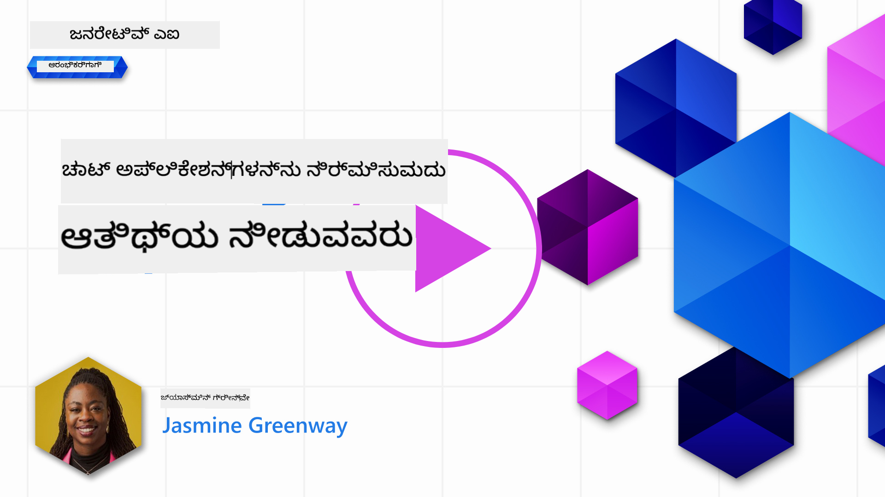
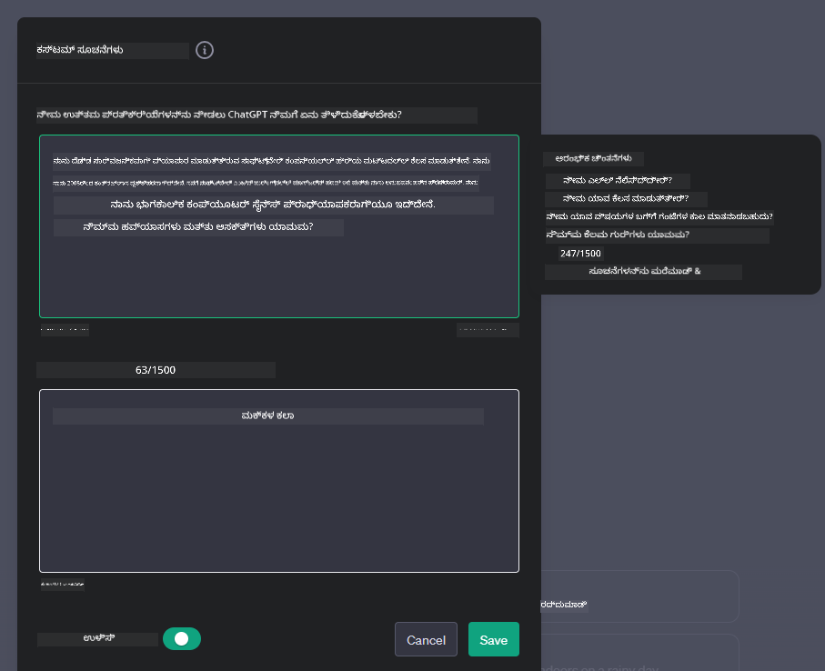
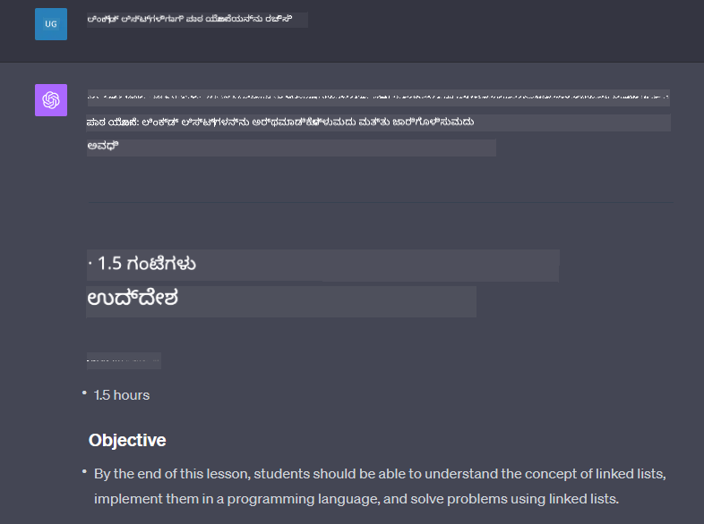

<!--
CO_OP_TRANSLATOR_METADATA:
{
  "original_hash": "a5308963a56cfbad2d73b0fa99fe84b3",
  "translation_date": "2025-12-19T19:44:31+00:00",
  "source_file": "07-building-chat-applications/README.md",
  "language_code": "kn"
}
-->
# ಜನರೇಟಿವ್ AI-ಚಾಲಿತ ಚಾಟ್ ಅಪ್ಲಿಕೇಶನ್‌ಗಳನ್ನು ನಿರ್ಮಿಸುವುದು

[](https://youtu.be/R9V0ZY1BEQo?si=IHuU-fS9YWT8s4sA)

> _(ಈ ಪಾಠದ ವೀಡಿಯೋವನ್ನು ನೋಡಲು ಮೇಲಿನ ಚಿತ್ರವನ್ನು ಕ್ಲಿಕ್ ಮಾಡಿ)_

ನಾವು ಈಗಾಗಲೇ ಪಠ್ಯ-ಉತ್ಪಾದನಾ ಅಪ್ಲಿಕೇಶನ್‌ಗಳನ್ನು ಹೇಗೆ ನಿರ್ಮಿಸಬಹುದು ಎಂದು ನೋಡಿದ್ದೇವೆ, ಈಗ ಚಾಟ್ ಅಪ್ಲಿಕೇಶನ್‌ಗಳ ಕಡೆಗೆ ನೋಡೋಣ.

ಚಾಟ್ ಅಪ್ಲಿಕೇಶನ್‌ಗಳು ನಮ್ಮ ದೈನಂದಿನ ಜೀವನದಲ್ಲಿ ಅಳವಡಿಸಿಕೊಂಡಿವೆ, ಕೇವಲ ಸಾಮಾನ್ಯ ಸಂಭಾಷಣೆಯ ಸಾಧನವಾಗಿರುವುದಕ್ಕಿಂತ ಹೆಚ್ಚು. ಅವು ಗ್ರಾಹಕ ಸೇವೆ, ತಾಂತ್ರಿಕ ಬೆಂಬಲ ಮತ್ತು ಜಟಿಲ ಸಲಹಾ ವ್ಯವಸ್ಥೆಗಳ ಅವಿಭಾಜ್ಯ ಭಾಗಗಳಾಗಿವೆ. ನೀವು ಇತ್ತೀಚೆಗೆ ಚಾಟ್ ಅಪ್ಲಿಕೇಶನ್‌ನಿಂದ ಸಹಾಯ ಪಡೆದಿರಬಹುದು. ಜನರೇಟಿವ್ AI ಮುಂತಾದ ಹೆಚ್ಚು ಪ್ರಗತಿಶೀಲ ತಂತ್ರಜ್ಞಾನಗಳನ್ನು ಈ ವೇದಿಕೆಗಳಲ್ಲಿ ಅಳವಡಿಸುವಂತೆ, ಜಟಿಲತೆ ಮತ್ತು ಸವಾಲುಗಳು ಹೆಚ್ಚಾಗುತ್ತವೆ.

ನಮಗೆ ಉತ್ತರ ಬೇಕಾದ ಕೆಲವು ಪ್ರಶ್ನೆಗಳು:

- **ಅಪ್ಲಿಕೇಶನ್ ನಿರ್ಮಾಣ**. ನಾವು ಈ AI-ಚಾಲಿತ ಅಪ್ಲಿಕೇಶನ್‌ಗಳನ್ನು ನಿರ್ದಿಷ್ಟ ಬಳಕೆ ಪ್ರಕರಣಗಳಿಗೆ ಪರಿಣಾಮಕಾರಿಯಾಗಿ ಹೇಗೆ ನಿರ್ಮಿಸಿ ಸೌಮ್ಯವಾಗಿ ಅಳವಡಿಸಬಹುದು?
- **ನಿಗಾ**. ನಿಯೋಜಿಸಿದ ನಂತರ, ಅಪ್ಲಿಕೇಶನ್‌ಗಳು ಕಾರ್ಯಕ್ಷಮತೆಯ ಮತ್ತು [ಜವಾಬ್ದಾರಿಯುತ AI ಆರು ತತ್ವಗಳು](https://www.microsoft.com/ai/responsible-ai?WT.mc_id=academic-105485-koreyst) ಪಾಲನೆ ಮಾಡುವುದರಲ್ಲಿ ಅತ್ಯುತ್ತಮ ಮಟ್ಟದಲ್ಲಿ ಕಾರ್ಯನಿರ್ವಹಿಸುತ್ತಿರುವುದನ್ನು ನಾವು ಹೇಗೆ ನಿಗಾ ವಹಿಸಬಹುದು?

ಸ್ವಯಂಚಾಲಿತ ಮತ್ತು ಸೌಮ್ಯ ಮಾನವ-ಯಂತ್ರ ಸಂವಹನಗಳಿಂದ ನಿರ್ಧರಿಸಲ್ಪಟ್ಟ ಯುಗದಲ್ಲಿ ನಾವು ಮುಂದುವರಿದಂತೆ, ಜನರೇಟಿವ್ AI ಚಾಟ್ ಅಪ್ಲಿಕೇಶನ್‌ಗಳ ವ್ಯಾಪ್ತಿ, ಆಳತೆ ಮತ್ತು ಹೊಂದಾಣಿಕೆಯನ್ನು ಹೇಗೆ ಪರಿವರ್ತಿಸುತ್ತದೆ ಎಂಬುದನ್ನು ಅರ್ಥಮಾಡಿಕೊಳ್ಳುವುದು ಅಗತ್ಯ. ಈ ಪಾಠವು ಈ ಜಟಿಲ ವ್ಯವಸ್ಥೆಗಳನ್ನು ಬೆಂಬಲಿಸುವ ವಾಸ್ತುಶಿಲ್ಪದ ಅಂಶಗಳನ್ನು ಪರಿಶೀಲಿಸುತ್ತದೆ, ಡೊಮೇನ್-ನಿರ್ದಿಷ್ಟ ಕಾರ್ಯಗಳಿಗೆ ಅವುಗಳನ್ನು ಸೂಕ್ಷ್ಮವಾಗಿ ಹೊಂದಿಸುವ ವಿಧಾನಗಳನ್ನು ವಿಶ್ಲೇಷಿಸುತ್ತದೆ ಮತ್ತು ಜವಾಬ್ದಾರಿಯುತ AI ನಿಯೋಜನೆಗಾಗಿ ಸಂಬಂಧಿತ ಮೌಲ್ಯಮಾಪನ ಮತ್ತು ಪರಿಗಣನೆಗಳನ್ನು ಮೌಲ್ಯಮಾಪನ ಮಾಡುತ್ತದೆ.

## ಪರಿಚಯ

ಈ ಪಾಠವು ಒಳಗೊಂಡಿದೆ:

- ಚಾಟ್ ಅಪ್ಲಿಕೇಶನ್‌ಗಳನ್ನು ಪರಿಣಾಮಕಾರಿಯಾಗಿ ನಿರ್ಮಿಸುವ ಮತ್ತು ಅಳವಡಿಸುವ ತಂತ್ರಗಳು.
- ಅಪ್ಲಿಕೇಶನ್‌ಗಳಿಗೆ ಕಸ್ಟಮೈಜೆಷನ್ ಮತ್ತು ಸೂಕ್ಷ್ಮ-ಸಂಯೋಜನೆ ಹೇಗೆ ಅನ್ವಯಿಸುವುದು.
- ಚಾಟ್ ಅಪ್ಲಿಕೇಶನ್‌ಗಳನ್ನು ಪರಿಣಾಮಕಾರಿಯಾಗಿ ನಿಗಾ ವಹಿಸುವ ತಂತ್ರಗಳು ಮತ್ತು ಪರಿಗಣನೆಗಳು.

## ಕಲಿಕೆಯ ಗುರಿಗಳು

ಈ ಪಾಠದ ಅಂತ್ಯಕ್ಕೆ, ನೀವು ಸಾಧ್ಯವಾಗುವುದು:

- ಚಾಟ್ ಅಪ್ಲಿಕೇಶನ್‌ಗಳನ್ನು ನಿರ್ಮಿಸುವ ಮತ್ತು ಇತ್ತೀಚಿನ ವ್ಯವಸ್ಥೆಗಳಿಗೆ ಅಳವಡಿಸುವಾಗ ಪರಿಗಣಿಸಬೇಕಾದ ಅಂಶಗಳನ್ನು ವರ್ಣಿಸುವುದು.
- ನಿರ್ದಿಷ್ಟ ಬಳಕೆ ಪ್ರಕರಣಗಳಿಗೆ ಚಾಟ್ ಅಪ್ಲಿಕೇಶನ್‌ಗಳನ್ನು ಕಸ್ಟಮೈಸ್ ಮಾಡುವುದು.
- AI-ಚಾಲಿತ ಚಾಟ್ ಅಪ್ಲಿಕೇಶನ್‌ಗಳ ಗುಣಮಟ್ಟವನ್ನು ಪರಿಣಾಮಕಾರಿಯಾಗಿ ನಿಗಾ ವಹಿಸಲು ಮುಖ್ಯ ಮೌಲ್ಯಮಾಪನ ಮತ್ತು ಪರಿಗಣನೆಗಳನ್ನು ಗುರುತಿಸುವುದು.
- ಚಾಟ್ ಅಪ್ಲಿಕೇಶನ್‌ಗಳು AI ಅನ್ನು ಜವಾಬ್ದಾರಿಯುತವಾಗಿ ಬಳಸುವಂತೆ ಖಚಿತಪಡಿಸುವುದು.

## ಜನರೇಟಿವ್ AI ಅನ್ನು ಚಾಟ್ ಅಪ್ಲಿಕೇಶನ್‌ಗಳಲ್ಲಿ ಅಳವಡಿಸುವುದು

ಜನರೇಟಿವ್ AI ಮೂಲಕ ಚಾಟ್ ಅಪ್ಲಿಕೇಶನ್‌ಗಳನ್ನು ಉತ್ತೇಜಿಸುವುದು ಅವುಗಳನ್ನು ಹೆಚ್ಚು ಬುದ್ಧಿವಂತಿಕೆಯಿಂದ ಮಾಡುವುದು ಮಾತ್ರವಲ್ಲ; ಗುಣಮಟ್ಟದ ಬಳಕೆದಾರ ಅನುಭವವನ್ನು ಒದಗಿಸಲು ಅವುಗಳ ವಾಸ್ತುಶಿಲ್ಪ, ಕಾರ್ಯಕ್ಷಮತೆ ಮತ್ತು ಬಳಕೆದಾರ ಇಂಟರ್ಫೇಸ್ ಅನ್ನು ಸುಧಾರಿಸುವುದಾಗಿದೆ. ಇದಕ್ಕೆ ವಾಸ್ತುಶಿಲ್ಪದ ಮೂಲಭೂತ ಅಂಶಗಳು, API ಅಳವಡಿಕೆಗಳು ಮತ್ತು ಬಳಕೆದಾರ ಇಂಟರ್ಫೇಸ್ ಪರಿಗಣನೆಗಳನ್ನು ಪರಿಶೀಲಿಸುವುದು ಸೇರಿದೆ. ಈ ವಿಭಾಗವು ನೀವು ಇವುಗಳನ್ನು ಇತ್ತೀಚಿನ ವ್ಯವಸ್ಥೆಗಳಿಗೆ ಸಂಪರ್ಕಿಸುವಾಗ ಅಥವಾ ಸ್ವತಂತ್ರ ವೇದಿಕೆಗಳಾಗಿ ನಿರ್ಮಿಸುವಾಗ ಈ ಜಟಿಲ ಭೂಮಿಗಳನ್ನು ನಾವಿಗೇಟ್ ಮಾಡಲು ಸಮಗ್ರ ಮಾರ್ಗಸೂಚಿಯನ್ನು ನೀಡಲು ಉದ್ದೇಶಿಸಿದೆ.

ಈ ವಿಭಾಗದ ಅಂತ್ಯಕ್ಕೆ, ನೀವು ಚಾಟ್ ಅಪ್ಲಿಕೇಶನ್‌ಗಳನ್ನು ಪರಿಣಾಮಕಾರಿಯಾಗಿ ನಿರ್ಮಿಸಿ ಅಳವಡಿಸುವ ಪರಿಣಿತಿಯನ್ನು ಹೊಂದಿರುತ್ತೀರಿ.

### ಚಾಟ್‌ಬಾಟ್ ಅಥವಾ ಚಾಟ್ ಅಪ್ಲಿಕೇಶನ್?

ಚಾಟ್ ಅಪ್ಲಿಕೇಶನ್‌ಗಳನ್ನು ನಿರ್ಮಿಸುವ ಮೊದಲು, 'ಚಾಟ್‌ಬಾಟ್‌ಗಳು' ಮತ್ತು 'AI-ಚಾಲಿತ ಚಾಟ್ ಅಪ್ಲಿಕೇಶನ್‌ಗಳು' ಎಂಬ ಎರಡು ವಿಭಿನ್ನ ಪಾತ್ರಗಳು ಮತ್ತು ಕಾರ್ಯಕ್ಷಮತೆಗಳನ್ನು ಹೊಂದಿರುವವುಗಳನ್ನು ಹೋಲಿಸೋಣ. ಚಾಟ್‌ಬಾಟ್‌ನ ಮುಖ್ಯ ಉದ್ದೇಶವು ನಿರ್ದಿಷ್ಟ ಸಂಭಾಷಣಾ ಕಾರ್ಯಗಳನ್ನು ಸ್ವಯಂಚಾಲಿತಗೊಳಿಸುವುದು, ಉದಾಹರಣೆಗೆ ಸಾಮಾನ್ಯವಾಗಿ ಕೇಳಲಾಗುವ ಪ್ರಶ್ನೆಗಳಿಗೆ ಉತ್ತರಿಸುವುದು ಅಥವಾ ಪ್ಯಾಕೇಜ್ ಟ್ರ್ಯಾಕ್ ಮಾಡುವುದು. ಇದು ಸಾಮಾನ್ಯವಾಗಿ ನಿಯಮಾಧಾರಿತ ತರ್ಕ ಅಥವಾ ಜಟಿಲ AI ಅಲ್ಗಾರಿದಮ್‌ಗಳಿಂದ ನಿಯಂತ್ರಿತವಾಗಿರುತ್ತದೆ. ವಿರುದ್ಧವಾಗಿ, AI-ಚಾಲಿತ ಚಾಟ್ ಅಪ್ಲಿಕೇಶನ್ ಒಂದು ಬಹುಮುಖ ಡಿಜಿಟಲ್ ಸಂವಹನ ವಾತಾವರಣವನ್ನು ಒದಗಿಸಲು ವಿನ್ಯಾಸಗೊಳಿಸಲಾಗಿದೆ, ಉದಾಹರಣೆಗೆ ಪಠ್ಯ, ಧ್ವನಿ ಮತ್ತು ವೀಡಿಯೋ ಚಾಟ್‌ಗಳು ಮಾನವ ಬಳಕೆದಾರರ ನಡುವೆ. ಇದರ ಪ್ರಮುಖ ಲಕ್ಷಣವು ಜನರೇಟಿವ್ AI ಮಾದರಿಯನ್ನು ಅಳವಡಿಸುವುದು, ಇದು ನುಡಿಮುತ್ತು, ಮಾನವ-ಹಾಗೆ ಸಂಭಾಷಣೆಗಳನ್ನು ಅನುಕರಿಸುತ್ತದೆ, ವಿವಿಧ ಇನ್ಪುಟ್ ಮತ್ತು ಸಾಂದರ್ಭಿಕ ಸೂಚನೆಗಳ ಆಧಾರದ ಮೇಲೆ ಪ್ರತಿಕ್ರಿಯೆಗಳನ್ನು ರಚಿಸುತ್ತದೆ. ಜನರೇಟಿವ್ AI ಚಾಲಿತ ಚಾಟ್ ಅಪ್ಲಿಕೇಶನ್ ತೆರೆಯಲಾದ ಕ್ಷೇತ್ರದ ಚರ್ಚೆಗಳಲ್ಲಿ ತೊಡಗಿಸಿಕೊಳ್ಳಬಹುದು, ಸಂಭಾಷಣಾ ಸಾಂದರ್ಭಿಕತೆಗಳಿಗೆ ಹೊಂದಿಕೊಳ್ಳಬಹುದು ಮತ್ತು ಸೃಜನಾತ್ಮಕ ಅಥವಾ ಜಟಿಲ ಸಂಭಾಷಣೆಯನ್ನು ಉತ್ಪಾದಿಸಬಹುದು.

ಕೆಳಗಿನ ಪಟ್ಟಿಯಲ್ಲಿ ಅವುಗಳ ಪ್ರಮುಖ ವ್ಯತ್ಯಾಸಗಳು ಮತ್ತು ಸಾದೃಶ್ಯಗಳನ್ನು ವಿವರಿಸಲಾಗಿದೆ, ಇದು ಡಿಜಿಟಲ್ ಸಂವಹನದಲ್ಲಿ ಅವುಗಳ ವಿಶಿಷ್ಟ ಪಾತ್ರಗಳನ್ನು ಅರ್ಥಮಾಡಿಕೊಳ್ಳಲು ಸಹಾಯ ಮಾಡುತ್ತದೆ.

| ಚಾಟ್‌ಬಾಟ್                               | ಜನರೇಟಿವ್ AI-ಚಾಲಿತ ಚಾಟ್ ಅಪ್ಲಿಕೇಶನ್ |
| ------------------------------------- | -------------------------------------- |
| ಕಾರ್ಯ-ಕೇಂದ್ರೀಕೃತ ಮತ್ತು ನಿಯಮಾಧಾರಿತ     | ಸಾಂದರ್ಭಿಕ-ಜಾಗರೂಕ                      |
| ಹೆಚ್ಚಿನ ವ್ಯವಸ್ಥೆಗಳಲ್ಲಿ ಅಳವಡಿಸಲಾಗಿದೆ     | ಒಂದು ಅಥವಾ ಹೆಚ್ಚಿನ ಚಾಟ್‌ಬಾಟ್‌ಗಳನ್ನು ಹೊಂದಿರಬಹುದು |
| ನಿರ್ದಿಷ್ಟ ಕಾರ್ಯಗಳಿಗೆ ಸೀಮಿತ            | ಜನರೇಟಿವ್ AI ಮಾದರಿಗಳನ್ನು ಒಳಗೊಂಡಿದೆ    |
| ವಿಶೇಷ ಮತ್ತು ರಚನಾತ್ಮಕ ಸಂವಹನಗಳು       | ತೆರೆಯಲಾದ ಕ್ಷೇತ್ರದ ಚರ್ಚೆಗಳಿಗೆ ಸಾಮರ್ಥ್ಯವಿದೆ |

### SDK ಮತ್ತು APIಗಳೊಂದಿಗೆ ಪೂರ್ವ-ನಿರ್ಮಿತ ಕಾರ್ಯಕ್ಷಮತೆಗಳನ್ನು ಉಪಯೋಗಿಸುವುದು

ಚಾಟ್ ಅಪ್ಲಿಕೇಶನ್ ನಿರ್ಮಿಸುವಾಗ, ಮೊದಲನೆಯದಾಗಿ ಈಗಾಗಲೇ ಏನು ಲಭ್ಯವಿದೆ ಎಂದು ಅಂದಾಜಿಸುವುದು ಉತ್ತಮ. SDK ಮತ್ತು APIಗಳನ್ನು ಉಪಯೋಗಿಸಿ ಚಾಟ್ ಅಪ್ಲಿಕೇಶನ್‌ಗಳನ್ನು ನಿರ್ಮಿಸುವುದು ವಿವಿಧ ಕಾರಣಗಳಿಂದ ಲಾಭದಾಯಕ ತಂತ್ರವಾಗಿದೆ. ಚೆನ್ನಾಗಿ ದಾಖಲೆಗೊಳಿಸಿದ SDK ಮತ್ತು APIಗಳನ್ನು ಅಳವಡಿಸುವ ಮೂಲಕ, ನೀವು ನಿಮ್ಮ ಅಪ್ಲಿಕೇಶನ್ ಅನ್ನು ದೀರ್ಘಕಾಲಿಕ ಯಶಸ್ಸಿಗಾಗಿ ತಂತ್ರವಾಗಿ ಸ್ಥಾಪಿಸುತ್ತಿದ್ದೀರಿ, ವಿಸ್ತರಣೆ ಮತ್ತು ನಿರ್ವಹಣಾ ಸಮಸ್ಯೆಗಳನ್ನು ಪರಿಹರಿಸುತ್ತಿದ್ದೀರಿ.

- **ವಿಕಸನ ಪ್ರಕ್ರಿಯೆಯನ್ನು ವೇಗಗೊಳಿಸುತ್ತದೆ ಮತ್ತು ಭಾರವನ್ನು ಕಡಿಮೆ ಮಾಡುತ್ತದೆ**: ಸ್ವತಃ ನಿರ್ಮಿಸುವ ದುಬಾರಿ ಪ್ರಕ್ರಿಯೆಯ ಬದಲು ಪೂರ್ವ-ನಿರ್ಮಿತ ಕಾರ್ಯಕ್ಷಮತೆಗಳ ಮೇಲೆ ಅವಲಂಬಿಸುವುದು, ನೀವು ನಿಮ್ಮ ಅಪ್ಲಿಕೇಶನ್‌ನ ಇತರ ಪ್ರಮುಖ ಅಂಶಗಳ ಮೇಲೆ ಗಮನಹರಿಸಲು ಸಹಾಯ ಮಾಡುತ್ತದೆ, ಉದಾಹರಣೆಗೆ ವ್ಯವಹಾರ ತರ್ಕ.
- **ಉತ್ತಮ ಕಾರ್ಯಕ್ಷಮತೆ**: ಕಾರ್ಯಕ್ಷಮತೆಯನ್ನು ಶೂನ್ಯದಿಂದ ನಿರ್ಮಿಸುವಾಗ, ನೀವು "ಇದು ಹೇಗೆ ವಿಸ್ತಾರಗೊಳ್ಳುತ್ತದೆ? ಈ ಅಪ್ಲಿಕೇಶನ್ ಅಕಸ್ಮಾತ್ ಬಳಕೆದಾರರ ಪ್ರವಾಹವನ್ನು ನಿರ್ವಹಿಸಲು ಸಾಮರ್ಥ್ಯವಿದೆಯೇ?" ಎಂದು ಕೇಳಬಹುದು. ಚೆನ್ನಾಗಿ ನಿರ್ವಹಿಸಲಾದ SDK ಮತ್ತು APIಗಳು ಈ ಸಮಸ್ಯೆಗಳಿಗೆ ಒಳಗೊಂಡ ಪರಿಹಾರಗಳನ್ನು ಹೊಂದಿರುತ್ತವೆ.
- **ಸರಳ ನಿರ್ವಹಣೆ**: ಅಪ್ಡೇಟ್‌ಗಳು ಮತ್ತು ಸುಧಾರಣೆಗಳನ್ನು ನಿರ್ವಹಿಸುವುದು ಸುಲಭ, ಏಕೆಂದರೆ ಹೆಚ್ಚಿನ API ಮತ್ತು SDKಗಳಿಗೆ ಹೊಸ ಆವೃತ್ತಿ ಬಿಡುಗಡೆಯಾಗುವಾಗ ಲೈಬ್ರರಿಯನ್ನು ಅಪ್ಡೇಟ್ ಮಾಡಬೇಕಾಗುತ್ತದೆ.
- **ಅತ್ಯಾಧುನಿಕ ತಂತ್ರಜ್ಞಾನಕ್ಕೆ ಪ್ರವೇಶ**: ವಿಶಾಲ ಡೇಟಾಸೆಟ್‌ಗಳ ಮೇಲೆ ಸೂಕ್ಷ್ಮವಾಗಿ ತರಬೇತಿ ಪಡೆದ ಮಾದರಿಗಳನ್ನು ಉಪಯೋಗಿಸುವ ಮೂಲಕ ನಿಮ್ಮ ಅಪ್ಲಿಕೇಶನ್‌ಗೆ ನೈಸರ್ಗಿಕ ಭಾಷಾ ಸಾಮರ್ಥ್ಯಗಳನ್ನು ಒದಗಿಸುತ್ತದೆ.

SDK ಅಥವಾ API ಕಾರ್ಯಕ್ಷಮತೆಯನ್ನು ಪ್ರವೇಶಿಸುವುದು ಸಾಮಾನ್ಯವಾಗಿ ಒದಗಿಸಿದ ಸೇವೆಗಳನ್ನು ಬಳಸಲು ಅನುಮತಿ ಪಡೆಯುವುದನ್ನು ಒಳಗೊಂಡಿರುತ್ತದೆ, ಇದು ಸಾಮಾನ್ಯವಾಗಿ ವಿಶಿಷ್ಟ ಕೀ ಅಥವಾ ಪ್ರಮಾಣೀಕರಣ ಟೋಕನ್ ಬಳಕೆ ಮೂಲಕ ಆಗುತ್ತದೆ. ನಾವು OpenAI ಪೈಥಾನ್ ಲೈಬ್ರರಿಯನ್ನು ಉಪಯೋಗಿಸಿ ಇದನ್ನು ಅನ್ವೇಷಿಸುವೆವು. ನೀವು ಈ ಪಾಠಕ್ಕಾಗಿ ಕೆಳಗಿನ [OpenAI ನೋಟ್ಬುಕ್](./python/oai-assignment.ipynb?WT.mc_id=academic-105485-koreyst) ಅಥವಾ [Azure OpenAI ಸೇವೆಗಳ ನೋಟ್ಬುಕ್](./python/aoai-assignment.ipynb?WT.mc_id=academic-105485-koreys) ನಲ್ಲಿ ಸ್ವತಃ ಪ್ರಯತ್ನಿಸಬಹುದು.

```python
import os
from openai import OpenAI

API_KEY = os.getenv("OPENAI_API_KEY","")

client = OpenAI(
    api_key=API_KEY
    )

chat_completion = client.chat.completions.create(model="gpt-3.5-turbo", messages=[{"role": "user", "content": "Suggest two titles for an instructional lesson on chat applications for generative AI."}])
```

ಮೇಲಿನ ಉದಾಹರಣೆಯಲ್ಲಿ GPT-3.5 ಟರ್ಬೋ ಮಾದರಿಯನ್ನು ಪ್ರಾಂಪ್ಟ್ ಪೂರ್ಣಗೊಳಿಸಲು ಬಳಸಲಾಗಿದೆ, ಆದರೆ API ಕೀ ಅನ್ನು ಮುಂಚಿತವಾಗಿ ಸೆಟ್ ಮಾಡಲಾಗಿದೆ ಎಂದು ಗಮನಿಸಿ. ನೀವು ಕೀ ಸೆಟ್ ಮಾಡದಿದ್ದರೆ ದೋಷ ಬರುತ್ತಿತ್ತು.

## ಬಳಕೆದಾರ ಅನುಭವ (UX)

ಸಾಮಾನ್ಯ UX ತತ್ವಗಳು ಚಾಟ್ ಅಪ್ಲಿಕೇಶನ್‌ಗಳಿಗೆ ಅನ್ವಯಿಸುತ್ತವೆ, ಆದರೆ ಇಲ್ಲಿ ಯಂತ್ರ ಅಧ್ಯಯನ ಘಟಕಗಳ ಕಾರಣದಿಂದ ವಿಶೇಷವಾಗಿ ಪ್ರಮುಖವಾಗುವ ಕೆಲವು ಹೆಚ್ಚುವರಿ ಪರಿಗಣನೆಗಳಿವೆ.

- **ಅಸ್ಪಷ್ಟತೆಯನ್ನು ಪರಿಹರಿಸುವ ಯಂತ್ರ**: ಜನರೇಟಿವ್ AI ಮಾದರಿಗಳು ಕೆಲವೊಮ್ಮೆ ಅಸ್ಪಷ್ಟ ಉತ್ತರಗಳನ್ನು ಉತ್ಪಾದಿಸುತ್ತವೆ. ಬಳಕೆದಾರರು ಸ್ಪಷ್ಟೀಕರಣ ಕೇಳಲು ಸಾಧ್ಯವಾಗುವ ವೈಶಿಷ್ಟ್ಯವು ಈ ಸಮಸ್ಯೆಯನ್ನು ಎದುರಿಸಿದಾಗ ಸಹಾಯಕವಾಗಬಹುದು.
- **ಸಂದರ್ಭ ಸಂರಕ್ಷಣೆ**: ಪ್ರಗತಿಶೀಲ ಜನರೇಟಿವ್ AI ಮಾದರಿಗಳು ಸಂಭಾಷಣೆಯೊಳಗಿನ ಸಾಂದರ್ಭಿಕತೆಯನ್ನು ನೆನಪಿಡುವ ಸಾಮರ್ಥ್ಯವನ್ನು ಹೊಂದಿವೆ, ಇದು ಬಳಕೆದಾರ ಅನುಭವಕ್ಕೆ ಅಗತ್ಯವಾದ ಆಸ್ತಿ ಆಗಬಹುದು. ಬಳಕೆದಾರರಿಗೆ ಸಾಂದರ್ಭಿಕತೆಯನ್ನು ನಿಯಂತ್ರಿಸಲು ಮತ್ತು ನಿರ್ವಹಿಸಲು ಅವಕಾಶ ನೀಡುವುದು ಬಳಕೆದಾರ ಅನುಭವವನ್ನು ಸುಧಾರಿಸುತ್ತದೆ, ಆದರೆ ಸಂವೇದನಾಶೀಲ ಬಳಕೆದಾರ ಮಾಹಿತಿಯನ್ನು ಸಂರಕ್ಷಿಸುವ ಅಪಾಯವನ್ನು ಪರಿಚಯಿಸುತ್ತದೆ. ಈ ಮಾಹಿತಿಯನ್ನು ಎಷ್ಟು ಕಾಲ ಸಂರಕ್ಷಿಸುವುದು ಎಂಬುದರ ಪರಿಗಣನೆಗಳು, ಉದಾಹರಣೆಗೆ ಸಂರಕ್ಷಣಾ ನೀತಿಯನ್ನು ಪರಿಚಯಿಸುವುದು, ಸಾಂದರ್ಭಿಕತೆಯ ಅಗತ್ಯ ಮತ್ತು ಗೌಪ್ಯತೆಯ ನಡುವೆ ಸಮತೋಲನವನ್ನು ಸಾಧಿಸಬಹುದು.
- **ವೈಯಕ್ತೀಕರಣ**: ಕಲಿಯುವ ಮತ್ತು ಹೊಂದಿಕೊಳ್ಳುವ ಸಾಮರ್ಥ್ಯದಿಂದ, AI ಮಾದರಿಗಳು ಬಳಕೆದಾರರಿಗೆ ವೈಯಕ್ತಿಕ ಅನುಭವವನ್ನು ಒದಗಿಸುತ್ತವೆ. ಬಳಕೆದಾರ ಪ್ರೊಫೈಲ್‌ಗಳಂತಹ ವೈಶಿಷ್ಟ್ಯಗಳ ಮೂಲಕ ಬಳಕೆದಾರ ಅನುಭವವನ್ನು ವೈಯಕ್ತೀಕರಿಸುವುದು ಬಳಕೆದಾರನಿಗೆ ಅರ್ಥಮಾಡಿಕೊಳ್ಳಲ್ಪಟ್ಟಿರುವ ಭಾವನೆಯನ್ನು ನೀಡುತ್ತದೆ ಮತ್ತು ನಿರ್ದಿಷ್ಟ ಉತ್ತರಗಳನ್ನು ಹುಡುಕುವ ಅವರ ಪ್ರಯತ್ನವನ್ನು ಸಹ ಸಹಾಯ ಮಾಡುತ್ತದೆ, ಪರಿಣಾಮಕಾರಿಯಾದ ಮತ್ತು ತೃಪ್ತಿದಾಯಕ ಸಂವಹನವನ್ನು ಸೃಷ್ಟಿಸುತ್ತದೆ.

ವೈಯಕ್ತೀಕರಣದ ಒಂದು ಉದಾಹರಣೆ OpenAIನ ChatGPTಯ "ಕಸ್ಟಮ್ ಸೂಚನೆಗಳು" ಸೆಟ್ಟಿಂಗ್‌ಗಳಾಗಿದೆ. ಇದು ನಿಮ್ಮ ಪ್ರಾಂಪ್ಟ್‌ಗಳಿಗೆ ಪ್ರಮುಖ ಸಾಂದರ್ಭಿಕ ಮಾಹಿತಿಯನ್ನು ಒದಗಿಸಲು ನಿಮಗೆ ಅವಕಾಶ ನೀಡುತ್ತದೆ. ಇಲ್ಲಿದೆ ಒಂದು ಕಸ್ಟಮ್ ಸೂಚನೆಯ ಉದಾಹರಣೆ.



ಈ "ಪ್ರೊಫೈಲ್" ChatGPTಗೆ ಲಿಂಕ್ ಮಾಡಿದ ಪಟ್ಟಿಗಳ ಮೇಲೆ ಪಾಠ ಯೋಜನೆಯನ್ನು ರಚಿಸಲು ಸೂಚಿಸುತ್ತದೆ. ChatGPT ಬಳಕೆದಾರನ ಅನುಭವ ಆಧರಿಸಿ ಹೆಚ್ಚು ಆಳವಾದ ಪಾಠ ಯೋಜನೆಯನ್ನು ಬಯಸಬಹುದು ಎಂದು ಪರಿಗಣಿಸುತ್ತದೆ.



### ದೊಡ್ಡ ಭಾಷಾ ಮಾದರಿಗಳಿಗಾಗಿ ಮೈಕ್ರೋಸಾಫ್ಟ್‌ನ ಸಿಸ್ಟಮ್ ಸಂದೇಶ ಫ್ರೇಮ್ವರ್ಕ್

[ಮೈಕ್ರೋಸಾಫ್ಟ್ ಮಾರ್ಗದರ್ಶನ ನೀಡಿದೆ](https://learn.microsoft.com/azure/ai-services/openai/concepts/system-message#define-the-models-output-format?WT.mc_id=academic-105485-koreyst) LLMಗಳಿಂದ ಪ್ರತಿಕ್ರಿಯೆಗಳನ್ನು ರಚಿಸುವಾಗ ಪರಿಣಾಮಕಾರಿ ಸಿಸ್ಟಮ್ ಸಂದೇಶಗಳನ್ನು ಬರೆಯಲು, 4 ಭಾಗಗಳಲ್ಲಿ ವಿಭಜಿಸಲಾಗಿದೆ:

1. ಮಾದರಿ ಯಾರಿಗಾಗಿ ಮತ್ತು ಅದರ ಸಾಮರ್ಥ್ಯಗಳು ಮತ್ತು ಮಿತಿಗಳನ್ನು ನಿರ್ಧರಿಸುವುದು.
2. ಮಾದರಿಯ ಔಟ್‌ಪುಟ್ ಫಾರ್ಮ್ಯಾಟ್ ಅನ್ನು ನಿರ್ಧರಿಸುವುದು.
3. ಮಾದರಿಯ ಉದ್ದೇಶಿತ ವರ್ತನೆಯನ್ನು ತೋರಿಸುವ ನಿರ್ದಿಷ್ಟ ಉದಾಹರಣೆಗಳನ್ನು ಒದಗಿಸುವುದು.
4. ಹೆಚ್ಚುವರಿ ವರ್ತನಾ ರಕ್ಷಣೆಗಳನ್ನು ಒದಗಿಸುವುದು.

### ಪ್ರವೇಶಾರ್ಹತೆ

ಬಳಕೆದಾರರಿಗೆ ದೃಷ್ಟಿ, ಶ್ರವಣ, ಚಲನೆ ಅಥವಾ ಜ್ಞಾನಾತ್ಮಕ ಅಸಮರ್ಥತೆಗಳಿದ್ದರೂ, ಚೆನ್ನಾಗಿ ವಿನ್ಯಾಸಗೊಳಿಸಿದ ಚಾಟ್ ಅಪ್ಲಿಕೇಶನ್ ಎಲ್ಲರಿಗೂ ಬಳಕೆ ಮಾಡಲು ಸಾಧ್ಯವಾಗಬೇಕು. ಕೆಳಗಿನ ಪಟ್ಟಿ ವಿವಿಧ ಬಳಕೆದಾರ ಅಸಮರ್ಥತೆಗಳಿಗೆ ಪ್ರವೇಶಾರ್ಹತೆಯನ್ನು ಸುಧಾರಿಸಲು ಉದ್ದೇಶಿತ ವಿಶೇಷತೆಯನ್ನು ವಿವರಿಸುತ್ತದೆ.

- **ದೃಷ್ಟಿ ಅಸಮರ್ಥತೆಗಾಗಿ ವೈಶಿಷ್ಟ್ಯಗಳು**: ಉನ್ನತ ವಿರೋಧಿತ ಥೀಮ್‌ಗಳು ಮತ್ತು ಪುನರ್ ಗಾತ್ರಗೊಳಿಸಬಹುದಾದ ಪಠ್ಯ, ಸ್ಕ್ರೀನ್ ರೀಡರ್ ಹೊಂದಾಣಿಕೆ.
- **ಶ್ರವಣ ಅಸಮರ್ಥತೆಗಾಗಿ ವೈಶಿಷ್ಟ್ಯಗಳು**: ಪಠ್ಯದಿಂದ ಧ್ವನಿಗೆ ಮತ್ತು ಧ್ವನಿಯಿಂದ ಪಠ್ಯಕ್ಕೆ ಕಾರ್ಯಗಳು, ಧ್ವನಿ ಸೂಚನೆಗಳಿಗೆ ದೃಶ್ಯ ಸೂಚನೆಗಳು.
- **ಚಲನೆ ಅಸಮರ್ಥತೆಗಾಗಿ ವೈಶಿಷ್ಟ್ಯಗಳು**: ಕೀಬೋರ್ಡ್ ನ್ಯಾವಿಗೇಶನ್ ಬೆಂಬಲ, ಧ್ವನಿ ಆಜ್ಞೆಗಳು.
- **ಜ್ಞಾನಾತ್ಮಕ ಅಸಮರ್ಥತೆಗಾಗಿ ವೈಶಿಷ್ಟ್ಯಗಳು**: ಸರಳೀಕೃತ ಭಾಷಾ ಆಯ್ಕೆಗಳು.

## ಡೊಮೇನ್-ನಿರ್ದಿಷ್ಟ ಭಾಷಾ ಮಾದರಿಗಳಿಗಾಗಿ ಕಸ್ಟಮೈಜೆಷನ್ ಮತ್ತು ಸೂಕ್ಷ್ಮ-ಸಂಯೋಜನೆ

ನಿಮ್ಮ ಕಂಪನಿಯ ಜಾರ್ಗನ್ ಅನ್ನು ಅರ್ಥಮಾಡಿಕೊಳ್ಳುವ ಮತ್ತು ಅದರ ಬಳಕೆದಾರರ ಸಾಮಾನ್ಯ ಪ್ರಶ್ನೆಗಳನ್ನು ಊಹಿಸುವ ಚಾಟ್ ಅಪ್ಲಿಕೇಶನ್ ಅನ್ನು ಕಲ್ಪಿಸಿ. ಇಲ್ಲಿ ಕೆಲವು ವಿಧಾನಗಳನ್ನು ಉಲ್ಲೇಖಿಸುವುದು ಸೂಕ್ತ:

- **DSL ಮಾದರಿಗಳನ್ನು ಉಪಯೋಗಿಸುವುದು**. DSL ಅಂದರೆ ಡೊಮೇನ್-ನಿರ್ದಿಷ್ಟ ಭಾಷೆ. ನೀವು ನಿರ್ದಿಷ್ಟ ಡೊಮೇನ್‌ನಲ್ಲಿ ತರಬೇತಿ ಪಡೆದ DSL ಮಾದರಿಯನ್ನು ಉಪಯೋಗಿಸಿ ಅದರ ಸಂಪ್ರದಾಯಗಳು ಮತ್ತು ಸಂದರ್ಭಗಳನ್ನು ಅರ್ಥಮಾಡಿಕೊಳ್ಳಬಹುದು.
- **ಸೂಕ್ಷ್ಮ-ಸಂಯೋಜನೆ ಅನ್ವಯಿಸುವುದು**. ಸೂಕ್ಷ್ಮ-ಸಂಯೋಜನೆ ಎಂದರೆ ನಿಮ್ಮ ಮಾದರಿಯನ್ನು ನಿರ್ದಿಷ್ಟ ಡೇಟಾ ಬಳಸಿ ಮತ್ತಷ್ಟು ತರಬೇತಿ ನೀಡುವ ಪ್ರಕ್ರಿಯೆ.

## ಕಸ್ಟಮೈಜೆಷನ್: DSL ಉಪಯೋಗಿಸುವುದು

ಡೊಮೇನ್-ನಿರ್ದಿಷ್ಟ ಭಾಷಾ ಮಾದರಿಗಳನ್ನು (DSL ಮಾದರಿಗಳು) ಉಪಯೋಗಿಸುವುದು ಬಳಕೆದಾರರ ತೊಡಗಿಸಿಕೊಳ್‌ವಿಕೆಯನ್ನು ಹೆಚ್ಚಿಸುತ್ತದೆ ಮತ್ತು ವಿಶೇಷ, ಸಾಂದರ್ಭಿಕವಾಗಿ ಸಂಬಂಧಿಸಿದ ಸಂವಹನಗಳನ್ನು ಒದಗಿಸುತ್ತದೆ. ಇದು ನಿರ್ದಿಷ್ಟ ಕ್ಷೇತ್ರ, ಉದ್ಯಮ ಅಥವಾ ವಿಷಯಕ್ಕೆ ಸಂಬಂಧಿಸಿದ ಪಠ್ಯವನ್ನು ಅರ್ಥಮಾಡಿಕೊಳ್ಳಲು ಮತ್ತು ರಚಿಸಲು ತರಬೇತಿ ಪಡೆದ ಅಥವಾ ಸೂಕ್ಷ್ಮ-ಸಂಯೋಜನೆಗೊಂಡ ಮಾದರಿಯಾಗಿದೆ. DSL ಮಾದರಿಯನ್ನು ಬಳಸುವ ಆಯ್ಕೆಗಳು ಶೂನ್ಯದಿಂದ ತರಬೇತಿ ನೀಡುವುದು, ಅಥವಾ SDK ಮತ್ತು APIಗಳ ಮೂಲಕ ಪೂರ್ವ-ಅಸ್ತಿತ್ವದಲ್ಲಿರುವ ಮಾದರಿಗಳನ್ನು ಉಪಯೋಗಿಸುವುದರಿಂದ ಬದಲಾಗಬಹುದು. ಇನ್ನೊಂದು ಆಯ್ಕೆ ಸೂಕ್ಷ್ಮ-ಸಂಯೋಜನೆ, ಅಂದರೆ ಪೂರ್ವ-ತರಬೇತಿ ಪಡೆದ ಮಾದರಿಯನ್ನು ತೆಗೆದು ನಿರ್ದಿಷ್ಟ ಡೊಮೇನ್‌ಗೆ ಹೊಂದಿಸುವುದು.

## ಕಸ್ಟಮೈಜೆಷನ್: ಸೂಕ್ಷ್ಮ-ಸಂಯೋಜನೆ ಅನ್ವಯಿಸುವುದು

ಸೂಕ್ಷ್ಮ-ಸಂಯೋಜನೆ ಸಾಮಾನ್ಯವಾಗಿ ಪೂರ್ವ-ತರಬೇತಿ ಪಡೆದ ಮಾದರಿ ವಿಶೇಷ ಡೊಮೇನ್ ಅಥವಾ ನಿರ್ದಿಷ್ಟ ಕಾರ್ಯದಲ್ಲಿ ತೃಪ್ತಿಪಡಿಸದಾಗ ಪರಿಗಣಿಸಲಾಗುತ್ತದೆ.

ಉದಾಹರಣೆಗೆ, ವೈದ್ಯಕೀಯ ಪ್ರಶ್ನೆಗಳು ಜಟಿಲವಾಗಿದ್ದು ಹೆಚ್ಚಿನ ಸಾಂದರ್ಭಿಕತೆಯನ್ನು ಅಗತ್ಯವಿರುತ್ತದೆ. ವೈದ್ಯಕೀಯ ವೃತ್ತಿಪರರು ರೋಗಿಯನ್ನು ನಿರ್ಣಯಿಸುವಾಗ ಜೀವನಶೈಲಿ ಅಥವಾ ಪೂರ್ವ-ಅವಸ್ಥೆಗಳಂತಹ ವಿವಿಧ ಅಂಶಗಳನ್ನು ಆಧರಿಸುತ್ತಾರೆ ಮತ್ತು ಇತ್ತೀಚಿನ ವೈದ್ಯಕೀಯ ಜರ್ನಲ್‌ಗಳನ್ನೂ ಅವಲಂಬಿಸಬಹುದು. ಇಂತಹ ಸೂಕ್ಷ್ಮ ಸಂದರ್ಭಗಳಲ್ಲಿ, ಸಾಮಾನ್ಯ ಉದ್ದೇಶದ AI ಚಾಟ್ ಅಪ್ಲಿಕೇಶನ್ ವಿಶ್ವಾಸಾರ್ಹ ಮೂಲವಾಗಿರಲು ಸಾಧ್ಯವಿಲ್ಲ.

### ದೃಶ್ಯ: ವೈದ್ಯಕೀಯ ಅಪ್ಲಿಕೇಶನ್

ವೈದ್ಯಕೀಯ ವೃತ್ತಿಪರರಿಗೆ ಚಿಕಿತ್ಸೆ ಮಾರ್ಗಸೂಚಿಗಳು, ಔಷಧಿ ಪರಸ್ಪರ ಕ್ರಿಯೆಗಳು ಅಥವಾ ಇತ್ತೀಚಿನ ಸಂಶೋಧನಾ ಕಂಡುಹಿಡಿತಗಳಿಗೆ ತ್ವರಿತ ಉಲ್ಲೇಖಗಳನ್ನು ಒದಗಿಸುವ ಚಾಟ್ ಅಪ್ಲಿಕೇಶನ್ ಅನ್ನು ಪರಿಗಣಿಸಿ.

ಸಾಮಾನ್ಯ ಉದ್ದೇಶದ ಮಾದರಿ ಮೂಲಭೂತ ವೈದ್ಯಕೀಯ ಪ್ರಶ್ನೆಗಳಿಗೆ ಉತ್ತರಿಸುವುದು ಅಥವಾ ಸಾಮಾನ್ಯ ಸಲಹೆ ನೀಡುವುದು ಸಾಕಾಗಬಹುದು, ಆದರೆ ಕೆಳಗಿನ ವಿಷಯಗಳಲ್ಲಿ ತೊಂದರೆ ಅನುಭವಿಸಬಹುದು:

- **ಅತ್ಯಂತ ನಿರ್ದಿಷ್ಟ ಅಥವಾ ಜಟಿಲ ಪ್ರಕರಣಗಳು**. ಉದಾಹರಣೆಗೆ, ನ್ಯೂರೋಲಾಜಿಸ್ಟ್ ಅಪ್ಲಿಕೇಶನ್‌ಗೆ ಕೇಳಬಹುದು, "ಮಕ್ಕಳಲ್ಲಿ ಔಷಧಿ ಪ್ರತಿರೋಧಿ ಎಪಿಲೆಪ್ಸಿಯನ್ನು ನಿರ್ವಹಿಸುವ ಅತ್ಯುತ್ತಮ ಪ್ರಕ್ರಿಯೆಗಳು ಯಾವುವು?"
- **ಇತ್ತೀಚಿನ ಪ್ರಗತಿಗಳ ಕೊರತೆ**. ಸಾಮಾನ್ಯ ಉದ್ದೇಶದ ಮಾದರಿ ನ್ಯೂರೋಲಜಿ ಮತ್ತು ಔಷಧಶಾಸ್ತ್ರದಲ್ಲಿ ಇತ್ತೀಚಿನ ಪ್ರಗತಿಗಳನ್ನು ಒಳಗೊಂಡ ಪ್ರಸ್ತುತ ಉತ್ತರವನ್ನು ನೀಡಲು ತೊಂದರೆ ಅನುಭವಿಸಬಹುದು.

ಇಂತಹ ಸಂದರ್ಭಗಳಲ್ಲಿ, ವಿಶೇಷ ವೈದ್ಯಕೀಯ ಡೇಟಾಸೆಟ್ ಬಳಸಿ ಮಾದರಿಯನ್ನು ಸೂಕ್ಷ್ಮ-ಸಂಯೋಜನೆ ಮಾಡುವುದು ಈ ಜಟಿಲ ವೈದ್ಯಕೀಯ ಪ್ರಶ್ನೆಗಳನ್ನು ಹೆಚ್ಚು ನಿಖರವಾಗಿ ಮತ್ತು ವಿಶ್ವಾಸಾರ್ಹವಾಗಿ ನಿರ್ವಹಿಸುವ ಸಾಮರ್ಥ್ಯವನ್ನು ಬಹುಮಟ್ಟಿಗೆ ಸುಧಾರಿಸುತ್ತದೆ. ಇದಕ್ಕೆ ಡೊಮೇನ್-ನಿರ್ದಿಷ್ಟ ಸವಾಲುಗಳು ಮತ್ತು ಪ್ರಶ್ನೆಗಳನ್ನು ಪ್ರತಿನಿಧಿಸುವ ದೊಡ್ಡ ಮತ್ತು ಸಂಬಂಧಿತ ಡೇಟಾಸೆಟ್‌ಗೆ ಪ್ರವೇಶ ಅಗತ್ಯವಿದೆ.

## ಉನ್ನತ ಗುಣಮಟ್ಟದ AI-ಚಾಲಿತ ಚಾಟ್ ಅನುಭವಕ್ಕಾಗಿ ಪರಿಗಣನೆಗಳು

ಈ ವಿಭಾಗವು "ಉನ್ನತ ಗುಣಮಟ್ಟದ" ಚಾಟ್ ಅಪ್ಲಿಕೇಶನ್‌ಗಳ ಮಾನದಂಡಗಳನ್ನು ವಿವರಿಸುತ್ತದೆ, ಇದರಲ್ಲಿ ಕಾರ್ಯನಿರ್ವಹಣೀಯ ಮೌಲ್ಯಮಾಪನಗಳನ್ನು ಸೆರೆಹಿಡಿಯುವುದು ಮತ್ತು ಜವಾಬ್ದಾರಿಯುತ AI ತಂತ್ರಜ್ಞಾನವನ್ನು ಬಳಸುವ ಫ್ರೇಮ್ವರ್ಕ್ ಪಾಲನೆ ಸೇರಿದೆ.

### ಪ್ರಮುಖ ಮೌಲ್ಯಮಾಪನಗಳು

ಅಪ್ಲಿಕೇಶನ್‌ನ ಉನ್ನತ ಗುಣಮಟ್ಟದ ಕಾರ್ಯಕ್ಷಮತೆಯನ್ನು ಕಾಪಾಡಿಕೊಳ್ಳಲು, ಮುಖ್ಯ ಮೌಲ್ಯಮಾಪನ ಮತ್ತು ಪರಿಗಣನೆಗಳನ್ನು ಗಮನದಲ್ಲಿರಿಸಬೇಕು. ಈ ಅಳತೆಗಳು ಅಪ್ಲಿಕೇಶನ್ ಕಾರ್ಯಕ್ಷಮತೆಯನ್ನು ಮಾತ್ರವಲ್ಲದೆ AI ಮಾದರಿ ಮತ್ತು ಬಳಕೆದಾರ ಅನುಭವದ ಗುಣಮಟ್ಟವನ್ನು ಮೌಲ್ಯಮಾಪನ ಮಾಡುತ್ತವೆ. ಕೆಳಗಿನ ಪಟ್ಟಿಯಲ್ಲಿ ಮೂಲ, AI ಮತ್ತು ಬಳಕೆದಾರ ಅನುಭವದ ಮೌಲ್ಯಮಾಪನಗಳನ್ನು ಒಳಗೊಂಡಿದೆ.

| ಮೌಲ್ಯಮಾಪನ                        | ವ್ಯಾಖ್ಯಾನ                                                                                                             | ಚಾಟ್ ಡೆವಲಪರ್‌ಗಾಗಿ ಪರಿಗಣನೆಗಳು                                         |
| ----------------------------- | ---------------------------------------------------------------------------------------------------------------------- | ------------------------------------------------------------------------- |
| **ಉಪಲಭ್ಯತೆ (Uptime)**                    | ಅಪ್ಲಿಕೇಶನ್ ಕಾರ್ಯನಿರ್ವಹಿಸುತ್ತಿರುವ ಮತ್ತು ಬಳಕೆದಾರರಿಗೆ ಲಭ್ಯವಿರುವ ಸಮಯವನ್ನು ಅಳೆಯುತ್ತದೆ.                                              | ನೀವು ಡೌನ್‌ಟೈಮ್ ಅನ್ನು ಹೇಗೆ ಕಡಿಮೆ ಮಾಡುತ್ತೀರಿ?                                           |
| **ಪ್ರತಿಕ್ರಿಯೆ ಸಮಯ (Response Time)**             | ಬಳಕೆದಾರರ ಪ್ರಶ್ನೆಗೆ ಅಪ್ಲಿಕೇಶನ್ ಉತ್ತರಿಸಲು ತೆಗೆದುಕೊಳ್ಳುವ ಸಮಯ.                                                          | ಪ್ರತಿಕ್ರಿಯೆ ಸಮಯವನ್ನು ಸುಧಾರಿಸಲು ನೀವು ಪ್ರಶ್ನೆ ಪ್ರಕ್ರಿಯೆಯನ್ನು ಹೇಗೆ ಸುಧಾರಿಸುತ್ತೀರಿ?           |
| **ನಿಖರತೆ (Precision)**                 | ಸಕಾರಾತ್ಮಕ ಭವಿಷ್ಯವಾಣಿಗಳ ಒಟ್ಟು ಸಂಖ್ಯೆಗೆ ನಿಜವಾದ ಸಕಾರಾತ್ಮಕ ಭವಿಷ್ಯವಾಣಿಗಳ ಅನುಪಾತ.                                     | ನಿಮ್ಮ ಮಾದರಿಯ ನಿಖರತೆಯನ್ನು ನೀವು ಹೇಗೆ ಪರಿಶೀಲಿಸುತ್ತೀರಿ?                        |
| **ಪುನಃಪರಿಗಣನೆ (Recall / ಸಂವೇದನಶೀಲತೆ)**      | ನಿಜವಾದ ಸಕಾರಾತ್ಮಕಗಳ ಒಟ್ಟು ಸಂಖ್ಯೆಗೆ ನಿಜವಾದ ಸಕಾರಾತ್ಮಕ ಭವಿಷ್ಯವಾಣಿಗಳ ಅನುಪಾತ.                                               | ನೀವು ಪುನಃಪರಿಗಣನೆಯನ್ನು ಹೇಗೆ ಅಳೆಯುತ್ತೀರಿ ಮತ್ತು ಸುಧಾರಿಸುತ್ತೀರಿ?                                  |
| **F1 ಅಂಕ (F1 Score)**                  | ನಿಖರತೆ ಮತ್ತು ಪುನಃಪರಿಗಣನೆಯ ಹಾರ್ಮೋನಿಕ್ ಸರಾಸರಿ, ಎರಡರಲ್ಲಿಯೂ ಸಮತೋಲನ ಸಾಧಿಸುತ್ತದೆ.                                   | ನಿಮ್ಮ ಗುರಿ F1 ಅಂಕ ಏನು? ನೀವು ನಿಖರತೆ ಮತ್ತು ಪುನಃಪರಿಗಣನೆಯನ್ನು ಹೇಗೆ ಸಮತೋಲಿಸುತ್ತೀರಿ?  |
| **ಪರ್ಪ್ಲೆಕ್ಸಿಟಿ (Perplexity)**                | ಮಾದರಿ ಭವಿಷ್ಯವಾಣಿ ಮಾಡಿದ ಪ್ರಾಬಬಿಲಿಟಿ ವಿತರಣೆಯು ಡೇಟಾದ ನಿಜವಾದ ವಿತರಣೆಯೊಂದಿಗೆ ಎಷ್ಟು ಹೊಂದಿಕೆಯಾಗುತ್ತದೆ ಎಂಬುದನ್ನು ಅಳೆಯುತ್ತದೆ. | ನೀವು ಪರ್ಪ್ಲೆಕ್ಸಿಟಿಯನ್ನು ಹೇಗೆ ಕಡಿಮೆ ಮಾಡುತ್ತೀರಿ?                                         |
| **ಬಳಕೆದಾರ ತೃಪ್ತಿ ಮೌಲ್ಯಮಾಪನಗಳು** | ಅಪ್ಲಿಕೇಶನ್ ಬಗ್ಗೆ ಬಳಕೆದಾರರ ಗ್ರಹಿಕೆಯನ್ನು ಅಳೆಯುತ್ತದೆ. ಸಾಮಾನ್ಯವಾಗಿ ಸಮೀಕ್ಷೆಗಳ ಮೂಲಕ ಸೆರೆಹಿಡಿಯಲಾಗುತ್ತದೆ.                                     | ನೀವು ಬಳಕೆದಾರ ಪ್ರತಿಕ್ರಿಯೆಯನ್ನು ಎಷ್ಟು ಬಾರಿ ಸಂಗ್ರಹಿಸುತ್ತೀರಿ? ಅದಕ್ಕೆ ಆಧಾರವಾಗಿ ನೀವು ಹೇಗೆ ಹೊಂದಿಕೊಳ್ಳುತ್ತೀರಿ? |
| **ದೋಷ ದರ (Error Rate)**                | ಮಾದರಿ ಅರ್ಥಮಾಡಿಕೊಳ್ಳುವ ಅಥವಾ ಔಟ್‌ಪುಟ್ ಮಾಡುವಾಗ ಮಾಡುವ ದೋಷಗಳ ದರ.                                                 | ದೋಷ ದರಗಳನ್ನು ಕಡಿಮೆ ಮಾಡಲು ನೀವು ಯಾವ ತಂತ್ರಗಳನ್ನು ಹೊಂದಿದ್ದೀರಿ?               |
| **ಮತ್ತೆ ತರಬೇತಿ ಚಕ್ರಗಳು (Retraining Cycles)**         | ಹೊಸ ಡೇಟಾ ಮತ್ತು ಒಳನೋಟಗಳನ್ನು ಒಳಗೊಂಡಂತೆ ಮಾದರಿಯನ್ನು ನವೀಕರಿಸುವ ಅವಧಿ.                                    | ನೀವು ಮಾದರಿಯನ್ನು ಎಷ್ಟು ಬಾರಿ ಮತ್ತೆ ತರಬೇತಿಮಾಡುತ್ತೀರಿ? ಮತ್ತೆ ತರಬೇತಿ ಚಕ್ರವನ್ನು ಏನು ಪ್ರೇರೇಪಿಸುತ್ತದೆ?   |
| **ಅಸಾಮಾನ್ಯತೆ ಪತ್ತೆಹಚ್ಚುವುದು**         | ನಿರೀಕ್ಷಿತ ವರ್ತನೆಗೆ ಅನುಗುಣವಾಗದ ಅಸಾಮಾನ್ಯ ಮಾದರಿಗಳನ್ನು ಗುರುತಿಸುವ ಸಾಧನಗಳು ಮತ್ತು ತಂತ್ರಗಳು.                        | ನೀವು ಅಸಾಮಾನ್ಯತೆಗಳಿಗೆ ಹೇಗೆ ಪ್ರತಿಕ್ರಿಯಿಸುವಿರಿ?                                        |

### ಚಾಟ್ ಅಪ್ಲಿಕೇಶನ್‌ಗಳಲ್ಲಿ ಜವಾಬ್ದಾರಿಯುತ AI ಅಭ್ಯಾಸಗಳನ್ನು ಜಾರಿಗೆ ತರುವಿಕೆ

ಮೈಕ್ರೋಸಾಫ್ಟ್‌ನ ಜವಾಬ್ದಾರಿಯುತ AI ದೃಷ್ಟಿಕೋನವು AI ಅಭಿವೃದ್ಧಿ ಮತ್ತು ಬಳಕೆಯನ್ನು ಮಾರ್ಗದರ್ಶನ ಮಾಡುವ ಆರು ತತ್ವಗಳನ್ನು ಗುರುತಿಸಿದೆ. ಕೆಳಗಿನವು ತತ್ವಗಳು, ಅವುಗಳ ವ್ಯಾಖ್ಯಾನ ಮತ್ತು ಚಾಟ್ ಡೆವಲಪರ್ ಪರಿಗಣಿಸಬೇಕಾದ ವಿಷಯಗಳು ಮತ್ತು ಅವುಗಳನ್ನು ಗಂಭೀರವಾಗಿ ತೆಗೆದುಕೊಳ್ಳಬೇಕಾದ ಕಾರಣಗಳಿವೆ.

| ತತ್ವಗಳು             | ಮೈಕ್ರೋಸಾಫ್ಟ್‌ನ ವ್ಯಾಖ್ಯಾನ                                | ಚಾಟ್ ಡೆವಲಪರ್‌ಗಾಗಿ ಪರಿಗಣನೆಗಳು                                      | ಇದು ಮಹತ್ವದ ಕಾರಣ                                                                     |
| ---------------------- | ----------------------------------------------------- | ---------------------------------------------------------------------- | -------------------------------------------------------------------------------------- |
| ನ್ಯಾಯತೀರ್ಮಾನ               | AI ವ್ಯವಸ್ಥೆಗಳು ಎಲ್ಲಾ ಜನರೊಂದಿಗೆ ನ್ಯಾಯವಾಗಿ ವರ್ತಿಸಬೇಕು.            | ಬಳಕೆದಾರ ಡೇಟಾದ ಆಧಾರದ ಮೇಲೆ ಚಾಟ್ ಅಪ್ಲಿಕೇಶನ್ ಭೇದಭಾವ ಮಾಡದಂತೆ ಖಚಿತಪಡಿಸಿಕೊಳ್ಳಿ.  | ಬಳಕೆದಾರರ ನಡುವೆ ನಂಬಿಕೆ ಮತ್ತು ಒಳಗೊಂಡಿಕೆಯನ್ನು ನಿರ್ಮಿಸಲು; ಕಾನೂನು ಪರಿಣಾಮಗಳನ್ನು ತಪ್ಪಿಸಲು.                |
| ನಂಬಿಕೆ ಮತ್ತು ಸುರಕ್ಷತೆ | AI ವ್ಯವಸ್ಥೆಗಳು ನಂಬಿಕೆಯಿಂದ ಮತ್ತು ಸುರಕ್ಷಿತವಾಗಿ ಕಾರ್ಯನಿರ್ವಹಿಸಬೇಕು.        | ದೋಷಗಳು ಮತ್ತು ಅಪಾಯಗಳನ್ನು ಕಡಿಮೆ ಮಾಡಲು ಪರೀಕ್ಷೆ ಮತ್ತು ವಿಫಲ-ರಕ್ಷಣೆಗಳನ್ನು ಜಾರಿಗೆ ತರುವುದು.         | ಬಳಕೆದಾರರ ತೃಪ್ತಿಯನ್ನು ಖಚಿತಪಡಿಸುತ್ತದೆ ಮತ್ತು ಸಾಧ್ಯವಾದ ಹಾನಿಯನ್ನು ತಡೆಯುತ್ತದೆ.                                 |
| ಗೌಪ್ಯತೆ ಮತ್ತು ಭದ್ರತೆ   | AI ವ್ಯವಸ್ಥೆಗಳು ಭದ್ರವಾಗಿರಬೇಕು ಮತ್ತು ಗೌಪ್ಯತೆಯನ್ನು ಗೌರವಿಸಬೇಕು.      | ಬಲವಾದ ಎನ್‌ಕ್ರಿಪ್ಷನ್ ಮತ್ತು ಡೇಟಾ ರಕ್ಷಣಾ ಕ್ರಮಗಳನ್ನು ಜಾರಿಗೆ ತರುವುದು.              | ಸಂವೇದನಾಶೀಲ ಬಳಕೆದಾರ ಡೇಟಾವನ್ನು ರಕ್ಷಿಸಲು ಮತ್ತು ಗೌಪ್ಯತಾ ಕಾನೂನುಗಳನ್ನು ಪಾಲಿಸಲು.                         |
| ಒಳಗೊಂಡಿಕೆ          | AI ವ್ಯವಸ್ಥೆಗಳು ಎಲ್ಲರಿಗೂ ಶಕ್ತಿ ನೀಡಬೇಕು ಮತ್ತು ಜನರನ್ನು ತೊಡಗಿಸಿಕೊಳ್ಳಬೇಕು. | ವಿಭಿನ್ನ ಪ್ರೇಕ್ಷಕರಿಗೆ ಸುಲಭವಾಗಿ ಬಳಕೆ ಮಾಡಬಹುದಾದ UI/UX ವಿನ್ಯಾಸಗೊಳಿಸಿ. | ಹೆಚ್ಚಿನ ಸಂಖ್ಯೆಯ ಜನರು ಅಪ್ಲಿಕೇಶನ್ ಅನ್ನು ಪರಿಣಾಮಕಾರಿಯಾಗಿ ಬಳಸಲು ಸಾಧ್ಯವಾಗುತ್ತದೆ.                   |
| ಪಾರದರ್ಶಕತೆ           | AI ವ್ಯವಸ್ಥೆಗಳು ಅರ್ಥಮಾಡಿಕೊಳ್ಳಬಹುದಾಗಿರಬೇಕು.                  | AI ಪ್ರತಿಕ್ರಿಯೆಗಳ ಸ್ಪಷ್ಟ ದಾಖಲೆ ಮತ್ತು ಕಾರಣಗಳನ್ನು ಒದಗಿಸಿ.            | ನಿರ್ಧಾರಗಳು ಹೇಗೆ ತೆಗೆದುಕೊಳ್ಳಲ್ಪಡುತ್ತವೆ ಎಂಬುದನ್ನು ಬಳಕೆದಾರರು ಅರ್ಥಮಾಡಿಕೊಂಡರೆ, ಅವರು ವ್ಯವಸ್ಥೆಯನ್ನು ಹೆಚ್ಚು ನಂಬುತ್ತಾರೆ. |
| ಹೊಣೆಗಾರಿಕೆ         | AI ವ್ಯವಸ್ಥೆಗಳಿಗಾಗಿ ಜನರು ಹೊಣೆಗಾರರಾಗಿರಬೇಕು.          | AI ನಿರ್ಧಾರಗಳನ್ನು ಪರಿಶೀಲಿಸುವ ಮತ್ತು ಸುಧಾರಿಸುವ ಸ್ಪಷ್ಟ ಪ್ರಕ್ರಿಯೆಯನ್ನು ಸ್ಥಾಪಿಸಿ.     | ತಪ್ಪುಗಳಿದ್ದರೆ ನಿರಂತರ ಸುಧಾರಣೆ ಮತ್ತು ಸರಿಪಡಿಸುವ ಕ್ರಮಗಳನ್ನು ಸಾಧ್ಯವಾಗಿಸುತ್ತದೆ.               |

## ಕಾರ್ಯ

[assignment](../../../07-building-chat-applications/python) ಅನ್ನು ನೋಡಿ. ಇದು ನಿಮ್ಮ ಮೊದಲ ಚಾಟ್ ಪ್ರಾಂಪ್ಟ್‌ಗಳನ್ನು ನಡೆಸುವುದರಿಂದ ಆರಂಭಿಸಿ, ಪಠ್ಯವನ್ನು ವರ್ಗೀಕರಿಸುವುದು ಮತ್ತು ಸಾರಾಂಶ ಮಾಡುವುದರ ಮೂಲಕ ವಿವಿಧ ವ್ಯಾಯಾಮಗಳ ಸರಣಿಯನ್ನು ನಿಮಗೆ ತರುತ್ತದೆ. ಕಾರ್ಯಗಳು ವಿಭಿನ್ನ ಪ್ರೋಗ್ರಾಮಿಂಗ್ ಭಾಷೆಗಳಲ್ಲಿ ಲಭ್ಯವಿರುವುದನ್ನು ಗಮನಿಸಿ!

## ಅದ್ಭುತ ಕೆಲಸ! ಪ್ರಯಾಣವನ್ನು ಮುಂದುವರೆಸಿ

ಈ ಪಾಠವನ್ನು ಪೂರ್ಣಗೊಳಿಸಿದ ನಂತರ, ನಮ್ಮ [ಜನರೇಟಿವ್ AI ಕಲಿಕೆ ಸಂಗ್ರಹ](https://aka.ms/genai-collection?WT.mc_id=academic-105485-koreyst) ಅನ್ನು ಪರಿಶೀಲಿಸಿ ಮತ್ತು ನಿಮ್ಮ ಜನರೇಟಿವ್ AI ಜ್ಞಾನವನ್ನು ಮತ್ತಷ್ಟು ಹೆಚ್ಚಿಸಿ!

ನೀವು ಹೇಗೆ [ಶೋಧನೆ ಅಪ್ಲಿಕೇಶನ್‌ಗಳನ್ನು ನಿರ್ಮಿಸಲು](../08-building-search-applications/README.md?WT.mc_id=academic-105485-koreyst) ಪ್ರಾರಂಭಿಸಬಹುದು ಎಂದು ನೋಡಲು ಪಾಠ 8 ಗೆ ಹೋಗಿ!

---

<!-- CO-OP TRANSLATOR DISCLAIMER START -->
**ಅಸ್ವೀಕರಣ**:  
ಈ ದಸ್ತಾವೇಜು AI ಅನುವಾದ ಸೇವೆ [Co-op Translator](https://github.com/Azure/co-op-translator) ಬಳಸಿ ಅನುವಾದಿಸಲಾಗಿದೆ. ನಾವು ನಿಖರತೆಯಿಗಾಗಿ ಪ್ರಯತ್ನಿಸುತ್ತಿದ್ದರೂ, ಸ್ವಯಂಚಾಲಿತ ಅನುವಾದಗಳಲ್ಲಿ ದೋಷಗಳು ಅಥವಾ ಅಸತ್ಯತೆಗಳು ಇರಬಹುದು ಎಂದು ದಯವಿಟ್ಟು ಗಮನಿಸಿ. ಮೂಲ ಭಾಷೆಯಲ್ಲಿರುವ ಮೂಲ ದಸ್ತಾವೇಜನ್ನು ಅಧಿಕೃತ ಮೂಲವೆಂದು ಪರಿಗಣಿಸಬೇಕು. ಮಹತ್ವದ ಮಾಹಿತಿಗಾಗಿ, ವೃತ್ತಿಪರ ಮಾನವ ಅನುವಾದವನ್ನು ಶಿಫಾರಸು ಮಾಡಲಾಗುತ್ತದೆ. ಈ ಅನುವಾದ ಬಳಕೆಯಿಂದ ಉಂಟಾಗುವ ಯಾವುದೇ ತಪ್ಪು ಅರ್ಥಮಾಡಿಕೊಳ್ಳುವಿಕೆ ಅಥವಾ ತಪ್ಪು ವಿವರಣೆಗಳಿಗೆ ನಾವು ಹೊಣೆಗಾರರಾಗುವುದಿಲ್ಲ.
<!-- CO-OP TRANSLATOR DISCLAIMER END -->