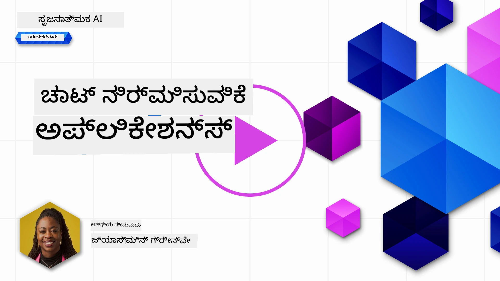
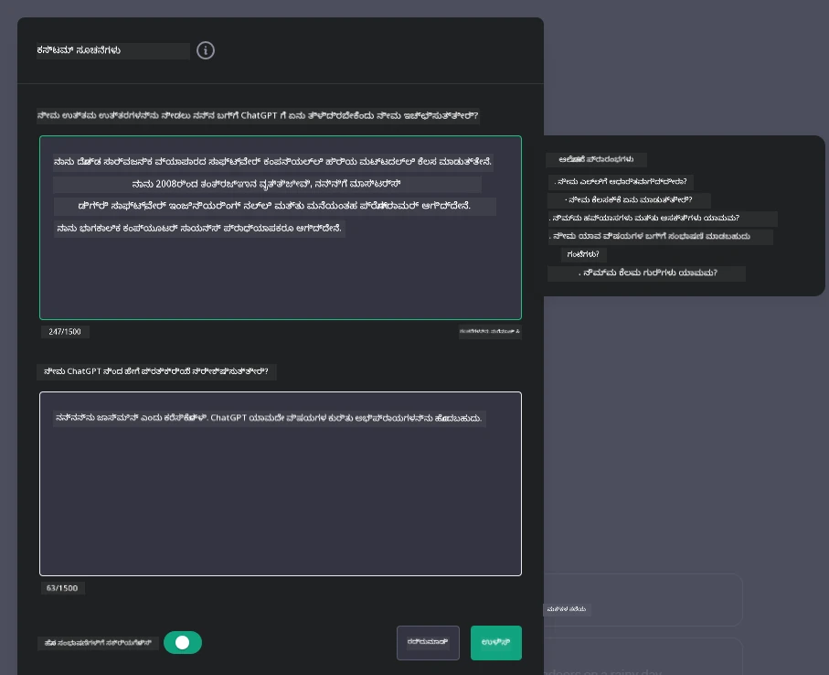
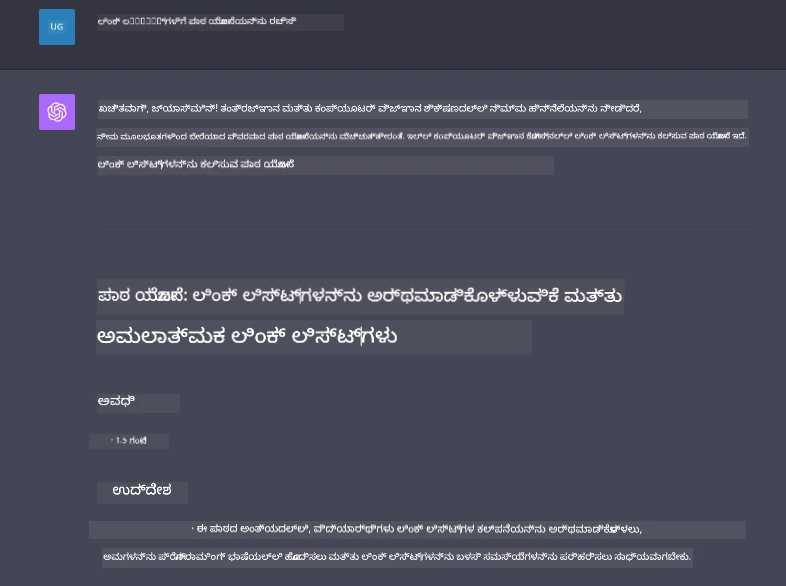

# ಜನರೇಟಿವ್ ಎಐ-ಚಾಲಿತ ಚಾಟ್ ಅಪ್ಲಿಕೇಶನ್‌ಗಳನ್ನು ನಿರ್ಮಿಸುವುದು

[](https://youtu.be/R9V0ZY1BEQo?si=IHuU-fS9YWT8s4sA)

> _(ಈ ಪಾಠದ ವಿಡಿಯೋವನ್ನು ವೀಕ್ಷಿಸಲು ಮೇಲಿನ ಚಿತ್ರವನ್ನು ಕ್ಲಿಕ್ ಮಾಡಿ)_

ಈಗ ನಾವು ಟೆಕ್ಸ್ಟ್-ಜೆನರೇಶನ್ ಅಪ್ಲಿಕೇಶನ್‌ಗಳನ್ನು ಹೇಗೆ ನಿರ್ಮಿಸಬಹುದು ಎಂದು ನೋಡಿದ್ದೇವೆ, ಚಾಟ್ ಅಪ್ಲಿಕೇಶನ್‌ಗಳನ್ನು ನೋಡೋಣ.

ಚಾಟ್ ಅಪ್ಲಿಕೇಶನ್‌ಗಳು ನಮ್ಮ ದೈನಂದಿನ ಜೀವನದಲ್ಲಿ ಒಗ್ಗೂಡಿಗೊಂಡಿದ್ದು, ಕೇವಲ ಸರ್ವಸಾಮಾನ್ಯ ಸಂವಾದ ಮಾಡಲು ಮಾತ್ರವಲ್ಲ. ಅವು ಗ್ರಾಹಕ ಸೇವೆ, ತಾಂತ್ರಿಕ ಬೆಂಬಲ ಮತ್ತು ಸಹಜವಾಗಿ ಸೊಫಿಸ್ಟಿಕೇಟೆಡ್ ಸಲಹಾ ವ್ಯವಸ್ಥೆಗಳ ಅಂಶಗಳಾಗಿವೆ. ನೀವು ಇತ್ತೀಚೆಗೆ ಯಾವುದೇ ಚಾಟ್ ಅಪ್ಲಿಕೇಶನಿನಿಂದ ಸಹಾಯ ಪಡೆದಿರಬಹುದು. ಜನರೇಟಿವ್ ಎಐಂತಹ ನವೀಕೃತ ತಂತ್ರಜ್ಞಾನಗಳನ್ನು ಈ ವೇದಿಕೆಗಳಿಗೆ ಸೇರಿಸುವಂತೆ ನಾವು ಮುಂದೆ ಹೋಗಿದ್ದಂತೆ, ಸಂಕೀರ್ಣತೆ ಮತ್ತು ಸವಾಲುಗಳು ಹೆಚ್ಚಾಗುತ್ತದೆ.

ಕೆಲವು ಪ್ರಶ್ನೆಗಳು ಭಾರತವನ್ನು ಹೊಂದಬೇಕು:

- **ಅಪ್ಲಿಕೇಶನ್ ನಿರ್ಮಿಸುವುದು**. ನಾವು ಈ ಎಐ-ಚಾಲಿತ ಅಪ್ಲಿಕೇಶನ್‌ಗಳನ್ನು ವಿಶೇಷ ಬಳಕೆಮಟ್ಟಗಳಿಗೆ ಹೇಗೆ ಪರಿಣಾಮಕಾರಿಯಾಗಿ ನಿರ್ಮಿಸಿ ಸಮನ್ವಯಗೊಳಿಸಬಹುದು?
- **ನಿರೀಕ್ಷಣೆ**. ಸ್ಥಾಪನೆಯಾದ ಮೇಲೆ, ಅಪ್ಲಿಕೇಶನ್‌ಗಳು ಕೆಲಸದ ಮತ್ತು [ಹಿತಾಸಕ್ತ ಎಐ ಆರು ಸಿದ್ಧಾಂತಗಳು](https://www.microsoft.com/ai/responsible-ai?WT.mc_id=academic-105485-koreyst) ಅನ್ನು ಪಾಲಿಸುವ ದೃಷ್ಟಿಯಿಂದ ಯಾವುದರಲ್ಲಿ ಅತ್ಯುತ್ತಮ ಗುಣಮಟ್ಟದಲ್ಲಿ ಕಾರ್ಯನಿರ್ವಹಿಸುತ್ತಿದೆಯೇ ಎಂದು ನಾವು ಹೇಗೆ ತೀಕ್ಷ್ಣವಾಗಿ ಮೇಲ್ವಿಚಾರಣೆ ಮಾಡಬಹುದು?

ಸ್ವಯಂಚಾಲನೆಯಾಗುವ ಹಾಗೂ ನಿರಂತರ ಮಾನವ-ಯಂತ್ರ ಸಂವಹನದಿಂದ ವ್ಯಾಖ್ಯಾನಿತ ಯುಗದಲ್ಲಿ ನಾವು ಮುಂದುವರಿದಂತೆ, ಜನರೇಟಿವ್ ಎಐ ಚಾಟ್ ಅಪ್ಲಿಕೇಶನ್ ಗಳ ವ್ಯಾಪ್ತಿ, ಆಳ ಮತ್ತು ತಕ್ಕಮಟ್ಟಿನ ಪರಿಷ್ಕಾರವನ್ನು ಹೇಗೆ ಬದಲಾಯಿಸುತ್ತದೆ ಎಂಬುದನ್ನು ಅರ್ಥಮಾಡಿಕೊಳ್ಳುವುದು ಅತ್ಯಂತ ಮುಖ್ಯ. ಈ ಪಾಠವು ಈ ಸಂಕೀರ್ಣ ವ್ಯವಸ್ಥೆಗಳಿಗೆ ಬೆಂಬಲ ನೀಡುವ ವಾಸ್ತುಶಿಲ್ಪ ಅಂಶಗಳನ್ನು ಪರಿಶೀಲಿಸಲಿದೆ, ಡೊಮೇನ್-ನಿಷ್ಠ ಕಾರ್ಯಗಳಿಗಾಗಿ ಅವುಗಳನ್ನು ಸೂಕ್ಷ್ಮತೆಯಿಂದ ತರಬೇತುಗೊಳಿಸುವ ವಿಧಾನಗಳನ್ನು ಅವಲೋಕಿಸಲಿದ್ದು, ಜವಾಬ್ದಾರಿಯುತ ಎಐ ನಿಯೋಜನೆಗಾಗಿ ಅಗತ್ಯವಿರುವ ಮಾನದಂಡಗಳು ಮತ್ತು ಪರಿಗಣನೆಗಳನ್ನು ಮೌಲ್ಯಮಾಪನ ಮಾಡಲಿದೆ.

## ಪರಿಚಯ

ಈ ಪಾಠದಲ್ಲಿ ನಾವು:

- ಚಾಟ್ ಅಪ್ಲಿಕೇಶನ್‌ಗಳನ್ನು ಪರಿಣಾಮಕಾರಿಯಾಗಿ ನಿರ್ಮಿಸುವುದು ಮತ್ತು ಸಮನ್ವಯಗೊಳಿಸುವ ತಂತ್ರಗಳನ್ನು ತಿಳಿಯುವುದು.
- ಅಪ್ಲಿಕೇಶನ್‌ಗಳಿಗೆ ವೈಯಕ್ತೀಕೀಕರಣ ಮತ್ತು ಸೂಕ್ಷ್ಮತಾಜ್ಞাপনೆಯನ್ನು ಹೇಗೆ ಬಳಸುವುದು.
- ಚಾಟ್ ಅಪ್ಲಿಕೇಶನ್‌ಗಳ ಮೇಲೆ ಪರಿಣಾಮಕಾರಿಯಾಗಿ ಮೇಲ್ವಿಚಾರಣೆ ಮಾಡಲು ತಂತ್ರಗಳು ಮತ್ತು ಪರಿಗಣನೆಗಳು.

## ಕಲಿಕೆ ಗುರಿಗಳು

ಈ ಪಾಠದ վերջಿಗೆ, ನೀವು ಈ ಎಲ್ಲವನ್ನು ಮಾಡಬಹುದಾಗಿರುತ್ತೀರಿ:

- ಚಾಟ್ ಅಪ್ಲಿಕೇಶನ್‌ಗಳನ್ನು ನಿರ್ಮಿಸುವ ಮತ್ತು विद्यमಾನ системы ಗಳು ಜೊತೆ ಸಮನ್ವಯಗೊಳಿಸಲು ಪರಿಗಣಿಸುವುದನ್ನು ವಿವರಿಸುವುದು.
- ವಿಶೇಷ ಬಳಕೆ-ಕೇಸಿಗೆ ಚಾಟ್ ಅಪ್ಲಿಕೇಶನ್‌ಗಳನ್ನು ವೈಯಕ್ತೀಕರಿಸುವುದು.
- ಎಐ-ಚಾಲಿತ ಚಾಟ್ ಅಪ್ಲಿಕೇಶನ್‌ಗಳ ಗುಣಮಟ್ಟವನ್ನು ಪರಿಣಾಮಕಾರಿಯಾಗಿ ಮೇಲ್ವಿಚಾರಣೆ ಮಾಡಲು ಮುಖ್ಯ ಮಾನದಂಡಗಳನ್ನೂ, ಪರಿಗಣನೆಗಳನ್ನೂ ಗುರುತಿಸುವುದು.
- ಚಾಟ್ ಅಪ್ಲಿಕೇಶನ್‌ಗಳು ಜವಾಬ್ದಾರಿಯುತ ಎಐಯನ್ನು ಬಳಸುವಂತೆ ಖಚಿತಪಡಿಸುವುದು.

## ಜನರೇಟಿವ್ ಎಐಯನ್ನು ಚಾಟ್ ಅಪ್ಲಿಕೇಶನ್‌ಗಳಿಗೆ ಸೇರುವುದು

ಜನರೇಟಿವ್ ಎಐ ಮೂಲಕ ಚಾಟ್ ಅಪ್ಲಿಕೇಶನ್‌ಗಳನ್ನು ಉತ್ತಮಗೊಳಿಸುವುದು ಕೇವಲ ಅವುಗಳನ್ನು ಬುದ್ಧಿವಂತಿಕೆಯಿಂದ ತುಂಬಿಸುವುದಲ್ಲ; ಬಳಕೆದಾರ ಅನುಭವದ ಗುಣಮಟ್ಟವನ್ನು ಒದಗಿಸುವ ಉದ್ದೇಶದಿಂದ ಅವುಗಳ ವಾಸ್ತುಶಿಲ್ಪ, ಕಾರ್ಯಕ್ಷಮತೆ ಮತ್ತು ಬಳಕೆದಾರ ಇಂಟರ್ಫೇಸ್ ಅನ್ನು ಆಪ್ಟಿಮೈಸ್ ಮಾಡುವುದಾಗಿದೆ. ಇದಕ್ಕೆ ವಾಸ್ತುಶಿಲ್ಪದ ಆಧಾರಗಳು, API ಸಂಯೋಜನೆಗಳು ಮತ್ತು ಬಳಕೆದಾರ ಇಂಟರ್ಫೇಸ್ ಪರಿಗಣನೆಗಳನ್ನು ಪರಿಶೀಲಿಸುವುದು ಸೇರಿದೆ. ಈ ವಿಭಾಗವು ಈ ಸಂಕೀರ್ಣ ಕ್ಷೇತ್ರಗಳನ್ನು ನಿಭಾಯಿಸಲು ನಿಮಗೆ ಸಮಗ್ರ ಮಾರ್ಗಸೂಚಿಯನ್ನು ನೀಡಲು ಉದ್ದೇಶಿಸಿದೆ, ನೀವು ಅವುಗಳನ್ನು विद्यमान ಸಿಸ್ಟಮ್‌ಗಳಿಗೆ ಅಳವಡಿಸುತ್ತಿದ್ದೀರಾ ಅಥವಾ ಸ್ವತಂತ್ರ ವೇದಿಕೆಗಳಾಗಿ ನಿರ್ಮಿಸುತ್ತಿದ್ದೀರಾ ಎಂಬುದಕ್ಕೆ.

ಈ ವಿಭಾಗದ ಕೊನೆಯಲ್ಲಿ, ನೀವು ಚಾಟ್ ಅಪ್ಲಿಕೇಶನ್‌ಗಳನ್ನು ಪರಿಣಾಮಕಾರಿಯಾಗಿ ನಿರ್ಮಿಸಿ ಸಂಯೋಜಿಸಲು ಬೇಕಾದ ಪರಿಣತಿಯನ್ನು ಹೊಂದಿರುತ್ತೀರಿ.

### ಚಾಟ್‌ಬಾಟ್ ಅಥವಾ ಚಾಟ್ ಅಪ್ಲಿಕೇಶನ್?

ಚಾಟ್ ಅಪ್ಲಿಕೇಶನ್‌ಗಳನ್ನು ನಿರ್ಮಿಸುವುದಕ್ಕೆ ಮುನ್ನ, 'ಚಾಟ್‌ಬಾಟ್‌ಗಳು' ಮತ್ತು 'ಎಐ-ಚಾಲಿತ ಚಾಟ್ ಅಪ್ಲಿಕೇಶನ್‌ಗಳು' ಹೇಗೆ ವಿಭಿನ್ನ ಪಾತ್ರಗಳು ಮತ್ತು ಕಾರ್ಯಕ್ಷಮತೆಗಳನ್ನು ಹೊಂದಿವೆ ಎಂದು ಹೋಲಿಸೋಣ. ಚಾಟ್‌ಬಾಟ್‌ಗಳ ಮುಖ್ಯ ಉದ್ದೇಶವು ನಿರ್ದಿಷ್ಟ ಸಂಭಾಷಣಾ ಕಾರ್ಯಗಳನ್ನು ಸ್ವಯಂಚಾಲಿತಗೊಳಿಸುವುದು, ಉದಾಹರಣೆಗೆ ಸಾಮಾನ್ಯವಾಗಿ ಕೇಳುವ ಪ್ರಶ್ನೆಗಳಿಗೆ ಉತ್ತರಿಸುವುದು ಅಥವಾ ಪ್ಯಾಕೇಜ್‌ ಟ್ರ್ಯಾಕಿಂಗ್ ಮಾಡುವುದು. ಸಾಮಾನ್ಯವಾಗಿ ಇದನ್ನು ನಿಯಮಾಧಾರಿತ ತರ್ಕ ಅಥವಾ ಸಂಕೀರ್ಣ ಎಐ ಅಲ್ಗಾರಿದಮ್ಗಳಿಂದ ನಿಯಂತ್ರಿಸಲಾಗುತ್ತದೆ. ಹಿನ್ನಲೆಯಲ್ಲಿ, ಎಐ-ಚಾಲಿತ ಚಾಟ್ ಅಪ್ಲಿಕೇಶನ್ ಒಂದು ಬೃಹತ್ ಮತ್ತು ವ್ಯಾಪಕ ಪರಿಸರವಾಗಿದ್ದು, ಮಾನವರಲ್ಲಿ ಪಠ್ಯ, ಸ್ವರ ಮತ್ತು ವೀಡಿಯೋ ಚಾಟ್ ಮುಖಾಂತರ ಡಿಜಿಟಲ್ ಸಂವಹನವನ್ನು ಸೌಕರ್ಯ ಮಾಡುತ್ತದೆ. ಇದರ ಪ್ರಮುಖ ಲಕ್ಷಣವು ಜನರೇಟಿವ್ ಎಐ ಮಾದರಿಯ ಅಳವಡಿಕೆ, ಇದು ಮಾನವರಂತಿರುವ ಸಂಕೀರ್ಣ ಸಂಭಾಷಣೆಯನ್ನು ಅನುಕರಿಸಿದ್ದು, ವಿವಿಧ ಇನ್‌ಪುಟ್ ಮತ್ತು ಸಾಂದರ್ಭಿಕ ಸೂಚನೆಗಳಾಧಾರಿತ ಉತ್ತರಗಳನ್ನು ರಚಿಸುತ್ತದೆ. ಜನರೇಟಿವ್ ಎಐ-ಚಾಲಿತ ಚಾಟ್ ಅಪ್ಲಿಕೇಶನ್ ಅನಿರ್ದಿಷ್ಟ ವಿಷಯದ ಸಂಭಾಷಣೆಗಳನ್ನು ನಿರ್ವಹಿಸಬಹುದು, ಸಂವಾದದ ಸಂದರ್ಭಾನುಸರವಾಗಿ ತಕ್ಕಮಟ್ಟಿಗೆ ಹೊಂದಿಕೊಳ್ಳಬಹುದು ಮತ್ತು ಸೃಜನಾತ್ಮಕ ಅಥವಾ ಸಂಕೀರ್ಣ ಸಂಭಾಷಣೆಯನ್ನೂ ಉತ್ಪಾದಿಸಬಹುದು.

ಕೆಳಗಿನ ಟೇಬಲ್‌ವು ಅಗತ್ಯವಾದ ಅಂತರ ಮತ್ತು ಸಾದೃಶ್ಯಗಳನ್ನು ಚಿಕ್ಕಕೆ<typename>ಸಲು ನಮಗೆ ಅನುಕೂಲಕರವಾಗಿದೆ, ಅವು ಡಿಜಿಟಲ್ ಸಂವಹನದಲ್ಲಿ ಅವರ ವಿಶಿಷ್ಟ ಪಾತ್ರಗಳನ್ನು ತಿಳಿಯಲು ಸಹಾಯ ಮಾಡುತ್ತದೆ.

| ಚಾಟ್‌ಬಾಟ್                              | ಜನರೇಟಿವ್ ಎಐ-ಚಾಲಿತ ಚಾಟ್ ಅಪ್ಲಿಕೇಶನ್              |
| ------------------------------------- | --------------------------------------------- |
| ನಿರ್ದಿಷ್ಟ ಕಾರ್ಯ ಮತ್ತು ನಿಯಮಾಧಾರಿತ       | ಸಂದರ್ಭಾರ್ಥಕ                                    |
| ಬಹುಪಾಲು ದೊಡ್ಡ ವ್ಯವಸ್ಥೆಗಳಲ್ಲಿ ಸಂಯೋಜಿತ  | ಒಂದೇ ಅಥವಾ ಹಲವಾರು ಚಾಟ್‌ಬಾಟ್‌ಗಳನ್ನು ಹೊಂದಿರಬಹುದು |
| ನಿರ್ದಿಷ್ಟ ಕಾರ್ಯಗಳಿಗೆ ಮಿತಿಗೊಳಿಸಲಾಗಿದೆ  | ಜನರೇಟಿವ್ ಎಐ ಮಾದರಿಗಳನ್ನು ಒಳಗೊಂಡಿದೆ               |
| ವಿಶೇಷಿತ ಮತ್ತು ರಚನಾತ್ಮಕ ಸಂವಹನಗಳು    | ಅನಿರ್ದಿಷ್ಟ ವಿಷಯದ ಸಂಭಾಷಣೆ ಸಾಮರ್ಥ್ಯವಿದೆ          |

### SDKಗಳು ಮತ್ತು APIಗಳೊಂದಿಗೆ ಪೂರ್ವನಿರ್ಮಿತ ಕಾರ್ಯಕ್ಷಮತೆಗಳನ್ನು ಬಳಸಿಕೊಳ್ಳುವುದು

ಚಾಟ್ ಅಪ್ಲಿಕೇಶನ್ ನಿರ್ಮಿಸುವಾಗ, ಈಗಾಗಲೆ ಏನು ಇದೆ என்பதை ತಯಾರನೊಳಗೊಂಡು ಪರಿಶೀಲಿಸುವುದು ಉತ್ತಮ ಪ್ರಥಮ ಹಂತ. SDK ಮತ್ತು APIಗಳನ್ನು ಬಳಸಿಕೊಂಡು ಚಾಟ್ ಅಪ್ಲಿಕೇಶನ್‌ಗಳನ್ನು ನಿರ್ಮಿಸುವುದು ವಿವಿಧ ಕಾರಣಗಳಿಂದ ಪ್ರಯೋಜನದಾಯಕ ವಿಧಾನ. ಚೆನ್ನಾಗಿ ದಾಖಲಿಸಲ್ಪಟ್ಟ SDK ಮತ್ತು APIಗಳನ್ನು ಸೇರಿಸುವ ಮೂಲಕ, ನೀವು ನಿಮ್ಮ ಅಪ್ಲಿಕೇಶನ್‌ನ್ನು ದೀರ್ಘಕಾಲಿಕ ಯಶಸ್ಸಿಗೆ ತಯಾರಿಸುತ್ತಿದ್ದೀರಿ, ವಿಸ್ತರಣೆ ಮತ್ತು ನಿರ್ವಹಣಾ ಸಮಸ್ಯೆಗಳನ್ನು ವೇದಿಕೆಯು ಹೊಂದಿಕೊಳ್ಳುತ್ತದೆ.

- **ವಿಕಸನ ಪ್ರಕ್ರಿಯೆಯನ್ನು ವೇಗಗೊಳಿಸಿ ಮತ್ತು ಭಾರವನ್ನು ಕಡಿಮೆ ಮಾಡುತ್ತದೆ**: நீங்கள் ಸ್ವತಃ ನಿರ್ಮಿಸುವ ದುಬಾರಿ ಪ್ರಕ್ರಿಯೆಯ ಬದಲು ಪೂರ್ವನಿರ್ಮಿತ ಕಾರ್ಯಕ್ಷಮತೆಗಳೆಂಬುದನ್ನು ಬಳಸುವುದರಿಂದ, ನಿಮ್ಮ ಅಪ್ಲಿಕೇಶನ್‌ನ ಇತರ ಭಾಗಗಳ ಮೇಲೆ ಗಮನಹರಿಸಲಿದ್ದಾರೆ, ಉದಾಹರಣೆಗೆ ವ್ಯವಹಾರ ಲಾಜಿಕ.
- **ಮೇಲು ಕಾರ್ಯಕ್ಷಮತೆ**: ಕಾರ್ಯಕ್ಷಮತೆಯನ್ನು ಶೂನ್ಯದಿಂದ ನಿರ್ಮಿಸುವಾಗ, ನೀವು "ಇದು ಎಷ್ಟು ವಿಸ್ತಾರಗೊಳ್ಳುತ್ತದೆ? ಈ ಅಪ್ಲಿಕೇಶನ್ ಏಕರೂಪವಾಗಿ ಬಳಕೆದಾರರ ಪ್ರವಾಹವನ್ನು ಕೈಗೊಂಡಿರಬಹುದೇ?" ಎಂದು ಕೇಳಬಹುದು. ಚಾಚಿದ SDK ಮತ್ತು API ಗಳಲ್ಲಿ ಸಾಮಾನ್ಯವಾಗಿ ಈ ಸಮಸ್ಯೆಗಳಿಗೆ ಹೊರನಡೆಗೆ ಪರಿಹಾರಗಳಿವೆ.
- **ಸರಳ ನಿರ್ವಹಣೆ**: ನವೀಕರಣಗಳು ಮತ್ತು ಸುಧಾರಣೆಗಳು ನಿಯಂತ್ರಿಸಲು ಸುಲಭವಾಗಿವೆ ಏಕೆಂದರೆ ಬಹುತೇಕ API ಗಳು ಮತ್ತು SDKಗಳು ಹೊಸ ಆವೃತ್ತಿಯ ಬಿಡುಗಡೆ ಸಮಯದಲ್ಲಿ ಲೈಬ್ರರಿ ನವೀಕರಣ ಬೇಡಿಕೆ.
- **ಅತ್ಯಾಧುನಿಕ ತಂತ್ರಜ್ಞಾನ ಅವಕಾಶ**: ಉತ್ತಮವಾಗಿ ತರಬೇತುಗೊಂಡ ಮತ್ತು ಪ್ರಾಮಾಣಿಕ ಡೇಟಾಸೆಟ್‌ಗಳ ಮೇಲೆ ಊಳ್ವತ್ತಾಗಿ ತರಬೇತುಗೊಂಡ ಮಾದರಿಗಳನ್ನು ಬಳಸುವುದರಿಂದ ನಿಮ್ಮ ಅಪ್ಲಿಕೇಶನ್‌ಗೆ ಪ್ರাকೃತಿಕ ಭಾಷಾ ಸಾಮರ್ಥ್ಯಗಳನ್ನು ನೀಡಬಹುದು.

SDK ಅಥವಾ API ಯ ಕಾರ್ಯಗಳನ್ನು ಪ್ರವೇಶಿಸುವುದು ಅಧಿಕೃತ ಕೀ ಅಥವಾ ಪ್ರಮಾಣೀಕರಣ ಟೋಕನ್ ಬಳಕೆ аркылуу ಸಹಾಯ ಕಾರ್ಯಕ್ರಮಗಳ ಅನುಮತಿಯನ್ನು ಪಡೆಯುವುದನ್ನು ಒಳಗೊಂಡಿದೆ. ನಾವು OpenAI ಪൈಥಾನ್ ಗ್ರಂಥಾಲಯವನ್ನು ಬಳಸಿಕೊಂಡು ಇದನ್ನು ಪರಿಶೀಲಿಸುತ್ತೇವೆ. ನೀವು ಈ ಪಾಠದಿಗಾಗಿ [OpenAI's notebook](./python/oai-assignment.ipynb?WT.mc_id=academic-105485-koreyst) ಅಥವಾ [Azure OpenAI ಸೇವೆಗಳ notebook](./python/aoai-assignment.ipynb?WT.mc_id=academic-105485-koreys) ನಲ್ಲಿ ಸ್ವತಃ ಪ್ರಯತ್ನಿಸಬಹುದು.

```python
import os
from openai import OpenAI

API_KEY = os.getenv("OPENAI_API_KEY","")

client = OpenAI(
    api_key=API_KEY
    )

response = client.responses.create(model="gpt-5-mini", input="Suggest two titles for an instructional lesson on chat applications for generative AI.", store=False)
print(response.output_text)
```

ಮೇಲಿನ ಉದಾಹರಣೆಯಲ್ಲಿ ಅಪರಿಕಲ್ಪಿತಾಂಶವನ್ನು ಪೂರ್ಣಗೊಳಿಸಲು Responses API ಮೂಲಕ GPT-5 ಮಿನಿ ಮಾದರಿಯನ್ನು ಬಳಸಲಾಗಿದೆ, ಆದರೆ API ಕೀ ಅನ್ನು ಪ್ರಾರಂಭಿಸುವ ಮೊದಲು ಸೆಟ್ ಮಾಡಬೇಕೆಂದು ಗಮನಿಸಿ. ನೀವು ಕೀ ಸೆಟ್ ಮಾಡುವುದಿಲ್ಲದಿದ್ದರೆ ದೋಷವು ಬರುತ್ತದೆ.

## ಬಳಕೆದಾರ ಅನುಭವ (UX)

ಸಾಮಾನ್ಯ UX ಸಿದ್ಧಾಂತಗಳು ಚಾಟ್ ಅಪ್ಲಿಕೇಶನ್‌ಗಳಿಗೆ ಅನ್ವಯಿಸುತ್ತವೆ, ಆದರೆ ಯಂತ್ರ ಅಧ್ಯಯನ ಭಾಗಗಳು ಕಾರಣವಾಗಿ ಕೆಲವು ಹೆಚ್ಚುವರಿ ಪರಿಗಣನೆಗಳು ವಿಶೇಷ ಮಹತ್ವವನ್ನು ಹೊಂದಿವೆ.

- **ಅಸ್ಪಷ್ಟತೆಗಳಿಗೆ ಪರಿಹಾರ ವಿಧಾನ**: ಜನರೇಟಿವ್ ಎಐ ಮಾದರಿಗಳು ಕೆಲವೊಮ್ಮೆ ಅಸ್ಪಷ್ಟ ಉತ್ತರಗಳನ್ನು ರಚಿಸುತ್ತವೆ. ಬಳಕೆದಾರರು ಸ್ಪಷ್ಟೀಕರಣ ಕೇಳಬಹುದಾದ ವೈಶಿಷ್ಟ್ಯ ಉಪಯುಕ್ತವಾಗಬಹುದು.
- **ಸಂದರ್ಭ ಭಂಡಾರಣೆ**: ಉನ್ನತ ಜನರೇಟಿವ್ ಎಐ ಮಾದರಿಗಳು ಸಂಭಾಷಣೆಯ ಒಳಗಿನ ಸನ್ನಿವೇಶವನ್ನು ನೆನಪಿನಲ್ಲಿ ಇಡುವ ಸಾಮರ್ಥ್ಯವನ್ನು ಹೊಂದಿವೆ, ಇದು ಬಳಕೆದಾರ ಅನುಭವಕ್ಕೆ ಅಗತ್ಯವಾಗಬಹುದು. ಬಳಕೆದಾರರಿಗೆ ಈ ಸನ್ನಿವೇಶವನ್ನು ನಿಯಂತ್ರಿಸುವ ಸಾಮರ್ಥ್ಯವನ್ನು ನೀಡುವುದು ಉತ್ತಮ ಅನುಭವವಾಗಿದೆ, ಆದರೆ ಸಂವೇದನಶೀಲ ಬಳಕೆದಾರ ಮಾಹಿತಿಯನ್ನು ಕಾಪಾಡುವ ಅಪಾಯವಿದೆ. ಈ ಮಾಹಿತಿಯನ್ನು ಎಷ್ಟು ಕಾಲ ಸಂಗ್ರಹಿಸಬೇಕು ಎಂಬುದಕ್ಕೆ ನಿಯಮಾವಳಿ (ರೆಟೆನ್ಷನ್ ಪಾಲಿಸಿ) ಪರಿಚಯಿಸುವ ಮೂಲಕ ಈ ಅವಶ್ಯಕತೆಯ ಮತ್ತು ಗೌಪ್ಯತೆಯ ಕೊಂಬಿನೇಷನ್ ಸಾಧಿಸಬಹುದು.
- **ವೈಯಕ್ತೀಕರಣ**: ಕಲಿಯುವ ಮತ್ತು ಹೊಂದಿಕೊಳ್ಳುವ ಸಾಮರ್ಥ್ಯದಿಂದ, ಎಐ ಮಾದರಿಗಳು ವ್ಯಕ್ತಿಗತ ಅನುಭವವನ್ನು ಒದಗಿಸುತ್ತವೆ. ಬಳಕೆದಾರ ಪ್ರೊಫೈಲ್‌ಗಳಂತಹ ವೈಶಿಷ್ಟ್ಯಗಳ ಮೂಲಕ ಬಳಕೆದಾರ ಅನುಭವವನ್ನು ವೈಯಕ್ತೀಕರಿಸುವುದು ಬಳಕೆದಾರಿಗೆ ಅರ್ಥವಾಗುವಂತಹ ಅನುಭವ ನೀಡುತ್ತದೆ ಮತ್ತು ವಿಶೇಷ ಉತ್ತರಗಳನ್ನು ಹುಡುಕಲು ಸಹಾಯಮಾಡುತ್ತದೆ, ಪರಿಣಾಮಕಾರಿಯಾದ ಹಾಗೂ ಸಂತೃಪ್ತ ಸಂವಹನವನ್ನು ಸೃಷ್ಟಿಸುತ್ತದೆ.

ವೈಯುಕ್ತೀಕರಣದ ಉದಾಹರಣೆಯೂ OpenAIಯ ChatGPT ಯಲ್ಲಿನ "ಕಸ್ಟಮ್ ಸೂಚನೆಗಳು" ಸೆಟ್ಟಿಂಗ್‌ಗಳು. ಇದು ನಿಮಗೆ ನಿಮ್ಮ ಪ್ರಾಂಪ್ಟ್‌ಗಳಿಗೆ ಮುಖ್ಯವಾದ ನಿಮ್ಮ ಬಗ್ಗೆ ಮಾಹಿತಿಯನ್ನು ಒದಗಿಸಲು ಅವಕಾಶ ನೀಡುತ್ತದೆ. ಇವು ಒಂದು ಕಸ್ಟಮ್ ಸೂಚನೆಯ ಉದಾಹರಣೆಯಾಗಿದೆ.



ಈ "ಪ್ರೊಫೈಲ್" ChatGPTಯಲ್ಲಿ ಲಿಂಕ್ ಲಿಸ್ಟ್ ಗಳು ಕುರಿತು ಪಾಠ ಯೋಜನೆಯನ್ನು ರಚಿಸಲು ಸೂಚಿಸುತ್ತದೆ. ChatGPT ಆ ಬಳಕೆದಾರ ಅನುಭವವನ್ನು ಗಮನದಲ್ಲಿಟ್ಟುಕೊಂಡು ಅವಳ ಅನುಭವವನ್ನು ಆಧರಿಸಿ ಆಳವಾದ ಪಾಠ ಯೋಜನೆಯನ್ನು ಬಯಸಬಹುದು ಎಂದು ಗಮನಿಸಿ.



### Microsoftನ ಲಾರ್ಜ್ ಲ್ಯಾಂಗ್ವೇಜ್ ಮಾದರಿಗಳಿಗಾಗಿ ಸಿಸ್ಟಮ್ ಮೆಸೇಜ್ ಫ್ರೇಮ್ವರ್ಕ್

[Microsoft ನೀಡಿರುವ ಮಾರ್ಗಸೂಚಿ](https://learn.microsoft.com/azure/ai-foundry/openai/concepts/system-message#define-the-models-output-format?WT.mc_id=academic-105485-koreyst) LLM ಗಳಿಂದ ಪ್ರತಿಕ್ರಿಯೆಗಳನ್ನು ರಚಿಸುವ ಸಕಾರಾತ್ಮಕ ಸಿಸ್ಟಮ್ ಸಂದೇಶ ಬರೆದಿರುವಾಗ ಚೌಕಟ್ಟು 4 ವಿಭಾಗಗಳಾಗಿ:

1. ಮಾದರಿಯು ಯಾರು ಮತ್ತು ಅದರ ಸಾಮರ್ಥ್ಯಗಳು ಮತ್ತು ಮಿತಿಗಳನ್ನು ವ್ಯಾಖ್ಯಾನಿಸುವುದು.
2. ಮಾದರಿಯ output ಆಕಾರವನ್ನು ವ್ಯಾಖ್ಯಾನಿಸುವುದು.
3. ಮಾದರಿಯ ಉದ್ದೇಶಿತ ವ್ಯವಹಾರವನ್ನು ತೋರಿಸುವ ವಿಶೇಷ ಉದಾಹರಣೆಗಳನ್ನು ಒದಗಿಸುವುದು.
4. ಹೆಚ್ಚುವರಿ ವರ್ತನೆ ನಿಯಂತ್ರಣಗಳನ್ನು ಒದಗಿಸುವುದು.

### ಪ್ರವೇಶನೀಯತೆ

ಬಳಕೆದಾರರು ದೃಷ್ಟಿ, ಕೇಳುವ, ಚಲನೆ ಅಥವಾ ಮಾನಸಿಕ ದೋಷಗಳನ್ನು ಹೊಂದಿದ್ದರೂ, ಒಳ್ಳೆಯ ವಿನ್ಯಾಸದ ಚಾಟ್ ಅಪ್ಲಿಕೇಶನ್ ಹೆಮ್ಮೆಪಡಬೇಕು ಎಲ್ಲರಿಗೂ ಉಪಯುಕ್ತವಾಗಿರಬೇಕು. ಕೆಳಗಿನ ಪಟ್ಟಿ ವಿಭಿನ್ನ ಬಳಕೆದಾರ ಅಪಂಗತೆಯಲ್ಲಿ ಪ್ರವೇಶನೀಯತೆಯನ್ನು ನವೀಕೃತಗೊಳಿಸುವ ಉದ್ದೇಶದ ಅನೇಕ ವೈಶಿಷ್ಟ್ಯಗಳನ್ನು ವಿವರಿಸುತ್ತದೆ.

- **ದೃಷ್ಟಿ ಅಪಂಗತೆಗಾಗಿ ವೈಶಿಷ್ಟ್ಯಗಳು**: ಉತ್ಕೃಷ್ಟ ವಿಸ್ತಾರ ಥೀಮ್‌ಗಳು ಮತ್ತು ಮರುಗಾಳಿಸಬಹುದಾದ ಪಠ್ಯ, ಸ್ಕ್ರೀನ್ ರೀಡರ್ ಹೊಂದಾಣಿಕೆ.
- **ಶ್ರವಣ ಅಪಂಗತೆಗಾಗಿ ವೈಶಿಷ್ಟ್ಯಗಳು**: ಪಠ್ಯ-ರಿಂದ-ಸ್ವರ ಮತ್ತು ಸ್ವರ-ರಿಂದ-ಪಠ್ಯ ಕಾರ್ಯಗಳು, ಶ್ರವಣ ಸೂಚನೆಗಳಿಗೆ ದೃಶ್ಯ ಸೂಚನೆಗಳು.
- **ಚಲನೆ ಅಪಂಗತೆಗಾಗಿ ವೈಶಿಷ್ಟ್ಯಗಳು**: ಕীবೋರ್ಡ್ ನ್ಯಾವಿಗೇಶನ್ ಬೆಂಬಲ, ಧ್ವನಿ ಆಜ್ಞೆಗಳು.
- **ಮಾನದಂಡದ ಅಪಂಗತೆಗಾಗಿ ವೈಶಿಷ್ಟ್ಯಗಳು**: ಸರಳೀಕೃತ ಭಾಷಾ ಆಯ್ಕೆಗಳು.

## ಡೊಮೇನ್-ನಿಷ್ಠ ಭಾಷಾ ಮಾದರಿಗಳಿಗೆ ವೈಯಕ್ತೀಕರಣ ಮತ್ತು ಸೂಕ್ಷ್ಮತಾಜ್ಞಾಪನೆ

ನಿಮ್ಮ ಕಂಪನಿಯ jargon ಅನ್ನು ಅರ್ಥಮಾಡಿಕೊಳ್ಳುವ ಮತ್ತು ಅದರ ಬಳಕೆದಾರರ ಸಾಮಾನ್ಯ ಪ್ರಶ್ನೆಗಳನ್ನು ಊಹಿಸುವ ಚಾಟ್ ಅಪ್ಲಿಕೇಶನ್ ಅನ್ನು ಕಲ್ಪಿಸಿ ನೋಡಿ. ಕೆಲವು ವಿಧಾನಗಳಿವೆ:

- **DSL ಮಾದರಿಗಳನ್ನು ಬಳಸಿಕೊಳ್ಳುವುದು**. DSL ಅಂದರೆ ಡೊಮೇನ್-ನಿಷ್ಠ ಭಾಷೆ. ನೀವು ನಿರ್ದಿಷ್ಟ ಕ್ಷೇತ್ರದಲ್ಲಿ ತರಬೇತುಗೊಂಡ DSL ಮಾದರಿಯನ್ನು ಬಳಸಿಕೊಂಡು ಆ ಕ್ಷೇತ್ರದ ತತ್ತ್ವಗಳು ಮತ್ತು ಪರಿಸ್ಥಿತಿಗಳನ್ನು ಅರ್ಥಮಾಡಿಕೊಳ್ಳಬಹುದು.
- **ಸೂಕ್ಷ್ಮತಾಜ್ಞಾಪನೆ ಇನ್ನಷ್ಟು ತರಬೇತಿ ನೀಡುವುದು**. ಸೂಕ್ಷ್ಮತಾಜ್ಞಾಪನೆಯು ನಿಮ್ಮ ಮಾದರಿಯನ್ನು ನಿಖರ ಡೇಟಾದೊಂದಿಗೆ ಇನ್ನಷ್ಟು ತರಬೇತು ಮಾಡುವ ಪ್ರಕ್ರಿಯೆ.

## ವೈಯಕ್ತೀಕರಣ: DSL ಬಳಸಿಕೊಳ್ಳುವಿಕೆ

ಡೊಮೇನ್-ನಿಷ್ಠ ಭಾಷಾ ಮಾದರಿಗಳು (DSL ಮಾದರಿಗಳು) ಬಳಕೆದಾರರ ತೊಡಕು ಹೆಚ್ಚಿಸುವುದರಲ್ಲಿ ಸಹಾಯ ಮಾಡುತ್ತವೆ, ವಿಶೇಷ ಹಾಗೂ ಸಾಂದರ್ಭಿಕವಾಗಿ ಸಂಬಂಧಿಸಿದ ಸಂವಹನಗಳನ್ನು ಒದಗಿಸುವ ಮೂಲಕ. ಇದು ನಿರ್ದಿಷ್ಟ ಕ್ಷೇತ್ರ, ಉದ್ಯಮ ಅಥವಾ ವಿಷಯಕ್ಕೆ ಸಂಬಂಧಿಸಿದ ಪಠ್ಯವನ್ನು ತಿಳಿಯಲು ಮತ್ತು ರಚಿಸಲು ತರಬೇತುಗೊಳ್ಳಲಾದ ಅಥವಾ ಸೂಕ್ಷ್ಮತಾಜ್ಞಾಪಿತ ಮಾದರಿಯಾಗಿದೆ. DSL ಮಾದರಿಯನ್ನು ತಯಾರಿಸುವ ವಿಧಗಳು ಶೂನ್ಯದಿಂದ ತರಬೇತು ನೀಡುವಿಂದ SDKಗಳ ಮತ್ತು APIಗಳ ಮೂಲಕ ಪೂರ್ವನಿರ್ಮಿತಗಳನ್ನು ಬಳಸುವವರೆಗಿನ ಆಯ್ಕೆಗಳು ಇವೆ. ಮತ್ತೊಂದು ಆಯ್ಕೆ ಸೂಕ್ಷ್ಮತಾಜ್ಞಾಪನೆ, ಅಂದರೆ ಈಗಿನ ಪೂರ್ವ ತರಬೇತು ಪಡೆದ ಮಾದರಿಯನ್ನು ವಿಶೇಷ ಡೊಮೇನ್‌ಗೆ ಹೊಂದಿಸುವುದು.

## ವೈಯಕ್ತೀಕರಣ: ಸೂಕ್ಷ್ಮತಾಜ್ಞಾಪನೆ ಬಳಸುವುದು

ವಿಶೇಷೀಕೃತ ಕ್ಷೇತ್ರ ಅಥವಾ ಕಾರ್ಯದಲ್ಲಿ ಪೂರ್ವ ತರಬೇತು ಪಡೆದ ಮಾದರಿ ತೃಪ್ತಿ ನೀಡದಾಗ ಸಹಜೆ ಸೂಕ್ಷ್ಮತಾಜ್ಞಾಪನೆಯನ್ನು ಪರಿಗಣಿಸಲಾಗುತ್ತದೆ.

ಉದಾಹರಣೆಗೆ, ವೈದ್ಯಕೀಯ ಪ್ರಶ್ನೆಗಳು ಸಂಕೀರ್ಣವಾಗಿದ್ದು ಹೆಚ್ಚಿನ ಸನ್ನಿವೇಶ ಅಗತ್ಯವಿದೆ. ವೈದ್ಯಕೀಯ ತಜ್ಞನು ರೋಗಿಯನ್ನು ನಿರ್ಧಾರ ಮಾಡುವಾಗ ಜೀವನಶೈಲಿ, ಹಳೆ ಕಾಯಿಲೆಗಳು ಸೇರಿದಂತೆ ಹಲವು ಅಂಶಗಳ ಮೇಲೆ ಅವಲಂಬಿತರಾಗಿದ್ದು, ಇತ್ತೀಚಿನ ವೈದ್ಯಕೀಯ ಅಧ್ಯಯನಗಳನ್ನೂ ಪರಿಶೀಲಿಸಬಹುದು. ಈ ರೀತಿಯ ಮುನಿಯಿದ ಪರಿಸ್ಥಿತಿಗಳಲ್ಲಿ ಸಾಮಾನ್ಯ ಉದ್ದೇಶದ ಎಐ ಚಾಟ್ ಅಪ್ಲಿಕೇಶನ್ ಭರವಸೆ ಹೊಂದಿರುವ ಮೂಲವಲ್ಲ.

### ಪ್ರಕರಣ: ವೈದ್ಯಕೀಯ ಅಪ್ಲಿಕೇಶನ್

ವೈದ್ಯಕೀಯ ವೃತ್ತಿಪರರಿಗೆ ಚಿಕಿತ್ಸಾ ಮಾರ್ಗಸೂಚಿ, ಔಷಧಿ ಸಂವೇದನೆಗಳು ಅಥವಾ ಇತ್ತೀಚಿನ ಸಂಶೋಧನಾ ಫಲಿತಾಂಶಗಳನ್ನು ವೇಗವಾಗಿ ನೀಡುವ ಚಾಟ್ ಅಪ್ಲಿಕೇಶನ್ ಆಲೋಚಿಸಿ.

ಸಾಮಾನ್ಯ ಉದ್ದೇಶದ ಮಾದರಿ ಮೂಲತಃ ವೈದ್ಯಕೀಯ ಮೂಲಭೂತ ಪ್ರಶ್ನೆಗಳಿಗೆ ಅಥವಾ ಸಾಮಾನ್ಯ ಸಲಹೆಗೆ ಯೋಗ್ಯವಾಗಬಹುದು, ಆದರೆ ಕೆಳಗಿನ ವಿಷಯಗಳೊಂದಿಗೆ ಹೋರಾಡಬಹುದು:

- **ಅತ್ಯಂತ ನಿರ್ದಿಷ್ಟ ಅಥವಾ ಸಂಕೀರ್ಣ ಪ್ರಕರಣಗಳು**. ಉದಾಹರಣೆಗೆ, ನ್ಯೂರೋಲಾಜಿಕ್ ತಜ್ಞನು ಇದ್ದನಂತೆ "ಮಕ್ಕಳಲ್ಲಿ ಔಷಧಿ ಪ್ರತಿರೋಧಕ ಎಪಿಲೆಪ್ಸಿಯನ್ನು ನಿರ್ವಹಿಸುವ ವರ್ತಮಾನ ಉತ್ತಮ ವಿಧಾನಗಳು ಯಾವುವು?" ಎಂದು ಕೇಳಬಹುದು.
- **ಇತ್ತೀಚಿನ ಪ್ರಗತಿಗಳ ಕೊರತೆ**. ಸಾಮಾನ್ಯ ಉದ್ದೇಶದ ಮಾದರಿ ನ್ಯೂರೋಲಾಜಿ ಮತ್ತು ಔಷಧಶಾಸ್ತ್ರದಲ್ಲಿನ ಇತ್ತೀಚಿನ ಪ್ರಗತಿಗಳನ್ನು ಒಳಗೊಂಡ ತಾಜಾ ಉತ್ತರವನ್ನು ನೀಡಲು ಹೋರಾಡಬಹುದು.

ಈ ರೀತಿಯ ಪರಿಸ್ಥಿತಿಗಳಲ್ಲಿ, ವಿಶಿಷ್ಟ ವೈದ್ಯಕೀಯ ಡೇಟಾಸೆಟ್‌ನೊಂದಿಗೆ ಮಾದರಿಯನ್ನು ಸೂಕ್ಷ್ಮತಾಜ್ಞಾಪಿಸುವುದು ಈ ಕಠಿಣ ವೈದ್ಯಕೀಯ ಪ್ರಶ್ನೆಗಳಿಗೆ ಹೆಚ್ಚಿನ ಶುದ್ಧತೆ ಮತ್ತು ವಿಶ್ವಾಸಾರ್ಹತೆ ನೀಡುತ್ತದೆ. ಇದಕ್ಕಾಗಿ ಡೊಮೇನ್-ನಿಷ್ಠ ಸವಾಲುಗಳು ಮತ್ತು ಪ್ರಶ್ನೆಗಳನ್ನು ಪ್ರತಿಬಿಂಬಿಸುವ ದೊಡ್ಡ ಹಾಗೂ ಸಂಬಂಧಿತ ಡೇಟಾಸೇಟಿಗೆ ಪ್ರವೇಶ ಬೇಕಾಗುತ್ತದೆ.

## ಉನ್ನತ ಗುಣಮಟ್ಟದ ಎಐ ಚಾಲಿತ ಚಾಟ್ ಅನುಭವದ ಪರಿಗಣನೆಗಳು

ಈ ವಿಭಾಗವು "ಉನ್ನತ ಗುಣಮಟ್ಟದ" ಚಾಟ್ ಅಪ್ಲಿಕೇಶನ್‌ಗಳಿಗೆ ಮಾನದಂಡಗಳನ್ನು ವಿವರಿಸುತ್ತದೆ, ಇದರಲ್ಲಿ ಕಾರ್ಯನಿರ್ವಹಣೆಯ ಮಾನದಂಡಗಳು ಮತ್ತು ಜವಾಬ್ದಾರಿಯುತ ಎಐ ತಂತ್ರಜ್ಞಾನವನ್ನು ಬಳಕೆಯ ಚೌಕಟ್ಟು ಸೇರಿದವು.

### ಪ್ರಮುಖ ಮಾನದಂಡಗಳು

ಅಪ್ಲಿಕೇಶನ್‌ನ ಉನ್ನತ ಗುಣಮಟ್ಟದ ಕಾರ್ಯಕ್ಷಮತೆಯನ್ನು ಕಾಪಾಡಲು, ಪ್ರಮುಖ ಮಾನದಂಡಗಳು ಮತ್ತು ಪರಿಗಣನೆಗಳನ್ನು ನಿರಂತರವಾಗಿ ಗಮನದಲ್ಲಿ ಇಡಬೇಕು. ಈ ಅಳೆಯುವಿಕೆಗಳು ಅಪ್ಲಿಕೇಶನ್ ಕಾರ್ಯನಿರ್ವಹಣೆಯನ್ನು ಖಚಿತಪಡಿಸುವುದಲ್ಲದೆ, ಎಐ ಮಾದರಿಯ ಗುಣಮಟ್ಟ ಮತ್ತು ಬಳಕೆದಾರ ಅನುಭವವನ್ನು ಅಂದಾಜಿಸುತ್ತವೆ. ಕೆಳಗಿನ ಪಟ್ಟಿ ಬೌತಿಕ, ಎಐ ಮತ್ತು ಬಳಕೆದಾರ ಅನುಭವದ ಮಾನದಂಡಗಳನ್ನು ಒಳಗೊಂಡಿದೆ.

| ಮಾನದಂಡ                        | ವ್ಯಾಖ್ಯಾನ                                                                                                           | ಚಾಟ್ ಅಭಿವೃದ್ಧಿಪಡಿಸುವವರಿಗೆ ಪರಿಗಣನೆಗಳು                          |
| ----------------------------- | ------------------------------------------------------------------------------------------------------------------ | ----------------------------------------------------------------- |
| **ஒட்டுநேரம்**                  | ಅಪ್ಲಿಕೇಶನ್ ಕಾರ್ಯನಿರ್ವಹಿಸುತ್ತಿರುವ ಮತ್ತು ಬಳಕೆದಾರರಿಗೆ ಲಭ್ಯವಿರುವ ಸಮಯ.                                                  | ಡೌನ್‌ಟೈಮ್ ಕಡಿಮೆ ಮಾಡಲು ನೀವು ಏನೇನು ಕ್ರಮಗಳನ್ನು ತೆಗೆದುಕೊಳ್ಳುತ್ತೀರಿ?               |
| **ಪ್ರತಿಕ್ರಿಯಾ ಸಮಯ**           | ಬಳಕೆದಾರನ ಪ್ರಶ್ನೆಗೆ ಅಪ್ಲಿಕೇಶನ್ ಉತ್ತರ ನೀಡಲು ತೆಗೆದುಕೊಳ್ಳುವ ಸಮಯ.                                                           | ಪ್ರತಿಕ್ರಿಯಾ ಸಮಯ ಸುಧಾರಣೆಗೆ ನೀವು ಹೇಗೆ ಪ್ರಶ್ನೆ ಪ್ರಕ್ರಿಯೆಗೊಳಿಸುವಿಕೆ ಆಪ್ಟಿಮೈಸ್ ಮಾಡುತ್ತೀರಿ?  |
| **ನಿಖರತೆ**                    | ಸಕಾರಾತ್ಮಕ ಭವಿಷ್ಯವಾಣಿಗಳ ದರ್ಜೆ ಮತ್ತು ಒಟ್ಟು ಸಕಾರಾತ್ಮಕ ಭವಿಷ್ಯವಾಣಿಗಳ ಅನುಪಾತ.                                            | ನಿಮ್ಮ ಮಾದರಿಯ ನಿಖರತೆಯನ್ನು ನೀವು ಹೇಗೆ ಮಾನ್ಯಗೊಳಿಸುತ್ತೀರಿ?                             |
| **ಮರುಚ್ಚು (ಸಂವೇದನಾತ್ಮಕತೆ)**  | ನಿಜವಾದ ಸಕಾರಾತ್ಮಕ ಸಂಕೇತಗಳಿಗಿಂತ ಸಕಾರಾತ್ಮಕ ಭವಿಷ್ಯವಾಣಿಗಳ ಅನುಪಾತ.                                                      | ನೀವು ಮರುಚ್ಚನ್ನು ಹೇಗೆ ಅಳೆಯುತ್ತೀರಿ ಮತ್ತು ಸುಧಾರಿಸುವಿರಿ?                             |
| **F1 ಸ್ಕೋರ್**                  | Precision ಮತ್ತು Recall ಅವರ ಸಂಯೋಜಿತ ಮಾನ ದರ್ಜೆ, ಎರಡು ನಡುವೆ ಸಮತೋಲನ ಸಾಧಿಸುತ್ತದೆ.                                       | ನಿಮ್ಮ ಗುರಿ F1 ಸ್ಕೋರ್ ಏನು? Precision ಮತ್ತು Recall ಹೇಗೆ ಸಮತೋಲನ ಮಾಡುತ್ತೀರಿ?       |
| **ಪರಪ್ಲೆಕ್ಸಿಟಿ**              | ಮಾದರಿ ಭವಿಷ್ಯವಾಣಿಯ ಆಗುವಿಕೆ ಮತ್ತು ನಿಜವಾದ ಡೇಟಾದ ಪ್ರಬಲತೆಯ ವಿತರಣೆ ಹೊಂದಿಕೆಯಾಗುವ ಮಟ್ಟ.                                            | ಪರಪ್ಲೆಕ್ಸಿಟಿ ಕಡಿಮೆ ಮಾಡಲು ನೀವು ಏನು ಮಾಡುತ್ತೀರಿ?                                   |
| **ಬಳಕೆದಾರ ತೃಪ್ತಿ ಮಾನದಂಡಗಳು** | ಅಪ್ಲಿಕೇಶನ್ ಬಗ್ಗೆ ಬಳಕೆದಾರನ ಅಭಿಪ್ರಾಯವನ್ನು ಮಾಪಿಸುತ್ತದೆ. ಸಾಮಾನ್ಯವಾಗಿ ಸಮೀಕ್ಷೆಗಳ ಮೂಲಕ ಪಡೆಯಲಾಗುತ್ತದೆ.                                      | ಬಳಕೆದಾರ ಪ್ರತಿಕ್ರಿಯೆಯನ್ನು ನೀವು ಎಷ್ಟು ಬಾರಿ ಸಂಗ್ರಹಿಸುತ್ತೀರಿ? ಆಧರಿಸಿ ನೀವು ಹೇಗೆ ಹೊಂದಿಕೊಳ್ಳುತ್ತೀರಿ? |
| **ದೋಷ ದರ**                  | ಮಾದರಿ ಅರ್ಥಮಾಡಿಕೊಳ್ಳುವ ಅಥವಾ ಹೊರತರಿಸುವುದರಲ್ಲಿ ಮಾಡುವ ದೋಷದ ಪ್ರಮಾಣ.                                                       | ದೋಷ ದರ ಕಡಿಮೆ ಮಾಡಬೇಕಾದ ಕ್ರಮಗಳು ನಿಮ್ಮ ಬಳಿ ಏನು?                                 |
| **ಮತ್ತೆರಡು ತರಬೇತಿ ಚಕ್ರಗಳು**  | ಹೊಸ ಡೇಟಾ ಮತ್ತು ತಿಳುವಳಿಕೆಗಳನ್ನು ಸೇರಿಸಲು ಮಾದರಿ ನವೀಕರಣ ಮಾಡಲಾಗುವ ಕಾಲಕ್ರಮ.                                                 | ಮಾದರಿಯನ್ನು ನೀವು ಎಷ್ಟು ಬೀಳುವನು ಮತ್ತೆ ತರಬೇತು ಮಾಡುತ್ತೀರಿ? ಮತ್ತೆರಡು ತರಬೇತಿ ಚಕ್ರ ಆರಂಭವಾಗಲು ಏನು ಕಾರಣ?  |

| **ವಿಚಿತ್ರತೆ ಪತ್ತೆಹಚ್ಚುವಿಕೆ**        | ನಿರೀಕ್ಷಿತ ವರ್ತನೆಗೆ ಹೊಂದಾಣಿಕೆಯಲ್ಲದ ಅಸಾಮಾನ್ಯ ಮಾದರಿಗಳನ್ನು ಗುರುತಿಸುವ ಸಲಕರಣೆಗಳು ಮತ್ತು ತಂತ್ರಗಳು.                   | ನೀವು ವಿಚಿತ್ರತೆಗಳಿಗೆ ಹೇಗೆ ಪ್ರತಿಕ್ರಿಯಿಸುವಿರಿ?                                      |

### ಚಾಟ್ ಅಪ್ಲಿಕೇಶನ್‌ಗಳಲ್ಲಿ ಜವಾಬ್ದಾರಿಯುತ AI ಅಭ್ಯಾಸಗಳನ್ನು ಅನುಷ್ಠಾನಗೊಳಿಸುವುದು

ಜವಾಬ್ದಾರಿಯುತ AI ಕುರಿತು ಮೈಕ್ರೋಸಾಫ್ಟ್‌ನ ದೃಷ್ಟಿಕೋನವು AI ಅಭಿವೃದ್ಧಿ ಮತ್ತು ಬಳಕೆಯನ್ನು ಮಾರ್ಗನಿರ್ದೇಶಿಸುವ ಆರು ಆಧಾರಭುತ ತತ್ತ್ವಗಳನ್ನು ಗುರುತಿಸಿದ್ದು, ಕೆಳಗಿನಂತೆ ಅವುಗಳ ವ್ಯಾಖ್ಯಾನ ಮತ್ತು ಚಾಟ್ ಡೆವಲಪರ್ ಪರಿಗಣಿಸಬೇಕಾದ ವಿಷಯಗಳನ್ನು ಮತ್ತು ಅವುಗಳನ್ನು ಗಂಭೀರವಾಗಿ ತೆಗೆದುಕೊಳ್ಳಬೇಕಾದ ಕಾರಣಗಳನ್ನು ಒಳಗೊಂಡಿದೆ.

| ತತ್ತ್ವಗಳು               | ಮೈಕ್ರೋಸಾಫ್ಟ್‌ನ ವ್ಯಾಖ್ಯಾನ                                      | ಚಾಟ್ ಡೆವಲಪರ್ ಪರಿಗಣನೆಗಳು                                         | ಇದು ಮುಖ್ಯವಾದ ಕಾರಣ                                                                  |
| ---------------------- | ----------------------------------------------------- | ---------------------------------------------------------------------- | -------------------------------------------------------------------------------------- |
| ನ್ಯಾಯತೀತತೆ           | AI ಸಿಸ್ಟಂಗಳು ಎಲ್ಲರನ್ನು ಸಮನಾಗಿ ನೋಡಿಕೊಳ್ಳಬೇಕು.             | ಬಳಕೆದಾರ ಡೇಟಾ ಆಧಾರಿತ ಭೇದಾವಾದದಿಂದ ಚಾಟ್ ಅಪ್ಲಿಕೇಶನ್‌ ಸಂರಕ್ಷಿಸಬಹುದು.      | ಬಳಕೆದಾರರಲ್ಲಿ ಭರವಸೆ ಮತ್ತು ಒಳಗೊಂಡಿಕೆಯನ್ನು ಸೃಷ್ಟಿಸಲು; ಕಾನೂನು ಪರಿಣಾಮಗಳನ್ನು ತಪ್ಪಿಸಲು.     |
| ಭರವಸೆ ಮತ್ತು ಸುರಕ್ಷತೆ   | AI ಸಿಸ್ಟಂಗಳು ನಂಬಿಕೆಯಿಂದ ಮತ್ತು ಸುರಕ್ಷಿತವಾಗಿ ಕಾರ್ಯನಿರ್ವಹಿಸಬೇಕು.| ತಪ್ಪು ಮತ್ತು ಅಪಾಯಗಳನ್ನು ಕಡಿಮೆ ಮಾಡಲು ಟೆಸ್ಟಿಂಗ್ ಮತ್ತು ವಿಫಲ ಸುರಕ್ಷಾ ವ್ಯವಸ್ಥೆಗಳನ್ನು ಜಾರಿಗೊಳಿಸಲು. | ಬಳಕೆದಾರರ ತೃಪ್ತಿಯನ್ನು ಖಚಿತಗೊಳಿಸುತ್ತದೆ ಮತ್ತು ಸಾಧ್ಯ ಹಾನಿಯನ್ನು ತಡೆಯುತ್ತದೆ.               |
| ಗೋಪ್ಯತೆ ಮತ್ತು ಭದ್ರತೆ    | AI ಸಿಸ್ಟಂಗಳು ಸುರಕ್ಷಿತವಾಗಿರಬೇಕು ಮತ್ತು ಗೋಪ್ಯತೆಯನ್ನು ಗೌರವಿಸಬೇಕು.| ದೃಢ ಗುಪ್ತೀಕರಣ ಮತ್ತು ಡೇಟಾ ರಕ್ಷಣಾ ಕ್ರಮಗಳನ್ನು ಜಾರಿಗೊಳಿಸಿ.               | ಸೂಕ್ಷ್ಮ ಬಳಕೆದಾರ ಡೇಟಾವನ್ನು ರಕ್ಷಿಸಲು ಮತ್ತು ಗೋಪ್ಯತಾ ಕಾನೂನುಗಳೊಂದಿಗೆ ಅನುಸಾರವಾಗಲು.          |
| ವಿಶಾಲತೆ                | AI ಸಿಸ್ಟಂಗಳು ಎಲ್ಲರಿಗೂ ಶಕ್ತಿಮಾಡಬಹುದು ಮತ್ತು ಜನರನ್ನು ತೊಡಗಿಸಿಕೊಳ್ಳಬಹುದು.| ಬದಲಾದ ಪ್ರೇಕ್ಷಣೀಯರಿಗೆ ಅನುಕೂಲಕರವಾದ UI/UX ವಿನ್ಯಾಸ ಮಾಡಬೇಕು.               | ಹೆಚ್ಚು ಜನ ಈ ಅಪ್ಲಿಕೇಶನ್ ಅನ್ನು ಪರಿಣಾಮಕಾರಿಯಾಗಿ ಬಳಸಬಹುದು.                            |
| ಪಾರದರ್ಶಕತೆ             | AI ಸಿಸ್ಟಂಗಳು ಅರ್ಥಮಾಡಿಕೊಳ್ಳಲು ಸಾಧ್ಯವಾಗಬೇಕು.                 | AI ಪ್ರತಿಕ್ರಿಯೆಗಳಿಗಾಗಿ ಸ್ಪಷ್ಟ ದಾಖಲೆ ಮತ್ತು ಕಾರಣ ವರಣೆಯನ್ನು ಒದಗಿಸಿ.              | ನಿರ್ಧಾರಗಳು ಹೇಗೆ ತೆಗೆದುಕೊಳ್ಳಲ್ಪಟ್ಟಿವೆ ಎಂಬುದನ್ನು ಬಳಕೆದಾರರು ಅರ್ಥಮಾಡಿಕೊಳ್ಳುತ್ತಾರಾದರೆ, ವ್ಯವಸ್ಥೆಯ ಮೇಲೆ ಹೆಚ್ಚಿನ ನಂಬಿಕೆ ಇರಬಹುದು. |
| ಹೊಣೆಗಾರಿಕೆ             | AI ಸಿಸ್ಟಂಗಳಿಗಾಗಿ ಜನತೆ ಹೊಣೆಗಾರರಾಗಿರಬೇಕು.                  | AI ನಿರ್ಧಾರಗಳ ಪರಿಶೀಲನೆ ಮತ್ತು ಸುಧಾರಣೆಗೆ ಸ್ಪಷ್ಟ ಪ್ರಕ್ರಿಯೆಯನ್ನು ಸ್ಥಾಪಿಸಿ.          | ದೋಷಗಳು ಸಂಭವಿಸಿದಲ್ಲಿ ನಿರಂತರ ಸುಧಾರಣೆ ಮತ್ತು ಸರಿಪಡಿಸುವ ಕ್ರಮಗಳನ್ನು ಸಲಾಗುತ್ತದೆ.              |

## ಕಾರ್ಯನಿರ್ವಹಣೆ

[assignment](../../../07-building-chat-applications/python) ಅನ್ನು ನೋಡಿ. ಇದು ನಿಮ್ಮ ಮೊದಲ ಚಾಟ್ ಪ್ರಾಂಪ್ಟ್‌ಗಳನ್ನು ಚಲಿಸುವುದರಿಂದ ಪ್ರಾರಂಭಿಸಿ, ಪಾಠಗಳನ್ನು ವರ್ಗೀಕರಿಸಿ ಮತ್ತು ಸಾರಾಂಶ ಮಾಡುವುದು ಮತ್ತು ಇನ್ನಷ್ಟು ವ್ಯಾಯಾಮಗಳ ಸರಣಿಯನ್ನು ತಲುಪಿಸುತ್ತದೆ. ನಿಮಗೆ ಕಾರ್ಯಗಳು ವಿವಿಧ ಪ್ರೋಗ್ರಾಮಿಂಗ್ ಭಾಷೆಗಳಲ್ಲಿ ಲಭ್ಯವಿವೆ ಎಂಬುದನ್ನು ಗಮನಿಸಿ!

## ಶ್ರೇಷ್ಟ ಸಾಧನೆ! ಪ್ರಯಾಣ ಮುಂದುವರಿಸಿ

ಈ ಪಾಠವನ್ನು ಪೂರ್ಣಗೊಳಿಸಿದ ನಂತರ, ನಮ್ಮ [ಜನೆರೇಟಿವ್ AI ಕಲಿಕೆಯ ಸಂಗ್ರಹ](https://aka.ms/genai-collection?WT.mc_id=academic-105485-koreyst)ನನ್ನು ಪರಿಶೀಲಿಸಿ ಮತ್ತು ನಿಮ್ಮ ಜನರೇಟಿವ್ AI ಜ್ಞಾನವನ್ನು ಮುಂದುವರಿಸಿ!

ಪಾಠ 8 ಗೆ ಹೋಗಿ [ಶೋಧನ ಅಪ್ಲಿಕೇಶನ್‌ಗಳನ್ನು ನಿರ್ಮಿಸುವುದನ್ನು ಆರಂಭಿಸುವುದು](../08-building-search-applications/README.md?WT.mc_id=academic-105485-koreyst) ಹೇಗೆಂಬುದನ್ನು ನೋಡಿ!

---

<!-- CO-OP TRANSLATOR DISCLAIMER START -->
**ಅಸ್ವೀಕಾರ**:
ಈ ದಸ್ತಾವೇಜು AI ಅನುವಾದ ಸೇವೆ [Co-op Translator](https://github.com/Azure/co-op-translator) ಬಳಸಿ ಅನುವಾದಿಸಲಾಗಿದೆ. ನಾವು ನಿಖರತೆಯನ್ನು ಸಾಧಿಸಲು ಪ್ರಯತ್ನಿಸುತ್ತಿದ್ದರೂ, ದಯವಿಟ್ಟು ಗಮನಿಸಿ, ಸ್ವಯಂಚಾಲಿತ ಅನುವಾದಗಳಲ್ಲಿ ದೋಷಗಳು ಅಥವಾ ಅಸಡ್ಡೆಗಳು ಇರಬಹುದು. ಮೂಲ ಭಾಷೆಯಲ್ಲಿರುವ ಮೂಲ ದಸ್ತಾವೇಜು ಪ್ರಾಮಾಣಿಕ ಮೂಲವೆಂದು ಪರಿಗಣಿಸಬೇಕು. ಪ್ರಮುಖ ಮಾಹಿತಿಗಾಗಿ, ವೃತ್ತಿಪರ ಮಾನವ ಅನುವಾದವನ್ನು ಶಿಫಾರಸು ಮಾಡಲಾಗುತ್ತದೆ. ಈ ಅನುವಾದವನ್ನು ಬಳಸುವ ಮೂಲಕ ಉಂಟಾಗುವ ಯಾವುದೇ ತಪ್ಪು ಅರ್ಥಗಳ ಅಥವಾ ತಪ್ಪು ವ್ಯಾಖ್ಯಾನಗಳ ಬಗ್ಗೆ ನಾವು ಹೊಣೆಗಾರರಲ್ಲ.
<!-- CO-OP TRANSLATOR DISCLAIMER END -->