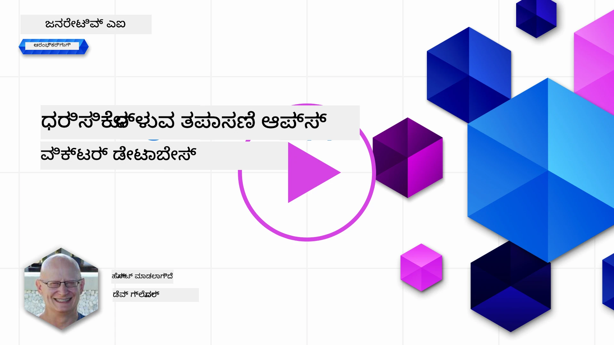
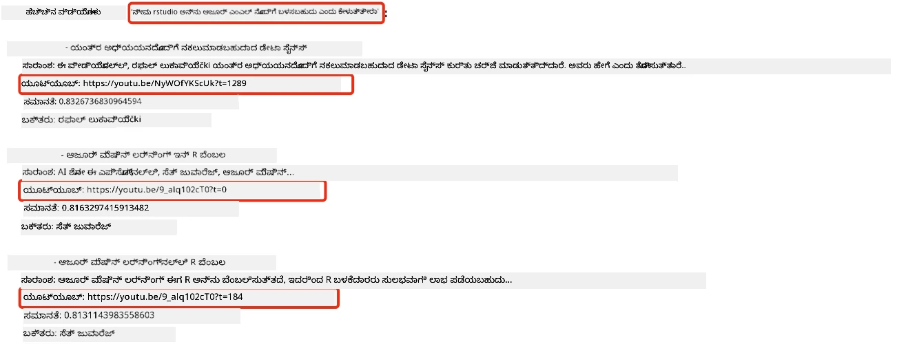
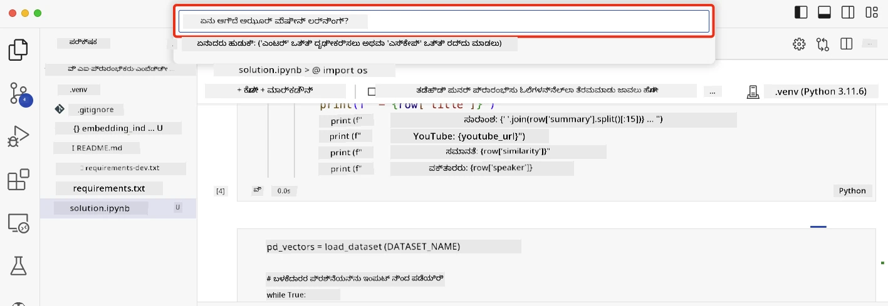

# ಹುಡುಕಾಟ ಅಪ್ಲಿಕೇಶನ್‌ಗಳನ್ನು ನಿರ್ಮಿಸುವುದು

[](https://youtu.be/W0-nzXjOjr0?si=GcsqiTTvd7RKbo7V)

> > _ಈ ಪಾಠದ ವೀಡಿಯೋವನ್ನು ನೋಡಲು ಮೇಲಿನ ಚಿತ್ರವನ್ನು ಕ್ಲಿಕ್ ಮಾಡಿ_

LLM ಗಳು ಚಾಟ್‌ಬಾಟ್‌ಗಳು ಮತ್ತು ಪಠ್ಯ ರಚನೆಯಿಗಿಂತ ಹೆಚ್ಚು. ಎम्बೆಡ್ಡಿಂಗ್‌ಗಳನ್ನು ಬಳಸಿ ಹುಡುಕಾಟ ಅಪ್ಲಿಕೇಶನ್‌ಗಳನ್ನು ನಿರ್ಮಿಸುವುದೂ ಸಾಧ್ಯ. ಎम्बೆಡ್ಡಿಂಗ್‌ಗಳು ಡೇಟಾದ ಸಂಖ್ಯಾತ್ಮಕ ಪ್ರತಿನಿಧಿಗಳು, ಅಥವಾ ವೆಕ್ಟರ್‌ಗಳಾಗಿ ಕರೆಯಲ್ಪಡುವವು, ಮತ್ತು ಡೇಟಾದ ಸಾಂದರ್ಭಿಕ ಹುಡುಕಾಟಕ್ಕೆ ಬಳಸಬಹುದು.

ಈ ಪಾಠದಲ್ಲಿ, ನಾವು ನಮ್ಮ ಶಿಕ್ಷಣ ಸ್ಟಾರ್ಟ್ಅಪ್‌ಗೆ ಹುಡುಕಾಟ ಅಪ್ಲಿಕೇಶನ್ ನಿರ್ಮಿಸಲಿದ್ದೇವೆ. ನಮ್ಮ ಸ್ಟಾರ್ಟ್ಅಪ್ ಅಭಿವೃದ್ಧಿ ಹೊಂದುತ್ತಿರುವ ದೇಶಗಳ ವಿದ್ಯಾರ್ಥಿಗಳಿಗೆ ಉಚಿತ ಶಿಕ್ಷಣ ನೀಡುವ ಲಾಭರಹಿತ ಸಂಸ್ಥೆ. ನಮ್ಮ ಸ್ಟಾರ್ಟ್ಅಪ್‌ಗೆ ವಿದ್ಯಾರ್ಥಿಗಳು AI ಬಗ್ಗೆ ಕಲಿಯಲು ಬಳಸಬಹುದಾದ ಅನೇಕ YouTube ವೀಡಿಯೋಗಳಿವೆ. ವಿದ್ಯಾರ್ಥಿಗಳು ಪ್ರಶ್ನೆ ಟೈಪ್ ಮಾಡುವ ಮೂಲಕ YouTube ವೀಡಿಯೋವನ್ನು ಹುಡುಕಲು ಅನುಮತಿಸುವ ಹುಡುಕಾಟ ಅಪ್ಲಿಕೇಶನ್ ನಿರ್ಮಿಸಲು ನಮ್ಮ ಸ್ಟಾರ್ಟ್ಅಪ್ ಬಯಸುತ್ತದೆ.

ಉದಾಹರಣೆಗೆ, ವಿದ್ಯಾರ್ಥಿ 'ಜುಪೈಟರ್ ನೋಟ್ಬುಕ್‌ಗಳು ಏನು?' ಅಥವಾ 'ಅಜೂರ್ ML ಏನು?' ಎಂದು ಟೈಪ್ ಮಾಡಿದರೆ, ಹುಡುಕಾಟ ಅಪ್ಲಿಕೇಶನ್ ಪ್ರಶ್ನೆಗೆ ಸಂಬಂಧಿಸಿದ YouTube ವೀಡಿಯೋಗಳ ಪಟ್ಟಿಯನ್ನು ನೀಡುತ್ತದೆ, ಮತ್ತು ಇನ್ನೂ ಉತ್ತಮವಾಗಿ, ವೀಡಿಯೋದಲ್ಲಿ ಪ್ರಶ್ನೆಗೆ ಉತ್ತರ ಇರುವ ಸ್ಥಳಕ್ಕೆ ಲಿಂಕ್ ಅನ್ನು ನೀಡುತ್ತದೆ.

## ಪರಿಚಯ

ಈ ಪಾಠದಲ್ಲಿ ನಾವು ಚರ್ಚಿಸುವುದು:

- ಸಾಂದರ್ಭಿಕ ಮತ್ತು ಕೀವರ್ಡ್ ಹುಡುಕಾಟ.
- ಪಠ್ಯ ಎम्बೆಡ್ಡಿಂಗ್‌ಗಳು ಏನು.
- ಪಠ್ಯ ಎम्बೆಡ್ಡಿಂಗ್ ಸೂಚ್ಯಂಕವನ್ನು ರಚಿಸುವುದು.
- ಪಠ್ಯ ಎम्बೆಡ್ಡಿಂಗ್ ಸೂಚ್ಯಂಕವನ್ನು ಹುಡುಕುವುದು.

## ಕಲಿಕೆಯ ಗುರಿಗಳು

ಈ ಪಾಠವನ್ನು ಪೂರ್ಣಗೊಳಿಸಿದ ನಂತರ, ನೀವು:

- ಸಾಂದರ್ಭಿಕ ಮತ್ತು ಕೀವರ್ಡ್ ಹುಡುಕಾಟದ ವ್ಯತ್ಯಾಸವನ್ನು ಹೇಳಬಲ್ಲಿರಿ.
- ಪಠ್ಯ ಎम्बೆಡ್ಡಿಂಗ್‌ಗಳು ಏನೆಂದು ವಿವರಿಸಬಲ್ಲಿರಿ.
- ಎम्बೆಡ್ಡಿಂಗ್‌ಗಳನ್ನು ಬಳಸಿ ಡೇಟಾವನ್ನು ಹುಡುಕಲು ಅಪ್ಲಿಕೇಶನ್ ರಚಿಸಬಲ್ಲಿರಿ.

## ಹುಡುಕಾಟ ಅಪ್ಲಿಕೇಶನ್ ನಿರ್ಮಿಸುವುದಕ್ಕೆ ಏಕೆ?

ಹುಡುಕಾಟ ಅಪ್ಲಿಕೇಶನ್ ನಿರ್ಮಿಸುವುದು ಎम्बೆಡ್ಡಿಂಗ್‌ಗಳನ್ನು ಬಳಸಿ ಡೇಟಾವನ್ನು ಹುಡುಕುವುದು ಹೇಗೆ ಎಂಬುದನ್ನು ಅರ್ಥಮಾಡಿಕೊಳ್ಳಲು ಸಹಾಯ ಮಾಡುತ್ತದೆ. ವಿದ್ಯಾರ್ಥಿಗಳು ತ್ವರಿತವಾಗಿ ಮಾಹಿತಿಯನ್ನು ಹುಡುಕಲು ಬಳಸಬಹುದಾದ ಹುಡುಕಾಟ ಅಪ್ಲಿಕೇಶನ್ ನಿರ್ಮಿಸುವುದನ್ನು ನೀವು ಕಲಿಯುತ್ತೀರಿ.

ಈ ಪಾಠದಲ್ಲಿ Microsoft [AI Show](https://www.youtube.com/playlist?list=PLlrxD0HtieHi0mwteKBOfEeOYf0LJU4O1) YouTube ಚಾನೆಲ್‌ನ YouTube ಟ್ರಾನ್ಸ್ಕ್ರಿಪ್ಟ್‌ಗಳ ಎम्बೆಡ್ಡಿಂಗ್ ಸೂಚ್ಯಂಕವನ್ನು ಒಳಗೊಂಡಿದೆ. AI Show ಒಂದು YouTube ಚಾನೆಲ್ ಆಗಿದ್ದು, AI ಮತ್ತು ಯಂತ್ರ ಅಧ್ಯಯನವನ್ನು ಕಲಿಸುತ್ತದೆ. ಎಂಬೆಡ್ಡಿಂಗ್ ಸೂಚ್ಯಂಕವು 2023 ಅಕ್ಟೋಬರ್ ತನಕದ ಪ್ರತಿಯೊಂದು YouTube ಟ್ರಾನ್ಸ್ಕ್ರಿಪ್ಟ್‌ಗಳ ಎಂಬೆಡ್ಡಿಂಗ್‌ಗಳನ್ನು ಹೊಂದಿದೆ. ನೀವು ಈ ಎಂಬೆಡ್ಡಿಂಗ್ ಸೂಚ್ಯಂಕವನ್ನು ಬಳಸಿ ನಮ್ಮ ಸ್ಟಾರ್ಟ್ಅಪ್‌ಗೆ ಹುಡುಕಾಟ ಅಪ್ಲಿಕೇಶನ್ ನಿರ್ಮಿಸುವಿರಿ. ಹುಡುಕಾಟ ಅಪ್ಲಿಕೇಶನ್ ಪ್ರಶ್ನೆಗೆ ಉತ್ತರ ಇರುವ ವೀಡಿಯೋ ಭಾಗಕ್ಕೆ ಲಿಂಕ್ ಅನ್ನು ನೀಡುತ್ತದೆ. ಇದು ವಿದ್ಯಾರ್ಥಿಗಳಿಗೆ ಅಗತ್ಯ ಮಾಹಿತಿಯನ್ನು ತ್ವರಿತವಾಗಿ ಹುಡುಕಲು ಉತ್ತಮ ಮಾರ್ಗ.

ಕೆಳಗಿನ ಚಿತ್ರವು 'ನೀವು rstudio ಅನ್ನು ಅಜೂರ್ ML ಜೊತೆಗೆ ಬಳಸಬಹುದೇ?' ಎಂಬ ಪ್ರಶ್ನೆಗೆ ಸಾಂದರ್ಭಿಕ ಪ್ರಶ್ನೆಯ ಉದಾಹರಣೆ. YouTube URL ಅನ್ನು ನೋಡಿ, URL ನಲ್ಲಿ ಟೈಮ್‌ಸ್ಟ್ಯಾಂಪ್ ಇದೆ, ಅದು ಪ್ರಶ್ನೆಗೆ ಉತ್ತರ ಇರುವ ವೀಡಿಯೋ ಭಾಗಕ್ಕೆ ಕರೆದೊಯ್ಯುತ್ತದೆ.



## ಸಾಂದರ್ಭಿಕ ಹುಡುಕಾಟ ಎಂದರೆ ಏನು?

ನೀವು ಈಗ ಆಶ್ಚರ್ಯಪಡಬಹುದು, ಸಾಂದರ್ಭಿಕ ಹುಡುಕಾಟ ಎಂದರೆ ಏನು? ಸಾಂದರ್ಭಿಕ ಹುಡುಕಾಟವು ಪ್ರಶ್ನೆಯಲ್ಲಿನ ಪದಗಳ ಅರ್ಥ ಅಥವಾ ಸಾಂದರ್ಭಿಕತೆಯನ್ನು ಬಳಸಿಕೊಂಡು ಸಂಬಂಧಿತ ಫಲಿತಾಂಶಗಳನ್ನು ನೀಡುವ ಹುಡುಕಾಟ ತಂತ್ರವಾಗಿದೆ.

ಇದೀಗ ಒಂದು ಸಾಂದರ್ಭಿಕ ಹುಡುಕಾಟದ ಉದಾಹರಣೆ. ನೀವು ಕಾರು ಖರೀದಿಸಲು ಬಯಸುತ್ತಿದ್ದರೆ, ನೀವು 'ನನ್ನ ಕನಸು ಕಾರು' ಎಂದು ಹುಡುಕಬಹುದು, ಸಾಂದರ್ಭಿಕ ಹುಡುಕಾಟವು ನೀವು ಕಾರಿನ ಕನಸು ಕಾಣುತ್ತಿರುವುದಲ್ಲ, ಬದಲಾಗಿ ನಿಮ್ಮ 'ಆದರ್ಶ' ಕಾರನ್ನು ಹುಡುಕುತ್ತಿರುವುದನ್ನು ಅರ್ಥಮಾಡಿಕೊಳ್ಳುತ್ತದೆ. ಸಾಂದರ್ಭಿಕ ಹುಡುಕಾಟ ನಿಮ್ಮ ಉದ್ದೇಶವನ್ನು ಅರ್ಥಮಾಡಿಕೊಂಡು ಸಂಬಂಧಿತ ಫಲಿತಾಂಶಗಳನ್ನು ನೀಡುತ್ತದೆ. ಪರ್ಯಾಯವಾಗಿ, `ಕೀವರ್ಡ್ ಹುಡುಕಾಟ` ಕನಸುಗಳ ಬಗ್ಗೆ ನಿಖರವಾಗಿ ಹುಡುಕುತ್ತದೆ ಮತ್ತು ಅನೇಕ ಬಾರಿ ಸಂಬಂಧವಿಲ್ಲದ ಫಲಿತಾಂಶಗಳನ್ನು ನೀಡುತ್ತದೆ.

## ಪಠ್ಯ ಎಂಬೆಡ್ಡಿಂಗ್‌ಗಳು ಏನು?

[ಪಠ್ಯ ಎಂಬೆಡ್ಡಿಂಗ್‌ಗಳು](https://en.wikipedia.org/wiki/Word_embedding?WT.mc_id=academic-105485-koreyst) [ಸ್ವಾಭಾವಿಕ ಭಾಷಾ ಪ್ರಕ್ರಿಯೆ](https://en.wikipedia.org/wiki/Natural_language_processing?WT.mc_id=academic-105485-koreyst)ಯಲ್ಲಿ ಬಳಸುವ ಪಠ್ಯದ ಪ್ರತಿನಿಧಿಸುವ ತಂತ್ರ. ಪಠ್ಯ ಎಂಬೆಡ್ಡಿಂಗ್‌ಗಳು ಪಠ್ಯದ ಸಾಂದರ್ಭಿಕ ಸಂಖ್ಯಾತ್ಮಕ ಪ್ರತಿನಿಧಿಗಳು. ಎಂಬೆಡ್ಡಿಂಗ್‌ಗಳನ್ನು ಡೇಟಾವನ್ನು ಯಂತ್ರಕ್ಕೆ ಸುಲಭವಾಗಿ ಅರ್ಥಮಾಡಿಕೊಳ್ಳುವ ರೀತಿಯಲ್ಲಿ ಪ್ರತಿನಿಧಿಸಲು ಬಳಸಲಾಗುತ್ತದೆ. ಪಠ್ಯ ಎಂಬೆಡ್ಡಿಂಗ್‌ಗಳನ್ನು ನಿರ್ಮಿಸಲು ಅನೇಕ ಮಾದರಿಗಳು ಇವೆ, ಈ ಪಾಠದಲ್ಲಿ ನಾವು OpenAI ಎಂಬೆಡ್ಡಿಂಗ್ ಮಾದರಿಯನ್ನು ಬಳಸಿ ಎಂಬೆಡ್ಡಿಂಗ್‌ಗಳನ್ನು ರಚಿಸುವುದರ ಮೇಲೆ ಗಮನಹರಿಸುವೆವು.

ಇದೀಗ ಒಂದು ಉದಾಹರಣೆ, ಕೆಳಗಿನ ಪಠ್ಯ AI Show YouTube ಚಾನೆಲ್‌ನ ಒಂದು ಎಪಿಸೋಡ್‌ನ ಟ್ರಾನ್ಸ್ಕ್ರಿಪ್ಟ್‌ನ ಭಾಗವಾಗಿದೆ ಎಂದು ಕಲ್ಪಿಸೋಣ:

```text
Today we are going to learn about Azure Machine Learning.
```

ನಾವು ಪಠ್ಯವನ್ನು OpenAI ಎಂಬೆಡ್ಡಿಂಗ್ API ಗೆ ಕಳುಹಿಸುತ್ತೇವೆ ಮತ್ತು ಅದು 1536 ಸಂಖ್ಯೆಗಳ (ವೆಕ್ಟರ್) ಎಂಬೆಡ್ಡಿಂಗ್ ಅನ್ನು ನೀಡುತ್ತದೆ. ವೆಕ್ಟರ್‌ನ ಪ್ರತಿಯೊಂದು ಸಂಖ್ಯೆ ಪಠ್ಯದ ವಿಭಿನ್ನ ಅಂಶವನ್ನು ಪ್ರತಿನಿಧಿಸುತ್ತದೆ. ಸಂಕ್ಷಿಪ್ತಿಗಾಗಿ, ಇಲ್ಲಿ ವೆಕ್ಟರ್‌ನ ಮೊದಲ 10 ಸಂಖ್ಯೆಗಳು ಇವೆ.

```python
[-0.006655829958617687, 0.0026128944009542465, 0.008792596869170666, -0.02446001023054123, -0.008540431968867779, 0.022071078419685364, -0.010703742504119873, 0.003311325330287218, -0.011632772162556648, -0.02187200076878071, ...]
```

## ಎಂಬೆಡ್ಡಿಂಗ್ ಸೂಚ್ಯಂಕವನ್ನು ಹೇಗೆ ರಚಿಸಲಾಗುತ್ತದೆ?

ಈ ಪಾಠದ ಎಂಬೆಡ್ಡಿಂಗ್ ಸೂಚ್ಯಂಕವು ಪೈಥಾನ್ ಸ್ಕ್ರಿಪ್ಟ್‌ಗಳ ಸರಣಿಯಿಂದ ರಚಿಸಲಾಗಿದೆ. ನೀವು ಈ ಪಾಠದ 'scripts' ಫೋಲ್ಡರ್‌ನಲ್ಲಿರುವ [README](./scripts/README.md?WT.mc_id=academic-105485-koreyst) ನಲ್ಲಿ ಸ್ಕ್ರಿಪ್ಟ್‌ಗಳು ಮತ್ತು ಸೂಚನೆಗಳನ್ನು ಕಾಣಬಹುದು. ಈ ಪಾಠವನ್ನು ಪೂರ್ಣಗೊಳಿಸಲು ನೀವು ಈ ಸ್ಕ್ರಿಪ್ಟ್‌ಗಳನ್ನು ಓಡಿಸುವ ಅಗತ್ಯವಿಲ್ಲ, ಏಕೆಂದರೆ ಎಂಬೆಡ್ಡಿಂಗ್ ಸೂಚ್ಯಂಕ ನಿಮಗೆ ನೀಡಲಾಗಿದೆ.

ಸ್ಕ್ರಿಪ್ಟ್‌ಗಳು ಕೆಳಗಿನ ಕಾರ್ಯಗಳನ್ನು ನಿರ್ವಹಿಸುತ್ತವೆ:

1. [AI Show](https://www.youtube.com/playlist?list=PLlrxD0HtieHi0mwteKBOfEeOYf0LJU4O1) ಪ್ಲೇಲಿಸ್ಟ್‌ನ ಪ್ರತಿಯೊಂದು YouTube ವೀಡಿಯೋ ಟ್ರಾನ್ಸ್ಕ್ರಿಪ್ಟ್ ಡೌನ್‌ಲೋಡ್ ಮಾಡಲಾಗುತ್ತದೆ.
2. [OpenAI Functions](https://learn.microsoft.com/azure/ai-services/openai/how-to/function-calling?WT.mc_id=academic-105485-koreyst) ಬಳಸಿ, YouTube ಟ್ರಾನ್ಸ್ಕ್ರಿಪ್ಟ್‌ನ ಮೊದಲ 3 ನಿಮಿಷಗಳಿಂದ ಸ್ಪೀಕರ್ ಹೆಸರು ತೆಗೆದುಕೊಳ್ಳಲು ಪ್ರಯತ್ನಿಸಲಾಗುತ್ತದೆ. ಪ್ರತಿಯೊಂದು ವೀಡಿಯೋಗೆ ಸ್ಪೀಕರ್ ಹೆಸರು `embedding_index_3m.json` ಎಂಬ ಎಂಬೆಡ್ಡಿಂಗ್ ಸೂಚ್ಯಂಕದಲ್ಲಿ ಸಂಗ್ರಹಿಸಲಾಗುತ್ತದೆ.
3. ಟ್ರಾನ್ಸ್ಕ್ರಿಪ್ಟ್ ಪಠ್ಯವನ್ನು **3 ನಿಮಿಷಗಳ ಪಠ್ಯ ವಿಭಾಗಗಳಾಗಿ** ವಿಭಜಿಸಲಾಗುತ್ತದೆ. ಈ ವಿಭಾಗವು ಮುಂದಿನ ವಿಭಾಗದಿಂದ ಸುಮಾರು 20 ಪದಗಳ ಅತಿರಿಕ್ತ ಭಾಗವನ್ನು ಒಳಗೊಂಡಿರುತ್ತದೆ, ಇದರಿಂದ ವಿಭಾಗದ ಎಂಬೆಡ್ಡಿಂಗ್ ಕಡಿತವಾಗದಂತೆ ಮತ್ತು ಉತ್ತಮ ಹುಡುಕಾಟ ಸಾಂದರ್ಭಿಕತೆ ಒದಗಿಸಲು.
4. ಪ್ರತಿಯೊಂದು ಪಠ್ಯ ವಿಭಾಗವನ್ನು OpenAI ಚಾಟ್ API ಗೆ ಕಳುಹಿಸಿ 60 ಪದಗಳ ಸಾರಾಂಶವನ್ನು ರಚಿಸಲಾಗುತ್ತದೆ. ಸಾರಾಂಶವನ್ನು ಕೂಡ `embedding_index_3m.json` ನಲ್ಲಿ ಸಂಗ್ರಹಿಸಲಾಗುತ್ತದೆ.
5. ಕೊನೆಗೆ, ವಿಭಾಗದ ಪಠ್ಯವನ್ನು OpenAI ಎಂಬೆಡ್ಡಿಂಗ್ API ಗೆ ಕಳುಹಿಸಲಾಗುತ್ತದೆ. ಎಂಬೆಡ್ಡಿಂಗ್ API 1536 ಸಂಖ್ಯೆಗಳ ವೆಕ್ಟರ್ ಅನ್ನು ನೀಡುತ್ತದೆ, ಇದು ವಿಭಾಗದ ಸಾಂದರ್ಭಿಕ ಅರ್ಥವನ್ನು ಪ್ರತಿನಿಧಿಸುತ್ತದೆ. ವಿಭಾಗ ಮತ್ತು OpenAI ಎಂಬೆಡ್ಡಿಂಗ್ ವೆಕ್ಟರ್ `embedding_index_3m.json` ಎಂಬ ಎಂಬೆಡ್ಡಿಂಗ್ ಸೂಚ್ಯಂಕದಲ್ಲಿ ಸಂಗ್ರಹಿಸಲಾಗುತ್ತದೆ.

### ವೆಕ್ಟರ್ ಡೇಟಾಬೇಸ್‌ಗಳು

ಪಾಠದ ಸರಳತೆಗೆ, ಎಂಬೆಡ್ಡಿಂಗ್ ಸೂಚ್ಯಂಕವನ್ನು `embedding_index_3m.json` ಎಂಬ JSON ಫೈಲ್‌ನಲ್ಲಿ ಸಂಗ್ರಹಿಸಿ Pandas DataFrame ಗೆ ಲೋಡ್ ಮಾಡಲಾಗಿದೆ. ಆದರೆ ಉತ್ಪಾದನೆಯಲ್ಲಿ, ಎಂಬೆಡ್ಡಿಂಗ್ ಸೂಚ್ಯಂಕವನ್ನು [Azure Cognitive Search](https://learn.microsoft.com/training/modules/improve-search-results-vector-search?WT.mc_id=academic-105485-koreyst), [Redis](https://cookbook.openai.com/examples/vector_databases/redis/readme?WT.mc_id=academic-105485-koreyst), [Pinecone](https://cookbook.openai.com/examples/vector_databases/pinecone/readme?WT.mc_id=academic-105485-koreyst), [Weaviate](https://cookbook.openai.com/examples/vector_databases/weaviate/readme?WT.mc_id=academic-105485-koreyst) ಮುಂತಾದ ವೆಕ್ಟರ್ ಡೇಟಾಬೇಸ್‌ಗಳಲ್ಲಿ ಸಂಗ್ರಹಿಸಲಾಗುತ್ತದೆ.

## ಕೋಸೈನ್ ಸಾದೃಶ್ಯವನ್ನು ಅರ್ಥಮಾಡಿಕೊಳ್ಳುವುದು

ನಾವು ಪಠ್ಯ ಎಂಬೆಡ್ಡಿಂಗ್‌ಗಳ ಬಗ್ಗೆ ಕಲಿತಿದ್ದೇವೆ, ಮುಂದಿನ ಹಂತವು ಪಠ್ಯ ಎಂಬೆಡ್ಡಿಂಗ್‌ಗಳನ್ನು ಬಳಸಿ ಡೇಟಾವನ್ನು ಹುಡುಕುವುದು ಮತ್ತು ವಿಶೇಷವಾಗಿ ಕೋಸೈನ್ ಸಾದೃಶ್ಯವನ್ನು ಬಳಸಿ ನೀಡಲಾದ ಪ್ರಶ್ನೆಗೆ ಅತ್ಯಂತ ಸಾದೃಶ್ಯ ಎಂಬೆಡ್ಡಿಂಗ್‌ಗಳನ್ನು ಕಂಡುಹಿಡಿಯುವುದು.

### ಕೋಸೈನ್ ಸಾದೃಶ್ಯ ಎಂದರೆ ಏನು?

ಕೋಸೈನ್ ಸಾದೃಶ್ಯವು ಎರಡು ವೆಕ್ಟರ್‌ಗಳ ನಡುವಿನ ಸಾದೃಶ್ಯದ ಅಳತೆ. ಇದನ್ನು `ನಿಕಟ ನೆರೆಹೊರೆಯ ಹುಡುಕಾಟ` ಎಂದು ಕೂಡ ಕರೆಯುತ್ತಾರೆ. ಕೋಸೈನ್ ಸಾದೃಶ್ಯ ಹುಡುಕಾಟ ಮಾಡಲು, ನೀವು OpenAI ಎಂಬೆಡ್ಡಿಂಗ್ API ಬಳಸಿ ಪ್ರಶ್ನೆಯ ಪಠ್ಯವನ್ನು ವೆಕ್ಟರೀಕರಿಸಬೇಕು. ನಂತರ, ಪ್ರಶ್ನೆ ವೆಕ್ಟರ್ ಮತ್ತು ಎಂಬೆಡ್ಡಿಂಗ್ ಸೂಚ್ಯಂಕದಲ್ಲಿನ ಪ್ರತಿಯೊಂದು ವೆಕ್ಟರ್ ನಡುವಿನ ಕೋಸೈನ್ ಸಾದೃಶ್ಯವನ್ನು ಲೆಕ್ಕಿಸಬೇಕು. ಎಂಬೆಡ್ಡಿಂಗ್ ಸೂಚ್ಯಂಕದಲ್ಲಿ ಪ್ರತಿಯೊಂದು YouTube ಟ್ರಾನ್ಸ್ಕ್ರಿಪ್ಟ್ ಪಠ್ಯ ವಿಭಾಗಕ್ಕೆ ಒಂದು ವೆಕ್ಟರ್ ಇರುತ್ತದೆ. ಕೊನೆಗೆ, ಫಲಿತಾಂಶಗಳನ್ನು ಕೋಸೈನ್ ಸಾದೃಶ್ಯ ಆಧಾರವಾಗಿ ವಿಂಗಡಿಸಿ, ಅತ್ಯಂತ ಸಾದೃಶ್ಯ ಪಠ್ಯ ವಿಭಾಗಗಳನ್ನು ತೋರಿಸಲಾಗುತ್ತದೆ.

ಗಣಿತ ದೃಷ್ಟಿಕೋನದಿಂದ, ಕೋಸೈನ್ ಸಾದೃಶ್ಯವು ಬಹುಮಾನದಿಕ ಸ್ಥಳದಲ್ಲಿ ಎರಡು ವೆಕ್ಟರ್‌ಗಳ ನಡುವಿನ ಕೋನದ ಕೋಸೈನ್ ಅನ್ನು ಅಳೆಯುತ್ತದೆ. ಇದು ಉಪಯುಕ್ತ, ಏಕೆಂದರೆ ಎರಡು ದಾಖಲೆಗಳು ಯೂಕ್ಲಿಡಿಯನ್ ದೂರದಿಂದ ದೂರದಲ್ಲಿದ್ದರೂ, ಅವುಗಳ ನಡುವಿನ ಕೋನ ಕಡಿಮೆ ಇರಬಹುದು ಮತ್ತು ಆದ್ದರಿಂದ ಕೋಸೈನ್ ಸಾದೃಶ್ಯ ಹೆಚ್ಚು ಇರಬಹುದು. ಕೋಸೈನ್ ಸಾದೃಶ್ಯ ಸಮೀಕರಣಗಳ ಬಗ್ಗೆ ಹೆಚ್ಚಿನ ಮಾಹಿತಿಗೆ, [Cosine similarity](https://en.wikipedia.org/wiki/Cosine_similarity?WT.mc_id=academic-105485-koreyst) ನೋಡಿ.

## ನಿಮ್ಮ ಮೊದಲ ಹುಡುಕಾಟ ಅಪ್ಲಿಕೇಶನ್ ನಿರ್ಮಿಸುವುದು

ಮುಂದೆ, ನಾವು ಎಂಬೆಡ್ಡಿಂಗ್‌ಗಳನ್ನು ಬಳಸಿ ಹುಡುಕಾಟ ಅಪ್ಲಿಕೇಶನ್ ನಿರ್ಮಿಸುವುದನ್ನು ಕಲಿಯೋಣ. ಹುಡುಕಾಟ ಅಪ್ಲಿಕೇಶನ್ ವಿದ್ಯಾರ್ಥಿಗಳು ಪ್ರಶ್ನೆ ಟೈಪ್ ಮಾಡುವ ಮೂಲಕ ವೀಡಿಯೋವನ್ನು ಹುಡುಕಲು ಅನುಮತಿಸುತ್ತದೆ. ಹುಡುಕಾಟ ಅಪ್ಲಿಕೇಶನ್ ಪ್ರಶ್ನೆಗೆ ಸಂಬಂಧಿಸಿದ ವೀಡಿಯೋಗಳ ಪಟ್ಟಿಯನ್ನು ನೀಡುತ್ತದೆ. ಜೊತೆಗೆ, ಪ್ರಶ್ನೆಗೆ ಉತ್ತರ ಇರುವ ವೀಡಿಯೋ ಭಾಗಕ್ಕೆ ಲಿಂಕ್ ಅನ್ನು ನೀಡುತ್ತದೆ.

ಈ ಪರಿಹಾರವನ್ನು Windows 11, macOS, ಮತ್ತು Ubuntu 22.04 ನಲ್ಲಿ Python 3.10 ಅಥವಾ ನಂತರದ ಆವೃತ್ತಿ ಬಳಸಿ ನಿರ್ಮಿಸಿ ಪರೀಕ್ಷಿಸಲಾಗಿದೆ. Python ಅನ್ನು [python.org](https://www.python.org/downloads/?WT.mc_id=academic-105485-koreyst) ನಿಂದ ಡೌನ್‌ಲೋಡ್ ಮಾಡಬಹುದು.

## ಕಾರ್ಯ - ವಿದ್ಯಾರ್ಥಿಗಳಿಗೆ ಹುಡುಕಾಟ ಅಪ್ಲಿಕೇಶನ್ ನಿರ್ಮಿಸುವ ಅವಕಾಶ

ಈ ಪಾಠದ ಆರಂಭದಲ್ಲಿ ನಾವು ನಮ್ಮ ಸ್ಟಾರ್ಟ್ಅಪ್ ಪರಿಚಯಿಸಿದ್ದೇವೆ. ಈಗ ವಿದ್ಯಾರ್ಥಿಗಳು ತಮ್ಮ ಮೌಲ್ಯಮಾಪನಗಳಿಗೆ ಹುಡುಕಾಟ ಅಪ್ಲಿಕೇಶನ್ ನಿರ್ಮಿಸಲು ಅವಕಾಶ ನೀಡುವ ಸಮಯ.

ಈ ಕಾರ್ಯದಲ್ಲಿ, ನೀವು ಹುಡುಕಾಟ ಅಪ್ಲಿಕೇಶನ್ ನಿರ್ಮಿಸಲು ಬಳಸುವ Azure OpenAI ಸೇವೆಗಳನ್ನು ರಚಿಸುವಿರಿ. ನೀವು ಕೆಳಗಿನ Azure OpenAI ಸೇವೆಗಳನ್ನು ರಚಿಸುವಿರಿ. ಈ ಕಾರ್ಯವನ್ನು ಪೂರ್ಣಗೊಳಿಸಲು ನಿಮಗೆ Azure ಸಬ್ಸ್ಕ್ರಿಪ್ಷನ್ ಬೇಕಾಗುತ್ತದೆ.

### Azure ಕ್ಲೌಡ್ ಶೆಲ್ ಪ್ರಾರಂಭಿಸಿ

1. [Azure ಪೋರ್ಟಲ್](https://portal.azure.com/?WT.mc_id=academic-105485-koreyst) ಗೆ ಸೈನ್ ಇನ್ ಆಗಿ.
2. Azure ಪೋರ್ಟಲ್‌ನ ಮೇಲ್ಭಾಗದ ಬಲಭಾಗದಲ್ಲಿ ಕ್ಲೌಡ್ ಶೆಲ್ ಐಕಾನ್ ಆಯ್ಕೆಮಾಡಿ.
3. ಪರಿಸರ ಪ್ರಕಾರವಾಗಿ **Bash** ಆಯ್ಕೆಮಾಡಿ.

#### ರಿಸೋರ್ಸ್ ಗ್ರೂಪ್ ರಚಿಸಿ

> ಈ ಸೂಚನೆಗಳಿಗೆ, ನಾವು ಪೂರ್ವ ಅಮೆರಿಕದ "semantic-video-search" ಎಂಬ ರಿಸೋರ್ಸ್ ಗ್ರೂಪ್ ಅನ್ನು ಬಳಸುತ್ತಿದ್ದೇವೆ.
> ನೀವು ರಿಸೋರ್ಸ್ ಗ್ರೂಪ್ ಹೆಸರನ್ನು ಬದಲಾಯಿಸಬಹುದು, ಆದರೆ ರಿಸೋರ್ಸ್‌ಗಳ ಸ್ಥಳ ಬದಲಾಯಿಸುವಾಗ,
> [ಮಾದರಿ ಲಭ್ಯತೆ ಪಟ್ಟಿಯನ್ನು](https://aka.ms/oai/models?WT.mc_id=academic-105485-koreyst) ಪರಿಶೀಲಿಸಿ.

```shell
az group create --name semantic-video-search --location eastus
```

#### Azure OpenAI ಸೇವೆ ರಿಸೋರ್ಸ್ ರಚಿಸಿ

Azure ಕ್ಲೌಡ್ ಶೆಲ್‌ನಿಂದ ಕೆಳಗಿನ ಕಮಾಂಡ್ ಅನ್ನು ಓಡಿಸಿ Azure OpenAI ಸೇವೆ ರಿಸೋರ್ಸ್ ರಚಿಸಲು.

```shell
az cognitiveservices account create --name semantic-video-openai --resource-group semantic-video-search \
    --location eastus --kind OpenAI --sku s0
```

#### ಈ ಅಪ್ಲಿಕೇಶನ್‌ನಲ್ಲಿ ಬಳಕೆಗಾಗಿ ಎಂಡ್ಪಾಯಿಂಟ್ ಮತ್ತು ಕೀಗಳನ್ನು ಪಡೆಯಿರಿ

Azure ಕ್ಲೌಡ್ ಶೆಲ್‌ನಿಂದ ಕೆಳಗಿನ ಕಮಾಂಡ್‌ಗಳನ್ನು ಓಡಿಸಿ Azure OpenAI ಸೇವೆ ರಿಸೋರ್ಸ್‌ನ ಎಂಡ್ಪಾಯಿಂಟ್ ಮತ್ತು ಕೀಗಳನ್ನು ಪಡೆಯಿರಿ.

```shell
az cognitiveservices account show --name semantic-video-openai \
   --resource-group  semantic-video-search | jq -r .properties.endpoint
az cognitiveservices account keys list --name semantic-video-openai \
   --resource-group semantic-video-search | jq -r .key1
```

#### OpenAI ಎಂಬೆಡ್ಡಿಂಗ್ ಮಾದರಿಯನ್ನು ನಿಯೋಜಿಸಿ

Azure ಕ್ಲೌಡ್ ಶೆಲ್‌ನಿಂದ ಕೆಳಗಿನ ಕಮಾಂಡ್ ಅನ್ನು ಓಡಿಸಿ OpenAI ಎಂಬೆಡ್ಡಿಂಗ್ ಮಾದರಿಯನ್ನು ನಿಯೋಜಿಸಲು.

```shell
az cognitiveservices account deployment create \
    --name semantic-video-openai \
    --resource-group  semantic-video-search \
    --deployment-name text-embedding-ada-002 \
    --model-name text-embedding-ada-002 \
    --model-version "2"  \
    --model-format OpenAI \
    --sku-capacity 100 --sku-name "Standard"
```

## ಪರಿಹಾರ

GitHub Codespaces ನಲ್ಲಿ [solution notebook](./python/aoai-solution.ipynb?WT.mc_id=academic-105485-koreyst) ಅನ್ನು ತೆರೆಯಿರಿ ಮತ್ತು Jupyter Notebook ನಲ್ಲಿ ಸೂಚನೆಗಳನ್ನು ಅನುಸರಿಸಿ.

ನೀವು ನೋಟ್ಬುಕ್ ಅನ್ನು ಓಡಿಸಿದಾಗ, ಪ್ರಶ್ನೆ ನಮೂದಿಸಲು ಪ್ರಾಂಪ್ಟ್ ಆಗುತ್ತದೆ. ಇನ್ಪುಟ್ ಬಾಕ್ಸ್ ಹೀಗೆ ಕಾಣುತ್ತದೆ:



## ಅದ್ಭುತ ಕೆಲಸ! ನಿಮ್ಮ ಕಲಿಕೆಯನ್ನು ಮುಂದುವರೆಸಿ

ಈ ಪಾಠವನ್ನು ಪೂರ್ಣಗೊಳಿಸಿದ ನಂತರ, ನಮ್ಮ [ಜನರೇಟಿವ್ AI ಕಲಿಕೆ ಸಂಗ್ರಹ](https://aka.ms/genai-collection?WT.mc_id=academic-105485-koreyst) ಅನ್ನು ಪರಿಶೀಲಿಸಿ ಮತ್ತು ನಿಮ್ಮ ಜನರೇಟಿವ್ AI ಜ್ಞಾನವನ್ನು ಮತ್ತಷ್ಟು ವೃದ್ಧಿಪಡಿಸಿ!

ಪಾಠ 9 ಗೆ ಹೋಗಿ, ಅಲ್ಲಿ ನಾವು [ಚಿತ್ರ ರಚನೆ ಅಪ್ಲಿಕೇಶನ್‌ಗಳನ್ನು ನಿರ್ಮಿಸುವುದನ್ನು](../09-building-image-applications/README.md?WT.mc_id=academic-105485-koreyst) ನೋಡೋಣ!

---

<!-- CO-OP TRANSLATOR DISCLAIMER START -->
**ಅಸ್ವೀಕರಣ**:  
ಈ ದಸ್ತಾವೇಜು AI ಅನುವಾದ ಸೇವೆ [Co-op Translator](https://github.com/Azure/co-op-translator) ಬಳಸಿ ಅನುವಾದಿಸಲಾಗಿದೆ. ನಾವು ನಿಖರತೆಯಿಗಾಗಿ ಪ್ರಯತ್ನಿಸುತ್ತಿದ್ದರೂ, ಸ್ವಯಂಚಾಲಿತ ಅನುವಾದಗಳಲ್ಲಿ ದೋಷಗಳು ಅಥವಾ ಅಸತ್ಯತೆಗಳು ಇರಬಹುದು ಎಂದು ದಯವಿಟ್ಟು ಗಮನಿಸಿ. ಮೂಲ ಭಾಷೆಯಲ್ಲಿರುವ ಮೂಲ ದಸ್ತಾವೇಜನ್ನು ಅಧಿಕೃತ ಮೂಲವೆಂದು ಪರಿಗಣಿಸಬೇಕು. ಮಹತ್ವದ ಮಾಹಿತಿಗಾಗಿ, ವೃತ್ತಿಪರ ಮಾನವ ಅನುವಾದವನ್ನು ಶಿಫಾರಸು ಮಾಡಲಾಗುತ್ತದೆ. ಈ ಅನುವಾದ ಬಳಕೆಯಿಂದ ಉಂಟಾಗುವ ಯಾವುದೇ ತಪ್ಪು ಅರ್ಥಮಾಡಿಕೊಳ್ಳುವಿಕೆ ಅಥವಾ ತಪ್ಪು ವಿವರಣೆಗಳಿಗೆ ನಾವು ಹೊಣೆಗಾರರಾಗುವುದಿಲ್ಲ.
<!-- CO-OP TRANSLATOR DISCLAIMER END -->