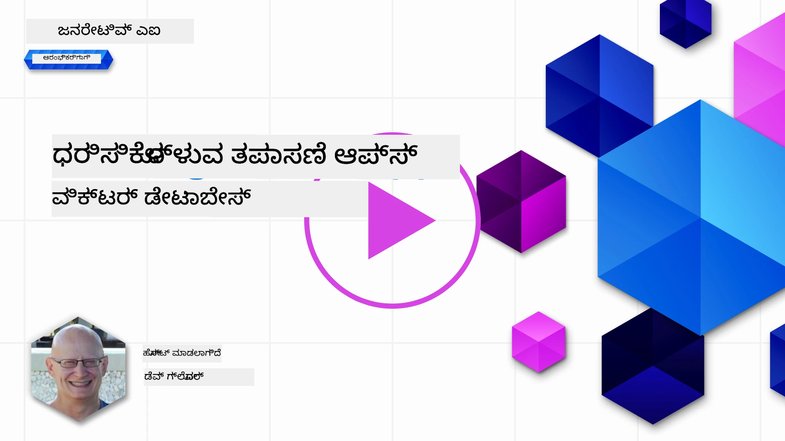
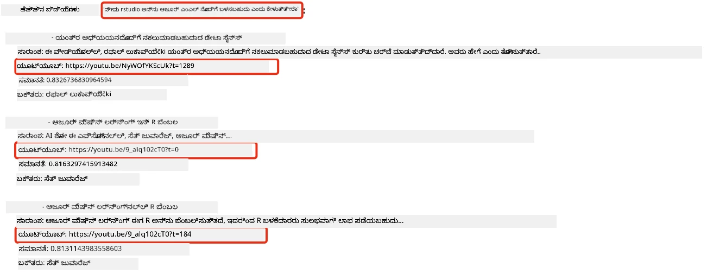
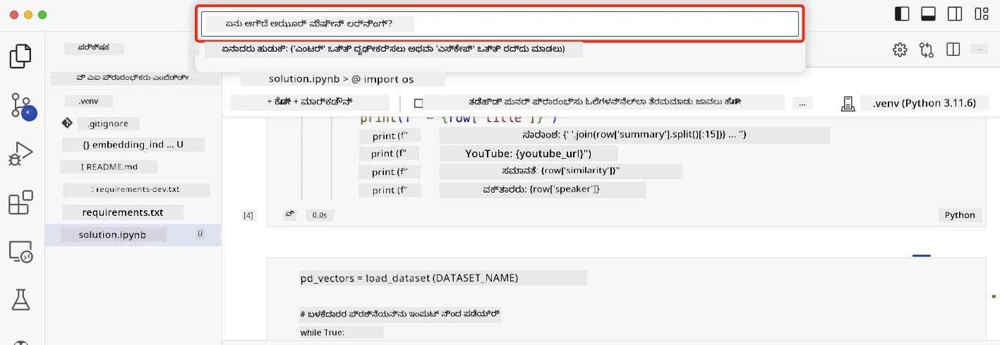

# ಹುಡುಕುವ ಅಪ್ಲಿಕೇಶನ್ ನಿರ್ಮಾಣ

[](https://youtu.be/W0-nzXjOjr0?si=GcsqiTTvd7RKbo7V)

> > _ಈ ಪಾಠದ ವಿಡಿಯೋ ನೋಡಲು ಮೇಲಿನ ಚಿತ್ರವನ್ನು ಕ್ಲಿಕ್ ಮಾಡಿ_

LLM ಗಳು ಚಾಟ್‌ಬಾಟ್‌ಗಳು ಮತ್ತು ಪಠ್ಯ ಉತ್ಪಾದನೆಗಿಂತ ಹೆಚ್ಚಿನದ್ದು. ಎಂಬೆಡಿಂಗ್‌ಗಳನ್ನು ಬಳಸಿ ಹುಡುಕುವ ಅಪ್ಲಿಕೇಶನ್‌ಗಳನ್ನು ನಿರ್ಮಿಸುವುದನ್ನೂ ಸಾಧ್ಯ. ಎಂಬೆಡಿಂಗ್‌ಗಳು ಡೇಟಾವಿನ ಸಂಖ್ಯಾತ್ಮಕ ಪ್ರತಿನಿಧಾನಗಳು, ಇವರನ್ನು ವೆಕ್ಟರ್‌ಗಳೆಂದು ಕರೆಯಲಾಗುತ್ತದೆ ಮತ್ತು ಡೇಟಾ ಗೆ ಸೆಮಾಂಟಿಕ್ ಹುಡುಕಾಟಕ್ಕಾಗಿ ಬಳಸಬಹುದು.

ಈ ಪಾಠದಲ್ಲಿ, ನಾವು ನಮ್ಮ ಶಿಕ್ಷಣ ಸ್ಟಾರ್ಟ್‌ಅಪ್‌ಗೆ ಹುಡುಕುವ ಅಪ್ಲಿಕೇಶನ್ ಅನ್ನು ನಿರ್ಮಿಸುತ್ತೇವೆ. ನಮ್ಮ ಸ್ಟಾರ್ಟ್‌ಅಪ್ વિકાસಶೀಲ ದೇಶಗಳ ವಿದ್ಯಾರ್ಥಿಗಳಿಗೆ ಉಚಿತ ಶಿಕ್ಷಣವನ್ನು ನೀಡುವ ಲಾಭರಹಿತ ಸಂಘಟನೆ. ನಮ್ಮ ಸ್ಟಾರ್ಟ್‌ಅಪ್‌ಗೆ ವಿದ್ಯಾರ್ಥಿಗಳು AI ಕುರಿತು ಕಲಿತುಕೊಳ್ಳಲು ಬಳಸಬಹುದಾದ ಅನೇಕ YouTube ವೀಡಿಯೊಗಳಿವೆ. ವಿದ್ಯಾರ್ಥಿಗಳು ಪ್ರಶ್ನೆಯನ್ನು ಟೈಪ್‌ ಮಾಡಿ YouTube ವೀಡಿಯೊವನ್ನು ಹುಡುಕಲು ಅನುಮತಿಸುವ ಹುಡುಕುವ ಅಪ್ಲಿಕೇಶನ್ ನಿರ್ಮಿಸಲು ನಮ್ಮ ಸ್ಟಾರ್ಟ್‌ಅಪ್ ಬಯಸುತ್ತದೆ.

ಉದಾಹರಣೆಗೆ, ವಿದ್ಯಾರ್ಥಿ 'ಜ್ಯುಪಿಟರ್ ನೋಟ್ಬುಕ್ಸ್ ಎಂದ್ರೆ ಏನು?' ಅಥವಾ 'ಆಜೂರ್ ML ಎಂದರೆ ಏನು' ಎಂದು ಟೈಪ್ ಮಾಡಿದರೆ, ಹುಡುಕಾಟ ಅಪ್ಲಿಕೇಶನ್ ಅದಕ್ಕೆ ಸಾಂಕೇತಿಕ ಸಂಬಂಧಿತ YouTube ವೀಡಿಯೊಗಳ ಪಟ್ಟಿಯನ್ನು ಹಿಂತಿರುಗಿಸುತ್ತದೆ; ಇನ್ನಷ್ಟು ಉತ್ತಮವಾಗಿ, ಅದು ಪ್ರಶ್ನೆಯ ಉತ್ತರವಿರುವ ವೀಡಿಯೊಯಲ್ಲಿ ಸಂಬಂಧಿತ ಸ್ಥಳಕ್ಕೆ ಲಿಂಕ್ ನೀಡುತ್ತದೆ.

## ಪರಿಚಯ

ಈ ಪಾಠದಲ್ಲಿ ನಾವು ಒಳಗೊಂಡಿರುವವು:

- ಸೆಮಾಂಟಿಕ್ ಮತ್ತು ಕೀವರ್ಡ್ ಹುಡುಕಾಟದ ವ್ಯತ್ಯಾಸ.
- ಪಠ್ಯ ಎಂಬೆಡಿಂಗ್‌ಗಳು ಎಂದರೆ ಏನು.
- ಪಠ್ಯ ಎಂಬೆಡಿಂಗ್ ಸೂಚ್ಯಂಕವನ್ನು ರಚಿಸುವ ವಿಧಾನ.
- ಪಠ್ಯ ಎಂಬೆಡಿಂಗ್ ಸೂಚ್ಯಂಕದಲ್ಲಿ ಹುಡುಕಾಟ.

## ಅಧ್ಯಯನ ಗುರಿಗಳು

ಈ ಪಾಠವನ್ನು ಮುಗಿಸಿದ ಮೇಲೆ, ನೀವು ಸಾಧ್ಯವಾಗುವುದು:

- ಸೆಮಾಂಟಿಕ್ ಮತ್ತು ಕೀವರ್ಡ್ ಹುಡುಕಾಟದ ವ್ಯತ್ಯಾಸವನ್ನು ಹೇಳುವುದು.
- ಪಠ್ಯ ಎಂಬೆಡಿಂಗ್‌ಗಳೇನು ಎಂಬುದನ್ನು ವಿವರಿಸುವುದು.
- ಎम्बೆಡಿಂಗ್ ಬಳಸಿ ಡೇಟಾ ಹುಡುಕಲು ಅಪ್ಲಿಕೇಶನ್ ರಚಿಸುವುದು.

## ಹುಡುಕುವ ಅಪ್ಲಿಕೇಶನ್ ನಿರ್ಮಿಸುವ ಕಾರಣವೇನು?

ಹುಡುಕುವ ಅಪ್ಲಿಕೇಶನ್ ನಿರ್ಮಿಸುವುದು, ಎಂಬೆಡಿಂಗ್‌ಗಳನ್ನು ಉಪಯೋಗಿಸಿ ಡೇಟಾ ಹುಡುಕುವ ವಿಧಾನವನ್ನು ತಿಳಿದುಕೊಳ್ಳಲು ಸಹಾಯವಾಗುತ್ತದೆ. ನೀವು ಸಹ ವಿದ್ಯಾರ್ಥಿಗಳು ಮಾಹಿತಿಯನ್ನು ತ್ವರಿತವಾಗಿ ಹುಡುಕಲು ಬಳಸಬಹುದಾದ ಹುಡುಕಾಟ ಅಪ್ಲಿಕೇಶನ್ ರೂಪಿಸುವುದನ್ನು ಕಲಿಯುತ್ತೀರಿ.

ಈ ಪಾಠದಲ್ಲಿ, Microsoft [AI Show](https://www.youtube.com/playlist?list=PLlrxD0HtieHi0mwteKBOfEeOYf0LJU4O1) YouTube ಚಾನಲಿನ ವೀಡಿಯೊ ಭಾಷಾಂತರಗಳ ಎम्बೆಡಿಂಗ್ ಸೂಚ್ಯಂಕವೂ ಸೇರಿದೆ. AI Show ಒಂದು YouTube ಚಾನಲ್ ಆಗಿದ್ದು, AI ಮತ್ತು ಮಷೀನ್‌ ಲರ್ನಿಂಗ್ ಕುರಿತು ಬೋಧಿಸುತ್ತದೆ. ಎಂಬೆಡಿಂಗ್ ಸೂಚ್ಯಂಕವು 2023 ರ ಅಕ್ಟೋಬರ್ ವರೆಗೆ ಪ್ರತಿಯೊಂದು YouTube ಭಾಷಾಂತರ ವೀಡಿಯೊಗಳ ಎಂಬೆಡಿಂಗ್‌ಗಳನ್ನು ಒಳಗೊಂಡಿದೆ. ನೀವು ನಮ್ಮ ಸ್ಟಾರ್ಟ್‌ಅಪ್‌ಗಾಗಿ ಹುಡುಕಾಟ ಅಪ್ಲಿಕೇಶನ್ ನಿರ್ಮಿಸಲು ಈ ಸೂಚ್ಯಂಕವನ್ನು ಬಳಸುತ್ತೀರಿ. ಹುಡುಕಾಟ ಅಪ್ಲಿಕೇಶನ್ ಪ್ರಶ್ನೆಯ ಉತ್ತರವಿರುವ ವೀಡಿಯೊನಲ್ಲಿನ ಸ್ಥಳಕ್ಕೆ ಲಿಂಕ್ ನೀಡುತ್ತದೆ. ಇದು ವಿದ್ಯಾರ್ಥಿಗಳಿಗೆ ತ್ವರಿತವಾಗಿ ಬೇಕಾದ ಮಾಹಿತಿಯನ್ನು ಹುಡುಕಲು ಉತ್ತಮ ಮಾರ್ಗ.

ಕೆಳಗಿನ ಉದಾಹರಣೆಯು 'ನೀವು rstudio ನ್ನು azure ml ಜೊತೆಗೆ ಬಳಸಬಹುದೇ?' ಎಂಬ ಪ್ರಶ್ನೆಗೆ ಸೆಮಾಂಟಿಕ್ ಹುಡುಕಾಟ ವಿಜೃಂಭಣೆಯಾಗಿದ್ದು, YouTube ಯುಆರ್‌ಎಲ್ ನಲ್ಲಿ ಟೈಮ್‌ಸ್ಟ್ಯಾಂಪ್ ಇದ್ದು, ಅದು ಪ್ರಶ್ನೆಯ ಉತ್ತರ ಇರುವ ವೀಡಿಯೊನ ವಿಶೇಷ ಸ್ಥಳಕ್ಕೆ ಕರೆದೊಯ್ಯುತ್ತದೆ.



## ಸೆಮಾಂಟಿಕ್ ಹುಡುಕಾಟ ಎಂದರೆ ಏನು?

ಈಗ ನೀವು ಆಶ್ಚರ್ಯಪಡುವಿರೇನು, ಸೆಮಾಂಟಿಕ್ ಹುಡುಕಾಟ ಎಂದರೆ ಏನು? ಸೆಮಾಂಟಿಕ್ ಹುಡುಕಾಟವು ಒಂದು ತಂತ್ರಜ್ಞಾನವಾಗಿದ್ದು, ಅದು ಪ್ರಶ್ನೆಯಲ್ಲಿನ ಪದಗಳ ಅರ್ಥವನ್ನು ಉಪಯೋಗಿಸಿ ಸಂಬಂಧಿಸಿದ ಫಲಿತಾಂಶಗಳನ್ನು ಹಿಂತಿರುಗಿಸುತ್ತದೆ.

ಒಂದು ಉದಾಹರಣೆ ಇಲ್ಲಿದೆ. ನೀವು ಕಾರು ಖರೀದಿಸಲು ಹುಡುಕುತ್ತಿದ್ದರೆ, 'ನನ್ನ ಕನಸು ಕಾರು' ಎಂದು ಹುಡುಕಬಹುದು; ಸೆಮಾಂಟಿಕ್ ಹುಡುಕಾಟವು ನೀವು ಕಾರಿನ ಕನಸು ಕಾಣುತ್ತಿರುವುದಲ್ಲ, ನಿಮ್ಮ `ಆದರ್ಶ` ಕಾರು ಖರೀದಿಸಲು ಬಯಸುತ್ತಿರುವುದನ್ನು ಅರ್ಥಮಾಡಿಕೊಳ್ಳುತ್ತದೆ. ಸೆಮಾಂಟಿಕ್ ಹುಡುಕಾಟ ನಿಮ್ಮ ಉದ್ದೇಶ ತಿಳಿದುಕೊಂಡು ಸಂಬಂಧಿತ ಫಲಿತಾಂಶಗಳನ್ನು ನೀಡುತ್ತದೆ. ಪರ್ಯಾಯವಾಗಿ, 'ಕೀವರ್ಡ್ ಹುಡುಕಾಟ'ವು literal ಆಗಿ ಕನಸು ಕಾರುಗಳ ಬಗ್ಗೆ ಹುಡುಕಿ ಅನಗತ್ಯ ಫಲಿತಾಂಶಗಳನ್ನು ನೀಡಬಹುದು.

## ಪಠ್ಯ ಎಂಬೆಡಿಂಗ್‌ಗಳು ಎಂದರೆ ಏನು?

[ಪಠ್ಯ ಎಂಬೆಡಿಂಗ್‌ಗಳು](https://en.wikipedia.org/wiki/Word_embedding?WT.mc_id=academic-105485-koreyst) [ನೈಸರ್ಗಿಕ ಭಾಷಾ ಪ್ರಕ್ರಿಯೆ](https://en.wikipedia.org/wiki/Natural_language_processing?WT.mc_id=academic-105485-koreyst)ಯಲ್ಲಿ ಬಳಸುವ ಪಠ್ಯ ಪ್ರತಿನಿಧಾನದ ತಂತ್ರ. ಪಠ್ಯ ಎಂಬೆಡಿಂಗ್‌ಗಳು ಪಠ್ಯದ ಸಾಂಕೇತಿಕ ಸಂಖ್ಯಾತ್ಮಕ ಪ್ರತಿನಿಧಾನಗಳು. ಎಂಬೆಡಿಂಗ್‌ಗಳನ್ನು ಯಂತ್ರಗಳಿಗಾಗಿ ಅರ್ಥಮಾಡಿಕೊಳ್ಳಲು ಸುಲಭವಾಗಿ ಡೇಟಾವನ್ನು ಪ್ರತಿನಿಧಿಸಲು ಉಪಯೋಗಿಸಲಾಗುತ್ತದೆ. ಪಠ್ಯ ಎಂಬೆಡಿಂಗ್‌ಗಳನ್ನು ನಿರ್ಮಿಸಲು ಹಲವಾರು ಮಾದರಿಗಳು ಇವೆ, ಈ ಪಾಠದಲ್ಲಿ ನಾವು OpenAI ಎಂಬೆಡಿಂಗ್ ಮಾದರಿಯನ್ನು ಉಪಯೋಗಿಸಿ ಎಂಬೆಡಿಂಗ್‌ಗಳನ್ನು ಉತ್ಪಾದಿಸುವುದರ ಮೇಲೆ ಗಮನಹರಿಸುತ್ತೇವೆ.

ಉದಾಹರಣೆಗೆ, ಕೆಳಗಿನ ಪಠ್ಯ AI Show YouTube ಚಾನಲಿನ ಒಂದು ಎಪಿಸೋಡ್‌ನ ಭಾಷಾಂತರದಲ್ಲಿ ಇರಬಹುದು ಎಂದು ಕಲ್ಪಿಸಿಕೊಳ್ಳಿ:

```text
Today we are going to learn about Azure Machine Learning.
```

ನಾವು ಪಠ್ಯವನ್ನು OpenAI ಎಂಬೆಡಿಂಗ್ API ಗೆ ಹೋರುತ್ತೇವೆ, ಅದು 1536 ಸಂಖ್ಯೆಗಳ ಸಂಯೋಜನೆಯಾದ ವೆಕ್ಟರ್ ಹಿಂತಿರುಗಿಸುತ್ತದೆ. ವೆಕ್ಟರಿನ ಪ್ರತಿಯೊಂದು ಸಂಖ್ಯೆ ಪಠ್ಯದ ವಿಭಿನ್ನ ಅಂಶವನ್ನು ಪ್ರತಿನಿಧಿಸುತ್ತದೆ. ಸ್ವಲ್ಪ ಸಂಕ್ಷಿಪ್ತವಾಗಿ, ಇಲ್ಲಿ ಆ ವೆಕ್ಟರಿನ ಮೊದಲ 10 ಸಂಖ್ಯೆಗಳಿವೆ.

```python
[-0.006655829958617687, 0.0026128944009542465, 0.008792596869170666, -0.02446001023054123, -0.008540431968867779, 0.022071078419685364, -0.010703742504119873, 0.003311325330287218, -0.011632772162556648, -0.02187200076878071, ...]
```

## ಎಂಬೆಡಿಂಗ್ ಸೂಚ್ಯಂಕವನ್ನು ಹೇಗೆ ನಿರ್ಮಿಸಲಾಗಿದೆ?

ಈ ಪಾಠದ ಎಂಬೆಡಿಂಗ್ ಸೂಚ್ಯಂಕವು ಪೈಥಾನ್ ಸ್ಕ್ರಿಪ್ಟ್ ಗಳ ಸರಣಿಯಿಂದ ನಿರ್ಮಿಸಲಾಗಿದೆ. ನೀವು ಈ ಪಾಠದ 'scripts' ಫೋಲ್ಡರ್‌ನ [README](./scripts/README.md?WT.mc_id=academic-105485-koreyst) ನಲ್ಲಿ ಸ್ಕ್ರಿಪ್ಟ್‌ಗಳೊಂದಿಗೆ ನಿರ್ದೇಶನಗಳನ್ನು ಕಾಣಬಹುದು. ಈ ಪಾಠವನ್ನು ಪೂರ್ಣಗೊಳಿಸಲು ನೀವು ಈ ಸ್ಕ್ರಿಪ್ಟ್‌ಗಳನ್ನು ಓಡಿಸುವ ಅಗತ್ಯವಿಲ್ಲ, ಏಕೆಂದರೆ ಎಂಬೆಡಿಂಗ್ ಸೂಚ್ಯಂಕ ನಿಮಗೆ ನೀಡಲಾಗಿದೆ.

ಸ್ಕ್ರಿಪ್ಟ್ ಗಳು ಕೆಳಗಿನ ಕಾರ್ಯಗಳನ್ನು ನಿರ್ವಹಿಸುತ್ತವೆ:

1. [AI Show](https://www.youtube.com/playlist?list=PLlrxD0HtieHi0mwteKBOfEeOYf0LJU4O1) ಪ್ಲೇಲಿಸ್ಟ್‌ನ ಪ್ರತಿಯೊಂದು YouTube ವೀಡಿಯೊ ಭಾಷಾಂತೆಯನ್ನು ಡೌನ್‌ಲೋಡ್ ಮಾಡಲಾಗಿದೆ.
2. [OpenAI Functions](https://learn.microsoft.com/azure/ai-foundry/openai/how-to/function-calling?WT.mc_id=academic-105485-koreyst) ಬಳಸಿಕೊಂಡು, YouTube ಭಾಷಾಂತರದ ಮೊದಲ 3 ನಿಮಿಷಗಳಿಂದ ಸ್ಪೀಕರ್ ಹೆಸರುಗಳನ್ನು ಪಡೆದ ಪ್ರಯತ್ನ. ಪ್ರತಿಯೊಂದು ವೀಡಿಯೋದ ಸ್ಪೀಕರ್ ಹೆಸರು ಎಂಬೆಡಿಂಗ್ ಸೂಚ್ಯಂಕ `embedding_index_3m.json` ನಲ್ಲಿ ಸಂಗ್ರಹಿಸಲಾಗಿದೆ.
3. ನಂತರ ಭಾಷಾಂತರ ಪಠ್ಯವನ್ನು **3 ನಿಮಿಷಗಳ ಪಠ್ಯ ಭಾಗಗಳಾಗಿ** ವಿಭಜಿಸಲಾಗಿದೆ. ಭಾಗವು ಮುಂದೆಯದ ಭಾಗದಿಂದ ಸುಮಾರು 20 ಪದಗಳ ಅಡ್ಡಪದಗಳನ್ನು ಒಳಗೊಂಡಿರುತ್ತದೆ, ಇದರಿಂದ ಭಾಗದ ಎಂಬೆಡಿಂಗ್ ಕಡಿತವಾಗದೆ ಉತ್ತಮ ಹುಡುಕಾಟ ಸಾಂದರ್ಭಿಕತೆ ಒದಗಿಸುತ್ತದೆ.
4. ಪ್ರತಿ ಪಠ್ಯ ಭಾಗವನ್ನು OpenAI ಚಾಟ್ API ಗೆ ಹೋರೆದು 60 ಪದಗಳ ಸಾರಾಂಶವನ್ನು ಪಡೆಯಲಾಗಿದೆ. ಸಾರಾಂಶವು ಕೂಡ ಎಂಬೆಡಿಂಗ್ ಸೂಚ್ಯಂಕ `embedding_index_3m.json` ನಲ್ಲಿ ಸಂಗ್ರಹಿಸಲಾಗಿದೆ.
5. ಕೊನೆಗೆ, ಭಾಗದ ಪಠ್ಯವನ್ನು OpenAI ಎಂಬೆಡಿಂಗ್ API ಗೆ ಹೋರೆದು 1536 ಸಂಖ್ಯೆಗಳ ವೆಕ್ಟರ್‌ವನ್ನು ಪಡೆದಿದ್ದಾರೆ, ಇದು ಭಾಗದ ಸಾಂಕೇತಿಕ ಅರ್ಥವನ್ನು ಪ್ರತಿನಿಧಿಸುತ್ತದೆ. ಭಾಗ ಮತ್ತು ಅದರ OpenAI ಎಂಬೆಡಿಂಗ್ ವೆಕ್ಟರ್ `embedding_index_3m.json` ಎಂಬ ಎಂಬೆಡಿಂಗ್ ಸೂಚ್ಯಂಕದಲ್ಲಿ ಸಂಗ್ರಹಿಸಲಾಗಿದೆ.

### ವೆಕ್ಟರ್ ಡೇಟಾಬೇಸ್‌ಗಳು

ಪಾಠದ ಸರಳತೆಯಿಗಾಗಿ, ಎಂಬೆಡಿಂಗ್ ಸೂಚ್ಯಂಕವನ್ನು `embedding_index_3m.json` ಎಂಬ JSON ಕಡತದಲ್ಲಿ ಸಂಗ್ರಹಿಸಿ, ಪಾಂಡಾಸ್ ಡೇಟಾ ಫ್ರೇಮ್‌ಗೆ ಲೋಡ್ ಮಾಡಲಾಗಿದೆ. ಆದಾಗ್ಯೂ ಉತ್ಪಾದನಾ ಪರಿಸರದಲ್ಲಿ, ಎಂಬೆಡಿಂಗ್ ಸೂಚ್ಯಂಕವನ್ನು [Azure Cognitive Search](https://learn.microsoft.com/training/modules/improve-search-results-vector-search?WT.mc_id=academic-105485-koreyst), [Redis](https://cookbook.openai.com/examples/vector_databases/redis/readme?WT.mc_id=academic-105485-koreyst), [Pinecone](https://cookbook.openai.com/examples/vector_databases/pinecone/readme?WT.mc_id=academic-105485-koreyst), [Weaviate](https://cookbook.openai.com/examples/vector_databases/weaviate/readme?WT.mc_id=academic-105485-koreyst) ಮುಂತಾದ ವೆಕ್ಟರ್ ಡೇಟಾಬೇಸ್‌ಗಳಲ್ಲಿ ಸಂಗ್ರಹಿಸಲಾಗುತ್ತದೆ.

## ಕೋಸೈನ್ ಸಾದೃಶ್ಯದ ಅರ್ಥ

ನಾವು ಈಗ ಪಠ್ಯ ಎಂಬೆಡಿಂಗ್‌ಗಳನ್ನು ಕಲಿತಿದ್ದೇವೆ, ಮುಂದಿನ ಹಂತವೆಂದರೆ ಪಠ್ಯ ಎಂಬೆಡಿಂಗ್‌ಗಳನ್ನು ಬಳಸಿಕೊಂಡು ಡೇಟಾ ಹುಡುಕಾಟ ಮಾಡುವುದು ಮತ್ತು ವಿಶೇಷವಾಗಿ ಕೋಸೈನ್ ಸಾದೃಶ್ಯ ಬಳಸಿ ನಿರ್ದಿಷ್ಟ ಪ್ರಶ್ನೆಗೆ ಅತ್ಯಂತ ಸಾದೃಶ್ಯ ಎಂಬೆಡಿಂಗ್‌ಗಳನ್ನು ಹುಡುಕುವುದು.

### ಕೋಸೈನ್ ಸಾದೃಶ್ಯ ಎಂದರೆ ಏನು?

ಕೋಸೈನ್ ಸಾದೃಶ್ಯವು ಎರಡು ವೆಕ್ಟರ್‌ಗಳ ನಡುವೆ ಸಾದೃಶ್ಯವನ್ನು ಅಳೆಯುವ ಸಾಧನ, ಇದನ್ನು `ನಿಕಟ ನೆರೆಹೊರೆಯವರ ಹುಡುಕಾಟ` ಎಂದು ಸಹ ಕರೆಯಲಾಗುತ್ತದೆ. ಕೋಸೈನ್ ಸಾದೃಶ್ಯ ಹುಡುಕಾಟ ಮಾಡಲು ನೀವು OpenAI ಎಂಬೆಡಿಂಗ್ API ಬಳಸಿ ಪ್ರಶ್ನೆಯ ಪಠ್ಯವನ್ನು ವೆಕ್ಟರೈಸ್ ಮಾಡಬೇಕು. ನಂತರ ಪ್ರಶ್ನೆ ವೆಕ್ಟರ್ ಮತ್ತು ಪ್ರತಿಯೊಂದು ಎಂಬೆಡಿಂಗ್ ಸೂಚ್ಯಂಕ ವೆಕ್ಟರ್‌ಗಳ ನಡುವೆ ಕೋಸೈನ್ ಸಾದೃಶ್ಯವನ್ನು ಗಣನೆ ಮಾಡಬೇಕು. ಎಂಬೆಡಿಂಗ್ ಸೂಚ್ಯಂಕದಲ್ಲಿ ಪ್ರತಿಯೊಂದು YouTube ಭಾಷಾಂತರ ಪಠ್ಯ ಭಾಗಕ್ಕೆ ಒಂದು ವೆಕ್ಟರ್ ಬೇರ್ಪಡಿಸಲಾಗಿದೆ. ಕೊನೆಗೆ, ಫಲಿತಾಂಶಗಳನ್ನು ಕೋಸೈನ್ ಸಾದೃಶ್ಯದ ಯೋಗ್ಯತೆ ಅಂಕಗಳ ಆಧಾರದ ಮೇಲೆ ವಿಂಗಡಿಸಿ, ಅತ್ಯಧಿಕ ಸಾದೃಶ್ಯವುಳ್ಳ ಪಠ್ಯ ಭಾಗಗಳು ಪ್ರಶ್ನೆಗೆ ಅತ್ಯಂತ ಸಮಾನವಾಗಿರುವವು.

ಗಣಿತೀಯ ವೀಕ್ಷಣೆಯಿಂದ, ಕೋಸೈನ್ ಸಾದೃಶ್ಯವು ಬಹುಮಾನದ ಸ್ಥಳದಲ್ಲಿ ಬಿದ್ದಿರುವ ಇಬ್ಬರು ವೆಕ್ಟರ್‌ಗಳ ನಡುವಿನ ಕೋನದ ಕೋಸೈನ್ ಅನ್ನು ಅಳೆಯುತ್ತದೆ. ಇದು ಉಪಯುಕ್ತ, ಏಕೆಂದರೆ ಇಬ್ಬರು ದಸ್ತಾವೇಜುಗಳು ಎಷ್ಟು ದೂರದಲ್ಲಿದ್ದರೂ Euclidean ಅಂತರದಿಂದ, ಅವರಿಗೆ ಅವರ ನಡುವೆ ಅಲ್ಪ ಕೋನ ಇದ್ದರೆ ಅವರಿಗೆ ಹೆಚ್ಚು ಕೋಸೈನ್ ಸಾದೃಶ್ಯ ಇರುತ್ತದೆ. ಕೋಸೈನ್ ಸಾದೃಶ್ಯ ಸಮೀಕರಣಗಳ ಬಗ್ಗೆ ಹೆಚ್ಚು ಮಾಹಿತಿ ಪಡೆಯಲು, [Cosine similarity](https://en.wikipedia.org/wiki/Cosine_similarity?WT.mc_id=academic-105485-koreyst) ಅನ್ನು ನೋಡಿ.

## ನಿಮ್ಮ ಮೊದಲ ಹುಡುಕುವ ಅಪ್ಲಿಕೇಶನ್ ನಿರ್ಮಿಸುವುದು

ಮುಂದಾಗಿ, ನಾವು ಎम्बೆಡಿಂಗ್‌ಗಳನ್ನು ಬಳಸಿಕೊಂಡು ಹುಡುಕಾಟ ಅಪ್ಲಿಕೇಶನ್ ನಿರ್ಮಿಸುವುದನ್ನು ಕಲಿಯೋಣ. ಹುಡುಕಾಟ ಅಪ್ಲಿಕೇಶನ್ ವಿದ್ಯಾರ್ಥಿಗಳಿಗೆ ಪ್ರಶ್ನೆ ಟೈಪ್ ಮಾಡಿ ವೀಡಿಯೊ ಹುಡುಕಲು ಸಹಾಯಕವಾಗುತ್ತದೆ. ಹುಡುಕಾಟ ಅಪ್ಲಿಕೇಶನ್ ಪ್ರಶ್ನೆಗೆ ಸಂಬಂಧಿಸಿದ ವೀಡಿಯೊಗಳ ಪಟ್ಟಿಯನ್ನು ಹಿಂತಿರುಗಿಸುತ್ತದೆ. ಜೊತೆಗೆ ಉತ್ತರವಿರುವ ವೀಡಿಯೊದ ಸ್ಥಳಕ್ಕೆ ಲಿಂಕ್ ಅನ್ನು ಹಿಂತಿರುಗಿಸುತ್ತದೆ.

ಈ ಪರಿಹಾರವನ್ನು Windows 11, macOS, ಮತ್ತು Ubuntu 22.04 ನಲ್ಲಿ Python 3.10 ಅಥವಾ ನಂತರದ ಆವೃತ್ತಿ ಬಳಸಿಕೊಂಡು ನಿರ್ಮಿಸಿ ಪರೀಕ್ಷಿಸಲಾಗಿದೆ. Python ಅನ್ನು [python.org](https://www.python.org/downloads/?WT.mc_id=academic-105485-koreyst) ನಿಂದ ಡೌನ್```ಲೋಡ್ ಮಾಡಬಹುದು.

## ಪ್ರಬಂಧ - ವಿದ್ಯಾರ್ಥಿಗಳಿಗೆ ಹುಡುಕಾಟ ಅಪ್ಲಿಕೇಶನ್ ನಿರ್ಮಾಣ

ಈ ಪಾಠದ ಆರಂಭದಲ್ಲಿ ನಮ್ಮ ಸ್ಟಾರ್ಟ್‌ಅಪ್ ಪರಿಚಯಿಸಲಾಗಿದೆ. ಈಗ ವಿದ್ಯಾರ್ಥಿಗಳಿಗೆ ತಮ್ಮ ಮೌಲ್ಯಮಾಪನಗಳಿಗಾಗಿ ಹುಡುಕಾಟ ಅಪ್ಲಿಕೇಶನ್ ನಿರ್ಮಿಸಲು ಅವಕಾಶ ನೀಡುವ ಸಮಯ.

ಈ ಪ್ರಬಂಧದಲ್ಲಿ, ನೀವು ಹುಡುಕಾಟ ಅಪ್ಲಿಕೇಶನ್ ನಿರ್ಮಿಸಲು ಉಪಯೋಗಿಸುವ Azure OpenAI ಸೇವೆಗಳನ್ನು ರಚಿಸುವಿರಿ. ಈ ಪ್ರಬಂಧ ಪೂರ್ಣಗೊಳಿಸಲು ನೀವು Azure ಚಂದಾದಾರಿಕೆ ಬೇಕಾಗುತ್ತದೆ.

### Azure ಕ್ಲೌಡ್ ಶೆಲ್ ಪ್ರಾರಂಭಿಸಿ

1. [Azure ಪೋರ್ಟಲ್](https://portal.azure.com/?WT.mc_id=academic-105485-koreyst) ಗೆ ಸೈನ್ ಇನ್ ಆಗಿ.
2. Azure ಪೋರ್ಟಲ್ ಹೆಚ್ಚಿನ ಬಲ ಮೂಲೆದಲ್ಲಿ ಇರುವ ಕ್ಲೌಡ್ ಶೆಲ್ ಐಕಾನ್‌ನ್ನು ಆಯ್ಕೆಮಾಡಿ.
3. ಪರಿಸರ ಪ್ರಕಾರವಾಗಿ **Bash** ಆಯ್ಕೆಮಾಡಿ.

#### ರಿಸೋರ್ಸ್ ಗುಂಪನ್ನು ರಚಿಸಿ

> ಈ ನಿರ್ದೇಶನಗಳಿಗೆ, ನಾವು ಪೂರ್ವ ಅಮೆರಿಕದ ವೇದಿಕೆಯಲ್ಲಿರುವ "semantic-video-search" ಎಂಬ ರಿಸೋರ್ಸ್ ಗುಂಪು ಬಳಸುತ್ತೇವೆ.
> ನೀವು ರಿಸೋರ್ಸ್ ಗುಂಪಿನ ಹೆಸರನ್ನು ಬದಲ್ ಮಾಡಬಹುದು, ಆದರೆ ಸ್ಥಳ ಬದಲಿಸುವಾಗ,
> ದಯವಿಟ್ಟು [ಮಾದರಿ ಲಭ್ಯತಾ ಪಟ್ಟಿಯನ್ನು](https://aka.ms/oai/models?WT.mc_id=academic-105485-koreyst) ಪರಿಶೀಲಿಸಿ.

```shell
az group create --name semantic-video-search --location eastus
```

#### Azure OpenAI ಸೇವೆ ರಿಸೋರ್ಸ್ ರಚಿಸಿ

Azure ಕ್ಲೌಡ್ ಶೆಲ್ ನಿಂದ ಕೆಳಗಿನ ಆದೇಶವನ್ನು ರನ್ ಮಾಡಿ Azure OpenAI ಸೇವೆ ರಿಸೋರ್ಸ್ ಅನ್ನು ರಚಿಸಲು.

```shell
az cognitiveservices account create --name semantic-video-openai --resource-group semantic-video-search \
    --location eastus --kind OpenAI --sku s0
```

#### ಈ ಅಪ್ಲಿಕೇಶನಿನಲ್ಲಿ ಬಳಸಲು ಎಂಡ್ಪಾಯಿಂಟ್ ಮತ್ತು ಕೀಗಳು ಪಡೆದುಕೊಳ್ಳಿ

Azure ಕ್ಲೌಡ್ ಶೆಲ್ ನಿಂದ ಕೆಳಗಿನ ಆದೇಶಗಳನ್ನು ಓಡಿಸಿ Azure OpenAI ಸೇವೆ ರಿಸೋರ್ಸ್‌ಗೆ ಎಂಡ್ಪಾಯಿಂಟ್ ಮತ್ತು ಕೀಗಳನ್ನು ಪಡೆಯಲು.

```shell
az cognitiveservices account show --name semantic-video-openai \
   --resource-group  semantic-video-search | jq -r .properties.endpoint
az cognitiveservices account keys list --name semantic-video-openai \
   --resource-group semantic-video-search | jq -r .key1
```

#### OpenAI ಎಂಬೆಡಿಂಗ್ ಮಾದರಿಯನ್ನು ಡಿಪ್ಲಾಯ್ ಮಾಡಿ

Azure ಕ್ಲೌಡ್ ಶೆಲ್ ನಿಂದ ಕೆಳಗಿನ ಆದೇಶವನ್ನು ರನ್ ಮಾಡಿ OpenAI ಎಂಬೆಡಿಂಗ್ ಮಾದರಿಯನ್ನು ಡಿಪ್ಲಾಯ್ ಮಾಡಲು.

```shell
az cognitiveservices account deployment create \
    --name semantic-video-openai \
    --resource-group  semantic-video-search \
    --deployment-name text-embedding-ada-002 \
    --model-name text-embedding-ada-002 \
    --model-version "2"  \
    --model-format OpenAI \
    --sku-capacity 100 --sku-name "Standard"
```

## ಪರಿಹಾರ

GitHub ಕೋಡ್ಸ್ಪೇಸಸ್‌ನಲ್ಲಿ [solution notebook](./python/aoai-solution.ipynb?WT.mc_id=academic-105485-koreyst) ಅನ್ನು ತೆರೆಯಿ ಮತ್ತು ಜುಪಿಟರ್ ನೋಟ್‌ಬುಕ್‌ನ ನಿರ್ದೇಶನಗಳನ್ನು ಅನುಸರಿಸಿ.

ನೀವು ನೋಟ್‌ಬುಕ್ ರನ್ ಮಾಡಿದಾಗ, ನಿಮಗೆ ಪ್ರಶ್ನೆ ನಮೂದಿಸಲು ಕೇಳಲಾಗುತ್ತದೆ. ಇನ್ಪುಟ್ ಪೆಟ್ಟಿಗೆ ಹೀಗಿರುತ್ತದೆ:



## ಶುಭಕಾರ್ಯ! ನಿಮ್ಮ ಅಧ್ಯಯನ ಮುಂದುವರಿಸಿ

ಈ ಪಾಠವನ್ನು ಮುಗಿಸಿದ ನಂತರ, ನಮ್ಮ [ಜನರೇಟಿವ್ AI ಅಧ್ಯಯನ ಸಂಗ್ರಹ](https://aka.ms/genai-collection?WT.mc_id=academic-105485-koreyst) ಅನ್ನು ಪರಿಶೀಲಿಸಿ ನಿಮ್ಮ ಜನರೇಟಿವ್ AI ಜ್ಞಾನವನ್ನು ಹೆಚ್ಚಿಸಿಕೊಳ್ಳಿ!

ಪಾಠ 9 ಕಡೆ ಹೋಗಿ ಅಲ್ಲಿ ನಾವು ಹೇಗೆ [ಚಿತ್ರ ಉತ್ಪಾದನೆಯ ಅಪ್ಲಿಕೇಶನ್‌ಗಳನ್ನು ನಿರ್ಮಿಸುವುದು](../09-building-image-applications/README.md?WT.mc_id=academic-105485-koreyst) ಎಂಬುದನ್ನು ನೋಡುವುದು!

---

<!-- CO-OP TRANSLATOR DISCLAIMER START -->
**ಅಸ್ವೀಕಾರ**:
ಈ ದಸ್ತಾವೇಜು AI ಅನುವಾದ ಸೇವೆ [Co-op Translator](https://github.com/Azure/co-op-translator) ಬಳಸಿ ಅನುವಾದಿಸಲಾಗಿದೆ. ನಾವು ನಿಖರತೆಯನ್ನು ಸಾಧಿಸಲು ಪ್ರಯತ್ನಿಸುತ್ತಿದ್ದರೂ, ದಯವಿಟ್ಟು ಗಮನಿಸಿ, ಸ್ವಯಂಚಾಲಿತ ಅನುವಾದಗಳಲ್ಲಿ ದೋಷಗಳು ಅಥವಾ ಅಸಡ್ಡೆಗಳು ಇರಬಹುದು. ಮೂಲ ಭಾಷೆಯಲ್ಲಿರುವ ಮೂಲ ದಸ್ತಾವೇಜು ಪ್ರಾಮಾಣಿಕ ಮೂಲವೆಂದು ಪರಿಗಣಿಸಬೇಕು. ಪ್ರಮುಖ ಮಾಹಿತಿಗಾಗಿ, ವೃತ್ತಿಪರ ಮಾನವ ಅನುವಾದವನ್ನು ಶಿಫಾರಸು ಮಾಡಲಾಗುತ್ತದೆ. ಈ ಅನುವಾದವನ್ನು ಬಳಸುವ ಮೂಲಕ ಉಂಟಾಗುವ ಯಾವುದೇ ತಪ್ಪು ಅರ್ಥಗಳ ಅಥವಾ ತಪ್ಪು ವ್ಯಾಖ್ಯಾನಗಳ ಬಗ್ಗೆ ನಾವು ಹೊಣೆಗಾರರಲ್ಲ.
<!-- CO-OP TRANSLATOR DISCLAIMER END -->