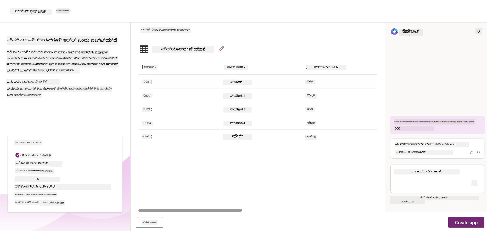
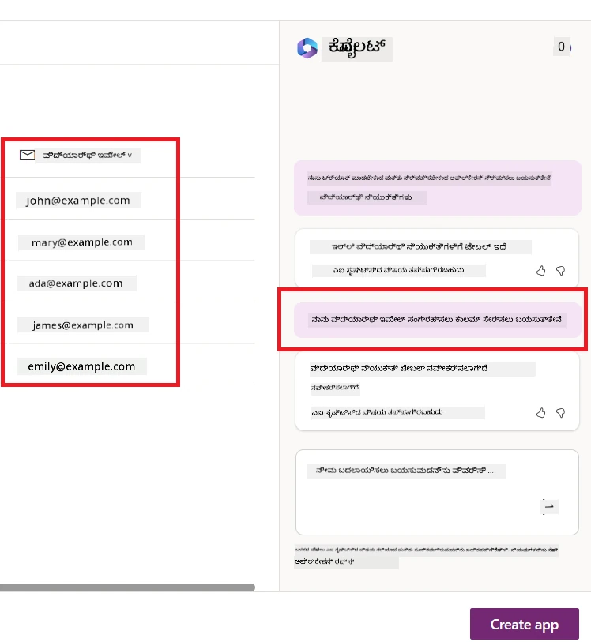
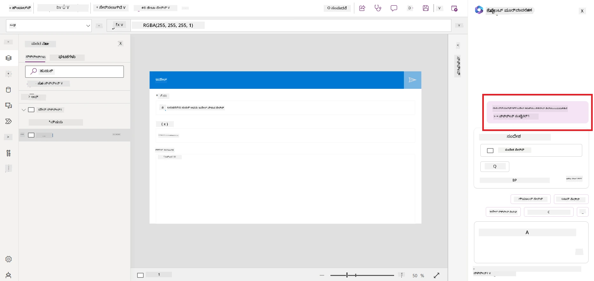
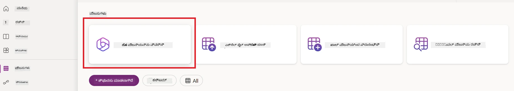
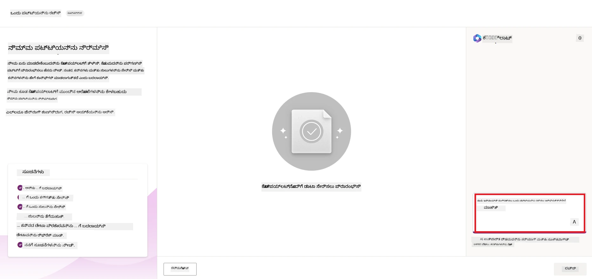
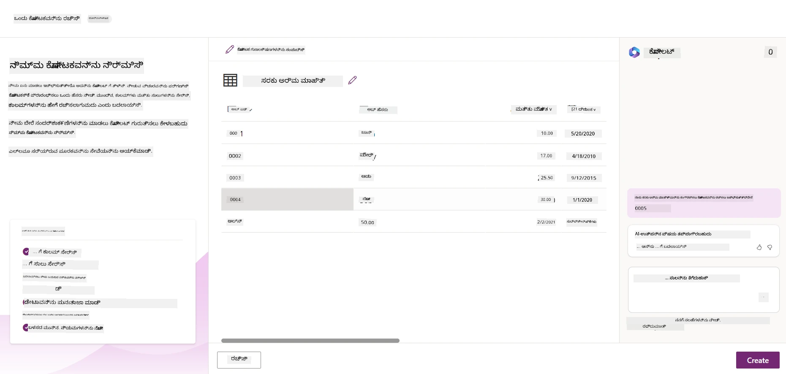
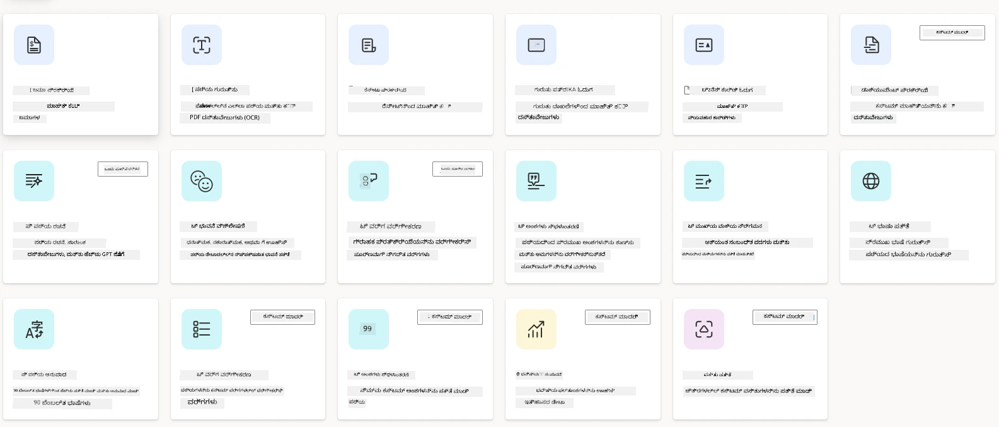
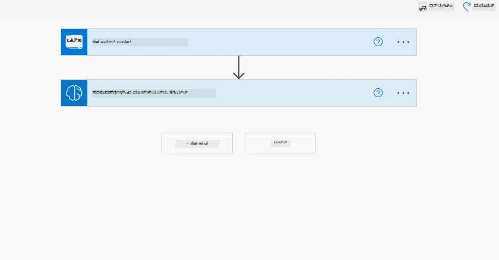
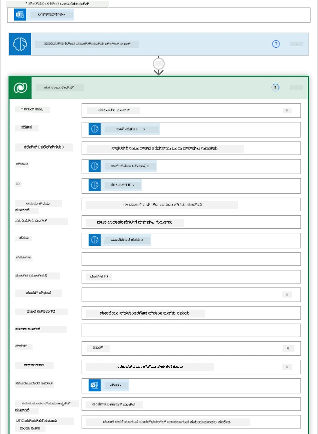
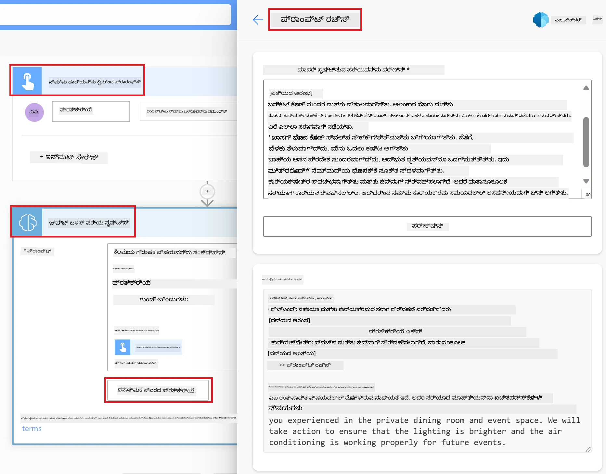

# ಕಡಿಮೆ ಕೋಡ್ AI ಅಪ್ಲಿಕೇಶನ್‌ಗಳನ್ನು ನಿರ್ಮಿಸುವುದು

> _(ಈ ಪಾಠದ ವಿಡಿಯೋವನ್ನು ನೋಡಲು ಮೇಲಿನ ಚಿತ್ರವನ್ನು ಕ್ಲಿಕ್ ಮಾಡಿ)_

## ಪರಿಚಯ

ಈಗ ನಾವು ಚಿತ್ರ ರಚಿಸುವ ಅಪ್ಲಿಕೇಶನ್‌ಗಳನ್ನು ನಿರ್ಮಿಸುವುದನ್ನು ಕಲಿತಿದ್ದು, ಕಡಿಮೆ ಕೋಡ್ ಬಗ್ಗೆ ಮಾತನಾಡೋಣ. ಜನರೇಟಿವ್ AI ಅನ್ನು ಕಡಿಮೆ ಕೋಡ್ ಸೇರಿದಂತೆ ವಿವಿಧ ಕ್ಷೇತ್ರಗಳಲ್ಲಿ ಬಳಸಬಹುದು, ಆದರೆ ಕಡಿಮೆ ಕೋಡ್ ಎಂದರೆ ಏನು ಮತ್ತು ಅದಕ್ಕೆ AI ಯನ್ನು ಹೇಗೆ ಸೇರ್ಪಡೆ ಮಾಡಬಹುದು?

ಬಹುಮಾನ್ಯ ಡೆವಲಪರ್‌ಗಳು ಮತ್ತು ಬೀರಾಜ್ಞರಿಗಾಗಿ ಕಡಿಮೆ ಕೋಡ್ ಡೆವಲಪ್ಮೆಂಟ್ ಪ್ಲ್ಯಾಟ್‌ಫಾರ್ಮ್‌ಗಳ ಬಳಕೆ ಮೂಲಕ ಅಪ್ಲಿಕೇಶನ್‌ಗಳು ಮತ್ತು ಪರಿಹಾರಗಳನ್ನು ನಿರ್ಮಿಸುವುದು ಸುಲಭವಾಗಿದೆ. ಕಡಿಮೆ ಕೋಡ್ ಡೆವಲಪ್ಮೆಂಟ್ ಪ್ಲ್ಯಾಟ್‌ಫಾರ್ಮ್‌ಗಳು ಸ್ವಲ್ಪ ಅಥವಾ ಯಾವುದೇ ಕೋಡ್ ಇಲ್ಲದೇ ಅಪ್ಲಿಕೇಶನ್‌ಗಳ ಮತ್ತು ಪರಿಹಾರಗಳ ನಿರ್ಮಾಣಕ್ಕಾಗಿಯೇ ಅನುಕೂಲವಾಗಿ ಪ್ರತ್ಯಕ್ಷ ಡೆವೆಲಪ್ಮೆಂಟ್ ಪರಿಸರವನ್ನು ಒದಗಿಸುತ್ತವೆ, ಅಲ್ಲಿ ಘಟಕಗಳನ್ನು ಡ್ರೆಾಗ್ ಮತ್ತು ಡ್ರಾಪ್ ಮಾಡುವ ಮೂಲಕ ಅಪ್ಲಿಕೇಶನ್‌ಗಳು ಮತ್ತು ಪರಿಹಾರಗಳನ್ನು ನಿರ್ಮಿಸಬಹುದು. ಇದರಿಂದ ಅಪ್ಲಿಕೇಶನ್‌ಗಳು ಮತ್ತು ಪರಿಹಾರಗಳನ್ನು ವೇಗವಾಗಿ ಮತ್ತು ಕಡಿಮೆ ಸಂಪನ್ಮೂಲಗಳೊಂದಿಗೆ ನಿರ್ಮಿಸಲು ಸಾಧ್ಯವಾಗುತ್ತದೆ. ಈ ಪಾಠದಲ್ಲಿ, ನಾವು ಕಡಿಮೆ ಕೋಡ್ ಅನ್ನು ಹೇಗೆ ಬಳಸುವುದು ಮತ್ತು Power Platform ಬಳಸಿ AI ಮೂಲಕ ಕಡಿಮೆ ಕೋಡ್ ಡೆವಲಪ್‌ಮೆಂಟ್ ಅನ್ನು ಹೇಗೆ മെಚ್ಚುವ ಬಗ್ಗೆ ಆಳವಾಗಿ ತಿಳಿದುಕೊಳ್ಳುತ್ತಾರೆ.

Power Platform ಸಂಸ್ಥೆಗಳಿಗೆ ತಮ್ಮ ತಂಡಗಳನ್ನು ಸ್ವತಂತ್ರವಾಗಿ ತಾವು ನಿರ್ವಹಿಸಬಹುದಾದ ಪರಿಹಾರಗಳನ್ನು ಕಡಿಮೆ ಕೋಡ್ ಅಥವಾ ನೊ ಕೋಡ್ ಇಂಟುಯಿಟಿವ್ ಪರಿಸರದಲ್ಲಿ ನಿರ್ಮಿಸಲು ಅವಕಾಶ ನೀಡುತ್ತದೆ. ಈ ಪರಿಸರವು ಪರಿಹಾರಗಳ ನಿರ್ಮಾಣ ಪ್ರಕ್ರಿಯೆಯನ್ನು ಸರಳಗೊಳಿಸುತ್ತದೆ. Power Platform ಬಳಸಿ, ಪರಿಹಾರಗಳನ್ನು ತಿಂಗಳುಗಳಿಂದ ವರ್ಷಗಳಲ್ಲದೆ ದಿನಗಳು ಅಥವಾ ವಾರಗಳಲ್ಲಿ ನಿರ್ಮಿಸಬಹುದು. Power Platform ರಲ್ಲಿ ಐದು ಮುಖ್ಯ ಉತ್ಪನ್ನಗಳಿವೆ: Power Apps, Power Automate, Power BI, Power Pages ಮತ್ತು Copilot Studio.

ಈ ಪಾಠವು ಒಳಗೊಂಡಿದೆ:

- Power Platformನಲ್ಲಿ ಜನರೇಟಿವ್ AI ಗೆ ಪರಿಚಯ
- Copilot ಪರಿಚಯ ಮತ್ತು ಅದನ್ನು ಹೇಗೆ ಬಳಸುವುದು
- Power Platformನಲ್ಲಿ ಜನರೇಟಿವ್ AI ಬಳಸಿ ಅಪ್ಲಿಕೇಶನ್ ಮತ್ತು ಫ್ಲೋಗಳನ್ನು ನಿರ್ಮಿಸುವುದು
- AI Builder ಮೂಲಕ Power Platformನಲ್ಲಿ AI ಮಾದರಿಗಳನ್ನು ಅರ್ಥಮಾಡಿಕೊಳ್ಳುವುದು
- Microsoft Copilot Studio ಬಳಸಿ వివೇಕಿ ಏಜೆಂಟ್‌ಗಳನ್ನು ನಿರ್ಮಿಸುವುದು

## ಕಲಿಕಾ ಗುರಿಗಳು

ಈ ಪಾಠದ ಅಂತ್ಯಕ್ಕೆ, ನೀವು ಈ ಕೆಳಗಿನವುಗಳನ್ನು შეძლಲಿದ್ದೀರಿ:

- Power Platformನಲ್ಲಿ Copilot ಹೇಗೆ ಕೆಲಸಮಾಡುತ್ತದೆ ಎಂಬುದನ್ನು ಅರ್ಥಮಾಡಿಕೊಳ್ಳುವುದು.

- ನಮ್ಮ ಶಿಕ್ಷಣ стартअप್ಗೆ ಸ್ಟೂಡೆಂಟ್ ಅಸೈನ್ಮೆಂಟ್ ಟ್ರ್ಯಾಕರ್ ಅಪ್ಲಿಕೇಶನ್ ನಿರ್ಮಿಸುವುದು.

- ರಶೀದಿ ಪ್ರಕ್ರಿಯೆಗೆ AI ಬಳಸಿ ಮಾಹಿತಿಯನ್ನು ಎಕ್ಸ್ಟ್ರ್ಯಾಕ್ಟ್ ಮಾಡುವ ಇನ್ವಾಯ್ಸ್ ಪ್ರೊಸೆಸಿಂಗ್ ಫ್ಲೋ ನಿರ್ಮಿಸುವುದು.

- Create Text with GPT AI Model ಬಳಸುವಾಗ ಉತ್ತಮ ಅಭ್ಯಾಸಗಳನ್ನು ಅನ್ವಯಿಸುವುದು.

- Microsoft Copilot Studio ಎಂದರೇನು ಮತ್ತು ಅದನ್ನು ಬಳಸಿ ವಿವೇಕಿ ಏಜೆಂಟ್‌ಗಳನ್ನು ಹೇಗೆ ನಿರ್ಮಿಸುವುದು ಎಂಬುದನ್ನು ಅರ್ಥಮಾಡಿಕೊಳ್ಳುವುದು.

ಈ ಪಾಠದಲ್ಲಿ ನೀವು ಬಳಸಲಿರುವ ಉಪಕರಣಗಳು ಮತ್ತು ತಂತ್ರಜ್ಞಾನಗಳು:

- **Power Apps**, ಸ್ಟೂಡೆಂಟ್ ಅಸೈನ್ಮೆಂಟ್ ಟ್ರ್ಯಾಕರ್ ಅಪ್ಲಿಕೇಶನ್ ಗಾಗಿ, ಇದು ಕಡಿಮೆ ಕೋಡ್ ಡೆವಲಪ್ಮೆಂಟ್ ಪರಿಸರವನ್ನು ಒದಗಿಸುತ್ತದೆ, ಅಪ್‌ಗಳನ್ನು ನಿರ್ಮಿಸಿ ಡೇಟಾ ಟ್ರ್ಯಾಕ್, ನಿರ್ವಹಣೆ ಮತ್ತು ಸಂವಹನ ಮಾಡಲು ಸಹಾಯ ಮಾಡುತ್ತದೆ.

- **Dataverse**, ಸ್ಟೂಡೆಂಟ್ ಅಸೈನ್ಮೆಂಟ್ ಟ್ರ್ಯಾಕರ್ ಅಪ್ಲಿಕೇಶನ್ಗಾಗಿ ಡೇಟಾ ಸಂಗ್ರಹಿಸಲು, ಇದು ಕಡಿಮೆ ಕೋಡ್ ಡೇಟಾ ಪ್ಲ್ಯಾಟ್‌ಫಾರ್ಮ್ ಅನ್ನು ಒದಗಿಸುತ್ತದೆ.

- **Power Automate**, ಇನ್ವಾಯ್ಸ್ ಪ್ರೊಸೆಸಿಂಗ್ ಫ್ಲೋ ಗಾಗಿ, ಇದು ಕಡಿಮೆ ಕೋಡ್ ಡೆವಲಪ್ಮೆಂಟ್ ಪರಿಸರದೊಂದಿಗೆ ವರ್ಕ್‌ಫ್ಲೋಗಳನ್ನು ನಿರ್ಮಿಸಲು ಸಹಾಯ ಮಾಡುತ್ತದೆ.

- **AI Builder**, ನಮ್ಮ ಸ್ಟಾರ್ಟಪ್ ಗಾಗಿ ಇನ್ವಾಯ್ಸ್ ಪ್ರೊಸೆಸಿಂಗ್ ಗೆ ಪೂರ್ವನಿರ್ಮಿತ AI ಮಾದರಿಗಳನ್ನು ಬಳಸುವದು.

## Power Platformನಲ್ಲಿ ಜನರೇಟಿವ್ AI

ಜನರೇಟಿವ್ AI ಮೂಲಕ ಕಡಿಮೆ ಕೋಡ್ ಅಭಿವೃದ್ಧಿ ಮತ್ತು ಅಪ್ಲಿಕೇಶನ್‌ಗಳನ್ನು ಮೆಚ್ಚಿಸುವುದು Power Platformನ ಪ್ರಮುಖ ಗುರಿಯಾಗಿದೆ. ಗುರಿ: ಯಾರೊಬ್ಬರೂ ಸಹ AI-ಚಾಲಿತ ಅಪ್‌ಗಳು, ವೆಬ್‌ไซต์್‌, ಡ್ಯಾಶ್ಬೋರ್ಡ್‌ಗಳು ರಚಿಸಲು ಮತ್ತು AI ಮೂಲಕ ಪ್ರಕ್ರಿಯೆಗಳ ಸ್ವಯಂಚಾಲಿತ ಮಾಡಲು _ಡೇಟಾ ವಿಜ್ಞಾನ ಪರಿಣತಿಯನ್ನು ಹೊಂದದೆ_ ಸಾಧ್ಯವಾಗಬೇಕು. ಈ ಗುರಿ Power Platformನಲ್ಲಿ ಜನರೇಟಿವ್ AI ಅನ್ನು Copilot ಮತ್ತು AI Builder ರೂಪದಲ್ಲಿ ಆಕರ್ಷಕ ಕಡಿಮೆ ಕೋಡ್ ಅನುಭವದಲ್ಲಿ ಸಂಯೋಜಿಸುವ ಮೂಲಕ ಸಾಧಿಸಲಾಗುತ್ತದೆ.

### ಇದು ಹೇಗೆ ಕೆಲಸಮಾಡುತ್ತದೆ?

Copilot ಒಂದು AI ಸಹಾಯಕ, ಇದು Power Platform ಪರಿಹಾರಗಳನ್ನು ನಿರ್ಮಿಸಲು ನಿಮ್ಮ ಅಗತ್ಯಗಳನ್ನು ಸಹಜ ಭಾಷೆಯಲ್ಲಿ ಮಾತುಕತೆಯ ಮೂಲಕ ವಿವರಿಸುವ ಮೂಲಕ ಸಹಾಯ ಮಾಡುತ್ತದೆ. ಉದಾಹರಣೆಗೆ, ನೀವು ನಿಮ್ಮ AI ಸಹಾಯಕನಿಗೆ ನಿಮ್ಮ ಅಪ್ಲಿಕೇಶನ್ ಯಾವ ಫೀಲ್ಡ್‌ಗಳನ್ನು ಬಳಸುತ್ತದೆ ಎಂದು ಹೇಳಬಹುದು ಮತ್ತು ಅದು ಅಪ್ಲಿಕೇಶನ್ ಮತ್ತು ಡೇಟಾ ಮಾದರಿಯನ್ನು ರಚಿಸುತ್ತದೆ ಅಥವಾ Power Automateನಲ್ಲಿ ಫ್ಲೋ ಹೇಗೆ ಹೊಂದಿಸಲು ನಮೂದು ಮಾಡಬಹುದು.

ನೀವು ನಿಮ್ಮ ಅಪ್ಲಿಕೇಶನ್ ಸ್ಕ್ರೀನ್‌ಗಳಲ್ಲಿ Copilot ಚಾಲಿತ ವೈಶಿಷ್ಟ್ಯಗಳನ್ನು ಉಪಯೋಗಿಸಿ, ಬಳಕೆದಾರರಿಗೆ ಮಾತುಕತೆಯ ಮೂಲಕ ಜೊತೆಗೊಳ್ಳುವಿಕೆಯಿಂದ ಅಗತ್ಯವಿರುವ ಮಾಹಿತಿಯನ್ನು ಕಂಡುಹಿಡಿಯಲು ಸಹಾಯ ಮಾಡಬಹುದು.

AI Builder Power Platformನಲ್ಲಿ ಲಭ್ಯವಿರುವ ಕಡಿಮೆ ಕೋಡ್ AI ಸಾಮರ್ಥ್ಯ, ಇದು AI ಮಾದರಿಗಳನ್ನು ಬಳಸಿಕೊಂಡು ಪ್ರಕ್ರಿಯೆಗಳನ್ನು ಸ್ವಯಂಚಾಲಿತಗೊಳಿಸಲು ಮತ್ತು ಫಲಿತಾಂಶಗಳನ್ನು ಊಹಿಸಲು ಸಹಾಯ ಮಾಡುತ್ತದೆ. AI Builder ಮೂಲಕ ನೀವು Dataverse ಅಥವಾ SharePoint, OneDrive, Azure ಮುಂತಾದ ವಿವಿಧ ಕ್ಲೌಡ್ ಡೇಟಾ ಮೂಲಗಳೊಂದಿಗೆ ಸಂಪರ್ಕ ಹೊಂದಿದ ಅಪ್‌ಗಳು ಮತ್ತು ಫ್ಲೋಗಳಿಗೆ AI ಸೇರಿಸಬಹುದು.

Power Apps, Power Automate, Power BI, Power Pages ಮತ್ತು Copilot Studio ರಲ್ಲಿ Copilot ಲಭ್ಯವಿದೆ (ಹಿಂದೆ Power Virtual Agents). AI Builder Power Apps ಮತ್ತು Power Automate ನಲ್ಲಿ ಲಭ್ಯವಿದೆ. ಈ ಪಾಠದಲ್ಲಿ ನಾವು Copilot ಮತ್ತು AI Builder ಅನ್ನು Power Apps ಮತ್ತು Power Automate ನಲ್ಲಿ ಬಳಸಿ ನಮ್ಮ ಶಿಕ್ಷಣ ಸ್ಟಾರ್ಟಪ್ ಗಾಗಿ ಪರಿಹಾರ ನಿರ್ಮಿಸುವ ತರಗೆತಿಗೆ ಗಮನಹರಿಸುವೆವು.

### Power Apps ನಲ್ಲಿ Copilot

Power Platformನ ಭಾಗವಾಗಿ, Power Apps ಅಪ್ಲিকೇಶನ್‌ಗಳನ್ನು ನಿರ್ಮಿಸಲು ಕಡಿಮೆ ಕೋಡ್ ಡೆವೆಲಪ್ಮೆಂಟ್ ಪರಿಸರವನ್ನು ಒದಗಿಸುತ್ತದೆ. ಇದು ಒಂದು ಸ್ಕೇಲಬಲ್ ಡೇಟಾ ಪ್ಲ್ಯಾಟ್‌ಫಾರ್ಮ್ ಮತ್ತು ಕ್ಲೌಡ್ ಸೇವೆಗಳಿಗೆ ಮತ್ತು ಆನ್‌ ಪ್ರೇಮೈಸಸ್ ಡೇಟಾಗೆ ಸಂಪರ್ಕ ಹೊಂದುವ ಸಾಮರ್ಥ್ಯವನ್ನು ಹೊಂದಿರುವ ಅಪ್ಲಿಕೇಶನ್ ಅಭಿವೃದ್ಧಿ ಸೇವೆಗಳ ಸಂಕಲನ. Power Apps ಡೆಸ್ಕ್‌ಟಾಪ್, ಟ್ಯಾಬ್ಲೆಟ್‌ ಮತ್ತು ಫೋನ್ ಗಳಲ್ಲಿ ಚಾಲನೆಗೊಳ್ಳುವ ಅಪ್ಲಿಕೇಶನ್ಗಳನ್ನು ನಿರ್ಮಿಸಿ ಸಹೋದ್ಯೋಗಿಗಳೊಂದಿಗೆ ಹಂಚಿಕೊಳ್ಳಬಹುದು. Power Apps ಬಳಕೆದಾರರನ್ನು ಸರಳ ಇಂಟರ್ಫೇಸ್ನ ಮೂಲಕ ಅಪ್ಲಿಕೇಶನ್ ವಿಕಾಸಕ್ಕೆ ಒಳಗಾಗಿಸುತ್ತದೆ, ಆದ್ದರಿಂದ ಪ್ರತಿಯೊಂದು ವ್ಯವಹಾರ ಬಳಕೆದಾರ ಅಥವಾ ಕುಶಲ ಡೆವಲಪರ್ ಆಯಾ ಬೇಕಾದ ಅಪ್ಲಿಕೇಶನ್ ಗಳನ್ನು ನಿರ್ಮಿಸಬಹುದು. ಅಪ್ಲಿಕೇಶನ್ ಅಭಿವೃದ್ಧಿ ಅನುಭವವನ್ನು ಜನರೇಟಿವ್ AI ಮೂಲಕ Copilot ಸಹಕಾರದಿಂದ ಇನ್ನಷ್ಟು ಸುಧಾರಿಸಲಾಗಿದೆ.

Power Apps ಯಲ್ಲಿ Copilot AI ಸಹಾಯಕ ವೈಶಿಷ್ಟ್ಯ ನಿಮಗೆ ಯಾವ ರೀತಿಯ ಅಪ್ಲಿಕೇಶನ್ ಬೇಕು ಮತ್ತು ನಿಮ್ಮ ಅಪ್ಲಿಕೇಶನ್ಗೆ ಯಾವ ಮಾಹಿತಿಗಳನ್ನು ಟ್ರ್ಯಾಕ್, ಸಂಗ್ರಹಣೆ ಅಥವಾ ತೋರಿಸಬೇಕೆಂದು ವಿವರಿಸಲು ಅವಕಾಶ ನೀಡುತ್ತದೆ. Copilot ನಿಮ್ಮ ವಿವರಣೆಯ ಆಧಾರದಲ್ಲಿ ಸ್ಪಂದನಶೀಲ ಕ್ಯಾನ್ವಾಸ್ ಅಪ್ಲಿಕೇಶನ್ ರಚಿಸುತ್ತದೆ. ನಂತರ ನೀವು ಅಗತ್ಯಗಳಿಗೆ ಅನುಗುಣವಾಗಿ ಅಪ್ ಅನ್ನು ಕಸ್ಟಮೈಸ್ ಮಾಡಬಹುದು. AI Copilot ಡೇಟಾವರ್ಸ್ ಟೇಬಲ್ ಸೃಷ್ಟಿಸಿ ಬಯಸಿದ ಡೇಟಾ ಭಂಡಾರಕ್ಕೆ ಬೇಕಾದ ಫೀಲ್ಡ್‌ಗಳೊಂದಿಗೆ ಹಾಗೂ ಮಾದರಿ ಡೇಟಾ ಸಹ ಒದಗಿಸುತ್ತದೆ. ನಾವು Dataverse ಏನೆಂದು ಮತ್ತು ಅದನ್ನು Power Appsನಲ್ಲಿ ಹೇಗೆ ಉಪಯೋಗಿಸುವುದೆಂಬುದನ್ನು ಈ ಪಾಠದಲ್ಲಿ ನೋಡುವೆವು. ನೀವು ನಂತರ AI Copilot ಸಹಾಯಕ ವೈಶಿಷ್ಟ್ಯದಿಂದ ಮಾತುಕತೆಯ ಹಂತಗಳಲ್ಲಿ ಟೇಬಲ್ ಅನ್ನು ಕಸ್ಟಮೈಸ್ ಮಾಡಬಹುದು. ಈ ವೈಶಿಷ್ಟ್ಯ Power Apps ಮನೆಪೇಜ್‌ನಿಂದ ಸುಲಭವಾಗಿ ಲಭ್ಯವಿದೆ.

### Power Automate ನಲ್ಲಿ Copilot

Power Platformನ ಭಾಗವಾಗಿ, Power Automate ಬಳಕೆದಾರರಿಗೆ ಅಪ್ಲಿಕೇಶನ್ಗಳು ಮತ್ತು ಸೇವೆಗಳ ನಡುವೆ ಸ್ವಯಂಚಾಲಿತ ವರ್ಕ್‌ಫ್ಲೋಗಳನ್ನು ರಚಿಸಲು ಅವಕಾಶ ಮಾಡಿಕೊಡುತ್ತದೆ. ಇದು ಸಂವಹನ, ಡೇಟಾ ಸಂಗ್ರಹಣೆ ಮತ್ತು ನಿರ್ಣಯ ಅನುಮೋದನೆಗಳಂತಹ ಪುನರಾವರ್ತಿತ ವ್ಯವಹಾರಿಕ ಪ್ರಕ್ರಿಯೆಗಳನ್ನ ಸ್ವಯಂಚಾಲಿತಗೊಳಿಸಲು ಸಹಾಯ ಮಾಡುತ್ತದೆ. ಇದರ ಸರಳ ಇಂಟರ್‌ಫೇಸ್ ಪ್ರಾರಂಭಿಕರಿಂದ ನಿಪುಣ ಡೆವಲಪರ್‌ಗಳವರೆಗೆ ಎಲ್ಲಾ ತಾಂತ್ರಿಕ ಸಾಮರ್ಥ್ಯ ವರ್ಗದ ಬಳಕೆದಾರರಿಗೂ ಕೆಲಸ ಸ್ವಯಂಚಾಲಿತಗೊಳಿಸುವುದಕ್ಕೆ ಅನುಕೂಲಕರವಾಗಿದೆ. ಜನರೇಟಿವ್ AI ಮೂಲಕ Copilot ಸಹಕಾರದಿಂದ ವರ್ಕ್‌ಫ್ಲೋ ಅಭಿವೃದ್ಧಿ ಅನುಭವವೂ ಉತ್ತಮಗೊಳಿಸಲಾಗಿದೆ.

Power Automateನಲ್ಲಿ Copilot AI ಸಹಾಯಕ ವೈಶಿಷ್ಟ್ಯ ನಿಮಗೆ ಬೇಕಾದ ಫ್ಲೋ ಮತ್ತು ಅದರ ಕಾರ್ಯಗಳನ್ನು ವಿವರಿಸಲು ಅವಕಾಶ ನೀಡುತ್ತದೆ. ನಿಮ್ಮ ವಿವರಣೆಯ ಆಧಾರದಲ್ಲಿ Copilot ಫ್ಲೋ ರಚಿಸುತ್ತದೆ. ನಂತರ ನೀವು ಅಗತ್ಯಗಳಿಗೆ ವೇದಿಕೆಯಂತೆ ಫ್ಲೋ ಅನ್ನು ಕಸ್ಟಮೈಸ್ ಮಾಡಬಹುದು. AI Copilot ಫ್ಲೋನಲ್ಲಿ ನೀವು automation ಗಾಗಿ ಬೇಕಾದ ಕಾರ್ಯಗಳನ್ನು ಸೂಚಿಸುತ್ತದೆ ಮತ್ತು ರಚಿಸುತ್ತದೆ. ನಾವು ಈ ಪಾಠದಲ್ಲಿ Power Automateನಲ್ಲಿ ಫ್ಲೋಗಳು ಏನೆಂದು ಮತ್ತು ಅವುಗಳನ್ನು ಹೇಗೆ ಬಳಸುವುದು ಎಂಬುದನ್ನು ತಿಳಿದುಕೊಳ್ಳುತ್ತೇವೆ. AI Copilot ಸಹಾಯಕ ವೈಶಿಷ್ಟ್ಯದಿಂದ ಮಾತುಕತೆಯ ಹಂತಗಳಲ್ಲಿ ನೀವು ಆಯ್ಕೆಮಾಡಿದ ಕಾರ್ಯಗಳನ್ನು ಕಸ್ಟಮೈಸ್ ಮಾಡಬಹುದು. ಈ ವೈಶಿಷ್ಟ್ಯವು Power Automate ಮನೆಪೇಜ್‌ನಿಂದ ಸುಲಭವಾಗಿ ಲಭ್ಯವಿದೆ.

## Microsoft Copilot Studio ಬಳಸಿ ವಿವೇಕಿ ಏಜೆಂಟ್‌ಗಳನ್ನು ನಿರ್ಮಿಸುವುದು

[Microsoft Copilot Studio](https://learn.microsoft.com/microsoft-copilot-studio/fundamentals-what-is-copilot-studio?WT.mc_id=academic-105485-koreyst) (ಹಿಂದೆ Power Virtual Agents) Power Platformನ ಕಡಿಮೆ ಕೋಡ್ ಸದಸ್ಯ, ಇದು **AI ಏಜೆಂಟ್‌ಗಳನ್ನು** ನಿರ್ಮಿಸಲು ಬಳಸಲಾಗುತ್ತದೆ — ಸಂವಹನಾತ್ಮಕ ಕೋಪಿಲಾಟ್‌ಗಳು, ವೀಕ್ಷಕರ ಪ್ರಶ್ನೆಗಳಿಗೆ ಉತ್ತರಿಸುವ, ಕ್ರಿಯೆಗಳನ್ನನುಷ್ಠಿಸುವ ಮತ್ತು ನಿಮ್ಮ ಬಳಕೆದಾರರ ಪರವಾಗಿ ಕಾರ್ಯಗಳನ್ನು ಸ್ವಯಂಚಾಲಿತಗೊಳಿಸುವ. Power Platform ಉಳಿವುಗಳಂತೆ, ನೀವು ಈ ಏಜೆಂಟ್‌ಗಳನ್ನು ದೃಶ್ಯಾತ್ಮಕ, ನೈಸರ್ಗಿಕ ಭಾಷಾ, ಪ್ರಥಮ ಅನುಭವದಲ್ಲಿ ನಿರ್ಮಿಸುತ್ತೀರಿ: ನೀವು ಏಜೆಂಟ್‌ ಏನು ಮಾಡಬೇಕೆಂದು ವಿವರಿಸುತ್ತೀರಿ, ಮತ್ತು Copilot Studio ಅದರ ನಿರ್ದೇಶನಗಳು, ಜ್ಞಾನ ಮತ್ತು ಕಾರ್ಯಗಳನ್ನು ಸಹಾಯದಿಂದ ರೂಪಿಸುತೆ.

ನಮ್ಮ ಶಿಕ್ಷಣ ಸ್ಟಾರ್ಟಪ್ ಗಾಗಿ, ವಿದ್ಯಾರ್ಥಿಗಳ ಪ್ರಶ್ನೆಗಳಿಗೆ ಉತ್ತರಿಸುವ, ಅಸೈನ್ಮೆಂಟ್ ಡೆಡ್‌ಲೈನ್‌ಗಳನ್ನು ಪರಿಶೀಲಿಸುವ ಮತ್ತು ಉಪಾಧ್ಯಾಯರಿಗೆ ಇಮೇಲ್ ಮಾಡಬಹುದಾದ, ಕೋಡ್ ಬರೆಯದೆ ಕೆಲಸ ಮಾಡುವ ಏಜೆಂಟ್‌ಗಳನ್ನು ನೀವು ನಿರ್ಮಿಸಬಹುದು.

ಇಲ್ಲಿ Copilot Studio ನ ಶಕ್ತಿಶಾಲಿ ಮಾಡುವ ಕೆಲವು ಇತ್ತೀಚಿನ ಸಾಮರ್ಥ್ಯಗಳು:

- **ನಿಮ್ಮ ಜ್ಞಾನದಿಂದ ಜನರೇಟಿವ್ ಉತ್ತರಗಳು**. ಪ್ರತಿಯೊಂದು ಮಾತುಕತೆ ಕೈಯಿಂದ ಬರೆಯುವ ಬದಲು, ನೀವು **ಜ್ಞಾನ ಮೂಲಗಳನ್ನು** — ಸಾರ್ವಜನಿಕ ವೆಬ್‌ಸೈಟ್‌ಗಳು, SharePoint, OneDrive, Dataverse, ಅಪ್ಲೋಡ್ ಮಾಡಿದ ಕಡತಗಳು ಅಥವಾ ಎಂಟರ್‌ಪ್ರೈಸ್ ಡೇಟಾ ಸಂಪರ್ಕಕರು — ಸಂಪರ್ಕಿಸಿ, ಏಜೆಂಟ್ ಅವುಗಳಿಂದ ನೆಲೆಯುತ ಉತ್ತರಗಳನ್ನು ರಚಿಸುತ್ತದೆ.

- **ಜನರೇಟಿವ್ ಸಮನ್ವಯಕಗಳು**. ಕಟ್ಟುನಿಟ್ಟಾದ ಟ್ರಿಗರ್ ವಾಕ್ಯಗಳ ಮೇಲೆ ಅವಲಂಬಿತವಾಗದೇ, ಏಜೆಂಟ್ ಒಂದು ವಿನಂತಿಯನ್ನು ಅರ್ಥಮಾಡಿಕೊಂಡು ಅದರ ಅನ್ವಯವಾದ ಜ್ಞಾನ, ವಿಷಯಗಳು ಮತ್ತು ಕಾರ್ಯಗಳನ್ನು ಸಂಪರ್ಕಿಸಿ ಅನೇಕ ಹಂತಗಳನ್ನು ಸಂಯೋಜಿಸುವ ಮೂಲಕ ಅದನ್ನು ನೆರವೇರಿಸುತ್ತದೆ.

- **ಕ್ರಿಯೆಗಳು ಮತ್ತು ಸಂಪರ್ಕಕರು**. ಏಜೆಂಟ್‌ಗಳು ಕೇವಲ ಚಾಟ್ ಮಾತ್ರವಲ್ಲ; ನೀವು 1,500+ ಪೂರ್ವನಿರ್ಮಿತ Power Platform ಸಂಪರ್ಕಕರು, Power Automate ಫ್ಲೋಗಳು, ಕಸ್ಟಮ್ REST APIಗಳು, ಪ್ರಾಂಪ್ಟ್‌ಗಳು ಅಥವಾ **ಮೋದಲ್ ಕಾನ್ಟೆಕ್ಸ್ಟ್ ಪ್ರೋಟೋಕಾಲ್ (MCP)** ಸರ್ವರ್‌ಗಳ ಮೂಲಕ ಕ್ರಿಯೆಗಳನ್ನು ನೀಡಬಹುದು.

- **ಸ್ವಯಂಪ್ರೇರಿತ ಏಜೆಂಟ್‌ಗಳು**. ಏಜೆಂಟ್‌ಗಳು ಕೇವಲ ಚಾಟ್ ವಿಂಡೋದಲ್ಲಿ ಪ್ರತಿಕ್ರಿಯಿಸುವುದಿಲ್ಲ. ನೀವು ಇಮೇಲ್, Dataverse ರೆಕಾರ್ಡ್ ಸೃಷ್ಟಿ ಅಥವಾ ಕಡತ ಅಪ್ಲೋಡ್ ಆದಂತಹ ಘಟನೆಗಳಿಂದ ಪ್ರೇರಿತ ಸ್ವಯಂಪ್ರೇರಿತ ಏಜೆಂಟ್‌ಗಳನ್ನು ನಿರ್ಮಿಸಿ ಹಿನ್ನೆಲೆಯಲ್ಲಿ ಕಾರ್ಯನಿರ್ವಹಿಸಬಹುದು.

- **ಬಹು ಏಜೆಂಟ್ ಸಮನ್ವಯಕ**. ಏಜೆಂಟ್‌ಗಳು ಇತರೆ ಏಜೆಂಟ್‌ಗಳನ್ನು ಕರೆ ಮಾಡಬಹುದು. Copilot Studio ಏಜೆಂಟ್ ಇತರ ಏಜೆಂಟ್‌ಗಳಿಗೆ ಹಸ್ತಚಾಲನೆ ನೀಡಬಹುದು ಅಥವಾ ವಿಸ್ತಾರಗೊಳ್ಳಬಹುದು, ಇದರಲ್ಲಿ Microsoft 365 Copilot ಗೆ ಪ್ರಕಟಿಸಲಾದ ಏಜೆಂಟ್‌ಗಳು ಮತ್ತು Microsoft Foundry ನಲ್ಲಿ ನಿರ್ಮಿಸಲಾದ ಏಜೆಂಟ್‌ಗಳೂ ಸೇರಿವೆ.

- **ಮೋದಲ್ ಆಯ್ಕೆ**. ಒಳನಿರ್ಮಿತ ಮಾದರಿಗಳ ಹೊರತಾಗಿ, ನಿಮ್ಮ ಏಜೆಂಟ್ ಚಿಂತನೆ ಮತ್ತು ಪ್ರತಿಕ್ರಿಯೆಯನ್ನು ತಾಳಮೇಳಗೊಳಿಸಲು Microsoft Foundry ಮಾದರಿಗಳ ಕ್ಯಾಟಲಾಗ್‌ನಿಂದ ಮಾದರಿಗಳನ್ನು ತಂದುಕೊಳ್ಳಬಹುದು.

- **ಯಾವಕ್ಕೂ ಪ್ರಕಟಣೆ**. ನಿರ್ಮಿಸಿರುವ ನಂತರ, ಏಜೆಂಟ್‌ಗಳನ್ನು ಅನೇಕ ಚಾನೆಲ್ಗಳಿಗೆ — Microsoft Teams, Microsoft 365 Copilot, ವೆಬ್‌ಸೈಟ್ ಅಥವಾ ಕಸ್ಟಮ್ ಅಪ್ಲಿಕೇಶನ್ ಹಾಗೂ ಇತರ — ಭದ್ರತೆ, ಪರಿಶೀಲನೆ ಮತ್ತು ವಿಶ್ಲೇಷಣೆಯನ್ನು Power Platform ಆಡ್ಮಿನ್ ಅನುಭವದ ಮೂಲಕ ನಿರ್ವಹಿಸಿ ಪ್ರಕಟಿಸಬಹುದು.

ನಿಮ್ಮ ಮೊದಲ ಏಜೆಂಟ್ ನಿರ್ಮಾಣವನ್ನು [copilotstudio.microsoft.com](https://copilotstudio.microsoft.com?WT.mc_id=academic-105485-koreyst) ನಲ್ಲಿ ಪ್ರಾರಂಭಿಸಿ ಮತ್ತು ಹೆಚ್ಚಿನ ಮಾಹಿತಿಗಾಗಿ [Microsoft Copilot Studio ಡಾಕ್ಯುಮೆಂಟೇಶನ್](https://learn.microsoft.com/microsoft-copilot-studio/?WT.mc_id=academic-105485-koreyst) ನೋಡಿ.

## ಹುದ್ದೆ: ನಮ್ಮ ಸ್ಟಾರ್ಟಪ್ ಗಾಗಿ ವಿದ್ಯಾರ್ಥಿ ಅಸೈನ್ಮೆಂಟ್ ಮತ್ತು ಇನ್ವಾಯ್ಸ್‌ಗಳನ್ನು ನಿರ್ವಹಿಸಿ, Copilot ಬಳಸಿ

ನಮ್ಮ ಸ್ಟಾರ್ಟಪ್ ವಿದ್ಯಾರ್ಥಿಗಳಿಗೆ ಆನ್ಲೈನ್ ಕೋರ್ಸ್‌ಗಳನ್ನು ಒದಗಿಸುತ್ತದೆ. ಸ್ಟಾರ್ಟಪ್ ವೇಗವಾಗಿ ವೃದ್ಧಿಯಾಗಿ ಈಗ ತನ್ನ ಕೋರ್ಸ್‌ಗಳ ಬೇಡಿಕೆಯನ್ನು ನಿರ್ವಹಿಸಲು ಕಷ್ಟಪಡುವುದು. ಅವರು Power Platform ಡೆವಲಪರ್ ಆಗಿ ನಿಮ್ಮನ್ನು ನೇಮಿಸಿದ್ದಾರೆ ಮೊದಲನೆಯದಾಗಿ ಕಡಿಮೆ ಕೋಡ್ ಪರಿಹಾರ ನಿರ್ಮಿಸಲು, ಇದರಿಂದ ಅವರ ವಿದ್ಯಾರ್ಥಿ ಅಸೈನ್ಮೆಂಟ್ ಮತ್ತು ಇನ್ವಾಯ್ಸ್‌ಗಳನ್ನು ನಿರ್ವಹಿಸಲು ಸಹಾಯವಾಗುತ್ತದೆ. ಈ ಪರಿಹಾರವು ವಿದ್ಯಾರ್ಥಿ ಅಸೈನ್‌ಮೆಂಟ್‌ಗಳನ್ನು ಅಪ್ ಮೂಲಕ ಟ್ರ್ಯಾಕ್ ಮತ್ತು ನಿರ್ವಹಿಸಲು ಹಾಗೂ ಇನ್ವಾಯ್ಸ್ ಪ್ರೊಸೆಸಿಂಗ್ ಪ್ರಕ್ರಿಯೆಯನ್ನು ವರ್ಕ್‌ಫ್ಲೋ ಮೂಲಕ ಸ್ವಯಂಚಾಲಿತಗೊಳಿಸಲು ಸಾಧ್ಯವಾಗಬೇಕು. ನೀವು ಜನರೇಟಿವ್ AI ಯನ್ನು ಬಳಸಿ ಈ ಪರಿಹಾರವನ್ನು ಅಭಿವೃದ್ಧಿಪಡಿಸಲು ಕೇಳಲಾಗಿದೆ.

Copilot ಬಳಕೆ ಆರಂಭಿಸುವಾಗ, ನೀವು [Power Platform Copilot Prompt Library](https://github.com/pnp/powerplatform-prompts?WT.mc_id=academic-109639-somelezediko) ನ್ನು ಪ್ರಾಂಪ್ಟ್‌ಗಳನ್ನು ಪಡೆಯಲು ಬಳಸಬಹುದು. ಈ ಲೈಬ್ರರಿ Copilot ನೊಂದಿಗೆ ಅಪ್ಲಿಕೇಶನ್ ಮತ್ತು ಫ್ಲೋಗಳನ್ನು ನಿರ್ಮಿಸುವ ಅನುಕೂಲಕರ ಪ್ರಾಂಪ್ಟ್‌ಗಳನ್ನು ಒದಗಿಸುತ್ತದೆ. ನೀವು ಪ್ರಾಂಪ್ಟ್ ಉಪಯೋಗಿಸುವ ಮೂಲಕ ನಿಮ್ಮ ಅಗತ್ಯಗಳನ್ನು Copilot ಗೆ ವಿವರಣೆ ಮಾಡುವುದು ಹೇಗೆ ಎಂಬುದಕ್ಕೂ ಗಮನ ಹರಿಸಬಹುದು.

### ನಮ್ಮ ಸ್ಟಾರ್ಟಪ್ ಗಾಗಿ ಸ್ಟೂಡೆಂಟ್ ಅಸೈನ್ಮೆಂಟ್ ಟ್ರ್ಯಾಕರ್ ಅಪ್ಲಿಕೇಶನ್ ನಿರ್ಮಿಸಿ

ನಮ್ಮ ಸ್ಟಾರ್ಟಪ್‌ನ ಶಿಕ್ಷಕರು ವಿದ್ಯಾರ್ಥಿಗಳ ಅಸೈನ್ಮೆಂಟ್‌ಗಳನ್ನು ಟ್ರ್ಯಾಕ್ ಮಾಡಲು ಕಷ್ಟಪಡುವರು. ಅವರು ಅಸೈನ್ಮೆಂಟ್‌ಗಳನ್ನು ಟ್ರ್ಯಾಕ್ ಮಾಡಲು ಸ್ಪ್ರೆಡ್ಶೀಟ್ ಬಳಸುತ್ತಿದ್ದಾರೆ, ಆದರೆ ವಿದ್ಯಾರ್ಥಿಗಳ ಸಂಖ್ಯೆ ಹೆಚ್ಚಾಗುತ್ತಿದ್ದುದು ನಿರ್ವಹಣೆ ಕಷ್ಟವಾಗುತ್ತಿದೆ. ಅವರು ನಿಮ್ಮಿಂದ ಅಸೈನ್ಮೆಂಟ್‌ಗಳನ್ನು ಟ್ರ್ಯಾಕ್ ಮತ್ತು ನಿರ್ವಹಿಸಲು ಸಹಾಯ ಮಾಡುವ ಅಪ್ಲಿಕೇಶನ್ ಬೇಕಾಗಿದೆ. ಅಪ್ಲಿಕೇಶನ್ ಹೊಸ ಅಸೈನ್ಮೆಂಟ್‌ಗಳನ್ನು ಸೇರಿಸಲು, ಅಸೈನ್ಮೆಂಟ್‌ಗಳನ್ನು ವೀಕ್ಷಿಸಲು, ಅಪ್ಲಿಕೇಶನ್‌ಗಳನ್ನು ನವೀಕರಿಸಲು ಮತ್ತು ಅಸೈನ್ಮೆಂಟ್‌ಗಳನ್ನು ಅಳಿಸಲು ಬೇಕು. ಅಪ್ಲಿಕೇಶನ್ ಶಿಕ್ಷಕರು ಮತ್ತು ವಿದ್ಯಾರ್ಥಿಗಳು ಅಂಶೀಕೃತ ಮತ್ತು ಅಂಶೀಕರಿಸಲಾಗದ ಅಸೈನ್ಮೆಂಟ್‌ಗಳನ್ನು ವೀಕ್ಷಿಸಲು ಸಹಾಯ ಮಾಡಬೇಕು.

ನೀವು ಕೆಳಗಿನ ಹಂತಗಳನ್ನು ಅನುಸರಿಸಿ Power Apps ನಲ್ಲಿ Copilot ಬಳಸಿ ಅಪ್ಲಿಕೇಶನ್ ನಿರ್ಮಿಸಲಿದ್ದೀರಿ:

1. [Power Apps](https://make.powerapps.com?WT.mc_id=academic-105485-koreyst) ಮನೆಪೇಜ್‌ಗೆ ಹೋಗಿ.

1. ಮನೆಪೇಜ್‌ನ ಪಠ್ಯ ಪ್ರದೇಶದಲ್ಲಿ ನೀವು ನಿರ್ಮಿಸಲು ಬಯಸುವ ಅಪ್ಲಿಕೇಶನ್‌ನ್ನು ವಿವರಿಸಿ. ಉದಾಹರಣೆಗೆ, **_ನಾನು ವಿದ್ಯಾರ್ಥಿ ಅಸೈನ್ಮೆಂಟ್‌ಗಳನ್ನು ಟ್ರ್ಯಾಕ್ ಮತ್ತು ನಿರ್ವಹಿಸಲು ಅಪ್ಲಿಕೇಶನ್ ನಿರ್ಮಿಸಬೇಕು_**. AI Copilot ಗೆ ಪ್ರಾಂಪ್ಟ್ ಕಳುಹಿಸಲು **Send** ಬಟನ್ ಕ್ಲಿಕ್ ಮಾಡಿ.

1. AI Copilot ನಿಮಗೆ Dataverse ಟೇಬಲ್ ಸಲಹೆ ಮಾಡಬಹುದು, ನಿಮ್ಮ ಟ್ರ್ಯಾಕ್ ಮಾಡಬೇಕಾದ ಡೇಟಾವನ್ನು ಸಂಗ್ರಹಿಸಲು ಬೇಕಾದ ಫೀಲ್ಡುಗಳು ಮತ್ತು ಮಾದರಿ ಡೇಟಾ ಸಹ. ನಂತರ ನೀವು AI Copilot ಸಹಾಯಕ ವೈಶಿಷ್ಟ್ಯವನ್ನು ಬಳಸಿ ಮಾತುಕತೆಯ ಹಂತಗಳಲ್ಲಿ ಟೇಬಲ್ ಅನ್ನು ನಿಮ್ಮ ಅಗತ್ಯಗಳಿಗೆ ಅನುಗುಣವಾಗಿ ಕಸ್ಟಮೈಸ್ ಮಾಡಬಹುದು.

   > **ಮುಖ್ಯ:** Dataverse Power Platformಗಾಗಿ ಅಡಿಗಡಿಕೆಯಲ್ಲಿ ಇರುವ ಡೇಟಾ ಪ್ಲ್ಯಾಟ್‌ಫಾರ್ಮ್. ಇದು ಕಡಿಮೆ ಕೋಡ್ ಡೇಟಾ ಪ್ಲ್ಯಾಟ್‌ಫಾರ್ಮ್ ಆಗಿದ್ದು, ಅಪ್ಲಿಕೇಶನ್ ಡೇಟಾ ಸಂಗ್ರಹಿಸಲು ಉಪಯುಕ್ತವಾಗಿದೆ. ಇದು Microsoft ಕ್ಲೌಡ್‌ನಲ್ಲಿ ಸುರಕ್ಷಿತವಾಗಿ ಡೇಟಾವನ್ನು ಸಂಗ್ರಹಿಸುತ್ತದೆ ಮತ್ತು ನಿಮ್ಮ Power Platform ಪರಿಸರದಲ್ಲಿ ಪ್ರೊವಿಷನ್ ಆಗಿರುತ್ತದೆ. ಇದರಲ್ಲಿ ಡೇಟಾ ವರ್ಗೀಕರಣ, ಡೇಟಾ ಲಿನಿಯೇಜ್, ಸೂಕ್ಷ್ಮ ಪ್ರವೇಶ ನಿಯಂತ್ರಣ ಮತ್ತು ಇತರ ಆಂತರಿಕ ಡೇಟಾ ಶಾಸನ ಸಾಮರ್ಥ್ಯಗಳಿವೆ. Dataverse ಬಗ್ಗೆ ಇನ್ನಷ್ಟು ತಿಳಿಯಲು [ಇಲ್ಲಿ](https://docs.microsoft.com/powerapps/maker/data-platform/data-platform-intro?WT.mc_id=academic-109639-somelezediko) ನೋಡಿ.

   

1. ಶಿಕ್ಷಕರು ತಮ್ಮ ಅಸೈನ್ಮೆಂಟ್ ಸಲ್ಲಿಸಿದ್ದ ವಿದ್ಯಾರ್ಥಿಗಳಿಗೆ ಇಮೇಲ್ ಕಳುಹಿಸಲು ಬಯಸುತ್ತಾರೆ. ನೀವು Copilot ಬಳಸಿ ಟೇಬಲ್‌ಗೆ ಹೊಸ ಫೀಲ್ಡ್ ಸೇರಿಸಬಹುದು ಜ್ಞಾಪನೆಗಾಗಿ. ಉದಾಹರಣೆಗೆ, ಟೇಬಲ್‌ಗೆ(student email) ಇಮೇಲ್ ಸೇರಿಸಲು ಕೆಳಗಿನ ಪ್ರಾಂಪ್ಟ್ ಬಳಸಿ: **_ನನಗೆ ವಿದ್ಯಾರ್ಥಿಯ ಇಮೇಲ್ ಉಳಿಸಲು ಕಾಲಮ್ ಸೇರಿಸಬೇಕು_**. AI Copilot ಗೆ ಪ್ರಾಂಪ್ಟ್ ಕಳುಹಿಸಲು **Send** ಬಟನ್ ಕ್ಲಿಕ್ ಮಾಡಿ.

1. AI Copilot ಹೊಸ ಫೀಲ್ಡ್ ರಚಿಸುತ್ತದೆ, ನಂತರ ನೀವು ಅಗತ್ಯಗಳ ಪ್ರಕಾರ ಇವನ್ನು ಕಸ್ಟಮೈಸ್ ಮಾಡಬಹುದು.

1. ನೀವು ಟೇಬಲ್ ಅನ್ನು ಮುಗಿಸಿಕೊಂಡ ಮೇಲೆ, ಆಪ್ ರಚಿಸಲು **ಆಪ್ ರಚಿಸಿ** ಬಟನ್ ಮೇಲೆ ಕ್ಲಿಕ್ ಮಾಡಿ.

1. AI ಕೊಪೈಲಟ್ ನಿಮ್ಮ ವಿವರಣೆಯ ಆಧಾರದ ಮೇಲೆ ಪ್ರತಿಕ್ರಿಯಾಶೀಲ ಕ್ಯಾನ್ವಾಸ್ ಆಪ್ ಅನ್ನು ರಚಿಸುತ್ತದೆ. ನಂತರ ನೀವು ಆಪ್‍ ಅನ್ನು ನಿಮ್ಮ ಅಗತ್ಯಗಳಿಗೆ ಹೊಂದಿಸಿಕೊಳ್ಳಬಹುದು.

1. ಶಿಕ್ಷಕರು ವಿದ್ಯಾರ್ಥಿಗಳಿಗೆ ಇಮೇಲ್ ಕಳಿಸಲು, ನೀವು ಆಪ್‌ಗೆ ಹೊಸ ಸ್ಕ್ರೀನ್ ಸೇರಿಸಲು ಕೊಪೈಲಟ್ ಬಳಸಬಹುದು. ಉದಾಹರಣೆಗೆ, ನೀವು ಕೆಳಗಿನ ಪ್ರಾಂಪ್ಟ್ ಬಳಸಬಹುದು: **_ನನಗೆ ವಿದ್ಯಾರ್ಥಿಗಳಿಗೆ ಇಮೇಲ್ ಕಳುಹಿಸಲು ಸ್ಕ್ರೀನ್ ಸೇರಿಸಲು ಇಷ್ಟವಿದೆ_**. AI ಕೊಪೈಲಟ್ ಗೆ ಪ್ರಾಂಪ್ಟ್ ಕಳುಹಿಸಲು **ಕಳುಹಿಸಿ** ಬಟನ್ ಕ್ಲಿಕ್ ಮಾಡಿ.

1. AI ಕೊಪೈಲಟ್ ಹೊಸ ಸ್ಕ್ರೀನ್ ಅನ್ನು ರಚಿಸುತ್ತದೆ ಮತ್ತು ನಂತರ ನೀವು ಅದನ್ನು ನಿಮ್ಮ ಅಗತ್ಯಗಳಿಗೆ ಹೊಂದಿಸಬಹುದು.

1. ನೀವು ಆಪ್ ಅನ್ನು ಮುಗಿಸಿಕೊಂಡ ಮೇಲೆ, ಆಪ್ ಉಳಿಸಲು **ಉಳಿಸಿ** ಬಟನ್ ಮೇಲೆ ಕ್ಲಿಕ್ ಮಾಡಿ.

1. ಶಿಕ್ಷಕರೊಂದಿಗೆ ಆಪ್ ಹಂಚಿಕೊಳ್ಳಲು, **ಹಂಚಿಕೊಳ್** ಬಟನ್ ಕ್ಲಿಕ್ ಮಾಡಿ ಮತ್ತು ನಂತರ ಮತ್ತೊಮ್ಮೆ **ಹಂಚಿಕೊಳ್** ಬಟನ್ ಕ್ಲಿಕ್ ಮಾಡಿ. ಇದರ ಮೂಲಕ ನೀವು ಶಿಕ್ಷಕರ ಇಮೇಲ್ ವಿಳಾಸಗಳನ್ನ ನಮೂದಿಸಿ ಆಪ್ ಹಂಚಿಕೊಳ್ಳಬಹುದು.

> **ನಿಮ್ಮ ಗೃಹಕಾರ್ಯ**: ನೀವು ಈಗ ತಯಾರಿಸಿದ ಆಪ್ ಒಂದು ಉತ್ತಮ ಪ್ರಾರಂಭ ಆದರೆ ಇನ್ನೂ ಉತ್ತಮಪಡಿಸಬಹುದು. ಇಮೇಲ್ ವೈಶಿಷ್ಟ್ಯದಿಂದ, ಶಿಕ್ಷಕರು ವಿದ್ಯಾರ್ಥಿಗಳಿಗೆ ಇಮೇಲ್‌ಗಳನ್ನು ಕೈಯಿಂದ ಮಾತ್ರ ಕಳುಹಿಸಬಹುದು ಕಾರಣ ಅವರು ಇಮೇಲ್‌ಗಳನ್ನು ಟೈಪ್ ಮಾಡಬೇಕು. ನೀವು ಕೊಪೈಲಟ್ ಬಳಸಿ ಒಂದು ಸ್ವಯಂಚಾಲಿತ ವ್ಯವಸ್ಥೆಯನ್ನು ನಿರ್ಮಿಸಬಹುದೇ, ಅದು ಶಿಕ್ಷಕರಿಗೆ ವಿದ್ಯಾರ್ಥಿಗಳು ಅವರ ಕೆಲಸಗಳನ್ನು ಸಲ್ಲಿಸಿದಾಗ ಸ್ವಯಂಚಾಲಿತವಾಗಿ ಇಮೇಲ್ ಕಳುಹಿಸಲು ಸಹಾಯಮಾಡುತ್ತದೆ? ನಿಮ್ಮ ಸೂಚನೆ: ಸರಿಯಾದ ಪ್ರಾಂಪ್ಟ್ ಮೂಲಕ ನೀವು ಪವರ್ ಆಟೋಮೇಟ್ ನಲ್ಲಿ ಕೊಪೈಲಾಟ್ ಬಳಸಿ ಇದನ್ನು ನಿರ್ಮಿಸಬಹುದು.

### ನಮ್ಮ ಸ್ಟಾರ್ಟ್ಅಪ್‌ಗಾಗಿ ಸಾಲುಪಟ್ಟಿ ಮಾಹಿತಿಯ ಟೇಬಲ್ ರಚಿಸಿ

ನಮ್ಮ ಸ್ಟಾರ್ಟ್ಅಪ್‌ನ ಹಣಕಾಸು ತಂಡವು ಹಣಕಾಸು ಸಾಲುಗಳನ್ನು ಟ್ರ್ಯಾಕ್ ಮಾಡುತ್ತಾ ಕಷ್ಟಪಡುವಾಗಿದೆ. ಅವರು ಸಾಲುಗಳನ್ನು ಟ್ರ್ಯಾಕ್ ಮಾಡಲು ಸ್ಪ್ರೆಡ್ಶೀಟ್ ಬಳಸುತ್ತಿದ್ದರು ಆದರೆ ಸಾಲುಗಳ ಸಂಖ್ಯೆ ಹೆಚ್ಚಾದಂತೆ ನಿರ್ವಹಣೆಗೆ ಕಷ್ಟ ಆಗುತ್ತಿದೆ. ಅವರು ನಿಮಗೆ ಒಂದು ಟೇಬಲ್ ರಚಿಸುವಂತೆ ಕೇಳಿದ್ದಾರೆ, ಅದು ಅವರು ಪಡೆದ ಸಾಲುಗಳ ವಿವರವನ್ನು ಸಂಗ್ರಹಿಸಲು, ಟ್ರ್ಯಾಕ್ ಮಾಡಲು ಮತ್ತು ನಿರ್ವಹಿಸಲು ಸಹಾಯ ಮಾಡುತ್ತದೆ. ಈ ಟೇಬಲ್ ಸಲುವಾಗಿ ಸ್ವಯಂಚಾಲಿತ ವ್ಯವಸ್ಥೆಯನ್ನು ನಿರ್ಮಿಸಿ ಎಲ್ಲ ಸಾಲು ಮಾಹಿತಿಯನ್ನು ತೆಗೆದು ಟೇಬಲ್‌ಗೆ ಸಂಗ್ರಹಿಸುವಂತೆ ಮಾಡಬೇಕು. ಈ ಟೇಬಲ್ ಹಣಕಾಸು ತಂಡಕ್ಕೆ ಪಾವತಿಸಿದ ಮತ್ತು ಪಾವತಿಸದ ಸಾಲುಗಳನ್ನು ವೀಕ್ಷಿಸಲು ಸಹಾಯ ಮಾಡಬೇಕು.

ಪವರ್ ಪ್ಲಾಟ್‌ಫಾರ್ಮ್‌ ನಲ್ಲಿ ಡೇಟಾ ಸಂಗ್ರಹಿಸಲು ಡೇಟಾವರ್ಸ್ ಎಂಬ ಮೂಲಭೂತ ಡೇಟಾ ಪ್ಲಾಟ್‌ಫಾರ್ಮ್ ಇದೆ. ಡೇಟಾವರ್ಸ್ ಆಪ್ ಡೇಟಾ ಸಂಗ್ರಹಿಸಲು ಕಡಿಮೆ ಕೋಡ್ ಡೇಟಾ ಪ್ಲಾಟ್‌ಫಾರ್ಮ್ ಆಗಿದೆ. ಇದು ಒಂದು ಸಂಪೂರ್ಣ ನಿರ್ವಹಿತ ಸೇವೆ, ಅದು ಸುರಕ್ಷಿತವಾಗಿ ಮೈಕ್ರೋಸಾಫ್ಟ್ ಕ್ಲೌಡ್‌ನಲ್ಲಿ ಡೇಟಾ ಸಂಗ್ರಹಿಸುತ್ತದೆ ಮತ್ತು ನಿಮ್ಮ ಪವರ್ ಪ್ಲಾಟ್‌ಫಾರ್ಮ್ ಪರಿಸರದಲ್ಲಿ ಪ್ರಾವೀಣ್ಯಗೊಳಿಸಲಾಗಿದೆ. ಇದರಲ್ಲಿ ಸೇರಿರುವ ಡೇಟಾ ಗವರ್ನೆನ್ಸ್ ವೈಶಿಷ್ಟ್ಯಗಳಿವೆ, ಉದಾ. ಡೇಟಾ ವರ್ಗೀಕರಣ, ಡೇಟಾ ಲಿನಿಯೇಜ್, ಸೂಕ್ಷ್ಮ ಪ್ರವೇಶ ನಿಯಂತ್ರಣ ಮತ್ತು ಇನ್ನಷ್ಟು. [ಇಲ್ಲಿ ಡೇಟಾವರ್ಸ್ ಕುರಿತು ಅದನ್ನು ಕುಳಿತುಕೊಳ್ಳಿ](https://docs.microsoft.com/powerapps/maker/data-platform/data-platform-intro?WT.mc_id=academic-109639-somelezediko).

ನಮ್ಮ ಸ್ಟಾರ್ಟ್ಅಪ್‌ಗೆ ಡೇಟಾವರ್ಸ್ ಬಳಸುವುದು ಏಕೆ? ಡೇಟಾವರ್ಸ್‌ನ ಮಾನಕ ಮತ್ತು ಕಸ್ಟಮ್ ಟೇಬಲ್ಗಳು ನಿಮ್ಮ ಡೇಟಾ ಸಂಗ್ರಹಿಸಲು ಸುರಕ್ಷಿತ ಮತ್ತು ಕ್ಲೌಡ್ ಆಧಾರಿತ ಆಯ್ಕೆಯನ್ನು ನೀಡುತ್ತವೆ. ಟೇಬಲ್ಗಳು ವಿವಿಧ ಪ್ರಕಾರದ ಡೇಟಾವನ್ನು ಸ್ಟೋರ್ ಮಾಡಬಹುದು, ಹಾಗೆ ನೀವು ಒಂದು ಎಕ್ಸೆಲ್ ವರ್ಕ್‌ಬುಕ್‌ನಲ್ಲಿಯೇ ವಿವಿಧ ವರ್ಕ್‌ಶೀಟ್‌ಗಳನ್ನು ಬಳಸದಂತೆ. ನೀವು ಟೇಬಲ್ಗಳನ್ನು ನಿಮ್ಮ ಸಂಸ್ಥೆ ಅಥವಾ ವ್ಯವಹಾರದ ಅಗತ್ಯಗಳಿಗೆ ತಕ್ಕಂತೆ ಡೇಟಾ ಸಂಗ್ರಹಿಸಲು ಬಳಸಬಹುದು. ಡೇಟಾವರ್ಸ್ ಬಳಸುವುದರಿಂದ ನಮ್ಮ ಸ್ಟಾರ್ಟ್ಅಪ್ ಪಡೆಯುವ ಕೆಲವು ಲಾಭಗಳು ಇವು:

- **ಸರಳ ನಿರ್ವಹಣೆ**: ಮೆಟಾಡೇಟಾ ಮತ್ತು ಡೇಟಾ ಎರಡೂ ಕ್ಲೌಡ್‌ನಲ್ಲಿ ಸಂಗ್ರಹಿಸಲಾಗುತ್ತದೆ, ಆದ್ದರಿಂದ ಅವು ಹೇಗೆ ಸಂಗ್ರಹ ಅವು ಮತ್ತು ನಿರ್ವಹಣೆ ಆಗುತ್ತದೆಯೋ ಅದರ ಬಗ್ಗೆ ನೀವು ಟಿರಾಮಾತಿ ಮಾಡಬೇಕಾಗಿಲ್ಲ. ನೀವು ನಿಮ್ಮ ಆ್ಯಪ್‌ಗಳು ಮತ್ತು ಪರಿಹಾರಗಳನ್ನು ನಿರ್ಮಿಸುವುದಕ್ಕೆ ಗಮನಹರಿಸಬಹುದು.

- **ಸುರಕ್ಷಿತ**: ಡೇಟಾವರ್ಸ್ ನಿಮ್ಮ ಡೇಟಾ ಸಂಗ್ರಹಿಸುವುದಕ್ಕಾಗಿ ಸುರಕ್ಷಿತ ಮತ್ತು ಕ್ಲೌಡ್ ಆಧಾರಿತ ಆಯ್ಕೆ ನೀಡುತ್ತದೆ. ನೀವು ಯಾರಿಗೆ ನಿಮ್ಮ ಟೇಬಲಿನ ಡೇಟಾ ಪ್ರವೇಶವಿದೆ ಮತ್ತು ಅವರು ಹೇಗೆ ಪ್ರವೇಶಿಸಬಹುದು ಎಂಬುದನ್ನು ಪಾತ್ರಭದ್ರತಾ ಆಧಾರಿತ ನಿಯಂತ್ರಣದಿಂದ ನಿಯಂತ್ರಿಸಬಹುದು.

- **ಸಮೃದ್ಧ ಮೆಟಾಡೇಟಾ**: ಡೇಟಾ ಪ್ರಕಾರಗಳು ಮತ್ತು ಸಂಬಂಧಗಳು ಪವರ್ ಆ್ಯಪ್‌ಗಳಲ್ಲಿ ನೇರವಾಗಿ ಬಳಸಲಾಗುತ್ತವೆ

- **ತರ್ಕ ಮತ್ತು ಬರುತ್ತಾರೆ ಪರಿಶೀಲನೆ**:ನೀವು ವ್ಯವಹಾರ ನಿಯಮಗಳು, ಲೆಕ್ಕಾಚಾರ ಕ್ಷೇತ್ರಗಳು ಮತ್ತು ಪರಿಶೀಲನೆ ನಿಯಮಗಳನ್ನು ಬಳಸಿ ವ್ಯವಹಾರ ತರ್ಕವನ್ನು ಅನ್ವಯಿಸಬಹುದು ಮತ್ತು ಡೇಟಾ ನಿಖರತೆಯನ್ನು ಉಳಿಸಬಹುದು.

ಈಗ ನೀವು ಡೇಟಾವರ್ಸ್ ಏನು ಮತ್ತು ಅದನ್ನು ಏಕೆ ಬಳಸಬೇಕು ಎಂದು ತಿಳಿದುಕೊಂಡಿದ್ದೀರಿ, ನಮ್ಮ ಹಣಕಾಸು ತಂಡದ ಅಗತ್ಯಗಳಿಗೆ ತಕ್ಕಂತೆ ಡೇಟಾವರ್ಸ್ ಟೇಬಲ್್ಧು ನಿರ್ಮಿಸಲು ಕೊಪೈಲಟ್ ಅನ್ನು ಹೇಗೆ ಬಳಸಬಹುದು ಎಂದು ನೋಡೋಣ.

> **ಟಿಪ್ಪಣಿ** : ನೀವು ನಂತರದ ವಿಭಾಗದಲ್ಲಿ ಈ ಟೇಬಲ್ ಅನ್ನು ಬಳಸಿ ಎಲ್ಲಾ ಸಾಲು ಮಾಹಿತಿಯನ್ನು ತೆಗೆದು ಸಂಗ್ರಹಿಸುವ ಸ್ವಯಂಚಾಲಿತ ವ್ಯವಸ್ಥೆಯನ್ನು ನಿರ್ಮಿಸುತ್ತೀರಿ.

ಕೊಪೈಲಟ್ ಬಳಸಿ ಡೇಟಾವರ್ಸ್ ಟೇಬಲ್ ರಚಿಸಲು ಕೆಳಗಿನ ಹಂತಗಳನ್ನು ಅನುಸರಿಸಿ:

1. [Power Apps](https://make.powerapps.com?WT.mc_id=academic-105485-koreyst) ಮುಖ್ಯ ಪರದೆಗೆ ನವಿಗೇಟ್ ಮಾಡಿ.

2. ಎಡ ಬಾರಿನ ನವಿಗೇಷನ್‌ನಲ್ಲಿ **Tables** ಆಯ್ಕೆ ಮಾಡಿ ನಂತರ **Describe the new Table** ಮೇಲೆ ಕ್ಲಿಕ್ ಮಾಡಿ.

1. **Describe the new Table** ಪರದೆ ಮೇಲೆ, ನೀವು ರಚಿಸಲು ಇಷ್ಟಪಟ್ಟಿರುವ ಟೇಬಲ್‌ ಅನ್ನು ವರ್ಣಿಸಲು ಟೆಕ್ಸ್ಟ್ ವಾಕ್ಯಬಾಗೆಯನ್ನು ಬಳಸಿ. ಉದಾ: **_ನನಗೆ ಸಾಲು ಮಾಹಿತಿ ಸಂಗ್ರಹಿಸಲು ಟೇಬಲ್ ರಚಿಸುವುದು ಇಷ್ಟವೆ_**. AI ಕೊಪೈಲಟ್ ಗೆ ಪ್ರಾಂಪ್ಟ್ ಕಳುಹಿಸಲು **ಕಳುಹಿಸಿ** ಬಟನ್ ಕ್ಲಿಕ್ ಮಾಡಿ.

1. AI ಕೊಪೈಲಟ್ ನೀವು ಟ್ರ್ಯಾಕ್ ಮಾಡಬೇಕಾದ ಡೇಟಾ ಸಂಗ್ರಹಿಸಲು ಬೇಕಾದ ಕ್ಷೇತ್ರಗಳೊಂದಿಗೆ ಡೇಟಾವರ್ಸ್ ಟೇಬಲ್ ಮತ್ತು ಕೆಲವು ಉದಾಹರಣಾ ಡೇಟಾ ಸೂಚನೆ ನೀಡುತ್ತದೆ. ನಂತರ ನೀವು AI ಕೊಪೈಲಟ್ ಸಹಾಯಕ ವೈಶಿಷ್ಟ್ಯಗಳಿಂದ ಸಂವಹನ ಹಂತಗಳಲ್ಲಿ ಟೇಬಲ್ ಅನ್ನು ಹೊಂದಿಸಬಹುದು.

1. ಹಣಕಾಸು ತಂಡವು ತಮ್ಮ ಸಾಲಿನ ಪ್ರಸ್ತುತ ಸ್ಥಿತಿಯನ್ನು ಅಪ್ಡೇಟ್ ಮಾಡಲು ಪೂರೈಕೆದಾರರಿಗೆ ಇಮೇಲ್ ಕಳುಹಿಸಬೇಕಾಗಿದೆ. ನೀವು ಪೂರೈಕೆದಾರರ ಇಮೇಲ್‌ಗಳನ್ನು ಸಂಗ್ರಹಿಸಲು ಟೇಬಲ್‌ಗೆ ಹೊಸ ಕ್ಷೇತ್ರವನ್ನು ಸೇರಿಸಲು ಕೊಪೈಲಟ್ ಬಳಸಬಹುದು. ಉದಾ: **_ನನಗೆ ಪೂರೈಕೆದಾರರ ಇಮೇಲ್ ಸಂಗ್ರಹಿಸಲು ಕಾಲಮ್ ಸೇರಿಸಲು ಇಷ್ಟವಿದೆ_** ಎಂದು ಪ್ರಾಂಪ್ಟ್ ನೀಡಿ. AI ಕೊಪೈಲಟ್ ಗೆ ಕಳುಹಿಸಲು **ಕಳುಹಿಸಿ** ಬಟನ್ ಕ್ಲಿಕ್ ಮಾಡಿ.

1. AI ಕೊಪೈಲಟ್ ಹೊಸ ಕ್ಷೇತ್ರವನ್ನು ರಚಿಸುತ್ತದೆ ಮತ್ತು ನಂತರ ನೀವು ಅದನ್ನು ನಿಮ್ಮ ಅಗತ್ಯಕ್ಕೆ ಹೊಂದಿಸಬಹುದು.

1. ನೀವು ಟೇಬಲ್ ಅನ್ನು ಮುಗಿಸಿದ ಮೇಲೆ, ಟೇಬಲ್ ರಚಿಸಲು **ರಚಿಸಿ** ಬಟನ್ ಮೇಲೆ ಕ್ಲಿಕ್ ಮಾಡಿ.

## ಪವರ್ ಪ್ಲಾಟ್‌ಫಾರ್ಮ್‌ನಲ್ಲಿ AI ಮಾದರಿಗಳು AI ಬಿಲ್ಡರ್ ಮೂಲಕ

AI ಬಿಲ್ಡರ್ ಪವರ್ ಪ್ಲಾಟ್‌ಫಾರ್ಮ್‌ನಲ್ಲಿರುವ ಕಡಿಮೆ ಕೋಡ್ AI ಸಾಮರ್ಥ್ಯ ಆಗಿದ್ದು, ಇದು AI ಮಾದರಿಗಳನ್ನು ಬಳಸಿಕೊಂಡು ಕಾರ್ಯಚರಣೆಯನ್ನು ಸ್ವಯಂಚಾಲಿತಗೊಳಿಸಲು ಮತ್ತು ಫಲಿತಾಂಶಗಳನ್ನು ಪ್ಯಾರವಾಣಿ ಮಾಡಲು ಸಹಾಯ ಮಾಡುತ್ತದೆ. AI ಬಿಲ್ಡರ್ ಮೂಲಕ ನೀವು Dataverse ಅಥವಾ ಶೇರ್ಪಾಯಿಂಟ್, ಒಂದುಡ್ರೈವ್ ಅಥವಾ ಅಜೂರ್ ಮುಂತಾದ ವಿವಿಧ ಕ್ಲೌಡ್ ಡೇಟಾ ಮೂಲಗಳಿಗೆ ಸಂಪರ್ಕ ಹೊಂದಿರುವ ನಿಮ್ಮ ಆ್ಯಪ್‌ಗಳಲ್ಲಿ ಮತ್ತು ಫ್ಲೋಗಳಲ್ಲಿನ AI ಸೇರಿಸಬಹುದು.

## ಪೂರ್ವನಿರ್ಮಿತ AI ಮಾದರಿಗಳು ಮತ್ತು ಕಸ್ಟಮ್ AI ಮಾದರಿಗಳು

AI ಬಿಲ್ಡರ್ ಎರಡು ವಿಧದ AI ಮಾದರಿಗಳನ್ನು ಒದಗಿಸುತ್ತದೆ: ಪೂರ್ವನಿರ್ಮಿತ AI ಮಾದರಿಗಳು ಮತ್ತು ಕಸ್ಟಮ್ AI ಮಾದರಿಗಳು. ಪೂರ್ವನಿರ್ಮಿತ AI ಮಾದರಿಗಳು ಮೈಕ್ರೋಸಾಫ್ಟ್ ಮೂಲಕ ತರಬೇತಿ ಪಡೆದ ಮತ್ತು ಪವರ್ ಪ್ಲಾಟ್‌ಫಾರ್ಮ್‌ನಲ್ಲಿ ಲಭ್ಯವಿದೆ. ಇವು ನಿಮ್ಮ ಆಪ್ಗಳು ಮತ್ತು ಫ್ಲೋಗಳಿಗೆ ಬುದ್ಧಿವಂತಿಕೆಯನ್ನ ಸೇರಿಸಲು ಸಹಾಯ ಮಾಡುತ್ತವೆ, ಮಾದರಿಗಳನ್ನು ತಯಾರಿಸುವುದಿಲ್ಲದೆಯೇ. ನೀವು ಫ್ಲೋಗಳನ್ನು ಸ್ವಯಂಚಾಲಿತಗೊಳಿಸಲು ಮತ್ತು ಫಲಿತಾಂಶಗಳನ್ನು ಪ್ಯಾರವಾಣಿ ಮಾಡಲು ಈ ಮಾದರಿಗಳನ್ನು ಬಳಸಬಹುದು.

ಪವರ್ ಪ್ಲಾಟ್‌ಫಾರ್ಮ್‌ನಲ್ಲಿ ಲಭ್ಯವಿರುವ ಕೆಲವು ಪೂರ್ವನಿರ್ಮಿತ AI ಮಾದರಿಗಳು:

- **ಮುಖ್ಯ ಪದ್ಯ ಸಂಗ್ರಹಣೆ**: ಈ ಮಾದರಿ ಪಠ್ಯದಿಂದ ಪ್ರಮುಖ ಪದ್ಯಗಳನ್ನು ಹೊರತೆಗೆದುಕೊಳ್ಳುತ್ತದೆ.
- **ಭಾಷಾ ಗುರುತುಮಾಡುತೆ**: ಈ ಮಾದರಿ ಪಠ್ಯದ ಭಾಷೆಯನ್ನು ಗುರುತಿಸುತ್ತದೆ.
- **ಭಾವನೆ ವಿಶ್ಲೇಷಣೆ**: ಈ ಮಾದರಿ ಪಠ್ಯದಲ್ಲಿ ಸಕಾರಾತ್ಮಕ, ನಕಾರಾತ್ಮಕ, ನಿಷ್ಪಕ್ಷಪಾತ ಅಥವಾ ಮಿಶ್ರ ಭಾವನೆಗಳನ್ನು ಗುರುತಿಸುತ್ತದೆ.
- **ವ್ಯವಹಾರ ಕಾರ್ಡ್ ಓದುಗ**: ಈ ಮಾದರಿ ವ್ಯವಹಾರ ಕಾರ್ಡ್‌ಗಳಿಂದ ಮಾಹಿತಿಯನ್ನು ತೆಗೆಯುತ್ತದೆ.
- **ಪಠ್ಯ ಗುರುತುಮಾಡುತೆ**: ಈ ಮಾದರಿ ಚಿತ್ರಗಳಿಂದ ಪಠ್ಯವನ್ನು ಗುರುತಿಸುತ್ತದೆ.
- **ವಸ್ತು ಗುರುತುಮಾಡುತೆ**: ಈ ಮಾದರಿ ಚಿತ್ರಗಳಿಂದ ವಸ್ತುಗಳನ್ನು ಗುರುತಿಸಿ ಹೊರತೆಗೆದುಕೊಳ್ಳುತ್ತದೆ.
- **ದಾಖಲೆ ಪ್ರಕ್ರಿಯೆ**: ಈ ಮಾದರಿ ಫಾರಂಗಳಿಂದ ಮಾಹಿತಿಯನ್ನು ತೆಗೆಯುತ್ತದೆ.
- **ಸಾಲಿನ ಪ್ರಕ್ರಿಯೆ**: ಈ ಮಾದರಿ ಸಾಲುಗಳಿಂದ ಮಾಹಿತಿಯನ್ನು ತೆಗೆಯುತ್ತದೆ.

ಕಸ್ಟಮ್ AI ಮಾದರಿಗಳೊಂದಿಗೆ ನೀವು ನಿಮ್ಮದೇ ಮಾದರಿಯನ್ನು AI ಬಿಲ್ಡರ್‌ಗೆ ತಂದು ನೀವು ತರಬೇತಿ ನೀಡಬಹುದು, ಇದರಿಂದ ಇದು ಯಾವುದೇ AI ಬಿಲ್ಡರ್ ಕಸ್ಟಮ್ ಮಾದರಿಯಂತೆ ಕಾರ್ಯನಿರ್ವಹಿಸುತ್ತದೆ. ನೀವು ಈ ಮಾದರಿಗಳನ್ನು ಪವರ್ ಆ್ಯಪ್‌ಗಳು ಮತ್ತು ಪವರ್ ಆಟೋಮೇಟ್ ಎರಡಿಗೂ ಸರಿಸಿಕೊಂಡು ಹೋಗಿ ಕಾರ್ಯಚರಣೆಗಳನ್ನು ಸ್ವಯಂಚಾಲಿತಗೊಳಿಸಲು ಮತ್ತು ಫಲಿತಾಂಶಗಳನ್ನು ಪ್ಯಾರವಾಣಿ ಮಾಡಲು ಬಳಸಬಹುದು. ನಿಮ್ಮದೇ ಮಾದರಿಯನ್ನು ಬಳಸುವಾಗ ಕೆಲವು ನಿರ್ಬಂಧಗಳು ಇರುತ್ತವೆ. [ಈ ನಿರ್ಬಂಧಗಳ ಬಗ್ಗೆ ಹೆಚ್ಚು ಓದಿ](https://learn.microsoft.com/ai-builder/byo-model#limitations?WT.mc_id=academic-105485-koreyst).

## ಅಸೈನ್ಮೆಂಟ್ #2 - ನಮ್ಮ ಸ್ಟಾರ್ಟ್ಅಪ್‌ಗಾಗಿ ಸಾಲು ಪ್ರಕ್ರಿಯೆ ಫ್ಲೋ ನಿರ್ಮಿಸಿ

ಹಣಕಾಸು ತಂಡವು ಸಾಲುಗಳನ್ನು ಪ್ರಕ್ರಿಯೆ ಮಾಡಲು ಸಂಕಷ್ಟಪಡುತ್ತಿದೆ. ಅವರು ಸ್ಪ್ರೆಡ್ಶೀಟ್ ಬಳಸುತ್ತಿದ್ದರು ಆದರೆ ಸಾಲುಗಳ ಸಂಖ್ಯೆ ಹೆಚ್ಚಾದಂತೆ ನಿರ್ವಹಿಸುವುದು ಕಷ್ಟವಾಗಿದೆ. ಅವರು AI ಬಳಸಿ ಸಾಲುಗಳನ್ನು ಪ್ರಕ್ರಿಯೆ ಮಾಡಲಿದ್ದ ಒಂದು ವರ್ಕ್‌ಫ್ಲೋ ನಿರ್ಮಿಸುವಂತೆ ಕೇಳಿದ್ದಾರೆ. ವರ್ಕ್‌ಫ್ಲೋ ಸಾಲುಗಳಿಂದ ಮಾಹಿತಿಯನ್ನು ತೆಗೆಯಲು ಮತ್ತು ಆ ಮಾಹಿತಿಯನ್ನು ಡೇಟಾವರ್ಸ್ ಟೇಬಲ್‌ನಲ್ಲಿ ಸಂಗ್ರಹಿಸಲು ಸಹಾಯಕವಾಗಬೇಕು. ಈ ವರ್ಕ್‌ಫ್ಲೋ ಹಣಕಾಸು ತಂಡಕ್ಕೆ ತೆಗೆದ ಮಾಹಿತಿಯೊಂದಿಗೆ ಇಮೇಲ್ ಕಳುಹಿಸಲು ಸಹಾಯ ಮಾಡಬೇಕು.

ಈಗ AI ಬಿಲ್ಡರ್ ಏನು ಮತ್ತು ಅದನ್ನು ಏಕೆ ಬಳಸಬೇಕು ಎಂಬುದನ್ನು ತಿಳಿದುಕೊಂಡಿದ್ದೀರಿ, ನಾವು ಮೊದಲು ಮುಚ್ಚಿದ ಸಾಲು ಪ್ರಕ್ರಿಯೆ AI ಮಾದರಿಯನ್ನು AI ಬಿಲ್ಡರ್ ನಲ್ಲಿ ಬಳಸಿ, ಹಣಕಾಸು ತಂಡದ ಸಾಲು ಪ್ರಕ್ರಿಯೆಗೆ ಸಹಾಯ ಮಾಡುವ ವರ್ಕ್‌ಫ್ಲೋ ಅನ್ನು ಹೇಗೆ ನಿರ್ಮಿಸಬಹುದು ಎಂದು ನೋಡೋಣ.

AI ಬಿಲ್ಡರ್‌ನ ಸಾಲು ಪ್ರಕ್ರಿಯೆ AI ಮಾದರಿಯನ್ನು ಬಳಸಿ ಹಣಕಾಸು ತಂಡಕ್ಕೆ ಸಾಲು ಪ್ರಕ್ರಿಯೆ ಸಹಾಯ ಮಾಡುವ ವರ್ಕ್‌ಫ್ಲೋ ನಿರ್ಮಿಸಲು ಕೆಳಗಿನ ಹಂತಗಳನ್ನು ಅನುಸರಿಸಿ:

1. [Power Automate](https://make.powerautomate.com?WT.mc_id=academic-105485-koreyst) ಮುಖ್ಯ ಪರದೆಗೆ ನವಿಗೇಟ್ ಮಾಡಿ.

2. ಮುಖ್ಯ ಪರದೆ上的텍스트 ಬ್ಯಾಗೆಯಲ್ಲಿ ನೀವು ನಿರ್ಮಿಸಲು ಇಷ್ಟಪಡುವ ವರ್ಕ್‌ಫ್ಲೋ ಅನ್ನು ವರ್ಣಿಸಿ. ಉದಾಹರಣೆಗೆ, **_ನನ್ನ ಮೈಲ್‌بಾಕ್ಸ್‌ಗೆ ಬಂದಾಗ ಸಾಲು ಪ್ರಕ್ರಿಯೆಗೊಳಿಸಿ_**. AI ಕೊಪೈಲಟ್ ಗೆ ಪ್ರಾಂಪ್ಟ್ ಕಳುಹಿಸಲು **ಕಳುಹಿಸಿ** ಬಟನ್ ಕ್ಲಿಕ್ ಮಾಡಿ.

   

3. AI ಕೊಪೈಲಟ್ ನೀವು ಸ್ವಯಂಚಾಲಿತಗೊಳಿಸಲು ಬೇಕಾದ ಕಾರ್ಯಗಳನ್ನು ಸೂಚಿಸುತ್ತದೆ. ಮುಂದಿನ ಹಂತಗಳಿಗೆ ಹೋಗಲು **ಮುಂದೇ** ಬಟನ್ ಕ್ಲಿಕ್ ಮಾಡಿ.

4. ಮುಂದಿನ ಹಂತದಲ್ಲಿ, ಪವರ್ ಆಟೋಮೇಟ್ ಫ್ಲೋಗೆ ಅಗತ್ಯವಾದ ಸಂಪರ್ಕಗಳನ್ನು ಹೊಂದಿಸಲು ಕೇಳುತ್ತದೆ. ಮುಗಿಸಿದ ಮೇಲೆ, **ಫ್ಲೋ ರಚಿಸಿ** ಬಟನ್ క్లಿಕ್ ಮಾಡಿ.

5. AI ಕೊಪೈಲಟ್ ಫ್ಲೋ ರಚಿಸುತ್ತದೆ ಮತ್ತು ನಂತರ ನೀವು ಅದನ್ನು ನಿಮ್ಮ ಅಗತ್ಯಗಳಿಗೆ ಹೊಂದಿಸಿಕೊಳ್ಳಬಹುದು.

6. ಫ್ಲೋ ನ ಟ್ರಿಗರ್ ಅನ್ನು ನವೀಕರಿಸಿ ಮತ್ತು ಸಾಲುಗಳನ್ನು ಸಂಗ್ರಹಿಸುವ ಫೋಲ್ಡರ್ ಅನ್ನು ಸೆಟ್ ಮಾಡಿ. ಉದಾ: **Inbox**. **ವಿಸ್ತೃತ ಆಯ್ಕೆಗಳು ತೋರು** ಕ್ಲಿಕ್ ಮಾಡಿ ಮತ್ತು **Attachments ಮಾತ್ರ** ಅನ್ನು **ಹೌದು** ಆಗಿ ಸೆಟ್ ಮಾಡಿ. ಇದರಿಂದ ಫೋಲ್ಡರ್‌ನಲ್ಲಿ ಅಟ್ಯಾಚ್ಮೆಂಟ್ ಇರುವ ಇಮೇಲ್ ಬಂದಾಗ ಮಾತ್ರ ಫ್ಲೋ ಚಾಲನವಾಗುತ್ತದೆ.

7. ಫ್ಲೋದಿಂದ ಈ ಕೆಳಗಿನ ಕ್ರಿಯೆಗಳನ್ನು ತೆಗೆದುಹಾಕಿ: **HTML to text**, **Compose**, **Compose 2**, **Compose 3** ಮತ್ತು **Compose 4** ಏಕೆಂದರೆ ನೀವು ಇವನ್ನು ಬಳಸಲಿಲ್ಲ.

8. ಫ್ಲೋದಿಂದ **Condition** ಕ್ರಿಯೆಯನ್ನು ತೆಗೆದುಹಾಕಿ ಏಕೆಂದರೆ ನೀವು ಅದನ್ನೂ ಬಳಸಲಿಲ್ಲ. ಇದು ಕೆಳಗಿನ ಸ್ಕ್ರೀನ್‌ಶಾಟ್ ಅನ್ನು ಹೋಲಿಸಬೇಕು:

   

9. **ನೋಡಿಸುವ ಕ್ರಿಯೆ ಸೇರಿಸಿ** ಬಟನ್ ಕ್ಲಿಕ್ ಮಾಡಿ ಮತ್ತು **Dataverse** ಹುಡುಕಿ. **ಹೊಸ ಸಾಲು ಸೇರಿಸಿ** ಕ್ರಿಯೆಯನ್ನು ಆಯ್ಕೆಮಾಡಿ.

10. **ಸಾಲುಗಳಿಂದ ಮಾಹಿತಿಯನ್ನು ತೆಗೆಯುವುದು** ಕ್ರಿಯೆಯಲ್ಲಿ, ಇಮೇಲ್‌ನ **ಅಟ್ಯಾಚ್ಮೆಂಟ್ ವಿಷಯ** ಗೆ ಸೂಚಿಸುವಂತೆ **ಸಾಲು ಫೈಲ್** ಅನ್ನು ನವೀಕರಿಸಿ. ಇದರಿಂದ ಫ್ಲೋ ಸಾಲಿನ ಅಟ್ಯಾಚ್ಮೆಂಟ್‌ನಿಂದ ಮಾಹಿತಿ ತೆಗೆಯುತ್ತದೆ.

11. ನೀವು ಮೊದಲು ರಚಿಸಿದ **ಟೇಬಲ್** ಅನ್ನು ಆಯ್ಕೆಮಾಡಿ. ಉದಾ: **ಸಾಲು ಮಾಹಿತಿ** ಟೇಬಲ್. ಕೆಳಗಿನ ಕ್ಷೇತ್ರಗಳನ್ನು ತುಂಬಲು ಈ ಗತಿಸಾಮರ್ಥ್ಯಗಳನ್ನ ಬಳಸಿರಿ:

    - ಐಡಿ
    - ಮೊತ್ತ
    - ದಿನಾಂಕ
    - ಹೆಸರು
    - ಸ್ಥಿತಿ - **ಸ್ಥಿತಿ** ಅನ್ನು **ಬಾಕಿ** ಎಂದು ಸೆಟ್ ಮಾಡಿ.
    - ಪೂರೈಕೆದಾರರ ಇಮೇಲ್ - **ಜಾಗ ತಲುಪುವಾಗ ಹೊಸ ಇಮೇಲ್ ಬರುವುದು** ಟ್ರಿಗರ್‌ನ **From** ಗತಿಸಾಮರ್ಥ್ಯವನ್ನು ಬಳಸಿ.

    

12. ಫ್ಲೋ ಮುಗಿಸಿದ ಮೇಲೆ, ಫ್ಲೋ ಉಳಿಸಲು **ಉಳಿಸಿ** ಬಟನ್ ಕ್ಲಿಕ್ ಮಾಡಿ. ನಂತರ ನೀವು ಫ್ಲೋ ಪರೀಕ್ಷೆಗೆ, ನೀವು ಟригರ್‌ಗೆ ನೀಡಿದ ಫೋಲ್ಡರ್‌ಗೆ ಸಾಲು ಇರುವ ಇಮೇಲ್ ಕಳುಹಿಸಿ.

> **ನಿಮ್ಮ ಗೃಹಕಾರ್ಯ**: ನೀವು ಈಗ ಕಟ್ಟಿದ ಫ್ಲೋ ಉತ್ತಮ ಪ್ರಾರಂಭ, ಈಗ ನೀವು ನಮ್ಮ ಹಣಕಾಸು ತಂಡವು ಪೂರೈಕೆದಾರರಿಗೆ ಅವರ ಸಾಲಿನ ಪ್ರಸ್ತುತ ಸ್ಥಿತಿಯನ್ನು ಅಪ್ಡೇಟ್ ಮಾಡಲು ಇಮೇಲ್ ಕಳುಹಿಸಲು ಸಹಾಯ ಮಾಡುವ ಸ್ವಯಂಚಾಲಿತ ವ್ಯವಸ್ಥೆಯನ್ನು ಹೇಗೆ ನಿರ್ಮಿಸಬಹುದು ಎಂಬ ಬಗ್ಗೆ ಚಿಂತಿಸಬೇಕು. ಸೂಚನೆ: ಫ್ಲೋ ಸಾಲಿನ ಸ್ಥಿತಿ ಬದಲಾಗುವಾಗ ಚಾಲನವಾಗಬೇಕು.

## ಪವರ್ ಆಟೋಮೇಟ್‌ನಲ್ಲಿ ಪಠ್ಯ ಉತ್ಪತ್ತಿ AI ಮಾದರಿ ಬಳಸಿ

AI ಬಿಲ್ಡರ್‌ನ GPT ಪಠ್ಯ ರಚಿಸುವ AI ಮಾದರಿ ಪ್ರಾಂಪ್ಟ್ ಆಧಾರವಾಗಿ ಪಠ್ಯವನ್ನು ರಚಿಸಲು ಸಹಾಯ ಮಾಡುತ್ತದೆ ಮತ್ತು ಇದು ಮೈಕ್ರೋಸಾಫ್ಟ್ ಅಜುರ್ ಓಪನ್ AI ಸೇವೆಯಿಂದ ಚಲಿಸುತ್ತದೆ. ಈ ಸಾಮರ್ಥ್ಯದಿಂದ GPT (ಜೆನೆರೇಟಿವ್ ಪ್ರೀ-ಟ್ರೇಂಡ್ ಟ್ರಾನ್ಸ್ಫಾರ್ಮರ್) ತಂತ್ರಜ್ಞಾನವನ್ನು ನಿಮ್ಮ ಆ್ಯಪ್‌ಗಳು ಮತ್ತು ಫ್ಲೋಗಳಲ್ಲಿ ಸೇರಿಸಬಹುದು, ಹೀಗೆ ವಿವಿಧ ಸ್ವಯಂಚಾಲಿತ ಫ್ಲೋಗಳು ಮತ್ತು ಬುದ್ಧಿವಂತಿಕೆಯ ಅಪ್ಲಿಕೇಶನ್‌ಗಳನ್ನು ನಿರ್ಮಿಸಬಹುದು.

GPT ಮಾದರಿಗಳು ವ್ಯಾಪಕ ಪ್ರಮಾಣದ ಡೇಟಾದ ಮೇಲೆ ಗಣನೀಯ ತರಬೇತಿ ಪಡೆದು, ಪ್ರಾಂಪ್ಟ್ ನೀಡಿದಾಗ ಮಾನವ ಭಾಷೆಗೆ ಸಮೀಪವಾದ ಪಠ್ಯವನ್ನು ಉತ್ಪಾದಿಸಲು ಸಿದ್ಧವಾಗುತ್ತವೆ. ವರ್ಕ್‌ಫ್ಲೋ ಸ್ವಯಂಚಾಲಿತಗೊಳಿಸುವಾಗ, GPT ಹುಂದಿನಂತೆ AI ಮಾದರಿಗಳನ್ನು ವಿವಿಧ ಕಾರ್ಯಗಳನ್ನು ಸರಳೀಕರಿಸಲು ಮತ್ತು ಸ್ವಯಂಚಾಲಿತಗೊಳಿಸಲು ಬಳಸಬಹುದು.

ಉದಾಹರಣೆಗೆ, ನೀವು ಸ್ವಯಂಚಾಲಿತವಾಗಿ ವಿವಿಧ ಬಳಕೆ ಪ್ರಕರಣಗಳಿಗಾಗಿ ಪಠ್ಯ ರಚಿಸುವ ಫ್ಲೋಗಳನ್ನು ನಿರ್ಮಿಸಬಹುದು, ಉದಾ: ಇಮೇಲ್ ಡ್ರಾಫ್ಟ್‌ಗಳು, ಉತ್ಪನ್ನ ವಿವರಣೆಗಳು ಇತ್ಯಾದಿ. ನೀವು ಈ ಮಾದರಿಯನ್ನು ಚಾಟ್‌ಬಾಟ್‌ಗಳು ಮತ್ತು ಗ್ರಾಹಕ ಸೇವೆ ಅಪ್ಲಿಕೇಶನ್‌ಗಳಿಗೆ ಸಹ ಬಳಸಬಹುದು, ಅಲ್ಲಿ ಗ್ರಾಹಕ ಸೇವಾ ಪ್ರತಿನಿಧಿಗಳು ಗ್ರಾಹಕರ ಪ್ರಶ್ನೆಗಳಿಗೆ ಪರಿಣಾಮಕಾರಿ ಮತ್ತು ಪರಿಣಾಮಕಾರಿಯಾಗಿ ಪ್ರತಿಕ್ರಿಯಿಸಲು ಸಹಾಯ ಮಾಡುತ್ತದೆ.

Power Automateನಲ್ಲಿ ಈ AI ಮಾದರಿಯನ್ನು ಹೇಗೆ ಬಳಸುವುದು ಎಂದು ತಿಳಿಯಲು, [AI Builder ಮತ್ತು GPT ನೊಂದಿಗೆ ಬುದ್ಧಿಮತ್ತೆ ಸೇರಿಸಲು](https://learn.microsoft.com/training/modules/ai-builder-text-generation/?WT.mc_id=academic-109639-somelezediko) ಮೊಡ್ಯೂಲ್ ಅನ್ನು ನೋಡಿರಿ.

## ಯಶಸ್ವಿಯಾಗಿ ಕೆಲಸ ಮಾಡಿದಿರಿ! ನಿಮ್ಮ ಅಧ್ಯಯನ ಮುಂದುವರೆಸಿರಿ

ಈ ಪಾಠವನ್ನು ಮುಗಿಸಿದ ನಂತರ, ನಮ್ಮ [ಜನರೇಟಿವ್ AI ಕಲಿಕೆ ಸಂಗ್ರಹ](https://aka.ms/genai-collection?WT.mc_id=academic-105485-koreyst) ನೋಡಿ ನಿಮ್ಮ ಜನರೇಟಿವ್ AI ಜ್ಞಾನವನ್ನು ಮತ್ತಷ್ಟು ಎತ್ತರಕ್ಕೆ ತೆಗೆಯಿರಿ!

Copilot ಅನ್ನು ಕಸ್ಟಮೈಸ್ ಮಾಡಿ ಹೆಚ್ಚು ಪ್ರಯೋಜನ ಪಡೆಯಲು ಬಯಸುವಿರಾ? GitHub Copilot ನಿಂದ საუკეთжащನೆಯನ್ನಾಗಿಸಲು ನಿಮಗೆ ಸಹಾಯ ಮಾಡುವ ಸೂಚನೆಗಳು, ಏಜೆಂಟ್‌ಗಳು, ನಿಪುಣತೆಗಳು ಮತ್ತು ಸಂರಚನೆಗಳ ಸಮುದಾಯದ ಸಂಗ್ರಹವಾಗಿರುವ [Awesome Copilot](https://github.com/github/awesome-copilot?WT.mc_id=academic-105485-koreyst) ಅನ್ನು ಅನ್ವೇಷಿಸಿ.

ನಾವು ಹೇಗೆ [ಫಂಕ್ಷನ್ ಕಾಲಿಂಗ್‌ನೊಂದಿಗೆ ಜನರೇಟಿವ್ AI ಅನ್ನು ಸಂಯೋಜಿಸುವುದು](../11-integrating-with-function-calling/README.md?WT.mc_id=academic-105485-koreyst) ಎಂಬುದನ್ನು ನೋಡಲಿರುವ ಪಾಠ 11 ಗೆ ಹೋಗಿ!

---

<!-- CO-OP TRANSLATOR DISCLAIMER START -->
**ಅಸ್ವೀಕಾರ**:
ಈ ದಸ್ತಾವೇಜು AI ಅನುವಾದ ಸೇವೆ [Co-op Translator](https://github.com/Azure/co-op-translator) ಬಳಸಿ ಅನುವಾದಿಸಲಾಗಿದೆ. ನಾವು ನಿಖರತೆಯನ್ನು ಸಾಧಿಸಲು ಪ್ರಯತ್ನಿಸುತ್ತಿದ್ದರೂ, ದಯವಿಟ್ಟು ಗಮನಿಸಿ, ಸ್ವಯಂಚಾಲಿತ ಅನುವಾದಗಳಲ್ಲಿ ದೋಷಗಳು ಅಥವಾ ಅಸಡ್ಡೆಗಳು ಇರಬಹುದು. ಮೂಲ ಭಾಷೆಯಲ್ಲಿರುವ ಮೂಲ ದಸ್ತಾವೇಜು ಪ್ರಾಮಾಣಿಕ ಮೂಲವೆಂದು ಪರಿಗಣಿಸಬೇಕು. ಪ್ರಮುಖ ಮಾಹಿತಿಗಾಗಿ, ವೃತ್ತಿಪರ ಮಾನವ ಅನುವಾದವನ್ನು ಶಿಫಾರಸು ಮಾಡಲಾಗುತ್ತದೆ. ಈ ಅನುವಾದವನ್ನು ಬಳಸುವ ಮೂಲಕ ಉಂಟಾಗುವ ಯಾವುದೇ ತಪ್ಪು ಅರ್ಥಗಳ ಅಥವಾ ತಪ್ಪು ವ್ಯಾಖ್ಯಾನಗಳ ಬಗ್ಗೆ ನಾವು ಹೊಣೆಗಾರರಲ್ಲ.
<!-- CO-OP TRANSLATOR DISCLAIMER END -->