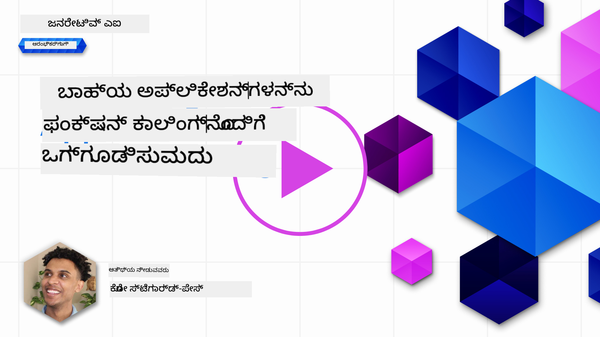

<!--
CO_OP_TRANSLATOR_METADATA:
{
  "original_hash": "f6f84f9ef2d066cd25850cab93580a50",
  "translation_date": "2025-12-19T20:07:24+00:00",
  "source_file": "11-integrating-with-function-calling/README.md",
  "language_code": "kn"
}
-->
# ಕಾರ್ಯವಿಧಾನ ಕರೆಗೂಡಿಸುವಿಕೆ

[](https://youtu.be/DgUdCLX8qYQ?si=f1ouQU5HQx6F8Gl2)

ನೀವು ಹಿಂದಿನ ಪಾಠಗಳಲ್ಲಿ ಸಾಕಷ್ಟು ಕಲಿತಿದ್ದೀರಿ. ಆದಾಗ್ಯೂ, ನಾವು ಇನ್ನಷ್ಟು ಸುಧಾರಿಸಬಹುದು. ಕೆಲವು ವಿಷಯಗಳನ್ನು ನಾವು ಗಮನಿಸಬಹುದು ಎಂದರೆ ಪ್ರತಿಕ್ರಿಯೆಯ ಸ್ವರೂಪವನ್ನು ಹೆಚ್ಚು ಸुसಂಗತಗೊಳಿಸುವುದು, ಇದರಿಂದ ಪ್ರತಿಕ್ರಿಯೆಯನ್ನು ನಂತರದ ಹಂತದಲ್ಲಿ ಸುಲಭವಾಗಿ ಬಳಸಬಹುದು. ಜೊತೆಗೆ, ನಮ್ಮ ಅಪ್ಲಿಕೇಶನ್ ಅನ್ನು ಇನ್ನಷ್ಟು ಶ್ರೀಮಂತಗೊಳಿಸಲು ಇತರ ಮೂಲಗಳಿಂದ ಡೇಟಾವನ್ನು ಸೇರಿಸಲು ಬಯಸಬಹುದು.

ಮೇಲ್ಕಂಡ ಸಮಸ್ಯೆಗಳು ಈ ಅಧ್ಯಾಯದಲ್ಲಿ ಪರಿಹರಿಸಲು ಯತ್ನಿಸುತ್ತಿರುವವು.

## ಪರಿಚಯ

ಈ ಪಾಠದಲ್ಲಿ ಒಳಗೊಂಡಿರುವವು:

- ಕಾರ್ಯವಿಧಾನ ಕರೆಗೂಡಿಸುವಿಕೆ ಎಂದರೇನು ಮತ್ತು ಅದರ ಬಳಕೆ ಪ್ರಕರಣಗಳನ್ನು ವಿವರಿಸುವುದು.
- Azure OpenAI ಬಳಸಿ ಕಾರ್ಯವಿಧಾನ ಕರೆ ಸೃಷ್ಟಿಸುವುದು.
- ಕಾರ್ಯವಿಧಾನ ಕರೆ ಅನ್ನು ಅಪ್ಲಿಕೇಶನ್‌ಗೆ ಹೇಗೆ ಸೇರಿಸುವುದು.

## ಕಲಿಕೆಯ ಗುರಿಗಳು

ಈ ಪಾಠದ ಅಂತ್ಯಕ್ಕೆ, ನೀವು ಸಾಧ್ಯವಾಗುವುದು:

- ಕಾರ್ಯವಿಧಾನ ಕರೆ ಬಳಸುವ ಉದ್ದೇಶವನ್ನು ವಿವರಿಸುವುದು.
- Azure OpenAI ಸೇವೆಯನ್ನು ಬಳಸಿ ಕಾರ್ಯವಿಧಾನ ಕರೆ ಸೆಟ್‌ಅಪ್ ಮಾಡುವುದು.
- ನಿಮ್ಮ ಅಪ್ಲಿಕೇಶನ್ ಬಳಕೆ ಪ್ರಕರಣಕ್ಕೆ ಪರಿಣಾಮಕಾರಿ ಕಾರ್ಯವಿಧಾನ ಕರೆಗಳನ್ನು ವಿನ್ಯಾಸಗೊಳಿಸುವುದು.

## ದೃಶ್ಯ: ನಮ್ಮ ಚಾಟ್‌ಬಾಟ್ ಅನ್ನು ಕಾರ್ಯವಿಧಾನಗಳೊಂದಿಗೆ ಸುಧಾರಿಸುವುದು

ಈ ಪಾಠಕ್ಕಾಗಿ, ನಾವು ನಮ್ಮ ಶಿಕ್ಷಣ ಸ್ಟಾರ್ಟ್ಅಪ್‌ಗೆ ಒಂದು ವೈಶಿಷ್ಟ್ಯವನ್ನು ನಿರ್ಮಿಸಲು ಬಯಸುತ್ತೇವೆ, ಅದು ಬಳಕೆದಾರರಿಗೆ ತಾಂತ್ರಿಕ ಕೋರ್ಸುಗಳನ್ನು ಹುಡುಕಲು ಚಾಟ್‌ಬಾಟ್ ಬಳಸಲು ಅನುಮತಿಸುತ್ತದೆ. ನಾವು ಅವರ ಕೌಶಲ್ಯ ಮಟ್ಟ, ಪ್ರಸ್ತುತ ಪಾತ್ರ ಮತ್ತು ಆಸಕ್ತಿಯ ತಂತ್ರಜ್ಞಾನಕ್ಕೆ ಹೊಂದಿಕೊಂಡ ಕೋರ್ಸುಗಳನ್ನು ಶಿಫಾರಸು ಮಾಡುತ್ತೇವೆ.

ಈ ದೃಶ್ಯವನ್ನು ಪೂರ್ಣಗೊಳಿಸಲು, ನಾವು ಕೆಳಗಿನ ಸಂಯೋಜನೆಯನ್ನು ಬಳಸುತ್ತೇವೆ:

- `Azure OpenAI` ಬಳಸಿ ಬಳಕೆದಾರರಿಗೆ ಚಾಟ್ ಅನುಭವವನ್ನು ಸೃಷ್ಟಿಸುವುದು.
- `Microsoft Learn Catalog API` ಬಳಸಿ ಬಳಕೆದಾರರ ವಿನಂತಿಯ ಆಧಾರದ ಮೇಲೆ ಕೋರ್ಸುಗಳನ್ನು ಹುಡುಕಲು ಸಹಾಯ ಮಾಡುವುದು.
- `Function Calling` ಬಳಸಿ ಬಳಕೆದಾರರ ಪ್ರಶ್ನೆಯನ್ನು ಕಾರ್ಯವಿಧಾನಕ್ಕೆ ಕಳುಹಿಸಿ API ವಿನಂತಿಯನ್ನು ಮಾಡಲು.

ಆರಂಭಿಸಲು, ನಾವು ಮೊದಲಿಗೆ ಕಾರ್ಯವಿಧಾನ ಕರೆ ಬಳಸಬೇಕಾದ ಕಾರಣವನ್ನು ನೋಡೋಣ:

## ಕಾರ್ಯವಿಧಾನ ಕರೆ ಯಾಕೆ

ಕಾರ್ಯವಿಧಾನ ಕರೆ ಮೊದಲು, LLM ನಿಂದ ಪ್ರತಿಕ್ರಿಯೆಗಳು ಅಸಂರಚಿತ ಮತ್ತು ಅಸಮಾನವಾಗಿದ್ದವು. ಡೆವಲಪರ್‌ಗಳು ಪ್ರತಿಕ್ರಿಯೆಯ ಪ್ರತಿ ಬದಲಾವಣೆಯನ್ನು ನಿಭಾಯಿಸಲು ಸಂಕೀರ್ಣ ಮಾನ್ಯತೆ ಕೋಡ್ ಬರೆಯಬೇಕಾಗಿತ್ತು. ಬಳಕೆದಾರರು "ಸ್ಟಾಕ್‌ಹೋಲ್ಮ್‌ನ ಪ್ರಸ್ತುತ ಹವಾಮಾನ ಏನು?" ಎಂಬಂತಹ ಉತ್ತರಗಳನ್ನು ಪಡೆಯಲಾಗುತ್ತಿರಲಿಲ್ಲ. ಇದಕ್ಕೆ ಕಾರಣ ಮಾದರಿಗಳು ತರಬೇತುಗೊಂಡ ಡೇಟಾ ಸಮಯಕ್ಕೆ ಸೀಮಿತವಾಗಿದ್ದವು.

ಕಾರ್ಯವಿಧಾನ ಕರೆ Azure OpenAI ಸೇವೆಯ ಒಂದು ವೈಶಿಷ್ಟ್ಯವಾಗಿದ್ದು, ಕೆಳಗಿನ ಮಿತಿಗಳನ್ನು ಮೀರಿ ಹೋಗಲು ಸಹಾಯ ಮಾಡುತ್ತದೆ:

- **ಸಂಯೋಜಿತ ಪ್ರತಿಕ್ರಿಯೆ ಸ್ವರೂಪ**. ಪ್ರತಿಕ್ರಿಯೆ ಸ್ವರೂಪವನ್ನು ಉತ್ತಮವಾಗಿ ನಿಯಂತ್ರಿಸಿದರೆ, ನಾವು ಅದನ್ನು ಇತರ ವ್ಯವಸ್ಥೆಗಳಿಗೆ ಸುಲಭವಾಗಿ ಸೇರಿಸಬಹುದು.
- **ಬಾಹ್ಯ ಡೇಟಾ**. ಚಾಟ್ ಸನ್ನಿವೇಶದಲ್ಲಿ ಅಪ್ಲಿಕೇಶನ್‌ನ ಇತರ ಮೂಲಗಳಿಂದ ಡೇಟಾವನ್ನು ಬಳಸುವ ಸಾಮರ್ಥ್ಯ.

## ಸಮಸ್ಯೆಯನ್ನು ದೃಶ್ಯ ಮೂಲಕ ವಿವರಿಸುವುದು

> ಕೆಳಗಿನ ದೃಶ್ಯವನ್ನು ಚಾಲನೆ ಮಾಡಲು ನೀವು [ಸೇರಿಸಿದ ನೋಟ್ಬುಕ್](./python/aoai-assignment.ipynb?WT.mc_id=academic-105485-koreyst) ಅನ್ನು ಬಳಸಲು ಶಿಫಾರಸು ಮಾಡುತ್ತೇವೆ. ನಾವು ಸಮಸ್ಯೆಯನ್ನು ವಿವರಿಸಲು ಪ್ರಯತ್ನಿಸುತ್ತಿದ್ದೇವೆ, ಅಲ್ಲಿ ಕಾರ್ಯವಿಧಾನಗಳು ಸಮಸ್ಯೆಯನ್ನು ಪರಿಹರಿಸಲು ಸಹಾಯ ಮಾಡಬಹುದು.

ಪ್ರತಿಕ್ರಿಯೆ ಸ್ವರೂಪದ ಸಮಸ್ಯೆಯನ್ನು ವಿವರಿಸುವ ಉದಾಹರಣೆಯನ್ನು ನೋಡೋಣ:

ನಾವು ವಿದ್ಯಾರ್ಥಿಗಳ ಡೇಟಾಬೇಸ್ ಸೃಷ್ಟಿಸಲು ಬಯಸುತ್ತೇವೆ, ಇದರಿಂದ ನಾವು ಅವರಿಗೆ ಸರಿಯಾದ ಕೋರ್ಸನ್ನು ಶಿಫಾರಸು ಮಾಡಬಹುದು. ಕೆಳಗಿನ ಎರಡು ವಿದ್ಯಾರ್ಥಿಗಳ ವಿವರಣೆಗಳು ಡೇಟಾದಲ್ಲಿ ಬಹಳ ಸಮಾನವಾಗಿವೆ.

1. ನಮ್ಮ Azure OpenAI ಸಂಪನ್ಮೂಲಕ್ಕೆ ಸಂಪರ್ಕವನ್ನು ಸೃಷ್ಟಿಸಿ:

   ```python
   import os
   import json
   from openai import AzureOpenAI
   from dotenv import load_dotenv
   load_dotenv()

   client = AzureOpenAI(
   api_key=os.environ['AZURE_OPENAI_API_KEY'],  # ಇದು ಸಹ ಡೀಫಾಲ್ಟ್ ಆಗಿದ್ದು, ಇದನ್ನು ಬಿಟ್ಟುಹಾಕಬಹುದು
   api_version = "2023-07-01-preview"
   )

   deployment=os.environ['AZURE_OPENAI_DEPLOYMENT']
   ```

   ಕೆಳಗಿನ ಪೈಥಾನ್ ಕೋಡ್ Azure OpenAI ಗೆ ಸಂಪರ್ಕವನ್ನು ಸಂರಚಿಸಲು `api_type`, `api_base`, `api_version` ಮತ್ತು `api_key` ಅನ್ನು ಸೆಟ್ ಮಾಡುತ್ತದೆ.

1. `student_1_description` ಮತ್ತು `student_2_description` ಎಂಬ ಚರಗಳನ್ನು ಬಳಸಿ ಎರಡು ವಿದ್ಯಾರ್ಥಿ ವಿವರಣೆಗಳನ್ನು ಸೃಷ್ಟಿಸುವುದು.

   ```python
   student_1_description="Emily Johnson is a sophomore majoring in computer science at Duke University. She has a 3.7 GPA. Emily is an active member of the university's Chess Club and Debate Team. She hopes to pursue a career in software engineering after graduating."

   student_2_description = "Michael Lee is a sophomore majoring in computer science at Stanford University. He has a 3.8 GPA. Michael is known for his programming skills and is an active member of the university's Robotics Club. He hopes to pursue a career in artificial intelligence after finishing his studies."
   ```

   ಮೇಲಿನ ವಿದ್ಯಾರ್ಥಿ ವಿವರಣೆಗಳನ್ನು LLM ಗೆ ಕಳುಹಿಸಿ ಡೇಟಾವನ್ನು ಪಾರ್ಸ್ ಮಾಡಿಸಲು ಬಯಸುತ್ತೇವೆ. ಈ ಡೇಟಾ ನಂತರ ನಮ್ಮ ಅಪ್ಲಿಕೇಶನ್‌ನಲ್ಲಿ ಬಳಸಬಹುದು ಮತ್ತು API ಗೆ ಕಳುಹಿಸಬಹುದು ಅಥವಾ ಡೇಟಾಬೇಸ್‌ನಲ್ಲಿ ಸಂಗ್ರಹಿಸಬಹುದು.

1. LLM ಗೆ ನಾವು ಯಾವ ಮಾಹಿತಿಯನ್ನು ಆಸಕ್ತರಾಗಿದ್ದೇವೆ ಎಂದು ಸೂಚಿಸುವ ಎರಡು ಸಮಾನ ಪ್ರಾಂಪ್ಟ್‌ಗಳನ್ನು ಸೃಷ್ಟಿಸೋಣ:

   ```python
   prompt1 = f'''
   Please extract the following information from the given text and return it as a JSON object:

   name
   major
   school
   grades
   club

   This is the body of text to extract the information from:
   {student_1_description}
   '''

   prompt2 = f'''
   Please extract the following information from the given text and return it as a JSON object:

   name
   major
   school
   grades
   club

   This is the body of text to extract the information from:
   {student_2_description}
   '''
   ```

   ಮೇಲಿನ ಪ್ರಾಂಪ್ಟ್‌ಗಳು LLM ಗೆ ಮಾಹಿತಿಯನ್ನು ತೆಗೆದು JSON ಸ್ವರೂಪದಲ್ಲಿ ಪ್ರತಿಕ್ರಿಯೆ ನೀಡಲು ಸೂಚಿಸುತ್ತವೆ.

1. ಪ್ರಾಂಪ್ಟ್‌ಗಳು ಮತ್ತು Azure OpenAI ಗೆ ಸಂಪರ್ಕವನ್ನು ಸಿದ್ಧಪಡಿಸಿದ ನಂತರ, ನಾವು `openai.ChatCompletion` ಬಳಸಿ ಪ್ರಾಂಪ್ಟ್‌ಗಳನ್ನು LLM ಗೆ ಕಳುಹಿಸುತ್ತೇವೆ. ನಾವು `messages` ಚರದಲ್ಲಿ ಪ್ರಾಂಪ್ಟ್ ಅನ್ನು ಸಂಗ್ರಹಿಸಿ, ಪಾತ್ರವನ್ನು `user` ಎಂದು ನಿಗದಿಪಡಿಸುತ್ತೇವೆ. ಇದು ಬಳಕೆದಾರರಿಂದ ಚಾಟ್‌ಬಾಟ್‌ಗೆ ಸಂದೇಶ ಬರೆಯಲ್ಪಡುವಂತೆ ಅನುಕರಿಸುತ್ತದೆ.

   ```python
   # ಪ್ರಾಂಪ್ಟ್ ಒಂದರಿಂದ ಪ್ರತಿಕ್ರಿಯೆ
   openai_response1 = client.chat.completions.create(
   model=deployment,
   messages = [{'role': 'user', 'content': prompt1}]
   )
   openai_response1.choices[0].message.content

   # ಪ್ರಾಂಪ್ಟ್ ಎರಡರಿಂದ ಪ್ರತಿಕ್ರಿಯೆ
   openai_response2 = client.chat.completions.create(
   model=deployment,
   messages = [{'role': 'user', 'content': prompt2}]
   )
   openai_response2.choices[0].message.content
   ```

ಈಗ ನಾವು ಎರಡೂ ವಿನಂತಿಗಳನ್ನು LLM ಗೆ ಕಳುಹಿಸಿ, ಪ್ರತಿಕ್ರಿಯೆಯನ್ನು `openai_response1['choices'][0]['message']['content']` ಮೂಲಕ ಪರಿಶೀಲಿಸಬಹುದು.

1. ಕೊನೆಗೆ, ಪ್ರತಿಕ್ರಿಯೆಯನ್ನು JSON ಸ್ವರೂಪಕ್ಕೆ ಪರಿವರ್ತಿಸಲು `json.loads` ಅನ್ನು ಕರೆಸೋಣ:

   ```python
   # ಪ್ರತಿಕ್ರಿಯೆಯನ್ನು JSON ವಸ್ತುವಾಗಿ ಲೋಡ್ ಮಾಡಲಾಗುತ್ತಿದೆ
   json_response1 = json.loads(openai_response1.choices[0].message.content)
   json_response1
   ```

   ಪ್ರತಿಕ್ರಿಯೆ 1:

   ```json
   {
     "name": "Emily Johnson",
     "major": "computer science",
     "school": "Duke University",
     "grades": "3.7",
     "club": "Chess Club"
   }
   ```

   ಪ್ರತಿಕ್ರಿಯೆ 2:

   ```json
   {
     "name": "Michael Lee",
     "major": "computer science",
     "school": "Stanford University",
     "grades": "3.8 GPA",
     "club": "Robotics Club"
   }
   ```

   ಪ್ರಾಂಪ್ಟ್‌ಗಳು ಒಂದೇ ಆಗಿದ್ದರೂ ಮತ್ತು ವಿವರಣೆಗಳು ಸಮಾನವಾಗಿದ್ದರೂ, `Grades` ಗುಣಲಕ್ಷಣದ ಮೌಲ್ಯಗಳು ವಿಭಿನ್ನ ಸ್ವರೂಪದಲ್ಲಿ ಕಾಣಿಸುತ್ತವೆ, ಉದಾಹರಣೆಗೆ ಕೆಲವೊಮ್ಮೆ `3.7` ಅಥವಾ `3.7 GPA` ಸ್ವರೂಪದಲ್ಲಿ.

   ಈ ಫಲಿತಾಂಶಕ್ಕೆ ಕಾರಣ LLM ಬರೆಯಲಾದ ಪ್ರಾಂಪ್ಟ್ ರೂಪದಲ್ಲಿ ಅಸಂರಚಿತ ಡೇಟಾವನ್ನು ತೆಗೆದು, ಅಸಂರಚಿತ ಡೇಟಾವನ್ನು ಹಿಂತಿರುಗಿಸುವುದು. ನಾವು ಸಂರಚಿತ ಸ್ವರೂಪವನ್ನು ಹೊಂದಿರಬೇಕು, ಇದರಿಂದ ನಾವು ಡೇಟಾವನ್ನು ಸಂಗ್ರಹಿಸುವಾಗ ಅಥವಾ ಬಳಸುವಾಗ ಏನು ನಿರೀಕ್ಷಿಸಬೇಕೆಂದು ತಿಳಿದುಕೊಳ್ಳಬಹುದು.

ಆದ್ದರಿಂದ ಸ್ವರೂಪದ ಸಮಸ್ಯೆಯನ್ನು ನಾವು ಹೇಗೆ ಪರಿಹರಿಸಬಹುದು? ಕಾರ್ಯವಿಧಾನ ಕರೆ ಬಳಸಿ, ನಾವು ಸಂರಚಿತ ಡೇಟಾವನ್ನು ಹಿಂತಿರುಗಿಸುವುದನ್ನು ಖಚಿತಪಡಿಸಬಹುದು. ಕಾರ್ಯವಿಧಾನ ಕರೆ ಬಳಸುವಾಗ, LLM ನಿಜವಾಗಿಯೂ ಯಾವುದೇ ಕಾರ್ಯವಿಧಾನಗಳನ್ನು ಕರೆಸುವುದಿಲ್ಲ ಅಥವಾ ಚಲಾಯಿಸುವುದಿಲ್ಲ. ಬದಲಿಗೆ, ನಾವು LLM ಅನುಸರಿಸಲು ಒಂದು ರಚನೆಯನ್ನು ಸೃಷ್ಟಿಸುತ್ತೇವೆ. ನಂತರ ಆ ಸಂರಚಿತ ಪ್ರತಿಕ್ರಿಯೆಗಳನ್ನು ನಾವು ನಮ್ಮ ಅಪ್ಲಿಕೇಶನ್‌ಗಳಲ್ಲಿ ಯಾವ ಕಾರ್ಯವಿಧಾನವನ್ನು ಚಲಾಯಿಸಬೇಕೆಂದು ತಿಳಿದುಕೊಳ್ಳಲು ಬಳಸುತ್ತೇವೆ.


ನಂತರ ಕಾರ್ಯವಿಧಾನದಿಂದ ಹಿಂತಿರುಗಿದ ಮಾಹಿತಿಯನ್ನು ತೆಗೆದು LLM ಗೆ ಕಳುಹಿಸಬಹುದು. LLM ನಂತರ ಬಳಕೆದಾರರ ಪ್ರಶ್ನೆಗೆ ನೈಸರ್ಗಿಕ ಭಾಷೆಯಲ್ಲಿ ಉತ್ತರ ನೀಡುತ್ತದೆ.

## ಕಾರ್ಯವಿಧಾನ ಕರೆಗಳ ಬಳಕೆ ಪ್ರಕರಣಗಳು

ಕಾರ್ಯವಿಧಾನ ಕರೆಗಳು ನಿಮ್ಮ ಅಪ್ಲಿಕೇಶನ್ ಅನ್ನು ಸುಧಾರಿಸಲು ಹಲವಾರು ಬಳಕೆ ಪ್ರಕರಣಗಳಿವೆ, ಉದಾಹರಣೆಗೆ:

- **ಬಾಹ್ಯ ಸಾಧನಗಳನ್ನು ಕರೆಸುವುದು**. ಚಾಟ್‌ಬಾಟ್‌ಗಳು ಬಳಕೆದಾರರ ಪ್ರಶ್ನೆಗಳಿಗೆ ಉತ್ತರ ನೀಡಲು ಉತ್ತಮವಾಗಿವೆ. ಕಾರ್ಯವಿಧಾನ ಕರೆ ಬಳಸಿ, ಚಾಟ್‌ಬಾಟ್‌ಗಳು ಬಳಕೆದಾರರ ಸಂದೇಶಗಳನ್ನು ಬಳಸಿಕೊಂಡು ಕೆಲವು ಕಾರ್ಯಗಳನ್ನು ಪೂರ್ಣಗೊಳಿಸಬಹುದು. ಉದಾಹರಣೆಗೆ, ವಿದ್ಯಾರ್ಥಿ ಚಾಟ್‌ಬಾಟ್‌ಗೆ "ನನ್ನ ಶಿಕ್ಷಕರಿಗೆ ಈ ವಿಷಯದಲ್ಲಿ ಹೆಚ್ಚಿನ ಸಹಾಯ ಬೇಕೆಂದು ಇಮೇಲ್ ಕಳುಹಿಸಿ" ಎಂದು ಕೇಳಬಹುದು. ಇದು `send_email(to: string, body: string)` ಎಂಬ ಕಾರ್ಯವಿಧಾನವನ್ನು ಕರೆಸಬಹುದು.

- **API ಅಥವಾ ಡೇಟಾಬೇಸ್ ಪ್ರಶ್ನೆಗಳನ್ನು ಸೃಷ್ಟಿಸುವುದು**. ಬಳಕೆದಾರರು ನೈಸರ್ಗಿಕ ಭಾಷೆಯನ್ನು ಬಳಸಿ ಮಾಹಿತಿಯನ್ನು ಹುಡುಕಬಹುದು, ಅದು ಸ್ವಯಂಚಾಲಿತವಾಗಿ ರೂಪುಗೊಂಡ ಪ್ರಶ್ನೆ ಅಥವಾ API ವಿನಂತಿಯಾಗಿ ಪರಿವರ್ತಿತವಾಗುತ್ತದೆ. ಉದಾಹರಣೆಗೆ, ಶಿಕ್ಷಕರು "ಕೊನೆಯ ಅಸೈನ್‌ಮೆಂಟ್ ಪೂರ್ಣಗೊಳಿಸಿದ ವಿದ್ಯಾರ್ಥಿಗಳು ಯಾರು?" ಎಂದು ಕೇಳಬಹುದು, ಇದು `get_completed(student_name: string, assignment: int, current_status: string)` ಎಂಬ ಕಾರ್ಯವಿಧಾನವನ್ನು ಕರೆಸಬಹುದು.

- **ಸಂರಚಿತ ಡೇಟಾ ಸೃಷ್ಟಿಸುವುದು**. ಬಳಕೆದಾರರು ಪಠ್ಯದ ಒಂದು ಭಾಗ ಅಥವಾ CSV ತೆಗೆದು LLM ಬಳಸಿ ಪ್ರಮುಖ ಮಾಹಿತಿಯನ್ನು ತೆಗೆದುಹಾಕಬಹುದು. ಉದಾಹರಣೆಗೆ, ವಿದ್ಯಾರ್ಥಿ ಶಾಂತಿ ಒಪ್ಪಂದಗಳ ಬಗ್ಗೆ ವಿಕಿಪೀಡಿಯಾ ಲೇಖನವನ್ನು AI ಫ್ಲಾಶ್‌ಕಾರ್ಡ್‌ಗಳಾಗಿ ಪರಿವರ್ತಿಸಬಹುದು. ಇದು `get_important_facts(agreement_name: string, date_signed: string, parties_involved: list)` ಎಂಬ ಕಾರ್ಯವಿಧಾನವನ್ನು ಬಳಸಿ ಮಾಡಬಹುದು.

## ನಿಮ್ಮ ಮೊದಲ ಕಾರ್ಯವಿಧಾನ ಕರೆ ಸೃಷ್ಟಿಸುವುದು

ಕಾರ್ಯವಿಧಾನ ಕರೆ ಸೃಷ್ಟಿಸುವ ಪ್ರಕ್ರಿಯೆಯಲ್ಲಿ 3 ಮುಖ್ಯ ಹಂತಗಳಿವೆ:

1. ನಿಮ್ಮ ಕಾರ್ಯವಿಧಾನಗಳ ಪಟ್ಟಿಯೊಂದಿಗೆ ಮತ್ತು ಬಳಕೆದಾರ ಸಂದೇಶದೊಂದಿಗೆ Chat Completions API ಅನ್ನು ಕರೆಸುವುದು.
2. ಮಾದರಿಯ ಪ್ರತಿಕ್ರಿಯೆಯನ್ನು ಓದಿ ಕಾರ್ಯವಿಧಾನ ಅಥವಾ API ಕರೆ ನಡೆಸುವುದು.
3. ನಿಮ್ಮ ಕಾರ್ಯವಿಧಾನದಿಂದ ಬಂದ ಪ್ರತಿಕ್ರಿಯೆಯನ್ನು ಬಳಸಿ ಮತ್ತೊಂದು Chat Completions API ಕರೆ ಮಾಡಿ ಬಳಕೆದಾರರಿಗೆ ಉತ್ತರ ಸೃಷ್ಟಿಸುವುದು.


### ಹಂತ 1 - ಸಂದೇಶಗಳನ್ನು ಸೃಷ್ಟಿಸುವುದು

ಮೊದಲ ಹಂತದಲ್ಲಿ ಬಳಕೆದಾರ ಸಂದೇಶವನ್ನು ಸೃಷ್ಟಿಸಬೇಕು. ಇದು ಪಠ್ಯ ಇನ್‌ಪುಟ್‌ನ ಮೌಲ್ಯವನ್ನು ತೆಗೆದು ಡೈನಾಮಿಕ್ ಆಗಿ ನಿಗದಿಪಡಿಸಬಹುದು ಅಥವಾ ನೀವು ಇಲ್ಲಿ ಮೌಲ್ಯವನ್ನು ನಿಗದಿಪಡಿಸಬಹುದು. ಇದು ನಿಮ್ಮ ಮೊದಲ ಬಾರಿಗೆ Chat Completions API ಜೊತೆ ಕೆಲಸ ಮಾಡುತ್ತಿದ್ದರೆ, ನಾವು ಸಂದೇಶದ `role` ಮತ್ತು `content` ಅನ್ನು ವ್ಯಾಖ್ಯಾನಿಸಬೇಕು.

`role` ಆಗಿರಬಹುದು `system` (ನಿಯಮಗಳನ್ನು ಸೃಷ್ಟಿಸುವುದು), `assistant` (ಮಾದರಿ) ಅಥವಾ `user` (ಅಂತಿಮ ಬಳಕೆದಾರ). ಕಾರ್ಯವಿಧಾನ ಕರೆಗಾಗಿ, ನಾವು ಇದನ್ನು `user` ಎಂದು ನಿಗದಿಪಡಿಸಿ ಉದಾಹರಣೆಯ ಪ್ರಶ್ನೆಯನ್ನು ನೀಡುತ್ತೇವೆ.

```python
messages= [ {"role": "user", "content": "Find me a good course for a beginner student to learn Azure."} ]
```

ವಿಭಿನ್ನ ಪಾತ್ರಗಳನ್ನು ನಿಗದಿಪಡಿಸುವ ಮೂಲಕ, LLM ಗೆ ಇದು ಸಿಸ್ಟಮ್ ಹೇಳುತ್ತಿರುವುದೇ ಅಥವಾ ಬಳಕೆದಾರ ಹೇಳುತ್ತಿರುವುದೇ ಎಂಬುದು ಸ್ಪಷ್ಟವಾಗುತ್ತದೆ, ಇದು ಸಂಭಾಷಣಾ ಇತಿಹಾಸವನ್ನು ನಿರ್ಮಿಸಲು ಸಹಾಯ ಮಾಡುತ್ತದೆ.

### ಹಂತ 2 - ಕಾರ್ಯವಿಧಾನಗಳನ್ನು ಸೃಷ್ಟಿಸುವುದು

ಮುಂದೆ, ನಾವು ಕಾರ್ಯವಿಧಾನ ಮತ್ತು ಅದರ ಪರಿಮಾಣಗಳನ್ನು ವ್ಯಾಖ್ಯಾನಿಸುತ್ತೇವೆ. ಇಲ್ಲಿ ನಾವು `search_courses` ಎಂಬ ಒಂದು ಕಾರ್ಯವಿಧಾನವನ್ನು ಮಾತ್ರ ಬಳಸುತ್ತೇವೆ, ಆದರೆ ನೀವು ಬಹು ಕಾರ್ಯವಿಧಾನಗಳನ್ನು ಸೃಷ್ಟಿಸಬಹುದು.

> **ಮುಖ್ಯ** : ಕಾರ್ಯವಿಧಾನಗಳು LLM ಗೆ ಸಿಸ್ಟಮ್ ಸಂದೇಶದಲ್ಲಿ ಸೇರಿಸಲಾಗುತ್ತವೆ ಮತ್ತು ನೀವು ಹೊಂದಿರುವ ಟೋಕನ್‌ಗಳ ಪ್ರಮಾಣದಲ್ಲಿ ಸೇರಿಸಲಾಗುತ್ತದೆ.

ಕೆಳಗೆ, ನಾವು ಕಾರ್ಯವಿಧಾನಗಳನ್ನು ಐಟಂಗಳ ಸರಣಿಯಾಗಿ ಸೃಷ್ಟಿಸುತ್ತೇವೆ. ಪ್ರತಿ ಐಟಂ ಒಂದು ಕಾರ್ಯವಿಧಾನವಾಗಿದ್ದು, ಅದರ ಗುಣಲಕ್ಷಣಗಳು `name`, `description` ಮತ್ತು `parameters` ಇವೆ:

```python
functions = [
   {
      "name":"search_courses",
      "description":"Retrieves courses from the search index based on the parameters provided",
      "parameters":{
         "type":"object",
         "properties":{
            "role":{
               "type":"string",
               "description":"The role of the learner (i.e. developer, data scientist, student, etc.)"
            },
            "product":{
               "type":"string",
               "description":"The product that the lesson is covering (i.e. Azure, Power BI, etc.)"
            },
            "level":{
               "type":"string",
               "description":"The level of experience the learner has prior to taking the course (i.e. beginner, intermediate, advanced)"
            }
         },
         "required":[
            "role"
         ]
      }
   }
]
```

ಪ್ರತಿ ಕಾರ್ಯವಿಧಾನ ಉದಾಹರಣೆಯನ್ನು ಕೆಳಗಿನಂತೆ ವಿವರಿಸೋಣ:

- `name` - ನಾವು ಕರೆಸಬೇಕಾದ ಕಾರ್ಯವಿಧಾನದ ಹೆಸರು.
- `description` - ಕಾರ್ಯವಿಧಾನ ಹೇಗೆ ಕಾರ್ಯನಿರ್ವಹಿಸುತ್ತದೆ ಎಂಬ ವಿವರಣೆ. ಇಲ್ಲಿ ಸ್ಪಷ್ಟ ಮತ್ತು ನಿಖರವಾಗಿರಬೇಕು.
- `parameters` - ಮಾದರಿ ತನ್ನ ಪ್ರತಿಕ್ರಿಯೆಯಲ್ಲಿ ಉತ್ಪಾದಿಸಬೇಕಾದ ಮೌಲ್ಯಗಳ ಮತ್ತು ಸ್ವರೂಪಗಳ ಪಟ್ಟಿ. `parameters` ಸರಣಿಯಲ್ಲಿ ಐಟಂಗಳು ಇವೆ, ಅವುಗಳ ಗುಣಲಕ್ಷಣಗಳು:
  1. `type` - ಗುಣಲಕ್ಷಣಗಳ ಡೇಟಾ ಪ್ರಕಾರ.
  1. `properties` - ಮಾದರಿ ತನ್ನ ಪ್ರತಿಕ್ರಿಯೆಯಲ್ಲಿ ಬಳಸುವ ನಿರ್ದಿಷ್ಟ ಮೌಲ್ಯಗಳ ಪಟ್ಟಿ
      1. `name` - ಮಾದರಿ ತನ್ನ ಸ್ವರೂಪಿತ ಪ್ರತಿಕ್ರಿಯೆಯಲ್ಲಿ ಬಳಸುವ ಗುಣಲಕ್ಷಣದ ಕೀ, ಉದಾಹರಣೆಗೆ `product`.
      1. `type` - ಈ ಗುಣಲಕ್ಷಣದ ಡೇಟಾ ಪ್ರಕಾರ, ಉದಾಹರಣೆಗೆ `string`.
      1. `description` - ನಿರ್ದಿಷ್ಟ ಗುಣಲಕ್ಷಣದ ವಿವರಣೆ.

ಆಗಾಗ್ಗೆ `required` ಎಂಬ ಐಚ್ಛಿಕ ಗುಣಲಕ್ಷಣವೂ ಇರುತ್ತದೆ - ಕಾರ್ಯವಿಧಾನ ಕರೆ ಪೂರ್ಣಗೊಳ್ಳಲು ಅಗತ್ಯವಿರುವ ಗುಣಲಕ್ಷಣ.

### ಹಂತ 3 - ಕಾರ್ಯವಿಧಾನ ಕರೆ ಮಾಡುವುದು

ಕಾರ್ಯವಿಧಾನವನ್ನು ವ್ಯಾಖ್ಯಾನಿಸಿದ ನಂತರ, ಅದನ್ನು Chat Completion API ಗೆ ಕರೆ ಮಾಡುವಾಗ ಸೇರಿಸಬೇಕು. ನಾವು ಇದನ್ನು `functions` ಅನ್ನು ವಿನಂತಿಗೆ ಸೇರಿಸುವ ಮೂಲಕ ಮಾಡುತ್ತೇವೆ. ಈ ಸಂದರ್ಭದಲ್ಲಿ `functions=functions` ಎಂದು ನಿಗದಿಪಡಿಸುತ್ತೇವೆ.

`function_call` ಅನ್ನು `auto` ಎಂದು ಸೆಟ್ ಮಾಡುವ ಆಯ್ಕೆಯೂ ಇದೆ. ಇದರ ಅರ್ಥ, ನಾವು ಕಾರ್ಯವಿಧಾನವನ್ನು ನಿಗದಿಪಡಿಸುವ ಬದಲು LLM ಯಾವ ಕಾರ್ಯವಿಧಾನವನ್ನು ಕರೆಸಬೇಕೆಂದು ತೀರ್ಮಾನಿಸುತ್ತದೆ.

ಕೆಳಗಿನ ಕೋಡ್‌ನಲ್ಲಿ ನಾವು `ChatCompletion.create` ಅನ್ನು ಕರೆಸುತ್ತೇವೆ, ಇಲ್ಲಿ `functions=functions` ಮತ್ತು `function_call="auto"` ಅನ್ನು ಸೆಟ್ ಮಾಡಲಾಗಿದೆ, ಇದರಿಂದ LLM ಗೆ ಯಾವಾಗ ಕಾರ್ಯವಿಧಾನಗಳನ್ನು ಕರೆಸಬೇಕೆಂದು ಆಯ್ಕೆ ನೀಡಲಾಗಿದೆ:

```python
response = client.chat.completions.create(model=deployment,
                                        messages=messages,
                                        functions=functions,
                                        function_call="auto")

print(response.choices[0].message)
```

ಈಗ ಹಿಂತಿರುಗುವ ಪ್ರತಿಕ್ರಿಯೆ ಹೀಗಿದೆ:

```json
{
  "role": "assistant",
  "function_call": {
    "name": "search_courses",
    "arguments": "{\n  \"role\": \"student\",\n  \"product\": \"Azure\",\n  \"level\": \"beginner\"\n}"
  }
}
```

ಇಲ್ಲಿ ನಾವು `search_courses` ಕಾರ್ಯವಿಧಾನವನ್ನು ಯಾವ ಆರ್ಗ್ಯುಮೆಂಟ್‌ಗಳೊಂದಿಗೆ ಕರೆಸಲಾಗಿದೆ ಎಂದು JSON ಪ್ರತಿಕ್ರಿಯೆಯ `arguments` ಗುಣಲಕ್ಷಣದಲ್ಲಿ ನೋಡಬಹುದು.

LLM ಆರ್ಗ್ಯುಮೆಂಟ್‌ಗಳಿಗೆ ಹೊಂದಿಕೊಳ್ಳುವ ಡೇಟಾವನ್ನು `messages` ಪರಿಮಾಣಕ್ಕೆ ನೀಡಲಾದ ಮೌಲ್ಯದಿಂದ ತೆಗೆದುಕೊಂಡು ಕಂಡುಹಿಡಿದಿದೆ. ಕೆಳಗೆ `messages` ಮೌಲ್ಯವನ್ನು ನೆನಪಿಸಿಕೊಳ್ಳಿ:

```python
messages= [ {"role": "user", "content": "Find me a good course for a beginner student to learn Azure."} ]
```

ನೀವು ನೋಡಬಹುದು, `student`, `Azure` ಮತ್ತು `beginner` ಅನ್ನು `messages` ನಿಂದ ತೆಗೆದು ಕಾರ್ಯವಿಧಾನಕ್ಕೆ ಇನ್‌ಪುಟ್ ಆಗಿ ನಿಗದಿಪಡಿಸಲಾಗಿದೆ. ಕಾರ್ಯವಿಧಾನಗಳನ್ನು ಈ ರೀತಿಯಲ್ಲಿ ಬಳಸುವುದು ಪ್ರಾಂಪ್ಟ್‌ನಿಂದ ಮಾಹಿತಿಯನ್ನು ತೆಗೆದುಹಾಕಲು ಉತ್ತಮ ಮಾರ್ಗವಾಗಿದ್ದು, LLM ಗೆ ರಚನೆ ನೀಡಲು ಮತ್ತು ಪುನಃಬಳಕೆ ಮಾಡಬಹುದಾದ ಕಾರ್ಯಕ್ಷಮತೆಯನ್ನು ಹೊಂದಲು ಸಹಾಯ ಮಾಡುತ್ತದೆ.

ಮುಂದೆ, ನಾವು ಇದನ್ನು ನಮ್ಮ ಅಪ್ಲಿಕೇಶನ್‌ನಲ್ಲಿ ಹೇಗೆ ಬಳಸಬಹುದು ಎಂದು ನೋಡೋಣ.

## ಕಾರ್ಯವಿಧಾನ ಕರೆಗಳನ್ನು ಅಪ್ಲಿಕೇಶನ್‌ಗೆ ಸೇರಿಸುವುದು

LLM ನಿಂದ ಸ್ವರೂಪಿತ ಪ್ರತಿಕ್ರಿಯೆಯನ್ನು ಪರೀಕ್ಷಿಸಿದ ನಂತರ, ನಾವು ಇದನ್ನು ಅಪ್ಲಿಕೇಶನ್‌ಗೆ ಸೇರಿಸಬಹುದು.

### ಪ್ರಕ್ರಿಯೆಯನ್ನು ನಿರ್ವಹಿಸುವುದು

ನಮ್ಮ ಅಪ್ಲಿಕೇಶನ್‌ಗೆ ಸೇರಿಸಲು, ಕೆಳಗಿನ ಹಂತಗಳನ್ನು ಅನುಸರಿಸೋಣ:

1. ಮೊದಲು, OpenAI ಸೇವೆಗಳಿಗೆ ಕರೆ ಮಾಡಿ, ಸಂದೇಶವನ್ನು `response_message` ಎಂಬ ಚರದಲ್ಲಿ ಸಂಗ್ರಹಿಸೋಣ.

   ```python
   response_message = response.choices[0].message
   ```

1. ಈಗ, Microsoft Learn API ಅನ್ನು ಕರೆಸಲು ಕಾರ್ಯವಿಧಾನವನ್ನು ವ್ಯಾಖ್ಯಾನಿಸೋಣ, ಇದು ಕೋರ್ಸುಗಳ ಪಟ್ಟಿಯನ್ನು ಪಡೆಯುತ್ತದೆ:

   ```python
   import requests

   def search_courses(role, product, level):
     url = "https://learn.microsoft.com/api/catalog/"
     params = {
        "role": role,
        "product": product,
        "level": level
     }
     response = requests.get(url, params=params)
     modules = response.json()["modules"]
     results = []
     for module in modules[:5]:
        title = module["title"]
        url = module["url"]
        results.append({"title": title, "url": url})
     return str(results)
   ```

   ಇಲ್ಲಿ ನಾವು `functions` ಚರದಲ್ಲಿ ಪರಿಚಯಿಸಿದ ಕಾರ್ಯವಿಧಾನ ಹೆಸರಿನೊಂದಿಗೆ ನಿಜವಾದ ಪೈಥಾನ್ ಕಾರ್ಯವಿಧಾನವನ್ನು ಸೃಷ್ಟಿಸುತ್ತಿದ್ದೇವೆ. ನಾವು ನಿಜವಾದ ಬಾಹ್ಯ API ಕರೆಗಳನ್ನು ಮಾಡಿ ಅಗತ್ಯವಿರುವ ಡೇಟಾವನ್ನು ಪಡೆಯುತ್ತಿದ್ದೇವೆ. ಈ ಸಂದರ್ಭದಲ್ಲಿ, ತರಬೇತಿ ಘಟಕಗಳನ್ನು ಹುಡುಕಲು Microsoft Learn API ಗೆ ಕರೆ ಮಾಡುತ್ತೇವೆ.

ಸರಿ, ನಾವು `functions` ಚರಗಳನ್ನು ಮತ್ತು ಹೊಂದಾಣಿಕೆಯ ಪೈಥಾನ್ ಕಾರ್ಯವಿಧಾನವನ್ನು ಸೃಷ್ಟಿಸಿದ್ದೇವೆ, LLM ಗೆ ಈ ಎರಡನ್ನು ಹೇಗೆ ನಕ್ಷೆ ಮಾಡಬೇಕು ಮತ್ತು ನಮ್ಮ ಪೈಥಾನ್ ಕಾರ್ಯವಿಧಾನವನ್ನು ಹೇಗೆ ಕರೆಸಬೇಕು?

1. ಪೈಥಾನ್ ಕಾರ್ಯವಿಧಾನವನ್ನು ಕರೆಸಬೇಕೋ ಇಲ್ಲವೋ ನೋಡಲು, LLM ಪ್ರತಿಕ್ರಿಯೆಯಲ್ಲಿ `function_call` ಭಾಗವಿದೆಯೇ ಎಂದು ಪರಿಶೀಲಿಸಿ, ಸೂಚಿಸಿದ ಕಾರ್ಯವಿಧಾನವನ್ನು ಕರೆಸಬೇಕು. ಕೆಳಗಿನಂತೆ ಪರಿಶೀಲನೆ ಮಾಡಬಹುದು:

   ```python
   # ಮಾದರಿ ಫಂಕ್ಷನ್ ಅನ್ನು ಕರೆಮಾಡಲು ಬಯಸುತ್ತದೆಯೇ ಎಂದು ಪರಿಶೀಲಿಸಿ
   if response_message.function_call.name:
    print("Recommended Function call:")
    print(response_message.function_call.name)
    print()

    # ಫಂಕ್ಷನ್ ಅನ್ನು ಕರೆಮಾಡಿ.
    function_name = response_message.function_call.name

    available_functions = {
            "search_courses": search_courses,
    }
    function_to_call = available_functions[function_name]

    function_args = json.loads(response_message.function_call.arguments)
    function_response = function_to_call(**function_args)

    print("Output of function call:")
    print(function_response)
    print(type(function_response))


    # ಸಹಾಯಕ ಪ್ರತಿಕ್ರಿಯೆ ಮತ್ತು ಫಂಕ್ಷನ್ ಪ್ರತಿಕ್ರಿಯೆಯನ್ನು ಸಂದೇಶಗಳಿಗೆ ಸೇರಿಸಿ
    messages.append( # ಸಹಾಯಕ ಪ್ರತಿಕ್ರಿಯೆಯನ್ನು ಸಂದೇಶಗಳಿಗೆ ಸೇರಿಸಲಾಗುತ್ತಿದೆ
        {
            "role": response_message.role,
            "function_call": {
                "name": function_name,
                "arguments": response_message.function_call.arguments,
            },
            "content": None
        }
    )
    messages.append( # ಫಂಕ್ಷನ್ ಪ್ರತಿಕ್ರಿಯೆಯನ್ನು ಸಂದೇಶಗಳಿಗೆ ಸೇರಿಸಲಾಗುತ್ತಿದೆ
        {
            "role": "function",
            "name": function_name,
            "content":function_response,
        }
    )
   ```

   ಈ ಮೂರು ಸಾಲುಗಳು ಕಾರ್ಯವಿಧಾನ ಹೆಸರು, ಆರ್ಗ್ಯುಮೆಂಟ್‌ಗಳನ್ನು ತೆಗೆದು ಕರೆ ಮಾಡುತ್ತವೆ:

   ```python
   function_to_call = available_functions[function_name]

   function_args = json.loads(response_message.function_call.arguments)
   function_response = function_to_call(**function_args)
   ```

   ಕೆಳಗಿನದು ನಮ್ಮ ಕೋಡ್ ಚಾಲನೆಯಿಂದ ಬಂದ ಔಟ್‌ಪುಟ್:

   **ಔಟ್‌ಪುಟ್**

   ```Recommended Function call:
   {
     "name": "search_courses",
     "arguments": "{\n  \"role\": \"student\",\n  \"product\": \"Azure\",\n  \"level\": \"beginner\"\n}"
   }

   Output of function call:
   [{'title': 'Describe concepts of cryptography', 'url': 'https://learn.microsoft.com/training/modules/describe-concepts-of-cryptography/?
   WT.mc_id=api_CatalogApi'}, {'title': 'Introduction to audio classification with TensorFlow', 'url': 'https://learn.microsoft.com/en-
   us/training/modules/intro-audio-classification-tensorflow/?WT.mc_id=api_CatalogApi'}, {'title': 'Design a Performant Data Model in Azure SQL
   Database with Azure Data Studio', 'url': 'https://learn.microsoft.com/training/modules/design-a-data-model-with-ads/?
   WT.mc_id=api_CatalogApi'}, {'title': 'Getting started with the Microsoft Cloud Adoption Framework for Azure', 'url':
   'https://learn.microsoft.com/training/modules/cloud-adoption-framework-getting-started/?WT.mc_id=api_CatalogApi'}, {'title': 'Set up the
   Rust development environment', 'url': 'https://learn.microsoft.com/training/modules/rust-set-up-environment/?WT.mc_id=api_CatalogApi'}]
   <class 'str'>
   ```

1. ಈಗ, ನವೀಕರಿಸಿದ ಸಂದೇಶ `messages` ಅನ್ನು LLM ಗೆ ಕಳುಹಿಸಿ, API JSON ಸ್ವರೂಪದ ಪ್ರತಿಕ್ರಿಯೆಯ ಬದಲು ನೈಸರ್ಗಿಕ ಭಾಷೆಯ ಪ್ರತಿಕ್ರಿಯೆಯನ್ನು ಪಡೆಯೋಣ.

   ```python
   print("Messages in next request:")
   print(messages)
   print()

   second_response = client.chat.completions.create(
      messages=messages,
      model=deployment,
      function_call="auto",
      functions=functions,
      temperature=0
         )  # ಫಂಕ್ಷನ್ ಪ್ರತಿಕ್ರಿಯೆಯನ್ನು ನೋಡಬಹುದಾದ GPT ನಿಂದ ಹೊಸ ಪ್ರತಿಕ್ರಿಯೆಯನ್ನು ಪಡೆಯಿರಿ


   print(second_response.choices[0].message)
   ```

   **ಔಟ್‌ಪುಟ್**

   ```python
   {
     "role": "assistant",
     "content": "I found some good courses for beginner students to learn Azure:\n\n1. [Describe concepts of cryptography] (https://learn.microsoft.com/training/modules/describe-concepts-of-cryptography/?WT.mc_id=api_CatalogApi)\n2. [Introduction to audio classification with TensorFlow](https://learn.microsoft.com/training/modules/intro-audio-classification-tensorflow/?WT.mc_id=api_CatalogApi)\n3. [Design a Performant Data Model in Azure SQL Database with Azure Data Studio](https://learn.microsoft.com/training/modules/design-a-data-model-with-ads/?WT.mc_id=api_CatalogApi)\n4. [Getting started with the Microsoft Cloud Adoption Framework for Azure](https://learn.microsoft.com/training/modules/cloud-adoption-framework-getting-started/?WT.mc_id=api_CatalogApi)\n5. [Set up the Rust development environment](https://learn.microsoft.com/training/modules/rust-set-up-environment/?WT.mc_id=api_CatalogApi)\n\nYou can click on the links to access the courses."
   }

   ```

## ಕಾರ್ಯ

Azure OpenAI ಕಾರ್ಯವಿಧಾನ ಕರೆ ಕುರಿತು ನಿಮ್ಮ ಅಧ್ಯಯನವನ್ನು ಮುಂದುವರಿಸಲು ನೀವು ನಿರ್ಮಿಸಬಹುದು:

- ಕಲಿಯುವವರಿಗೆ ಹೆಚ್ಚು ಕೋರ್ಸುಗಳನ್ನು ಹುಡುಕಲು ಸಹಾಯ ಮಾಡುವ ಕಾರ್ಯವಿಧಾನದ ಹೆಚ್ಚಿನ ಪರಿಮಾಣಗಳನ್ನು ಸೇರಿಸುವುದು.
- ಕಲಿಯುವವರ ಮೂಲ ಭಾಷೆ ಮುಂತಾದ ಹೆಚ್ಚಿನ ಮಾಹಿತಿಯನ್ನು ತೆಗೆದುಕೊಳ್ಳುವ ಮತ್ತೊಂದು ಕಾರ್ಯವಿಧಾನ ಕರೆ ಸೃಷ್ಟಿಸುವುದು.
- ಫಂಕ್ಷನ್ ಕರೆ ಮತ್ತು/ಅಥವಾ API ಕರೆ ಯಾವುದೇ ಸೂಕ್ತ ಕೋರ್ಸ್ಗಳನ್ನು ನೀಡದಿದ್ದಾಗ ದೋಷ ನಿರ್ವಹಣೆಯನ್ನು ರಚಿಸಿ

ಸೂಚನೆ: ಈ ಡೇಟಾ ಹೇಗೆ ಮತ್ತು ಎಲ್ಲಿಗೆ ಲಭ್ಯವಿದೆ ಎಂದು ನೋಡಲು [Learn API reference documentation](https://learn.microsoft.com/training/support/catalog-api-developer-reference?WT.mc_id=academic-105485-koreyst) ಪುಟವನ್ನು ಅನುಸರಿಸಿ.

## ಅದ್ಭುತ ಕೆಲಸ! ಪ್ರಯಾಣವನ್ನು ಮುಂದುವರೆಸಿ

ಈ ಪಾಠವನ್ನು ಪೂರ್ಣಗೊಳಿಸಿದ ನಂತರ, ನಮ್ಮ [Generative AI Learning collection](https://aka.ms/genai-collection?WT.mc_id=academic-105485-koreyst) ಅನ್ನು ಪರಿಶೀಲಿಸಿ ಮತ್ತು ನಿಮ್ಮ Generative AI ಜ್ಞಾನವನ್ನು ಮುಂದುವರೆಸಿ!

ಪಾಠ 12ಕ್ಕೆ ಹೋಗಿ, ಅಲ್ಲಿ ನಾವು [AI ಅಪ್ಲಿಕೇಶನ್‌ಗಳಿಗೆ UX ವಿನ್ಯಾಸ ಮಾಡುವುದು](../12-designing-ux-for-ai-applications/README.md?WT.mc_id=academic-105485-koreyst) ಹೇಗೆ ಎಂಬುದನ್ನು ನೋಡೋಣ!

---

<!-- CO-OP TRANSLATOR DISCLAIMER START -->
**ಅಸ್ವೀಕರಣ**:  
ಈ ದಸ್ತಾವೇಜು AI ಅನುವಾದ ಸೇವೆ [Co-op Translator](https://github.com/Azure/co-op-translator) ಬಳಸಿ ಅನುವಾದಿಸಲಾಗಿದೆ. ನಾವು ನಿಖರತೆಯಿಗಾಗಿ ಪ್ರಯತ್ನಿಸುತ್ತಿದ್ದರೂ, ಸ್ವಯಂಚಾಲಿತ ಅನುವಾದಗಳಲ್ಲಿ ದೋಷಗಳು ಅಥವಾ ಅಸತ್ಯತೆಗಳು ಇರಬಹುದು ಎಂದು ದಯವಿಟ್ಟು ಗಮನಿಸಿ. ಮೂಲ ಭಾಷೆಯಲ್ಲಿರುವ ಮೂಲ ದಸ್ತಾವೇಜನ್ನು ಅಧಿಕೃತ ಮೂಲವೆಂದು ಪರಿಗಣಿಸಬೇಕು. ಮಹತ್ವದ ಮಾಹಿತಿಗಾಗಿ ವೃತ್ತಿಪರ ಮಾನವ ಅನುವಾದವನ್ನು ಶಿಫಾರಸು ಮಾಡಲಾಗುತ್ತದೆ. ಈ ಅನುವಾದ ಬಳಕೆಯಿಂದ ಉಂಟಾಗುವ ಯಾವುದೇ ತಪ್ಪು ಅರ್ಥಮಾಡಿಕೊಳ್ಳುವಿಕೆ ಅಥವಾ ತಪ್ಪು ವಿವರಣೆಗಳಿಗೆ ನಾವು ಹೊಣೆಗಾರರಾಗುವುದಿಲ್ಲ.
<!-- CO-OP TRANSLATOR DISCLAIMER END -->