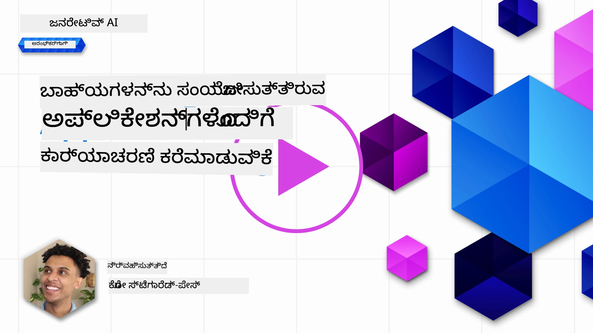
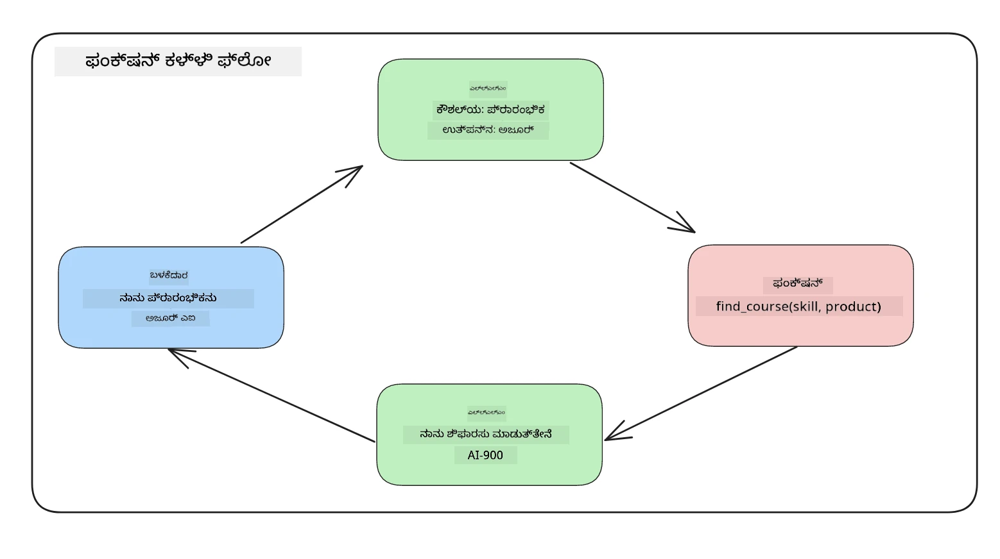
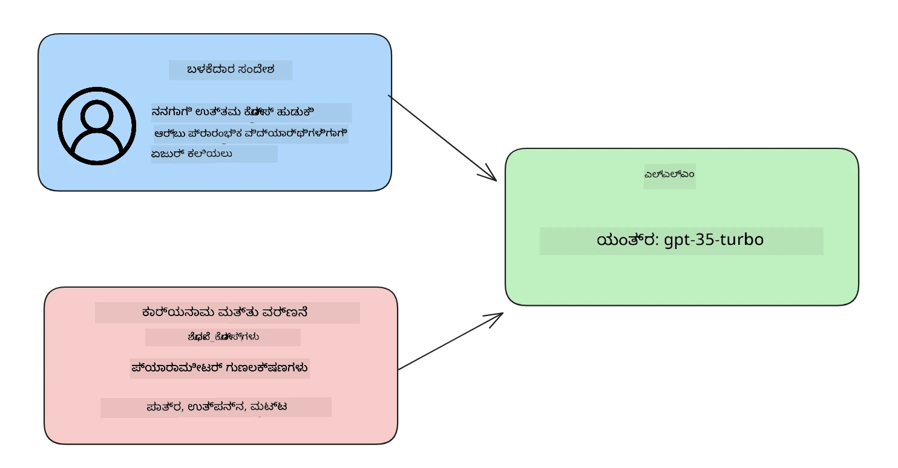

# ಕಾರ್ಯಪದ್ಧತಿ ಕರೆದಿಕೆ ಜೊತೆಯಾಗಿಸುವುದು

[](https://youtu.be/DgUdCLX8qYQ?si=f1ouQU5HQx6F8Gl2)

ನೀವು ಹೀಗೆ ತನಕ ಹಿಂದೆಗಿನ ಪಾಠಗಳಲ್ಲಿ ಸಾಕಷ್ಟು ಕಲಿತಿದ್ದೀರಾ. ಆದಾಗ್ಯೂ, ನಾವು ಇನ್ನೂ ಉತ್ತಮಗೊಳಿಸಬಹುದು. ಕೆಲವು ವಿಷಯಗಳನ್ನು ನಾವು ಪರಿಹರಿಸಬಹುದು ಅಂದರೆ, ಉತ್ತರವನ್ನು ಕಾನ್ಸಿಸ್ಟೆಂಟ್ ಫಾರ್ಮ್ಯಾಟ್‌ನಲ್ಲಿ ಪಡೆಯುವುದರ ಮೂಲಕ ನಂತರದ ಕಾರ್ಯಾಚರಣೆಗೆ ಸುಲಭವಾಗುವಂತೆ ಮಾಡುವುದು. ಜೊತೆಗೆ, ನಾವು ನಮ್ಮ ಅಪ್ಲಿಕೇಶನ್ ನಿಯಮಿತಪಡಿಸಲು ಇತರ ಮೂಲಗಳಿಂದ ಡೇಟಾವನ್ನು ಸೇರಿಸಲು ಬಯಸಬಹುದು.

ಮೇಲ್ಕಂಡ ಸಮಸ್ಯೆಗಳೇ ಈ ಅಧ್ಯಾಯದಲ್ಲಿ ಪರಿಹರಿಸುವುದಾಗಿ ನೋಟವಿದೆ.

## ಪರಿಚಯ

ಈ ಪಾಠದಲ್ಲಿ ನಾವು ತಲುಪುವ ವಿಷಯಗಳು:

- ಕಾರ್ಯಪದ್ಧತಿ ಕರೆದಿಕೆ ಏನು ಮತ್ತು ಅದರ ಬಳಕೆ ಸಂದರ್ಭದಲ್ಲಿ ವಿವರಿಸುವುದು.
- Azure OpenAI ಬಳಸಿ ಕಾರ್ಯಪದ್ಧತಿಯ ಕರೆದಿಕೆಯನ್ನು ಸೃಷ್ಟಿಸುವುದು.
- ಕಾರ್ಯಪದ್ಧತಿ ಕರೆದಿಕೆಯನ್ನು ಅಪ್ಲಿಕೇಶನ್‌ನಲ್ಲಿ ಹೇಗೆ ಜೋಡಿಸುವುದು.

## ಕಲಿಯುವ ಗುರಿಗಳು

ಈ ಪಾಠದ ಕೊನೆಯಲ್ಲಿ, ನೀವು ಸಾಧ್ಯವಾಗುವುದು:

- ಕಾರ್ಯಪದ್ಧತಿ ಕರೆದಿಕೆಯ ಗುರಿಯನ್ನು ವಿವರಿಸುವುದು.
- Azure OpenAI ಸೇವೆ ಬಳಸಿ ಕಾರ್ಯಪದ್ಧತಿ ಕರೆದಿಕೆಯನ್ನು ಸ್ಥಾಪಿಸುವುದು.
- ನಿಮ್ಮ ಅಪ್ಲಿಕೇಶನ್ ಬಳಕೆದಾರಿಕೆಗಾಗಿ ಪರಿಣಾಮಕಾರಿಯಾದ ಕಾರ್ಯಪದ್ಧತಿ ಕರೆದಿಕೆಗಳ ವಿನ್ಯಾಸ ಮಾಡುವುದು.

## ದೃಶ್ಯಾವಳಿ: ನಮ್ಮ ಚಾಟ್‌ಬಾಟ್ ಮುಂದೆ ಕುರಿತು ಉತ್ತಮಗೊಳಿಸುವುದು

ಈ ಪಾಠಕ್ಕಾಗಿ, ನಾವು ನಮ್ಮ ಶಿಕ್ಷಣ ಸ್ಟಾರ್ಟ್‌ಅಪ್‌ಗೆ ಬಳಕೆದಾರರು ಟೆಕ್ನಿಕಲ್ ಕೋರ್ಸ್‌ಗಳನ್ನು ಹುಡುಕಲು ಚಾಟ್‌ಬಾಟ್ ಬಳಕೆಮಾಡಬಹುದು ಎಂಬ ವೈಶಿಷ್ಟ್ಯವನ್ನು ನಿರ್ಮಿಸಲು ಬಯಸುತ್ತೇವೆ. ನಾವು ಅವರಿಗೆ ಅವರ ಕೌಶಲ್ಯ ಮಟ್ಟ, ವರ್ತಮಾನ ಪಾತ್ರ ಮತ್ತು ಆಸಕ್ತಿಯ ತಂತ್ರಜ್ಞಾನಕ್ಕೆ ಹೊಂದಿಕೊಂಡ ಕೋರ್ಸ್‌ಗಳನ್ನು ಶಿಫಾರಸು ಮಾಡುತ್ತೇವೆ.

ಈ ದೃಶ್ಯಾವಳಿಯನ್ನು ಪೂರೈಸಲು ನಾವು ಕೆಳಗಿನ ಸಂಗತಿಗಳನ್ನು ಬಳಸುವೆವು:

- `Azure OpenAI` ಬಳಸಿ ಬಳಕೆದಾರರಿಗೆ ಚಾಟ್ ಅನುಭಾವ ಸೃಷ್ಟಿಸುವುದು.
- `Microsoft Learn Catalog API` ಬಳಸಿ ಬಳಕೆದಾರರ ವಿನಂತಿಗರಿಗನುಸಾರ ಕೋರ್ಸ್‌ಗಳನ್ನು ಹುಡುಕಿಸಲು ಸಹಾಯ ಮಾಡುವುದು.
- `Function Calling` ಬಳಸಿ ಬಳಕೆದಾರರ ಪ್ರಶ್ನೆಯನ್ನು פונಕ್ಷನ್ ಗೆ ಕಳುಹಿಸಿ API ವಿನಂತಿ ಮಾಡಲು.

ಪ್ರಾರಂಭಿಸಲು, ನಾವು ಮೊದಲಿಗೆ ಕಾರ್ಯಪದ್ಧತಿ ಕರೆದಿಕೆಯೆಂದರೆ ಏಕೆ ಬೇಕು ಎಂಬುದನ್ನು ನೋಡೋಣ:

## ಕಾರ್ಯಪದ್ಧತಿ ಕರೆದಿಕೆ ಏಕೆ

ಕಾರ್ಯಪದ್ಧತಿ ಕರೆದಿಕೆಯ ಮುಂಚೆ, LLMನಿಂದ ಉತ್ತರಗಳು ಅಸಂಘಟಿತ ಹಾಗೂ ಅಸಮಾನವಾಗುತ್ತಿದ್ದು. ಡೆವಲಪರ್‌ಗಳು ಪ್ರತಿಯೊಂದು ಬದಲಾವಣೆಯನ್ನು ಪಟ್ಟಿ ಮಾಡಿಕೊಳ್ಳಲು ಸಂಕೀರ್ಣ ಪರಿಶೀಲನಾ ಕೋಡ್ ಬರೆಯಬೇಕಾಗಿದ್ದಿತು. ಬಳಕೆದಾರರು "ಸ್ಟಾಕ್ಹೋಲ್ಮ್‌ನ ಸದ್ಯದ ಹವಾಮಾನ ಏನು?" ಎಂದು ಪ್ರಶ್ನೆ ಕೇಳಲು सक्षमವಾಗಿರಲಿಲ್ಲ. ಇದಕ್ಕೆ ಕಾರಣ ರೂಪಾಂತರಗೊಂಡ ತರಬೇತಿನ ಸಮಯ ನಿಯಮಿತವಾಯಿತು.

ಕಾರ್ಯಪದ್ಧತಿ ಕರೆದಿಕೆ Azure OpenAI ಸೇವೆಯೊಂದು, ಕೆಳಗಿನ ನಿಯಂತ್ರಣಗಳನ್ನು ಮೀರುವ ფუნქ್ಷನ್:

- **ಸಮಬಾಳಿತ ಉತ್ತರ ವಿನ್ಯಾಸ**. ನಾವು ಉತ್ತರದ ವಿನ್ಯಾಸವನ್ನು ಉತ್ತಮವಾಗಿ ನಿಯಂತ್ರಿಸಿದರೆ, ಅದನ್ನು ನಂತರದ ವ್ಯವಸ್ಥೆಗಳಿಗಾಗಿಯೂ ಸುಲಭವಾಗಿ ಜೋಡಿಸಬಹುದು.
- **ಪರಕಾಲೀನ ಡೇಟಾ**. ಚಾಟ್ ಸಂದರ್ಭದಲ್ಲಿ ಅಪ್ಲಿಕೇಶನ್‌ನ ಇತರೆ ಮೂಲಗಳ ಡೇಟಾವನ್ನು ಬಳಸುವ ಶಕ್ತಿ.

## ದೃಶ್ಯಾವಳಿ ಮೂಲಕ ಸಮಸ್ಯೆಯನ್ನು ವಿವರಿಸುವುದು

> ಕೆಳಗಿನ ದೃಶ್ಯಾವಳಿಯನ್ನು ನಡೆಸಲು [ಸರಹದ್ದು ನೋಟ್‌ಬುಕ್](./python/aoai-assignment.ipynb?WT.mc_id=academic-105485-koreyst) ಉಪಯೋಗಿಸುವಂತೆ ಶಿಫಾರಸು ಮಾಡಲಾಗುತ್ತದೆ. ನೀವು ಕೇವಲ ಓದಿ ಚಿಂತಿಸಬಹುದು, ಕಾರಣ ನಾವು ಕಾರ್ಯಪದ್ಧತಿ ಸಮಸ್ಯೆಯನ್ನು ಪರಿಹರಿಸಲು ಸಹಾಯ ಮಾಡುವುದನ್ನು ತೋರಿಸಲು ಯತ್ನಿಸುತ್ತಿದ್ದೇವೆ.

ಉತ್ತರದ ವಿನ್ಯಾಸದಲ್ಲಿ ಸಮಸ್ಯೆಯನ್ನು ತೋರಿಸುವ ಉದಾಹರಣೆಯನ್ನು ನೋಡೋಣ:

ನಾವು ವಿದ್ಯಾರ್ಥಿಗಳ ಡೇಟಾಬೇಸ್ ರಚಿಸಬೇಕೆಂದು ಹೇಳೋಣ, ಇದರಿಂದ ನಾವು ಅವರಿಗೆ ಸರಿಯಾದ ಕೋರ್ಸ್ ಶಿಫಾರಸು ಮಾಡಬಹುದು. ಕೆಳಗಿನವು ಎರಡು ಆದರ್ಶ ವಿದ್ಯಾರ್ಥಿಗಳ ವಿವರಣೆಗಳು ಇವೆ, ಇವುಗಳಲ್ಲಿ ಡೇಟಾ ಬಹಳ ಸಮಾನವಾಗಿದೆ.

1. ನಮ್ಮ Azure OpenAI ಸಂಪನ್ಮೂಲಕ್ಕೆ ಸಂಪರ್ಕವನ್ನು ಸೃಷ್ಟಿಸು:

   ```python
   import os
   import json
   from openai import OpenAI
   from dotenv import load_dotenv
   load_dotenv()

   # ಪ್ರತಿಕ್ರಿಯೆಗಳು API ಅನ್ನು ಅಜೂರ್ ಓಪನ್‌ಎಐ (ಮೈಕ್ರೋಸಾಫ್ಟ್ ಫೌಂಡ್ರಿ) v1 ಅಂತಿಮತೆಂದಿನಿಂದ ಸೇವೆ ಸಲ್ಲಿಸಲಾಗುತ್ತದೆ
   # ಆದ್ದರಿಂದ ನಾವು ಓಪನ್‌ಎಐ ಕ್ಲೈಂಟ್ ಅನ್ನು <ನಿಮ್ಮ-ಅಂತಿಮತೆಂದು>/openai/v1/ ಕ್ಕೆ ಸೂಚಿಸುತ್ತೇವೆ.
   endpoint = os.environ['AZURE_OPENAI_ENDPOINT']
   client = OpenAI(
   api_key=os.environ['AZURE_OPENAI_API_KEY'],
   base_url=f"{endpoint.rstrip('/')}/openai/v1/",
   )

   deployment=os.environ['AZURE_OPENAI_DEPLOYMENT']
   ```

   ಕೆಳಗಿನ ಪೈಥಾನ್ ಕೋಡ್ Azure OpenAIಗೆ ಸಂಪರ್ಕವನ್ನು ವಿನ್ಯಾಸಗೊಳಿಸುವುದಕ್ಕಾಗಿ. ನಾವು v1 ಎಂಡ್ಪಾಯಿಂಟ್ ಬಳಸುತ್ತಿದ್ದರಿಂದ `api_key` ಮತ್ತು `base_url` ಕ್ಕೆ ಮಾತ್ರ ಸೆಟ್ ಮಾಡಬೇಕು (`api_version` ಬೇಕಾಗಿಲ್ಲ).

1. `student_1_description` ಮತ್ತು `student_2_description` ಎಂಬ ವ್ಯತ್ಯಾಸಿಗಳ ಬಳಕೆ ಮೂಲಕ ಎರಡು ವಿದ್ಯಾರ್ಥಿಗಳ ವಿವರಣೆಗಳನ್ನು ಸೃಷ್ಟಿಸುವುದು.

   ```python
   student_1_description="Emily Johnson is a sophomore majoring in computer science at Duke University. She has a 3.7 GPA. Emily is an active member of the university's Chess Club and Debate Team. She hopes to pursue a career in software engineering after graduating."

   student_2_description = "Michael Lee is a sophomore majoring in computer science at Stanford University. He has a 3.8 GPA. Michael is known for his programming skills and is an active member of the university's Robotics Club. He hopes to pursue a career in artificial intelligence after finishing his studies."
   ```

   ಈ ವಿದ್ಯಾರ್ಥಿಗಳ ವಿವರಣೆಗಳನ್ನು LLMಗೆ ಕಳುಹಿಸುವ ಮೂಲಕ ಡೇಟಾವನ್ನು ಪಾರ್ಸ್ ಮಾಡಬೇಕು. ಈ ಡೇಟಾ ನಮ್ಮ ಅಪ್ಲಿಕೇಶನ್‌ನಲ್ಲಿ ಬಳಸಬಹುದು; ಇಲ್ಲವೇ APIಗೆ ಕಳುಹಿಸಬಹುದು ಅಥವಾ ಡೇಟಾಬೇಸ್ ನಲ್ಲಿ ಸಂಗ್ರಹಿಸಬಹುದು.

1. ನಾವು LLMಗೆ ಯಾವ ಮಾಹಿತಿಗೆ ಆಸಕ್ತಿ ಇವೆಂದು ಸೂಚಿಸುವ ಕನಿಷ್ಠ ಎರಡು ಪ್ರಾಂಪ್ಟ್ ಗಳನ್ನು ಸೃಷ್ಟಿಸೋಣ:

   ```python
   prompt1 = f'''
   Please extract the following information from the given text and return it as a JSON object:

   name
   major
   school
   grades
   club

   This is the body of text to extract the information from:
   {student_1_description}
   '''

   prompt2 = f'''
   Please extract the following information from the given text and return it as a JSON object:

   name
   major
   school
   grades
   club

   This is the body of text to extract the information from:
   {student_2_description}
   '''
   ```

   ಮೇಲಿನ ಪ್ರಾಂಪ್ಟ್‌ಗಳು LLMಗೆ ಮಾಹಿತಿ ತೆಗೆಯಲು ಮತ್ತು JSON ರೂಪದಲ್ಲಿ ಉತ್ತರ ಹಿಂತಿರುಗಿಸಲು ಸೂಚಿಸುತ್ತವೆ.

1. ಪ್ರಾಂಪ್ಟ್‌ಗಳು ಹಾಗೂ Azure OpenAI ಸಂಪರ್ಕ ಸಿದ್ಧಪಟ್ಟ ನಂತರ, ನಾವು `client.responses.create` ಬಳಸಿ LLMಗೆ ಪ್ರಾಂಪ್ಟ್ ಕಳುಹಿಸುತ್ತೇವೆ. ನಾವು `input` ವೈಬಲ್‌ನಲ್ಲಿ ಪ್ರಾಂಪ್ಟ್ ನ ಇನ್ಪುಟ್ ಇಟ್ಟು, `user` ಪಾತ್ರವನ್ನು ನಿಯೋಜಿಸುತ್ತೇವೆ. ಇದು ಬಳಕೆದಾರರಿಂದ ಚಾಟ್‌ಬಾಟ್‌ಗೆ ಸಂದೇಶ ಬರೆಯುವಂತೆ ನಕಲು ಮಾಡುತ್ತದೆ.

   ```python
   # ಪ್ರಾಂಪ್ಟ್ ಒಬ್ಬರಿಂದ ಉತ್ತರ
   openai_response1 = client.responses.create(
   model=deployment,
   input = [{'role': 'user', 'content': prompt1}],
   store=False,
   )
   openai_response1.output_text

   # ಪ್ರಾಂಪ್ಟ್ ಎರಡರಿಂದ ಉತ್ತರ
   openai_response2 = client.responses.create(
   model=deployment,
   input = [{'role': 'user', 'content': prompt2}],
   store=False,
   )
   openai_response2.output_text
   ```

ಈಗ ನಾವು ಎರಡೂ ವಿನಂತಿಗಳನ್ನು LLMಗೆ ಕಳುಹಿಸಿ `openai_response1.output_text` ಮೂಲಕ ಪಡೆದ ಉತ್ತರವನ್ನು ಪರಿಶೀಲಿಸಬಹುದು.

1. ಕೊನೆಯಲ್ಲಿ, ನಾವು ಉತ್ತರವನ್ನು JSON ರೂಪಕ್ಕೆ ಪರಿವರ್ತಿಸಲು `json.loads` ಬಳಸಬಹುದು:

   ```python
   # ಪ್ರತಿಕ್ರಿಯೆಯನ್ನು JSON ವಸ್ತುವಾಗಿ ಲೋಡ್ ಮಾಡುತ್ತಿದೆ
   json_response1 = json.loads(openai_response1.output_text)
   json_response1
   ```

   ಉತ್ತರ 1:

   ```json
   {
     "name": "Emily Johnson",
     "major": "computer science",
     "school": "Duke University",
     "grades": "3.7",
     "club": "Chess Club"
   }
   ```

   ಉತ್ತರ 2:

   ```json
   {
     "name": "Michael Lee",
     "major": "computer science",
     "school": "Stanford University",
     "grades": "3.8 GPA",
     "club": "Robotics Club"
   }
   ```

   ಪ್ರಾಂಪ್ಟ್‌ಗಳು ಒಂದೇ ಆದರೂ ಮತ್ತು ವಿವರಣೆಗಳು ಸಮಾನವಾಗಿದ್ದರೂ ಕೂಡ, `Grades` ಗುಣಲಕ್ಷಣದ ಮೌಲ್ಯಗಳು ವಿಭಿನ್ನ ರೀತಿಯಲ್ಲಿ ಸ್ವರೂಪಗೊಳ್ಳುತ್ತವೆ, ಕೆಲವೊಮ್ಮೆ `3.7` ಅಥವಾ `3.7 GPA` ಸ್ವರೂಪ ಬರುತ್ತದೆ.

   ಈ ಫಲಿತಾಂಶಕ್ಕೆ ಕಾರಣವೆಂದರೆ LLM ಬರೆಯಲಾದ ಪ್ರಾಂಪ್ಟ್ ಆಧಾರಿತ ಅಸಂಘಟಿತ ಡೇಟಾವನ್ನು ತೆಗೆದು ಕೂಡಾ ಅಸಂಘಟಿತವಾಗಿ ಉತ್ತರ ಕೊಡುತ್ತದೆ. ನಾವು ಡೇಟಾವನ್ನು ಸಂಗ್ರಹಿಸುವಾಗ ಅಥವಾ ಬಳಸುವಾಗ ನಿರೀಕ್ಷಿಸುವ ಫಾರ್ಮ್ಯಾಟ್ ಹೊಂದಬೇಕಾಗುತ್ತದೆ.

ಆನ್ ನಂತರ, ನಾವು ಫಾರ್ಮ್ಯಾಟ್ ಸಮಸ್ಯೆಯನ್ನು ಹೇಗೆ ಪರಿಹರಿಸೋಣ? ಕಾರ್ಯಪದ್ಧತಿ ಕರೆದಿಕೆಯ ಮೂಲಕ ನಾವು ಅನ್ವಯಶಾಸ್ತ್ರೀಯ ಡೇಟಾವನ್ನು ಬಂದೀತು ಎಂದು ಖಚಿತಪಡಿಸಬಹುದು. ಕಾರ್ಯಪದ್ಧತಿ ಕರೆದಿಕೆಯಾಗಿರುವಾಗ, LLM ಯಾವುದೇ ಕಾರ್ಯವನ್ನು ನೇರವಾಗಿ ಕರೆದು ಹಿಂಡುಮಾಡಿಸುವುದಿಲ್ಲ. ಬದಲಿಗೆ, ನಾವು LLMಗೆ ಅದರ ಉತ್ತರಗಳಿಗೆ ಅನುಸರಿಸಬೇಕಾದ ಒಂದು ರಚನೆಯನ್ನು ನೀಡುತ್ತೇವೆ. ನಂತರ ನಾವು ಆ ರಚನೆಗೊಂಡ ಉತ್ತರಗಳಿಂದ ನಮಗೆ ಯಾವ ಕಾರ್ಯವನ್ನೇ ಚಾಲನೆ ಮಾಡಬೇಕೆಂದು ತಿಳಿದುಕೊಳ್ಳುತ್ತೇವೆ.



ನಂತರ, ನಾವು ಕಾರ್ಯದಿಂದ what is returned ಪಡೆದು ಅದನ್ನು LLMಗೆ ಕಳುಹಿಸಬಹುದು. LLM ಬಳಕೆದಾರರ ಪ್ರಶ್ನೆಗೆ ಸಹಜ ಭಾಷೆಯಲ್ಲಿ ಉತ್ತರ ನೀಡುತ್ತದೆ.

## ಕಾರ್ಯಪದ್ಧತಿ ಕರೆಗೆ ಬಳಸುವ ದೃಷ್ಠಾಂತಗಳು

ಕಾರ್ಯಪದ್ಧತಿ ಕರೆಗೆ ಅನೇಕ ಪರಿಸ್ಥಿತಿಗಳಿವೆ. ಉದಾಹರಣೆಗೆ:

- **ಬಾಹ್ಯ ಸಾಧನಗಳನ್ನು ಕರೆಸುವುದು**. ಚಾಟ್‌ಬಾಟ್‌ಗಳು ಬಳಕೆದಾರರ ಪ್ರಶ್ನೆಗಳಿಗೆ ಉತ್ತಮ ಉತ್ತರಗಳನ್ನು ನೀಡುತ್ತವೆ. ಕಾರ್ಯಪದ್ಧತಿ ಕರೆದಿಕೆಯನ್ನು ಬಳಸಿಕೊಂಡು ಚಾಟ್‌ಬಾಟ್‌ಗಳು ಬಳಕೆದಾರರಿಂದ ಸಂದೇಶಗಳನ್ನು ಕ್ರಿಯೆಗೊಳಿಸಲು ಸಹಾಯ ಮಾಡುತ್ತವೆ. ಉದಾಹರಣೆಗೆ, ವಿದ್ಯಾರ್ಥಿ "ಈ ವಿಷಯದ ಬಗ್ಗೆ ನನಗೆ ಹೆಚ್ಚು ಸಹಾಯ ಬೇಕು ಎಂದು ನನ್ನ ಶಿಕ್ಷಕರಿಗೆ ಇಮೇಲ್ ಕಳುಹಿಸಿ" ಎಂದು ಕೇಳಬಹುದು. ಇದು `send_email(to: string, body: string)` ಎಂಬ ಕಾರ್ಯವನ್ನು ಕರೆದಿರಬಹುದು.

- **API ಅಥವಾ ಡೇಟಾಬೇಸ್ ಪ್ರಶ್ನೆಗಳನ್ನು ರಚಿಸುವುದು**. ಬಳಕೆದಾರರು ನೈಸರ್ಗಿಕ ಭಾಷೆಯ ಮೂಲಕ ಮಾಹಿತಿ ಹುಡುಕಬಹುದು ಅದು ವಿನ್ಯಾಸಗೊಳ್ಳಲಾದ ಪ್ರಶ್ನೆ ಅಥವಾ API ವಿನಂತಿಯಾಗಿ ಪರಿವರ್ತಿಸಲಾಗುತ್ತದೆ. ಉದಾಹರಣೆಗೆ, ಶಿಕ್ಷಕರು "ಕೊನೆಯ ನಿಗದಿತ ಕಾರ್ಯವನ್ನು ಪೂರ್ಣಗೊಳಿಸಿದ ವಿದ್ಯಾರ್ಥಿಗಳು ಯಾರು?" ಎಂದು ಕೇಳಬಹುದು ಇದು `get_completed(student_name: string, assignment: int, current_status: string)` ಎಂಬ ಕಾರ್ಯವನ್ನು ಕರೆಸಬಹುದು.

- **ಸಂಘಟಿತ ಡೇಟಾ ಸೃಷ್ಟಿಸುವುದು**. ಬಳಕೆದಾರರು ಒಂದು ಪಠ್ಯದ ಭಾಗ ಅಥವಾ CSV ತೆಗೆದು LLM ಬಳಸಿ ಪ್ರಮುಖ ಮಾಹಿತಿಯನ್ನು ತೆಗೆಯಬಹುದು. ಉದಾಹರಣೆಗೆ, ವಿದ್ಯಾರ್ಥಿ ಶಾಂತಿಯ ಉತ್ತರಗಳು ವಿಷಯದ ವಿಕಿಪೀಡಿಯಾ ಲೇಖನವನ್ನು AI ಫ್ಲಾಶ್‌ಕಾರ್ಡ್‌ಗಳಿಗೆ ಪರಿವರ್ತಿಸಲು ಸಾಧ್ಯವಿದೆ. ಇದು `get_important_facts(agreement_name: string, date_signed: string, parties_involved: list)` ಎಂದು ಕರೆಯುವ ಕಾರ್ಯದಿಂದ ಸಾಧ್ಯ.

## ನಿಮ್ಮ ಮೊದಲ ಕಾರ್ಯಪದ್ಧತಿ ಕರೆದಿಕೆಯನ್ನು ರಚಿಸುವುದು

ಕಾರ್ಯಪದ್ಧತಿ ಕರೆದಿಕೆಯ ಪ್ರಕ್ರಿಯೆಯಲ್ಲಿ 3 ಮುಖ್ಯ ಹಂತಗಳಿವೆ:

1. ನಿಮ್ಮ ಕಾರ್ಯಗಳ (ಸಾಧನಗಳ) ಪಟ್ಟಿ ಮತ್ತು ಬಳಕೆದಾರ ಸಂದೇಶದೊಂದಿಗೆ Responses APIಗೆ ಕರೆದಿಕೆ ಮಾಡುವುದು.
2. ಕಾರ್ಯಪದ್ಧತೆಯ ಪ್ರತಿಕ್ರಿಯೆಯನ್ನು ಓದಿ ಕ್ರಿಯೆಯನ್ನು ನಿರ್ವಹಿಸುವುದು ಅಂದರೆ ಕಾರ್ಯ ಅಥವಾ API ಕರೆಗೆ ಚಾಲನೆ ನೀಡುವುದು.
3. ನಿಮ್ಮ ಕಾರ್ಯದಿಂದ ಹೆಚ್ಚುವರಿ ಮಾಹಿತಿ ಹೊಂದಿದ ಪ್ರತಿಕ್ರಿಯೆಯನ್ನು Responses APIಗೆ ಮತ್ತೆ ಕರೆಸಿಡಿ, ಆ ಮಾಹಿತಿಯನ್ನು ಬಳಸಿ ಬಳಕೆದಾರರಿಗೆ ಪ್ರತಿಕ್ರಿಯೆ ರಚಿಸುವುದು.



### ಹಂತ 1 - ಸಂದೇಶಗಳನ್ನು ರಚಿಸುವುದು

ಮೊದಲ ಹಂತ, ಬಳಕೆದಾರ ಸಂದೇಶವನ್ನು ರಚಿಸುವುದು. ಇದು ಡೈನಾಮಿಕ್ ಆಗಿ ಟೆಕ್ಸ್ಟ್ ಇನ್ಪುಟ್‌ನ ಮೌಲ್ಯವನ್ನು ತೆಗೆದು ಹಂಚಿಕೊಳ್ಳಬಹುದು, ಅಥವಾ ನೀವು ಇಲ್ಲಿ ಮೌಲ್ಯವನ್ನು ನೀಡಬಹುದು. ನೀವು ಮೊದಲ ಬಾರಿ Responses API ಜೊತೆಗೆ ಕೆಲಸಮಾಡುತ್ತಿದ್ದರೆ, `role` ಮತ್ತು `content` ಅನ್ನು ವಿವರಿಸಬೇಕು.

`role` ಆಗಿರಬಹುದು `system` (ನಿಯಮಗಳನ್ನು ಸೃಷ್ಟಿಸುವುದು), `assistant` (ಮಾದರಿ), ಅಥವಾ `user` (ಅಂತಿಮ ಬಳಕೆದಾರ). ಕಾರ್ಯಪದ್ಧತಿ ಕರೆಗೆ ನಾವು ಇದನ್ನು `user` ಹೀಗೆ ನಿಗದಿಪಡಿಸುವೆವು ಮತ್ತು ಉದಾಹರಣೆಯ ಪ್ರಶ್ನೆಯನ್ನು ನೀಡುತ್ತೇವೆ.

```python
messages= [ {"role": "user", "content": "Find me a good course for a beginner student to learn Azure."} ]
```

ವಿಭಿನ್ನ ಪಾತ್ರಗಳನ್ನು ನಿಯೋಜಿಸುವ ಮೂಲಕ, LLMಗೆ ಸ್ಪಷ್ಟವಾಗುತ್ತದೆ ಇದು ಸಿಸ್ಟಮ್ ಹೇಳುತ್ತಿರುವುದು ಅಥವಾ ಬಳಕೆದಾರ ಹೇಳುತ್ತಿರುವುದು ಮತ್ತು ಇವು LLMಗೆ ಸಂಭಾಷಣೆ ಇತಿಹಾಸವನ್ನು ಕಟ್ಟಲು ಸಹಾಯ ಮಾಡುತ್ತದೆ.

### ಹಂತ 2 - ಕಾರ್ಯಗಳನ್ನು ಸೃಷ್ಟಿಸುವುದು

ಮುಂದೆ, ನಾವು ಕಾರ್ಯವನ್ನು ಮತ್ತು ಅದರ ನಿಯತಾಂಕಗಳನ್ನು ವ್ಯಾಖ್ಯಾನಿಸುವೆವು. ಇಲ್ಲಿ ನಾವು ಒಂದೇ ಕಾರ್ಯ `search_courses` ಅನ್ನು ಬಳಸುತ್ತೇವೆ, ಆದರೆ ನೀವು ಒಂದಕ್ಕಿಂತ ಹೆಚ್ಚಿನ ಕಾರ್ಯಗಳನ್ನು ರಚಿಸಬಹುದು.

> **ಪ್ರಮುಖ** : ಕಾರ್ಯಗಳು LLM ಗೆ ಸಿಸ್ಟಮ್ ಸಂದೇಶದಲ್ಲಿ ಸೇರಿಸಲ್ಪಡುತ್ತವೆ ಮತ್ತು ಇದರಿಂದ ನಿಮ್ಮ ಲಭ್ಯವಿರುವ ಟೋಕನ್‌ಗಳ ಗಾತ್ರ ಕಡಿಮೆಯಾಗಬಹುದು.

ಕೆಳಗಿನಂತೆ ನಾವು ಕಾರ್ಯಗಳನ್ನು ಆರಿ(items) ಆಕಾರದಲ್ಲಿ ಸೃಷ್ಟಿಸುತ್ತೇವೆ. ಪ್ರತಿ ಐಟಂ Responses API ಫ್ಲಾಟ್ ವಿನ್ಯಾಸದಲ್ಲಿ ಒಂದು ಸಾಧನವಾಗಿದೆ, ಇದರಲ್ಲಿದೆ `type`, `name`, `description` ಮತ್ತು `parameters` ಗುಣಲಕ್ಷಣಗಳು:

```python
functions = [
   {
      "type":"function",
      "name":"search_courses",
      "description":"Retrieves courses from the search index based on the parameters provided",
      "parameters":{
         "type":"object",
         "properties":{
            "role":{
               "type":"string",
               "description":"The role of the learner (i.e. developer, data scientist, student, etc.)"
            },
            "product":{
               "type":"string",
               "description":"The product that the lesson is covering (i.e. Azure, Power BI, etc.)"
            },
            "level":{
               "type":"string",
               "description":"The level of experience the learner has prior to taking the course (i.e. beginner, intermediate, advanced)"
            }
         },
         "required":[
            "role"
         ]
      }
   }
]
```

ಮುಂದೆ, ನಾವು ಪ್ರತಿಯೊಂದು ಕಾರ್ಯದ ವಿವರವನ್ನು ಚರ್ಚಿಸೋಣ:

- `name` - ನಾವು ಕರೆಮಾಡಬೇಕಾದ ಕಾರ್ಯದ ಹೆಸರು.
- `description` - ಕಾರ್ಯ ಹೇಗೆ ಕಾರ್ಯನಿರ್ವಹಿಸುತ್ತದೆ ಎಂಬ ವಿವರಣೆ. ಇದರಲ್ಲಿ ಸ್ಪಷ್ಟತೆ ಮತ್ತು ವಿಶೇಷತೆ ಇರಬೇಕು.
- `parameters` - ಮಾದರಿಯನ್ನು ಏನು ಮೌಲ್ಯಗಳನ್ನು ನೀಡಬೇಕೆಂದು ಹಾಗೂ ಯಾವ ಸ್ವರೂಪದಲ್ಲಿ ಪ್ರತಿಕ್ರಿಯೆ ಬರುವುದೆಂದು ವಿವರಿಸುವ ಪಟ್ಟಿಯನ್ನು ಒಳಗೊಂಡಿದೆ. Parameters ಅರೆ/items ಗೆ ಈ ಗುಣಲಕ್ಷಣಗಳಿವೆ:
  1.  `type` - ಈ ಗುಣಲಕ್ಷಣಗಳು ಯಾವ ಡೇಟಾ ತರಗತಿಯಲ್ಲಿ ಇರುತ್ತವೆ.
  1.  `properties` - ಸ್ಪಷ್ಟವಾಗಿ ಯಾವ ಮೌಲ್ಯಗಳನ್ನು ಮಾದರಿ ಬಳಸುತ್ತದೆ ಎಂಬ ವಿಷಯ.
      1. `name` - ಮಾದರಿ ತನ್ನ ಸ್ವರೂಪಿತ ಪ್ರತಿಕ್ರಿಯೆಯಲ್ಲಿ ಬಳಸುವ ಗುಣಲಕ್ಷಣದ ಕೀ, ಉದಾಹರಣೆಗೆ `product`.
      1. `type` - ಈ ಗುಣಲಕ್ಷಣದ ಡೇಟಾ ತರಗತಿ, ಉದಾ: `string`.
      1. `description` - ಆ ಗುಣಲಕ್ಷಣದ ವಿವರಣೆ.

ಐಚ್ಛಿಕವಾಗಿ `required` ಗುಣಲಕ್ಷಣ ಇದೆ - ಕಾರ್ಯಪದ್ಧತಿ ಕರೆದಿಕೆಯನ್ನು ಪೂರ್ಣಗೊಳಿಸಲು ಅಗತ್ಯವಿರುವ ಗುಣಲಕ್ಷಣ.

### ಹಂತ 3 - ಕಾರ್ಯವನ್ನು ಕರೆಯುವುದ

ಕಾರ್ಯವನ್ನು ವ್ಯಾಖ್ಯಾನಿಸಿದ ನಂತರ, ನಾವು ಇದನ್ನು Responses API ಗೆ ಕರೆ ಮಾಡಬೇಕಾಗಿ ಬಂದಿದೆ. ನಾವು ವಿನಂತಿಗೆ `tools` ಅನ್ನು ಸೇರ್ಪಡೆಯಾಗಿಸುವುದು. ಇಲ್ಲಿ `tools=functions` ಆಗಿರುತ್ತದೆ.

ಜೊತೆಗೆ `tool_choice` ಅನ್ನು `auto` ಗೆ ನಿಗದಿಪಡಿಸಬಹುದು. ಇದರಿಂದ, LLM ಯಾವ ಕಾರ್ಯವನ್ನು ಕರೆ ಮಾಡಬೇಕೆಂದು ಬಳಕೆದಾರ ಸಂದೇಶ ಆಧಾರದಲ್ಲಿ ತೀರ್ಮಾನಿಸುತ್ತದೆ ಬದಲಿಗೆ ನಾವು ಅದನ್ನು ನಿರ್ಧರಿಸುವುದಿಲ್ಲ.

ಕೆಳಗಿನ ಕೆಲವು ಕೋಡ್‌ನಲ್ಲಿ ನಾವು `client.responses.create` ಅನ್ನು ಕರೆ ಮಾಡುತ್ತೇವೆ, ಕಾಣುವುದು `tools=functions` ಮತ್ತು `tool_choice="auto"` ಎಂದು ನಿಗದಿಪಡಿಸಿದ್ದು LLMಗೆ ನಾವು ನೀಡುವ ಕಾರ್ಯ calling ಗಳನ್ನೆವತ್ತು ಯಾವಾಗ ಯಾರು ಕರೆ ಮಾಡಬೇಕು ಎಂಬ ಆಯ್ಕೆ ನೀಡುತ್ತದೆ:

```python
response = client.responses.create(model=deployment,
                                        input=messages,
                                        tools=functions,
                                        tool_choice="auto",
                                        store=False)

print(response.output)
```

ಈಗ ಬರುತ್ತಿರುವ ಪ್ರತಿಕ್ರಿಯೆಯಲ್ಲಿ `function_call` ಆಯ್ಕೆ `response.output` ನಲ್ಲಿ ಈ ರೀತಿಯದು:

```json
{
  "type": "function_call",
  "name": "search_courses",
  "call_id": "call_abc123",
  "arguments": "{\n  \"role\": \"student\",\n  \"product\": \"Azure\",\n  \"level\": \"beginner\"\n}"
}
```

ಇಲ್ಲಿ ನಾವು ಕಾರ್ಯ `search_courses` ಕರೆಗೆ ಕರೆಮಾಡಿದ್ದು ಮತ್ತು ಯಾವ ಅರ್ಗ್ಯುಮೆಂಟ್ಸ್‌ನೊಂದಿಗೆ ಎಂದು JSON ಪ್ರತಿಕ್ರಿಯೆಯ `arguments` ಗುಣಲಕ್ಷಣದಲ್ಲಿ ಪಟ್ಟಿ ಮಾಡಲಾಗಿದೆ.

LLM ಆ ಮಾಡಲಿರುವ ತೀರ್ಮಾನದಿಂದ ಕಾರ್ಯದ ಅರ್ಗ್ಯುಮೆಂಟ್‌ಗಳಿಗೆ ಹೊಂದಿಕೆಯಾಗುವ ಡೇಟಾವನ್ನು ಹುಡುಕಿಸಿತ್ತು ಎನ್ನೋದು. ಇದು Responses API ಕರೆ ಮಾಡುವಾಗ `input` ನಿಯತಾಂಕದಲ್ಲಿ ನೀಡಲಾಗುವ ಮೌಲ್ಯದಿಂದ ಡೇಟಾ ತೆಗೆಯಲಾಯಿತು. ಕೆಳಗೆ `messages` ಮೌಲ್ಯದ ಸ್ಮರಣೆ ಇದೆ:

```python
messages= [ {"role": "user", "content": "Find me a good course for a beginner student to learn Azure."} ]
```

ನೀವು ಕಾಣುವಂತೆ, `student`, `Azure` ಮತ್ತು `beginner` ಎಂಬ ಪದಗಳನ್ನು `messages` ನಲ್ಲಿ നിന്നും ತೆಗೆದು ಕಾರ್ಯಕ್ಕೆ ಇನ್ಪುಟ್ ಆಗಿದ್ದು. ಈ ರೀತಿಯಾಗಿ ಕಾರ್ಯಗಳನ್ನು ಬಳಸುವುದು ಪ್ರಾಂಪ್ಟ್‌ನಿಂದ ಡೇಟಾ ತೆಗೆಯುವ ಉಪಯುಕ್ತ ವಿಧಾನವೇ ಆಗಿದೆ ಮತ್ತು LLMಗೆ ರಚನೆ ನೀಡುವ ಹಾಗೂ ಪುನಃ ಬಳುಕೊಳ್ಳಬಹುದಾದ ಕಾರ್ಯಕ್ಷಮತೆ ನೀಡುವುದು.

ಮುಂದಿನ ಹಂತ, ಇದನ್ನು ನಮ್ಮ ಅಪ್ಲಿಕೇಶನ್‌ನಲ್ಲಿ ಹೇಗೆ ಉಪಯೋಗಿಸುವುದು ನೋಡೋಣ.

## ಅಪ್ಲಿಕೇಶನ್‌ಗೆ ಕಾರ್ಯಪದ್ಧತಿ ಕರೆಗೆ ಜೋಡಿಸುವುದು

LLMನಿನಿಂದ ಬಂದ ರೂಪುರೇಷಿತ ಪ್ರತಿಕ್ರಿಯೆಯನ್ನು ಪರೀಕ್ಷಿಸಿದ ನಂತರ, ಇದನ್ನು ಅಪ್ಲಿಕೇಶನ್‌ಗೆ ಜೋಡಿಸಬಹುದು.

### ಪ್ರಕ್ರಿಯೆಯ ನಿರ್ವಹಣೆ

ನಮ್ಮ ಅಪ್ಲಿಕೇಶನ್‌ನಲ್ಲಿ ಇದನ್ನು ಜೋಡಿಸಲು, ಕೆಳಗಿನ ಹಂತಗಳನ್ನು ಅನುಸರಿಸೋಣ:

1. ಮೊದಲು, OpenAI ಸೇವೆಗಳಿಗೆ ಕರೆಮಾಡಿ, ಪ್ರತಿಕ್ರಿಯೆಯ `output`ನಿಂದ ಕಾರ್ಯಪದ್ಧತಿ ಕರೆದಿಕೆ ಆಇಟಂಗಳನ್ನು ತೆಗೆದುಕೊಳ್ಳಿ.

   ```python
   response_items = response.output
   tool_calls = [item for item in response_items if item.type == "function_call"]
   ```

1. ಈಗ ನಾವು ಕಾರ್ಯವನ್ನು ವ್ಯಾಖ್ಯಾನಿಸುವೆವು, ಇದು Microsoft Learn API ಗೆ ಕರೆಮಾಡಿ ಕೋರ್ಸ್‌ಗಳ ಪಟ್ಟಿಯನ್ನು ತರುತ್ತದೆ:

   ```python
   import requests

   def search_courses(role, product, level):
     url = "https://learn.microsoft.com/api/catalog/"
     params = {
        "role": role,
        "product": product,
        "level": level
     }
     response = requests.get(url, params=params)
     modules = response.json()["modules"]
     results = []
     for module in modules[:5]:
        title = module["title"]
        url = module["url"]
        results.append({"title": title, "url": url})
     return str(results)
   ```

   ಇಲ್ಲಿ ನಾವು `functions` ವ್ಯತ್ಯಾಸಿಗಳಿಗೆ ಹೊಂದುವ ಪ್ರಕಾರ ವಾಸ್ತವ ಪೈಥಾನ್ ಕಾರ್ಯವನ್ನು ಸೃಷ್ಟಿಸಿದ್ದೇವೆ, ಮತ್ತು ನಾವು ಡೇಟಾ ಪಡೆಯಲು ನಿಜವಾದ ಬಾಹ್ಯ API ಕರೆಯುತ್ತೇವೆ. ಈ ಸಂದರ್ಭದಲ್ಲಿ, ನಾವು ತರಬೇತಿ ಘಟಕಗಳನ್ನು ಹುಡುಕಲು Microsoft Learn APIಗೆ ಕರೆಮಾಡುತ್ತೇವೆ.

ನಾವು `functions` ವ್ಯತ್ಯಾಸಿಗಳನ್ನು ಸೃಷ್ಟಿಸಿದ್ದೇವೆ ಮತ್ತು ಪೈಥಾನ್ ಕಾರ್ಯವನ್ನು ಹೊಂದಿದ್ದೇವೆ, LLMಗೆ ಈ ಎರಡೂ ಜೊತೆ ಜೋಡಿಸುವುದು ಹೇಗೆ ಮಾಡಿ ಎಂದು ಕೇಳಿಕೊಳ್ಳಬಹುದು.

1. ನಾವು ಪೈಥಾನ್ ಕಾರ್ಯವನ್ನು ಕರೆಸಬೇಕಾ ಇಲ್ಲವೋ ತಿಳಿಯಲು, ನಾವು LLM ಪ್ರತಿಕ್ರಿಯೆಯನ್ನು ಪರಿಶೀಲಿಸಿ `function_call` ತಿದ್ದುಪಡಿ ಇದೆಯೇ ಎಂದು ನೋಡಬೇಕು ಮತ್ತು ತೋರಿಸಲಾಗುವ ಕಾರ್ಯವನ್ನು ಕರೆಸಬೇಕು. ಕೆಳಗಿನಂತೆ ಪರಿಶೀಲನೆಯನ್ನು ಮಾಡಬಹುದು:

   ```python
   # ಮಾದರಿ ಫಂಕ್ಷನ್ ಅನ್ನು ಕರೆಮಾಡಲು ಬಯಸುತ್ತದೆಯೇ ಎಂದು ಪರಿಶೀಲಿಸಿ
   if tool_calls:
    for tool_call in tool_calls:
     print("Recommended Function call:")
     print(tool_call.name)
     print()

     # ಫಂಕ್ಷನ್ ಅನ್ನು ಕರೆಮಾಡಿ.
     function_name = tool_call.name

     available_functions = {
             "search_courses": search_courses,
     }
     function_to_call = available_functions[function_name]

     function_args = json.loads(tool_call.arguments)
     function_response = function_to_call(**function_args)

     print("Output of function call:")
     print(function_response)
     print(type(function_response))

     # ಫಂಕ್ಷನ್ ಕರೆ ಮತ್ತು ಅದರ ಫಲಿತಾಂಶವನ್ನು ಸಂಭಾಷಣೆಗೆ ಹಿಂತಿರುಗಿಸಿ ಸೇರಿಸಿ.
     # ಮಾದರಿಯ function_call ಐಟಂ ಅದರ ಔಟ್‌ಪುಟ್‌ಗೂ ಮುಂಚಿತವಾಗಿ ಸೇರಿಸಬೇಕು.
     messages.append(tool_call)  # ಸಹಾಯಕರ function_call ಐಟಂ
     messages.append( # ಫಂಕ್ಷನ್ ಫಲಿತಾಂಶ
         {
             "type": "function_call_output",
             "call_id": tool_call.call_id,
             "output": function_response,
         }
     )
   ```

   ಈ ಮೂರು ಸಾಲುಗಳು ಕಾರ್ಯದ ಹೆಸರು, ನವೀನತೆಗಳನ್ನು ತೆಗೆದುಕೊಳ್ಳುವಂತೆ ಮಾಡಿ ಕರೆಯುವ ಮೂಲಕ ಕಾರ್ಯವನ್ನು ನಡೆಸುತ್ತದೆ:

   ```python
   function_to_call = available_functions[function_name]

   function_args = json.loads(tool_call.arguments)
   function_response = function_to_call(**function_args)
   ```

   ಕೆಳಗೆ ನಮ್ಮ ಕೋಡ್ ಚಾಲನೆಯಿಂದ ಬಂದ ಫಲಿತಾಂಶ ಇದೆ:

   **ಮುಖಾಮುಖಿ**

   ```Recommended Function call:
   {
     "name": "search_courses",
     "arguments": "{\n  \"role\": \"student\",\n  \"product\": \"Azure\",\n  \"level\": \"beginner\"\n}"
   }

   Output of function call:
   [{'title': 'Describe concepts of cryptography', 'url': 'https://learn.microsoft.com/training/modules/describe-concepts-of-cryptography/?
   WT.mc_id=api_CatalogApi'}, {'title': 'Introduction to audio classification with TensorFlow', 'url': 'https://learn.microsoft.com/en-
   us/training/modules/intro-audio-classification-tensorflow/?WT.mc_id=api_CatalogApi'}, {'title': 'Design a Performant Data Model in Azure SQL
   Database with Azure Data Studio', 'url': 'https://learn.microsoft.com/training/modules/design-a-data-model-with-ads/?
   WT.mc_id=api_CatalogApi'}, {'title': 'Getting started with the Microsoft Cloud Adoption Framework for Azure', 'url':
   'https://learn.microsoft.com/training/modules/cloud-adoption-framework-getting-started/?WT.mc_id=api_CatalogApi'}, {'title': 'Set up the
   Rust development environment', 'url': 'https://learn.microsoft.com/training/modules/rust-set-up-environment/?WT.mc_id=api_CatalogApi'}]
   <class 'str'>
   ```

1. ಈಗ ನಾವು ನವೀಕೃತ ಸಂದೇಶ `messages` ಅನ್ನು LLMಗೆ ಕಳುಹಿಸುತ್ತೇವೆ, ಇದರಿಂದ ನಾವು API JSON ರೂಪುತ ಮತ್ ಹಂದ ಉತ್ತರವಲ್ಲದೆ ಸಹಜ ಭಾಷೆ ಉತ್ತರ ಪಡೆಯುತ್ತೇವೆ.

   ```python
   print("Messages in next request:")
   print(messages)
   print()

   second_response = client.responses.create(
      input=messages,
      model=deployment,
      tool_choice="auto",
      tools=functions,
      temperature=0,
      store=False,
         )  # ಮಾದರಿ ಪ್ರತಿಕ್ರಿಯೆಯನ್ನು ನೋಡಬಹುದಾದಂತೆ ಹೊಸ ಪ್ರತಿಕ್ರಿಯೆಯನ್ನು ಪಡೆಯಿರಿ


   print(second_response.output_text)
   ```

   **ಮುಖಾಮುಖಿ**

   ```text
   I found some good courses for beginner students to learn Azure:

   1. [Describe concepts of cryptography](https://learn.microsoft.com/training/modules/describe-concepts-of-cryptography/?WT.mc_id=api_CatalogApi)
   2. [Introduction to audio classification with TensorFlow](https://learn.microsoft.com/training/modules/intro-audio-classification-tensorflow/?WT.mc_id=api_CatalogApi)
   3. [Design a Performant Data Model in Azure SQL Database with Azure Data Studio](https://learn.microsoft.com/training/modules/design-a-data-model-with-ads/?WT.mc_id=api_CatalogApi)
   4. [Getting started with the Microsoft Cloud Adoption Framework for Azure](https://learn.microsoft.com/training/modules/cloud-adoption-framework-getting-started/?WT.mc_id=api_CatalogApi)
   5. [Set up the Rust development environment](https://learn.microsoft.com/training/modules/rust-set-up-environment/?WT.mc_id=api_CatalogApi)

   You can click on the links to access the courses.
   ```

## ಕಾರ್ಯ

ನೀವು Azure OpenAI ಕಾರ್ಯಪದ್ಧತಿ ಕರೆದಿಕೆಯನ್ನು ಕಲಿಯುವಿಗೆ ಮುಂದುವರಿಯಲು ನಿರ್ಮಿಸಬಹುದಾದವು:

- ಹೆಚ್ಚು ನಿಯತಾಂಕಗಳನ್ನು ಕಾರ್ಯಕ್ಕೆ ಸೇರಿಸಿ, ಇದು ಕಲಿಯುವವರಿಗೆ ಹೆಚ್ಚು ಕೋರ್ಸ್‌ಗಳನ್ನು ಹುಡುಕಲು ನೆರವಾಗಬಹುದು.

- ಕಲಿಯುವವರ ಮೂಲ ಭಾಷೆ ಇತ್ಯಾದಿ ಹೆಚ್ಚಿನ ಮಾಹಿತಿಯನ್ನು ಪಡೆದಿರುವ ಇನ್ನೊಂದು ಫಂಕ್ಷನ್ ಕಾಲ್ ಅನ್ನು ರಚಿಸಿ
- ಫಂಕ್ಷನ್ ಕಾಲ್ ಮತ್ತು/ಅಥವಾ API ಕಾಲ್ ಯಾವುದೇ ಸೂಕ್ತ ಕೋರ್ಸ್ಗಳನ್ನು ನೀಡದಿರುವಾಗ ದೋಷ ನಿರ್ವಹಣೆಯನ್ನು ರಚಿಸಿ

ಸೂಚನೆ: ಈ ಡೇಟಾ ಹೇಗೆ ಮತ್ತು ಎಲ್ಲಿ ಲಭ್ಯವಿದೆ ಎಂಬುದನ್ನು ನೋಡಲು [Learn API reference documentation](https://learn.microsoft.com/training/support/catalog-api-developer-reference?WT.mc_id=academic-105485-koreyst) ಪುಟವನ್ನು ಅನುಸರಿಸಿ.

## ಅದ್ಭುತ ಕೆಲಸ! ಪ್ರಯಾಣ ಮುಂದುವರಿಸಿ

ಈ ಪಾಠವನ್ನು ಪೂರ್ಣಗೊಳಿಸಿದ ನಂತರ, ನಿಮ್ಮ ಜನರೆಟಿವ್ AI ಜ್ಞಾನವನ್ನು ಮುಂದುವರೆಸಲು ನಮ್ಮ [Generative AI Learning collection](https://aka.ms/genai-collection?WT.mc_id=academic-105485-koreyst) ನೋಡಿರಿ!

ಪಾಠ ಸಂಖ್ಯೆ 12ಕ್ಕೆ ಹೋಗಿ, ಅಲ್ಲಿ ನಾವು [AI ಅಪ್ಲಿಕೇಶನ್‌ಗಳಿಗಾಗಿ UX ವಿನ್ಯಾಸ ಮಾಡುವುದು](../12-designing-ux-for-ai-applications/README.md?WT.mc_id=academic-105485-koreyst) ಹೇಗೆ ಎಂದು ನೋಡೋಣ!

---

<!-- CO-OP TRANSLATOR DISCLAIMER START -->
**ಅಸ್ವೀಕಾರ**:
ಈ ದಸ್ತಾವೇಜು AI ಅನುವಾದ ಸೇವೆ [Co-op Translator](https://github.com/Azure/co-op-translator) ಬಳಸಿ ಅನುವಾದಿಸಲಾಗಿದೆ. ನಾವು ನಿಖರತೆಯನ್ನು ಸಾಧಿಸಲು ಪ್ರಯತ್ನಿಸುತ್ತಿದ್ದರೂ, ದಯವಿಟ್ಟು ಗಮನಿಸಿ, ಸ್ವಯಂಚಾಲಿತ ಅನುವಾದಗಳಲ್ಲಿ ದೋಷಗಳು ಅಥವಾ ಅಸಡ್ಡೆಗಳು ಇರಬಹುದು. ಮೂಲ ಭಾಷೆಯಲ್ಲಿರುವ ಮೂಲ ದಸ್ತಾವೇಜು ಪ್ರಾಮಾಣಿಕ ಮೂಲವೆಂದು ಪರಿಗಣಿಸಬೇಕು. ಪ್ರಮುಖ ಮಾಹಿತಿಗಾಗಿ, ವೃತ್ತಿಪರ ಮಾನವ ಅನುವಾದವನ್ನು ಶಿಫಾರಸು ಮಾಡಲಾಗುತ್ತದೆ. ಈ ಅನುವಾದವನ್ನು ಬಳಸುವ ಮೂಲಕ ಉಂಟಾಗುವ ಯಾವುದೇ ತಪ್ಪು ಅರ್ಥಗಳ ಅಥವಾ ತಪ್ಪು ವ್ಯಾಖ್ಯಾನಗಳ ಬಗ್ಗೆ ನಾವು ಹೊಣೆಗಾರರಲ್ಲ.
<!-- CO-OP TRANSLATOR DISCLAIMER END -->