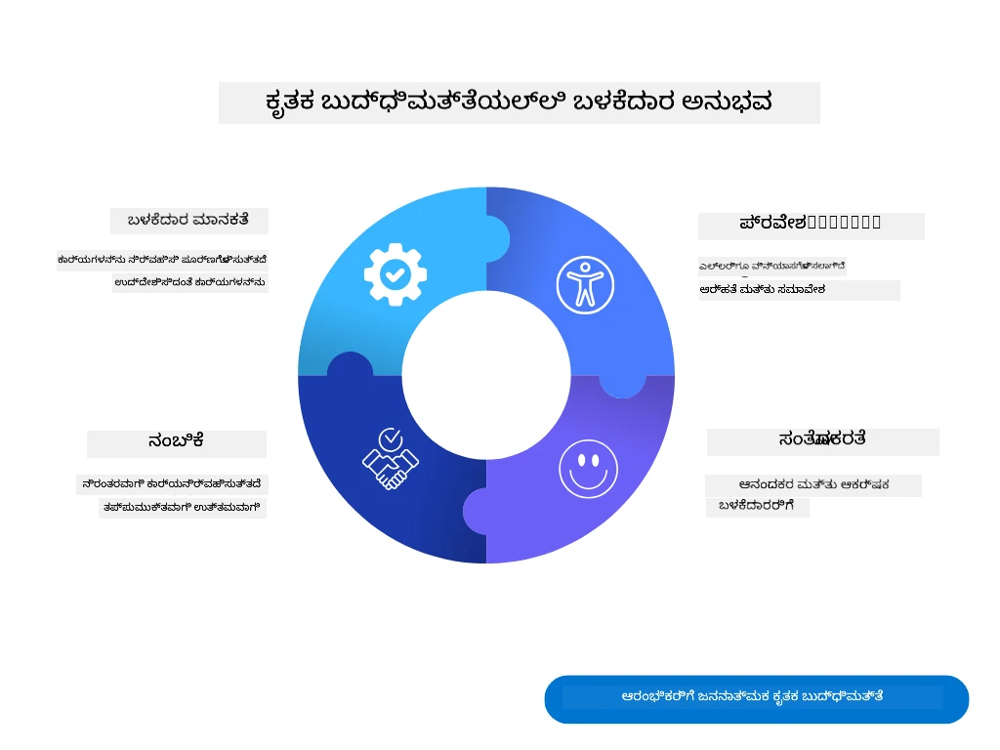
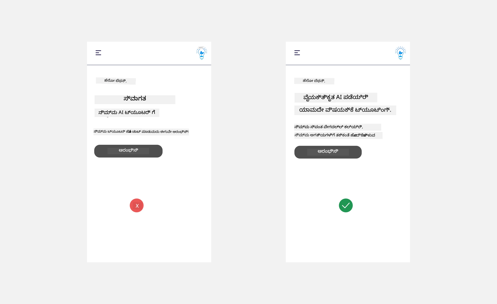
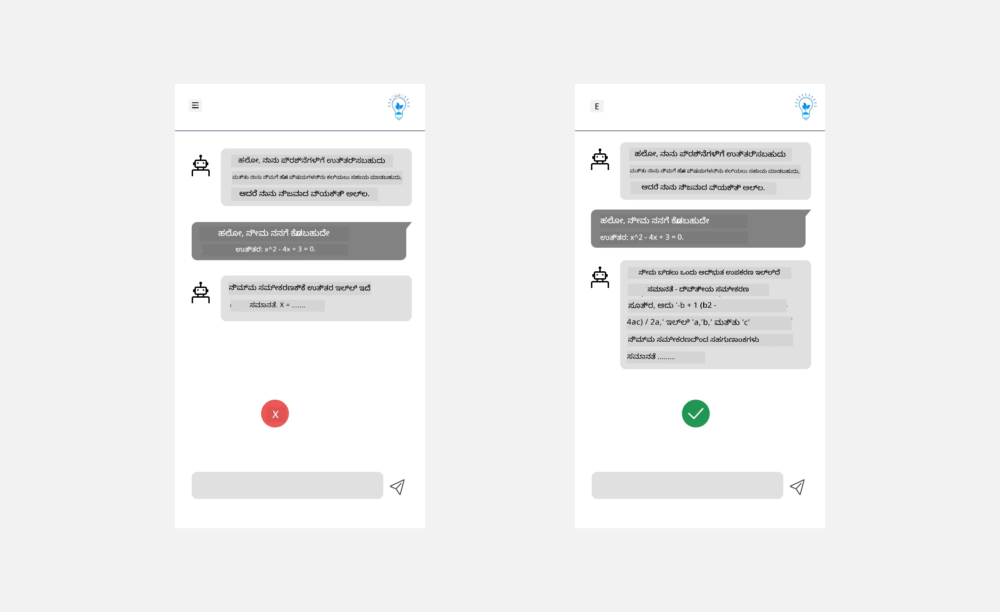
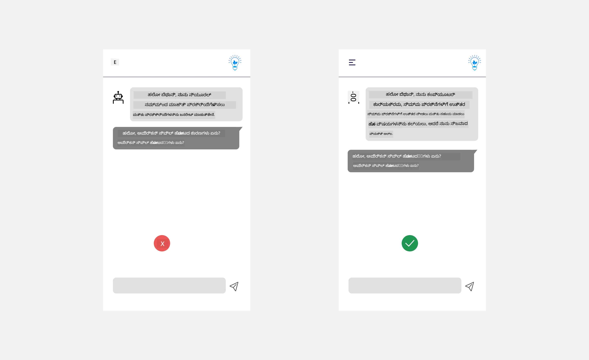
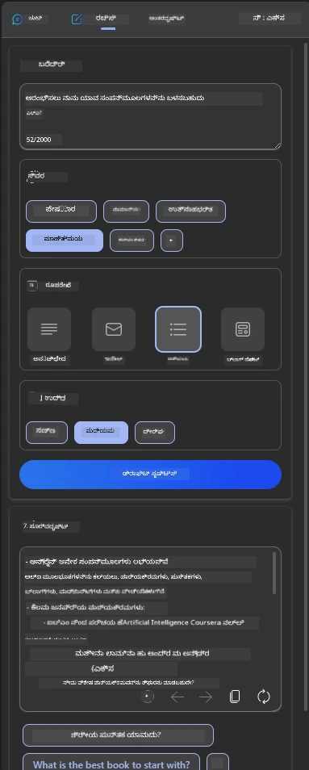
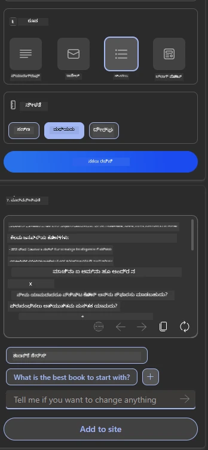
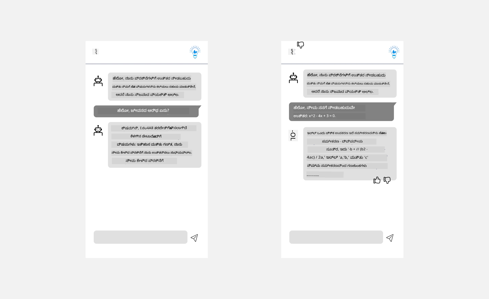

# AI ಅಪ್ಲಿಕೇಶನ್‌ಗಳಿಗಾಗಿ UX ವಿನ್ಯಾಸ

> _(ಈ ಪಾಠದ ವೀಡಿಯೋವನ್ನು ನೋಡಲು ಮೇಲಿನ ಚಿತ್ರವನ್ನು ಕ್ಲಿಕ್ ಮಾಡಿ)_

ಬಳಕೆದಾರ ಅನುಭವವು ಅಪ್ಲಿಕೇಶನ್‌ಗಳನ್ನು ನಿರ್ಮಿಸುವಲ್ಲಿ ಅತ್ಯಂತ ಪ್ರಮುಖ ಅಂಶವಾಗಿದೆ. ಬಳಕೆದಾರರು ನಿಮ್ಮ ಅಪ್ಲಿಕೇಶನ್ ಅನ್ನು ಕಾರ್ಯಗಳನ್ನು ನಿರ್ವಹಿಸಲು ಪರಿಣಾಮಕಾರಿಯಾಗಿ ಬಳಸಲು ಸಾಧ್ಯವಾಗಬೇಕು. ಪರಿಣಾಮಕಾರಿಯಾಗಿ ಇರುವುದೇ ಒಂದು ವಿಷಯ ಆದರೆ ನೀವು ಅಪ್ಲಿಕೇಶನ್‌ಗಳನ್ನು ಎಲ್ಲರೂ ಬಳಸಬಹುದಾದಂತೆ, ಅಂದರೆ _ಪ್ರವೇಶಿಸಬಹುದಾದಂತೆ_ ವಿನ್ಯಾಸಗೊಳಿಸಬೇಕಾಗುತ್ತದೆ. ಈ ಅಧ್ಯಾಯವು ಈ ಕ್ಷೇತ್ರದ ಮೇಲೆ ಕೇಂದ್ರೀಕರಿಸುತ್ತದೆ, ಆದ್ದರಿಂದ ನೀವು ಜನರು ಬಳಸಬಹುದಾದ ಮತ್ತು ಬಳಸಲು ಇಚ್ಛಿಸುವ ಅಪ್ಲಿಕೇಶನ್ ವಿನ್ಯಾಸಗೊಳಿಸುವಿರಿ ಎಂದು ಆಶಿಸುತ್ತೇವೆ.

## ಪರಿಚಯ

ಬಳಕೆದಾರ ಅನುಭವ ಎಂದರೆ ಬಳಕೆದಾರರು ನಿರ್ದಿಷ್ಟ ಉತ್ಪನ್ನ ಅಥವಾ ಸೇವೆಯನ್ನು ಹೇಗೆ ಸಂವಹನ ಮಾಡುತ್ತಾರೆ ಮತ್ತು ಬಳಸುತ್ತಾರೆ ಎಂಬುದು, ಅದು ವ್ಯವಸ್ಥೆ, ಸಾಧನ ಅಥವಾ ವಿನ್ಯಾಸವಾಗಿರಬಹುದು. AI ಅಪ್ಲಿಕೇಶನ್‌ಗಳನ್ನು ಅಭಿವೃದ್ಧಿಪಡಿಸುವಾಗ, ಅಭಿವೃದ್ಧಿಪಡಿಸುವವರು ಬಳಕೆದಾರ ಅನುಭವ ಪರಿಣಾಮಕಾರಿಯಾಗಿರಬೇಕು ಮಾತ್ರವಲ್ಲದೆ ನೈತಿಕವಾಗಿರಬೇಕು ಎಂಬುದರ ಮೇಲೂ ಗಮನ ಹರಿಸುತ್ತಾರೆ. ಈ ಪಾಠದಲ್ಲಿ, ಬಳಕೆದಾರರ ಅಗತ್ಯಗಳನ್ನು ಪೂರೈಸುವ ಕೃತಕ ಬುದ್ಧಿಮತ್ತೆ (AI) ಅಪ್ಲಿಕೇಶನ್‌ಗಳನ್ನು ಹೇಗೆ ನಿರ್ಮಿಸುವುದು ಎಂಬುದನ್ನು ನಾವು ಚರ್ಚಿಸುತ್ತೇವೆ.

ಈ ಪಾಠದಲ್ಲಿ ಕೆಳಗಿನ ವಿಷಯಗಳನ್ನು ಒಳಗೊಂಡಿದೆ:

- ಬಳಕೆದಾರ ಅನುಭವ ಮತ್ತು ಬಳಕೆದಾರ ಅಗತ್ಯಗಳನ್ನು ಅರ್ಥಮಾಡಿಕೊಳ್ಳುವುದು
- ನಂಬಿಕೆ ಮತ್ತು ಪಾರದರ್ಶಕತೆಗಾಗಿ AI ಅಪ್ಲಿಕೇಶನ್‌ಗಳ ವಿನ್ಯಾಸ
- ಸಹಕಾರ ಮತ್ತು ಪ್ರತಿಕ್ರಿಯೆಗಾಗಿ AI ಅಪ್ಲಿಕೇಶನ್‌ಗಳ ವಿನ್ಯಾಸ

## ಕಲಿಕೆಯ ಗುರಿಗಳು

ಈ ಪಾಠವನ್ನು ತೆಗೆದುಕೊಂಡ ನಂತರ, ನೀವು ಸಾಧ್ಯವಾಗುವುದು:

- ಬಳಕೆದಾರರ ಅಗತ್ಯಗಳನ್ನು ಪೂರೈಸುವ AI ಅಪ್ಲಿಕೇಶನ್‌ಗಳನ್ನು ನಿರ್ಮಿಸುವುದನ್ನು ಅರ್ಥಮಾಡಿಕೊಳ್ಳುವುದು.
- ನಂಬಿಕೆ ಮತ್ತು ಸಹಕಾರವನ್ನು ಉತ್ತೇಜಿಸುವ AI ಅಪ್ಲಿಕೇಶನ್‌ಗಳನ್ನು ವಿನ್ಯಾಸಗೊಳಿಸುವುದು.

### ಪೂರ್ವಾಪೇಕ್ಷಿತ

ಕೆಲವು ಸಮಯ ತೆಗೆದು [ಬಳಕೆದಾರ ಅನುಭವ ಮತ್ತು ವಿನ್ಯಾಸ ಚಿಂತನೆ](https://learn.microsoft.com/training/modules/ux-design?WT.mc_id=academic-105485-koreyst) ಬಗ್ಗೆ ಹೆಚ್ಚು ಓದಿ.

## ಬಳಕೆದಾರ ಅನುಭವ ಮತ್ತು ಬಳಕೆದಾರ ಅಗತ್ಯಗಳನ್ನು ಅರ್ಥಮಾಡಿಕೊಳ್ಳುವುದು

ನಮ್ಮ ಕಲ್ಪಿತ ಶಿಕ್ಷಣ ಸ್ಟಾರ್ಟ್ಅಪ್‌ನಲ್ಲಿ, ನಮಗೆ ಎರಡು ಪ್ರಮುಖ ಬಳಕೆದಾರರು ಇದ್ದಾರೆ, ಶಿಕ್ಷಕರು ಮತ್ತು ವಿದ್ಯಾರ್ಥಿಗಳು. ಈ ಎರಡು ಬಳಕೆದಾರರಿಗೂ ವಿಭಿನ್ನ ಅಗತ್ಯಗಳಿವೆ. ಬಳಕೆದಾರ-ಕೇಂದ್ರಿತ ವಿನ್ಯಾಸವು ಬಳಕೆದಾರರನ್ನು ಪ್ರಾಥಮ್ಯ ನೀಡುತ್ತದೆ, ಉತ್ಪನ್ನಗಳು ಅವುಗಳಿಗೆ ಉದ್ದೇಶಿಸಲ್ಪಟ್ಟವರಿಗೆ ಸಂಬಂಧಿಸಿದ ಮತ್ತು ಲಾಭದಾಯಕವಾಗಿರುತ್ತವೆ ಎಂದು ಖಚಿತಪಡಿಸುತ್ತದೆ.

ಅಪ್ಲಿಕೇಶನ್ **ಉಪಯುಕ್ತ, ನಂಬಿಗಸ್ತ, ಪ್ರವೇಶಿಸಬಹುದಾದ ಮತ್ತು ಆನಂದಕರ** ಆಗಿರಬೇಕು ಉತ್ತಮ ಬಳಕೆದಾರ ಅನುಭವವನ್ನು ಒದಗಿಸಲು.

### ಉಪಯುಕ್ತತೆ

ಉಪಯುಕ್ತವಾಗಿರುವುದು ಎಂದರೆ ಅಪ್ಲಿಕೇಶನ್ ಅದರ ಉದ್ದೇಶಿತ ಉದ್ದೇಶಕ್ಕೆ ಹೊಂದಿಕೆಯಾಗುವ ಕಾರ್ಯಕ್ಷಮತೆಯನ್ನು ಹೊಂದಿರಬೇಕು, ಉದಾಹರಣೆಗೆ ಗ್ರೇಡಿಂಗ್ ಪ್ರಕ್ರಿಯೆಯನ್ನು ಸ್ವಯಂಚಾಲಿತಗೊಳಿಸುವುದು ಅಥವಾ ಪುನರಾವೃತ್ತಿಗಾಗಿ ಫ್ಲಾಶ್‌ಕಾರ್ಡ್‌ಗಳನ್ನು ರಚಿಸುವುದು. ಗ್ರೇಡಿಂಗ್ ಪ್ರಕ್ರಿಯೆಯನ್ನು ಸ್ವಯಂಚಾಲಿತಗೊಳಿಸುವ ಅಪ್ಲಿಕೇಶನ್ ಪೂರ್ವನಿರ್ಧರಿತ ಮಾನದಂಡಗಳ ಆಧಾರದ ಮೇಲೆ ವಿದ್ಯಾರ್ಥಿಗಳ ಕೆಲಸಕ್ಕೆ ಸರಿಯಾದ ಮತ್ತು ಪರಿಣಾಮಕಾರಿಯಾದ ಅಂಕಗಳನ್ನು ನೀಡಲು ಸಾಧ್ಯವಾಗಬೇಕು. ಅದೇ ರೀತಿ, ಪುನರಾವೃತ್ತಿ ಫ್ಲಾಶ್‌ಕಾರ್ಡ್‌ಗಳನ್ನು ರಚಿಸುವ ಅಪ್ಲಿಕೇಶನ್ ಅದರ ಡೇಟಾದ ಆಧಾರದ ಮೇಲೆ ಸಂಬಂಧಿತ ಮತ್ತು ವೈವಿಧ್ಯಮಯ ಪ್ರಶ್ನೆಗಳನ್ನು ರಚಿಸಲು ಸಾಧ್ಯವಾಗಬೇಕು.

### ನಂಬಿಗಸ್ತತೆ

ನಂಬಿಗಸ್ತವಾಗಿರುವುದು ಎಂದರೆ ಅಪ್ಲಿಕೇಶನ್ ತನ್ನ ಕಾರ್ಯವನ್ನು ನಿರಂತರವಾಗಿ ಮತ್ತು ದೋಷರಹಿತವಾಗಿ ನಿರ್ವಹಿಸಬಹುದು ಎಂಬುದಾಗಿದೆ. ಆದರೆ, AI ಮಾನವರಂತೆ ಪರಿಪೂರ್ಣವಲ್ಲ ಮತ್ತು ದೋಷಗಳಿಗೆ ಒಳಗಾಗಬಹುದು. ಅಪ್ಲಿಕೇಶನ್‌ಗಳು ದೋಷಗಳು ಅಥವಾ ಅನಿರೀಕ್ಷಿತ ಪರಿಸ್ಥಿತಿಗಳನ್ನು ಎದುರಿಸಬಹುದು, ಅವುಗಳಿಗೆ ಮಾನವ ಹಸ್ತಕ್ಷೇಪ ಅಥವಾ ಸರಿಪಡಿಸುವಿಕೆ ಅಗತ್ಯವಿರಬಹುದು. ನೀವು ದೋಷಗಳನ್ನು ಹೇಗೆ ನಿರ್ವಹಿಸುತ್ತೀರಿ? ಈ ಪಾಠದ ಕೊನೆಯ ಭಾಗದಲ್ಲಿ, AI ವ್ಯವಸ್ಥೆಗಳು ಮತ್ತು ಅಪ್ಲಿಕೇಶನ್‌ಗಳು ಸಹಕಾರ ಮತ್ತು ಪ್ರತಿಕ್ರಿಯೆಗಾಗಿ ಹೇಗೆ ವಿನ್ಯಾಸಗೊಳಿಸಲ್ಪಟ್ಟಿವೆ ಎಂಬುದನ್ನು ನಾವು ಚರ್ಚಿಸುವೆವು.

### ಪ್ರವೇಶಿಸಬಹುದಾದಿಕೆ

ಪ್ರವೇಶಿಸಬಹುದಾದಿಕೆ ಎಂದರೆ ವಿವಿಧ ಸಾಮರ್ಥ್ಯಗಳ ಬಳಕೆದಾರರಿಗೆ, ಅಂಗವಿಕಲತೆ ಹೊಂದಿರುವವರನ್ನು ಸಹ ಸೇರಿಸಿ, ಬಳಕೆದಾರ ಅನುಭವವನ್ನು ವಿಸ್ತರಿಸುವುದು, ಯಾರೂ ಹೊರಗೊಳ್ಳದಂತೆ ಖಚಿತಪಡಿಸುವುದು. ಪ್ರವೇಶಿಸಬಹುದಾದಿಕೆ ಮಾರ್ಗಸೂಚಿಗಳು ಮತ್ತು ತತ್ವಗಳನ್ನು ಅನುಸರಿಸುವ ಮೂಲಕ, AI ಪರಿಹಾರಗಳು ಹೆಚ್ಚು ಒಳಗೊಂಡ, ಉಪಯುಕ್ತ ಮತ್ತು ಎಲ್ಲಾ ಬಳಕೆದಾರರಿಗೆ ಲಾಭದಾಯಕವಾಗುತ್ತವೆ.

### ಆನಂದಕರ

ಆನಂದಕರವಾಗಿರುವುದು ಎಂದರೆ ಅಪ್ಲಿಕೇಶನ್ ಬಳಸಲು ಆನಂದಕರವಾಗಿರಬೇಕು. ಆಕರ್ಷಕ ಬಳಕೆದಾರ ಅನುಭವವು ಬಳಕೆದಾರರ ಮೇಲೆ ಧನಾತ್ಮಕ ಪರಿಣಾಮ ಬೀರಬಹುದು, ಅವರನ್ನು ಅಪ್ಲಿಕೇಶನ್‌ಗೆ ಮರಳಲು ಪ್ರೇರೇಪಿಸುತ್ತದೆ ಮತ್ತು ವ್ಯವಹಾರದ ಆದಾಯವನ್ನು ಹೆಚ್ಚಿಸುತ್ತದೆ.

ಎಲ್ಲಾ ಸವಾಲುಗಳನ್ನು AI ಮೂಲಕ ಪರಿಹರಿಸಲಾಗುವುದಿಲ್ಲ. AI ನಿಮ್ಮ ಬಳಕೆದಾರ ಅನುಭವವನ್ನು ಹೆಚ್ಚಿಸಲು ಬರುತ್ತದೆ, ಅದು ಕೈಯಿಂದ ಮಾಡುವ ಕಾರ್ಯಗಳನ್ನು ಸ್ವಯಂಚಾಲಿತಗೊಳಿಸುವುದಾಗಿರಬಹುದು ಅಥವಾ ಬಳಕೆದಾರ ಅನುಭವಗಳನ್ನು ವೈಯಕ್ತಿಕಗೊಳಿಸುವುದಾಗಿರಬಹುದು.

## ನಂಬಿಕೆ ಮತ್ತು ಪಾರದರ್ಶಕತೆಗಾಗಿ AI ಅಪ್ಲಿಕೇಶನ್‌ಗಳ ವಿನ್ಯಾಸ

AI ಅಪ್ಲಿಕೇಶನ್‌ಗಳನ್ನು ವಿನ್ಯಾಸಗೊಳಿಸುವಾಗ ನಂಬಿಕೆಯನ್ನು ನಿರ್ಮಿಸುವುದು ಅತ್ಯಂತ ಮುಖ್ಯ. ನಂಬಿಕೆ ಎಂದರೆ ಬಳಕೆದಾರರು ಅಪ್ಲಿಕೇಶನ್ ಕೆಲಸವನ್ನು ನಿರ್ವಹಿಸುವುದು, ಫಲಿತಾಂಶಗಳನ್ನು ನಿರಂತರವಾಗಿ ನೀಡುವುದು ಮತ್ತು ಫಲಿತಾಂಶಗಳು ಬಳಕೆದಾರರ ಅಗತ್ಯಗಳಿಗೆ ಹೊಂದಿಕೆಯಾಗಿವೆ ಎಂದು ವಿಶ್ವಾಸ ಹೊಂದಿರುವುದು. ಈ ಕ್ಷೇತ್ರದಲ್ಲಿ ಅಪಾಯವು ನಂಬಿಕೆಯ ಕೊರತೆ ಮತ್ತು ಅತಿನಂಬಿಕೆ. ನಂಬಿಕೆಯ ಕೊರತೆ ಎಂದರೆ ಬಳಕೆದಾರರು AI ವ್ಯವಸ್ಥೆಯ ಮೇಲೆ ಸ್ವಲ್ಪ ಅಥವಾ ಯಾವುದೇ ನಂಬಿಕೆ ಹೊಂದಿಲ್ಲ, ಇದರಿಂದ ಬಳಕೆದಾರರು ನಿಮ್ಮ ಅಪ್ಲಿಕೇಶನ್ ಅನ್ನು ತಿರಸ್ಕರಿಸುತ್ತಾರೆ. ಅತಿನಂಬಿಕೆ ಎಂದರೆ ಬಳಕೆದಾರರು AI ವ್ಯವಸ್ಥೆಯ ಸಾಮರ್ಥ್ಯವನ್ನು ಅತಿರೇಕವಾಗಿ ಅಂದಾಜಿಸುತ್ತಾರೆ, ಇದರಿಂದ ಬಳಕೆದಾರರು AI ವ್ಯವಸ್ಥೆಯ ಮೇಲೆ ಹೆಚ್ಚು ನಂಬಿಕೆ ಇಡುತ್ತಾರೆ. ಉದಾಹರಣೆಗೆ, ಸ್ವಯಂಚಾಲಿತ ಗ್ರೇಡಿಂಗ್ ವ್ಯವಸ್ಥೆಯಲ್ಲಿ ಅತಿನಂಬಿಕೆಯ ಸಂದರ್ಭದಲ್ಲಿ ಶಿಕ್ಷಕರು ಕೆಲವು ಪೇಪರ್‌ಗಳನ್ನು ಪರಿಶೀಲಿಸದೆ ಬಿಡಬಹುದು, ಇದರಿಂದ ವಿದ್ಯಾರ್ಥಿಗಳಿಗೆ ಅನ್ಯಾಯಕರ ಅಥವಾ ತಪ್ಪು ಅಂಕಗಳು ನೀಡಬಹುದು ಅಥವಾ ಪ್ರತಿಕ್ರಿಯೆ ಮತ್ತು ಸುಧಾರಣೆಯ ಅವಕಾಶಗಳನ್ನು ತಪ್ಪಿಸಿಕೊಳ್ಳಬಹುದು.

ನಂಬಿಕೆಯನ್ನು ವಿನ್ಯಾಸದ ಕೇಂದ್ರದಲ್ಲಿ ಇರಿಸಲು ಎರಡು ಮಾರ್ಗಗಳು ವಿವರಣೆ ಮತ್ತು ನಿಯಂತ್ರಣ.

### ವಿವರಣೆ

AI ಭವಿಷ್ಯದ ತಲೆಮಾರಿಗೆ ಜ್ಞಾನವನ್ನು ನೀಡುವಂತಹ ನಿರ್ಣಯಗಳನ್ನು ಸಹಾಯ ಮಾಡುವಾಗ, ಶಿಕ್ಷಕರು ಮತ್ತು ಪೋಷಕರು AI ನಿರ್ಣಯಗಳು ಹೇಗೆ ಮಾಡಲ್ಪಡುತ್ತವೆ ಎಂಬುದನ್ನು ಅರ್ಥಮಾಡಿಕೊಳ್ಳುವುದು ಅತ್ಯಂತ ಮುಖ್ಯ. ಇದನ್ನು ವಿವರಣೆ ಎಂದು ಕರೆಯುತ್ತಾರೆ - AI ಅಪ್ಲಿಕೇಶನ್‌ಗಳು ನಿರ್ಣಯಗಳನ್ನು ಹೇಗೆ ಮಾಡುತ್ತವೆ ಎಂಬುದನ್ನು ಅರ್ಥಮಾಡಿಕೊಳ್ಳುವುದು. ವಿವರಣೆಗೆ ವಿನ್ಯಾಸಗೊಳಿಸುವುದು AI ಹೇಗೆ ಫಲಿತಾಂಶಕ್ಕೆ ಬಂದಿತು ಎಂಬುದನ್ನು ಹೈಲೈಟ್ ಮಾಡುವ ವಿವರಗಳನ್ನು ಸೇರಿಸುವುದನ್ನು ಒಳಗೊಂಡಿದೆ. ಪ್ರೇಕ್ಷಕರು ಫಲಿತಾಂಶ AI ಮೂಲಕ ಉತ್ಪಾದಿತವಾಗಿದೆ ಮತ್ತು ಮಾನವರಿಂದ ಅಲ್ಲ ಎಂಬುದನ್ನು ತಿಳಿದುಕೊಳ್ಳಬೇಕು. ಉದಾಹರಣೆಗೆ, "ನಿಮ್ಮ ಟ್ಯೂಟರ್ ಜೊತೆಗೆ ಈಗಲೇ ಚಾಟ್ ಪ್ರಾರಂಭಿಸಿ" ಎಂದು ಹೇಳುವುದರ ಬದಲು "ನಿಮ್ಮ ಅಗತ್ಯಗಳಿಗೆ ಹೊಂದಿಕೊಳ್ಳುವ ಮತ್ತು ನಿಮ್ಮ ವೇಗದಲ್ಲಿ ಕಲಿಯಲು ಸಹಾಯ ಮಾಡುವ AI ಟ್ಯೂಟರ್ ಬಳಸಿ" ಎಂದು ಹೇಳಿ.

ಮತ್ತೊಂದು ಉದಾಹರಣೆ AI ಬಳಕೆದಾರ ಮತ್ತು ವೈಯಕ್ತಿಕ ಡೇಟಾವನ್ನು ಹೇಗೆ ಬಳಸುತ್ತದೆ ಎಂಬುದು. ಉದಾಹರಣೆಗೆ, ವಿದ್ಯಾರ್ಥಿ ವ್ಯಕ್ತಿತ್ವ ಹೊಂದಿರುವ ಬಳಕೆದಾರರಿಗೆ ಅವರ ವ್ಯಕ್ತಿತ್ವದ ಆಧಾರದ ಮೇಲೆ ನಿರ್ಬಂಧಗಳಿರಬಹುದು. AI ಪ್ರಶ್ನೆಗಳಿಗೆ ಉತ್ತರಗಳನ್ನು ಬಹಿರಂಗಪಡಿಸಲು ಸಾಧ್ಯವಿಲ್ಲದಿದ್ದರೂ, ಬಳಕೆದಾರರು ಸಮಸ್ಯೆಯನ್ನು ಹೇಗೆ ಪರಿಹರಿಸಬಹುದು ಎಂಬುದನ್ನು ಯೋಚಿಸಲು ಮಾರ್ಗದರ್ಶನ ನೀಡಬಹುದು.

ವಿವರಣೆಯ ಇನ್ನೊಂದು ಪ್ರಮುಖ ಭಾಗವೆಂದರೆ ವಿವರಣೆಗಳನ್ನು ಸರಳೀಕರಿಸುವುದು. ವಿದ್ಯಾರ್ಥಿಗಳು ಮತ್ತು ಶಿಕ್ಷಕರು AI ತಜ್ಞರಾಗಿರಲಾರರು, ಆದ್ದರಿಂದ ಅಪ್ಲಿಕೇಶನ್ ಏನು ಮಾಡಬಹುದು ಅಥವಾ ಮಾಡಲಾರದು ಎಂಬುದರ ವಿವರಣೆಗಳನ್ನು ಸರಳ ಮತ್ತು ಸುಲಭವಾಗಿ ಅರ್ಥಮಾಡಿಕೊಳ್ಳುವಂತೆ ಮಾಡಬೇಕು.

### ನಿಯಂತ್ರಣ

ಜನರೇಟಿವ್ AI ಬಳಕೆದಾರ ಮತ್ತು AI ನಡುವೆ ಸಹಕಾರವನ್ನು ಸೃಷ್ಟಿಸುತ್ತದೆ, ಉದಾಹರಣೆಗೆ ಬಳಕೆದಾರರು ವಿಭಿನ್ನ ಫಲಿತಾಂಶಗಳಿಗಾಗಿ ಪ್ರಾಂಪ್ಟ್‌ಗಳನ್ನು ಬದಲಾಯಿಸಬಹುದು. ಜೊತೆಗೆ, ಒಂದು ಫಲಿತಾಂಶ ಸೃಷ್ಟಿಯಾದ ನಂತರ, ಬಳಕೆದಾರರು ಫಲಿತಾಂಶಗಳನ್ನು ಬದಲಾಯಿಸಲು ಸಾಧ್ಯವಾಗಬೇಕು, ಇದರಿಂದ ಅವರಿಗೆ ನಿಯಂತ್ರಣದ ಭಾವನೆ ಸಿಗುತ್ತದೆ. ಉದಾಹರಣೆಗೆ, Bing ಬಳಕೆ ಮಾಡುವಾಗ, ನೀವು ನಿಮ್ಮ ಪ್ರಾಂಪ್ಟ್ ಅನ್ನು ಫಾರ್ಮ್ಯಾಟ್, ಟೋನ್ ಮತ್ತು ಉದ್ದದ ಆಧಾರದ ಮೇಲೆ ಹೊಂದಿಸಬಹುದು. ಜೊತೆಗೆ, ನೀವು ನಿಮ್ಮ ಫಲಿತಾಂಶಕ್ಕೆ ಬದಲಾವಣೆಗಳನ್ನು ಸೇರಿಸಿ ಫಲಿತಾಂಶವನ್ನು ಬದಲಾಯಿಸಬಹುದು, ಕೆಳಗಿನಂತೆ:

Bing ನಲ್ಲಿ ಬಳಕೆದಾರರಿಗೆ ಅಪ್ಲಿಕೇಶನ್ ಮೇಲೆ ನಿಯಂತ್ರಣ ನೀಡುವ ಮತ್ತೊಂದು ವೈಶಿಷ್ಟ್ಯವೆಂದರೆ AI ಬಳಸುವ ಡೇಟಾದಲ್ಲಿ ಒಪ್ಪಿಗೆ ಮತ್ತು ನಿರಾಕರಣೆಯ ಆಯ್ಕೆಯನ್ನು ನೀಡುವುದು. ಶಾಲಾ ಅಪ್ಲಿಕೇಶನ್‌ಗಾಗಿ, ವಿದ್ಯಾರ್ಥಿ ತನ್ನ ಟಿಪ್ಪಣಿಗಳನ್ನು ಮತ್ತು ಶಿಕ್ಷಕರ ಸಂಪನ್ಮೂಲಗಳನ್ನು ಪುನರಾವೃತ್ತಿ ವಸ್ತುಗಳಾಗಿ ಬಳಸಲು ಇಚ್ಛಿಸಬಹುದು.

> AI ಅಪ್ಲಿಕೇಶನ್‌ಗಳನ್ನು ವಿನ್ಯಾಸಗೊಳಿಸುವಾಗ, ಬಳಕೆದಾರರು ಅದರ ಸಾಮರ್ಥ್ಯಗಳ ಬಗ್ಗೆ ಅತಿನಂಬಿಕೆ ಇಡದಂತೆ ಉದ್ದೇಶಪೂರ್ವಕತೆಯು ಮುಖ್ಯ. ಇದನ್ನು ಸಾಧಿಸುವ ಒಂದು ಮಾರ್ಗವೆಂದರೆ ಪ್ರಾಂಪ್ಟ್‌ಗಳು ಮತ್ತು ಫಲಿತಾಂಶಗಳ ನಡುವೆ ಅಡ್ಡಿಪಡಿಸುವಿಕೆ ಸೃಷ್ಟಿಸುವುದು. ಬಳಕೆದಾರರಿಗೆ ಇದು AI ಮತ್ತು ಮಾನವ ಅಲ್ಲ ಎಂದು ನೆನಪಿಸುವುದು.

## ಸಹಕಾರ ಮತ್ತು ಪ್ರತಿಕ್ರಿಯೆಗಾಗಿ AI ಅಪ್ಲಿಕೇಶನ್‌ಗಳ ವಿನ್ಯಾಸ

ಹಿಂದೆ ಹೇಳಿದಂತೆ, ಜನರೇಟಿವ್ AI ಬಳಕೆದಾರ ಮತ್ತು AI ನಡುವೆ ಸಹಕಾರವನ್ನು ಸೃಷ್ಟಿಸುತ್ತದೆ. ಬಹುತೇಕ ಸಂವಹನಗಳು ಬಳಕೆದಾರರು ಪ್ರಾಂಪ್ಟ್ ಅನ್ನು ನಮೂದಿಸುವುದು ಮತ್ತು AI ಫಲಿತಾಂಶವನ್ನು ಸೃಷ್ಟಿಸುವುದಾಗಿದೆ. ಫಲಿತಾಂಶ ತಪ್ಪಿದ್ದರೆ ಏನು? ಅಪ್ಲಿಕೇಶನ್ ದೋಷಗಳನ್ನು ಹೇಗೆ ನಿರ್ವಹಿಸುತ್ತದೆ? AI ಬಳಕೆದಾರರನ್ನು ದೋಷಕ್ಕೆ ಕಾರಣವನ್ನಾಗಿ ಮಾಡುತ್ತದೆಯೇ ಅಥವಾ ದೋಷವನ್ನು ವಿವರಿಸಲು ಸಮಯ ತೆಗೆದುಕೊಳ್ಳುತ್ತದೆಯೇ?

AI ಅಪ್ಲಿಕೇಶನ್‌ಗಳು ಪ್ರತಿಕ್ರಿಯೆ ಸ್ವೀಕರಿಸಲು ಮತ್ತು ನೀಡಲು ನಿರ್ಮಿಸಲ್ಪಡಬೇಕು. ಇದು AI ವ್ಯವಸ್ಥೆಯನ್ನು ಸುಧಾರಿಸಲು ಮಾತ್ರವಲ್ಲದೆ ಬಳಕೆದಾರರೊಂದಿಗೆ ನಂಬಿಕೆಯನ್ನು ನಿರ್ಮಿಸಲು ಸಹಾಯ ಮಾಡುತ್ತದೆ. ವಿನ್ಯಾಸದಲ್ಲಿ ಪ್ರತಿಕ್ರಿಯೆ ಲೂಪ್ ಸೇರಿಸಬೇಕು, ಉದಾಹರಣೆಗೆ ಫಲಿತಾಂಶದ ಮೇಲೆ ಸರಳವಾದ 👍 ಅಥವಾ 👎.

ಇನ್ನೊಂದು ಮಾರ್ಗವೆಂದರೆ ವ್ಯವಸ್ಥೆಯ ಸಾಮರ್ಥ್ಯಗಳು ಮತ್ತು ನಿರ್ಬಂಧಗಳನ್ನು ಸ್ಪಷ್ಟವಾಗಿ ಸಂವಹನ ಮಾಡುವುದು. ಬಳಕೆದಾರರು AI ಸಾಮರ್ಥ್ಯಗಳ ಹೊರಗಿನ ಏನನ್ನಾದರೂ ಕೇಳಿದಾಗ, ಇದನ್ನು ನಿರ್ವಹಿಸುವ ಮಾರ್ಗವೂ ಇರಬೇಕು, ಕೆಳಗಿನಂತೆ.

ಸಿಸ್ಟಮ್ ದೋಷಗಳು ಸಾಮಾನ್ಯವಾಗಿವೆ, ಉದಾಹರಣೆಗೆ ಬಳಕೆದಾರರು AI ವ್ಯಾಪ್ತಿಯ ಹೊರಗಿನ ಮಾಹಿತಿಗೆ ಸಹಾಯ ಬೇಕಾಗಬಹುದು ಅಥವಾ ಅಪ್ಲಿಕೇಶನ್ ಬಳಕೆದಾರರು ಎಷ್ಟು ಪ್ರಶ್ನೆಗಳು/ವಿಷಯಗಳ ಸಾರಾಂಶಗಳನ್ನು ರಚಿಸಬಹುದು ಎಂಬುದಕ್ಕೆ ಮಿತಿ ಇರಬಹುದು. ಉದಾಹರಣೆಗೆ, ಇತಿಹಾಸ ಮತ್ತು ಗಣಿತ ವಿಷಯಗಳ ಡೇಟಾ ಬಳಸಿ ತರಬೇತಿಗೊಂಡ AI ಅಪ್ಲಿಕೇಶನ್ ಭೂಗೋಳಶಾಸ್ತ್ರದ ಪ್ರಶ್ನೆಗಳನ್ನು ನಿರ್ವಹಿಸಲು ಸಾಧ್ಯವಿಲ್ಲ. ಇದನ್ನು ತಡೆಯಲು, AI ವ್ಯವಸ್ಥೆ ಈ ರೀತಿಯಾಗಿ ಪ್ರತಿಕ್ರಿಯಿಸಬಹುದು: "ಕ್ಷಮಿಸಿ, ನಮ್ಮ ಉತ್ಪನ್ನವನ್ನು ಕೆಳಗಿನ ವಿಷಯಗಳ ಡೇಟಾ ಬಳಸಿ ತರಬೇತಿಗೊಂಡಿದೆ....., ನೀವು ಕೇಳಿದ ಪ್ರಶ್ನೆಗೆ ನಾನು ಉತ್ತರಿಸಲು ಸಾಧ್ಯವಿಲ್ಲ."

AI ಅಪ್ಲಿಕೇಶನ್‌ಗಳು ಪರಿಪೂರ್ಣವಲ್ಲ, ಆದ್ದರಿಂದ ಅವು ತಪ್ಪುಗಳನ್ನು ಮಾಡಬಹುದು. ನಿಮ್ಮ ಅಪ್ಲಿಕೇಶನ್‌ಗಳನ್ನು ವಿನ್ಯಾಸಗೊಳಿಸುವಾಗ, ಬಳಕೆದಾರರಿಂದ ಪ್ರತಿಕ್ರಿಯೆ ಮತ್ತು ದೋಷ ನಿರ್ವಹಣೆಗೆ ಸ್ಥಳವನ್ನು ಸೃಷ್ಟಿಸುವುದನ್ನು ಖಚಿತಪಡಿಸಿಕೊಳ್ಳಿ, ಅದು ಸರಳ ಮತ್ತು ಸುಲಭವಾಗಿ ವಿವರಿಸಬಹುದಾದ ರೀತಿಯಲ್ಲಿ ಇರಬೇಕು.

## ಕಾರ್ಯ

ನೀವು ಈಗಾಗಲೇ ನಿರ್ಮಿಸಿರುವ ಯಾವುದೇ AI ಅಪ್ಲಿಕೇಶನ್‌ಗಳನ್ನು ತೆಗೆದುಕೊಂಡು, ಕೆಳಗಿನ ಹಂತಗಳನ್ನು ನಿಮ್ಮ ಅಪ್ಲಿಕೇಶನ್‌ನಲ್ಲಿ ಅನುಷ್ಠಾನಗೊಳಿಸುವುದನ್ನು ಪರಿಗಣಿಸಿ:

- **ಆನಂದಕರ:** ನಿಮ್ಮ ಅಪ್ಲಿಕೇಶನ್ ಅನ್ನು ಹೇಗೆ ಹೆಚ್ಚು ಆನಂದಕರವಾಗಿಸಬಹುದು ಎಂದು ಪರಿಗಣಿಸಿ. ನೀವು ಎಲ್ಲೆಡೆ ವಿವರಣೆಗಳನ್ನು ಸೇರಿಸುತ್ತಿದ್ದೀರಾ? ನೀವು ಬಳಕೆದಾರರನ್ನು ಅನ್ವೇಷಿಸಲು ಪ್ರೋತ್ಸಾಹಿಸುತ್ತಿದ್ದೀರಾ? ನಿಮ್ಮ ದೋಷ ಸಂದೇಶಗಳನ್ನು ನೀವು ಹೇಗೆ ಬರೆಯುತ್ತಿದ್ದೀರಾ?

- **ಉಪಯುಕ್ತತೆ:** ವೆಬ್ ಅಪ್ಲಿಕೇಶನ್ ನಿರ್ಮಿಸುತ್ತಿದ್ದೀರಾ. ನಿಮ್ಮ ಅಪ್ಲಿಕೇಶನ್ ಅನ್ನು ಮೌಸ್ ಮತ್ತು ಕೀಬೋರ್ಡ್ ಎರಡರಿಂದಲೂ ನ್ಯಾವಿಗೇಟ್ ಮಾಡಬಹುದಾಗಿರಲಿ.

- **ನಂಬಿಕೆ ಮತ್ತು ಪಾರದರ್ಶಕತೆ:** AI ಮತ್ತು ಅದರ ಫಲಿತಾಂಶವನ್ನು ಸಂಪೂರ್ಣವಾಗಿ ನಂಬಬೇಡಿ, ಫಲಿತಾಂಶವನ್ನು ಪರಿಶೀಲಿಸಲು ಮಾನವನನ್ನು ಸೇರಿಸುವುದನ್ನು ಪರಿಗಣಿಸಿ. ಜೊತೆಗೆ, ನಂಬಿಕೆ ಮತ್ತು ಪಾರದರ್ಶಕತೆಯನ್ನು ಸಾಧಿಸುವ ಇತರ ಮಾರ್ಗಗಳನ್ನು ಪರಿಗಣಿಸಿ ಮತ್ತು ಅನುಷ್ಠಾನಗೊಳಿಸಿ.

- **ನಿಯಂತ್ರಣ:** ಬಳಕೆದಾರರು ಅಪ್ಲಿಕೇಶನ್‌ಗೆ ನೀಡುವ ಡೇಟಾದ ನಿಯಂತ್ರಣವನ್ನು ನೀಡಿ. AI ಅಪ್ಲಿಕೇಶನ್‌ನಲ್ಲಿ ಡೇಟಾ ಸಂಗ್ರಹಣೆಗೆ ಬಳಕೆದಾರರು ಒಪ್ಪಿಕೊಳ್ಳಲು ಮತ್ತು ನಿರಾಕರಿಸಲು ಸಾಧ್ಯವಾಗುವ ಮಾರ್ಗವನ್ನು ಅನುಷ್ಠಾನಗೊಳಿಸಿ.

<!-- ## [ಪಾಠದ ನಂತರದ ಪ್ರಶ್ನೋತ್ತರ](../../../12-designing-ux-for-ai-applications/quiz-url) -->

## ನಿಮ್ಮ ಕಲಿಕೆಯನ್ನು ಮುಂದುವರೆಸಿ!

ಈ ಪಾಠವನ್ನು ಪೂರ್ಣಗೊಳಿಸಿದ ನಂತರ, ನಮ್ಮ [ಜನರೇಟಿವ್ AI ಕಲಿಕೆ ಸಂಗ್ರಹ](https://aka.ms/genai-collection?WT.mc_id=academic-105485-koreyst) ಅನ್ನು ಪರಿಶೀಲಿಸಿ ಮತ್ತು ನಿಮ್ಮ ಜನರೇಟಿವ್ AI ಜ್ಞಾನವನ್ನು ಮತ್ತಷ್ಟು ಹೆಚ್ಚಿಸಿ!

ಪಾಠ 13ಕ್ಕೆ ಹೋಗಿ, ಅಲ್ಲಿ ನಾವು [AI ಅಪ್ಲಿಕೇಶನ್‌ಗಳನ್ನು ಸುರಕ್ಷಿತಗೊಳಿಸುವುದನ್ನು](../13-securing-ai-applications/README.md?WT.mc_id=academic-105485-koreyst) ನೋಡೋಣ!

---

<!-- CO-OP TRANSLATOR DISCLAIMER START -->
**ಅಸ್ವೀಕರಣ**:  
ಈ ದಸ್ತಾವೇಜು AI ಅನುವಾದ ಸೇವೆ [Co-op Translator](https://github.com/Azure/co-op-translator) ಬಳಸಿ ಅನುವಾದಿಸಲಾಗಿದೆ. ನಾವು ನಿಖರತೆಯಿಗಾಗಿ ಪ್ರಯತ್ನಿಸುತ್ತಿದ್ದರೂ, ಸ್ವಯಂಚಾಲಿತ ಅನುವಾದಗಳಲ್ಲಿ ದೋಷಗಳು ಅಥವಾ ತಪ್ಪುಗಳು ಇರಬಹುದು ಎಂದು ದಯವಿಟ್ಟು ಗಮನಿಸಿ. ಮೂಲ ಭಾಷೆಯಲ್ಲಿರುವ ಮೂಲ ದಸ್ತಾವೇಜನ್ನು ಅಧಿಕೃತ ಮೂಲವಾಗಿ ಪರಿಗಣಿಸಬೇಕು. ಮಹತ್ವದ ಮಾಹಿತಿಗಾಗಿ, ವೃತ್ತಿಪರ ಮಾನವ ಅನುವಾದವನ್ನು ಶಿಫಾರಸು ಮಾಡಲಾಗುತ್ತದೆ. ಈ ಅನುವಾದ ಬಳಕೆಯಿಂದ ಉಂಟಾಗುವ ಯಾವುದೇ ತಪ್ಪು ಅರ್ಥಮಾಡಿಕೊಳ್ಳುವಿಕೆ ಅಥವಾ ತಪ್ಪು ವಿವರಣೆಗಳಿಗೆ ನಾವು ಹೊಣೆಗಾರರಾಗುವುದಿಲ್ಲ.
<!-- CO-OP TRANSLATOR DISCLAIMER END -->