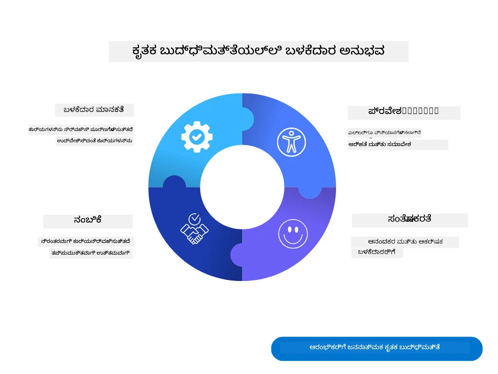
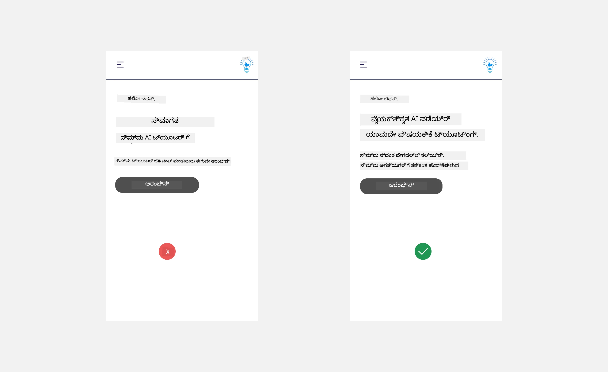
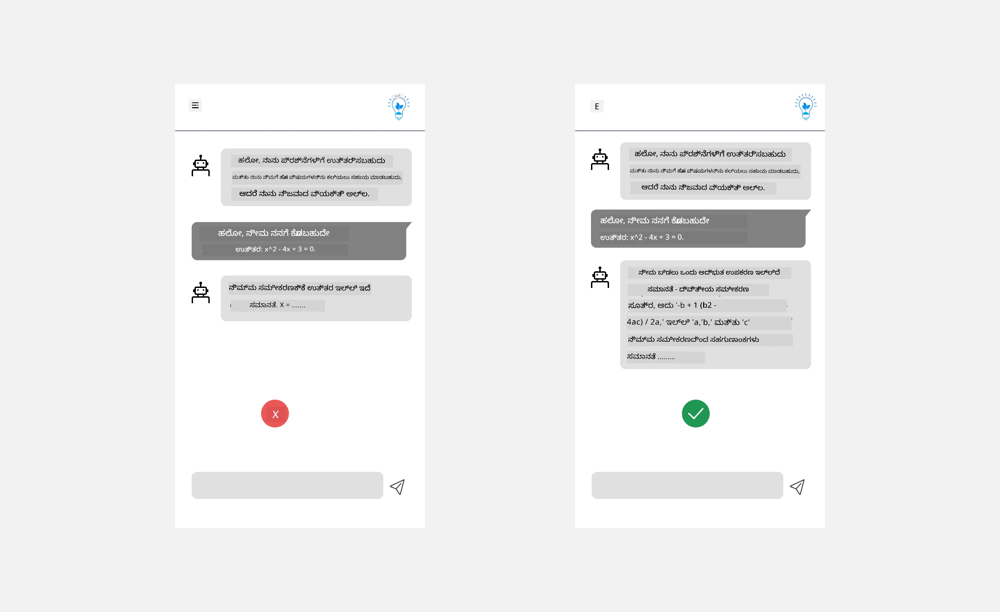
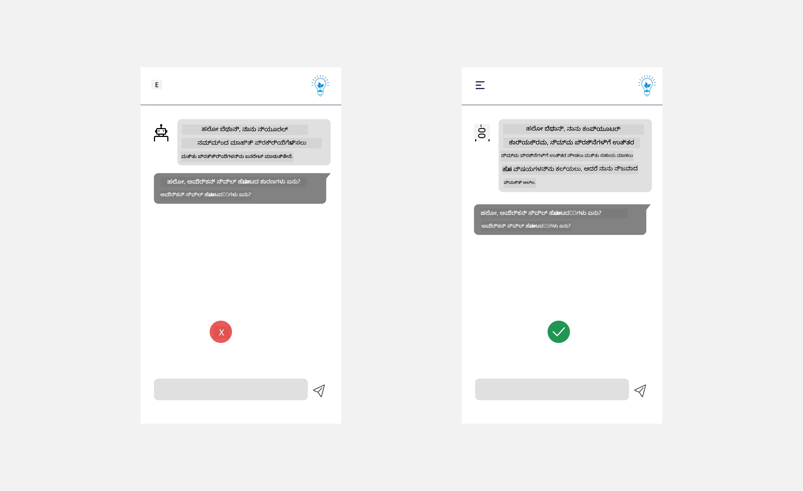
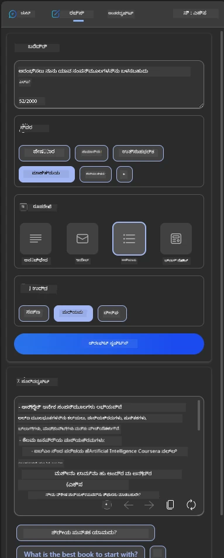
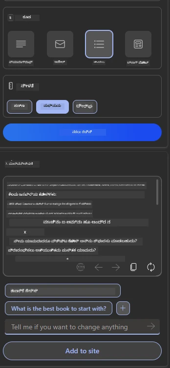
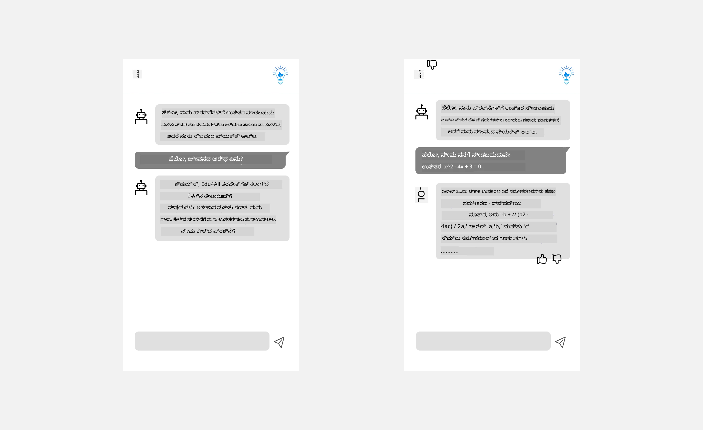

# AI ಅಪ್ಲಿಕೇಶನ್‌ಗಳಿಗೆ UX ವಿನ್ಯಾಸಗೊಳಿಸುವುದು

> _(ಈ ಪಾಠದ ವಿಡಿಯೋ ನೋಡಲು ಸೂರ್ಯಗುರುತಿನ ಮೇಲೆ ಕ್ಲಿಕ್ ಮಾಡಿ)_

ಬಳಕೆದಾರ ಅನುಭವವು ಆ್ಯಪ್ಗಳು ನಿರ್ಮಿಸುವಾಗ ಬಹಳ ಮುಖ್ಯ ಅಂಶವಾಗಿದೆ. ಬಳಕೆದಾರರು ತಮ್ಮ ಕಾರ್ಯಗಳನ್ನು ನಿರ್ವಹಿಸಲು ನಿಮ್ಮ ಆ್ಯಪನ್ನು ಪರಿಣಾಮಕಾರಿಯಾಗಿ ಬಳಸಿಬಲ್ಲಿರಬೇಕು. ಪರಿಣಾಮಕಾರಿಯಾಗಿದ್ದು ಮಾತ್ರವಲ್ಲದೆ, ಆ್ಯಪ್ಗಳನ್ನು ಎಲ್ಲರೂ ಬಳಸಬಹುದಾಗಿ ವಿನ್ಯಾಸಗೊಳಿಸುವುದು, ಅಂದರೆ ಅವುಗಳನ್ನು _ಪ್ರವೇಶಿಸಬಲ್ಲ ಹಾಗೆ_ ಮಾಡುವುದು ಮುಖ್ಯ. ಈ ಅಧ್ಯಾಯವು ಈ ಕ್ಷೇತ್ರಕ್ಕೆ ಗಮನಹರಿಸುವ ಮೂಲಕ ನೀವು ಜನರು ಬಳಸಲು ಇಚ್ಛಿಸುವ ಮತ್ತು ಬಳಸಬಲ್ಲ ಆ್ಯಪ್ ವಿನ್ಯಾಸಗೊಳಿಸುವಂತೆ ಸಹಾಯ ಮಾಡುತ್ತದೆ.

## ಪರಿಚಯ

ಬಳಕೆದಾರ ಅನುಭವವೆಂದರೆ ವ್ಯಕ್ತಿಯೊಬ್ಬನು نظام, ಸಾಧನ ಅಥವಾ ವಿನ್ಯಾಸವಾಗಿರಲಿ ನಿರ್ದಿಷ್ಟ ಉತ್ಪನ್ನ ಅಥವಾ ಸೇವೆಯನ್ನು ಹೇಗೆ ಇಂಟರ್‌ಅಕ್ಟ್ ಮಾಡುತ್ತಾನೆ ಮತ್ತು ಬಳಸುತ್ತಾನೆ ಎಂಬುದು. AI ಅಪ್ಲಿಕೇಶನ್‌ಗಳನ್ನು ಅಭಿವೃದ್ಧಿಪಡಿಸುವಾಗ, ಡೆವಲಪರ್‌ಗಳು ಬಳಕೆದಾರ ಅನುಭವ ಪರಿಣಾಮಕಾರಿಯಾಗಿಯೇ ಅಲ್ಲದೆ ನೈತಿಕವಾಗಿಯೂ ಇರಬೇಕು ಎಂದು ಗಮನಿಸುತ್ತಾರೆ. ಈ ಪಾಠದಲ್ಲಿ ನಾವು ಬಳಕೆದಾರರ ಅಗತ್ಯಗಳನ್ನು ಪೂರೈಸುವ ಆರ್ಟಿಫಿಶಿಯಲ್ ಇಂಟೆಲಿಜೆನ್ಸ್ (AI) ಅಪ್ಲಿಕೇಶನ್‌ಗಳನ್ನು ನಿರ್ಮಿಸುವ ಬಗ್ಗೆ ಚರ್ಚಿಸುತ್ತೇವೆ.

ಈ ಪಾಠವು ಕೆಳಗಿನ ಕ್ಷೇತ್ರಗಳನ್ನು ಅವಲೋಕನ ಮಾಡುತ್ತದೆ:

- ಬಳಕೆದಾರ ಅನುಭವ ಮತ್ತು ಬಳಕೆದಾರರ ಅಗತ್ಯಗಳನ್ನು ಅರಿತಿಕೊಳ್ಳುವ ಪರಿಚಯ
- ನಂಬಿಕೆ ಮತ್ತು ಪಾರದರ್ಶಕತೆಯಿಗಾಗಿ AI ಅಪ್ಲಿಕೇಶನ್‌ಗಳನ್ನು ವಿನ್ಯಾಸಗೊಳಿಸುವುದು
- ಸಹಕಾರ ಮತ್ತು ಪ್ರತಿಕ್ರಿಯೆಗೆ AI ಅಪ್ಲಿಕೇಶನ್‌ಗಳನ್ನು ವಿನ್ಯಾಸಗೊಳಿಸುವುದು

## ಕಲಿಕೆ ಗುರಿಗಳು

ಈ ಪಾಠವನ್ನು ಮುಗಿಸಿದ ನಂತರ, ನೀವು ಈ ಕೆಳಕಂಡವುಗಳನ್ನು ಮಾಡಬಹುದಾಗಿರುತ್ತೀರಿ:

- ಬಳಕೆದಾರರ ಅಗತ್ಯಗಳನ್ನು ಪೂರೈಸುವ AI ಅಪ್ಲಿಕೇಶನ್‌ಗಳನ್ನು ಹೇಗೆ ನಿರ್ಮಿಸಲು ಎಂದು ತಿಳಿದುಕೊಳ್ಳುವುದು.
- ನಂಬಿಕೆ ಮತ್ತು ಸಹಕಾರವನ್ನು ಉತ್ತೇಜಿಸುವ AI ಅಪ್ಲಿಕೇಶನ್‌ಗಳನ್ನು ವಿನ್ಯಾಸಗೊಳಿಸುವುದು.

### ಪೂರ್ವಾಪೇಕ್ಷಿತ

[ಬಳಕೆದಾರ ಅನುಭವ ಮತ್ತು ವಿನ್ಯಾಸ ಚಿಂತನೆ ಬಗ್ಗೆ ಇನ್ನಷ್ಟು ಓದಿ.](https://learn.microsoft.com/training/modules/ux-design?WT.mc_id=academic-105485-koreyst)

## ಬಳಕೆದಾರ ಅನುಭವ ಹಾಗೂ ಬಳಕೆದಾರರ ಅಗತ್ಯಗಳನ್ನು ಅರಿತಿಕೊಳ್ಳುವ ಪರಿಚಯ

ನಮ್ಮ ಕಲ್ಪನಾತ್ಮಕ ವಿದ್ಯಾ ಸ್ಟಾರ್ಟ್‌ಅಪ್‌ನಲ್ಲಿ, ಎರಡು ಪ್ರಮುಖ ಬಳಕೆದಾರರು ಇದ್ದಾರೆ: ಶಿಕ್ಷಕರು ಮತ್ತು ವಿದ್ಯಾರ್ಥಿಗಳು. ಪ್ರತಿಯೊಬ್ಬ ಬಳಕೆದಾರರ ಬೆಲೆಬರಹ ಬೇರೆಬೇರೆ ಅಗತ್ಯಗಳಿವೆ. ಬಳಕೆದಾರ ಕೇಂದ್ರಿತ ವಿನ್ಯಾಸವು ಬಳಕೆದಾರನಿಗೇ ಆದ್ಯತೆ ನೀಡುತ್ತದೆ, ಆದ್ದರಿಂದ ಉತ್ಪನ್ನಗಳು ಕೋರಿಕೆಯವರಿಗೆ ಸಂಬಂಧಿಸಿದ ಮತ್ತು ಲಾಭದಾಯಕವಾಗಿರುತ್ತವೆ.

ಆ್ಯಪಿನು **ಪ್ರಯೋಜನಕಾರಿಯಾಗಿರಬೇಕು, ವಿಶ್ವಾಸಾರ್ಹವಾಗಿರಬೇಕು, ಪ್ರವೇಶಿಸಬಹುದಾಗಿರಬೇಕು ಮತ್ತು ಆನಂದದಾಯಕವಾಗಿರಬೇಕು** ಎಂಬುದೇ ಒಳ್ಳೆಯ ಬಳಕೆದಾರ ಅನುಭವದ ಸಂಕೇತ.

### ಬಳಕೆ ಸುಗಮತೆ

ಉಪಯುಕ್ತವಾಗಿರುವುದೆಂದರೆ ಆ್ಯಪ್ನು ಅದಕ್ಕೆ ನಿಗದಿಪಡಿಸಿರುವ ಉದ್ದೇಶಕ್ಕೆ ಹೊಂದಿಕೊಂಡ ಕಾರ್ಯನಿರ್ವಹಣೆ ಹೊಂದಿರಬೇಕು, ಉದಾಹರಣೆಗೆ ಮೌಲ್ಯಮಾಪನ ಪ್ರಕ್ರಿಯೆಯನ್ನು ಸುಗಮಗೊಳಿಸುವುದು ಅಥವಾ ಮರುಪರಿಶೀಲನೆಗೆ ಫ್ಲಾಷ್‌ಕಾರ್ಡ್‌ಗಳನ್ನು ಸೃಷ್ಟಿಸುವುದು. ಮೌಲ್ಯಮಾಪನ ಪ್ರಕ್ರಿಯೆಯನ್ನು ಸ್ವಯಂಚಾಲಿತಗೊಳಿಸುವ ಆ್ಯಪ್ ವಿದ್ಯಾರ್ಥಿಗಳ ಕೆಲಸಕ್ಕೆ ಪೂರ್ವನಿರ್ಧರಿತ ಮಾನದಂಡಗಳನ್ನು ಆಧರಿಸಿ ನಿಖರವಾಗಿ ಮತ್ತು ಪರಿಣಾಮಕಾರಿಯಾಗಿ ಅಂಕಗಳನ್ನು ನಿಗದಿಪಡಿಸಬಹುದು. ಅದರಂತೆ, ಮರುಪರಿಶೀಲನೆ ಫ್ಲಾಷ್‌ಕಾರ್ಡ್‌ಗಳನ್ನು ಸೃಷ್ಟಿಸುವ ಆ್ಯಪ್ ತನ್ನ ಡೇಟಾತ್ಮಕ ಆಧಾರದ ಮೇಲೆ ಸಹಸಂಬಂಧಿತ ಮತ್ತು ವಿಭಿನ್ನ ಪ್ರಶ್ನೆಗಳನ್ನು ರಚಿಸಬಲ್ಲದು.

### ವಿಶ್ವಾಸಾರ್ಹತೆ

ವಿಶ್ವಾಸಾರ್ಹವಾಗಿರುವುದು ಅಂದರೆ ಆ್ಯಪ್ ತನ್ನ ಕಾರ್ಯವನ್ನು ಸದಾ ನಿಯಮಿತವಾಗಿ ಮತ್ತು ದೋಷರಹಿತವಾಗಿ ನಿರ್ವಹಿಸಬೇಕು. ಆದಾಗ್ಯೂ, AI ಮಾಂಷಿಕರಂತೆ ಪೂರ್ಣತಃ ಶುದ್ಧವಲ್ಲ ಮತ್ತು ದೋಷಗಳಿಗೆ ಒಳಗಾಗಬಹುದು. ಆ್ಯಪ್ಗಳು ದೋಷಗಳು ಅಥವಾ ಅನಿರೀಕ್ಷಿತ ಪರಿಸ್ಥಿತಿಗಳು ಎದುರಿಸಬಹುದು, ಅಲ್ಲಿ ಮಾನವ ಹಸ್ತಕ್ಷೇಪ ಅಥವಾ ಶೋಧನೆ ಬೇಕಾಗಬಹುದು. ನೀವು ದೋಷಗಳನ್ನು ಹೇಗೆ ನಿರ್ವಹಿಸುತ್ತೀರಿ? ಈ ಪಾಠದ ಕೊನೆಯ ಭಾಗದಲ್ಲಿ, AI ವ್ಯವಸ್ಥೆಗಳು ಮತ್ತು ಆ್ಯಪ್ಗಳು ಸಹಕಾರ ಮತ್ತು ಪ್ರತಿಕ್ರಿಯೆಗಾಗಿ ಹೇಗೆ ವಿನ್ಯಾಸಗೊಳಿಸಲ್ಪಟ್ಟಿವೆ ಎಂಬುದನ್ನು ತಿಳಿಸುತ್ತೇವೆ.

### ಪ್ರವೇಶಿಸಬಹುದಾದತೆ

ಪ್ರವೇಶಿಸಬಹುದಾದತೆ ಅಂದರೆ ವಿಧವೇಳ್ಳು ಮಕ್ಕಳ ಹಕ್ಕು ಇರುವುದು, ಮತ್ತು ಶಕ್ತಿಮಾನದ ಬಳಕೆದಾರರು ಸಹ ಇದ್ದಾರೆ, ಯಾರನ್ನೂ ಹೊರಗೆ ಬಿಡದೆ ಬಳಕೆದಾರ ಅನುಭವವನ್ನು ಎಲ್ಲವೇಳ್ಳು ಪಟ್ಟಿ ಮಾಡುವುದು. ಪ್ರವೇಶ ಮಾರ್ಗದರ್ಶನ ಮತ್ತು ತತ್ವಗಳನ್ನು ಅನುಸರಿಸುವ ಮೂಲಕ, AI ಪರಿಹಾರಗಳು ಎಲ್ಲ ಬಳಕೆದಾರರಿಗೂ ಒಳಗೊಂಡ, ಉಪಯುಕ್ತ ಮತ್ತು ಲಾಭದಾಯಕವಾಗುತ್ತವೆ.

### ಆನಂದದಾಯಕತೆ

ಆನಂದದಾಯಕವಾಗಿರುವುದು ಅಂದರೆ ಆ್ಯಪ್ ಸಹಜವಾಗಿ ಉಪಯೋಗಿಸಲು ಸുഖಕರವಾಗಿರಬೇಕು. ಆಕರ್ಷಕ ಬಳಕೆದಾರ ಅನುಭವವು ಬಳಕೆದಾರರನ್ನು ಆ್ಯಪ್ನಲ್ಲಿ ಮತ್ತೆ ಮತ್ತೆ ಬರುವಂತೆ ಮಾಡುತ್ತದೆ ಮತ್ತು ವ್ಯವಹಾರದ ಆದಾಯವನ್ನು ಹೆಚ್ಚಿಸುತ್ತದೆ.

ಎಲ್ಲಾ ಸವಾಲುಗಳನ್ನು AI ಮೂಲಕ ಪರಿಹರಿಸಲಾಗುವುದಿಲ್ಲ. AI ನಿಮ್ಮ ಬಳಕೆದಾರ ಅನುಭವವನ್ನು ಹೆಚ್ಚಿಸುವ ಗುರಿಯೊಂದಾಗಿದ್ದು, ಅದು ಕೈಗಾರಿಕಾ ಕಾರ್ಯಗಳನ್ನು ಸ್ವಯಂಚಾಲಿತಗೊಳಿಸುವುದು ಅಥವಾ ಬಳಕೆದಾರ ಅನುಭವವನ್ನು ವೈಯಕ್ತಿಕಗೊಳಿಸುವುದಾಗಿರಬಹುದು.

## ನಂಬಿಕೆ ಮತ್ತು ಪಾರದರ್ಶಕತೆಯಿಗಾಗಿ AI ಅಪ್ಲಿಕೇಶನ್‌ಗಳನ್ನು ವಿನ್ಯಾಸಗೊಳಿಸುವುದು

AI ಅಪ್ಲಿಕೇಶನ್‌ಗಳನ್ನು ವಿನ್ಯಾಸಗೊಳಿಸುವಾಗ ನಂಬಿಕೆ ನಿರ್ಮಿಸುವುದು ಬಹಳ ಮುಖ್ಯ. ನಂಬಿಕೆ ಎಂದರೆ ಬಳಕೆದಾರ ಆ ಆ್ಯಪ್ ಕೆಲಸವನ್ನು ಮಾಡಿದೆಯೆ, ಫಲಿತಾಂಶಗಳು ನಿರಂತರವಾಗಿ ನೀಡಲ್ಪಡುವವೆಯೆ ಮತ್ತು ಫಲಿತಾಂಶಗಳು ಬಳಸುವವರ ಅಗತ್ಯಗಳಿಗೆ ಹೊಂದಿಕೆಯಾದವೆಯೆ ಎಂಬ ವಿಶ್ವಾಸ ಹೊಂದಿರಬೇಕು. ಈ ಕ್ಷೇತ್ರದಲ್ಲಿ ಜಾಲಿ ನಂಬಿಕೆ ಮತ್ತು ಮಿಲಿಸುವ ನಂಬಿಕೆ ಎಂಬ ಹಲವು ಅಪಾಯಗಳಿವೆ. ಜಾಲಿ ನಂಬಿಕೆ ಎಂದರೆ ಬಳಕೆದಾರರಿಗೆ AI ವ್ಯವಸ್ಥೆಯ ಮೇಲೆ ಸ್ವಲ್ಪ ಅಥವಾ ಯಾವುದೇ ನಂಬಿಕೆ ಇಲ್ಲದಿರುವುದು, ಹಾಗೂ ಇದು ಆ ಬಳಕೆದಾರರು ನಿಮ್ಮ ಆ್ಯಪ್‌ಗೆ ನಿರಾಕರಣೆ ಮಾಡುವಂತೆ ಮಾಡಬಹುದು. ಮಿಲುವಿನ ನಂಬಿಕೆ ಎಂದರೆ ಬಳಕೆದಾರನು AI ವ್ಯವಸ್ಥೆಯ ಸಾಮರ್ಥ್ಯವನ್ನು ಮಿತಿಗಿಂತ ಹೆಚ್ಚಾಗಿ ಅಂದಾಜಿಸುವುದು, ಇದರಿಂದ ಬಳಕೆದಾರರು AI ವ್ಯವಸ್ಥೆಗೆ ಹೆಚ್ಚು ನಂಬಿಕೆ ಇಡುತ್ತಾರೆ. ಉದಾಹರಣೆಗೆ, ಮಿಲುವಿನ ನಂಬಿಕೆಯ ಸಂದರ್ಭದಲ್ಲಿ ಸ್ವಯಂಚಾಲಿತ ಮೌಲ್ಯಮಾಪನ ವ್ಯವಸ್ಥೆಯು ಶಿಕ್ಷಕರು ಕೆಲವು ನೋಟುಗಳನ್ನು ಪರಿಶೀಲಿಸುವ ಕಾರ್ಯವನ್ನು ತ್ಯಜಿಸುವಂತೆ ಮಾಡುತ್ತದೆ. ಇದರಿಂದ ವಿದ್ಯಾರ್ಥಿಗಳಿಗೆ ಅಸಮತೋಲನದ ಅಥವಾ ತಪ್ಪು ಅಂಕಗಳನ್ನು ನೀಡಬಹುದಾಗಿದೆ; ಅಥವಾ ಪ್ರತಿಕ್ರಿಯೆ ಮತ್ತು ಸುಧಾರಣೆಗೆ ಅವಕಾಶ ತಪ್ಪಿ ಹೋಗಬಹುದು.

ವಿನ್ಯಾಸದಲ್ಲಿ ನಂಬಿಕೆಯನ್ನು ಕೇಂದ್ರದಲ್ಲಿ ಇರಿಸುವ ಎರಡು ಮಾರ್ಗಗಳು ವಿವರಣಶೀಲತೆ ಮತ್ತು ನಿಯಂತ್ರಣ.

### ವಿವರಣಶೀಲತೆ

AI ಸಹಾಯದಿಂದ ನಿರ್ಧಾರಗಳನ್ನು ಕೊಂಡುಕೊಳ್ಳುವಾಗ जैसे ಭವಿಷ್ಯದ ತಲೆಮಾರಿಗೆ ಜ್ಞಾನ ಪೂರೈಸುವ ಕೆಲಸ, ಶಿಕ್ಷಕರು ಮತ್ತು ಪಾಲಕರು AI ನಿರ್ಧಾರಗಳು ಹೇಗೆ ಮಾಡಲ್ಪಡುತ್ತವೆ ಎಂಬುದನ್ನು ಅರ್ಥಮಾಡಿಕೊಳ್ಳುವುದು ಬಹಳ ಅಗತ್ಯ. ಇದನ್ನು ವಿವರಣಶೀಲತೆ ಎಂದು ಕರೆಯಲಾಗುತ್ತದೆ - AI ಅಪ್ಲಿಕೇಶನ್‌ಗಳು ಹೇಗೆ ನಿರ್ಧಾರಗಳನ್ನು ಮಾಡುತ್ತವೆ ಎಂಬ ಅರಿವು. ವಿವರಣಶೀಲತೆಗೆ ವಿನ್ಯಾಸ ಮಾಡಲು AI ಯಾವ ರೀತಿ ಫಲಿತಾಂಶಕ್ಕೆ ಬಂದದ್ದು ಎಂಬ ಮಾಹಿತಿಯನ್ನು ಸೇರಿಸುವುದು ಮುಖ್ಯ. ಪ್ರೇಕ್ಷಕರು ಫಲಿತಾಂಶವನ್ನು AI ಸೃಷ್ಟಿಸಿದದ್ದು ಎಂದು ತಿಳಿದುಕೊಳ್ಳಬೇಕು, ಮಾನವನಿಂದ ಅಲ್ಲ. ಉದಾಹರಣೆಗೆ, "ಈಗಲೇ ನಿಮ್ಮ ಟ್ಯೂಟರ್ ಜೊತೆಗೆ ಚಾಟ್ ಪ್ರಾರಂಭಿಸಿ" ಎಂದು ಹೇಳುವುದಕ್ಕಿಂತ ಬದಲಾಗಿ "ನಿಮ್ಮ ಅಗತ್ಯಗಳಿಗೆ ಹೊಂದಿಕೊಳ್ಳುವ ಮತ್ತು ನಿಮ್ಮ ವೇಗದಲ್ಲಿ ಕಲಿಯಲು ಸಹಾಯ ಮಾಡುವ AI ಟ್ಯೂಟರ್ ಬಳಸಿ" ಎಂದು ಹೇಳುವುದು ಉತ್ತಮ.

ಮತ್ತೊಂದು ಉದಾಹರಣೆ AI ಬಳಕೆದಾರ ಮತ್ತು ವೈಯಕ್ತಿಕ ಡೇಟಾವನ್ನು ಹೇಗೆ ಬಳಸುತ್ತದೆ ಎಂಬುದಾಗಿದೆ. ಉದಾಹರಣೆಗೆ, ವಿದ್ಯಾರ್ಥಿ ಪಾತ್ರದ ಬಳಕೆದಾರರಿಗೆ ಅವರಿಗೆ ಹೊಂದಿಕೊಂಡ ಕೆಲವು ನಿರ್ಬಂಧಗಳಿರಬಹುದು. AI ಪ್ರಶ್ನೆಗಳಿಗೆ ಉತ್ತರಗಳನ್ನು ಬಹಿರಂಗಪಡಿಸುವುದಕ್ಕೆ ಸಾಧ್ಯವಿಲ್ಲದಿದ್ದರೆ ಸಹ, ಬಳಕೆದಾರನಿಗೆ ಸಮಸ್ಯೆಯನ್ನು ಹೇಗೆ ಪರಿಹರಿಸಬಹುದು ಎಂಬುದರಲ್ಲಿ ಮಾರ್ಗದರ್ಶನ ನೀಡಬಹುದು.

ವಿವರಣಶೀಲತೆಯ ಮತ್ತೊಂದು ಪ್ರಮುಖ ಭಾಗವು ವಿವರಣೆಗಳ ಸರಳೀಕರಣವಾಗಿದೆ. ವಿದ್ಯಾರ್ಥಿಗಳು ಮತ್ತು ಶಿಕ್ಷಕರು AI ತಜ್ಞರು ಅಲ್ಲದಿರಬಹುದು, ಆದ್ದರಿಂದ ಆ್ಯಪ್ ಏನು ಮಾಡುತ್ತದೆ ಅಥವಾ ಮಾಡಲಾರದು ಎಂಬ ವಿವರಣೆ ಸರಳವಾಗಿದ್ದು ಅರ್ಥಮಾಡಿಕೊಳ್ಳಲು ಸುಲಭವಾಗಿರಬೇಕು.

### ನಿಯಂತ್ರಣ

ಜನರೆಟಿವ್ AI ಬಳಕೆದಾರ ಮತ್ತು AI ನಡುವೆ ಸಹಕಾರ ನಿರ್ಮಿಸುತ್ತದೆ, ಉದಾಹರಣೆಗೆ, ಬಳಕೆದಾರನು ವಿಭಿನ್ನ ಫಲಿತಾಂಶಗಳಿಗಾಗಿ ಪ್ರಾಂಪ್ಟ್‌ಗಳನ್ನು ಬದಲಾಯಿಸಬಹುದು. ಜೊತೆಗೆ, ಒಮ್ಮೆ ಫಲಿತಾಂಶ ಸೃಷ್ಟಿಯಾದ ಮೇಲೆ, ಬಳಕೆದಾರರು ಅದನ್ನು ಬದಲಾಯಿಸುವಂತಿರಬೇಕು, ಇದರಿಂದ ಅವರಿಗೆ ನಿಯಂತ್ರಣದ ಅನುಭೂತಿ ಸಿಗುತ್ತದೆ. ಉದಾಹರಣೆಗೆ, Microsoft Copilot (ಹಿಂದೆ Bing Chat) ಬಳಸುವಾಗ, ನೀವು ನಿಮ್ಮ ಪ್ರಾಂಪ್ಟ್ ಅನ್ನು ರೂಪ, ಶೈಲಿ ಮತ್ತು ಉದ್ದದ ಆಧಾರದ ಮೇಲೆ ಹೊಂದಿಸಬಹುದು. ಜೊತೆಗೆ, ನೀವು ನಿಮ್ಮ ಫಲಿತಾಂಶಕ್ಕೆ ಬದಲಾವಣೆಗಳನ್ನು ಸೇರಿಸಬಹುದು ಮತ್ತು ಹೀಗೇ ಅವುಗಳನ್ನು ಪರಿಷ್ಕರಿಸಬಹುದು:

Microsoft Copilotನಲ್ಲಿ ಬಳಕೆದಾರರು ಆ್ಯಪ್ ಮೇಲೆ ನಿಯಂತ್ರಣ ನೀಡುವ ಇನ್ನೊಂದು ಸೌಲಭ್ಯವೆಂದರೆ AI ಬಳಕೆ ಮಾಡುವ ಡೇಟಾದಲ್ಲಿ ಪ್ರವೇಶ ಕಲ್ಪಿಸುವುದು ಮತ್ತು ನಿರಾಕರಿಸುವ ಅವಕಾಶ. ಶಾಲಾ ಆ್ಯಪ್‌ನಲ್ಲಿ, ಒಂದು ವಿದ್ಯಾರ್ಥಿ ತನ್ನ ಟಿಪ್ಪಣಿಗಳು ಮತ್ತು ಶಿಕ್ಷಕರ ಸಂಪನ್ಮೂಲಗಳನ್ನು ಮಾರ್ಗದರ್ಶನಾ ವಸ್ತುಗಳಾಗಿ ಬಳಸಬಹುದು.

> AI ಅಪ್ಲಿಕೇಶನ್‌ಗಳನ್ನು ವಿನ್ಯಾಸಗೊಳಿಸುವಾಗ, ಉದ್ದೇಶಿತತೆ ಅತ್ಯಂತ ಮುಖ್ಯವಾಗಿದೆ, ಇದರಿಂದ ಬಳಕೆದಾರರು ಅದರ ಸಾಮರ್ಥ್ಯಗಳ ಬಗ್ಗೆ ಅತಿರಕ್ತ ನಂಬಿಕೆಯನ್ನು ಹೊಂದದೇ ಇರುವುದು ಸಾಧ್ಯ. ಇದಕ್ಕೆ ಒಂದು ಮಾರ್ಗವೆಂದರೆ ಪ್ರಾಂಪ್ಟ್‌ಗಳ ಮತ್ತು ಫಲಿತಾಂಶಗಳ ನಡುವೆ ಕೆಲವೊಂದು ಅಡ್ಡಿಬಂದಿಗಳನ್ನು ಸೃಷ್ಟಿಸುವುದು, ಬಳಕೆದಾರನಿಗೆ ಇದು AI ಮತ್ತು ಮಾನವನಲ್ಲ ಎಂಬುದನ್ನು ನೆನಪಿಸಿಸುವುದು.

## ಸಹಕಾರ ಮತ್ತು ಪ್ರತಿಕ್ರಿಯೆಗೆ AI ಅಪ್ಲಿಕೇಶನ್‌ಗಳು ವಿನ್ಯಾಸಗೊಳಿಸುವುದು

ಮೊದಲೇ ತಿಳಿಸಿದಂತೆ, ಜನರೆಟಿವ್ AI ಬಳಕೆದಾರ ಮತ್ತು AI ನಡುವೆ ಸಹಕಾರ ನಿರ್ಮಿಸುತ್ತದೆ. ಹೆಚ್ಚು ಪ್ರಸಂಗಗಳಲ್ಲಿ ಬಳಕೆದಾರನು ಪ್ರಾಂಪ್ಟ್ ಹಾಕುತ್ತಾನೆ ಮತ್ತು AI ಉತ್ಪನ್ನ ಸೃಷ್ಟಿಸುತ್ತದೆ. ಫಲಿತಾಂಶ ತಪ್ಪಿದ್ದರೆ ಏನು? ದೋಷ ಸಂಭವಿಸಿದರೆ ಆ್ಯಪ್ ಅದನ್ನು ಹೇಗೆ ನಿರ್ವಹಿಸುತ್ತದೆ? AI ಬಳಕೆದಾರನನ್ನು ಎಚ್ಚರಿಸುವುದೆ ಅಥವಾ ದೋಷವನ್ನು ವಿವರಿಸಲು ಸಮಯ ಖರ್ಚು ಮಾಡುತ್ತದೆಯೆ?

AI ಅಪ್ಲಿಕೇಶನ್‌ಗಳು ಪ್ರತಿಕ್ರಿಯೆ ಪಡೆಯುವ ಮತ್ತು ನೀಡುವಂತೆ ನಿರ್ಮಿಸಿರಬೇಕು. ಇದರಿಂದ ಮಾತ್ರವಲ್ಲದೆ AI ವ್ಯವಸ್ಥೆ ಸುಧಾರಣೆಯಾಗುತ್ತದೆ ಮತ್ತು ಬಳಕೆದಾರರೊಂದಿಗೆ ನಂಬಿಕೆ ಹುಟ್ಟುತ್ತದೆ. ವಿನ್ಯಾಸದಲ್ಲಿ ಪ್ರತಿಕ್ರಿಯೆ ಚಕ್ರವನ್ನು ಸೇರಿಸಬೇಕು, ಉದಾಹರಣೆಗೆ ಫಲಿತಾಂಶಗಳ ಮೇಲೆ ಸಿಂಪಲ್ ತೊಳಲೋ ಅಥವಾ ಕೆಳಗೆ ಬಣ್ಣದ ಮೈಲು ಕಟಕಟಿಕೆಯನ್ನು ನೀಡುವ ಪರಿಕಲ್ಪನೆ.

ಮತ್ತೊಂದು ಮಾರ್ಗವೆಂದರೆ ವ್ಯವಸ್ಥೆಯ ಸಾಮರ್ಥ್ಯ ಮತ್ತು ಮಿತಿ ಸ್ಪಷ್ಟವಾಗಿ ಸಂಪರ್ಕಗೊಳಿಸುವುದು. ಬಳಕೆದಾರನು AI ಸಾಮರ್ಥ್ಯಗಳ ಗೋಡೆಯನ್ನಿಂತ ಹೆಚ್ಚಿನ ಬೇಡಿಕೆ ಮಾಡಿದಾಗ ಅದನ್ನು ಹೇಗೆ ಕೈಗೆತ್ತಿಕೊಳ್ಳಬೇಕು ಎಂಬುದರ ನಿಯೋಜನೆ ಇರಬೇಕು, ಕೆಳಗಿನಂತೆ.

ವ್ಯವಸ್ಥೆ ದೋಷಗಳು AI ವ್ಯಾಪ್ತಿಗೆ ಹೊರಗಿನ ಮಾಹಿತಿಯ ಅಗತ್ಯವಾಗುವ ಆ್ಯಪ್‌ಗಳಲ್ಲಿ ಸಾಮಾನ್ಯ. ಉದಾಹರಣೆಗೆ, ಇತಿಹಾಸ ಮತ್ತು ಗಣಿತ ವಿಷಯಗಳಲ್ಲಿ ತರಬೇತಿಗೊಳಿಸಲ್ಪಟ್ಟ AI, ಭೂಗೋಳಶಾಸ್ತ್ರೀಯ ಪ್ರಶ್ನೆಗಳಿಗೆ ಸರಿಯಾಗಿ ಉತ್ತರಿಸದಿರಬಹುದು. ಇದನ್ನು ತಡೆಯಲು, AI ಇಂತಹ ಉತ್ತರ ನೀಡಬಹುದು: "ಕ್ಷಮಿಸಿ, ನಮ್ಮ ಉತ್ಪನ್ನವು ಕೆಳಗಿನ ವಿಷಯಗಳ ಮಿತಿ ಅಗರಿಕೆಯೊಂದಿಗೆ ತರಬೇತಿಗೊಂಡಿದೆ..... ನೀವು ಕೇಳಿದ ಪ್ರಶ್ನೆಗೆ ನಾನು ಉತ್ತರ ನೀಡಲು ಸಾಧ್ಯವಿಲ್ಲ."

AI ಅಪ್ಲಿಕೇಶನ್‌ಗಳು ಶುದ್ದವಿಲ್ಲ, ಆದ್ದರಿಂದ ತಪ್ಪುಗಳಾಗಬಹುದು. ನಿಮ್ಮ ಆ್ಯಪ್ಗಳು ವಿನ್ಯಾಸಗೊಳಿಸುವಾಗ, ಬಳಕೆದಾರರಿಂದ ಪ್ರತಿಕ್ರಿಯೆ ಪಡೆಯಲು ಮತ್ತು ದೋಷ ನಿರ್ವಹಣೆಗೆ ಸರಳವಾಗಿ ಮತ್ತು ಸುಲಭವಾಗಿ ವಿವರಿಸಬಹುದಾದ ಅವಕಾಶವನ್ನು ಒದಗಿಸಬೇಕು.

## ಹವ್ಯಾಸ

ನೀವು ಇದುವರೆಗಿನ ಯಾವುದೇ AI ಆ್ಯಪ್‌ಗಳನ್ನು ತಯಾರಿಸಿದರೆ, ಕೆಳಗಿನ ಹಂತಗಳನ್ನು ನಿಮ್ಮ ಆ್ಯಪ್‌ನಲ್ಲಿ ಜಾರಿಗೆ ತರುವ ಬಗ್ಗೆ ಪರಿಗಣಿಸಿ:

- **ಆನಂದದಾಯಕತೆ:** ನಿಮ್ಮ ಆ್ಯಪ್ ಅನ್ನು ಹೆಚ್ಚು ಆನಂದದಾಯಕ ಮಾಡುವುದು ಹೇಗೆ? ಎಲ್ಲೆಡೆ ನಿರ್ನಯಗಳನ್ನೇ ನೀವು ಸೇರಿಸುತ್ತಿದ್ದೀರಾ? ಬಳಕೆದಾರರನ್ನು ಅನ್ವೇಷಿಸಲು ಪ್ರೋತ್ಸಾಹಿಸುತ್ತಿದ್ದೀರಾ? ನಿಮ್ಮ ದೋಷ ಸಂದೇಶಗಳನ್ನು ನೀವು ಹೇಗೆ ರೂಪಿಸುತ್ತಿದ್ದೀರಿ?

- **ಬಳಕೆ ಸುಗಮತೆ:** ವೆಬ್ ಆ್ಯಪ್ ನಿರ್ಮಿಸುವಾಗ, ನಿಮ್ಮ ಆ್ಯಪ್ ಮೌಸ್ ಮತ್ತು ಕೀಬೋರ್ಡ್ ಎರಡೂ ಮೂಲಕ ನ್ಯಾವಿಗೇಟ್ ಆಗಬಹುದಾಗಿದೆ ಎಂಬುದನ್ನು ಖಚಿತಪಡಿಸಿಕೊಳ್ಳಿ.

- **ನಂಬಿಕೆ ಮತ್ತು ಪಾರದರ್ಶಕತೆ:** AI ಮತ್ತು ಅದರ ಫಲಿತಾಂಶಗಳನ್ನು ಸಂಪೂರ್ಣ ನಂಬಬೇಡಿ, ಫಲಿತಾಂಶ ಪರಿಶೀಲಿಸಲು ಪ್ರಕ್ರಿಯೆಯಲ್ಲಿ ಮಾನವನನ್ನು ಸೇರಿಸುವ ಬಗ್ಗೆ ಪರಿಗಣಿಸಿ. ಜೊತೆಗೆ ನಂಬಿಕೆ ಮತ್ತು ಪಾರದರ್ಶಕತೆಯನ್ನು ಸಾಧಿಸುವ ಇತರ ಮಾರ್ಗಗಳನ್ನು ಪರಿಗಣಿಸಿ ಮತ್ತು ಜಾರಿಗೆ ತರುವುದು.

- **ನಿಯಂತ್ರಣ:** ಬಳಕೆದಾರರಿಗೆ ಅವರು ಆ್ಯಪ್‌ಗೆ ನೀಡುವ ಡೇಟಾ ಮೇಲೆ ನಿಯಂತ್ರಣ ನೀಡಿರಿ. AI ಅಪ್ಲಿಕೇಶನ್‌ನಲ್ಲಿ ಡೇಟಾ ಸಂಗ್ರಹಣೆಗೆ ಬಳಕೆದಾರರು ಒಳಹೊಮ್ಮಲು ಮತ್ತು ಹೊರಹೊಮ್ಮಲು ಅವಕಾಶ ನೀಡುವ ರೀತಿಯನ್ನು ಜಾರಿಗೊಳಿಸಿ.

<!-- ## [ಪಾಠದ-ನಂತರ ಕ್ವಿಜ್](../../../12-designing-ux-for-ai-applications/quiz-url) -->

## ನಿಮ್ಮ ಅಧ್ಯಯನವನ್ನು ಮುಂದುವರೆಸಿ!

ಈ ಪಾಠ ಮುಗಿಸಿದ ನಂತರ, ನಮ್ಮ [ಜನರೆಟಿವ್ AI ಅಧ್ಯಯನ ಸಂಕಲನ](https://aka.ms/genai-collection?WT.mc_id=academic-105485-koreyst) ಪರಿಶೀಲಿಸಿ ಮತ್ತು ನಿಮ್ಮ ಜನರೆಟಿವ್ AI ಜ್ಞಾನವನ್ನು ಇನ್ನಷ್ಟು ಉತ್ತಮಗೊಳಿಸಿ!

ಪಾಠ 13ಕ್ಕೆ ಹೋಗಿ, ಅಲ್ಲಿ ನಾವು [AI ಅಪ್ಲಿಕೇಶನ್‌ಗಳನ್ನು ಸುರಕ್ಷಿತಗೊಳಿಸುವದನ್ನು](../13-securing-ai-applications/README.md?WT.mc_id=academic-105485-koreyst) ನೋಡಲಿದ್ದೇವೆ!

---

<!-- CO-OP TRANSLATOR DISCLAIMER START -->
**ಅಸ್ವೀಕಾರ**:
ಈ ದಸ್ತಾವೇಜು AI ಅನುವಾದ ಸೇವೆ [Co-op Translator](https://github.com/Azure/co-op-translator) ಬಳಸಿ ಅನುವಾದಿಸಲಾಗಿದೆ. ನಾವು ನಿಖರತೆಯನ್ನು ಸಾಧಿಸಲು ಪ್ರಯತ್ನಿಸುತ್ತಿದ್ದರೂ, ದಯವಿಟ್ಟು ಗಮನಿಸಿ, ಸ್ವಯಂಚಾಲಿತ ಅನುವಾದಗಳಲ್ಲಿ ದೋಷಗಳು ಅಥವಾ ಅಸಡ್ಡೆಗಳು ಇರಬಹುದು. ಮೂಲ ಭಾಷೆಯಲ್ಲಿರುವ ಮೂಲ ದಸ್ತಾವೇಜು ಪ್ರಾಮಾಣಿಕ ಮೂಲವೆಂದು ಪರಿಗಣಿಸಬೇಕು. ಪ್ರಮುಖ ಮಾಹಿತಿಗಾಗಿ, ವೃತ್ತಿಪರ ಮಾನವ ಅನುವಾದವನ್ನು ಶಿಫಾರಸು ಮಾಡಲಾಗುತ್ತದೆ. ಈ ಅನುವಾದವನ್ನು ಬಳಸುವ ಮೂಲಕ ಉಂಟಾಗುವ ಯಾವುದೇ ತಪ್ಪು ಅರ್ಥಗಳ ಅಥವಾ ತಪ್ಪು ವ್ಯಾಖ್ಯಾನಗಳ ಬಗ್ಗೆ ನಾವು ಹೊಣೆಗಾರರಲ್ಲ.
<!-- CO-OP TRANSLATOR DISCLAIMER END -->