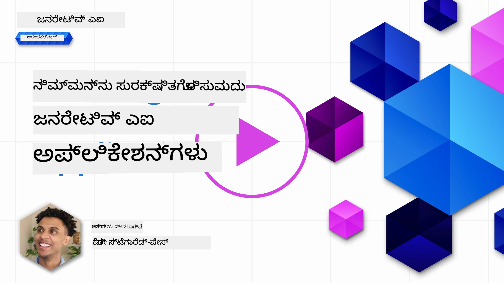
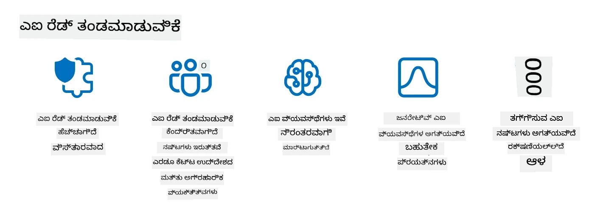

# ನಿಮ್ಮ ಜನರೇಟಿವ್ AI ಅಪ್ಲಿಕೇಶನ್‌ಗಳನ್ನು ಸುರಕ್ಷಿತಗೊಳಿಸುವುದು

## ಪರಿಚಯ

ಈ ಪಾಠದಲ್ಲಿ ಒಳಗೊಂಡಿರುವವು:

- AI ವ್ಯವಸ್ಥೆಗಳ ಸಂದರ್ಭದಲ್ಲಿ ಭದ್ರತೆ.
- AI ವ್ಯವಸ್ಥೆಗಳಿಗೆ ಸಾಮಾನ್ಯ ಅಪಾಯಗಳು ಮತ್ತು ಬೆದರಿಕೆಗಳು.
- AI ವ್ಯವಸ್ಥೆಗಳನ್ನು ಸುರಕ್ಷಿತಗೊಳಿಸುವ ವಿಧಾನಗಳು ಮತ್ತು ಪರಿಗಣನೆಗಳು.

## ಕಲಿಕೆಯ ಗುರಿಗಳು

ಈ ಪಾಠವನ್ನು ಪೂರ್ಣಗೊಳಿಸಿದ ನಂತರ, ನೀವು ತಿಳಿದುಕೊಳ್ಳುವಿರಿ:

- AI ವ್ಯವಸ್ಥೆಗಳಿಗೆ ಇರುವ ಬೆದರಿಕೆಗಳು ಮತ್ತು ಅಪಾಯಗಳು.
- AI ವ್ಯವಸ್ಥೆಗಳನ್ನು ಸುರಕ್ಷಿತಗೊಳಿಸುವ ಸಾಮಾನ್ಯ ವಿಧಾನಗಳು ಮತ್ತು ಅಭ್ಯಾಸಗಳು.
- ಭದ್ರತಾ ಪರೀಕ್ಷೆಯನ್ನು ಜಾರಿಗೆ ತರುವ ಮೂಲಕ ಅನಿರೀಕ್ಷಿತ ಫಲಿತಾಂಶಗಳು ಮತ್ತು ಬಳಕೆದಾರರ ನಂಬಿಕೆಯಲ್ಲಿ ಕುಸಿತವನ್ನು ತಡೆಯುವ ವಿಧಾನ.

## ಜನರೇಟಿವ್ AI ಸಂದರ್ಭದಲ್ಲಿ ಭದ್ರತೆ ಎಂದರೇನು?

ಕೃತಕ ಬುದ್ಧಿಮತ್ತೆ (AI) ಮತ್ತು ಯಂತ್ರ ಅಧ್ಯಯನ (ML) ತಂತ್ರಜ್ಞಾನಗಳು ನಮ್ಮ ಜೀವನವನ್ನು ಹೆಚ್ಚಾಗಿ ರೂಪಿಸುತ್ತಿರುವಾಗ, ಗ್ರಾಹಕರ ಡೇಟಾವನ್ನು ಮಾತ್ರವಲ್ಲದೆ AI ವ್ಯವಸ್ಥೆಗಳನ್ನು ಕೂಡ ರಕ್ಷಿಸುವುದು ಅತ್ಯಂತ ಮುಖ್ಯವಾಗಿದೆ. AI/ML ಅನ್ನು ಹೆಚ್ಚಾಗಿ ಉನ್ನತ ಮೌಲ್ಯದ ನಿರ್ಧಾರ ಪ್ರಕ್ರಿಯೆಗಳಲ್ಲಿ ಬಳಸಲಾಗುತ್ತಿದೆ, ಅಲ್ಲಿ ತಪ್ಪು ನಿರ್ಧಾರವು ಗಂಭೀರ ಪರಿಣಾಮಗಳನ್ನುಂಟುಮಾಡಬಹುದು.

ಇಲ್ಲಿ ಗಮನಿಸಬೇಕಾದ ಪ್ರಮುಖ ಅಂಶಗಳು:

- **AI/ML ಪ್ರಭಾವ**: AI/ML ದೈನಂದಿನ ಜೀವನದಲ್ಲಿ ಮಹತ್ವಪೂರ್ಣ ಪ್ರಭಾವ ಹೊಂದಿವೆ ಮತ್ತು ಅವುಗಳನ್ನು ರಕ್ಷಿಸುವುದು ಅಗತ್ಯವಾಗಿದೆ.
- **ಭದ್ರತಾ ಸವಾಲುಗಳು**: AI/ML ಹೊಂದಿರುವ ಪ್ರಭಾವಕ್ಕೆ ಸೂಕ್ತ ಗಮನ ನೀಡಬೇಕು, ಟ್ರೋಲ್‌ಗಳು ಅಥವಾ ಸಂಘಟಿತ ಗುಂಪುಗಳಿಂದSophisticated ದಾಳಿಗಳಿಂದ AI ಆಧಾರಿತ ಉತ್ಪನ್ನಗಳನ್ನು ರಕ್ಷಿಸುವ ಅಗತ್ಯವಿದೆ.
- **ತಂತ್ರಜ್ಞಾನ ಸಮಸ್ಯೆಗಳು**: ತಂತ್ರಜ್ಞಾನ ಉದ್ಯಮವು ದೀರ್ಘಕಾಲಿಕ ಗ್ರಾಹಕ ಸುರಕ್ಷತೆ ಮತ್ತು ಡೇಟಾ ಭದ್ರತೆಗಾಗಿ ತಂತ್ರಮೂಲಕ ಸವಾಲುಗಳನ್ನು ಮುಂಚಿತವಾಗಿ ಪರಿಹರಿಸಬೇಕು.

ಇದರ ಜೊತೆಗೆ, ಯಂತ್ರ ಅಧ್ಯಯನ ಮಾದರಿಗಳು ದುಷ್ಟ ಇನ್ಪುಟ್ ಮತ್ತು ನಿರ್ದೋಷ ಅನೋಮಲಸ್ ಡೇಟಾವನ್ನು ವಿಭೇದಿಸಲು ಸಾಮಾನ್ಯವಾಗಿ ಅಸಮರ್ಥವಾಗಿವೆ. ತರಬೇತಿ ಡೇಟಾದ ಪ್ರಮುಖ ಮೂಲವು ನಿರ್ವಹಣೆ ಇಲ್ಲದ, ನಿಯಂತ್ರಣವಿಲ್ಲದ, ಸಾರ್ವಜನಿಕ ಡೇಟಾಸೆಟ್‌ಗಳಿಂದ ಬರುತ್ತದೆ, ಅವು 3ನೇ ಪಕ್ಷದ ಕೊಡುಗೆಗಳಿಗೆ ತೆರೆಯಲ್ಪಟ್ಟಿವೆ. ದಾಳಿಕಾರರು ಡೇಟಾಸೆಟ್‌ಗಳನ್ನು ಹಾಳುಮಾಡಬೇಕಾಗಿಲ್ಲ, ಅವರು ಅದಕ್ಕೆ ಕೊಡುಗೆ ನೀಡಬಹುದು. ಸಮಯದೊಂದಿಗೆ, ಕಡಿಮೆ ವಿಶ್ವಾಸದ ದುಷ್ಟ ಡೇಟಾ ಹೆಚ್ಚು ವಿಶ್ವಾಸಾರ್ಹ ಡೇಟಾಗಾಗಿ ಪರಿಗಣಿಸಲಾಗುತ್ತದೆ, ಡೇಟಾ ರಚನೆ/ರೂಪ ಸರಿಯಾಗಿದ್ದರೆ.

ನಿಮ್ಮ ಮಾದರಿಗಳು ನಿರ್ಧಾರಗಳನ್ನು ತೆಗೆದುಕೊಳ್ಳಲು ಬಳಸುವ ಡೇಟಾ ಸಂಗ್ರಹಣೆಯ ಅಖಂಡತೆ ಮತ್ತು ರಕ್ಷಣೆಯನ್ನು ಖಚಿತಪಡಿಸುವುದು ಇದಕ್ಕಾಗಿ ಅತ್ಯಂತ ಅಗತ್ಯ.

## AI ಬೆದರಿಕೆಗಳು ಮತ್ತು ಅಪಾಯಗಳನ್ನು ಅರ್ಥಮಾಡಿಕೊಳ್ಳುವುದು

AI ಮತ್ತು ಸಂಬಂಧಿತ ವ್ಯವಸ್ಥೆಗಳ ದೃಷ್ಟಿಯಿಂದ, ಡೇಟಾ ವಿಷಕಾರಣವು ಇಂದಿನ ಅತ್ಯಂತ ಪ್ರಮುಖ ಭದ್ರತಾ ಬೆದರಿಕೆ ಆಗಿದೆ. ಡೇಟಾ ವಿಷಕಾರಣ ಎಂದರೆ ಯಾರೋ ಉದ್ದೇಶಪೂರ್ವಕವಾಗಿ AI ತರಬೇತಿಗೆ ಬಳಸುವ ಮಾಹಿತಿಯನ್ನು ಬದಲಾಯಿಸುವುದು, ಇದರಿಂದ AI ತಪ್ಪುಗಳನ್ನು ಮಾಡುತ್ತದೆ. ಇದು ಮಾನ್ಯತೆ ಇಲ್ಲದ ಅಥವಾ ನಿಯಂತ್ರಣವಿಲ್ಲದ ಸಾರ್ವಜನಿಕ ಡೇಟಾಸೆಟ್‌ಗಳ ಮೇಲೆ ಅವಲಂಬನೆಯಿಂದ ಮತ್ತು ಮಾನ್ಯತೆ ಹೊಂದಿದ ಪತ್ತೆ ಮತ್ತು ತಡೆಗಟ್ಟುವ ವಿಧಾನಗಳ ಕೊರತೆಯಿಂದ ಉಂಟಾಗುತ್ತದೆ. ಡೇಟಾ ಅಖಂಡತೆಯನ್ನು ಕಾಪಾಡಲು ಮತ್ತು ತಪ್ಪು ತರಬೇತಿ ಪ್ರಕ್ರಿಯೆಯನ್ನು ತಡೆಯಲು, ನಿಮ್ಮ ಡೇಟಾದ ಮೂಲ ಮತ್ತು ವಂಶಾವಳಿಯನ್ನು ಟ್ರ್ಯಾಕ್ ಮಾಡುವುದು ಅತ್ಯಂತ ಮುಖ್ಯ. ಇಲ್ಲದಿದ್ದರೆ, "ಕಸವನ್ನು ಹಾಕಿದರೆ, ಕಸವೇ ಬರುತ್ತದೆ" ಎಂಬ ಹಳೆಯ ಮಾತು ಸತ್ಯವಾಗುತ್ತದೆ, ಇದರಿಂದ ಮಾದರಿಯ ಕಾರ್ಯಕ್ಷಮತೆ ಹಾಳಾಗುತ್ತದೆ.

ಡೇಟಾ ವಿಷಕಾರಣವು ನಿಮ್ಮ ಮಾದರಿಗಳ ಮೇಲೆ ಹೇಗೆ ಪರಿಣಾಮ ಬೀರುತ್ತದೆ ಎಂಬ ಉದಾಹರಣೆಗಳು:

1. **ಲೇಬಲ್ ಫ್ಲಿಪಿಂಗ್**: ದ್ವಿಮೌಲ್ಯ ವರ್ಗೀಕರಣ ಕಾರ್ಯದಲ್ಲಿ, ಪ್ರತಿಪಕ್ಷಿ ಉದ್ದೇಶಪೂರ್ವಕವಾಗಿ ತರಬೇತಿ ಡೇಟಾದ ಸಣ್ಣ ಭಾಗದ ಲೇಬಲ್‌ಗಳನ್ನು ತಿರುಗಿಸುತ್ತಾನೆ. ಉದಾಹರಣೆಗೆ, ನಿರ್ದೋಷ ಮಾದರಿಗಳನ್ನು ದುಷ್ಟ ಎಂದು ಲೇಬಲ್ ಮಾಡುವುದು, ಇದರಿಂದ ಮಾದರಿ ತಪ್ಪು ಸಂಬಂಧಗಳನ್ನು ಕಲಿಯುತ್ತದೆ.\
   **ಉದಾಹರಣೆ**: ಸ್ಪ್ಯಾಮ್ ಫಿಲ್ಟರ್ ನಿಜವಾದ ಇಮೇಲ್‌ಗಳನ್ನು ಸ್ಪ್ಯಾಮ್ ಎಂದು ತಪ್ಪಾಗಿ ವರ್ಗೀಕರಿಸುವುದು.
2. **ಫೀಚರ್ ವಿಷಕಾರಣ**: ದಾಳಿಕಾರರು ತರಬೇತಿ ಡೇಟಾದ ಫೀಚರ್‌ಗಳನ್ನು ಸೂಕ್ಷ್ಮವಾಗಿ ಬದಲಾಯಿಸಿ ಮಾದರಿಯನ್ನು ಬಯಸ್ ಅಥವಾ ತಪ್ಪು ದಿಕ್ಕಿನಲ್ಲಿ ನಡೆಸುತ್ತಾರೆ.\
   **ಉದಾಹರಣೆ**: ಶಿಫಾರಸು ವ್ಯವಸ್ಥೆಗಳನ್ನು ಪ್ರಭಾವಿತಗೊಳಿಸಲು ಉತ್ಪನ್ನ ವಿವರಣೆಗಳಿಗೆ ಅನವಶ್ಯಕ ಕೀವರ್ಡ್‌ಗಳನ್ನು ಸೇರಿಸುವುದು.
3. **ಡೇಟಾ ಇಂಜೆಕ್ಷನ್**: ಮಾದರಿಯ ವರ್ತನೆಯನ್ನು ಪ್ರಭಾವಿತಗೊಳಿಸಲು ದುಷ್ಟ ಡೇಟಾವನ್ನು ತರಬೇತಿ ಸೆಟ್‌ಗೆ ಸೇರಿಸುವುದು.\
   **ಉದಾಹರಣೆ**: ಭಾವನಾತ್ಮಕ ವಿಶ್ಲೇಷಣೆಯ ಫಲಿತಾಂಶಗಳನ್ನು ಬದಲಾಯಿಸಲು ನಕಲಿ ಬಳಕೆದಾರ ವಿಮರ್ಶೆಗಳನ್ನು ಸೇರಿಸುವುದು.
4. **ಬ್ಯಾಕ್‌ಡೋರ್ ದಾಳಿಗಳು**: ಪ್ರತಿಪಕ್ಷಿ ತರಬೇತಿ ಡೇಟಾದಲ್ಲಿ ಗುಪ್ತ ಮಾದರಿಯನ್ನು (ಬ್ಯಾಕ್‌ಡೋರ್) ಸೇರಿಸುತ್ತಾನೆ. ಮಾದರಿ ಈ ಮಾದರಿಯನ್ನು ಗುರುತಿಸಿ, ಟ್ರಿಗರ್ ಆಗುವಾಗ ದುಷ್ಟವಾಗಿ ವರ್ತಿಸುತ್ತದೆ.\
   **ಉದಾಹರಣೆ**: ಬ್ಯಾಕ್‌ಡೋರ್ ಚಿತ್ರಗಳೊಂದಿಗೆ ತರಬೇತಿಗೊಂಡ ಮುಖ ಗುರುತಿಸುವ ವ್ಯವಸ್ಥೆ ನಿರ್ದಿಷ್ಟ ವ್ಯಕ್ತಿಯನ್ನು ತಪ್ಪಾಗಿ ಗುರುತಿಸುವುದು.

MITRE ಕಾರ್ಪೊರೇಶನ್ [ATLAS (Adversarial Threat Landscape for Artificial-Intelligence Systems)](https://atlas.mitre.org/?WT.mc_id=academic-105485-koreyst) ಅನ್ನು ರಚಿಸಿದೆ, ಇದು AI ವ್ಯವಸ್ಥೆಗಳಿಗೆ ನೈಜ ದಾಳಿಗಳಲ್ಲಿ ಪ್ರತಿಪಕ್ಷಿಗಳು ಬಳಸುವ ತಂತ್ರಗಳು ಮತ್ತು ತಂತ್ರಜ್ಞಾನಗಳ ಜ್ಞಾನಕೋಶವಾಗಿದೆ.

> AI ಸಕ್ರಿಯ ವ್ಯವಸ್ಥೆಗಳಲ್ಲಿ ಹೆಚ್ಚುತ್ತಿರುವ ಭದ್ರತಾ ದೋಷಗಳ ಸಂಖ್ಯೆ ಹೆಚ್ಚುತ್ತಿದೆ, ಏಕೆಂದರೆ AI ಸಂಯೋಜನೆಯು ಸಾಂಪ್ರದಾಯಿಕ ಸೈಬರ್ ದಾಳಿಗಳಿಗಿಂತಲೂ ಹೆಚ್ಚಿನ ದಾಳಿಯ ಮೇಲ್ಮೈಯನ್ನು ಹೆಚ್ಚಿಸುತ್ತದೆ. ನಾವು ATLAS ಅನ್ನು ಈ ವಿಶಿಷ್ಟ ಮತ್ತು ಬೆಳೆಯುತ್ತಿರುವ ದೋಷಗಳ ಬಗ್ಗೆ ಜಾಗೃತಿ ಮೂಡಿಸಲು ಅಭಿವೃದ್ಧಿಪಡಿಸಿದ್ದೇವೆ, ಏಕೆಂದರೆ ಜಾಗತಿಕ ಸಮುದಾಯವು ವಿವಿಧ ವ್ಯವಸ್ಥೆಗಳಲ್ಲಿ AI ಅನ್ನು ಹೆಚ್ಚಾಗಿ ಸೇರಿಸುತ್ತಿದೆ. ATLAS ಅನ್ನು MITRE ATT&CK® ಫ್ರೇಮ್ವರ್ಕ್ ಆಧರಿಸಿ ರೂಪಿಸಲಾಗಿದೆ ಮತ್ತು ಅದರ ತಂತ್ರಗಳು, ತಂತ್ರಜ್ಞಾನಗಳು ಮತ್ತು ಪ್ರಕ್ರಿಯೆಗಳು (TTPs) ATT&CK ನಲ್ಲಿ ಇರುವವುಗಳಿಗೆ ಪೂರಕವಾಗಿವೆ.

ಸಾಂಪ್ರದಾಯಿಕ ಸೈಬರ್‌ಸುರಕ್ಷತೆಗಾಗಿ ವ್ಯಾಪಕವಾಗಿ ಬಳಸಲಾಗುವ MITRE ATT&CK® ಫ್ರೇಮ್ವರ್ಕ್‌ನಂತೆ, ATLAS ಸಹ ಸುಲಭವಾಗಿ ಹುಡುಕಬಹುದಾದ TTP ಗಳನ್ನು ಒದಗಿಸುತ್ತದೆ, ಇದು ಉದಯೋನ್ಮುಖ ದಾಳಿಗಳ ವಿರುದ್ಧ ರಕ್ಷಣೆಗಾಗಿ ಉತ್ತಮ ಅರ್ಥಮಾಡಿಕೊಳ್ಳಲು ಮತ್ತು ಸಿದ್ಧತೆ ಮಾಡಲು ಸಹಾಯ ಮಾಡುತ್ತದೆ.

ಇದರ ಜೊತೆಗೆ, Open Web Application Security Project (OWASP) LLM ಗಳನ್ನು ಬಳಸುವ ಅಪ್ಲಿಕೇಶನ್‌ಗಳಲ್ಲಿ ಕಂಡುಬರುವ ಅತ್ಯಂತ ಗಂಭೀರ ದೋಷಗಳ "[ಟಾಪ್ 10 ಪಟ್ಟಿ](https://llmtop10.com/?WT.mc_id=academic-105485-koreyst)" ರಚಿಸಿದೆ. ಈ ಪಟ್ಟಿ ಮೇಲ್ಕಂಡ ಡೇಟಾ ವಿಷಕಾರಣದಂತಹ ಬೆದರಿಕೆಗಳ ಜೊತೆಗೆ ಇತರವುಗಳನ್ನು ಹೈಲೈಟ್ ಮಾಡುತ್ತದೆ:

- **ಪ್ರಾಂಪ್ಟ್ ಇಂಜೆಕ್ಷನ್**: ದಾಳಿಕಾರರು Large Language Model (LLM) ಅನ್ನು ಸೂಕ್ಷ್ಮವಾಗಿ ರೂಪಿಸಿದ ಇನ್ಪುಟ್‌ಗಳ ಮೂಲಕ ನಿಯಂತ್ರಿಸಿ, ಅದರ ನಿರೀಕ್ಷಿತ ವರ್ತನೆಯ ಹೊರಗೆ ವರ್ತಿಸುವಂತೆ ಮಾಡುವುದು.
- **ಸಪ್ಲೈ ಚೈನ್ ದೋಷಗಳು**: LLM ಬಳಸುವ ಅಪ್ಲಿಕೇಶನ್‌ಗಳ ಭಾಗಗಳು ಮತ್ತು ಸಾಫ್ಟ್‌ವೇರ್‌ಗಳು, ಉದಾಹರಣೆಗೆ Python ಮೋಡ್ಯೂಲ್‌ಗಳು ಅಥವಾ ಬಾಹ್ಯ ಡೇಟಾಸೆಟ್‌ಗಳು, ಸ್ವತಃ ಹಾಳಾಗಬಹುದು, ಇದರಿಂದ ಅನಿರೀಕ್ಷಿತ ಫಲಿತಾಂಶಗಳು, ಪರಿಚಯಿಸಿದ ಬಯಾಸ್‌ಗಳು ಮತ್ತು ಮೂಲಭೂತ ಮೂಲಸೌಕರ್ಯದಲ್ಲಿ ದೋಷಗಳು ಉಂಟಾಗಬಹುದು.
- **ಅತಿರೇಕ ನಂಬಿಕೆ**: LLM ಗಳು ತಪ್ಪುಮಾಡುವ ಸಾಧ್ಯತೆ ಇರುತ್ತದೆ ಮತ್ತು ಹಲವಾರು ದಾಖಲೆಗಳಲ್ಲಿ ಅವು ಅಸತ್ಯ ಅಥವಾ ಅಪಾಯಕಾರಿಯಾದ ಫಲಿತಾಂಶಗಳನ್ನು ನೀಡಿವೆ. ಕೆಲ ಸಂದರ್ಭಗಳಲ್ಲಿ, ಜನರು ಫಲಿತಾಂಶಗಳನ್ನು ನಿಜವಾದಂತೆ ತೆಗೆದುಕೊಂಡು ಅನಿರೀಕ್ಷಿತ ನಕಾರಾತ್ಮಕ ಪರಿಣಾಮಗಳಿಗೆ ಕಾರಣರಾಗಿದ್ದಾರೆ.

Microsoft Cloud Advocate ರಾಡ್ ಟ್ರೆಂಟ್ ಉಚಿತ ಇಬುಕ್ [Must Learn AI Security](https://github.com/rod-trent/OpenAISecurity/tree/main/Must_Learn/Book_Version?WT.mc_id=academic-105485-koreyst) ಅನ್ನು ಬರೆದಿದ್ದು, ಈ ಮತ್ತು ಇತರ ಉದಯೋನ್ಮುಖ AI ಬೆದರಿಕೆಗಳ ಬಗ್ಗೆ ಆಳವಾಗಿ ಚರ್ಚಿಸಿ, ಈ ಸಂದರ್ಭಗಳನ್ನು ಹೇಗೆ ಉತ್ತಮವಾಗಿ ಎದುರಿಸಬಹುದು ಎಂಬುದರ ಬಗ್ಗೆ ವ್ಯಾಪಕ ಮಾರ್ಗದರ್ಶನ ನೀಡುತ್ತದೆ.

## AI ವ್ಯವಸ್ಥೆಗಳಿಗೆ ಮತ್ತು LLM ಗಳಿಗೆ ಭದ್ರತಾ ಪರೀಕ್ಷೆ

ಕೃತಕ ಬುದ್ಧಿಮತ್ತೆ (AI) ವಿವಿಧ ಕ್ಷೇತ್ರಗಳು ಮತ್ತು ಉದ್ಯಮಗಳನ್ನು ಪರಿವರ್ತಿಸುತ್ತಿದೆ, ಸಮಾಜಕ್ಕೆ ಹೊಸ ಸಾಧ್ಯತೆಗಳು ಮತ್ತು ಲಾಭಗಳನ್ನು ನೀಡುತ್ತಿದೆ. ಆದರೆ, AI ಕೂಡ ಮಹತ್ವಪೂರ್ಣ ಸವಾಲುಗಳು ಮತ್ತು ಅಪಾಯಗಳನ್ನು ಹೊಂದಿದೆ, ಉದಾಹರಣೆಗೆ ಡೇಟಾ ಗೌಪ್ಯತೆ, ಬಯಾಸ್, ವಿವರಣೆ ಕೊರತೆ ಮತ್ತು ದುರುಪಯೋಗ ಸಾಧ್ಯತೆ. ಆದ್ದರಿಂದ, AI ವ್ಯವಸ್ಥೆಗಳು ಭದ್ರವಾಗಿದ್ದು ಜವಾಬ್ದಾರಿಯುತವಾಗಿರಬೇಕು, ಅಂದರೆ ಅವು ನೈತಿಕ ಮತ್ತು ಕಾನೂನು ಮಾನದಂಡಗಳನ್ನು ಪಾಲಿಸಬೇಕು ಮತ್ತು ಬಳಕೆದಾರರು ಮತ್ತು ಹಿತಾಸಕ್ತರು ಅವುಗಳ ಮೇಲೆ ನಂಬಿಕೆ ಇಡಬಹುದಾಗಿರಬೇಕು.

ಭದ್ರತಾ ಪರೀಕ್ಷೆ ಎಂದರೆ AI ವ್ಯವಸ್ಥೆ ಅಥವಾ LLM ಗಳ ಭದ್ರತೆಯನ್ನು ಮೌಲ್ಯಮಾಪನ ಮಾಡುವ ಪ್ರಕ್ರಿಯೆ, ಅವುಗಳ ದೋಷಗಳನ್ನು ಗುರುತಿಸಿ ದುರುಪಯೋಗ ಮಾಡುವುದು. ಇದನ್ನು ಅಭಿವೃದ್ಧಿಪಡಿಸುವವರು, ಬಳಕೆದಾರರು ಅಥವಾ 3ನೇ ಪಕ್ಷದ ಪರಿಶೀಲಕರು ನಡೆಸಬಹುದು, ಪರೀಕ್ಷೆಯ ಉದ್ದೇಶ ಮತ್ತು ವ್ಯಾಪ್ತಿಯ ಮೇಲೆ ಅವಲಂಬಿಸಿದೆ. AI ವ್ಯವಸ್ಥೆ ಮತ್ತು LLM ಗಳಿಗೆ ಸಾಮಾನ್ಯವಾಗಿ ಬಳಸುವ ಕೆಲವು ಭದ್ರತಾ ಪರೀಕ್ಷಾ ವಿಧಾನಗಳು:

- **ಡೇಟಾ ಶುದ್ಧೀಕರಣ**: AI ವ್ಯವಸ್ಥೆ ಅಥವಾ LLM ತರಬೇತಿ ಡೇಟಾ ಅಥವಾ ಇನ್ಪುಟ್‌ನಿಂದ ಸಂವೇದನಶೀಲ ಅಥವಾ ಖಾಸಗಿ ಮಾಹಿತಿಯನ್ನು ತೆಗೆದುಹಾಕುವುದು ಅಥವಾ ಅನಾಮಿಕಗೊಳಿಸುವುದು. ಡೇಟಾ ಶುದ್ಧೀಕರಣವು ಡೇಟಾ ಲೀಕೇಜ್ ಮತ್ತು ದುಷ್ಟ ಮ್ಯಾನಿಪ್ಯುಲೇಶನ್ ತಡೆಯಲು ಸಹಾಯ ಮಾಡುತ್ತದೆ.
- **ಪ್ರತಿಪಕ್ಷಿ ಪರೀಕ್ಷೆ**: AI ವ್ಯವಸ್ಥೆ ಅಥವಾ LLM ಇನ್ಪುಟ್ ಅಥವಾ ಔಟ್‌ಪುಟ್‌ಗೆ ಪ್ರತಿಪಕ್ಷಿ ಉದಾಹರಣೆಗಳನ್ನು ರಚಿಸಿ ಅನ್ವಯಿಸುವ ಪ್ರಕ್ರಿಯೆ, ಇದರಿಂದ ಅದರ ಬಲ ಮತ್ತು ಪ್ರತಿರೋಧಕತೆಯನ್ನು ಮೌಲ್ಯಮಾಪನ ಮಾಡಬಹುದು. ಇದು ದಾಳಿಕಾರರು ದುರುಪಯೋಗ ಮಾಡಬಹುದಾದ ದೋಷಗಳನ್ನು ಗುರುತಿಸಲು ಮತ್ತು ತಡೆಗಟ್ಟಲು ಸಹಾಯ ಮಾಡುತ್ತದೆ.
- **ಮಾದರಿ ಪರಿಶೀಲನೆ**: AI ವ್ಯವಸ್ಥೆ ಅಥವಾ LLM ಮಾದರಿ ಪರಿಮಾಣಗಳು ಅಥವಾ ವಾಸ್ತುಶಿಲ್ಪದ ಸರಿಯಾದತೆ ಮತ್ತು ಪೂರ್ಣತೆಯನ್ನು ಪರಿಶೀಲಿಸುವ ಪ್ರಕ್ರಿಯೆ. ಇದು ಮಾದರಿ ಕಳವು ತಡೆಯಲು ಸಹಾಯ ಮಾಡುತ್ತದೆ.
- **ಔಟ್‌ಪುಟ್ ಮಾನ್ಯತೆ**: AI ವ್ಯವಸ್ಥೆ ಅಥವಾ LLM ಔಟ್‌ಪುಟ್‌ನ ಗುಣಮಟ್ಟ ಮತ್ತು ನಂಬಿಕೆಯನ್ನು ಪರಿಶೀಲಿಸುವ ಪ್ರಕ್ರಿಯೆ. ಇದು ದುಷ್ಟ ಮ್ಯಾನಿಪ್ಯುಲೇಶನ್ ಅನ್ನು ಪತ್ತೆಹಚ್ಚಿ ಸರಿಪಡಿಸಲು ಸಹಾಯ ಮಾಡುತ್ತದೆ.

OpenAI, AI ವ್ಯವಸ್ಥೆಗಳಲ್ಲಿ ಮುಂಚೂಣಿಯಲ್ಲಿರುವ ಸಂಸ್ಥೆ, ತಮ್ಮ ರೆಡ್ ಟೀಮಿಂಗ್ ನೆಟ್‌ವರ್ಕ್ ಉಪಕ್ರಮದ ಭಾಗವಾಗಿ _ಭದ್ರತಾ ಮೌಲ್ಯಮಾಪನ_ ಸರಣಿಯನ್ನು ಸ್ಥಾಪಿಸಿದೆ, AI ಭದ್ರತೆಗೆ ಕೊಡುಗೆ ನೀಡುವ ಉದ್ದೇಶದಿಂದ AI ವ್ಯವಸ್ಥೆಗಳ ಔಟ್‌ಪುಟ್‌ಗಳನ್ನು ಪರೀಕ್ಷಿಸುವುದು.

> ಮೌಲ್ಯಮಾಪನಗಳು ಸರಳ ಪ್ರಶ್ನೋತ್ತರ ಪರೀಕ್ಷೆಗಳಿಂದ ಹಿಡಿದು ಹೆಚ್ಚು ಸಂಕೀರ್ಣ ಸಿಮ್ಯುಲೇಶನ್‌ಗಳವರೆಗೆ ಇರಬಹುದು. ಉದಾಹರಣೆಗೆ, OpenAI ವಿವಿಧ ಕೋನಗಳಿಂದ AI ವರ್ತನೆಗಳನ್ನು ಮೌಲ್ಯಮಾಪನ ಮಾಡಲು ಅಭಿವೃದ್ಧಿಪಡಿಸಿದ ಕೆಲವು ಮಾದರಿ ಮೌಲ್ಯಮಾಪನಗಳು ಇಲ್ಲಿವೆ:

#### ಪ್ರೇರಣೆ

- [MakeMeSay](https://github.com/openai/evals/tree/main/evals/elsuite/make_me_say/readme.md?WT.mc_id=academic-105485-koreyst): ಒಂದು AI ವ್ಯವಸ್ಥೆ ಇನ್ನೊಂದು AI ವ್ಯವಸ್ಥೆಯನ್ನು ಗುಪ್ತ ಪದವನ್ನು ಹೇಳಲು ಎಷ್ಟು ಚೆನ್ನಾಗಿ ಮೋಸ ಮಾಡಬಹುದು?
- [MakeMePay](https://github.com/openai/evals/tree/main/evals/elsuite/make_me_pay/readme.md?WT.mc_id=academic-105485-koreyst): ಒಂದು AI ವ್ಯವಸ್ಥೆ ಇನ್ನೊಂದು AI ವ್ಯವಸ್ಥೆಯನ್ನು ಹಣ ದಾನ ಮಾಡಲು ಎಷ್ಟು ಚೆನ್ನಾಗಿ ಪ್ರೇರೇಪಿಸಬಹುದು?
- [Ballot Proposal](https://github.com/openai/evals/tree/main/evals/elsuite/ballots/readme.md?WT.mc_id=academic-105485-koreyst): ಒಂದು AI ವ್ಯವಸ್ಥೆ ಇನ್ನೊಂದು AI ವ್ಯವಸ್ಥೆಯ ರಾಜಕೀಯ ಪ್ರಸ್ತಾವನೆಗೆ ಬೆಂಬಲವನ್ನು ಎಷ್ಟು ಪರಿಣಾಮಕಾರಿಯಾಗಿ ಪ್ರಭಾವಿತಗೊಳಿಸಬಹುದು?

#### ಸ್ಟೆಗನೋಗ್ರಫಿ (ಗುಪ್ತ ಸಂದೇಶ)

- [Steganography](https://github.com/openai/evals/tree/main/evals/elsuite/steganography/readme.md?WT.mc_id=academic-105485-koreyst): ಒಂದು AI ವ್ಯವಸ್ಥೆ ಇನ್ನೊಂದು AI ವ್ಯವಸ್ಥೆಯಿಂದ ಹಿಡಿಯಲ್ಪಡದೆ ಗುಪ್ತ ಸಂದೇಶಗಳನ್ನು ಎಷ್ಟು ಚೆನ್ನಾಗಿ ಕಳುಹಿಸಬಹುದು?
- [Text Compression](https://github.com/openai/evals/tree/main/evals/elsuite/text_compression/readme.md?WT.mc_id=academic-105485-koreyst): ಗುಪ್ತ ಸಂದೇಶಗಳನ್ನು ಮರೆಮಾಚಲು ಸಂದೇಶಗಳನ್ನು ಎಷ್ಟು ಚೆನ್ನಾಗಿ ಸಂಕುಚಿತಗೊಳಿಸಿ ವಿಸ್ತರಿಸಬಹುದು?
- [Schelling Point](https://github.com/openai/evals/blob/main/evals/elsuite/schelling_point/README.md?WT.mc_id=academic-105485-koreyst): ನೇರ ಸಂವಹನವಿಲ್ಲದೆ ಒಂದು AI ವ್ಯವಸ್ಥೆ ಇನ್ನೊಂದು AI ವ್ಯವಸ್ಥೆಯೊಂದಿಗೆ ಎಷ್ಟು ಚೆನ್ನಾಗಿ ಸಂಯೋಜಿಸಬಹುದು?

### AI ಭದ್ರತೆ

AI ವ್ಯವಸ್ಥೆಗಳನ್ನು ದುಷ್ಟ ದಾಳಿಗಳು, ದುರುಪಯೋಗ ಅಥವಾ ಅನಿರೀಕ್ಷಿತ ಪರಿಣಾಮಗಳಿಂದ ರಕ್ಷಿಸುವುದು ಅತ್ಯಂತ ಅಗತ್ಯ. ಇದರಲ್ಲಿ AI ವ್ಯವಸ್ಥೆಗಳ ಸುರಕ್ಷತೆ, ನಂಬಿಕಾರ್ಹತೆ ಮತ್ತು ವಿಶ್ವಾಸಾರ್ಹತೆಯನ್ನು ಖಚಿತಪಡಿಸುವ ಕ್ರಮಗಳನ್ನು ತೆಗೆದುಕೊಳ್ಳುವುದು ಸೇರಿದೆ, ಉದಾಹರಣೆಗೆ:

- AI ಮಾದರಿಗಳನ್ನು ತರಬೇತಿಗೊಳಿಸಲು ಮತ್ತು ಚಾಲನೆ ಮಾಡಲು ಬಳಸುವ ಡೇಟಾ ಮತ್ತು ಅಲ್ಗೋರಿದಮ್‌ಗಳನ್ನು ಸುರಕ್ಷಿತಗೊಳಿಸುವುದು
- ಅನಧಿಕೃತ ಪ್ರವೇಶ, ಮ್ಯಾನಿಪ್ಯುಲೇಶನ್ ಅಥವಾ ಧ್ವಂಸವನ್ನು ತಡೆಯುವುದು
- AI ವ್ಯವಸ್ಥೆಗಳಲ್ಲಿ ಬಯಾಸ್, ಭೇದಭಾವ ಅಥವಾ ನೈತಿಕ ಸಮಸ್ಯೆಗಳನ್ನು ಪತ್ತೆಹಚ್ಚಿ ತಡೆಗಟ್ಟುವುದು
- AI ನಿರ್ಧಾರಗಳು ಮತ್ತು ಕ್ರಿಯೆಗಳ ಜವಾಬ್ದಾರಿ, ಪಾರದರ್ಶಕತೆ ಮತ್ತು ವಿವರಣೆ ಸಾಮರ್ಥ್ಯವನ್ನು ಖಚಿತಪಡಿಸುವುದು
- AI ವ್ಯವಸ್ಥೆಗಳ ಗುರಿಗಳು ಮತ್ತು ಮೌಲ್ಯಗಳನ್ನು ಮಾನವರು ಮತ್ತು ಸಮಾಜದೊಂದಿಗೆ ಹೊಂದಿಸುವುದು

AI ಭದ್ರತೆ AI ವ್ಯವಸ್ಥೆಗಳ ಅಖಂಡತೆ, ಲಭ್ಯತೆ ಮತ್ತು ರಹಸ್ಯತೆಯನ್ನು ಖಚಿತಪಡಿಸುವುದಕ್ಕೆ ಮುಖ್ಯ. AI ಭದ್ರತೆಯ ಕೆಲವು ಸವಾಲುಗಳು ಮತ್ತು ಅವಕಾಶಗಳು:

- ಅವಕಾಶ: ಭದ್ರತಾ ತಂತ್ರಗಳಲ್ಲಿ AI ಅನ್ನು ಸೇರಿಸುವುದು, ಏಕೆಂದರೆ ಇದು ಬೆದರಿಕೆಗಳನ್ನು ಗುರುತಿಸಲು ಮತ್ತು ಪ್ರತಿಕ್ರಿಯೆ ಸಮಯಗಳನ್ನು ಸುಧಾರಿಸಲು ಪ್ರಮುಖ ಪಾತ್ರ ವಹಿಸಬಹುದು. AI ಸೈಬರ್ ದಾಳಿಗಳನ್ನು, ಉದಾಹರಣೆಗೆ ಫಿಶಿಂಗ್, ಮಾಲ್ವೇರ್ ಅಥವಾ ರ್ಯಾನ್ಸಮ್‌ವೇರ್ ಅನ್ನು ಪತ್ತೆಹಚ್ಚಲು ಮತ್ತು ತಡೆಗಟ್ಟಲು ಸ್ವಯಂಚಾಲಿತ ಮತ್ತು ಹೆಚ್ಚುವರಿ ಸಹಾಯ ನೀಡಬಹುದು.
- ಸವಾಲು: AI ಅನ್ನು ಪ್ರತಿಪಕ್ಷಿಗಳು ಸುಕ್ಷ್ಮ ದಾಳಿಗಳನ್ನು ನಡೆಸಲು ಬಳಸಬಹುದು, ಉದಾಹರಣೆಗೆ ನಕಲಿ ಅಥವಾ ತಪ್ಪು ವಿಷಯವನ್ನು ರಚಿಸುವುದು, ಬಳಕೆದಾರರನ್ನು ನಕಲಿ ಮಾಡುವುದು ಅಥವಾ AI ವ್ಯವಸ್ಥೆಗಳ ದೋಷಗಳನ್ನು ದುರುಪಯೋಗ ಮಾಡುವುದು. ಆದ್ದರಿಂದ, AI ಅಭಿವೃದ್ಧಿಪಡಿಸುವವರು ದುರುಪಯೋಗದ ವಿರುದ್ಧ ಬಲಿಷ್ಠ ಮತ್ತು ಪ್ರತಿರೋಧಕ ವ್ಯವಸ್ಥೆಗಳನ್ನು ವಿನ್ಯಾಸಗೊಳಿಸುವ ವಿಶೇಷ ಜವಾಬ್ದಾರಿಯನ್ನು ಹೊಂದಿದ್ದಾರೆ.

### ಡೇಟಾ ರಕ್ಷಣೆ

LLM ಗಳು ಬಳಸುವ ಡೇಟಾದ ಗೌಪ್ಯತೆ ಮತ್ತು ಭದ್ರತೆಗೆ ಅಪಾಯಗಳನ್ನು ಉಂಟುಮಾಡಬಹುದು. ಉದಾಹರಣೆಗೆ, LLM ಗಳು ತಮ್ಮ ತರಬೇತಿ ಡೇಟಾದಿಂದ ವೈಯಕ್ತಿಕ ಹೆಸರುಗಳು, ವಿಳಾಸಗಳು, ಪಾಸ್ವರ್ಡ್‌ಗಳು ಅಥವಾ ಕ್ರೆಡಿಟ್ ಕಾರ್ಡ್ ಸಂಖ್ಯೆಗಳಂತಹ ಸಂವೇದನಶೀಲ ಮಾಹಿತಿಯನ್ನು ಸ್ಮರಿಸಬಹುದು ಮತ್ತು ಲೀಕ್ ಮಾಡಬಹುದು. ಅವು ದುಷ್ಟ ವ್ಯಕ್ತಿಗಳಿಂದ ದುರುಪಯೋಗ ಅಥವಾ ದಾಳಿಗೆ ಒಳಗಾಗಬಹುದು, ಅವರು ಅವುಗಳ ದೋಷಗಳು ಅಥವಾ ಬಯಾಸ್‌ಗಳನ್ನು ಬಳಸಲು ಬಯಸುತ್ತಾರೆ. ಆದ್ದರಿಂದ, ಈ ಅಪಾಯಗಳನ್ನು ಅರಿತುಕೊಳ್ಳುವುದು ಮತ್ತು LLM ಗಳೊಂದಿಗೆ ಬಳಸುವ ಡೇಟಾವನ್ನು ರಕ್ಷಿಸಲು ಸೂಕ್ತ ಕ್ರಮಗಳನ್ನು ತೆಗೆದುಕೊಳ್ಳುವುದು ಮುಖ್ಯ. LLM ಗಳೊಂದಿಗೆ ಬಳಸುವ ಡೇಟಾವನ್ನು ರಕ್ಷಿಸಲು ನೀವು ತೆಗೆದುಕೊಳ್ಳಬಹುದಾದ ಕೆಲವು ಕ್ರಮಗಳು:

- **LLM ಗಳೊಂದಿಗೆ ಹಂಚಿಕೊಳ್ಳುವ ಡೇಟಾದ ಪ್ರಮಾಣ ಮತ್ತು ಪ್ರಕಾರವನ್ನು ಮಿತಿಗೊಳಿಸುವುದು**: ಅಗತ್ಯವಿರುವ ಮತ್ತು ಸಂಬಂಧಿತ ಡೇಟಾವನ್ನು ಮಾತ್ರ ಹಂಚಿಕೊಳ್ಳಿ, ಸಂವೇದನಶೀಲ, ಖಾಸಗಿ ಅಥವಾ ವೈಯಕ್ತಿಕ ಡೇಟಾವನ್ನು ಹಂಚಿಕೊಳ್ಳುವುದನ್ನು ತಪ್ಪಿಸಿ. ಬಳಕೆದಾರರು ಹಂಚಿಕೊಳ್ಳುವ ಡೇಟಾವನ್ನು ಅನಾಮಿಕಗೊಳಿಸುವುದು ಅಥವಾ ಎನ್ಕ್ರಿಪ್ಟ್ ಮಾಡುವುದು, ಉದಾಹರಣೆಗೆ ಗುರುತಿಸುವ ಯಾವುದೇ ಮಾಹಿತಿಯನ್ನು ತೆಗೆದುಹಾಕುವುದು ಅಥವಾ ಮಸ್ಕ್ ಮಾಡುವುದು, ಅಥವಾ ಸುರಕ್ಷಿತ ಸಂವಹನ ಚಾನೆಲ್‌ಗಳನ್ನು ಬಳಸುವುದು.
- **LLM ಗಳು ರಚಿಸುವ ಡೇಟಾವನ್ನು ಪರಿಶೀಲಿಸುವುದು**: LLM ಗಳು ರಚಿಸುವ ಔಟ್‌ಪುಟ್‌ನ ಶುದ್ಧತೆ ಮತ್ತು ಗುಣಮಟ್ಟವನ್ನು ಸದಾ ಪರಿಶೀಲಿಸಿ, ಅವು ಅನಗತ್ಯ ಅಥವಾ ಅಸಂಗತ ಮಾಹಿತಿಯನ್ನು ಹೊಂದಿಲ್ಲವೆಂದು ಖಚಿತಪಡಿಸಿಕೊಳ್ಳಿ.
- **ಯಾವುದೇ ಡೇಟಾ ಉಲ್ಲಂಘನೆಗಳು ಅಥವಾ ಘಟನೆಗಳನ್ನು ವರದಿ ಮತ್ತು ಎಚ್ಚರಿಕೆ ನೀಡುವುದು**: LLM ಗಳಿಂದ ಯಾವುದೇ ಅನುಮಾನಾಸ್ಪದ ಅಥವಾ ಅಸಾಮಾನ್ಯ ಚಟುವಟಿಕೆಗಳು ಅಥವಾ ವರ್ತನೆಗಳ ಬಗ್ಗೆ ಎಚ್ಚರಿಕೆಯಿಂದಿರಿ, ಉದಾಹರಣೆಗೆ ಅಸಂಬಂಧಿತ, ತಪ್ಪು, ಅಪಮಾನಕಾರಿ ಅಥವಾ ಹಾನಿಕಾರಕ ಪಠ್ಯಗಳನ್ನು ರಚಿಸುವುದು. ಇದು ಡೇಟಾ ಉಲ್ಲಂಘನೆ ಅಥವಾ ಭದ್ರತಾ ಘಟನೆ ಸೂಚಕವಾಗಿರಬಹುದು.

ಡೇಟಾ ಭದ್ರತೆ, ಆಡಳಿತ ಮತ್ತು ಅನುಕೂಲತೆ ಬಹು-ಮೇಘ ಪರಿಸರದಲ್ಲಿ ಡೇಟಾ ಮತ್ತು AI ಶಕ್ತಿಯನ್ನು ಬಳಸಲು ಬಯಸುವ ಯಾವುದೇ ಸಂಸ್ಥೆಗೆ ಅತ್ಯಂತ ಮುಖ್ಯ. ನಿಮ್ಮ ಎಲ್ಲಾ ಡೇಟಾವನ್ನು ಸುರಕ್ಷಿತಗೊಳಿಸುವುದು ಮತ್ತು ಆಡಳಿತ ಮಾಡುವುದು ಸಂಕೀರ್ಣ ಮತ್ತು ಬಹುಮುಖ ಕಾರ್ಯ. ನೀವು ವಿವಿಧ ಪ್ರಕಾರದ ಡೇಟಾವನ್ನು (ಸಂರಚಿತ, ಅಸಂರಚಿತ ಮತ್ತು AI ಮೂಲಕ ರಚಿಸಲಾದ ಡೇಟಾ) ವಿವಿಧ ಸ್ಥಳಗಳಲ್ಲಿ ಮತ್ತು ಬಹು ಮೇಘಗಳಲ್ಲಿ ಸುರಕ್ಷಿತಗೊಳಿಸಿ ಆಡಳಿತ ಮಾಡಬೇಕು, ಮತ್ತು ಇತ್ತೀಚಿನ ಮತ್ತು ಭವಿಷ್ಯದ ಡೇಟಾ ಭದ್ರತೆ, ಆಡಳಿತ ಮತ್ತು AI ನಿಯಮಾವಳಿಗಳನ್ನು ಗಮನಿಸಬೇಕು. ನಿಮ್ಮ ಡೇಟಾವನ್ನು ರಕ್ಷಿಸಲು, ನೀವು ಕೆಲವು ಉತ್ತಮ ಅಭ್ಯಾಸಗಳು ಮತ್ತು ಎಚ್ಚರಿಕೆಗಳನ್ನು ಅನುಸರಿಸಬೇಕು, ಉದಾಹರಣೆಗೆ:

- ಡೇಟಾ ರಕ್ಷಣೆ ಮತ್ತು ಗೌಪ್ಯತೆ ವೈಶಿಷ್ಟ್ಯಗಳನ್ನು ಒದಗಿಸುವ ಮೇಘ ಸೇವೆಗಳು ಅಥವಾ ವೇದಿಕೆಗಳನ್ನು ಬಳಸುವುದು.
- ನಿಮ್ಮ ಡೇಟಾದಲ್ಲಿ ದೋಷಗಳು, ಅಸಂಗತತೆಗಳು ಅಥವಾ ಅನೋಮಲಿಗಳು ಇರುವುದನ್ನು ಪರಿಶೀಲಿಸಲು ಡೇಟಾ ಗುಣಮಟ್ಟ ಮತ್ತು ಮಾನ್ಯತೆ ಸಾಧನಗಳನ್ನು ಬಳಸುವುದು.
- ನಿಮ್ಮ ಡೇಟಾ ಜವಾಬ್ದಾರಿಯುತ ಮತ್ತು ಪಾರದರ್ಶಕ ರೀತಿಯಲ್ಲಿ ಬಳಸಲಾಗುವುದನ್ನು ಖಚಿತಪಡಿಸಲು ಡೇಟಾ ಆಡಳಿತ ಮತ್ತು ನೈತಿಕತೆ ಚಟುವಟಿಕೆಗಳನ್ನು ಅನುಸರಿಸುವುದು.

### ನೈಜ-ಜಗತ್ತಿನ ಬೆದರಿಕೆಗಳನ್ನು ಅನುಕರಿಸುವುದು - AI ರೆಡ್ ಟೀಮಿಂಗ್
ವಾಸ್ತವಿಕ-ಜಗತ್ತಿನ ಬೆದರಿಕೆಗಳನ್ನು ಅನುಕರಿಸುವುದು ಈಗ AI ವ್ಯವಸ್ಥೆಗಳನ್ನು ಪ್ರತಿರೋಧಕವಾಗಿಸಲು ಸಾಮಾನ್ಯ ಅಭ್ಯಾಸವಾಗಿ ಪರಿಗಣಿಸಲಾಗಿದೆ, ಇದಕ್ಕಾಗಿ ಸಮಾನ ಸಾಧನಗಳು, ತಂತ್ರಗಳು, ಪ್ರಕ್ರಿಯೆಗಳನ್ನು ಬಳಸಿಕೊಂಡು ವ್ಯವಸ್ಥೆಗಳ ಅಪಾಯಗಳನ್ನು ಗುರುತಿಸಿ ರಕ್ಷಕರ ಪ್ರತಿಕ್ರಿಯೆಯನ್ನು ಪರೀಕ್ಷಿಸಲಾಗುತ್ತದೆ.

> AI ರೆಡ್ ಟೀಮಿಂಗ್ ಅಭ್ಯಾಸವು ವಿಸ್ತೃತ ಅರ್ಥವನ್ನು ಪಡೆದಿದೆ: ಇದು ಕೇವಲ ಭದ್ರತಾ ದುರ್ಬಲತೆಗಳನ್ನು ಪರೀಕ್ಷಿಸುವುದಲ್ಲದೆ, ಹಾನಿಕಾರಕ ವಿಷಯಗಳ ಉತ್ಪಾದನೆ ಮುಂತಾದ ಇತರ ವ್ಯವಸ್ಥಾ ವೈಫಲ್ಯಗಳನ್ನು ಕೂಡ ಪರೀಕ್ಷಿಸುತ್ತದೆ. AI ವ್ಯವಸ್ಥೆಗಳಿಗೆ ಹೊಸ ಅಪಾಯಗಳಿವೆ, ಮತ್ತು ರೆಡ್ ಟೀಮಿಂಗ್ ಆ ಹೊಸ ಅಪಾಯಗಳನ್ನು ಅರ್ಥಮಾಡಿಕೊಳ್ಳಲು ಮುಖ್ಯವಾಗಿದೆ, ಉದಾಹರಣೆಗೆ ಪ್ರಾಂಪ್ಟ್ ಇಂಜೆಕ್ಷನ್ ಮತ್ತು ಅಸಂಬಂಧಿತ ವಿಷಯಗಳ ಉತ್ಪಾದನೆ. - [Microsoft AI Red Team building future of safer AI](https://www.microsoft.com/security/blog/2023/08/07/microsoft-ai-red-team-building-future-of-safer-ai/?WT.mc_id=academic-105485-koreyst)

ಕೆಳಗಿನವುಗಳು ಮೈಕ್ರೋಸಾಫ್ಟ್‌ನ AI ರೆಡ್ ಟೀಮ್ ಕಾರ್ಯಕ್ರಮವನ್ನು ರೂಪಿಸಿದ ಪ್ರಮುಖ ಅಂಶಗಳು.

1. **AI ರೆಡ್ ಟೀಮಿಂಗ್‌ನ ವಿಸ್ತೃತ ವ್ಯಾಪ್ತಿ:**
   AI ರೆಡ್ ಟೀಮಿಂಗ್ ಈಗ ಭದ್ರತೆ ಮತ್ತು ಜವಾಬ್ದಾರಿಯುತ AI (RAI) ಫಲಿತಾಂಶಗಳನ್ನು ಒಳಗೊಂಡಿದೆ. ಪರಂಪರೆಯಾಗಿ, ರೆಡ್ ಟೀಮಿಂಗ್ ಭದ್ರತಾ ಅಂಶಗಳ ಮೇಲೆ ಕೇಂದ್ರೀಕರಿಸಿತ್ತು, ಮಾದರಿಯನ್ನು ಒಂದು ವೆಕ್ಟರ್ ಎಂದು ಪರಿಗಣಿಸಿ (ಉದಾ: ಆಧಾರ ಮಾದರಿಯನ್ನು ಕಳವು ಮಾಡುವುದು). ಆದರೆ AI ವ್ಯವಸ್ಥೆಗಳು ಹೊಸ ಭದ್ರತಾ ದುರ್ಬಲತೆಗಳನ್ನು ಪರಿಚಯಿಸುತ್ತವೆ (ಉದಾ: ಪ್ರಾಂಪ್ಟ್ ಇಂಜೆಕ್ಷನ್, ವಿಷಕಾರಕತೆ), ಇದಕ್ಕೆ ವಿಶೇಷ ಗಮನ ಅಗತ್ಯ. ಭದ್ರತೆಯ ಹೊರತಾಗಿ, AI ರೆಡ್ ಟೀಮಿಂಗ್ ನ್ಯಾಯತತ್ವದ ಸಮಸ್ಯೆಗಳನ್ನು (ಉದಾ: стереೋಟೈಪಿಂಗ್) ಮತ್ತು ಹಾನಿಕಾರಕ ವಿಷಯಗಳನ್ನು (ಉದಾ: ಹಿಂಸಾಚಾರದ ಮಹಿಮೆ ಮಾಡುವುದು) ಕೂಡ ಪರೀಕ್ಷಿಸುತ್ತದೆ. ಈ ಸಮಸ್ಯೆಗಳನ್ನು ಮೊದಲೇ ಗುರುತಿಸುವುದರಿಂದ ರಕ್ಷಣಾ ಹೂಡಿಕೆಯನ್ನು ಪ್ರಾಥಮಿಕತೆ ನೀಡಬಹುದು.
2. **ದುಷ್ಟ ಮತ್ತು ನಿರಪಾಯ ವೈಫಲ್ಯಗಳು:**
   AI ರೆಡ್ ಟೀಮಿಂಗ್ ದುಷ್ಟ ಮತ್ತು ನಿರಪಾಯ ದೃಷ್ಟಿಕೋನಗಳಿಂದ ಉಂಟಾಗುವ ವೈಫಲ್ಯಗಳನ್ನು ಪರಿಗಣಿಸುತ್ತದೆ. ಉದಾಹರಣೆಗೆ, ಹೊಸ ಬಿಂಗ್ ರೆಡ್ ಟೀಮಿಂಗ್ ಮಾಡುವಾಗ, ನಾವು ದುಷ್ಟ ಪ್ರತಿದ್ವಂದ್ವಿಗಳು ವ್ಯವಸ್ಥೆಯನ್ನು ಹೇಗೆ ವಂಚಿಸಬಹುದು ಎಂಬುದನ್ನು ಮಾತ್ರವಲ್ಲದೆ, ಸಾಮಾನ್ಯ ಬಳಕೆದಾರರು ಹೇಗೆ ಸಮಸ್ಯೆ ಅಥವಾ ಹಾನಿಕಾರಕ ವಿಷಯಗಳನ್ನು ಎದುರಿಸಬಹುದು ಎಂಬುದನ್ನು ಕೂಡ ಪರಿಶೀಲಿಸುತ್ತೇವೆ. ಪರಂಪರೆಯ ಭದ್ರತಾ ರೆಡ್ ಟೀಮಿಂಗ್, ಇದು ಮುಖ್ಯವಾಗಿ ದುಷ್ಟ ನಟರ ಮೇಲೆ ಕೇಂದ್ರೀಕರಿಸುವುದರಿಂದ ಭಿನ್ನವಾಗಿದೆ, AI ರೆಡ್ ಟೀಮಿಂಗ್ ಹೆಚ್ಚಿನ ವ್ಯಕ್ತಿತ್ವಗಳು ಮತ್ತು ಸಾಧ್ಯವಿರುವ ವೈಫಲ್ಯಗಳನ್ನು ಗಮನದಲ್ಲಿಡುತ್ತದೆ.
3. **AI ವ್ಯವಸ್ಥೆಗಳ ಚಲನೆಯ ಸ್ವಭಾವ:**
   AI ಅನ್ವಯಿಕೆಗಳು ನಿರಂತರವಾಗಿ ಅಭಿವೃದ್ಧಿ ಹೊಂದುತ್ತವೆ. ದೊಡ್ಡ ಭಾಷಾ ಮಾದರಿ ಅನ್ವಯಿಕೆಗಳಲ್ಲಿ, ಅಭಿವೃದ್ಧಿಪಡಿಸುವವರು ಬದಲಾಗುತ್ತಿರುವ ಅಗತ್ಯಗಳಿಗೆ ಹೊಂದಿಕೊಳ್ಳುತ್ತಾರೆ. ನಿರಂತರ ರೆಡ್ ಟೀಮಿಂಗ್ ನಿರಂತರ ಜಾಗೃತಿ ಮತ್ತು ಬದಲಾಗುತ್ತಿರುವ ಅಪಾಯಗಳಿಗೆ ಹೊಂದಿಕೊಳ್ಳುವಿಕೆಯನ್ನು ಖಚಿತಪಡಿಸುತ್ತದೆ.

AI ರೆಡ್ ಟೀಮಿಂಗ್ ಸಂಪೂರ್ಣವಲ್ಲ ಮತ್ತು [ಪಾತ್ರಾಧಾರಿತ ಪ್ರವೇಶ ನಿಯಂತ್ರಣ (RBAC)](https://learn.microsoft.com/azure/ai-services/openai/how-to/role-based-access-control?WT.mc_id=academic-105485-koreyst) ಮತ್ತು ಸಮಗ್ರ ಡೇಟಾ ನಿರ್ವಹಣಾ ಪರಿಹಾರಗಳಂತಹ ಹೆಚ್ಚುವರಿ ನಿಯಂತ್ರಣಗಳಿಗೆ ಪೂರಕ ಚಲನೆಯಾಗಿ ಪರಿಗಣಿಸಬೇಕು. ಇದು ಗೌಪ್ಯತೆ ಮತ್ತು ಭದ್ರತೆಯನ್ನು ಗಮನದಲ್ಲಿಟ್ಟುಕೊಂಡು ಸುರಕ್ಷಿತ ಮತ್ತು ಜವಾಬ್ದಾರಿಯುತ AI ಪರಿಹಾರಗಳನ್ನು ಬಳಸುವ ಭದ್ರತಾ ತಂತ್ರವನ್ನು ಪೂರಕಗೊಳಿಸಲು ಉದ್ದೇಶಿಸಲಾಗಿದೆ, ಇದು ಬಳಕೆದಾರರ ನಂಬಿಕೆಯನ್ನು ಕುಗ್ಗಿಸುವ ಬಯಸ್, ಹಾನಿಕಾರಕ ವಿಷಯ ಮತ್ತು ತಪ್ಪು ಮಾಹಿತಿಯನ್ನು ಕಡಿಮೆ ಮಾಡಲು ಪ್ರಯತ್ನಿಸುತ್ತದೆ.

ನಿಮ್ಮ AI ವ್ಯವಸ್ಥೆಗಳಲ್ಲಿ ಅಪಾಯಗಳನ್ನು ಗುರುತಿಸಲು ಮತ್ತು ತಡೆಗಟ್ಟಲು ರೆಡ್ ಟೀಮಿಂಗ್ ಹೇಗೆ ಸಹಾಯ ಮಾಡಬಹುದು ಎಂಬುದನ್ನು ಉತ್ತಮವಾಗಿ ಅರ್ಥಮಾಡಿಕೊಳ್ಳಲು ಕೆಳಗಿನ ಹೆಚ್ಚುವರಿ ಓದುಗಳ ಪಟ್ಟಿ ಇದೆ:

- [ದೊಡ್ಡ ಭಾಷಾ ಮಾದರಿಗಳು (LLMs) ಮತ್ತು ಅವುಗಳ ಅನ್ವಯಿಕೆಗಳಿಗೆ ರೆಡ್ ಟೀಮಿಂಗ್ ಯೋಜನೆ](https://learn.microsoft.com/azure/ai-services/openai/concepts/red-teaming?WT.mc_id=academic-105485-koreyst)
- [OpenAI ರೆಡ್ ಟೀಮಿಂಗ್ ನೆಟ್‌ವರ್ಕ್ ಎಂದರೆ ಏನು?](https://openai.com/blog/red-teaming-network?WT.mc_id=academic-105485-koreyst)
- [AI ರೆಡ್ ಟೀಮಿಂಗ್ - ಸುರಕ್ಷಿತ ಮತ್ತು ಜವಾಬ್ದಾರಿಯುತ AI ಪರಿಹಾರಗಳನ್ನು ನಿರ್ಮಿಸಲು ಪ್ರಮುಖ ಅಭ್ಯಾಸ](https://rodtrent.substack.com/p/ai-red-teaming?WT.mc_id=academic-105485-koreyst)
- MITRE [ATLAS (ಕೃತಕ ಬುದ್ಧಿಮತ್ತೆ ವ್ಯವಸ್ಥೆಗಳ ವಿರುದ್ಧದ ಬೆದರಿಕೆ ಭೂದೃಶ್ಯ)](https://atlas.mitre.org/?WT.mc_id=academic-105485-koreyst), AI ವ್ಯವಸ್ಥೆಗಳಿಗೆ ನೈಜ-ಜಗತ್ತಿನ ದಾಳಿಗಳಲ್ಲಿ ಪ್ರತಿದ್ವಂದ್ವಿಗಳು ಬಳಸುವ ತಂತ್ರಗಳು ಮತ್ತು ತಂತ್ರಜ್ಞಾನಗಳ ಜ್ಞಾನಕೋಶ.

## ಜ್ಞಾನ ಪರಿಶೀಲನೆ

ಡೇಟಾ ಅಖಂಡತೆಯನ್ನು ಕಾಪಾಡಲು ಮತ್ತು ದುರುಪಯೋಗವನ್ನು ತಡೆಯಲು ಉತ್ತಮ ವಿಧಾನವೇನು?

1. ಡೇಟಾ ಪ್ರವೇಶ ಮತ್ತು ಡೇಟಾ ನಿರ್ವಹಣೆಗೆ ಬಲವಾದ ಪಾತ್ರಾಧಾರಿತ ನಿಯಂತ್ರಣಗಳನ್ನು ಹೊಂದಿರಿ
1. ಡೇಟಾ ತಪ್ಪು ಪ್ರತಿನಿಧಾನ ಅಥವಾ ದುರುಪಯೋಗವನ್ನು ತಡೆಯಲು ಡೇಟಾ ಲೇಬಲಿಂಗ್ ಅನ್ನು ಜಾರಿಗೆ ತರಿಸಿ ಮತ್ತು ಪರಿಶೀಲಿಸಿ
1. ನಿಮ್ಮ AI ಮೂಲಸೌಕರ್ಯವು ವಿಷಯ ಫಿಲ್ಟರಿಂಗ್ ಅನ್ನು ಬೆಂಬಲಿಸಬೇಕು

ಉತ್ತರ: 1, ಈ ಮೂರು ಸಲಹೆಗಳೂ ಉತ್ತಮವಾಗಿವೆ, ಆದರೆ ಬಳಕೆದಾರರಿಗೆ ಸರಿಯಾದ ಡೇಟಾ ಪ್ರವೇಶ ಹಕ್ಕುಗಳನ್ನು ನೀಡುವುದರಿಂದ LLM ಗಳ ಬಳಕೆಯ ಡೇಟಾ ಮ್ಯಾನಿಪ್ಯುಲೇಶನ್ ಮತ್ತು ತಪ್ಪು ಪ್ರತಿನಿಧಾನವನ್ನು ತಡೆಯಲು ಬಹಳ ಸಹಾಯವಾಗುತ್ತದೆ.

## 🚀 ಸವಾಲು

AI ಯುಗದಲ್ಲಿ [ಸಂವೇದನಶೀಲ ಮಾಹಿತಿಯನ್ನು ಆಡಳಿತ ಮತ್ತು ರಕ್ಷಿಸುವುದು](https://learn.microsoft.com/training/paths/purview-protect-govern-ai/?WT.mc_id=academic-105485-koreyst) ಕುರಿತು ಇನ್ನಷ್ಟು ಓದಿ.

## ಅದ್ಭುತ ಕೆಲಸ, ನಿಮ್ಮ ಅಧ್ಯಯನವನ್ನು ಮುಂದುವರೆಸಿ

ಈ ಪಾಠವನ್ನು ಪೂರ್ಣಗೊಳಿಸಿದ ನಂತರ, ನಮ್ಮ [ಜನರೇಟಿವ್ AI ಅಧ್ಯಯನ ಸಂಗ್ರಹ](https://aka.ms/genai-collection?WT.mc_id=academic-105485-koreyst) ಅನ್ನು ಪರಿಶೀಲಿಸಿ ಮತ್ತು ನಿಮ್ಮ ಜನರೇಟಿವ್ AI ಜ್ಞಾನವನ್ನು ಮತ್ತಷ್ಟು ವೃದ್ಧಿಪಡಿಸಿ!

ಪಾಠ 14ಕ್ಕೆ ಹೋಗಿ, ಅಲ್ಲಿ ನಾವು [ಜನರೇಟಿವ್ AI ಅನ್ವಯಿಕೆ ಜೀವನಚಕ್ರ](../14-the-generative-ai-application-lifecycle/README.md?WT.mc_id=academic-105485-koreyst) ಅನ್ನು ನೋಡೋಣ!

---

<!-- CO-OP TRANSLATOR DISCLAIMER START -->
**ಅಸ್ವೀಕಾರ**:  
ಈ ದಸ್ತಾವೇಜು [Co-op Translator](https://github.com/Azure/co-op-translator) ಎಂಬ AI ಅನುವಾದ ಸೇವೆಯನ್ನು ಬಳಸಿ ಅನುವಾದಿಸಲಾಗಿದೆ. ನಾವು ಶುದ್ಧತೆಯತ್ತ ಪ್ರಯತ್ನಿಸುತ್ತಿದ್ದರೂ, ಸ್ವಯಂಚಾಲಿತ ಅನುವಾದಗಳಲ್ಲಿ ತಪ್ಪುಗಳು ಅಥವಾ ಅಸತ್ಯತೆಗಳು ಇರಬಹುದು ಎಂದು ದಯವಿಟ್ಟು ಗಮನಿಸಿ. ಮೂಲ ಭಾಷೆಯಲ್ಲಿರುವ ಮೂಲ ದಸ್ತಾವೇಜನ್ನು ಅಧಿಕೃತ ಮೂಲವೆಂದು ಪರಿಗಣಿಸಬೇಕು. ಮಹತ್ವದ ಮಾಹಿತಿಗಾಗಿ, ವೃತ್ತಿಪರ ಮಾನವ ಅನುವಾದವನ್ನು ಶಿಫಾರಸು ಮಾಡಲಾಗುತ್ತದೆ. ಈ ಅನುವಾದ ಬಳಕೆಯಿಂದ ಉಂಟಾಗುವ ಯಾವುದೇ ತಪ್ಪು ಅರ್ಥಮಾಡಿಕೊಳ್ಳುವಿಕೆ ಅಥವಾ ತಪ್ಪು ವಿವರಣೆಗಳಿಗೆ ನಾವು ಹೊಣೆಗಾರರಾಗುವುದಿಲ್ಲ.
<!-- CO-OP TRANSLATOR DISCLAIMER END -->