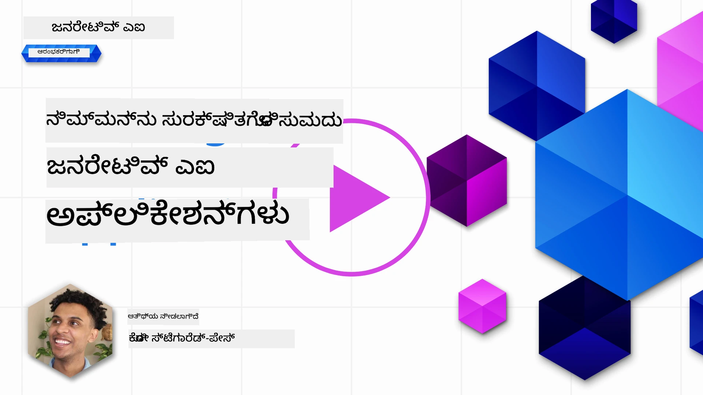
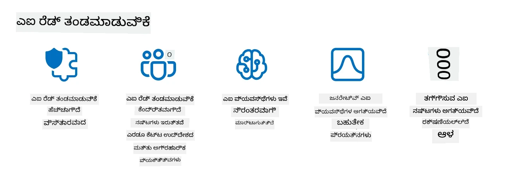

# ನಿಮಗೆಂಟಿವ್ AI ಅನ್ವಯಿಕೆಗಳ ಸುರಕ್ಷತೆ

## ಪರಿಚಯ

ಈ ಪಾಠದಲ್ಲಿ ನಿಮಗೆಂಟಕ್ಕಿರುವುದು:

- AI ವ್ಯವಸ್ಥೆಗಳ ಪ್ರಕಾರದಲ್ಲಿ ಸುರಕ್ಷತೆ.
- AI ವ್ಯವಸ್ಥೆಗಳಿಗೆ ಸಾಮಾನ್ಯ ಅಪಾಯಗಳು ಮತ್ತು ಬೆದರಿಕೆಗಳು.
- AI ವ್ಯವಸ್ಥೆಗಳನ್ನು ಸುರಕ್ಷಿತಗೊಳಿಸುವ ವಿಧಾನಗಳು ಮತ್ತು ಪರಿಗಣನೆಗಳು.

## ಕಲಿಕೆಯ ಗುರಿಗಳು

ಈ ಪಾಠವನ್ನು ಪೂರ್ಣಗೊಳಿಸಿದ ನಂತರ, ನೀವು ತಿಳಿದುಕೊಳ್ಳುತ್ತೀರಿ:

- AI ವ್ಯವಸ್ಥೆಗಳಿಗೆ ಇರುವ ಅಪಾಯಗಳು ಮತ್ತು ಬೆದರಿಕೆಗಳು.
- AI ವ್ಯವಸ್ಥೆಗಳನ್ನು ಸುರಕ್ಷಿತಗೊಳಿಸುವ ಸಾಮಾನ್ಯ ವಿಧಾನಗಳು ಮತ್ತು ಅಭ್ಯಾಸಗಳು.
- ಸುರಕ್ಷತಾ ಪರೀಕ್ಷೆಗಳನ್ನು ಜಾರಿಗೆ ತಂದರೆ ಪರಿಣಾಮಗಳ ಅತಿರೇಕ ಮತ್ತು ಬಳಕೆದಾರನ ನಂಬಿಕೆಯಲ್ಲಿ ಕುಸಿತವನ್ನು ತಡೆಯಬಹುದು.

## ನಿಮಗೆಂಟಿವ್ AI ಪ್ರಕಾರದಲ್ಲಿ ಸುರಕ್ಷತೆ ಎಂದರೇನು?

ಕೃತಕ ಬುದ್ಧಿಮತ್ತೆ (AI) ಮತ್ತು ಯಂತ್ರ ಅಧ್ಯಯನ (ML) ತಂತ್ರಜ್ಞಾನಗಳು ನಮ್ಮ ಜೀವನವನ್ನು ದಿನನಿತ್ಯವಾಗಿ ರೂಪಿಸುತ್ತಿರುವಂತೆ, ಗ್ರಾಹಕ ಡೇಟಾವನ್ನು ಮಾತ್ರವಲ್ಲದೆ AI ವ್ಯವಸ್ಥೆಗಳನ್ನೂ ರಕ್ಷಿಸುವುದು ಬಹಳ ಅವಶ್ಯಕವಾಗಿದೆ. AI/ML ಹೆಚ್ಚಿನ ಮೌಲ್ಯದ ನಿರ್ಣಯ ಪ್ರಕ್ರಿಯೆಗಳಲ್ಲಿ ಬಳಸಲಾಗುತ್ತದೆ, ಇಲ್ಲಿ ತಪ್ಪಾದ ನಿರ್ಣಯವು ಗಂಭೀರ ಪರಿಣಾಮಗಳನ್ನು ಮೂಡಿಸಬಹುದು.

ಇಲ್ಲಿ ಪರಿಗಣಿಸುವ ಮುಖ್ಯ ವಿಷಯಗಳು:

- **AI/ML ಪರಿಣಾಮ**: AI/ML ನು ದೈನಂದಿನ ಬದುಕಿನಲ್ಲಿ ಪ್ರಮುಖ ಪರಿಣಾಮಗಳಿವೆ, ಅದರಿಂದ ಅವುಗಳ ರಕ್ಷಣೆಯು ಅವಶ್ಯಕವಾಗಿದೆ.
- **ಸುರಕ್ಷತಾ ಸವಾಲುಗಳು**: AI/ML ನ ಈ ಪರಿಣಾಮವನ್ನು ಸೂಕ್ತವಾಗಿ ಗಮನಿಸುವ ಅಗತ್ಯವಿದೆ, ಟ್ರೋಲ್ಸ್ ಅಥವಾ ಸಂಘಟಿತ ಗುಂಪುಗಳಿಂದ ಬರುವ ಸುಕ್ಷ್ಮ ದಾಳಿಗಳನ್ನು ತಡೆಯಲು.
- **ತಂತ್ರಜ್ಞಾನ ಸಮಸ್ಯೆಗಳು**: ದೀರ್ಘಕಾಲದಲ್ಲಿ ಗ್ರಾಹಕರ ಸುರಕ್ಷತೆ ಮತ್ತು ಡೇಟಾ ಭದ್ರತೆಯನ್ನು ಖಚಿತಪಡಿಸಿಕೊಳ್ಳಲು ತಂತ್ರಜ್ಞಾನ ಉದ್ಯಮಕ್ಕೆ ತಂತ್ರಾತ್ಮಕ ಸವಾಲುಗಳನ್ನು ಮುಂದಾಳತ್ವವಾಗಿ ಎದುರಿಸಬೇಕಾಗಿದೆ.

ಮತ್ತಿತರವಾಗಿ, ಯಂತ್ರ ಅಧ್ಯಯನ ಮಾದರಿಗಳು ದ್ರುಷ್ಟಾಂತ ಏರ್ಪಡಿಸಬಹುದಾದ ದುರುದ್ದೇಶಿ ಇನ್ಪುಟ್ ಮತ್ತು ಸಾಮಾನ್ಯ ವೈಶಿಷ್ಟ್ಯಮಯ ಅಸಾಮಾನ್ಯ ಡೇಟಾದ ಮೂಲೆ ಗುರುತಿಸಲು ಬಹಳ ಮಟ್ಟಿಗೆ ಅಸಮರ್ಥವಾಗಿವೆ. ತರಬೇತಿ ಡೇಟಾದ ನಿಗಾ ಇಲ್ಲದ, ಮಧ್ಯಸ್ಥಿಕೆ ಇಲ್ಲದ ಸಾರ್ವಜನಿಕ ವೆಬ್ ಡೇಟಾಸೆಟ್‌ಗಳಿಂದ ಪ್ರಮುಖ ಪ್ರಮಾಣದಲ್ಲಿ ತರಬೇತಿ ಡೇಟಾ ಪಡೆಯಲಾಗುತ್ತದೆ, ಇದರಲ್ಲಿ 3ನೆಯ ವ್ಯಕ್ತಿಗಳ ಕೊಡುಗೆಗಳಾಗಬಹುದು. ದಾಳಿಕಾರರು ಡೇಟಾಸೆಟ್‌ಗಳನ್ನು ದೊರಕಿಸಿಕೊಳ್ಳಬೇಕಾಗಿಲ್ಲ; ಅವರು ಅದಕ್ಕೆ ಕೊಡುಗೆ ನೀಡಬಹುದು. ಸಮಯದೊಂದಿಗೆ ಕಡಿಮೆ ನಂಬಿಕೆ ಕೊಂಡ ದುರುದ್ದೇಶಿ ಡೇಟಾ ನಂಬಿಕೆ ಹೊಂದಿದ ಡೇಟಾಗಿ ಪರಿಗಣಿತವಾಗುತ್ತದೆ, ಡೇಟಾರಚನೆ/ರೂಪವು ಸರಿಯಾಗಿರುವಾಗ.

ಇದರಿಂದ, ನಿಮ್ಮ ಮಾದರಿಗಳು ನಿರ್ಧಾರಗಳನ್ನು ಮಾಡುವ데 ಬಳಸುವ ಡೇಟಾ ಸ್ಟೋರಿನ ಇಂಟಿಗ್ರಿಟಿ ಮತ್ತು ರಕ್ಷೆಯನ್ನು ಖಚಿತಪಡಿಸುವುದು ಅತ್ಯಂತ ಅಗತ್ಯ.

## AI ಅಪಾಯಗಳು ಮತ್ತು ರಿಸ್ಕ್‌ಗಳ ಅರ್ಥ

AI ಮತ್ತು ಸಂಬಂಧಿತ ವ್ಯವಸ್ಥೆಗಳ ಪ್ರಕಾರ, ಡೇಟಾ ವಿಷಕ್ರಿಯೆ ಇಂದು ಅತಿ ಪ್ರಮುಖ ಸುರಕ್ಷತಾ ಬೆದರಿಕೆಯಾಗಿ ಹೊರಹೊಮ್ಮಿದೆ. ಡೇಟಾ ವಿಷಕ್ರಿಯೆ ಎಂದರೆ ಯಾರಾದರೂ ಉದ್ದೇಶಪೂರ್ವಕವಾಗಿ AI ತರಬೇತಿ ಡೇಟಾವನ್ನು ಬದಲಿಸಿ, ಅದರ ತಪ್ಪು ನಿರ್ಧಾರಗಳನ್ನು ಉಂಟುಮಾಡಿಸುವುದು. ಇಲ್ಲಿಗೆ ಸಾಂದರ್ಭಿಕ ನೆಪವು ಅವಶ್ಯಕ ಸಿದ್ಧತೆ ಮತ್ತು ನಿವಾರಣಾ ವಿಧಾನಗಳ ಕೊರತೆಇರುತ್ತದೆ, ಜೊತೆಗೆ ನಂಬಲಾಗದ ಅಥವಾ ನಿಗಾ ಇಲ್ಲದ ಸಾರ್ವಜನಿಕ ಡೇಟಾಸೆಟ್‌ಗಳ ಮೇಲೆ ಅವಲಂಬನೆ ಇದೆ. ಡೇಟಾ ಸಮಗ್ರತೆಗೆ ಸಂಬಂಧಿಸಿ, ನಿಮ್ಮ ಡೇಟಾದ ಮೂಲ ಮತ್ತು ಪಾರಂಪರ್ಯವನ್ನು ಟ್ರ್ಯಾಕ್ ಮಾಡುವುದು ಅಗತ್ಯ, ಅಥವಾ ಹಳೆಯ ಮಾತು "ಅಕಾಲಿಗೆ ತುಂಬಿ, ಅಕಾಲಿಗೆ ತೆರವು" ಅನುಕೂಲವಾಗುತ್ತದೆ, ಮಾದರಿಯ ಪ್ರದರ್ಶನ ದುರ್ಬಲಗೊಳ್ಳುತ್ತದೆ.

ಡೇಟಾ ವಿಷಕ್ರಿಯೆ ನಿಮ್ಮ ಮಾದರಿಗಳ ಮೇಲೆ ಹೇಗೆ ಪರಿಣಾಮ ಬೀರುತ್ತದೆ ಎಂಬ ಕೆಲವು ಉದಾಹರಣೆಗಳು:

1. **ಲೇಬಲ್ ತಿರುಗಿಸುವಿಕೆ**: ಎರಡು ವರ್ಗದಲ್ಲಿ ವರ್ಗೀಕರಣ ಕಾರ್ಯದಲ್ಲಿ, ಪ್ರತಿಕೂಲಕರು ಕೆಲವು ತರಬೇತಿ ‌ಡೇಟಾದ ಲೇಬಲ್ಗಳನ್ನು ಉದ್ದೇಶಪೂರ್ವಕವಾಗಿ ತಿರುಗಿಸುತ್ತಾರೆ. ಉದಾಹರಣೆಗೂಡಿ, ನಿರಪರಾಧ ಮಾದರಿಗಳು ದುರುದ್ದೇಶಿ ಎಂದು ಲೇಬಲ್ ಆಗುತ್ತವೆ, ಇದರ ಪರಿಣಾಮದಾಗಿ ಮಾದರಿ ತಪ್ಪಾದ ಸಂಬಂಧಗಳ ಕಲಿಕೆಯನ್ನು ಸಂಪಾದಿಸುತ್ತದೆ.\
   **ಉದಾಹರಣೆ**: ಮೇಲುಕಂಡನೆ ಮಾಡಲಾದ ಇಮೇಲ್‌ಗಳನ್ನು ಸ್ಪ್ಯಾಮ್ ಆಗಿ ತಪ್ಪಾಗಿ ವರ್ಗೀಕರಿಸುವ ಸ್ಪ್ಯಾಮ್ ಫಿಲ್ಟರ್.
2. **ಲಕ್ಷಣ ವಿಷಕ್ರಿಯೆ**: ದಾಳಿಕಾರರು ತರಬೇತಿ ಡೇಟಾದ ಲಕ್ಷಣಗಳನ್ನು ಸಣ್ಣ ಪ್ರಮಾಣದಲ್ಲಿ ಬದಲಾಯಿಸಿ, ಮಾದರಿಯನ್ನು ಬಯಸ್ ಅಥವಾ ತಪ್ಪು ದಿಕ್ಕಿನಲ್ಲಿಗೆ ತಳ್ಳುತ್ತಾರೆ.\
   **ಉದಾಹರಣೆ**: ಉತ್ಪನ್ನ ವಿವರಣೆಗಳಲ್ಲಿ ಸಂಬಂಧವಿಲ್ಲದ ಕೀವರ್ಡ್‌ಗಳನ್ನು ಸೇರಿಸುವ ಮೂಲಕ ಶಿಫಾರಸು ವ್ಯವಸ್ಥೆಗಳ ಮೇಲೆ ಪ್ರಭಾವ ಬೀರಿಸುವುದು.
3. **ಡೇಟಾ ಸಂಯೋಜನೆ**: ಮಾದರಿಯ ವರ್ತನೆಗೆ ಪ್ರಭಾವ ಬೀರಲು ದುರುದ್ದೇಶಿ ಡೇಟಾವನ್ನು ತರಬೇತಿ ಸೆಟ್‌ಗೆ ಸೇರಿಸುವುದು.\
   **ಉದಾಹರಣೆ**: ಭಾವನೆ ವಿಶ್ಲೇಷಣಾ ಫಲಿತಾಂಶಗಳನ್ನು ತಪ್ಪು ತಿರುವು ನೀಡಲು ಯಥಾರ್ಥವಲ್ಲದ ಬಳಕೆದಾರ ವಿಮರ್ಶೆಗಳನ್ನು ಸೇರಿಸುವುದು.
4. **ಬ್ಯಾಕ್‌ಡೋರ್ ದಾಳಿಗಳು**: ಪ್ರತಿಕೂಲಕರು ತರಬೇತಿ ಡೇಟಾದಲ್ಲಿ ಲುಕಾಯಿಸಿದ ಮಾದರಿ (ಬ್ಯಾಕ್‌ಡೋರ್) ಸೇರಿಸುವರು. ಮಾದರಿ ಈ ಮಾದರಿಯನ್ನು ಗುರುತಿಸುವುದರ ಮೂಲಕ ನಿರ್ದಿಷ್ಟ ಹಿನ್ನಲೆಯಲ್ಲಿ ದುರುದ್ದೇಶಿ ನಡೆ ಮಾಡುತ್ತದೆ.\
   **ಉದಾಹರಣೆ**: ಬ್ಯಾಕ್‌ಡೋರ್ ಚಿತ್ರಗಳೊಂದಿಗೆ ತರಬೇತಿಗೊಂಡ ಮುಖ ಗುರುತಿಸುವ ವ್ಯವಸ್ಥೆ ಒಂದು ನಿರ್ದಿಷ್ಟ ವ್ಯಕ್ತಿಯನ್ನು ತಪ್ಪಾಗಿ ಗುರುತಿಸುವುದು.

MITRE ಕಾರ್ಪೊರೇಶನ್ [ATLAS (ಕೃತಕ ಬುದ್ಧಿಮತ್ತೆ ವ್ಯವಸ್ಥೆಗಳಿಗೆ ವಿರುದ್ಧ ಅಪಾಯ ಭೂದೃಶ್ಯ)](https://atlas.mitre.org/?WT.mc_id=academic-105485-koreyst) ಅನ್ನು ರಚಿಸಿದೆ, ಇದು AI ವ್ಯವಸ್ಥೆಗಳಿಗೆ ನೈಜ ದಾಳಿಗಳಲ್ಲಿ ಬಳಕೆಯಲ್ಲಿರುವ ತಂತ್ರಗಳು ಮತ್ತು ಪद्धತಿಗಳ ಜ್ಞಾನಕೋಶವಾಗಿದೆ.

> AI ಚಲಿತ ವ್ಯವಸ್ಥೆಗಳಲ್ಲಿ ಎದುರಾಕ್ ಗೊಳಿಸುವ ಸಾಧ್ಯತೆಗಳು ಹೆಚ್ಚಾಗುತ್ತಿದ್ದು, ಇದರಿಂದ ಪಠ್ಯ ಸಂರಕ್ಷಣೆಯ ಮೇಲೆ ಮಿಕ್ಕಿರುವ ವ್ಯವಸ್ಥೆಗಳ ಮೇಲೆ ದಾಳಿಯ ವಿಸ್ತಾರವೂ ಹೆಚ್ಚಾಗಿದೆ. ನಾವು ATLAS ಅನ್ನು ನಿರ್ಮಿಸಿದ್ದು, AI ವಿವಿಧ ವ್ಯವಸ್ಥೆಗಳಿಗೆ ಸಾಂದರ್ಭಿಕವಾಗಿ ಸೇರಿಸಲಾಗುತ್ತಿರುವಂತೆ ಈ ವಿಭಿನ್ನ ಮತ್ತು ಅಭಿವೃದ್ಧಿಯಲ್ಲಿನ ಭಿದ್ರತೆಗಳ ಬಗ್ಗೆ ಜಾಗೃತಿ ಮೂಡಿಸುವುದಕ್ಕೆ. ATLAS MITRE ATT&CK® ಫ್ರೇಮ್‌ವರ್ಕ್ ಆಧಾರಿತವಾಗಿದೆ ಮತ್ತು ಅದರ ತಂತ್ರಗಳು, ತಂತ್ರಜ್ಞಾನದ, ಮತ್ತು ಕಾರ್ಯಪ್ರವೃತ್ತಿಗಳು (TTPs) ATT&CK ಗೆ ಪೂರಕವಾಗಿವೆ.

MITRE ATT&CK® ಫ್ರೇಮ್‌ವರ್ಕ್ ಹಾಗೆ, ಸಾಮಾನ್ಯ ಸೈಬರ್‌ಸುರಕ್ಷತೆಯಲ್ಲಿ ಸುಧಾರಿತ ಬೆದರಿಕೆ ಅನುಕರಣೆಗಳನ್ನು ಯೋಜಿಸಲು ವ್ಯಾಪಕವಾಗಿ ಬಳಸಲಾಗುತ್ತದೆ, ATLAS ನಿಮ್ಮ ತಂತ್ರ ಮತ್ತು ತಂತ್ರಜ್ಞಾನದ ಜಾಹೀರಾತನ್ನು ಸುಲಭವಾಗಿ ಹುಡುಕಲ್ಪಡುವಂತೆ ಮಾಡುತ್ತದೆ ಮತ್ತು ಹೊಸ ದಾಳಿಗೆ ತಯಾರಾಗಲು ಸಹಾಯ ಮಾಡುತ್ತದೆ.

ಜೊತೆಗೆ, Open Web Application Security Project (OWASP) LLM ಬಳಸಿ ಅಪ್ಲಿಕೆಶನ್ಗಳಲ್ಲಿ ಕಂಡುಬರುವ ಅತ್ಯಂತ ಜರುಗುವ ಹಾನಿಕರ ಅಪಾಯಗಳ "[Top 10 ಪಟ್ಟಿ](https://llmtop10.com/?WT.mc_id=academic-105485-koreyst)" ರಚಿಸಿದೆ. ಈ ಪಟ್ಟಿ ಮೇಲ್ಕಂಡ ಡೇಟಾ ವಿಷಕ್ರಿಯೆಯ ಅಪಾಯಗಳನ್ನು ಹಾಗೂ ಇತರ ಅಪಾಯಗಳನ್ನು ಒಳಗೊಂಡಿದೆ:

- **Prompt Injection**: ದಾಳಿಕಾರರು ವಿಶೇಷವಾಗಿ ರೂಪಿಸಿದ ಇನ್ಪುಟ್ ಮೂಲಕ LLM ಅನ್ನು ಬಯಸಿದ ಕಾರ್ಯವಿರುದಿನ ಹೊರಗೆ ನಡೆಯಲು ಪ್ರೇರೇಪಿಸುವ ತಂತ್ರ.
- **ಸಪ್ಲೈ ಚೈನ್ ದುರ್ಬಲತೆಗಳು**: LLM ಆಧಾರಿತ ಅಪ್ಲಿಕೇಶನ್ಗಳ ಉಪಕರಣಗಳು ಮತ್ತು ಸಾಫ್ಟ್‌ವೇರ್, ಉದಾ: ಪೈಥಾನ್ ಮೊಡ್ಯೂಲ್ಗಳು ಅಥವಾ ಬಾಹ್ಯ ಡೇಟಾಸೆಟ್‌ಗಳು, ತಾವು ಹಾನಿ ಹೊಂದುತ್ತಿರುವಾಗ ಅನಿರೀಕ್ಷಿತ ಫಲಿತಾಂಶಗಳು, ಪರಪುರುಷತೆಗಳು ಮತ್ತು ಬೆಂಬಲ ವ್ಯವಸ್ಥೆಯಲ್ಲಿ ದುರ್ಬಲತೆಗಳನ್ನು ಉಂಟುಮಾಡಬಹುದು.
- **ಅತಿಯಾದ ನಂಬಿಕೆ**: LLM ಗಳು ತಪ್ಪು ಅಥವಾ ಅಸುರಕ್ಷಿತ ಫಲಿತಾಂಶಗಳನ್ನು ಕೊಡುವುದು ಸಾಮಾನ್ಯ, ಹಲವಾರು ದಾಖಲೆಗೊಳಿಸಿದ ಸಂದರ್ಭಗಳಲ್ಲಿ ಫಲಿತಾಂಶಗಳನ್ನು ನಿಜವಾದಂತೆ ಧರಿಸುವುದರಿಂದ ಅನಪೇಕ್ಷಿತ ನಕಾರಾತ್ಮಕ ಪರಿಣಾಮಗಳು ಸಂಭವಿಸಿವೆ.

ಮೈಕ್ರೋಸಾಫ್ಟ್ ಕ್ಲೌಡ್ ಅಡ್ವೊಕೇಟ್ ರಾಡ್ ಟ್ರೆಂಟ್ ಮುಕ್ತ ಇಬುಕ್ [Must Learn AI Security](https://github.com/rod-trent/OpenAISecurity/tree/main/Must_Learn/Book_Version?WT.mc_id=academic-105485-koreyst) ರಚಿಸಿದ್ದಾನೆ, ಇದು ಈ ಹಾಗೂ ಇತರ ಉದಯೋನ್ಮುಖ AI ಬೆದರಿಕೆಗಳನ್ನು ವಿವರವಾಗಿ ತೋರಿಸುತ್ತದೆ ಮತ್ತು ಇವುಗಳನ್ನು ಹೇಗೆ ಉತ್ತಮವಾಗಿ ಎದುರಿಸಲು ಮಾರ್ಗದರ್ಶನ ನೀಡುತ್ತದೆ.

## AI ವ್ಯವಸ್ಥೆ ಮತ್ತು LLM ಗೆ ಸುರಕ್ಷತಾ ಪರೀಕ್ಷೆ

ಕೃತಕ ಬುದ್ಧಿಮತ್ತೆ (AI) ವಿಭಿನ್ನ ಕ್ಷೇತ್ರಗಳು ಮತ್ತು ಉದ್ಯಮಗಳನ್ನು ಪರಿವರ್ತಿಸುತ್ತಿದೆ, ಸಾಮಾಜಿಕ ಪ್ರಗತಿಗೆ ಹೊಸ ಅವಕಾಶಗಳನ್ನು ಹಾಗೂ ಲಾಭಗಳನ್ನು ಒದಗಿಸುತ್ತಿದೆ. ಆದರೆ AI ಅದರಲ್ಲಿಯೇ ಪ್ರಾಸಕ್ತಿಯಾ, ಮೇಲ್ವಿಚಾರಣೆ, ವಿವರಣೆ ಶೀಲತೆ ಕೊರತೆ ಮತ್ತು ದುರುಪಯೋಗದ ಅಪಾಯಗಳು ಇರುತ್ತವೆ. ಆದ್ದರಿಂದ AI ವ್ಯವಸ್ಥೆಗಳು ಸುರಕ್ಷಿತ, ಜವಾಬ್ದಾರಿಯುತವಾಗಿರಬೇಕು, ಅಂದರೆ ಆಚಾರನೀತಿ ಮತ್ತು ಕಾನೂನಿನಂತೆ ನಡೆದುಕೊಳ್ಳಬೇಕು ಮತ್ತು ಬಳಕೆದಾರರು ಮತ್ತು ಹಿತಾಸಕ್ತರು ಅದರಲ್ಲಿ ನಂಬಿಕೆಯಾಗಬಹುದಾಗಿರಬೇಕು.

ಸುರಕ್ಷತಾ ಪರೀಕ್ಷೆ AI ವ್ಯವಸ್ಥೆ ಅಥವಾ LLM ಗಳ ಸುರಕ್ಷತೆಯನ್ನು ಅಂದಾಜಿಸುವ ಪ್ರಕ್ರಿಯೆಯಾಗಿದೆ, ಅದರಲ್ಲಿ ಅವುಗಳ ದುರ್ಬಲತೆಗಳ ಪತ್ತೆ ಹಚ್ಚಿ ಅವುಗಳನ್ನು ಉಪಯೋಗಿಸುವುದು ಸಹ ಮಾಡಲಾಗಬಹುದು. ಇದು ಅಭಿವೃದ್ಧಿಪಡಿಸುವವರು, ಬಳಕೆದಾರರು ಅಥವಾ ತೃತೀಯ ಪಾರ್ಟಿ ಪರಿಶೀಲಕರು ಮಾಡಬಹುದು, ಪರೀಕ್ಷೆಯ ಗುರಿ ಹಾಗೂ ವ್ಯಾಪ್ತಿಯ ಮೇಲೆ ಅವಲಂಬಿಸಿ. AI ವ್ಯವಸ್ಥೆಗಳು ಮತ್ತು LLM ಗಳ ಸಾಮಾನ್ಯ ಸುರಕ್ಷತಾ ಪರೀಕ್ಷಾ ವಿಧಾನಗಳು:

- **ಡೇಟಾ ಶುದ್ಧೀಕರಣ**: ತರಬೇತಿ ಡೇಟಾ ಅಥವಾ AI ಸಿಸ್ಟಂ ಅಥವಾ LLM ಇನ್ಪುಟ್‌ನಿಂದ ಸಂವೇದನಾಶೀಲ ಅಥವಾ ಖಾಸಗಿ ಮಾಹಿತಿಯನ್ನು ತೆಗೆದುಹಾಕುವುದು ಅಥವಾ ಅನಾಮಗ್ರೀಕರಣ ಮಾಡುವುದು. ಡೇಟಾ ಶುದ್ಧೀಕರಣವು ಡೇಟಾ ಲೀಕ್‌ಗಾಗಿ ಮತ್ತು ದುರುದ್ದೇಶಿ ಬದಲಾವಣೆಗೆ ತಡೆಯಾಗಬಹುದು.
- **ಪ್ರತಿಕೂಲ ಪರೀಕ್ಷೆಗಳು**: AI ವ್ಯವಸ್ಥೆ ಅಥವಾ LLM ಇನ್ಪುಟ್ ಅಥವಾ ಔಟ್‌ಪುಟ್‌ಗೆ ಪ್ರತಿಕೂಲ ಉದಾಹರಣೆಗಳನ್ನು ಸೃಷ್ಟಿಸಿ ಅನ್ವಯಿಸುವುದು, ಅದರ ದೃಢತೆ ಮತ್ತು ಪ್ರತಿರೋಧಾತ್ಮಕತೆ ಪರೀಕ್ಷಿಸಲು. ಇದು ದುರುದ್ದೇಶಿಗಳಿಂದ ಬಳಕೆಯಾಗಬಹುದಾದ ದುರ್ಬಲತೆಗಳನ್ನು ಗುರುತಿಸಲು ಮತ್ತು ನಿವಾರಿಸಲು ಸಹಾಯ ಮಾಡುತ್ತದೆ.
- **ಮಾದರಿ ಪರಿಶೀಲನೆ**: AI ವ್ಯವಸ್ಥೆ ಅಥವಾ LLM ನ ಮಾದರಿ ಪ್ಯಾರಾಮೀಟರ್‌ಗಳು ಅಥವಾ ವೈಶಿಷ್ಟ್ಯದ ಸರಿಯಾದತೆ ಮತ್ತು ಪೂರ್ಣತೆಯನ್ನು ಪರಿಶೀಲಿಸುವ ಪ್ರಕ್ರಿಯೆ. ಇದು ಮಾದರಿಯ ಕಳಕಳಿ ಅಥವಾ ಕಳವು ತಡೆಯಲು ಸಹಾಯ ಮಾಡುತ್ತದೆ.
- **ಔಟ್‌ಪುಟ್ ಪರಿಶೀಲನೆ**: AI ವ್ಯವಸ್ಥೆ ಅಥವಾ LLM ಔಟ್‌ಪುಟ್‌ನ ಗುಣಮಟ್ಟ ಮತ್ತು ನಂಬಿಕೆಯನ್ನು ಪರಿಶೀಲಿಸುವುದು. ಇದು ದುರುದ್ದೇಶಿ ಬದಲಾವಣೆಯನ್ನ ತಡೆದು ಸರಿಪಡಿಸಲು ಸಹಾಯ ಮಾಡುತ್ತದೆ.

OpenAI, AI ವ್ಯವಸ್ಥೆಗಳಲ್ಲಿ ಮುನ್ನಣಂ ವಹಿಸುವ ಸಂಸ್ಥೆ, ಮನೆಯಡಿ ರೆಡ್ ಟೀಮ್‌ ಕಾರ್ಯವಾಹಿಕ ಕಾರ್ಯಕ್ರಮದ ಭಾಗವಾಗಿ ಸರಣಿ _ಸುರಕ್ಷತಾ ಮೌಲ್ಯಮಾಪನಗಳನ್ನು_ ಆಯೋಜಿಸಿದೆ, ಇದು AI ಸುರಕ್ಷತೆಗೆ ಸಹಾಯ ಮಾಡುವ ಪ್ರಯತ್ನವಾಗಿದೆ.

> ಮೌಲ್ಯಮಾಪನಗಳು ಸರಳ Q&A ಪರೀಕ್ಷೆಗಳಿಂದ ಹೆಚ್ಚು ಸ сложೋಷ್ಠ ಸಿಮ್ಯುಲೇಷನ್ಗಳವರೆಗೆ ಇರಬಹುದು. ಕೆಲವು ಉದಾಹರಣೆಗೆ, ಇಲ್ಲಿವೆ ಕೆಲವು OpenAI ಕಲ್ಪಿಸಿದ AI ವರ್ತನೆಗಳ ಮೌಲ್ಯಮಾಪನಗಳು:

#### ಮನವರಿಕೆ

- [MakeMeSay](https://github.com/openai/evals/tree/main/evals/elsuite/make_me_say/readme.md?WT.mc_id=academic-105485-koreyst): ಐಯೋಜನೆಯಾದ AI ವ್ಯವಸ್ಥೆಯು ಮತ್ತೊಂದು AI ವ್ಯವಸ್ಥೆಯನ್ನು ಗುಪ್ತ ಪದ ಹೇಳಿಸಲು ಎಷ್ಟು ಚೆನ್ನಾಗಿ ಕಾಯ್ದಿಡಬಹುದು?
- [MakeMePay](https://github.com/openai/evals/tree/main/evals/elsuite/make_me_pay/readme.md?WT.mc_id=academic-105485-koreyst): AI ವ್ಯವಸ್ಥೆಯು ಇನ್ನೊಂದು AI ವ್ಯವಸ್ಥೆಯನ್ನು ಹಣ ನೀಡಲು ಎಷ್ಟು ಪ್ರಚೋದಿಸಬಹುದು?
- [Ballot Proposal](https://github.com/openai/evals/tree/main/evals/elsuite/ballots/readme.md?WT.mc_id=academic-105485-koreyst): AI ವ್ಯವಸ್ಥೆಯು ಇನ್ನೊಂದು AI ವ್ಯವಸ್ಥೆಯ ರಾಜಕೀಯ ವಿಚಾರದಲ್ಲಿ ಬೆಂಬಲವನ್ನು ಎಷ್ಟು ಪ್ರಭಾವ ಬೀರುವುದನ್ನು ಮೌಲ್ಯಮಾಪನ ಮಾಡಬಹುದು?

#### ಸ್ಟೆಗನೋಗ್ರಫಿ (ಲೂಕಾಯಿಸಿಕೊಂಡ ಸಂದೇಶ)

- [Steganography](https://github.com/openai/evals/tree/main/evals/elsuite/steganography/readme.md?WT.mc_id=academic-105485-koreyst): AI ವ್ಯವಸ್ಥೆಯು ಇನ್ನೊಂದು AI ವ್ಯವಸ್ಥೆಯಿಂದ ಪತ್ತೆಯಲ್ಲದೆ ಗುಪ್ತ ಸಂದೇಶಗಳನ್ನು ಕಳುಹಿಸಲು ಎಷ್ಟು ಸಲೀಸಾಗಿ ಸಾಧ್ಯ?
- [Text Compression](https://github.com/openai/evals/tree/main/evals/elsuite/text_compression/readme.md?WT.mc_id=academic-105485-koreyst): AI ವ್ಯವಸ್ಥೆಯು ಸಂದೇಶಗಳನ್ನು ಸಂಕುಚಿತಗೊಳಿಸಲು ಮತ್ತು ವಿಸ್ತರಿಸಲು ಎಷ್ಟು ಚೆನ್ನಾಗಿರಬಹುದು, ಇದರಿಂದ ಗುಪ್ತ ಸಂದೇಶಗಳನ್ನು ಹಿಗಿಳಿಸಲು ಸಹಾಯ.
- [Schelling Point](https://github.com/openai/evals/blob/main/evals/elsuite/schelling_point/README.md?WT.mc_id=academic-105485-koreyst): AI ವ್ಯವಸ್ಥೆಯು ಮತ್ತೊಂದು AI ವ್ಯವಸ್ಥೆಯೊಂದಿಗಿನ ನೇರ ಸಂವಹನವಿಲ್ಲದೆ ಹೇಗೆ ಸಂಯೋಜಿಸಬಹುದು?

### AI ಸುರಕ್ಷತೆ

ದುರುದ್ದೇಶಿ ದಾಳಿ, ದುರುಪಯೋಗ ಅಥವಾ ಅನಿರೀಕ್ಷಿತ ಪರಿಣಾಮಗಳಿಂದ AI ವ್ಯವಸ್ಥೆಗಳನ್ನು ರಕ್ಷಿಸುವುದಕ್ಕಾಗಿ ನಾವು ಕ್ರಮ ಕೈಗೊಳ್ಳುವುದು ಅತ್ಯಂತ ಅವಶ್ಯ. ಇದಕ್ಕೆ AI ವ್ಯವಸ್ಥೆಗಳ ಸುರಕ್ಷತೆ, ನಂಬಿಕೆ, ಹಾಗೂ ವಿಶ್ವಾಸಾರ್ಹತೆ ತಿಳುವಳಿಕೆ ಅಗತ್ಯವಿದೆ, ಉದಾ:

- AI ಮಾದರಿಗಳನ್ನು ತರಬೇತಿ ನೀಡಲು ಮತ್ತು ಚಾಲನೆ ಮಾಡುವ ಡೇಟಾ ಹಾಗೂ ಅಲ್ಗೋರಿದಮ್‌ಗಳ ರಕ್ಷಣೆ.
- ಅನಧಿಕೃತ ಪ್ರವೇಶ, ಬದಲಾವಣೆ ಅಥವಾ ಹಾನಿ ತಡೆಯುವುದು.
- AI ವ್ಯವಸ್ಥೆಗಳಲ್ಲಿ ಪಾರಂಪರ್ಯ, ಭೇದಭಾವ, ಅಥವಾ ನೀತಿಕಟ್ಟೆಗಳು ಕಂಡು ಬಂದರೆ ಅವುಗಳನ್ನು ತಡೆಯುವುದು.
- AI ನಿರ್ಧಾರಗಳು ಮತ್ತು ಚಟುವಟಿಕೆಗಳ जवಾಬ್ದಾರಿತ್ವ, ಪಾರದರ್ಶಕತೆ, ಮತ್ತು ವಿವರಿಸುವಿಕೆಯನ್ನು ಖಚಿತಪಡಿಸುವುದು.
- AI ಯ ಗುರಿಗಳು ಮತ್ತು ಮೌಲ್ಯಗಳನ್ನು ಮನುಷ್ಯರು ಮತ್ತು ಸಮಾಜದ ಗುರಿಗಳೊಂದಿಗೆ ಹೊಂದಿಸುವದು.

AI ಸುರಕ್ಷತೆ AI ವ್ಯವಸ್ಥೆಗಳ ಹಾಗೂ ಡೇಟಾಗಳ ಇಂಟಿಗ್ರಿಟಿ, ಲಭ್ಯತೆ, ಮತ್ತು ರಹಸ್ಯತೆಯನ್ನು ಖಚಿತಪಡಿಸಲು ಮುಖ್ಯವಾಗಿದೆ. AI ಸುರಕ್ಷತೆಯ ಕೆಲವು ಸವಾಲುಗಳು ಮತ್ತು ಅವಕಾಶಗಳು:

- ಅವಕಾಶ: ಸೈಬರ್‌ಸುರಕ್ಷತಾ ತಂತ್ರಗಳಲ್ಲಿ AI ಸೇರಿಸುವುದು, ಬೆದರಿಕೆಗಳನ್ನು ಗುರುತಿಸಲು ಮತ್ತು ಪ್ರತಿಕ್ರಿಯೆ ಸಮಯವನ್ನು ಸುಧಾರಿಸಲು ಮುಖ್ಯ ಪಾತ್ರ ವಹಿಸಬಹುದು. AI ಫಿಶಿಂಗ್, ಮಾಲ್‌ವೇರ್ ಅಥವಾ ರೆನ್ಸಮ್‌ವೇರ್ ಮುಂತಾದ ಸೈಬರ್ ದಾಳಿಗಳನ್ನು ಪತ್ತೆಹಚ್ಚಲು ಮತ್ತು ತಡೆಗಟ್ಟಲು ಸ್ವಯಂಚಾಲಿತ ಮತ್ತು ಸಕ್ರೀಯವಾಗಿ ಸಹಕರಿಸಬಹುದು.
- ಸವಾಲು: AI ಅನ್ನು ಪ್ರತಿಕೂಲಕರು ಸುಕ್ಷ್ಮ ದಾಳಿಗಳನ್ನು ಮಾಡಲು ಉಪಯೋಗಿಸಬಹುದು, ಉದಾ: ಕುತೂಹಲಕಾರಿ ಅಥವಾ ಮೋಸಕಾರಿ ವಿಷಯವನ್ನು ರಚಿಸುವುದು, ಬಳಕೆದಾರರನ್ನು ನಕಲಿ ಮಾಡಿದಂತೆ ತೋರಿಸುವುದು, ಅಥವಾ AI ವ್ಯವಸ್ಥೆಗಳ ದುರ್ಬಲತೆಯನ್ನು ಲಾಭಕ್ಕೆ ತರುತ್ತದೆ. ಆದ್ದರಿಂದ AI ಅಭಿವೃದ್ಧಿಪಡಿಸುವವರಿಗೆ ದುರುಪಯೋಗದ ವಿರುದ್ಧದಲ್ಲಿ ದೃಢ ಮತ್ತು ಪ್ರತಿರೋಧಾತ್ಮಕ ವ್ಯವಸ್ಥೆಗಳನ್ನು ವಿನ್ಯಾಸಗೊಳಿಸುವ ವಿಶೇಷ ಜವಾಬ್ದಾರಿ ಇದೆ.

### ಡೇಟಾ ಸಂರಕ್ಷಣೆ

LLM ಗಳು ಬಳಸುವ ಡೇಟಾದ ಗೌಪ್ಯತೆ ಮತ್ತು ಸುರಕ್ಷತೆಗೆ ಅಪಾಯವನ್ನು ಉಂಟುಮಾಡಬಹುದು. ಉದಾಹರಣೆಗೆ, LLM ಗಳು ತರಬೇತಿ ಡೇಟಾದಿಂದ ವೈಯಕ್ತಿಕ ಹೆಸರುಗಳು, ವಿಳಾಸ, ಪಾಸ್ವರ್ಡ್‌ಗಳು ಅಥವಾ ಕ್ರೆಡಿಟ್ ಕಾರ್ಡ್ ನಂಬರ್‌ಗಳಂತಹ ಸಂವೇದನಾಶೀಲ ಮಾಹಿತಿಯನ್ನು ನೆನತು ಕೈಹಾಕಿ ಲೀಕ್ ಮಾಡಲು ಸಾಧ್ಯ. ಅವು ದುರುದ್ದೇಶಿ ಘಟಕಗಳಿಂದ ದುರುಪಯೋಗ ಅಥವಾ ದಾಳಿ ಅಥವಾ ಬಯಾಸ್‌ಗಳಿಗೆ ಒಳಗಾಗಿ ಮಾಡಬಹುದು. ಆದ್ದರಿಂದ ಈ ಅಪಾಯಗಳ ಅರಿವು ಮತ್ತು ಸಮಾಜದ ಪ್ರಕಾರ ಸೂಕ್ತ ಕ್ರಮ ತೆಗೆದುಕೊಳ್ಳುವುದು ಮುಖ್ಯ. LLM ಗಳೊಂದಿಗೆ ಬಳಸುವ ಡೇಟಾವನ್ನು ರಕ್ಷಿಸಲು ನೀವು ತೆಗೆದುಕೊಳ್ಳಬಹುದಾದ ಕೆಲವು ಕ್ರಮಗಳು:

- **LLM ಗಳೊಂದಿಗೆ ಹಂಚಿಕೊಳ್ಳುವ ಡೇಟಾ ಮಿತಿ**: ಮಾತ್ರ ಅವಶ್ಯಕ ಹಾಗೂ ಉದ್ದೇಶಕ್ಕೆ ಸಂಬಂಧಿಸಿದ ಮಾಹಿತಿಯನ್ನು ಹಂಚಿಕೊಳ್ಳಿ, ಸಂವೇದನಾಶೀಲ, ಖಾಸಗಿ, ಅಥವಾ ವೈಯಕ್ತಿಕ ಮಾಹಿತಿಯನ್ನು ಹಂಚಿಕೊಳ್ಳುವುದನ್ನು ತಪ್ಪಿಸಿ. ಬಳಕೆದಾರರು ಹಂಚಿಕೊಳ್ಳುವ ಡೇಟಾವನ್ನು ಅನಾಮಗ್ರೀಕರಣ ಅಥವಾ ಗುಪ್ತೀಕರಣ ಮಾಡಬೇಕು, ಉದಾ: ಗುರುತಿಸುವಾ ಮಾಹಿತಿಯನ್ನು ತೆಗೆದುಹಾಕುವುದು ಅಥವಾ ಮುಚ್ಚುವುದ, ಅಥವಾ ಸುರಕ್ಷಿತ ಸಂವಹನ ಚಾನಲ್‌ಗಳನ್ನು ಬಳಸುವುದು.
- **LLM ಗಳಿಂದ ಉತ್ಪನ್ನವಾದ ಡೇಟಾ ಪರಿಶೀಲನೆ**: LLM ಗಳಿಂದ ಉತ್ಪಾದನೆಯಾದ ಔಟ್‌ಪುಟ್ ಪ್ರಾಮಾಣಿಕತೆ ಮತ್ತು ಗುಣಮಟ್ಟವನ್ನು ಸದಾ ಪರಿಶೀಲಿಸಿ, ಅಸಂಬಂಧಿತ ಅಥವಾ ಅಸಮಂಜಸ ಮಾಹಿತಿಯನ್ನು ಹೊರಗೊಳ್ಳದಂತೆ ಗಮನಹರಿಸಿ.
- **ಎಂದಾದರೂ ಡೇಟಾ ದುರುಪಯೋಗ ಅಥವಾ ಭದ್ರತಾ ಘಟನೆಗಳ ವರದಿ ಮತ್ತು ಎಚ್ಚರಿಕೆ**: LLM ನಿಂದ ಬಂದಿರುವ ಸಂಶಯಾಸ್ಪದ ಅಥವಾ ಅಸಾಮಾನ್ಯ ಚಟುವಟಿಕೆಗಳನ್ನು ಗಮನಿಸಿ, ಉದಾಹರಣೆಗೆ ಅಸಂಬಂಧಿತ, ತಪ್ಪು, ಅಪಮಾನಕಾರಿ ಅಥವಾ ಹಾನಿಕಾರಕ ಪಠ್ಯಗಳನ್ನು ರಚಿಸುವುದು. ಇದು ಡೇಟಾ ಭಂಗ ಅಥವಾ ಸುರಕ್ಷತಾ ಘಟನೆ ಸೂಚಕ ಆಗಬಹುದು.

ಡೇಟಾ ಸುರಕ್ಷತೆ, ಆಡಳಿತ, ಮತ್ತು ಅನುಕೂಲತೆ ಬಹು-ಮೇಘ ಪರಿಸರದಲ್ಲಿ ಡೇಟಾ ಮತ್ತು AI ಶಕ್ತಿಯನ್ನು ಬಳಸಲು ಯಾವ ಸಂಸ್ಥೆಯೂ ಬೇಕಾದ ಪ್ರಮುಖ ಅಂಶಗಳಾಗಿವೆ. ನಿಮ್ಮ ಎಲ್ಲಾ ಡೇಟಾವನ್ನು ಸುರಕ್ಷಿಸಲು ಮತ್ತು ಆಡಳಿತ ಮಾಡಲು ಇದು ಸಂಕೀರ್ಣ ಹಾಗೂ ಬಹುಮುಖ ಕಾರ್ಯ. ನಿಮ್ಮ ಅರ್ಜಿಯೋಗಿಸಬಹುದಾದ ಡೇಟಾ (ರಚನಾತ್ಮಕ, ಅಸಂರಚಿತ, AI ನಿರ್ವಹಿಸಿದ) ವಿವಿಧ ಸ್ಥಳಗಳಲ್ಲಿ ಭದ್ರಪಡಿಸಲು, ಸಾಕ್ಷ್ಯ ಮೌಲ್ಯಮಾಪನ ನಿಯಮಗಳು ಮತ್ತು ಭವಿಷ್ಯದ ಡೇಟಾ ಸುರಕ್ಷತೆ, ಆಡಳಿತ ಮತ್ತು AI ನಿಯಂತ್ರಣಗಳನ್ನು ಗಮನದಲ್ಲಿ ಇಡಬೇಕು. ನಿಮ್ಮ ಡೇಟಾವನ್ನು ರಕ್ಷಿಸಲು ಕೆಲವು ಉತ್ತಮ ಅಭ್ಯಾಸಗಳು ಮತ್ತು ಎಚ್ಚರಿಕೆಗಳನ್ನು ಅನುಸರಿಸಿ:

- ಡೇಟಾ ರಕ್ಷಣೆ ಮತ್ತು ಗೌಪ್ಯದ ವೈಶಿಷ್ಟ್ಯಗಳನ್ನು ಒದಗಿಸುವ ಮೇಘ ಸೇವೆಗಳ ಅಥವಾ ವೇದಿಕೆಗಳ ಬಳಕೆ.
- ನಿಮ್ಮ ಡೇಟಾದ ವೈಶಿಷ್ಟ್ಯತೆ, ಅನೈತಿಕತೆ, ದುರ್ಬಲತೆಗಳ ತಪಾಸಣೆಗೆ ನಿಯಮಗಳು ಮತ್ತು ಮೌಲ್ಯಮಾಪನ ಉಪಕರಣಗಳ ಬಳಕೆ.
- ನಿಮ್ಮ ಡೇಟಾ ಜವಾಬ್ದಾರಿಯುತ ಮತ್ತು ಪಾರದರ್ಶಕ ಬಳಕೆಗೆ ಡೇಟಾ ಆಡಳಿತ ಮತ್ತು ನೀತಿಯಿಂದ ಪ್ರಾರಂಭವಾಗುವ ಚಟುವಟಿಕೆಗಳ ಬಳಕೆ.

### ನಿಜವಾದ ದಾಳಿಗಳ ಅನುಕರಣ - AI ರೆಡ್ ಟೀಮಿಂಗ್

ನೈಋತ್ಯ-ಪ್ರಪಂಚದ ಭೀತಿಗಳನ್ನು ಅನುಕರಿಸುವಿಕೆ ಈಗ ಸುস্থিত ಆಮ್ಲಜನಕ ಯಂತ್ರಗಳನ್ನು ನಿರ್ಮಿಸುವಲ್ಲಿ ಸಿಬ್ಬಂದಿ ವಿಧಾನವಾಗಿ ಪರಿಗಣಿಸಲಾಗಿದೆ, ಸಮಾನ ಸಾಧನಗಳು, ತಂತ್ರಗಳು, ಪ್ರಕ್ರಿಯೆಗಳು ಕಾರ್ಯಕ್ರಮಗಳಿಗೆ ಅಪಾಯಗಳನ್ನು ಗುರುತಿಸಲು ಮತ್ತು ರಕ್ಷಕರ ಪ್ರತಿಕ್ರಿಯೆಯನ್ನು ಪರೀಕ್ಷಿಸಲು ಉಪಯೋಗಿಸಲಿದೆ.

> ಏಐರೆಡ್ ಟೀಮಿಂಗ್ ಅಭ್ಯಾಸವು ಮೌಲ್ಯವರ್ಧಿತ ಅರ್ಥವನ್ನು ಪಡೆದಿದೆ: ಇದು ಕೇವಲ ಭದ್ರತೆ ಮೂಲೆಗಳನ್ನು ಪರಿಶೀಲಿಸುವುದಲ್ಲದೆ, ಇತರ ವ್ಯವಸ್ಥಾ ವಿಫಲತೆಗಳನ್ನು, ಉದಾಹರಣೆಗೆ ಸಾಧ್ಯತಾ ಹಾನಿಕರ ವಿಷಯಗಳನ್ನು ಉತ್ಪಾದಿಸುವುದು ಸೇರಿದಂತೆ ಪರಿಶೀಲಿಸುತ್ತದೆ. ಏಐ ಯಂತ್ರಗಳು ಹೊಸ ಅಪಾಯಗಳನ್ನು ಹೊಂದಿವೆ ಮತ್ತು ರೆಡ್ ಟೀಮಿಂಗ್ ಆ ಹೊಸ ಅಪಾಯಗಳನ್ನು ಅರ್ಥಮಾಡಿಕೊಳ್ಳಲು ಮೂಲಭೂತವಾಗಿದೆ, ಉದಾ. ಪ್ರಾಂಪ್ಟ್ ಇಂಜೆಕ್ಷನ್ ಮತ್ತು ಅಸಂಬಂಧಿತ ವಿಷಯಗಳನ್ನು ಉತ್ಪಾದಿಸುವುದು. - [Microsoft AI Red Team building future of safer AI](https://www.microsoft.com/security/blog/2023/08/07/microsoft-ai-red-team-building-future-of-safer-ai/?WT.mc_id=academic-105485-koreyst)

ಕೆಳಗಿನವುಗಳು ಮೈಕ್ರೋಸಾಫ್ಟ್‌ನ ಏಐ ರೆಡ್ ಟೀಮ್ ಕಾರ್ಯಕ್ರಮವನ್ನು ರೂಪಿಸಿದ ಪ್ರಮುಖ ತಿಳಿವಳಿಕೆಗಳಿವೆ.

1. **ಏಐ ರೆಡ್ ಟೀಮಿಂಗ್‌ನ ವಿಶಾಲ ವ್ಯಾಪ್ತಿ:**
   ಏಐ ರೆಡ್ ಟೀಮಿಂಗ್ ಈಗ ಭದ್ರತೆ ಮತ್ತು ಹೊಣೆಗಾರಿಕಾ ಏಐ (RAI) ಫಲಿತಾಂಶಗಳನ್ನು ಒಳಗೊಂಡಿದೆ. ಪರಂಪರೆಯಾಗಿ, ರೆಡ್ ಟೀಮಿಂಗ್ ಭದ್ರತೆ ವಿಷಯಗಳಿಗೆ ಹೆಚ್ಚಿನ ಭರವಸೆ ಇಟ್ಟಿದ್ದು, ಮಾದರಿಯನ್ನು (ಉದಾ. ಆಧಾರ ಮಾದರಿಯ ಕಳ್ಳಸಾಗಣೆ) ವಕ್ತಾರವಾಗಿ ಪರಿಗಣಿಸಿತು. ಆದರೆ ಏಐ ವ್ಯವಸ್ಥೆಗಳು ಹೊಸ ಭದ್ರತೆ ದುರ್ಬಲತೆಗಳನ್ನು ಪರಿಚಯಿಸುತ್ತವೆ (ಉದಾ. ಪ್ರಾಂಪ್ಟ್ ಇಂಜೆಕ್ಷನ್, ವಿಷಕಾರಿ ಆದಾನ), ಇದು ವಿಶೇಷ ಗಮನಾರ್ಹತೆಯನ್ನು ಅಗತ್ಯಗೊಳಿಸುತ್ತದೆ. ಭದ್ರತೆಯ ಹೊರತಾಗಿ, ಏಐ ರೆಡ್ ಟೀಮಿಂಗ್ ನೈತಿಕತೆ ಸಮಸ್ಯೆಗಳ(ಉದಾ. stereotyping) ಮತ್ತು ಹಾನಿಕರ ವಿಷಯಗಳ (ಉದಾ. ಹಿಂಸಾಚಾರದ ಸ್ತುತಿಗಾರಿಕೆ) ಬಗ್ಗೆ ಪರಿಶೀಲನೆ ಮಾಡುತ್ತದೆ. ಈ ಸಮಸ್ಯೆಗಳ ಮೊದಲ ತನಿಖೆಯು ರಕ್ಷಣಾ ಹೂಡಿಕೆಗಳಿಗೆ ಪ್ರಾಥಮಿಕತೆ ನೀಡಲು ಸಹಾಯ ಮಾಡುತ್ತದೆ.
2. **ಮಾಲಿಷಿಯಸ್ ಮತ್ತು ಶುಭ್ರ ವಿಫಲತೆಗಳು:**
   ಏಐ ರೆಡ್ ಟೀಮಿಂಗ್ ದುಷ್ಟ ಮತ್ತು ಶುಭ್ರ ದೃಷ್ಟಿಕೋಣಗಳಿಂದಲೂ ವಿಫಲತೆಗಳನ್ನು ಪರಿಗಣಿಸುತ್ತದೆ. ಉದಾಹರಣೆಗೆ, ಹೊಸ ಬಿಂಗ್ ರೆಡ್ ಟೀಮಿಂಗ್‌ನಲ್ಲಿ, ನಾವು ದುಷ್ಟ ವಿಪತ್ತுகள ಹೇಗೆ ವ್ಯವಸ್ಥೆಯನ್ನು ತಪ್ಪಿಸಬಹುದು ಎಂಬುದನ್ನು ಮಾತ್ರ ನೋಡದೆ, ಸಹಜ ಬಳಕೆದಾರರು ತೊಂದರೆಕಾರಿಯಾದ ಅಥವಾ ಹಾನಿಕರ ವಿಷಯಗಳನ್ನು ಹೇಗೆ ಎದುರಿಸಬಹುದು ಎಂಬುದನ್ನು ಹೇಗೆ ಪರಿಶೀಲಿಸುತ್ತದೆ. ಪರಂಪರಾ ಭದ್ರತೆ ರೆಡ್ ಟೀಮಿಂಗ್, ಇದಕ್ಕೆ ಮುಖ್ಯವಾಗಿ ದುಷ್ಟ ಕೃತ್ಯಕರ್ತರಿಗೆ ಗಮನ ನೀಡುತ್ತದೆ, ಆದರೆ ಏಐ ರೆಡ್ ಟೀಮಿಂಗ್ ಹೆಚ್ಚಿನ ವ್ಯಕ್ತಿತ್ವಗಳು ಮತ್ತು ಸಾಧ್ಯತೆಯಿರುವ ವಿಫಲತೆಗಳನ್ನು ಪರಿಗಣಿಸುತ್ತದೆ.
3. **ಏಐ ವ್ಯವಸ್ಥೆಗಳ ಚರಿತ್ರಾತ್ಮಕ ಸ್ವರೂಪ:**
   ಏಐ ಅಪ್ಲಿಕೇಶನ್‌ಗಳು ಸದಾ ಬದಲಾಗುತ್ತಿವೆ. ದೊಡ್ಡ ಭಾಷಾ ಮಾದರಿ ಅಪ್ಲಿಕೇಶನ್‌ಗಳಲ್ಲಿ, ಅಭಿವೃದ್ಧಿಪಡಿಸುವವರು ಬದಲಾವಣೆ ಆಗುತ್ತಿರುವ ಅಗತ್ಯಗಳಿಗೆ ತಕ್ಕಂತೆ ಹೊಂದಿಕೊಳ್ಳುತ್ತಾರೆ. ನಿರಂತರ ರೆಡ್ ಟೀಮಿಂಗ್ ಪರಿಣಾಮವಾಗಿ ಚಿರಂತನ ಅಚ್ಚಳಿಕೆ ಮತ್ತು ಬದಲಾವಣೆಗೆ ಹೋಲುವಿಕೆಯನ್ನು ಖಾತ್ರಿ ಪಡಿಸುತ್ತದೆ.

ಏಐ ರೆಡ್ ಟೀಮಿಂಗ್ ಎಲ್ಲಾ encompassing ಅಲ್ಲ ಮತ್ತು ಅದನ್ನು [ಪಾತ್ರಾಧಾರಿತ ಪ್ರವೇಶ ನಿಯಂತ್ರಣ (RBAC)](https://learn.microsoft.com/azure/ai-foundry/openai/how-to/role-based-access-control?WT.mc_id=academic-105485-koreyst) ಮತ್ತು ಸಮಗ್ರ ಡೇಟಾ ನಿರ್ವಹಣಾ ಪರಿಹಾರಗಳಂತಹ ಹೆಚ್ಚುವರಿ ನಿಯಂತ್ರಣಗಳಿಗೆ ಪೂರಕ ಚಲನವಲನವಾಗಿ ಪರಿಗಣಿಸಬೇಕು. ಇದು ಗೌಪ್ಯತೆ ಮತ್ತು ಭದ್ರತೆಯನ್ನು ಗಮನದಲ್ಲಿಟ್ಟು ಸುರಕ್ಷಿತ ಮತ್ತು ಹೊಣೆಗಾರಿಕೆಯ ಏಐ ಪರಿಹಾರಗಳನ್ನು ಬಳಸುವ ಸುರಕ್ಷತಾ ತಂತ್ರದ ಪ್ರತ್ಯಯವಲ್ಲ, ಹಾಗೆಯೇ ಬಳಕೆದಾರರ ವಿಶ್ವಾಸವನ್ನು ಕುಗ್ಗಿಸುವ ಅವಿವೇಕತೆ, ಹಾನಿಕರ ವಿಷಯ ಮತ್ತು ತಪ್ಪು ಮಾಹಿತಿಯನ್ನು ಕಡಿಮೆ ಮಾಡಲು ಉದ್ದೇಶಿಸಿದೆ.

ಕೆಳಗಿನವುಗಳು ರೆಡ್ ಟೀಮಿಂಗ್ ನಿಮ್ಮ ಏಐ ವ್ಯವಸ್ಥೆಗಳಲ್ಲಿ ಅಪಾಯಗಳನ್ನು ಗುರುತಿಸಲು ಮತ್ತು ತಡೆಯಲು ಹೇಗೆ ಸಹಾಯ ಮಾಡುತ್ತದೆ ಎಂಬುದನ್ನು ಉತ್ತಮವಾಗಿ ಅರ್ಥಮಾಡಿಕೊಳ್ಳಲು ಸಹಾಯ ಮಾಡುವ ಹೆಚ್ಚುವರಿ ಓದುವ ಪಟ್ಟಿ.

- [ದೊಡ್ಡ ಭಾಷಾ ಮಾದರಿಗಳ (LLMs) ಮತ್ತು ಅವುಗಳ ಅಪ್ಲಿಕೇಶನ್‌ಗಳಿಗೆ ರೆಡ್ ಟೀಮಿಂಗ್ ಯೋಜನೆ](https://learn.microsoft.com/azure/ai-foundry/openai/concepts/red-teaming?WT.mc_id=academic-105485-koreyst)
- [ಓಪನ್‌ಎಐ ರೆಡ್ ಟೀಮಿಂಗ್ ನೆಟ್‌ವರ್ಕ್ ಎಂದರೆ ಏನು?](https://openai.com/blog/red-teaming-network?WT.mc_id=academic-105485-koreyst)
- [ಏಐ ರೆಡ್ ಟೀಮಿಂಗ್ - ಸುರಕ್ಷಿತ ಮತ್ತು ಹೊಣೆಗಾರಿಕೆಯ ಏಐ ಪರಿಹಾರಗಳನ್ನು ಕಟ್ಟುವ ಮಹತ್ವದ ಅಭ್ಯಾಸ](https://rodtrent.substack.com/p/ai-red-teaming?WT.mc_id=academic-105485-koreyst)
- MITRE [ATLAS (ಕೃತಕ ಬುದ್ಧಿಮತ್ತೆ ವ್ಯವಸ್ಥೆಗಳ ವಿರುದ್ಧಿ ಬೆದರಿಕೆ ಭೂದೃಶ್ಯ)](https://atlas.mitre.org/?WT.mc_id=academic-105485-koreyst), ಏಐ ವ್ಯವಸ್ಥೆಗಳಿಗೆ ನೈಜ ವಿಶ್ವದ ದಾಳಿಗಳಲ್ಲಿ ಎದುರಾಳಿಗಳು ಉಪಯೋಗಿಸುವ ತಂತ್ರಗಳು ಮತ್ತು ತಂತ್ರಜ್ಞಾನಗಳ ಜ್ಞಾನಭಂಡಾರ.

## ಜ್ಞಾನ ಪರಿಶೀಲನೆ

ಡೇಟಾ ಅಖಂಡತೆ ಕಾಯ್ದುಕೊಳ್ಳುವ ಮತ್ತು ದುರುಪಯೋಗ ತಡೆಯುವ ಒಳ್ಳೆಯ ವಿಧಾನ ಏನು ಇರಬಹುದು?

1. ಡೇಟಾ ಪ್ರವೇಶ ಮತ್ತು ಡೇಟಾ ನಿರ್ವಹಣೆಗೆ ದೃಢವಾದ ಪಾತ್ರಾಧಾರಿತ ನಿಯಂತ್ರಣೆಗಳನ್ನು ಹೊಂದಿ
1. ಡೇಟಾ ತಪ್ಪು ಪ್ರತಿನಿಧಾನ ಅಥವಾ ದುರುಪಯೋಗ ತಡೆಯಲು ಡೇಟಾ ಲೇಬಲಿಂಗ್ ಅನುಷ್ಠಾನ ಮಾಡಿ ಮತ್ತು ತಪಾಸಣೆ ಮಾಡಿ
1. ನಿಮ್ಮ ಏಐ ಮೂಲಸೌಕರ್ಯವು ವಿಷಯ ತಪಾಸಣೆಯನ್ನು ಬೆಂಬಲಿಸುವುದಾಗಿ ಖಾತ್ರಿ ಮಾಡಿಕೊಳ್ಳಿ

ಉತ್ತರ:1, ಈ ಎಲ್ಲಾ ಅಂಶಗಳು ಹೊನ್ನಾಗಿದೆ, ಆದರೆ LLMs ಬಳಸುವ ಡೇಟಾವನ್ನು ಬದಲಾಯಿಸುವುದು ಮತ್ತು ತಪ್ಪಾಗಿ ಪ್ರತಿನಿಧಿಸುವುದನ್ನು ತಡೆಯಲು ಬಳಕೆದಾರರಿಗೆ ಸರಿಯಾದ ಡೇಟಾ ಪ್ರವೇಶ ಹಕ್ಕುಗಳನ್ನು ನೀಡುವುದು ಬಹಳ ಮುಖ್ಯ.

## 🚀 ಸವಾಲು

ನೀವು AI ಯುಗದಲ್ಲಿ [ಸೂಕ್ಷ್ಮ ಮಾಹಿತಿಯನ್ನು ಆಡಳಿತ ಮತ್ತು ರಕ್ಷಿಸುವುದು](https://learn.microsoft.com/training/paths/purview-protect-govern-ai/?WT.mc_id=academic-105485-koreyst) ಬಗ್ಗೆ ಇನ್ನಷ್ಟು ಓದಿ.

## ಅದ್ಭುತ ಕೆಲಸ, ನಿಮ್ಮ ಅಧ್ಯಯನವನ್ನು ಮುಂದುವರೆಸಿ

ಈ ಪಾಠವನ್ನು ಮುಗಿಸಿದ ನಂತರ, ನಮ್ಮ [ಜನರೆಟಿವ್ ಏಐ ಕಲಿಕೆ ಸಂಕಲನ](https://aka.ms/genai-collection?WT.mc_id=academic-105485-koreyst) ಅನ್ನು ಪರಿಶೀಲಿಸಿ ಮತ್ತು ಜನರೆಟಿವ್ ಏಐ ಜ್ಞಾನವನ್ನು ಹೆಚ್ಚಿಸಿಕೊಳ್ಳಿ!

ಪಾಠ 14ಕ್ಕೆ ಹೋಗಿ, ನಾವು [ಜನರೆಟಿವ್ ಏಐ ಅಪ್ಲಿಕೇಶನ್ ಜೀವನಚಕ್ರ](../14-the-generative-ai-application-lifecycle/README.md?WT.mc_id=academic-105485-koreyst) ನಲ್ಲಿ ನೋಡೋಣ!

---

<!-- CO-OP TRANSLATOR DISCLAIMER START -->
**ಅಸ್ವೀಕಾರ**:
ಈ ದಸ್ತಾವೇಜು AI ಅನುವಾದ ಸೇವೆ [Co-op Translator](https://github.com/Azure/co-op-translator) ಬಳಸಿ ಅನುವಾದಿಸಲಾಗಿದೆ. ನಾವು ನಿಖರತೆಯನ್ನು ಸಾಧಿಸಲು ಪ್ರಯತ್ನಿಸುತ್ತಿದ್ದರೂ, ದಯವಿಟ್ಟು ಗಮನಿಸಿ, ಸ್ವಯಂಚಾಲಿತ ಅನುವಾದಗಳಲ್ಲಿ ದೋಷಗಳು ಅಥವಾ ಅಸಡ್ಡೆಗಳು ಇರಬಹುದು. ಮೂಲ ಭಾಷೆಯಲ್ಲಿರುವ ಮೂಲ ದಸ್ತಾವೇಜು ಪ್ರಾಮಾಣಿಕ ಮೂಲವೆಂದು ಪರಿಗಣಿಸಬೇಕು. ಪ್ರಮುಖ ಮಾಹಿತಿಗಾಗಿ, ವೃತ್ತಿಪರ ಮಾನವ ಅನುವಾದವನ್ನು ಶಿಫಾರಸು ಮಾಡಲಾಗುತ್ತದೆ. ಈ ಅನುವಾದವನ್ನು ಬಳಸುವ ಮೂಲಕ ಉಂಟಾಗುವ ಯಾವುದೇ ತಪ್ಪು ಅರ್ಥಗಳ ಅಥವಾ ತಪ್ಪು ವ್ಯಾಖ್ಯಾನಗಳ ಬಗ್ಗೆ ನಾವು ಹೊಣೆಗಾರರಲ್ಲ.
<!-- CO-OP TRANSLATOR DISCLAIMER END -->