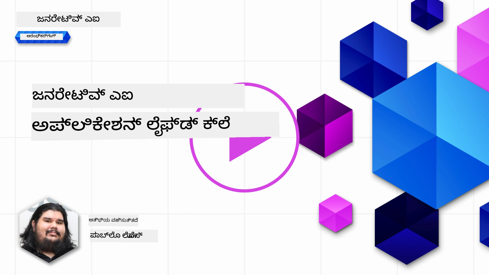
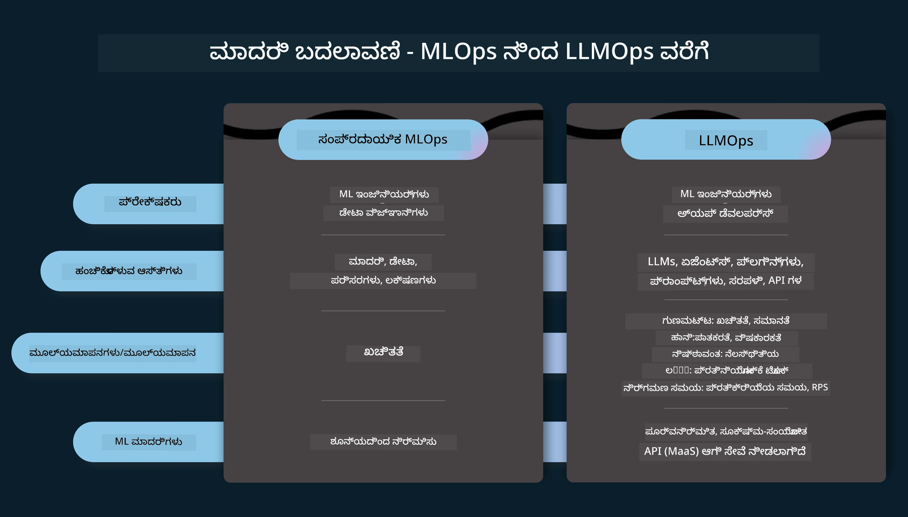
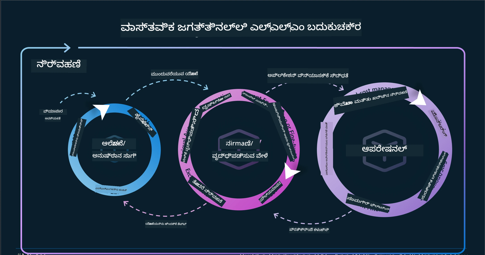
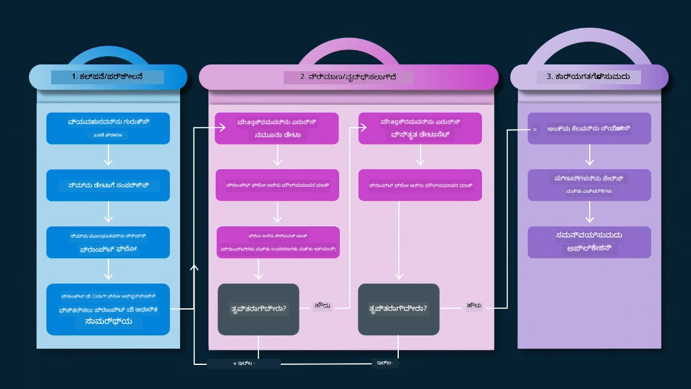
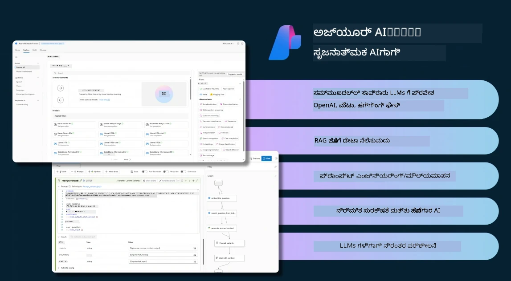
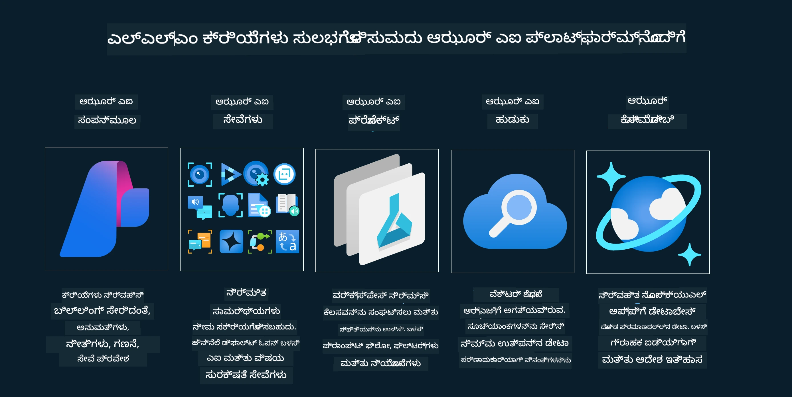
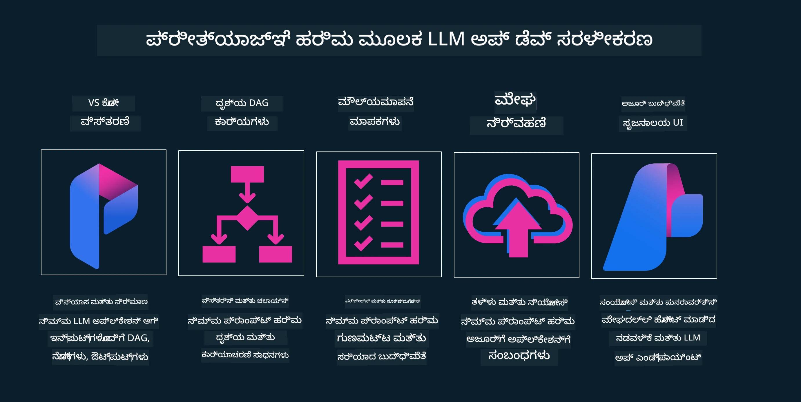

# ಜನರೇಟಿವ್ AI ಅಪ್ಲಿಕೇಶನ್ ಜೀವನಚಕ್ರ

ಎಲ್ಲಾ AI ಅಪ್ಲಿಕೇಶನ್‌ಗಳಿಗೆ ಪ್ರಮುಖವಾದ ಪ್ರಶ್ನೆ AI ವೈಶಿಷ್ಟ್ಯಗಳ ಸಂಬಂಧತೆ, ಏಕೆಂದರೆ AI ವೇಗವಾಗಿ ಅಭಿವೃದ್ಧಿಯಾಗುತ್ತಿರುವ ಕ್ಷೇತ್ರವಾಗಿದೆ, ನಿಮ್ಮ ಅಪ್ಲಿಕೇಶನ್ ಪ್ರಸ್ತುತಸಮಯಕ್ಕೆ, ವಿಶ್ವಾಸಾರ್ಹತೆ ಮತ್ತು ದೃಢತೆಯನ್ನು ಕಾಪಾಡಿಕೊಳ್ಳಲು, ನೀವು ಸತತವಾಗಿ ಅದರ ಟೈಮಿಂಗ್, ಮೌಲ್ಯಮಾಪನ ಮತ್ತು ಸುಧಾರಣೆ ಮಾಡಬೇಕಾಗುತ್ತದೆ. ಈ ಸಂದರ್ಭದಲ್ಲಿ ಜನರೇಟಿವ್ AI ಜೀವನಚಕ್ರ ಮುಖ್ಯವಾಗುತ್ತದೆ.

ಜನರೇಟಿವ್ AI ಜೀವನಚಕ್ರವು ಒಂದು ನೆಲೆಬetine ಯಾಗಿದೆ, ಇದು ಜನರೇಟಿವ್ AI ಅಪ್ಲಿಕೇಶನ್ ಅಭಿವೃದ್ಧಿ, ನಿಯೋಜನೆ ಮತ್ತು ನಿರ್ವಹಣೆಯ ಹಂತಗಳನ್ನು ಮಾರ್ಗದರ್ಶನ ಮಾಡುತ್ತದೆ. ಇದು ನಿಮ್ಮ ಗುರಿಗಳನ್ನು ವಿವರಿಸಲು, ನಿಮ್ಮ ಕಾರ್ಯಕ್ಷಮತೆಯನ್ನು ಅಳೆಯಲು, ನಿಮ್ಮ ಸಮಸ್ಯೆಗಳನ್ನು ಗುರುತಿಸಲು ಮತ್ತು ಪರಿಹಾರಗಳನ್ನು ಜಾರಿಗೆ ತರಲು ಸಹಾಯ ಮಾಡುತ್ತದೆ. ಇದು ನಿಮ್ಮ ಅಪ್ಲಿಕೇಶನ್ ಅನ್ನು ನೈತಿಕ ಮತ್ತು ಕಾನೂನು ಮಾನದಂಡಗಳೊಂದಿಗೆ ಮತ್ತು ನಿಮ್ಮ ಹಿತಾಸಕ್ತಿಗಳೊಂದಿಗೆ ಹೊಂದಾಣಿಕೆ ಮಾಡಲು ಸಹ ಸಹಾಯ ಮಾಡುತ್ತದೆ. ಜನರೇಟಿವ್ AI ಜೀವನಚಕ್ರವನ್ನು ಅನುಸರಿಸುವ ಮೂಲಕ, ನಿಮ್ಮ ಅಪ್ಲಿಕೇಶನ್ ನಿರಂತರವಾಗಿ ಮೌಲ್ಯ ನೀಡುತ್ತಿರುವುದು ಮತ್ತು ಬಳಕೆದಾರರನ್ನು ತೃಪ್ತಿಪಡಿಸುತ್ತಿರುವುದನ್ನು ಖಚಿತಪಡಿಸಿಕೊಳ್ಳಬಹುದು.

## ಪರಿಚಯ

ಈ ಅಧ್ಯಾಯದಲ್ಲಿ, ನೀವು:

- MLOps ನಿಂದ LLMOps ಗೆ ಪರಿಕಲ್ಪನೆ ಬದಲಾವಣೆಯನ್ನು ಅರ್ಥಮಾಡಿಕೊಳ್ಳುವುದು
- LLM ಜೀವನಚಕ್ರ
- ಜೀವನಚಕ್ರ ಸಾಧನಗಳು
- ಜೀವನಚಕ್ರ ಮೌಲ್ಯಮಾಪನ ಮತ್ತು ಪ್ರಾತಿನಿಧ್ಯ

## MLOps ನಿಂದ LLMOps ಗೆ ಪರಿಕಲ್ಪನೆ ಬದಲಾವಣೆಯನ್ನು ಅರ್ಥಮಾಡಿಕೊಳ್ಳು

LLMಗಳು ಕೃತಕ ಬುದ್ಧಿಮತ್ತೆಯ ಹೊಸ ಸಾಧನವಾಗಿವೆ, ಅವು ಅಪ್ಲಿಕೇಶನ್ಗಳೇ ವಿಶ್ಲೇಷಣೆ ಮತ್ತು ಉತ್ಪಾದನೆ ಕಾರ್ಯಗಳಲ್ಲಿ ಅತ್ಯಂತ ಸಾಮರ್ಥ್ಯವನ್ನು ಹೊಂದಿವೆ, ಆದರೆ ಈ ಶಕ್ತಿ AI ಮತ್ತು ಪರಂಪರাগত ಯಂತ್ರ ಅಧ್ಯಯನ ಕಾರ್ಯಗಳನ್ನು ಸರಳಗೊಳಿಸುವಲ್ಲಿ ಕೆಲವು ಪರಿಣಾಮಗಳನ್ನುಂಟುಮಾಡುತ್ತದೆ.

ಈ ಹಿನ್ನೆಲೆಯಲ್ಲಿ, ನಾವು ಈ ಸಾಧನವನ್ನು ಸಕ್ರೀಯವಾಗಿ ಮತ್ತು ಸರಿಯಾದ ಪ್ರೇರಕಗಳು ಇರುವ ರೀತಿಯಲ್ಲಿ ಅಳವಡಿಸಲು ಹೊಸ ಪರಿಕಲ್ಪನೆಯ ಅಗತ್ಯವಿದೆ. ಹಳೆಯ AI ಅಪ್ಲಿಕೇಶನ್ಗಳನ್ನು "ML ಅಪ್" ಎಂದು ವರ್ಗೀಕರಿಸಬಹುದು ಮತ್ತು ಹೊಸ AI ಅಪ್ಲಿಕೇಶನ್ಗಳನ್ನು "GenAI ಅಪ್" ಅಥವಾ ಕೆಳಗಿನ ಕಾಲದ "AI ಅಪ್ಫ್" ಎಂದು ಕರೆಯಬಹುದು, ಅದು ಆ ಸಮಯದ ಪ್ರಮುಖ ತಂತ್ರಜ್ಞಾನ ಮತ್ತು ತಂತ್ರಗಳನ್ನು ಪ್ರತಿಬಿಂಬಿಸುತ್ತದೆ. ಇದು ನಮ್ಮ ಕಥನವನ್ನು ಹಲವಾರು ರೀತಿಗಳಲ್ಲಿ ಬದಲಿಸುತ್ತದೆ, ದಯವಿಟ್ಟು ಕೆಳಗಿನ ಹೋಲಿಕೆಯನ್ನು ನೋಡಿ.

LLMOps ನಲ್ಲಿ, ನಾವು ಅಪ್ಲಿಕೇಶನ್ ಅಭಿವೃದ್ಧಿಪಡಿಸುವವರ ಮೇಲೆ ಹೆಚ್ಚು ಗಮನ ಹರಿಸುತ್ತೇವೆ, ಪ್ರಮುಖ ಅಂಶವಾಗಿ ಸಂಯೋಜನೆಗಳನ್ನು ಬಳಸಿ, "Models-as-a-Service" ಅನ್ನು ಬಳಸುತ್ತೇವೆ ಮತ್ತು ಕೆಳಗಿನ ಅಂಶಗಳನ್ನು ಚಿಂತಿಸುತ್ತೇವೆ.

- ಗುಣಮಟ್ಟ: ಪ್ರವೃತ್ತಿಯ ಗುಣಮಟ್ಟ
- ಹಾನಿ: ಜವಾಬ್ದಾರಿಯಾಗಿ AI ನಿರ್ವಹಣೆ
- ಪ್ರಾಮಾಣಿಕತೆ: ಉತ್ತರದ ಭೂತಸ್ಥಿತಿ (ಸಂವೇದನೀಯವೇ? ಸರಿಯೇ?)
- ವೆಚ್ಚ: ಪರಿಹಾರ ಬಜೆಟ್
- ವಿಳಂಬ: ಟೋಕನ್ ಪ್ರತಿಕ್ರಿಯೆಗಾಗಿ ಸರಾಸರಿ ಸಮಯ

## LLM ಜೀವನಚಕ್ರ

ಮೊದಲು, ಜೀವನಚಕ್ರವನ್ನು ಮತ್ತು ಅದರ ಬದಲಾವಣೆಗಳನ್ನು ಅರ್ಥಮಾಡಿಕೊಳ್ಳಲು, ಕೆಳಗಿನ ಜಾಹೀರಾತಿನ ಚಿತ್ರವನ್ನು ಗಮನಿಸೋಣ.

ನೀವು ಗಮನಿಸಿದಂತೆ, ಇದು ಸಾಮಾನ್ಯ MLOps ಜೀವನಚಕ್ರಗಳಿಂದ ವಿಂಗಡಿಸುತ್ತದೆ. LLMಗಳಿಗೆ ಹಲವಾರು ಹೊಸ ಅಗತ್ಯತೆಗಳಿವೆ, ಉದಾಹರಣೆಗೆ ಪ್ರಾಂಪ್ಟ್ ಇಂಜಿನಿಯರಿಂಗ್, ಗುಣಮಟ್ಟವನ್ನು ಸುಧಾರಿಸಲು ವಿಭಿನ್ನ ತಂತ್ರಗಳು (ಫೈನ್-ಟೂನಿಂಗ್, RAG, ಮೆಟಾ-ಪ್ರಾಂಪ್ಟ್‌ಗಳು), ಜವಾಬ್ದಾರಿ AI ಎಂದು ಗುರುತಿಸುವ ಮತ್ತು ಮೌಲ್ಯಮಾಪನದ ಹೊಸ ಆಕಾರಗಳು (ಗುಣಮಟ್ಟ, ಹಾನಿ, ಪ್ರಾಮಾಣಿಕತೆ, ವೆಚ್ಚ ಮತ್ತು ವಿಳಂಬ).

ಉದಾಹರಣೆಗೆ, ನಾವು ಹೇಗೆ ಕಲ್ಪನೆ ಮಾಡುತ್ತೇವೆ ಎಂಬುದನ್ನು ನೋಡೋಣ. ವಿಭಿನ್ನ LLMಗಳನ್ನು ಪ್ರಯೋಗಿಸುವ ಮೂಲಕ, ಅವರ ಊಹೆಯು ಸರಿಯಾದದೋ ಎಂದು ಪರೀಕ್ಷಿಸಲು ಪ್ರಾಂಪ್ಟ್ ಇಂಜಿನಿಯರಿಂಗ್ ಬಳಸುತ್ತೇವೆ.

ನೋಡು: ಇದು ರೇಖೀಯವಲ್ಲ, ಆದರೆ ಸಂಯೋಜಿತ ಲೂಪ್, ಪುನರಾವರ್ತನೆ ಮತ್ತು ಸುತ್ತುವಳಿ ರೂಪದಲ್ಲಿ ಇದೆ.

ನಾವು ಆ ಹಂತಗಳನ್ನು ಹೇಗೆ ಅನ್ವೇಷಿಸಬಹುದು? ಜೀವನಚಕ್ರವನ್ನು ಹೇಗೆ ನಿರ್ಮಿಸಬಹುದು ಎಂಬುದರ ವಿವರಕ್ಕೆ ಹೋಗೋಣ.

ಇದು ಸ್ವಲ್ಪ ಸಂಕೀರ್ಣವಾದಂತೆ ಕಾಣಬಹುದು, ಮೊದಲಿಗೆ ಮೂರು ಪ್ರಮುಖ ಹಂತಗಳ ಮೇಲೆ ಗಮನಹರಿಸೋಣ.

1. ಕಲ್ಪನೆ/ಅನ್ವೇಷಣೆ: ಅನ್ವೇಷಣೆ, ಇಲ್ಲಿ ನಾವು ನಮ್ಮ ವ್ಯವಹಾರ ಅಗತ್ಯಗಳಿಗೆ ಅನುಗುಣವಾಗಿ ಅನ್ವೇಷಿಸಬಹುದು. ಪ್ರೋಟೊಟೈಪಿಂಗ್, [PromptFlow](https://microsoft.github.io/promptflow/index.html?WT.mc_id=academic-105485-koreyst) ಅನ್ನು ರಚಿಸಿ ಮತ್ತು ನಮ್ಮ ಊಹೆಗೆ ಸೂಕ್ತವಾಗಿದೆ ಎಂಬುದನ್ನು ಪರೀಕ್ಷಿಸುವುದು.
1. ನಿರ್ಮಾಣ/ವೃದ್ಧಿ: ಜಾರಿಗೆ, ಈಗ ನಾವು ದೊಡ್ಡ ಡೇಟಾಸೆಟ್‌ಗಳಿಗೆ ಮೌಲ್ಯಮಾಪನ ಆರಂಭಿಸಿ, ಫೈನ್-ಟೂನಿಂಗ್ ಮತ್ತು RAG ಮುಂತಾದ ತಂತ್ರಗಳನ್ನು ಅನುಷ್ಠಾನಗೊಳಿಸುತ್ತೇವೆ, ಪರಿಹಾರದ ದೃಢತೆಯನ್ನು ಪರಿಶೀಲಿಸುವುದು. ಅದು ಕೆಲಸ ಮಾಡದಿದ್ದರೆ, ಅದನ್ನು ಮறு ಜಾರಿಗೆ ತಂದೆ ಹೊಂದಿಸಬಹುದು, ಹೊಸ ಹಂತಗಳನ್ನು ಸೇರಿಸಬಹುದು ಅಥವಾ ಡೇಟಾವನ್ನು ಪುನರ್‌ರಚನೆ ಮಾಡಬಹುದು. ನಮ್ಮ ಕಾರ್ಯವನ್ನು ಮತ್ತು ವ್ಯಾಪ್ತಿಯನ್ನು ಪರೀಕ್ಷಿಸಿದ ಮೇಲೆ, ಅದು ಕೆಲಸ ಮಾಡುತ್ತದಾದರೆ ಮತ್ತು ನಮ್ಮ ಮಿತಿಗಳನ್ನೂ ತೃಪ್ತಿಪಡಿಸಿದರೆ, ಮುಂದಿನ ಹಂತಕ್ಕೆ ಸಿದ್ಧವಾಗಿರುತ್ತದೆ.
1. ಕಾರ್ಯಾಚರಣೆ: ಸಂಯೋಜನೆ, ಈಗ ನಮ್ಮ ವ್ಯವಸ್ಥೆಗೆ ಮೇಲ್ವಿಚാരണ ಮತ್ತು ಎಚ್ಚರಿಕೆ ವ್ಯವಸ್ಥೆಗಳನ್ನೂ ಸೇರಿಸಿ, ಜಾರಿಗೆ ಮತ್ತು ಅಪ್ಲಿಕೇಶನ್ ಸಂಯೋಜನೆ.

ನಂತರ, ಭದ್ರತೆ, ಅಳವಡಿಕೆ ಮತ್ತು ಆಡಳಿತದ ಮೇಲೆ ಗಮನಹರಿಸುವ ವ್ಯವಸ್ಥಾಪನೆಯ ಸುತ್ತುವಳಿ ಇದೆ.

ಹೃತ್ಪೂರ್ವಕ ಅಭಿನಂದನೆಗಳು, ಈಗ ನಿಮಗೆ ನಿಮ್ಮ AI ಅಪ್ಲಿಕೇಶನ್ ಕಾರ್ಯಾಚರಣೆಗೆ ಸಿದ್ಧವಾಗಿದೆ. ಕೈಯಲ್ಲಿ ಅನುಭವಕ್ಕಾಗಿ, [Contoso Chat ಡೆಮೋ](https://nitya.github.io/contoso-chat/?WT.mc_id=academic-105485-koreyst) ನೋಡಿ.

ಈಗ, ನಾವು ಯಾವ ಸಾಧನಗಳನ್ನು ಉಪಯೋಗಿಸಬಹುದು?

## ಜೀವನಚಕ್ರ ಸಾಧನಗಳು

ಸಾಧನಗಳಿಗಾಗಿ, Microsoft [Azure AI ವೇದಿಕೆ](https://azure.microsoft.com/solutions/ai/?WT.mc_id=academic-105485-koreyst) ಮತ್ತು [PromptFlow](https://microsoft.github.io/promptflow/index.html?WT.mc_id=academic-105485-koreyst) ನಿಮ್ಮ ಜೀವನಚಕ್ರಗಳನ್ನು ಸುಗಮವಾಗಿ ಜಾರಿಗೆ ತರಲು ಸಹಾಯ ಮಾಡುತ್ತವೆ.

[Azure AI ವೇದಿಕೆ](https://azure.microsoft.com/solutions/ai/?WT.mc_id=academic-105485-koreyst) ಮೂಲಕ ನೀವು [AI ಸ್ಟುಡಿಯೋ](https://ai.azure.com/?WT.mc_id=academic-105485-koreyst) ಬಳಸಬಹುದು. AI ಸ್ಟುಡಿಯೋ ಒಂದು ವೆಬ್ ಪೋರ್ಟಲ್ ಆಗಿದ್ದು, ಮಾದರಿಗಳು, ಮಾದರಿ ಉದಾಹರಣೆಗಳು ಮತ್ತು ಸಾಧನಗಳನ್ನು ಅನ್ವೇಷಿಸಲು ಅನುಮತಿಸುತ್ತದೆ. ನಿಮ್ಮ ಸಂಪನ್ಮೂಲಗಳನ್ನು ನಿರ್ವಹಿಸುವುದು, UI ಅಭಿವೃದ್ಧಿ ಕಾರ್ಯಪ್ರವಾಹಗಳು ಮತ್ತು SDK/CLI ಆಯ್ಕೆಗಳೊಂದಿಗೆ ಕೋಡ್-ಪ್ರಥಮ ಅಭಿವೃದ್ಧಿ ಮಾಡಬಹುದು.

Azure AI ವಿವಿಧ ಸಂಪನ್ಮೂಲಗಳನ್ನು ನಿಮ್ಮ ಕಾರ್ಯಾಚರಣೆಗಳು, ಸೇವೆಗಳು, ಪ್ರಾಜೆಕ್ಟ್ಗಳು, ವೆಕ್ಟರ್ ಹುಡುಕಾಟ ಮತ್ತು ಡೇಟಾಬೇಸ್ ಅಗತ್ಯಗಳನ್ನು ನಿರ್ವಹಿಸಲು ಅವಕಾಶ ನೀಡುತ್ತದೆ.

ಸಂರಚಿಸಿ, ಪರೀಕ್ಷೆ ಮಾಡಿ ಮತ್ತು PromptFlow ಮೂಲಕ ದೊಡ್ಡ ಪ್ರಮಾಣದ ಅಪ್ಲಿಕೇಶನ್‌ಗಳ ವರೆಗೆ ಅಭಿವೃದ್ಧಿಪಡಿಸಿ:

- VS ಕೋಡ್‌ನಿಂದ ಅಪ್ಲಿಕೇಶನ್ಗಳ ವಿನ್ಯಾಸ ಮತ್ತು ನಿರ್ಮಾಣ, ದೃಶ್ಯ ಮತ್ತು ಕಾರ್ಯಾತ್ಮಕ ಸಾಧನಗಳೊಂದಿಗೆ
- ಸುಲಭವಾಗಿ ನಿಮ್ಮ ಅಪ್ಲಿಕೇಶನ್ಗಳ ಗುಣಮಟ್ಟದ AIಕ್ಕಾಗಿ ಪರೀಕ್ಷಿಸಿ ಮತ್ತು ಫೈನ್-ಟೂನ್ ಮಾಡಿ.
- Azure AI ಸ್ಟುಡಿಯೋ ಬಳಸಿಕೊಂಡು ಮೋಡದಲ್ಲಿ ಸಂಯೋಜಿಸಿ, ಪುಷ್ ಮಾಡಿ ಮತ್ತು ಜಾರಿಗೆ ಅನ್ವಯಿಸಿ.

## ಅದ್ಭುತ! ನಿಮ್ಮ ಅಧ್ಯಯನವನ್ನು ಮುಂದುವರಿಸಿ!

ವಿಸ್ಮಯಕಾರಿ, ಈಗ ನಾವು ಒಂದು ಅಪ್ಲಿಕೇಶನ್ ಅನ್ನು ಹೇಗೆ ರಚಿಸುವೋ ಅದನ್ನು ಮತ್ತಷ್ಟು ಕಲಿಯೋಣ, [Contoso ಚಾಟ್ ಅಪ್ಲಿಕೇಶನ್](https://nitya.github.io/contoso-chat/?WT.mc_id=academic-105485-koreyst) ಮೂಲಕ, ಕ್ಲೌಡ್ ಅಡ್ವೋಕಸಿ ಈ ತತ್ತ್ವಗಳನ್ನು ಪ್ರದರ್ಶನಗಳಲ್ಲಿ ಹೇಗೆ ಸೇರಿಸುತ್ತದೆ ಎಂದು ಪರಿಗಣಿಸಿ. ಹೆಚ್ಚಿನ ವಿಷಯಕ್ಕಾಗಿ, ನಮ್ಮ [Ignite ಬ್ರೇಕ್‌ಆউಟ್ ಸೆಷನ್!](https://www.youtube.com/watch?v=DdOylyrTOWg) ನೋಡಿ.

ಈಗ, ಪಾಠ 15 ನೋಡಿ, [Retrieval Augmented Generation ಮತ್ತು ವೆಕ್ಟರ್ ಡೇಟಾಬೇಸ್‌ಗಳು](../15-rag-and-vector-databases/README.md?WT.mc_id=academic-105485-koreyst) ಜನರೇಟಿವ್ AI ಮೇಲೆ ಎಂಥ ಪರಿಣಾಮ ಬೀರುತ್ತವೆ ಮತ್ತು ಅಪ್ಲಿಕೇಶನ್ಗಳನ್ನು ಮತ್ತಷ್ಟು ಆಕರ್ಷಕ ಮಾಡುತ್ತವೆ ಎನ್ನು ತಿಳಿದುಕೊಳ್ಳಿ!

---

<!-- CO-OP TRANSLATOR DISCLAIMER START -->
**ಒಪ್ಪಂದ ಹೀಗಿದೆ**:
ಈ ದಸ್ತಾವೇಜನ್ನು AI ಅನುವಾದ ಸೇವೆ [Co-op Translator](https://github.com/Azure/co-op-translator) ಬಳಸಿಕೊಂಡು ಅನುವಾದಿಸಲಾಗಿದೆ. ನಾವು ನಿಖರತೆಗಾಗಿ ಪ್ರಯತ್ನಿಸಿದರೂ, ಸ್ವಯಂಚಾಲಿತ ಅನುವಾದಗಳಲ್ಲಿ ದೋಷಗಳು ಅಥವಾ ತಪ್ಪುತೆಗಳಾಗಬಹುದು ಎಂಬುದನ್ನು ದಯವಿಟ್ಟು ಗಮನದಲ್ಲಿರಲಿ. ಮೂಲ ಭಾಷೆಯಲ್ಲಿರುವ ಮೂಲ ದಸ್ತಾವೇಜು ಅಧಿಕೃತ ಮೂಲವಾಗಿರುವುದು ಪರಿಗಣಿಸಬೇಕು. ಅತ್ಯಂತ ಮುಖ್ಯ ಮಾಹಿತಿಗಾಗಿ, ವೃತ್ತಿಪರ ಮಾನವಿ ಅನುವಾದವನ್ನು ಸಲಹೆ ಮಾಡಲಾಗುತ್ತದೆ. ಈ ಅನುವಾದ ಬಳಕೆಯಿಂದ ಉಂಟಾಗುವ ಯಾವುದೇ ಅರ್ಥಮಾಡಿಕೊಳ್ಳುವ ಭಿನ್ನತೆ ಅಥವಾ ತಪ್ಪಾಗುವಿಕೆಗೆ ನಾವು ಹೊಣೆಗಾರರಾಗಲಾರೆವು.
<!-- CO-OP TRANSLATOR DISCLAIMER END -->