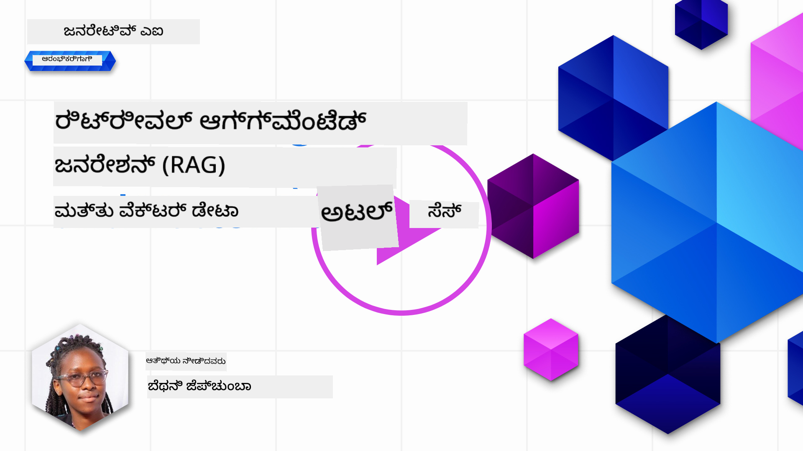
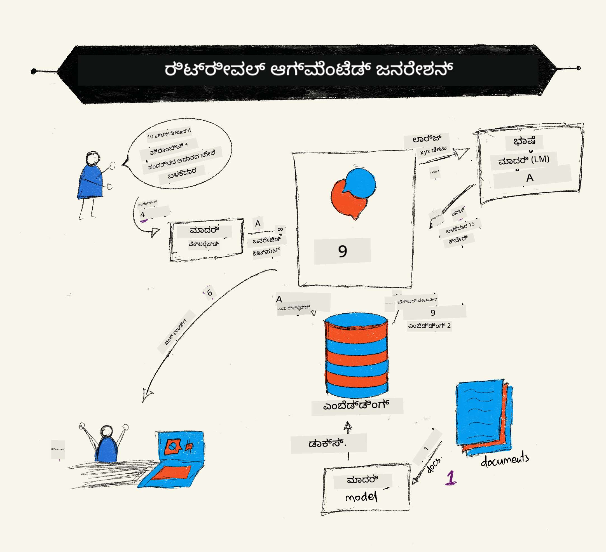

<!--
CO_OP_TRANSLATOR_METADATA:
{
  "original_hash": "b4b0266fbadbba7ded891b6485adc66d",
  "translation_date": "2025-12-19T20:40:04+00:00",
  "source_file": "15-rag-and-vector-databases/README.md",
  "language_code": "kn"
}
-->
# ರಿಟ್ರೀವಲ್ ಆಗ್ಮೆಂಟೆಡ್ ಜನರೇಶನ್ (RAG) ಮತ್ತು ವೆಕ್ಟರ್ ಡೇಟಾಬೇಸ್‌ಗಳು

[](https://youtu.be/4l8zhHUBeyI?si=BmvDmL1fnHtgQYkL)

ಸರ್ಚ್ ಅಪ್ಲಿಕೇಶನ್‌ಗಳ ಪಾಠದಲ್ಲಿ, ನಾವು ಸಂಕ್ಷಿಪ್ತವಾಗಿ ನಿಮ್ಮ ಸ್ವಂತ ಡೇಟಾವನ್ನು ಲಾರ್ಜ್ ಲ್ಯಾಂಗ್ವೇಜ್ ಮಾದರಿಗಳಲ್ಲಿ (LLMs) ಹೇಗೆ ಸಂಯೋಜಿಸುವುದೆಂದು ಕಲಿತಿದ್ದೇವೆ. ಈ ಪಾಠದಲ್ಲಿ, ನಾವು ನಿಮ್ಮ ಡೇಟಾವನ್ನು ನಿಮ್ಮ LLM ಅಪ್ಲಿಕೇಶನ್‌ನಲ್ಲಿ ನೆಲಗೊಳಿಸುವ ತತ್ವಗಳು, ಪ್ರಕ್ರಿಯೆಯ ಯಾಂತ್ರಿಕತೆ ಮತ್ತು ಡೇಟಾ ಸಂಗ್ರಹಿಸುವ ವಿಧಾನಗಳು, ಅಂದರೆ ಎಂಬೆಡ್ಡಿಂಗ್‌ಗಳು ಮತ್ತು ಪಠ್ಯವನ್ನು ಒಳಗೊಂಡಂತೆ, ಇನ್ನಷ್ಟು ಆಳವಾಗಿ ಅಧ್ಯಯನ ಮಾಡುತ್ತೇವೆ.

> **ವೀಡಿಯೋ ಶೀಘ್ರದಲ್ಲೇ ಬರುತ್ತಿದೆ**

## ಪರಿಚಯ

ಈ ಪಾಠದಲ್ಲಿ ನಾವು ಕೆಳಗಿನ ವಿಷಯಗಳನ್ನು ಒಳಗೊಂಡಿದ್ದೇವೆ:

- RAG ಗೆ ಪರಿಚಯ, ಅದು ಏನು ಮತ್ತು AI (ಕೃತಕ ಬುದ್ಧಿಮತ್ತೆ) ಯಲ್ಲಿ ಅದನ್ನು ಏಕೆ ಬಳಸಲಾಗುತ್ತದೆ ಎಂಬುದು.

- ವೆಕ್ಟರ್ ಡೇಟಾಬೇಸ್‌ಗಳು ಏನೆಂದು ಅರ್ಥಮಾಡಿಕೊಳ್ಳುವುದು ಮತ್ತು ನಮ್ಮ ಅಪ್ಲಿಕೇಶನ್‌ಗೆ ಒಂದು ರಚಿಸುವುದು.

- RAG ಅನ್ನು ಅಪ್ಲಿಕೇಶನ್‌ಗೆ ಹೇಗೆ ಸಂಯೋಜಿಸುವುದರ ಪ್ರಾಯೋಗಿಕ ಉದಾಹರಣೆ.

## ಕಲಿಕೆಯ ಗುರಿಗಳು

ಈ ಪಾಠವನ್ನು ಪೂರ್ಣಗೊಳಿಸಿದ ನಂತರ, ನೀವು ಸಾಧ್ಯವಾಗುವುದು:

- ಡೇಟಾ ರಿಟ್ರೀವಲ್ ಮತ್ತು ಪ್ರಕ್ರಿಯೆಯಲ್ಲಿ RAG ಯ ಮಹತ್ವವನ್ನು ವಿವರಿಸುವುದು.

- RAG ಅಪ್ಲಿಕೇಶನ್ ಅನ್ನು ಸೆಟ್‌ಅಪ್ ಮಾಡಿ ನಿಮ್ಮ ಡೇಟಾವನ್ನು LLM ಗೆ ನೆಲಗೊಳಿಸುವುದು.

- LLM ಅಪ್ಲಿಕೇಶನ್‌ಗಳಲ್ಲಿ RAG ಮತ್ತು ವೆಕ್ಟರ್ ಡೇಟಾಬೇಸ್‌ಗಳ ಪರಿಣಾಮಕಾರಿಯಾದ ಸಂಯೋಜನೆ.

## ನಮ್ಮ ದೃಶ್ಯ: ನಮ್ಮ ಸ್ವಂತ ಡೇಟಾ ಮೂಲಕ ನಮ್ಮ LLM ಗಳನ್ನು ಸುಧಾರಿಸುವುದು

ಈ ಪಾಠಕ್ಕಾಗಿ, ನಾವು ಶಿಕ್ಷಣ ಸ್ಟಾರ್ಟ್ಅಪ್‌ಗೆ ನಮ್ಮ ಸ್ವಂತ ಟಿಪ್ಪಣಿಗಳನ್ನು ಸೇರಿಸಲು ಬಯಸುತ್ತೇವೆ, ಇದು ಚಾಟ್‌ಬಾಟ್‌ಗೆ ವಿಭಿನ್ನ ವಿಷಯಗಳ ಬಗ್ಗೆ ಹೆಚ್ಚಿನ ಮಾಹಿತಿಯನ್ನು ಪಡೆಯಲು ಸಹಾಯ ಮಾಡುತ್ತದೆ. ನಮ್ಮ ಬಳಿ ಇರುವ ಟಿಪ್ಪಣಿಗಳನ್ನು ಬಳಸಿ, ಕಲಿಯುವವರು ಉತ್ತಮವಾಗಿ ಅಧ್ಯಯನ ಮಾಡಬಹುದು ಮತ್ತು ವಿಭಿನ್ನ ವಿಷಯಗಳನ್ನು ಅರ್ಥಮಾಡಿಕೊಳ್ಳಬಹುದು, ಇದರಿಂದ ಅವರ ಪರೀಕ್ಷೆಗಳಿಗೆ ಪುನರಾವೃತ್ತಿ ಸುಲಭವಾಗುತ್ತದೆ. ನಮ್ಮ ದೃಶ್ಯವನ್ನು ರಚಿಸಲು, ನಾವು ಬಳಸುತ್ತೇವೆ:

- `Azure OpenAI:` ನಾವು ನಮ್ಮ ಚಾಟ್‌ಬಾಟ್ ರಚಿಸಲು ಬಳಸುವ LLM

- `AI for beginners' lesson on Neural Networks:` ಇದು ನಮ್ಮ LLM ಗೆ ನೆಲಗೊಳಿಸುವ ಡೇಟಾ

- `Azure AI Search` ಮತ್ತು `Azure Cosmos DB:` ನಮ್ಮ ಡೇಟಾವನ್ನು ಸಂಗ್ರಹಿಸಲು ಮತ್ತು ಸರ್ಚ್ ಇಂಡೆಕ್ಸನ್ನು ರಚಿಸಲು ವೆಕ್ಟರ್ ಡೇಟಾಬೇಸ್

ಬಳಕೆದಾರರು ತಮ್ಮ ಟಿಪ್ಪಣಿಗಳಿಂದ ಅಭ್ಯಾಸ ಪ್ರಶ್ನೋತ್ತರಗಳನ್ನು ರಚಿಸಬಹುದು, ಪುನರಾವೃತ್ತಿ ಫ್ಲಾಶ್ ಕಾರ್ಡ್‌ಗಳನ್ನು ಮಾಡಬಹುದು ಮತ್ತು ಅದನ್ನು ಸಂಕ್ಷಿಪ್ತ ಅವಲೋಕನಗಳಿಗೆ ಸಾರಾಂಶಗೊಳಿಸಬಹುದು. ಪ್ರಾರಂಭಿಸಲು, RAG ಏನು ಮತ್ತು ಅದು ಹೇಗೆ ಕೆಲಸ ಮಾಡುತ್ತದೆ ಎಂಬುದನ್ನು ನೋಡೋಣ:

## ರಿಟ್ರೀವಲ್ ಆಗ್ಮೆಂಟೆಡ್ ಜನರೇಶನ್ (RAG)

ಒಂದು LLM ಚಾಲಿತ ಚಾಟ್‌ಬಾಟ್ ಬಳಕೆದಾರರ ಪ್ರಾಂಪ್ಟ್‌ಗಳನ್ನು ಪ್ರಕ್ರಿಯೆ ಮಾಡಿ ಪ್ರತಿಕ್ರಿಯೆಗಳನ್ನು ರಚಿಸುತ್ತದೆ. ಇದು ಸಂವಹನಾತ್ಮಕವಾಗಿದ್ದು, ಬಳಕೆದಾರರೊಂದಿಗೆ ವಿವಿಧ ವಿಷಯಗಳ ಮೇಲೆ ಸಂವಹನ ಮಾಡುತ್ತದೆ. ಆದಾಗ್ಯೂ, ಅದರ ಪ್ರತಿಕ್ರಿಯೆಗಳು ನೀಡಲಾದ ಸಾಂದರ್ಭಿಕತೆ ಮತ್ತು ಅದರ ಮೂಲಭೂತ ತರಬೇತಿ ಡೇಟಾವಿಗೆ ಸೀಮಿತವಾಗಿವೆ. ಉದಾಹರಣೆಗೆ, GPT-4 ಜ್ಞಾನ ಕಡಿತವು ಸೆಪ್ಟೆಂಬರ್ 2021, ಅಂದರೆ, ಈ ಅವಧಿಯ ನಂತರ ನಡೆದ ಘಟನೆಗಳ ಬಗ್ಗೆ ಜ್ಞಾನವಿಲ್ಲ. ಜೊತೆಗೆ, LLM ಗಳನ್ನು ತರಬೇತಿಗೆ ಬಳಸಿದ ಡೇಟಾ ವೈಯಕ್ತಿಕ ಟಿಪ್ಪಣಿಗಳು ಅಥವಾ ಕಂಪನಿಯ ಉತ್ಪನ್ನ ಕೈಪಿಡಿ ಮುಂತಾದ ರಹಸ್ಯ ಮಾಹಿತಿಯನ್ನು ಒಳಗೊಂಡಿಲ್ಲ.

### RAG ಗಳು (ರಿಟ್ರೀವಲ್ ಆಗ್ಮೆಂಟೆಡ್ ಜನರೇಶನ್) ಹೇಗೆ ಕೆಲಸ ಮಾಡುತ್ತವೆ



ನೀವು ನಿಮ್ಮ ಟಿಪ್ಪಣಿಗಳಿಂದ ಪ್ರಶ್ನೋತ್ತರಗಳನ್ನು ರಚಿಸುವ ಚಾಟ್‌ಬಾಟ್ ಅನ್ನು ನಿಯೋಜಿಸಲು ಬಯಸಿದರೆ, ನಿಮಗೆ ಜ್ಞಾನ ಆಧಾರದೊಂದಿಗೆ ಸಂಪರ್ಕ ಬೇಕಾಗುತ್ತದೆ. ಇದಕ್ಕೆ RAG ಸಹಾಯ ಮಾಡುತ್ತದೆ. RAG ಗಳು ಕೆಳಗಿನಂತೆ ಕಾರ್ಯನಿರ್ವಹಿಸುತ್ತವೆ:

- **ಜ್ಞಾನ ಆಧಾರ:** ರಿಟ್ರೀವಲ್‌ಗಿಂತ ಮುಂಚೆ, ಈ ದಾಖಲೆಗಳನ್ನು ಒಳಗೊಂಡು ಪೂರ್ವಪ್ರಕ್ರಿಯೆ ಮಾಡಬೇಕು, ಸಾಮಾನ್ಯವಾಗಿ ದೊಡ್ಡ ದಾಖಲೆಗಳನ್ನು ಸಣ್ಣ ತುಂಡುಗಳಾಗಿ ವಿಭಜಿಸಿ, ಅವುಗಳನ್ನು ಪಠ್ಯ ಎಂಬೆಡ್ಡಿಂಗ್‌ಗಳಾಗಿ ಪರಿವರ್ತಿಸಿ ಮತ್ತು ಡೇಟಾಬೇಸ್‌ನಲ್ಲಿ ಸಂಗ್ರಹಿಸುವುದು.

- **ಬಳಕೆದಾರ ಪ್ರಶ್ನೆ:** ಬಳಕೆದಾರರು ಪ್ರಶ್ನೆ ಕೇಳುತ್ತಾರೆ

- **ರಿಟ್ರೀವಲ್:** ಬಳಕೆದಾರರು ಪ್ರಶ್ನೆ ಕೇಳಿದಾಗ, ಎಂಬೆಡ್ಡಿಂಗ್ ಮಾದರಿ ನಮ್ಮ ಜ್ಞಾನ ಆಧಾರದಿಂದ ಸಂಬಂಧಿತ ಮಾಹಿತಿಯನ್ನು ಪಡೆದು, ಅದನ್ನು ಪ್ರಾಂಪ್ಟ್‌ಗೆ ಸೇರಿಸಲಾಗುತ್ತದೆ.

- **ಆಗ್ಮೆಂಟೆಡ್ ಜನರೇಶನ್:** LLM ತನ್ನ ಪ್ರತಿಕ್ರಿಯೆಯನ್ನು ಪಡೆದ ಡೇಟಾ ಆಧಾರಿತವಾಗಿ ಸುಧಾರಿಸುತ್ತದೆ. ಇದು ಪೂರ್ವ-ತರಬೇತಿಗೊಳಿಸಿದ ಡೇಟಾ ಮಾತ್ರವಲ್ಲದೆ ಸೇರಿಸಿದ ಸಾಂದರ್ಭಿಕ ಮಾಹಿತಿಯಿಂದ ಕೂಡ ಪ್ರತಿಕ್ರಿಯೆ ರಚಿಸಲು ಅನುಮತಿಸುತ್ತದೆ. ಪಡೆದ ಡೇಟಾ LLM ಪ್ರತಿಕ್ರಿಯೆಗಳನ್ನು ಹೆಚ್ಚಿಸಲು ಬಳಸಲಾಗುತ್ತದೆ. ನಂತರ LLM ಬಳಕೆದಾರರ ಪ್ರಶ್ನೆಗೆ ಉತ್ತರ ನೀಡುತ್ತದೆ.


RAG ಗಾಗಿ ವಿನ್ಯಾಸವು ಟ್ರಾನ್ಸ್‌ಫಾರ್ಮರ್‌ಗಳನ್ನು ಬಳಸಿಕೊಂಡು ಎರಡು ಭಾಗಗಳನ್ನು ಹೊಂದಿದೆ: ಎನ್‌ಕೋಡರ್ ಮತ್ತು ಡಿಕೋಡರ್. ಉದಾಹರಣೆಗೆ, ಬಳಕೆದಾರರು ಪ್ರಶ್ನೆ ಕೇಳಿದಾಗ, ಇನ್‌ಪುಟ್ ಪಠ್ಯವನ್ನು ಪದಗಳ ಅರ್ಥವನ್ನು ಹಿಡಿದಿಡುವ ವೆಕ್ಟರ್‌ಗಳಾಗಿ 'ಎನ್‌ಕೋಡ್' ಮಾಡಲಾಗುತ್ತದೆ ಮತ್ತು ಆ ವೆಕ್ಟರ್‌ಗಳನ್ನು ನಮ್ಮ ಡಾಕ್ಯುಮೆಂಟ್ ಇಂಡೆಕ್ಸ್ನಲ್ಲಿ 'ಡಿಕೋಡ್' ಮಾಡಿ ಬಳಕೆದಾರರ ಪ್ರಶ್ನೆಯ ಆಧಾರದ ಮೇಲೆ ಹೊಸ ಪಠ್ಯವನ್ನು ರಚಿಸಲಾಗುತ್ತದೆ. LLM ಎರಡೂ ಎನ್‌ಕೋಡರ್-ಡಿಕೋಡರ್ ಮಾದರಿಯನ್ನು ಬಳಸುತ್ತದೆ.

ಪ್ರಸ್ತಾವಿತ ಪೇಪರ್ [Retrieval-Augmented Generation for Knowledge intensive NLP (natural language processing software) Tasks](https://arxiv.org/pdf/2005.11401.pdf?WT.mc_id=academic-105485-koreyst) ಪ್ರಕಾರ RAG ಅನುಷ್ಠಾನಕ್ಕೆ ಎರಡು ವಿಧಾನಗಳಿವೆ:

- **_RAG-Sequence_**: ಬಳಕೆದಾರರ ಪ್ರಶ್ನೆಗೆ ಅತ್ಯುತ್ತಮ ಉತ್ತರವನ್ನು ಭವಿಷ್ಯವಾಣಿ ಮಾಡಲು ಪಡೆದ ದಾಖಲೆಗಳನ್ನು ಬಳಸುವುದು

- **RAG-Token**: ಮುಂದಿನ ಟೋಕನ್ ರಚಿಸಲು ದಾಖಲೆಗಳನ್ನು ಬಳಸುವುದು, ನಂತರ ಅವುಗಳನ್ನು ಬಳಕೆದಾರರ ಪ್ರಶ್ನೆಗೆ ಉತ್ತರಿಸಲು ಪಡೆಯುವುದು

### ನೀವು RAG ಗಳನ್ನು ಏಕೆ ಬಳಸಬೇಕು?

- **ಮಾಹಿತಿ ಸಮೃದ್ಧಿ:** ಪಠ್ಯ ಪ್ರತಿಕ್ರಿಯೆಗಳು ನವೀನ ಮತ್ತು ಪ್ರಸ್ತುತವಾಗಿರುತ್ತವೆ. ಇದರಿಂದ ಡೊಮೇನ್ ವಿಶೇಷ ಕಾರ್ಯಗಳಲ್ಲಿ ಕಾರ್ಯಕ್ಷಮತೆ ಹೆಚ್ಚುತ್ತದೆ, ಆಂತರಿಕ ಜ್ಞಾನ ಆಧಾರವನ್ನು ಪ್ರವೇಶಿಸುವ ಮೂಲಕ.

- ಬಳಕೆದಾರರ ಪ್ರಶ್ನೆಗಳಿಗೆ ಸಾಂದರ್ಭಿಕತೆ ನೀಡಲು ಜ್ಞಾನ ಆಧಾರದಲ್ಲಿ **ಪರಿಶೀಲಿಸಬಹುದಾದ ಡೇಟಾ** ಬಳಸಿ ಸುಳ್ಳು ಮಾಹಿತಿ ಕಡಿಮೆ ಮಾಡುತ್ತದೆ.

- LLM ಅನ್ನು ಫೈನ್-ಟ್ಯೂನ್ ಮಾಡುವುದಕ್ಕಿಂತ **ಖರ್ಚು ಪರಿಣಾಮಕಾರಿಯಾಗಿದೆ**.

## ಜ್ಞಾನ ಆಧಾರ ರಚನೆ

ನಮ್ಮ ಅಪ್ಲಿಕೇಶನ್ ನಮ್ಮ ವೈಯಕ್ತಿಕ ಡೇಟಾದ ಮೇಲೆ ಆಧಾರಿತವಾಗಿದೆ, ಅಂದರೆ AI For Beginners ಪಠ್ಯಕ್ರಮದ Neural Network ಪಾಠ.

### ವೆಕ್ಟರ್ ಡೇಟಾಬೇಸ್‌ಗಳು

ಸಾಂಪ್ರದಾಯಿಕ ಡೇಟಾಬೇಸ್‌ಗಳಿಗಿಂತ ಭಿನ್ನವಾಗಿ, ವೆಕ್ಟರ್ ಡೇಟಾಬೇಸ್‌ಗಳು ಎಂಬೆಡ್ಡಿಂಗ್ ವೆಕ್ಟರ್‌ಗಳನ್ನು ಸಂಗ್ರಹಿಸಲು, ನಿರ್ವಹಿಸಲು ಮತ್ತು ಹುಡುಕಲು ವಿನ್ಯಾಸಗೊಳಿಸಲಾದ ವಿಶೇಷ ಡೇಟಾಬೇಸ್‌ಗಳಾಗಿವೆ. ಇದು ದಾಖಲೆಗಳ ಸಂಖ್ಯಾತ್ಮಕ ಪ್ರತಿನಿಧಾನಗಳನ್ನು ಸಂಗ್ರಹಿಸುತ್ತದೆ. ಡೇಟಾವನ್ನು ಸಂಖ್ಯಾತ್ಮಕ ಎಂಬೆಡ್ಡಿಂಗ್‌ಗಳಾಗಿ ವಿಭಜಿಸುವುದು ನಮ್ಮ AI ವ್ಯವಸ್ಥೆಗೆ ಡೇಟಾವನ್ನು ಅರ್ಥಮಾಡಿಕೊಳ್ಳಲು ಮತ್ತು ಪ್ರಕ್ರಿಯೆ ಮಾಡಲು ಸುಲಭವಾಗಿಸುತ್ತದೆ.

ನಾವು ನಮ್ಮ ಎಂಬೆಡ್ಡಿಂಗ್‌ಗಳನ್ನು ವೆಕ್ಟರ್ ಡೇಟಾಬೇಸ್‌ಗಳಲ್ಲಿ ಸಂಗ್ರಹಿಸುತ್ತೇವೆ ಏಕೆಂದರೆ LLM ಗಳು ಇನ್‌ಪುಟ್ ಆಗಿ ಸ್ವೀಕರಿಸುವ ಟೋಕನ್‌ಗಳ ಸಂಖ್ಯೆಗೆ ಮಿತಿ ಇರುತ್ತದೆ. ಸಂಪೂರ್ಣ ಎಂಬೆಡ್ಡಿಂಗ್‌ಗಳನ್ನು LLM ಗೆ ನೀಡಲು ಸಾಧ್ಯವಿಲ್ಲ, ಆದ್ದರಿಂದ ಅವುಗಳನ್ನು ತುಂಡುಗಳಾಗಿ ವಿಭಜಿಸಬೇಕು ಮತ್ತು ಬಳಕೆದಾರರು ಪ್ರಶ್ನೆ ಕೇಳಿದಾಗ, ಪ್ರಶ್ನೆಗೆ ಅತ್ಯಂತ ಹೊಂದಿಕೆಯಾಗುವ ಎಂಬೆಡ್ಡಿಂಗ್‌ಗಳನ್ನು ಪ್ರಾಂಪ್ಟ್ ಜೊತೆಗೆ ಹಿಂತಿರುಗಿಸಲಾಗುತ್ತದೆ. ತುಂಡುಗಳಾಗಿ ವಿಭಜಿಸುವುದು LLM ಮೂಲಕ ಸಾಗುವ ಟೋಕನ್‌ಗಳ ಸಂಖ್ಯೆಯ ಖರ್ಚುಗಳನ್ನು ಕೂಡ ಕಡಿಮೆ ಮಾಡುತ್ತದೆ.

ಕೆಲವು ಜನಪ್ರಿಯ ವೆಕ್ಟರ್ ಡೇಟಾಬೇಸ್‌ಗಳು: Azure Cosmos DB, Clarifyai, Pinecone, Chromadb, ScaNN, Qdrant ಮತ್ತು DeepLake. ನೀವು ಕೆಳಗಿನ ಆಜುರ್ CLI ಕಮಾಂಡ್ ಬಳಸಿ Azure Cosmos DB ಮಾದರಿಯನ್ನು ರಚಿಸಬಹುದು:

```bash
az login
az group create -n <resource-group-name> -l <location>
az cosmosdb create -n <cosmos-db-name> -r <resource-group-name>
az cosmosdb list-keys -n <cosmos-db-name> -g <resource-group-name>
```

### ಪಠ್ಯದಿಂದ ಎಂಬೆಡ್ಡಿಂಗ್‌ಗಳಿಗೆ

ನಾವು ಡೇಟಾವನ್ನು ಸಂಗ್ರಹಿಸುವ ಮೊದಲು, ಅದನ್ನು ಡೇಟಾಬೇಸ್‌ನಲ್ಲಿ ಸಂಗ್ರಹಿಸುವ ಮೊದಲು ವೆಕ್ಟರ್ ಎಂಬೆಡ್ಡಿಂಗ್‌ಗಳಾಗಿ ಪರಿವರ್ತಿಸಬೇಕಾಗುತ್ತದೆ. ನೀವು ದೊಡ್ಡ ದಾಖಲೆಗಳು ಅಥವಾ ದೀರ್ಘ ಪಠ್ಯಗಳೊಂದಿಗೆ ಕೆಲಸ ಮಾಡುತ್ತಿದ್ದರೆ, ನೀವು ನಿರೀಕ್ಷಿಸುವ ಪ್ರಶ್ನೆಗಳ ಆಧಾರದ ಮೇಲೆ ಅವುಗಳನ್ನು ತುಂಡುಗಳಾಗಿ ವಿಭಜಿಸಬಹುದು. ತುಂಡುಗಳಾಗಿ ವಿಭಜಿಸುವುದು ವಾಕ್ಯ ಮಟ್ಟದಲ್ಲಿ ಅಥವಾ ಪ್ಯಾರಾಗ್ರಾಫ್ ಮಟ್ಟದಲ್ಲಿ ಮಾಡಬಹುದು. ತುಂಡುಗಳ ಅರ್ಥವನ್ನು ಸುತ್ತಲೂ ಇರುವ ಪದಗಳಿಂದ ಪಡೆಯುವ ಕಾರಣ, ನೀವು ತುಂಡಿಗೆ ಇನ್ನಷ್ಟು ಸಾಂದರ್ಭಿಕತೆ ಸೇರಿಸಬಹುದು, ಉದಾಹರಣೆಗೆ, ದಾಖಲೆ ಶೀರ್ಷಿಕೆ ಸೇರಿಸುವುದು ಅಥವಾ ತುಂಡಿನ ಮುಂಚೆ ಅಥವಾ ನಂತರ ಕೆಲವು ಪಠ್ಯವನ್ನು ಸೇರಿಸುವುದು. ನೀವು ಡೇಟಾವನ್ನು ಕೆಳಗಿನಂತೆ ತುಂಡುಗಳಾಗಿ ವಿಭಜಿಸಬಹುದು:

```python
def split_text(text, max_length, min_length):
    words = text.split()
    chunks = []
    current_chunk = []

    for word in words:
        current_chunk.append(word)
        if len(' '.join(current_chunk)) < max_length and len(' '.join(current_chunk)) > min_length:
            chunks.append(' '.join(current_chunk))
            current_chunk = []

    # ಕೊನೆಯ ತುಂಡು ಕನಿಷ್ಠ ಉದ್ದವನ್ನು ತಲುಪದಿದ್ದರೆ, ಅದನ್ನು ಯಾವಾಗಲೂ ಸೇರಿಸಿ
    if current_chunk:
        chunks.append(' '.join(current_chunk))

    return chunks
```

ತುಂಡುಗಳಾದ ನಂತರ, ನಾವು ವಿವಿಧ ಎಂಬೆಡ್ಡಿಂಗ್ ಮಾದರಿಗಳನ್ನು ಬಳಸಿ ನಮ್ಮ ಪಠ್ಯವನ್ನು ಎಂಬೆಡ್ ಮಾಡಬಹುದು. ನೀವು ಬಳಸಬಹುದಾದ ಕೆಲವು ಮಾದರಿಗಳು: word2vec, OpenAI ನ ada-002, Azure Computer Vision ಮತ್ತು ಇನ್ನಷ್ಟು. ಬಳಸುವ ಮಾದರಿಯನ್ನು ಆಯ್ಕೆ ಮಾಡುವುದು ನೀವು ಬಳಸುತ್ತಿರುವ ಭಾಷೆಗಳು, ಎನ್‌ಕೋಡ್ ಆಗುತ್ತಿರುವ ವಿಷಯದ ಪ್ರಕಾರ (ಪಠ್ಯ/ಚಿತ್ರ/ಧ್ವನಿ), ಅದು ಎನ್‌ಕೋಡ್ ಮಾಡಬಹುದಾದ ಇನ್‌ಪುಟ್ ಗಾತ್ರ ಮತ್ತು ಎಂಬೆಡ್ಡಿಂಗ್ ಔಟ್‌ಪುಟ್ ಉದ್ದದ ಮೇಲೆ ಅವಲಂಬಿತವಾಗಿರುತ್ತದೆ.

OpenAI ನ `text-embedding-ada-002` ಮಾದರಿಯನ್ನು ಬಳಸಿ ಎಂಬೆಡ್ ಮಾಡಲಾದ ಪಠ್ಯದ ಉದಾಹರಣೆ:


## ರಿಟ್ರೀವಲ್ ಮತ್ತು ವೆಕ್ಟರ್ ಹುಡುಕಾಟ

ಬಳಕೆದಾರರು ಪ್ರಶ್ನೆ ಕೇಳಿದಾಗ, ರಿಟ್ರೀವರ್ ಅದನ್ನು ಪ್ರಶ್ನೆ ಎನ್‌ಕೋಡರ್ ಬಳಸಿ ವೆಕ್ಟರ್ ಆಗಿ ಪರಿವರ್ತಿಸುತ್ತದೆ, ನಂತರ ನಮ್ಮ ಡಾಕ್ಯುಮೆಂಟ್ ಸರ್ಚ್ ಇಂಡೆಕ್ಸ್ನಲ್ಲಿ ಸಂಬಂಧಿತ ವೆಕ್ಟರ್‌ಗಳನ್ನು ಹುಡುಕುತ್ತದೆ. ಮುಗಿದ ಮೇಲೆ, ಇನ್‌ಪುಟ್ ವೆಕ್ಟರ್ ಮತ್ತು ಡಾಕ್ಯುಮೆಂಟ್ ವೆಕ್ಟರ್‌ಗಳನ್ನು ಪಠ್ಯಕ್ಕೆ ಪರಿವರ್ತಿಸಿ LLM ಗೆ ಪಾಸ್ ಮಾಡುತ್ತದೆ.

### ರಿಟ್ರೀವಲ್

ರಿಟ್ರೀವಲ್ ಆಗುವುದು ಸಿಸ್ಟಮ್ ಶೀಘ್ರವಾಗಿ ಹುಡುಕಾಟ ಮಾನದಂಡಗಳನ್ನು ಪೂರೈಸುವ ದಾಖಲೆಗಳನ್ನು ಇಂಡೆಕ್ಸ್ನಿಂದ ಹುಡುಕಲು ಪ್ರಯತ್ನಿಸುವಾಗ. ರಿಟ್ರೀವರ್ ಗುರಿ, LLM ಗೆ ಸಾಂದರ್ಭಿಕತೆ ನೀಡಲು ಮತ್ತು ನಿಮ್ಮ ಡೇಟಾದ ಮೇಲೆ ನೆಲಗೊಳಿಸಲು ಬಳಸುವ ದಾಖಲೆಗಳನ್ನು ಪಡೆಯುವುದು.

ನಮ್ಮ ಡೇಟಾಬೇಸ್‌ನಲ್ಲಿ ಹುಡುಕಾಟ ಮಾಡಲು ಹಲವಾರು ವಿಧಾನಗಳಿವೆ:

- **ಕೀವರ್ಡ್ ಹುಡುಕಾಟ** - ಪಠ್ಯ ಹುಡುಕಾಟಕ್ಕೆ ಬಳಸಲಾಗುತ್ತದೆ

- **ಸೆಮ್ಯಾಂಟಿಕ್ ಹುಡುಕಾಟ** - ಪದಗಳ ಅರ್ಥವನ್ನು ಬಳಸುತ್ತದೆ

- **ವೆಕ್ಟರ್ ಹುಡುಕಾಟ** - ಎಂಬೆಡ್ಡಿಂಗ್ ಮಾದರಿಗಳನ್ನು ಬಳಸಿ ಪಠ್ಯದಿಂದ ವೆಕ್ಟರ್ ಪ್ರತಿನಿಧಾನಗಳಿಗೆ ಪರಿವರ್ತಿಸುತ್ತದೆ. ಬಳಕೆದಾರರ ಪ್ರಶ್ನೆಗೆ ಅತ್ಯಂತ ಸಮೀಪವಿರುವ ವೆಕ್ಟರ್‌ಗಳ ದಾಖಲೆಗಳನ್ನು ಹುಡುಕುತ್ತದೆ.

- **ಹೈಬ್ರಿಡ್** - ಕೀವರ್ಡ್ ಮತ್ತು ವೆಕ್ಟರ್ ಹುಡುಕಾಟಗಳ ಸಂಯೋಜನೆ.

ರಿಟ್ರೀವಲ್‌ನಲ್ಲಿ ಸವಾಲು ಎಂದರೆ, ಡೇಟಾಬೇಸ್‌ನಲ್ಲಿ ಪ್ರಶ್ನೆಗೆ ಸಮಾನವಾದ ಪ್ರತಿಕ್ರಿಯೆ ಇಲ್ಲದಿದ್ದಾಗ, ಸಿಸ್ಟಮ್ ಅತ್ಯುತ್ತಮ ಮಾಹಿತಿಯನ್ನು ಹಿಂತಿರುಗಿಸುತ್ತದೆ, ಆದರೆ ನೀವು ಸಂಬಂಧಿತತೆಯ ಗರಿಷ್ಠ ದೂರವನ್ನು ಹೊಂದಿಸುವುದು ಅಥವಾ ಕೀವರ್ಡ್ ಮತ್ತು ವೆಕ್ಟರ್ ಹುಡುಕಾಟಗಳನ್ನು ಸಂಯೋಜಿಸುವ ಹೈಬ್ರಿಡ್ ಹುಡುಕಾಟವನ್ನು ಬಳಸಬಹುದು. ಈ ಪಾಠದಲ್ಲಿ ನಾವು ಹೈಬ್ರಿಡ್ ಹುಡುಕಾಟವನ್ನು ಬಳಸುತ್ತೇವೆ, ಅಂದರೆ ವೆಕ್ಟರ್ ಮತ್ತು ಕೀವರ್ಡ್ ಹುಡುಕಾಟಗಳ ಸಂಯೋಜನೆ. ನಾವು ನಮ್ಮ ಡೇಟಾವನ್ನು ತುಂಡುಗಳು ಮತ್ತು ಎಂಬೆಡ್ಡಿಂಗ್‌ಗಳನ್ನು ಹೊಂದಿರುವ ಕಾಲಮ್‌ಗಳೊಂದಿಗೆ ಡೇಟಾಫ್ರೇಮ್‌ನಲ್ಲಿ ಸಂಗ್ರಹಿಸುತ್ತೇವೆ.

### ವೆಕ್ಟರ್ ಸಾದೃಶ್ಯತೆ

ರಿಟ್ರೀವರ್ ಜ್ಞಾನ ಡೇಟಾಬೇಸ್‌ನಲ್ಲಿ ಸಮೀಪವಿರುವ ಎಂಬೆಡ್ಡಿಂಗ್‌ಗಳನ್ನು ಹುಡುಕುತ್ತದೆ, ಅಂದರೆ ಸಮೀಪದ ನೆರೆಹೊರೆಯವರು, ಏಕೆಂದರೆ ಅವು ಪಠ್ಯಗಳಲ್ಲಿ ಸಮಾನವಾಗಿವೆ. ಬಳಕೆದಾರರು ಪ್ರಶ್ನೆ ಕೇಳಿದಾಗ, ಅದು ಮೊದಲು ಎಂಬೆಡ್ ಆಗಿ ನಂತರ ಸಮಾನ ಎಂಬೆಡ್ಡಿಂಗ್‌ಗಳೊಂದಿಗೆ ಹೊಂದಿಸಲಾಗುತ್ತದೆ. ವಿಭಿನ್ನ ವೆಕ್ಟರ್‌ಗಳು ಎಷ್ಟು ಸಮಾನವೋ ಕಂಡುಹಿಡಿಯಲು ಸಾಮಾನ್ಯವಾಗಿ ಬಳಸುವ ಮಾಪನವು ಕೋಸೈನ್ ಸಾದೃಶ್ಯತೆ, ಇದು ಎರಡು ವೆಕ್ಟರ್‌ಗಳ ನಡುವಿನ ಕೋನದ ಮೇಲೆ ಆಧಾರಿತವಾಗಿದೆ.

ನಾವು ಬಳಸಬಹುದಾದ ಇತರ ಪರ್ಯಾಯ ಮಾಪನಗಳು: ಯೂಕ್ಲಿಡಿಯನ್ ದೂರ (ವೆಕ್ಟರ್ ಅಂತ್ಯಬಿಂದುಗಳ ನಡುವಿನ ನೇರ ರೇಖೆ) ಮತ್ತು ಡಾಟ್ ಪ್ರಾಡಕ್ಟ್ (ಎರಡು ವೆಕ್ಟರ್‌ಗಳ ಹೊಂದಾಣಿಕೆಯ ಅಂಶಗಳ ಗುಣಾಕಾರಗಳ ಮೊತ್ತ).

### ಹುಡುಕಾಟ ಇಂಡೆಕ್ಸ

ರಿಟ್ರೀವಲ್ ಮಾಡುವಾಗ, ನಾವು ಹುಡುಕಾಟ ಮಾಡಲು ಮುಂಚೆ ನಮ್ಮ ಜ್ಞಾನ ಆಧಾರದಿಗಾಗಿ ಹುಡುಕಾಟ ಇಂಡೆಕ್ಸನ್ನು ನಿರ್ಮಿಸಬೇಕಾಗುತ್ತದೆ. ಇಂಡೆಕ್ಸು ನಮ್ಮ ಎಂಬೆಡ್ಡಿಂಗ್‌ಗಳನ್ನು ಸಂಗ್ರಹಿಸಿ ದೊಡ್ಡ ಡೇಟಾಬೇಸ್‌ನಲ್ಲಿಯೂ ಕೂಡ ಅತ್ಯಂತ ಸಮಾನ ತುಂಡುಗಳನ್ನು ಶೀಘ್ರವಾಗಿ ಹಿಂತಿರುಗಿಸಬಹುದು. ನಾವು ನಮ್ಮ ಇಂಡೆಕ್ಸನ್ನು ಸ್ಥಳೀಯವಾಗಿ ಕೆಳಗಿನಂತೆ ರಚಿಸಬಹುದು:

```python
from sklearn.neighbors import NearestNeighbors

embeddings = flattened_df['embeddings'].to_list()

# ಹುಡುಕಾಟ ಸೂಚ್ಯಂಕವನ್ನು ರಚಿಸಿ
nbrs = NearestNeighbors(n_neighbors=5, algorithm='ball_tree').fit(embeddings)

# ಸೂಚ್ಯಂಕವನ್ನು ಪ್ರಶ್ನಿಸಲು, ನೀವು kneighbors ವಿಧಾನವನ್ನು ಬಳಸಬಹುದು
distances, indices = nbrs.kneighbors(embeddings)
```

### ಮರು-ಶ್ರೇಣೀಕರಣ

ನೀವು ಡೇಟಾಬೇಸ್‌ಗೆ ಪ್ರಶ್ನೆ ಕೇಳಿದ ನಂತರ, ಫಲಿತಾಂಶಗಳನ್ನು ಅತ್ಯಂತ ಸಂಬಂಧಿತದಿಂದ ಕ್ರಮಬದ್ಧಗೊಳಿಸುವ ಅಗತ್ಯವಿರಬಹುದು. ಮರು-ಶ್ರೇಣೀಕರಣ LLM ಯಂತ್ರ ಅಧ್ಯಯನವನ್ನು ಬಳಸಿಕೊಂಡು ಹುಡುಕಾಟ ಫಲಿತಾಂಶಗಳ ಸಂಬಂಧಿತತೆಯನ್ನು ಸುಧಾರಿಸುತ್ತದೆ. Azure AI Search ಬಳಸಿ, ಮರು-ಶ್ರೇಣೀಕರಣ ಸ್ವಯಂಚಾಲಿತವಾಗಿ ಸೆಮ್ಯಾಂಟಿಕ್ ರೀರೆಂಕರ್ ಮೂಲಕ ಮಾಡಲಾಗುತ್ತದೆ. ಸಮೀಪದ ನೆರೆಹೊರೆಯವರನ್ನು ಬಳಸಿ ಮರು-ಶ್ರೇಣೀಕರಣ ಹೇಗೆ ಕೆಲಸ ಮಾಡುತ್ತದೆ ಎಂಬ ಉದಾಹರಣೆ:

```python
# ಅತ್ಯಂತ ಸಮಾನ ದಾಖಲೆಗಳನ್ನು ಹುಡುಕಿ
distances, indices = nbrs.kneighbors([query_vector])

index = []
# ಅತ್ಯಂತ ಸಮಾನ ದಾಖಲೆಗಳನ್ನು ಮುದ್ರಿಸಿ
for i in range(3):
    index = indices[0][i]
    for index in indices[0]:
        print(flattened_df['chunks'].iloc[index])
        print(flattened_df['path'].iloc[index])
        print(flattened_df['distances'].iloc[index])
    else:
        print(f"Index {index} not found in DataFrame")
```

## ಎಲ್ಲವನ್ನೂ ಒಟ್ಟುಗೂಡಿಸುವುದು

ಕೊನೆಯ ಹಂತವು ನಮ್ಮ LLM ಅನ್ನು ಸೇರಿಸುವುದು, ಇದರಿಂದ ನಾವು ನಮ್ಮ ಡೇಟಾದ ಮೇಲೆ ನೆಲಗೊಳ್ಳುವ ಪ್ರತಿಕ್ರಿಯೆಗಳನ್ನು ಪಡೆಯಬಹುದು. ನಾವು ಇದನ್ನು ಕೆಳಗಿನಂತೆ ಅನುಷ್ಠಾನಗೊಳಿಸಬಹುದು:

```python
user_input = "what is a perceptron?"

def chatbot(user_input):
    # ಪ್ರಶ್ನೆಯನ್ನು ಪ್ರಶ್ನಾ ವೆಕ್ಟರ್‌ಗೆ ಪರಿವರ್ತಿಸಿ
    query_vector = create_embeddings(user_input)

    # ಅತ್ಯಂತ ಸಮಾನ ದಾಖಲೆಗಳನ್ನು ಹುಡುಕಿ
    distances, indices = nbrs.kneighbors([query_vector])

    # ಸಂದರ್ಭ ನೀಡಲು ದಾಖಲೆಗಳನ್ನು ಪ್ರಶ್ನೆಗೆ ಸೇರಿಸಿ
    history = []
    for index in indices[0]:
        history.append(flattened_df['chunks'].iloc[index])

    # ಇತಿಹಾಸ ಮತ್ತು ಬಳಕೆದಾರ ಇನ್ಪುಟ್ ಅನ್ನು ಸಂಯೋಜಿಸಿ
    history.append(user_input)

    # ಸಂದೇಶ ವಸ್ತುವನ್ನು ರಚಿಸಿ
    messages=[
        {"role": "system", "content": "You are an AI assistant that helps with AI questions."},
        {"role": "user", "content": history[-1]}
    ]

    # ಪ್ರತಿಕ್ರಿಯೆ ರಚಿಸಲು ಚಾಟ್ ಪೂರ್ಣಗೊಳಿಸುವಿಕೆಯನ್ನು ಬಳಸಿ
    response = openai.chat.completions.create(
        model="gpt-4",
        temperature=0.7,
        max_tokens=800,
        messages=messages
    )

    return response.choices[0].message

chatbot(user_input)
```

## ನಮ್ಮ ಅಪ್ಲಿಕೇಶನ್ ಮೌಲ್ಯಮಾಪನ

### ಮೌಲ್ಯಮಾಪನ ಮಾನದಂಡಗಳು

- ನೀಡಲಾದ ಪ್ರತಿಕ್ರಿಯೆಗಳ ಗುಣಮಟ್ಟ: ಅದು ಸಹಜ, ಪ್ರವಾಹಮಯ ಮತ್ತು ಮಾನವೀಯವಾಗಿರಬೇಕು

- ಡೇಟಾದ ನೆಲಗೊಳಿಸುವಿಕೆ: ಪ್ರತಿಕ್ರಿಯೆ ನೀಡಿದ ದಾಖಲೆಗಳಿಂದ ಬಂದಿದೆಯೇ ಎಂದು ಮೌಲ್ಯಮಾಪನ

- ಸಂಬಂಧಿತತೆ: ಪ್ರತಿಕ್ರಿಯೆ ಕೇಳಲಾದ ಪ್ರಶ್ನೆಗೆ ಹೊಂದಿಕೆಯಾಗುತ್ತದೆಯೇ ಮತ್ತು ಸಂಬಂಧಿತವೆಯೇ ಎಂದು ಮೌಲ್ಯಮಾಪನ

- ಪ್ರವಾಹಮಯತೆ - ಪ್ರತಿಕ್ರಿಯೆ ವ್ಯಾಕರಣಾತ್ಮಕವಾಗಿ ಅರ್ಥಪೂರ್ಣವಾಗಿದೆಯೇ ಎಂದು ಪರಿಶೀಲನೆ

## RAG (ರಿಟ್ರೀವಲ್ ಆಗ್ಮೆಂಟೆಡ್ ಜನರೇಶನ್) ಮತ್ತು ವೆಕ್ಟರ್ ಡೇಟಾಬೇಸ್‌ಗಳ ಬಳಕೆಯ ಉಪಯೋಗಗಳು

ನಿಮ್ಮ ಅಪ್ಲಿಕೇಶನ್ ಅನ್ನು ಸುಧಾರಿಸಲು ಫಂಕ್ಷನ್ ಕಾಲ್‌ಗಳು ಸಹಾಯ ಮಾಡುವ ಹಲವಾರು ವಿಭಿನ್ನ ಉಪಯೋಗಗಳಿವೆ, ಉದಾಹರಣೆಗೆ:

- ಪ್ರಶ್ನೆ ಮತ್ತು ಉತ್ತರ: ನಿಮ್ಮ ಕಂಪನಿಯ ಡೇಟಾವನ್ನು ನೆಲಗೊಳಿಸಿ, ಉದ್ಯೋಗಿಗಳು ಪ್ರಶ್ನೆ ಕೇಳಲು ಬಳಸಬಹುದಾದ ಚಾಟ್‌ಗೆ.

- ಶಿಫಾರಸು ವ್ಯವಸ್ಥೆಗಳು: ಅತ್ಯಂತ ಸಮಾನ ಮೌಲ್ಯಗಳನ್ನು ಹೊಂದಿಸುವ ವ್ಯವಸ್ಥೆಯನ್ನು ರಚಿಸುವುದು, ಉದಾಹರಣೆಗೆ ಚಲನಚಿತ್ರಗಳು, ರೆಸ್ಟೋರೆಂಟ್‌ಗಳು ಮತ್ತು ಇನ್ನಷ್ಟು.

- ಚಾಟ್‌ಬಾಟ್ ಸೇವೆಗಳು: ಚಾಟ್ ಇತಿಹಾಸವನ್ನು ಸಂಗ್ರಹಿಸಿ, ಬಳಕೆದಾರರ ಡೇಟಾ ಆಧಾರಿತವಾಗಿ ಸಂಭಾಷಣೆಯನ್ನು ವೈಯಕ್ತೀಕರಿಸುವುದು.

- ವೆಕ್ಟರ್ ಎಂಬೆಡ್ಡಿಂಗ್‌ಗಳ ಆಧಾರದ ಮೇಲೆ ಚಿತ್ರ ಹುಡುಕಾಟ, ಚಿತ್ರ ಗುರುತಿಸುವಿಕೆ ಮತ್ತು ಅನೋಮಲಿ ಪತ್ತೆ ಮಾಡಲು ಉಪಯುಕ್ತ.

## ಸಾರಾಂಶ

ನಾವು RAG ನ ಮೂಲಭೂತ ಕ್ಷೇತ್ರಗಳನ್ನು ಆವರಿಸಿದ್ದೇವೆ, ನಮ್ಮ ಡೇಟಾವನ್ನು ಅಪ್ಲಿಕೇಶನ್‌ಗೆ ಸೇರಿಸುವುದು, ಬಳಕೆದಾರರ ಪ್ರಶ್ನೆ ಮತ್ತು ಔಟ್‌ಪುಟ್. RAG ರಚನೆಯನ್ನು ಸರಳಗೊಳಿಸಲು, ನೀವು Semanti Kernel, Langchain ಅಥವಾ Autogen ಮುಂತಾದ ಫ್ರೇಮ್ವರ್ಕ್‌ಗಳನ್ನು ಬಳಸಬಹುದು.

## ಹುದ್ದೆ

ರಿಟ್ರೀವಲ್ ಆಗ್ಮೆಂಟೆಡ್ ಜನರೇಶನ್ (RAG) ಬಗ್ಗೆ ನಿಮ್ಮ ಅಧ್ಯಯನವನ್ನು ಮುಂದುವರಿಸಲು ನೀವು ನಿರ್ಮಿಸಬಹುದು:

- ನಿಮ್ಮ ಆಯ್ಕೆಯ ಫ್ರೇಮ್ವರ್ಕ್ ಬಳಸಿ ಅಪ್ಲಿಕೇಶನ್‌ಗೆ ಫ್ರಂಟ್-ಎಂಡ್ ರಚಿಸಿ

- LangChain ಅಥವಾ Semantic Kernel ಫ್ರೇಮ್ವರ್ಕ್ ಅನ್ನು ಬಳಸಿಕೊಂಡು ನಿಮ್ಮ ಅಪ್ಲಿಕೇಶನ್ ಅನ್ನು ಮರುರಚಿಸಿ.

ಪಾಠವನ್ನು ಪೂರ್ಣಗೊಳಿಸಿದ ನಿಮಗೆ ಅಭಿನಂದನೆಗಳು 👏.

## ಕಲಿಕೆ ಇಲ್ಲಿ ನಿಲ್ಲುವುದಿಲ್ಲ, ಪ್ರಯಾಣವನ್ನು ಮುಂದುವರಿಸಿ

ಈ ಪಾಠವನ್ನು ಪೂರ್ಣಗೊಳಿಸಿದ ನಂತರ, ನಮ್ಮ [ಜನರೇಟಿವ್ AI ಕಲಿಕೆ ಸಂಗ್ರಹ](https://aka.ms/genai-collection?WT.mc_id=academic-105485-koreyst) ಅನ್ನು ಪರಿಶೀಲಿಸಿ ಮತ್ತು ನಿಮ್ಮ ಜನರೇಟಿವ್ AI ಜ್ಞಾನವನ್ನು ಇನ್ನಷ್ಟು ಹೆಚ್ಚಿಸಿ!

---

<!-- CO-OP TRANSLATOR DISCLAIMER START -->
**ಅಸ್ವೀಕರಣ**:  
ಈ ದಸ್ತಾವೇಜು AI ಅನುವಾದ ಸೇವೆ [Co-op Translator](https://github.com/Azure/co-op-translator) ಬಳಸಿ ಅನುವಾದಿಸಲಾಗಿದೆ. ನಾವು ನಿಖರತೆಯಿಗಾಗಿ ಪ್ರಯತ್ನಿಸುತ್ತಿದ್ದರೂ, ಸ್ವಯಂಚಾಲಿತ ಅನುವಾದಗಳಲ್ಲಿ ದೋಷಗಳು ಅಥವಾ ಅಸತ್ಯತೆಗಳು ಇರಬಹುದು ಎಂದು ದಯವಿಟ್ಟು ಗಮನಿಸಿ. ಮೂಲ ಭಾಷೆಯಲ್ಲಿರುವ ಮೂಲ ದಸ್ತಾವೇಜನ್ನು ಅಧಿಕೃತ ಮೂಲವೆಂದು ಪರಿಗಣಿಸಬೇಕು. ಮಹತ್ವದ ಮಾಹಿತಿಗಾಗಿ, ವೃತ್ತಿಪರ ಮಾನವ ಅನುವಾದವನ್ನು ಶಿಫಾರಸು ಮಾಡಲಾಗುತ್ತದೆ. ಈ ಅನುವಾದ ಬಳಕೆಯಿಂದ ಉಂಟಾಗುವ ಯಾವುದೇ ತಪ್ಪು ಅರ್ಥಮಾಡಿಕೊಳ್ಳುವಿಕೆ ಅಥವಾ ತಪ್ಪು ವಿವರಣೆಗಳಿಗೆ ನಾವು ಹೊಣೆಗಾರರಾಗುವುದಿಲ್ಲ.
<!-- CO-OP TRANSLATOR DISCLAIMER END -->