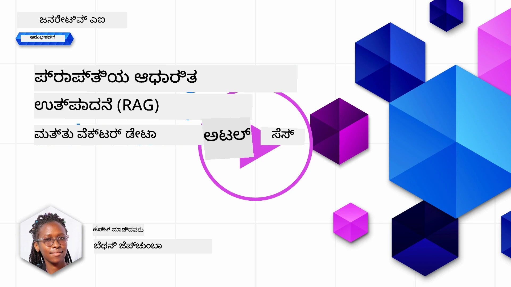
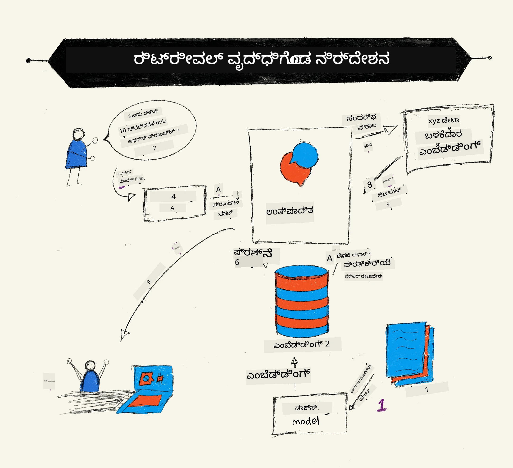
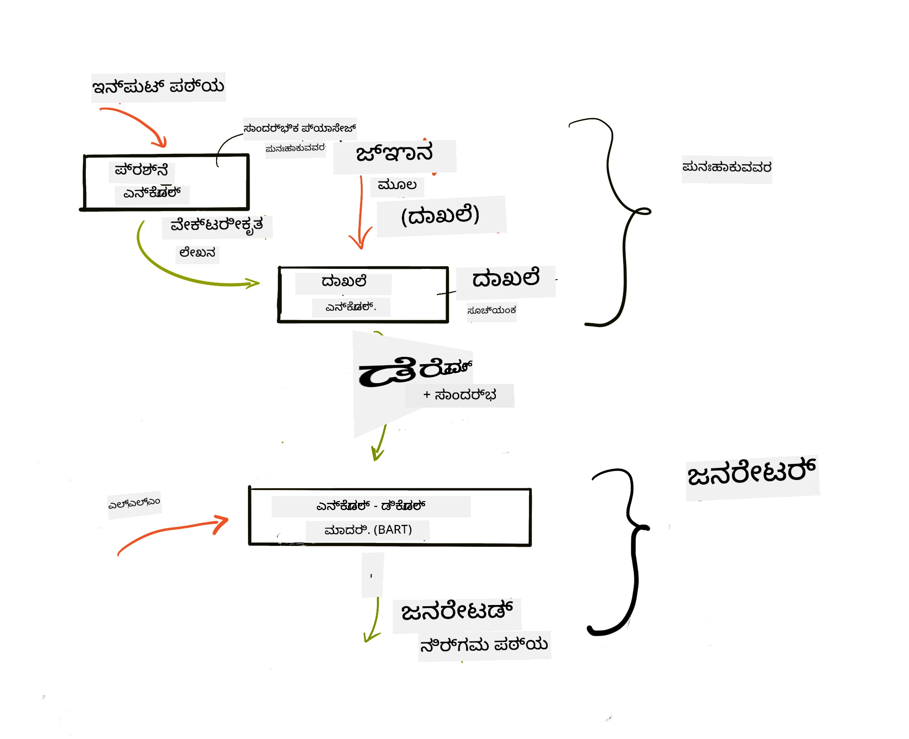

# ರಿಟ್ರೀವಲ್ ಆಗ್ಯುಮೆಂಟೆಡ್ ಜೆನೆರೇಶನ್ (RAG) ಮತ್ತು ವೆಕ್ಟರ್ ಡೇಟಾಬೇಸ್ಗಳು

[](https://youtu.be/4l8zhHUBeyI?si=BmvDmL1fnHtgQYkL)

ಹುಡುಕಾಟ ಅನ್ವಯಿಕೆಗಳಲ್ಲಿ, ನಾವುಸಣ್ಣಗಾಗಿ ನಿಮ್ಮದೇ ಡೇಟಾವನ್ನು ದೊಡ್ಡ ಭಾಷಾ ಮಾದರಿಗಳಲ್ಲಿ (LLMs) ಹೇಗೆ ಸಂಯೋಜಿಸುವುದೆಂದು ಕಲಿತಿದ್ದೆವು. ಈ ಪಾಠದಲ್ಲಿ, ನಾವು ನಿಮ್ಮ LLM ಅನ್ವಯಿಕೆಯಲ್ಲಿ ನಿಮ್ಮ ಡೇಟಾವನ್ನು ನೆಲಗಟ್ಟಿ ಇಡುವ ಕಲ್ಪನೆಗಳನ್ನು, ಪ್ರಕ್ರಿಯೆಯ ಯಾಂತ್ರಿಕತೆ ಮತ್ತು ಎम्बೆಡ್ಡಿಂಗ್‌ಗಳು ಹಾಗು ಪಠ್ಯವನ್ನು ಸಂಗ್ರಹಿಸುವ ವಿಧಾನಗಳನ್ನು ಆಳವಾಗಿ ಅನ್ವೇಷಿಸುವುದಾಗಿದೆ.

> **ವೀಡಿಯೋ ಶೀಘ್ರದಲ್ಲೇ ಬರುತ್ತಿದೆ**

## ಪರಿಚಯ

ಈ ಪಾಠದಲ್ಲಿ ನಾವು ಹೀಗಿವೆ:

- RAG ಗೆ ಪರಿಚಯ, ಇದು ಏನು ಮತ್ತು AI (ಕೃತಕ ಬುದ್ಧಿಮತ್ತೆ)ಯಲ್ಲಿ ಇದನ್ನು ಯಾಕೆ ಬಳಸುತ್ತಾರೆ.

- ವೆಕ್ಟರ್ ಡೇಟಾಬೇಸ್‌ಗಳೇನು ಎಂಬುದನ್ನು ಅರಿತುಕೊಳ್ಳುವುದು ಮತ್ತು ನಮ್ಮ ಅನ್ವಯಿಕೆಗೆ ಒಂದು ನಿರ್ಮಾಣ ಮಾಡುವುದು.

- RAG ಅನ್ನು ಅನ್ವಯಿಕೆಯಲ್ಲಿ ಹೇಗೆ ಸಂಯೋಜಿಸುವುದೆಂಬ ಉದಾಹರಣೆ.

## ಕಲಿಕೆಯ ಗುರಿಗಳು

ಈ ಪಾಠವನ್ನು ಪೂರ್ಣಗೊಳಿಸಿದ ನಂತರ, ನೀವು ಸಮರ್ಥರಾಗುವುದು:

- ಡೇಟಾ ರಿಟ್ರೀವಲ್ ಮತ್ತು ಪ್ರಕ್ರಿಯೆಯಲ್ಲಿ RAG ನ ಮಹತ್ವವನ್ನು ವಿವರಿಸುವುದು.

- RAG ಅನ್ವಯಿಕೆಯನ್ನು ಸ್ಥಾಪಿಸಿ ಮತ್ತು ನಿಮ್ಮ ಡೇಟಾವನ್ನು LLM ಗೆ ನೆಲಗಟ್ಟಿ.

- LLM ಅನ್ವಯಿಕೆಗಳಲ್ಲಿ RAG ಮತ್ತು ವೆಕ್ಟರ್ ಡೇಟಾಬೇಸ್‌ಗಳ ಪರಿಣಾಮಕಾರಿಯಾದ ಸಂಯೋಜನೆ.

## ನಮ್ಮ ಸ್ಥಿತಿ: ನಮ್ಮದೇ ಡೇಟಾರೊಂದಿಗೆ ನಮ್ಮ LLM ಗಳನ್ನು ಸುಧಾರಿಸುವುದು

ಈ ಪಾಠಕ್ಕಾಗಿ, ನಾವು ಸ್ವಂತ ಟಿಪ್ಪಣಿಗಳನ್ನು ಶಿಕ್ಷಣ ಸ್ಟಾರ್ಟ್‌ಅಪ್‌ಗೆ ಸೇರಿಸಲು ಬಯಸುತ್ತೇವೆ, ಇದು ಚಾಟ್‌ಬಾಟ್‌ಗೆ ವಿಭಿನ್ನ ವಿಷಯಗಳ ಕುರಿತು ಹೆಚ್ಚಿನ ಮಾಹಿತಿಯನ್ನು ಪಡೆಯಲು ಅವಕಾಶ ಕೊಡುತ್ತದೆ. ಹೊಂದಿರುವ ಟಿಪ್ಪಣಿಗಳನ್ನು ಬಳಸಿಕೊಂಡು, ಕಲಿಯುವವರು ಉತ್ತಮವಾಗಿ ಅಧ್ಯಯನ ಮಾಡಬಹುದಾಗಿ ಮತ್ತು ವಿವಿಧ ವಿಷಯಗಳನ್ನು ಅರ್ಥಮಾಡಿಕೊಳ್ಳಬಹುದು, ಇದರಿಂದ ಪರೀಕ್ಷೆಗಳಿಗೆ ಸಮೀಕ್ಷೆ ಮಾಡುವುದು ಸುಲಭವಾಗುತ್ತದೆ. ನಮ್ಮ ಸ್ಥಿತಿಯನ್ನು ರಚಿಸಲು, ನಾವು ಈ ಸಂಬಂಧಗಳನ್ನು ಬಳಸುವುದಾಗಿiffen:

- `Azure OpenAI:` ಚಾಟ್‌ಬಾಟ್ ರಚಿಸಲು ಉಪಯೋಗಿಸುವ LLM

- `AI for beginners' lesson on Neural Networks` : ಇದು ನಾವು ನಮ್ಮ LLM ಗೆ ನೆಲಗಟ್ಟುವ ಡೇಟಾ

- `Azure AI Search` ಮತ್ತು `Azure Cosmos DB:` ನಮ್ಮ ಡೇಟಾವನ್ನು ಸಂಗ್ರಹಿಸಲು ಮತ್ತು ಹುಡುಕಾಟ ಸೂಚ್ಯಂಕವನ್ನು ಸೃಷ್ಟಿಸಲು ವೆಕ್ಟರ್ ಡೇಟಾಬೇಸ್.

ಬಳಕೆದಾರರು ತಮ್ಮ ಟಿಪ್ಪಣಿಗಳಿಂದ ಅಭ್ಯಾಸ ಪ್ರಶ್ನೆಗಳನ್ನು ರಚಿಸಬಹುದು, ಮರುಸ್ಮರಣೆ ಫ್ಲಾಶ್ ಕಾರ್ಡ್‌ಗಳನ್ನು ಮಾಡಬಹುದು ಮತ್ತು ಅವುಗಳ ಸಂಕ್ಷಿಪ್ತ ಸಾರಾಂಶಗಳನ್ನು ಪಡೆಯಬಹುದು. ಪ್ರಾರಂಭಿಸಲು, ನಾವು RAG ಏನು ಮತ್ತು ಅದು ಹೇಗೆ ಕಾರ್ಯನಿರ್ವಹಿಸುತ್ತದೆ ಎಂದು ನೋಡೋಣ:

## ರಿಟ್ರೀವಲ್ ಆಗ್ಯುಮೆಂಟೆಡ್ ಜೆನೆರೇಶನ್ (RAG)

LLM ಚಾಲಿತ ಚಾಟ್‌ಬಾಟ್ ಬಳಕೆದಾರರ ಪ್ರಾಂಪ್ಟ್‌ಗಳನ್ನು ಪ್ರಕ್ರಿಯೆ ಮಾಡಿ ಉತ್ತರಗಳನ್ನು ರಚಿಸುತ್ತದೆ. ಇದು ಸಂವಾದಾತ್ಮಕವಾಗಿದ್ದು, ಹಲವಾರು ವಿಷಯಗಳ ಬಗ್ಗೆ ಬಳಕೆದಾರರೊಂದಿಗೆ ಸಂವಹನ ಮಾಡುತ್ತದೆ. ಆದರೆ, ಇದರ ಉತ್ತರಗಳು ನೀಡಲಾದ ಸನ್ನಿವೇಶ ಮತ್ತು ಮೂಲ ತರಬೇತಿ ಡೇಟಾ ಒಳಗೆ ಮಿತವಾಗಿವೆ. ಉದಾಹರಣೆಗೆ, GPT-4 ಜ್ಞಾನದ ಕಟ್‌ಆಫ್ ಸೆಪ್ಟೆಂಬರ್ 2021, ಅಂದರೆ, ಈ ಸಮಯದ ನಂತರ ನಡೆದ ಘಟನೆಗಳ ಮಾಹಿತಿ ಇದರಲ್ಲಿ ಇಲ್ಲ. ಜೊತೆಗೆ, LLM ತರಬೇತಿಗೆ ಉಪಯೋಗಿಸಬಹುದಾದ ಮಾಹಿತಿಗೆ ವೈಯಕ್ತಿಕ ಟಿಪ್ಪಣಿಗಳು ಅಥವಾ ಕಂಪನಿಯ ಉತ್ಪನ್ನ ಕೈಪಿಡಿ ಮುಂತಾದ ಗೌಪ್ಯ ಮಾಹಿತಿ ಸೇರಿಲ್ಲ.

### RAG ಹೀಗೇ ಕಾರ್ಯನಿರ್ವಹಿಸುತ್ತದೆ



ನಿಮ್ಮ ಟಿಪ್ಪಣಿಗಳಿಂದ ಪ್ರಶ್ನೋತ್ತರಗಳನ್ನು ಸೃಷ್ಟಿಸುವ ಚಾಟ್‌ಬಾಟ್ ಅನ್ನು ನಿಯೋಜಿಸಲು ಬಯಸಿದರೆ, ಜ್ಞಾನಾಧಾರಕ್ಕೆ ಸಂಪರ್ಕ ಬೇಕಾಗುತ್ತದೆ. ಇದಕ್ಕೆ RAG ನೆರವಾಗುತ್ತದೆ. RAG ಗಳು ಈ ರೀತಿ ಕಾರ್ಯನಿರ್ವಹಿಸುತ್ತವೆ:

- **ಜ್ಞಾನಾಧಾರ:** ರಿಟ್ರೀವಲ್ ಮுந்தಾಗಿ, ಈ ದಾಖಲೆಗಳನ್ನು ಗ್ರಹಿಸಿ ಪೂರ್ವಪ್ರಕ್ರಿಯೆ ಮಾಡಬೇಕು, ಸಾಮಾನ್ಯವಾಗಿ ದೊಡ್ಡ ದಾಖಲೆಗಳನ್ನು ಸಣ್ಣ ತುಣುಕುಗಳಲ್ಲಿ ವಿಭಜಿಸಿ, ಅವರನ್ನು ಪಠ್ಯ ಎಂಬೆಡ್ಡಿಂಗ್ ಗೆ ಪರಿವರ್ತಿಸಿ ಡೇಟಾಬೇಸಿನಲ್ಲಿ ಸಂಗ್ರಹಿಸುವುದು.

- **ಬಳಕೆದಾರರ ಪ್ರಶ್ನೆ:** ಬಳಕೆದಾರನು ಪ್ರಶ್ನೆ ಕೇಳುತ್ತಾನೆ

- **ರಿಟ್ರೀವಲ್:** ಬಳಕೆದಾರನು ಪ್ರಶ್ನೆ ಕೇಳಿದಾಗ, ಎಂಬೆಡ್ಡಿಂಗ್ ಮಾದರಿ ನಮ್ಮ ಜ್ಞಾನಾಧಾರದಿಂದ ಸಂಬಂಧಿತ ಮಾಹಿತಿಯನ್ನು ಸುಧಾರಿತ ಹಿನ್ನೆಲೆಯಾಗಿ ಪಡೆದು ಪ್ರಾಂಪ್ಟ್ ನಲ್ಲಿ ಸೇರಿಸುತ್ತದೆ.

- **ಆಗ್ಮೆಂಟೆಡ್ ಜೆನೆರೇಶನ್:** LLM ರಿಟ್ರೀವ್ ಮಾಡಲಾದ ಮಾಹಿತಿಯ ಆಧಾರದ ಮೇಲೆ ತನ್ನ ಉತ್ತರವನ್ನು ವಿಸ್ತರಿಸುತ್ತದೆ. ಇದು ಮೊದಲೇ ತರಬೇತುಗೊಂಡ ಡೇಟಾದ ಮೇಲೆ ಮಾತ್ರವಲ್ಲ, ಸೇರ್ಪಡೆಗೊಂಡ ಹಿನ್ನೆಲೆಯಿಂದ ಕೂಡಿತ ಮಾಹಿತಿಯ ಮೇಲೆ ಆಧಾರಿತವಾಗಿರುತ್ತದೆ. ನಂತರ LLM ಬಳಕೆದಾರರ ಪ್ರಶ್ನೆಗೆ ಉತ್ತರ ಕೊಡುವುದು.



RAG ಗಾಗಿ ವಾಸ್ತುಶಿಲ್ಪವು ಟ್ರಾನ್ಸ್‌ಫಾರ್ಮರ್‌ಗಳ ಜೊತೆಗೆ ಇದು ಎರಡು ಭಾಗಗಳಿಂದ ಜೋಡಣೆಯಾಗಿದ್ದು: ಎನ್‌ಕೋಡರ್ ಮತ್ತು ಡಿಕೋಡರ್. ಉದಾಹರಣೆಗೆ, ಬಳಕೆದಾರನು ಪ್ರಶ್ನೆ ಕೇಳಿದಾಗ, ಇನ್‌ಪುಟ್ ಪಠ್ಯವು ಪದಗಳ ಅರ್ಥವನ್ನು ಹಿಡಿದಿಟ್ಟುಕೊಂಡ ವೆಕ್ಟರ್‌ಗಳಾಗಿ 'ಎನ್‌ಕೋಡ್' ಆಗುತ್ತದೆ ಮತ್ತು ಆ ವೆಕ್ಟರ್‌ಗಳು ಡಾಕ್ಯುಮೆಂಟ್ ಸೂಚ್ಯಾಂಕದಲ್ಲಿ 'ಡಿಕೋಡ್' ಆಗಿ ಬಳಕೆದಾರರ ಪ್ರಶ್ನೆಯ ಆಧಾರದ ಮೇಲೆ ಹೊಸ ಪಠ್ಯವನ್ನು ರಚಿಸುತ್ತವೆ. LLM ಈ ಎನ್‌ಕೋಡರ್-ಡಿಕೋಡರ್ ಮಾದರಿಯನ್ನು ಬಳಸುತ್ತದೆ.

ಪ್ರಸ್ತಾವಿತ ಪೇಪರ್ [Retrieval-Augmented Generation for Knowledge intensive NLP (natural language processing software) Tasks](https://arxiv.org/pdf/2005.11401.pdf?WT.mc_id=academic-105485-koreyst) ಪ್ರಕಾರ, RAG ಅನುಷ্ঠಾನಕ್ಕೆ ಎರಡು ವಿಧಾನಗಳಿವೆ:

- **_RAG-Sequence_** ಯುಳಲ್ಲಿ ಡಾಕ್ಯುಮೆಂಟ್ ಗಳನ್ನು ಬಳಸಿ ಬಳಕೆದಾರರ ಪ್ರಶ್ನೆಗೆ ಉಚಿತವಾಗಿ ಅತ್ಯುತ್ತಮ ಉತ್ತರವನ್ನು ನಿರೀಕ್ಷಿಸುವುದು

- **RAG-Token** ಯುಳಲ್ಲಿ ಡಾಕ್ಯುಮೆಂಟ್ ಗಳನ್ನು ಬಳಸಿ ಮುಂದಿನ ಟೋಕನ್ ಅನ್ನು ರಚಿಸಿ, ನಂತರ ಅವುಗಳನ್ನು ಬಳಸಿ ಬಳಕೆದಾರರ ಪ್ರಶ್ನೆಗೆ ಉತ್ತರಿಸುವುದು

### ನೀವು RAG ಗಳನ್ನು ಏಕೆ ಬಳಸಬೇಕು? 

- **ಮಾಹಿತಿ ಸಂಪತ್ತು:** ಪಠ್ಯ ಉತ್ತರಗಳು ನವೀನ ಮತ್ತು ಪ್ರಸ್ತುತವಾಗಿರುತ್ತವೆ. ಇದರಿಂದ ವಿಶೇಷ ಕ್ಷೇತ್ರ ಕಾರ್ಯಗಳಲ್ಲಿ ಪ್ರಗತಿ ಸುಧಾರಿಸುತ್ತದೆ.

- ಬಳಕೆದಾರರ ಪ್ರಶ್ನೆಗೆ ಪಾರ್ಶ್ವಭೂಮಿಯಾದಾಗಿ ಸುಧಾರಿತ ಮಾಹಿತಿಯನ್ನು ನೀಡಲು **ಸರಿಯಾದ ಮಾಹಿತಿ** ಬಳಕೆ ಮಾಡಿ ಸುಳ್ಳು ಕಡಿಮೆ ಆಗುತ್ತದೆ.

- ಇದು **ಖರ್ಚು- ಪರಿಣಾಮಕಾರಿ**, ಏಕೆಂದರೆ ಫೈನ್-ಟ್ಯೂನಿಂಗ್ LLM ಗಿಂತ ಹೆಚ್ಚು ಆರ್ಥಿಕವಾಗಿದೆ.

## ಜ್ಞಾನಾಧಾರ ಸೃಷ್ಟಿಸುವುದು

ನಮ್ಮ ಅನ್ವಯಿಕೆವು ನಮ್ಮ ವೈಯಕ್ತಿಕ ಡೇಟಾದ ಮೇಲೆ ಸ್ಥಾಪಿತವಾಗಿದೆ, ಅಂದರೆ Neural Network ಪಾಠ AI For Beginners ಪಠ್ಯಕ್ರಮದಲ್ಲಿ.

### ವೆಕ್ಟರ್ ಡೇಟಾಬೇಸ್‌ಗಳು

ಒಂಟೆ ದೃಷ್ಟಿ ಡೇಟಾಬೇಸ್ ಗಳಿಗಿಂತ ಭಿನ್ನವಾಗಿ, ವೆಕ್ಟರ್ ಡೇಟಾಬೇಸ್‌ಗಳು ಎम्बೆಡ್ಡೆಡ್ ವೆಕ್ಟರ್‌ಗಳನ್ನು ಸಂಗ್ರಹಿಸುವ, ನಿರ್ವಹಿಸುವ ಮತ್ತು ಹುಡುಕುವ ವಿಶೇಷ ಡೇಟಾಬೇಸ್ ಗಳು. ಇದು ದಸ್ತಾವೇಜುಗಳ ಸಂಖ್ಯಾತ್ಮಕ ಪ್ರತಿನಿಧಿಗಳನ್ನು ಸಂಗ್ರಹಿಸುತ್ತದೆ. ಡೇಟಾವನ್ನು ಸಂಖ್ಯಾತ್ಮಕ ಎम्बೆಡ್ಡಿಂಗ್‌ಗಳಲ್ಲಿ ವಿಭಜಿಸುವುದು ನಮ್ಮ AI ವ್ಯವಸ್ಥೆಗೆ ಅದನ್ನು ಅರ್ಥಮಾಡಿಕೊಳ್ಳಲು ಮತ್ತು ಪ್ರಕ್ರಿಯೆ ಮಾಡಲು ಸುಲಭವಾಗುತ್ತದೆ.

ನಾವು ನಮ್ಮ ಎम्बೆಡ್ಡಿಂಗ್‌ಗಳನ್ನು ವೆಕ್ಟರ್ ಡೇಟಾಬೇಸ್‌ಗಳಲ್ಲಿ ಸಂಗ್ರಹಿಸುತ್ತೇವೆ ಏಕೆಂದರೆ LLM ಗಳು ಸ್ವೀಕರಿಸುವ ಟ್ವೋکن್ಗಳ ಸಂಖ್ಯೆಗೆ ಮಿತಿ ಇರುತ್ತದೆ. ಎಲ್ಲಾಎಂಬೆಡ್ಡಿಂಗ್‌ಗಳನ್ನು ಒಂದೇ LLM ಗೆ ಕಳುಹಿಸಲು ಸಾಧ್ಯವಿಲ್ಲ, ಆದ್ದರಿಂದ ಅವುಗಳನ್ನು ತುಣುಕಾಗಿ ಕಳಿಸಲು ಮತ್ತು ಬಳಕೆದಾರರು ಪ್ರಶ್ನೆ ಕೇಳಿದಾಗ, ಪ್ರಶ್ನೆಗೆ ತಕ್ಕ ಎम्बೆಡ್ಡಿಂಗ್‌ಗಳನ್ನು ಪ್ರಾಂಪ್ಟ್ ಜೊತೆಗೆ ಹಿಂತಿರುಗಿಸಲಾಗುತ್ತದೆ. ತುಣುಕಿಸು ಈ ಪ್ರಕ್ರಿಯೆ ವೆಚ್ಚವನ್ನು ಕಡಿಮೆ ಮಾಡುತ್ತದೆ.

ಕೆಲವು ಜನಪ್ರಿಯ ವೆಕ್ಟರ್ ಡೇಟಾಬೇಸ್‌ಗಳಿಗೆ Azure Cosmos DB, Clarifyai, Pinecone, Chromadb, ScaNN, Qdrant ಮತ್ತು DeepLake ಸೇರಿವೆ. ನೀವು ಕೆಳಗಿನ ಆಜುರ್ CLI ಆದೇಶವನ್ನು ಬಳಸಿ Azure Cosmos DB ಮಾದರಿಯನ್ನು ರಚಿಸಬಹುದು:

```bash
az login
az group create -n <resource-group-name> -l <location>
az cosmosdb create -n <cosmos-db-name> -r <resource-group-name>
az cosmosdb list-keys -n <cosmos-db-name> -g <resource-group-name>
```

### ಪಠ್ಯದಿಂದ ಎಂಬೆಡ್ಡಿಂಗ್‌ಗಳಿಗೆ

ನಾವು ನಮ್ಮ ಡೇಟಾವನ್ನು ಸಂಗ್ರಹಿಸುವ ಮೊದಲು, ಅದನ್ನು ಡೇಟಾಬೇಸ್‌ನಲ್ಲಿ ಸಂಗ್ರಹಿಸುವ ಅಗತ್ಯಕ್ಕೂ ಮುನ್ನ ಅದನ್ನು ವೆಕ್ಟರ್ ಎಂಬೆಡ್ಡಿಂಗ್‌ಗಳಿಗೆ ರೂಪಾಂತರಿಸಬೇಕು. ನೀವು ದೊಡ್ಡ ದಾಖಲೆಗಳು ಅಥವಾ ದೀರ್ಘ ಪಠ್ಯಗಳೊಂದಿಗೆ ಕೆಲಸ ಮಾಡುತ್ತಿದ್ದರೆ, ನೀವು ನಿರೀಕ್ಷಿಸುವ ಪ್ರಶ್ನೆಗಳ ಆಧಾರದ ಮೇಲೆ ಅವುಗಳನ್ನು ತುಣುಕಿಸಬಹುದು. ತುಣುಕಿಸುವುದು ವಾಕ್ಯ ಮಟ್ಟದಲ್ಲಿ ಅಥವಾ ಪ್ಯಾರಾಗ್ರಾಫ್ ಮಟ್ಟದಲ್ಲಿ ಮಾಡಬಹುದು. ಇವು ಸುತ್ತಲೂ ಪದಗಳಿಂದ ಅರ್ಥ ಪಡೆಯುವುದರಿಂದ, ತುಣುಕಿಗೆ ಇನ್ನಷ್ಟು ಸನ್ನಿವೇಶ ಸೇರಿಸಲು ನೀವು ದಸ್ತಾವೇಜಿನ ಶೀರ್ಷಿಕೆ ಅಥವಾ ತುಣುಕಿಗೆ ಮುಂಚೆ ಅಥವಾ ನಂತರದ ಕೆಲವು ಪಠ್ಯವನ್ನು ಸೇರಿಸಬಹುದು. ನೀವು ಡೇಟಾವನ್ನು ಹೀಗಾಗಿ ತುಣುಕುಮಾಡಬಹುದು:

```python
def split_text(text, max_length, min_length):
    words = text.split()
    chunks = []
    current_chunk = []

    for word in words:
        current_chunk.append(word)
        if len(' '.join(current_chunk)) < max_length and len(' '.join(current_chunk)) > min_length:
            chunks.append(' '.join(current_chunk))
            current_chunk = []

    # ಕೊನೆಯ ತುಂಡು ಕನಿಷ್ಠ ಉದ್ದವನ್ನು ತಲುಪದಿದ್ದರೆ, ಅದು ಇದ್ದರೂ ಸೇರಿಸಿ
    if current_chunk:
        chunks.append(' '.join(current_chunk))

    return chunks
```

ತುಣುಕಿಸಿದ ನಂತರ, ನಾವು ಪದಗಳ ಎಂಬೆಡ್ಡಿಂಗ್ ಮಾಡುವ ವಿಭಿನ್ನ ಮಾದರಿಗಳನ್ನು ಬಳಸಬಹುದು. ನೀವು ಬಳಸಬಹುದಾದ ಹಲವು ಮಾದರಿಗಳಲ್ಲಿ word2vec, OpenAI ನ ada-002, Azure Computer Vision ಹಾಗೂ ಇನ್ನಷ್ಟು ಸೇರಿವೆ. ನೀವು ಬಳಸುವ ಮಾದರಿಯ ಆಯ್ಕೆ ಭಾಷೆಗಳು, ಸಂಕೇತಿತ ವಿಷಯದ ಪ್ರಕಾರ (ಪಠ್ಯ/ಚಿತ್ರಗಳು/ಧ್ವನಿ), ಎನ್‌ಪುಟ್ ಗಾತ್ರ ಮತ್ತು ಎಂಬೆಡ್ಡಿಂಗ್ ಔಟ್ಪುಟ್ ನ ಉದ್ದದ ಮೇಲ್ಪಟ್ಟಿರುತ್ತದೆ.

OpenAI ನ `text-embedding-ada-002` ಮಾದರಿಯನ್ನು ಬಳಸಿ ಮಾಡಿ ಉದಾಹರಣೆಯಾಗಿ:


## ರಿಟ್ರೀವಲ್ ಮತ್ತು ವೆಕ್ಟರ್ ಹುಡುಕಾಟ

ಬಳಕೆದಾರನು ಪ್ರಶ್ನೆ ಕೇಳಿದಾಗ, ರಿಟ್ರೀವರ್ ಪ್ರಶ್ನೆಯು ಅನ್ನುqry ಎನ್‌ಕೋಡರ್ ಬಳಸಿ ವೆಕ್ಟರ್ ಆಗಿ ಪರಿವರ್ತಿಸಿ, ನಂತರ ನಮ್ಮ ಡಾಕ್ಯುಮೆಂಟ್ ಹುಡುಕಾಟ ಸೂಚ್ಯಾಂಕದ ಮೂಲಕ ಸಂಬಂಧಿತ ವೆಕ್ಟರ್‌ಗಳನ್ನು ಹುಡುಕುತ್ತದೆ. ನಂತರ ಇನ್‌ಪುಟ್ ವೆಕ್ಟರ್ ಮತ್ತು ಡಾಕ್ಯುಮೆಂಟ್ ವೆಕ್ಟರ್ ಎರಡನ್ನೂ ಪಠ್ಯದಲ್ಲಿ ಪರಿವರ್ತಿಸಿ LLM ಗೆ ಕಳುಹಿಸುತ್ತದೆ.

### ರಿಟ್ರೀವಲ್

ರಿಟ್ರೀವಲ್ ಆಗುವುದು ನಿರ್ದಿಷ್ಟ ಹುಡುಕಾಟ ಮಾನದಂಡಗಳನ್ನು ಪೂರೈಸುವ ಡಾಕ್ಯುಮೆಂಟ್ ಗಳನ್ನು ತ್ವರಿತವಾಗಿ ಹುಡುಕುವುದು. ರಿಟ್ರೀವರ್ ಉದ್ದೇಶವೆಂದರೆ, ಡಾಕ್ಯುಮೆಂಟ್ ಗಳನ್ನು ಪಡೆದು LLM ಗೆ ಸನ್ನಿವೇಶವನ್ನು ನೀಡುವುದು ಮತ್ತು ಅದರಲ್ಲಿ ನೆಲಗಟ್ಟಿಸಲು ಬಳಕೆ ಮಾಡುವುದು.

ನಮ್ಮ ಡೇಟಾಬೇಸಿನಲ್ಲಿ ಹುಡುಕಾಟ ಮಾಡಲು ಹಲವು ವಿಧಾನಗಳಿವೆ:

- **ಕೀವರ್ಡ್ ಹುಡುಕಾಟ** - ಪಠ್ಯ ಹುಡುಕಾಟಗಳಿಗೆ ಉಪಯೋಗಿಸುವುದು

- **ವೆಕ್ಟರ್ ಹುಡುಕಾಟ** - ದಾಖಲೆಗಳನ್ನು ಪಠ್ಯದಿಂದ ವೆಕ್ಟರ್ ಪ್ರತಿನಿಧಿಗಳಾಗಿ ಪರಿವರ್ತಿಸಿ, ಪದಗಳ ಅರ್ಥ ಬಳಸಿಕೊಂಡು **ಸಾಮಾಜಿಕ ಹುಡುಕಾಟ**ವನ್ನು ಅನುವು ಮಾಡಿಕೊಡುವುದು. ಸಂಬಂಧಿತ ವೆಕ್ಟರ್‌ಗಳಿಗೆ ಹೊಂದಿಕೆಯಾಗುವ ಡಾಕ್ಯುಮೆಂಟ್‌ಗಳಿಗೆ ಕ್ವೆರಿಯನ್ನು ಬಳಸುವುದರಿಂದ ಹುಡುಕಾಟ ನಡೆಯುತ್ತದೆ.

- **ಹೈಬ್ರಿಡ್** - ಕೀವರ್ಡ್ ಮತ್ತು ವೆಕ್ಟರ್ ಹುಡುಕಾಟಗಳ ಸಂಯೋಜನೆ.

ರಿಟ್ರೀವಲ್ ಸವಾಲಾಗುತ್ತದೆ, ಡೇಟಾಬೇಸ್‌ನಲ್ಲಿ ಕೆಟ್ಟ ಉತ್ತರ ಇರುವ ಸಂದರ್ಭದಲ್ಲಿ, ವ್ಯವಸ್ಥೆ ಬಹುಶಃ ಲಭ್ಯವಿರುವ ಅತ್ಯುತ್ತಮ ಮಾಹಿತಿಯನ್ನು ಹಿಂತಿರುಗಿಸುತ್ತದೆ, ಆದಾಗ್ಯೂ ನೀವು ಸಂಬಂಧಿತತೆ ಗರಿಷ್ಠ ದೂರವನ್ನು ಹೊಂದಿಸುವ ಅಥವಾ ಕೀವರ್ಡ್ ಮತ್ತು ವೆಕ್ಟರ್ ಹುಡುಕಾಟಗಳನ್ನು ಸಂಯೋಜಿಸುವ ಹೈಬ್ರಿಡ್ ಹುಡುಕಾಟವನ್ನು ಉಪಯೋಗಿಸಬಹುದು. ಈ ಪಾಠದಲ್ಲಿ ನಾವು ಹೈಬ್ರಿಡ್ ಹುಡುಕಾಟವನ್ನು ಉಪಯೋಗಿಸುತ್ತೇವೆ, ಅದು ವೆಕ್ಟರ್ ಮತ್ತು ಕೀವರ್ಡ್ค้นೋಣೆಗಳು ಸಹಿತವಾಗಿದೆ. ನಾವು ನಮ್ಮ ಡೇಟಾವನ್ನು ತುಣುಕುಗಳು ಮತ್ತು ಎಂಬೆಡ್ಡಿಂಗ್‌ಗಳನ್ನು ಹೊಂದಿರುವ ಕಾಲಮ್‌ಗಳುಳ್ಳ ಡೇಟಾಫ್ರೇಮ್‌ನಲ್ಲಿ ಸಂಗ್ರಹಿಸುವೆವು.

### ವೆಕ್ಟರ್ ಸಮಾನತೆ

ರಿಟ್ರೀವರ್ ನ್ನು ಜ್ಞಾನದ ಡೇಟಾಬೇಸ್‌ನಲ್ಲಿ ಸಮೀಪದ ಎಂಬೆಡ್ಡಿಂಗ್‌ಗಳನ್ನು ಹುಡುಕುತ್ತದೆ, ಸಮೀಪದ ನೆರೆಹೊರೆಯವರು, ಏಕೆಂದರೆ ಅವು ಸಾಲಿಸಿದ ಪಠ್ಯಗಳು. ಬಳಕೆದಾರರು ಪ್ರಶ್ನೆ ಕೇಳುವಾಗ, ಮೊದಲಿಗೆ ಅದನ್ನು ಎಂಬೆಡ್ಡ್ ಮಾಡಿ, ನಂತರ ಸಮಾನ ಎಂಬೆಡ್ಡಿಂಗ್‌ಗಳಿಗೆ ಹೊಂದಿಸಲಾಗುತ್ತದೆ. ವಿವಿಧ ವೆಕ್ಟರ್‌ಗಳ ಎಷ್ಟರ ಮಟ್ಟಿಗೆ ಹೊಂದಿಕೆಯಾಗುತ್ತವೆ ಎಂಬುದನ್ನು ಮಾಪನ ಮಾಡಲು ಸಾಮಾನ್ಯವಾಗಿ ಕೋಸೈನ್ ಸಮಾನತೆಯನ್ನೂ ಬಳಸುತ್ತಾರೆ, ಇದು ಎರಡು ವೆಕ್ಟರ್‌ಗಳ ನಡುವೆ ಕೋಣೆಯ ಮೇಲೆ ಆಧಾರಿತವಾಗಿದೆ.

ನಾವು ಹೊಂದಿಕೆಯನ್ನು ಅಳೆಯಲು ಬಳಸಬಹುದಾದ ಬೇರೆ ಪರ್ಯಾಯಗಳು ಯೂಕ್ಲಿಡಿಯನ್ ಅಂತರ (vector ಒಂದು ಮುಕ್ತಾಯದ ಮಧ್ಯೆ ನೇರ ರೇಖೆ) ಮತ್ತು ಡಾಟ್ ಉತ್ಪನ್ನ (ಎರಡು ವೆಕ್ಟರ್ ಗಳ ಸಮಕಾಲೀನ ಅಂಶಗಳ ಗುಣಲಬ್ಧಗಳ ಮೊತ್ತ) ಹೀಗಿವೆ.

### ಹುಡುಕಾಟ ಸೂಚ್ಯಂಕ

ರಿಟ್ರೀವಲ್ ಮಾಡಲು, ನಾವು ಹುಡುಕಾಟ ಮಾಡಲು ಮೊದಲು ನಮ್ಮ ಜ್ಞಾನಾಧಾರದಿಗಾಗಿ ಹುಡುಕಾಟ ಸೂಚ್ಯಂಕವನ್ನು ನಿರ್ಮಿಸಬೇಕಾಗುತ್ತದೆ. ಸೂಚ್ಯಂಕವು ನಮ್ಮ ಎಂಬೆಡ್ಡಿಂಗ್‌ಗಳನ್ನು ಸಂಗ್ರಹಿಸುತ್ತದೆ ಹಾಗು ದೊಡ್ಡ ಡೇಟಾಬೇಸ್‌ನೊಳಗೂ ಅತಿ ಸಮೀಪದ ತುಣುಕುಗಳನ್ನು ವೇಗವಾಗಿ ಹಿಂತಿರುಗಿಸುತ್ತದೆ. ನಾವು ನಮ್ಮ ಸೂಚ್ಯಂಕವನ್ನು ಸ್ಥಳೀಯವಾಗಿ ಈ ರೀತಿಯಲ್ಲಿ ರಚಿಸಬಹುದು:

```python
from sklearn.neighbors import NearestNeighbors

embeddings = flattened_df['embeddings'].to_list()

# ಹುಡುಕಾಟ ಸೂಚ್ಯಂಕವನ್ನು ರಚಿಸಿ
nbrs = NearestNeighbors(n_neighbors=5, algorithm='ball_tree').fit(embeddings)

# ಸೂಚ್ಯಂಕವನ್ನು ಪ್ರಶ್ನಿಸುವುದಕ್ಕೆ, ನೀವು kneighbors ವಿಧಾನವನ್ನು ಬಳಸಬಹುದು
distances, indices = nbrs.kneighbors(embeddings)
```

### ಮರು ರ‍್ಯಾಂಕಿಂಗ್

ನೀವು ಡೇಟಾಬೇಸ್‌ಗೆ ಕ್ವೇರಿ ಮಾಡಿದ ನಂತರ, ಫಲಿತಾಂಶಗಳನ್ನು ಸಂಬಂಧಿತತೆಯ ಆಧಾರದ ಮೇಲೆ ಸರಿದೂಗಿಸಬೇಕಾಗಬಹುದು. ಮರು ರ‍್ಯಾಂಕಿಂಗ್ LLM ಯು ಮಷಿನ್ ಲರ್ನಿಂಗ್ ಉಪಯೋಗಿಸಿ ಹುಡುಕಾಟ ಫಲಿತಾಂಶಗಳನ್ನು ಅತ್ಯಧಿಕ ಸಂಬಂಧಿತದಿಂದ ಕ್ರಮಬದ್ಧಗೊಳಿಸುತ್ತದೆ. ಆಜುರ್ AI ಹುಡುಕಾಟ ಬಳಸಿ, ಮರು ರ‍್ಯಾಂಕಿಂಗ್ ಸ್ವಯಂಚಾಲಿತವಾಗಿ ಸೀಮ್ಯಾಂಟಿಕ್ ರೇಂಕರ್ ಮೂಲಕ ಮಾಡಲಾಗುತ್ತದೆ. ಸಮೀಪದ ನೆರೆಹೊರೆಯವರ ಬಳಕೆ ಮಾಡುವ ಮೂಲಕ ಮರುರ‍್ಯಾಂಕಿಂಗ್ ಕಾರ್ಯಾಚರಣೆ ಉದಾಹರಣೆ:

```python
# ಅತ್ಯಂತ ಸಾದೃಶ್ಯ ಪ್ರಬಂಧಗಳನ್ನು ಕಂಡುಹಿಡಿಯಿ
distances, indices = nbrs.kneighbors([query_vector])

index = []
# ಅತ್ಯಂತ ಸಾದೃಶ್ಯ ಪ್ರಬಂಧಗಳನ್ನು ಮುದ್ರಿಸಿ
for i in range(3):
    index = indices[0][i]
    for index in indices[0]:
        print(flattened_df['chunks'].iloc[index])
        print(flattened_df['path'].iloc[index])
        print(flattened_df['distances'].iloc[index])
    else:
        print(f"Index {index} not found in DataFrame")
```

## ಎಲ್ಲವನ್ನು ಒಟ್ಟುಗೂಡಿಸುವುದು

ಕೊನೆಯ ಹಂತದಲ್ಲಿ ನಮ್ಮ LLM ಅನ್ನು ಸೇರಿಸಿ, ನಮ್ಮ ಡೇಟಾವಿನ ಮೇಲೆ ನೆಲಗಟ್ಟಿ ಉತ್ತರಗಳನ್ನು ಪಡೆಯಲು. ನಾವು ಇದನ್ನು ಹೀಗೆ ಅನುಷ್ಟಾನ ಮಾಡಬಹುದು:

```python
user_input = "what is a perceptron?"

def chatbot(user_input):
    # ಪ್ರಶ್ನೆಯನ್ನು ಪ್ರಶ್ನೆ ವೆಕ್ಟರ್‌ಗೆ ಪರಿವರ್ತಿಸಲು
    query_vector = create_embeddings(user_input)

    # ಅತ್ಯಂತ ಸಾದೃಶ್ಯದ ದಾಖಲೆಗಳನ್ನು ಕಂಡುಹಿಡಿಯಿರಿ
    distances, indices = nbrs.kneighbors([query_vector])

    # ಪ್ರಸಂಗ ನೀಡಲು ದಾಖಲೆಗಳನ್ನು ಪ್ರಶ್ನೆಗೆ ಸೇರಿಸಿ
    history = []
    for index in indices[0]:
        history.append(flattened_df['chunks'].iloc[index])

    # ಇತಿಹಾಸ ಮತ್ತು ಬಳಕೆದಾರನ ಒಳಗಿನ ಮಾಹಿತಿಯನ್ನು ಏಕೀಕರಿಸಿ
    history.append(user_input)

    # ಸಂದೇಶ ವಸ್ತುವನ್ನು ರಚಿಸಿ
    messages=[
        {"role": "system", "content": "You are an AI assistant that helps with AI questions."},
        {"role": "user", "content": "\n\n".join(history) }
    ]

    # ಪ್ರತಿಕ್ರಿಯೆ ತಯಾರಿಸಲು Responses API ಬಳಸಿ
    response = client.responses.create(
        model="gpt-5-mini",
        max_output_tokens=800,
        input=messages,
        store=False,
    )

    return response.output_text

chatbot(user_input)
```

## ನಮ್ಮ ಅನ್ವಯಿಕೆಯ ಮೌಲ್ಯಮಾಪನ

### ಮೌಲ್ಯಮಾಪನ ಮೀಟ್ರಿಕ್‌ಗಳು

- ಸರಿಯಾದ ಮತ್ತು ನೈಸರ್ಗಿಕ, ಪ್ರವಾಹವಾದ ಮತ್ತು ಮಾನವನಂತಹ ಧ್ವನಿಯನ್ನು ಖಚಿತಪಡಿಸುವ ಉತ್ತರಗಳ ಗುಣಮಟ್ಟ

- ಡೇಟಾದ ನೆಲಗಟ್ಟಿದ ಸ್ಥಿತಿ: ಒದಗಿಸಿದ ದಾಖಲೆಗಳಿಂದ ಬಂದ ಉತ್ತರ ಎಂದು ಮೌಲ್ಯಮಾಪನ

- ಸಂಬಂಧಿತತೆ: ಉತ್ತರ ಪ್ರಶ್ನೆಗೆ ಹೊಂದಿಕೆಯಾಗಿತ್ತೇ ಎಂದು ಮೌಲ್ಯಮಾಪನ

- ಪ್ರವಾಹ: ಉತ್ತರ ವ್ಯಾಕರಣಾತ್ಮಕವಾಗಿ ಅರ್ಥಮಾಡಿಕೊಳ್ಳುವಂತಿದೆಯೆಂದು ಮೌಲ್ಯಮಾಪನ

## RAG (ರಿಟ್ರೀವಲ್ ಆಗ್ಯುಮೆಂಟೆಡ್ ಜೆನೆರೇಶನ್) ಮತ್ತು ವೆಕ್ಟರ್ ಡೇಟಾಬೇಸ್‌ಗಳ ಬಳಕೆಯ ಉಪಯೋಗಗಳು

ವಿವಿಧ ಉಪಯೋಗಗಳು ಇಲ್ಲಿವೆ, function calls (ಕಾರ್ಯ ಸಂಬೋಧನೆಗಳು) ನಿಮ್ಮ ಅಪ್ಲಿಕೇಶನ್ ಸುಧಾರಿಸಲು ಸಹಕಾರಿಯಾಗಿರಬಹುದಾದವು:

- ಪ್ರಶ್ನೋತ್ತರ: ನಿಮ್ಮ ಕಂಪನಿಯ ಡೇಟಾವನ್ನು ಚಾಟ್‌ಗೆ ನೆಲಗಟ್ಟಿ, ಉದ್ಯೋಗಿಗಳು ಪ್ರಶ್ನೆ ಹಾಕಲು ಸಾಧ್ಯ.

- ಶಿಫಾರಸು ವ್ಯವಸ್ಥೆಗಳು: ನೀವು ಅತ್ಯಂತ ಸಮಾನ ಮೌಲ್ಯಗಳನ್ನು ಹೊಂದಿಸುವ ವ್ಯವಸ್ಥೆಯನ್ನು ರಚಿಸಬಹುದು, ಉದಾ: ಚಿತ್ರರಂಗ, ರೆಸ್ಟೋರೆಂಟ್‌ಗಳು ಮತ್ತು ಇನ್ನಷ್ಟು.

- ಚಾಟ್‌ಬಾಟ್ ಸೇವೆಗಳು: ನೀವು ಚಾಟ್ ಇತಿಹಾಸವನ್ನು ಸಂಗ್ರಹಿಸಬಹುದು ಮತ್ತು ಬಳಕೆದಾರರ ಡೇಟಾ ಆಧಾರದ ಮೇಲೆ ಸಂವಹನವನ್ನು ವೈಯಕ್ತೀಕರಿಸಬಹುದು.

- ವೆಕ್ಟರ್ ಎಂಬೆಡ್ಡಿಂಗ್‌ಗಳ ಆಧಾರಿತ ಚಿತ್ರ ಹುಡುಕಾಟ, ಚಿತ್ರ ಗುರುತಿಸುವಿಕೆ ಮತ್ತು ಅನಾಮರ ಚಿದ್ರಣೆಯನ್ನು ಮಾಡಲು ಉಪಯೋಗಿಸುವುದು.

## ಸಮ್ಮೇಳನ

ನಾವು RAG ನ ಮೂಲ ತತ್ವಗಳನ್ನು ಆವರಿಸಿಕೊಂಡಿದ್ದೇವೆ, ಅಪ್ಲಿಕೇಶನಿಗೆ ನಮ್ಮ ಡೇಟಾವನ್ನು ಸೇರಿಸುವುದು, ಬಳಕೆದಾರರ ಪ್ರಶ್ನೆ ಮತ್ತು ಔಟ್ಪುಟ್ ಕಂಡುಹಿಡಿದುಕೊಳ್ಳುವುದು. RAG ರಚನೆಯನ್ನು ಸರಳಗೊಳಿಸಲು, ನೀವು Semanti Kernel, Langchain ಅಥವಾ Autogen ಹೀಗೆ ಫ್ರೇಂವರ್ಕ್‌ಗಳನ್ನು ಉಪಯೋಗಿಸಬಹುದು.

## ನಿಯೋಜನೆ

ರಿಟ್ರೀವಲ್ ಆಗ್ಯುಮೆಂಟೆಡ್ ಜೆನೆರೇಶನ್ (RAG) ಅಧ್ಯಯನವನ್ನು ಮುಂದುವರೆಸಲು, ನೀವು ನಿರ್ಮಿಸಬಹುದು:

- ನಿಮ್ಮ ಆಯ್ಕೆಯ ಫ್ರೇಂವರ್ಕ್ ಬಳಸಿ ಅಪ್ಲಿಕೇಶನಿಗಾಗಿ ಫ್ರಂಟ್-ಎಂಡ್ ರಚಿಸಿ

- LangChain ಅಥವಾ Semantic Kernel ಫ್ರೇಂವರ್ಕ್ ಅನ್ನು ಉಪಯೋಗಿಸಿ ನಿಮ್ಮ ಅಪ್ಲಿಕೇಶನನ್ನು ಪುನಃ ರಚಿಸಿ.

ಪಾಠ ಸಮಾಪ್ತಿಗೆ ಅಭಿನಂದನೆಗಳು 👏.

## ಕಲಿಕೆ ಇಲ್ಲಿ ನಿಲ್ಲದು, ಪ್ರಯಾಣ ಮುಂದುವರಿಸಿ

ಈ ಪಾಠವನ್ನು ಪೂರ್ಣಗೊಳಿಸಿದ ನಂತರ, ನಮ್ಮ [ಉತ್ಪಾದಕ AI ಕಲಿಕಾ ಸಂಕಲನ](https://aka.ms/genai-collection?WT.mc_id=academic-105485-koreyst) ನೋಡಿ, ನಿಮ್ಮ ಉತ್ಪಾದಕ AI ಜ್ಞಾನವನ್ನು ಹೆಚ್ಚಿಸಲು ಮುಂದುವರಿಸಿ!

---

<!-- CO-OP TRANSLATOR DISCLAIMER START -->
**ಅಸ್ವೀಕಾರ**:
ಈ ದಸ್ತಾವೇಜು AI ಅನುವಾದ ಸೇವೆ [Co-op Translator](https://github.com/Azure/co-op-translator) ಬಳಸಿ ಅನುವಾದಿಸಲಾಗಿದೆ. ನಾವು ನಿಖರತೆಯನ್ನು ಸಾಧಿಸಲು ಪ್ರಯತ್ನಿಸುತ್ತಿದ್ದರೂ, ದಯವಿಟ್ಟು ಗಮನಿಸಿ, ಸ್ವಯಂಚಾಲಿತ ಅನುವಾದಗಳಲ್ಲಿ ದೋಷಗಳು ಅಥವಾ ಅಸಡ್ಡೆಗಳು ಇರಬಹುದು. ಮೂಲ ಭಾಷೆಯಲ್ಲಿರುವ ಮೂಲ ದಸ್ತಾವೇಜು ಪ್ರಾಮಾಣಿಕ ಮೂಲವೆಂದು ಪರಿಗಣಿಸಬೇಕು. ಪ್ರಮುಖ ಮಾಹಿತಿಗಾಗಿ, ವೃತ್ತಿಪರ ಮಾನವ ಅನುವಾದವನ್ನು ಶಿಫಾರಸು ಮಾಡಲಾಗುತ್ತದೆ. ಈ ಅನುವಾದವನ್ನು ಬಳಸುವ ಮೂಲಕ ಉಂಟಾಗುವ ಯಾವುದೇ ತಪ್ಪು ಅರ್ಥಗಳ ಅಥವಾ ತಪ್ಪು ವ್ಯಾಖ್ಯಾನಗಳ ಬಗ್ಗೆ ನಾವು ಹೊಣೆಗಾರರಲ್ಲ.
<!-- CO-OP TRANSLATOR DISCLAIMER END -->