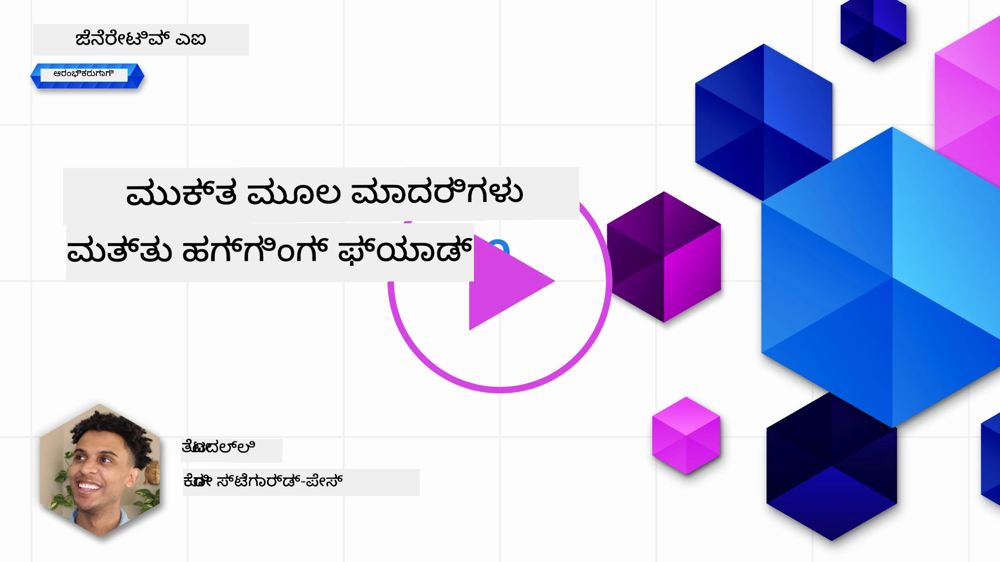
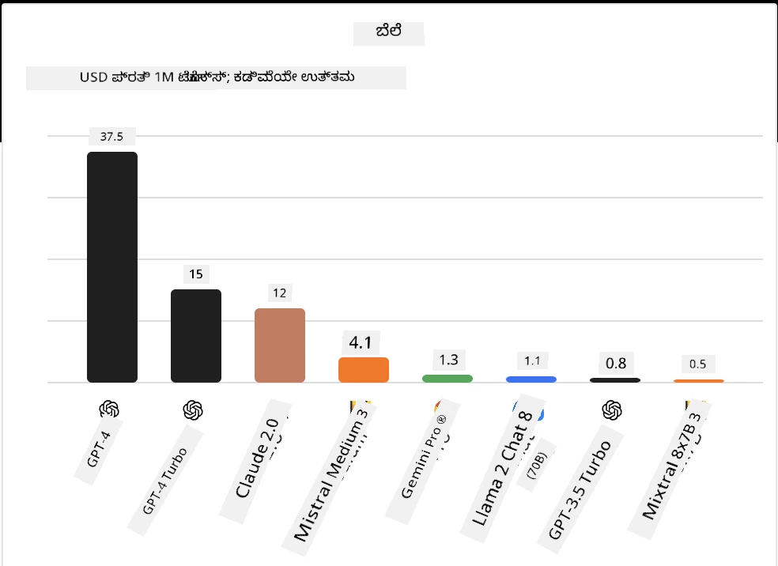
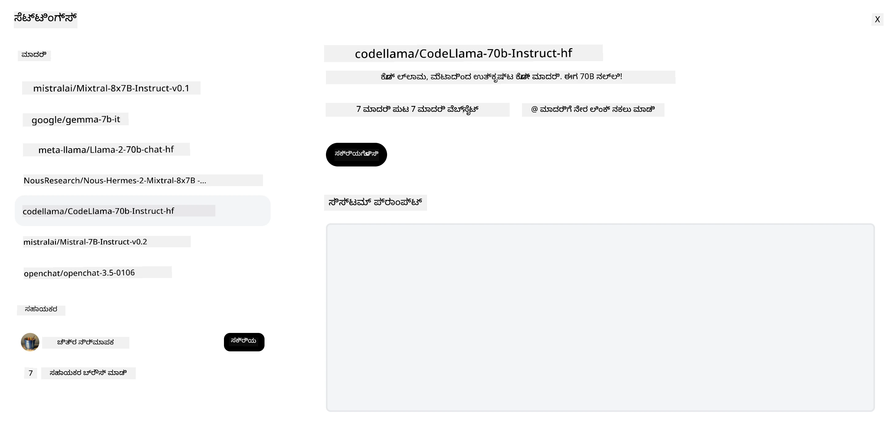
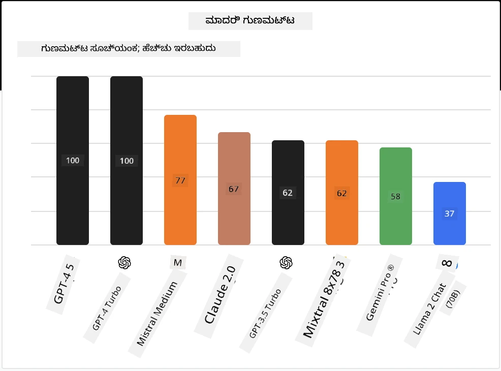

## ಪರಿಚಯ

ಓಪನ್-ಸೋರ್ಸ್ LLMಗಳ ಜಗತ್ತು ರೋಚಕ ಮತ್ತು ನಿರಂತರವಾಗಿ ವಿಕಸಿಸುತ್ತಿದೆ. ಈ ಪಾಠವು ಓಪನ್ ಸೋರ್ಸ್ ಮಾದರಿಗಳ ವಿವರವಾದ ವೀಕ್ಷಣೆಯನ್ನು ಒದಗಿಸಲು ಉದ್ದೇಶಿಸಿದೆ. ನೀವು ಸ್ವತಂತ್ರ ಮಾದರಿಗಳು ಓಪನ್ ಸೋರ್ಸ್ ಮಾದರಿಗಳ ಜೊತೆಗೆ ಹೇಗೆ ಹೋಲಿಕೆಯಾಗುತ್ತವೆ ಎಂದು ಮಾಹಿತಿ ಹುಡುಕುತ್ತಿದ್ದರೆ, ["ವಿಭಿನ್ನ LLMಗಳನ್ನು ಅನ್ವೇಷಿಸುವುದು ಮತ್ತು ಹೋಲಿಕೆ ಮಾಡುವುದು" ಪಾಠ](../02-exploring-and-comparing-different-llms/README.md?WT.mc_id=academic-105485-koreyst) ಗೆ ಹೋಗಿ. ಈ ಪಾಠವು ಸಹ ಫೈನ್-ಟ್ಯೂನಿಂಗ್ ವಿಷಯವನ್ನು ಒಳಗೊಂಡಿರುತ್ತದೆ ಆದರೆ ಅದಕ್ಕೆ ಸಂಬಂಧಿಸಿದ ಹೆಚ್ಚಿನ ವಿವರವಾದ ವಿವರಣೆ ["ಫೈನ್-ಟ್ಯೂನಿಂಗ್ LLMಗಳು" ಪಾಠ](../18-fine-tuning/README.md?WT.mc_id=academic-105485-koreyst) ನಲ್ಲಿ ಲಭ್ಯವಿದೆ.

## ಕಲಿಕೆಯ ಗುರಿಗಳು

- ಓಪನ್ ಸೋರ್ಸ್ ಮಾದರಿಗಳು ಕುರಿತು ಅರ್ಥೈಸಿಕೊಳ್ಳಿ
- ಓಪನ್ ಸೋರ್ಸ್ ಮಾದರಿಗಳೊಂದಿಗೆ ಕೆಲಸ ಮಾಡುವವರ ಲಾಭಗಳನ್ನು ಅರ್ಥಮಾಡಿಕೊಳ್ಳಿ
- ಹಗ್ಗಿಂಗ್ ಫೇಸ್ ಮತ್ತು ಮೈಕ್ರೋಸಾಫ್ಟ್ ಫೌಂಡ್ರೀ ಮಾದರಿ ಕ್ಯಾಟಲಾಗ್ ನಲ್ಲಿ ಲಭ್ಯವಿರುವ ಓಪನ್ ಮಾದರಿಗಳನ್ನು ಅನ್ವೇಷಿಸಿ

## ಓಪನ್ ಸೋರ್ಸ್ ಮಾದರಿಗಳು ಎಂದಾಗುವುದು ಏನು?

ಓಪನ್ ಸೋರ್ಸ್ ಸಾಫ್ಟ್‌ವೇರ್ ವಿವಿಧ ಕ್ಷೇತ್ರಗಳಲ್ಲಿ ತಂತ್ರಜ್ಞಾನ ವೃದ್ಧಿಗೆ ಪ್ರಮುಖ ಪಾತ್ರವಹಿಸಿದೆ. ಓಪನ್ ಸೋರ್ಸ್ ಇನಿಷಿಯೇಟಿವ್ (OSI) [10 ಮಾನದಂಡಗಳನ್ನು ಸಾಫ್ಟ್‌ವೇರ್‌ಗೆ](https://web.archive.org/web/20241126001143/https://opensource.org/osd?WT.mc_id=academic-105485-koreyst) ನಿರ್ಧರಿಸಿದೆ, ಇದರಿಂದ ಅದು ಓಪನ್ ಸೋರ್ಸ್ ಎಂದು ವರ್ಗೀಕರಿಸಲ್ಪಡುತ್ತದೆ. ಮೂಲ ಕೋಡ್ OSI ಅನುಮೋದಿತ ಪರವಾನಿಗೆ ಅಡಿ ಸ್ಪಷ್ಟವಾಗಿ ಹಂಚಿಕೆಯಾಗಿರಬೇಕು.

LLMಗಳನ್ನು ಅಭಿವೃದ್ಧಿ ಮಾಡುವುದು ಸಾಫ್ಟ್‌ವೇರ್ ಅಭಿವೃದ್ಧಿಯಂತಹ ಅಂಶಗಳನ್ನು ಹೊಂದಿದ್ದರೂ, ಪ್ರಕ್ರಿಯೆ ಸಂಪೂರ್ಣವಾಗಿ ಅದೇ ರೀತಿ ಇರುವುದಿಲ್ಲ. ಇದರಿಂದ LLMಗಳ ಸಂದರ್ಭದಲ್ಲಿ ಓಪನ್ ಸೋರ್ಸ್ ಎಂಬ ವ್ಯಾಖ್ಯಾನದ ಬಗ್ಗೆ ಸಮುದಾಯದಲ್ಲಿ ಬಹುಮತ ಚರ್ಚೆ ಬಂದಿದೆ. ಮಾದರಿ ಸಾಂಪ್ರದಾಯಿಕ ಓಪನ್ ಸೋರ್ಸ್ ವ್ಯಾಖ್ಯಾನದೊಂದಿಗೆ ಹೊಂದಿಕೊಳ್ಳಬೇಕಾದರೆ ಕೆಳಗಿನ ಮಾಹಿತಿಗಳು ಸಾರ್ವಜನಿಕವಾಗಿ ಲಭ್ಯವಿರಬೇಕು:

- ಮಾದರಿಯನ್ನು ತರಬೇತಿ ಮಾಡಲು ಬಳಸಿದ ಡೇಟಾ ಸೆಟ್ ಗಳು.
- ತರಬೇತಿಗೆ ಸಂಪೂರ್ಣ ಮಾದರಿ ತೂಕಗಳು.
- ಮೌಲ್ಯಮಾಪನ ಕೋಡ್.
- ಫೈನ್-ಟ್ಯೂನಿಂಗ್ ಕೋಡ್.
- ಸಂಪೂರ್ಣ ಮಾದರಿ ತೂಕಗಳು ಮತ್ತು ತರಬೇತಿ ಅಂಶಗಳು.

ಪ್ರಸ್ತುತ ಈ ಮಾನದಂಡಕ್ಕೆ ಹೊಂದಿಕೊಳ್ಳುವ ಮಾದರಿಗಳು ಕಡಿಮೆ ಸಂಖ್ಯೆಯೇ ಇದ್ದವೆ. [ಅಲೆನ್ ಇನ್ಸ್ಟಿಟ್ಯೂಟ್ ಫಾರ್ ಆರ್ಟಿಫಿಶಿಯಲ್ ಇಂಟಲಿಜೆನ್ಸ್ (AllenAI) ರಚಿಸಿದ OLMo ಮಾದರಿ](https://huggingface.co/allenai/OLMo-7B?WT.mc_id=academic-105485-koreyst) ಇದು ಈ ವರ್ಗಕ್ಕೆ ಸೇರಿದೆ.

ಈ ಪಾಠದಲ್ಲಿ, ನಾವು ಮುಂದಕ್ಕೆ ಈ ಮಾದರಿಗಳನ್ನು "ಓಪನ್ ಮಾದರಿಗಳು" ಎಂದು ಕರೆದುಕೊಳ್ಳಲಿದ್ದೇವೆ ಏಕೆಂದರೆ ಅವರು ಲೇಖನ ಸಮಯದಲ್ಲಿ ಮೇಲಿನ ಮಾನದಂಡಕ್ಕೆ ಹೊಂದಿಕೊಳ್ಳದಿರಬಹುದು.

## ಓಪನ್ ಮಾದರಿಗಳ ಲಾಭಗಳು

**ಅತ್ಯಂತ ಅನ್ವಯಿಸಬಹುದಾದವು** - ಓಪನ್ ಮಾದರಿಗಳು ವಿವರವಾದ ತರಬೇತಿ ಮಾಹಿತಿಯೊಂದಿಗೆ ಬಿಡುಗಡೆ ಮಾಡಿದ ಕಾರಣ, ಸಂಶೋಧಕರು ಮತ್ತು ಅಭಿವೃದ್ಧಿಪಡಿಸುವವರು ಮಾದರಿಯ ಆಂತರಿಕ ಅಂಶಗಳನ್ನು ಬದಲಾಯಿಸಬಹುದು. ಇದರಿಂದ ಒಂದು ನಿರ್ದಿಷ್ಟ ಕಾರ್ಯ ಅಥವಾ ಅಧ್ಯಯನ ಕ್ಷೇತ್ರಕ್ಕೆ ಸೂಕ್ತವಾದ ಅತ್ಯಂತ ವಿಶೇಷ ಮಾದರಿಗಳನ್ನು ಸೃಷ್ಟಿಸಲು ಸಾಧ್ಯವಾಗುತ್ತದೆ. ಇದರ ಕೆಲವು ಉದಾಹರಣೆಗಳು ಕೋಡ್ ನಿರ್ಮಾಣ, ಗಣಿತೀಯ ಕ್ರಿಯೆಗಳು ಮತ್ತು ಜೀವಶಾಸ್ತ್ರ.

**ಖರ್ಚು** - ಈ ಮಾದರಿಗಳನ್ನು ಬಳಕೆ ಮತ್ತು ಜಾರಿಗೆ ತೆಗೆದುಕೊಳ್ಳುವಲ್ಲಿ ಪ್ರತಿ Token ಗೆ ಆಗುವ ವೆಚ್ಚವು ಕೋಪೋರೇಟ್ ಮಾದರಿಗಳಿಗಿಂತ ಕಡಿಮೆ. ಜನೇರೇಟಿವ್ AI ಅಪ್ಲಿಕೇಶನ್‌ಗಳನ್ನು ನಿರ್ಮಿಸುವಾಗ, ನಿಮ್ಮ ಬಳಕೆದಾರ ತಾಣದಲ್ಲಿ ಈ ಮಾದರಿಗಳ ಪ್ರದರ್ಶನವನ್ನು ದರವನ್ನು ಆಧರಿಸಿ ಪರಿಶೀಲಿಸಬೇಕು.

ಮೂಲ: ಆರ್ಟಿಫಿಷಿಯಲ್ ಅನಾಲಿಸಿಸ್

**ಲವಚಿಕತೆ** - ಓಪನ್ ಮಾದರಿಗಳೊಂದಿಗೆ ಕೆಲಸ ಮಾಡುವುದು ವಿಭಿನ್ನ ಮಾದರಿಗಳನ್ನು ಬಳಸುವುದು ಅಥವಾ ಅವುಗಳನ್ನು ಸಂಯೋಜಿಸುವ ಯಾವುದೇ ರೀತಿಯ ಲವಚಿಕತೆಯನ್ನು ಒದಗಿಸುತ್ತದೆ. ಉದಾಹರಣೆಯಾಗಿ, [ಹಗ್ಗಿಂಗ್‌ಚಾಟ್ ಸಹಾಯಕರು](https://huggingface.co/chat?WT.mc_id=academic-105485-koreyst) ಇದ್ದು ಬಳಕೆದಾರನು UI ನ ತಕ್ಷಣದಲ್ಲಿಯೇ ಬಳಸಲಿರುವ ಮಾದರಿಯನ್ನು ಆಯ್ಕೆ ಮಾಡಬಹುದು:

## ವಿಭಿನ್ನ ಓಪನ್ ಮಾದರಿಗಳನ್ನು ಅನ್ವೇಷಿಸುವುದು

### ಲ್ಲಾಮ 2

[Llama2](https://huggingface.co/meta-llama?WT.mc_id=academic-105485-koreyst), ಮೆಟಾ ಅಭಿವೃದ್ಧಿಪಡಿಸಿದ ಓಪನ್ ಮಾದರಿ, ಚಾಟ್ ಆಧಾರಿತ ಅಪ್ಲಿಕೇಶನ್‌ಗಳಿಗೆ ಸೂಕ್ತವಾಗಿದೆ. ಇದರ ಫೈನ್-ಟ್ಯೂನಿಂಗ್ ವಿಧಾನವು ದೊಡ್ಡ ಪ್ರಮಾಣದ ಸಂವಾದ ಮತ್ತು ಮಾನವ ಪ್ರತಿಕ್ರಿಯೆಯನ್ನು ಒಳಗೊಂಡಿದೆ. ಈ ವಿಧಾನದಿಂದ, ಮಾದರಿ ಮಾನವನ ನಿರೀಕ್ಷೆಗೆ ಹೊಂದಿಕೊಳ್ಳುವ ರೀತಿಯಲ್ಲಿ ಉತ್ತಮ ಫಲಿತಾಂಶಗಳನ್ನು ನೀಡುತ್ತದೆ, ಅದು ಉತ್ತಮ ಬಳಕೆದಾರ ಅನುಭವವನ್ನು ಒದಗಿಸುತ್ತದೆ.

ಲ್ಲಾಮಾದ ಕೆಲವು ಫೈನ್-ಟ್ಯೂನ್ಡ್ ಆವೃತ್ತಿಗಳ ಉದಾಹರಣೆಗಳು: [ಜಪಾನೀಸ್ ಲ್ಲಾಮಾ](https://huggingface.co/elyza/ELYZA-japanese-Llama-2-7b?WT.mc_id=academic-105485-koreyst), ಇದು ಜಪಾನೀಸ್ ಭಾಷೆಯಲ್ಲಿ ಪರಿಣತಿಯನ್ನು ಹೊಂದಿದೆ ಮತ್ತು [ಲ್ಲಾಮಾ ಪ್ರೋ](https://huggingface.co/TencentARC/LLaMA-Pro-8B?WT.mc_id=academic-105485-koreyst), ಇದು ಮೂಲ ಮಾದರಿಯ ವೃದ್ಧಿತ ಆವೃತ್ತಿ.

### ಮಿಸ್ಟ್ರಲ್

[ಮಿಸ್ಟ್ರಲ್](https://huggingface.co/mistralai?WT.mc_id=academic-105485-koreyst) ಎಂದರೆ ಶಕ್ತಿಶಾಲಿ ಪ್ರದರ್ಶನ ಮತ್ತು ಪರಿಣಾಮಕಾರಿತ್ವಕ್ಕೆ ಕೇಂದ್ರೀಕೃತವಾದ ஓಪನ್ ಮಾದರಿ. ಇದು ಮಿಕ್ಸ್ಚರ್-ಆಫ್-ಎಕ್ಸ್‌ಪೆರ್ಟ್ಸ್ ವಿಧಾನದ ಬಳಕೆ ಮಾಡುತ್ತದೆ, ಇದು ವಿಶೇಷ ಪರಿಣತಿಗಳನ್ನು ಹೊಂದಿರುವ ಮಾದರಿ ಗುಂಪನ್ನು ಒಂದು ವ್ಯವಸ್ಥೆಯಾಗಿ ಸೇರಿಸುವುದು, ಇಲ್ಲಿ ಇನ್‌ಪುಟ್ ಆಧಾರದಲ್ಲಿ ಕೆಲವು ಮಾದರಿಗಳನ್ನು ಬಳಸಲಾಗುತ್ತದೆ. ಇದರಿಂದ ಗಣನೆ ಪರಿಣಾಮಕಾರಿ ಆಗುತ್ತದೆ ಏಕೆಂದರೆ ಮಾದರಿಗಳು ತಮ್ಮ ಪರಿಣತಿಗೆ ಸರಿಹೊಂದಿದ ಇನ್‌ಪುಟ್ ಗಳನ್ನೇ ನಿರ್ವಹಿಸುತ್ತವೆ.

ಮಿಸ್ಟ್ರಲ್ ಫೈನ್-ಟ್ಯೂನ್ಡ್ ಆವೃತ್ತಿಗಳ ಕೆಲವು ಉದಾಹರಣೆಗಳು: [ಬಯೋಮಿಸ್ಟ್ರಲ್](https://huggingface.co/BioMistral/BioMistral-7B?text=Mon+nom+est+Thomas+et+mon+principal?WT.mc_id=academic-105485-koreyst), ಇದು ವೈದ್ಯಕೀಯ ಕ್ಷೇತ್ರದ ಮೇಲೆ ಕೇಂದ್ರೀಕೃತವಾಗಿದೆ ಮತ್ತು [ಓಪನ್‌ಮ್ಯಾಥ್ ಮಿಸ್ಟ್ರಲ್](https://huggingface.co/nvidia/OpenMath-Mistral-7B-v0.1-hf?WT.mc_id=academic-105485-koreyst), ಇದು ಗಣಿತೀಯ ಗಣನೆ ಮಾಡುತ್ತದೆ.

### ಫಾಲ್ಕನ್

[ಫಾಲ್ಕನ್](https://huggingface.co/tiiuae?WT.mc_id=academic-105485-koreyst) ಎಂಬುದು ಟೆಕ್ನಾಲಜಿ ಇನೋವೇಶನ್ ಇನ್ಸ್ಟಿಟ್ಯೂಟ್ (**TII**) ರಚಿಸಿದ LLM ಆಗಿದೆ. ಫಾಲ್ಕನ್-40B 40 ಬಿಲಿಯನ್ ಪ್ಯಾರಾಮೀಟರ್ ಮೇಲೆ ತರಬೇತಿಗೊಳಿಸಲಾಗಿದೆ, ಇದು ಕಡಿಮೆ ಗಣನೆ ಬಜೆಟ್ ಜೊತೆಗೆ GPT-3 ಗಿಂತ ಉತ್ತಮ ಪ್ರದರ್ಶನವನ್ನು ನೀಡುತ್ತದೆ ಎಂದು ತೋರಿಸಲಾಗಿದೆ. ಇದು ಫ್ಲಾಶ್ ಅಟೆಂಟನ್ ಆಲ್ಗಾರಿದಮ್ ಮತ್ತು ಮಲ್ಟಿಕ್ವೆರಿ ಅಟೆಂಟನ್ ಬಳಸಿದ ಕಾರಣ, ನಿರೀಕ್ಷಣಾ ಸಮಯದಲ್ಲಿ ಮೆಮೊರಿ ಅವಶ್ಯಕತೆಗಳನ್ನು ಕಡಿಮೆ ಮಾಡುತ್ತದೆ. ಈ ಕಡಿಮೆ ನಿರೀಕ್ಷಣಾ ಸಮಯದಿಂದ ಫಾಲ್ಕನ್-40B ಚಾಟ್ ಅಪ್ಲಿಕೇಶನ್‌ಗಳಿಗೆ ಸೂಕ್ತವಾಗಿದೆ.

ಫಾಲ್ಕನ್ ಫೈನ್-ಟ್ಯೂನ್ಡ್ ಆವೃತ್ತಿಗಳ ಕೆಲವು ಉದಾಹರಣೆಗಳು: [ಓಪನ್ ಅಸಿಸ್ಟಂಟ್](https://huggingface.co/OpenAssistant/falcon-40b-sft-top1-560?WT.mc_id=academic-105485-koreyst), ಓಪನ್ ಮಾದರಿಗಳ ಆಧಾರದ ಮೇಲೆ ನಿರ್ಮಿಸಲಾದ ಸಹಾಯಕ ಮತ್ತು [GPT4ALL](https://huggingface.co/nomic-ai/gpt4all-falcon?WT.mc_id=academic-105485-koreyst), ಇದು ಮೂಲ ಮಾದರಿಗಿಂತ ಉತ್ತಮ ಪ್ರದರ್ಶನ ನೀಡುತ್ತದೆ.

## ಹೇಗೆ ಆಯ್ಕೆ ಮಾಡುವುದು

ಒಬ್ಬ ಓಪನ್ ಮಾದರಿಯನ್ನು ಆಯ್ಕೆ ಮಾಡಬೇಕಾದಲ್ಲಿ ಏಕೋತ್ತರ ಇಲ್ಲ. ಶುರುವಾಗಲು ಉತ್ತಮ ಸ್ಥಳವೆಂದರೆ ಮೈಕ್ರೋಸಾಫ್ಟ್ ಫೌಂಡ್ರೀ ಮಾದರಿ ಕ್ಯಾಟಲಾಗ್‌ನ ಕೆಲಸಕ್ಕೆ ಅನುಗುಣವಾಗಿ ಫಿಲ್ಟರ್ ಬಳಸು. ಇದರಿಂದ ನಿಮ್ಮಗೆ ಗೊತ್ತಾಗುತ್ತದೆ ಯಾವ ರೀತಿಯ ಕಾರ್ಯಗಳಿಗೆ ಮಾದರಿ ತರಬೇತಿಗೊಳಿಸಲಾಗಿದೆ. ಹಗ್ಗಿಂಗ್ ಫೇಸ್ ಕೂಡ ಕೆಲವು ಮಿತಿ ಸಾಧಕರೊಂದಿಗಿನ LLM ಲೀಡರ್‌ಬೋರ್ಡ್ ಅನ್ನು ನಿರ್ವಹಿಸುತ್ತದೆ, ಇದು ಕೆಲವು ಅಂಶಗಳ ಆಧಾರದಲ್ಲಿ ಅತ್ಯುತ್ತಮ ಪ್ರದರ್ಶನ ಮಾದರಿಗಳನ್ನು ತೋರಿಸುತ್ತದೆ.

ವಿಭಿನ್ನ ಪ್ರಕಾರದ LLMಗಳನ್ನು ಹೋಲಿಸಿದಾಗ, [ಆರ್ಟ್‌ಫಿಷಿಯಲ್ ಅನಾಲಿಸಿಸ್](https://artificialanalysis.ai/?WT.mc_id=academic-105485-koreyst) ಮತ್ತೊಂದು ಉತ್ತಮ ಸಂಪನ್ಮೂಲವಾಗಿದೆ:

ಮೂಲ: ಆರ್ಟಿಫಿಷಿಯಲ್ ಅನಾಲಿಸಿಸ್

ನೀವು ವಿಶೇಷ ಬಳಕೆದಾರ ಪ್ರಕರಣಕ್ಕೆ ಕೆಲಸ ಮಾಡುತ್ತಿದ್ದರೆ, ಅದೇ ಕ್ಷೇತ್ರಕ್ಕೆ ಅಥವ ಗಮನ ಹರಿಸಿದ ಫೈನ್-ಟ್ಯೂನ್ಡ್ ಆವೃತ್ತಿಗಳನ್ನು ಹುಡುಕುವುದು ಪರಿಣಾಮಕಾರಿ. ಹಲವು ಓಪನ್ ಮಾದರಿಗಳೊಂದಿಗೆ ಪ್ರಯೋಗ ಮಾಡಿ ಅವು ನಿಮ್ಮ ಮತ್ತು ನಿಮ್ಮ ಬಳಕೆದಾರರ ನಿರೀಕ್ಷೆಗಳ ಪ್ರಕಾರ ಹೇಗೆ ಕಾರ್ಯನಿರ್ವಹಿಸುತ್ತವೆ ಎಂದು ನೋಡುವುದು ಮತ್ತೊಂದು ಉತ್ತಮ ಅಭ್ಯಾಸ.

## ಮುಂದಿನ ಹೆಜ್ಜೆಗಳು

ಓಪನ್ ಮಾದರಿಗಳಲ್ಲಿ ಉತ್ತಮ ಭಾಗವೆಂದರೆ ನೀವು ಇನ್ನಷ್ಟು ಚುರುಕಾಗಿ ಅವುಗಳೊಂದಿಗೆ ಕೆಲಸ ಆರಂಭಿಸಬಹುದು. ಇಲ್ಲಿ ಚರ್ಚಿಸಲಾಗಿದ್ದ ಈ ಮಾದರಿಗಳೊಂದಿಗೆ ವಿಶೇಷ ಹಗ್ಗಿಂಗ್ ಫೇಸ್ ಸಂಗ್ರಹವನ್ನು ಹೊಂದಿರುವ [ಮೈಕ್ರೋಸಾಫ್ಟ್ ಫೌಂಡ್ರೀ ಮಾದರಿ ಕ್ಯಾಟಲಾಗ್](https://ai.azure.com?WT.mc_id=academic-105485-koreyst) ಅನ್ನು ಪರಿಶೀಲಿಸಿರಿ.

## ಕಲಿಕೆ ಇಲ್ಲಿ ನಿಲ್ಲುವುದಿಲ್ಲ, ಯಾತ್ರೆಯನ್ನು ಮುಂದುವರೆಸಿರಿ

ಈ ಪಾಠವನ್ನು ಮುಗಿಸಿದ ನಂತರ, ನಮ್ಮ [ಜನರೇಟಿವ್ AI ಕಲಿಕಾ ಸಂಗ್ರಹ](https://aka.ms/genai-collection?WT.mc_id=academic-105485-koreyst) ನೋಡಿರಿ ಮತ್ತು ನಿಮ್ಮ ಜನರೇಟಿವ್ AI ಜ್ಞಾನವನ್ನು ಮುಂದುವರೆಸಿರಿ!

---

<!-- CO-OP TRANSLATOR DISCLAIMER START -->
**ಅಸ್ವೀಕಾರ**:
ಈ ದಸ್ತಾವೇಜು AI ಅನುವಾದ ಸೇವೆ [Co-op Translator](https://github.com/Azure/co-op-translator) ಬಳಸಿ ಅನುವಾದಿಸಲಾಗಿದೆ. ನಾವು ನಿಖರತೆಯನ್ನು ಸಾಧಿಸಲು ಪ್ರಯತ್ನಿಸುತ್ತಿದ್ದರೂ, ದಯವಿಟ್ಟು ಗಮನಿಸಿ, ಸ್ವಯಂಚಾಲಿತ ಅನುವಾದಗಳಲ್ಲಿ ದೋಷಗಳು ಅಥವಾ ಅಸಡ್ಡೆಗಳು ಇರಬಹುದು. ಮೂಲ ಭಾಷೆಯಲ್ಲಿರುವ ಮೂಲ ದಸ್ತಾವೇಜು ಪ್ರಾಮಾಣಿಕ ಮೂಲವೆಂದು ಪರಿಗಣಿಸಬೇಕು. ಪ್ರಮುಖ ಮಾಹಿತಿಗಾಗಿ, ವೃತ್ತಿಪರ ಮಾನವ ಅನುವಾದವನ್ನು ಶಿಫಾರಸು ಮಾಡಲಾಗುತ್ತದೆ. ಈ ಅನುವಾದವನ್ನು ಬಳಸುವ ಮೂಲಕ ಉಂಟಾಗುವ ಯಾವುದೇ ತಪ್ಪು ಅರ್ಥಗಳ ಅಥವಾ ತಪ್ಪು ವ್ಯಾಖ್ಯಾನಗಳ ಬಗ್ಗೆ ನಾವು ಹೊಣೆಗಾರರಲ್ಲ.
<!-- CO-OP TRANSLATOR DISCLAIMER END -->