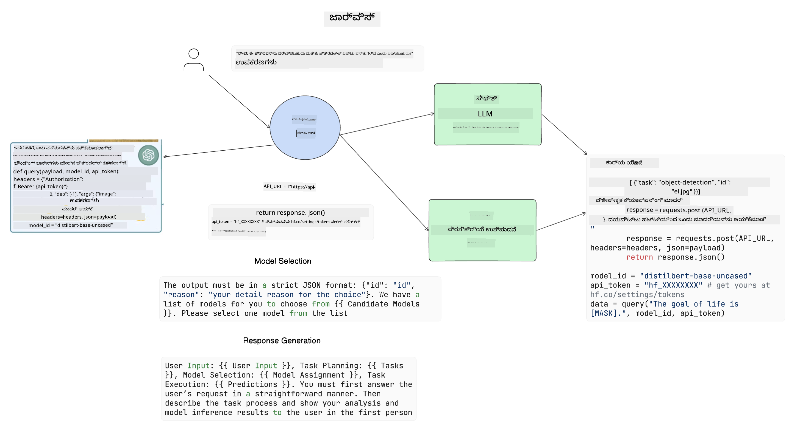

<!--
CO_OP_TRANSLATOR_METADATA:
{
  "original_hash": "8e8d1f6a63da606af7176a87ff8e92b6",
  "translation_date": "2025-12-19T20:01:03+00:00",
  "source_file": "17-ai-agents/README.md",
  "language_code": "kn"
}
-->
[](https://youtu.be/yAXVW-lUINc?si=bOtW9nL6jc3XJgOM)

## ಪರಿಚಯ

AI ಏಜೆಂಟ್ಗಳು ಜನರೇಟಿವ್ AI ಯಲ್ಲಿ ರೋಚಕ ಅಭಿವೃದ್ಧಿಯನ್ನು ಪ್ರತಿನಿಧಿಸುತ್ತವೆ, ದೊಡ್ಡ ಭಾಷಾ ಮಾದರಿಗಳನ್ನು (LLMs) ಸಹಾಯಕರಿಂದ ಕ್ರಿಯೆಗಳನ್ನು ಕೈಗೊಳ್ಳುವ ಏಜೆಂಟ್ಗಳಾಗಿ ಅಭಿವೃದ್ಧಿಪಡಿಸಲು ಸಾಧ್ಯವಾಗುತ್ತದೆ. AI ಏಜೆಂಟ್ ಫ್ರೇಮ್ವರ್ಕ್‌ಗಳು ಡೆವಲಪರ್‌ಗಳಿಗೆ LLMಗಳಿಗೆ ಸಾಧನಗಳು ಮತ್ತು ಸ್ಥಿತಿ ನಿರ್ವಹಣೆಗೆ ಪ್ರವೇಶ ನೀಡುವ ಅಪ್ಲಿಕೇಶನ್‌ಗಳನ್ನು ರಚಿಸಲು ಸಹಾಯ ಮಾಡುತ್ತವೆ. ಈ ಫ್ರೇಮ್ವರ್ಕ್‌ಗಳು ದೃಶ್ಯತೆಯನ್ನು ಹೆಚ್ಚಿಸುತ್ತವೆ, ಬಳಕೆದಾರರು ಮತ್ತು ಡೆವಲಪರ್‌ಗಳು LLMಗಳು ಯೋಜಿಸಿರುವ ಕ್ರಿಯೆಗಳನ್ನು ಗಮನಿಸಲು ಸಾಧ್ಯವಾಗುತ್ತದೆ, ಇದರಿಂದ ಅನುಭವ ನಿರ್ವಹಣೆ ಸುಧಾರಿಸುತ್ತದೆ.

ಈ ಪಾಠದಲ್ಲಿ ಕೆಳಗಿನ ವಿಷಯಗಳನ್ನು ಒಳಗೊಂಡಿದೆ:

- AI ಏಜೆಂಟ್ ಎಂದರೆ ಏನು ಎಂಬುದನ್ನು ಅರ್ಥಮಾಡಿಕೊಳ್ಳುವುದು - AI ಏಜೆಂಟ್ ಎಂದರೆ ನಿಜವಾಗಿಯೇ ಏನು?
- ನಾಲ್ಕು ವಿಭಿನ್ನ AI ಏಜೆಂಟ್ ಫ್ರೇಮ್ವರ್ಕ್‌ಗಳನ್ನು ಅನ್ವೇಷಿಸುವುದು - ಅವುಗಳನ್ನು ವಿಶೇಷವಾಗಿಸುವುದು ಏನು?
- ಈ AI ಏಜೆಂಟ್‌ಗಳನ್ನು ವಿಭಿನ್ನ ಬಳಕೆ ಪ್ರಕರಣಗಳಿಗೆ ಅನ್ವಯಿಸುವುದು - ನಾವು ಯಾವಾಗ AI ಏಜೆಂಟ್‌ಗಳನ್ನು ಬಳಸಬೇಕು?

## ಕಲಿಕೆಯ ಗುರಿಗಳು

ಈ ಪಾಠವನ್ನು ತೆಗೆದುಕೊಂಡ ನಂತರ, ನೀವು ಸಾಧ್ಯವಾಗುತ್ತದೆ:

- AI ಏಜೆಂಟ್‌ಗಳು ಏನೆಂದು ಮತ್ತು ಅವುಗಳನ್ನು ಹೇಗೆ ಬಳಸಬಹುದು ಎಂದು ವಿವರಿಸಲು.
- ಕೆಲವು ಜನಪ್ರಿಯ AI ಏಜೆಂಟ್ ಫ್ರೇಮ್ವರ್ಕ್‌ಗಳ ನಡುವಿನ ವ್ಯತ್ಯಾಸಗಳನ್ನು ಅರ್ಥಮಾಡಿಕೊಳ್ಳಲು ಮತ್ತು ಅವು ಹೇಗೆ ವಿಭಿನ್ನವಾಗಿವೆ ಎಂದು ತಿಳಿದುಕೊಳ್ಳಲು.
- AI ಏಜೆಂಟ್‌ಗಳು ಹೇಗೆ ಕಾರ್ಯನಿರ್ವಹಿಸುತ್ತವೆ ಎಂಬುದನ್ನು ಅರ್ಥಮಾಡಿಕೊಂಡು ಅವುಗಳೊಂದಿಗೆ ಅಪ್ಲಿಕೇಶನ್‌ಗಳನ್ನು ನಿರ್ಮಿಸಲು.

## AI ಏಜೆಂಟ್‌ಗಳು ಎಂದರೆ ಏನು?

AI ಏಜೆಂಟ್‌ಗಳು ಜನರೇಟಿವ್ AI ಜಗತ್ತಿನಲ್ಲಿ ಅತ್ಯಂತ ರೋಚಕ ಕ್ಷೇತ್ರವಾಗಿದೆ. ಈ ರೋಚಕತೆಯೊಂದಿಗೆ ಕೆಲವೊಮ್ಮೆ ಪದಗಳು ಮತ್ತು ಅವುಗಳ ಅನ್ವಯಿಕೆಯಲ್ಲಿ ಗೊಂದಲ ಉಂಟಾಗಬಹುದು. ಸರಳವಾಗಿರಲು ಮತ್ತು ಹೆಚ್ಚಿನ AI ಏಜೆಂಟ್‌ಗಳನ್ನು ಸೂಚಿಸುವ ಸಾಧನಗಳನ್ನು ಒಳಗೊಂಡಂತೆ, ನಾವು ಈ ವ್ಯಾಖ್ಯಾನವನ್ನು ಬಳಸಲಿದ್ದೇವೆ:

AI ಏಜೆಂಟ್‌ಗಳು ದೊಡ್ಡ ಭಾಷಾ ಮಾದರಿಗಳಿಗೆ (LLMs) **ಸ್ಥಿತಿ** ಮತ್ತು **ಸಾಧನಗಳು** ಗೆ ಪ್ರವೇಶ ನೀಡುವ ಮೂಲಕ ಕಾರ್ಯಗಳನ್ನು ನಿರ್ವಹಿಸಲು ಅನುಮತಿಸುತ್ತವೆ.


ಈ ಪದಗಳನ್ನು ವ್ಯಾಖ್ಯಾನಿಸೋಣ:

**ದೊಡ್ಡ ಭಾಷಾ ಮಾದರಿಗಳು** - ಈ ಕೋರ್ಸ್‌ನಲ್ಲಿ ಉಲ್ಲೇಖಿಸಲಾದ ಮಾದರಿಗಳು, ಉದಾಹರಣೆಗೆ GPT-3.5, GPT-4, Llama-2 ಇತ್ಯಾದಿ.

**ಸ್ಥಿತಿ** - ಇದು LLM ಕಾರ್ಯನಿರ್ವಹಿಸುತ್ತಿರುವ ಸನ್ನಿವೇಶವನ್ನು ಸೂಚಿಸುತ್ತದೆ. LLM ತನ್ನ ಹಿಂದಿನ ಕ್ರಿಯೆಗಳ ಮತ್ತು ಪ್ರಸ್ತುತ ಸನ್ನಿವೇಶದ ಪ್ರেক্ষಾಪವನ್ನು ಬಳಸಿಕೊಂಡು ಮುಂದಿನ ಕ್ರಿಯೆಗಳ ನಿರ್ಧಾರವನ್ನು ಮಾರ್ಗದರ್ಶನ ಮಾಡುತ್ತದೆ. AI ಏಜೆಂಟ್ ಫ್ರೇಮ್ವರ್ಕ್‌ಗಳು ಡೆವಲಪರ್‌ಗಳಿಗೆ ಈ ಸನ್ನಿವೇಶವನ್ನು ಸುಲಭವಾಗಿ ನಿರ್ವಹಿಸಲು ಸಹಾಯ ಮಾಡುತ್ತವೆ.

**ಸಾಧನಗಳು** - ಬಳಕೆದಾರರು ವಿನಂತಿಸಿದ ಮತ್ತು LLM ಯೋಜಿಸಿದ ಕಾರ್ಯವನ್ನು ಪೂರ್ಣಗೊಳಿಸಲು, LLMಗೆ ಸಾಧನಗಳಿಗೆ ಪ್ರವೇಶ ಬೇಕಾಗುತ್ತದೆ. ಸಾಧನಗಳ ಉದಾಹರಣೆಗಳು ಡೇಟಾಬೇಸ್, API, ಬಾಹ್ಯ ಅಪ್ಲಿಕೇಶನ್ ಅಥವಾ ಇನ್ನೊಂದು LLM ಆಗಿರಬಹುದು!

ಈ ವ್ಯಾಖ್ಯಾನಗಳು ಮುಂದಿನ ಭಾಗದಲ್ಲಿ ಅವುಗಳನ್ನು ಹೇಗೆ ಅನುಷ್ಠಾನಗೊಳಿಸಲಾಗುತ್ತದೆ ಎಂಬುದನ್ನು ನೋಡಲು ಉತ್ತಮ ನೆಲೆಯನ್ನು ನೀಡುತ್ತವೆ. ಕೆಲವು ವಿಭಿನ್ನ AI ಏಜೆಂಟ್ ಫ್ರೇಮ್ವರ್ಕ್‌ಗಳನ್ನು ಅನ್ವೇಷಿಸೋಣ:

## LangChain ಏಜೆಂಟ್‌ಗಳು

[LangChain ಏಜೆಂಟ್‌ಗಳು](https://python.langchain.com/docs/how_to/#agents?WT.mc_id=academic-105485-koreyst) ನಾವು ಮೇಲಿನ ವ್ಯಾಖ್ಯಾನಗಳನ್ನು ಅನುಷ್ಠಾನಗೊಳಿಸಿರುವುದು.

**ಸ್ಥಿತಿಯನ್ನು** ನಿರ್ವಹಿಸಲು, ಇದು `AgentExecutor` ಎಂಬ ಒಳಗೊಂಡ ಕಾರ್ಯವನ್ನು ಬಳಸುತ್ತದೆ. ಇದು ನಿರ್ಧರಿಸಿದ `agent` ಮತ್ತು ಲಭ್ಯವಿರುವ `tools` ಅನ್ನು ಸ್ವೀಕರಿಸುತ್ತದೆ.

`Agent Executor` ಚಾಟ್ ಇತಿಹಾಸವನ್ನು ಸಂಗ್ರಹಿಸಿ ಚಾಟ್‌ನ ಸನ್ನಿವೇಶವನ್ನು ಒದಗಿಸುತ್ತದೆ.


LangChain ನಿಮ್ಮ ಅಪ್ಲಿಕೇಶನ್‌ಗೆ ಆಮದು ಮಾಡಿಕೊಳ್ಳಬಹುದಾದ [ಸಾಧನಗಳ ಕ್ಯಾಟಲಾಗ್](https://integrations.langchain.com/tools?WT.mc_id=academic-105485-koreyst) ಅನ್ನು ನೀಡುತ್ತದೆ, ಇದನ್ನು ಸಮುದಾಯ ಮತ್ತು LangChain ತಂಡವು ರಚಿಸಿದೆ.

ನೀವು ನಂತರ ಈ ಸಾಧನಗಳನ್ನು ನಿರ್ಧರಿಸಿ `Agent Executor` ಗೆ ಪಾಸ್ ಮಾಡಬಹುದು.

AI ಏಜೆಂಟ್‌ಗಳ ಬಗ್ಗೆ ಮಾತನಾಡುವಾಗ ದೃಶ್ಯತೆ ಮತ್ತೊಂದು ಪ್ರಮುಖ ಅಂಶ. ಅಪ್ಲಿಕೇಶನ್ ಡೆವಲಪರ್‌ಗಳಿಗೆ LLM ಯಾವ ಸಾಧನವನ್ನು ಬಳಸುತ್ತಿದೆ ಮತ್ತು ಏಕೆ ಎಂಬುದನ್ನು ಅರ್ಥಮಾಡಿಕೊಳ್ಳುವುದು ಮುಖ್ಯ. ಅದಕ್ಕಾಗಿ LangChain ತಂಡ LangSmith ಅನ್ನು ಅಭಿವೃದ್ಧಿಪಡಿಸಿದೆ.

## AutoGen

ಮುಂದಿನ AI ಏಜೆಂಟ್ ಫ್ರೇಮ್ವರ್ಕ್ ನಾವು ಚರ್ಚಿಸುವುದು [AutoGen](https://microsoft.github.io/autogen/?WT.mc_id=academic-105485-koreyst). AutoGen ನ ಮುಖ್ಯ ಗಮನ ಸಂಭಾಷಣೆಗಳ ಮೇಲೆ ಇದೆ. ಏಜೆಂಟ್‌ಗಳು **ಸಂಭಾಷಣೆಯಲ್ಲಿರುವ** ಮತ್ತು **ಕಸ್ಟಮೈಜ್ ಮಾಡಬಹುದಾದ** ಆಗಿವೆ.

**ಸಂಭಾಷಣೆಯಲ್ಲಿರುವ -** LLMಗಳು ಕಾರ್ಯವನ್ನು ಪೂರ್ಣಗೊಳಿಸಲು ಮತ್ತೊಂದು LLM ಜೊತೆಗೆ ಸಂಭಾಷಣೆ ಪ್ರಾರಂಭಿಸಿ ಮುಂದುವರಿಸಬಹುದು. ಇದು `AssistantAgents` ರಚಿಸುವ ಮೂಲಕ ಮತ್ತು ಅವರಿಗೆ ನಿರ್ದಿಷ್ಟ ಸಿಸ್ಟಮ್ ಸಂದೇಶ ನೀಡುವ ಮೂಲಕ ಮಾಡಲಾಗುತ್ತದೆ.

```python

autogen.AssistantAgent( name="Coder", llm_config=llm_config, ) pm = autogen.AssistantAgent( name="Product_manager", system_message="Creative in software product ideas.", llm_config=llm_config, )

```

**ಕಸ್ಟಮೈಜ್ ಮಾಡಬಹುದಾದ** - ಏಜೆಂಟ್‌ಗಳನ್ನು LLMಗಳಾಗಿ ಮಾತ್ರವಲ್ಲದೆ ಬಳಕೆದಾರ ಅಥವಾ ಸಾಧನಗಳಾಗಿ ಕೂಡ ನಿರ್ಧರಿಸಬಹುದು. ಡೆವಲಪರ್ ಆಗಿ, ನೀವು `UserProxyAgent` ಅನ್ನು ನಿರ್ಧರಿಸಬಹುದು, ಇದು ಕಾರ್ಯವನ್ನು ಪೂರ್ಣಗೊಳಿಸುವಲ್ಲಿ ಬಳಕೆದಾರರಿಂದ ಪ್ರತಿಕ್ರಿಯೆ ಪಡೆಯಲು ಜವಾಬ್ದಾರಿಯಾಗಿದೆ. ಈ ಪ್ರತಿಕ್ರಿಯೆ ಕಾರ್ಯದ ನಿರ್ವಹಣೆಯನ್ನು ಮುಂದುವರಿಸಲು ಅಥವಾ ನಿಲ್ಲಿಸಲು ಸಹಾಯ ಮಾಡಬಹುದು.

```python
user_proxy = UserProxyAgent(name="user_proxy")
```

### ಸ್ಥಿತಿ ಮತ್ತು ಸಾಧನಗಳು

ಸ್ಥಿತಿಯನ್ನು ಬದಲಾಯಿಸಲು ಮತ್ತು ನಿರ್ವಹಿಸಲು, ಸಹಾಯಕ ಏಜೆಂಟ್ ಕಾರ್ಯವನ್ನು ಪೂರ್ಣಗೊಳಿಸಲು ಪೈಥಾನ್ ಕೋಡ್ ರಚಿಸುತ್ತದೆ.

ಪ್ರಕ್ರಿಯೆಯ ಉದಾಹರಣೆ ಇಲ್ಲಿದೆ:


#### ಸಿಸ್ಟಮ್ ಸಂದೇಶದೊಂದಿಗೆ LLM ನಿರ್ಧರಿಸಲಾಗಿದೆ

```python
system_message="For weather related tasks, only use the functions you have been provided with. Reply TERMINATE when the task is done."
```

ಈ ಸಿಸ್ಟಮ್ ಸಂದೇಶವು ಈ ನಿರ್ದಿಷ್ಟ LLMಗೆ ಯಾವ ಕಾರ್ಯಗಳು ಸಂಬಂಧಿಸಿದವೆಯೋ ಅವುಗಳನ್ನು ಸೂಚಿಸುತ್ತದೆ. AutoGen ನಲ್ಲಿ ನೀವು ವಿಭಿನ್ನ ಸಿಸ್ಟಮ್ ಸಂದೇಶಗಳೊಂದಿಗೆ ಹಲವಾರು AssistantAgents ಹೊಂದಬಹುದು ಎಂದು ನೆನಪಿಡಿ.

#### ಬಳಕೆದಾರರಿಂದ ಚಾಟ್ ಪ್ರಾರಂಭವಾಗುತ್ತದೆ

```python
user_proxy.initiate_chat( chatbot, message="I am planning a trip to NYC next week, can you help me pick out what to wear? ", )

```

ಬಳಕೆದಾರ_proxy (ಮಾನವ) ನಿಂದ ಈ ಸಂದೇಶವೇ ಏಜೆಂಟ್ ಕಾರ್ಯವನ್ನು ಅನ್ವೇಷಿಸಲು ಪ್ರಾರಂಭಿಸುವುದು.

#### ಕಾರ್ಯ ನಿರ್ವಹಣೆ

```bash
chatbot (to user_proxy):

***** Suggested tool Call: get_weather ***** Arguments: {"location":"New York City, NY","time_periond:"7","temperature_unit":"Celsius"} ******************************************************** --------------------------------------------------------------------------------

>>>>>>>> EXECUTING FUNCTION get_weather... user_proxy (to chatbot): ***** Response from calling function "get_weather" ***** 112.22727272727272 EUR ****************************************************************

```

ಆರಂಭಿಕ ಚಾಟ್ ಪ್ರಕ್ರಿಯೆಗೊಳಿಸಿದ ನಂತರ, ಏಜೆಂಟ್ ಕರೆ ಮಾಡಲು ಸೂಚಿಸಿದ ಸಾಧನವನ್ನು ಕಳುಹಿಸುತ್ತದೆ. ಈ ಸಂದರ್ಭದಲ್ಲಿ, ಇದು `get_weather` ಎಂಬ ಕಾರ್ಯ. ನಿಮ್ಮ ಸಂರಚನೆಯ ಮೇಲೆ ಅವಲಂಬಿಸಿ, ಈ ಕಾರ್ಯವನ್ನು ಸ್ವಯಂಚಾಲಿತವಾಗಿ ನಿರ್ವಹಿಸಬಹುದು ಅಥವಾ ಬಳಕೆದಾರ ಇನ್ಪುಟ್ ಆಧಾರಿತವಾಗಿ ನಿರ್ವಹಿಸಬಹುದು.

ನೀವು ಇನ್ನಷ್ಟು ಆರಂಭಿಸಲು [AutoGen ಕೋಡ್ ಮಾದರಿಗಳನ್ನು](https://microsoft.github.io/autogen/docs/Examples/?WT.mc_id=academic-105485-koreyst) ನೋಡಬಹುದು.

## Taskweaver

ಮುಂದಿನ ಏಜೆಂಟ್ ಫ್ರೇಮ್ವರ್ಕ್ ನಾವು ಅನ್ವೇಷಿಸುವುದು [Taskweaver](https://microsoft.github.io/TaskWeaver/?WT.mc_id=academic-105485-koreyst). ಇದು "ಕೋಡ್-ಪ್ರಥಮ" ಏಜೆಂಟ್ ಎಂದು ಪರಿಚಿತವಾಗಿದೆ ಏಕೆಂದರೆ ಇದು ಕೇವಲ `strings` ಜೊತೆಗೆ ಕೆಲಸ ಮಾಡುವುದಿಲ್ಲ, Python ನಲ್ಲಿ DataFrames ಜೊತೆಗೆ ಕೆಲಸ ಮಾಡಬಹುದು. ಇದು ಡೇಟಾ ವಿಶ್ಲೇಷಣೆ ಮತ್ತು ಉತ್ಪಾದನಾ ಕಾರ್ಯಗಳಿಗೆ ಅತ್ಯಂತ ಉಪಯುಕ್ತವಾಗಿದೆ. ಉದಾಹರಣೆಗೆ ಗ್ರಾಫ್‌ಗಳು ಮತ್ತು ಚಾರ್ಟ್‌ಗಳನ್ನು ರಚಿಸುವುದು ಅಥವಾ ಯಾದೃಚ್ಛಿಕ ಸಂಖ್ಯೆಗಳ ಉತ್ಪಾದನೆ.

### ಸ್ಥಿತಿ ಮತ್ತು ಸಾಧನಗಳು

ಸಂಭಾಷಣೆಯ ಸ್ಥಿತಿಯನ್ನು ನಿರ್ವಹಿಸಲು, TaskWeaver `Planner` ಎಂಬ ಕಲ್ಪನೆಯನ್ನು ಬಳಸುತ್ತದೆ. `Planner` ಬಳಕೆದಾರರಿಂದ ವಿನಂತಿಯನ್ನು ತೆಗೆದು ಈ ವಿನಂತಿಯನ್ನು ಪೂರೈಸಲು ಪೂರ್ಣಗೊಳಿಸಬೇಕಾದ ಕಾರ್ಯಗಳನ್ನು ನಕ್ಷೆ ಮಾಡುತ್ತದೆ.

ಕಾರ್ಯಗಳನ್ನು ಪೂರ್ಣಗೊಳಿಸಲು `Planner` ಗೆ `Plugins` ಎಂಬ ಸಾಧನಗಳ ಸಂಗ್ರಹಕ್ಕೆ ಪ್ರವೇಶವಿದೆ. ಇದು Python ವರ್ಗಗಳು ಅಥವಾ ಸಾಮಾನ್ಯ ಕೋಡ್ ಇಂಟರ್ಪ್ರೀಟರ್ ಆಗಿರಬಹುದು. ಈ ಪ್ಲಗಿನ್‌ಗಳನ್ನು ಎम्बೆಡ್ಡಿಂಗ್‌ಗಳಾಗಿ ಸಂಗ್ರಹಿಸಲಾಗುತ್ತದೆ, ಇದರಿಂದ LLM ಸರಿಯಾದ ಪ್ಲಗಿನ್ ಅನ್ನು ಉತ್ತಮವಾಗಿ ಹುಡುಕಬಹುದು.


ಅನೋಮಲಿ ಪತ್ತೆ ಮಾಡಲು ಪ್ಲಗಿನ್ ಉದಾಹರಣೆ ಇಲ್ಲಿದೆ:

```python
class AnomalyDetectionPlugin(Plugin): def __call__(self, df: pd.DataFrame, time_col_name: str, value_col_name: str):
```

ಕಾರ್ಯನಿರ್ವಹಿಸುವ ಮೊದಲು ಕೋಡ್ ಪರಿಶೀಲಿಸಲಾಗುತ್ತದೆ. Taskweaver ನಲ್ಲಿ ಸನ್ನಿವೇಶ ನಿರ್ವಹಣೆಗೆ ಮತ್ತೊಂದು ವೈಶಿಷ್ಟ್ಯವೆಂದರೆ `ಅನುಭವ`. ಅನುಭವವು ಸಂಭಾಷಣೆಯ ಸನ್ನಿವೇಶವನ್ನು YAML ಫೈಲ್‌ನಲ್ಲಿ ದೀರ್ಘಕಾಲ ಸಂಗ್ರಹಿಸಲು ಅನುಮತಿಸುತ್ತದೆ. ಇದನ್ನು ಸಂರಚಿಸಿ LLM ಕೆಲವು ಕಾರ್ಯಗಳಲ್ಲಿ ಹಿಂದಿನ ಸಂಭಾಷಣೆಗಳಿಗೆ ಒಳಗಾಗುವ ಮೂಲಕ ಸಮಯದೊಂದಿಗೆ ಸುಧಾರಿಸಬಹುದು.

## JARVIS

ಕೊನೆಯ ಏಜೆಂಟ್ ಫ್ರೇಮ್ವರ್ಕ್ ನಾವು ಅನ್ವೇಷಿಸುವುದು [JARVIS](https://github.com/microsoft/JARVIS?tab=readme-ov-file?WT.mc_id=academic-105485-koreyst). JARVIS ವಿಶೇಷವೆಂದರೆ ಇದು ಸಂಭಾಷಣೆಯ `ಸ್ಥಿತಿಯನ್ನು` ನಿರ್ವಹಿಸಲು LLM ಅನ್ನು ಬಳಸುತ್ತದೆ ಮತ್ತು `ಸಾಧನಗಳು` ಇತರ AI ಮಾದರಿಗಳು. ಪ್ರತಿ AI ಮಾದರಿ ನಿರ್ದಿಷ್ಟ ಕಾರ್ಯಗಳನ್ನು ನಿರ್ವಹಿಸುವ ವಿಶೇಷ ಮಾದರಿಗಳು, ಉದಾಹರಣೆಗೆ ವಸ್ತು ಪತ್ತೆ, ಲಿಪ್ಯಂತರಣೆ ಅಥವಾ ಚಿತ್ರ ಶೀರ್ಷಿಕೆ.



LLM, ಸಾಮಾನ್ಯ ಉದ್ದೇಶದ ಮಾದರಿ ಆಗಿದ್ದು, ಬಳಕೆದಾರರಿಂದ ವಿನಂತಿಯನ್ನು ಸ್ವೀಕರಿಸಿ ನಿರ್ದಿಷ್ಟ ಕಾರ್ಯ ಮತ್ತು ಕಾರ್ಯವನ್ನು ಪೂರ್ಣಗೊಳಿಸಲು ಬೇಕಾದ ಯಾವುದೇ ಆರ್ಗ್ಯುಮೆಂಟ್‌ಗಳು/ಡೇಟಾವನ್ನು ಗುರುತಿಸುತ್ತದೆ.

```python
[{"task": "object-detection", "id": 0, "dep": [-1], "args": {"image": "e1.jpg" }}]
```

ನಂತರ LLM ವಿನಂತಿಯನ್ನು ವಿಶೇಷ AI ಮಾದರಿ ಅರ್ಥಮಾಡಿಕೊಳ್ಳುವ ರೀತಿಯಲ್ಲಿ, ಉದಾಹರಣೆಗೆ JSON, ರೂಪಾಂತರಿಸುತ್ತದೆ. AI ಮಾದರಿ ಕಾರ್ಯದ ಆಧಾರದ ಮೇಲೆ ತನ್ನ ಭವಿಷ್ಯವಾಣಿ ನೀಡಿದ ನಂತರ, LLM ಪ್ರತಿಕ್ರಿಯೆಯನ್ನು ಸ್ವೀಕರಿಸುತ್ತದೆ.

ಒಂದು ಕಾರ್ಯವನ್ನು ಪೂರ್ಣಗೊಳಿಸಲು ಬಹು ಮಾದರಿಗಳು ಬೇಕಾದರೆ, ಅವುಗಳಿಂದ ಪ್ರತಿಕ್ರಿಯೆಯನ್ನು ಅರ್ಥಮಾಡಿಕೊಂಡು ಬಳಕೆದಾರರಿಗೆ ಪ್ರತಿಕ್ರಿಯೆ ರಚಿಸುವ ಮೊದಲು ಅವುಗಳನ್ನು ಒಟ್ಟುಗೂಡಿಸುತ್ತದೆ.

ಕೆಳಗಿನ ಉದಾಹರಣೆ ಬಳಕೆದಾರರು ಚಿತ್ರದಲ್ಲಿ ವಸ್ತುಗಳ ವಿವರಣೆ ಮತ್ತು ಎಣಿಕೆಯನ್ನು ಕೇಳುವಾಗ ಇದು ಹೇಗೆ ಕಾರ್ಯನಿರ್ವಹಿಸುತ್ತದೆ ಎಂದು ತೋರಿಸುತ್ತದೆ:

## ಹುದ್ದೆ

ನೀವು AutoGen ಬಳಸಿ AI ಏಜೆಂಟ್‌ಗಳ ಕಲಿಕೆಯನ್ನು ಮುಂದುವರಿಸಲು ನಿರ್ಮಿಸಬಹುದು:

- ಶಿಕ್ಷಣ ಸ್ಟಾರ್ಟ್ಅಪ್‌ನ ವಿಭಿನ್ನ ವಿಭಾಗಗಳೊಂದಿಗೆ ವ್ಯವಹಾರ ಸಭೆಯನ್ನು ಅನುಕರಿಸುವ ಅಪ್ಲಿಕೇಶನ್.
- LLMಗಳನ್ನು ವಿಭಿನ್ನ ವ್ಯಕ್ತಿತ್ವಗಳು ಮತ್ತು ಆದ್ಯತೆಗಳನ್ನು ಅರ್ಥಮಾಡಿಕೊಳ್ಳಲು ಮಾರ್ಗದರ್ಶನ ಮಾಡುವ ಸಿಸ್ಟಮ್ ಸಂದೇಶಗಳನ್ನು ರಚಿಸಿ, ಮತ್ತು ಬಳಕೆದಾರರಿಗೆ ಹೊಸ ಉತ್ಪನ್ನ ಕಲ್ಪನೆಯನ್ನು ಪ್ರಸ್ತಾಪಿಸಲು ಅವಕಾಶ ನೀಡಿ.
- ನಂತರ LLM ಪ್ರತಿ ವಿಭಾಗದಿಂದ ಅನುಸರಿಸುವ ಪ್ರಶ್ನೆಗಳನ್ನು ರಚಿಸಿ ಪ್ರಸ್ತಾಪ ಮತ್ತು ಉತ್ಪನ್ನ ಕಲ್ಪನೆಯನ್ನು ಸುಧಾರಿಸಲು.

## ಕಲಿಕೆ ಇಲ್ಲಿ ನಿಲ್ಲುವುದಿಲ್ಲ, ಪ್ರಯಾಣವನ್ನು ಮುಂದುವರಿಸಿ

ಈ ಪಾಠವನ್ನು ಪೂರ್ಣಗೊಳಿಸಿದ ನಂತರ, ನಮ್ಮ [ಜನರೇಟಿವ್ AI ಕಲಿಕೆ ಸಂಗ್ರಹ](https://aka.ms/genai-collection?WT.mc_id=academic-105485-koreyst) ಅನ್ನು ಪರಿಶೀಲಿಸಿ ನಿಮ್ಮ ಜನರೇಟಿವ್ AI ಜ್ಞಾನವನ್ನು ಮುಂದುವರಿಸಿ!

---

<!-- CO-OP TRANSLATOR DISCLAIMER START -->
**ಅಸ್ವೀಕರಣ**:  
ಈ ದಸ್ತಾವೇಜು AI ಅನುವಾದ ಸೇವೆ [Co-op Translator](https://github.com/Azure/co-op-translator) ಬಳಸಿ ಅನುವಾದಿಸಲಾಗಿದೆ. ನಾವು ನಿಖರತೆಯಿಗಾಗಿ ಪ್ರಯತ್ನಿಸುತ್ತಿದ್ದರೂ, ಸ್ವಯಂಚಾಲಿತ ಅನುವಾದಗಳಲ್ಲಿ ತಪ್ಪುಗಳು ಅಥವಾ ಅಸತ್ಯತೆಗಳು ಇರಬಹುದು ಎಂದು ದಯವಿಟ್ಟು ಗಮನಿಸಿ. ಮೂಲ ಭಾಷೆಯಲ್ಲಿರುವ ಮೂಲ ದಸ್ತಾವೇಜನ್ನು ಅಧಿಕೃತ ಮೂಲವೆಂದು ಪರಿಗಣಿಸಬೇಕು. ಮಹತ್ವದ ಮಾಹಿತಿಗಾಗಿ, ವೃತ್ತಿಪರ ಮಾನವ ಅನುವಾದವನ್ನು ಶಿಫಾರಸು ಮಾಡಲಾಗುತ್ತದೆ. ಈ ಅನುವಾದ ಬಳಕೆಯಿಂದ ಉಂಟಾಗುವ ಯಾವುದೇ ತಪ್ಪು ಅರ್ಥಮಾಡಿಕೊಳ್ಳುವಿಕೆ ಅಥವಾ ತಪ್ಪು ವಿವರಣೆಗಳಿಗೆ ನಾವು ಹೊಣೆಗಾರರಾಗುವುದಿಲ್ಲ.
<!-- CO-OP TRANSLATOR DISCLAIMER END -->