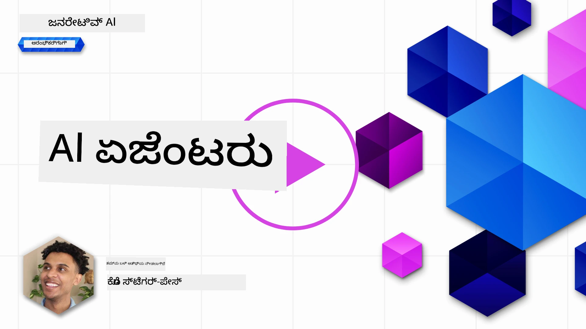
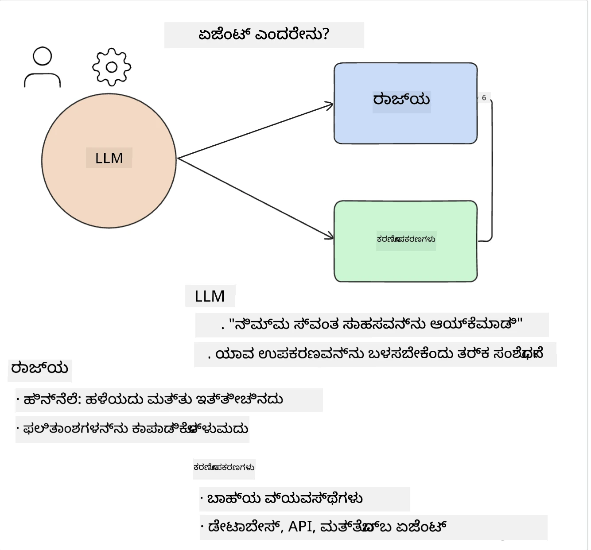
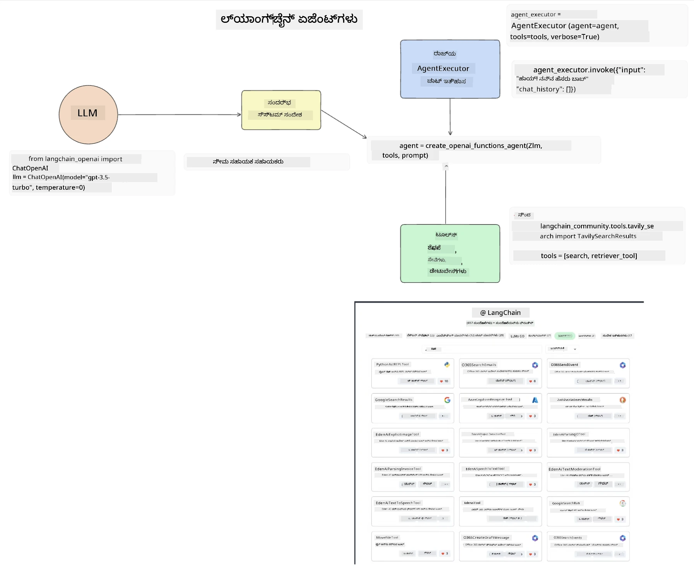
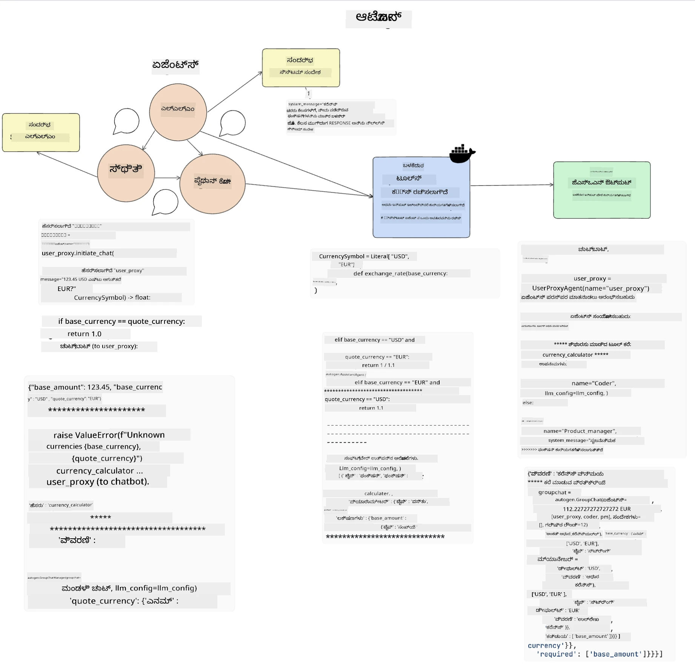
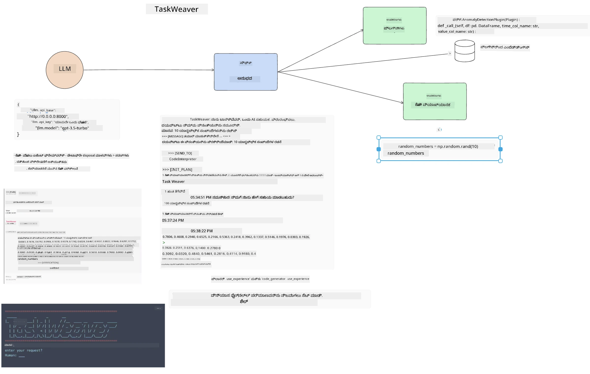
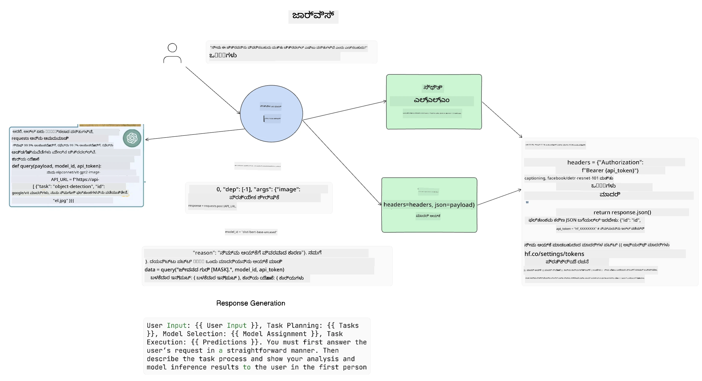

[](https://youtu.be/yAXVW-lUINc?si=bOtW9nL6jc3XJgOM)

## ಪರಿಚಯ

AI ಏಜೆಂಟ್ಸ್ ಜನರೇಟಿವ್ AI ನಲ್ಲಿ ಒಂದು ರೋಮಾಂಚಕ ಅಭಿವೃದ್ಧಿಯನ್ನಾಗಿದೆ, ಅದು ದೊಡ್ಡ ಭಾಷಾ ಮಾದರಿಗಳ (LLLs) ಸಹಾಯಕರಿಂದ ಕ್ರಿಯೆಗಳನ್ನಿರಿ ಕೈಗೊಳ್ಳಬಲ್ಲ ಏಜೆಂಟ್ಗಳಾಗಿ ವೃದ್ಧಿಯಾಗಲು ಸಾಧ್ಯವಿದೆ. AI ಏಜೆಂಟ್ ಫ್ರೆ임್‌ವರ್ಕ್‌ಗಳು ಡೆವಲಪರ್‌ಗಳಿಗೆ LLMಗಳಿಗೆ ಸಾಧನಗಳು ಮತ್ತು ಸ್ಥಿತಿಯ ನಿರ್ವಹಣೆಯನ್ನು ಪ್ರವೇಶ ಮಾಡುವ ಅಪ್ಲಿಕೇಶನ್‌ಗಳನ್ನು ರಚಿಸಲು ಸಹಾಯ ಮಾಡುತ್ತವೆ. ಈ ಫ್ರೆ임್ವರ್ಕ್‌ಗಳು ದೃಶ್ಯತೆಯನ್ನು ಹೆಚ್ಚಿಸುತ್ತವೆ, ಬಳಕೆದಾರರು ಮತ್ತು ಡೆವಲಪರ್‌ಗಳು LLMಗಳ ಯೋಜಿಸಿರುವ ಕ್ರಿಯೆಗಳನ್ನು ಆಳವಾಗಿ ಗಮನಿಸುವಂತೆ ಮಾಡುತ್ತವೆ, ಪರಿಣಾಮದ ಅನುಭವವನ್ನು ಸುಧಾರಿಸುತ್ತವೆ.

ಈ ಪಾಠವು ಕೆಳಗಿನ ವಿಷಯಗಳನ್ನು ಒಳಗೊಂಡಿರುತ್ತದೆ:

- AI ಏಜೆಂಟ್ ಎಂದರೆ ಏನು ಎಂಬುದನ್ನು ಅರ್ಥಮಾಡಿಕೊಳ್ಳುವುದು - AI ಏಜೆಂಟ್ ಎಂದರೆ ನಿಜವಾಗಿಯೂ ಏನು?
- ನಾಲ್ಕು ವಿಭಿನ್ನ AI ಏಜೆಂಟ್ ಫ್ರೆಮ್‌ವರ್ಕ್‌ಗಳ ಅನ್ವೇಷಣೆ - ಅವುಗಳನ್ನು ವಿಶಿಷ್ಟವಾಗಿಸುವುದು ಏನು?
- ಈ AI ಏಜೆಂಟ್ಸ್ ಅನ್ನು ವಿಭಿನ್ನ ಬಳಕೆ ಪ್ರಕರಣಗಳಿಗೆ ಅನ್ವಯಿಸುವುದು - ನಾವು ಎಷ್ಟು ಹೊತ್ತು AI ಏಜೆಂಟ್ಸ್ ಬಳಸಬೇಕು?

## ಕಲಿಕೆ ಗುರಿಗಳು

ಈ ಪಾಠವನ್ನು ಮುಗಿಸಿದ ನಂತರ, ನೀವು ಸಾಧ್ಯವಾಗುವುದು:

- AI ಏಜೆಂಟ್ಗಳು ಯಾವುದು ಮತ್ತು ಅವುಗಳನ್ನು ಹೇಗೆ ಬಳಸಬಹುದು ಎಂದು ವಿವರಿಸಲು.
- ಕೆಲವು ಜನಪ್ರಿಯ AI ಏಜೆಂಟ್ ಫ್ರೆಮ್‌ವರ್ಕ್‌ಗಳ ನಡುವಿನ ಭೇದಗಳನ್ನು ಮತ್ತು ಅವು ಹೇಗೆ ಬೇರೆಯಾಗಿವೆ ಎಂಬುದನ್ನು ತಿಳಿದುಕೊಳ್ಳಲು.
- AI ಏಜೆಂಟ್‌ಗಳು ಹೇಗೆ ಕಾರ್ಯನಿರ್ವಹಿಸುತ್ತವೆ ಎಂದು ಅರ್ಥಮಾಡಿಕೊಳ್ಳಿ ಮತ್ತು ಅವುಗಳೊಂದಿಗೆ ಅಪ್ಲಿಕೇಶನ್‌ಗಳನ್ನು ನಿರ್ಮಿಸಲು.

## AI ಏಜೆಂಟ್ಸ್ ಎಂದರೆ ಏನು?

AI ಏಜೆಂಟ್ಸ್ ಜನರೇಟಿವ್ AI ಜಾಗತೆಯಲ್ಲಿ ಅತ್ಯಂತ ರೋಮಾಂಚಕ ಕ್ಷೇತ್ರವಾಗಿದೆ. ಈ ರೋಮಾಂಚದಲ್ಲಿ ಕೆಲವೊಮ್ಮೆ ಪದಗಳ ಗೊಂದಲ ಮತ್ತು ಅನುವು ಸಂಭವಿಸುತ್ತದೆ. AI ಏಜೆಂಟ್ಸ್ ಅನ್ನು ಸೂಚಿಸುವ ಹೆಚ್ಚಿನ ಸಾಧನಗಳನ್ನು ಒಳಗೊಂಡಂತೆ ಸರಳ ಮತ್ತು ಸಮಗ್ರವಾಗಿರಲು, ನಾವು ಈ ವ್ಯಾಖ್ಯಾನವನ್ನು ಬಳಸಲಿದ್ದೇವೆ:

AI ಏಜೆಂಟ್ಸ್ ದೊಡ್ಡ ಭಾಷಾ ಮಾದರಿಗಳು (LLLs) ಅವರಿಗೆ **ಸ್ಥಿತಿ** ಮತ್ತು **ಸಾಧನಗಳು**ಗೆ ಪ್ರವೇಶದ ಮೂಲಕ ಕಾರ್ಯಗಳನ್ನು ನಡೆಸಲು ಅವಕಾಶ ಮಾಡಿಕೊಡುತ್ತವೆ.



ಈ ಪದಗಳನ್ನು ವಿವರಿಸೋಣ:

**ದೊಡ್ಡ ಭಾಷಾ ಮಾದರಿಗಳು** - ಈ ಮಾದರಿಗಳು ಈ ಕೋರಸಿನಾದ್ಯಂತ ಉಲ್ಲೇಖಿಸಲಾದವುಗಳು, ಉದಾಹರಣೆಗೆ GPT-3.5, GPT-4, ಲ್ಲಾಮಾ-2 ಇತ್ಯಾದಿ.

**ಸ್ಥಿತಿ** - ಇದು LLM ಕೆಲಸ ಮಾಡುತ್ತಿರುವ ಸಂಧರ್ಭವನ್ನು ಸೂಚಿಸುತ್ತದೆ. LLM ತನ್ನ ಹಳೆಯ ಕಾರ‍್ಯಗಳು ಮತ್ತು ಪ್ರಸ್ತುತ ಸಂಧರ್ಭವನ್ನು ಬಳಸಿಕೊಂಡು ಮುಂದಿನ ಕ್ರಮಗಳ ನಿರ್ಧಾರವನ್ನು ಮಾರ್ಗದರ್ಶಿಸುತ್ತದೆ. AI ಏಜೆಂಟ್ ಫ್ರೆಮ್‌ವರ್ಕ್‌ಗಳು ಡೆವಲಪರ್‌ಗಳಿಗೆ ಈ ಸಂಧರ್ಭವನ್ನು ಸುಲಭವಾಗಿ ನಿರ್ವಹಿಸಲು ಸಹಾಯ ಮಾಡುತ್ತವೆ.

**ಸಾಧನಗಳು** - ಬಳಕೆದಾರರಿಗೆ ವಿನಂತಿಸಿದ ಮತ್ತು LLMಯಿಂದ ಯೋಜಿಸಲಾದ ಕಾರ್ಯವನ್ನು ಪೂರೈಸಲು LLMಗೆ ಸಾಧನಗಳ ಪ್ರಾಪ್ತಿಯನ್ನು ನೀಡಬೇಕಾಗುತ್ತದೆ. ಕೆಲವು ಸಾಧನಗಳ ಉದಾಹರಣೆಗಳು ಡೇಟಾಬೇಸ್, API, ಹೊರಗಿನ ಅಪ್ಲಿಕೇಶನ್ ಅಥವಾ ಇನ್ನೊಂದು LLM ಆಗಿರಬಹುದು!

ಈ ವ್ಯಾಖ್ಯಾನಗಳು ಮುಂದಿನ ಕ್ರಮಗಳಿಗೆ ಉತ್ತಮ ನೆಲೆ ನಿಡಲು ಸಹಾಯ ಮಾಡುತ್ತವೆ. ಕೆಲವು ವಿಭಿನ್ನ AI ಏಜೆಂಟ್ ಫ್ರೆಮ್‌ವರ್ಕ್‌ಗಳನ್ನು ಅನ್ವೇಷಿಸೋಣ:

## ಲಾಂಗ್‌ಚೈನ್ ಏಜೆಂಟ್ಸ್

[ಲಾಂಗ್‌ಚೈನ್ ಏಜೆಂಟ್ಸ್](https://python.langchain.com/docs/how_to/#agents?WT.mc_id=academic-105485-koreyst) ನಮ್ಮ ನೀಡಿದ ವ್ಯಾಖ್ಯಾನಗಳ ಅಳವಡಿಕೆ.

**ಸ್ಥಿತಿಯ** ನಿರ್ವಹಣೆಗೆ, ಇದು `AgentExecutor` ಎಂಬ ಬಿಲ್ಟ್-ಇನ್ ಫಂಕ್ಷನ್ ಬಳಕೆ ಮಾಡುತ್ತದೆ. ಇದು ನಿರ್ದಿಷ್ಟ `agent` ಮತ್ತು ಲಭ್ಯವಿರುವ `tools` ಅನ್ನು ಸ್ವೀಕರಿಸುತ್ತದೆ.

`Agent Executor` ಚಾಟ್ ಇತಿಹಾಸವನ್ನು ಸಂಗ್ರಹಿಸಿ ಚಾಟ್ ಸಂಧರ್ಭವನ್ನು ಒದಗಿಸುತ್ತದೆ.



ಲಾಂಗ್‌ಚೈನ್ ಒಂದು [ಸಾಧನಗಳ ಕ್ಯಾಟಲಾಗ್](https://integrations.langchain.com/tools?WT.mc_id=academic-105485-koreyst) ಒದಗಿಸುತ್ತದೆ, ಇದನ್ನು ನಿಮ್ಮ ಅಪ್ಲಿಕೇಶನ್‌ಗೆ ಆಮದು ಮಾಡಿಕೊಳ್ಳಬಹುದು, LLM ಅದಕ್ಕೆ ಪ್ರವೇಶ ಪಡೆಯಬಹುದು. ಇವು ಸಮುದಾಯ ಮತ್ತು ಲಾಂಗ್‌ಚೈನ್ ತಂಡದಿಂದ ಮಾಡಲ್ಪಟ್ಟಿವೆ.

ನೀವು ನಂತರ ಈ ಸಾಧನಗಳನ್ನು ವ್ಯಾಖ್ಯಾನಿಸಿ `Agent Executor` ಗೆ ನೀಡಬಹುದು.

ದೃಶ್ಯತೆ AI ಏಜೆಂಟ್ಸಿನ ಒಂದು ಪ್ರಮುಖ ಅಂಶ. ಅಪ್ಲಿಕೇಶನ್ ಡೆವಲಪರ್‌ಗಳು ಯಾವ ಸಾಧನ LLM ಬಳಸುತ್ತಿದೆ ಮತ್ತು ಏಕೆ ಎಂಬುದನ್ನು ತಿಳಿದುಕೊಳ್ಳುವುದು ಮಹತ್ವದ್ದು. ಅದಕ್ಕಾಗಿ ಲಾಂಗ್‌ಚೈನ್ ತಂಡ LangSmith ಅನ್ನು ಅಭಿವೃದ್ಧಿಪಡಿಸಿದೆ.

## AutoGen

ಮುಂದಿನ AI ಏಜೆಂಟ್ ಫ್ರೆಮ್‌ವರ್ಕ್ ನಾವು ಚರ್ಚಿಸುವುದು [AutoGen](https://microsoft.github.io/autogen/?WT.mc_id=academic-105485-koreyst). AutoGen ನ ಪ್ರಮುಖ ಗಮನಾರ್ಹ ಅಂಶ ಮಾತುಕತೆ. ಏಜೆಂಟ್‌ಗಳು **ಮಾತುಕತೆಯಾಗುವ** ಮತ್ತು **ಕಸ್ಟಮೈಸಬಲ್** ಆಗಿರುತ್ತವೆ.

**ಮಾತುಕತೆಯುಳ್ಳ-** LLMಗಳು ಕಾರ್ಯವನ್ನು ಪೂರ್ಣಗೊಳಿಸಲು ಮತ್ತೊಂದು LLM ಜೊತೆಗೆ ಮಾತುಕತೆ ಪ್ರಾರಂಭಿಸಿ ಮುಂದುವರಿಸಬಹುದು. ಇದು `AssistantAgents` ರಚಿಸುವ ಮೂಲಕ ಮತ್ತು ಅವರಿಗೆ ನಿರ್ದಿಷ್ಟ ಸಿಸ್ಟಂ ಸಂದೇಶ ನೀಡುವ ಮೂಲಕ ಮಾಡಲ್ಪಡುತ್ತದೆ.

```python

autogen.AssistantAgent( name="Coder", llm_config=llm_config, ) pm = autogen.AssistantAgent( name="Product_manager", system_message="Creative in software product ideas.", llm_config=llm_config, )

```

**ಕಸ್ಟಮೈಸಬಲ್** - ಏಜೆಂಟ್‌ಗಳನ್ನು LLM ಮಾತ್ರವಲ್ಲದೆ ಬಳಕೆದಾರ ಅಥವಾ ಸಾಧನವಾಗಿಯೂนิರ್ಮಿಸಲು ಸಾಧ್ಯವಿದೆ. ಡೆವಲಪರ್ ಆಗಿ, ನೀವು `UserProxyAgent` ಅನ್ನು ವ್ಯಾಖ್ಯಾನಿಸಿ, ಅದು ಬಳಕೆದಾರನಿಂದ ಪ್ರತಿಕ್ರಿಯೆ ಪಡೆಯಲು ಜವಾಬ್ದಾರಿಯಾಗುತ್ತದೆ. ಈ ಪ್ರತಿಕ್ರಿಯೆ ಕಾರ್ಯ ನಿರ್ವಹಣೆಯನ್ನು ಮುಂದುವರಿಸುವುದಕ್ಕೆ ಅಥವಾ ನಿಲ್ಲಿಸುವುದಕ್ಕೆ ಸಹಾಯ ಮಾಡಬಹುದು.

```python
user_proxy = UserProxyAgent(name="user_proxy")
```

### ಸ್ಥಿತಿ ಮತ್ತು ಸಾಧನಗಳು

ಸ್ಥಿತಿಯನ್ನು ಬದಲಾಯಿಸಲು ಮತ್ತು ನಿರ್ವಹಿಸಲು, ಸಹಾಯಕ ಏಜೆಂಟ್ ಪೈತಾನ್ ಕೋಡ್ ರಚಿಸುತ್ತದೆ ಕಾರ್ಯವನ್ನು ಪೂರ್ಣಗೊಳಿಸಲು.

ನೀವು ಪ್ರಕ್ರಿಯೆಯ ಉದಾಹರಣೆ ಇಲ್ಲಿದೆ:



#### ಸಿಸ್ಟಂ ಸಂದೇಶದಿಂದ ವ್ಯಾಖ್ಯಾನಿಸಲಾದ LLM

```python
system_message="For weather related tasks, only use the functions you have been provided with. Reply TERMINATE when the task is done."
```

ಈ ಸಿಸ್ಟಂ ಸಂದೇಶವು ಈ ನಿರ್ದಿಷ್ಟ LLMಗೆ ತಾನಗೆ ಸೇರಿದ ಕಾರ್ಯಕ್ಕೆ ಯಾವ ಕಾರ್ಯಗಳು ಸಂಬಂಧಿಸಿದ್ದು ಎಂಬುದನ್ನು ಸೂಚಿಸುತ್ತದೆ. AutoGen ಮೂಲಕ ನೀವು ವಿಭಿನ್ನ ಸಿಸ್ಟಂ ಸಂದೇಶಗಳೊಂದಿಗೆ ಅನೇಕ AssistantAgents ಹೊಂದಿರಬಹುದು.

#### ಬಳಕೆದಾರರಿಂದ ಚಾಟ್ ಪ್ರಾರಂಭ

```python
user_proxy.initiate_chat( chatbot, message="I am planning a trip to NYC next week, can you help me pick out what to wear? ", )

```

ಬಳಕೆದಾರ_proxy (ಮಾನವ)ದಿಂದ ಈ ಸಂದೇಶದಿಂದ ಏಜೆಂಟ್ ಕಾರ್ಯಾಚರಣೆ ಪ್ರಾರಂಭವಾಗುತ್ತದೆ ಮತ್ತು ಎಕ್ಸ್‌ಪುಟ್ ಮಾಡಬೇಕಾಗಿರುವ ಕಾರ್ಯಗಳು ಅನ್ವೇಷಣೆ ಮಾಡಲಾಗುತ್ತದೆ.

#### ಕಾರ್ಯ ಕಾರ್ಯಗತಗೊಳಿಸಲಾಗಿದೆ

```bash
chatbot (to user_proxy):

***** Suggested tool Call: get_weather ***** Arguments: {"location":"New York City, NY","time_periond:"7","temperature_unit":"Celsius"} ******************************************************** --------------------------------------------------------------------------------

>>>>>>>> EXECUTING FUNCTION get_weather... user_proxy (to chatbot): ***** Response from calling function "get_weather" ***** 112.22727272727272 EUR ****************************************************************

```

ಆರಂಭಿಕ ಚಾಟ್ ಸಂಸ್ಕರಿಸಿದ ಬಳಿಕ, ಏಜೆಂಟ್ ಕರೆ ಮಾಡಬೇಕಾದ ಸಲಹೆ ಸಂಕೇತವನ್ನು ಕಳುಹಿಸುತ್ತದೆ. ಈ ಉದಾಹರಣೆಯಲ್ಲಿ ಇದು `get_weather` ಎಂಬ ಫಂಕ್ಷನ್. ನಿಮ್ಮ ಸಂರಚನೆಯಂತೆ, ಈ ಫಂಕ್ಷನ್ ಸ್ವಯಂಚಾಲಿತವಾಗಿ ಕಾರ್ಯಗತಗೊಳ್ಳಬಹುದು ಅಥವಾ ಬಳಕೆದಾರ ಇನ್ಪುಟ್ ಮೂಲಕ ಕಾರ್ಯಗತಗೊಳ್ಳಬಹುದು.

ನೀವು ಇನ್ನಷ್ಟು ತಿಳಿಯಲು [AutoGen ಕೋಡ್ ಮಾದರಿಗಳನ್ನು](https://microsoft.github.io/autogen/docs/Examples/?WT.mc_id=academic-105485-koreyst) ನೋಡಬಹುದು.

## Taskweaver

ಮುಂದಿನ ಏಜೆಂಟ್ ಫ್ರೆಮ್‌ವರ್ಕ್ ನಾವು ಅನ್ವೇಷಿಸುವುದು [Taskweaver](https://microsoft.github.io/TaskWeaver/?WT.mc_id=academic-105485-koreyst). ಇದು "ಕೋಡ್-ಪ್ರಥಮ" ಏಜೆಂಟ್ ಎಂದು ಕರೆಯಲ್ಪಡುತ್ತದೆ ಏಕೆಂದರೆ ಇದು ಕೇವಲ `strings` ನೊಂದಿಗೆ ಕೆಲಸ ಮಾಡುವುದರ ಬದಲು ಪೈಥಾನ್‌ನಲ್ಲಿ ಡೇಟಾ‌ಫ್ರೆಮ್‌ಗಳೊಂದಿಗೆ ಕಾರ್ಯನಿರ್ವಹಿಸಬಹುದು. ಇದು ಡೇಟಾ ವಿಶ್ಲೇಷಣೆ ಮತ್ತು ಮೂಡಿಸುವ ಕಾರ್ಯಗಳಿಗೆ ಬಹಳ ಉಪಯುಕ್ತವಾಗಿದೆ. ಉದಾಹರಣೆಗೆ ಗ್ರಾಫ್‌ಗಳು, ಚಾರ್ಟ್ಸ್, ಅಥವಾ ಯಾದೃಚ್ಛಿಕ ಸಂಖ್ಯೆಗಳ ರಚಿತೆ.

### ಸ್ಥಿತಿ ಮತ್ತು ಸಾಧನಗಳು

ಚಟುವಟಿಕೆಯ ಸ್ಥಿತಿಯನ್ನು ನಿರ್ವಹಿಸಲು, TaskWeaver `Planner` ಎಂಬ ಸಂಧಾನವನ್ನು ಬಳಸುತ್ತದೆ. `Planner` ಒಂದು LLM ಆಗಿದ್ದು, ಬಳಕೆದಾರರಿಂದ ವಿನಂತಿಯನ್ನು ತೆಗೆದು ಈ ವಿನಂತಿಯನ್ನು ಪೂರೈಸಬೇಕಾದ ಕಾರ್ಯಗಳನ್ನು ಮ್ಯಾಪ್ ಮಾಡುತ್ತದೆ.

ಕಾರ್ಯಗಳನ್ನು ಪೂರ್ಣಗೊಳಿಸಲು `Planner`ಗೆ `Plugins` ಎಂದು ಕರೆಯುವ ಸಾಧನಸಂಕಲನ ಪ್ರარგಗೊಳ್ಳುತ್ತದೆ. ಇವು ಪೈಥಾನ್ ಕ್ಲಾಸ್‌ಗಳು ಅಥವಾ ಸಾಮಾನ್ಯ ಕೋಡ್ ಇಂಟರ್ಫ್ರೀಟರ್ ಆಗಿರಬಹುದು. ಈ ಪ್ಲಗಿನ್‌ಗಳು ಎಮ್ಬೆಡಿಂಗ್ಸ್ ලෙස ಸಂಗ್ರಹಿಸಲ್ಪಟ್ಟಿವೆ ಇದರಿಂದ LLM ಸರಿಯಾದ ಪ್ಲಗಿನ್ ಹುಡುಕಲು ಉತ್ತಮವಾಗಿರುತ್ತದೆ.



ಅನಮೋಳಿ ಪತ್ತೆಯನ್ನು ಕೈಗಾರಿಸಲು ಪ್ಲಗಿನ್ ಉದಾಹರಣೆ ಇಲ್ಲಿದೆ:

```python
class AnomalyDetectionPlugin(Plugin): def __call__(self, df: pd.DataFrame, time_col_name: str, value_col_name: str):
```

ಕಾರ್ಯನಿರ್ವಹಿಸಲು ಮುನ್ನ ಕೋಡ್ ಪರಿಶೀಲಿಸಲಾಗುತ್ತದೆ. Taskweaverನಲ್ಲಿ ಇನ್ನೊಂದು ಸಂಘಟನೆಯ ವ್ಯವಸ್ಥೆ `ಅನುಭವ`. ಅನುಭವವು ಸಂವಾದದ ಸ್ಥಿತಿಯನ್ನು YAML ಫೈಲ್‌ನಲ್ಲಿ ದೀರ್ಘಕಾಲ ಶೇಖರಿಸಲು ಅನುಮತಿಸುತ್ತದೆ. ಇದು ಕಾರ್ಯಗಳಲ್ಲಿ LLM ಸಮಯದೊಂದಿಗೆ ಸಾಧ್ಯತೆಗಳು ಸುಧಾರಣೆಗೆ ಮುನ್ನಡೆಸುತ್ತದೆ, ವಿಶೇಷವಾಗಿ ಹಿಂದಿನ ಸಂವಾದಗಳಿಗೆ ಒಳಗಾಗಿದ್ದಲ್ಲಿ.

## JARVIS

ಅಂತಿಮ ಏಜೆಂಟ್ ಫ್ರೆಮ್‌ವರ್ಕ್ ನಾವು ಅನ್ವೇಷಿಸುವುದು [JARVIS](https://github.com/microsoft/JARVIS?tab=readme-ov-file&WT.mc_id=academic-105485-koreyst). JARVISನ ವಿಶಿಷ್ಟತೆ ಇದು ಸಂವಾದದ `ಸ್ಥಿತಿಯನ್ನು` ನಿರ್ವಹಿಸಲು LLM ಅನ್ನು ಬಳಸುತ್ತದೆ ಮತ್ತು `ಸಾಧನಗಳು` ಇತರ AI ಮಾದರಿಗಳು. ಪ್ರತಿ AI ಮಾದರಿ ನಿರ್ದಿಷ್ಟ ಕಾರ್ಯಗಳನ್ನು ಪೂರ್ಣಗೊಳಿಸುವ ವಿಶೇಷ ಮಾದರಿಗಳು, ಉದಾಹರಣೆಗೆ ವಸ್ತು ಗುರುತು, ಲಿಪ್ಯಂತರಣ ಅಥವಾ ಚಿತ್ರ ಶೀರ್ಷಿಕೆ.



ಜನೆರಲ್‌ ಪರ್ಪಸ್ ಮಾದರಿ ಆಗಿರುವ LLM ಬಳಕೆದಾರರಿಂದ ವಿನಂತಿಯನ್ನು ಸ್ವೀಕರಿಸಿ ನಿರ್ದಿಷ್ಟ ಕಾರ್ಯ ಮತ್ತು ಅದರ ನಿರ್ವಹಣೆಗೆ ಬೇಕಾದ ಎಲ್ಲಾ ಡೇಟಾ/ಯುಕ್ತಿವಾದಗಳನ್ನು ಗುರುತಿಸುತ್ತದೆ.

```python
[{"task": "object-detection", "id": 0, "dep": [-1], "args": {"image": "e1.jpg" }}]
```

LLM ನಂತರ ವಿನಂತಿಯನ್ನು ವಿಶೇಷ AI ಮಾದರಿ ವಿಶ್ಲೇಷಿಸಲು ಹೊಂದಾಣಿಕೆಯಾಗುವಂತೆ, ಉದಾಹರಣೆಗೆ JSON ರೂಪದಲ್ಲಿ ಸ್ವರೂಪಿಸುತ್ತದೆ. AI ಮಾದರಿ ಕಾರ್ಯಾಧಾರಿತ ಭವಿಷ್ಯವಾಣಿ ನೀಡಿದ ಮೇಲೆ, LLM ಪ್ರತಿಕ್ರಿಯೆಯನ್ನು ಸ್ವೀಕರಿಸುತ್ತದೆ.

ಒಂದಕ್ಕಿಂತ ಹೆಚ್ಚು ಮಾದರಿಗಳು ಕಾರ್ಯಪೂರೈಸಬೇಕಿದ್ದರೆ, ಅವುಗಳಿಂದಲೂ ಪ್ರತಿಕ್ರಿಯೆಯನ್ನು LLM ವಿವರಣೆ ಮಾಡಿ, ಬಳಕೆದಾರ ಅವರಿಗೆ ಅರ್ಥವಾಗುವಂತೆ ಉತ್ತರ ಒದಗಿಸುತ್ತದೆ.

ಕೆಳಗಿನ ಉದಾಹರಣೆಯಲ್ಲಿ ಬಳಕೆದಾರನು ಚಿತ್ರದಲ್ಲಿರುವ ವಸ್ತುಗಳ ವಿವರಣೆ ಮತ್ತು ಎಣಿಕೆಯನ್ನು ಕೇಳುತ್ತಿರುವ ಸಂದರ್ಭದ ಕಾರ್ಯವಿಧಾನ ತೋರಿಸಲಾಗಿದೆ:

## ಹವಾಲೆ

AI ಏಜೆಂಟ್ ಕಲಿಕೆಯನ್ನು ಮುಂದುವರಿಸಲು ನೀವು AutoGen ಬಳಸಿ ನಿರ್ಮಿಸಬಹುದು:

- ಶಿಕ್ಷಣ ಸ್ಟಾರ್ಟ್ಅಪ್‌ನ ವಿಭಿನ್ನ ಇಲಾಖೆಗಳೊಂದಿಗೆ ವ್ಯವಹಾರ ಸಭೆಯನ್ನು ಅನುಕರಿಸುವ ಅಪ್ಲಿಕೇಶನ್.
- LLMಗಳಿಗೆ ವಿಭಿನ್ನ ವ್ಯಕ್ತಿತ್ವಗಳು ಮತ್ತು ಆದ್ಯತೆಗಳನ್ನು ತಿಳಿದುಕೊಳ್ಳಲು ಮಾರ್ಗದರ್ಶಿಸುವ ಸಿಸ್ಟಂ ಸಂದೇಶಗಳನ್ನು ರಚಿಸಿ, ಬಳಕೆದಾರರು ಹೊಸ ಉತ್ಪನ್ನ ಆಲೋಚನೆಯನ್ನು ಪಿಚ್ ಮಾಡಲು ಸ ಸಾದ್ಯತೆ ಮಾಡುವುದು.
- LLM ನಂತರ ಪ್ರತಿಯೊಂದು ಇಲಾಖೆಯಿಂದ ಫಾಲೋ-ಅಪ್ ಪ್ರಶ್ನೆಗಳನ್ನು ಉತ್ಪಾದಿಸಬೇಕು, ಉತ್ತರವನ್ನು ಸುಧಾರಿಸಲು ಮತ್ತು ಆಲೋಚನೆಯನ್ನು ಮುಂಜಾನೆ ಮಾಡಲು.

## ಕಲಿಕೆ ಇಲ್ಲಿ ನಿಲ್ಲಿಸುವುದಿಲ್ಲ, ಪಯಣವನ್ನು ಮುಂದುವರಿಸಿ

ಈ ಪಾಠವನ್ನು ಮುಗಿಸಿದ ನಂತರ, ನಮ್ಮ [ಜನರೇಟಿವ್ AI ಕಲಿಕೆ ಸಂಗ್ರಹ](https://aka.ms/genai-collection?WT.mc_id=academic-105485-koreyst) ಅನ್ನು ಪರಿಶೀಲಿಸಿ, ನಿಮ್ಮ ಜನರೇಟಿವ್ AI ಜ್ಞಾನವನ್ನು ಇನ್ನಷ್ಟು ಬಲಪಡಿಸಿ!

---

<!-- CO-OP TRANSLATOR DISCLAIMER START -->
**ಅಸ್ಪಷ್ಟಿಕೆ**:  
ಈ ದಸ್ತಾವೇಜು AI ಅನುವಾದ ಸೇವೆ [Co-op Translator](https://github.com/Azure/co-op-translator) ಬಳಸಿ ಅನುವಾದಿಸಲಾಗಿದೆ. ನಾವು ನಿಖರತೆಯನ್ನು ಸಾಧಿಸಲು ಪ್ರಯತ್ನಿಸುವಾಗ, ಸ್ವಯಂಕ್ರಿಯ ಅನುವಾದಗಳಲ್ಲಿ ತಪ್ಪುಗಳು ಅಥವಾ ಅಸತ್ಯತೆಗಳು ಇರಬಹುದು ಎಂದು ದಯವಿಟ್ಟು ಗಮನಿಸಿ. ಮೂಲ ಭಾಷೆಯ ದಸ್ತಾವೇಜನ್ನು ಅಧಿಕೃತ ಮೂಲವೆಂದು ಪರಿಗಣಿಸಬೇಕಾಗಿದೆ. ಪ್ರಮುಖ ಮಾಹಿತಿಗಾಗಿ, ವೃತ್ತಿಪರ ಮಾನವ ಅನುವಾದವನ್ನು ಶಿಫಾರಸು ಮಾಡಲಾಗುತ್ತದೆ. ಈ ಅನುವಾದದಿಂದ ಉಂಟಾಗುವ ಯಾವುದೇ ತಪ್ಪು ವಿವರಣೆಗಳು ಅಥವಾ ಅರ್ಥಪೂರ್ಣ ಸದೃಢತೆಗಳಿಗಾಗಿ ನಾವು ಜವಾಬ್ದಾರರಾಗುವುದಿಲ್ಲ.
<!-- CO-OP TRANSLATOR DISCLAIMER END -->