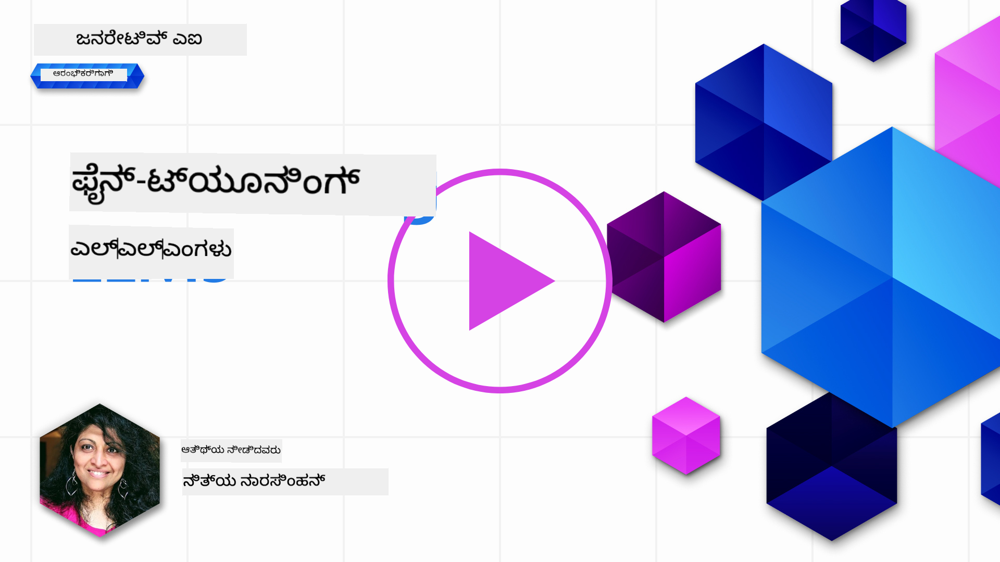

<!--
CO_OP_TRANSLATOR_METADATA:
{
  "original_hash": "807f0d9fc1747e796433534e1be6a98a",
  "translation_date": "2025-12-19T20:29:43+00:00",
  "source_file": "18-fine-tuning/README.md",
  "language_code": "kn"
}
-->

# ನಿಮ್ಮ LLM ಅನ್ನು ಫೈನ್-ಟ್ಯೂನಿಂಗ್ ಮಾಡುವುದು

ಜನರೇಟಿವ್ AI ಅಪ್ಲಿಕೇಶನ್‌ಗಳನ್ನು ನಿರ್ಮಿಸಲು ದೊಡ್ಡ ಭಾಷಾ ಮಾದರಿಗಳನ್ನು ಬಳಸುವುದು ಹೊಸ ಸವಾಲುಗಳನ್ನು ಹೊಂದಿದೆ. ಪ್ರಮುಖ ಸಮಸ್ಯೆ ಎಂದರೆ, ನಿರ್ದಿಷ್ಟ ಬಳಕೆದಾರ ವಿನಂತಿಗೆ ಮಾದರಿ ರಚಿಸುವ ವಿಷಯದಲ್ಲಿ ಪ್ರತಿಕ್ರಿಯೆಯ ಗುಣಮಟ್ಟ (ನಿಖರತೆ ಮತ್ತು ಸಂಬಂಧಿತತೆ) ಖಚಿತಪಡಿಸುವುದು. ಹಿಂದಿನ ಪಾಠಗಳಲ್ಲಿ, ನಾವು ಪ್ರಾಂಪ್ಟ್ ಎಂಜಿನಿಯರಿಂಗ್ ಮತ್ತು ರಿಟ್ರೀವಲ್-ಆಗ್ಮೆಂಟೆಡ್ ಜನರೇಶನ್ ಮುಂತಾದ ತಂತ್ರಗಳನ್ನು ಚರ್ಚಿಸಿದ್ದೇವೆ, ಅವುಗಳು _ಪ್ರಾಂಪ್ಟ್ ಇನ್‌ಪುಟ್ ಅನ್ನು ಬದಲಾಯಿಸುವ ಮೂಲಕ_ ಈ ಸಮಸ್ಯೆಯನ್ನು ಪರಿಹರಿಸಲು ಪ್ರಯತ್ನಿಸುತ್ತವೆ.

ಇಂದಿನ ಪಾಠದಲ್ಲಿ, ನಾವು ಮೂರನೇ ತಂತ್ರವಾದ **ಫೈನ್-ಟ್ಯೂನಿಂಗ್** ಅನ್ನು ಚರ್ಚಿಸುತ್ತೇವೆ, ಇದು _ಮಾದರಿಯನ್ನು ಸ್ವತಃ ಹೆಚ್ಚುವರಿ ಡೇಟಾ ಬಳಸಿ ಮರುಶಿಕ್ಷಣ ಮಾಡುವ ಮೂಲಕ_ ಸವಾಲನ್ನು ಪರಿಹರಿಸಲು ಪ್ರಯತ್ನಿಸುತ್ತದೆ. ವಿವರಗಳಿಗೆ ಒಳಗೊಳ್ಳೋಣ.

## ಕಲಿಕೆಯ ಉದ್ದೇಶಗಳು

ಈ ಪಾಠವು ಪೂರ್ವ-ಶಿಕ್ಷಿತ ಭಾಷಾ ಮಾದರಿಗಳಿಗಾಗಿ ಫೈನ್-ಟ್ಯೂನಿಂಗ್ ಎಂಬ ಕಲ್ಪನೆಯನ್ನು ಪರಿಚಯಿಸುತ್ತದೆ, ಈ ವಿಧಾನದ ಲಾಭಗಳು ಮತ್ತು ಸವಾಲುಗಳನ್ನು ಅನ್ವೇಷಿಸುತ್ತದೆ ಮತ್ತು ನಿಮ್ಮ ಜನರೇಟಿವ್ AI ಮಾದರಿಗಳ ಕಾರ್ಯಕ್ಷಮತೆಯನ್ನು ಸುಧಾರಿಸಲು ಫೈನ್-ಟ್ಯೂನಿಂಗ್ ಅನ್ನು ಯಾವಾಗ ಮತ್ತು ಹೇಗೆ ಬಳಸಬೇಕೆಂದು ಮಾರ್ಗದರ್ಶನ ನೀಡುತ್ತದೆ.

ಈ ಪಾಠದ ಕೊನೆಯಲ್ಲಿ, ನೀವು ಕೆಳಗಿನ ಪ್ರಶ್ನೆಗಳಿಗೆ ಉತ್ತರಿಸಬಲ್ಲಿರಿ:

- ಭಾಷಾ ಮಾದರಿಗಳಿಗಾಗಿ ಫೈನ್-ಟ್ಯೂನಿಂಗ್ ಎಂದರೆ ಏನು?
- ಫೈನ್-ಟ್ಯೂನಿಂಗ್ ಯಾವಾಗ ಮತ್ತು ಏಕೆ ಉಪಯುಕ್ತ?
- ನಾನು ಪೂರ್ವ-ಶಿಕ್ಷಿತ ಮಾದರಿಯನ್ನು ಹೇಗೆ ಫೈನ್-ಟ್ಯೂನ್ ಮಾಡಬಹುದು?
- ಫೈನ್-ಟ್ಯೂನಿಂಗ್‌ನ ಮಿತಿಗಳು ಯಾವುವು?

ಸಿದ್ಧರಾ? ಆರಂಭಿಸೋಣ.

## ಚಿತ್ರಣಗೊಳಿಸಿದ ಮಾರ್ಗದರ್ಶಿ

ನಾವು ಒಳಗೊಳ್ಳುವ ಮೊದಲು ದೊಡ್ಡ ಚಿತ್ರಣವನ್ನು ತಿಳಿದುಕೊಳ್ಳಲು ಬಯಸುವಿರಾ? ಈ ಚಿತ್ರಣಗೊಳಿಸಿದ ಮಾರ್ಗದರ್ಶಿಯನ್ನು ನೋಡಿ, ಇದು ಫೈನ್-ಟ್ಯೂನಿಂಗ್‌ನ ಮೂಲ ಕಲ್ಪನೆಗಳು ಮತ್ತು ಪ್ರೇರಣೆಯಿಂದ ಪ್ರಕ್ರಿಯೆ ಮತ್ತು ಉತ್ತಮ ಅಭ್ಯಾಸಗಳನ್ನು ಅರ್ಥಮಾಡಿಕೊಳ್ಳುವವರೆಗೆ ಕಲಿಕೆಯ ಪ್ರಯಾಣವನ್ನು ವಿವರಿಸುತ್ತದೆ. ಇದು ಅನ್ವೇಷಣೆಗೆ ಆಕರ್ಷಕ ವಿಷಯ, ಆದ್ದರಿಂದ ನಿಮ್ಮ ಸ್ವಯಂ-ಮಾರ್ಗದರ್ಶನ ಕಲಿಕೆಯ ಪ್ರಯಾಣವನ್ನು ಬೆಂಬಲಿಸುವ ಹೆಚ್ಚುವರಿ ಲಿಂಕ್‌ಗಳಿಗಾಗಿ [ಸಂಪನ್ಮೂಲಗಳು](./RESOURCES.md?WT.mc_id=academic-105485-koreyst) ಪುಟವನ್ನು ಪರಿಶೀಲಿಸಲು ಮರೆಯಬೇಡಿ!

## ಭಾಷಾ ಮಾದರಿಗಳಿಗಾಗಿ ಫೈನ್-ಟ್ಯೂನಿಂಗ್ ಎಂದರೆ ಏನು?

ವ್ಯಾಖ್ಯಾನ ಪ್ರಕಾರ, ದೊಡ್ಡ ಭಾಷಾ ಮಾದರಿಗಳು ಇಂಟರ್ನೆಟ್ ಸೇರಿದಂತೆ ವಿಭಿನ್ನ ಮೂಲಗಳಿಂದ ಸಂಗ್ರಹಿಸಿದ ದೊಡ್ಡ ಪ್ರಮಾಣದ ಪಠ್ಯಗಳ ಮೇಲೆ _ಪೂರ್ವ-ಶಿಕ್ಷಿತ_ ಆಗಿರುತ್ತವೆ. ನಾವು ಹಿಂದಿನ ಪಾಠಗಳಲ್ಲಿ ಕಲಿತಂತೆ, ಬಳಕೆದಾರರ ಪ್ರಶ್ನೆಗಳಿಗೆ ("ಪ್ರಾಂಪ್ಟ್‌ಗಳು") ಮಾದರಿಯ ಪ್ರತಿಕ್ರಿಯೆಗಳ ಗುಣಮಟ್ಟವನ್ನು ಸುಧಾರಿಸಲು _ಪ್ರಾಂಪ್ಟ್ ಎಂಜಿನಿಯರಿಂಗ್_ ಮತ್ತು _ರಿಟ್ರೀವಲ್-ಆಗ್ಮೆಂಟೆಡ್ ಜನರೇಶನ್_ ಮುಂತಾದ ತಂತ್ರಗಳು ಅಗತ್ಯವಿವೆ.

ಜನಪ್ರಿಯ ಪ್ರಾಂಪ್ಟ್-ಎಂಜಿನಿಯರಿಂಗ್ ತಂತ್ರಗಳಲ್ಲಿ, ಪ್ರತಿಕ್ರಿಯೆಯಲ್ಲಿ ಏನು ನಿರೀಕ್ಷಿಸಲಾಗಿದೆ ಎಂಬುದರ ಬಗ್ಗೆ ಮಾದರಿಗೆ ಹೆಚ್ಚು ಮಾರ್ಗದರ್ಶನ ನೀಡುವುದು, ಅದು _ಸೂಚನೆಗಳನ್ನು_ (ಸ್ಪಷ್ಟ ಮಾರ್ಗದರ್ಶನ) ನೀಡುವುದರಿಂದ ಅಥವಾ _ಕೆಲವು ಉದಾಹರಣೆಗಳನ್ನು_ (ಅನ್ವಯ ಮಾರ್ಗದರ್ಶನ) ನೀಡುವುದರಿಂದ ಆಗುತ್ತದೆ. ಇದನ್ನು _ಫ್ಯೂ-ಶಾಟ್ ಲರ್ನಿಂಗ್_ ಎಂದು ಕರೆಯುತ್ತಾರೆ ಆದರೆ ಇದಕ್ಕೆ ಎರಡು ಮಿತಿಗಳು ಇವೆ:

- ಮಾದರಿ ಟೋಕನ್ ಮಿತಿಗಳು ನೀವು ನೀಡಬಹುದಾದ ಉದಾಹರಣೆಗಳ ಸಂಖ್ಯೆಯನ್ನು ನಿರ್ಬಂಧಿಸಬಹುದು ಮತ್ತು ಪರಿಣಾಮಕಾರಿತ್ವವನ್ನು ಕಡಿಮೆ ಮಾಡಬಹುದು.
- ಮಾದರಿ ಟೋಕನ್ ವೆಚ್ಚಗಳು ಪ್ರತಿ ಪ್ರಾಂಪ್ಟ್‌ಗೆ ಉದಾಹರಣೆಗಳನ್ನು ಸೇರಿಸುವುದನ್ನು ದುಬಾರಿ ಮಾಡಬಹುದು ಮತ್ತು ಲವಚಿಕತೆಯನ್ನು ಕಡಿಮೆ ಮಾಡಬಹುದು.

ಫೈನ್-ಟ್ಯೂನಿಂಗ್ ಎಂದರೆ, ಯಂತ್ರ ಅಧ್ಯಯನ ವ್ಯವಸ್ಥೆಗಳಲ್ಲಿ ಸಾಮಾನ್ಯ ಅಭ್ಯಾಸ, ಇಲ್ಲಿ ನಾವು ಪೂರ್ವ-ಶಿಕ್ಷಿತ ಮಾದರಿಯನ್ನು ತೆಗೆದುಕೊಂಡು ಹೊಸ ಡೇಟಾ ಬಳಸಿ ಮರುಶಿಕ್ಷಣ ಮಾಡುತ್ತೇವೆ, ವಿಶೇಷ ಕಾರ್ಯದಲ್ಲಿ ಅದರ ಕಾರ್ಯಕ್ಷಮತೆಯನ್ನು ಸುಧಾರಿಸಲು. ಭಾಷಾ ಮಾದರಿಗಳ ಸನ್ನಿವೇಶದಲ್ಲಿ, ನಾವು ಪೂರ್ವ-ಶಿಕ್ಷಿತ ಮಾದರಿಯನ್ನು _ನಿರ್ದಿಷ್ಟ ಕಾರ್ಯ ಅಥವಾ ಅಪ್ಲಿಕೇಶನ್ ಕ್ಷೇತ್ರಕ್ಕಾಗಿ ಆಯ್ದ ಉದಾಹರಣೆಗಳ ಸಮೂಹದೊಂದಿಗೆ_ ಫೈನ್-ಟ್ಯೂನ್ ಮಾಡಬಹುದು, ಇದರಿಂದ ಆ ಕಾರ್ಯ ಅಥವಾ ಕ್ಷೇತ್ರಕ್ಕೆ ಹೆಚ್ಚು ನಿಖರ ಮತ್ತು ಸಂಬಂಧಿತ **ಕಸ್ಟಮ್ ಮಾದರಿ** ಸೃಷ್ಟಿಯಾಗಬಹುದು. ಫೈನ್-ಟ್ಯೂನಿಂಗ್‌ನ ಪಾರ್ಶ್ವಲಾಭವೆಂದರೆ, ಇದು ಫ್ಯೂ-ಶಾಟ್ ಲರ್ನಿಂಗ್‌ಗೆ ಬೇಕಾಗುವ ಉದಾಹರಣೆಗಳ ಸಂಖ್ಯೆಯನ್ನು ಕಡಿಮೆ ಮಾಡಬಹುದು - ಟೋಕನ್ ಬಳಕೆಯನ್ನು ಮತ್ತು ಸಂಬಂಧಿತ ವೆಚ್ಚಗಳನ್ನು ಕಡಿಮೆ ಮಾಡುತ್ತದೆ.

## ನಾವು ಯಾವಾಗ ಮತ್ತು ಏಕೆ ಮಾದರಿಗಳನ್ನು ಫೈನ್-ಟ್ಯೂನ್ ಮಾಡಬೇಕು?

_ಈ_ ಸನ್ನಿವೇಶದಲ್ಲಿ, ನಾವು ಫೈನ್-ಟ್ಯೂನಿಂಗ್ ಬಗ್ಗೆ ಮಾತನಾಡುವಾಗ, ನಾವು **ಮೂಲ ತರಬೇತಿ ಡೇಟಾಸೆಟ್ ಭಾಗವಾಗಿರದ ಹೊಸ ಡೇಟಾವನ್ನು ಸೇರಿಸುವ ಮೂಲಕ** ಮರುಶಿಕ್ಷಣ ಮಾಡುವ **ನಿರೀಕ್ಷಿತ** ಫೈನ್-ಟ್ಯೂನಿಂಗ್ ಅನ್ನು ಉದ್ದೇಶಿಸುತ್ತೇವೆ. ಇದು ಮಾದರಿಯನ್ನು ಮೂಲ ಡೇಟಾದ ಮೇಲೆ, ಆದರೆ ವಿಭಿನ್ನ ಹೈಪರ್‌ಪ್ಯಾರಾಮೀಟರ್‌ಗಳೊಂದಿಗೆ ಮರುಶಿಕ್ಷಣ ಮಾಡುವ ಅನೇಕ್ಷಿತ ಫೈನ್-ಟ್ಯೂನಿಂಗ್ ವಿಧಾನದಿಂದ ಭಿನ್ನವಾಗಿದೆ.

ಮುಖ್ಯವಾಗಿ ನೆನಪಿಡಬೇಕಾದುದು, ಫೈನ್-ಟ್ಯೂನಿಂಗ್ ಒಂದು ಪ್ರಗತಿಶೀಲ ತಂತ್ರವಾಗಿದೆ ಮತ್ತು ಬಯಸಿದ ಫಲಿತಾಂಶಗಳನ್ನು ಪಡೆಯಲು ನಿರ್ದಿಷ್ಟ ಮಟ್ಟದ ಪರಿಣತಿ ಅಗತ್ಯವಿದೆ. ತಪ್ಪಾಗಿ ಮಾಡಿದರೆ, ನಿರೀಕ್ಷಿತ ಸುಧಾರಣೆಗಳನ್ನು ನೀಡದಿರಬಹುದು ಮತ್ತು ನಿಮ್ಮ ಗುರಿಯಾದ ಕ್ಷೇತ್ರದ ಮಾದರಿಯ ಕಾರ್ಯಕ್ಷಮತೆಯನ್ನು ಹಾಳು ಮಾಡಬಹುದು.

ಆದ್ದರಿಂದ, ನೀವು "ಹೇಗೆ" ಭಾಷಾ ಮಾದರಿಗಳನ್ನು ಫೈನ್-ಟ್ಯೂನ್ ಮಾಡಬೇಕೆಂದು ಕಲಿಯುವ ಮೊದಲು, ನೀವು "ಏಕೆ" ಈ ಮಾರ್ಗವನ್ನು ತೆಗೆದುಕೊಳ್ಳಬೇಕು ಮತ್ತು "ಯಾವಾಗ" ಫೈನ್-ಟ್ಯೂನಿಂಗ್ ಪ್ರಕ್ರಿಯೆಯನ್ನು ಪ್ರಾರಂಭಿಸಬೇಕು ಎಂಬುದನ್ನು ತಿಳಿದುಕೊಳ್ಳಬೇಕು. ಈ ಪ್ರಶ್ನೆಗಳನ್ನು ನಿಮ್ಮಿಂದ ಕೇಳಿ ಪ್ರಾರಂಭಿಸಿ:

- **ಬಳಕೆ ಪ್ರಕರಣ**: ಫೈನ್-ಟ್ಯೂನಿಂಗ್‌ಗೆ ನಿಮ್ಮ _ಬಳಕೆ ಪ್ರಕರಣ_ ಏನು? ಪ್ರಸ್ತುತ ಪೂರ್ವ-ಶಿಕ್ಷಿತ ಮಾದರಿಯ ಯಾವ ಅಂಶವನ್ನು ನೀವು ಸುಧಾರಿಸಲು ಬಯಸುತ್ತೀರಿ?
- **ಬದಲಿ ವಿಧಾನಗಳು**: ನೀವು ಬಯಸಿದ ಫಲಿತಾಂಶಗಳನ್ನು ಸಾಧಿಸಲು _ಇತರೆ ತಂತ್ರಗಳನ್ನು_ ಪ್ರಯತ್ನಿಸಿದ್ದೀರಾ? ಅವುಗಳನ್ನು ಹೋಲಿಕೆಗಾಗಿ ಮೂಲಸ್ಥಾನವನ್ನು ಸೃಷ್ಟಿಸಲು ಬಳಸಿ.
  - ಪ್ರಾಂಪ್ಟ್ ಎಂಜಿನಿಯರಿಂಗ್: ಸಂಬಂಧಿತ ಪ್ರಾಂಪ್ಟ್ ಪ್ರತಿಕ್ರಿಯೆಗಳ ಉದಾಹರಣೆಗಳೊಂದಿಗೆ ಫ್ಯೂ-ಶಾಟ್ ಪ್ರಾಂಪ್ಟಿಂಗ್ ಮುಂತಾದ ತಂತ್ರಗಳನ್ನು ಪ್ರಯತ್ನಿಸಿ. ಪ್ರತಿಕ್ರಿಯೆಗಳ ಗುಣಮಟ್ಟವನ್ನು ಮೌಲ್ಯಮಾಪನ ಮಾಡಿ.
  - ರಿಟ್ರೀವಲ್ ಆಗ್ಮೆಂಟೆಡ್ ಜನರೇಶನ್: ನಿಮ್ಮ ಡೇಟಾವನ್ನು ಹುಡುಕುವ ಮೂಲಕ ಪಡೆದ ಪ್ರಶ್ನೆ ಫಲಿತಾಂಶಗಳೊಂದಿಗೆ ಪ್ರಾಂಪ್ಟ್‌ಗಳನ್ನು ಹೆಚ್ಚಿಸಿ. ಪ್ರತಿಕ್ರಿಯೆಗಳ ಗುಣಮಟ್ಟವನ್ನು ಮೌಲ್ಯಮಾಪನ ಮಾಡಿ.
- **ವೆಚ್ಚಗಳು**: ಫೈನ್-ಟ್ಯೂನಿಂಗ್ ವೆಚ್ಚಗಳನ್ನು ನೀವು ಗುರುತಿಸಿದ್ದೀರಾ?
  - ಟ್ಯೂನಬಿಲಿಟಿ - ಪೂರ್ವ-ಶಿಕ್ಷಿತ ಮಾದರಿ ಫೈನ್-ಟ್ಯೂನಿಂಗ್‌ಗೆ ಲಭ್ಯವಿದೆಯೇ?
  - ಪ್ರಯತ್ನ - ತರಬೇತಿ ಡೇಟಾ ಸಿದ್ಧತೆ, ಮಾದರಿ ಮೌಲ್ಯಮಾಪನ ಮತ್ತು ಸುಧಾರಣೆಗಾಗಿ.
  - ಗಣನೆ - ಫೈನ್-ಟ್ಯೂನಿಂಗ್ ಕೆಲಸಗಳನ್ನು ನಡೆಸಲು ಮತ್ತು ಫೈನ್-ಟ್ಯೂನ್ ಮಾಡಿದ ಮಾದರಿಯನ್ನು ನಿಯೋಜಿಸಲು.
  - ಡೇಟಾ - ಫೈನ್-ಟ್ಯೂನಿಂಗ್ ಪರಿಣಾಮಕ್ಕಾಗಿ ಸಾಕಷ್ಟು ಗುಣಮಟ್ಟದ ಉದಾಹರಣೆಗಳಿಗೆ ಪ್ರವೇಶ.
- **ಲಾಭಗಳು**: ಫೈನ್-ಟ್ಯೂನಿಂಗ್ ಲಾಭಗಳನ್ನು ನೀವು ದೃಢೀಕರಿಸಿದ್ದೀರಾ?
  - ಗುಣಮಟ್ಟ - ಫೈನ್-ಟ್ಯೂನ್ ಮಾಡಿದ ಮಾದರಿ ಮೂಲಸ್ಥಾನವನ್ನು ಮೀರಿದೆಯೇ?
  - ವೆಚ್ಚ - ಇದು ಪ್ರಾಂಪ್ಟ್‌ಗಳನ್ನು ಸರಳಗೊಳಿಸುವ ಮೂಲಕ ಟೋಕನ್ ಬಳಕೆಯನ್ನು ಕಡಿಮೆ ಮಾಡುತ್ತದೆಯೇ?
  - ವಿಸ್ತರಣೀಯತೆ - ನೀವು ಮೂಲ ಮಾದರಿಯನ್ನು ಹೊಸ ಕ್ಷೇತ್ರಗಳಿಗೆ ಮರುಬಳಕೆ ಮಾಡಬಹುದೇ?

ಈ ಪ್ರಶ್ನೆಗಳಿಗೆ ಉತ್ತರಿಸುವ ಮೂಲಕ, ಫೈನ್-ಟ್ಯೂನಿಂಗ್ ನಿಮ್ಮ ಬಳಕೆ ಪ್ರಕರಣಕ್ಕೆ ಸರಿಯಾದ ವಿಧಾನವೇ ಎಂದು ನಿರ್ಧರಿಸಬಹುದು. ಆದರ್ಶವಾಗಿ, ಲಾಭಗಳು ವೆಚ್ಚಗಳನ್ನು ಮೀರಿದಾಗ ಮಾತ್ರ ಈ ವಿಧಾನ ಮಾನ್ಯವಾಗುತ್ತದೆ. ನೀವು ಮುಂದುವರೆಯಲು ನಿರ್ಧರಿಸಿದಾಗ, ಪೂರ್ವ-ಶಿಕ್ಷಿತ ಮಾದರಿಯನ್ನು _ಹೇಗೆ_ ಫೈನ್-ಟ್ಯೂನ್ ಮಾಡಬಹುದು ಎಂಬುದನ್ನು ಯೋಚಿಸುವ ಸಮಯ.

ನಿರ್ಧಾರ ಪ್ರಕ್ರಿಯೆಯ ಬಗ್ಗೆ ಹೆಚ್ಚಿನ洞察ಗಳನ್ನು ಪಡೆಯಲು [ಫೈನ್-ಟ್ಯೂನ್ ಮಾಡಬೇಕಾ ಇಲ್ಲವೇ ಮಾಡಬಾರದೆ?](https://www.youtube.com/watch?v=0Jo-z-MFxJs) ವೀಕ್ಷಿಸಿ

## ನಾವು ಪೂರ್ವ-ಶಿಕ್ಷಿತ ಮಾದರಿಯನ್ನು ಹೇಗೆ ಫೈನ್-ಟ್ಯೂನ್ ಮಾಡಬಹುದು?

ಪೂರ್ವ-ಶಿಕ್ಷಿತ ಮಾದರಿಯನ್ನು ಫೈನ್-ಟ್ಯೂನ್ ಮಾಡಲು, ನಿಮಗೆ ಬೇಕಾಗಿರುವವು:

- ಫೈನ್-ಟ್ಯೂನ್ ಮಾಡಲು ಪೂರ್ವ-ಶಿಕ್ಷಿತ ಮಾದರಿ
- ಫೈನ್-ಟ್ಯೂನಿಂಗ್‌ಗೆ ಬಳಸುವ ಡೇಟಾಸೆಟ್
- ಫೈನ್-ಟ್ಯೂನಿಂಗ್ ಕೆಲಸವನ್ನು ನಡೆಸಲು ತರಬೇತಿ ಪರಿಸರ
- ಫೈನ್-ಟ್ಯೂನ್ ಮಾಡಿದ ಮಾದರಿಯನ್ನು ನಿಯೋಜಿಸಲು ಹೋಸ್ಟಿಂಗ್ ಪರಿಸರ

## ಫೈನ್-ಟ್ಯೂನಿಂಗ್ ಕಾರ್ಯಾಚರಣೆ

ಕೆಳಗಿನ ಸಂಪನ್ಮೂಲಗಳು ಆಯ್ದ ಮಾದರಿ ಮತ್ತು ಆಯ್ದ ಡೇಟಾಸೆಟ್ ಬಳಸಿ ನಿಜವಾದ ಉದಾಹರಣೆಯನ್ನು ಹಂತ ಹಂತವಾಗಿ ತೋರಿಸುವ ಟ್ಯುಟೋರಿಯಲ್‌ಗಳನ್ನು ಒದಗಿಸುತ್ತವೆ. ಈ ಟ್ಯುಟೋರಿಯಲ್‌ಗಳನ್ನು ಅನುಸರಿಸಲು, ನಿಮಗೆ ನಿರ್ದಿಷ್ಟ ಪೂರೈಕೆದಾರರ ಖಾತೆ ಮತ್ತು ಸಂಬಂಧಿತ ಮಾದರಿ ಮತ್ತು ಡೇಟಾಸೆಟ್‌ಗಳಿಗೆ ಪ್ರವೇಶ ಬೇಕಾಗುತ್ತದೆ.

| ಪೂರೈಕೆದಾರ     | ಟ್ಯುಟೋರಿಯಲ್                                                                                                                                                                       | ವಿವರಣೆ                                                                                                                                                                                                                                                                                                                                                                                                                        |
| ------------ | ------------------------------------------------------------------------------------------------------------------------------------------------------------------------------ | ---------------------------------------------------------------------------------------------------------------------------------------------------------------------------------------------------------------------------------------------------------------------------------------------------------------------------------------------------------------------------------------------------------------------------------- |
| OpenAI       | [ಚಾಟ್ ಮಾದರಿಗಳನ್ನು ಫೈನ್-ಟ್ಯೂನ್ ಮಾಡುವ ವಿಧಾನ](https://github.com/openai/openai-cookbook/blob/main/examples/How_to_finetune_chat_models.ipynb?WT.mc_id=academic-105485-koreyst)                | ನಿರ್ದಿಷ್ಟ ಕ್ಷೇತ್ರ ("ರೆಸಿಪಿ ಸಹಾಯಕ")ಗಾಗಿ `gpt-35-turbo` ಅನ್ನು ಫೈನ್-ಟ್ಯೂನ್ ಮಾಡಲು ತರಬೇತಿ ಡೇಟಾ ಸಿದ್ಧಪಡಿಸುವುದು, ಫೈನ್-ಟ್ಯೂನಿಂಗ್ ಕೆಲಸವನ್ನು ನಡೆಸುವುದು ಮತ್ತು ಫೈನ್-ಟ್ಯೂನ್ ಮಾಡಿದ ಮಾದರಿಯನ್ನು ಇನ್ಫರೆನ್ಸ್‌ಗೆ ಬಳಸುವುದು ಕಲಿಯಿರಿ.                                                                                                                                                                                                                                              |
| Azure OpenAI | [GPT 3.5 Turbo ಫೈನ್-ಟ್ಯೂನಿಂಗ್ ಟ್ಯುಟೋರಿಯಲ್](https://learn.microsoft.com/azure/ai-services/openai/tutorials/fine-tune?tabs=python-new%2Ccommand-line?WT.mc_id=academic-105485-koreyst) | `gpt-35-turbo-0613` ಮಾದರಿಯನ್ನು **ಆಜೂರ್‌ನಲ್ಲಿ** ಫೈನ್-ಟ್ಯೂನ್ ಮಾಡಲು ತರಬೇತಿ ಡೇಟಾ ಸೃಷ್ಟಿಸುವುದು ಮತ್ತು ಅಪ್‌ಲೋಡ್ ಮಾಡುವುದರಿಂದ ಪ್ರಾರಂಭಿಸಿ, ಫೈನ್-ಟ್ಯೂನಿಂಗ್ ಕೆಲಸವನ್ನು ನಡೆಸಿ, ಹೊಸ ಮಾದರಿಯನ್ನು ನಿಯೋಜಿಸಿ ಮತ್ತು ಬಳಸಿ ಕಲಿಯಿರಿ.                                                                                                                                                                                                                                                                 |
| Hugging Face | [Hugging Face ಬಳಸಿ LLM ಗಳನ್ನು ಫೈನ್-ಟ್ಯೂನ್ ಮಾಡುವುದು](https://www.philschmid.de/fine-tune-llms-in-2024-with-trl?WT.mc_id=academic-105485-koreyst)                                               | ಈ ಬ್ಲಾಗ್ ಪೋಸ್ಟ್ ಒಂದು _ಮುಕ್ತ LLM_ (ಉದಾ: `CodeLlama 7B`) ಅನ್ನು [transformers](https://huggingface.co/docs/transformers/index?WT.mc_id=academic-105485-koreyst) ಲೈಬ್ರರಿ ಮತ್ತು [Transformer Reinforcement Learning (TRL)](https://huggingface.co/docs/trl/index?WT.mc_id=academic-105485-koreyst) ಬಳಸಿ ಮತ್ತು Hugging Face ನಲ್ಲಿ ಲಭ್ಯವಿರುವ ಮುಕ್ತ [ಡೇಟಾಸೆಟ್‌ಗಳು](https://huggingface.co/docs/datasets/index?WT.mc_id=academic-105485-koreyst) ಬಳಸಿ ಫೈನ್-ಟ್ಯೂನ್ ಮಾಡುವುದನ್ನು ವಿವರಿಸುತ್ತದೆ. |
|              |                                                                                                                                                                                |                                                                                                                                                                                                                                                                                                                                                                                                                                    |
| 🤗 AutoTrain | [AutoTrain ಬಳಸಿ LLM ಗಳನ್ನು ಫೈನ್-ಟ್ಯೂನ್ ಮಾಡುವುದು](https://github.com/huggingface/autotrain-advanced/?WT.mc_id=academic-105485-koreyst)                                                         | AutoTrain (ಅಥವಾ AutoTrain Advanced) Hugging Face ಅಭಿವೃದ್ಧಿಪಡಿಸಿದ ಪೈಥಾನ್ ಲೈಬ್ರರಿ, ಇದು LLM ಫೈನ್-ಟ್ಯೂನಿಂಗ್ ಸೇರಿದಂತೆ ವಿವಿಧ ಕಾರ್ಯಗಳಿಗೆ ಫೈನ್-ಟ್ಯೂನಿಂಗ್ ಮಾಡಲು ಅನುಮತಿಸುತ್ತದೆ. AutoTrain ಒಂದು ನೋ-ಕೋಡ್ ಪರಿಹಾರ ಮತ್ತು ಫೈನ್-ಟ್ಯೂನಿಂಗ್ ನಿಮ್ಮ ಸ್ವಂತ ಕ್ಲೌಡ್, Hugging Face Spaces ಅಥವಾ ಸ್ಥಳೀಯವಾಗಿ ಮಾಡಬಹುದು. ಇದು ವೆಬ್ ಆಧಾರಿತ GUI, CLI ಮತ್ತು yaml ಕಾನ್ಫಿಗ್ ಫೈಲ್‌ಗಳ ಮೂಲಕ ತರಬೇತಿಯನ್ನು ಬೆಂಬಲಿಸುತ್ತದೆ.                                                                               |
|              |                                                                                                                                                                                |                                                                                                                                                                                                                                                                                                                                                                                                                                    |

## ಹೋಮ್ವರ್ಕ್

ಮೇಲಿನ ಟ್ಯುಟೋರಿಯಲ್‌ಗಳಲ್ಲಿ ಒಂದನ್ನು ಆಯ್ಕೆಮಾಡಿ ಅವುಗಳನ್ನು ಅನುಸರಿಸಿ. _ನಾವು ಈ ಟ್ಯುಟೋರಿಯಲ್‌ಗಳ ಒಂದು ಆವೃತ್ತಿಯನ್ನು ಈ ರೆಪೊದಲ್ಲಿ ಜುಪಿಟರ್ ನೋಟ್ಬುಕ್‌ಗಳಲ್ಲಿ ಉಲ್ಲೇಖಕ್ಕಾಗಿ ನಕಲಿಸಬಹುದು. ದಯವಿಟ್ಟು ನವೀಕೃತ ಆವೃತ್ತಿಗಳನ್ನು ಪಡೆಯಲು ಮೂಲ ಮೂಲಗಳನ್ನು ನೇರವಾಗಿ ಬಳಸಿ_.

## ಅದ್ಭುತ ಕೆಲಸ! ನಿಮ್ಮ ಕಲಿಕೆಯನ್ನು ಮುಂದುವರಿಸಿ.

ಈ ಪಾಠವನ್ನು ಪೂರ್ಣಗೊಳಿಸಿದ ನಂತರ, ನಮ್ಮ [ಜನರೇಟಿವ್ AI ಕಲಿಕೆ ಸಂಗ್ರಹ](https://aka.ms/genai-collection?WT.mc_id=academic-105485-koreyst) ಅನ್ನು ಪರಿಶೀಲಿಸಿ ಮತ್ತು ನಿಮ್ಮ ಜನರೇಟಿವ್ AI ಜ್ಞಾನವನ್ನು ಮುಂದುವರಿಸಿ!

ಅಭಿನಂದನೆಗಳು!! ನೀವು ಈ ಕೋರ್ಸ್‌ನ v2 ಸರಣಿಯಿಂದ ಅಂತಿಮ ಪಾಠವನ್ನು ಪೂರ್ಣಗೊಳಿಸಿದ್ದೀರಿ! ಕಲಿಕೆ ಮತ್ತು ನಿರ್ಮಾಣವನ್ನು ನಿಲ್ಲಿಸಬೇಡಿ. \*\*ಈ ವಿಷಯಕ್ಕೆ ಸಂಬಂಧಿಸಿದ ಹೆಚ್ಚುವರಿ ಸಲಹೆಗಳಿಗಾಗಿ [ಸಂಪನ್ಮೂಲಗಳು](RESOURCES.md?WT.mc_id=academic-105485-koreyst) ಪುಟವನ್ನು ಪರಿಶೀಲಿಸಿ.

ನಮ್ಮ v1 ಪಾಠ ಸರಣಿಯು ಹೆಚ್ಚಿನ ಹೋಮ್ವರ್ಕ್ ಮತ್ತು ಕಲ್ಪನೆಗಳೊಂದಿಗೆ ನವೀಕರಿಸಲಾಗಿದೆ. ಆದ್ದರಿಂದ ನಿಮ್ಮ ಜ್ಞಾನವನ್ನು ತಾಜಾ ಮಾಡಲು ಒಂದು ನಿಮಿಷ ತೆಗೆದುಕೊಳ್ಳಿ - ಮತ್ತು ದಯವಿಟ್ಟು [ನಿಮ್ಮ ಪ್ರಶ್ನೆಗಳು ಮತ್ತು ಪ್ರತಿಕ್ರಿಯೆಗಳನ್ನು ಹಂಚಿಕೊಳ್ಳಿ](https://github.com/microsoft/generative-ai-for-beginners/issues?WT.mc_id=academic-105485-koreyst) ಈ ಪಾಠಗಳನ್ನು ಸಮುದಾಯಕ್ಕಾಗಿ ಸುಧಾರಿಸಲು ಸಹಾಯ ಮಾಡಲು.

---

<!-- CO-OP TRANSLATOR DISCLAIMER START -->
**ಅಸ್ವೀಕರಣ**:  
ಈ ದಸ್ತಾವೇಜು AI ಅನುವಾದ ಸೇವೆ [Co-op Translator](https://github.com/Azure/co-op-translator) ಬಳಸಿ ಅನುವಾದಿಸಲಾಗಿದೆ. ನಾವು ನಿಖರತೆಯಿಗಾಗಿ ಪ್ರಯತ್ನಿಸುತ್ತಿದ್ದರೂ, ಸ್ವಯಂಚಾಲಿತ ಅನುವಾದಗಳಲ್ಲಿ ದೋಷಗಳು ಅಥವಾ ಅಸತ್ಯತೆಗಳು ಇರಬಹುದು ಎಂದು ದಯವಿಟ್ಟು ಗಮನಿಸಿ. ಮೂಲ ಭಾಷೆಯಲ್ಲಿರುವ ಮೂಲ ದಸ್ತಾವೇಜನ್ನು ಅಧಿಕೃತ ಮೂಲವೆಂದು ಪರಿಗಣಿಸಬೇಕು. ಮಹತ್ವದ ಮಾಹಿತಿಗಾಗಿ, ವೃತ್ತಿಪರ ಮಾನವ ಅನುವಾದವನ್ನು ಶಿಫಾರಸು ಮಾಡಲಾಗುತ್ತದೆ. ಈ ಅನುವಾದ ಬಳಕೆಯಿಂದ ಉಂಟಾಗುವ ಯಾವುದೇ ತಪ್ಪು ಅರ್ಥಮಾಡಿಕೊಳ್ಳುವಿಕೆ ಅಥವಾ ತಪ್ಪು ವಿವರಣೆಗಳಿಗೆ ನಾವು ಹೊಣೆಗಾರರಾಗುವುದಿಲ್ಲ.
<!-- CO-OP TRANSLATOR DISCLAIMER END -->