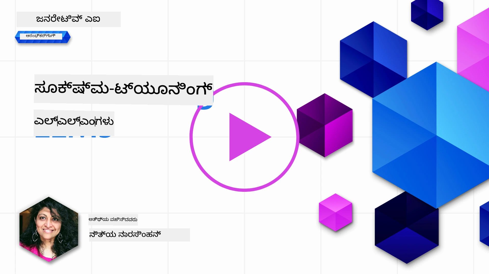
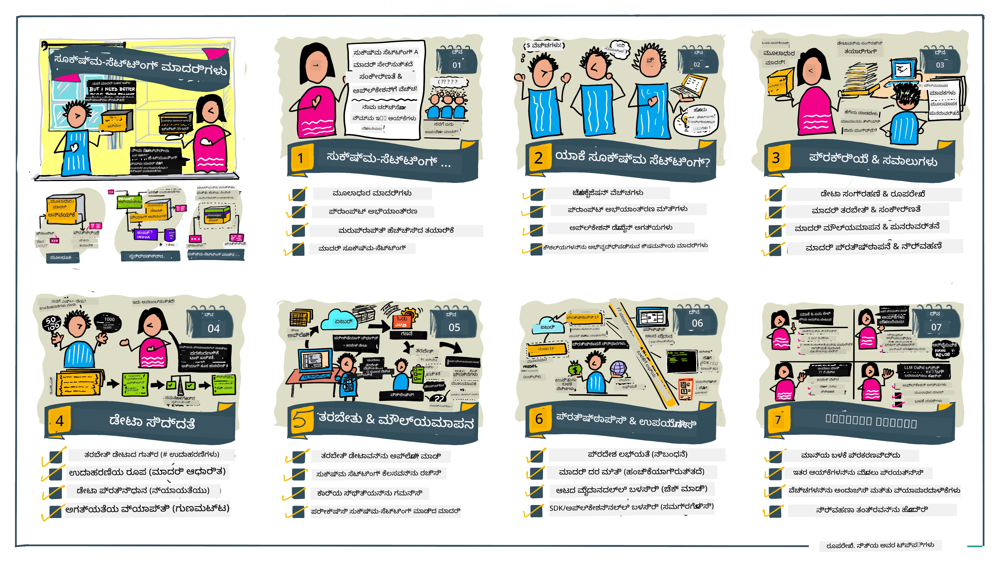

# ನಿಮ್ಮ LLM ನ ಕುರಿತ್ನ ಸೂಕ್ಷ್ಮ-ಸಂರಚನೆ

ಜನರೇಟಿವ್ AI ಅಪ್ಲಿಕೇಶನ್‌ಗಳನ್ನು ನಿರ್ಮಿಸಲು ದೊಡ್ಡ ಭಾಷಾ ಮಾದರಿಗಳನ್ನು ಬಳಸುವಾಗ ಹೊಸ ಸವಾಲುಗಳ ಎದುರಾಗುತ್ತದೆ. ಪ್ರಮುಖ ಸಮಸ್ಯೆ ಎಂದರೆ ಮಾದರಿ ನೀಡುವ ಪ್ರತಿಕ್ರಿಯೆಗಳ ಗುಣಮಟ್ಟವನ್ನು (ತಪ್ಪಿಲ್ಲದಿಕೆ ಮತ್ತು ಸಂಬಂಧದತೆಯ) ಖಚಿತಪಡಿಸುವುದು. ಹಿಂದಿನ ಪಾಠಗಳಲ್ಲಿ, ನಾವು ಪ್ರಾಂಪ್ಟ್ ಇಂಜಿನಿಯರಿಂಗ್ ಮತ್ತು ರಿಟ್ರಿವುಯಲ್-ಆಗ್ಮೆಂಟೆಡ್ ಜನರೇಷನ್ ಮುಂತಾದ ತಂತ್ರಗಳನ್ನು ಚರ್ಚಿಸಿದ್ದೇವೆ, ಅವು ಸಾಮಾನ್ಯವಾಗಿ _ಪ್ರಾಂಪ್ಟ್‌ನ್ನು ಪರಿಷ್ಕರಿಸುವ ಮೂಲಕ_ ಸಮಸ್ಯೆಯನ್ನು ಪರಿಹರಿಸಲು ಪ್ರಯತ್ನಿಸುತ್ತವೆ.

ಇಂದು ನಾವು ಮೂರನೇ ತಂತ್ರ, **ಸೂಕ್ಷ್ಮ-ಸಂರಚನೆ** ಕುರಿತು ಮಾತನಾಡುತ್ತೇವೆ, ಇದು _ಹೆಚ್ಚಿನ ಡೇಟಾ ಬಳಸಿ ಮಾದರಿಯನ್ನು ಮತ್ತೆ ತರಬೇತಿ ನೀಡುವ ಮೂಲಕ_ ಸವಾಲಿಗೆ ಉತ್ತರಗಳನ್ನು ಒದಗಿಸಲು ಪ್ರಯತ್ನಿಸುತ್ತದೆ. ಬನ್ನಿ, ವಿವರಗಳಿಗೆ ಹೋಗೋಣ.

## ಕಲಿಕೆ ಉದ್ದೇಶಗಳು

ಈ ಪಾಠವು ಪೂರ್ವ-ಪ್ರಶಿಕ್ಷಿತ ಭಾಷಾ ಮಾದರಿಗಳಿಗೆ ಸೂಕ್ಷ್ಮ-ಸಂರಚನೆಯ ಪರಿಕಲ್ಪನೆಯನ್ನು ಪರಿಚಯಿಸುತ್ತದೆ, ಈ ವಿಧಾನದ ಲಾಭಗಳು ಮತ್ತು ಸವಾಲುಗಳನ್ನು ಅನ್ವೇಷಿಸುತ್ತದೆ ಮತ್ತು ನಿಮ್ಮ ಜನರೇಟಿವ್ AI ಮಾದರಿಗಳ ಕಾರ್ಯಕ್ಷಮತೆಯನ್ನು ಸುಧಾರಿಸಲು ಸೂಕ್ಷ್ಮ-ಸಂರಚನೆಯನ್ನು 언제 ಮತ್ತು ಹೇಗೆ ಬಳಸಬೇಕೆಂದು ಮಾರ್ಗದರ್ಶನವನ್ನು ನೀಡುತ್ತದೆ.

ಈ ಪಾಠದ ಕೊನೆಯಲ್ಲಿ, ನೀವು ಈ ಕೆಳಗಿನ ಪ್ರಶ್ನೆಗಳಿಗೆ ಉತ್ತರ ನೀಡಬಲ್ಲಿರಿ:

- ಭಾಷಾ ಮಾದರಿಗಳ ಸೂಕ್ಷ್ಮ-ಸಂರಚನೆ ಅಂದರೆ 무엇?
- ಯಾಕೆ ಮತ್ತು ಎಂದಾಗ ಸೂಕ್ಷ್ಮ-ಸಂರಚನೆ ಉಪಯುಕ್ತವಿದೆ?
- ಪೂರ್ವ-ಪ್ರಶಿಕ್ಷಿತ ಮಾದರಿಯನ್ನು ಹೇಗೆ ಸೂಕ್ಷ್ಮ-ಸಂರಚಿಸಬಹುದು?
- ಸೂಕ್ಷ್ಮ-ಸಂರಚನೆಯ ಮಿತಿ ಗಳೇನು?

ತಯಾರಾಗಿದ್ದೀರಾ? ಆರಂಭಿಸೋಣ.

## ಚಿತ್ರೀತ ಮಾರ್ಗದರ್ಶಿ

ನಾವು ಏನು ಆವರಿಸೋಣ ಎಂದು ದೊಡ್ಡ ಚಿತ್ರ ಕಂಡು ನೋಡುವುದೇ ಇಷ್ಟವೇ? ಈ ಚಿತ್ರೀತ ಮಾರ್ಗದರ್ಶಿಯನ್ನು ನೋಡಿ, ಅದು ಸೂಕ್ಷ್ಮ-ಸಂರಚನೆಯ ಮೂಲ ತತ್ವಗಳು ಮತ್ತು ಪ್ರೇರಣೆ, ಪ್ರಕ್ರಿಯೆ ಒತ್ತುವರಿ ಮತ್ತು ಅತ್ಯುತ್ತಮ ಅನುಷ್ಠಾನಗಳ ಕುರಿತು ವಿವರಿಸುತ್ತದೆ. ಇದು ಅನ್ವೇಷಣೆಗೆ ಆಕರ್ಷಕ ವಿಷಯ, ಆದ್ದರಿಂದ ನಿಮ್ಮ ಸ್ವಯಂ ಮಾರ್ಗನಿರ್ದೇಶಿತ ಕಲಿಕೆಯ ಯಾತ್ರೆಗೆ ಬೆಂಬಲ ನೀಡುವ ಹೆಚ್ಚುವರಿ ಸಂಪರ್ಕಗಳಿಗಾಗಿ [ಸಂಪನ್ಮೂಲಗಳು](./RESOURCES.md?WT.mc_id=academic-105485-koreyst) ಪುಟವನ್ನು ಪರಿಶೀಲಿಸಲು ಮರೆಯಬೇಡಿ!

## ಭಾಷಾ ಮಾದರಿಗಳ ಸೂಕ್ಷ್ಮ-ಸಂರಚನೆ ಎಂದರೆ 무엇?

ನಿರ್ವಚನೆಯ ಪ್ರಕಾರ, ದೊಡ್ಡ ಭಾಷಾ ಮಾದರಿಗಳು ಇಂಟರ್ನೆಟ್ ಸೇರಿದಂತೆ ವಿಭಿನ್ನ ಮೂಲಗಳಿಂದ ದೊಡ್ಡ ಪ್ರಮಾಣದ ಪಠ್ಯದೇ ಡೇಟಾ ಮೇಲೆ _ಪೂರ್ವ-ಪ್ರಶಿಕ್ಷಿತ_ ಆಗಿರುತ್ತವೆ. ನಾವು ಹಿಂದಿನ ಪಾಠಗಳಲ್ಲಿ ಕಲಿತಂತೆ, ಬಳಕೆದಾರರ ಪ್ರಶ್ನೆಗಳಿಗೆ (ಪ್ರಾಂಪ್ಟ್‌ಗಳು) ಮಾದರಿಯ ಉತ್ತರದ ಗುಣಮಟ್ಟವನ್ನು ಸುಧಾರಿಸಲು _ಪ್ರಾಂಪ್ಟ್ ಇಂಜಿನಿಯರಿಂಗ್_ ಮತ್ತು _ರಿಟ್ರಿವುಯಲ್-ಆಗ್ಮೆಂಟೆಡ್ ಜನರೇಷನ್_ ತಂತ್ರಜ್ಞಾನಗಳ ಅವಶ್ಯಕತೆ ಇದೆ.

ಜನಪ್ರಿಯ ಪ್ರಾಂಪ್ಟ್-ಇಂಜಿನಿಯರಿಂಗ್ ವಿಧಾನಗಳಲ್ಲಿ, ಮಾದರಿಗೆ ನಿರೀಕ್ಷಿತ ಉತ್ತರದ ಬಗ್ಗೆ ಹೆಚ್ಚು ಮಾರ್ಗದರ್ಶನ ನೀಡಲಾಗುತ್ತದೆ, ಅದು _ಸೂಚನೆಗಳು_ (ಪ್ರತ್ಯಕ್ಷ ಮಾರ್ಗದರ್ಶನ) ಅಥವಾ _ಕೆಲವು ಉದಾಹರಣೆಗಳು ನೀಡುವ ಮೂಲಕ_ (ಅಪ್ರತ್ಯಕ್ಷ ಮಾರ್ಗದರ್ಶನ) ಆಗಿರಬಹುದು. ಇದನ್ನು _ಫ್ಯೂ-ಶಾಟ್ ಕಲಿಕೆ_ ಎನ್ನುತ್ತಾರೆ, ಆದರೆ ಇದರ ಎರಡು ಮಿತಿಗಳಿವೆ:

- ಮಾದರಿಯ ಟೋಕನ್ ಮಿತಿಗಳು ನೀವು ನೀಡಬಲಾದ ಉದಾಹರಣೆಗಳ ಸಂಖ್ಯೆಯನ್ನು ನಿರ್ಬಂಧಿಸುತ್ತವೆ ಮತ್ತು ಪರಿಣಾಮಕಾರಿತೆಯನ್ನು ಕಡಿಮೆ ಮಾಡುತ್ತವೆ.
- ಮಾದರಿಯ ಟೋಕನ್ ವೆಚ್ಚಗಳು ಪ್ರತಿ ಪ್ರಾಂಪ್ಟ್‌ಗೆ ಉದಾಹರಣೆಗಳನ್ನು ಸೇರಿಸಲು ದುಬಾರಿಯಾಗುವ ಕಾರಣ, ಇದು ಅವರ್ತನೆಯ ಮಿತಿಕಾರಣವಾಗುತ್ತದೆ.

ಸೂಕ್ಷ್ಮ-ಸಂರಚನೆ ಎಂದರೆ ಯಂತ್ರ ಅಭ್ಯಾಸ ವ್ಯವಸ್ಥೆಗಳಲ್ಲಿ ಸಾಮಾನ್ಯ ವಿಧಾನ, ನಾವು ಪೂರ್ವ-ಪ್ರಶಿಕ್ಷಿತ ಮಾದರಿಯನ್ನು ತೆಗೆದು ಅದರಲ್ಲಿ ಹೊಸ ಡೇಟಾ ಸೇರಿಸಿ ಮತ್ತೆ ತರಬೇತಿಗೆ ಒಳಪಡಿಸುವ ಮೂಲಕ ನಿಖರತೆಯನ್ನು ಉತ್ತಮಗೊಳಿಸುವುದು. ಭಾಷಾ ಮಾದರಿಗಳ ಪ್ರেক্ষಾಪದಲ್ಲಿ, ನಾವು ನಿರ್ದಿಷ್ಟ ಕಾರ್ಯ ಅಥವಾ ಅನ್ವಯ ಕ್ಷೇತ್ರಕ್ಕೆ ಅನ್ವಯಿಸುವ ಆಯ್ಕೆಮಾಡಿದ ಉದಾಹರಣೆಗಳೊಂದಿಗೆ ಪೂರ್ವ-ಪ್ರಶಿಕ್ಷಿತ ಮಾದರಿಯನ್ನು **ಕಸ್ಟಮ್ ಮಾದರಿ** ಆಗಿ ತಯಾರಿಸಲು ಸೂಕ್ಷ್ಮ-ಸಂರಚಿಸಬಹುದು, ಅದು ಆ ಕಾರ್ಯ ಅಥವಾ ಕ್ಷೇತ್ರಕ್ಕೆ ಹೆಚ್ಚು ಸರಿಯುವ ಸಾಧ್ಯತೆ ಇದೆ. ಸೂಕ್ಷ್ಮ-ಸಂರಚನೆಯ ಇತರೆ ಸೈಡ್‌ಬೆನೆಫಿಟ್ ಎಂದರೆ, ಫ್ಯೂ-ಶಾಟ್ ಕಲಿಕೆಗೆ ಬೇಕಾಗುವ ಉದಾಹರಣೆಗಳ ಸಂಖ್ಯೆಯನ್ನು ಕಡಿಮೆ ಮಾಡಿ ಟೋಕನ್ ಬಳಕೆಯನ್ನು ಹಾಗೂ ಸಂಬಂಧಿತ ವೆಚ್ಚಗಳನ್ನು ಕಡಿಮೆ ಮಾಡಬಹುದು.

## ಯಾವಾಗ ಮತ್ತು ಯಾಕೆ ಮಾದರಿಗಳನ್ನು ಸೂಕ್ಷ್ಮ-ಸಂರಚಿಸಬೇಕು?

ಈ ಸಂದರ್ಭದಲ್ಲಿ, ನಾವು ಸೂಕ್ಷ್ಮ-ಸಂರಚನೆಯ ಬಗ್ಗೆ ಮಾತನಾಡುತ್ತಿರುವಾಗ, ನಾವು **ಸೂಪರ್ವೈಸ್ಡ್** ಸೂಕ್ಷ್ಮ-ಸಂರಚನೆಯನ್ನು ಉಲ್ಲೇಖಿಸುತ್ತಿದ್ದೇವೆ, ಅಂದರೆ ಮೂಲ ತರಬೇತಿ ಡೇಟಾಸೆಟ್ ಭಾಗವಾಗಿರದ ಹೊಸ ಡೇಟಾವನ್ನು ಸೇರಿಸಿ ಮತ್ತೆ ತರಬೇತಿ ನಡೆಯುತ್ತದೆ. ಇದು ಮೂಲ ಡೇಟಾವನ್ನು ಬಳಸಿಕೊಂಡು ವಿಭಿನ್ನ ಹೈಪರ್‌ಪ್ಯಾರಾಮೀಟರ್‌ಗಳೊಂದಿಗೆ ಮರುತರಬೇತಿ ಮಾಡುವ ಅನುಪರೀಕ್ಷಿತ ಸೂಕ್ಷ್ಮ-ಸಂರಚನೆ ವಿಧಾನದಿಂದ ಭಿನ್ನ.

ಮುಖ್ಯಮಟ್ಟದಲ್ಲಿ ಗಮನದಲ್ಲಿಡಬೇಕಾದ ಸಂಗತಿ ಎಂದರೆ ಸೂಕ್ಷ್ಮ-ಸಂರಚನೆ ವಿಶೇಷ ಸಾಮರ್ಥ್ಯವನ್ನು ಮತ್ತು ಅನುಭವವನ್ನು ಹೊಂದಿರಬೇಕು. ತಪ್ಪಾಗಿ ಮಾಡಿದರೆ, ನಿರೀಕ್ಷಿತ ಸುಧಾರಣೆಗಳನ್ನು ನೀಡಲು ಸಾಧ್ಯವಿಲ್ಲ, ಮತ್ತು ನಿಮಗೆ ಬೇಕಾದ ಕ್ಷೇತ್ರದಲ್ಲಿ ಮಾದರಿಯ ಕಾರ್ಯಕ್ಷಮತೆ ಕಡಿಮೆಯಾಗಬಹುದು.

ಅದರಿಂದ, ನೀವು "ಹೇಗೆ" ಸೂಕ್ಷ್ಮ-ಸಂರಚಿಸಬೇಕು ಎಂದು ಕಲಿಯುವ ಮೊದಲು, ನೀವು "ಯಾಕೆ" ಈ ಮಾರ್ಗವನ್ನು ತೆಗೆದುಕೊಳ್ಳಬೇಕು ಮತ್ತು "ಯಾವಾಗ" ಪ್ರಕ್ರಿಯೆಯನ್ನು ಪ್ರಾರಂಭಿಸಬೇಕು ಎಂದು ತಿಳಿದುಕೊಳ್ಳಬೇಕಾಗಿದೆ. ಈ ಪ್ರಶ್ನೆಗಳನ್ನು ಕೇಳಿ:

- **ಬಳಕೆ ಪ್ರಕರಣ**: ಸೂಕ್ಷ್ಮ-ಸಂರಚನೆಗಾಗಿ ನಿಮ್ಮ _ಬಳಕೆ ಪ್ರಕರಣ_ ಏನು? ಪ್ರಸ್ತುತ ಪೂರ್ವ-ಪ್ರಶಿಕ್ಷಿತ ಮಾದರಿಯ ಯಾವ ಅಂಶವನ್ನು ನೀವು ಸುಧಾರಿಸಲು ಬಯಸುತ್ತೀರಿ?
- **ಪರ್ಯಾಯಗಳು**: ನೀವು ಕ್ರಮಗತವಾಗಿ ನೀವು ಬಯಸುವ ಫಲಿತಾಂಶಗಳನ್ನು ಸಾಧಿಸಲು _ಬೇರೆ ತಂತ್ರಗಳನ್ನ_ ಪ್ರಯತ್ನಿಸಿದ್ದೀರಾ? ಅವುಗಳನ್ನು ಹೋಲಿಕೆಗಾಗಿ ಮೂಲಭೂತವಾಗಿಸಬಹುದು.
  - ಪ್ರಾಂಪ್ಟ್ ಇಂಜಿನಿಯರಿಂಗ್: ಸಂಬಂಧಿತ ಪ್ರಾಂಪ್ಟ್ ಪ್ರತಿಕ್ರಿಯೆಗಳ ಕೆಲವು ಉದಾಹರಣೆಗಳೊಂದಿಗೆ ಫ್ಯೂ-ಶಾಟ್ ಪ್ರಾಂಪ್ಟಿಂಗ್ ಪ್ರಯತ್ನಿಸಿ. ಪ್ರತಿಕ್ರಿಯೆಗಳ ಗುಣಮಟ್ಟವನ್ನು ಮೌಲ್ಯಮಾಪನ ಮಾಡಿ.
  - ರಿಟ್ರಿವುಯಲ್ ಆಗರ್ಮೆಂಟೆಡ್ ಜನರೇಷನ್: ನಿಮ್ಮ ಡೇಟಾದಲ್ಲಿ ಹುಡುಕಾಟದಿಂದ ಪಡೆಯಲಾಗುವ ಪ್ರಶ್ನೆಯ ಫಲಿತಾಂಶಗಳನ್ನು ಸೇರಿಸಿ ಪ್ರಾಂಪ್ಟ್‌ಗಳನ್ನು ಉತ್ತೇಜಿಸಿ. ಪ್ರತಿಕ್ರಿಯೆಗಳ ಗುಣಮಟ್ಟವನ್ನು ಮೌಲ್ಯಮಾಪನ ಮಾಡಿ.
- **ವೆಚ್ಚಗಳು**: ಸೂಕ್ಷ್ಮ-ಸಂರಚನೆಯ ವೆಚ್ಚವನ್ನು ಗುರುತಿಸಿದ್ದೀರಾ?
  - ಟ್ಯುನೇಬಿಲಿಟಿ - ಪೂರ್ವ-ಪ್ರಶಿಕ್ಷಿತ ಮಾದರಿ ಸೂಕ್ಷ್ಮ-ಸಂರಚನೆಗೆ ಸಿಗುತ್ತದೆಯೇ?
  - ಪ್ರಯತ್ನ - ತರಬೇತಿ ಡೇಟಾ ಸಿದ್ಧತೆ, ಮಾದರಿಯ ಮೌಲ್ಯಮಾಪನ ಮತ್ತು ವಿಶ್ಲೇಷಣೆ.
  - ಗಣನೆ - ಸೂಕ್ಷ್ಮ-ಸಂರಚನಾ ಕೆಲಸಗಳು ಮತ್ತು ಫೈನ್-ಟ್ಯೂನ್ ಮಾಡಿದ ಮಾದರಿಯ ನಿಯೋಜನೆಗಾಗಿ.
  - ಡೇಟಾ - ಸೂಕ್ಷ್ಮ-ಸಂರಚನೆಯಲ್ಲಿ ಪರಿಣಾಮಕಾರಿ ದೊಡ್ಡ ಮಟ್ಟದ ಗುಣಮಟ್ಟದ ಉದಾಹರಣೆಗಳಿಗೆ ಪ್ರಾಪ್ತಿ.
- **ಲಾಭಗಳು**: ಸೂಕ್ಷ್ಮ-ಸಂರಚನೆಯ ಲಾಭಗಳನ್ನು ದೃಢಪಟ್ಟಿದ್ದೀರಾ?
  - ಗುಣಮಟ್ಟ - ಫೈನ್-ಟ್ಯೂನ್ ಮಾಡಿದ ಮಾದರಿ ಮೂಲಭೂತ ಮಾದರಿಯನ್ನು ಮೀರಿದುದೇ?
  - ವೆಚ್ಚ - ಇದು ಪ್ರಾಂಪ್ಟ್‌ಗಳನ್ನು ಸರಳಗೊಳಿಸುವ ಮೂಲಕ ಟೋಕನ್ ಬಳಕೆಯನ್ನು ಕಡಿಮೆ ಮಾಡುತ್ತದೆಯೇ?
  - ವಿಸ್ತಾರ ಸಾಧ್ಯತೆ - ನೀವು ಮೂಲ ಮಾದರಿಯನ್ನು ಹೊಸ ಕ್ಷೇತ್ರಗಳಿಗೆ ಮರುಬಳಕೆ ಮಾಡಬಹುದೇ?

ಈ ಪ್ರಶ್ನೆಗಳಿಗೆ ಉತ್ತರಿಸುವ ಮೂಲಕ, ನೀವು ಸೂಕ್ಷ್ಮ-ಸಂರಚನೆ ನಿಮ್ಮ ಬಳಕೆ ಪ್ರಕರಣಕ್ಕೆ ಸೂಕ್ತವೋ ಅಥವಾ ಇಲ್ಲವೋ ನಿರ್ಧರಿಸಬಹುದು. ಗರ್ಭಿಣಿ ಅನುಭವಕ್ಕೆ ಲಾಭಗಳು ವೆಚ್ಚಗಳನ್ನು ಮೀರಿದಾಗ ಮಾತ್ರ ಈ ವಿಧಾನ ಅರ್ಹ. ಮುಂದು ಬರುವಾಗ, ಪೂರ್ವ-ಪ್ರಶಿಕ್ಷಿತ ಮಾದರಿಯನ್ನು ಸೂಕ್ಷ್ಮ-ಸಂರಚಿಸುವ _ಹೇಗೆ_ ಎಂಬುದನ್ನು ಯೋಚಿಸೋಣ.

ನೀವು ನಿರ್ಧಾರ-ಮಾಡುವ ಪ್ರಕ್ರಿಯೆಯ ಕುರಿತು ಹೆಚ್ಚಿನ ಅರ್ಥಮಾಡಿಕೊಳ್ಳಲು ಬಯಸುತ್ತೀರಾ? ನೋಡಿ [fine-tune ಮಾಡಬೇಕೆ ಅಥವಾ ಮಾಡಬಾರದೆ](https://www.youtube.com/watch?v=0Jo-z-MFxJs)

## ನಾವು ಪೂರ್ವ-ಪ್ರಶಿಕ್ಷಿತ ಮಾದರಿಯನ್ನು ಹೇಗೆ ಸೂಕ್ಷ್ಮ-ಸಂರಚಿಸಬಹುದು?

ಪೂರ್ವ-ಪ್ರಶಿಕ್ಷಿತ ಮಾದರಿಯನ್ನು ಸೂಕ್ಷ್ಮ-ಸಂರಚಿಸಲು ನಿಮಗೆ ಬೇಕಾಗಿರುವುದು:

- ಸೂಕ್ಷ್ಮ-ಸಂರಚಿಸಲು ಪೂರ್ವ-ಪ್ರಶಿಕ್ಷಿತ ಮಾದರಿ
- ಸೂಕ್ಷ್ಮ-ಸಂರಚನೆಯ ಬಳಕೆಗಾಗಿ ಡೇಟಾಸೆಟ್
- ಸೂಕ್ಷ್ಮ-ಸಂರಚನಾ ಕೆಲಸ ನಡೆಸಲು ತರಬೇತಿ ಪರಿಸರ
- ಸೂಕ್ಷ್ಮ-ಸಂರಚಿಸಲಾದ ಮಾದರಿಯನ್ನು ನಿಯೋಜಿಸಲು ಹೋಸ್ಟಿಂಗ್ ಪರಿಸರ

## ಕಾರ್ಯನಿರ್ವಹಣೆಯಲ್ಲಿ ಸೂಕ್ಷ್ಮ-ಸಂರಚನೆ

ಕೆಳಗಿನ ಸಂಪನ್ಮೂಲಗಳು ನಿರ್ದಿಷ್ಟ ಮಾದರಿ ಮತ್ತು ಆಯ್ಕೆಮಾಡಿದ ಡೇಟಾಸೆಟ್ ಉಪಯೋಗಿಸಿ ಅನಾಯಾಸವಾಗಿ ನಡೆದುಕೊಳ್ಳುವ ಟ್ಯುಟೋರಿಯಲ್‌ಗಳನ್ನು ಒದಗಿಸುತ್ತವೆ. ಈ ಟ್ಯುಟೋರಿಯಲ್‌ಗಳನ್ನು ಅನುಸರಿಸಲು ನಿಮಗೆ ಸಂಬಂಧಿಸಿದ ಪೂರೈಕೆದಾರ ಖಾತೆ ಮತ್ತು ಸಂಬಂಧಿಸಿದ ಮಾದರಿ ಹಾಗೂ ಡೇಟಾಸೆಟ್‌ಗಳ ಪ್ರವೇಶ ಬೇಕಾಗುತ್ತದೆ.

| ಪೂರೈಕೆದಾರ  | ಟ್ಯುಟೋರಿಯಲ್                                                                                                                                                                      | ವಿವರಣೆ                                                                                                                                                                                                                                                                                                                                                                                                                           |
| ------------ | --------------------------------------------------------------------------------------------------------------------------------------------------------------------------------- | -------------------------------------------------------------------------------------------------------------------------------------------------------------------------------------------------------------------------------------------------------------------------------------------------------------------------------------------------------------------------------------------------------------------------------- |
| OpenAI       | [ಚಾಟ್ ಮಾದರಿಗಳನ್ನು ಸೂಕ್ಷ್ಮ-ಸಂರಚಿಸುವುದು ಹೇಗೆ](https://github.com/openai/openai-cookbook/blob/main/examples/How_to_finetune_chat_models.ipynb?WT.mc_id=academic-105485-koreyst)        | ನಿರ್ದಿಷ್ಟ ಕ್ಷೇತ್ರಕ್ಕೆ ("ರೆಸಿಪಿ ಸಹಾಯಕ") `gpt-35-turbo` ಅನ್ನು ಸೂಕ್ಷ್ಮ-ಸಂರಚಿಸಲು ತರಬೇತಿ ಡೇಟಾ ಸಿದ್ಧಪಡಿಸುವುದು, ಸೂಕ್ಷ್ಮ-ಸಂರಚನಾ ಕೆಲಸ ನಡೆಸುವುದು ಮತ್ತು ಸೂಕ್ಷ್ಮ-ಸಂರಚಿಸಲಾದ ಮಾದರಿಯನ್ನು ಇನ್‌ಫರೆನ್ಸ್‌ಗೆ ಬಳಸುವುದು ಎಂಬುದನ್ನು ಕಲಿಯಿರಿ.                                                                                                                                                                                                   |
| Azure OpenAI | [GPT 3.5 Turbo ಸೂಕ್ಷ್ಮ-ಸಂರಚನಾ ಟ್ಯುಟೋರಿಯಲ್](https://learn.microsoft.com/azure/ai-services/openai/tutorials/fine-tune?tabs=python-new%2Ccommand-line?WT.mc_id=academic-105485-koreyst) | `gpt-35-turbo-0613` ಮಾದರಿಯನ್ನು **ಅಜೂರ್‌ನಲ್ಲಿ** ಸೂಕ್ಷ್ಮ-ಸಂರಚಿಸುವುದು, ತರಬೇತಿ ಡೇಟಾ ರಚಿಸುವುದು ಮತ್ತು ಅಪ್‌ಲೋಡ್ ಮಾಡುವುದು, ಸೂಕ್ಷ್ಮ-ಸಂರಚನಾ ಕೆಲಸಗಳನ್ನು ನಡೆಸುವುದು ಮತ್ತು ಹೊಸ ಮಾದರಿಯನ್ನು ನಿಯೋಜಿಸುವುದು ಹೇಗೆ ಎಂದು ಕಲಿಯಿರಿ.                                                                                                                                                                                                                          |
| Hugging Face | [Hugging Face ನೊಂದಿಗೆ LLM ಗಳ ಸೂಕ್ಷ್ಮ-ಸಂರಚನೆ](https://www.philschmid.de/fine-tune-llms-in-2024-with-trl?WT.mc_id=academic-105485-koreyst)                                            | ಈ ಬ್ಲಾಗ್ ಪೋಸ್ಟ್ ಒಂದು _ಮುಕ್ತ LLM_ (ಉದಾ: `CodeLlama 7B`) ಅನ್ನು [transformers](https://huggingface.co/docs/transformers/index?WT.mc_id=academic-105485-koreyst) ಗ್ರಂಥಾಲಯ ಮತ್ತು [Transformer Reinforcement Learning (TRL)](https://huggingface.co/docs/trl/index?WT.mc_id=academic-105485-koreyst) ಬಳಸಿ ಹಗ್ಗು ಮುಖದ ಮೇಲೆ [ಡೇಟಾಸೆಟ್ಸ್](https://huggingface.co/docs/datasets/index?WT.mc_id=academic-105485-koreyst) ಉಪಯೋಗಿಸಿ ಸೂಕ್ಷ್ಮ-ಸಂರಚಿಸುವುದನ್ನು ವಿವರಿಸುತ್ತದೆ. |
|              |                                                                                                                                                                                   |                                                                                                                                                                                                                                                                                                                                                                                                                                    |
| 🤗 AutoTrain | [AutoTrain ನೊಂದಿಗೆ LLM ಗಳ ಸೂಕ್ಷ್ಮ-ಸಂರಚನೆ](https://github.com/huggingface/autotrain-advanced/?WT.mc_id=academic-105485-koreyst)                                                        | AutoTrain (ಅಥವಾ AutoTrain Advanced) ಒಂದು ಪೈಥಾನ್ ಲೈಬ್ರರಿ, ಇದು LLM ಸೂಕ್ಷ್ಮ-ಸಂರಚನೆ ಸೇರಿದಂತೆ ಹಲವು ಕಾರ್ಯಗಳಿಗೆ ಸೂಕ್ಷ್ಮ-ಸಂರಚನೆಯನ್ನು ಅನುಮತಿಸುತ್ತದೆ. AutoTrain ಒಂದು ನೂ-ಕೋಡ್ ಪರಿಹಾರವಾಗಿದೆ ಮತ್ತು ಸೂಕ್ಷ್ಮ-ಸಂರಚನೆ ನಿಮ್ಮ ಸ್ವಂತ ಕ್ಲೌಡ್, Hugging Face Spaces ಅಥವಾ ಸ್ಥಳೀಯವಾಗಿ ಮಾಡಬಹುದಾಗಿದೆ. ಇದು ವೆಬ್ ಆಧಾರಿತ GUI, CLI ಮತ್ತು yaml ಸಂರಚನಾ ಕಡತಗಳ ಮೂಲಕ ತರಬೇತಿಯನ್ನು ಬೆಂಬಲಿಸುತ್ತದೆ.                                                                                                     |
|              |                                                                                                                                                                                   |                                                                                                                                                                                                                                                                                                                                                                                                                                    |
| 🦥 Unsloth   | [Unsloth ನೊಂದಿಗೆ LLM ಗಳ ಸೂಕ್ಷ್ಮ-ಸಂರಚನೆ](https://github.com/unslothai/unsloth)                                                                                                       | Unsloth ಒಂದು ಮುಕ್ತ ಮೂಲ ಚಟುರ್ಕೋಟಿ ಫ್ರೇಮ್‌ವರ್ಕ್ ಆಗಿದ್ದು, LLM ಸೂಕ್ಷ್ಮ-ಸಂರಚನೆ ಮತ್ತು ರೀಇನ್ಫೋರ್ಸ್ಮೆಂಟ್ ಲರ್ನಿಂಗ್ (RL) ಅನ್ನು ಬೆಂಬಲಿಸುತ್ತದೆ. Unsloth ಸ್ಥಳೀಯ ತರಬೇತಿ, ಮೌಲ್ಯಮಾಪನ ಮತ್ತು ನಿಯೋಜನೆಗೆ ಸಿದ್ಧವಿರುವ [ನೋಟ್‌ಬುಕ್ಸ್](https://github.com/unslothai/notebooks) ಬಳಸಲು ಸರಳಗೊಳಿಸುತ್ತದೆ. ಇದು ಪಠ್ಯದಿಗೆ ಧ್ವನಿ (TTS), BERT ಮತ್ತು ಮಲ್ಟಿಮೋಡಲ್ ಮಾದರಿಗಳನ್ನು ಸಹ ಬೆಂಬಲಿಸುತ್ತದೆ. ಪ್ರಾರಂಭಿಸಲು, ಅವರ ಹಂತಹಂತದ [LLM ಸೂಕ್ಷ್ಮ-ಸಂರಚನಾ ಮಾರ್ಗದರ್ಶಿ](https://docs.unsloth.ai/get-started/fine-tuning-llms-guide) ಓದಿ.                                                                                 |
|              |                                                                                                                                                                                   |                                                                                                                                                                                                                                                                                                                                                                                                                                    |
## ನಿಯೋಜನೆ

ಮೇಲಿನ ಟ್ಯುಟೋರಿಯಲ್‌ಗಳಲ್ಲಿ ಒಂದನ್ನು ಆಯ್ಕೆ ಮಾಡಿ ಅದನ್ನು ಅನುಸರಿಸಿ. _ನಾವು ಈ ಟ್ಯುಟೋರಿಯಲ್‌ಗಳ ಸಂಸ್ಕರಣೆಯನ್ನು ಜ್ಯೂಪ್‌ಯುಟರ್ ನೋಟ್‌ಬುಕ್‌ಗಳಲ್ಲಿ ನಮೂದಾಗಿ ಪ್ರತಿರೂಪಿಸಬಹುದು. ದಯವಿಟ್ಟು ನವೀನ ಸಂಸ್ಕರಣೆಯ ಸಲುವಾಗಿ ಮೂಲ ಮೂಲಗಳನ್ನು ನೇರವಾಗಿ ಬಳಸಿ._

## ಅತೀ ಸುಪರಿಞ್ಞಯ ಕೆಲಸ! ನಿಮ್ಮ ಕಲಿಕೆಯನ್ನು ಮುಂದುವರಿಸಿ.

ಈ ಪಾಠವನ್ನು ಪೂರ್ಣಗೊಳಿಸಿದ ನಂತರ, ನಮ್ಮ [ಜನರೇಟಿವ್ AI ಕಲಿಕೆ ಸಂಗ್ರಹ](https://aka.ms/genai-collection?WT.mc_id=academic-105485-koreyst) ಚಲಿಸಿ ಮತ್ತು ಜನರೇಟಿವ್ AI ತಿಳುವಳಿಕೆಯನ್ನು ಹೆಚ್ಚು ಸಧಾರಣೆಯಲ್ಲಿಡಿ!

ಅಭಿನಂದನೆಗಳು!! ನೀವು ಈ ಕೋರ್ಸಿನ v2 ಸರಣಿಯ ಅಂತಿಮ ಪಾಠವನ್ನು ಪೂರ್ಣಗೊಳಿಸಿದ್ದೀರಿ! ಕಲಿಯುವುದನ್ನು ಮತ್ತು ನಿರ್ಮಿಸುವುದನ್ನು ನಿಲ್ಲಿಸಬೇಡಿ. \*\*ಈ ವಿಷಯಕ್ಕೆ ಸಂಬಂಧಿಸಿದ ಹೆಚ್ಚುವರಿ ಸಲಹೆಗಳ ಪಟ್ಟಿಗಾಗಿ [ಸಂಪನ್ಮೂಲಗಳು](RESOURCES.md?WT.mc_id=academic-105485-koreyst) ಪುಟವನ್ನು ಪರಿಶೀಲಿಸಿ.

ನಮ್ಮ v1 ಸರಣಿ ಪಾಠಗಳು ಕೂಡ ಹೆಚ್ಚಿನ ನಿಯೋಜನೆಗಳು ಮತ್ತು ಪರಿಕಲ್ಪನೆಗಳೊಂದಿಗೆ ನವೀಕರಿಸಲಾಗಿದೆ. ಆದ್ದರಿಂದ ನಿಮ್ಮ ತಿಳುವಳಿಕೆಯನ್ನು ಪುನಶ್ಚೇತನಗೊಳಿಸಲು ಕೆಲವೇ ನಿಮಿಷಗಳನ್ನು ಕಳೆಯಿರಿ - ಮತ್ತು ದಯವಿಟ್ಟು [ನಿಮ್ಮ ಪ್ರಶ್ನೆಗಳು ಮತ್ತು ಅಭಿಪ್ರಾಯಗಳನ್ನು ಹಂಚಿಕೊಳ್ಳಿ](https://github.com/microsoft/generative-ai-for-beginners/issues?WT.mc_id=academic-105485-koreyst) - ಇದರಿಂದ ನಾವು ಸಮುದಾಯಕ್ಕಾಗಿ ಈ ಪಾಠಗಳನ್ನು ಸುಧಾರಿಸಲು ಸಹಾಯ ಹೊಂದಬಹುದು.

---

<!-- CO-OP TRANSLATOR DISCLAIMER START -->
**ತಪ್ಪು ಬಗ್ಗೆ ಸೂಚನೆ**:  
ಈ ದಾಖಲೆಯನ್ನು AI ಅನುವಾದ ಸೇವೆ [Co-op Translator](https://github.com/Azure/co-op-translator) ಬಳಸಿ ಅನುವದಿಸಲಾಗಿದೆ. ನಾವು ಶ 정확ತೆಯನ್ನು ಗೋಚರಿಸಲು ಪ್ರಯತ್ನಿಸುತ್ತೇವೆ, ಆದರೆ ಸ್ವಯಂಚಾಲಿತ ಅನುವಾದಗಳಲ್ಲಿ ದೋಷಗಳು ಅಥವಾ ಅಶುದ್ಧತೆಗಳು ಇರಬಹುದೆಂದು ತಿಳಿದುಕೊಳ್ಳಿ. ಮೂಲ ಭಾಷೆಯಲ್ಲಿ ಇರುವ ಮೂಲ ದಾಖಲೆ ನ್ಯಾಯೋಚಿತಮೂಲವಾಗಿ ಪರಿಗಣಿಸಬೇಕು. ಪ್ರಮುಖ ಮಾಹಿತಿಗಾಗಿ ವೃತ್ತಿಪರ ಮಾನವ ಅನುವಾದವನ್ನು ಶಿಫಾರಸು ಮಾಡಲಾಗುತ್ತದೆ. ಈ ಅನುವಾದ ಬಳಕೆಯಿಂದ ಉಂಟಾಗುವ ಯಾವುದೇ ತಪ್ಪು ಅರ್ಥಮಾಡಿಕೊಂಡಿಕೆಗಳು ಅಥವಾ ವ್ಯಾಖ್ಯಾನೆಗಳಿಗಾಗಿ ನಾವು ಹೊಣೆಗಾರರಾಗಿರುವುದಿಲ್ಲ.
<!-- CO-OP TRANSLATOR DISCLAIMER END -->