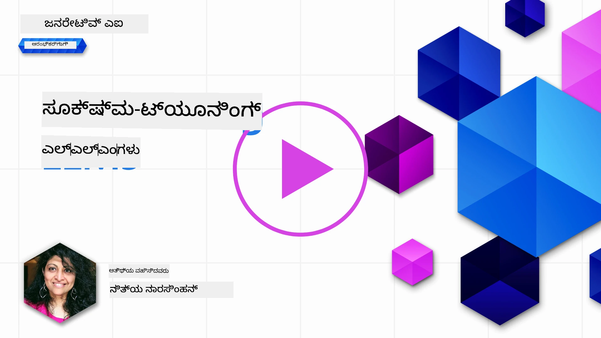
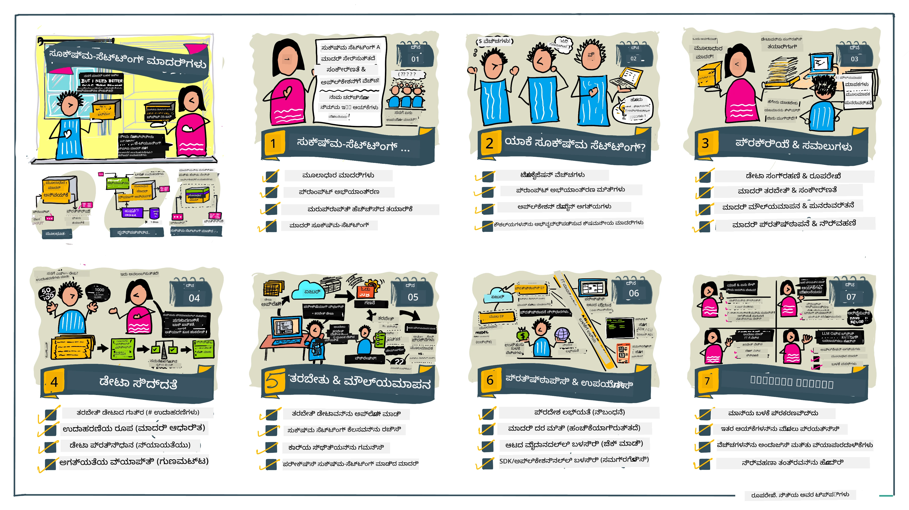

# ನಿಮ್ಮ LLM ಅನ್ನು ಫೈನ್ಟ್ಯೂನಿಂಗ್ ಮಾಡುವುದು

ಜನನಾತ್ಮಕ AI ಅಪ್ಲಿಕೇಶನ್‌ಗಳನ್ನು ನಿರ್ಮಿಸಲು ದೊಡ್ಡ ಭಾಷಾ ಮಾದರಿಗಳನ್ನು ಬಳಸುವುದು ಹೊಸ ಸವಾಲುಗಳನ್ನು ಹೊಂದಿದೆ. ಪ್ರಮುಖ ಸಮಸ್ಯೆ ಎಂದರೆ ನಿರ್ದಿಷ್ಟ ಬಳಕೆದಾರ ವಿನಂತಿಗಾಗಿ ಮಾದರಿಯಿಂದ ರಚಿಸಲಾದ ವಿಷಯದಲ್ಲಿ ಪ್ರತಿಕ್ರಿಯೆಯ ಗುಣಮಟ್ಟ (ನಿಖರತೆ ಮತ್ತು ಪ್ರಾಸಂಗಿಕತೆ) ಅನ್ನು ಖಾತ್ರಿ ಮಾಡಿಕೊಳ್ಳುವುದು. ಹಿಂದಿನ ಪಾಠಗಳಲ್ಲಿ, ನಾವು ಪ್ರಾಂಪ್ಟ್ ಇಂಜಿನಿಯರಿಂಗ್ ಮತ್ತು ರಿಟ್ರೀವಲ್-ಅಗ್ರಗೇಟೆಡ್ ಜನರೇಷನ್ ಮುಂತಾದ ತಂತ್ರಗಳನ್ನು ಚರ್ಚಿಸಿದ್ದೇವೆ, ಅವುಗಳು ಈಗಿನ ಮಾದರಿಯಲ್ಲಿ ಇನ್ಪುಟ್ ಅನ್ನು _ಸಂಕೋಚಿಸುವ ಮೂಲಕ ಸಮಸ್ಯೆಯನ್ನು ಪರಿಹರಿಸಲು_ ಪ್ರಯತ್ನಿಸುತ್ತವೆ.

ಇಂದಿನ ಪಾಠದಲ್ಲಿ, ನಾವು ಮೂರನೇ ತಂತ್ರವಾದ **ಫೈನ್-ಟ್ಯೂನಿಂಗ್** ಕುರಿತು ಚರ್ಚಿಸುತ್ತೇವೆ, ಇದು ಅಗತ್ಯವಿರುವ ಹೆಚ್ಚುವರಿ ಡೇಟಾ ಬಳಸಿ _ಮಾದರಿಯನ್ನು ಪುನಶ್ಚಿಕಿತ್ಸಿಸುವ ಮೂಲಕ_ ಈ ಸವಾಲನ್ನು ಎದುರಿಸಲು ಪ್ರಯತ್ನಿಸುವುದು. ವಿವರಗಳಿಗೆ ಆಳವಾಗಿ ಹೋಗೋಣ.

## ಕಲಿಕೆಯ ಗುರಿಗಳು

ಈ ಪಾಠವು ಪೂರ್ವ-ತರಬೇತಿ ಹೊಂದಿರುವ ಭಾಷಾ ಮಾದರಿಗಳ ಫೈನ್-ಟ್ಯೂನಿಂಗ್ ಎಂಬ ಕಲ್ಪನೆಯನ್ನು ಪರಿಚಯಿಸುತ್ತದೆ, ಈ ವಿಧಾನಗಳ ಲಾಭಗಳು ಮತ್ತು ಸವಾಲುಗಳನ್ನು ಅನ್ವೇಷಿಸುತ್ತದೆ ಮತ್ತು ನಿಮ್ಮ ಜನರೇಟಿವ್ AI ಮಾದರಿಗಳ ಕಾರ್ಯಕ್ಷಮತೆಯ ಹೊಸ ದರ್ಜೆಗೆ ತಲುಪಲು ಯಾವಾಗ ಮತ್ತು ಹೇಗೆ ಫೈನ್-ಟ್ಯೂನಿಂಗ್ ಮಾಡಲು ತಿಳಿಸುತ್ತದೆ.

ಈ ಪಾಠದ ಕೊನೆಯಲ್ಲಿ, ನೀವು ಕೆಳಗಿನ ಪ್ರಶ್ನೆಗಳಿಗೆ ಉತ್ತರ ನೀಡಬಹುದು:

- ಭಾಷಾ ಮಾದರಿಗಳ ಫೈನ್-ಟ್ಯೂನಿಂಗ್ ಎಂದರೇನು?
- ಯಾವಾಗ ಮತ್ತು ಏಕೆ ಫೈನ್-ಟ್ಯೂನಿಂಗ್ ಉಪಯುಕ್ತವಾಗಿದೆ?
- ನಾನು ಪೂರ್ವ-ತರಬೇತಿ ಹೊಂದಿರುವ ಮಾದರಿಯನ್ನು ಹೇಗೆ ಫೈನ್-ಟ್ಯೂನ್ ಮಾಡಬಹುದು?
- ಫೈನ್-ಟ್ಯೂನಿಂಗ್‌ನ ಮೆರಗುಗಳು ಯಾವುವು?

ಸಿದ್ಧವೇ? ಆರಂಭಿಸೋಣ.

## ಚಿತ್ರಣಗೊಂಡ ಮಾರ್ಗದರ್ಶಕ

ನಾವು ಒಳಗೊಳ್ಳುವ ವಿಷಯದ ದೊಡ್ಡ ಚಿತ್ರವನ್ನು ಮೊದಲು ತಿಳಿದುಕೊಳ್ಳಲು ಇಚ್ಛೆಯಿದೆಯೇ? ಈ ಚಿತ್ರಣಗೊಂಡ ಮಾರ್ಗದರ್ಶಕವನ್ನು ನೋಡಿ, ಇದು ಫೈನ್-ಟ್ಯೂನಿಂಗ್ ಕಲಿತೆಯ ಪಯಣವನ್ನು ವಿವರಿಸುತ್ತದೆ - ಮುಖ್ಯ ತತ್ವಗಳು ಮತ್ತು ಪ್ರೇರಣೆಯಿಂದ ಪ್ರಕ್ರಿಯೆ ಹಾಗೂ ಕಾರ್ಯಗತಗೊಳಿಸುವ ಉತ್ತಮ ಅಭ್ಯಾಸಗಳನ್ನು ಅರ್ಥಮಾಡಿಕೊಳ್ಳುವುದರವರೆಗೆ. ಇದು ಅನ್ವೇಷಣೆಗೆ ಆಕರ್ಷಕ ವಿಷಯ, ಆದ್ದರಿಂದ ನಿಮ್ಮ ಸ್ವಯಂ-ಮಾರ್ಗದರ್ಶಿತ ಕಲಿಕೆಯ ಪಯಣಕ್ಕೆ ಬೆಂಬಲ ನೀಡುವ ಹೆಚ್ಚುವರಿ ಲಿಂಕ್‌ಗಳಿಗಾಗಿ [ಸಂಪನ್ಮೂಲಗಳು](./RESOURCES.md?WT.mc_id=academic-105485-koreyst) ಪುಟವನ್ನು ತಪ್ಪದೆ ಪರಿಶೀಲಿಸಿ!

## ಭಾಷಾ ಮಾದರಿಗಳ ಫೈನ್-ಟ್ಯೂನಿಂಗ್ ಎಂದರೇನು?

ನಿರ್ವಚನೆಯ ಪ್ರಕಾರ, ದೊಡ್ಡ ಭಾಷಾ ಮಾದರಿಗಳು ಇಂಟರ್ನೆಟ್ ಸೇರಿದಂತೆ ವಿವಿಧ ಮೂಲಗಳಿಂದ ಸಂಗ್ರಹಿಸಿದ ಹೆಚ್ಚು ಪ್ರಮಾಣದ ಪಠ್ಯದಿಂದ _ಪೂರ್ವ-ತರಬೇತಿ_ ಪಡೆದಿವೆ. ಹಿಂದಿನ ಪಾಠಗಳಲ್ಲಿ ಕಲಿತಂತೆ, ಬಳಕೆದಾರರ ಪ್ರಶ್ನೆಗಳಿಗೆ ("ಪ್ರಾಂಪ್ಟ್") ಮಾದರಿ ಪ್ರತಿಕ್ರಿಯೆಯ ಗುಣಮಟ್ಟವನ್ನು ಹೆಚ್ಚಿಸಲು ನಮಗೆ _ಪ್ರಾಂಪ್ಟ್ ಇಂಜಿನಿಯರಿಂಗ್_ ಮತ್ತು _ರಿಟ್ರೀವಲ್-ಅಗ್ರಗೇಟೆಡ್ ಜನರೇಶನ್_ ಮುಂತಾದ ತಂತ್ರಗಳ ಅವಶ್ಯಕತೆ ಇದೆ.

ಜನಪ್ರಿಯ ಪ್ರಾಂಪ್ಟ್-ಇಂಜಿನಿಯರಿಂಗ್ ತಂತ್ರದಲ್ಲಿ, ಪ್ರತಿಕ್ರಿಯೆಯಲ್ಲಿ ಏನು ನಿರೀಕ್ಷೆಯಿದೆ ಎಂಬುದರ ಮೇಲೆ ಮಾದರಿಗೆ ಹೆಚ್ಚು ಮಾರ್ಗದರ್ಶನ ನೀಡಲಾಗುತ್ತದೆ, ಅದು _ಸೂಚನೆಗಳು_ (ಸ್ಪಷ್ಟ ಮಾರ್ಗದರ್ಶನ) ನೀಡುವ ಅಥವಾ _ಕೆಲವು ಉದಾಹರಣೆಗಳನ್ನು_ (ಸಂಬಂಧಿತ ಮಾರ್ಗದರ್ಶನ) ನೀಡುವುದರಲ್ಲಿ ಒಳಗೊಳ್ಳಬಹುದು. ಇದನ್ನು _few-shot ಕಲಿಕೆ_ ಎಂದು ಕರೆಯಲಾಗುತ್ತದೆ ಆದರೆ ಇದಕೆ ಎರಡು ಮೆರಗುಗಳಿವೆ:

- ಮಾದರಿ ಟೋಕನ್ ಮಿತಿ ನಿಮ್ಮ ನೀಡಬಹುದಾದ ಉದಾಹರಣೆಗಳ ಸಂಖ್ಯೆಯನ್ನು ಮಿತಿಗೊಳಿಸಬಹುದು ಮತ್ತು ಪರಿಣಾಮಕಾರಿತೆಯನ್ನು ಕಡಿಮೆ ಮಾಡಬಹುದು.
- ಮಾದರಿ ಟೋಕನ್ ವೆಚ್ಚವು ಪ್ರತಿಯೊಂದು ಪ್ರಾಂಪ್ಟ್‌ಗೆ ಉದಾಹರಣೆಗಳನ್ನು ಸೇರಿಸುವುದನ್ನು ದುಬಾರಿ ಮಾಡಬಹುದು ಮತ್ತು ಸ್ವಾತಂತ್ರ್ಯವನ್ನು ನಿರ್ಬಂಧಿಸುತ್ತದೆ.

ಫೈನ್-ಟ್ಯೂನಿಂಗ್ ಒಂದು ಸಾಮಾನ್ಯ ಅಭ್ಯಾಸವಾಗಿದ್ದು, ಇದು ಪೂರ್ವ-ತರಬೇತಿ ಪಡೆದ ಮಾದರಿಯನ್ನು ಹೊಸ ಡೇಟಾ ಬಳಸಿ ಪುನಶ್ಚಿಕ್ಷಣ ಮಾಡಿ ನಿರ್ದಿಷ್ಟ ಕಾರ್ಯದಲ್ಲಿ ಕಾರ್ಯಕ್ಷಮತೆಯನ್ನು ಹೆಚ್ಚಿಸುವುದು. ಭಾಷಾ ಮಾದರಿಗಳ ಸಂಧರ್ಭದಲ್ಲಿ, ನಾವು ಪೂರ್ವ-ತರಬೇತಿ ಪಡೆದ ಮಾದರಿಯನ್ನು ನಿರ್ದಿಷ್ಟ ಕಾರ್ಯ ಅಥವಾ ಅಪ್ಲಿಕೇಶನ್ ಕ್ಷೇತ್ರಕ್ಕಾಗಿ _ಚಯಿಸಲಾದ ಉದಾಹರಣೆಗಳ ಸಮೂಹದಿಂದ_ ಫೈನ್-ಟ್ಯೂನಿಂಗ್ ಮಾಡಿ, ಆ ಕಾರ್ಯ ಅಥವಾ ಕ್ಷೇತ್ರಕ್ಕೆ ವಿಶೇಷವಾಗಿ ಹೆಚ್ಚು ನಿಖರ ಮತ್ತು ಪ್ರಾಸಂಗಿಕವಾಗಿರುವ **ಕಸ್ಟಮ್ ಮಾದರಿ** ಅನ್ನು ಸೃಷ್ಟಿಸಬಹುದು. ಫೈನ್-ಟ್ಯೂನಿಂಗ್‌ನ ಒಂದು ಬದಿಗೆ ಉಪಯೋಗವೆಂದರೆ, ಇದು few-shot ಕಲಿಕೆಗೆ ಬೇಕಾಗುವ ಉದಾಹರಣೆಗಳ ಸಂಖ್ಯೆಯನ್ನು ಕಡಿಮೆ ಮಾಡಬಹುದು - ಟೋಕನ್ ಬಳಕೆಯನ್ನು ಮತ್ತು ಸಂಬಂಧಿತ ವೆಚ್ಚಗಳನ್ನು ಕಡಿಮೆ ಮಾಡುವಂತೆ.

## ಯಾವಾಗ ಮತ್ತು ಯಾಕೆ ನಾವು ಮಾದರಿಗಳನ್ನು ಫೈನ್-ಟ್ಯೂನಿಂಗ್ ಮಾಡಬೇಕು?

ಈ ಸಂಧರ್ಭದಲ್ಲಿ, ನಾವು ಫೈನ್-ಟ್ಯೂನಿಂಗ್ ಕುರಿತು ಮಾತನಾಡುವಾಗ, ನಾವು ಪ್ರತಿಷ್ಠಾಪಿಸಿದ ಮೂಲ ತರಬೇತಿ ಡೇಟಾ ಸೆಟ್ಟಿಗೆ ಸೇರಿರದ **ಹೊಸ ಡೇಟಾವನ್ನು ಸೇರಿಸುವ ಮೂಲಕ** ಮರುತರಬೇತಿ ಮಾಡುವ **ಮ آنها ಉಪನಿರೀಕ್ಷಿತ** ಫೈನ್-ಟ್ಯೂನಿಂಗ್ ಅನ್ನು ಉದ್ದೇಶಿಸುತ್ತಿದ್ದೇವೆ. ಇದು ಮೂಲ ಡೇಟಾದ ಮೇಲೆ ಮರುತರಬೇತಿ ಮಾಡುವುದು ಆದರೆ ವಿಭಿನ್ನ ಹೈಪರ್‌ಪೆರಾಮೀಟರ್‌ಗಳ ಬಳಕೆ ಮಾಡುವ ಅನಿರೀಕ್ಷಿತ ಫೈನ್-ಟ್ಯೂನಿಂಗ್ ವಿಧಾನದಿಂದ ವ್ಯತ್ಯಾಸವಾಗಿದೆ.

ಮುಖ್ಯವಾಗಿ ನೆನಸಿಕೊಳ್ಳಬೇಕಾದುದು, ಫೈನ್-ಟ್ಯೂನಿಂಗ್ ಒಂದು ಸುಧಾರಿತ ತಂತ್ರವಾಗಿದ್ದು, ಬಯಸಿದ ಫಲಿತಾಂಶಗಳನ್ನು ಪಡೆಯಲು ಒಂದು ನಿರ್ದಿಷ್ಟ ಮಟ್ಟದ ತಜ್ಞತೆ ಅಗತ್ಯವಿದೆ. ತಪ್ಪಾಗಿ ನಡೆಸಿದರೆ, ಬಯಸಿದ ಸುಧಾರಣೆಯನ್ನು ನೀಡದಿದ್ದರೂ, ನಿಮ್ಮ ಗುರಿಯಾಗಿರುವ ಕ್ಷೇತ್ರದ ಮಾದರಿಯ ಕಾರ್ಯಕ್ಷಮತೆ ಕಡಿಮೆಯಾಗಬಹುದು.

ಹೀಗೆ, ನೀವು "ಭಾಷಾ ಮಾದರಿಗಳನ್ನು ಹೇಗೆ ಫೈನ್-ಟ್ಯೂನ್ ಮಾಡಬೇಕು" ಅನ್ನು ಕಲಿಯುವ ಮೊದಲು, ನೀವು "ಯಾಕೆ" ಈ ಮಾರ್ಗ ತೆಗೆದುಕೊಳ್ಳಬೇಕು ಮತ್ತು "ಎಲ್ಲಿ" ಫೈನ್-ಟ್ಯೂನಿಂಗ್ ಪ್ರಕ್ರಿಯೆಯನ್ನು ಪ್ರಾರಂಭಿಸಬೇಕು ಎಂಬುದನ್ನು ತಿಳಿದುಕೊಳ್ಳಬೇಕಾಗಿದೆ. ನಿಮ್ಮನ್ನು ಈ ಪ್ರಶ್ನೆಗಳನ್ನು ಕೇಳಿಕೊಳ್ಳಿ:

- **ಬಳಕೆ ಪ್ರಕರಣ**: ನಿಮ್ಮ ಫೈನ್-ಟ್ಯೂನಿಂಗ್ ಬಳಕೆ ಪ್ರಕರಣ ಏನು? ಈಗಿನ ಪೂರ್ವ-ತರಬೇತಿ ಪಡೆದ ಮಾದರಿಯಲ್ಲಿ ನೀವು ಯಾವ ಭಾಗವನ್ನು ಸುಧಾರಿಸಲು ಬಯಸುತ್ತೀರಿ?
- **ಮಾರುಕಟ್ಟೆಯಲ್ಲಿ ಇತರ ಪರ್ಯಾಯಗಳು**: ನೀವು ಬಯಸಿದ ಫಲಿತಾಂಶಗಳನ್ನು ಸಾಧಿಸಲು _ಇತರ ತಂತ್ರಗಳನ್ನು_ ಪ್ರಯತ್ನಿಸಿದ್ದೀರಾ? ಅವುಗಳನ್ನು ಹೋಲಿಸಲು ಮೂಲಭೂತ ರेखೆಯನ್ನು ರಚಿಸಲು ಬಳಸಿರಿ.
  - ಪ್ರಾಂಪ್ಟ್ ಇಂಜಿನಿಯರಿಂಗ್: ಸಂಬಂಧಿತ ಪ್ರಾಂಪ್ಟ್ ಪ್ರತಿಕ್ರಿಯೆಗಳ ಉದಾಹರಣೆಗಳೊಂದಿಗೆ few-shot prompting ಪ್ರಯತ್ನಿಸಿ. ಪ್ರತಿಕ್ರಿಯೆಯ ಗುಣಮಟ್ಟವನ್ನು ಮೌಲ್ಯಮಾಪನ ಮಾಡಿ.
  - ರಿಟ್ರೀವಲ್ ಅಗ್ರಗೇಟೆಡ್ ಜನರೇಷನ್: ನಿಮ್ಮ ಡೇಟಾವನ್ನು ಹುಡುಕಿದ ಫಲಿತಾಂಶಗಳೊಂದಿಗೆ ಪ್ರಾಂಪ್ಟ್‌ಗಳನ್ನು ವೃದ್ಧಿಸಿ. ಪ್ರತಿಕ್ರಿಯೆಯ ಗುಣಮಟ್ಟವನ್ನು ಮೌಲ್ಯಮಾಪನ ಮಾಡಿ.
- **ವೆಚ್ಚಗಳು**: ಫೈನ್-ಟ್ಯೂನಿಂಗ್ ವೆಚ್ಚಗಳನ್ನು ಗುರುತಿಸಿದ್ದೀರಾ?
  - ಟ್ಯೂನಬಿಲಿಟಿ - ಪೂರ್ವ-ತರಬೇತಿ ಪಡೆದ ಮಾದರಿ ಫೈನ್-ಟ್ಯೂನಿಂಗ್‌ಗೆ ಲಭ್ಯವಿದೆಯೇ?
  - ಪ್ರಯತ್ನ - ತರಬೇತಿ ಡೇಟಾ ತಯಾರಿಕೆ, ಮಾದರಿಯನ್ನು ಮೌಲ್ಯಮಾಪನ ಮತ್ತು ಪರಿಷ್ಕರಣೆಗಾಗಿ.
  - ಕಂಪ್ಯೂಟ್ - ಫೈನ್-ಟ್ಯೂನಿಂಗ್ ಕೆಲಸಗಳನ್ನು ನಡೆಸಲು ಮತ್ತು ಫೈನ್-ಟ್ಯೂನ್ ಮಾಡಿದ ಮಾದರಿಯನ್ನು ನಿಯೋಜಿಸಲು.
  - ಡೇಟಾ - ಫೈನ್-ಟ್ಯೂನಿಂಗ್ ಪರಿಣಾಮದಿಗಾಗಿ पर्याप्त ಗುಣಮಟ್ಟದ ಉದಾಹರಣೆಗಳ ಪ್ರವೇಶ.
- **ಲಾಭಗಳು**: ಫೈನ್-ಟ್ಯೂನಿಂಗ್ ಲಾಭಗಳನ್ನು ಖಚಿತಪಡಿಸಿದ್ದೀರಾ?
  - ಗುಣಮಟ್ಟ - ಫೈನ್-ಟ್ಯೂನ್ ಮಾಡಿದ ಮಾದರಿ ಮೂಲಭೂತ ರೇಖೆಗಳನ್ನು ಮೀರಿದೆಯೇ?
  - ವೆಚ್ಚ - ಇದು ಪ್ರಾಂಪ್ಟ್‌ಗಳನ್ನು ಸರಳಗೊಳಿಸಿ ಟೋಕನ್ ಬಳಕೆಯನ್ನು ಕಡಿಮೆ ಮಾಡುತ್ತದೆಯೇ?
  - ವಿಸ್ತರಣೀಯತೆ - ನೀವು ಮೂಲ ಮಾದರಿಯನ್ನು ಹೊಸ ಕ್ಷೇತ್ರಗಳಿಗೆ ಪುನಃ ಉಪಯೋಗಿಸಬಹುದೇ?

ಈ ಪ್ರಶ್ನೆಗಳಿಗೆ ಉತ್ತರಿಸುವ ಮೂಲಕ, ನೀವು ಫೈನ್-ಟ್ಯೂನಿಂಗ್ ನಿಮ್ಮ ಬಳಕೆ ಪ್ರकरणಕ್ಕೆ ಸರಿಯಾದ ಪರ್ಯಾಯವೆಂದು ತೀರ್ಮಾನಿಸಬಹುದು. ಸಿದ್ದಾಂತವಾಗಿ, ಲಾಭಗಳು ವೆಚ್ಚಗಳನ್ನು ಮೀರಿದಾಗ ಮಾತ್ರ ಈ ವಿಧಾನ ಸಾಧಾರಣವೆಂದು ಪರಿಗಣಿಸಬಹುದು. ನೀವು ಮುಂದುವರಿಸಲು ನಿರ್ಧರಿಸಿದ ಬಳಿಕ, ನೀವು ಪೂರ್ವ-ತರಬೇತಿ ಪಡೆದ ಮಾದರಿಯನ್ನು _ಹೇಗೆ_ ಫೈನ್-ಟ್ಯೂನ್ ಮಾಡಬಹುದೆಂದು ಯೋಚಿಸುವ ಸಮಯ ಬಂತು.

ತೀರ್ಮಾನ ಮಾಡುವ ಪ್ರಕ್ರಿಯೆಯ ಇನ್ನಷ್ಟು ತಿಳುವಳಿಕೆ ಬೇಕೆ? [ಫೈನ್-ಟ್ಯೂನ್ ಮಾಡಲಿ ಅಥವಾ ಮಾಡುವುದಿಲ್ಲ](https://www.youtube.com/watch?v=0Jo-z-MFxJs) ವೀಡಿಯೋವನ್ನು ನೋಡಿ.

## ನಮ್ಮ ಪೂರ್ವ-ತರಬೇತಿ ಪಡೆದ ಮಾದರಿಯನ್ನು ಹೇಗೆ ಫೈನ್-ಟ್ಯೂನ್ ಮಾಡಬಹುದು?

ಪೂರ್ವ-ತರಬೇತಿ ಪಡೆದ ಮಾದರಿಯನ್ನು ಫೈನ್-ಟ್ಯೂನ್ ಮಾಡಲು ನೀವು ಹೊಂದಿರಬೇಕು:

- ಫೈನ್-ಟ್ಯೂನ್ ಮಾಡಲು ಪೂರ್ವ-ತರಬೇತಿ ಪಡೆದ ಮಾದರಿ
- ಫೈನ್-ಟ್ಯೂನಿಂಗ್‌ಗೆ ಬಳಸುವ ಡೇಟಾ ಸೆಟ್
- ಫೈನ್-ಟ್ಯೂನಿಂಗ್ ಕೆಲಸವನ್ನು ನಡೆಸಲು ತರಬೇತಿ ಪರಿಸರ
- ಫೈನ್-ಟ್ಯೂನ್ ಮಾಡಿದ ಮಾದರಿಯನ್ನು ನಿಯೋಜಿಸಲು ಕೂಲಿಗೆಡು

## ಫೈನ್-ಟ್ಯೂನಿಂಗ್ ಕ್ರಿಯೆಯಲ್ಲಿ

ಕೆಳಗಿನ ಸಂಪನ್ಮೂಲಗಳು ಆಯ್ದ ಮಾದರಿ ಮತ್ತು ಸಂಗ್ರಹಿತ ಡೇಟಾ ಸೆಟ್ ಬಳಸಿ ನೈಜ ಉದಾಹರಣೆ ಮೂಲಕ ನಿಮ್ಮನ್ನು ಹಂತ ಹಂತವಾಗಿ ನಡೆಸುವ ಪಾಠಮಾಲಿಕೆ ನೀಡುತ್ತವೆ. ಈ ಪಾಠಮಾಲಿಕೆಗಳನ್ನು ಕಾರ್ಯನ್ವಯಗೊಳಿಸಲು ನಿಮಗೆ ವಿಶೇಷ ನೀಡುವವರ ಮೇಲೆ ಖಾತೆ ಬೇಕು ಮತ್ತು ಸಂಬಂಧಿತ ಮಾದರಿ ಮತ್ತು ಡೇಟಾಸೆಟ್‌ಗಳ ಪ್ರವೇಶ ಬೇಕಾಗುತ್ತದೆ.

| ಒದಗಿಸುವವರು   | ಪಾಠಮಾಲಿಕೆ                                                                                                                                                                   | ವಿವರಣೆ                                                                                                                                                                                                                                                                                                                                                                                                                            |
| -------------- | -------------------------------------------------------------------------------------------------------------------------------------------------------------------------- | ---------------------------------------------------------------------------------------------------------------------------------------------------------------------------------------------------------------------------------------------------------------------------------------------------------------------------------------------------------------------------------------------------------------------------------- |
| OpenAI         | [ಚಾಟ್ ಮಾದರಿಗಳನ್ನು ಫೈನ್-ಟ್ಯೂನ್ ಮಾಡುವ ಪ್ರಕ್ರಿಯೆ](https://github.com/openai/openai-cookbook/blob/main/examples/How_to_finetune_chat_models.ipynb?WT.mc_id=academic-105485-koreyst) | ತರಬೇತಿ ಡೇಟಾವನ್ನು ತಯಾರಿಸುವುದು, ಫೈನ್-ಟ್ಯೂನ್ ಕೆಲಸ ನಡೆಸುವುದು ಮತ್ತು ಸ್ಪಷ್ಟವೊಳಪಡಿಸುವಿಕೆಗೆ ಫೈನ್-ಟ್ಯೂನ್ ಮಾಡಿದ `gpt-35-turbo` ಮಾದರಿಯನ್ನು ಬಳಸುವುದು ಸೇರಿದಂತೆ ಒಂದು ನಿರ್ದಿಷ್ಟ ಕ್ಷೇತ್ರ ("ವಿಐಡಿಯೋ ನೆರವಿಗಾರ")ಗಾಗಿ ಫೈನ್-ಟ್ಯೂನಿಂಗ್ ಮಾಡಲು ಕಲಿಯಿರಿ.                                                                                                                                                                   |
| Azure OpenAI   | [GPT 3.5 Turbo ಫೈನ್-ಟ್ಯೂನಿಂಗ್ ಪಾಠಮಾಲಿಕೆ](https://learn.microsoft.com/azure/ai-services/openai/tutorials/fine-tune?tabs=python-new%2Ccommand-line&WT.mc_id=academic-105485-koreyst) | ತರಬೇತಿ ಡೇಟಾ ರಚಿಸುವುದು ಮತ್ತು ಅಪ್ಲೋಡ್ ಮಾಡುವುದು, ಫೈನ್-ಟ್ಯೂನಿಂಗ್ ಕೆಲಸವನ್ನು ನಡೆಸುವುದು, ಹೊಸ ಮಾದರಿಯನ್ನು ನಿಯೋಜಿಸುವುದು ಮುಂತಾದ ಕ್ರಮಗಳನ್ನು ತೆಗೆದುಕೊಳ್ಳುವ ಮೂಲಕ **ಆಜೂರ್‌ನಲ್ಲಿ** `gpt-35-turbo-0613` ಮಾದರಿಯನ್ನು ಫೈನ್-ಟ್ಯೂನ್ ಮಾಡುವುದು ಕಲಿಯಿರಿ.                                                                                                                                                                           |
| Hugging Face  | [Hugging Face ಮೂಲಕ LLM ಗಳ ಫೈನ್-ಟ್ಯೂನಿಂಗ್](https://www.philschmid.de/fine-tune-llms-in-2024-with-trl?WT.mc_id=academic-105485-koreyst)                                     | ಈ ಬ್ಲಾಗ್ ಲೇಖನವು [transformers](https://huggingface.co/docs/transformers/index?WT.mc_id=academic-105485-koreyst) ಗ್ರಂಥಾಲಯ ಮತ್ತು [Transformer Reinforcement Learning (TRL)](https://huggingface.co/docs/trl/index?WT.mc_id=academic-105485-koreyst) ಬಳಸಿ _ಖುಲ್ LLM_ (ಉದಾ: `CodeLlama 7B`) ಅನ್ನು ಫೈನ್-ಟ್ಯೂನ್ ಮಾಡುವ ವಿಧಾನವನ್ನು ಹತ್ತಿರದಿಂದ ವಿವರಿಸುತ್ತದೆ. ಇದಕ್ಕೆ Hugging Face ನಲ್ಲಿ ಲಭ್ಯವಿರುವ ಮುಕ್ತ [datasets](https://huggingface.co/docs/datasets/index?WT.mc_id=academic-105485-koreyst) ಬಳಸಲಾಗುತ್ತದೆ. |
|                |                                                                                                                                                                            |                                                                                                                                                                                                                                                                                                                                                                                                                                    |
| 🤗 AutoTrain  | [AutoTrain ಮೂಲಕ LLM ಗಳ ಫೈನ್-ಟ್ಯೂನಿಂಗ್](https://github.com/huggingface/autotrain-advanced/?WT.mc_id=academic-105485-koreyst)                                             | AutoTrain (ಅಥವಾ AutoTrain Advanced) Hugging Face ಅಭಿವೃದ್ಧಿಪಡಿಸಿದ್ದ Python ಗ್ರಂಥಾಲಯ, ಇದು LLM ಫೈನ್-ಟ್ಯೂನಿಂಗ್ ಸೇರಿದಂತೆ ಅನೇಕ ಕಾರ್ಯಗಳಿಗೆ ಫೈನ್-ಟ್ಯೂನಿಂಗ್ ಮಾಡಲಿರುವ ಅವಕಾಶ ನೀಡುತ್ತದೆ. AutoTrain ಒಂದು ನೊ-ಕೋಡ್ ಪರಿಹಾರವಾಗಿದ್ದು, ಫೈನ್-ಟ್ಯೂನಿಂಗ್ ನಿಮ್ಮ ಸ್ವಂತ ಕ್ಲೌಡ್‌ನಲ್ಲಿ, Hugging Face Spaces ನಲ್ಲಿ ಅಥವಾ ಸ್ಥಳೀಯವಾಗಿ ಮಾಡಬಹುದು. ಇದು ವೆಬ್ ಆಧಾರಿತ GUI, CLI ಮತ್ತು yaml ಸಂರಚನಾ ಕಡತಗಳ ಮೂಲಕ ತರಬೇತಿಯನ್ನು ಬೆಂಬಲಿಸುತ್ತದೆ.            |
|                |                                                                                                                                                                            |                                                                                                                                                                                                                                                                                                                                                                                                                                    |
| 🦥 Unsloth    | [Unsloth ಮೂಲಕ LLM ಗಳ ಫೈನ್-ಟ್ಯೂನಿಂಗ್](https://github.com/unslothai/unsloth)                                                                                              | Unsloth ಒಂದು ಮುಕ್ತ ಮೂಲ ರೂಪರೇಖೆಯಾಗಿದ್ದು, ಇದು LLM ಫೈನ್-ಟ್ಯೂನಿಂಗ್ ಮತ್ತು ರೀನ್‌ಫೋರ್ಸ್‌ಮೆಂಟ್ ಲರ್ನಿಂಗ್ (RL) ಅನ್ನು ಬೆಂಬಲಿಸುತ್ತದೆ. Unsloth ಸಿದ್ಧಪಡಿಸಿದ [ನೋಟ್ಬುಕ್ಸ್](https://github.com/unslothai/notebooks) ಮೂಲಕ ಸ್ಥಳೀಯ ತರಬೇತಿ, ಮೌಲ್ಯಮಾಪನ ಮತ್ತು ನಿಯೋಜನೆಗೆ ಸರಳಗೊಳಿಸುತ್ತದೆ. ಇದು ಪಠ್ಯದಿಂದ ಧ್ವನಿಗೆ ಪರಿವರ್ತನೆ (TTS), BERT ಮತ್ತು ಬಹುಮಾಧ್ಯ ಮಾದರಿಗಳನ್ನು ಸಹ ಬೆಂಬಲಿಸುತ್ತದೆ. ಪ್ರಾರಂಭಿಸಲು ಅವರಿಗೆ ಹಂತ ಹಂತವಾಗಿ ನೀಡಲಾದ [ಫೈನ್-ಟ್ಯೂನಿಂಗ್ LLM ಮಾರ್ಗದರ್ಶಿ](https://docs.unsloth.ai/get-started/fine-tuning-llms-guide) ಓದಿ.                      |
|                |                                                                                                                                                                            |                                                                                                                                                                                                                                                                                                                                                                                                                                    |
## ನೇಮಕಾತಿ

ಮೇಲಿನ ಪಾಠಮಾಲಿಕೆಗಳಲ್ಲಿ ಒಂದನ್ನು ಆಯ್ಕೆ ಮಾಡಿ ಅವನ್ನು ಅನುಸರಿಸಿ. _ನಾವು ಈ ಪಾಠಮಾಲಿಕೆಗಳ ಒಂದು ಆವೃತ್ತಿಯನ್ನು ಕೇವಲ ಉಲ್ಲೇಖ ಕೋಶಕ್ಕಾಗಿ ಈ ಸಂಗ್ರಹದಲ್ಲಿ Jupyter Notebooks ನಲ್ಲಿ ಪುನರಾವರ್ತಿಸುವ ಸಾಧ್ಯತೆ ಇದೆ. ದಯವಿಟ್ಟು ನವೀನ ಆವೃತ್ತಿಗಳನ್ನು ಪಡೆಯಲು ಮೂಲಗಳನ್ನೇ ನೇರವಾಗಿ ಉಪಯೋಗಿಸಿ_.

## ಅದ್ಭುತ ಕೆಲಸ! ನಿಮ್ಮ ಕಲಿಕೆಯನ್ನು ಮುಂದುವರೆಸಿ.

ಈ ಪಾಠವನ್ನು ಪೂರ್ಣಗೊಳಿಸಿದ ಬಳಿಕ, ನಮ್ಮ [ಜನರೇಟಿವ್ AI ಕಲಿಕಾ ಸಂಗ್ರಹವನ್ನು](https://aka.ms/genai-collection?WT.mc_id=academic-105485-koreyst) ನೋಡಿ, ನಿಮ್ಮ ಜನರೇಟಿವ್ AI ಜ್ಞಾನದ ಮಟ್ಟವನ್ನು ಹೆಚ್ಚಿಸಿಕೊಳ್ಳಿ!

ಅಭಿನಂದನೆಗಳು!! ನೀವು ಈ ಕೋರ್ಸ್‌ನ v2 ಸರಣಿಯಿಂದ ಕೊನೆಗಿನ ಪಾಠವನ್ನು ಪೂರ್ಣಗೊಳಿಸಿದ್ದೀರಿ! ಕಲಿಸುವುದನ್ನು ಮತ್ತು ನಿರ್ಮಿಸುವುದನ್ನು ನಿಲ್ಲಿಸಬೇಡಿ. \*\*ಈ ವಿಷಯಕ್ಕೆ ಸಂಬಂಧಿಸಿದ ಹೆಚ್ಚುವರಿ ಸೂಚನೆಗಳ ಪಟ್ಟಿಗಾಗಿ [ಸಂಪನ್ಮೂಲಗಳನ್ನು](RESOURCES.md?WT.mc_id=academic-105485-koreyst) ಪರಿಶೀಲಿಸಿ.

ನಮ್ಮ v1 ಪಾಠ ಸರಣಿಗೂ ಇನ್ನಷ್ಟು ನೇಮಕಾತಿ ಮತ್ತು ಕಲ್ಪನೆಗಳೊಂದಿಗೆ ನವೀಕರಣ ಮಾಡಲಾಗಿದೆ. ಆದ್ದರಿಂದ ನಿಮ್ಮ ತಿಳುವಳಿಕೆಯನ್ನು ರಿಫ್ರೆಶ್ ಮಾಡಲು ಕ್ಷಣ ಹಂಚಿಕೊಳ್ಳಿ - ಮತ್ತು ದಯವಿಟ್ಟು [ನಿಮ್ಮ ಪ್ರಶ್ನೆಗಳು ಮತ್ತು ಪ್ರತಿಕ್ರಿಯೆಗಳನ್ನು ಹಂಚಿಕೊಳ್ಳಿ](https://github.com/microsoft/generative-ai-for-beginners/issues?WT.mc_id=academic-105485-koreyst) যাতে ಈ ಪಾಠಗಳನ್ನು ಸಮುದಾಯಕ್ಕೆ ಉತ್ತಮಗೊಳಿಸಲಾಗುತ್ತದೆ.

---

<!-- CO-OP TRANSLATOR DISCLAIMER START -->
**ಸೂಚನೆ**:  
ಈ ದಸ್ತಾವೇಜನ್ನು AI ಅನುವಾದ ಸೇವೆ [Co-op Translator](https://github.com/Azure/co-op-translator) ಬಳಸಿ ಅನುವಾದಿಸಲಾಗಿದೆ. ನಾವು ನಿಖರತೆಯಿಗಾಗಿ ಪ್ರಯತ್ನಿಸುತ್ತಿದ್ದೇವೆ ಆದಾಗ್ಯೂ, ಸ್ವಯಂಚಾಲಿತ ಅನುವಾದಗಳಲ್ಲಿ ತಪ್ಪುಗಳು ಅಥವಾ ಅಸತ್ಯತೆಗಳಿರಬಹುದು ಎಂಬುದನ್ನು ಗಮನದಲ್ಲಿಡಿ. ಮೂಲ ದಸ್ತಾವೇಜಿನ ಸ್ಥಳೀಯ ಭಾಷೆಯೇ ಅಧಿಕೃತ ಮೂಲವೆಂದು ಪರಿಗಣಿಸಬೇಕು. ಮುಖ್ಯ ಮಾಹಿತಿಗಾಗಿ, ವೃತ್ತಿಪರ ಮಾನವ ಅನುವಾದವನ್ನು ಶಿಫಾರಸು ಮಾಡಲಾಗಿದೆ. ಈ ಅನುವಾದ ಬಳಕೆಯಿಂದ ಉಂಟಾಗುವ ಯಾವುದೇ ತಪ್ಪು ತಾಳ್ಮೆ ಅಥವಾ ತಪ್ಪು ಅರ್ಥಮಾಡಿಕೊಳ್ಳುವಿಕೆಗಾಗಿ ನಾವು ಜವಾಬ್ದಾರರಾಗಿಲ್ಲ.
<!-- CO-OP TRANSLATOR DISCLAIMER END -->