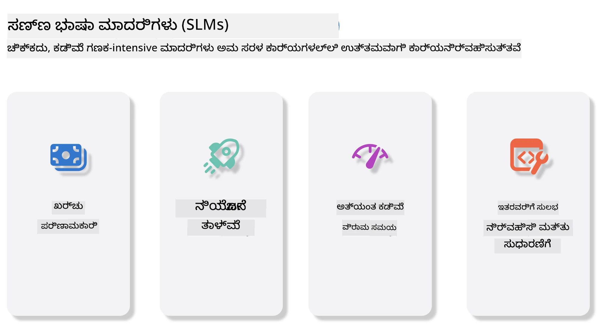
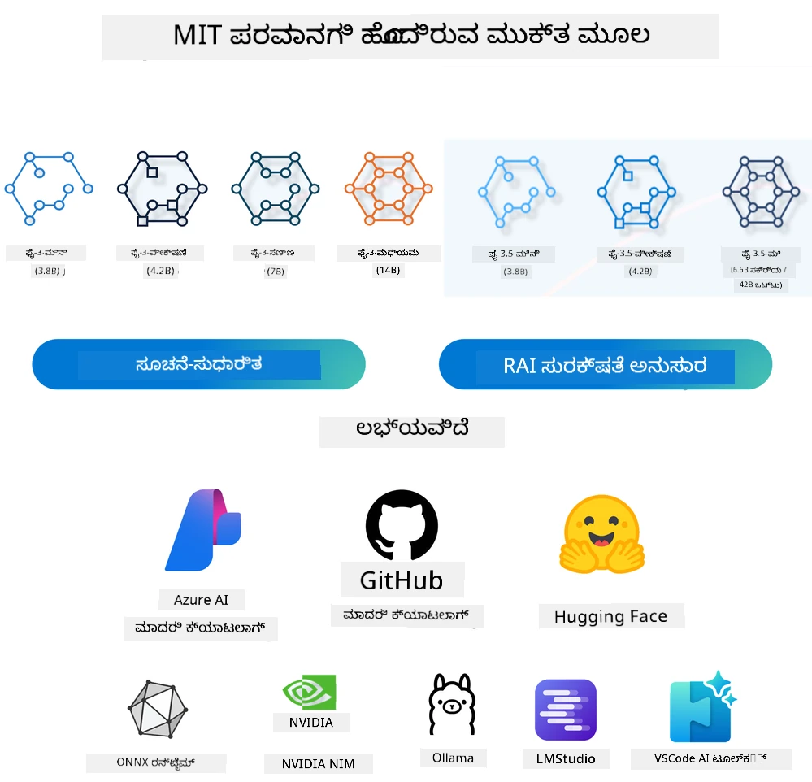
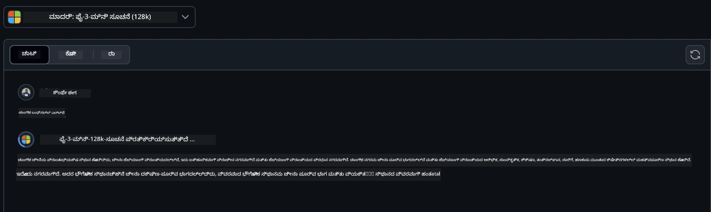
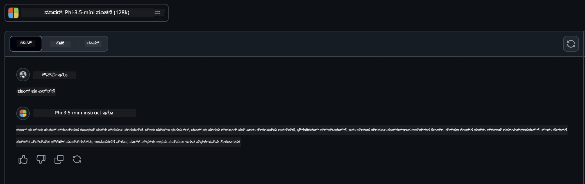

# ಆರಂಭಿಕರಿಗಾಗಿ ಜನರೇಟಿವ್ AI ಗೆ ಸಣ್ಣ ಭಾಷಾ ಮಾದರಿಗಳ ಪರಿಚಯ
ಜನರೇಟಿವ್ AI ಒಂದು ಮನೋರಂಜನೀಯ ಕೃತಕ ಬುದ್ಧಿವಂತಿಕೆಯ ಕ್ಷೇತ್ರವಾಗಿದ್ದು, ಹೊಸ ವಿಷಯಗಳನ್ನು ರಚಿಸಲು ಸಾಮರ್ಥ್ಯದ ಇರುವ ವ್ಯವಸ್ಥೆಗಳ ನಿರ್ಮಾಣದ ಮೇಲೆ ಕೇಂದ್ರೀಕರಿಸುತ್ತದೆ. ಈ ವಿಷಯವು ಪಠ್ಯ ಮತ್ತು ಚಿತ್ರಗಳಿಂದ ಹಿಡಿದು ಸಂಗೀತ ಮತ್ತು ಸಂಪೂರ್ಣ ವರ್ಚುವಲ್ ಪರಿಸರಗಳಿಗೆ ವಿಸ್ತಾರವಾಗಿರಬಹುದು. ಜನರೇಟಿವ್ AI ಯಲ್ಲಿನ ಅತ್ಯಂತ ರೋಚಕ ಅನ್ವಯಿಕೆಗಳಲ್ಲಿ ಒಂದು ಭಾಷಾ ಮಾದರಿಗಳ ಕ್ಷೇತ್ರದಲ್ಲಿದೆ.

## ಸಣ್ಣ ಭಾಷಾ ಮಾದರಿಗಳು ಎಂದರೆ ಏನು?

ಸಣ್ಣ ಭಾಷಾ ಮಾದರಿ (SLM) ಎಂದರೆ ದೊಡ್ಡ ಭಾಷಾ ಮಾದರಿ (LLM) ಯ ಒಂದು ಕುಗ್ಗಿಸಿದ ಆವೃತ್ತಿ, ಅದು LLM ಗಳ ಅನೇಕರೂಪಿತೀನಿಯಮಗಳು ಮತ್ತು ತಂತ್ರಜ್ಞಾನಗಳನ್ನು ಉಪಯೋಗಿಸುತ್ತಾ, ಗಣನೆ ಮೂಲಭೂತ ಭಾರವನ್ನು ಬಹಳ ಕಡಿಮೆ ಮಾಡಿದೆ.

SLM ಗಳು ಮಾನವನಂತೆ ಪಠ್ಯ ರಚಿಸಲು ವಿನ್ಯಾಸಗೊಳಿಸಲಾದ ಭಾಷಾ ಮಾದರಿಗಳ ಉಪವರ್ಗ. ಅವುಗಳ ದೊಡ್ಡ ಸಹೋದ್ಯೋಗಿಗಳಾದ GPT-4 ಮುಂತಾದವುಗಳಿಗಿಂತ ವಿಭಿನ್ನವಾಗಿ, SLM ಗಳು компакт ಹಾಗೂ ಕಾರ್ಯಕ್ಷಮವಾಗಿದ್ದು, ಗಣನೆ ಸಂಪನ್ಮೂಲಗಳು ಸೀಮಿತವಾಗಿರುವ ಪ್ರಯೋಗಗಳಲ್ಲಿ ಅದ್ಭುತ. ಸಣ್ಣಗಿರುವ ದೊಡ್ಡದೆಯಾದರೂ, ಅವು ಹಲವು ಕಾರ್ಯಗಳನ್ನು ನಿಭಾಯಿಸಲು ಶಕ್ತರಾಗಿವೆ. ಸಾಮಾನ್ಯವಾಗಿ, SLM ಗಳು LLM ಗಳು ಸಂ ಕೋರಿಕೆ ಅಥವಾ ಹಠಾಂಗವಾಗಿ ಸಣ್ಣಗೊಳಿಸುವ ಮೂಲಕ ನಿರ್ಮಿಸಲಾಗುತ್ತವೆ, ಮೂಲ ಮಾದರಿಯ ಕಾರ್ಯಕ್ಷಮತೆ ಮತ್ತು ಭಾಷಾ ಸಾಮರ್ಥ್ಯಗಳ ಮಹತ್ತರ ಭಾಗವನ್ನು ಉಳಿಸುವ ಗುರಿಯನ್ನು ಹೊಂದಿವೆ. ಮಾದರಿಯ ಗಾತ್ರ ಕಡಿಮೆ ಮಾಡೋದರಿಂದ ಅದರ ಸಂಕೀರ್ಣತೆ ಇಳಿಯುತ್ತದೆ, ಇದು ಸ್ಮೃತಿ ಬಳಕೆ ಮತ್ತು ಗಣಕೀಯ ಅಗತ್ಯತೆಗಳೂ ಹೆಚ್ಚು ಯಥಾರ್ಥವಾಗಿಸುತ್ತವೆ. ಈ ಕೃತ್ರಿಮತಾಪರಾಜ್ಯಗಳಿದ್ದರೂ, SLM ಗಳು ಕೆಲವು ಸಹಜ ಭಾಷಾ ಸಂಸ್ಕರಣಾ (NLP) ಕಾರ್ಯಗಳನ್ನು ನಿಭಾಯಿಸಬಹುದು:

- ಪಠ್ಯ ರಚನೆ: ಸಮ್ಮಿಳಿತ ಹಾಗೂ ಸಂದರ್ಭಕ್ಕೆ ತಕ್ಕಂತೆ ಮನಃಪೂರ್ವಕ ವಾಕ್ಯಗಳು ಅಥವಾ ಪ್ಯಾರಾಗ್ರಾಫ್ ಗಳ ಸೃಷ್ಟಿ.
- ಪಠ್ಯ ಪೂರ್ಣಗೊಳಿಸುವಿಕೆ: ನೀಡಲಾದ ಸೂಚನೆಯ ಆಧಾರದ ಮೇಲೆ ವಾಕ್ಯಗಳನ್ನು ಪೂರ್ಣಗೊಳಿಸುವ ನಿರೀಕ್ಷೆ.
- ಭಾಷಾಂತರ: ಪಠ್ಯವನ್ನು ಒಂದೇ ಭಾಷೆಯಿಂದ ಮತ್ತೊಂದು ಭಾಷೆಗೂ ಪರಿವರ್ತಿಸುವುದು.
- ಸಾರಾಂಶ: ದೀರ್ಘ ಪಠ್ಯಗಳನ್ನು ಚಿಕ್ಕವುಗಳಾಗಿ, ಸುಲಭವಾಗಿ ಗ್ರಹಿಸಬಹುದಾದ ಸಾರಾಂಶಗಳಾಗಿ ಸಂಕುಚಿಸುವುದು.

ಇವುಗಳಲ್ಲ ಕೆಲವು ಪ್ರದರ್ಶನದಲ್ಲಿ ಅಥವಾ ಅರ್ಥಗಮ್ಯತೆಯಲ್ಲಿ ದೊಡ್ಡ ಮಾದರಿಗಳಿಗಿಂತ ವ್ಯತ್ಯಾಸಗಳೂ ಇರಬಹುದು.

## ಸಣ್ಣ ಭಾಷಾ ಮಾದರಿಗಳು ಹೇಗೆ ಕಾರ್ಯನಿರ್ವಹಿಸುತ್ತವೆ?
SLM ಗಳು ವಿಶಾಲ ಪ್ರಮಾಣದ ಪಠ್ಯ ಡೇಟಾದ ಮೇಲೆ ಪ್ರವೀಣತೆ ಪಡೆಯುತ್ತವೆ. ತರಬೇತಿ ಸಮಯದಲ್ಲಿ, ಅವು ಭಾಷೆಯ ಮಾದರಿಗಳು ಮತ್ತು ರಚನೆಗಳನ್ನು ಕಲಿಯುತ್ತವೆ, ಇದು ಅವುಗಳಿಗೆ ವ್ಯಾಕರಣಾತ್ಮಕವಾಗಿಯೂ ಮತ್ತು ಸಂದರ್ಭಾತ್ಮಕವಾಗಿಯೂ ಸರಿಯಾದ ಪಠ್ಯವನ್ನು ರಚಿಸಲು ಸಹಾಯ ಮಾಡುತ್ತದೆ. ತರಬೇತಿ ಪ್ರಕ್ರಿಯೆ ಒಳಗೊಂಡಿದ್ದು:

- ಡೇಟಾ ಸಂಗ್ರಹ: ವಿವಿಧ ಮೂಲಗಳಿಂದ ಉಗ್ರ ಪಠ್ಯ ಡೇಟಾ ಸಂಗ್ರಹಿಸುವುದು.
- ಪೂರ್ವ ಸಂಸ್ಕರಣ: ತರಬೇತಿಯ ಅನ್ವಯ ಪಠ್ಯವನ್ನು ಶುದ್ಧೀಕರಿಸಿ ಆಯೋಜಿಸುವುದು.
- ತರಬೇತಿ: ಯಂತ್ರಶಿಕ್ಷಣ ಅಲ್ಗಾರಿದಮ್ ಗಳಿಂದ ಮಾದರಿಯನ್ನು ಪಾಠಿಸುವುದು.
- ಸೂಕ್ಷ್ಮ-ತೊಂದರೈಕೆ: ವಿಶೇಷ ಕಾರ್ಯಗಳ ಮೇಲೆ ಕಾರ್ಯಕ್ಷಮತೆಯನ್ನು ಉತ್ತಮಗೊಳಿಸಲು ಮಾದರಿಯನ್ನು ಹೊಂದಿಸುವುದು.

SLM ಗಳ ಅಭಿವೃದ್ಧಿ ಸಂಪನ್ಮೂಲ-ಸೀಮಿತ ಪರಿಸರಗಳಲ್ಲಿ ನಿಯೋಜನೆಗೆ ಬೇಕಾದ ಮಾದರಿಗಳ ಅಗತ್ಯತೆ ಹೆಚ್ಚಾಗುತ್ತಿರುವದ್ದಕ್ಕೆ ಹೊಂದಿಕೊಳ್ಳುತ್ತದೆ, ಉದಾಹರಣೆಗೆ ಮೊಬೈಲ್ ಸಾಧನಗಳು ಅಥವಾ ಎಡ್ಜ್ ಗಣನೆ ವೇದಿಕೆಗಳಲ್ಲಿ, ಇಲ್ಲಿ ದೊಡ್ಡ LLM ಗಳು ತಮ್ಮ ಭಾರೀ ಸಂಪನ್ಮೂಲ ಬೇಡಿಕೆಗಳ ಕಾರಣ ಅನುಕೂಲಕರವಾಗುವುದಿಲ್ಲ. ಕಾರ್ಯಕ್ಷಮತೆಯ ಮೇಲೆ ಗಮನ ಹರಿಸುವ ಮೂಲಕ, SLM ಗಳು ಕಾರ್ಯಕ್ಷಮತೆಗೆ ಮತ್ತು ಲಭ್ಯತೆಗೆ ಸಮತೋಲನವನ್ನು ತರಲು ಸಹಾಯಮಾಡುತ್ತವೆ, ಹಲವು ಕ್ಷೇತ್ರಗಳಲ್ಲಿ ವ್ಯಾಪಕ ಅನ್ವಯಿಕತೆಯನ್ನು ಸಾಧ್ಯಮಾಡುತ್ತವೆ.



## ಕಲಿಕೆ ಗುರಿಗಳು

ಈ ಪಾಠದಲ್ಲಿ, ನಾವು SLM ಬಗ್ಗೆ ಜ್ಞಾನವನ್ನು ಪರಿಚಯಿಸಿ, ಅದನ್ನು Microsoft Phi-3 ಜೊತೆಗೆ ಸಂಯೋಜಿಸಿ ಪಠ್ಯ ವಿಷಯ, ದೃಷ್ಟಿ ಮತ್ತು MoE ನಲ್ಲಿ ವಿಭಿನ್ನ ಸಂದರ್ಭಗಳನ್ನು ಕಲಿಯಲು ಬಯಸುತ್ತೇವೆ.

ಈ ಪಾಠದ ಕೊನೆಯಲ್ಲಿ, ನೀವು ಕೆಳಗಿನ ಪ್ರಶ್ನೆಗಳಿಗೆ ಉತ್ತರ ನೀಡಿಕೊಳ್ಳಲು ಸಾಧ್ಯವಾಗಬೇಕು:

- SLM ಎಂದರೆ ಏನು?
- SLM ಮತ್ತು LLM ನಡುವಿನ ವ್ಯತ್ಯಾಸವೇನು?
- Microsoft Phi-3/3.5 ಕುಟುಂಬ ಎಂದರೇನು?
- Microsoft Phi-3/3.5 ಕುಟುಂಬದೊಂದಿಗೆ ಊಹಿಸು (inference) ಹೇಗೆ ನಡೆಯುತ್ತದೆ?

ಸಿದ್ಧರಾ? ಆರಂಭಿಸೋಣ.

## ದೊಡ್ಡ ಭಾಷಾ ಮಾದರಿಗಳು (LLMs) ಮತ್ತು ಸಣ್ಣ ಭಾಷಾ ಮಾದರಿಗಳು (SLMs) ನಡುವಿನ ವ್ಯತ್ಯಾಸಗಳು

LLM ಗಳು ಮತ್ತು SLM ಗಳು ಎರಡೂ ಪ್ರಾಯೋಗಿಕ ಯಂತ್ರ ಶಿಕ್ಷಣದ ಮೂಲ ತತ್ತ್ವಗಳ ಮೇಲೆ ನಿರ್ಮಿತವಾಗಿದ್ದು, ಅವರ ರಚನಾ ವಿನ್ಯಾಸ, ತರಬೇತಿ ವಿಧಾನಶೀಲತೆ, ಡೇಟಾ ರಚನೆ ಪ್ರಕ್ರಿಯೆಗಳು ಮತ್ತು ಮಾದರಿ ಮೌಲ್ಯಮಾಪನ ತಂತ್ರಗಳಲ್ಲಿಯೂ ಸಮಾನವಾದ ವಿಧಾನಗಳನ್ನು ಅನುಸರಿಸುತ್ತವೆ. ಆದಾಗ್ಯೂ, ಕೆಲವು ಪ್ರಮುಖ ಅಂಶಗಳು ಈ ಇಬ್ಬರ ಮಾದರಿಗಳನ್ನು ವಿಭಿನ್ನ ಪಡಿಸುತ್ತವೆ.

## ಸಣ್ಣ ಭಾಷಾ ಮಾದರಿಗಳ ಅನ್ವಯಿಕೆಗಳು

SLM ಗಳು ಅನೇಕ ಅನ್ವಯಿಕೆಗಳಿವೆ, ಉದಾಹರಣೆಗೆ:

- ಚಾಟ್‌ಬಾಟ್‌ಗಳು: ಗ್ರಾಹಕ ಬೆಂಬಲ ಒದಗಿಸುವುದು ಮತ್ತು conversatioನಲ್ ರೀತಿಯಲ್ಲಿ ಬಳಕೆದಾರರೊಂದಿಗೆ ಸಂವಹನ.
- ವಿಷಯ ಸೃಷ್ಟಿ: ಲೇಖಕರಿಗೆ ಆಲೋಚನೆಗಳ ಹುಟ್ಟು ಹಾಗೂ ಸಂಪೂರ್ಣ ಲೇಖನಗಳ ರಚನೆಗೆ ಸಹಾಯ.
- ಶಿಕ್ಷಣ: ವಿದ್ಯಾರ್ಥಿಗಳಿಗೆ ಬರವಣಿಗೆ ಕಾರ್ಯಗಳಲ್ಲಿ ಅಥವಾ ಹೊಸ ಭಾಷೆಗಳ ಅಧ್ಯಯನದಲ್ಲಿ ಸಹಾಯ.
- ಪ್ರವೇಶಾರ್ಹತೆ: ಅಂಗವಿಕಲತೆ ಹೊಂದಿರುವ ವ್ಯಕ್ತಿಗಳಿಗೆ ಪಠ್ಯ-ಮಾತು ಪರಿವರ್ತನೆ ಸಾಧನಗಳನ್ನು ಸೃಷ್ಟಿಸುವುದು.

**ಗಾತ್ರ**

LLM ಗಳು ಮತ್ತು SLM ಗಳ ನಡುವಿನ ಮೂಲ ವ್ಯತ್ಯಾಸ ಅವರು ಮಾದರಿಗಳ ಗಾತ್ರದಲ್ಲಿ ಇದೆ. ಉದಾಹರಣೆಗೆ, ChatGPT (GPT-4) ಸಾವಿರಾಂತರತ್ರಿಲಿಯನ್ 1.76 ಪಾರಾಮೀಟರ್ ಗಳ ಹೊಂದಿರುವುದಾಗಿ ಅಂದಾಜಿಸಲಾಗಿದೆ, ಆದರೆ ಉಚಿತ ಮೂಲದ SLM ಗಳಾದ Mistral 7B ಸುಮಾರು 7 ಬಿಲ್ಲಿಯನ್ ಪಾರಾಮೀಟರ್ ಗಳೊಂದಿಗೆ ವಿನ್ಯಾಸಗೊಳಿಸಲಾಗಿದೆ. ಈ ವ್ಯತ್ಯಾಸ ಮಾದರಿಯ ರಚನೆ ಮತ್ತು ತರಬೇತಿ ಪ್ರಕ್ರಿಯೆಗಳ ವೈಶಿಷ್ಟ್ಯಗಳಿಂದಲೇ ಆಗುತ್ತದೆ. ಉದಾಹರಣೆಗೆ, ChatGPT ಎಂಕೋಡರ್-ಡಿಕೋಡರ್ ವಿನ್ಯಾಸದಲ್ಲಿ ಸ್ವಯಂ-ಗಮನ ತಂತ್ರವನ್ನು ಉಪಯೋಗಿಸುವದಲ್ಲಿ, Mistral 7B ಸ್ವತಂತ್ರ ಡಿಕೋಡರ್ ಮಾದರಿಯಲ್ಲಿ ಸ್ಲೈಡಿಂಗ್ ವಿಂಡೋ ಗಮನವನ್ನು ಉಪಯೋಗಿಸಿ ಹೆಚ್ಚಿನ ಕಾರ್ಯಕ್ಷಮ ತರಬೇತಿಯ ಅನುಮತಿ ಕೊಡುವುದು ಕಂಡುಬರುತ್ತದೆ. ಈ ರಚನಾ ವ್ಯತ್ಯಾಸವು ಮಾದರಿಗಳ ಸಂಕೀರ್ಣತೆ ಮತ್ತು ಕಾರ್ಯಕ್ಷಮತೆಯಲ್ಲಿ ಮಹತ್ವಪೂರ್ಣ ಪ್ರಭಾವ ಬೀರಲಿದೆ.

**ಅರ್ಥಮಾಡಿಕೊಳ್ಳುವಿಕೆ**

SLM ಗಳು ಸಾಮಾನ್ಯವಾಗಿ ನಿರ್ದಿಷ್ಟ ಕ್ಷೇತ್ರಗಳಲ್ಲಿ ಕಾರ್ಯಕ್ಷಮತೆಗೆ ಗಮನಕೊಟ್ಟು ವಿಶೇಷಗೊಳಿಸಲ್ಪಟ್ಟಿರುತ್ತವೆ, ಇದರ ಪರಿಣಾಮವಾಗಿ ಅವು ಬೃಹತ್ ವಿಷಯಗಳಲ್ಲಿಯೂ ಪ್ರಯೋಗಗತವಾಗಿ ಅರ್ಥಗಮ್ಯತೆ ಕೊಡುವಲ್ಲಿ ಸೀಮಿತವಾಗಿರಬಹುದು. ಇದಕ್ಕೆ ವಿರೋಧವಾಗಿ, LLM ಗಳು ಮಾನವನಂತಹ ಬುದ್ಧಿವಂತಿಕೆಯನ್ನು ಸಕ್ರಿಯಗೊಳಿಸಲು ವಿಸ್ತೃತ ಆಯಾಮದಲ್ಲಿ ತರಬೇತುಗೊಂಡಿವೆ. ಭಿನ್ನ ಧಾರ್ಮಿಕ ಹಾಗೂ ವೈವಿಧ್ಯಮಯ ಡೇಟಾ ಸೆಟ್ ಗಳ ಮೇಲೆ ತರಬೇತಿಗೊಳ್ಳುವ LLM ಗಳು ಹಲವು ಕ್ಷೇತ್ರಗಳಲ್ಲಿ ಸದುಪಯೋಗಿಯಾಗಲು ವಿನ್ಯಾಸಗೊಳಿಸಲಾಗಿದೆ ಹಾಗೂ ಪರಿಣಾಮಕಾರಿತ್ವದಲ್ಲಿ ಹೆಚ್ಚುವರಿ ಹೊಂದಿವೆ. ಆದ್ದರಿಂದ, LLM ಗಳು ಹೆಚ್ಚು ವೈವಿಧ್ಯಮಯ ಪಾಠಗಳಿಗೆ, ಉದಾಹರಣೆಗೆ ಸ್ವಾಭಾವಿಕ ಭಾಷಾ ಸಂಸ್ಕಾರಣೆ ಮತ್ತು ಕಾರ್ಯಕ್ರಮ ನಿರ್ಮಾಣಕ್ಕೆ ಹೆಚ್ಚು ಸೂಕ್ತವಾಗಿವೆ.

**ಗಣನೆ**

LLM ಗಳ ತರಬೇತಿ ಮತ್ತು ನಿಯೋಜನೆ ವ್ಯಾಪಕ ಸಂಪನ್ಮೂಲಗಳನ್ನು ಅಗತ್ಯವಿಡುತ್ತದೆ, ಬೃಹತ್ GPU ಕ್ಲಸ್ಟರ್ ಗಳ ಸರಣಿಗಾರಿಕೆಯನ್ನು ಸಹ ಹೊಂದಿಕೊಳ್ಳಬೇಕಾಗುತ್ತದೆ. ಉದಾಹರಣೆಗೆ, ChatGPT ಮಾದರಿಯನ್ನು ಆರಂಭದ ಬಿಂದುವಿನಿಂದ ತರಬೇತಿ ಮಾಡಬೇಕಾದರೆ, ಸಾವಿರಾರು GPU ಗಳನ್ನು ದೀರ್ಘಾವಧಿಯಲ್ಲಿ ಬಳಸಬೇಕಾಗಬಹುದು. ಪರ್ಯಾಯವಾಗಿ, ಸಣ್ಣ ಪಾಮಾರಾಮೀಟರ್ ಕೊಂಡಲಿನ SLM ಗಳಿಗೆ ಗಣಕ ಸನ್ನಿವೇಶಗಳು ಹೆಚ್ಚು ಲಭ್ಯವಿರುತ್ತವೆ. ಉದಾಹರಣೆಗೆ, Mistral 7B ಮಾದರಿಯನ್ನು ಸಣ್ಣ ಮಟ್ಟದ GPU ಗಳಿಂದ ಕೂಡಲಾದ ಸ್ಥಳೀಯ ಯಂತ್ರಗಳಲ್ಲಿ ತರಬೇತಿ ಮತ್ತು ನಿರ್ವಹಣೆ ಮಾಡಬಹುದು, ಆದರೂ ಶಿಫಾರಸ್ಸು ಮಾಡಿದಂತೆ ಒಂದೆರಡು ಗಂಟೆಗಳ ವರಗೆ ಸರಣಿ GPU ಗಳ ಅಗತ್ಯವಿರಬಹುದು.

**ಪಕ್ಷಪಾತ**

ಪಕ್ಷಪಾತ ಎಲ್‌ಎಲ್‌ಎಮ್‌ಗಳಲ್ಲಿ ಪ್ರಧಾನ ಸಮಸ್ಯೆಯಾಗಿದ್ದು, ಇದರ ಮೂಲ ಪ್ರಮುಖವಾಗಿ ತರಬೇತಿ ಡೇಟಾದ ಪ್ರಕಾರಕ್ಕೆ ನೇರ ಸಂಬಂಧಿಸಿದೆ. ಇವು ಅನೇಕ ಬಾರಿ ಇಂಟರ್ನೆಟ್‌ನ ಸುತ್ತುವರಿದುದಾದ ತೆರವಾದ ಡೇಟಾಗಳಲ್ಲಿ ಆಧರಿಸುತ್ತವೆ, ಇದು ಕೆಲ ಗುಂಪುಗಳನ್ನು ಕಡಿಮೆ ಪ್ರಾತಿನಿಧ್ಯ ಅಥವಾ ತಪ್ಪಾಗಿಸಿದ ಗುರುತಿಸುವಿಕೆ, ಭಾಷಾ ಪಕ್ಷಪಾತ ಮತ್ತು ಏರೆಯಾದ ಭಾಷಾ ವಿವರಣೆಗಳಿಂದ ಬಳಲಬಹುದು. ಹೆಚ್ಚಾಗಿ, LLM ಗಳ ಸಂಕೀರ್ಣ ರಚನೆಗಳು ಇದನ್ನು ಗಂಭೀರಗೊಳಿಸುತ್ತವೆ ಮತ್ತು ಸೂಕ್ಷ್ಮ-ತೊಂದರೈಕೆ ಇಲ್ಲದೆ ಇರಬಹುದು. ಆದರೆ, SLM ಗಳು ಹೆಚ್ಚು ನಿಯಂತ್ರಿತ, ಕ್ಷೇತ್ರ-ನಿರ್ದಿಷ್ಟ ಡೇಟಾಗಳ ಮೇಲೆ ತರಬೇತಿಯಾಗುವುದು ಕಾರಣಿಕವಾಗಿ ಪಕ್ಷಪಾತ ಕಡಿಮೆ ಇತ್ತು, ಆದರೆ ಸಂಪೂರ್ಣವಾಗಿ ಮುಕ್ತವಾಗಿಲ್ಲ.

**ಊಹಿಸು (Inference)**

SLM ಗಳು ಕಡಿಮೆ ಗಾತ್ರದ ಕಾರಣ, ಅವುಗಳಿಗೆ ಸ್ಥಳೀಯ ಸಾಧನದ ಮೇಲೆ ವೇಗದ ಔಟ್‌ಪುಟ್ ಉತ್ಪಾದನೆಗೆ ಉತ್ತಮ ಅವಕಾಶವಿದೆ, ಹೆಚ್ಚಿನ ಸಮಾಂತರ ಡೇಟಾ ಗಣನೆ ಅವಶ್ಯಕತೆ ಇಲ್ಲದೆ. LLM ಗಳು ತಮ್ಮ ಗಾತ್ರ ಮತ್ತು ಸಂಕೀರ್ಣತೆಯಿಂದ ಬಹುಪರ್ಯಾಯ ಗಣಕ ಸಂಪನ್ಮೂಲವನ್ನು ಬೇಕಾಗಿ ಮಾಡಿಕೊಳ್ಳುತ್ತವೆ, ಇದರಿಂದ ತಕ್ಕಮಟ್ಟಿನ ಉತ್ತರ ಸಾಮರ್ಥ್ಯ ಪಡೆಯಲು ಸಮಯ ಹೆಚ್ಚು ಬೇಕಾಗುತ್ತದೆ. ಜೊತೆಗೆ, ಬಹು ಬಳಕೆದಾರರು ಇದ್ದಾಗ LLM ಗಳ ಪ್ರತಿಕ್ರಿಯೆ ಸಮಯವನ್ನು ಕೊಂಚ ತಡಮಾಡಬಹುದು, ವಿಶೇಷವಾಗಿ ದೊಡ್ಡ ಪ್ರಮಾಣದಲ್ಲಿ ನಿಯೋಜಿಸುವಾಗ.

ಸಾರಾಂಶವಾಗಿ, LLM ಗಳು ಮತ್ತು SLM ಗಳು ಎರಡೂ ಯಂತ್ರಶಿಕ್ಷಣದ ಮೂಲ ಮೇಲೆ ಆಗಿರುವುದರಿಂದ, ಅವುಗಳ ಗಾತ್ರ, ಸಂಪನ್ಮೂಲ ಅವಶ್ಯಕತೆಗಳು, ಸಂದರ್ಭ ಅರ್ಥಗಮ್ಯತೆ, ಪಕ್ಷಪಾತ, ಮತ್ತು ಊಹಿಸುವ ವೇಗದಲ್ಲಿ ಭಿನ್ನವಾಗಿವೆ. ಈ ವ್ಯತ್ಯಾಸಗಳು ಅವುಗಳಿಗೆ ವಿಭಿನ್ನ ಬಳಕೆಗಳಿಗೆ ಬೇರ್ಪಡುವ ಶಕ್ತಿಯನ್ನು ನೀಡುತ್ತವೆ, LLM ಗಳು ಹೆಚ್ಚು ಬಹುಮುಖ ಮತ್ತು ಭಾರೀ ಸಂಪನ್ಮೂಲ ಹೊಂದಿರುವುದಾದರೆ, SLM ಗಳು ಕಡಿಮೆ ಗಣಕಯಂತ್ರ ಬೇಡಿಕೆಯಿಂದ ವಿಶಿಷ್ಟ ಕ್ಷೇತ್ರಗಳಲ್ಲಿ ಹೆಚ್ಚು ಕಾರ್ಯ ಕ್ಷಮತೆ ನೀಡುತ್ತವೆ.

***ಗಮನಿಸಿ: ಈ ಪಾಠದಲ್ಲಿ ನಾವು Microsoft Phi-3/3.5 ಬಳಸಿ SLM ಅನ್ನು ಉದಾಹರಣೆಗೆ ಪರಿಚಯಿಸುತ್ತೇವೆ.***

## Phi-3 / Phi-3.5 ಕುಟುಂಬವನ್ನು ಪರಿಚಯಿಸುವುದು

Phi-3 / 3.5 ಕುಟುಂಬ ಮುಖ್ಯವಾಗಿ ಪಠ್ಯ, ದೃಷ್ಟಿ ಮತ್ತು ಏಜೆಂಟ್ (MoE) ಅನ್ವಯಿಕೆ ಸಂದರ್ಭಗಳನ್ನು ಗುರಿಯಾಗಿಸಿಕೊಂಡಿದೆ:

### Phi-3 / 3.5 ಇನ್‌ಸ್ಟ್ರಕ್ಟ್

ಮುಖ್ಯವಾಗಿ ಪಠ್ಯ ರಚನೆ, ಚಾಟ್ ಪೂರ್ಣಗೊಳಿಸುವಿಕೆ ಮತ್ತು ವಿಷಯ ಮಾಹಿತಿ ವಿಲೋಪನೆಯಲ್ಲಿ ಬಳಸುವುದು.

**Phi-3-mini**

3.8B ಪಾರಾಮೀಟರ್ ভাষಾ ಮಾದರಿ Microsoft Azure AI Studio, Hugging Face, ಮತ್ತು Ollama ಲಭ್ಯವಿದೆ. Phi-3 ಮಾದರಿಗಳು ಸಮಾನ ಮತ್ತು ದೊಡ್ಡ ಗಾತ್ರದ ಭಾಷಾ ಮಾದರಿಗಳನ್ನೂ ಪ್ರಮುಖ ಬೆಂಚ್‌ಮಾರ್ಕ್‌ಗಳಲ್ಲಿ ಹಿಗ್ಗಿಸಿ ಮೀರಿಸುತ್ತವೆ (ಕೆಳಗಿನ ಬೆಂಚ್‌ಮಾರ್ಕ್ ಸಂಖ್ಯೆಗಳನ್ನ ನೋಡಿ, ಹೆಚ್ಚಿನ ಸಂಖ್ಯೆ ಉತ್ತಮ). Phi-3-mini ತನ್ನ ಗಾತ್ರದ ಎರಡು ಪಟ್ಟು ದೊಡ್ಡ ಮಾದರಿಗಳನ್ನು ಮೀರಿಸುತ್ತದೆ, ಹಾಗೂ Phi-3-small ಮತ್ತು Phi-3-medium ಗಳು ದೊಡ್ಡ ಮಾದರಿಗಳನ್ನು, GPT-3.5 ಸೇರಿ ಮೀರಿಸುತ್ತವೆ.

**Phi-3-small ಮತ್ತು medium**

7B ಪಾರಾಮೀಟರ್ ಮಾತ್ರ ಹೊಂದಿರುವ Phi-3-small GPT-3.5T ನ್ಡಾದ್ವ್ಯಾಂಶ ರಾಷ್ಟ್ರೀಯ ಭಾಷಾ, ತರ್ಕ, ಕೋಡಿಂಗ್ ಮತ್ತು ಗಣಿತದ benchಮಾರ್ಕ್‌ಗಳಲ್ಲಿ ಜಯಂತಿ ಸಾಧಿಸಿದೆ.

14B ಪಾರಾಮೀಟರ್ ಹೊಂದಿರುವ Phi-3-medium ಈ ಪ್ರವೃತ್ತಿಯನ್ನು ಮುಂದುವರಿಸುವುದೂ ಜ್ಯೋ推荐ವಾಗಿ Gemini 1.0 Pro ಆಲೈನಲ್ಲಿ ಸುಪ್ರೀಮೇರ್ ಆಗಿದೆ.

**Phi-3.5-mini**

ನಾವು ಇದನ್ನು Phi-3-mini ನ ಅಪ್‌ಗ್ರೇಡ್ ಎಂದು ಪರಿಗಣಿಸಬಹುದು. ಪಾರಾಮೀಟರ್ ಗಳು ಬದಲಾಗದಿದ್ದರೂ, 20+ ಭಾಷೆಗಳ ಬೆಂಬಲ ಹೆಚ್ಚಾಗಿದ್ದು (ಅರೇಬಿಕ್, ಚೈನೀಸ್, ಚೆಕ್, ಡ್ಯಾನಿಶ್, ಡಚ್, ಇಂಗ್ಲಿಷ್, ಫಿನ್ನಿಷ್, ಫ್ರೆಂಚ್, ಜರ್ಮನ್, ಹಿಬ್ರೂ, ಹಂಗೇರಿಯನ್, ಇಟಾಲಿಯನ್, ಜಪಾನೀಸ್, ಕೊರಿಯನ್, ನಾರ್ವೆಜಿಯನ್, ಪೋಲಿಶ್, ಪೋರ್ಚುಗೀಸ್, ರಶಿಯನ್, ಸ್ಪ್ಯಾನಿಷ್, ಸ್ವಿಡಿಶ್, ಥೈ, ಟರ್ಕಿಶ್, ಯುಕ್ರೇನಿಯನ್) ಮತ್ತು ದೀರ್ಘ ಸಂದರ್ಭ ಬೆಂಬಲವನ್ನು ಶಕ್ತಿಶಾಲಿಯಾಗಿ ಹೆಚ್ಚಿಸಿದ್ದು.

3.8B ಪಾರಾಮೀಟರ್ ಇರುವ Phi-3.5-mini ಅದರ ಸಮಾನ ಗಾತ್ರದ ಭಾಷಾ ಮಾದರಿಗಳನ್ನೂ ಮೀರಿಸುತ್ತದೆ ಮತ್ತು ಎರಡು ಪಟ್ಟು ಬೃಹತ್ ಮಾದರಿಗಳೊಂದಿಗೆ ಸಮಾನ ಮಟ್ಟದಲ್ಲಿದೆ.

### Phi-3 / 3.5 ದೃಷ್ಟಿ

Phi-3/3.5 ಇನ್‌ಸ್ಟ್ರಕ್ಟ್ ಮಾದರಿಯು Phi ಯ ಅರ್ಥ ಮಾಡುವ ಸಾಮರ್ಥ್ಯವಂತಿದ್ದು, ದೃಷ್ಟಿ Phi ಗೆ ಲೋಕದ ಅರಿವಿನ ಕಣ್ಣುಗಳನ್ನು ನೀಡುತ್ತದೆ.

**Phi-3-Vision**

4.2B ಪಾರಾಮೀಟರ್ ಇರುತ್ತಾ Phi-3-vision ಸುಧಾರಿತವಲ್ಲದೆ Claude-3 Haiku ಮತ್ತು Gemini 1.0 Pro V ಮುಂತಾದ ದೊಡ್ಡ ಮಾದರಿಗಳಿಗೆ ಸಾಮಾನ್ಯ ದೃಷ್ಟಿ ತರ್ಕ ಕಾರ್ಯಗಳು, OCR, ಮತ್ತು ಪಟ್ಟಿಗಳು ಹಾಗೂ ಚಿತ್ರಣ ಅರ್ಥಮಾಡಿಕೊಳ್ಳುವ ಕಾರ್ಯಗಳಲ್ಲಿ ಜಯಂತಿ ಸಾಧಿಸಿದೆ.

**Phi-3.5-Vision**

Phi-3.5-Vision Phi-3-vision ನ ಅಪ್‌ಗ್ರೇಡ್ ಆಗಿದ್ದು, ಬಹುಚಿತ್ರಗಳನ್ನು ಬೆಂಬಲಿಸುತ್ತದೆ. ನೀವು ಇದನ್ನು ದೃಷ್ಟಿ ಕ್ಷೇತ್ರದಲ್ಲಿ ಅಭಿವೃದ್ಧಿ ಎಂದು ಪರಿಗಣಿಸಬಹುದು, ಇದು ಚಿತ್ರಗಳನ್ನು ಮಾತ್ರವಲ್ಲ, ವೀಡಿಯೋಗಳನ್ನು ಸಹ ನೋಡಬಹುದು.

Phi-3.5-vision Claude-3.5 Sonnet ಮತ್ತು Gemini 1.5 Flash ಮುಂತಾದ ದೊಡ್ಡ ಮಾದರಿಗಳನ್ನು OCR, ಪಟ್ಟಿಗಳು, ಚಾರ್ಟ್ ಅರ್ಥಮಾಡಿಕೊಳ್ಳುವ ಕಾರ್ಯಗಳಲ್ಲಿ ಮೀರಿಸುತ್ತದೆ ಮತ್ತು ಸಾಮಾನ್ಯ ದೃಷ್ಟಿ ಜ್ಞಾನ ತರ್ಕ ಕಾರ್ಯಗಳಲ್ಲಿ ಸಮಾನ.

ಬಹು-ಫ್ರೇಮ್ ಇನ್ಪುಟ್ ಬೆಂಬಲ, ಅಂದರೆ ಹಲವಾರು ಇನ್ಪುಟ್ ಚಿತ್ರಗಳ ಮೇಲೆ ತರ್ಕ ಮಾಡುವ ಸಾಮರ್ಥ್ಯ.

### Phi-3.5-MoE

***Mixture of Experts (MoE)*** ಮಾದರಿಗಳನ್ನು ಕಡಿಮೆ ಗಣನೆ ಸಾಮರ್ಥ್ಯದೊಂದಿಗೆ ಪೂರ್ವತರಬೇತಿ ಮಾಡಬಹುದಾಗಿ ಸಾದ್ಯವಿದೆ, ಇದು ನಿಮಗೆ ಏಕಸಮರ್ಥದ ಮಾದರಿಯಂತೆ ಸಮಾನ ಗುಣಮಟ್ಟವನ್ನು ದೊಡ್ಡ ಮಾದರಿ ಅಥವಾ ಡೇಟಾ ಸೆಟ್ ಗಾತ್ರದೊಂದಿಗೆ ಕಡಿಮೆ ಸಮಯದಲ್ಲಿ ತರಬೇತಿ ಮಾಡಲು ಸಹಾಯ ಮಾಡುತ್ತದೆ.

Phi-3.5-MoE ನಲ್ಲಿ 16x3.8B ತಜ್ಞ ಮ್ಯಾಜೂಲ್ಗಳು ಸೇರಿವೆ. 6.6B ಮಾತ್ರ ಸಕ್ರಿಯ ಪಾರಾಮೀಟರ್ ಹೊಂದಿದ್ದರೂ, Phi-3.5-MoE ಆತಿಥ್ಯ, ಭಾಷಾ ಅರ್ಥಮಾಡಿಕೊಳ್ಳುವಿಕೆ, ಮತ್ತು ಗಣಿತದ ಮಟ್ಟದಲ್ಲಿ ದೊಡ್ಡ ಮಾದರಿಗಳಿಗೆ ಸಮಾನವಾಗಿದೆ.

ನಾವು ವಿವಿಧ ಸಂದರ್ಭಗಳಲ್ಲಿ Phi-3/3.5 خاندانದ ಮಾದರಿಗಳನ್ನು ಬಳಸಿ ಸಾಧ್ಯ. LLM ಗಳು ಹಾಗಿಲ್ಲದೇ, Phi-3/3.5-mini ಅಥವಾ Phi-3/3.5-Vision ಅನ್ನು ಎಡ್ಜ್ ಸಾಧನಗಳಲ್ಲಿ ನಿಯೋಜಿಸಬಹುದು.

## Phi-3/3.5 ಕುಟುಂಬದ ಮಾದರಿಗಳನ್ನು ಹೇಗೆ ಬಳಸಬಹುದು

ನಾವು ವಿವಿಧ ಸಂದರ್ಭಗಳಲ್ಲಿ Phi-3/3.5 ಬಳಕೆಗೆ ಆಶಿಸಲಾಗುತ್ತಿದೆ. ಮುಂದೆಯೂ, ನಾವು ವಿಭಿನ್ನ ಸಂದರ್ಭಗಳಲ್ಲಿ Phi-3/3.5 ಆಧರಿಸಿ ಬಯಸುವೆವು.



### ಮೋಘ API ಗಳ ಮುಖಾಂತರ ಊಹಿಸು

**GitHub ಮಾದರಿಗಳು**

GitHub ಮಾದರಿಗಳು ನೇರವಾಗಿ ಬಳಸಬಹುದಾದ ಮಾರ್ಗವಾಗಿದ್ದು, ನೀವು ಶೀಘ್ರವಾಗಿ Phi-3/3.5-ಇನ್‌ಸ್ಟ್ರಕ್ಟ್ ಮಾದರಿಯನ್ನು GitHub ಮಾದರಿಗಳಿಂದ ಪಡೆಯಬಹುದು. Azure AI Inference SDK / OpenAI SDK ಜೊತೆಗೆ ಸಂಯೋಜಿಸಿ, ನೀವು ಕೋಡ್ ಮೂಲಕ API ಕರೆಗೆಗೆ ನೋಡುವ ಮೂಲಕ Phi-3/3.5-ಇನ್‌ಸ್ಟ್ರಕ್ಟ್ ಕರೆಗೆಗೆ completa ಮಾಡಬಹುದು. ವಿಭಿನ್ನ ಪರಿಣಾಮಗಳನ್ನು ಪರೀಕ್ಷಿಸಲು Playground ಕೂಡ ಲಭ್ಯವಿದೆ.

- ಡೆಮೋ: ಚೀನಾ ಪರಿಸರದಲ್ಲಿ Phi-3-mini ಮತ್ತು Phi-3.5-mini ಪರಿಣಾಮಗಳ ಹೋಲಿಕೆ





**Azure AI ಸ್ಟುಡಿಯೋ**

ಅಥವಾ ನಾವು ದೃಷ್ಟಿ ಮತ್ತು MoE ಮಾದರಿಗಳನ್ನು ಬಳಸಬೇಕಾದರೆ, Azure AI ಸ್ಟುಡಿಯೋ ಮೂಲಕ ಕರೆಗೆಗೆ ಪೋರ್ಪಡೆ ಮಾಡಬಹುದು. ಆಸಕ್ತರಾದರೆ, Phi-3‍/3.5 ಇಾ ಇನ್‌ಸ್ಟ್ರಕ್ಟ್, ದೃಷ್ಟಿ, MoE ಗಳನ್ನು Azure AI ಸ್ಟುಡಿಯೋ ಮೂಲಕ ನೀವೋದು Phi-3 ಪುಸ್ತಕವನ್ನು ಓದಿ ಕಲಿಯಬಹುದು [ಈ ಲಿಂಕ್ ಕ್ಲಿಕ್ ಮಾಡಿ](https://github.com/microsoft/Phi-3CookBook/blob/main/md/02.QuickStart/AzureAIStudio_QuickStart.md?WT.mc_id=academic-105485-koreyst)

**NVIDIA NIM**

Azure ಮತ್ತು GitHub ಒದಗಿಸುವ ಮೋಘ ಆಧಾರಿತ ಮಾದರಿ ಕ್ಯಾಟಲೋಗ್ ಪರಿಹಾರಗಳ ಜೊತೆಗೆ, ನೀವು [NVIDIA NIM](https://developer.nvidia.com/nim?WT.mc_id=academic-105485-koreyst) ಯ ಸಹಾಯದಿಂದ ಕೂಡ ಸಂಬಂಧಿತ ಕರೆಗೆಟಗಳನ್ನು ನೆರವೇರಿಸಬಹುದು. NVIDIA NIM (NVIDIA Inference Microservices) ವಿವಿಧ ಪರಿಸರಗಳಲ್ಲಿ — ಮೋಘಗಳು, ಡೇಟಾ ಸೆಂಟರ್ ಗಳು ಮತ್ತು ವರ್ಕ್‌ಸ್ಟೇಷನ್ ಗಳು ಸೇರಿದಂತೆ — AI ಮಾದರಿಗಳನ್ನು ಪರಿಣಾಮಕಾರಿಯಾಗಿ ನಿಯೋಜಿಸಲು ವಿನ್ಯಾಸಗೊಳಿಸಿದ ವೇಗವನ್ನು ನೀಡುವ ಊಹಿಸುವ ಮೈನಿಸರ್ವಿಸ್ ಗಳ ಹೊಂದಾಣಿಕೆಯಾಗಿದೆ.

NVIDIA NIM ಇದ್ದ ಕೆಲವು ಪ್ರಮುಖ ಲಕ್ಷಣಗಳು ಇಲ್ಲಿ:
- **ದಳಪಣೆ ಸುಲಭತೆ:** NIM ಒಂದೇ ಆದೇಶದಿಂದ AI ಮಾದರಿಗಳನ್ನು ದಳಪಣೆಗೆ ಅನುಮತಿಸುತ್ತದೆ, ಇದರಿಂದ ಇತ್ತೀಚಿನ ಕಾರ್ಯವಿಧಾನಗಳಲ್ಲಿ ಸುಲಭವಾಗಿ ಏರ್ಪಡಿಸಲು ಸಾಧ್ಯ.
- **ಅತ್ಯುತ್ತಮ ಕಾರ್ಯಕ್ಷಮತೆ:** ಇದು NVIDIA ನ ಪೂರ್ವ-ಅಪ್ಟಿಮೈಸ್ ಮಾಡಲಾದ ಇನ್‌ಫರೆನ್ಸ್ ಎಂಜಿನ್ಗಳಾದ TensorRT ಮತ್ತು TensorRT-LLM ನ್ನು ಉಪಯೋಗಿಸಿ ಕಡಿಮೆ ವಿಳಂಬ ಹಾಗೂ ಹೆಚ್ಚಿನ ಥ್ರೂಪುಟ್ ಅನ್ನು ಖಚಿತಪಡಿಸುತ್ತದೆ.
- **ಪರಿಗೆಣನೆ ಸಾಮರ್ಥ್ಯ:** NIM ಕುಬರ್ನೇಟಿಸ್ ನಲ್ಲಿ ಆಟೋಸ್ಕೇಲಿಂಗ್ ಅನ್ನು ಬೆಂಬಲಿಸುತ್ತದೆ, ಇದು ಬದಲಾದ ಕೆಲಸದ ಭಾರವನ್ನು ಪರಿಣಾಮಕಾರಿಯಾಗಿ ನಿರ್ವಹಿಸುತ್ತದೆ.
- **ಭದ್ರತೆ ಮತ್ತು ನಿಯಂತ್ರಣ:** ಸಂಸ್ಥೆಗಳು ತಮ್ಮ ಸ್ವಂತ ನಿರ್ವಹಿತ ಆಧಾರಗಳಲ್ಲಿ NIM ಮೈಕ್ರೋಸರ್ವಿಸಸ್ ಅನ್ನು ಸ್ವಯಂ-ಹೋಸ್ಟ್ ಮಾಡಿ ತಮ್ಮ ಡೇಟಾ ಮತ್ತು ಅಪ್ಲಿಕೇಶನ್ಗಳ ಮೇಲಿನ ನಿಯಂತ್ರಣ ಉಳಿಸಬಹುದು.
- **ಮೂಲತತ್ವ API ಗಳು:** NIM ಕೈಗೆಟಕುವ AI ಅಪ್ಲಿಕೇಶನ್ಗಳು ಹಾಗು ಚಾಟ್‌ಬಾಟ್‌ಗಳು, AI ಸಹಾಯಕರು ಇತ್ಯಾದಿಗಳನ್ನು ನಿರ್ಮಿಸಲು ಮತ್ತು ಏರ್ಪಡಿಸಲು ಕೈಗೆಟಕುವ ಕೈಗಾರಿಕಾ ಮಾನದಂಡ API ಗಳು ನೀಡುತ್ತದೆ.

NIM NVIDIA AI ಎಂಟರ್‌ಪ್ರೈಸ್‌ನ ಭಾಗವಾಗಿದ್ದು, AI ಮಾದರಿಗಳ ದಳಪಣೆ ಮತ್ತು ಕಾರ್ಯಾಚರಣೆಯನ್ನು ಸರಳವಾಗಿಸಲು ಮತ್ತು ಅವುಗಳ NVIDIA GPU ಗಳ ಮೇಲೆ ಪರಿಣಾಮಕಾರಿಯಾಗಿ ಕಾರ್ಯನಿರ್ವಹಿಸುವಂತೆ ಮಾಡಲು ಉದ್ದೇಶಿಸಲಾಗಿದೆ.

- ಡೆಮೊ: NVIDIA NIM ಬಳಸಿ Phi-3.5-Vision-API ಅನ್ನು ಕರೆದರೆ [[ಈ ಲಿಂಕ್ ಕ್ಲಿಕ್ ಮಾಡಿ](./python/Phi-3-Vision-Nividia-NIM.ipynb?WT.mc_id=academic-105485-koreyst)]


### Phi-3/3.5 ಅನ್ನು ಸ್ಥಳೀಯವಾಗಿ ಚಾಲನೆ ಮಾಡುವುದು
Phi-3 ಅಥವಾ GPT-3 ಪ್ರಕಾರದ ಯಾವುದಾದರೂ ಭಾಷಾ ಮಾದರಿಯ ಇನ್‌ಫಾರೆನ್ಸ್ ಎಂದರೆ ಆ ಪ್ರಾಂಪ್ಟ್ ಅಥವಾ ಪ್ರಶ್ನೆಯನ್ನು ಪಡೆದ ಮೇಲೆ ಅದರ ದತ್ತಾಂಶದಲ್ಲಿ ಕಂಡ ಮಾದರಿಗಳನ್ನು ವಿಶ್ಲೇಷಿಸಿ ಅತ್ಯಂತ ಸಾಧ್ಯತೆ ಗೂಡಿದ ಹಾಗೂ ಸಂಬಂಧಪಟ್ಟ ಪ್ರತಿಕ್ರಿಯೆಯನ್ನು ಉತ್ಪಾದಿಸುವ ಪ್ರಕ್ರಿಯೆ.

**Hugging Face Transformer**  
Hugging Face Transformers ಒಂದು ಶಕ್ತಿಯುತ ಪುಸ್ತಕಾಲಯವಾಗಿದೆ, ಇದು ನೈಸರ್ಗಿಕ ಭಾಷಾ ಪ್ರಕ್ರಿಯೆ (NLP) ಮತ್ತು ಇತರೆ ಯಂತ್ರ ಶಿಕ್ಷಣ ಕಾರ್ಯಗಳಿಗೆ ವಿನ್ಯಾಸಗೊಳಿಸಲಾಗಿದೆ. ಇದರ ಕೆಲವು ಪ್ರಮುಖ ಅಂಶಗಳು ಇಂದಿವೆ:

1. **ಪೂರ್ವಾಭ್ಯಾಸ ಪಡೆದ ಮಾದರಿಗಳು:** ಪಠ್ಯ ವರ್ಗೀಕರಣ, ಹೆಸರು ಕಂಡುಹಿಡಿಯುವುದು, ಪ್ರಶ್ನೋತ್ತರ, ಸಾರಾಂಶ, ಅನುವಾದ ಮತ್ತು ಪಠ್ಯದ ಉತ್ಪಾದನೆ ಮುಂತಾದ ವಿವಿಧ ಕಾರ್ಯಗಳಿಗಾಗಿ ಸಾವಿರಾರು ಪೂರ್ವಭ್ಯಾಸ ಪಡೆದ ಮಾದರಿಗಳನ್ನು ಇದು ಒದಗಿಸುತ್ತದೆ.

2. **ಕೈಗಾರಿಕೆ ಮಧ್ಯಸ್ಥಿಕೆ:** ಈ ಪುಸ್ತಕಾಲಯವು PyTorch, TensorFlow, ಮತ್ತು JAX ಮುಂತಾದ ಹಲವು ದೀಪ ಅಭ್ಯಾಸ ಕೊಠಡಿಗಳನ್ನು ಬೆಂಬಲಿಸುತ್ತದೆ. ಇದರಿಂದ ನೀವು ಒಂದೇ ರೂಪದಲ್ಲಿ ಮಾದರಿಯನ್ನು ತರಬೇತುಮಾಡಿ ಬೇರೊಂದು ಪ್ರಕ್ರಿಯೆಯಲ್ಲಿ ಬಳಸಬಹುದು.

3. **ಬಾಹ್ಯಮಾನ ಸಾಮರ್ಥ್ಯಗಳು:** NLP ಜೊತೆಗೆ Hugging Face Transformers ದೃಶ್ಯ ಸಂಸ್ಕರಣೆ (ಚಿತ್ರ ವರ್ಗೀಕರಣ, ವಸ್ತು ಕಂಡುಹಿಡಿಯುವುದು) ಮತ್ತು ಧ್ವನಿ ಸಂಸ್ಕರಣೆ (ಮುಖನೀಡಿ ಗುರುತಿಸುವುದು, ಧ್ವನಿ ವರ್ಗೀಕರಣ) ಕಾರ್ಯಗಳನ್ನೂ ಬೆಂಬಲಿಸುತ್ತದೆ.

4. **ಬಳಕೆ ಸುಲಭತೆ:** ಇದು ಮಾದರಿಗಳನ್ನು ಡೌನ್ಲೋಡ್ ಮಾಡಿ ಸೂಕ್ಷ್ಮ ತಿದ್ದುಪಡಿ ಮಾಡಲು API ಗಳು ಮತ್ತು ಉಪಕರಣಗಳನ್ನು ನೀಡುತ್ತದೆ, ಶುರುಮನೆ ಮತ್ತು ಪರಿಣಿತರಿಬ್ಬರಿಗೂ ಸಹ ಉಪಯುಕ್ತ.

5. **ಸಮುದಾಯ ಮತ್ತು ಸಂಪನ್ಮೂಲಗಳು:** Hugging Face ಗೆ ಉತ್ಸಾಹಭರಿತ ಸಮುದಾಯ ಮತ್ತು ವಿಸ್ತೃತ ಡಾಕ್ಯುಮೆಂಟೇಶನ್, ಪಾಠಗಳಿವೆ, ಇದು ಬಳಕೆದಾರರಿಗೆ ಪ್ರಾರಂಭಿಸಲು ಹಾಗೂ ಉತ್ತಮ ರೀತಿಯಲ್ಲಿ ಬಳಸಲು ಸಹಾಯ ಮಾಡುತ್ತದೆ.  
[ಅಧಿಕೃತ ದಸ್ತಾವೇಜು](https://huggingface.co/docs/transformers/index?WT.mc_id=academic-105485-koreyst) ಅಥವಾ ಅವರ [GitHub ಸಂಗ್ರಹಣೆ](https://github.com/huggingface/transformers?WT.mc_id=academic-105485-koreyst).

ಇದು ಸಾಮಾನ್ಯವಾಗಿ ಬಳಸಲಾಗುವ ವಿಧಾನ, ಆದರೆ ಇದಕ್ಕೆ GPU ಆಕ್ಸಿಲರೇಶನ್ ಅಗತ್ಯವಿದೆ. ವಿಶೇಷವಾಗಿ Vision ಮತ್ತು MoE ಮುಂತಾದ ಸನ್ನಿವೇಶಗಳು ಗಣನೆ ಮಾಡುವ ಪ್ರಮಾಣ ಹೆಚ್ಚು ಇರಬೇಕು, ಅದೆಲ್ಲವು quantized ಆಗದಿದ್ದರೆ CPU ಮೇಲೆ ಬಹುಮಾನವಾಗಿ ನಿಧಾನವಾಗಿ ನಡೆಯುತ್ತದೆ.

- ಡೆಮೊ: Transformer ಬಳಸಿ Phi-3.5-Instruct ಅನ್ನು ಕರೆದರೆ [ಈ ಲಿಂಕ್ ಕ್ಲಿಕ್ ಮಾಡಿ](./python/phi35-instruct-demo.ipynb?WT.mc_id=academic-105485-koreyst)

- ಡೆಮೊ: Transformer ಬಳಸಿ Phi-3.5-Vision ಅನ್ನು ಕರೆದರೆ [ಈ ಲಿಂಕ್ ಕ್ಲಿಕ್ ಮಾಡಿ](./python/phi35-vision-demo.ipynb?WT.mc_id=academic-105485-koreyst)

- ಡೆಮೊ: Transformer ಬಳಸಿ Phi-3.5-MoE ಅನ್ನು ಕರೆದರೆ [ಈ ಲಿಂಕ್ ಕ್ಲಿಕ್ ಮಾಡಿ](./python/phi35_moe_demo.ipynb?WT.mc_id=academic-105485-koreyst)

**Ollama**  
[Ollama](https://ollama.com/?WT.mc_id=academic-105485-koreyst) ನಿಮ್ಮ ಯಂತ್ರದಲ್ಲಿ ದೊಡ್ಡ ಭಾಷಾ ಮಾದರಿಗಳನ್ನು ಸ್ಥಳೀಯವಾಗಿ ಸುಲಭವಾಗಿ ಚಾಲನೆ ಮಾಡಲು ವಿನ್ಯಾಸಗೊಳಿಸಲಾದ ವೇದಿಕೆ. ಇದು Llama 3.1, Phi 3, Mistral, Gemma 2 ಮತ್ತು ಇತರೆ ಮಾದರಿಗಳನ್ನು ಬೆಂಬಲಿಸುತ್ತದೆ. ಈ ವೇದಿಕೆ ಮಾದರಿಯ ತೂಕಗಳು, ಸಂರಚನೆ ಮತ್ತು ದತ್ತಾಂಶವನ್ನು ಒಂದೇ ಪ್ಯಾಕೇಜ್‌ನಲ್ಲಿ ಸೇರಿಸುವ ಮೂಲಕ ಬಳಕೆದಾರರಿಗೆ ತಮ್ಮದೇ ಮಾದರಿಗಳನ್ನು ಕಸ್ಟಮೈಸ್ ಮತ್ತು ನಿರ್ಮಿಸಲು ಸುಲಭಗೊಳಿಸುತ್ತದೆ. Ollama macOS, Linux, ಮತ್ತು Windows ಗೆ ಲಭ್ಯ. ನೀವು ಕ್ಲೌಡ್ ಸೇವೆಗಳ ಮೇಲೆ ಅವಲಂಬಿತವಾಗದೆ LLM ಗಳುyla ವಿನ್ಯಾಸ ಅಥವಾ ಕಾರ್ಯಗತಗೊಳಿಸಲು ಸಲಹೆಯಾದಲ್ಲಿ ಇದು ಉತ್ತಮ ಸಾಧನ. Ollama ನೇರ ವಿಧಾನವಾಗಿದೆ, ನೀವು ಕೆಳಗಿನ ಆದೇಶವನ್ನು ಕಾರ್ಯಗತಗೊಳಿಸುವುದಷ್ಟೇ.

```bash

ollama run phi3.5

```


**ONNX ರನ್ಟೈಮ್‌ ಫಾರ್ ಜೆನ್‌ಎಐ**

[ONNX Runtime](https://github.com/microsoft/onnxruntime-genai?WT.mc_id=academic-105485-koreyst) ಒಂದು ಕ್ರಾಸ್-ಪ್ಲಾಟ್‌ಫಾರ್ಮ್ ಇನ್‌ಫರೆನ್ಸ್ ಮತ್ತು ತರಬೇತಿ ಯಂತ್ರ ಶಿಕ್ಷಣ ವೇಗంగా ನಡೆಸುವ ಸಾಧನ. ONNX Runtime for Generative AI (GENAI) ನಿಮ್ಮ ಜನರೆಟಿವ್ AI ಮಾದರಿಗಳನ್ನು ವಿವಿಧ ವೇದಿಕೆಗಳಲ್ಲಿ ಪರಿಣಾಮಕಾರಿಯಾಗಿ ಚಲಾಯಿಸಲು ಸಹಾಯಕವಾದ ಶಕ್ತಿಶಾಲಿ ಸಾಧನ.

## ONNX Runtime ಎಂದರೇನು?  
ONNX Runtime ಒಂದು ಮುಕ್ತ ಮಾದರಿ ಹೊರಗೊಂಡ ಪ್ರಾಜೆಕ್ಟ್ ಆಗಿದ್ದು, ಯಂತ್ರ ಕಲಿಕೆ ಮಾದರಿಗಳ ಹೆಚ್ಚಿನ ಕಾರ್ಯಕ್ಷಮ ಇನ್‌ಫರೆನ್ಸ್ ಅನ್ನು ಅನುವು ಮಾಡಿಕೊಡುತ್ತದೆ. ಇದು Open Neural Network Exchange (ONNX) ಫಾರ್ಮ್ಯಾಟ್ ನಲ್ಲಿ ಮಾದರಿಗಳನ್ನು ಬೆಂಬಲಿಸುತ್ತದೆ, ಇದು ಯಂತ್ರ ಕಲಿಕೆಯ ಮಾದರಿಗಳನ್ನು ಪ್ರತಿನಿಧಿಸಲು ಮಾನದಂಡ. ONNX Runtime ಇನ್‌ಫರೆನ್ಸ್ ವೇಗವಾದ ಗ್ರಾಹಕ ಅನುಭವಗಳನ್ನು ಕೆಳಗಿನ ವೆಚ್ಚಗಳೊಂದಿಗೆ ಸಾಧ್ಯಮಾಡುತ್ತದೆ, ಮತ್ತು PyTorch ಮತ್ತು TensorFlow/Keras ಮುಂತಾದ ದೀಪ ಕಲಿಕೆಯ ಫ್ರೇಮ್ವರ್ಕ್‌ಗಳು ಮತ್ತು scikit-learn, LightGBM, XGBoost ಮುಂತಾದ ಸಾಂಪ್ರದಾಯಿಕ ಯಂತ್ರ ಕಲಿಕೆಯ ಪುಸ್ತಕಾಲಯಗಳು ಸೇರಿದಂತೆ ವಿಭಿನ್ನ ಮಾದರಿಗಳನ್ನು ಬೆಂಬಲಿಸುತ್ತದೆ. ONNX Runtime ವಿಭಿನ್ನ ಹಣಕಾಸು ಉಪಕರಣಗಳು, ಚಾಲಕರು ಮತ್ತು ಕಾರ್ಯಾಚರಣಾ ವ್ಯವಸ್ಥೆಗಳೊಂದಿಗೆ ಹೊಂದಿಕೊಂಡಿದ್ದು, ಸಾಧ್ಯತೆ ಇದ್ದಲ್ಲಿ ಗ್ರಾಫ್ ಆಪ್ಟಿಮೈಸೇಶನ್‌ಗಳು ಮತ್ತು ಪರಿವರ್ತನೆಗಳೊಂದಿಗೆ ಹಾರ್ಡ್‌ವೇರ್ ತ್ವರಿತಗೊಳಿಸುವಿಕೆಗಳನ್ನು ಬಳಸಿಕೊಂಡು ಕಾರ್ಯಕ್ಷಮತೆಯನ್ನು ಸುಧಾರಿಸುತ್ತದೆ.

## ಜನರೆಟಿವ್ AI ಎಂದರೇನು?  
ಜನರೆಟಿವ್ AI ಅಂದರೆ ತರಬೇತಿಗೊಂಡ ದತ್ತಾಂಶದ ಮೇರೆಗೆ ಹೊಸ ವಿಷಯವನ್ನು ರಚಿಸಬಲ್ಲ AI ವ್ಯವಸ್ಥೆಗಳು, ಉದಾಹರಣೆಗೆ ಪಾಠ, ಚಿತ್ರಗಳು, ಸಂಗೀತೆ. ಉದಾಹರಣೆಗಳಿಗೆ GPT-3 ಸೇರಿದಂತೆ ಭಾಷಾ ಮಾದರಿಗಳು ಮತ್ತು Stable Diffusion ಪ್ರಕಾರದ ಚಿತ್ರ ರಚನಾ ಮಾದರಿಗಳು ಸೇರಿವೆ. ONNX Runtime for GenAI ಗ್ರಂಥಾಲಯವು ONNX ಮಾದರಿಗಳಿಗಾಗಿ ಜನರೆಟಿವ್ AI ಸೈಕಲ್ ಅನ್ನು ಒದಗಿಸುತ್ತದೆ, ಇದರಲ್ಲಿ ONNX Runtime ಮೂಲಕ ಇನ್‌ಫರೆನ್ಸ್, ಲಾಜಿಟ್ಸ್ ಪ್ರೋಸೆಸಿಂಗ್, ಶೋಧನೆ ಮತ್ತು സാമ്പ್ಲಿಂಗ್, ಹಾಗೂ KV ಕ್ಯಾಶೆ ನಿರ್ವಾಹದೂ ಸೇರಿವೆ.

## ONNX Runtime for GENAI  
ONNX Runtime for GENAI ONNX Runtime ನ ಸಾಮರ್ಥ್ಯವನ್ನು ವಿಸ್ತರಿಸಿ ಜನರೆಟಿವ್ AI ಮಾದರಿಗಳನ್ನು ಬೆಂಬಲಿಸುತ್ತದೆ. ಕೆಲವು ಪ್ರಮುಖ ಲಕ್ಷಣಗಳು ಇವೆ:

- **ವಿಸ್ತೃತ ವೇದಿಕೆ ಬೆಂಬಲ:** ವಿಂಡೋಸ್, ಲಿನಕ್ಸ್, ಮ್ಯಾಕೋಎಸ್, ಆಂಡ್ರಾಯಿಡ್ ಮತ್ತು iOS ಸೇರಿದಂತೆ ವಿವಿಧ ವೇದಿಕೆಗಳಲ್ಲಿ ಕಾರ್ಯನಿರ್ವಹಿಸುತ್ತದೆ.
- **ಮಾದರಿ ಬೆಂಬಲ:** LLaMA, GPT-Neo, BLOOM ಮುಂತಾದ ಜನಪ್ರಿಯ ಜನರೆಟಿವ್ AI ಮಾದರಿಗಳನ್ನು ಬೆಂಬಲಿಸುತ್ತದೆ.
- **ಕಾರ್ಯಕ್ಷಮತೆ ಸುಧಾರಣೆ:** NVIDIA GPU ಗಳು, AMD GPU ಗಳು ಮತ್ತು ಇತರೆ ತ್ವರಿತಗೊಳಿಸುವ ಹಾರ್ಡ್‌ವೇರ್‌ಗಾಗಿ ಅಂತರ್ಜ್ಞಾತ ಆಪ್ಟಿಮೈಸೇಶನ್‌ಗಳನ್ನು ಒದಗಿಸುತ್ತದೆ.
- **ಬಳಕೆ ಸೌಕರ್ಯ:** ಕಡಿಮೆ ಕೋಡ್ ಬಳಸಿ ಪಠ್ಯ, ಚಿತ್ರಗಳು ಮತ್ತು ಇತರೆ ವಿಷಯಗಳನ್ನು ಉತ್ಪಾದಿಸಲು APIಗಳನ್ನು ಒದಗಿಸುತ್ತದೆ.
- ಬಳಕೆದಾರರು generate() ಎಂಬ ಮೇಲ್ಮಟ್ಟದ ವಿಧಾನವನ್ನು ಕರೆದರೆ, ಅಥವಾ ಮಾದರಿಯನ್ನು ಕರ್ತಕದಲ್ಲಿ ಸಂಚಲನ ಮಾಡುವ ಮೂಲಕ ಒಮ್ಮೆಕ್ಕೆ ಒಂದು ಟೋಕನ್ ಸೃಷ್ಟಿಸಿ, ಆ ಸಂಚಲನಗಳಲ್ಲಿ ಪಾರಾಮೀಟರ್‌ಗಳನ್ನು ನವೀಕರಿಸಬಹುದು.
- ONNX ರನ್ಟೈಮ್ ಟೋಕನ್ ಸರಣಿಗಳನ್ನು ಉತ್ಪಾದಿಸಲು greedy/beam ಶೋಧನೆಯನ್ನು ಮತ್ತು TopP, TopKampling ನಂತಹ ವಿಧಾನಗಳನ್ನು ಬೆಂಬಲಿಸುತ್ತದೆ ಮತ್ತು ಲಾಜಿಟ್ಸ್ ಪ್ರೋಸೆಸಿಂಗ್‌ನಂತೆ ಪುನರಾವೃತ್ತಿ ದಂಡನೆಗಳು ಇವೆ. ನೀವು ಕಸ್ಟಮ್ ಅಂಕಗಳನ್ನು ಸುಲಭವಾಗಿ ಸೇರಿಸಬಹುದು.

## ಪ್ರಾರಂಭಿಸುವುದು  
ONNX Runtime for GENAI ನೊಂದಿಗೆ ಪ್ರಾರಂಭಿಸಲು, ನೀವು ಈ ಹಂತಗಳನ್ನು ಅನುಸರಿಸಬಹುದು:

### ONNX Runtime ಇನ್‌ಸ್ಟಾಲ್ ಮಾಡಿ:  
```Python
pip install onnxruntime
```
### ಜನರೆಟಿವ್ AI ವಿಸ್ತರಣೆಗಳನ್ನು ಇನ್‌ಸ್ಟಾಲ್ ಮಾಡಿ:  
```Python
pip install onnxruntime-genai
```
  
### ಮಾದರಿ ಚಲಾಯಿಸಿ: ಇಲ್ಲಿ ಪೈಥಾನ್‌ನಲ್ಲಿ ಸರಳ ಉದಾಹರಣೆ ಇದೆ:  
```Python
import onnxruntime_genai as og

model = og.Model('path_to_your_model.onnx')

tokenizer = og.Tokenizer(model)

input_text = "Hello, how are you?"

input_tokens = tokenizer.encode(input_text)

output_tokens = model.generate(input_tokens)

output_text = tokenizer.decode(output_tokens)

print(output_text) 
```
### ಡೆಮೊ: ONNX Runtime GenAI ಬಳಸಿ Phi-3.5-Vision ಅನ್ನು ಕರೆದರೆ  

```python

import onnxruntime_genai as og

model_path = './Your Phi-3.5-vision-instruct ONNX Path'

img_path = './Your Image Path'

model = og.Model(model_path)

processor = model.create_multimodal_processor()

tokenizer_stream = processor.create_stream()

text = "Your Prompt"

prompt = "<|user|>\n"

prompt += "<|image_1|>\n"

prompt += f"{text}<|end|>\n"

prompt += "<|assistant|>\n"

image = og.Images.open(img_path)

inputs = processor(prompt, images=image)

params = og.GeneratorParams(model)

params.set_inputs(inputs)

params.set_search_options(max_length=3072)

generator = og.Generator(model, params)

while not generator.is_done():

    generator.compute_logits()
    
    generator.generate_next_token()

    new_token = generator.get_next_tokens()[0]
    
    output = tokenizer_stream.decode(new_token)
    
    print(tokenizer_stream.decode(new_token), end='', flush=True)

```


**ಇತರೆಗಳು**

ONNX Runtime ಮತ್ತು Ollama ಸೂಚನಾ ವಿಧಾನಗಳ ಜೊತೆಗೆ, ವಿವಿಧ ತಯಾರಕರು ಒದಗಿಸಿದ ಮಾದರಿ ಸೂಚನಾ ವಿಧಾನಗಳ ಆಧಾರದ ಮೇಲೆ ಪ್ರಮಾಣೀಕೃತ ಮಾದರಿಗಳನ್ನು ಪೂರ್ಣಗೊಳಿಸಬಹುದು. ಉದಾಹರಣೆಗೆ Apple Metal ಜೊತೆಗೆ Apple MLX ಸಂಕೇತವನ್ನು, Qualcomm QNN NPU ಜೊತೆ, Intel OpenVINO CPU/GPU ಮೂಲಕ ಮುಂತಾದವು. ನೀವು ಇನ್ನಷ್ಟು ವಿಷಯವನ್ನು [Phi-3 Cookbook](https://github.com/microsoft/phi-3cookbook?WT.mc_id=academic-105485-koreyst) ನಲ್ಲಿ ಪಡೆಯಬಹುದು.

## ಇನ್ನಷ್ಟು

ನಾವು Phi-3/3.5 ಕುಟುಂಬದ ಮೂಲಭೂತ ವಿಷಯಗಳನ್ನು ಕಲಿತಿದ್ದೇವೆ, ಆದರೆ SLM ಬಗ್ಗೆ ಹೆಚ್ಚು ತಿಳಿಯಲು ನಾವು ಹೆಚ್ಚಿನ ಜ್ಞಾನವನ್ನು ಪಡೆಯಬೇಕಿದೆ. ನೀವು ಉತ್ತರಗಳನ್ನು Phi-3 Cookbook ನಲ್ಲಿ ಹುಡುಕಬಹುದು. ನೀವು ಹೆಚ್ಚಾಗಿ ಕಲಿಯಬೇಕಿದ್ದರೆ, ದಯವಿಟ್ಟು [Phi-3 Cookbook](https://github.com/microsoft/phi-3cookbook?WT.mc_id=academic-105485-koreyst) ಗೆ ಭೇಟಿ ನೀಡಿ.

---

<!-- CO-OP TRANSLATOR DISCLAIMER START -->
**ತ್ಯಾಜ್ಯ verklaring**:  
ಈ ದಾಖಲೆ AI ಅನುವಾದ ಸೇವೆಯಾದ [Co-op Translator](https://github.com/Azure/co-op-translator) ಬಳಸಿ ಅನುವಾದಿಸಲಾಗಿದೆ. ನಾವು ಶುದ್ಧತೆಗೆ ಪ್ರಯತ್ನಿಸುತ್ತಿದ್ದರೂ, ಸ್ವಯಂಕ್ರಿಯ ಅನುವಾದಗಳು ದೋಷಗಳು ಅಥವಾ ಅಸತ್ಯತೆಗಳನ್ನು ಹೊಂದಿರಬಹುದು ಎಂದು ದಯವಿಟ್ಟು ಗಮನಿಸಿ. ಮೂಲ ದಾಖಲೆ ಅದರ ಸ್ವದೇಶಿ ಭಾಷೆಯಲ್ಲಿ ಅಧಿಕೃತ ಮೂಲ ಎಂದು ಪರಿಗಣಿಸಬೇಕು. ಪ್ರಮುಖ ಮಾಹಿತಿಗಾಗಿ, ವೃತ್ತಿಪರ ಮಾನವ ಅನುವಾದವನ್ನು ಶಿಫಾರಸು ಮಾಡಲಾಗುತ್ತದೆ. ಈ ಅನುವಾದ ಬಳಕೆಯಿಂದ ಉಂಟಾಗುವ ಯಾವುದೇ ತಪ್ಪು—ಅರ್ಥಮಾತುರಿ ಅಥವಾ ವ್ಯಾಖ್ಯಾನಗಾಗಿ ನಮ್ಮ ಹೊಣೆಗಾರಿಕೆ ಇರೋದಿಲ್ಲ.
<!-- CO-OP TRANSLATOR DISCLAIMER END -->