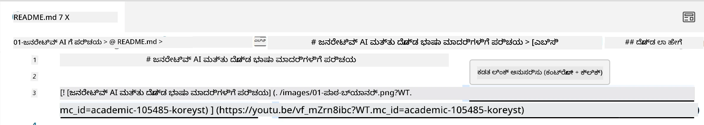
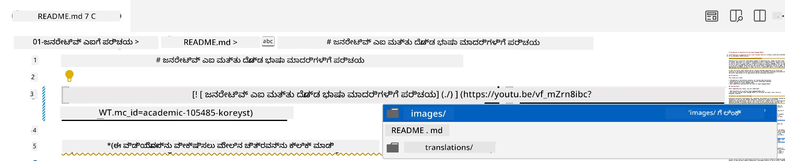
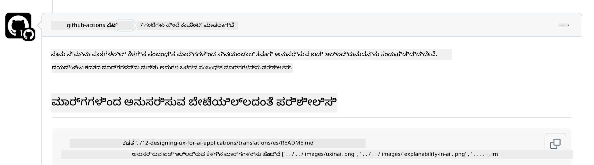
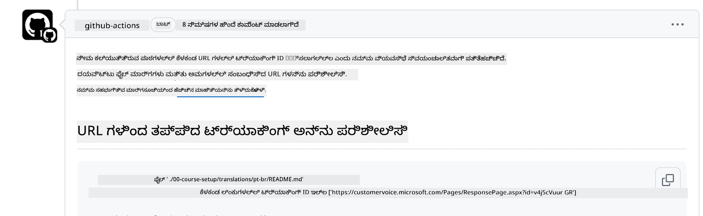
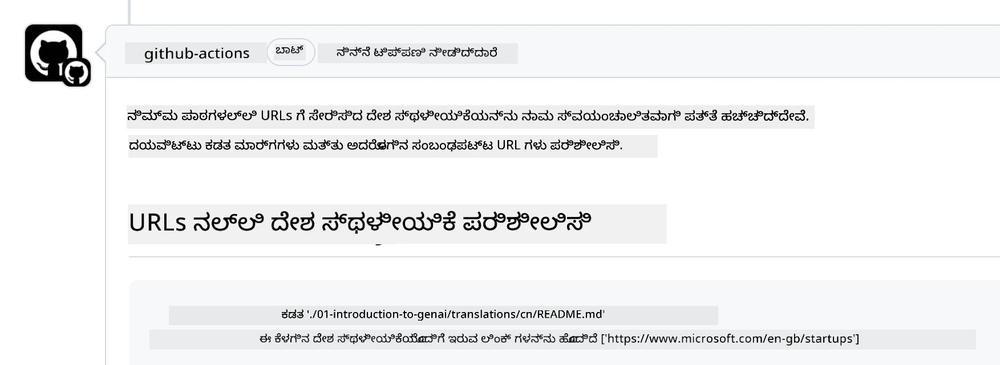

# ಕೊಡುಗೆ ನೀಡುವುದು

ಈ ಯೋಜನೆ ಕೊಡುಗೆಗಳು ಮತ್ತು ಸಲಹೆಗಳನ್ನು ಸ್ವಾಗತಿಸುತ್ತದೆ. ಹೆಚ್ಚಿನ ಕೊಡುಗೆಗಳಿಗೆ ನೀವು ಒಪ್ಪಿಕೊಳ್ಳಬೇಕಾಗುತ್ತದೆ
ಒಂದು ಕೊಡುಗೆದಾರರ ಪರವಾನಗಿ ಒಪ್ಪಂದ (CLA) ಅನ್ನು, ನೀವು ಹಕ್ಕು ಹೊಂದಿದ್ದೀರಿ ಎಂದು ಘೋಷಿಸುವುದು,
ಮತ್ತು ನಿಜವಾಗಿಯೂ, ನಿಮ್ಮ ಕೊಡುಗೆ ಬಳಸಲು ನಮಗೆ ಹಕ್ಕುಗಳನ್ನು ನೀಡುತ್ತೀರಿ. ವಿವರಗಳಿಗೆ ಭೇಟಿ ನೀಡಿ
<https://cla.microsoft.com>.

> ಮಹತ್ವದ ವಿಷಯ: ಈ ರೆಪೊದಲ್ಲಿ ಪಠ್ಯವನ್ನು ಅನುವಾದಿಸುವಾಗ, ದಯವಿಟ್ಟು ಯಂತ್ರ ಅನುವಾದವನ್ನು ಬಳಸಬೇಡಿ. ನಾವು ಸಮುದಾಯದ ಮೂಲಕ ಅನುವಾದಗಳನ್ನು ಪರಿಶೀಲಿಸುವುದರಿಂದ, ದಯವಿಟ್ಟು ನೀವು ಪರಿಣತಿ ಹೊಂದಿರುವ ಭಾಷೆಗಳಲ್ಲಿ ಮಾತ್ರ ಅನುವಾದಗಳಿಗೆ ಸ್ವಯಂಸೇವಕರಾಗಿರಿ.

ನೀವು ಪುಲ್ ರಿಕ್ವೆಸ್ಟ್ ಸಲ್ಲಿಸಿದಾಗ, CLA-ಬಾಟ್ ಸ್ವಯಂಚಾಲಿತವಾಗಿ ನೀವು CLA ಒದಗಿಸಬೇಕೇ ಎಂದು ನಿರ್ಧರಿಸಿ PR ಅನ್ನು ಸೂಕ್ತವಾಗಿ ಅಲಂಕರಿಸುತ್ತದೆ (ಉದಾ: ಲೇಬಲ್, ಕಾಮೆಂಟ್). ಬಾಟ್ ನೀಡುವ ಸೂಚನೆಗಳನ್ನು ಅನುಸರಿಸಿ. ನಮ್ಮ CLA ಬಳಸುವ ಎಲ್ಲಾ ರೆಪೊಗಳಲ್ಲಿಯೂ ನೀವು ಇದನ್ನು ಒಂದೇ ಬಾರಿ ಮಾಡಬೇಕಾಗುತ್ತದೆ.

## ವರ್ತನೆ ನಿಯಮಾವಳಿ

ಈ ಯೋಜನೆ [Microsoft Open Source Code of Conduct](https://opensource.microsoft.com/codeofconduct/?WT.mc_id=academic-105485-koreyst) ಅನ್ನು ಅಂಗೀಕರಿಸಿದೆ.
ಹೆಚ್ಚಿನ ಮಾಹಿತಿಗಾಗಿ [Code of Conduct FAQ](https://opensource.microsoft.com/codeofconduct/faq/?WT.mc_id=academic-105485-koreyst) ಓದಿ ಅಥವಾ ಯಾವುದೇ ಹೆಚ್ಚುವರಿ ಪ್ರಶ್ನೆಗಳು ಅಥವಾ ಕಾಮೆಂಟ್‌ಗಳಿಗೆ [opencode@microsoft.com](mailto:opencode@microsoft.com) ಸಂಪರ್ಕಿಸಿ.

## ಪ್ರಶ್ನೆ ಅಥವಾ ಸಮಸ್ಯೆ?

ದಯವಿಟ್ಟು ಸಾಮಾನ್ಯ ಬೆಂಬಲ ಪ್ರಶ್ನೆಗಳಿಗೆ GitHub ಸಮಸ್ಯೆಗಳನ್ನು ತೆರೆಯಬೇಡಿ ಏಕೆಂದರೆ GitHub ಪಟ್ಟಿ ವೈಶಿಷ್ಟ್ಯ ವಿನಂತಿಗಳು ಮತ್ತು ದೋಷ ವರದಿಗಳಿಗಾಗಿ ಬಳಸಬೇಕು. ಈ ರೀತಿಯಾಗಿ ನಾವು ನಿಜವಾದ ಸಮಸ್ಯೆಗಳು ಅಥವಾ ದೋಷಗಳನ್ನು ಸುಲಭವಾಗಿ ಟ್ರ್ಯಾಕ್ ಮಾಡಬಹುದು ಮತ್ತು ಸಾಮಾನ್ಯ ಚರ್ಚೆಯನ್ನು ನಿಜವಾದ ಕೋಡ್‌ನಿಂದ ಪ್ರತ್ಯೇಕವಾಗಿ ಇಡಬಹುದು.

## ಟೈಪೋಗಳು, ಸಮಸ್ಯೆಗಳು, ದೋಷಗಳು ಮತ್ತು ಕೊಡುಗೆಗಳು

ನೀವು Generative AI for Beginners ರೆಪೊಗೆ ಯಾವುದೇ ಬದಲಾವಣೆಗಳನ್ನು ಸಲ್ಲಿಸುವಾಗ, ದಯವಿಟ್ಟು ಈ ಶಿಫಾರಸುಗಳನ್ನು ಅನುಸರಿಸಿ.

* ಬದಲಾವಣೆಗಳನ್ನು ಮಾಡುವ ಮೊದಲು ಯಾವಾಗಲೂ ರೆಪೊವನ್ನು ನಿಮ್ಮ ಖಾತೆಗೆ ಫೋರ್ಕ್ ಮಾಡಿ
* ಒಂದೇ ಪುಲ್ ರಿಕ್ವೆಸ್ಟ್‌ಗೆ ಬಹು ಬದಲಾವಣೆಗಳನ್ನು ಸಂಯೋಜಿಸಬೇಡಿ. ಉದಾಹರಣೆಗೆ, ಯಾವುದೇ ದೋಷ ಸರಿಪಡಿಸುವಿಕೆ ಮತ್ತು ಡಾಕ್ಯುಮೆಂಟೇಶನ್ ನವೀಕರಣಗಳನ್ನು ಪ್ರತ್ಯೇಕ PR ಗಳ ಮೂಲಕ ಸಲ್ಲಿಸಿ
* ನಿಮ್ಮ ಪುಲ್ ರಿಕ್ವೆಸ್ಟ್ ಮರ್ಜ್ ಸಂಘರ್ಷಗಳನ್ನು ತೋರಿಸಿದರೆ, ನಿಮ್ಮ ಸ್ಥಳೀಯ ಮುಖ್ಯ ಶಾಖೆಯನ್ನು ಮುಖ್ಯ ರೆಪೊದಲ್ಲಿ ಇರುವುದರ ಪ್ರತಿಬಿಂಬವಾಗಿರಿಸಲು ನವೀಕರಿಸಿ ನಂತರ ಬದಲಾವಣೆಗಳನ್ನು ಮಾಡಿ
* ನೀವು ಅನುವಾದವನ್ನು ಸಲ್ಲಿಸುತ್ತಿದ್ದರೆ, ದಯವಿಟ್ಟು ಎಲ್ಲಾ ಅನುವಾದಿತ ಫೈಲ್‌ಗಳಿಗೆ ಒಂದು PR ರಚಿಸಿ ಏಕೆಂದರೆ ನಾವು ವಿಷಯದ ಭಾಗಶಃ ಅನುವಾದಗಳನ್ನು ಸ್ವೀಕರಿಸುವುದಿಲ್ಲ
* ನೀವು ಟೈಪೋ ಅಥವಾ ಡಾಕ್ಯುಮೆಂಟೇಶನ್ ಸರಿಪಡಿಸುವಿಕೆ ಸಲ್ಲಿಸುತ್ತಿದ್ದರೆ, ಸೂಕ್ತವಾದಲ್ಲಿ ಬದಲಾವಣೆಗಳನ್ನು ಒಂದೇ PR ಗೆ ಸಂಯೋಜಿಸಬಹುದು

## ಬರೆಯಲು ಸಾಮಾನ್ಯ ಮಾರ್ಗದರ್ಶನ

- ನಿಮ್ಮ ಎಲ್ಲಾ URL ಗಳು ಚದರ ಕೊಳವೆಗಳಲ್ಲಿ ಸುತ್ತಿಕೊಂಡಿದ್ದು ನಂತರ ಯಾವುದೇ ಹೆಚ್ಚುವರಿ ಜಾಗವಿಲ್ಲದೆ ಕೊಳವೆಗಳೊಂದಿಗೆ `` ಇರಬೇಕು ಎಂದು ಖಚಿತಪಡಿಸಿಕೊಳ್ಳಿ.
- ಯಾವುದೇ ಸಂಬಂಧಿತ ಲಿಂಕ್ (ಅಂದರೆ ರೆಪೊದಲ್ಲಿ ಇತರ ಫೈಲ್‌ಗಳು ಮತ್ತು ಫೋಲ್ಡರ್‌ಗಳಿಗೆ ಲಿಂಕ್‌ಗಳು) ಪ್ರಸ್ತುತ ಕಾರ್ಯನಿರ್ವಹಣಾ ಡೈರೆಕ್ಟರಿಯಲ್ಲಿ ಇರುವ ಫೈಲ್ ಅಥವಾ ಫೋಲ್ಡರ್ ಅನ್ನು ಸೂಚಿಸುವ `./` ಅಥವಾ ಪೋಷಕ ಕಾರ್ಯನಿರ್ವಹಣಾ ಡೈರೆಕ್ಟರಿಯಲ್ಲಿ ಇರುವ ಫೈಲ್ ಅಥವಾ ಫೋಲ್ಡರ್ ಅನ್ನು ಸೂಚಿಸುವ `../` ಮೂಲಕ ಪ್ರಾರಂಭವಾಗಬೇಕು ಎಂದು ಖಚಿತಪಡಿಸಿಕೊಳ್ಳಿ.
- ಯಾವುದೇ ಸಂಬಂಧಿತ ಲಿಂಕ್ (ಅಂದರೆ ರೆಪೊದಲ್ಲಿ ಇತರ ಫೈಲ್‌ಗಳು ಮತ್ತು ಫೋಲ್ಡರ್‌ಗಳಿಗೆ ಲಿಂಕ್‌ಗಳು) ಕೊನೆಯಲ್ಲಿ ಟ್ರ್ಯಾಕಿಂಗ್ ID (ಅಂದರೆ `?` ಅಥವಾ `&` ನಂತರ `wt.mc_id=` ಅಥವಾ `WT.mc_id=`) ಹೊಂದಿರಬೇಕು ಎಂದು ಖಚಿತಪಡಿಸಿಕೊಳ್ಳಿ.
- ಕೆಳಗಿನ ಡೊಮೇನ್‌ಗಳಿಂದ ಯಾವುದೇ URL ಗಳು _github.com, microsoft.com, visualstudio.com, aka.ms, ಮತ್ತು azure.com_ ಕೊನೆಯಲ್ಲಿ ಟ್ರ್ಯಾಕಿಂಗ್ ID (ಅಂದರೆ `?` ಅಥವಾ `&` ನಂತರ `wt.mc_id=` ಅಥವಾ `WT.mc_id=`) ಹೊಂದಿರಬೇಕು ಎಂದು ಖಚಿತಪಡಿಸಿಕೊಳ್ಳಿ.
- ನಿಮ್ಮ ಲಿಂಕ್‌ಗಳಲ್ಲಿ ದೇಶ-ನಿರ್ದಿಷ್ಟ ಸ್ಥಳೀಯತೆ (ಅಂದರೆ `/en-us/` ಅಥವಾ `/en/`) ಇರಬಾರದು ಎಂದು ಖಚಿತಪಡಿಸಿಕೊಳ್ಳಿ.
- ಎಲ್ಲಾ ಚಿತ್ರಗಳು `./images` ಫೋಲ್ಡರ್‌ನಲ್ಲಿ ಸಂಗ್ರಹಿಸಲ್ಪಟ್ಟಿರಬೇಕು ಎಂದು ಖಚಿತಪಡಿಸಿಕೊಳ್ಳಿ.
- ಚಿತ್ರಗಳಿಗೆ ಇಂಗ್ಲಿಷ್ ಅಕ್ಷರಗಳು, ಸಂಖ್ಯೆಗಳು ಮತ್ತು ಡ್ಯಾಶ್‌ಗಳನ್ನು ಬಳಸಿ ವಿವರಣಾತ್ಮಕ ಹೆಸರುಗಳನ್ನು ಹೊಂದಿರಬೇಕು ಎಂದು ಖಚಿತಪಡಿಸಿಕೊಳ್ಳಿ.

## GitHub ವರ್ಕ್‌ಫ್ಲೋಗಳು

ನೀವು ಪುಲ್ ರಿಕ್ವೆಸ್ಟ್ ಸಲ್ಲಿಸಿದಾಗ, ಹಿಂದಿನ ನಿಯಮಗಳನ್ನು ಪರಿಶೀಲಿಸಲು ನಾಲ್ಕು ವಿಭಿನ್ನ ವರ್ಕ್‌ಫ್ಲೋಗಳು ಪ್ರಾರಂಭವಾಗುತ್ತವೆ.
ವರ್ಕ್‌ಫ್ಲೋ ಪರಿಶೀಲನೆಗಳನ್ನು ಪಾಸ್ ಮಾಡಲು ಇಲ್ಲಿ ನೀಡಲಾದ ಸೂಚನೆಗಳನ್ನು ಅನುಸರಿಸಿ.

- [ತೊಂದರೆಪಡುವ ಸಂಬಂಧಿತ ಮಾರ್ಗಗಳನ್ನು ಪರಿಶೀಲಿಸಿ](../..)
- [ಮಾರ್ಗಗಳಲ್ಲಿ ಟ್ರ್ಯಾಕಿಂಗ್ ಇದೆ ಎಂದು ಪರಿಶೀಲಿಸಿ](../..)
- [URL ಗಳಲ್ಲಿ ಟ್ರ್ಯಾಕಿಂಗ್ ಇದೆ ಎಂದು ಪರಿಶೀಲಿಸಿ](../..)
- [URL ಗಳಲ್ಲಿ ಸ್ಥಳೀಯತೆ ಇಲ್ಲ ಎಂದು ಪರಿಶೀಲಿಸಿ](../..)

### ತೊಂದರೆಪಡುವ ಸಂಬಂಧಿತ ಮಾರ್ಗಗಳನ್ನು ಪರಿಶೀಲಿಸಿ

ಈ ವರ್ಕ್‌ಫ್ಲೋ ನಿಮ್ಮ ಫೈಲ್‌ಗಳಲ್ಲಿ ಯಾವುದೇ ಸಂಬಂಧಿತ ಮಾರ್ಗವು ಕಾರ್ಯನಿರ್ವಹಿಸುತ್ತಿದೆಯೇ ಎಂದು ಖಚಿತಪಡಿಸುತ್ತದೆ.
ಈ ರೆಪೊ GitHub ಪುಟಗಳಿಗೆ ನಿಯೋಜಿಸಲಾಗಿದೆ ಆದ್ದರಿಂದ ನೀವು ಲಿಂಕ್‌ಗಳನ್ನು ಟೈಪ್ ಮಾಡುವಾಗ ಬಹಳ ಜಾಗರೂಕವಾಗಿರಬೇಕು, ಎಲ್ಲವನ್ನೂ ಜೋಡಿಸುವ ಲಿಂಕ್ ತಪ್ಪು ಸ್ಥಳಕ್ಕೆ ಯಾರನ್ನಾದರೂ ಕರೆದೊಯ್ಯಬಾರದು.

ನಿಮ್ಮ ಲಿಂಕ್‌ಗಳು ಸರಿಯಾಗಿ ಕೆಲಸ ಮಾಡುತ್ತಿವೆಯೇ ಎಂದು ಖಚಿತಪಡಿಸಲು ಸರಳವಾಗಿ VS ಕೋಡ್ ಬಳಸಿ ಪರಿಶೀಲಿಸಿ.

ಉದಾಹರಣೆಗೆ, ನಿಮ್ಮ ಫೈಲ್‌ಗಳಲ್ಲಿ ಯಾವುದೇ ಲಿಂಕ್ ಮೇಲೆ ಹೋವರ್ ಮಾಡಿದಾಗ **ctrl + click** ಒತ್ತಿ ಲಿಂಕ್ ಅನುಸರಿಸಲು ಪ್ರಾಂಪ್ಟ್ ಆಗುತ್ತದೆ.

ನೀವು ಲಿಂಕ್ ಮೇಲೆ ಕ್ಲಿಕ್ ಮಾಡಿ ಅದು ಸ್ಥಳೀಯವಾಗಿ ಕೆಲಸ ಮಾಡುತ್ತಿಲ್ಲದಿದ್ದರೆ, ಖಚಿತವಾಗಿ ಅದು ವರ್ಕ್‌ಫ್ಲೋವನ್ನು ಪ್ರಾರಂಭಿಸುತ್ತದೆ ಮತ್ತು GitHub ನಲ್ಲಿ ಕೆಲಸ ಮಾಡದು.

ಈ ಸಮಸ್ಯೆಯನ್ನು ಸರಿಪಡಿಸಲು, VS ಕೋಡ್ ಸಹಾಯದಿಂದ ಲಿಂಕ್ ಅನ್ನು ಟೈಪ್ ಮಾಡಲು ಪ್ರಯತ್ನಿಸಿ.

ನೀವು `./` ಅಥವಾ `../` ಟೈಪ್ ಮಾಡಿದಾಗ VS ಕೋಡ್ ನೀವು ಟೈಪ್ ಮಾಡಿದ ಪ್ರಕಾರ ಲಭ್ಯವಿರುವ ಆಯ್ಕೆಗಳಿಂದ ಆಯ್ಕೆಮಾಡಲು ಪ್ರಾಂಪ್ಟ್ ಮಾಡುತ್ತದೆ.

ಆಗಬೇಕಾದ ಫೈಲ್ ಅಥವಾ ಫೋಲ್ಡರ್ ಮೇಲೆ ಕ್ಲಿಕ್ ಮಾಡಿ ಮಾರ್ಗವನ್ನು ಅನುಸರಿಸಿ ಮತ್ತು ನಿಮ್ಮ ಮಾರ್ಗವು ಮುರಿದಿಲ್ಲ ಎಂದು ಖಚಿತಪಡಿಸಿಕೊಳ್ಳಿ.

ಸರಿಯಾದ ಸಂಬಂಧಿತ ಮಾರ್ಗವನ್ನು ಸೇರಿಸಿದ ನಂತರ, ಉಳಿಸಿ ಮತ್ತು ನಿಮ್ಮ ಬದಲಾವಣೆಗಳನ್ನು ಪುಷ್ ಮಾಡಿದಾಗ ವರ್ಕ್‌ಫ್ಲೋ ಮತ್ತೆ ಪ್ರಾರಂಭವಾಗಿ ನಿಮ್ಮ ಬದಲಾವಣೆಗಳನ್ನು ಪರಿಶೀಲಿಸುತ್ತದೆ.
ನೀವು ಪರಿಶೀಲನೆಯನ್ನು ಪಾಸ್ ಮಾಡಿದರೆ ನೀವು ಮುಂದುವರೆಯಬಹುದು.

### ಮಾರ್ಗಗಳಲ್ಲಿ ಟ್ರ್ಯಾಕಿಂಗ್ ಇದೆ ಎಂದು ಪರಿಶೀಲಿಸಿ

ಈ ವರ್ಕ್‌ಫ್ಲೋ ಯಾವುದೇ ಸಂಬಂಧಿತ ಮಾರ್ಗದಲ್ಲಿ ಟ್ರ್ಯಾಕಿಂಗ್ ಇದೆ ಎಂದು ಖಚಿತಪಡಿಸುತ್ತದೆ.
ಈ ರೆಪೊ GitHub ಪುಟಗಳಿಗೆ ನಿಯೋಜಿಸಲಾಗಿದೆ ಆದ್ದರಿಂದ ನಾವು ವಿಭಿನ್ನ ಫೈಲ್‌ಗಳು ಮತ್ತು ಫೋಲ್ಡರ್‌ಗಳ ನಡುವೆ ಚಲನವಲನವನ್ನು ಟ್ರ್ಯಾಕ್ ಮಾಡಬೇಕಾಗುತ್ತದೆ.

ನಿಮ್ಮ ಸಂಬಂಧಿತ ಮಾರ್ಗಗಳಲ್ಲಿ ಟ್ರ್ಯಾಕಿಂಗ್ ಇದೆ ಎಂದು ಖಚಿತಪಡಿಸಲು ಮಾರ್ಗದ ಕೊನೆಯಲ್ಲಿ `?wt.mc_id=` ಎಂಬ ಪಠ್ಯವನ್ನು ಪರಿಶೀಲಿಸಿ.
ನಿಮ್ಮ ಸಂಬಂಧಿತ ಮಾರ್ಗಗಳಿಗೆ ಇದು ಸೇರಿಸಲಾಗಿದ್ದರೆ ನೀವು ಈ ಪರಿಶೀಲನೆಯನ್ನು ಪಾಸ್ ಮಾಡುತ್ತೀರಿ.

ಇಲ್ಲದಿದ್ದರೆ, ನೀವು ಕೆಳಗಿನ ದೋಷವನ್ನು ಪಡೆಯಬಹುದು.

ಈ ಸಮಸ್ಯೆಯನ್ನು ಸರಿಪಡಿಸಲು, ವರ್ಕ್‌ಫ್ಲೋ ಸೂಚಿಸಿದ ಫೈಲ್ ಮಾರ್ಗವನ್ನು ತೆರೆಯಿರಿ ಮತ್ತು ಸಂಬಂಧಿತ ಮಾರ್ಗಗಳ ಕೊನೆಯಲ್ಲಿ ಟ್ರ್ಯಾಕಿಂಗ್ ID ಅನ್ನು ಸೇರಿಸಿ.

ಟ್ರ್ಯಾಕಿಂಗ್ ID ಸೇರಿಸಿದ ನಂತರ, ಉಳಿಸಿ ಮತ್ತು ಬದಲಾವಣೆಗಳನ್ನು ಪುಷ್ ಮಾಡಿ, ವರ್ಕ್‌ಫ್ಲೋ ಮತ್ತೆ ಪ್ರಾರಂಭವಾಗಿ ನಿಮ್ಮ ಬದಲಾವಣೆಗಳನ್ನು ಪರಿಶೀಲಿಸುತ್ತದೆ.
ನೀವು ಪರಿಶೀಲನೆಯನ್ನು ಪಾಸ್ ಮಾಡಿದರೆ ನೀವು ಮುಂದುವರೆಯಬಹುದು.

### URL ಗಳಲ್ಲಿ ಟ್ರ್ಯಾಕಿಂಗ್ ಇದೆ ಎಂದು ಪರಿಶೀಲಿಸಿ

ಈ ವರ್ಕ್‌ಫ್ಲೋ ಯಾವುದೇ ವೆಬ್ URL ನಲ್ಲಿ ಟ್ರ್ಯಾಕಿಂಗ್ ಇದೆ ಎಂದು ಖಚಿತಪಡಿಸುತ್ತದೆ.
ಈ ರೆಪೊ ಎಲ್ಲರಿಗೂ ಲಭ್ಯವಿದೆ ಆದ್ದರಿಂದ ಟ್ರಾಫಿಕ್ ಎಲ್ಲಿ ಬರುತ್ತಿದೆ ಎಂದು ತಿಳಿದುಕೊಳ್ಳಲು ಪ್ರವೇಶವನ್ನು ಟ್ರ್ಯಾಕ್ ಮಾಡಬೇಕಾಗುತ್ತದೆ.

ನಿಮ್ಮ URL ಗಳಲ್ಲಿ ಟ್ರ್ಯಾಕಿಂಗ್ ಇದೆ ಎಂದು ಖಚಿತಪಡಿಸಲು URL ಕೊನೆಯಲ್ಲಿ `?wt.mc_id=` ಎಂಬ ಪಠ್ಯವನ್ನು ಪರಿಶೀಲಿಸಿ.
ನಿಮ್ಮ URL ಗಳಿಗೆ ಇದು ಸೇರಿಸಲಾಗಿದ್ದರೆ ನೀವು ಈ ಪರಿಶೀಲನೆಯನ್ನು ಪಾಸ್ ಮಾಡುತ್ತೀರಿ.

ಇಲ್ಲದಿದ್ದರೆ, ನೀವು ಕೆಳಗಿನ ದೋಷವನ್ನು ಪಡೆಯಬಹುದು.

ಈ ಸಮಸ್ಯೆಯನ್ನು ಸರಿಪಡಿಸಲು, ವರ್ಕ್‌ಫ್ಲೋ ಸೂಚಿಸಿದ ಫೈಲ್ ಮಾರ್ಗವನ್ನು ತೆರೆಯಿರಿ ಮತ್ತು URL ಗಳ ಕೊನೆಯಲ್ಲಿ ಟ್ರ್ಯಾಕಿಂಗ್ ID ಅನ್ನು ಸೇರಿಸಿ.

ಟ್ರ್ಯಾಕಿಂಗ್ ID ಸೇರಿಸಿದ ನಂತರ, ಉಳಿಸಿ ಮತ್ತು ಬದಲಾವಣೆಗಳನ್ನು ಪುಷ್ ಮಾಡಿ, ವರ್ಕ್‌ಫ್ಲೋ ಮತ್ತೆ ಪ್ರಾರಂಭವಾಗಿ ನಿಮ್ಮ ಬದಲಾವಣೆಗಳನ್ನು ಪರಿಶೀಲಿಸುತ್ತದೆ.
ನೀವು ಪರಿಶೀಲನೆಯನ್ನು ಪಾಸ್ ಮಾಡಿದರೆ ನೀವು ಮುಂದುವರೆಯಬಹುದು.

### URL ಗಳಲ್ಲಿ ಸ್ಥಳೀಯತೆ ಇಲ್ಲ ಎಂದು ಪರಿಶೀಲಿಸಿ

ಈ ವರ್ಕ್‌ಫ್ಲೋ ಯಾವುದೇ ವೆಬ್ URL ನಲ್ಲಿ ದೇಶ-ನಿರ್ದಿಷ್ಟ ಸ್ಥಳೀಯತೆ ಇಲ್ಲ ಎಂದು ಖಚಿತಪಡಿಸುತ್ತದೆ.
ಈ ರೆಪೊ ಜಗತ್ತಿನ ಎಲ್ಲರಿಗೂ ಲಭ್ಯವಿದೆ ಆದ್ದರಿಂದ ನಿಮ್ಮ ದೇಶದ ಸ್ಥಳೀಯತೆಯನ್ನು URL ಗಳಲ್ಲಿ ಸೇರಿಸಬಾರದು.

ನಿಮ್ಮ URL ಗಳಲ್ಲಿ ದೇಶದ ಸ್ಥಳೀಯತೆ ಇಲ್ಲ ಎಂದು ಖಚಿತಪಡಿಸಲು URL ನಲ್ಲಿ `/en-us/` ಅಥವಾ `/en/` ಅಥವಾ ಯಾವುದೇ ಇತರ ಭಾಷಾ ಸ್ಥಳೀಯತೆ ಎಲ್ಲೆಡೆ ಇಲ್ಲ ಎಂದು ಪರಿಶೀಲಿಸಿ.
ನಿಮ್ಮ URL ಗಳಲ್ಲಿ ಇದು ಇಲ್ಲದಿದ್ದರೆ ನೀವು ಈ ಪರಿಶೀಲನೆಯನ್ನು ಪಾಸ್ ಮಾಡುತ್ತೀರಿ.

ಇಲ್ಲದಿದ್ದರೆ, ನೀವು ಕೆಳಗಿನ ದೋಷವನ್ನು ಪಡೆಯಬಹುದು.

ಈ ಸಮಸ್ಯೆಯನ್ನು ಸರಿಪಡಿಸಲು, ವರ್ಕ್‌ಫ್ಲೋ ಸೂಚಿಸಿದ ಫೈಲ್ ಮಾರ್ಗವನ್ನು ತೆರೆಯಿರಿ ಮತ್ತು URL ಗಳಿಂದ ದೇಶದ ಸ್ಥಳೀಯತೆಯನ್ನು ತೆಗೆದುಹಾಕಿ.

ದೇಶದ ಸ್ಥಳೀಯತೆ ತೆಗೆದುಹಾಕಿದ ನಂತರ, ಉಳಿಸಿ ಮತ್ತು ಬದಲಾವಣೆಗಳನ್ನು ಪುಷ್ ಮಾಡಿ, ವರ್ಕ್‌ಫ್ಲೋ ಮತ್ತೆ ಪ್ರಾರಂಭವಾಗಿ ನಿಮ್ಮ ಬದಲಾವಣೆಗಳನ್ನು ಪರಿಶೀಲಿಸುತ್ತದೆ.
ನೀವು ಪರಿಶೀಲನೆಯನ್ನು ಪಾಸ್ ಮಾಡಿದರೆ ನೀವು ಮುಂದುವರೆಯಬಹುದು.

ಅಭಿನಂದನೆಗಳು! ನಿಮ್ಮ ಕೊಡುಗೆ ಬಗ್ಗೆ ಪ್ರತಿಕ್ರಿಯೆಗಾಗಿ ನಾವು ಸಾಧ್ಯವಾದಷ್ಟು ಬೇಗ ನಿಮ್ಮನ್ನು ಸಂಪರ್ಕಿಸುವೆವು.

---

<!-- CO-OP TRANSLATOR DISCLAIMER START -->
**ಅಸ್ವೀಕರಣ**:  
ಈ ದಸ್ತಾವೇಜು AI ಅನುವಾದ ಸೇವೆ [Co-op Translator](https://github.com/Azure/co-op-translator) ಬಳಸಿ ಅನುವಾದಿಸಲಾಗಿದೆ. ನಾವು ನಿಖರತೆಯಿಗಾಗಿ ಪ್ರಯತ್ನಿಸುತ್ತಿದ್ದರೂ, ಸ್ವಯಂಚಾಲಿತ ಅನುವಾದಗಳಲ್ಲಿ ದೋಷಗಳು ಅಥವಾ ಅಸತ್ಯತೆಗಳು ಇರಬಹುದು ಎಂದು ದಯವಿಟ್ಟು ಗಮನಿಸಿ. ಮೂಲ ಭಾಷೆಯಲ್ಲಿರುವ ಮೂಲ ದಸ್ತಾವೇಜನ್ನು ಅಧಿಕೃತ ಮೂಲವಾಗಿ ಪರಿಗಣಿಸಬೇಕು. ಮಹತ್ವದ ಮಾಹಿತಿಗಾಗಿ, ವೃತ್ತಿಪರ ಮಾನವ ಅನುವಾದವನ್ನು ಶಿಫಾರಸು ಮಾಡಲಾಗುತ್ತದೆ. ಈ ಅನುವಾದ ಬಳಕೆಯಿಂದ ಉಂಟಾಗುವ ಯಾವುದೇ ತಪ್ಪು ಅರ್ಥಮಾಡಿಕೊಳ್ಳುವಿಕೆ ಅಥವಾ ತಪ್ಪು ವಿವರಣೆಗಳಿಗೆ ನಾವು ಹೊಣೆಗಾರರಾಗುವುದಿಲ್ಲ.
<!-- CO-OP TRANSLATOR DISCLAIMER END -->