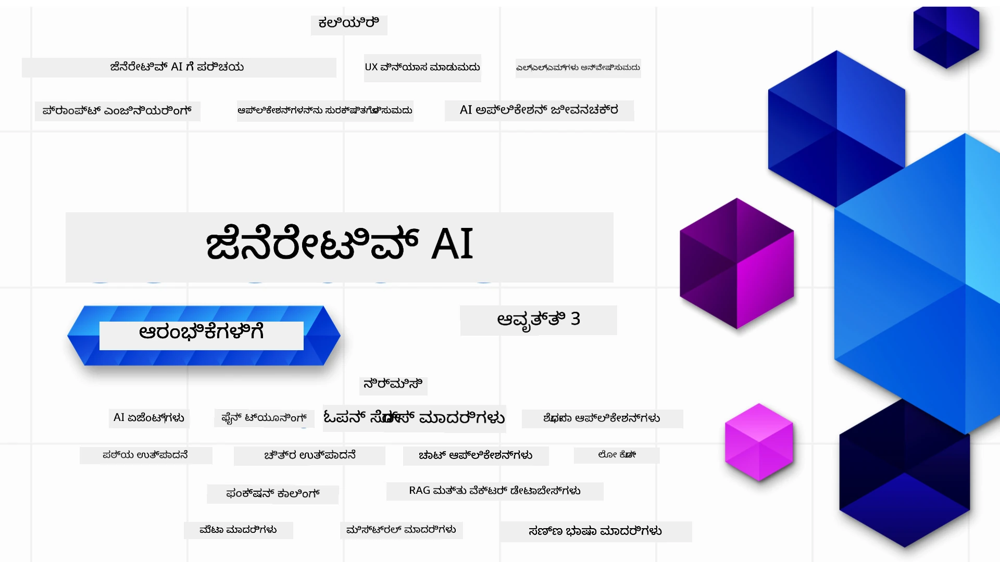

### ಜನರೇಟಿವ್ ಏ ಐ ಅಪ್ಲಿಕೇಶನ್‌ಗಳನ್ನು ನಿರ್ಮಿಸಲು ಬೇಕಾಗುವ ಎಲ್ಲವನ್ನೂ ಕಲಿಸುವ 21 ಪಾಠಗಳು

[](https://github.com/microsoft/Generative-AI-For-Beginners/blob/master/LICENSE?WT.mc_id=academic-105485-koreyst)
[](https://GitHub.com/microsoft/Generative-AI-For-Beginners/graphs/contributors/?WT.mc_id=academic-105485-koreyst)
[](https://GitHub.com/microsoft/Generative-AI-For-Beginners/issues/?WT.mc_id=academic-105485-koreyst)
[](https://GitHub.com/microsoft/Generative-AI-For-Beginners/pulls/?WT.mc_id=academic-105485-koreyst)
[](http://makeapullrequest.com?WT.mc_id=academic-105485-koreyst)

[](https://GitHub.com/microsoft/Generative-AI-For-Beginners/watchers/?WT.mc_id=academic-105485-koreyst)
[](https://GitHub.com/microsoft/Generative-AI-For-Beginners/network/?WT.mc_id=academic-105485-koreyst)
[](https://GitHub.com/microsoft/Generative-AI-For-Beginners/stargazers/?WT.mc_id=academic-105485-koreyst)

[](https://discord.gg/nTYy5BXMWG)

### 🌐 ಬಹುಭಾಷಾ ಬೆಂಬಲ

#### ಗಿಥಬ್ ಕ್ರಿಯೆ ಮೂಲಕ (ಸ್ವಯಂಚಾಲಿತ ಮತ್ತು ಸದಾ ನವೀಕೃತ)

<!-- CO-OP TRANSLATOR LANGUAGES TABLE START -->
[Arabic](../ar/README.md) | [Bengali](../bn/README.md) | [Bulgarian](../bg/README.md) | [Burmese (Myanmar)](../my/README.md) | [Chinese (Simplified)](../zh-CN/README.md) | [Chinese (Traditional, Hong Kong)](../zh-HK/README.md) | [Chinese (Traditional, Macau)](../zh-MO/README.md) | [Chinese (Traditional, Taiwan)](../zh-TW/README.md) | [Croatian](../hr/README.md) | [Czech](../cs/README.md) | [Danish](../da/README.md) | [Dutch](../nl/README.md) | [Estonian](../et/README.md) | [Finnish](../fi/README.md) | [French](../fr/README.md) | [German](../de/README.md) | [Greek](../el/README.md) | [Hebrew](../he/README.md) | [Hindi](../hi/README.md) | [Hungarian](../hu/README.md) | [Indonesian](../id/README.md) | [Italian](../it/README.md) | [Japanese](../ja/README.md) | [Kannada](./README.md) | [Korean](../ko/README.md) | [Lithuanian](../lt/README.md) | [Malay](../ms/README.md) | [Malayalam](../ml/README.md) | [Marathi](../mr/README.md) | [Nepali](../ne/README.md) | [Nigerian Pidgin](../pcm/README.md) | [Norwegian](../no/README.md) | [Persian (Farsi)](../fa/README.md) | [Polish](../pl/README.md) | [Portuguese (Brazil)](../pt-BR/README.md) | [Portuguese (Portugal)](../pt-PT/README.md) | [Punjabi (Gurmukhi)](../pa/README.md) | [Romanian](../ro/README.md) | [Russian](../ru/README.md) | [Serbian (Cyrillic)](../sr/README.md) | [Slovak](../sk/README.md) | [Slovenian](../sl/README.md) | [Spanish](../es/README.md) | [Swahili](../sw/README.md) | [Swedish](../sv/README.md) | [Tagalog (Filipino)](../tl/README.md) | [Tamil](../ta/README.md) | [Telugu](../te/README.md) | [Thai](../th/README.md) | [Turkish](../tr/README.md) | [Ukrainian](../uk/README.md) | [Urdu](../ur/README.md) | [Vietnamese](../vi/README.md)

> **ಸ್ಥಳೀಯವಾಗಿಯೇ ಕ್ಲೋನ್ ಮಾಡಬೇಕೆ?**

> ಈ ರೆಪೊ ಜಾಗತಿಕವಾಗಿ 50+ ಭಾಷಾ ಅನುವಾದಗಳನ್ನು ಹೊಂದಿದೆ, ಇದು ಡೌನ್‌ಲೋಡ್ ಗಾತ್ರವನ್ನು ಹೆಚ್ಚು ಮಾಡುತ್ತದೆ. ಅನುವಾದಗಳಿಲ್ಲದೆ ಕ್ಲೋನಿಂಗ್ ಮಾಡಲು, ದಯವಿಟ್ಟು ಸಪರ್ಗೆ_checkout ಬಳಸಿ:
> ```bash
> git clone --filter=blob:none --sparse https://github.com/microsoft/generative-ai-for-beginners.git
> cd generative-ai-for-beginners
> git sparse-checkout set --no-cone '/*' '!translations' '!translated_images'
> ```
> ಇದರಿಂದ ನಿಮ್ಮಿಗೆ ಬೇಕಾದ ಎಲ್ಲವನ್ನೂMuch ವೇಗವಾಗಿ ಡೌನ್‌ಲೋಡ್ ಮಾಡಬಹುದು.
<!-- CO-OP TRANSLATOR LANGUAGES TABLE END -->

# ಪ್ರಾರಂಭಿಕರಿಗಾಗಿ ಜನರೇಟಿವ್ ಏ ಐ (ಆವೃತ್ತಿ 3) - ಒಂದು ಕೋರ್ಸ್

Microsoft ಕ್ಲೌಡ್ ಅವೊಕೇಟ್ಸ್‌ಗಳ 21 ಪಾಠಗಳ ಸಮಗ್ರ ಕೋರ್ಸ್‌ ಮೂಲಕ ಜನರೇಟಿವ್ ಏಐ ಅಪ್ಲಿಕೇಶನ್‌ಗಳ ನಿರ್ಮಾಣದ ಮೂಲಭೂತರನ್ನು ಕಲಿಯಿರಿ.

## 🌱 ಪ್ರಾರಂಭಿಸುವುದು

ಈ ಕೋರ್ಸ್‌ನಲ್ಲಿ 21 ಪಾಠಗಳಿವೆ. ಪ್ರತಿಯೊಂದು ಪಾಠವು ತನ್ನದೇ ವಿಷಯವನ್ನು ಒಳಗೊಂಡಿದೆ, ಆದ್ದರಿಂದ ನೀವು ಇಚ್ಛಿಸುವ ಕಡೆ ಪ್ರಾರಂಭಿಸಿ!

ಪಾಠಗಳು "ಕಲಿಯಿರಿ" ಅಥವಾ "ನಿರ್ಮಿಸಿ" ಎಂದು ಗುರುತಿಸಲಾಗಿವೆ; "ಕಲಿಯಿರಿ" ಪಾಠಗಳು ಜನರೇಟಿವ್ ಏಐ ಅವಧಿಯನ್ನು ವಿವರಣೆ ಮಾಡುತ್ತವೆ, ಹಾಗೂ "ನಿರ್ಮಿಸಿ" ಪಾಠಗಳು ಸಂಕಲ್ಪ ಮತ್ತು ಕೋಡ್ ಉದಾಹರಣೆಗಳನ್ನು ಪೈಥಾನ್ ಮತ್ತು ಟೈಪ್ಸ್ಕ್ರಿಪ್ಟ್ ನಲ್ಲಿ ವಿವರಿಸುತ್ತವೆ.

.NET ಅಭಿವೃದ್ಧಿಪಡಿಸುವವರಿಗಾಗಿ [Generative AI for Beginners (.NET Edition)](https://github.com/microsoft/Generative-AI-for-beginners-dotnet?WT.mc_id=academic-105485-koreyst) ಪರಿಶೀಲಿಸಿ!

ಪ್ರತಿಯೊಂದು ಪಾಠವೂ "ಕಲಿಕೆ ಮುಂದುವರೆಸಿ" ವಿಭಾಗವನ್ನು ಹೊಂದಿದೆ, ಹೆಚ್ಚುವರಿ ಕಲಿಕೆಯ ಸಾಧನಗಳೊಂದಿಗೆ.

## ನಿಮಗೆ ಬೇಕಾಗುವುದು
### ಈ ಕೋರ್ಸ್‌ನ ಕೋಡ್ ಅನ್ನು ನಡೆಸಲು, ನೀವು ಈವುಗಳಲ್ಲಿ ಯಾವುದಾದರೂ ಬಳಸಬಹುದು: 
 - [Azure OpenAI ಸೇವೆ](https://aka.ms/genai-beginners/azure-open-ai?WT.mc_id=academic-105485-koreyst) - **ಪಾಠಗಳು:** "aoai-assignment"
 - [GitHub ಮಾರ್ಕೆಟ್‌ಪ್ಲೇಸ್ ಮಾದರಿ ಕ್ಯಾಟಲಾಗ್](https://aka.ms/genai-beginners/gh-models?WT.mc_id=academic-105485-koreyst) - **ಪಾಠಗಳು:** "githubmodels"
 - [OpenAI API](https://aka.ms/genai-beginners/open-ai?WT.mc_id=academic-105485-koreyst) - **ಪಾಠಗಳು:** "oai-assignment" 
   
- Python ಅಥವಾ TypeScript ಯ ಪ್ರಾಥಮಿಕ ಜ್ಞಾನ ಸಹಾಯಕವಾಗಿದೆ - \*ಗೊಪ್ಪಾದ ಪ್ರಾರಂಭಿಕರಿಗಾಗಿ ಈ [Python](https://aka.ms/genai-beginners/python?WT.mc_id=academic-105485-koreyst) ಮತ್ತು [TypeScript](https://aka.ms/genai-beginners/typescript?WT.mc_id=academic-105485-koreyst) ಕೋರ್ಸ್‌ಗಳನ್ನು ನೋಡಿ
- ನಿಮ್ಮ GitHub ಖಾತೆಗೆ ಈ ಸಂಪೂರ್ಣ ರೆಪೊವನ್ನು [Fork ಮಾಡಲು GitHub ಖಾತೆಯು ಬೇಕು](https://aka.ms/genai-beginners/github?WT.mc_id=academic-105485-koreyst)

ನಾವು ನಿಮ್ಮ ಡೆವಲಪ್‌ಮೆಂಟ್ ಪರಿಸರವನ್ನು ಹೊಂದಿಸಲು ಸಹಾಯ ಮಾಡಲು **[ಕೋರ್ಸ್ ಸೆಟ್ ಅಪ್](./00-course-setup/README.md?WT.mc_id=academic-105485-koreyst)** ಪಾಠವನ್ನು ರಚಿಸಿದ್ದೇವೆ.

ಮುಂದೆ ಸುಲಭವಾಗಿ ಹುಡುಕಲು ಈ ರೆಪೊವನ್ನು [ನಕ್ಷತ್ರ (🌟) ನೀಡಿ](https://docs.github.com/en/get-started/exploring-projects-on-github/saving-repositories-with-stars?WT.mc_id=academic-105485-koreyst) ಮರೆತಿರಬೇಡಿ.

## 🧠 ನಿಯೋಜಿಸಲು ಸಿದ್ಧರಾ?

ನೀವು ಇನ್ನಷ್ಟು ಪ್ರಗತಿ ಹೊಂದಿದ ಕೋಡ್ ಉದಾಹರಣೆಗಳಿಗಾಗಿ  [ಜನರೇಟಿವ್ ಏಐ ಕೋಡ್ ಉದಾಹರಣೆಗಳ ಸಂಗ್ರಹ](https://aka.ms/genai-beg-code?WT.mc_id=academic-105485-koreyst) ಅನ್ನು ಪೈಥಾನ್ ಮತ್ತು ಟೈಪ್ಸ್ಕ್ರಿಪ್ಟ್ ಎರಡರಲ್ಲಿ ನೋಡಿ.

## 🗣️ ಇತರ ಕಲಿಯುವವರಿಗೆ ಭೇಟಿ ನೀಡಿ, ಬೆಂಬಲವನ್ನು ಪಡೆಯಿರಿ

ಈ ಕೋರ್ಸ್ ಕಲಿಯುತ್ತಿರುವ ಮತ್ತಿತರ ವಿದ್ಯಾರ್ಥಿಗಳೊಂದಿಗೆ ಭೇಟಿಯಾಗಿ ಜಾಲತಾಣ ಮಾಡಲು ನಮ್ಮ [ಅಧಿಕೃತ Azure AI Foundry Discord ಸರ್ವರ್](https://aka.ms/genai-discord?WT.mc_id=academic-105485-koreyst) ಸೇರಿ.

ನಮ್ಮ [Azure AI Foundry ಡೆವಲಪರ್ ಫೋರಂ](https://aka.ms/azureaifoundry/forum) ನಲ್ಲಿ GitHub ಮೇಲೆ ಪ್ರಶ್ನೆಗಳನ್ನೂ ಕೇಳಬಹುದು ಅಥವಾ ಉತ್ಪನ್ನ ಪ್ರತಿಕ್ರಿಯೆಯನ್ನು ಹಂಚಿಕೊಳ್ಳಬಹುದು.

## 🚀 ಸ್ಟಾರ್ಟಪ್ ನಿರ್ಮಿಸುತ್ತಿದ್ದೀರಾ?

ಇಂದೆ Azure ಕ್ರೆಡಿಟ್‌ಗಳನ್ನು ಬಳಸಿ ನಿರ್ಮಾಣ ಪ್ರಾರಂಭಿಸಲು [Microsoft for Startups](https://www.microsoft.com/startups) ನೋಡಿ.

## 🙏 ಸಹಾಯ ಮಾಡಬೇಕೆ?

ನಿಮ್ಮ ಬಳಿ ಯಾವುದೇ ಸಲಹೆಗಳು ಅಥವಾ ಸ್ಪೆಲ್ಲಿಂಗ್ ಅಥವಾ ಕೋಡ್ ದೋಷಗಳು ಕಂಡುಬಂದಿದ್ದರೆ [ಒಂದು ಸಮಸ್ಯೆ ಎತ್ತು](https://github.com/microsoft/generative-ai-for-beginners/issues?WT.mc_id=academic-105485-koreyst) ಅಥವಾ [ಪೂಲ್ ರಿಕ್ವೆಸ್ಟ್ ಸೃಷ್ಟಿಸಿ](https://github.com/microsoft/generative-ai-for-beginners/pulls?WT.mc_id=academic-105485-koreyst)

## 📂 ಪ್ರತಿ ಪಾಠದಲ್ಲಿ ಒಳಗೊಂಡಿದೆ:

- ವಿಷಯದ қысಿಮ ವೀಡಿಯೊ ಪರಿಚಯ
- README ನಲ್ಲಿ ಬರೆದ ಪಾಠ
- Azure OpenAI ಮತ್ತು OpenAI APIಗೆ ಬೆಂಬಲಕೊಡುವ ಪೈಥಾನ್ ಮತ್ತು ಟೈಪ್ಸ್ಕ್ರಿಪ್ಟ್ ಕೋಡ್ ಉದಾಹರಣೆಗಳು
- ನಿಮ್ಮ ಕಲಿಕೆಯನ್ನು ಮುಂದುವರಿಸಲು ಮೀಸಲು ಸಂಪನ್ಮೂಲಗಳಿಗೆ ಲಿಂक्स

## 🗃️ ಪಾಠಗಳು

| #   | **ಪಾಠ ಲಿಂಕ್**                                                                                                                              | **ವಿವರಣೆ**                                                                                 | **ವೀಡಿಯೊ**                                                                   | **ಹೆಚ್ಚಿನ ಕಲಿಕೆ**                                                             |
| --- | -------------------------------------------------------------------------------------------------------------------------------------------- | ----------------------------------------------------------------------------------------------- | --------------------------------------------------------------------------- | ------------------------------------------------------------------------------ |
| 00  | [ಕೋರ್ಸ್ ಸೆಟ್ ಅಪ್](./00-course-setup/README.md?WT.mc_id=academic-105485-koreyst)                                                                 | **ಕಲಿಯಿರಿ:** ನಿಮ್ಮ ಅಭಿವೃದ್ಧಿ ಪರಿಸರವನ್ನು ಹೇಗೆ ಹೊಂದಿಸಲು                                           | ವೀಡಿಯೊ ಬರುವುದೇ ಕಾದಿದೆ                                                                 | [עוד מידע](https://aka.ms/genai-collection?WT.mc_id=academic-105485-koreyst) |
| 01  | [ಜನರೇಟಿವ್ ಏ ಐ ಮತ್ತು LLMs ಗೆ ಪರಿಚಯ](./01-introduction-to-genai/README.md?WT.mc_id=academic-105485-koreyst)                              | **ಕಲಿಯಿರಿ:** ಜನರೇಟಿವ್ ಏ ಐ ಎಂಬುದು ಏನು ಮತ್ತು ಲಾರ್ಜ್ ಲ್ಯಾಂಗ್ವೇಜ್ ಮಾದರಿಗಳು (LLMs) ಹೇಗೆ ಕೆಲಸ ಮಾಡುತ್ತವೆ    | [ವೀಡಿಯೊ](https://aka.ms/gen-ai-lesson-1-gh?WT.mc_id=academic-105485-koreyst) | [עוד מידע](https://aka.ms/genai-collection?WT.mc_id=academic-105485-koreyst) |
| 02  | [ವಿವಿಧ LLM ಗಳ ಅನ್ವೇಷಣೆ ಮತ್ತು ಹೋಲಿಕೆ](./02-exploring-and-comparing-different-llms/README.md?WT.mc_id=academic-105485-koreyst)             | **ಕಲಿಯಿರಿ:** ನಿಮ್ಮ ಬಳಕೆಗೆ ಸೂಕ್ತ ಮಾದರಿಯನ್ನು ಹೇಗೆ ಆಯ್ಕೆ ಮಾಡುವುದು                                   | [ವೀಡಿಯೊ](https://aka.ms/gen-ai-lesson2-gh?WT.mc_id=academic-105485-koreyst)  | [עוד מידע](https://aka.ms/genai-collection?WT.mc_id=academic-105485-koreyst) |
| 03  | [ಜನರೇಟಿವ್ ಏಐ ಜವಾಬ್ದಾರಿತನದೊಂದಿಗೆ ಬಳಸುವುದು](./03-using-generative-ai-responsibly/README.md?WT.mc_id=academic-105485-koreyst)                           | **ಕಲಿಯಿರಿ:** ಜನರೇಟಿವ್ ಏಐ ಅಪ್ಲಿಕೇಶನ್‌ಗಳನ್ನು ಜವಾಬ್ದಾರಿ ಹೊಂದಿದಂತೆ ಹೇಗೆ ನಿರ್ಮಿಸುವುದು               | [ವೀಡಿಯೊ](https://aka.ms/gen-ai-lesson3-gh?WT.mc_id=academic-105485-koreyst)  | [עוד מידע](https://aka.ms/genai-collection?WT.mc_id=academic-105485-koreyst) |
| 04  | [ಪ್ರಾಂಪ್ಟ್ ಎಂಜಿನಿಯರಿಂಗ್ ಮೂಲತತ್ವಗಳನ್ನು ಅರ್ಥಮಾಡಿಕೊಳ್ಳುವುದು](./04-prompt-engineering-fundamentals/README.md?WT.mc_id=academic-105485-koreyst)             | **ನೆೆರಿತುಕೊಳ್ಳಿ:** ಪ್ರಾಯೋಗಿಕ ಪ್ರಾಂಪ್ಟ್ ಎಂಜಿನಿಯರಿಂಗ್ ಉತ್ತಮ ಆಚಾರ ಸಂಹಿತೆಗಳು                                         | [ವೀಡಿಯೊ](https://aka.ms/gen-ai-lesson4-gh?WT.mc_id=academic-105485-koreyst)  | [ಹೆಚ್ಚು ತಿಳಿದುಕೊಳ್ಳಿ](https://aka.ms/genai-collection?WT.mc_id=academic-105485-koreyst) |
| 05  | [ಅદ્યತನ ಪ್ರಾಂಪ್ಟ್‌ಗಳನ್ನು ರಚಿಸುವುದು](./05-advanced-prompts/README.md?WT.mc_id=academic-105485-koreyst)                                                | **ನೆೆರಿತುಕೊಳ್ಳಿ:** ನಿಮ್ಮ ಪ್ರಾಂಪ್ಟ್‌ಗಳ ಫಲಿತಾಂಶವನ್ನು ಸುಧಾರಿಸುವ ಪ್ರಾಂಪ್ಟ್ ಎಂಜಿನಿಯರಿಂಗ್ ತಂತ್ರಗಳನ್ನು ಹೇಗೆ ಅನ್ವಯಿಸುವುದು. | [ವೀಡಿಯೊ](https://aka.ms/gen-ai-lesson5-gh?WT.mc_id=academic-105485-koreyst)  | [ಹೆಚ್ಚು ತಿಳಿದುಕೊಳ್ಳಿ](https://aka.ms/genai-collection?WT.mc_id=academic-105485-koreyst) |
| 06  | [ಪಠ್ಯ ಉತ್ಪಾದನಾ ಅಪ್ಲಿಕೇಶನ್‌ಗಳನ್ನು ನಿರ್ಮಿಸುವುದು](./06-text-generation-apps/README.md?WT.mc_id=academic-105485-koreyst)                                | **ನಿರ್ಮಿಸಿ:** Azure OpenAI / OpenAI API ಬಳಸಿಕೊಂಡು ಪಠ್ಯ ಉತ್ಪಾದನಾ ಆ್ಯಪ್                                    | [ವೀಡಿಯೊ](https://aka.ms/gen-ai-lesson6-gh?WT.mc_id=academic-105485-koreyst)  | [ಹೆಚ್ಚು ತಿಳಿದುಕೊಳ್ಳಿ](https://aka.ms/genai-collection?WT.mc_id=academic-105485-koreyst) |
| 07  | [ಚಾಟ್ ಅಪ್ಲಿಕೇಶನ್‌ಗಳನ್ನು ನಿರ್ಮಿಸುವುದು](./07-building-chat-applications/README.md?WT.mc_id=academic-105485-koreyst)                                     | **ನಿರ್ಮಿಸಿ:** ಚಾಟ್ ಅಪ್ಲಿಕೇಶನ್‌ಗಳನ್ನು ಪರಿಣಾಮಕಾರಿಯಾಗಿ ನಿರ್ಮಿಸುವ ಮತ್ತು ಸಂಯೋಜಿಸುವ ತಂತ್ರಗಳು.                             | [ವೀಡಿಯೊ](https://aka.ms/gen-ai-lessons7-gh?WT.mc_id=academic-105485-koreyst) | [ಹೆಚ್ಚು ತಿಳಿದುಕೊಳ್ಳಿ](https://aka.ms/genai-collection?WT.mc_id=academic-105485-koreyst) |
| 08  | [ಸೆರ್ಚ್ ಅಪ್ಲಿಕೇಶನ್‌ಗಳು ವೆಕ್ಟರ್ ಡೇಟಾಬೇಸ್ಗಳನ್ನು ನಿರ್ಮಿಸುವುದು](./08-building-search-applications/README.md?WT.mc_id=academic-105485-koreyst)                        | **ನಿರ್ಮಿಸಿ:** ಡೇಟಾ ಹುಡುಕಲು ಎम्बೆಡ್ಡಿಂಗ್‌ಗಳನ್ನು ಬಳಸಿ ಸೆರ್ಚ್ ಅಪ್ಲಿಕೇಶನ್                                | [ವೀಡಿಯೊ](https://aka.ms/gen-ai-lesson8-gh?WT.mc_id=academic-105485-koreyst)  | [ಹೆಚ್ಚು ತಿಳಿದುಕೊಳ್ಳಿ](https://aka.ms/genai-collection?WT.mc_id=academic-105485-koreyst) |
| 09  | [ಇಮೇಜ್ ಉತ್ಪಾದನಾ ಅಪ್ಲಿಕೇಶನ್‌ಗಳನ್ನು ನಿರ್ಮಿಸುವುದು](./09-building-image-applications/README.md?WT.mc_id=academic-105485-koreyst)                        | **ನಿರ್ಮಿಸಿ:** ಚಿತ್ರ ಉತ್ಪಾದನಾ ಅಪ್ಲಿಕೇಶನ್                                                     | [ವೀಡಿಯೊ](https://aka.ms/gen-ai-lesson9-gh?WT.mc_id=academic-105485-koreyst)  | [ಹೆಚ್ಚು ತಿಳಿದುಕೊಳ್ಳಿ](https://aka.ms/genai-collection?WT.mc_id=academic-105485-koreyst) |
| 10  | [ಲೋ ಕೇಡ್ AI ಅಪ್ಲಿಕೇಶನ್‌ಗಳನ್ನು ನಿರ್ಮಿಸುವುದು](./10-building-low-code-ai-applications/README.md?WT.mc_id=academic-105485-koreyst)                       | **ನಿರ್ಮಿಸಿ:** ಲೋ ಕೇಡ್ ಉಪಕರಣಗಳನ್ನು ಬಳಸಿಕೊಂಡು ಜನರೇಟಿವ್ AI ಅಪ್ಲಿಕೇಶನ್                                   | [ವೀಡಿಯೊ](https://aka.ms/gen-ai-lesson10-gh?WT.mc_id=academic-105485-koreyst) | [ಹೆಚ್ಚು ತಿಳಿದುಕೊಳ್ಳಿ](https://aka.ms/genai-collection?WT.mc_id=academic-105485-koreyst) |
| 11  | [ಫಂಕ್ಷನ್ ಕಾಲಿಂಗ್ ಸಹಿತ ಬಾಹ್ಯ ಅಪ್ಲಿಕೇಶನ್‌ಗಳನ್ನು ಏಕಗೂಡಿಸುವುದು](./11-integrating-with-function-calling/README.md?WT.mc_id=academic-105485-koreyst) | **ನಿರ್ಮಿಸಿ:** ಫಂಕ್ಷನ್ ಕಾಲಿಂಗ್ ಏನು ಮತ್ತು ಅಪ್ಲಿಕೇಶನ್‌ಗಳಲ್ಲಿ ಇದನ್ನು ಬಳಸುವ ಕ್ರಮಗಳು                        | [ವೀಡಿಯೊ](https://aka.ms/gen-ai-lesson11-gh?WT.mc_id=academic-105485-koreyst) | [ಹೆಚ್ಚು ತಿಳಿದುಕೊಳ್ಳಿ](https://aka.ms/genai-collection?WT.mc_id=academic-105485-koreyst) |
| 12  | [AI ಅಪ್ಲಿಕೇಶನ್‌ಗಳಿಗೆ UX ವಿನ್ಯಾಸ ಮಾಡುವುದು](./12-designing-ux-for-ai-applications/README.md?WT.mc_id=academic-105485-koreyst)                         | **ನೆೆರಿತುಕೊಳ್ಳಿ:** ಜನರೇಟಿವ್ AI ಅಪ್ಲಿಕೇಶನ್‌ಗಳ ಅಭಿವೃದ್ಧಿ ವೇಳೆ UX ವಿನ್ಯಾಸ ಸಿದ್ಧಾಂತಗಳನ್ನು ಹೇಗೆ ಅನ್ವಯಿಸುವುದು     | [ವೀಡಿಯೊ](https://aka.ms/gen-ai-lesson12-gh?WT.mc_id=academic-105485-koreyst) | [ಹೆಚ್ಚು ತಿಳಿದುಕೊಳ್ಳಿ](https://aka.ms/genai-collection?WT.mc_id=academic-105485-koreyst) |
| 13  | [ನಿಮ್ಮ ಜನರೇಟಿವ್ AI ಅಪ್ಲಿಕೇಶನ್‌ಗಳನ್ನು ಸುರಕ್ಷಿತಗೊಳಿಸುವುದು](./13-securing-ai-applications/README.md?WT.mc_id=academic-105485-koreyst)                         | **ನೆೆರಿತುಕೊಳ್ಳಿ:** AI ವ್ಯವಸ್ಥೆಗಳಿಗೆ ಬರುವ ಅಪಾಯಗಳು ಮತ್ತು ಅವನ್ನು ಸುರಕ್ಷಿತಗೊಳಿಸುವ ವಿಧಾನಗಳು                  | [ವೀಡಿಯೊ](https://aka.ms/gen-ai-lesson13-gh?WT.mc_id=academic-105485-koreyst) | [ಹೆಚ್ಚು ತಿಳಿದುಕೊಳ್ಳಿ](https://aka.ms/genai-collection?WT.mc_id=academic-105485-koreyst) |
| 14  | [ಜನರೇಟಿವ್ AI ಅಪ್ಲಿಕೇಶನ್ ಲೈಫ್ಸೈಕಲ್](./14-the-generative-ai-application-lifecycle/README.md?WT.mc_id=academic-105485-koreyst)           | **ನೆೆರಿತುಕೊಳ್ಳಿ:** LLM ಲೈಫ್ಸೈಕಲ್ ಮತ್ತು LLMOps ನಿರ್ವಹಿಸಲು ಉಪಕರಣಗಳು ಮತ್ತು ಮಾಪಕಗಳು                  | [ವೀಡಿಯೊ](https://aka.ms/gen-ai-lesson14-gh?WT.mc_id=academic-105485-koreyst) | [ಹೆಚ್ಚು ತಿಳಿದುಕೊಳ್ಳಿ](https://aka.ms/genai-collection?WT.mc_id=academic-105485-koreyst) |
| 15  | [ರಿಟ್ರೀವಲ್ ಆಗ್ಮೆಂಟೆಡ್ ಜನರೇಶನ್ (RAG) ಮತ್ತು ವೆಕ್ಟರ್ ಡೇಟಾಬೇಸ್ಗಳು](./15-rag-and-vector-databases/README.md?WT.mc_id=academic-105485-koreyst)        | **ನಿರ್ಮಿಸಿ:** ವೆಕ್ಟರ್ ಡೇಟಾಬೇಸ್ಗಳಿಂದ ಎम्बೆಡ್ಡಿಂಗ್‌ಗಳನ್ನು ಹಿಂಪಡೆಯಲು RAG ಫ್ರೇಮ್‌ವರ್ಕ್ ಬಳಸುವ ಅಪ್ಲಿಕೇಶನ್   | [ವೀಡಿಯೊ](https://aka.ms/gen-ai-lesson15-gh?WT.mc_id=academic-105485-koreyst) | [ಹೆಚ್ಚು ತಿಳಿದುಕೊಳ್ಳಿ](https://aka.ms/genai-collection?WT.mc_id=academic-105485-koreyst) |
| 16  | [ತೆರೆದ ಮೂಲ ಮಾದರಿಗಳು ಮತ್ತು ಹಗ್ಗಿಂಗ್ ಫೇಸ್](./16-open-source-models/README.md?WT.mc_id=academic-105485-koreyst)                                    | **ನಿರ್ಮಿಸಿ:** ಹಗ್ಗಿಂಗ್ ಫೇಸ್‌ನಲ್ಲಿ ಲಭ್ಯವಿರುವ ತೆರೆಯ ಮೂಲ ಮಾದರಿಗಳನ್ನು ಬಳಸಿ ಅಪ್ಲಿಕೇಶನ್                 | [ವೀಡಿಯೊ](https://aka.ms/gen-ai-lesson16-gh?WT.mc_id=academic-105485-koreyst) | [ಹೆಚ್ಚು ತಿಳಿದುಕೊಳ್ಳಿ](https://aka.ms/genai-collection?WT.mc_id=academic-105485-koreyst) |
| 17  | [AI ಏಜೆಂಟ್ಗಳು](./17-ai-agents/README.md?WT.mc_id=academic-105485-koreyst)                                                                       | **ನಿರ್ಮಿಸಿ:** AI ಏಜೆಂಟ್ ಫ್ರೇಮ್‌ವರ್ಕ್ ಬಳಸಿಕೊಂಡು ಅಪ್ಲಿಕೇಶನ್                                      | [ವೀಡಿಯೊ](https://aka.ms/gen-ai-lesson17-gh?WT.mc_id=academic-105485-koreyst) | [ಹೆಚ್ಚು ತಿಳಿದುಕೊಳ್ಳಿ](https://aka.ms/genai-collection?WT.mc_id=academic-105485-koreyst) |
| 18  | [LLM‌ಗಳನ್ನು ಫೈನ್-ಟ್ಯೂನಿಂಗ್ ಮಾಡುವುದು](./18-fine-tuning/README.md?WT.mc_id=academic-105485-koreyst)                                                              | **ನೆೆರಿತುಕೊಳ್ಳಿ:** LLM‌ಗಳನ್ನು ಫೈನ್-ಟ್ಯೂನಿಂಗ್ ಮಾಡುವುದರ ಬಗ್ಗೆ ಯಾವುದು, ಯಾಕೆ ಮತ್ತು ಹೇಗೆ               | [ವೀಡಿಯೊ](https://aka.ms/gen-ai-lesson18-gh?WT.mc_id=academic-105485-koreyst) | [ಹೆಚ್ಚು ತಿಳಿದುಕೊಳ್ಳಿ](https://aka.ms/genai-collection?WT.mc_id=academic-105485-koreyst) |
| 19  | [SLM‌ಗಳೊಂದಿಗೆ ನಿರ್ಮಿಸುವುದು](./19-slm/README.md?WT.mc_id=academic-105485-koreyst)                                                              | **ನೆೆರಿತುಕೊಳ್ಳಿ:** ಸಣ್ಣ ಭಾಷಾ ಮಾದರಿಗಳೊಂದಿಗೆ ನಿರ್ಮಿಸುವ ಪ್ರಯೋಜನಗಳು                                           | ವೀಡಿಯೊ ಶೀಘ್ರವೇ ಬರುತ್ತಿದೆ | [ಹೆಚ್ಚು ತಿಳಿದುಕೊಳ್ಳಿ](https://aka.ms/genai-collection?WT.mc_id=academic-105485-koreyst) |
| 20  | [ಮಿಸ್ಟ್ರಲ್ ಮಾದರಿಗಳೊಂದಿಗೆ ನಿರ್ಮಿಸುವುದು](./20-mistral/README.md?WT.mc_id=academic-105485-koreyst)                                                              | **ನೆೆರಿತುಕೊಳ್ಳಿ:** ಮಿಸ್ಟ್ರಲ್ ಫ್ಯಾಮಿಲಿ ಮಾದರಿಗಳ ವೈಶಿಷ್ಟ್ಯಗಳು ಮತ್ತು ಭೇದಗಳು                                       | ವೀಡಿಯೊ ಶೀಘ್ರವೇ ಬರುತ್ತಿದೆ | [ಹೆಚ್ಚು ತಿಳಿದುಕೊಳ್ಳಿ](https://aka.ms/genai-collection?WT.mc_id=academic-105485-koreyst) |
| 21  | [ಮೆಟಾ ಮಾದರಿಗಳೊಂದಿಗೆ ನಿರ್ಮಿಸುವುದು](./21-meta/README.md?WT.mc_id=academic-105485-koreyst)                                                              | **ನೆೆರಿತುಕೊಳ್ಳಿ:** ಮೆಟಾ ಫ್ಯಾಮಿಲಿ ಮಾದರಿಗಳ ವೈಶಿಷ್ಟ್ಯಗಳು ಮತ್ತು ಭೇದಗಳು                                        | ವೀಡಿಯೊ ಶೀಘ್ರವೇ ಬರುತ್ತದೆ | [ಹೆಚ್ಚು ತಿಳಿದುಕೊಳ್ಳಿ](https://aka.ms/genai-collection?WT.mc_id=academic-105485-koreyst) |

### 🌟 ವಿಶೇಷ ಧನ್ಯವಾದಗಳು

GitHub ಕ್ರಿಯೆಗಳು ಮತ್ತು ವರ್ಕ್‌ಫ್ಲೋಗಳನ್ನು ಸೃಷ್ಟಿಸಿದಕ್ಕಾಗಿ [**ಜಾನ್ ಅಜೀಜ್**](https://www.linkedin.com/in/john0isaac/) ಅವರಿಗೆ ವಿಶೇಷ ಧನ್ಯವಾದಗಳು

ಪ್ರತಿಯೊಂದು ಪಾಠವನ್ನು ಉತ್ತಮಗೊಳಿಸಲು ಮತ್ತು ಕೋಡ್ ಅನುಭವವನ್ನು ಸುಧಾರಿಸಲು ಪ್ರಮುಖ ಕೊಡುಗೆಗಳನ್ನು ನೀಡಿದ [**ಬೆರ್ನ್‌ಹಾರ್ಡ್ ಮರ್ಕಲ್**](https://www.linkedin.com/in/bernhard-merkle-738b73/) ಅವರಿಗೆ ಧನ್ಯವಾದಗಳು. 

## 🎒 ಇತರೆ 코ರ್ಸ್‌ಗಳು

ನಮ್ಮ ತಂಡ ಇತರ ಕೋರ್ಸ್‌ಗಳನ್ನು ಉತ್ಪಾದಿಸುತ್ತದೆ! ನೋಡಿ:

<!-- CO-OP TRANSLATOR OTHER COURSES START -->
### ಲ್ಯಾಂಗ್‌ಚೇನ್
[](https://aka.ms/langchain4j-for-beginners)
[](https://aka.ms/langchainjs-for-beginners?WT.mc_id=m365-94501-dwahlin)
[](https://github.com/microsoft/langchain-for-beginners?WT.mc_id=m365-94501-dwahlin)
---

### ಅಜ್ಯೂರ್ / ಎಡ್ಜ್ / MCP / ಏಜೆಂಟ್ಗಳು
[](https://github.com/microsoft/AZD-for-beginners?WT.mc_id=academic-105485-koreyst)
[](https://github.com/microsoft/edgeai-for-beginners?WT.mc_id=academic-105485-koreyst)
[](https://github.com/microsoft/mcp-for-beginners?WT.mc_id=academic-105485-koreyst)
[](https://github.com/microsoft/ai-agents-for-beginners?WT.mc_id=academic-105485-koreyst)

---
 
### ಜನರೇಟಿವ್ AI ಸರಣಿ
[](https://github.com/microsoft/generative-ai-for-beginners?WT.mc_id=academic-105485-koreyst)
[-9333EA?style=for-the-badge&labelColor=E5E7EB&color=9333EA)](https://github.com/microsoft/Generative-AI-for-beginners-dotnet?WT.mc_id=academic-105485-koreyst)
[-C084FC?style=for-the-badge&labelColor=E5E7EB&color=C084FC)](https://github.com/microsoft/generative-ai-for-beginners-java?WT.mc_id=academic-105485-koreyst)
[-E879F9?style=for-the-badge&labelColor=E5E7EB&color=E879F9)](https://github.com/microsoft/generative-ai-with-javascript?WT.mc_id=academic-105485-koreyst)

---
 
### ಕೋರ್ ಲರ್ನಿಂಗ್
[](https://aka.ms/ml-beginners?WT.mc_id=academic-105485-koreyst)
[](https://aka.ms/datascience-beginners?WT.mc_id=academic-105485-koreyst)
[](https://aka.ms/ai-beginners?WT.mc_id=academic-105485-koreyst)
[](https://github.com/microsoft/Security-101?WT.mc_id=academic-96948-sayoung)
[](https://aka.ms/webdev-beginners?WT.mc_id=academic-105485-koreyst)
[](https://aka.ms/iot-beginners?WT.mc_id=academic-105485-koreyst)
[](https://github.com/microsoft/xr-development-for-beginners?WT.mc_id=academic-105485-koreyst)

---
 
### ಕೋಪೈಲಟ್ ಸರಣಿ
[](https://aka.ms/GitHubCopilotAI?WT.mc_id=academic-105485-koreyst)
[](https://github.com/microsoft/mastering-github-copilot-for-dotnet-csharp-developers?WT.mc_id=academic-105485-koreyst)
[](https://github.com/microsoft/CopilotAdventures?WT.mc_id=academic-105485-koreyst)
<!-- CO-OP TRANSLATOR OTHER COURSES END -->

## ಸಹಾಯ ಪಡೆಯುವುದು

ನೀವು ಅಡಚಣೆ ಆಗಿದ್ದೀರ ಅಥವಾ AI ಅಪ್ಲಿಕೇಶನ್ಗಳ ನಿರ್ಮಾಣದ ಬಗ್ಗೆ ಯಾವುದಾದರೂ ಪ್ರಶ್ನೆಗಳಿದ್ದರೆ, MCP ಬಗ್ಗೆ ಚರ್ಚೆಗಳಲ್ಲಿ ಸಹಪಾಠಿಗಳು ಮತ್ತು ಅನುಭವಿ ಅಭಿವೃದ್ಧಿಪಟುಗಳೊಂದಿಗೆ ಸೇರಿ. ಇದು ಸಹಾಯಕ ಸಮುದಾಯವಾಗಿದ್ದು, ಪ್ರಶ್ನೆಗಳು ಸ್ವಾಗತಾರ್ಹ ಮತ್ತು ಜ್ಞಾನವನ್ನು ಮುಕ್ತವಾಗಿ ಹಂಚಿಕೊಳ್ಳಲಾಗುತ್ತದೆ.

[](https://discord.gg/nTYy5BXMWG)

ನೀವು ಉತ್ಪನ್ನ ಪ್ರತಿಕ್ರಿಯೆ ಅಥವಾ ನಿರ್ಮಾಣ ವೇಳೆ ದೋಷಗಳನ್ನು ಕಂಡುಹಿಡಿದಿದ್ದರೆ ಭೇಟಿ ನೀಡಿ:

[](https://aka.ms/foundry/forum)

---

<!-- CO-OP TRANSLATOR DISCLAIMER START -->
**ತಪ್ಪು ವಿವರ**:  
ಈ ದಸ್ತಾವೇಜು [Co-op Translator](https://github.com/Azure/co-op-translator) ಎಂಬ ಏಐ ಅನುವಾದ ಸೇವೆಯನ್ನು ಬಳಸಿ ಅನುವದಿಸಲಾಗಿದೆ. ನಾವು ನಿಖರತೆಯನ್ನು ಸಾಧಿಸಲು ಪ್ರಯತ್ನಿಸುವುದಾದರೂ, ಸ್ವಯಂಚಾಲಿತ ಅನುವಾದಗಳಲ್ಲಿ ತೊಂದರೆಗಳು ಅಥವಾ ಅಶುದ್ಧತೆಗಳಿರಬಹುದು ಎಂಬುದನ್ನು ಗಮನದಲ್ಲಿಡಿ. ಮೂಲ ಭಾಷೆಯಲ್ಲಿ ಇರುವ ಮೂಲ ದಸ್ತಾವೇಜನ್ನು ಪ್ರಾಧಿಕಾರಿತ ಮೂಲ ಎಂದು ಪರಿಗಣಿಸಬೇಕು. ಪ್ರಮುಖ ಮಾಹಿತಿಗಾಗಿ, ವೃತ್ತಿಪರ ಮಾನವ ಅನುವಾದವನ್ನು ಶಿಫಾರಸು ಮಾಡಲಾಗುತ್ತದೆ. ಈ ಅನುವಾದದಿಂದ ಉಂಟಾಗುವ ಯಾವುದೇ ತಪ್ಪು ಮನಗೊಳತುಗಳು ಅಥವಾ ದುರ್ಬೋಧನೆಗಳಿಗೆ ನಾವು ಜವಾಬ್ದಾರರಾಗುವುದಿಲ್ಲ.
<!-- CO-OP TRANSLATOR DISCLAIMER END -->